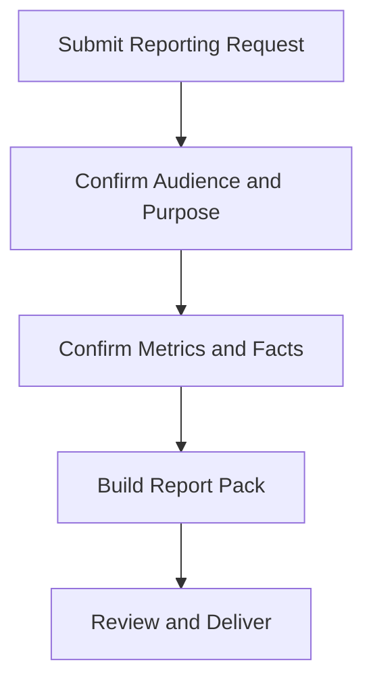

# Executive Reporting Request

**Audience**: SOC Manager, CISO Delegate, Business Owner, Executive Stakeholder
**Purpose**: Use this template to request a monthly, quarterly, or ad hoc executive report with clear audience, metrics, and decision needs.

## 1. Request Header

| Field | Value |
|:---|:---|
| **Request ID** | RPT-[YYYYMMDD]-[001] |
| **Requester** | |
| **Report Type** | ☐ Monthly · ☐ Quarterly · ☐ Incident-specific · ☐ Ad hoc |
| **Audience** | |
| **Due Date** | |

## 2. Reporting Objective

| Question | Answer |
|:---|:---|
| **Why is this report needed?** | |
| **What decisions should it support?** | |
| **What period does it cover?** | |
| **What sensitivity or TLP applies?** | |

## 3. Required Content

| Content Item | Required | Notes |
|:---|:---:|:---|
| Executive summary | ☐ | |
| KPI trend | ☐ | |
| Material incidents | ☐ | |
| Open risks or gaps | ☐ | |
| Funding or action request | ☐ | |

## 4. Review and Approval

| Role | Name | Decision | Date |
|:---|:---|:---:|:---|
| SOC Manager | | ☐ Reviewed | |
| CISO Delegate | | ☐ Approve · ☐ Revise | |
| Requesting Executive | | ☐ Confirm Scope | |

## Related Documents

-   [SOC Service Catalog](../06_Operations_Management/SOC_Service_Catalog.en.md)
-   [Monthly SOC Report](Monthly_SOC_Report.en.md)
-   [Quarterly Business Review](Quarterly_Business_Review.en.md)
-   [Executive Dashboard](Executive_Dashboard.en.md)

## References

-   [NIST Cybersecurity Framework 2.0](https://www.nist.gov/cyberframework)
-   [FIRST CSIRT Services Framework](https://www.first.org/standards/frameworks/csirts/FIRST_CSIRT_Services_Framework_v2.1)
