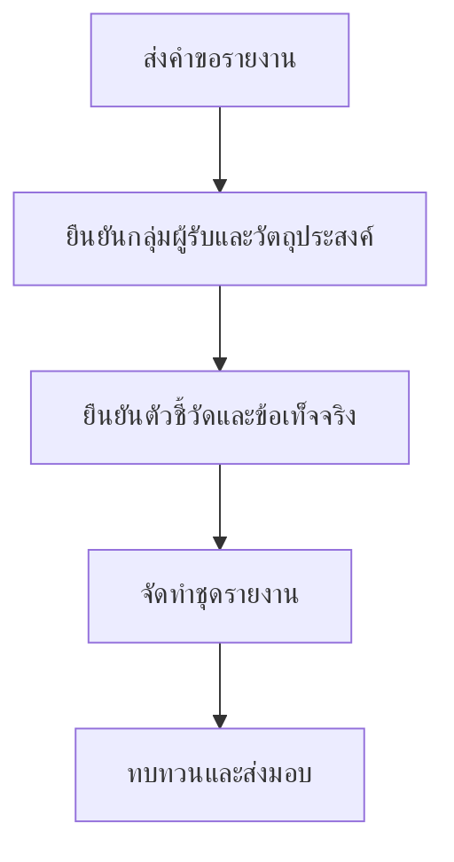

# แบบฟอร์มคำขอรายงานสำหรับผู้บริหาร

**กลุ่มเป้าหมาย**: SOC Manager, CISO Delegate, Business Owner, Executive Stakeholder
**วัตถุประสงค์**: ใช้แบบฟอร์มนี้เพื่อขอรายงานรายเดือน รายไตรมาส หรือรายงานเฉพาะกิจสำหรับผู้บริหาร โดยกำหนด audience, metrics, และ decision needs ให้ชัด

## 1. ส่วนหัวคำขอ

| Field | Value |
|:---|:---|
| **Request ID** | RPT-[YYYYMMDD]-[001] |
| **ผู้ร้องขอ** | |
| **ประเภทรายงาน** | ☐ รายเดือน · ☐ รายไตรมาส · ☐ เฉพาะ incident · ☐ เฉพาะกิจ |
| **กลุ่มผู้รับ** | |
| **วันครบกำหนด** | |

## 2. เป้าหมายของรายงาน

| Question | Answer |
|:---|:---|
| **เหตุใดจึงต้องมีรายงานนี้** | |
| **ต้องการให้รายงานนี้ช่วยรองรับการตัดสินใจใด** | |
| **ครอบคลุมช่วงเวลาใด** | |
| **มีระดับความอ่อนไหวหรือ TLP ระดับใด** | |

## 3. เนื้อหาที่ต้องมี

| รายการเนื้อหา | Required | Notes |
|:---|:---:|:---|
| บทสรุปผู้บริหาร | ☐ | |
| แนวโน้ม KPI | ☐ | |
| เหตุการณ์สำคัญ | ☐ | |
| ความเสี่ยงหรือช่องว่างที่ยังเปิดอยู่ | ☐ | |
| คำขอเรื่องงบประมาณหรือการดำเนินการ | ☐ | |

## 4. การทบทวนและการอนุมัติ

| Role | Name | Decision | Date |
|:---|:---|:---:|:---|
| SOC Manager | | ☐ Reviewed | |
| CISO Delegate | | ☐ Approve · ☐ Revise | |
| Requesting Executive | | ☐ Confirm Scope | |

## 5. เส้นทางส่งต่อใน Governance

-   [ ] หากรายงานนี้มีประเด็นเรื่องความเสี่ยงที่ยังเปิดอยู่ ให้เชื่อมกลับไป monthly governance review
-   [ ] หากรายงานนี้ต้องการการตัดสินใจระดับงบประมาณหรือการยอมรับความเสี่ยง ให้เชื่อมไป board quarterly decision pack หรือ quarterly risk acceptance review

## เอกสารที่เกี่ยวข้อง (Related Documents)

-   [SOC Service Catalog](../06_Operations_Management/SOC_Service_Catalog.th.md)
-   [Monthly SOC Report](Monthly_SOC_Report.th.md)
-   [Quarterly Business Review](Quarterly_Business_Review.th.md)
-   [Executive Dashboard](Executive_Dashboard.th.md)

## References

-   [NIST Cybersecurity Framework 2.0](https://www.nist.gov/cyberframework)
-   [FIRST CSIRT Services Framework](https://www.first.org/standards/frameworks/csirts/FIRST_CSIRT_Services_Framework_v2.1)
