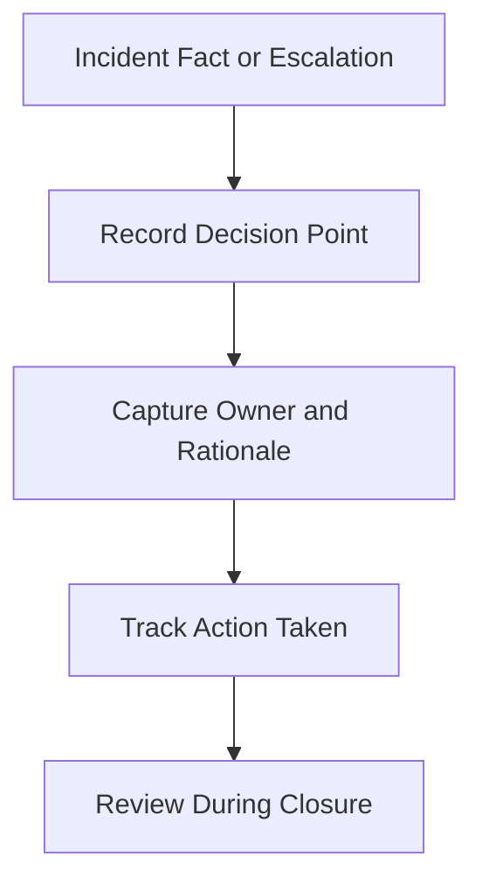

# Incident Decision Log

**Audience**: Incident Commander, SOC Manager, IR Engineer, CISO
**Purpose**: Use this template to record key incident decisions, who made them, what facts supported them, and what follow-up was required.

## 1. When to Use This Template

-   [ ] Use during Critical and High severity incidents.
-   [ ] Use when legal, privacy, service interruption, or executive notification decisions are required.
-   [ ] Use when containment or recovery tradeoffs must be reviewed later.

## 2. Incident Overview

| Field | Value |
|:---|:---|
| **Incident ID** | INC-[YYYYMMDD]-[001] |
| **Incident Type** | |
| **Severity** | ☐ Critical · ☐ High · ☐ Medium · ☐ Low |
| **Incident Commander** | |
| **Date Opened** | |

## 3. Decision Log

| Time (UTC) | Decision | Decision Owner | Facts Available | Risk / Tradeoff | Action Taken |
|:---|:---|:---|:---|:---|:---|
| | | | | | |
| | | | | | |
| | | | | | |

## 4. Mandatory Decision Points

-   [ ] Whether to contain immediately or continue observation.
-   [ ] Whether to isolate hosts, disable accounts, block traffic, or pause service.
-   [ ] Whether to notify executives, legal, privacy, customers, or regulators.
-   [ ] Whether to recover service before full root cause confidence.
-   [ ] Whether to restore, rollback, reconnect, or re-enable access before all remediation is complete.

## 5. Decision Authority Quick Reference

| Decision Type | Usual Approver | Escalate Further When |
|:---|:---|:---|
| **Immediate containment** | Tier 2 / Incident Commander | Business impact or evidence-destruction risk increases |
| **Service interruption / shutdown** | Business owner + CISO | Material revenue, safety, or regulatory impact exists |
| **Legal / privacy / regulator notification** | DPO / Legal / CISO | Notification scope is uncertain or multi-jurisdictional |
| **Customer / public communication** | Delegated executive after Legal + Communications review | Public pressure, media inquiry, or board visibility increases |
| **Restore / rollback / return-to-service** | Service owner + Incident Commander | Data consistency, customer impact, or rollback risk remains unclear |
| **Residual risk acceptance** | CISO + business owner | Risk exceeds management authority or remains High |

## 6. Minimum Evidence for a Decision

-   [ ] Facts are separated from assumptions.
-   [ ] Source of evidence is recorded.
-   [ ] Decision owner is named.
-   [ ] Follow-up validation is assigned if confidence is incomplete.

## 7. Evidence Hold / Retention Decisions

| Decision Type | Owner | Required Fact Pattern |
|:---|:---|:---|
| **Start legal hold** | Legal / DPO / CISO | Regulated data, board-level sensitivity, litigation risk, or law-enforcement involvement |
| **Move evidence to archive** | IR Lead / evidence custodian | Analysis complete, hash verified, retention basis confirmed |
| **Approve release or destruction** | Legal + evidence custodian | Hold cleared, retention period met, disposal authority confirmed |

## 8. Restoration / Rollback Decisions

| Decision Type | Owner | Evidence Gate | Follow-up Required |
|:---|:---|:---|:---|
| **Restore from backup / snapshot** | IT Ops + service owner | Restore source trusted, recovery point accepted, validation owner named | Enhanced monitoring and business validation |
| **Rollback release / configuration** | Service owner + change owner | Prior state verified, rollback window approved, security impact reviewed | Confirm vulnerability or defect is not reintroduced |
| **Reconnect service / host / integration** | Infrastructure owner + Incident Commander | Asset is clean, controls active, reconnect scope bounded | Watch for recurrence and confirm partner/service owner acceptance |
| **Return to production / re-enable business process** | Business owner + CISO for material cases | Service works as intended, residual risk accepted, rollback path retained | Review in closure report and next governance cycle if risk remains open |

## 9. Closure Review

| Question | Answer |
|:---|:---|
| **Which decision created the highest risk?** | |
| **Which decision most reduced impact?** | |
| **Was any decision made with incomplete data?** | |
| **What control or process change would improve future decisions?** | |

## Related Documents

-   [Incident Report Template](incident_report.en.md)
-   [IR Framework](../05_Incident_Response/Framework.en.md)
-   [SOC Communication SOP](../06_Operations_Management/SOC_Communication.en.md)
-   [Executive Dashboard](Executive_Dashboard.en.md)
-   [Escalation Matrix](../05_Incident_Response/Escalation_Matrix.en.md)

## References

-   [NIST SP 800-61 Rev. 2](https://csrc.nist.gov/publications/detail/sp/800-61/rev-2/final)
-   [FIRST CSIRT Services Framework](https://www.first.org/standards/frameworks/csirts/FIRST_CSIRT_Services_Framework_v2.1)
