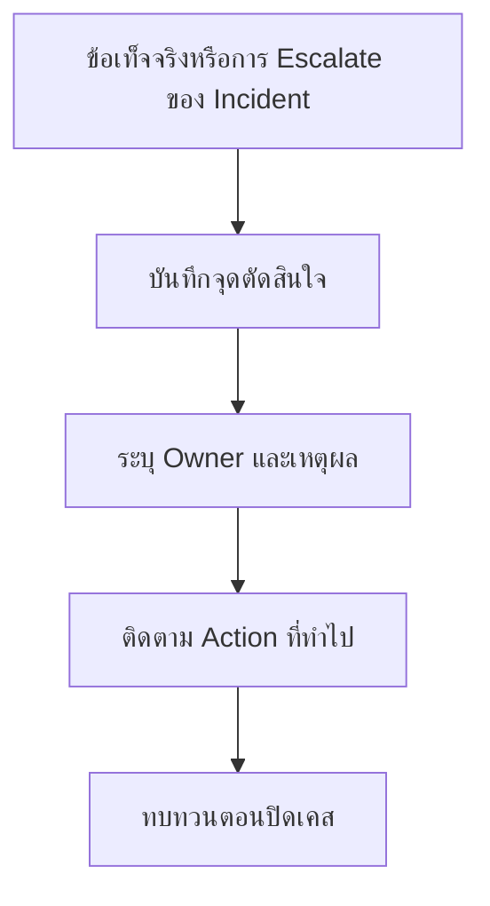

# บันทึกการตัดสินใจระหว่างเหตุการณ์

**กลุ่มเป้าหมาย**: Incident Commander, SOC Manager, IR Engineer, CISO
**วัตถุประสงค์**: ใช้แบบฟอร์มนี้เพื่อบันทึกการตัดสินใจสำคัญระหว่าง incident ว่าใครเป็นผู้ตัดสินใจ ใช้ข้อเท็จจริงอะไรสนับสนุน และมีงานติดตามอะไรต่อ

## 1. ใช้แบบฟอร์มนี้เมื่อใด

-   [ ] ใช้ระหว่าง incident ระดับ Critical และ High
-   [ ] ใช้เมื่อมีการตัดสินใจเรื่อง legal, privacy, service interruption, หรือ executive notification
-   [ ] ใช้เมื่อ containment หรือ recovery มี tradeoff ที่ต้องย้อนกลับมาทบทวนภายหลัง

## 2. ภาพรวมของเหตุการณ์

| รายการ | ค่า |
|:---|:---|
| **Incident ID** | INC-[YYYYMMDD]-[001] |
| **Incident Type** | |
| **Severity** | ☐ Critical · ☐ High · ☐ Medium · ☐ Low |
| **Incident Commander** | |
| **วันที่เปิดเคส** | |

## 3. บันทึกการตัดสินใจ

| เวลา (UTC) | การตัดสินใจ | ผู้ตัดสินใจ | ข้อเท็จจริงที่มี | ความเสี่ยง / Tradeoff | การดำเนินการ |
|:---|:---|:---|:---|:---|:---|
| | | | | | |
| | | | | | |
| | | | | | |

## 4. จุดตัดสินใจที่ต้องมีอย่างน้อย

-   [ ] จะ contain ทันทีหรือเฝ้าดูต่อ
-   [ ] จะ isolate host, disable account, block traffic, หรือ pause service หรือไม่
-   [ ] จะ notify executives, legal, privacy, customers, หรือ regulators หรือไม่
-   [ ] จะ recover service ก่อนมี root cause confidence ครบหรือไม่
-   [ ] จะ restore, rollback, reconnect, หรือ re-enable access ก่อน remediation ครบหรือไม่

## 5. ตารางอ้างอิงอำนาจการตัดสินใจแบบย่อ

| ประเภทการตัดสินใจ | ผู้อนุมัติโดยทั่วไป | ต้องยกระดับต่อเมื่อ |
|:---|:---|:---|
| **containment ทันที** | Tier 2 / Incident Commander | ผลกระทบธุรกิจหรือความเสี่ยงต่อหลักฐานเพิ่มขึ้น |
| **หยุดบริการ / shutdown** | Business owner + CISO | มีผลกระทบด้านรายได้ ความปลอดภัย หรือ regulator อย่างมีนัยสำคัญ |
| **แจ้ง legal / privacy / regulator** | DPO / Legal / CISO | ขอบเขตการแจ้งยังไม่ชัด หรือมีหลาย jurisdiction |
| **สื่อสารกับลูกค้าหรือสาธารณะ** | ผู้บริหารที่ได้รับมอบหมายหลัง Legal + Communications review | มีแรงกดดันจากสาธารณะ สื่อสอบถาม หรือ board visibility เพิ่มขึ้น |
| **restore / rollback / return-to-service** | service owner + Incident Commander | ความเสี่ยงเรื่อง data consistency, customer impact, หรือ rollback risk ยังไม่ชัด |
| **ยอมรับ residual risk** | CISO + business owner | ความเสี่ยงเกินอำนาจ management หรือยังคงอยู่ระดับ High |

## 6. หลักฐานขั้นต่ำสำหรับการตัดสินใจ

-   [ ] แยก facts ออกจาก assumptions ชัดเจน
-   [ ] บันทึก source ของ evidence
-   [ ] ระบุ decision owner
-   [ ] ถ้ายังมีความไม่แน่ชัด ต้องกำหนด owner สำหรับ follow-up validation

## 7. การตัดสินใจเรื่อง Evidence Hold / Retention

| ประเภทการตัดสินใจ | ผู้รับผิดชอบ | รูปแบบข้อเท็จจริงที่ต้องมี |
|:---|:---|:---|
| **เริ่ม legal hold** | Legal / DPO / CISO | มี regulated data, ความอ่อนไหวระดับ board, ความเสี่ยงต่อข้อพิพาท, หรือมี law-enforcement involvement |
| **ย้ายหลักฐานเข้า archive** | IR Lead / evidence custodian | วิเคราะห์เสร็จแล้ว hash verified และยืนยัน basis ของ retention แล้ว |
| **อนุมัติ release หรือ destruction** | Legal + evidence custodian | hold ถูกปลดแล้ว ครบระยะ retention และยืนยัน authority สำหรับการทำลาย |

## 8. การตัดสินใจเรื่อง Restore / Rollback

| ประเภทการตัดสินใจ | ผู้รับผิดชอบ | evidence gate | งานติดตามที่ต้องมี |
|:---|:---|:---|:---|
| **restore จาก backup / snapshot** | IT Ops + service owner | แหล่ง restore เชื่อถือได้, ยอมรับ recovery point แล้ว, และระบุ owner ของการตรวจสอบไว้แล้ว | enhanced monitoring และ business validation |
| **rollback release / configuration** | service owner + change owner | state ก่อนหน้าผ่านการยืนยัน, อนุมัติ rollback window แล้ว, และ review security impact แล้ว | ยืนยันว่าไม่ได้พาช่องโหว่หรือ defect เดิมกลับมา |
| **reconnect service / host / integration** | infrastructure owner + Incident Commander | asset สะอาด, control ทำงานอยู่, และจำกัดขอบเขตการ reconnect แล้ว | เฝ้าดูการเกิดซ้ำและยืนยันการยอมรับจาก partner/service owner |
| **return to production / re-enable business process** | business owner + CISO สำหรับเคส material | ระบบทำงานตามที่ต้องการ, ยอมรับ residual risk แล้ว, และยังมี rollback path | ทบทวนในรายงานปิดเคสและ governance cycle ถัดไปถ้าความเสี่ยงยังเปิดอยู่ |

## 9. การทบทวนตอนปิดเคส

| คำถาม | คำตอบ |
|:---|:---|
| **การตัดสินใจใดสร้างความเสี่ยงสูงสุด** | |
| **การตัดสินใจใดช่วยลดผลกระทบได้มากที่สุด** | |
| **มีการตัดสินใจใดที่ทำไปทั้งที่ข้อมูลยังไม่ครบหรือไม่** | |
| **ควรปรับ control หรือ process อะไรเพื่อให้ตัดสินใจได้ดีขึ้นในครั้งถัดไป** | |

## เอกสารที่เกี่ยวข้อง (Related Documents)

-   [เทมเพลตรายงาน Incident](incident_report.th.md)
-   [กรอบการทำงาน Incident Response](../05_Incident_Response/Framework.th.md)
-   [แนวทางการสื่อสารของ SOC](../06_Operations_Management/SOC_Communication.th.md)
-   [แดชบอร์ดผู้บริหาร](Executive_Dashboard.th.md)
-   [ตารางการ Escalate](../05_Incident_Response/Escalation_Matrix.th.md)

## References

-   [NIST SP 800-61 Rev. 2](https://csrc.nist.gov/publications/detail/sp/800-61/rev-2/final)
-   [FIRST CSIRT Services Framework](https://www.first.org/standards/frameworks/csirts/FIRST_CSIRT_Services_Framework_v2.1)
