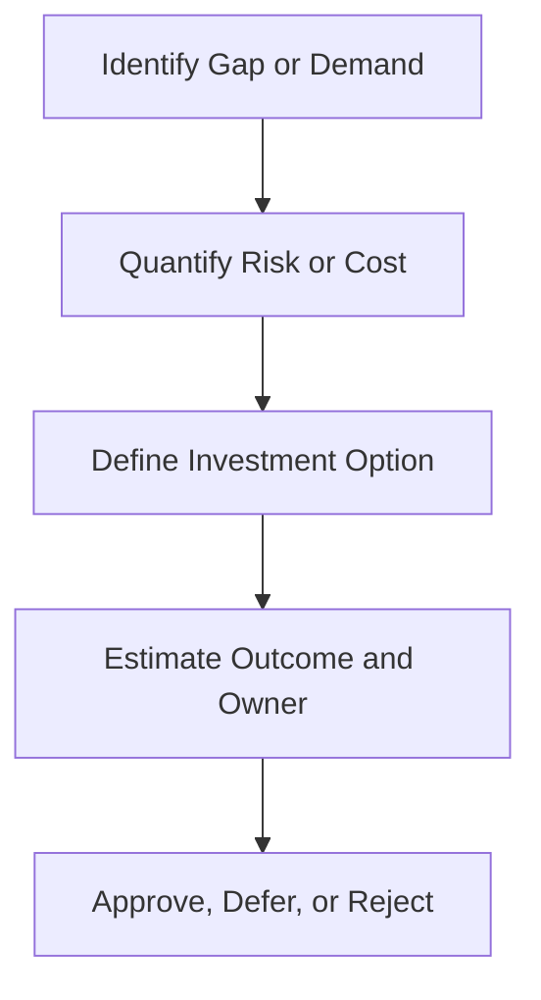

# Security Investment Justification Template

**Audience**: CISO, SOC Manager, Finance Partner, Security Owner
**Purpose**: Use this template to justify security spending based on operational gaps, measurable risk, and expected business outcomes.

## 1. When to Use This Template

-   [ ] Use when requesting new tooling, services, headcount, or engineering investment.
-   [ ] Use when recurring incidents or SLA failure indicate a structural gap.
-   [ ] Use during annual budget planning or post-incident remediation planning.

## 2. Request Summary

| Field | Value |
|:---|:---|
| **Request ID** | INV-[YYYYMMDD]-[001] |
| **Requester** | |
| **Investment Type** | ☐ Tooling · ☐ Service · ☐ Headcount · ☐ Training · ☐ Other |
| **Amount Requested** | |
| **Period** | |
| **Business Sponsor** | |

## 3. Problem Statement

| Question | Answer |
|:---|:---|
| **What gap exists today?** | |
| **What incidents, delays, or audit findings show this gap?** | |
| **What happens if no investment is made?** | |
| **Which business services are affected?** | |

## 4. Expected Outcome

| Outcome | Target | Measurement |
|:---|:---|:---|
| Reduced incident impact | | |
| Faster detection or response | | |
| Coverage improvement | | |
| Compliance improvement | | |
| Analyst workload reduction | | |

## 5. Options Analysis

| Option | Cost | Benefit | Constraint | Recommendation |
|:---|:---|:---|:---|:---|
| Do nothing | | | | |
| Minimal investment | | | | |
| Preferred investment | | | | |

## 6. Decision Inputs

-   [ ] Confirm the operational demand is backed by metrics, incidents, or audit evidence.
-   [ ] Confirm at least one lower-cost option was considered.
-   [ ] Confirm owner, implementation plan, and success metric are defined.
-   [ ] Confirm the request is tied to a business risk, service dependency, or compliance requirement.

## 7. Approval

| Role | Name | Decision | Date |
|:---|:---|:---:|:---|
| SOC Manager | | ☐ Support · ☐ Do Not Support | |
| Security Owner | | ☐ Reviewed | |
| Finance Partner | | ☐ Reviewed | |
| CISO / Executive Sponsor | | ☐ Approve · ☐ Reject · ☐ Defer | |

## 8. Post-Approval Tracking

| Action | Owner | Due Date | Status |
|:---|:---|:---|:---:|
| Procurement or staffing initiated | | | ☐ |
| Success metric baseline captured | | | ☐ |
| 30/60/90-day review scheduled | | | ☐ |
| Outcome reported to leadership | | | ☐ |

## Related Documents

-   [Monthly SOC Report](Monthly_SOC_Report.en.md)
-   [Executive Dashboard](Executive_Dashboard.en.md)
-   [SOC Capacity Planning](../06_Operations_Management/SOC_Capacity_Planning.en.md)
-   [Vendor Evaluation](../06_Operations_Management/Vendor_Evaluation.en.md)

## References

-   [NIST Cybersecurity Framework 2.0](https://www.nist.gov/cyberframework)
-   [SOC-CMM](https://www.soc-cmm.com/)
