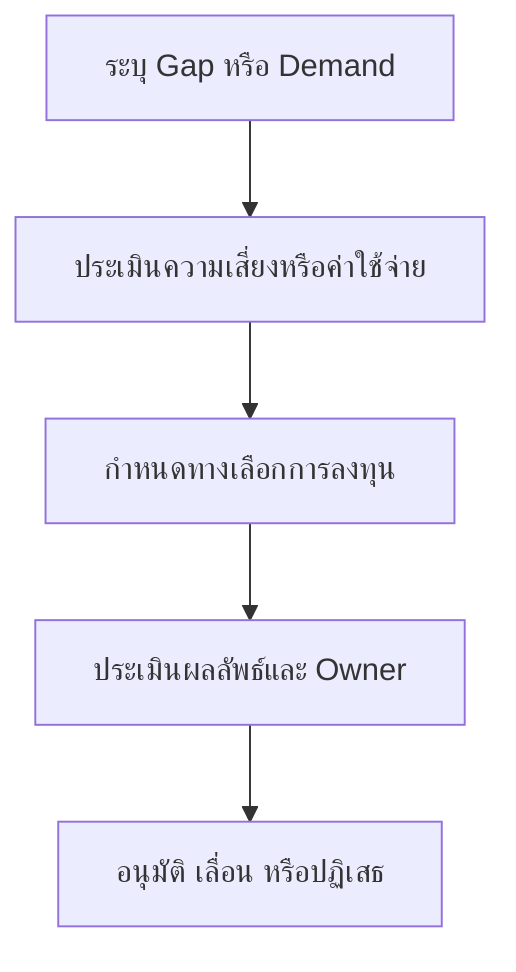

# แบบฟอร์มประกอบการอนุมัติการลงทุนด้านความปลอดภัย

**กลุ่มเป้าหมาย**: CISO, SOC Manager, Finance Partner, Security Owner
**วัตถุประสงค์**: ใช้แบบฟอร์มนี้เพื่อขออนุมัติการลงทุนด้านความปลอดภัยโดยอิงจากช่องว่างในการปฏิบัติงาน ความเสี่ยงที่วัดได้ และผลลัพธ์ทางธุรกิจที่คาดหวัง

## 1. ใช้แบบฟอร์มนี้เมื่อใด

-   [ ] ใช้เมื่อขอ tooling, service, headcount, หรือการลงทุนด้านวิศวกรรม
-   [ ] ใช้เมื่อ incident ที่เกิดซ้ำหรือ SLA failure บ่งชี้ว่ามี structural gap
-   [ ] ใช้ระหว่าง annual budget planning หรือ post-incident remediation planning

## 2. สรุปคำขอ

| Field | Value |
|:---|:---|
| **Request ID** | INV-[YYYYMMDD]-[001] |
| **ผู้ร้องขอ** | |
| **ประเภทการลงทุน** | ☐ Tooling · ☐ Service · ☐ Headcount · ☐ Training · ☐ Other |
| **วงเงินที่ขอ** | |
| **ช่วงเวลา** | |
| **Business Sponsor** | |

## 3. คำอธิบายปัญหา

| Question | Answer |
|:---|:---|
| **ปัจจุบันมีช่องว่างอะไร** | |
| **มี incident, delay, หรือ audit finding อะไรที่สะท้อนช่องว่างนี้** | |
| **จะเกิดอะไรขึ้นถ้าไม่ลงทุน** | |
| **บริการทางธุรกิจใดได้รับผลกระทบ** | |

## 4. ผลลัพธ์ที่คาดหวัง

| Outcome | Target | Measurement |
|:---|:---|:---|
| Reduced incident impact | | |
| Faster detection or response | | |
| Coverage improvement | | |
| Compliance improvement | | |
| Analyst workload reduction | | |

## 5. การเปรียบเทียบทางเลือก

| Option | Cost | Benefit | Constraint | Recommendation |
|:---|:---|:---|:---|:---|
| Do nothing | | | | |
| Minimal investment | | | | |
| Preferred investment | | | | |

## 6. ข้อมูลที่ต้องใช้ประกอบการตัดสินใจ

-   [ ] ยืนยันว่า operational demand มี metrics, incidents, หรือ audit evidence รองรับ
-   [ ] ยืนยันว่ามีการพิจารณาทางเลือกที่ต้นทุนต่ำกว่าอย่างน้อยหนึ่งทาง
-   [ ] ยืนยันว่ามี owner, implementation plan, และ success metric แล้ว
-   [ ] ยืนยันว่าคำขอนี้ผูกกับ business risk, service dependency, หรือ compliance requirement

## 7. การอนุมัติ

| Role | Name | Decision | Date |
|:---|:---|:---:|:---|
| SOC Manager | | ☐ Support · ☐ Do Not Support | |
| Security Owner | | ☐ Reviewed | |
| Finance Partner | | ☐ Reviewed | |
| CISO / Executive Sponsor | | ☐ Approve · ☐ Reject · ☐ Defer | |

## 8. การติดตามหลังอนุมัติ

| Action | Owner | Due Date | Status |
|:---|:---|:---|:---:|
| เริ่ม procurement หรือกระบวนการจัดกำลังคนแล้ว | | | ☐ |
| เก็บ baseline ของ success metric แล้ว | | | ☐ |
| นัดทบทวน 30/60/90 วันแล้ว | | | ☐ |
| รายงานผลลัพธ์ให้ผู้บริหารแล้ว | | | ☐ |

## 9. เส้นทางส่งต่อใน Governance

-   [ ] ติดตามการลงทุนที่อนุมัติแล้วใน monthly governance review จนกว่าจะยืนยันผลลัพธ์ตามที่สัญญาไว้ได้
-   [ ] หากการลงทุนล่าช้าหรือไม่ลดความเสี่ยงได้ตามคาด ให้ส่งกลับไปยัง board หรือ executive review

## เอกสารที่เกี่ยวข้อง (Related Documents)

-   [Monthly SOC Report](Monthly_SOC_Report.th.md)
-   [Executive Dashboard](Executive_Dashboard.th.md)
-   [SOC Capacity Planning](../06_Operations_Management/SOC_Capacity_Planning.th.md)
-   [Vendor Evaluation](../06_Operations_Management/Vendor_Evaluation.th.md)
-   [Monthly Governance Review Pack](Monthly_Governance_Review_Pack.th.md)
-   [Board Quarterly Decision Pack](Board_Quarterly_Decision_Pack.th.md)

## References

-   [NIST Cybersecurity Framework 2.0](https://www.nist.gov/cyberframework)
-   [SOC-CMM](https://www.soc-cmm.com/)
