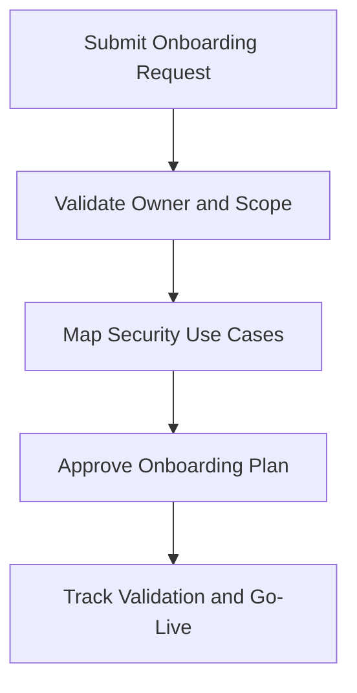

# Log Source Onboarding Request

**Audience**: Security Engineer, Platform Owner, SOC Manager, Data Owner
**Purpose**: Use this template to request onboarding of a new log source, validate ownership, and confirm security use cases before implementation.

## 1. Request Header

| Field | Value |
|:---|:---|
| **Request ID** | LOG-[YYYYMMDD]-[001] |
| **Requester** | |
| **System / Service Name** | |
| **Business Owner** | |
| **Technical Owner** | |
| **Requested Date** | |
| **Target Go-Live Date** | |

## 2. Source Details

| Question | Answer |
|:---|:---|
| **Source type** | ☐ Cloud · ☐ Endpoint · ☐ Network · ☐ Application · ☐ Identity · ☐ Other |
| **Log transport method** | |
| **Expected event volume** | |
| **Retention requirement** | |
| **Contains regulated or sensitive data** | ☐ Yes · ☐ No |

## 3. Security Use Cases

| Use Case | Priority | Required | Notes |
|:---|:---:|:---:|:---|
| Authentication monitoring | High/Med/Low | ☐ | |
| Admin activity monitoring | High/Med/Low | ☐ | |
| Incident investigation support | High/Med/Low | ☐ | |
| Compliance evidence | High/Med/Low | ☐ | |

## 4. Readiness Checks

-   [ ] Data owner confirmed
-   [ ] Legal / privacy review completed if needed
-   [ ] Required fields identified
-   [ ] Test sample available
-   [ ] Use case owner assigned

## 5. Minimum Acceptance Criteria

| Criterion | Status | Evidence |
|:---|:---:|:---|
| Log ingestion succeeds | ☐ | |
| Timestamp quality validated | ☐ | |
| Required fields present | ☐ | |
| Parsing or normalization validated | ☐ | |
| Alert or use case test completed | ☐ | |

## 6. Approval

| Role | Name | Decision | Date |
|:---|:---|:---:|:---|
| Technical Owner | | ☐ Approve · ☐ Reject | |
| Security Engineer | | ☐ Reviewed | |
| SOC Manager | | ☐ Approve · ☐ Reject | |

## Related Documents

-   [SOC Service Catalog](../06_Operations_Management/SOC_Service_Catalog.en.md)
-   [Log Source Onboarding](../06_Operations_Management/Log_Source_Onboarding.en.md)
-   [Log Source Matrix](../06_Operations_Management/Log_Source_Matrix.en.md)
-   [Integration Hub](../03_User_Guides/Integration_Hub.en.md)

## References

-   [NIST SP 800-92](https://csrc.nist.gov/publications/detail/sp/800-92/final)
-   [Open Cybersecurity Schema Framework](https://schema.ocsf.io/)
