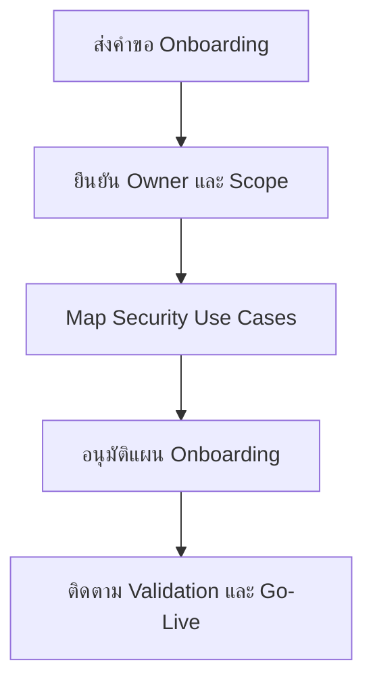

# แบบฟอร์มคำขอ Onboard Log Source

**กลุ่มเป้าหมาย**: Security Engineer, Platform Owner, SOC Manager, Data Owner
**วัตถุประสงค์**: ใช้แบบฟอร์มนี้เพื่อขอ onboard log source ใหม่ ยืนยัน ownership และยืนยัน security use cases ก่อนเริ่ม implement

## 1. ส่วนหัวคำขอ

| Field | Value |
|:---|:---|
| **Request ID** | LOG-[YYYYMMDD]-[001] |
| **ผู้ร้องขอ** | |
| **ชื่อระบบ / บริการ** | |
| **Business Owner** | |
| **Technical Owner** | |
| **วันที่ร้องขอ** | |
| **วันที่เป้าหมายสำหรับ Go-Live** | |

## 2. รายละเอียดของแหล่งข้อมูล

| Question | Answer |
|:---|:---|
| **ประเภทของแหล่งข้อมูล** | ☐ Cloud · ☐ Endpoint · ☐ Network · ☐ Application · ☐ Identity · ☐ Other |
| **วิธีส่ง Log** | |
| **ปริมาณ event ที่คาดหวัง** | |
| **ข้อกำหนด retention** | |
| **มี regulated หรือ sensitive data หรือไม่** | ☐ Yes · ☐ No |

## 3. Security Use Cases

| Use Case | Priority | Required | Notes |
|:---|:---:|:---:|:---|
| Authentication monitoring | High/Med/Low | ☐ | |
| Admin activity monitoring | High/Med/Low | ☐ | |
| Incident investigation support | High/Med/Low | ☐ | |
| Compliance evidence | High/Med/Low | ☐ | |

## 4. Readiness Checks

-   [ ] ยืนยัน data owner แล้ว
-   [ ] ผ่าน legal / privacy review แล้วถ้าจำเป็น
-   [ ] ระบุ required fields แล้ว
-   [ ] มี test sample พร้อม
-   [ ] มี use case owner ชัดเจน

## 5. เกณฑ์รับมอบขั้นต่ำ

| Criterion | Status | Evidence |
|:---|:---:|:---|
| Log ingestion สำเร็จ | ☐ | |
| ตรวจสอบ timestamp quality แล้ว | ☐ | |
| มี required fields ครบ | ☐ | |
| validate parsing หรือ normalization แล้ว | ☐ | |
| ทดสอบ alert หรือ use case แล้ว | ☐ | |

## 6. การอนุมัติ

| Role | Name | Decision | Date |
|:---|:---|:---:|:---|
| Technical Owner | | ☐ Approve · ☐ Reject | |
| Security Engineer | | ☐ Reviewed | |
| SOC Manager | | ☐ Approve · ☐ Reject | |

## เอกสารที่เกี่ยวข้อง (Related Documents)

-   [SOC Service Catalog](../06_Operations_Management/SOC_Service_Catalog.th.md)
-   [Log Source Onboarding](../06_Operations_Management/Log_Source_Onboarding.th.md)
-   [Log Source Matrix](../06_Operations_Management/Log_Source_Matrix.th.md)
-   [Integration Hub](../03_User_Guides/Integration_Hub.th.md)

## References

-   [NIST SP 800-92](https://csrc.nist.gov/publications/detail/sp/800-92/final)
-   [Open Cybersecurity Schema Framework](https://schema.ocsf.io/)
