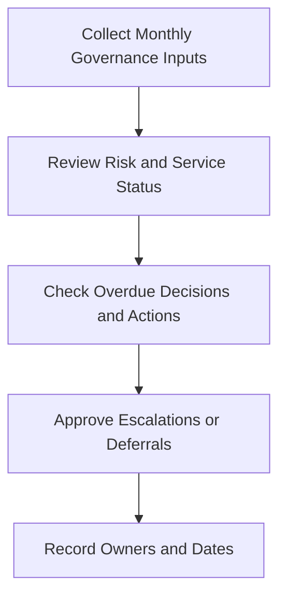

# Monthly SOC Governance Review Pack

**Audience**: CISO, SOC Manager, Security Owner, Business Owner
**Purpose**: Use this pack to review monthly SOC governance status across risk, service quality, overdue actions, and executive decisions.

## 1. Meeting Header

| Field | Value |
|:---|:---|
| **Review Month** | [YYYY-MM] |
| **Prepared By** | |
| **Review Date** | |
| **Chair** | |

## 2. Minimum Inputs

-   [ ] Monthly SOC report finalized
-   [ ] Open risk acceptances and exceptions updated
-   [ ] Overdue remediation and backlog escalations listed
-   [ ] Service catalog scope or SLA issues summarized

## 3. Governance Health Summary

| Area | Status | Notes |
|:---|:---:|:---|
| Service performance | 🟢 / 🟡 / 🔴 | |
| Open risk acceptances | 🟢 / 🟡 / 🔴 | |
| Overdue remediation | 🟢 / 🟡 / 🔴 | |
| Executive actions pending | 🟢 / 🟡 / 🔴 | |

## 4. Monthly Decision Thresholds

| Condition | Threshold | Required Decision | Escalation Path |
|:---|:---|:---|:---|
| **Repeated SLA miss** | 2 consecutive review periods or 3 misses in 90 days | Approve recovery plan or capacity change | Escalate to quarterly board pack if unresolved next month |
| **Overdue remediation backlog** | Critical item overdue more than 30 days or High item overdue more than 60 days | Reassign owner, approve exception, or force remediation date | Escalate to quarterly risk review |
| **Open executive action** | Past due date with no validated blocker | Confirm accountable owner and new deadline | Escalate to CISO within 5 business days |
| **Loss of critical telemetry** | Blind spot affects crown-jewel service, regulated data, or incident triage | Approve emergency restoration or compensating control | Escalate to board pack if not restored within 30 days |

## 5. Decision Review

| Item | Type | Owner | Current State | Decision Required |
|:---|:---|:---|:---|:---|
| | Risk / SLA / Capacity / Exception | | | |
| | | | | |

## 6. Governance Actions This Month

-   [ ] Approve escalations for repeated SLA or control failure.
-   [ ] Confirm owners for deferred actions and exceptions.
-   [ ] Record any decisions that must move to board or quarterly review.
-   [ ] Set due dates for all accepted follow-up actions.

## 7. Carry-Forward to Quarterly and Annual Reviews

| If This Month Shows | Move To | Required Output |
|:---|:---|:---|
| **Recurring exception or risk acceptance** | Quarterly Risk Acceptance Review Pack | Updated residual risk statement, expiry date, and owner recommendation |
| **Persistent service, staffing, or tooling issue** | Board Quarterly Decision Pack | Funding or authority decision request with business impact |
| **Structural detection or telemetry gap** | Annual Control Coverage Review Pack | Control gap statement, affected services, and investment priority |
| **Material incident trend** | Board Quarterly Decision Pack | Trend summary, residual exposure, and required executive decision |

## 8. Governance Closure Rules

-   [ ] Do not mark an incident-derived action closed in governance review unless remediation evidence and business acceptance are both clear.
-   [ ] Push repeat PIR findings to quarterly risk or board review when the same weakness survives more than one monthly cycle.
-   [ ] Record whether each escalated item is expected to close operationally, through risk acceptance, or through funding approval.

## Related Documents

-   [Monthly SOC Report](Monthly_SOC_Report.en.md)
-   [SOC Service Catalog](../06_Operations_Management/SOC_Service_Catalog.en.md)
-   [Risk Acceptance Template](Risk_Acceptance_Template.en.md)
-   [Monthly Remediation Review Pack](Monthly_Remediation_Review_Pack.en.md)
-   [Quarterly Risk Acceptance Review Pack](Quarterly_Risk_Acceptance_Review_Pack.en.md)
-   [Annual Control Coverage Review Pack](Annual_Control_Coverage_Review_Pack.en.md)

## References

-   [NIST Cybersecurity Framework 2.0](https://www.nist.gov/cyberframework)
-   [SOC-CMM](https://www.soc-cmm.com/)
