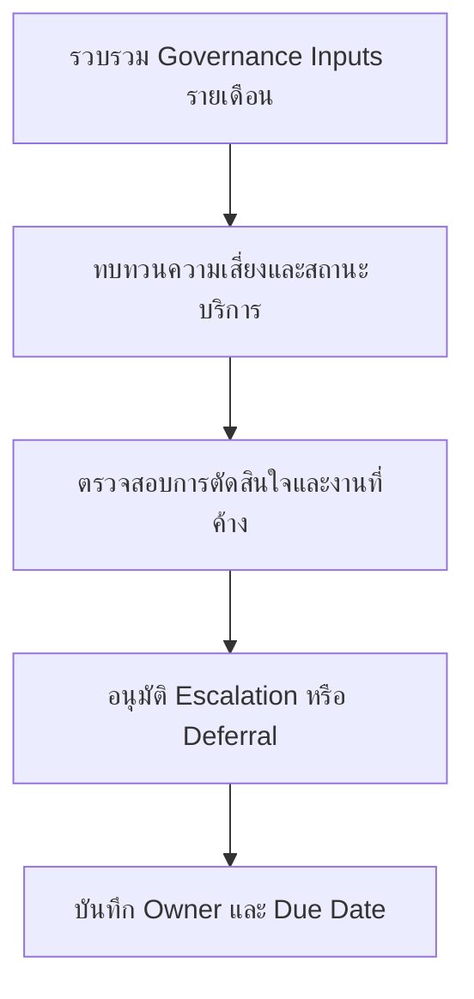

# ชุดทบทวนธรรมาภิบาล SOC รายเดือน

**กลุ่มเป้าหมาย**: CISO, SOC Manager, Security Owner, Business Owner
**วัตถุประสงค์**: ใช้ชุดเอกสารนี้เพื่อทบทวนสถานะธรรมาภิบาลของ SOC รายเดือนในมิติความเสี่ยง คุณภาพบริการ งานที่ค้างเกินกำหนด และประเด็นตัดสินใจของผู้บริหาร

## 1. ส่วนหัวการประชุม

| Field | Value |
|:---|:---|
| **Review Month** | [YYYY-MM] |
| **ผู้จัดทำ** | |
| **วันที่ทบทวน** | |
| **ประธานการประชุม** | |

## 2. ข้อมูลขั้นต่ำที่ต้องมี

-   [ ] ปิด monthly SOC report แล้ว
-   [ ] อัปเดต open risk acceptances และ exceptions แล้ว
-   [ ] สรุป overdue remediation และ backlog escalations แล้ว
-   [ ] สรุปปัญหา service catalog scope หรือ SLA แล้ว

## 3. สรุปสุขภาพด้าน Governance

| Area | Status | Notes |
|:---|:---:|:---|
| ประสิทธิภาพบริการ | 🟢 / 🟡 / 🔴 | |
| open risk acceptances | 🟢 / 🟡 / 🔴 | |
| overdue remediation | 🟢 / 🟡 / 🔴 | |
| executive actions ที่ยังค้าง | 🟢 / 🟡 / 🔴 | |

## 4. เกณฑ์การตัดสินใจรายเดือน

| เงื่อนไข | เกณฑ์ | การตัดสินใจที่ต้องมี | เส้นทาง Escalation |
|:---|:---|:---|:---|
| **พลาด SLA ซ้ำ** | ต่อเนื่อง 2 รอบทบทวน หรือ 3 ครั้งใน 90 วัน | อนุมัติแผนกู้สถานะหรือการเพิ่ม capacity | ยกระดับไป board pack รายไตรมาสถ้ายังไม่คลี่คลายในเดือนถัดไป |
| **remediation backlog ค้างเกินกำหนด** | Critical เกิน 30 วัน หรือ High เกิน 60 วัน | เปลี่ยน owner อนุมัติ exception หรือกำหนดวัน remediation แบบบังคับ | ยกระดับไป quarterly risk review |
| **executive action ค้าง** | เลย due date โดยไม่มี blocker ที่ยืนยันได้ | ยืนยันผู้รับผิดชอบและกำหนดเส้นตายใหม่ | ยกระดับถึง CISO ภายใน 5 วันทำการ |
| **สูญเสีย critical telemetry** | เกิด blind spot ต่อ crown-jewel service ข้อมูลกำกับดูแล หรือการ triage incident | อนุมัติการกู้คืนฉุกเฉินหรือ compensating control | ยกระดับไป board pack ถ้ายังไม่คืนสภาพภายใน 30 วัน |

## 5. การทบทวนประเด็นตัดสินใจ

| Item | Type | Owner | Current State | Decision Required |
|:---|:---|:---|:---|:---|
| | Risk / SLA / Capacity / Exception | | | |
| | | | | |

## 6. Governance Actions ของเดือนนี้

-   [ ] อนุมัติ escalation สำหรับ SLA หรือ control failure ที่เกิดซ้ำ
-   [ ] ยืนยัน owner ของ deferred actions และ exceptions
-   [ ] บันทึกประเด็นที่ต้องยกระดับไป quarterly หรือ board review
-   [ ] กำหนด due date ให้ follow-up actions ทุกข้อที่รับแล้ว

## 7. การส่งต่อไปยังการทบทวนรายไตรมาสและรายปี

| ถ้าเดือนนี้พบว่า | ต้องส่งต่อไปที่ | ผลลัพธ์ที่ต้องส่ง |
|:---|:---|:---|
| **มี exception หรือ risk acceptance ที่เกิดซ้ำ** | Quarterly Risk Acceptance Review Pack | residual risk statement, วันหมดอายุ, และข้อเสนอแนะของ owner ที่อัปเดตแล้ว |
| **มีปัญหาด้านบริการ บุคลากร หรือ tooling ต่อเนื่อง** | Board Quarterly Decision Pack | คำขอเรื่องงบประมาณหรืออำนาจตัดสินใจพร้อม business impact |
| **มีช่องว่างเชิงโครงสร้างด้าน detection หรือ telemetry** | Annual Control Coverage Review Pack | control gap statement, บริการที่ได้รับผลกระทบ, และลำดับความสำคัญในการลงทุน |
| **มีแนวโน้ม material incident ต่อเนื่อง** | Board Quarterly Decision Pack | สรุปแนวโน้ม residual exposure และ decision ที่ผู้บริหารต้องตัดสินใจ |

## 8. กติกาการปิดงานใน Governance

-   [ ] ห้าม mark ว่างานที่มาจาก incident ปิดแล้ว หากยังไม่มีทั้ง remediation evidence และ business acceptance ที่ชัดเจน
-   [ ] หากข้อค้นพบจาก PIR เกิดซ้ำเกิน 1 monthly cycle ให้ดันขึ้น quarterly risk หรือ board review
-   [ ] ระบุให้ชัดว่ารายการที่ยกระดับแต่ละข้อจะปิดด้วยการปฏิบัติการ, risk acceptance, หรือการอนุมัติงบ

## เอกสารที่เกี่ยวข้อง (Related Documents)

-   [Monthly SOC Report](Monthly_SOC_Report.th.md)
-   [SOC Service Catalog](../06_Operations_Management/SOC_Service_Catalog.th.md)
-   [Risk Acceptance Template](Risk_Acceptance_Template.th.md)
-   [Monthly Remediation Review Pack](Monthly_Remediation_Review_Pack.th.md)
-   [Quarterly Risk Acceptance Review Pack](Quarterly_Risk_Acceptance_Review_Pack.th.md)
-   [Annual Control Coverage Review Pack](Annual_Control_Coverage_Review_Pack.th.md)

## References

-   [NIST Cybersecurity Framework 2.0](https://www.nist.gov/cyberframework)
-   [SOC-CMM](https://www.soc-cmm.com/)
