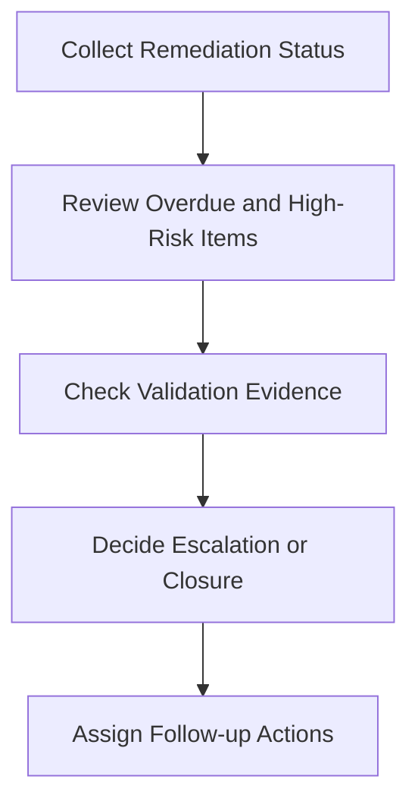

# Monthly Remediation Review Pack

**Audience**: SOC Manager, IR Engineer, Security Owner, Business Owner, CISO
**Purpose**: Use this pack to review remediation backlog status, overdue actions, residual risk, and escalation needs after incidents or audits.

## 1. Meeting Header

| Field | Value |
|:---|:---|
| **Review Month** | [YYYY-MM] |
| **Prepared By** | |
| **Review Date** | |
| **Chair** | |

## 2. Minimum Inputs

-   [ ] Remediation backlog updated
-   [ ] Overdue items highlighted
-   [ ] Validation evidence attached for completed items
-   [ ] New remediation actions from incidents or audits logged

## 3. Remediation Health Summary

| Area | Status | Notes |
|:---|:---:|:---|
| High-risk overdue actions | 🟢 / 🟡 / 🔴 | |
| Residual risk from open incidents | 🟢 / 🟡 / 🔴 | |
| Validation quality | 🟢 / 🟡 / 🔴 | |
| Owner responsiveness | 🟢 / 🟡 / 🔴 | |

## 4. Monthly Escalation Thresholds

| Condition | Threshold | Default Decision | Move To |
|:---|:---|:---|:---|
| **Repeated overdue remediation** | Critical action overdue >30 days or High action overdue >60 days | Reassign owner, escalate, or force date | Monthly Governance Review |
| **Residual risk remains High** | Incident cannot close cleanly or audit gap remains material | Escalate or move to formal acceptance path | Quarterly Risk Acceptance Review Pack |
| **Validation evidence insufficient** | Completed action cannot be verified | Reopen item and set new due date | Weekly Detection or Telemetry Review if technical fix is unclear |
| **Remediation needs funding or authority** | Owner cannot close without cross-team budget or executive mandate | Prepare decision request | Board Quarterly Decision Pack |

## 5. Backlog Review

| Item | Priority | Owner | Due Date | Current State | Next Action |
|:---|:---:|:---|:---|:---|:---|
| | High / Medium / Low | | | | |
| | | | | | |

## 6. Escalation Decisions

-   [ ] Escalate remediation with repeated missed due dates.
-   [ ] Escalate actions blocking closure of Critical or High incidents.
-   [ ] Record any item moving to risk acceptance or exception path.
-   [ ] Confirm closure evidence before marking actions complete.

## 7. Carry-Forward Rules

| If Monthly Review Finds | Move To | Required Output |
|:---|:---|:---|
| **Technical fix still blocked by detection issue** | Weekly Detection Review Pack | Missing rule, test status, and owner |
| **Technical fix still blocked by telemetry issue** | Weekly Telemetry Review Pack | Missing source/data issue, workaround, and owner |
| **Overdue or material remediation affects service/risk posture** | Monthly Governance Review Pack | Service impact, overdue rationale, and escalation recommendation |
| **Open remediation now depends on formal acceptance** | Quarterly Risk Acceptance Review Pack | Residual risk statement, compensating control, and expiry proposal |

## 8. PIR-to-Remediation Intake Gate

-   [ ] Confirm every PIR action item has either a remediation owner or a justified deferment.
-   [ ] Separate quick operational fixes from structural backlog items needing governance review.
-   [ ] Record which incident, audit, or PIR created the item so closure can be traced back to the original case.
-   [ ] Escalate any repeat finding that has already appeared in prior PIRs without durable closure.

## Related Documents

-   [Remediation Backlog Prioritization](Remediation_Backlog_Prioritization.en.md)
-   [Incident Report Template](incident_report.en.md)
-   [Risk Acceptance Template](Risk_Acceptance_Template.en.md)
-   [Monthly SOC Report](Monthly_SOC_Report.en.md)
-   [Weekly Detection Review Pack](Weekly_Detection_Review_Pack.en.md)
-   [Weekly Telemetry Review Pack](Weekly_Telemetry_Review_Pack.en.md)
-   [Monthly Governance Review Pack](Monthly_Governance_Review_Pack.en.md)

## References

-   [NIST SP 800-61 Rev. 2](https://csrc.nist.gov/publications/detail/sp/800-61/rev-2/final)
-   [NIST Cybersecurity Framework 2.0](https://www.nist.gov/cyberframework)
