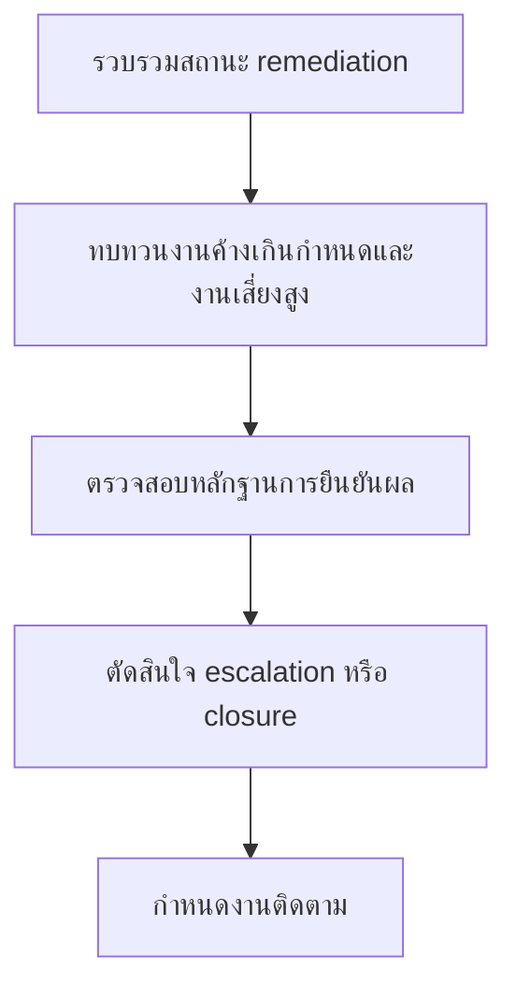

# ชุดทบทวน Remediation รายเดือน

**กลุ่มเป้าหมาย**: SOC Manager, IR Engineer, Security Owner, Business Owner, CISO
**วัตถุประสงค์**: ใช้ชุดเอกสารนี้เพื่อทบทวนสถานะ remediation backlog งานที่เกินกำหนด residual risk และความจำเป็นในการ escalate หลัง incident หรือ audit

## 1. ส่วนหัวการประชุม

| รายการ | ค่า |
|:---|:---|
| **เดือนที่ทบทวน** | [YYYY-MM] |
| **ผู้จัดทำ** | |
| **วันที่ทบทวน** | |
| **ประธานการประชุม** | |

## 2. ข้อมูลขั้นต่ำที่ต้องมี

-   [ ] อัปเดต remediation backlog แล้ว
-   [ ] highlight งานที่เกินกำหนดแล้ว
-   [ ] แนบ validation evidence สำหรับงานที่ปิดแล้ว
-   [ ] บันทึก remediation actions ใหม่จาก incident หรือ audit แล้ว

## 3. สรุปสุขภาพของ Remediation

| มิติ | สถานะ | หมายเหตุ |
|:---|:---:|:---|
| งานเสี่ยงสูงที่เกินกำหนด | 🟢 / 🟡 / 🔴 | |
| residual risk จาก incident ที่ยังไม่ปิด | 🟢 / 🟡 / 🔴 | |
| คุณภาพของ validation | 🟢 / 🟡 / 🔴 | |
| ความตอบสนองของ owner | 🟢 / 🟡 / 🔴 | |

## 4. เกณฑ์การยกระดับรายเดือน

| เงื่อนไข | เกณฑ์ | การตัดสินใจตั้งต้น | ต้องส่งต่อไปที่ |
|:---|:---|:---|:---|
| **remediation ค้างเกินกำหนดซ้ำ** | Critical เกิน 30 วัน หรือ High เกิน 60 วัน | เปลี่ยน owner, escalate, หรือบังคับวันปิด | Monthly Governance Review |
| **residual risk ยังอยู่ระดับ High** | incident ยังปิดไม่ได้สะอาด หรือ audit gap ยัง material | escalate หรือย้ายเข้า formal acceptance path | ชุดทบทวนการยอมรับความเสี่ยงรายไตรมาส |
| **validation evidence ไม่พอ** | งานที่ปิดแล้วตรวจสอบยืนยันไม่ได้ | เปิดงานใหม่และกำหนด due date ใหม่ | Weekly Detection หรือ Telemetry Review ถ้ายังไม่ชัดว่า technical fix คืออะไร |
| **remediation ต้องใช้งบหรือ authority เพิ่ม** | owner ปิดงานไม่ได้หากไม่มี budget หรือ executive mandate | เตรียม decision request | ชุดเอกสารการตัดสินใจรายไตรมาสสำหรับบอร์ด |

## 5. การทบทวน Backlog

| รายการ | ลำดับความสำคัญ | Owner | กำหนดเสร็จ | สถานะปัจจุบัน | การดำเนินการถัดไป |
|:---|:---:|:---|:---|:---|:---|
| | High / Medium / Low | | | | |
| | | | | | |

## 6. การตัดสินใจเรื่อง Escalation

-   [ ] escalate remediation ที่พลาด due date ซ้ำ
-   [ ] escalate งานที่บล็อกการปิด Critical หรือ High incidents
-   [ ] บันทึกรายการที่ต้องย้ายไป risk acceptance หรือ exception path
-   [ ] ยืนยัน closure evidence ก่อน mark ว่าปิดงานแล้ว

## 7. กติกาการส่งต่อ

| ถ้าการทบทวนรายเดือนพบว่า | ต้องส่งต่อไปที่ | ผลลัพธ์ที่ต้องมี |
|:---|:---|:---|
| **technical fix ยังติด detection issue** | ชุดทบทวน Detection ประจำสัปดาห์ | rule ที่ขาดอยู่, test status, และ owner |
| **technical fix ยังติด telemetry issue** | ชุดทบทวน Telemetry ประจำสัปดาห์ | source/data issue, workaround, และ owner |
| **remediation ที่ค้างหรือ material กระทบ service/risk posture** | ชุดทบทวน Governance รายเดือน | service impact, เหตุผลที่ค้าง, และข้อเสนอแนะในการ escalate |
| **open remediation เริ่มต้องใช้ formal acceptance** | ชุดทบทวนการยอมรับความเสี่ยงรายไตรมาส | residual risk statement, compensating control, และข้อเสนอเรื่องวันหมดอายุ |

## 8. เกณฑ์รับงานจาก PIR เข้า Remediation

-   [ ] ยืนยันว่า action item จาก PIR ทุกข้อมี remediation owner หรือมีเหตุผลรองรับการ defer
-   [ ] แยก quick fix เชิงปฏิบัติการออกจาก backlog เชิงโครงสร้างที่ต้องเข้า governance review
-   [ ] บันทึกว่า incident, audit, หรือ PIR ไหนเป็นต้นทางของรายการนั้น เพื่อให้ trace closure กลับได้
-   [ ] ยกระดับข้อค้นพบที่เกิดซ้ำจาก PIR ก่อนหน้าแต่ยังไม่ปิดอย่างยั่งยืน

## เอกสารที่เกี่ยวข้อง (Related Documents)

-   [แบบฟอร์มจัดลำดับ Remediation Backlog](Remediation_Backlog_Prioritization.th.md)
-   [เทมเพลตรายงาน Incident](incident_report.th.md)
-   [เทมเพลตการยอมรับความเสี่ยง](Risk_Acceptance_Template.th.md)
-   [รายงานผลการดำเนินงาน SOC ประจำเดือน](Monthly_SOC_Report.th.md)
-   [ชุดทบทวน Detection ประจำสัปดาห์](Weekly_Detection_Review_Pack.th.md)
-   [ชุดทบทวน Telemetry ประจำสัปดาห์](Weekly_Telemetry_Review_Pack.th.md)
-   [ชุดทบทวน Governance รายเดือน](Monthly_Governance_Review_Pack.th.md)

## References

-   [NIST SP 800-61 Rev. 2](https://csrc.nist.gov/publications/detail/sp/800-61/rev-2/final)
-   [NIST Cybersecurity Framework 2.0](https://www.nist.gov/cyberframework)
