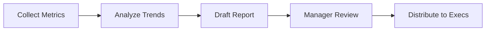
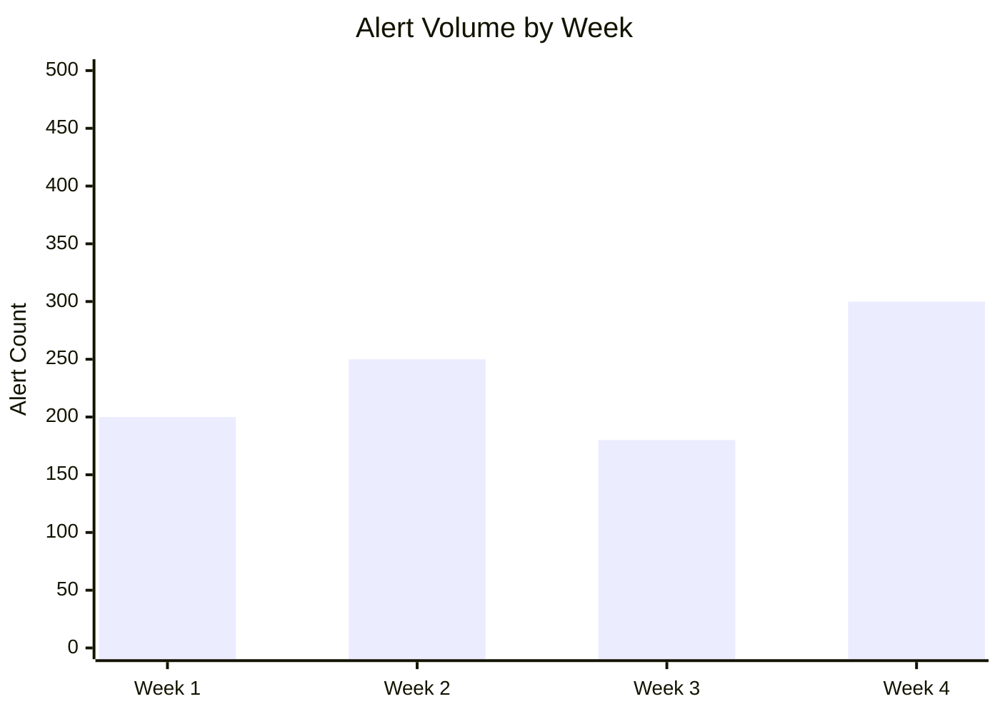

# Monthly SOC Performance Report

**Month**: [MM/YYYY]
**Prepared By**: [SOC Manager Name]
**Distribution**: CIO, CISO, IT Director

## 1. Executive Summary



*Provide a 3-5 sentence summary of the SOC's performance this month. Highlight any major incidents or achievements.*

## 2. Key Performance Indicators (KPIs)

| Metric | Target | Actual | Status | Trend |
| :--- | :--- | :--- | :--- | :--- |
| **MTTD** (Mean Time To Detect) | < 30 Mins | [XX] Mins | [🟢/🔴] | [↑/↓/→] |
| **MTTR** (Mean Time To Respond) | < 60 Mins | [XX] Mins | [🟢/🔴] | [↑/↓/→] |
| **MTTC** (Mean Time To Contain) | < 4 Hrs | [XX] Hrs | [🟢/🔴] | [↑/↓/→] |
| **Total Alerts Processed** | N/A | [XXXX] | N/A | [↑/↓/→] |
| **Valid Incidents** | N/A | [XX] | N/A | [↑/↓/→] |
| **False Positive Rate** | < 10% | [XX]% | [🟢/🔴] | [↑/↓/→] |
| **SLA Compliance** | > 95% | [XX]% | [🟢/🔴] | [↑/↓/→] |
| **Escalation Rate (Tier1→Tier2)** | < 30% | [XX]% | [🟢/🔴] | [↑/↓/→] |

## 3. Incident Breakdown by Category

| Category | Count | Severity | MTTD | MTTR | Status |
| :--- | :---: | :--- | :--- | :--- | :--- |
| Phishing / BEC | [X] | [H/M/L] | [XX] min | [XX] min | Resolved |
| Malware / Ransomware | [X] | [H/M/L] | [XX] min | [XX] min | Resolved |
| Account Compromise | [X] | [H/M/L] | [XX] min | [XX] min | Resolved |
| Data Exfiltration / DLP | [X] | [H/M/L] | [XX] min | [XX] min | Resolved |
| Insider Threat | [X] | [H/M/L] | [XX] min | [XX] min | Resolved |
| Cloud / SaaS | [X] | [H/M/L] | [XX] min | [XX] min | Resolved |
| Other | [X] | [H/M/L] | [XX] min | [XX] min | Resolved |

## 4. Incident Highlights
*List the top 3 most significant incidents.*

### Incident #1: [Brief Title, e.g., CFO Phishing Attempt]
-   **Date**: [YYYY-MM-DD]
-   **Severity**: [Critical/High/Medium/Low]
-   **Impact**: [None / Data Loss / Downtime / Financial]
-   **MITRE ATT&CK**: [Technique ID]
-   **Resolution**: [Blocked sender, reset password]
-   **Root Cause**: [User error / Lack of MFA]
-   **Lessons Learned**: [What could be improved]

## 5. Alert Trend Analysis



| Alert Source | This Month | Last Month | Change |
| :--- | :---: | :---: | :--- |
| EDR / Endpoint | [XXX] | [XXX] | [↑/↓] XX% |
| SIEM / Correlation | [XXX] | [XXX] | [↑/↓] XX% |
| Email Gateway | [XXX] | [XXX] | [↑/↓] XX% |
| Cloud Security (CASB/CSPM) | [XXX] | [XXX] | [↑/↓] XX% |
| Network (IDS/IPS/NDR) | [XXX] | [XXX] | [↑/↓] XX% |
| Identity (IdP) | [XXX] | [XXX] | [↑/↓] XX% |

## 6. Threat Landscape Analysis
*What trends are we seeing?*
-   [ ] Increase in Phishing attacks targeting HR.
-   [ ] Brute force attempts against VPN.
-   [ ] New malware variants observed in sandbox.
-   [ ] Cloud misconfigurations increasing.

### Top MITRE ATT&CK Techniques Observed

| Technique | Count | Playbook Used |
| :--- | :---: | :--- |
| T1566 Phishing | [X] | PB-01 |
| T1078 Valid Accounts | [X] | PB-05 |
| T1059 Command/Script | [X] | PB-11 |
| T1486 Data Encrypted | [X] | PB-02 |

## 7. Staffing & Training

| Metric | Value |
| :--- | :--- |
| Analysts on Shift (avg) | [X] |
| Overtime Hours | [X] |
| Training Hours Completed | [X] |
| Certifications Earned | [X] |
| Open Positions | [X] |

## 8. Projects & Improvements
-   [ ] Tuned [X] noisy detection rules.
-   [ ] Onboarded [New Log Source].
-   [ ] Completed [Training Module].
-   [ ] Deployed [New Tool/Integration].
-   [ ] Created [X] new Sigma detection rules.

## 9. Recommendations

| Priority | Recommendation | Owner | Target Date |
| :--- | :--- | :--- | :--- |
| 🔴 High | [e.g., Enable MFA for all admin accounts] | [Owner] | [Date] |
| 🟡 Medium | [e.g., Onboard cloud audit logs] | [Owner] | [Date] |
| 🟢 Low | [e.g., Update phishing awareness training] | [Owner] | [Date] |

## Dashboard Visualizations Guide

### Recommended Charts for Monthly Report

| Metric | Chart Type | Purpose |
|:---|:---|:---|
| Alert volume by severity | Stacked bar chart | Show volume trends over time |
| MTTD / MTTR trend | Line chart (dual axis) | Show performance improvement |
| Top 10 alert types | Horizontal bar chart | Identify highest volume alerts |
| True vs False Positive ratio | Pie/donut chart | Show detection accuracy |
| Incidents by category | Treemap | Show relative incident distribution |
| SLA compliance | Gauge/meter | Quick pass/fail visibility |
| MITRE ATT&CK heatmap | Matrix heatmap | Show detection coverage gaps |
| Analyst workload | Bar chart per analyst | Identify capacity issues |

### Trend Analysis Section

```markdown
## Monthly Trend Analysis

### Volume Trends (3-month view)
| Metric | Month-2 | Month-1 | Current | Trend |
|:---|:---:|:---:|:---:|:---:|
| Total Alerts | X,XXX | X,XXX | X,XXX | ↑/↓ X% |
| True Positives | XXX | XXX | XXX | ↑/↓ X% |
| False Positives | X,XXX | X,XXX | X,XXX | ↑/↓ X% |
| Incidents Created | XX | XX | XX | ↑/↓ X% |
| P1/P2 Incidents | X | X | X | ↑/↓ X% |

### Performance Trends
| KPI | Month-2 | Month-1 | Current | Target | Status |
|:---|:---:|:---:|:---:|:---:|:---:|
| MTTD | XX min | XX min | XX min | ≤ 60 min | ✅/❌ |
| MTTR | XX min | XX min | XX min | ≤ 240 min | ✅/❌ |
| FP Rate | XX% | XX% | XX% | ≤ 20% | ✅/❌ |
| SLA Met | XX% | XX% | XX% | ≥ 95% | ✅/❌ |

### Key Observations
1. [Observation about alert volume changes]
2. [Observation about new threat types]
3. [Observation about team performance]

### Recommendations
1. [Action item based on data]
2. [Staffing/tool recommendation]
3. [Detection improvement suggestion]
```

## Executive Summary Template

For CISO and Board-level audiences, use this 1-page format:

```markdown
## SOC Executive Summary — [Month Year]

**Status: 🟢 GREEN / 🟡 AMBER / 🔴 RED**

### Key Numbers
| Metric | Value | vs. Last Month |
|:---|:---:|:---:|
| Security Incidents | XX | ↑/↓ X% |
| Critical Incidents (P1) | X | ↑/↓ |
| Mean Time to Detect | XX min | ↑/↓ |
| Mean Time to Respond | XX min | ↑/↓ |

### Notable Incidents
1. [Brief description of most significant incident]
2. [Brief description of second incident]

### Risk Highlights
- [New threat affecting our industry]
- [Vulnerability requiring attention]

### Budget / Resource Needs
- [Any staffing, tool, or training requests]

### Next Month Focus
- [Key initiative or improvement planned]
```

## Related Documents
-   [SOC Metrics & KPIs](../06_Operations_Management/SOC_Metrics.en.md)
-   [Quarterly Business Review](Quarterly_Business_Review.en.md)
-   [SOC Assessment Checklist](../06_Operations_Management/SOC_Assessment_Checklist.en.md)

## References
-   [SANS SOC Metrics](https://www.sans.org/white-papers/)
-   [SOC-CMM](https://www.soc-cmm.com/)
