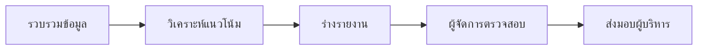

# รายงานผลการดำเนินงาน SOC ประจำเดือน

**ประจำเดือน**: [ด/ปปปป]
**จัดทำโดย**: [ชื่อผู้จัดการ SOC]
**ผู้รับมอบ**: CIO, CISO, IT Director

## 1. บทสรุปผู้บริหาร (Executive Summary)



*สรุปภาพรวมการทำงานของ SOC ในเดือนนี้ 3-5 ประโยค เน้นเหตุการณ์สำคัญหรือความสำเร็จ*

## 2. ตัวชี้วัดผลการดำเนินงาน (KPIs)

| ตัวชี้วัด (Metric) | เป้าหมาย (Target) | ผลลัพธ์ (Actual) | สถานะ |
| :--- | :--- | :--- | :--- |
| **MTTD** (เวลาตรวจจับเฉลี่ย) | < 30 นาที | [XX] นาที | [🟢/🔴] |
| **MTTR** (เวลาตอบสนองเฉลี่ย) | < 60 นาที | [XX] นาที | [🟢/🔴] |
| **จำนวน Alert ทั้งหมด** | - | [XXXX] | - |
| **จำนวน Incident จริง** | - | [XX] | - |
| **อัตรา False Positive** | < 10% | [XX]% | [🟢/🔴] |

## 3. เหตุการณ์สำคัญ (Incident Highlights)
*ระบุ 3 เหตุการณ์ที่สำคัญที่สุด*

### เหตุการณ์ที่ 1: [ชื่อเหตุการณ์ เช่น ตรวจพบมัลแวร์เครื่องฝ่ายการเงิน]
-   **วันที่**: [YYYY-MM-DD]
-   **ผลกระทบ**: [ไม่มี / ข้อมูลรั่วไหล / ระบบหยุดทำงาน]
-   **การแก้ไข**: [กักกันเครื่อง, ลง Windows ใหม่]
-   **สาเหตุ**: [User เปิดไฟล์แนบอันตราย]

## 4. วิเคราะห์แนวโน้มภัยคุกคาม (Threat Landscape)
*แนวโน้มที่พบในเดือนนี้*
-   [ ] พบการโจมตี Phishing เพิ่มขึ้นในแผนกบุคคล
-   [ ] มีการพยายามเดารหัสผ่าน VPN บ่อยครั้ง

## 5. โครงการและการปรับปรุง
-   [ ] ปรับปรุงกฎ Alert ที่แจ้งเตือนผิดพลาด 5 กฎ
-   [ ] นำเข้า Log ใหม่จาก [ระบบ]
-   [ ] อบรมพนักงานเรื่อง [หัวข้อ]

## สรุปเหตุการณ์ตามประเภท

| ประเภท | จำนวน | ระดับ | MTTD | MTTR | สถานะ |
|:---|:---:|:---|:---|:---|:---|
| Phishing / BEC | [X] | [H/M/L] | [XX] นาที | [XX] นาที | แก้ไขแล้ว |
| Malware / Ransomware | [X] | [H/M/L] | [XX] นาที | [XX] นาที | แก้ไขแล้ว |
| Account Compromise | [X] | [H/M/L] | [XX] นาที | [XX] นาที | แก้ไขแล้ว |
| Data Exfiltration / DLP | [X] | [H/M/L] | [XX] นาที | [XX] นาที | แก้ไขแล้ว |
| Insider Threat | [X] | [H/M/L] | [XX] นาที | [XX] นาที | แก้ไขแล้ว |

## แนวโน้มการแจ้งเตือน

| แหล่งแจ้งเตือน | เดือนนี้ | เดือนก่อน | เปลี่ยนแปลง |
|:---|:---:|:---:|:---|
| EDR / Endpoint | [XXX] | [XXX] | [↑/↓] XX% |
| SIEM / Correlation | [XXX] | [XXX] | [↑/↓] XX% |
| Email Gateway | [XXX] | [XXX] | [↑/↓] XX% |
| Cloud Security | [XXX] | [XXX] | [↑/↓] XX% |
| Network (IDS/IPS) | [XXX] | [XXX] | [↑/↓] XX% |

## บุคลากรและการฝึกอบรม

| ตัวชี้วัด | ค่า |
|:---|:---|
| นักวิเคราะห์ในกะ (เฉลี่ย) | [X] |
| ชั่วโมงล่วงเวลา | [X] |
| ชั่วโมงฝึกอบรม | [X] |
| ใบรับรองที่ได้รับ | [X] |

## ข้อเสนอแนะ

| ลำดับความสำคัญ | ข้อเสนอแนะ | ผู้รับผิดชอบ | วันเป้าหมาย |
|:---|:---|:---|:---|
| 🔴 สูง | [เช่น เปิดใช้ MFA สำหรับทุกบัญชี Admin] | [ผู้รับผิดชอบ] | [วันที่] |
| 🟡 กลาง | [เช่น Onboard cloud audit logs] | [ผู้รับผิดชอบ] | [วันที่] |
| 🟢 ต่ำ | [เช่น อัปเดตการฝึกอบรม phishing] | [ผู้รับผิดชอบ] | [วันที่] |

## คู่มือ Dashboard Visualization

### แผนภูมิแนะนำสำหรับรายงานเดือน

| ตัวชี้วัด | ประเภทแผนภูมิ | วัตถุประสงค์ |
|:---|:---|:---|
| ปริมาณ alert ตาม severity | Stacked bar chart | แสดงแนวโน้มปริมาณ |
| MTTD / MTTR trend | Line chart (dual axis) | แสดงการปรับปรุงประสิทธิภาพ |
| Top 10 alert types | Horizontal bar chart | ระบุ alert ที่มีปริมาณมากที่สุด |
| True vs False Positive | Pie/donut chart | แสดงความแม่นยำ detection |
| Incidents ตามหมวด | Treemap | แสดงการกระจายตัว incident |
| SLA compliance | Gauge/meter | ดูเร็ว ผ่าน/ไม่ผ่าน |
| MITRE ATT&CK heatmap | Matrix heatmap | แสดงช่องว่าง coverage |
| Workload ต่อ analyst | Bar chart ต่อ analyst | ระบุปัญหา capacity |

### ส่วนวิเคราะห์แนวโน้ม

```markdown
## วิเคราะห์แนวโน้มรายเดือน

### แนวโน้มปริมาณ (มุมมอง 3 เดือน)
| ตัวชี้วัด | เดือน-2 | เดือน-1 | ปัจจุบัน | แนวโน้ม |
|:---|:---:|:---:|:---:|:---:|
| Alert ทั้งหมด | X,XXX | X,XXX | X,XXX | ↑/↓ X% |
| True Positives | XXX | XXX | XXX | ↑/↓ X% |
| False Positives | X,XXX | X,XXX | X,XXX | ↑/↓ X% |
| Incidents สร้าง | XX | XX | XX | ↑/↓ X% |
| P1/P2 Incidents | X | X | X | ↑/↓ X% |

### แนวโน้มประสิทธิภาพ
| KPI | เดือน-2 | เดือน-1 | ปัจจุบัน | เป้า | สถานะ |
|:---|:---:|:---:|:---:|:---:|:---:|
| MTTD | XX นาที | XX นาที | XX นาที | ≤ 60 นาที | ✅/❌ |
| MTTR | XX นาที | XX นาที | XX นาที | ≤ 240 นาที | ✅/❌ |
| FP Rate | XX% | XX% | XX% | ≤ 20% | ✅/❌ |
| SLA Met | XX% | XX% | XX% | ≥ 95% | ✅/❌ |
```

## Template สรุปผู้บริหาร

สำหรับ CISO และ Board ใช้รูปแบบ 1 หน้า:

```markdown
## สรุป SOC ผู้บริหาร — [เดือน ปี]

**สถานะ: 🟢 เขียว / 🟡 เหลือง / 🔴 แดง**

### ตัวเลขสำคัญ
| ตัวชี้วัด | ค่า | เทียบเดือนก่อน |
|:---|:---:|:---:|
| Security Incidents | XX | ↑/↓ X% |
| Critical Incidents (P1) | X | ↑/↓ |
| เวลาเฉลี่ยตรวจจับ | XX นาที | ↑/↓ |
| เวลาเฉลี่ยตอบสนอง | XX นาที | ↑/↓ |

### Incidents สำคัญ
1. [สรุปสั้นๆ ของ incident สำคัญที่สุด]
2. [สรุปสั้นๆ ของ incident ที่สอง]

### ความเสี่ยงเด่น
- [ภัยคุกคามใหม่ที่กระทบอุตสาหกรรมเรา]
- [ช่องโหว่ที่ต้องสนใจ]
```

## เอกสารที่เกี่ยวข้อง (Related Documents)
-   [ตัวชี้วัด SOC](../06_Operations_Management/SOC_Metrics.th.md)
-   [รายงานรายไตรมาส](Quarterly_Business_Review.th.md)
-   [แบบประเมิน SOC](../06_Operations_Management/SOC_Assessment_Checklist.th.md)

## Monthly Report Content Guide

### Mandatory Sections

| Section | เนื้อหา | Charts |
|:---|:---|:---|
| Executive Summary | สรุป 1 หน้า | Key metrics |
| Alert Statistics | Volume, types, trends | Bar + line |
| Incidents | Summary, severity, status | Pie + table |
| KPI Performance | ตัวชี้วัดหลัก vs target | Gauge |
| Threat Landscape | ภัยคุกคามล่าสุด | Timeline |
| Recommendations | ข้อเสนอปรับปรุง | Priority list |

### Report Review Checklist
- [ ] ข้อมูลถูกต้องครบถ้วน
- [ ] Charts อ่านเข้าใจง่าย
- [ ] Recommendations มี action items
- [ ] เปรียบเทียบกับเดือนก่อน
- [ ] Proofread ก่อนส่ง

### Report Approval Workflow

| Step | Approver | SLA |
|:---|:---|:---|
| Draft | SOC Analyst | Day 3 |
| Review | SOC Manager | Day 5 |
| Final | CISO | Day 7 |
| Distribute | Admin | Day 8 |

### งบประมาณ / ทรัพยากรที่ต้องการ
- [ความต้องการกำลังคน เครื่องมือ หรือการฝึกอบรม]

### จุดเน้นเดือนหน้า
- [โครงการหลักหรือการปรับปรุงที่วางแผนไว้]

### Template สรุปผู้บริหาร

สำหรับ CISO และ Board ใช้รูปแบบ 1 หน้า:

```markdown
## สรุป SOC ผู้บริหาร — [เดือน ปีย่อ]

**สถานะ: 🟢 เขียว / 🟡 เหลือง / 🔴 แดง**

### ตัวเลขสำคัญ
| ตัวชี้วัด | ค่า | เทียบเดือนก่อน |
|:---|:---:|:---:|
| Security Incidents | XX | ↑/↓ X% |
| Critical Incidents (P1) | X | ↑/↓ |
| เวลาเฉลี่ยตรวจจับ | XX นาที | ↑/↓ |
| เวลาเฉลี่ยตอบสนอง | XX นาที | ↑/↓ |

### Incidents สำคัญ
1. [สรุปสั้นๆ ของ incident ที่สำคัญที่สุด]
2. [สรุปสั้นๆ ของ incident ที่สอง]
```

## References
-   [SANS SOC Metrics](https://www.sans.org/white-papers/)
-   [SOC-CMM](https://www.soc-cmm.com/)
