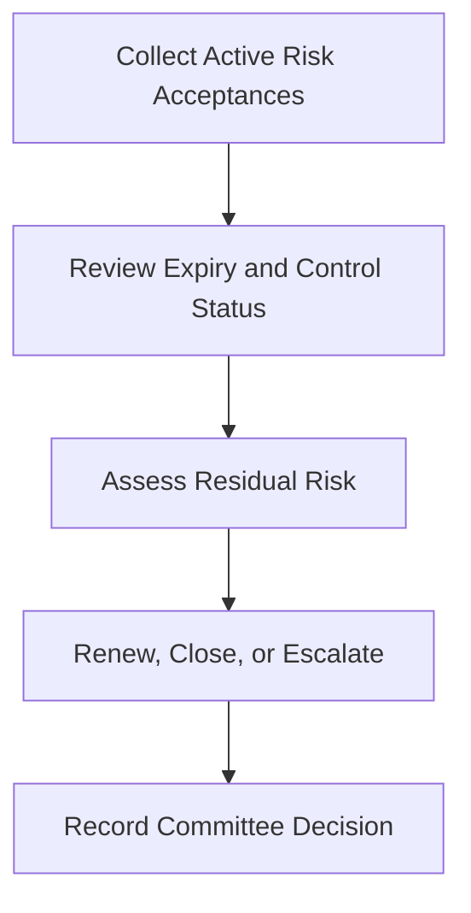

# Quarterly Risk Acceptance Review Pack

**Audience**: CISO, Business Owner, Security Owner, Risk Committee
**Purpose**: Use this pack to review active risk acceptances, expiring exceptions, and unresolved compensating controls every quarter.

## 1. Meeting Header

| Field | Value |
|:---|:---|
| **Quarter** | [Q1/Q2/Q3/Q4 YYYY] |
| **Prepared By** | |
| **Review Date** | |
| **Chair** | |

## 2. Minimum Inputs

-   [ ] Active risk acceptance register updated
-   [ ] Expiring exceptions listed
-   [ ] Compensating control status validated
-   [ ] Any change in threat landscape or business impact captured
-   [ ] Monthly governance reviews summarized for the quarter
-   [ ] Open remediation items linked to each acceptance validated

## 3. Quarterly Decision Thresholds

| Condition | Threshold | Default Recommendation | Escalation Path |
|:---|:---|:---|:---|
| **Acceptance expired** | Expiry date passed or will pass before next quarter | Close or renew immediately | Escalate to board pack if owner does not act within review cycle |
| **Residual risk increased** | Business impact, threat activity, or exposure worsened since last review | Escalate | Include in board pack this quarter |
| **Compensating control failed** | Control unavailable, not tested, or repeatedly bypassed | Close or escalate | Trigger monthly governance follow-up and board review |
| **Remediation stalled** | No credible progress across one full quarter | Escalate | Funding, authority, or timeline decision in board pack |

## 4. Review Table

| Risk ID | Owner | Expiry | Current Residual Risk | Recommendation |
|:---|:---|:---:|:---|:---|
| | | | | Renew / Close / Escalate |
| | | | | |

## 5. Decision Rules

-   [ ] Renew only if the business reason still stands and controls remain effective.
-   [ ] Close items where remediation is complete and validated.
-   [ ] Escalate items where residual risk increased, controls failed, or expiry passed.

## 6. Board Escalation Criteria

-   [ ] Escalate any acceptance tied to regulated data, safety-critical service, or crown-jewel asset when residual risk remains High.
-   [ ] Escalate any exception that has been renewed more than twice without an approved exit plan.
-   [ ] Escalate any item needing funding, cross-business authority, or timeline relief beyond the owner's mandate.

## 7. Required Outputs

-   [ ] Update the risk acceptance register with committee decision, owner, and next review date.
-   [ ] Create or update board decision items for escalated cases.
-   [ ] Link accepted actions back to monthly governance review tracking.

## 8. PIR and Remediation Escalation Checks

-   [ ] Confirm whether the accepted risk originated from an incident, audit, or recurring control failure.
-   [ ] Check whether the same finding has appeared in more than one PIR or remediation cycle.
-   [ ] Escalate directly to board review if renewal is being used instead of a credible exit plan.

## Related Documents

-   [Risk Acceptance Template](Risk_Acceptance_Template.en.md)
-   [Security Exception Approval](Exception_Approval_Template.en.md)
-   [Board Quarterly Decision Pack](Board_Quarterly_Decision_Pack.en.md)
-   [Compliance Gap Analysis](../07_Compliance_Privacy/Compliance_Gap_Analysis.en.md)
-   [Monthly Governance Review Pack](Monthly_Governance_Review_Pack.en.md)

## References

-   [NIST Cybersecurity Framework 2.0](https://www.nist.gov/cyberframework)
-   [ISO/IEC 27001](https://www.iso.org/isoiec-27001-information-security.html)
