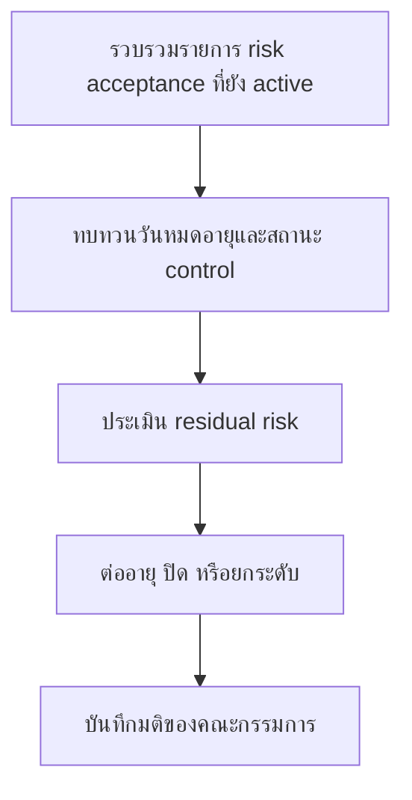

# ชุดทบทวน Risk Acceptance รายไตรมาส

**กลุ่มเป้าหมาย**: CISO, Business Owner, Security Owner, Risk Committee
**วัตถุประสงค์**: ใช้ชุดเอกสารนี้เพื่อทบทวน risk acceptances ที่ยัง active ข้อยกเว้นที่ใกล้หมดอายุ และ compensating controls ที่ยังไม่ปิดในทุกไตรมาส

## 1. ส่วนหัวการประชุม

| รายการ | ค่า |
|:---|:---|
| **ไตรมาส** | [Q1/Q2/Q3/Q4 YYYY] |
| **ผู้จัดทำ** | |
| **วันที่ทบทวน** | |
| **ประธานการประชุม** | |

## 2. ข้อมูลขั้นต่ำที่ต้องมี

-   [ ] อัปเดต active risk acceptance register แล้ว
-   [ ] แสดงรายการ exceptions ที่ใกล้หมดอายุแล้ว
-   [ ] validate สถานะ compensating controls แล้ว
-   [ ] บันทึกการเปลี่ยนแปลงของ threat landscape หรือ business impact แล้ว
-   [ ] สรุป monthly governance reviews ของไตรมาสนั้นแล้ว
-   [ ] validate remediation items ที่ผูกกับ acceptance แต่ละรายการแล้ว

## 3. เกณฑ์การตัดสินใจรายไตรมาส

| เงื่อนไข | เกณฑ์ | คำแนะนำตั้งต้น | เส้นทาง Escalation |
|:---|:---|:---|:---|
| **acceptance หมดอายุ** | วันหมดอายุผ่านแล้ว หรือจะหมดก่อนรอบทบทวนถัดไป | close หรือ renew ทันที | ยกระดับไป board pack ถ้า owner ไม่ดำเนินการในรอบนี้ |
| **residual risk สูงขึ้น** | business impact, threat activity, หรือ exposure แย่ลงจากรอบก่อน | escalate | ใส่ใน board pack ไตรมาสนี้ |
| **compensating control ล้มเหลว** | control ใช้งานไม่ได้ ไม่ผ่านการทดสอบ หรือถูก bypass ซ้ำ | close หรือ escalate | trigger monthly governance follow-up และ board review |
| **remediation ไม่เดินหน้า** | ไม่มีความคืบหน้าที่น่าเชื่อถือตลอด 1 ไตรมาสเต็ม | escalate | ขอ funding, authority, หรือ timeline decision ใน board pack |

## 4. ตารางทบทวน

| รหัสความเสี่ยง | ผู้รับผิดชอบ | วันหมดอายุ | Residual Risk ปัจจุบัน | ข้อเสนอแนะ |
|:---|:---|:---:|:---|:---|
| | | | | Renew / Close / Escalate |
| | | | | |

## 5. กติกาการตัดสินใจ

-   [ ] renew เฉพาะเมื่อเหตุผลทางธุรกิจยังคงอยู่และ controls ยังมีประสิทธิภาพ
-   [ ] close เมื่อ remediation เสร็จและ validate แล้ว
-   [ ] escalate เมื่อ residual risk สูงขึ้น control ล้มเหลว หรือ expiry ผ่านไปแล้ว

## 6. เกณฑ์การยกระดับไปยังบอร์ด

-   [ ] ยกระดับ acceptance ที่เกี่ยวกับ regulated data, safety-critical service, หรือ crown-jewel asset เมื่อ residual risk ยังอยู่ระดับ High
-   [ ] ยกระดับ exception ที่ต่ออายุเกิน 2 ครั้งโดยยังไม่มี exit plan ที่อนุมัติแล้ว
-   [ ] ยกระดับรายการที่ต้องใช้ funding, อำนาจข้ามสายงาน, หรือการผ่อน timeline เกินอำนาจของ owner

## 7. ผลลัพธ์ที่ต้องได้

-   [ ] อัปเดต risk acceptance register ด้วยมติ owner และ next review date
-   [ ] สร้างหรืออัปเดต board decision items สำหรับเคสที่ยกระดับ
-   [ ] ผูก accepted actions กลับไปยัง monthly governance review tracking

## 8. จุดตรวจจาก PIR และ Remediation ก่อนต่ออายุความเสี่ยง

-   [ ] ยืนยันว่าความเสี่ยงที่ยอมรับมาจาก incident, audit, หรือ recurring control failure แบบใด
-   [ ] ตรวจว่าข้อค้นพบเดิมนี้โผล่ซ้ำเกิน 1 รอบ PIR หรือ remediation cycle หรือไม่
-   [ ] ยกระดับตรงไปยัง board review หากการต่ออายุถูกใช้แทน exit plan ที่น่าเชื่อถือ

## เอกสารที่เกี่ยวข้อง (Related Documents)

-   [เทมเพลตการยอมรับความเสี่ยง](Risk_Acceptance_Template.th.md)
-   [แบบฟอร์มอนุมัติข้อยกเว้นด้านความปลอดภัย](Exception_Approval_Template.th.md)
-   [ชุดเอกสารการตัดสินใจรายไตรมาสสำหรับบอร์ด](Board_Quarterly_Decision_Pack.th.md)
-   [การวิเคราะห์ช่องว่างด้าน Compliance](../07_Compliance_Privacy/Compliance_Gap_Analysis.th.md)
-   [ชุดทบทวน Governance รายเดือน](Monthly_Governance_Review_Pack.th.md)

## References

-   [NIST Cybersecurity Framework 2.0](https://www.nist.gov/cyberframework)
-   [ISO/IEC 27001](https://www.iso.org/isoiec-27001-information-security.html)
