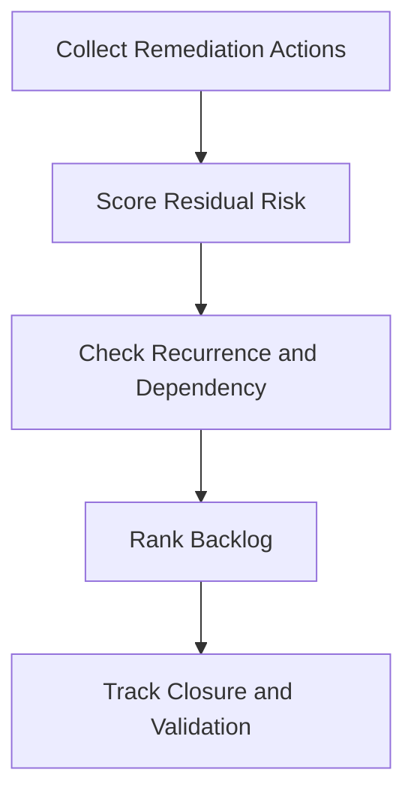

# Remediation Backlog Prioritization Template

**Audience**: SOC Manager, IR Engineer, Security Owner, Business Owner
**Purpose**: Use this template to prioritize post-incident and control-gap remediation work based on residual risk, recurrence, and owner readiness.

## 1. Backlog Item Register

| ID | Remediation Action | Source Incident or Gap | Owner | Status |
|:---|:---|:---|:---|:---:|
| REM-BL-[001] | | | | ☐ New ☐ Ranked ☐ In Progress ☐ Done |
| REM-BL-[002] | | | | ☐ New ☐ Ranked ☐ In Progress ☐ Done |

## 2. Scoring Model

| Factor | Question | Score (1-5) |
|:---|:---|:---:|
| Residual risk | What happens if this action is not completed? | |
| Recurrence potential | Is the same incident or failure likely to recur? | |
| Critical dependency | Does this block recovery, compliance, or safe operation? | |
| Owner readiness | Is the owner able to execute in the required timeframe? | |
| Validation clarity | Can completion be verified objectively? | |

## 3. Prioritization Table

| Item | Residual Risk | Recurrence | Dependency | Owner Readiness | Validation | Total | Priority |
|:---|:---:|:---:|:---:|:---:|:---:|:---:|:---:|
| | | | | | | | High / Medium / Low |
| | | | | | | | |

## 4. Review Rules

-   [ ] Prioritize actions that prevent recurrence of Critical or High incidents.
-   [ ] Escalate items with no owner, no due date, or repeated slippage.
-   [ ] Do not close remediation without validation evidence.
-   [ ] Re-score if business impact, threat activity, or compliance deadlines change.

## Related Documents

-   [Incident Report Template](incident_report.en.md)
-   [Risk Acceptance Template](Risk_Acceptance_Template.en.md)
-   [Compliance Gap Analysis](../07_Compliance_Privacy/Compliance_Gap_Analysis.en.md)
-   [Monthly SOC Report](Monthly_SOC_Report.en.md)

## References

-   [NIST SP 800-61 Rev. 2](https://csrc.nist.gov/publications/detail/sp/800-61/rev-2/final)
-   [NIST Cybersecurity Framework 2.0](https://www.nist.gov/cyberframework)
