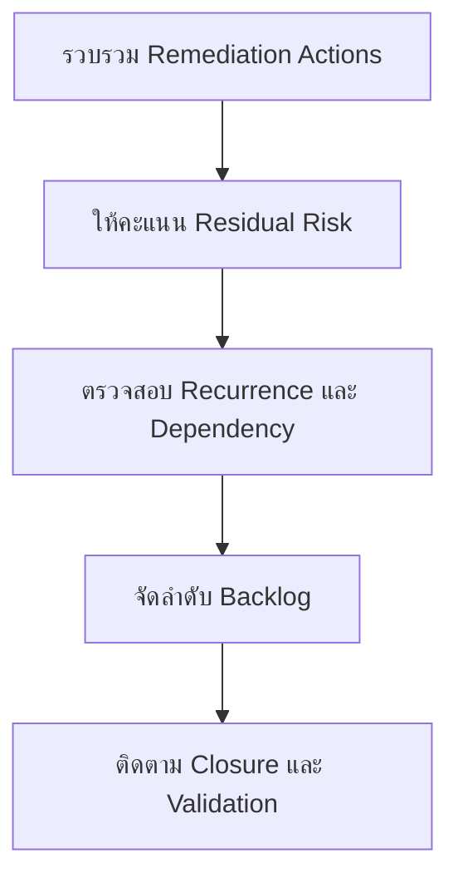

# แบบฟอร์มจัดลำดับ Remediation Backlog

**กลุ่มเป้าหมาย**: SOC Manager, IR Engineer, Security Owner, Business Owner
**วัตถุประสงค์**: ใช้แบบฟอร์มนี้เพื่อจัดลำดับงาน remediation หลัง incident หรือ control gap ตาม residual risk โอกาสเกิดซ้ำ และความพร้อมของ owner

## 1. ทะเบียนรายการ Backlog

| ID | Remediation Action | Source Incident or Gap | Owner | Status |
|:---|:---|:---|:---|:---:|
| REM-BL-[001] | | | | ☐ New ☐ Ranked ☐ In Progress ☐ Done |
| REM-BL-[002] | | | | ☐ New ☐ Ranked ☐ In Progress ☐ Done |

## 2. โมเดลการให้คะแนน

| Factor | Question | Score (1-5) |
|:---|:---|:---:|
| Residual risk | หากไม่ทำงานนี้จะเกิดอะไรขึ้น | |
| Recurrence potential | Incident หรือ failure เดิมมีโอกาสเกิดซ้ำหรือไม่ | |
| Critical dependency | งานนี้บล็อก recovery, compliance, หรือ safe operation หรือไม่ | |
| Owner readiness | Owner พร้อม execute ภายในเวลาที่ต้องการหรือไม่ | |
| Validation clarity | สามารถยืนยันการปิดงานได้อย่างเป็นกลางหรือไม่ | |

## 3. ตารางจัดลำดับความสำคัญ

| Item | Residual Risk | Recurrence | Dependency | Owner Readiness | Validation | Total | Priority |
|:---|:---:|:---:|:---:|:---:|:---:|:---:|:---:|
| | | | | | | | High / Medium / Low |
| | | | | | | | |

## 4. กติกาการทบทวน

-   [ ] ให้ priority กับงานที่ช่วยป้องกันการเกิดซ้ำของ Critical หรือ High incidents
-   [ ] escalate รายการที่ไม่มี owner ไม่มี due date หรือเลื่อนซ้ำ
-   [ ] ห้ามปิด remediation โดยไม่มี validation evidence
-   [ ] re-score เมื่อ business impact, threat activity, หรือ compliance deadline เปลี่ยน

## เอกสารที่เกี่ยวข้อง (Related Documents)

-   [Incident Report Template](incident_report.th.md)
-   [Risk Acceptance Template](Risk_Acceptance_Template.th.md)
-   [Compliance Gap Analysis](../07_Compliance_Privacy/Compliance_Gap_Analysis.th.md)
-   [Monthly SOC Report](Monthly_SOC_Report.th.md)

## References

-   [NIST SP 800-61 Rev. 2](https://csrc.nist.gov/publications/detail/sp/800-61/rev-2/final)
-   [NIST Cybersecurity Framework 2.0](https://www.nist.gov/cyberframework)
