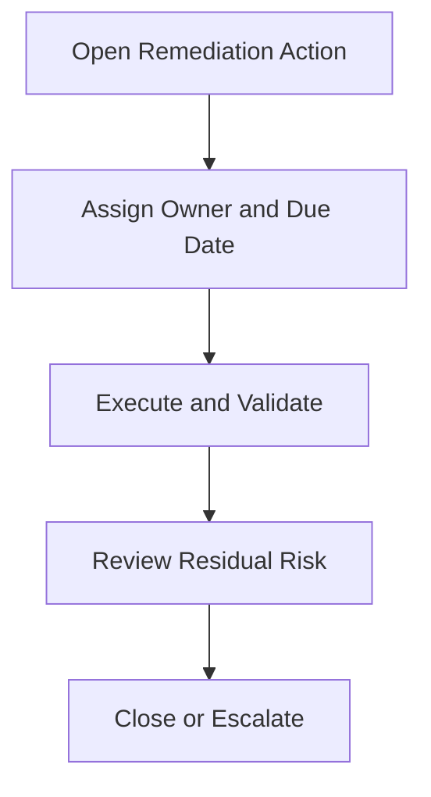

# Remediation Ownership RACI

**Audience**: SOC Manager, IR Engineer, Security Owner, Business Owner, CISO
**Purpose**: Use this document to assign ownership for remediation planning, execution, validation, escalation, and closure.

## 1. Scope

-   [ ] Use this RACI for post-incident remediation, audit findings, control gaps, and recurring weaknesses.
-   [ ] Apply this RACI during monthly remediation review and executive risk review.

## 2. RACI Matrix

| Activity | IR Engineer | SOC Manager | Security Owner | Business Owner | CISO |
|:---|:---:|:---:|:---:|:---:|:---:|
| Open remediation item | **R** | A | C | I | I |
| Assign owner and due date | C | **A** | R | C | I |
| Execute technical remediation | C | I | **R** | I | I |
| Validate completion evidence | **R** | A | C | I | I |
| Approve residual risk deferment | I | C | C | R | **A** |
| Escalate overdue high-risk items | C | **R** | C | I | A |
| Close remediation item | C | **A** | R | I | I |

*R = Responsible, A = Accountable, C = Consulted, I = Informed*

## 3. Minimum Ownership Rules

-   [ ] Every remediation action must have one named execution owner and one accountable approver.
-   [ ] High-risk overdue actions must be escalated in the monthly review pack.
-   [ ] Validation evidence is required before closure.
-   [ ] Items moved to risk acceptance must link to an approved risk acceptance record.

## Related Documents

-   [Remediation Backlog Prioritization](Remediation_Backlog_Prioritization.en.md)
-   [Monthly Remediation Review Pack](Monthly_Remediation_Review_Pack.en.md)
-   [Incident Report Template](incident_report.en.md)
-   [Risk Acceptance Template](Risk_Acceptance_Template.en.md)

## References

-   [NIST SP 800-61 Rev. 2](https://csrc.nist.gov/publications/detail/sp/800-61/rev-2/final)
-   [NIST Cybersecurity Framework 2.0](https://www.nist.gov/cyberframework)
