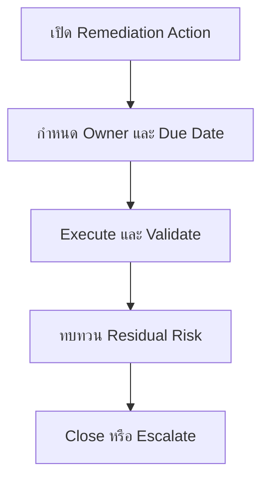

# RACI ความเป็นเจ้าของงาน Remediation

**กลุ่มเป้าหมาย**: SOC Manager, IR Engineer, Security Owner, Business Owner, CISO
**วัตถุประสงค์**: ใช้เอกสารนี้เพื่อกำหนด owner ของงาน remediation ตั้งแต่ planning, execution, validation, escalation, และ closure

## 1. ขอบเขตการใช้งาน

-   [ ] ใช้ RACI นี้กับ post-incident remediation, audit findings, control gaps, และ recurring weaknesses
-   [ ] ใช้ RACI นี้ระหว่าง monthly remediation review และ executive risk review

## 2. RACI Matrix

| Activity | IR Engineer | SOC Manager | Security Owner | Business Owner | CISO |
|:---|:---:|:---:|:---:|:---:|:---:|
| เปิด remediation item | **R** | A | C | I | I |
| กำหนด owner และ due date | C | **A** | R | C | I |
| execute technical remediation | C | I | **R** | I | I |
| validate completion evidence | **R** | A | C | I | I |
| อนุมัติ residual risk deferment | I | C | C | R | **A** |
| escalate overdue high-risk items | C | **R** | C | I | A |
| ปิด remediation item | C | **A** | R | I | I |

*R = Responsible, A = Accountable, C = Consulted, I = Informed*

## 3. กติกาขั้นต่ำเรื่อง Ownership

-   [ ] remediation action ทุกชิ้นต้องมี execution owner หนึ่งคนและ accountable approver หนึ่งคน
-   [ ] high-risk overdue actions ต้องถูก escalate ใน monthly review pack
-   [ ] ต้องมี validation evidence ก่อนปิดงาน
-   [ ] รายการที่ย้ายไป risk acceptance ต้องลิงก์กับ risk acceptance record ที่อนุมัติแล้ว

## เอกสารที่เกี่ยวข้อง (Related Documents)

-   [Remediation Backlog Prioritization](Remediation_Backlog_Prioritization.th.md)
-   [Monthly Remediation Review Pack](Monthly_Remediation_Review_Pack.th.md)
-   [Incident Report Template](incident_report.th.md)
-   [Risk Acceptance Template](Risk_Acceptance_Template.th.md)

## References

-   [NIST SP 800-61 Rev. 2](https://csrc.nist.gov/publications/detail/sp/800-61/rev-2/final)
-   [NIST Cybersecurity Framework 2.0](https://www.nist.gov/cyberframework)
