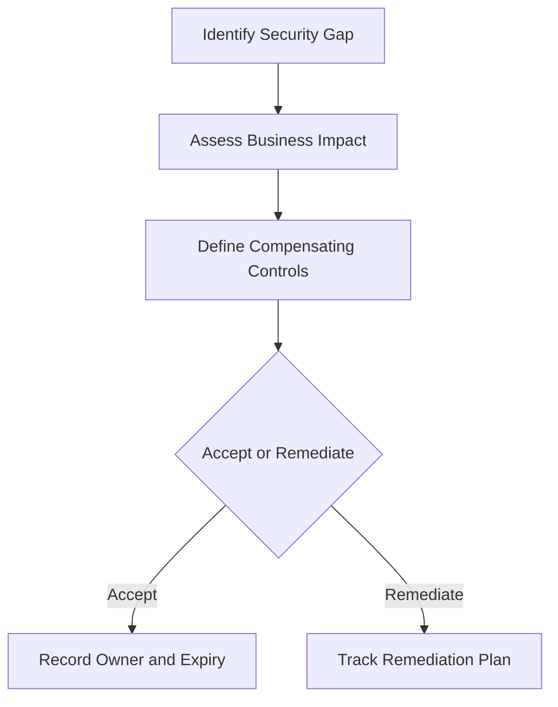

# Risk Acceptance Template

**Audience**: CISO, Risk Owner, SOC Manager, Business Owner
**Purpose**: Use this template when a security gap, control limitation, or delayed remediation must be formally accepted by a named business owner.

## 1. When to Use This Template

-   [ ] Use when a known security gap cannot be remediated within the required timeframe.
-   [ ] Use when the business chooses to continue operation despite a documented control weakness.
-   [ ] Use when a temporary workaround or compensating control replaces a standard control.

## 2. Decision Record

| Field | Value |
|:---|:---|
| **Risk Acceptance ID** | RA-[YYYYMMDD]-[001] |
| **Requested By** | [Name / Role] |
| **Business Owner** | [Name / Function] |
| **Security Owner** | [Name / Role] |
| **Date Requested** | [YYYY-MM-DD] |
| **Expiry Date** | [YYYY-MM-DD] |
| **Review Frequency** | [Monthly / Quarterly] |

## 3. Risk Description

| Question | Answer |
|:---|:---|
| **Affected system or service** | |
| **Control gap or limitation** | |
| **Business reason remediation is delayed** | |
| **Threat scenario if exploited** | |
| **Worst-case business impact** | |

## 4. Risk Assessment

| Dimension | Assessment |
|:---|:---|
| **Likelihood** | ☐ Low · ☐ Medium · ☐ High |
| **Impact** | ☐ Low · ☐ Medium · ☐ High · ☐ Critical |
| **Exposure Duration** | [Days / Weeks / Months] |
| **Data or service at risk** | |
| **Regulatory implication** | ☐ None · ☐ Potential · ☐ Confirmed |

## 5. Compensating Controls

| Control | Owner | Status | Evidence |
|:---|:---|:---:|:---|
| Increased monitoring | | ☐ In place · ☐ Planned | |
| Temporary access restriction | | ☐ In place · ☐ Planned | |
| Additional alerting | | ☐ In place · ☐ Planned | |
| Management review | | ☐ In place · ☐ Planned | |

## 6. Decision Criteria

-   [ ] Confirm remediation is not feasible within the required timeframe.
-   [ ] Confirm compensating controls reduce exposure to an agreed level.
-   [ ] Confirm the business owner understands operational, legal, and reputational impact.
-   [ ] Confirm the acceptance has an expiry date and review cadence.

## 7. Approval

| Role | Name | Decision | Date |
|:---|:---|:---:|:---|
| Security Owner | | ☐ Recommend · ☐ Do Not Recommend | |
| SOC Manager | | ☐ Reviewed | |
| Business Owner | | ☐ Accept · ☐ Reject | |
| CISO | | ☐ Approve · ☐ Reject | |

## 8. Follow-up Actions

| Action | Owner | Due Date | Status |
|:---|:---|:---|:---:|
| Review acceptance before expiry | | | ☐ |
| Validate compensating controls | | | ☐ |
| Reassess if threat conditions change | | | ☐ |
| Track remediation plan | | | ☐ |

## 9. Governance Routing

-   [ ] Track active acceptance in the monthly governance review until it is closed or escalated.
-   [ ] Move repeated renewals or High residual risk to the quarterly risk acceptance review.
-   [ ] Escalate board-level funding, authority, or tolerance decisions to the board quarterly decision pack.

## Related Documents

-   [Compliance Gap Analysis](../07_Compliance_Privacy/Compliance_Gap_Analysis.en.md)
-   [SLA Template](../06_Operations_Management/SLA_Template.en.md)
-   [Executive Dashboard](Executive_Dashboard.en.md)
-   [Monthly SOC Report](Monthly_SOC_Report.en.md)
-   [Monthly Governance Review Pack](Monthly_Governance_Review_Pack.en.md)
-   [Quarterly Risk Acceptance Review Pack](Quarterly_Risk_Acceptance_Review_Pack.en.md)
-   [Board Quarterly Decision Pack](Board_Quarterly_Decision_Pack.en.md)

## References

-   [NIST Cybersecurity Framework 2.0](https://www.nist.gov/cyberframework)
-   [ISO/IEC 27001](https://www.iso.org/isoiec-27001-information-security.html)
