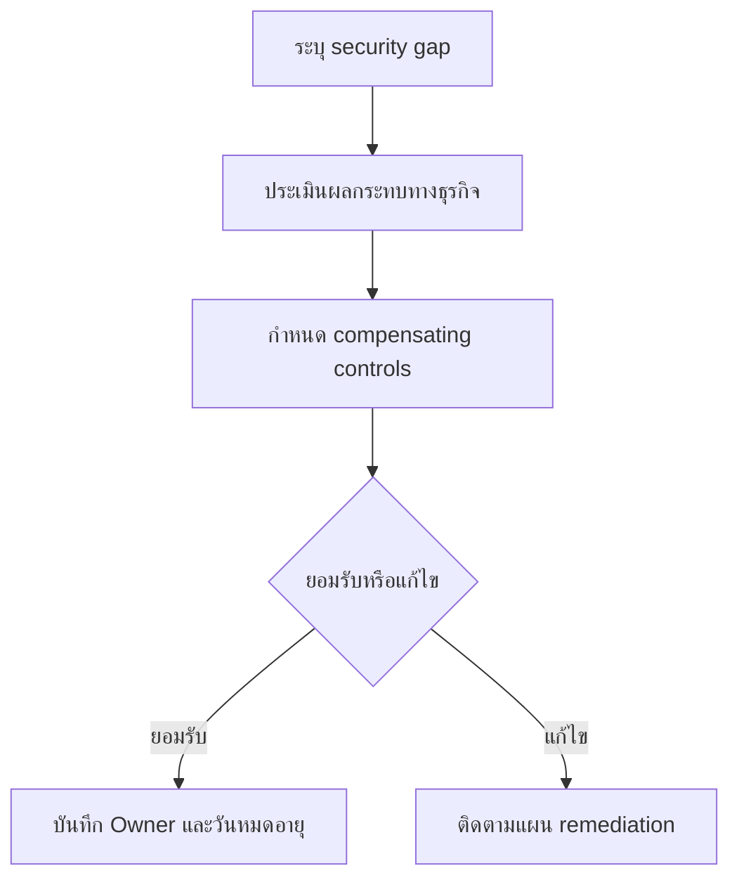

# แบบฟอร์มการยอมรับความเสี่ยง

**กลุ่มเป้าหมาย**: CISO, Risk Owner, SOC Manager, Business Owner
**วัตถุประสงค์**: ใช้แบบฟอร์มนี้เมื่อมี security gap, control limitation, หรือการเลื่อน remediation ที่ต้องได้รับการยอมรับอย่างเป็นทางการจากเจ้าของความเสี่ยงทางธุรกิจ

## 1. ใช้แบบฟอร์มนี้เมื่อใด

-   [ ] ใช้เมื่อ security gap ที่ทราบอยู่แล้วไม่สามารถแก้ไขได้ภายในเวลาที่กำหนด
-   [ ] ใช้เมื่อธุรกิจเลือกดำเนินงานต่อแม้มี control weakness ที่ถูกบันทึกไว้แล้ว
-   [ ] ใช้เมื่อมี workaround ชั่วคราวหรือ compensating control มาทดแทน control มาตรฐาน

## 2. รายการบันทึกการตัดสินใจ

| รายการ | ค่า |
|:---|:---|
| **Risk Acceptance ID** | RA-[YYYYMMDD]-[001] |
| **ผู้ร้องขอ** | [ชื่อ / บทบาท] |
| **เจ้าของความเสี่ยงทางธุรกิจ** | [ชื่อ / หน่วยงาน] |
| **เจ้าของด้านความปลอดภัย** | [ชื่อ / บทบาท] |
| **วันที่ร้องขอ** | [YYYY-MM-DD] |
| **วันหมดอายุ** | [YYYY-MM-DD] |
| **รอบทบทวน** | [Monthly / Quarterly] |

## 3. รายละเอียดความเสี่ยง

| คำถาม | คำตอบ |
|:---|:---|
| **ระบบหรือบริการที่ได้รับผลกระทบ** | |
| **ช่องว่างของ control หรือข้อจำกัด** | |
| **เหตุผลทางธุรกิจที่ทำให้ remediation ล่าช้า** | |
| **Threat scenario หากถูกใช้ประโยชน์** | |
| **ผลกระทบทางธุรกิจกรณีร้ายแรงที่สุด** | |

## 4. การประเมินความเสี่ยง

| มิติ | การประเมิน |
|:---|:---|
| **Likelihood** | ☐ ต่ำ · ☐ กลาง · ☐ สูง |
| **Impact** | ☐ ต่ำ · ☐ กลาง · ☐ สูง · ☐ วิกฤต |
| **ระยะเวลาที่เปิดรับความเสี่ยง** | [วัน / สัปดาห์ / เดือน] |
| **ข้อมูลหรือบริการที่เสี่ยง** | |
| **ผลกระทบด้านกฎหมาย/กำกับดูแล** | ☐ ไม่มี · ☐ อาจเกิดขึ้น · ☐ ยืนยันแล้ว |

## 5. Compensating Controls

| มาตรการทดแทน | ผู้รับผิดชอบ | สถานะ | หลักฐาน |
|:---|:---|:---:|:---|
| เพิ่มการเฝ้าระวัง | | ☐ ใช้งานแล้ว · ☐ วางแผนไว้ | |
| จำกัดสิทธิ์การเข้าถึงชั่วคราว | | ☐ ใช้งานแล้ว · ☐ วางแผนไว้ | |
| เพิ่มการแจ้งเตือน | | ☐ ใช้งานแล้ว · ☐ วางแผนไว้ | |
| ทบทวนโดยผู้บริหาร | | ☐ ใช้งานแล้ว · ☐ วางแผนไว้ | |

## 6. เกณฑ์การตัดสินใจ

-   [ ] ยืนยันว่าการ remediation ไม่สามารถทำได้ทันเวลาที่ต้องการ
-   [ ] ยืนยันว่า compensating controls ลด exposure ลงสู่ระดับที่ตกลงกันได้
-   [ ] ยืนยันว่า business owner เข้าใจผลกระทบด้านปฏิบัติการ กฎหมาย และชื่อเสียง
-   [ ] ยืนยันว่ามี expiry date และ review cadence ชัดเจน

## 7. การอนุมัติ

| บทบาท | ชื่อ | การตัดสินใจ | วันที่ |
|:---|:---|:---:|:---|
| Security Owner | | ☐ เห็นชอบ · ☐ ไม่เห็นชอบ | |
| SOC Manager | | ☐ ทบทวนแล้ว | |
| Business Owner | | ☐ ยอมรับ · ☐ ไม่ยอมรับ | |
| CISO | | ☐ อนุมัติ · ☐ ไม่อนุมัติ | |

## 8. งานติดตามผล

| การดำเนินการ | ผู้รับผิดชอบ | กำหนดเสร็จ | สถานะ |
|:---|:---|:---|:---:|
| Review acceptance ก่อนหมดอายุ | | | ☐ |
| Validate compensating controls | | | ☐ |
| Reassess หาก threat conditions เปลี่ยน | | | ☐ |
| ติดตาม remediation plan | | | ☐ |

## 9. เส้นทางส่งต่อใน Governance

-   [ ] ติดตาม acceptance ที่ยัง active ใน monthly governance review จนกว่าจะปิดหรือยกระดับ
-   [ ] หากมีการต่ออายุซ้ำหรือ residual risk ยังเป็น High ให้ส่งต่อเข้า quarterly risk acceptance review
-   [ ] หากต้องใช้งบ อำนาจตัดสินใจ หรือการยอมรับความเสี่ยงระดับบอร์ด ให้ยกระดับเข้า board quarterly decision pack

## เอกสารที่เกี่ยวข้อง (Related Documents)

-   [การวิเคราะห์ช่องว่างด้าน Compliance](../07_Compliance_Privacy/Compliance_Gap_Analysis.th.md)
-   [แม่แบบ SLA](../06_Operations_Management/SLA_Template.th.md)
-   [แม่แบบ Dashboard สำหรับผู้บริหาร](Executive_Dashboard.th.md)
-   [รายงานผลการดำเนินงาน SOC ประจำเดือน](Monthly_SOC_Report.th.md)
-   [ชุดทบทวน Governance รายเดือน](Monthly_Governance_Review_Pack.th.md)
-   [ชุดทบทวนการยอมรับความเสี่ยงรายไตรมาส](Quarterly_Risk_Acceptance_Review_Pack.th.md)
-   [ชุดเอกสารการตัดสินใจรายไตรมาสสำหรับบอร์ด](Board_Quarterly_Decision_Pack.th.md)

## References

-   [NIST Cybersecurity Framework 2.0](https://www.nist.gov/cyberframework)
-   [ISO/IEC 27001](https://www.iso.org/isoiec-27001-information-security.html)
