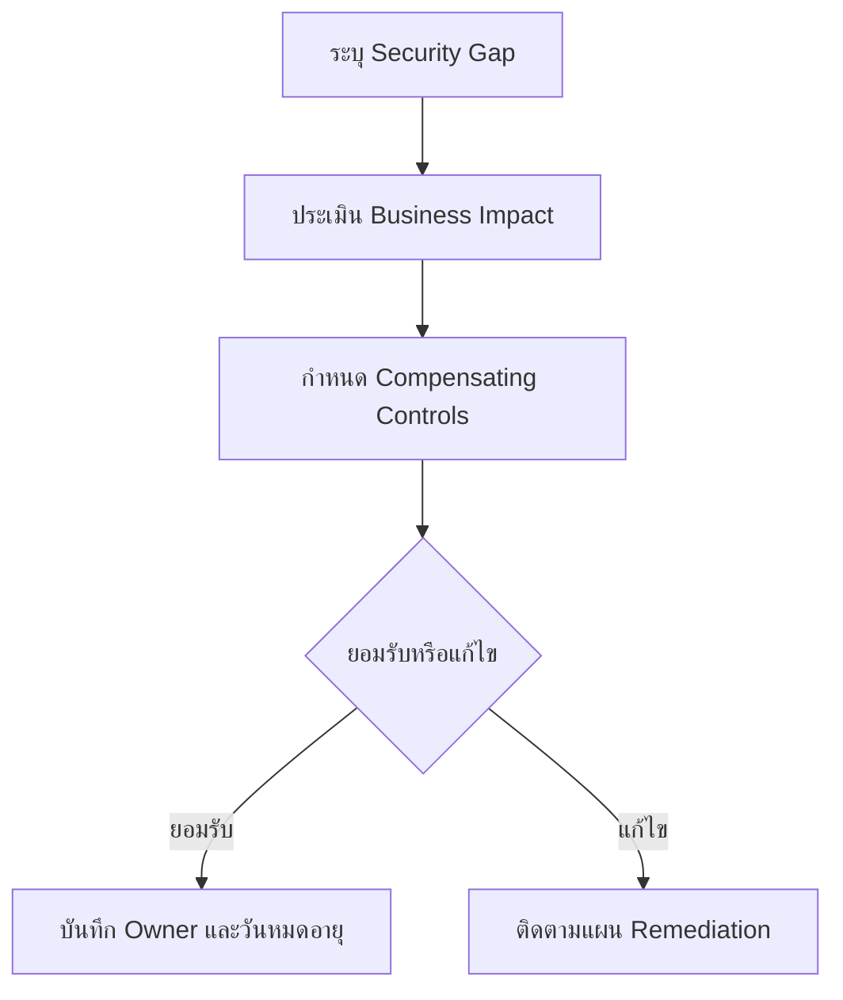

# แบบฟอร์มการยอมรับความเสี่ยง

**กลุ่มเป้าหมาย**: CISO, Risk Owner, SOC Manager, Business Owner
**วัตถุประสงค์**: ใช้แบบฟอร์มนี้เมื่อมี security gap, control limitation, หรือการเลื่อน remediation ที่ต้องได้รับการยอมรับอย่างเป็นทางการจากเจ้าของความเสี่ยงทางธุรกิจ

## 1. ใช้แบบฟอร์มนี้เมื่อใด

-   [ ] ใช้เมื่อ security gap ที่ทราบอยู่แล้วไม่สามารถแก้ไขได้ภายในเวลาที่กำหนด
-   [ ] ใช้เมื่อธุรกิจเลือกดำเนินงานต่อแม้มี control weakness ที่ถูกบันทึกไว้แล้ว
-   [ ] ใช้เมื่อมี workaround ชั่วคราวหรือ compensating control มาทดแทน control มาตรฐาน

## 2. รายการบันทึกการตัดสินใจ

| Field | Value |
|:---|:---|
| **Risk Acceptance ID** | RA-[YYYYMMDD]-[001] |
| **ผู้ร้องขอ** | [Name / Role] |
| **เจ้าของความเสี่ยงทางธุรกิจ** | [Name / Function] |
| **เจ้าของด้านความปลอดภัย** | [Name / Role] |
| **วันที่ร้องขอ** | [YYYY-MM-DD] |
| **วันหมดอายุ** | [YYYY-MM-DD] |
| **รอบทบทวน** | [Monthly / Quarterly] |

## 3. รายละเอียดความเสี่ยง

| Question | Answer |
|:---|:---|
| **ระบบหรือบริการที่ได้รับผลกระทบ** | |
| **ช่องว่างของ control หรือข้อจำกัด** | |
| **เหตุผลทางธุรกิจที่ทำให้ remediation ล่าช้า** | |
| **Threat scenario หากถูกใช้ประโยชน์** | |
| **ผลกระทบทางธุรกิจกรณีร้ายแรงที่สุด** | |

## 4. การประเมินความเสี่ยง

| Dimension | Assessment |
|:---|:---|
| **Likelihood** | ☐ Low · ☐ Medium · ☐ High |
| **Impact** | ☐ Low · ☐ Medium · ☐ High · ☐ Critical |
| **ระยะเวลาที่เปิดรับความเสี่ยง** | [Days / Weeks / Months] |
| **ข้อมูลหรือบริการที่เสี่ยง** | |
| **ผลกระทบด้านกฎหมาย/กำกับดูแล** | ☐ None · ☐ Potential · ☐ Confirmed |

## 5. Compensating Controls

| Control | Owner | Status | Evidence |
|:---|:---|:---:|:---|
| Increased monitoring | | ☐ In place · ☐ Planned | |
| Temporary access restriction | | ☐ In place · ☐ Planned | |
| Additional alerting | | ☐ In place · ☐ Planned | |
| Management review | | ☐ In place · ☐ Planned | |

## 6. เกณฑ์การตัดสินใจ

-   [ ] ยืนยันว่าการ remediation ไม่สามารถทำได้ทันเวลาที่ต้องการ
-   [ ] ยืนยันว่า compensating controls ลด exposure ลงสู่ระดับที่ตกลงกันได้
-   [ ] ยืนยันว่า business owner เข้าใจผลกระทบด้านปฏิบัติการ กฎหมาย และชื่อเสียง
-   [ ] ยืนยันว่ามี expiry date และ review cadence ชัดเจน

## 7. การอนุมัติ

| Role | Name | Decision | Date |
|:---|:---|:---:|:---|
| Security Owner | | ☐ Recommend · ☐ Do Not Recommend | |
| SOC Manager | | ☐ Reviewed | |
| Business Owner | | ☐ Accept · ☐ Reject | |
| CISO | | ☐ Approve · ☐ Reject | |

## 8. งานติดตามผล

| Action | Owner | Due Date | Status |
|:---|:---|:---|:---:|
| Review acceptance ก่อนหมดอายุ | | | ☐ |
| Validate compensating controls | | | ☐ |
| Reassess หาก threat conditions เปลี่ยน | | | ☐ |
| ติดตาม remediation plan | | | ☐ |

## เอกสารที่เกี่ยวข้อง (Related Documents)

-   [Compliance Gap Analysis](../07_Compliance_Privacy/Compliance_Gap_Analysis.th.md)
-   [SLA Template](../06_Operations_Management/SLA_Template.th.md)
-   [Executive Dashboard](Executive_Dashboard.th.md)
-   [Monthly SOC Report](Monthly_SOC_Report.th.md)

## References

-   [NIST Cybersecurity Framework 2.0](https://www.nist.gov/cyberframework)
-   [ISO/IEC 27001](https://www.iso.org/isoiec-27001-information-security.html)
