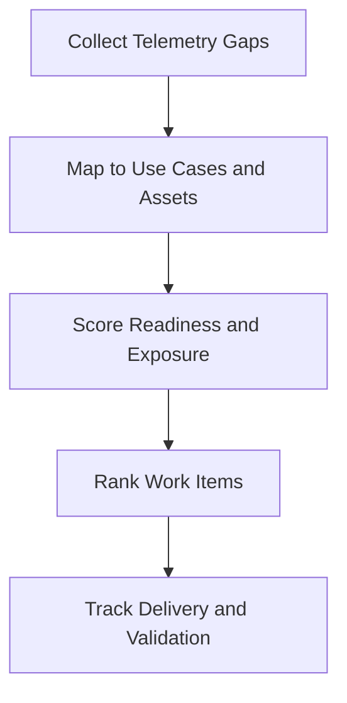

# Telemetry Backlog Prioritization Template

**Audience**: Security Engineer, SOC Manager, Platform Owner
**Purpose**: Use this template to rank telemetry onboarding and data quality work by security value, dependency, and implementation readiness.

## 1. Backlog Item Register

| ID | Telemetry Gap | Affected Asset or Service | Owner | Status |
|:---|:---|:---|:---|:---:|
| TEL-BL-[001] | | | | ☐ New ☐ Ranked ☐ In Progress ☐ Done |
| TEL-BL-[002] | | | | ☐ New ☐ Ranked ☐ In Progress ☐ Done |

## 2. Scoring Model

| Factor | Question | Score (1-5) |
|:---|:---|:---:|
| Critical asset exposure | Does the gap affect a critical or regulated service? | |
| Detection dependency | How many use cases depend on this telemetry? | |
| Investigation dependency | Does incident response fail without this data? | |
| Implementation readiness | Are owner, integration path, and sample data ready? | |
| Data quality risk | Is current data missing, delayed, or unreliable? | |

## 3. Prioritization Table

| Item | Asset Exposure | Detection Dependency | IR Dependency | Readiness | Quality Risk | Total | Priority |
|:---|:---:|:---:|:---:|:---:|:---:|:---:|:---:|
| | | | | | | | High / Medium / Low |
| | | | | | | | |

## 4. Review Rules

-   [ ] Prioritize telemetry that unlocks multiple high-priority use cases.
-   [ ] Escalate items affecting critical assets with no alternative data source.
-   [ ] Do not mark work complete until data quality and timestamp checks pass.
-   [ ] Re-score when service ownership, retention, or legal constraints change.

## Related Documents

-   [Log Source Onboarding Request](Log_Source_Onboarding_Request.en.md)
-   [SOC Service Catalog](../06_Operations_Management/SOC_Service_Catalog.en.md)
-   [Log Source Matrix](../06_Operations_Management/Log_Source_Matrix.en.md)
-   [Log Source Onboarding](../06_Operations_Management/Log_Source_Onboarding.en.md)

## References

-   [NIST SP 800-92](https://csrc.nist.gov/publications/detail/sp/800-92/final)
-   [Open Cybersecurity Schema Framework](https://schema.ocsf.io/)
