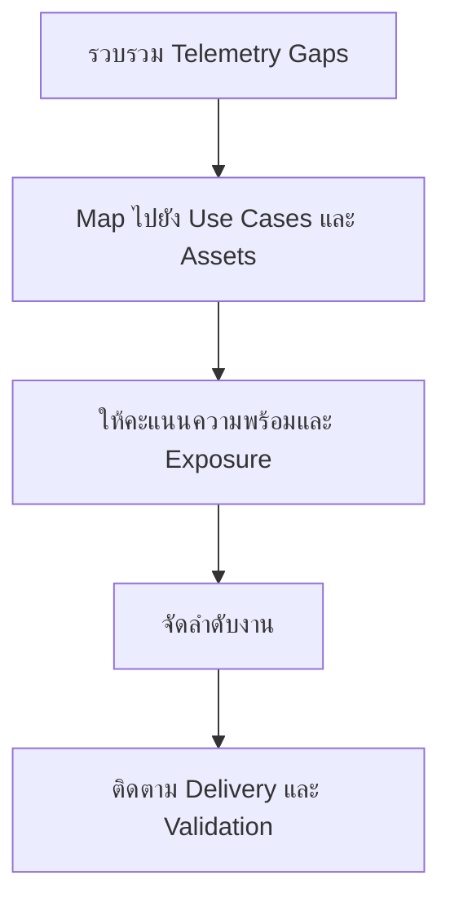

# แบบฟอร์มจัดลำดับ Telemetry Backlog

**กลุ่มเป้าหมาย**: Security Engineer, SOC Manager, Platform Owner
**วัตถุประสงค์**: ใช้แบบฟอร์มนี้เพื่อจัดลำดับงาน onboarding telemetry และ data quality ตามคุณค่าด้านความปลอดภัย dependency และความพร้อมในการ implement

## 1. ทะเบียนรายการ Backlog

| ID | Telemetry Gap | Affected Asset or Service | Owner | Status |
|:---|:---|:---|:---|:---:|
| TEL-BL-[001] | | | | ☐ New ☐ Ranked ☐ In Progress ☐ Done |
| TEL-BL-[002] | | | | ☐ New ☐ Ranked ☐ In Progress ☐ Done |

## 2. โมเดลการให้คะแนน

| Factor | Question | Score (1-5) |
|:---|:---|:---:|
| Critical asset exposure | Gap นี้กระทบ critical หรือ regulated service หรือไม่ | |
| Detection dependency | มี use cases กี่รายการที่ต้องพึ่ง telemetry นี้ | |
| Investigation dependency | Incident response ล้มเหลวหรือไม่หากไม่มีข้อมูลนี้ | |
| Implementation readiness | มี owner, integration path, และ sample data พร้อมหรือไม่ | |
| Data quality risk | ข้อมูลปัจจุบันขาด หาย ช้า หรือไม่น่าเชื่อถือหรือไม่ | |

## 3. ตารางจัดลำดับความสำคัญ

| Item | Asset Exposure | Detection Dependency | IR Dependency | Readiness | Quality Risk | Total | Priority |
|:---|:---:|:---:|:---:|:---:|:---:|:---:|:---:|
| | | | | | | | High / Medium / Low |
| | | | | | | | |

## 4. กติกาการทบทวน

-   [ ] ให้ priority กับ telemetry ที่ปลดล็อก high-priority use cases ได้หลายรายการ
-   [ ] escalate รายการที่กระทบ critical assets และไม่มี alternative data source
-   [ ] ห้ามปิดงานจนกว่าจะผ่าน data quality และ timestamp checks
-   [ ] re-score เมื่อ service ownership, retention, หรือ legal constraints เปลี่ยน

## เอกสารที่เกี่ยวข้อง (Related Documents)

-   [Log Source Onboarding Request](Log_Source_Onboarding_Request.th.md)
-   [SOC Service Catalog](../06_Operations_Management/SOC_Service_Catalog.th.md)
-   [Log Source Matrix](../06_Operations_Management/Log_Source_Matrix.th.md)
-   [Log Source Onboarding](../06_Operations_Management/Log_Source_Onboarding.th.md)

## References

-   [NIST SP 800-92](https://csrc.nist.gov/publications/detail/sp/800-92/final)
-   [Open Cybersecurity Schema Framework](https://schema.ocsf.io/)
