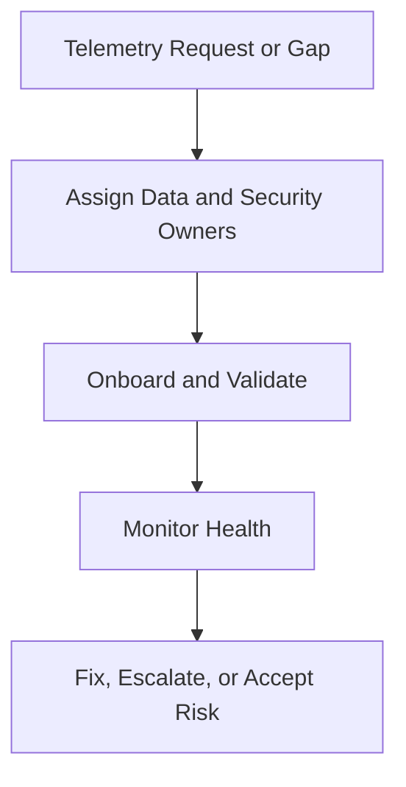

# Telemetry Ownership RACI

**Audience**: Security Engineer, Platform Owner, SOC Manager, Detection Engineer
**Purpose**: Use this document to assign ownership for telemetry onboarding, parsing, data quality, incident support, and outage recovery.

## 1. Scope

-   [ ] Use this RACI for new log onboarding, parser defects, ingestion failures, and critical data quality gaps.
-   [ ] Apply this RACI in weekly telemetry review and service onboarding decisions.

## 2. RACI Matrix

| Activity | Security Engineer | Platform Owner | SOC Manager | Detection Engineer | Data Owner |
|:---|:---:|:---:|:---:|:---:|:---:|
| Submit onboarding request | I | C | I | C | **R** |
| Approve onboarding scope | C | **A** | C | I | R |
| Build integration or parser | **R** | C | I | C | I |
| Validate required fields | **R** | C | I | C | I |
| Confirm use case dependency | C | I | I | **R** | I |
| Escalate ingestion failure | **R** | C | A | I | I |
| Approve workaround or deferment | C | C | **A** | I | I |
| Confirm recovery and close gap | **R** | C | A | C | I |

*R = Responsible, A = Accountable, C = Consulted, I = Informed*

## 3. Minimum Ownership Rules

-   [ ] Every critical telemetry source must have a named platform owner and security owner.
-   [ ] Data quality failures on critical assets must be escalated the same week.
-   [ ] No onboarding item closes until validation evidence is attached.
-   [ ] Temporary workarounds must have an expiry date and owner.

## Related Documents

-   [Log Source Onboarding Request](Log_Source_Onboarding_Request.en.md)
-   [Telemetry Backlog Prioritization](Telemetry_Backlog_Prioritization.en.md)
-   [Weekly Telemetry Review Pack](Weekly_Telemetry_Review_Pack.en.md)
-   [SOC Service Catalog](../06_Operations_Management/SOC_Service_Catalog.en.md)

## References

-   [NIST SP 800-92](https://csrc.nist.gov/publications/detail/sp/800-92/final)
-   [Open Cybersecurity Schema Framework](https://schema.ocsf.io/)
