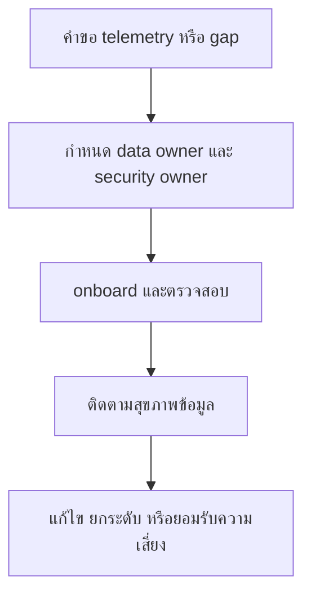

# RACI ความเป็นเจ้าของงาน Telemetry

**กลุ่มเป้าหมาย**: Security Engineer, Platform Owner, SOC Manager, Detection Engineer
**วัตถุประสงค์**: ใช้เอกสารนี้เพื่อกำหนด owner ของงาน telemetry ตั้งแต่ onboarding, parsing, data quality, incident support, และ outage recovery

## 1. ขอบเขตการใช้งาน

-   [ ] ใช้ RACI นี้กับการ onboard log ใหม่ parser defects ingestion failures และ critical data quality gaps
-   [ ] ใช้ RACI นี้ในการประชุม weekly telemetry review และการตัดสินใจ service onboarding

## 2. RACI Matrix

| กิจกรรม | Security Engineer | Platform Owner | SOC Manager | Detection Engineer | Data Owner |
|:---|:---:|:---:|:---:|:---:|:---:|
| ส่งคำขอ onboarding | I | C | I | C | **R** |
| อนุมัติขอบเขต onboarding | C | **A** | C | I | R |
| สร้าง integration หรือ parser | **R** | C | I | C | I |
| validate required fields | **R** | C | I | C | I |
| ยืนยัน use case dependency | C | I | I | **R** | I |
| escalate ingestion failure | **R** | C | A | I | I |
| อนุมัติ workaround หรือ deferment | C | C | **A** | I | I |
| ยืนยัน recovery และปิด gap | **R** | C | A | C | I |

*R = Responsible, A = Accountable, C = Consulted, I = Informed*

## 3. กติกาขั้นต่ำเรื่อง Ownership

-   [ ] telemetry source ที่สำคัญทุกตัวต้องมี platform owner และ security owner ชัดเจน
-   [ ] data quality failures บน critical assets ต้องถูก escalate ภายในสัปดาห์เดียวกัน
-   [ ] ห้ามปิด onboarding item หากยังไม่มี validation evidence
-   [ ] workaround ชั่วคราวต้องมี expiry date และ owner

## 4. เส้นทางส่งต่อใน Governance

-   [ ] blind spot หรือ ingestion failure ที่กระทบ critical services ต้องถูกยกระดับเข้า weekly telemetry review และ monthly governance review
-   [ ] รายการที่ต้องยอมรับความเสี่ยงชั่วคราวต้องเชื่อมไป quarterly risk acceptance review

## เอกสารที่เกี่ยวข้อง (Related Documents)

-   [แบบฟอร์มคำขอ Onboarding Log Source](Log_Source_Onboarding_Request.th.md)
-   [แบบฟอร์มจัดลำดับ Telemetry Backlog](Telemetry_Backlog_Prioritization.th.md)
-   [ชุดทบทวน Telemetry ประจำสัปดาห์](Weekly_Telemetry_Review_Pack.th.md)
-   [แค็ตตาล็อกบริการของ SOC](../06_Operations_Management/SOC_Service_Catalog.th.md)

## References

-   [NIST SP 800-92](https://csrc.nist.gov/publications/detail/sp/800-92/final)
-   [Open Cybersecurity Schema Framework](https://schema.ocsf.io/)
