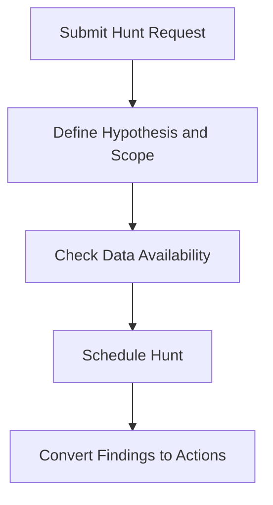

# Threat Hunt Request Template

**Audience**: Threat Hunter, SOC Manager, Incident Responder, Detection Engineer
**Purpose**: Use this template to request a threat hunt based on a hypothesis, campaign concern, or control gap.

## 1. Request Header

| Field | Value |
|:---|:---|
| **Request ID** | HUNT-[YYYYMMDD]-[001] |
| **Requester** | |
| **Date Submitted** | |
| **Reason for Hunt** | ☐ Hypothesis · ☐ Incident Follow-up · ☐ Threat Intel · ☐ Audit / Gap |

## 2. Hunt Objective

| Question | Answer |
|:---|:---|
| **Hypothesis or concern** | |
| **Assets or users in scope** | |
| **Time window** | |
| **Expected indicators or behaviors** | |

## 3. Data and Constraints

| Item | Status | Notes |
|:---|:---:|:---|
| Relevant logs available | ☐ | |
| EDR or endpoint data available | ☐ | |
| Cloud or identity data available | ☐ | |
| Known constraints documented | ☐ | |

## 4. Expected Outputs

-   [ ] Hunt result summary
-   [ ] Findings requiring incident escalation
-   [ ] Detection candidates
-   [ ] Telemetry or coverage gaps

## 5. Approval and Scheduling

| Role | Name | Decision | Date |
|:---|:---|:---:|:---|
| Threat Hunt Lead | | ☐ Accept · ☐ Reject · ☐ Need More Info | |
| SOC Manager | | ☐ Scheduled | |

## Related Documents

-   [SOC Service Catalog](../06_Operations_Management/SOC_Service_Catalog.en.md)
-   [Threat Hunting Playbook](../05_Incident_Response/Threat_Hunting_Playbook.en.md)
-   [Threat Intelligence Lifecycle](../06_Operations_Management/Threat_Intelligence_Lifecycle.en.md)
-   [SOC Use Case Library](../08_Detection_Engineering/SOC_Use_Case_Library.en.md)

## References

-   [MITRE ATT&CK](https://attack.mitre.org/)
-   [NIST SP 800-61 Rev. 2](https://csrc.nist.gov/publications/detail/sp/800-61/rev-2/final)
