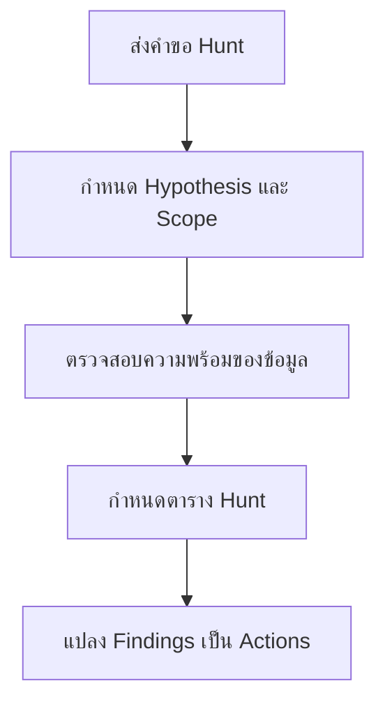

# แบบฟอร์มคำขอ Threat Hunt

**กลุ่มเป้าหมาย**: Threat Hunter, SOC Manager, Incident Responder, Detection Engineer
**วัตถุประสงค์**: ใช้แบบฟอร์มนี้เพื่อขอ threat hunt จาก hypothesis, campaign concern, หรือ control gap

## 1. ส่วนหัวคำขอ

| Field | Value |
|:---|:---|
| **Request ID** | HUNT-[YYYYMMDD]-[001] |
| **ผู้ร้องขอ** | |
| **วันที่ส่งคำขอ** | |
| **เหตุผลของการ Hunt** | ☐ Hypothesis · ☐ Incident Follow-up · ☐ Threat Intel · ☐ Audit / Gap |

## 2. เป้าหมายของการ Hunt

| Question | Answer |
|:---|:---|
| **Hypothesis หรือข้อกังวล** | |
| **Assets หรือ users ที่อยู่ใน scope** | |
| **ช่วงเวลา** | |
| **Indicators หรือ behaviors ที่คาดหวัง** | |

## 3. ข้อมูลและข้อจำกัด

| Item | Status | Notes |
|:---|:---:|:---|
| มี logs ที่เกี่ยวข้องพร้อม | ☐ | |
| มี EDR หรือ endpoint data พร้อม | ☐ | |
| มี cloud หรือ identity data พร้อม | ☐ | |
| บันทึกข้อจำกัดที่ทราบแล้ว | ☐ | |

## 4. ผลลัพธ์ที่คาดหวัง

-   [ ] สรุปผลการ hunt
-   [ ] Findings ที่ต้อง escalate เป็น incident
-   [ ] Detection candidates
-   [ ] ช่องว่างด้าน telemetry หรือ coverage

## 5. การอนุมัติและการจัดตาราง

| Role | Name | Decision | Date |
|:---|:---|:---:|:---|
| Threat Hunt Lead | | ☐ Accept · ☐ Reject · ☐ Need More Info | |
| SOC Manager | | ☐ Scheduled | |

## เอกสารที่เกี่ยวข้อง (Related Documents)

-   [SOC Service Catalog](../06_Operations_Management/SOC_Service_Catalog.th.md)
-   [Threat Hunting Playbook](../05_Incident_Response/Threat_Hunting_Playbook.th.md)
-   [Threat Intelligence Lifecycle](../06_Operations_Management/Threat_Intelligence_Lifecycle.th.md)
-   [SOC Use Case Library](../08_Detection_Engineering/SOC_Use_Case_Library.th.md)

## References

-   [MITRE ATT&CK](https://attack.mitre.org/)
-   [NIST SP 800-61 Rev. 2](https://csrc.nist.gov/publications/detail/sp/800-61/rev-2/final)
