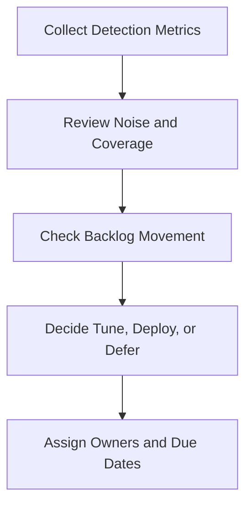

# Weekly Detection Review Pack

**Audience**: Detection Engineer, SOC Manager, Threat Hunter, Senior Analyst
**Purpose**: Use this pack to review weekly detection performance, backlog movement, false positive trends, and decisions required for tuning or deployment.

## 1. Meeting Header

| Field | Value |
|:---|:---|
| **Review Week** | [YYYY-WW] |
| **Prepared By** | |
| **Review Date** | |
| **Chair** | |

## 2. Minimum Inputs

-   [ ] Detection backlog updated before the meeting
-   [ ] False positive trends for the week available
-   [ ] Missed detection or hunt findings captured
-   [ ] Rule test or deployment outcomes recorded

## 3. Detection Health Summary

| Area | Status | Notes |
|:---|:---:|:---|
| New detections requested | 🟢 / 🟡 / 🔴 | |
| Detections deployed this week | 🟢 / 🟡 / 🔴 | |
| False positive pressure | 🟢 / 🟡 / 🔴 | |
| Coverage gaps affecting critical assets | 🟢 / 🟡 / 🔴 | |

## 4. Weekly Escalation Thresholds

| Condition | Threshold | Default Decision | Move To |
|:---|:---|:---|:---|
| **False positive pressure** | Same rule or use case creates analyst disruption for 2 straight weeks | Tune, suppress narrowly, or rollback | Monthly Governance Review if service quality is affected |
| **Missed detection** | Confirmed gap on Critical/High incident path | Build or re-test immediately | Weekly Telemetry Review if missing data blocks fix |
| **Coverage gap** | Critical asset or top-priority use case has no deployable detection | Prioritize backlog item above normal queue | Monthly Governance Review if unresolved by month-end |
| **Deployment instability** | Rule rollback, emergency disablement, or repeated test failure | Freeze release and investigate | Monthly Remediation Review if change is tied to incident/audit action |

## 5. Backlog Review

| Item | Priority | Owner | Current State | Next Action |
|:---|:---:|:---|:---|:---|
| | High / Medium / Low | | | |
| | | | | |

## 6. Tuning and Quality Review

| Topic | Finding | Decision | Owner |
|:---|:---|:---|:---|
| False positives | | Tune / Monitor / Defer | |
| Missed detections | | Build / Re-test / Escalate | |
| Retired rules | | Retire / Keep / Replace | |

## 7. Decisions Required This Week

-   [ ] Approve priority changes for detection backlog items.
-   [ ] Approve emergency tuning or rollback if analyst load is at risk.
-   [ ] Escalate telemetry gaps that block high-priority detections.
-   [ ] Assign due dates for every accepted action.

## 8. Carry-Forward Rules

| If Weekly Review Finds | Move To | Required Output |
|:---|:---|:---|
| **Telemetry dependency blocks detection release** | Weekly Telemetry Review Pack | Missing source, parser issue, affected use case, and due date |
| **Detection gap contributes to open incident remediation** | Monthly Remediation Review Pack | Remediation item owner, affected incident, and validation requirement |
| **Repeated noise or coverage issue impacts SLA or analyst load** | Monthly Governance Review Pack | Service impact summary, owner, and escalation recommendation |

## Related Documents

-   [Detection Backlog Prioritization](Detection_Backlog_Prioritization.en.md)
-   [Detection Request Template](Detection_Request_Template.en.md)
-   [Alert Tuning](../06_Operations_Management/Alert_Tuning.en.md)
-   [Detection Rule Testing](../06_Operations_Management/Detection_Rule_Testing.en.md)
-   [Weekly Telemetry Review Pack](Weekly_Telemetry_Review_Pack.en.md)
-   [Monthly Remediation Review Pack](Monthly_Remediation_Review_Pack.en.md)
-   [Monthly Governance Review Pack](Monthly_Governance_Review_Pack.en.md)

## References

-   [MITRE ATT&CK](https://attack.mitre.org/)
-   [Sigma Rule Specification](https://sigmahq.io/sigma-specification/specification/sigma-rules-specification.html)
