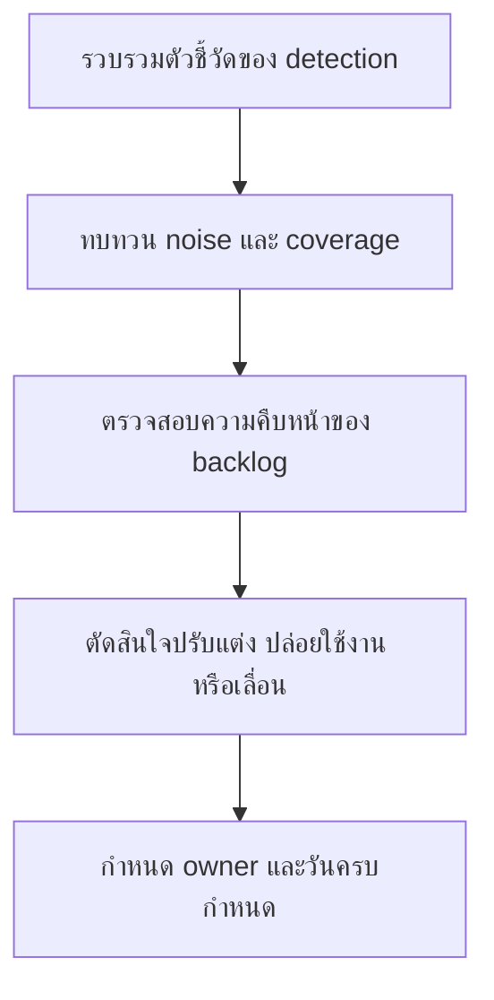

# ชุดทบทวน Detection ประจำสัปดาห์

**กลุ่มเป้าหมาย**: Detection Engineer, SOC Manager, Threat Hunter, Senior Analyst
**วัตถุประสงค์**: ใช้ชุดเอกสารนี้เพื่อทบทวนผลการทำงานของ detection รายสัปดาห์ ความเคลื่อนไหวของ backlog แนวโน้ม false positive และประเด็นตัดสินใจเรื่อง tuning หรือ deployment

## 1. ส่วนหัวการประชุม

| รายการ | ค่า |
|:---|:---|
| **สัปดาห์ที่ทบทวน** | [YYYY-WW] |
| **ผู้จัดทำ** | |
| **วันที่ทบทวน** | |
| **ประธานการประชุม** | |

## 2. ข้อมูลขั้นต่ำที่ต้องมี

-   [ ] อัปเดต detection backlog ก่อนประชุมแล้ว
-   [ ] มี false positive trends ของสัปดาห์
-   [ ] บันทึก missed detection หรือ hunt findings แล้ว
-   [ ] บันทึกผล rule test หรือ deployment แล้ว

## 3. สรุปสุขภาพของ Detection

| มิติ | สถานะ | หมายเหตุ |
|:---|:---:|:---|
| คำขอ detection ใหม่ | 🟢 / 🟡 / 🔴 | |
| detections ที่ deploy สัปดาห์นี้ | 🟢 / 🟡 / 🔴 | |
| แรงกดดันจาก false positive | 🟢 / 🟡 / 🔴 | |
| coverage gaps ที่กระทบ critical assets | 🟢 / 🟡 / 🔴 | |

## 4. เกณฑ์การยกระดับรายสัปดาห์

| เงื่อนไข | เกณฑ์ | การตัดสินใจตั้งต้น | ต้องส่งต่อไปที่ |
|:---|:---|:---|:---|
| **false positive pressure** | rule หรือ use case เดิมทำให้ analyst รับภาระหนักต่อเนื่อง 2 สัปดาห์ | tune, suppress แบบแคบ, หรือ rollback | Monthly Governance Review ถ้ากระทบ service quality |
| **missed detection** | ยืนยัน detection gap บนเส้นทาง incident ระดับ Critical/High | build หรือ re-test ทันที | Weekly Telemetry Review ถ้าติดที่ข้อมูลไม่พอ |
| **coverage gap** | critical asset หรือ top-priority use case ยังไม่มี detection ที่ deploy ได้ | ดัน backlog item ขึ้นเหนือคิวปกติ | Monthly Governance Review ถ้ายังไม่ปิดภายในสิ้นเดือน |
| **deployment instability** | มี rule rollback, emergency disable, หรือ test fail ซ้ำ | freeze release และสืบสวน | Monthly Remediation Review ถ้าเกี่ยวกับ incident/audit action |

## 5. การทบทวน Backlog

| รายการ | ลำดับความสำคัญ | Owner | สถานะปัจจุบัน | การดำเนินการถัดไป |
|:---|:---:|:---|:---|:---|
| | High / Medium / Low | | | |
| | | | | |

## 6. การทบทวน Tuning และคุณภาพ

| หัวข้อ | ข้อค้นพบ | การตัดสินใจ | Owner |
|:---|:---|:---|:---|
| False positives | | Tune / Monitor / Defer | |
| Missed detections | | Build / Re-test / Escalate | |
| Retired rules | | Retire / Keep / Replace | |

## 7. ประเด็นที่ต้องตัดสินใจสัปดาห์นี้

-   [ ] อนุมัติการเปลี่ยนลำดับความสำคัญของ detection backlog
-   [ ] อนุมัติ emergency tuning หรือ rollback หาก analyst load เริ่มเสี่ยง
-   [ ] escalate telemetry gaps ที่บล็อก high-priority detections
-   [ ] กำหนด due date ให้ action ที่รับแล้วทุกข้อ

## 8. กติกาการส่งต่อ

| ถ้าการทบทวนรายสัปดาห์พบว่า | ต้องส่งต่อไปที่ | ผลลัพธ์ที่ต้องมี |
|:---|:---|:---|
| **telemetry dependency บล็อกการปล่อย detection** | Weekly Telemetry Review Pack | แหล่งข้อมูลที่ขาด, parser issue, use case ที่ได้รับผลกระทบ, และ due date |
| **detection gap ทำให้ remediation ของ incident ยังไม่ปิด** | Monthly Remediation Review Pack | remediation item owner incident ที่ได้รับผลกระทบ และหลักฐานที่ต้อง validate |
| **noise หรือ coverage issue ซ้ำจนกระทบ SLA หรือ analyst load** | Monthly Governance Review Pack | service impact summary, owner, และข้อเสนอแนะในการ escalate |

## เอกสารที่เกี่ยวข้อง (Related Documents)

-   [แบบฟอร์มจัดลำดับ Detection Backlog](Detection_Backlog_Prioritization.th.md)
-   [แบบฟอร์มคำขอ Detection](Detection_Request_Template.th.md)
-   [แนวทาง Alert Tuning](../06_Operations_Management/Alert_Tuning.th.md)
-   [การทดสอบ Detection Rules](../06_Operations_Management/Detection_Rule_Testing.th.md)
-   [ชุดทบทวน Telemetry ประจำสัปดาห์](Weekly_Telemetry_Review_Pack.th.md)
-   [ชุดทบทวน Remediation รายเดือน](Monthly_Remediation_Review_Pack.th.md)
-   [ชุดทบทวน Governance รายเดือน](Monthly_Governance_Review_Pack.th.md)

## References

-   [MITRE ATT&CK](https://attack.mitre.org/)
-   [Sigma Rule Specification](https://sigmahq.io/sigma-specification/specification/sigma-rules-specification.html)
