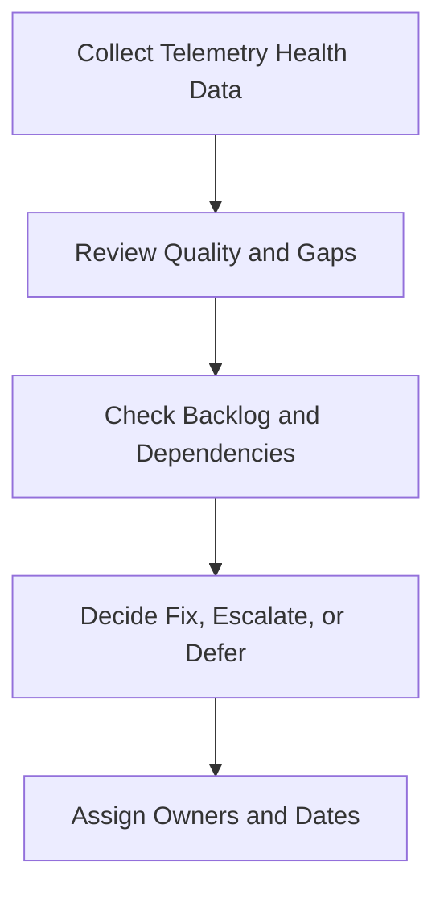

# Weekly Telemetry Review Pack

**Audience**: Security Engineer, SOC Manager, Platform Owner, Detection Engineer
**Purpose**: Use this pack to review telemetry onboarding progress, data quality issues, ingestion failures, and decisions affecting detection readiness.

## 1. Meeting Header

| Field | Value |
|:---|:---|
| **Review Week** | [YYYY-WW] |
| **Prepared By** | |
| **Review Date** | |
| **Chair** | |

## 2. Minimum Inputs

-   [ ] Telemetry backlog updated
-   [ ] Ingestion failures or parser defects summarized
-   [ ] Data quality checks completed for critical sources
-   [ ] New onboarding requests logged

## 3. Telemetry Health Summary

| Area | Status | Notes |
|:---|:---:|:---|
| Critical source availability | 🟢 / 🟡 / 🔴 | |
| Data quality and timestamp health | 🟢 / 🟡 / 🔴 | |
| Onboarding progress | 🟢 / 🟡 / 🔴 | |
| Detection blockers caused by telemetry | 🟢 / 🟡 / 🔴 | |

## 4. Weekly Escalation Thresholds

| Condition | Threshold | Default Decision | Move To |
|:---|:---|:---|:---|
| **Critical source unavailable** | Log source outage or unusable data for crown-jewel or regulated service | Restore immediately or approve workaround | Monthly Governance Review if unresolved in current month |
| **Parser or schema defect** | Breaks detection logic or investigation for prioritized use case | Fix parser or revert change | Weekly Detection Review when rule release depends on the fix |
| **Onboarding slippage** | High-priority source misses target date with no validated blocker | Reprioritize or escalate dependency owner | Monthly Governance Review if business risk grows |
| **Blind spot requires temporary acceptance** | No viable short-term fix for required telemetry | Apply compensating control and document gap | Quarterly Risk Acceptance Review if it persists |

## 5. Backlog and Dependency Review

| Item | Priority | Dependency | Owner | Next Action |
|:---|:---:|:---|:---|:---|
| | High / Medium / Low | | | |
| | | | | |

## 6. Decisions Required This Week

-   [ ] Escalate sources causing critical detection blind spots.
-   [ ] Approve schedule changes for onboarding or parser fixes.
-   [ ] Confirm data owner actions and due dates.
-   [ ] Record whether any gap requires risk acceptance or temporary workaround.

## 7. Carry-Forward Rules

| If Weekly Review Finds | Move To | Required Output |
|:---|:---|:---|
| **Telemetry defect blocks detection release** | Weekly Detection Review Pack | Affected rules, interim tuning decision, and expected fix date |
| **Telemetry issue leaves incident remediation incomplete** | Monthly Remediation Review Pack | Open remediation item, affected asset/service, and owner |
| **Persistent visibility gap affects service quality or compliance** | Monthly Governance Review Pack | Blind spot statement, business impact, and escalation recommendation |
| **Long-lived blind spot needs formal tolerance** | Quarterly Risk Acceptance Review Pack | Residual risk statement, compensating control, and expiry recommendation |

## Related Documents

-   [Telemetry Backlog Prioritization](Telemetry_Backlog_Prioritization.en.md)
-   [Log Source Onboarding Request](Log_Source_Onboarding_Request.en.md)
-   [Log Source Matrix](../06_Operations_Management/Log_Source_Matrix.en.md)
-   [SOC Service Catalog](../06_Operations_Management/SOC_Service_Catalog.en.md)
-   [Weekly Detection Review Pack](Weekly_Detection_Review_Pack.en.md)
-   [Monthly Remediation Review Pack](Monthly_Remediation_Review_Pack.en.md)
-   [Monthly Governance Review Pack](Monthly_Governance_Review_Pack.en.md)

## References

-   [NIST SP 800-92](https://csrc.nist.gov/publications/detail/sp/800-92/final)
-   [Open Cybersecurity Schema Framework](https://schema.ocsf.io/)
