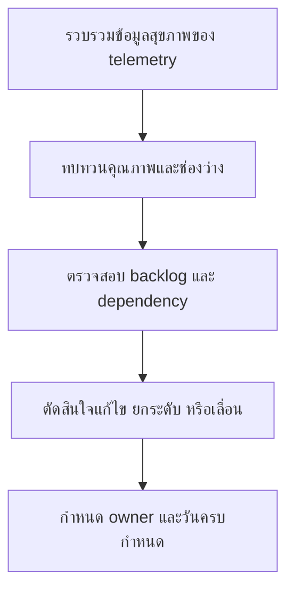

# ชุดทบทวน Telemetry ประจำสัปดาห์

**กลุ่มเป้าหมาย**: Security Engineer, SOC Manager, Platform Owner, Detection Engineer
**วัตถุประสงค์**: ใช้ชุดเอกสารนี้เพื่อทบทวนความคืบหน้าในการ onboarding telemetry ปัญหา data quality, ingestion failure, และประเด็นตัดสินใจที่กระทบ detection readiness

## 1. ส่วนหัวการประชุม

| Field | Value |
|:---|:---|
| **Review Week** | [YYYY-WW] |
| **ผู้จัดทำ** | |
| **วันที่ทบทวน** | |
| **ประธานการประชุม** | |

## 2. ข้อมูลขั้นต่ำที่ต้องมี

-   [ ] อัปเดต telemetry backlog แล้ว
-   [ ] สรุป ingestion failures หรือ parser defects แล้ว
-   [ ] ตรวจ data quality checks สำหรับ critical sources แล้ว
-   [ ] บันทึกคำขอ onboarding ใหม่แล้ว

## 3. สรุปสุขภาพของ Telemetry

| Area | Status | Notes |
|:---|:---:|:---|
| ความพร้อมของ critical sources | 🟢 / 🟡 / 🔴 | |
| data quality และ timestamp health | 🟢 / 🟡 / 🔴 | |
| ความคืบหน้าของ onboarding | 🟢 / 🟡 / 🔴 | |
| detection blockers ที่เกิดจาก telemetry | 🟢 / 🟡 / 🔴 | |

## 4. เกณฑ์การยกระดับรายสัปดาห์

| เงื่อนไข | เกณฑ์ | การตัดสินใจตั้งต้น | ต้องส่งต่อไปที่ |
|:---|:---|:---|:---|
| **critical source ใช้งานไม่ได้** | log source outage หรือข้อมูลใช้ไม่ได้สำหรับ crown-jewel หรือ regulated service | กู้คืนทันทีหรืออนุมัติ workaround | Monthly Governance Review ถ้ายังไม่ฟื้นในเดือนนี้ |
| **parser หรือ schema defect** | กระทบ detection logic หรือการสืบสวนของ prioritized use case | แก้ parser หรือ revert change | Weekly Detection Review เมื่อ rule release รอ fix นี้อยู่ |
| **onboarding ล่าช้า** | high-priority source พลาด target date โดยไม่มี blocker ที่ยืนยันได้ | reprioritize หรือ escalate ไปยัง dependency owner | Monthly Governance Review ถ้า business risk สูงขึ้น |
| **blind spot ต้องยอมรับชั่วคราว** | ไม่มี short-term fix ที่ใช้ได้สำหรับ telemetry ที่จำเป็น | ใช้ compensating control และบันทึก gap | Quarterly Risk Acceptance Review ถ้ายืดเยื้อ |

## 5. การทบทวน Backlog และ Dependency

| Item | Priority | Dependency | Owner | Next Action |
|:---|:---:|:---|:---|:---|
| | High / Medium / Low | | | |
| | | | | |

## 6. ประเด็นที่ต้องตัดสินใจสัปดาห์นี้

-   [ ] escalate แหล่งข้อมูลที่ทำให้เกิด critical detection blind spots
-   [ ] อนุมัติการเปลี่ยน schedule ของ onboarding หรือ parser fixes
-   [ ] ยืนยัน action และ due date ของ data owner
-   [ ] บันทึกว่าช่องว่างใดต้องใช้ risk acceptance หรือ workaround ชั่วคราว

## 7. กติกาการส่งต่อ

| ถ้าการทบทวนรายสัปดาห์พบว่า | ต้องส่งต่อไปที่ | ผลลัพธ์ที่ต้องมี |
|:---|:---|:---|
| **telemetry defect บล็อก detection release** | Weekly Detection Review Pack | rules ที่ได้รับผลกระทบ, interim tuning decision, และวันที่คาดว่าจะ fix |
| **telemetry issue ทำให้ remediation ของ incident ยังไม่ปิด** | Monthly Remediation Review Pack | remediation item, asset/service ที่ได้รับผลกระทบ, และ owner |
| **visibility gap ต่อเนื่องจนกระทบ service quality หรือ compliance** | Monthly Governance Review Pack | blind spot statement, business impact, และข้อเสนอแนะในการ escalate |
| **blind spot อยู่ยาวจนต้องยอมรับความเสี่ยง** | Quarterly Risk Acceptance Review Pack | residual risk statement, compensating control, และข้อเสนอเรื่องวันหมดอายุ |

## เอกสารที่เกี่ยวข้อง (Related Documents)

-   [Telemetry Backlog Prioritization](Telemetry_Backlog_Prioritization.th.md)
-   [Log Source Onboarding Request](Log_Source_Onboarding_Request.th.md)
-   [Log Source Matrix](../06_Operations_Management/Log_Source_Matrix.th.md)
-   [SOC Service Catalog](../06_Operations_Management/SOC_Service_Catalog.th.md)
-   [Weekly Detection Review Pack](Weekly_Detection_Review_Pack.th.md)
-   [Monthly Remediation Review Pack](Monthly_Remediation_Review_Pack.th.md)
-   [Monthly Governance Review Pack](Monthly_Governance_Review_Pack.th.md)

## References

-   [NIST SP 800-92](https://csrc.nist.gov/publications/detail/sp/800-92/final)
-   [Open Cybersecurity Schema Framework](https://schema.ocsf.io/)
