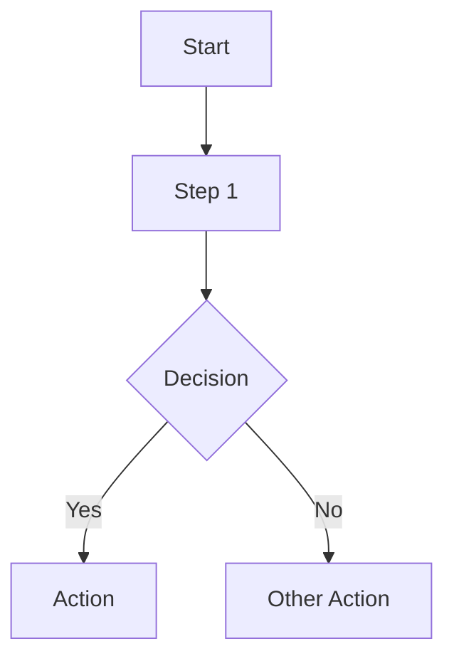

# AGENTS.md — SOC Standard Operating Procedures Repository

> This file is the **single source of truth** for all AI agents and human contributors working on this repository.
> It is symlinked to: `CLAUDE.md`, `.cursorrules`, `.github/copilot-instructions.md`

---

## 🎯 Project Identity

### WHY — Purpose
This repository provides **vendor-agnostic, production-ready SOC Standard Operating Procedures** that any organization can adopt to build or mature their Security Operations Center. All content follows NIST, MITRE ATT&CK, and ISO 27001/27035 frameworks.

### WHAT — Scope
- 20 Incident Response Playbooks (PB-01 to PB-20)
- Operations Management (Shift Handoff, KPIs, Team Structure, CTI, TLP)
- Detection Engineering (Sigma rules, YARA signatures)
- Simulation & Purple Teaming
- Training & Onboarding Curriculum
- Executive Reporting Templates
- All content is **bilingual** (English + Thai)

### HOW — Technology
- **Format**: Markdown (`.md`) with Mermaid diagrams
- **Diagrams**: Mermaid.js (rendered natively on GitHub)
- **Detection Rules**: Sigma YAML, YARA
- **Quality Tools**: `python3 tools/check_links.py`, `python3 tools/export_docs.py`
- **No build system required** — raw Markdown works on GitHub directly

**Maintained by**: [cyberdefense.co.th](https://cyberdefense.co.th) | Line OA: `@cyberdefense`

---

## 📁 Directory Structure

```
SOCSOP/
├── 01_Onboarding/           # SOC infrastructure setup
├── 02_Platform_Operations/   # Data governance, deployment procedures
├── 03_User_Guides/           # Detection engineering, tool integration
├── 04_Troubleshooting/       # Standard troubleshooting methodology
├── 05_Incident_Response/     # IR Framework + 20 Playbooks
│   └── Playbooks/            # Individual incident playbooks (PB-01 to PB-20)
├── 06_Operations_Management/ # Shift handoff, metrics, team structure, TLP, CTI
├── 07_Detection_Rules/       # Sigma detection rules (.yml)
├── 08_Simulation_Testing/    # Purple team guides, Atomic Red Team maps
├── 09_Training_Onboarding/   # Analyst curriculum, training checklists
├── 10_File_Signatures/       # YARA rules
├── 11_Reporting_Templates/   # Monthly/quarterly executive reports
├── templates/                # Incident report, shift handover, RFC forms
├── tools/                    # Utility scripts (export, link check)
└── assets/                   # Images (hero banner, etc.)
```

---

## 📛 File Naming Conventions

| Rule | Example |
|---|---|
| English docs end with `.en.md` | `Phishing.en.md` |
| Thai docs end with `.th.md` | `Phishing.th.md` |
| Bilingual docs **always** come in pairs (EN + TH) | `Framework.en.md` + `Framework.th.md` |
| Language-neutral docs use plain `.md` | `Atomic_Test_Map.md`, `README.md` |
| Use `PascalCase_With_Underscores` for filenames | `SOC_Team_Structure.en.md` |
| Detection rules use lowercase with underscores | `win_multiple_failed_logins.yml` |
| YARA rules use lowercase with underscores | `ransomware_extensions.yar` |

---

## 📄 Document Structure Requirements

Every SOP document **MUST** contain these sections in this exact order:

### 1. Title & Metadata
```markdown
# Document Title

**ID**: PB-XX (for playbooks)
**Severity**: Low/Medium/High/Critical (for playbooks)
**Trigger**: What causes this playbook to activate
```

### 2. Mermaid Flowchart
Every document must include at least one `mermaid` diagram visualizing the process or workflow.

````markdown

````

**Mermaid rules**:
- Thai versions must have **localized labels** (not English copy-pasted)
- Use `graph TD` (top-down) for process flows
- Use `graph LR` (left-right) for timelines/career paths
- Keep diagrams concise (max ~10 nodes)
- Use `style` for color coding when useful

### 3. Main Content
Structured with numbered sections (`## 1.`, `## 2.`, etc.) and actionable checklists:
```markdown
-   [ ] **Action Item**: Description of what to do.
```

### 4. Related Documents (Cross-Links)
Cross-links to other documents in the repository. Insert **before** References.

```
## Related Documents          <!-- English -->
## เอกสารที่เกี่ยวข้อง (Related Documents)  <!-- Thai -->

-   Document Name → relative/path/to/file.en.md
```

**Cross-link rules**:
- Playbooks → IR Framework, Incident Report Template, related Playbooks
- Operations docs → SOC Metrics, Assessment Checklist, IR Framework
- Always use **relative paths** (e.g., `../05_Incident_Response/Framework.en.md`)
- Every file must link to at least 2 other internal documents

### 5. References
External links to authoritative sources. Always include at least 2 references.

```markdown
## References
-   [NIST SP 800-61r2](https://csrc.nist.gov/publications/detail/sp/800-61/rev-2/final)
-   [MITRE ATT&CK](https://attack.mitre.org/)
```

**Preferred reference sources** (in order of priority):
1. NIST (SP 800-61, 800-53, CSF)
2. MITRE ATT&CK
3. CISA
4. SANS
5. OWASP
6. ISO 27001/27035
7. SOC-CMM
8. FIRST CSIRT Services Framework

---

## 🌐 Bilingual Content Rules

| Rule | Details |
|---|---|
| Every EN doc must have a TH counterpart | No orphaned single-language files |
| Thai docs are **localized**, not literal translations | Adapt terminology naturally |
| Mermaid labels must be localized | `Alert[แจ้งเตือน]` not `Alert[Alert]` |
| Section headers include Thai + English | `## 1. นิยามปัญหา (Defining the Problem)` |
| Keep technical terms untranslated | SIEM, MITRE ATT&CK, IOC, TLP, YARA, Sigma |
| References section header stays as `## References` | Same in both EN and TH versions |
| Related Documents header is bilingual in TH | `## เอกสารที่เกี่ยวข้อง (Related Documents)` |

---

## 🎨 Tone & Style Guide

### Writing Style
- **Actionable**: Write procedures as clear, step-by-step instructions
- **Imperative mood**: "Check the logs" not "The logs should be checked"
- **Concise**: Short bullet points, no long paragraphs
- **Professional**: Suitable for SOC analysts and CISO-level readers

### Formatting Rules
- Use `-   ` (3 spaces after dash) for bullet points
- Use `**Bold**` for key terms and action items
- Use backticks for commands, tools, and technical identifiers: `nslookup`, `SIEM`, `T1566`
- Tables for structured data (KPIs, staffing models, severity matrices)
- Numbered sections for sequential processes (`## 1.`, `## 2.`)

---

## 🛡️ Playbook Conventions

| Property | Rule |
|---|---|
| **ID Format** | `PB-XX` (e.g., PB-01, PB-02 ... PB-20) |
| **Standard Sections** | Analysis → Containment → Eradication → Recovery |
| **Mermaid Flow** | Must visualize the triage/decision process |
| **MITRE ATT&CK** | Reference relevant Technique IDs (e.g., T1566, T1078) |
| **Severity Levels** | Low, Medium, High, Critical |
| **Checklists** | Use `- [ ]` for operational steps |
| **Cross-Links** | Link to IR Framework, Incident Report template, related PBs |

### Playbook Index (PB-01 to PB-20)
```
PB-01 Phishing               PB-11 Suspicious Script
PB-02 Ransomware             PB-12 Lateral Movement
PB-03 Malware Infection      PB-13 C2 Communication
PB-04 Brute Force            PB-14 Insider Threat
PB-05 Account Compromise     PB-15 Log Clearing
PB-06 Impossible Travel      PB-16 Lost Device
PB-07 Privilege Escalation   PB-17 Rogue Admin
PB-08 Data Exfiltration      PB-18 BEC (Business Email Compromise)
PB-09 DDoS Attack            PB-19 Web Application Attack
PB-10 Exploit/Vulnerability  PB-20 Cloud-specific (AWS/Azure)
```

---

## 🔍 Detection Rules

### Sigma Rules (`07_Detection_Rules/`)
- **Format**: Sigma YAML specification v2
- **Naming**: `<category>_<description>.yml` (e.g., `win_multiple_failed_logins.yml`)
- **Required fields**: `title`, `status`, `description`, `logsource`, `detection`, `level`, `tags`
- **Tags**: Must include MITRE ATT&CK technique IDs (e.g., `attack.t1110`)

### YARA Rules (`10_File_Signatures/`)
- **Format**: YARA rule syntax
- **Naming**: `<family>_<indicator>.yar`
- **Required**: `meta`, `strings`, `condition` blocks

---

## ✅ Verification & Quality Checks

### Before Every Commit
```bash
# 1. Check all internal links are valid
python3 tools/check_links.py

# 2. Regenerate consolidated manual
python3 tools/export_docs.py
```

### Pre-Commit Checklist
- [ ] `check_links.py` passes ✅ (no broken internal links)
- [ ] `export_docs.py` regenerates `SOC_Manual_Consolidated.md`
- [ ] Both EN and TH versions updated if content changed
- [ ] Mermaid diagrams render correctly
- [ ] Related Documents section present with cross-links
- [ ] References section present with at least 2 credible sources
- [ ] README.md updated if new documents were added
- [ ] No duplicate lines (known issue — scan after batch edits)

---

## 📝 Git Commit Conventions

**Pattern**: `<Action> <What> (<Details>)`

```
Add SOC Team Structure document (EN/TH) with org chart, roles, career path
Fix duplicate lines from flow insertion, regenerate consolidated manual
Add cross-links between all documents (Related Documents sections)
Standardize Operations Management docs: Add flows and references
```

**Actions**: `Add`, `Fix`, `Update`, `Remove`, `Refactor`, `Standardize`

---

## 📖 README Maintenance

When adding new documents:
1. Add a row to the relevant section table in `README.md`
2. Follow the existing table format with English and Thai links
3. Keep the table alphabetically sorted within each section

---

## ⚠️ Known Pitfalls & Gotchas

| Pitfall | Solution |
|---|---|
| `multi_replace` tool duplicates lines when inserting flows | Scan for duplicate lines after batch edits with `grep` |
| Mermaid nodes with parentheses break rendering | Use `["text with (parens)"]` square bracket syntax |
| Thai text in Mermaid can overflow | Keep labels short, use abbreviations |
| Symlinks not followed on some Git platforms | Verify CLAUDE.md, .cursorrules render on GitHub |
| `check_links.py` only validates internal links | External URLs (References) are NOT checked automatically |
| `SOC_Manual_Consolidated.md` must be regenerated | Always run `export_docs.py` after any content change |

---

## 🔒 Security & Confidentiality Rules

- **NEVER** commit real credentials, API keys, or tokens
- **NEVER** include client-specific data (company names, IPs, domains)
- **NEVER** reference internal infrastructure details
- All examples must use **placeholder values**: `[COMPANY]`, `[IP_ADDRESS]`, `[YYYY-MM-DD]`
- Keep all content **vendor-agnostic** — no Splunk, QRadar, Sentinel-specific content
- Use generic terms: "SIEM query" not "SPL query", "EDR" not "CrowdStrike"

---

## 🚀 Common Workflows

### Adding a New Playbook
```
1. Create `05_Incident_Response/Playbooks/<Name>.en.md`
2. Create `05_Incident_Response/Playbooks/<Name>.th.md`
3. Include: Metadata, Mermaid flow, Analysis/Containment/Eradication/Recovery
4. Add Related Documents (→ Framework, → Incident Report Template)
5. Add References (MITRE ATT&CK technique + 1 more)
6. Update README.md table
7. Run: python3 tools/check_links.py
8. Run: python3 tools/export_docs.py
9. Commit with: "Add PB-XX <Name> playbook (EN/TH)"
```

### Adding a New Operations Document
```
1. Create `06_Operations_Management/<Name>.en.md`
2. Create `06_Operations_Management/<Name>.th.md`
3. Include: Mermaid flow, structured content, checklists
4. Add Related Documents (→ SOC Metrics, → Assessment Checklist)
5. Add References (NIST/SOC-CMM/SANS)
6. Update README.md table
7. Run verification scripts
8. Commit with: "Add <Name> document (EN/TH)"
```

### Updating Existing Documents
```
1. Edit both EN and TH versions
2. Verify Mermaid diagrams still render
3. Verify cross-links still work
4. Run: python3 tools/check_links.py
5. Run: python3 tools/export_docs.py
6. Commit with: "Update <Name>: <what changed>"
```

---

## ❌ Do NOT

- ❌ Use vendor-specific terminology (`"Splunk query"` → use `"SIEM query"`)
- ❌ Create single-language documents (always EN + TH pair)
- ❌ Skip the Mermaid flowchart in any SOP document
- ❌ Use absolute file paths in cross-links (always relative)
- ❌ Commit without running `check_links.py` and `export_docs.py`
- ❌ Leave References section empty (minimum 2 sources)
- ❌ Hardcode organization-specific details (keep vendor-agnostic)
- ❌ Include real credentials, client data, or internal infrastructure info
- ❌ Modify `SOC_Manual_Consolidated.md` directly (it's auto-generated)
- ❌ Create deeply nested directories (max 2 levels deep)
- ❌ Skip the Related Documents section (every file must cross-link)
- ❌ Use inline HTML in Markdown (except README badges/footer)
