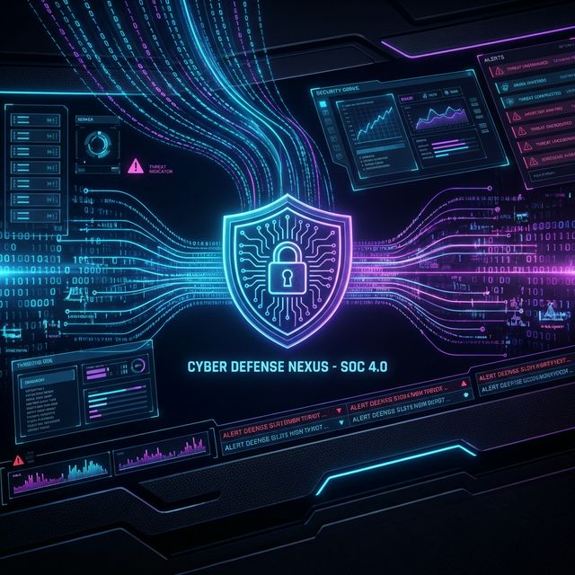

# SOC Standard Operating Procedures

This repository contains **Standard Operating Procedures (SOPs)** for a modern Security Operations Center (SOC). These documents are designed to be vendor-agnostic and follow industry best practices (NIST, MITRE ATT&CK).

เอกสารนี้รวบรวม **ระเบียบปฏิบัติมาตรฐาน (SOPs)** สำหรับศูนย์ปฏิบัติการความปลอดภัย (SOC) ออกแบบมาให้เป็นกลางทางเทคโนโลยีและปฏิบัติตามมาตรฐานอุตสาหกรรม

## Directory Structure & Documents

### 🚀 00_Getting_Started (New to SOC? Start Here!)
| Document | English | ภาษาไทย |
| :--- | :--- | :--- |
| **SOC 101 — What is a SOC?** | [Link](00_Getting_Started/SOC_101.en.md) | [ลิ้งค์](00_Getting_Started/SOC_101.th.md) |
| **Quickstart Guide** | [Link](00_Getting_Started/Quickstart_Guide.en.md) | [ลิ้งค์](00_Getting_Started/Quickstart_Guide.th.md) |
| **Glossary of Terms** | [Link](00_Getting_Started/Glossary.en.md) | [ลิ้งค์](00_Getting_Started/Glossary.th.md) |

### 🏗️ 01_SOC_Fundamentals (Building a SOC from Zero)
| Document | English | ภาษาไทย |
| :--- | :--- | :--- |
| **SOC Building Roadmap** (Start here!) | [Link](01_SOC_Fundamentals/SOC_Building_Roadmap.en.md) | [ลิ้งค์](01_SOC_Fundamentals/SOC_Building_Roadmap.th.md) |
| **Technology Stack Selection** | [Link](01_SOC_Fundamentals/Technology_Stack.en.md) | [ลิ้งค์](01_SOC_Fundamentals/Technology_Stack.th.md) |
| **Infrastructure Setup** (Hands-on) | [Link](01_SOC_Fundamentals/Infrastructure_Setup.en.md) | [ลิ้งค์](01_SOC_Fundamentals/Infrastructure_Setup.th.md) |
| **Use Case Prioritization** | [Link](01_SOC_Fundamentals/Use_Case_Prioritization.en.md) | [ลิ้งค์](01_SOC_Fundamentals/Use_Case_Prioritization.th.md) |
| **Budget & Staffing** | [Link](01_SOC_Fundamentals/Budget_Staffing.en.md) | [ลิ้งค์](01_SOC_Fundamentals/Budget_Staffing.th.md) |
| **Analyst Training Path** (6-month curriculum) | [Link](01_SOC_Fundamentals/Analyst_Training_Path.en.md) | [ลิ้งค์](01_SOC_Fundamentals/Analyst_Training_Path.th.md) |

### 01_Onboarding
| Document | English | ภาษาไทย |
| :--- | :--- | :--- |
| **Setup**: SOC Infrastructure Setup | [Link](01_Onboarding/System_Activation.en.md) | [ลิ้งค์](01_Onboarding/System_Activation.th.md) |

### 02_Platform_Operations
| Document | English | ภาษาไทย |
| :--- | :--- | :--- |
| Data Governance & Retention | [Link](02_Platform_Operations/Database_Management.en.md) | [ลิ้งค์](02_Platform_Operations/Database_Management.th.md) |
| Change Management & Deployment | [Link](02_Platform_Operations/Deployment_Procedures.en.md) | [ลิ้งค์](02_Platform_Operations/Deployment_Procedures.th.md) |

### 03_User_Guides
| Document | English | ภาษาไทย |
| :--- | :--- | :--- |
| Detection Engineering Lifecycle | [Link](03_User_Guides/Content_Management.en.md) | [ลิ้งค์](03_User_Guides/Content_Management.th.md) |
| Tool Integration Strategy | [Link](03_User_Guides/Integration_Hub.en.md) | [ลิ้งค์](03_User_Guides/Integration_Hub.th.md) |

### 04_Troubleshooting
| Document | English | ภาษาไทย |
| :--- | :--- | :--- |
| Standard Methodology | [Link](04_Troubleshooting/Common_Issues.en.md) | [ลิ้งค์](04_Troubleshooting/Common_Issues.th.md) |

### 10_Compliance
| Document | English | ภาษาไทย |
| :--- | :--- | :--- |
| **Compliance Mapping** (ISO 27001 / NIST CSF / PCI DSS) | [Link](10_Compliance/Compliance_Mapping.en.md) | [ลิ้งค์](10_Compliance/Compliance_Mapping.th.md) |
| **PDPA Incident Response** (72-hour notification) | [Link](10_Compliance/PDPA_Incident_Response.en.md) | [ลิ้งค์](10_Compliance/PDPA_Incident_Response.th.md) |

### 05_Incident_Response
| Document | English | ภาษาไทย |
| :--- | :--- | :--- |
| **Framework**: NIST-based IR | [Link](05_Incident_Response/Framework.en.md) | [ลิ้งค์](05_Incident_Response/Framework.th.md) |
| **Severity Matrix** (P1–P4 Classification) | [Link](05_Incident_Response/Severity_Matrix.en.md) | [ลิ้งค์](05_Incident_Response/Severity_Matrix.th.md) |
| **Tier 1 Runbook** | [Link](05_Incident_Response/Tier1_Runbook.en.md) | [ลิ้งค์](05_Incident_Response/Tier1_Runbook.th.md) |
| **Evidence Collection** | [Link](05_Incident_Response/Evidence_Collection.en.md) | [ลิ้งค์](05_Incident_Response/Evidence_Collection.th.md) |
| **Communication Templates** (6 templates) | [Link](05_Incident_Response/Communication_Templates.en.md) | [ลิ้งค์](05_Incident_Response/Communication_Templates.th.md) |
| **Tabletop Exercises** (5 scenarios) | [Link](05_Incident_Response/Tabletop_Exercises.en.md) | [ลิ้งค์](05_Incident_Response/Tabletop_Exercises.th.md) |
| **Purple Team Exercises** (9 exercises) | [Link](05_Incident_Response/Purple_Team_Exercises.en.md) | [ลิ้งค์](05_Incident_Response/Purple_Team_Exercises.th.md) |
| **Interview Guide** (T1/T2/Lead) | [Link](05_Incident_Response/Interview_Guide.en.md) | [ลิ้งค์](05_Incident_Response/Interview_Guide.th.md) |
| **SOAR Playbook Templates** (6 workflows) | [Link](05_Incident_Response/SOAR_Playbooks.en.md) | [ลิ้งค์](05_Incident_Response/SOAR_Playbooks.th.md) |
| **Lessons Learned Template** | [Link](05_Incident_Response/Lessons_Learned_Template.en.md) | [ลิ้งค์](05_Incident_Response/Lessons_Learned_Template.th.md) |
| **Playbook**: PB-01 Phishing | [Link](05_Incident_Response/Playbooks/Phishing.en.md) | [ลิ้งค์](05_Incident_Response/Playbooks/Phishing.th.md) |
| **Playbook**: PB-02 Ransomware | [Link](05_Incident_Response/Playbooks/Ransomware.en.md) | [ลิ้งค์](05_Incident_Response/Playbooks/Ransomware.th.md) |
| **Playbook**: PB-03 Malware Infection | [Link](05_Incident_Response/Playbooks/Malware_Infection.en.md) | [ลิ้งค์](05_Incident_Response/Playbooks/Malware_Infection.th.md) |
| **Playbook**: PB-04 Brute Force | [Link](05_Incident_Response/Playbooks/Brute_Force.en.md) | [ลิ้งค์](05_Incident_Response/Playbooks/Brute_Force.th.md) |
| **Playbook**: PB-05 Account Compromise | [Link](05_Incident_Response/Playbooks/Account_Compromise.en.md) | [ลิ้งค์](05_Incident_Response/Playbooks/Account_Compromise.th.md) |
| **Playbook**: PB-06 Impossible Travel | [Link](05_Incident_Response/Playbooks/Impossible_Travel.en.md) | [ลิ้งค์](05_Incident_Response/Playbooks/Impossible_Travel.th.md) |
| **Playbook**: PB-07 Privilege Escalation | [Link](05_Incident_Response/Playbooks/Privilege_Escalation.en.md) | [ลิ้งค์](05_Incident_Response/Playbooks/Privilege_Escalation.th.md) |
| **Playbook**: PB-08 Data Exfiltration | [Link](05_Incident_Response/Playbooks/Data_Exfiltration.en.md) | [ลิ้งค์](05_Incident_Response/Playbooks/Data_Exfiltration.th.md) |
| **Playbook**: PB-09 DDoS Attack | [Link](05_Incident_Response/Playbooks/DDoS_Attack.en.md) | [ลิ้งค์](05_Incident_Response/Playbooks/DDoS_Attack.th.md) |
| **Playbook**: PB-10 Web App Attack | [Link](05_Incident_Response/Playbooks/Web_Attack.en.md) | [ลิ้งค์](05_Incident_Response/Playbooks/Web_Attack.th.md) |
| **Playbook**: PB-11 Suspicious Script | [Link](05_Incident_Response/Playbooks/Suspicious_Script.en.md) | [ลิ้งค์](05_Incident_Response/Playbooks/Suspicious_Script.th.md) |
| **Playbook**: PB-12 Lateral Movement | [Link](05_Incident_Response/Playbooks/Lateral_Movement.en.md) | [ลิ้งค์](05_Incident_Response/Playbooks/Lateral_Movement.th.md) |
| **Playbook**: PB-13 C2 Communication | [Link](05_Incident_Response/Playbooks/C2_Communication.en.md) | [ลิ้งค์](05_Incident_Response/Playbooks/C2_Communication.th.md) |
| **Playbook**: PB-14 Insider Threat | [Link](05_Incident_Response/Playbooks/Insider_Threat.en.md) | [ลิ้งค์](05_Incident_Response/Playbooks/Insider_Threat.th.md) |
| **Playbook**: PB-15 Rogue Admin | [Link](05_Incident_Response/Playbooks/Rogue_Admin.en.md) | [ลิ้งค์](05_Incident_Response/Playbooks/Rogue_Admin.th.md) |
| **Playbook**: PB-16 Cloud IAM Anomaly | [Link](05_Incident_Response/Playbooks/Cloud_IAM.en.md) | [ลิ้งค์](05_Incident_Response/Playbooks/Cloud_IAM.th.md) |
| **Playbook**: PB-17 BEC | [Link](05_Incident_Response/Playbooks/BEC.en.md) | [ลิ้งค์](05_Incident_Response/Playbooks/BEC.th.md) |
| **Playbook**: PB-18 Exploit | [Link](05_Incident_Response/Playbooks/Exploit.en.md) | [ลิ้งค์](05_Incident_Response/Playbooks/Exploit.th.md) |
| **Playbook**: PB-19 Lost Device | [Link](05_Incident_Response/Playbooks/Lost_Device.en.md) | [ลิ้งค์](05_Incident_Response/Playbooks/Lost_Device.th.md) |
| **Playbook**: PB-20 Log Clearing | [Link](05_Incident_Response/Playbooks/Log_Clearing.en.md) | [ลิ้งค์](05_Incident_Response/Playbooks/Log_Clearing.th.md) |
| **Playbook**: PB-21 Supply Chain Attack | [Link](05_Incident_Response/Playbooks/Supply_Chain_Attack.en.md) | [ลิ้งค์](05_Incident_Response/Playbooks/Supply_Chain_Attack.th.md) |
| **Playbook**: PB-22 API Abuse | [Link](05_Incident_Response/Playbooks/API_Abuse.en.md) | [ลิ้งค์](05_Incident_Response/Playbooks/API_Abuse.th.md) |
| **Playbook**: PB-23 Cryptomining | [Link](05_Incident_Response/Playbooks/Cryptomining.en.md) | [ลิ้งค์](05_Incident_Response/Playbooks/Cryptomining.th.md) |
| **Playbook**: PB-24 DNS Tunneling | [Link](05_Incident_Response/Playbooks/DNS_Tunneling.en.md) | [ลิ้งค์](05_Incident_Response/Playbooks/DNS_Tunneling.th.md) |
| **Playbook**: PB-25 Zero-Day Exploit | [Link](05_Incident_Response/Playbooks/Zero_Day_Exploit.en.md) | [ลิ้งค์](05_Incident_Response/Playbooks/Zero_Day_Exploit.th.md) |
| **Playbook**: PB-26 MFA Bypass / Token Theft | [Link](05_Incident_Response/Playbooks/MFA_Bypass.en.md) | [ลิ้งค์](05_Incident_Response/Playbooks/MFA_Bypass.th.md) |
| **Playbook**: PB-27 Cloud Storage Exposure | [Link](05_Incident_Response/Playbooks/Cloud_Storage_Exposure.en.md) | [ลิ้งค์](05_Incident_Response/Playbooks/Cloud_Storage_Exposure.th.md) |
| **Playbook**: PB-28 Mobile Device Compromise | [Link](05_Incident_Response/Playbooks/Mobile_Compromise.en.md) | [ลิ้งค์](05_Incident_Response/Playbooks/Mobile_Compromise.th.md) |
| **Playbook**: PB-29 Shadow IT | [Link](05_Incident_Response/Playbooks/Shadow_IT.en.md) | [ลิ้งค์](05_Incident_Response/Playbooks/Shadow_IT.th.md) |
| **Playbook**: PB-30 OT/ICS Incident | [Link](05_Incident_Response/Playbooks/OT_ICS_Incident.en.md) | [ลิ้งค์](05_Incident_Response/Playbooks/OT_ICS_Incident.th.md) |
| **Playbook**: PB-31 AWS EC2 Compromise | [Link](05_Incident_Response/Playbooks/AWS_EC2_Compromise.en.md) | [ลิ้งค์](05_Incident_Response/Playbooks/AWS_EC2_Compromise.th.md) |
| **Playbook**: PB-32 AWS S3 Compromise | [Link](05_Incident_Response/Playbooks/AWS_S3_Compromise.en.md) | [ลิ้งค์](05_Incident_Response/Playbooks/AWS_S3_Compromise.th.md) |
| **Playbook**: PB-33 Azure AD Compromise | [Link](05_Incident_Response/Playbooks/Azure_AD_Compromise.en.md) | [ลิ้งค์](05_Incident_Response/Playbooks/Azure_AD_Compromise.th.md) |

## 📂 Detection Rules (Sigma)

I have included standard Sigma rules corresponding to the Top 20 Playbooks to help you get started with detection.

**Path**: `07_Detection_Rules/`

| Playbook | Detection Rule |
| :--- | :--- |
| **Phishing** | [proc_office_spawn_powershell.yml](07_Detection_Rules/proc_office_spawn_powershell.yml) |
| **Ransomware** | [file_bulk_renaming_ransomware.yml](07_Detection_Rules/file_bulk_renaming_ransomware.yml) |
| **Malware** | [proc_temp_folder_execution.yml](07_Detection_Rules/proc_temp_folder_execution.yml) |
| **Brute Force** | [win_multiple_failed_logins.yml](07_Detection_Rules/win_multiple_failed_logins.yml) |
| **Privilege Escalation** | [win_domain_admin_group_add.yml](07_Detection_Rules/win_domain_admin_group_add.yml) |
| *(And 15 more rules matching the Playbooks)* | |

## 📂 Simulation & Testing (Purple Team)

Validate your SOC's readiness by running simulated attacks mapped to our Playbooks.

**Path**: `08_Simulation_Testing/`

| Document | Description |
| :--- | :--- |
| **[Atomic_Test_Map.md](08_Simulation_Testing/Atomic_Test_Map.md)** | Mapping of PB-01...PB-20 to MITRE Atomic Red Team tests. |
| **[Simulation_Guide.md](08_Simulation_Testing/Simulation_Guide.md)** | Guide on how to run Purple Team exercises. |

## 📂 Training & Onboarding / การฝึกอบรม

A structured 4-week curriculum to train new SOC Analysts using this repository.

**Path**: `09_Training_Onboarding/`

| Document | English | ภาษาไทย |
| :--- | :--- | :--- |
| **Curriculum** | [Link](09_Training_Onboarding/Analyst_Onboarding_Path.en.md) | [ลิ้งค์](09_Training_Onboarding/Analyst_Onboarding_Path.th.md) |
| **Checklist** | [Link](09_Training_Onboarding/Training_Checklist.en.md) | [ลิ้งค์](09_Training_Onboarding/Training_Checklist.th.md) |

### 06_Operations_Management
| Document | English | ภาษาไทย |
| :--- | :--- | :--- |
| **SOC Team Structure** | [Link](06_Operations_Management/SOC_Team_Structure.en.md) | [ลิ้งค์](06_Operations_Management/SOC_Team_Structure.th.md) |
| **Shift Handoff** | [Link](06_Operations_Management/Shift_Handoff.en.md) | [ลิ้งค์](06_Operations_Management/Shift_Handoff.th.md) |
| **SOC KPI Standard** | [Link](06_Operations_Management/SOC_Metrics.en.md) | [ลิ้งค์](06_Operations_Management/SOC_Metrics.th.md) |
| **SOC Checklists** (Daily/Weekly/Monthly) | [Link](06_Operations_Management/SOC_Checklists.en.md) | [ลิ้งค์](06_Operations_Management/SOC_Checklists.th.md) |
| **SLA Template** | [Link](06_Operations_Management/SLA_Template.en.md) | [ลิ้งค์](06_Operations_Management/SLA_Template.th.md) |
| **Log Source Onboarding** | [Link](06_Operations_Management/Log_Source_Onboarding.en.md) | [ลิ้งค์](06_Operations_Management/Log_Source_Onboarding.th.md) |
| **TI Feeds Integration** | [Link](06_Operations_Management/TI_Feeds_Integration.en.md) | [ลิ้งค์](06_Operations_Management/TI_Feeds_Integration.th.md) |
| **Change Management SOP** | [Link](06_Operations_Management/Change_Management.en.md) | [ลิ้งค์](06_Operations_Management/Change_Management.th.md) |
| **Access Control Policy** | [Link](06_Operations_Management/Access_Control.en.md) | [ลิ้งค์](06_Operations_Management/Access_Control.th.md) |
| **Detection Rule Testing SOP** | [Link](06_Operations_Management/Detection_Rule_Testing.en.md) | [ลิ้งค์](06_Operations_Management/Detection_Rule_Testing.th.md) |
| **Communication SOP** | [Link](06_Operations_Management/Communication_SOP.en.md) | [ลิ้งค์](06_Operations_Management/Communication_SOP.th.md) |
| **Vendor/Tool Evaluation** | [Link](06_Operations_Management/Vendor_Evaluation.en.md) | [ลิ้งค์](06_Operations_Management/Vendor_Evaluation.th.md) |

## 🛠 Tools / เครื่องมือช่วยงาน

| Tool | File | Description |
| :--- | :--- | :--- |
| **Export Docs** | [export_docs.py](tools/export_docs.py) | Run `python3 tools/export_docs.py` to merge all docs into a single Markdown file (great for PDF export). |
| **SOC Maturity Scorer** | [soc_maturity_scorer.html](tools/soc_maturity_scorer.html) | Interactive self-assessment tool — 7 domains, 56 questions, bilingual EN/TH, scored 1–5 maturity levels. |
| **MITRE ATT&CK Heatmap** | [mitre_attack_heatmap.html](tools/mitre_attack_heatmap.html) | Interactive coverage map — 19 techniques covered, gap analysis, bilingual EN/TH, click-to-detail. |
| **ATT&CK Navigator Layer** | [mitre_attack_navigator.json](tools/mitre_attack_navigator.json) | Import into [ATT&CK Navigator](https://mitre-attack.github.io/attack-navigator/) for official MITRE view. |
| **Grafana Dashboard** | [grafana_soc_operations.json](tools/dashboards/grafana_soc_operations.json) | 14-panel Grafana dashboard — KPIs, alert trends, MITRE hits, geo map. Import via Dashboards → Import. |
| **Kibana Dashboard** | [kibana_soc_operations.ndjson](tools/dashboards/kibana_soc_operations.ndjson) | 11-panel Kibana dashboard — metrics, trends, severity. Import via Saved Objects → Import. |

## 📂 Templates / แบบฟอร์มพร้อมใช้

| Template | English | ภาษาไทย |
| :--- | :--- | :--- |
| **Incident Report** | [Link](templates/incident_report.en.md) | [ลิ้งค์](templates/incident_report.th.md) |
| **Shift Handover Log** | [Link](templates/shift_handover.en.md) | [ลิ้งค์](templates/shift_handover.th.md) |
| **Change Request (RFC)** | [Link](templates/change_request_rfc.en.md) | [ลิ้งค์](templates/change_request_rfc.th.md) |
| **Executive Dashboard** | [Link](11_Reporting_Templates/Executive_Dashboard.en.md) | [ลิ้งค์](11_Reporting_Templates/Executive_Dashboard.th.md) |

## 📚 Full Manual / คู่มือฉบับเต็ม
For offline reading or printing, download the consolidated manual:
-   **[SOC_Manual_Consolidated.md](SOC_Manual_Consolidated.md)** (All 100+ pages in one file)

## Contributing / การมีส่วนร่วม

1.  **Standardization**: Ensure procedures remain vendor-agnostic where possible.
2.  **Bilingual**: Maintain both English and Thai versions.
3.  **Review**: Changes should be reviewed by SOC Managers or Lead Engineers.

---

  <b>Built with 🛡️ by</b> 
  <a href="https://cyberdefense.co.th"><b>cyberdefense.co.th</b></a> 
  Line OA: <code>@cyberdefense</code>

