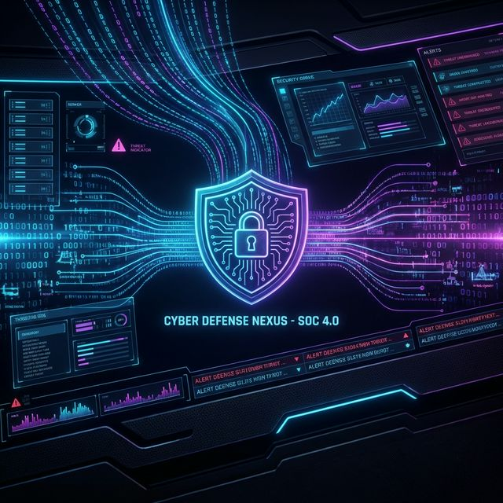

  

<h1 align="center">SOC Standard Operating Procedures</h1>

  <b>Vendor-agnostic SOC SOPs — Bilingual EN/TH — Build a SOC from Zero</b> 
  ระเบียบปฏิบัติมาตรฐานสำหรับ SOC — ภาษาอังกฤษ/ไทย — สร้าง SOC ตั้งแต่ศูนย์

  
  
  
  

  
  
  
  
  

---

## 📍 Start Here / เริ่มต้นที่นี่

> **New to SOC?** Read these two documents first — they'll guide you through everything else.
>
> **เพิ่งเริ่มต้น?** อ่าน 2 เอกสารนี้ก่อน แล้วจะรู้ว่าต้องอ่านอะไรต่อ

| | Document | English | ภาษาไทย |
|:---:|:---|:---:|:---:|
| 1️⃣ | **SOC 101** — SOC คืออะไร? | [Read](00_Getting_Started/SOC_101.en.md) | [อ่าน](00_Getting_Started/SOC_101.th.md) |
| 2️⃣ | **Quickstart Guide** — สร้าง SOC ใน 30 นาที | [Read](00_Getting_Started/Quickstart_Guide.en.md) | [อ่าน](00_Getting_Started/Quickstart_Guide.th.md) |
| 📖 | **Glossary** — คำศัพท์ที่ต้องรู้ | [Read](00_Getting_Started/Glossary.en.md) | [อ่าน](00_Getting_Started/Glossary.th.md) |

---

## 📊 What's Inside / สิ่งที่มีในโปรเจกต์นี้

| Category | Count | Highlights |
|:---|:---:|:---|
| 📄 Documents (EN+TH) | 281 | Bilingual, vendor-agnostic SOPs |
| 🛡️ IR Playbooks | 53 | PB-01 Phishing → PB-53 AI Model Theft, MITRE/ATLAS mapped |
| 🔍 Sigma Detection Rules | 54 | Ready-to-import SIEM rules |
| 🧬 YARA Rules | 15 | File-based threat detection |
| 📋 Templates | 6 | Incident report, shift log, RFC, dashboards |
| 🧰 Interactive Tools | 2 | SOC Maturity Scorer + MITRE Heatmap |
| 📊 Dashboard JSON | 2 | Grafana (14 panels) + Kibana (11 panels) |

---

## 🏗️ Building a SOC from Zero / สร้าง SOC ตั้งแต่ศูนย์

Start here if you're building a brand-new SOC. Follow the numbered order.

| # | Document | English | ภาษาไทย |
|:---:|:---|:---:|:---:|
| 1 | **SOC Building Roadmap** 🗺️ | [Read](01_SOC_Fundamentals/SOC_Building_Roadmap.en.md) | [อ่าน](01_SOC_Fundamentals/SOC_Building_Roadmap.th.md) |
| 2 | **Budget & Staffing** 💰 | [Read](01_SOC_Fundamentals/Budget_Staffing.en.md) | [อ่าน](01_SOC_Fundamentals/Budget_Staffing.th.md) |
| 3 | **Technology Stack Selection** 🔧 | [Read](01_SOC_Fundamentals/Technology_Stack.en.md) | [อ่าน](01_SOC_Fundamentals/Technology_Stack.th.md) |
| 4 | **Infrastructure Setup** 🖥️ | [Read](01_SOC_Fundamentals/Infrastructure_Setup.en.md) | [อ่าน](01_SOC_Fundamentals/Infrastructure_Setup.th.md) |
| 5 | **Use Case Prioritization** 🎯 | [Read](01_SOC_Fundamentals/Use_Case_Prioritization.en.md) | [อ่าน](01_SOC_Fundamentals/Use_Case_Prioritization.th.md) |
| 6 | **Analyst Training Path** (6 months) 🎓 | [Read](01_SOC_Fundamentals/Analyst_Training_Path.en.md) | [อ่าน](01_SOC_Fundamentals/Analyst_Training_Path.th.md) |
| 7 | **SOC Infrastructure Activation** ⚡ | [Read](10_Training_Onboarding/System_Activation.en.md) | [อ่าน](10_Training_Onboarding/System_Activation.th.md) |

---

## 🛡️ Incident Response / การตอบสนองต่อเหตุการณ์

### Core Framework / กรอบงานหลัก

| Document | English | ภาษาไทย |
|:---|:---:|:---:|
| **IR Framework** (NIST-based) | [Read](05_Incident_Response/Framework.en.md) | [อ่าน](05_Incident_Response/Framework.th.md) |
| **Severity Matrix** (P1–P4) | [Read](05_Incident_Response/Severity_Matrix.en.md) | [อ่าน](05_Incident_Response/Severity_Matrix.th.md) |
| **📋 Incident Classification** | [Read](05_Incident_Response/Incident_Classification.en.md) | [อ่าน](05_Incident_Response/Incident_Classification.th.md) |
| **🚨 Escalation Matrix** | [Read](05_Incident_Response/Escalation_Matrix.en.md) | [อ่าน](05_Incident_Response/Escalation_Matrix.th.md) |
| **Tier 1 Runbook** — Alert Triage | [Read](05_Incident_Response/Runbooks/Tier1_Runbook.en.md) | [อ่าน](05_Incident_Response/Runbooks/Tier1_Runbook.th.md) |
| **Tier 2 Runbook** — Investigation | [Read](05_Incident_Response/Runbooks/Tier2_Runbook.en.md) | [อ่าน](05_Incident_Response/Runbooks/Tier2_Runbook.th.md) |
| **Tier 3 Runbook** — Threat Hunting | [Read](05_Incident_Response/Runbooks/Tier3_Runbook.en.md) | [อ่าน](05_Incident_Response/Runbooks/Tier3_Runbook.th.md) |
| **Communication Templates** (6) | [Read](05_Incident_Response/Communication_Templates.en.md) | [อ่าน](05_Incident_Response/Communication_Templates.th.md) |

### Investigation & Evidence / การสืบสวนและหลักฐาน

| Document | English | ภาษาไทย |
|:---|:---:|:---:|
| **🔬 Forensic Investigation** | [Read](05_Incident_Response/Forensic_Investigation.en.md) | [อ่าน](05_Incident_Response/Forensic_Investigation.th.md) |
| **Evidence Collection** | [Read](05_Incident_Response/Evidence_Collection.en.md) | [อ่าน](05_Incident_Response/Evidence_Collection.th.md) |
| **🎯 Threat Hunting Playbook** | [Read](05_Incident_Response/Threat_Hunting_Playbook.en.md) | [อ่าน](05_Incident_Response/Threat_Hunting_Playbook.th.md) |
| **Interview Guide** (T1/T2/Lead) | [Read](05_Incident_Response/Interview_Guide.en.md) | [อ่าน](05_Incident_Response/Interview_Guide.th.md) |

### Recovery & Automation / การกู้คืนและอัตโนมัติ

| Document | English | ภาษาไทย |
|:---|:---:|:---:|
| **🏥 Disaster Recovery / BCP** | [Read](05_Incident_Response/Disaster_Recovery_BCP.en.md) | [อ่าน](05_Incident_Response/Disaster_Recovery_BCP.th.md) |
| **SOAR Playbook Templates** (6) | [Read](05_Incident_Response/SOAR_Playbooks.en.md) | [อ่าน](05_Incident_Response/SOAR_Playbooks.th.md) |
| **Lessons Learned Template** | [Read](05_Incident_Response/Lessons_Learned_Template.en.md) | [อ่าน](05_Incident_Response/Lessons_Learned_Template.th.md) |
| **📘 Playbook Development Guide** | [Read](05_Incident_Response/Playbook_Development_Guide.en.md) | [อ่าน](05_Incident_Response/Playbook_Development_Guide.th.md) |

### 53 Playbooks — Grouped by Category

All playbooks are bilingual (EN+TH) and MITRE ATT&CK mapped.

<b>📧 Email & Social Engineering</b> — Phishing, BEC, account takeover, deepfake

| # | Playbook | EN | TH |
|:---:|:---|:---:|:---:|
| 01 | Phishing | [📄](05_Incident_Response/Playbooks/Phishing.en.md) | [📄](05_Incident_Response/Playbooks/Phishing.th.md) |
| 17 | Business Email Compromise | [📄](05_Incident_Response/Playbooks/BEC.en.md) | [📄](05_Incident_Response/Playbooks/BEC.th.md) |
| 42 | Email Account Takeover | [📄](05_Incident_Response/Playbooks/Email_Account_Takeover.en.md) | [📄](05_Incident_Response/Playbooks/Email_Account_Takeover.th.md) |
| 48 | Deepfake Social Engineering | [📄](05_Incident_Response/Playbooks/Deepfake_Social_Engineering.en.md) | [📄](05_Incident_Response/Playbooks/Deepfake_Social_Engineering.th.md) |

<b>🦠 Malware & Ransomware</b> — Ransomware, scripts, wipers, LOLBins, rootkits

| # | Playbook | EN | TH |
|:---:|:---|:---:|:---:|
| 02 | Ransomware | [📄](05_Incident_Response/Playbooks/Ransomware.en.md) | [📄](05_Incident_Response/Playbooks/Ransomware.th.md) |
| 03 | Malware Infection | [📄](05_Incident_Response/Playbooks/Malware_Infection.en.md) | [📄](05_Incident_Response/Playbooks/Malware_Infection.th.md) |
| 18 | Exploit | [📄](05_Incident_Response/Playbooks/Exploit.en.md) | [📄](05_Incident_Response/Playbooks/Exploit.th.md) |
| 11 | Suspicious Script | [📄](05_Incident_Response/Playbooks/Suspicious_Script.en.md) | [📄](05_Incident_Response/Playbooks/Suspicious_Script.th.md) |
| 38 | Wiper Attack | [📄](05_Incident_Response/Playbooks/Wiper_Attack.en.md) | [📄](05_Incident_Response/Playbooks/Wiper_Attack.th.md) |
| 39 | Living Off The Land | [📄](05_Incident_Response/Playbooks/Living_Off_The_Land.en.md) | [📄](05_Incident_Response/Playbooks/Living_Off_The_Land.th.md) |
| 45 | Rootkit / Bootkit | [📄](05_Incident_Response/Playbooks/Rootkit_Bootkit.en.md) | [📄](05_Incident_Response/Playbooks/Rootkit_Bootkit.th.md) |

<b>🔑 Identity & Access</b> — Brute force, credential theft, privilege escalation, MFA bypass

| # | Playbook | EN | TH |
|:---:|:---|:---:|:---:|
| 04 | Brute Force | [📄](05_Incident_Response/Playbooks/Brute_Force.en.md) | [📄](05_Incident_Response/Playbooks/Brute_Force.th.md) |
| 05 | Account Compromise | [📄](05_Incident_Response/Playbooks/Account_Compromise.en.md) | [📄](05_Incident_Response/Playbooks/Account_Compromise.th.md) |
| 06 | Impossible Travel | [📄](05_Incident_Response/Playbooks/Impossible_Travel.en.md) | [📄](05_Incident_Response/Playbooks/Impossible_Travel.th.md) |
| 07 | Privilege Escalation | [📄](05_Incident_Response/Playbooks/Privilege_Escalation.en.md) | [📄](05_Incident_Response/Playbooks/Privilege_Escalation.th.md) |
| 14 | Insider Threat | [📄](05_Incident_Response/Playbooks/Insider_Threat.en.md) | [📄](05_Incident_Response/Playbooks/Insider_Threat.th.md) |
| 15 | Rogue Admin | [📄](05_Incident_Response/Playbooks/Rogue_Admin.en.md) | [📄](05_Incident_Response/Playbooks/Rogue_Admin.th.md) |
| 26 | MFA Bypass / Token Theft | [📄](05_Incident_Response/Playbooks/MFA_Bypass.en.md) | [📄](05_Incident_Response/Playbooks/MFA_Bypass.th.md) |
| 36 | Credential Dumping | [📄](05_Incident_Response/Playbooks/Credential_Dumping.en.md) | [📄](05_Incident_Response/Playbooks/Credential_Dumping.th.md) |

<b>🌐 Network & Web</b> — DDoS, lateral movement, C2, DNS tunneling, web attacks

| # | Playbook | EN | TH |
|:---:|:---|:---:|:---:|
| 09 | DDoS Attack | [📄](05_Incident_Response/Playbooks/DDoS_Attack.en.md) | [📄](05_Incident_Response/Playbooks/DDoS_Attack.th.md) |
| 12 | Lateral Movement | [📄](05_Incident_Response/Playbooks/Lateral_Movement.en.md) | [📄](05_Incident_Response/Playbooks/Lateral_Movement.th.md) |
| 13 | C2 Communication | [📄](05_Incident_Response/Playbooks/C2_Communication.en.md) | [📄](05_Incident_Response/Playbooks/C2_Communication.th.md) |
| 10 | Web Attack | [📄](05_Incident_Response/Playbooks/Web_Attack.en.md) | [📄](05_Incident_Response/Playbooks/Web_Attack.th.md) |
| 30 | API Abuse | [📄](05_Incident_Response/Playbooks/API_Abuse.en.md) | [📄](05_Incident_Response/Playbooks/API_Abuse.th.md) |
| 25 | DNS Tunneling | [📄](05_Incident_Response/Playbooks/DNS_Tunneling.en.md) | [📄](05_Incident_Response/Playbooks/DNS_Tunneling.th.md) |
| 24 | Zero-Day Exploit | [📄](05_Incident_Response/Playbooks/Zero_Day_Exploit.en.md) | [📄](05_Incident_Response/Playbooks/Zero_Day_Exploit.th.md) |
| 34 | Network Discovery | [📄](05_Incident_Response/Playbooks/Network_Discovery.en.md) | [📄](05_Incident_Response/Playbooks/Network_Discovery.th.md) |
| 37 | SQL Injection | [📄](05_Incident_Response/Playbooks/SQL_Injection.en.md) | [📄](05_Incident_Response/Playbooks/SQL_Injection.th.md) |
| 43 | Watering Hole | [📄](05_Incident_Response/Playbooks/Watering_Hole.en.md) | [📄](05_Incident_Response/Playbooks/Watering_Hole.th.md) |
| 44 | Drive-By Download | [📄](05_Incident_Response/Playbooks/Drive_By_Download.en.md) | [📄](05_Incident_Response/Playbooks/Drive_By_Download.th.md) |
| 50 | Unauthorized Scanning | [📄](05_Incident_Response/Playbooks/Unauthorized_Scanning.en.md) | [📄](05_Incident_Response/Playbooks/Unauthorized_Scanning.th.md) |

<b>☁️ Cloud & Infrastructure</b> — AWS, Azure, cloud IAM, cryptojacking, shadow IT

| # | Playbook | EN | TH |
|:---:|:---|:---:|:---:|
| 16 | Cloud IAM Anomaly | [📄](05_Incident_Response/Playbooks/Cloud_IAM.en.md) | [📄](05_Incident_Response/Playbooks/Cloud_IAM.th.md) |
| 31 | Cryptomining | [📄](05_Incident_Response/Playbooks/Cryptomining.en.md) | [📄](05_Incident_Response/Playbooks/Cryptomining.th.md) |
| 27 | Cloud Storage Exposure | [📄](05_Incident_Response/Playbooks/Cloud_Storage_Exposure.en.md) | [📄](05_Incident_Response/Playbooks/Cloud_Storage_Exposure.th.md) |
| 29 | Shadow IT | [📄](05_Incident_Response/Playbooks/Shadow_IT.en.md) | [📄](05_Incident_Response/Playbooks/Shadow_IT.th.md) |
| 21 | AWS S3 Compromise | [📄](05_Incident_Response/Playbooks/AWS_S3_Compromise.en.md) | [📄](05_Incident_Response/Playbooks/AWS_S3_Compromise.th.md) |
| 22 | AWS EC2 Compromise | [📄](05_Incident_Response/Playbooks/AWS_EC2_Compromise.en.md) | [📄](05_Incident_Response/Playbooks/AWS_EC2_Compromise.th.md) |
| 23 | Azure AD Compromise | [📄](05_Incident_Response/Playbooks/Azure_AD_Compromise.en.md) | [📄](05_Incident_Response/Playbooks/Azure_AD_Compromise.th.md) |
| 41 | VPN Abuse | [📄](05_Incident_Response/Playbooks/VPN_Abuse.en.md) | [📄](05_Incident_Response/Playbooks/VPN_Abuse.th.md) |
| 47 | Cloud Cryptojacking | [📄](05_Incident_Response/Playbooks/Cloud_Cryptojacking.en.md) | [📄](05_Incident_Response/Playbooks/Cloud_Cryptojacking.th.md) |

<b>📦 Data & Supply Chain</b> — Exfiltration, log clearing, supply chain, data staging

| # | Playbook | EN | TH |
|:---:|:---|:---:|:---:|
| 08 | Data Exfiltration | [📄](05_Incident_Response/Playbooks/Data_Exfiltration.en.md) | [📄](05_Incident_Response/Playbooks/Data_Exfiltration.th.md) |
| 20 | Log Clearing | [📄](05_Incident_Response/Playbooks/Log_Clearing.en.md) | [📄](05_Incident_Response/Playbooks/Log_Clearing.th.md) |
| 32 | Supply Chain Attack | [📄](05_Incident_Response/Playbooks/Supply_Chain_Attack.en.md) | [📄](05_Incident_Response/Playbooks/Supply_Chain_Attack.th.md) |
| 35 | Data Collection | [📄](05_Incident_Response/Playbooks/Data_Collection.en.md) | [📄](05_Incident_Response/Playbooks/Data_Collection.th.md) |
| 49 | Typosquatting | [📄](05_Incident_Response/Playbooks/Typosquatting.en.md) | [📄](05_Incident_Response/Playbooks/Typosquatting.th.md) |

<b>📱 Physical & Mobile</b> — Lost device, mobile, OT/ICS, USB, SIM swap

| # | Playbook | EN | TH |
|:---:|:---|:---:|:---:|
| 19 | Lost/Stolen Device | [📄](05_Incident_Response/Playbooks/Lost_Device.en.md) | [📄](05_Incident_Response/Playbooks/Lost_Device.th.md) |
| 28 | Mobile Device Compromise | [📄](05_Incident_Response/Playbooks/Mobile_Compromise.en.md) | [📄](05_Incident_Response/Playbooks/Mobile_Compromise.th.md) |
| 33 | OT/ICS Incident | [📄](05_Incident_Response/Playbooks/OT_ICS_Incident.en.md) | [📄](05_Incident_Response/Playbooks/OT_ICS_Incident.th.md) |
| 40 | USB Removable Media | [📄](05_Incident_Response/Playbooks/USB_Removable_Media.en.md) | [📄](05_Incident_Response/Playbooks/USB_Removable_Media.th.md) |
| 46 | SIM Swap | [📄](05_Incident_Response/Playbooks/SIM_Swap.en.md) | [📄](05_Incident_Response/Playbooks/SIM_Swap.th.md) |

<b>🤖 AI & ML Security</b> — Prompt injection, data poisoning, model theft

| # | Playbook | EN | TH |
|:---:|:---|:---:|:---:|
| 51 | AI Prompt Injection | [📄](05_Incident_Response/Playbooks/AI_Prompt_Injection.en.md) | [📄](05_Incident_Response/Playbooks/AI_Prompt_Injection.th.md) |
| 52 | LLM Data Poisoning | [📄](05_Incident_Response/Playbooks/LLM_Data_Poisoning.en.md) | [📄](05_Incident_Response/Playbooks/LLM_Data_Poisoning.th.md) |
| 53 | AI Model Theft | [📄](05_Incident_Response/Playbooks/AI_Model_Theft.en.md) | [📄](05_Incident_Response/Playbooks/AI_Model_Theft.th.md) |

---

### 🎯 MITRE ATT&CK / ATLAS Coverage

Our 53 playbooks cover **12 of 14 MITRE ATT&CK tactics** across the enterprise kill chain, plus AI/ML scenarios mapped to MITRE ATLAS:

| Tactic | ID | Playbooks | Coverage |
|:---|:---:|:---:|:---:|
| **Reconnaissance** | TA0043 | PB-50 | 🟡 |
| **Resource Development** | TA0042 | PB-49 | 🟡 |
| **Initial Access** | TA0001 | PB-01, 10, 17, 42, 43, 44 | 🟢🟢🟢 |
| **Execution** | TA0002 | PB-02, 03, 11, 39 | 🟢🟢 |
| **Persistence** | TA0003 | PB-45, 42 | 🟢 |
| **Privilege Escalation** | TA0004 | PB-07, 36 | 🟢 |
| **Defense Evasion** | TA0005 | PB-15, 20, 39, 45 | 🟢🟢 |
| **Credential Access** | TA0006 | PB-04, 05, 26, 36 | 🟢🟢 |
| **Discovery** | TA0007 | PB-06, 34 | 🟢 |
| **Lateral Movement** | TA0008 | PB-12 | 🟡 |
| **Collection** | TA0009 | PB-35 | 🟡 |
| **Command & Control** | TA0011 | PB-13, 25 | 🟢 |
| **Exfiltration** | TA0010 | PB-08 | 🟡 |
| **Impact** | TA0040 | PB-02, 09, 31, 38, 47 | 🟢🟢 |
| **AI / ML Security** | MITRE ATLAS | PB-51, 52, 53 | 🟢🟢 |

> 🟢🟢🟢 = 4+ playbooks | 🟢🟢 = 2-3 playbooks | 🟢 = 2 playbooks | 🟡 = 1 playbook

---

## 🔍 Detection & Threat Intelligence / การตรวจจับและข่าวกรองภัยคุกคาม

### Sigma Detection Rules (54 Rules)

Ready-to-import rules mapped to MITRE ATT&CK. See full index: [README](08_Detection_Engineering/README.md) | [ดัชนี (TH)](08_Detection_Engineering/README.th.md)

| Category | Rule Examples | Count |
|:---|:---|:---:|
| **Process / Endpoint** | Office PowerShell, encoded PowerShell, LOLBins, cryptomining | 5 |
| **File Activity** | Ransomware rename, USB bulk copy, USB autorun | 3 |
| **Network** | DNS tunneling, beaconing, large upload, VPN abuse, scanning | 8 |
| **Windows Security** | Failed logins, admin shares, group add, log clearing, credential dumping | 11 |
| **Cloud** | Impossible travel, root login, MFA bypass, storage exposure, cryptojacking | 14 |
| **Web/API** | SQLi, WAF exploit, API abuse, zero-day, watering hole | 8 |
| **Device / Proxy / AI** | MDM offline, shadow IT, AI prompt injection, model theft | 5 |

### YARA Rules (15 Rules)

File-based threat detection: [YARA Index](08_Detection_Engineering/yara/README.md) | [File Signatures](08_Detection_Engineering/file_signatures/README.md)

### Threat Intelligence

| Document | English | ภาษาไทย |
|:---|:---:|:---:|
| **Threat Intelligence Lifecycle** | [Read](06_Operations_Management/Threat_Intelligence_Lifecycle.en.md) | [อ่าน](06_Operations_Management/Threat_Intelligence_Lifecycle.th.md) |
| **TI Feeds Integration** | [Read](06_Operations_Management/TI_Feeds_Integration.en.md) | [อ่าน](06_Operations_Management/TI_Feeds_Integration.th.md) |
| **SOC Use Case Library** | [Read](08_Detection_Engineering/SOC_Use_Case_Library.en.md) | [อ่าน](08_Detection_Engineering/SOC_Use_Case_Library.th.md) |
| **Detection Rule Testing SOP** | [Read](06_Operations_Management/Detection_Rule_Testing.en.md) | [อ่าน](06_Operations_Management/Detection_Rule_Testing.th.md) |
| **Detection Engineering Lifecycle** | [Read](03_User_Guides/Content_Management.en.md) | [อ่าน](03_User_Guides/Content_Management.th.md) |

---

## 📊 Operations / การปฏิบัติงาน

### 👥 Team & Daily Operations / ทีมและงานประจำวัน

| Document | English | ภาษาไทย |
|:---|:---:|:---:|
| **SOC Team Structure** | [Read](06_Operations_Management/SOC_Team_Structure.en.md) | [อ่าน](06_Operations_Management/SOC_Team_Structure.th.md) |
| **Shift Handoff SOP** | [Read](06_Operations_Management/Shift_Handoff.en.md) | [อ่าน](06_Operations_Management/Shift_Handoff.th.md) |
| **SOC Checklists** (Daily/Weekly/Monthly) | [Read](06_Operations_Management/SOC_Checklists.en.md) | [อ่าน](06_Operations_Management/SOC_Checklists.th.md) |
| **SOC Metrics & KPIs** | [Read](06_Operations_Management/SOC_Metrics.en.md) | [อ่าน](06_Operations_Management/SOC_Metrics.th.md) |
| **📈 KPI Dashboard Template** | [Read](06_Operations_Management/KPI_Dashboard_Template.en.md) | [อ่าน](06_Operations_Management/KPI_Dashboard_Template.th.md) |
| **📊 Log Source Matrix** | [Read](06_Operations_Management/Log_Source_Matrix.en.md) | [อ่าน](06_Operations_Management/Log_Source_Matrix.th.md) |
| **Log Source Onboarding** | [Read](06_Operations_Management/Log_Source_Onboarding.en.md) | [อ่าน](06_Operations_Management/Log_Source_Onboarding.th.md) |
| **🤖 SOC Automation Catalog** | [Read](06_Operations_Management/SOC_Automation_Catalog.en.md) | [อ่าน](06_Operations_Management/SOC_Automation_Catalog.th.md) |
| **🔧 Alert Tuning SOP** | [Read](06_Operations_Management/Alert_Tuning.en.md) | [อ่าน](06_Operations_Management/Alert_Tuning.th.md) |
| **📊 SOC Capacity Planning** | [Read](06_Operations_Management/SOC_Capacity_Planning.en.md) | [อ่าน](06_Operations_Management/SOC_Capacity_Planning.th.md) |

### 🔍 Security Monitoring / การเฝ้าระวัง

| Document | English | ภาษาไทย |
|:---|:---:|:---:|
| **🌐 Network Security Monitoring** | [Read](06_Operations_Management/Network_Security_Monitoring.en.md) | [อ่าน](06_Operations_Management/Network_Security_Monitoring.th.md) |
| **☁️ Cloud Security Monitoring** | [Read](06_Operations_Management/Cloud_Security_Monitoring.en.md) | [อ่าน](06_Operations_Management/Cloud_Security_Monitoring.th.md) |
| **🔒 Data Loss Prevention (DLP)** | [Read](06_Operations_Management/DLP_SOP.en.md) | [อ่าน](06_Operations_Management/DLP_SOP.th.md) |
| **🕵️ Insider Threat Program** | [Read](06_Operations_Management/Insider_Threat_Program.en.md) | [อ่าน](06_Operations_Management/Insider_Threat_Program.th.md) |

### 📡 Threat Intelligence & Hunting / ข่าวกรองภัยคุกคาม

| Document | English | ภาษาไทย |
|:---|:---:|:---:|
| **Threat Intelligence Lifecycle** | [Read](06_Operations_Management/Threat_Intelligence_Lifecycle.en.md) | [อ่าน](06_Operations_Management/Threat_Intelligence_Lifecycle.th.md) |
| **TI Feeds Integration** | [Read](06_Operations_Management/TI_Feeds_Integration.en.md) | [อ่าน](06_Operations_Management/TI_Feeds_Integration.th.md) |
| **🌍 Threat Landscape Report** | [Read](06_Operations_Management/Threat_Landscape_Report.en.md) | [อ่าน](06_Operations_Management/Threat_Landscape_Report.th.md) |
| **Detection Rule Testing SOP** | [Read](06_Operations_Management/Detection_Rule_Testing.en.md) | [อ่าน](06_Operations_Management/Detection_Rule_Testing.th.md) |
| **Detection Engineering Lifecycle** | [Read](03_User_Guides/Content_Management.en.md) | [อ่าน](03_User_Guides/Content_Management.th.md) |

### 🏛️ Risk & Governance / ความเสี่ยงและธรรมาภิบาล

| Document | English | ภาษาไทย |
|:---|:---:|:---:|
| **🛡️ Vulnerability Management** | [Read](06_Operations_Management/Vulnerability_Management.en.md) | [อ่าน](06_Operations_Management/Vulnerability_Management.th.md) |
| **🔗 Third-Party Risk** | [Read](06_Operations_Management/Third_Party_Risk.en.md) | [อ่าน](06_Operations_Management/Third_Party_Risk.th.md) |
| **🎯 SOC Maturity Assessment** | [Read](06_Operations_Management/SOC_Maturity_Assessment.en.md) | [อ่าน](06_Operations_Management/SOC_Maturity_Assessment.th.md) |
| **SOC Assessment Checklist** | [Read](06_Operations_Management/SOC_Assessment_Checklist.en.md) | [อ่าน](06_Operations_Management/SOC_Assessment_Checklist.th.md) |
| **SLA Template** | [Read](06_Operations_Management/SLA_Template.en.md) | [อ่าน](06_Operations_Management/SLA_Template.th.md) |
| **Vendor/Tool Evaluation** | [Read](06_Operations_Management/Vendor_Evaluation.en.md) | [อ่าน](06_Operations_Management/Vendor_Evaluation.th.md) |

### 📜 Policies & Processes / นโยบายและกระบวนการ

| Document | English | ภาษาไทย |
|:---|:---:|:---:|
| **Data Handling Protocol** | [Read](06_Operations_Management/Data_Handling_Protocol.en.md) | [อ่าน](06_Operations_Management/Data_Handling_Protocol.th.md) |
| **Change Management SOP** | [Read](06_Operations_Management/Change_Management.en.md) | [อ่าน](06_Operations_Management/Change_Management.th.md) |
| **Access Control Policy** | [Read](06_Operations_Management/Access_Control.en.md) | [อ่าน](06_Operations_Management/Access_Control.th.md) |
| **Communication SOP** | [Read](06_Operations_Management/SOC_Communication.en.md) | [อ่าน](06_Operations_Management/SOC_Communication.th.md) |

### 🔧 Platform & Tools / แพลตฟอร์มและเครื่องมือ

| Document | English | ภาษาไทย |
|:---|:---:|:---:|
| **Data Governance & Retention** | [Read](02_Platform_Operations/Database_Management.en.md) | [อ่าน](02_Platform_Operations/Database_Management.th.md) |
| **Deployment Procedures** | [Read](02_Platform_Operations/Deployment_Procedures.en.md) | [อ่าน](02_Platform_Operations/Deployment_Procedures.th.md) |
| **Integration Hub** | [Read](03_User_Guides/Integration_Hub.en.md) | [อ่าน](03_User_Guides/Integration_Hub.th.md) |
| **Troubleshooting** | [Read](04_Troubleshooting/Common_Issues.en.md) | [อ่าน](04_Troubleshooting/Common_Issues.th.md) |

---

## 🎯 Testing & Training / การทดสอบและฝึกอบรม

### Simulation & Purple Team / การจำลองและทดสอบ

| Document | English | ภาษาไทย |
|:---|:---:|:---:|
| **🟣 Purple Team Exercise Guide** | [Read](09_Simulation_Testing/Purple_Team_Exercise.en.md) | [อ่าน](09_Simulation_Testing/Purple_Team_Exercise.th.md) |
| **Purple Team Exercises** (9 exercises) | [Read](05_Incident_Response/Purple_Team_Exercises.en.md) | [อ่าน](05_Incident_Response/Purple_Team_Exercises.th.md) |
| **Tabletop Exercises** (5 scenarios) | [Read](05_Incident_Response/Tabletop_Exercises.en.md) | [อ่าน](05_Incident_Response/Tabletop_Exercises.th.md) |
| **🎣 Phishing Simulation Program** | [Read](09_Simulation_Testing/Phishing_Simulation.en.md) | [อ่าน](09_Simulation_Testing/Phishing_Simulation.th.md) |
| **Simulation Guide** | [Read](09_Simulation_Testing/Simulation_Guide.en.md) | [อ่าน](09_Simulation_Testing/Simulation_Guide.th.md) |
| **Atomic Test Map** (MITRE) | [Read](09_Simulation_Testing/Atomic_Test_Map.en.md) | [อ่าน](09_Simulation_Testing/Atomic_Test_Map.th.md) |

### Analyst Training / การฝึกอบรม

| Document | English | ภาษาไทย |
|:---|:---:|:---:|
| **👤 SOC Analyst Onboarding** (90-day) | [Read](10_Training_Onboarding/SOC_Onboarding.en.md) | [อ่าน](10_Training_Onboarding/SOC_Onboarding.th.md) |
| **Analyst Onboarding** (5-day path) | [Read](10_Training_Onboarding/Analyst_Onboarding_Path.en.md) | [อ่าน](10_Training_Onboarding/Analyst_Onboarding_Path.th.md) |
| **Training Checklist** | [Read](10_Training_Onboarding/Training_Checklist.en.md) | [อ่าน](10_Training_Onboarding/Training_Checklist.th.md) |
| **📋 Playbook Quick Reference** | [EN](Playbook_Quick_Reference.md) | [TH](Playbook_Quick_Reference.th.md) |

---

## 🏛️ Compliance & Reporting / การปฏิบัติตามกฎหมายและรายงาน

### Compliance

| Document | English | ภาษาไทย |
|:---|:---:|:---:|
| **Compliance Mapping** (ISO 27001 / NIST CSF / PCI DSS) | [Read](07_Compliance_Privacy/Compliance_Mapping.en.md) | [อ่าน](07_Compliance_Privacy/Compliance_Mapping.th.md) |
| **ISO 27001 Controls Mapping** | [Read](07_Compliance_Privacy/ISO27001_Controls_Mapping.en.md) | [อ่าน](07_Compliance_Privacy/ISO27001_Controls_Mapping.th.md) |
| **PCI-DSS SOC Requirements** | [Read](07_Compliance_Privacy/PCI_DSS_SOC_Requirements.en.md) | [อ่าน](07_Compliance_Privacy/PCI_DSS_SOC_Requirements.th.md) |
| **NIST CSF 2.0 Mapping** | [Read](07_Compliance_Privacy/NIST_CSF_Mapping.en.md) | [อ่าน](07_Compliance_Privacy/NIST_CSF_Mapping.th.md) |
| **PDPA Incident Response** (72-hr notification) | [Read](07_Compliance_Privacy/PDPA_Incident_Response.en.md) | [อ่าน](07_Compliance_Privacy/PDPA_Incident_Response.th.md) |
| **PDPA Compliance** | [Read](07_Compliance_Privacy/PDPA_Compliance.en.md) | [อ่าน](07_Compliance_Privacy/PDPA_Compliance.th.md) |
| **📝 Compliance Gap Analysis** | [Read](07_Compliance_Privacy/Compliance_Gap_Analysis.en.md) | [อ่าน](07_Compliance_Privacy/Compliance_Gap_Analysis.th.md) |
| **Data Governance Policy** | [Read](07_Compliance_Privacy/Data_Governance_Policy.en.md) | [อ่าน](07_Compliance_Privacy/Data_Governance_Policy.th.md) |

### Reports & Dashboards

| Document | English | ภาษาไทย |
|:---|:---:|:---:|
| **Monthly SOC Report** | [Read](11_Reporting_Templates/Monthly_SOC_Report.en.md) | [อ่าน](11_Reporting_Templates/Monthly_SOC_Report.th.md) |
| **Quarterly Business Review** | [Read](11_Reporting_Templates/Quarterly_Business_Review.en.md) | [อ่าน](11_Reporting_Templates/Quarterly_Business_Review.th.md) |
| **Executive Dashboard** | [Read](11_Reporting_Templates/Executive_Dashboard.en.md) | [อ่าน](11_Reporting_Templates/Executive_Dashboard.th.md) |

### Templates / แบบฟอร์มพร้อมใช้

| Template | English | ภาษาไทย |
|:---|:---:|:---:|
| **Incident Report** | [Read](11_Reporting_Templates/incident_report.en.md) | [อ่าน](11_Reporting_Templates/incident_report.th.md) |
| **Shift Handover Log** | [Read](11_Reporting_Templates/shift_handover.en.md) | [อ่าน](11_Reporting_Templates/shift_handover.th.md) |
| **Change Request (RFC)** | [Read](11_Reporting_Templates/change_request_rfc.en.md) | [อ่าน](11_Reporting_Templates/change_request_rfc.th.md) |

---

## 🛠️ Tools / เครื่องมือ

### Interactive (Open in Browser)

| Tool | Description |
|:---|:---|
| **[SOC Maturity Scorer](tools/soc_maturity_scorer.html)** | Self-assessment: 7 domains, 56 questions, bilingual EN/TH, scored 1–5 |
| **[MITRE ATT&CK Heatmap](tools/mitre_attack_heatmap.html)** | Coverage map: 19 techniques, gap analysis, click-to-detail |

### Dashboards (Import to SIEM)

| Dashboard | Format | Panels |
|:---|:---|:---:|
| **[Grafana SOC Operations](tools/dashboards/grafana_soc_operations.json)** | JSON (Import → Dashboards) | 14 |
| **[Kibana SOC Operations](tools/dashboards/kibana_soc_operations.ndjson)** | NDJSON (Import → Saved Objects) | 11 |
| **[ATT&CK Navigator Layer](tools/mitre_attack_navigator.json)** | JSON (Import → [Navigator](https://mitre-attack.github.io/attack-navigator/)) | — |

### CLI Scripts

| Script | Usage |
|:---|:---|
| [export_docs.py](tools/export_docs.py) | `python3 tools/export_docs.py` — Merge all docs into single Markdown |
| [new_playbook.py](tools/new_playbook.py) | `python3 tools/new_playbook.py` — Generate new playbook from template |
| [check_links.py](tools/check_links.py) | `python3 tools/check_links.py` — Validate internal links |
| [validate_sigma.py](tools/validate_sigma.py) | `python3 tools/validate_sigma.py` — Lint Sigma rules |

---

## 📚 Full Manual / คู่มือฉบับเต็ม

For offline reading or printing, download the consolidated manual:

> **[📖 SOC_Manual_Consolidated.md](https://github.com/nutthakorn7/SOC-SOP/blob/main/SOC_Manual_Consolidated.md)** — All 281 documents in one file

---

## 📋 Version & Tracking / เวอร์ชันและการติดตาม

| Resource | Description |
|:---|:---|
| **[📝 CHANGELOG.md](CHANGELOG.md)** | All changes by version (Keep a Changelog format) |
| **[📋 VERSION_TRACKER.md](VERSION_TRACKER.md)** | Every document's version, last update, and next review date |
| **Current Version** | **v2.15.0** (2026-04-26) |

---

## Contributing / การมีส่วนร่วม

1. **Standardization** — Keep procedures vendor-agnostic where possible
2. **Bilingual** — Maintain both English (`.en.md`) and Thai (`.th.md`) versions
3. **Review** — Changes should be reviewed by SOC Managers or Lead Engineers
4. **Versioning** — Update `CHANGELOG.md` and `VERSION_TRACKER.md` with every change

---

## 👤 About the Author / ผู้เขียน

  <b>Nutthakorn Chalaemwongwan [Pop]</b> 
  🛡️ SOC Architect · Cybersecurity Educator · Open-Source Advocate

> *"Security is a process, not a product."* — I created this repository to democratize SOC knowledge, making enterprise-grade security operations accessible to everyone — in both English and Thai.

### 🎓 Training & Consulting / อบรมและที่ปรึกษา

Looking to build, improve, or scale your Security Operations Center? I offer hands-on, practical training and consulting services:

> 📖 **[View Full Course Catalog →](TRAINING.md)** — 6 หลักสูตร, detailed modules, learning outcomes

| 🎯 Service | Description |
|:---|:---|
| **🏗️ SOC Building Workshop** | ออกแบบและจัดตั้ง SOC ตั้งแต่ศูนย์ — architecture, staffing, tools, processes |
| **📚 SOC Analyst Bootcamp** | หลักสูตร intensive สำหรับ Tier 1–3 — triage, investigation, hunting, SOAR |
| **🔥 Incident Response Drill** | ซ้อม tabletop exercise + purple team ด้วย scenario จริง |
| **📊 SOC Maturity Assessment** | ประเมิน SOC ปัจจุบัน 7 domains พร้อมแผน roadmap ปรับปรุง |
| **📋 Compliance & Gap Analysis** | ประเมิน ISO 27001 / NIST CSF / PDPA gap พร้อม remediation plan |
| **🎤 Speaking & Workshops** | บรรยาย, workshop, guest lecture ด้าน cybersecurity |

### 📬 Contact / ช่องทางติดต่อ

  
  
  

  <i>📌 View my full profile, certifications, and experience on <a href="https://www.linkedin.com/in/nutthakorn/">LinkedIn</a></i>

---

  <b>⭐ If this repository helps your SOC, please give it a star!</b> 
  <i>สร้างด้วย 🛡️ เพื่อ SOC community ไทยและทั่วโลก</i>

