# SOC Standard Operating Procedures (Consolidated)

> This document is a consolidated export of all SOPs, Playbooks, and Templates.


---

## File: AGENTS.md

# AGENTS.md — SOC Standard Operating Procedures Repository

> This file is the **single source of truth** for all AI agents and human contributors working on this repository.
> It is symlinked to: `CLAUDE.md`, `.cursorrules`, `.github/copilot-instructions.md`

---

## 🎯 Project Identity

### WHY — Purpose
This repository provides **vendor-agnostic, production-ready SOC Standard Operating Procedures** that any organization can adopt to build or mature their Security Operations Center. All content follows NIST, MITRE ATT&CK, and ISO 27001/27035 frameworks.

### WHAT — Scope
- 20 Incident Response Playbooks (PB-01 to PB-20)
- Operations Management (Shift Handoff, KPIs, Team Structure, CTI, TLP)
- Detection Engineering (Sigma rules, YARA signatures)
- Simulation & Purple Teaming
- Training & Onboarding Curriculum
- Executive Reporting Templates
- All content is **bilingual** (English + Thai)

### HOW — Technology
- **Format**: Markdown (`.md`) with Mermaid diagrams
- **Diagrams**: Mermaid.js (rendered natively on GitHub)
- **Detection Rules**: Sigma YAML, YARA
- **Quality Tools**: `python3 tools/check_links.py`, `python3 tools/export_docs.py`
- **No build system required** — raw Markdown works on GitHub directly

**Maintained by**: [cyberdefense.co.th](https://cyberdefense.co.th) | Line OA: `@cyberdefense`

---

## 📁 Directory Structure

```
SOCSOP/
├── 01_Onboarding/           # SOC infrastructure setup
├── 02_Platform_Operations/   # Data governance, deployment procedures
├── 03_User_Guides/           # Detection engineering, tool integration
├── 04_Troubleshooting/       # Standard troubleshooting methodology
├── 05_Incident_Response/     # IR Framework + 20 Playbooks
│   └── Playbooks/            # Individual incident playbooks (PB-01 to PB-20)
├── 06_Operations_Management/ # Shift handoff, metrics, team structure, TLP, CTI
├── 07_Detection_Rules/       # Sigma detection rules (.yml)
├── 08_Simulation_Testing/    # Purple team guides, Atomic Red Team maps
├── 09_Training_Onboarding/   # Analyst curriculum, training checklists
├── 10_File_Signatures/       # YARA rules
├── 11_Reporting_Templates/   # Monthly/quarterly executive reports
├── templates/                # Incident report, shift handover, RFC forms
├── tools/                    # Utility scripts (export, link check)
└── assets/                   # Images (hero banner, etc.)
```

---

## 📛 File Naming Conventions

| Rule | Example |
|---|---|
| English docs end with `.en.md` | `Phishing.en.md` |
| Thai docs end with `.th.md` | `Phishing.th.md` |
| Bilingual docs **always** come in pairs (EN + TH) | `Framework.en.md` + `Framework.th.md` |
| Language-neutral docs use plain `.md` | `Atomic_Test_Map.md`, `README.md` |
| Use `PascalCase_With_Underscores` for filenames | `SOC_Team_Structure.en.md` |
| Detection rules use lowercase with underscores | `win_multiple_failed_logins.yml` |
| YARA rules use lowercase with underscores | `ransomware_extensions.yar` |

---

## 📄 Document Structure Requirements

Every SOP document **MUST** contain these sections in this exact order:

### 1. Title & Metadata
```markdown
# Document Title

**ID**: PB-XX (for playbooks)
**Severity**: Low/Medium/High/Critical (for playbooks)
**Trigger**: What causes this playbook to activate
```

### 2. Mermaid Flowchart
Every document must include at least one `mermaid` diagram visualizing the process or workflow.

````markdown
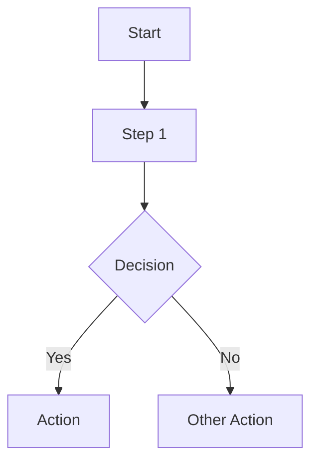
````

**Mermaid rules**:
- Thai versions must have **localized labels** (not English copy-pasted)
- Use `graph TD` (top-down) for process flows
- Use `graph LR` (left-right) for timelines/career paths
- Keep diagrams concise (max ~10 nodes)
- Use `style` for color coding when useful

### 3. Main Content
Structured with numbered sections (`## 1.`, `## 2.`, etc.) and actionable checklists:
```markdown
-   [ ] **Action Item**: Description of what to do.
```

### 4. Related Documents (Cross-Links)
Cross-links to other documents in the repository. Insert **before** References.

```
## Related Documents          <!-- English -->
## เอกสารที่เกี่ยวข้อง (Related Documents)  <!-- Thai -->

-   Document Name → relative/path/to/file.en.md
```

**Cross-link rules**:
- Playbooks → IR Framework, Incident Report Template, related Playbooks
- Operations docs → SOC Metrics, Assessment Checklist, IR Framework
- Always use **relative paths** (e.g., `../05_Incident_Response/Framework.en.md`)
- Every file must link to at least 2 other internal documents

### 5. References
External links to authoritative sources. Always include at least 2 references.

```markdown
## References
-   [NIST SP 800-61r2](https://csrc.nist.gov/publications/detail/sp/800-61/rev-2/final)
-   [MITRE ATT&CK](https://attack.mitre.org/)
```

**Preferred reference sources** (in order of priority):
1. NIST (SP 800-61, 800-53, CSF)
2. MITRE ATT&CK
3. CISA
4. SANS
5. OWASP
6. ISO 27001/27035
7. SOC-CMM
8. FIRST CSIRT Services Framework

---

## 🌐 Bilingual Content Rules

| Rule | Details |
|---|---|
| Every EN doc must have a TH counterpart | No orphaned single-language files |
| Thai docs are **localized**, not literal translations | Adapt terminology naturally |
| Mermaid labels must be localized | `Alert[แจ้งเตือน]` not `Alert[Alert]` |
| Section headers include Thai + English | `## 1. นิยามปัญหา (Defining the Problem)` |
| Keep technical terms untranslated | SIEM, MITRE ATT&CK, IOC, TLP, YARA, Sigma |
| References section header stays as `## References` | Same in both EN and TH versions |
| Related Documents header is bilingual in TH | `## เอกสารที่เกี่ยวข้อง (Related Documents)` |

---

## 🎨 Tone & Style Guide

### Writing Style
- **Actionable**: Write procedures as clear, step-by-step instructions
- **Imperative mood**: "Check the logs" not "The logs should be checked"
- **Concise**: Short bullet points, no long paragraphs
- **Professional**: Suitable for SOC analysts and CISO-level readers

### Formatting Rules
- Use `-   ` (3 spaces after dash) for bullet points
- Use `**Bold**` for key terms and action items
- Use backticks for commands, tools, and technical identifiers: `nslookup`, `SIEM`, `T1566`
- Tables for structured data (KPIs, staffing models, severity matrices)
- Numbered sections for sequential processes (`## 1.`, `## 2.`)

---

## 🛡️ Playbook Conventions

| Property | Rule |
|---|---|
| **ID Format** | `PB-XX` (e.g., PB-01, PB-02 ... PB-20) |
| **Standard Sections** | Analysis → Containment → Eradication → Recovery |
| **Mermaid Flow** | Must visualize the triage/decision process |
| **MITRE ATT&CK** | Reference relevant Technique IDs (e.g., T1566, T1078) |
| **Severity Levels** | Low, Medium, High, Critical |
| **Checklists** | Use `- [ ]` for operational steps |
| **Cross-Links** | Link to IR Framework, Incident Report template, related PBs |

### Playbook Index (PB-01 to PB-20)
```
PB-01 Phishing               PB-11 Suspicious Script
PB-02 Ransomware             PB-12 Lateral Movement
PB-03 Malware Infection      PB-13 C2 Communication
PB-04 Brute Force            PB-14 Insider Threat
PB-05 Account Compromise     PB-15 Log Clearing
PB-06 Impossible Travel      PB-16 Lost Device
PB-07 Privilege Escalation   PB-17 Rogue Admin
PB-08 Data Exfiltration      PB-18 BEC (Business Email Compromise)
PB-09 DDoS Attack            PB-19 Web Application Attack
PB-10 Exploit/Vulnerability  PB-20 Cloud-specific (AWS/Azure)
```

---

## 🔍 Detection Rules

### Sigma Rules (`07_Detection_Rules/`)
- **Format**: Sigma YAML specification v2
- **Naming**: `<category>_<description>.yml` (e.g., `win_multiple_failed_logins.yml`)
- **Required fields**: `title`, `status`, `description`, `logsource`, `detection`, `level`, `tags`
- **Tags**: Must include MITRE ATT&CK technique IDs (e.g., `attack.t1110`)

### YARA Rules (`10_File_Signatures/`)
- **Format**: YARA rule syntax
- **Naming**: `<family>_<indicator>.yar`
- **Required**: `meta`, `strings`, `condition` blocks

---

## ✅ Verification & Quality Checks

### Before Every Commit
```bash
# 1. Check all internal links are valid
python3 tools/check_links.py

# 2. Regenerate consolidated manual
python3 tools/export_docs.py
```

### Pre-Commit Checklist
- [ ] `check_links.py` passes ✅ (no broken internal links)
- [ ] `export_docs.py` regenerates `SOC_Manual_Consolidated.md`
- [ ] Both EN and TH versions updated if content changed
- [ ] Mermaid diagrams render correctly
- [ ] Related Documents section present with cross-links
- [ ] References section present with at least 2 credible sources
- [ ] README.md updated if new documents were added
- [ ] No duplicate lines (known issue — scan after batch edits)

---

## 📝 Git Commit Conventions

**Pattern**: `<Action> <What> (<Details>)`

```
Add SOC Team Structure document (EN/TH) with org chart, roles, career path
Fix duplicate lines from flow insertion, regenerate consolidated manual
Add cross-links between all documents (Related Documents sections)
Standardize Operations Management docs: Add flows and references
```

**Actions**: `Add`, `Fix`, `Update`, `Remove`, `Refactor`, `Standardize`

---

## 📖 README Maintenance

When adding new documents:
1. Add a row to the relevant section table in `README.md`
2. Follow the existing table format with English and Thai links
3. Keep the table alphabetically sorted within each section

---

## ⚠️ Known Pitfalls & Gotchas

| Pitfall | Solution |
|---|---|
| `multi_replace` tool duplicates lines when inserting flows | Scan for duplicate lines after batch edits with `grep` |
| Mermaid nodes with parentheses break rendering | Use `["text with (parens)"]` square bracket syntax |
| Thai text in Mermaid can overflow | Keep labels short, use abbreviations |
| Symlinks not followed on some Git platforms | Verify CLAUDE.md, .cursorrules render on GitHub |
| `check_links.py` only validates internal links | External URLs (References) are NOT checked automatically |
| `SOC_Manual_Consolidated.md` must be regenerated | Always run `export_docs.py` after any content change |

---

## 🔒 Security & Confidentiality Rules

- **NEVER** commit real credentials, API keys, or tokens
- **NEVER** include client-specific data (company names, IPs, domains)
- **NEVER** reference internal infrastructure details
- All examples must use **placeholder values**: `[COMPANY]`, `[IP_ADDRESS]`, `[YYYY-MM-DD]`
- Keep all content **vendor-agnostic** — no Splunk, QRadar, Sentinel-specific content
- Use generic terms: "SIEM query" not "SPL query", "EDR" not "CrowdStrike"

---

## 🚀 Common Workflows

### Adding a New Playbook
```
1. Create `05_Incident_Response/Playbooks/<Name>.en.md`
2. Create `05_Incident_Response/Playbooks/<Name>.th.md`
3. Include: Metadata, Mermaid flow, Analysis/Containment/Eradication/Recovery
4. Add Related Documents (→ Framework, → Incident Report Template)
5. Add References (MITRE ATT&CK technique + 1 more)
6. Update README.md table
7. Run: python3 tools/check_links.py
8. Run: python3 tools/export_docs.py
9. Commit with: "Add PB-XX <Name> playbook (EN/TH)"
```

### Adding a New Operations Document
```
1. Create `06_Operations_Management/<Name>.en.md`
2. Create `06_Operations_Management/<Name>.th.md`
3. Include: Mermaid flow, structured content, checklists
4. Add Related Documents (→ SOC Metrics, → Assessment Checklist)
5. Add References (NIST/SOC-CMM/SANS)
6. Update README.md table
7. Run verification scripts
8. Commit with: "Add <Name> document (EN/TH)"
```

### Updating Existing Documents
```
1. Edit both EN and TH versions
2. Verify Mermaid diagrams still render
3. Verify cross-links still work
4. Run: python3 tools/check_links.py
5. Run: python3 tools/export_docs.py
6. Commit with: "Update <Name>: <what changed>"
```

---

## ❌ Do NOT

- ❌ Use vendor-specific terminology (`"Splunk query"` → use `"SIEM query"`)
- ❌ Create single-language documents (always EN + TH pair)
- ❌ Skip the Mermaid flowchart in any SOP document
- ❌ Use absolute file paths in cross-links (always relative)
- ❌ Commit without running `check_links.py` and `export_docs.py`
- ❌ Leave References section empty (minimum 2 sources)
- ❌ Hardcode organization-specific details (keep vendor-agnostic)
- ❌ Include real credentials, client data, or internal infrastructure info
- ❌ Modify `SOC_Manual_Consolidated.md` directly (it's auto-generated)
- ❌ Create deeply nested directories (max 2 levels deep)
- ❌ Skip the Related Documents section (every file must cross-link)
- ❌ Use inline HTML in Markdown (except README badges/footer)


---

## File: CLAUDE.md

# AGENTS.md — SOC Standard Operating Procedures Repository

> This file is the **single source of truth** for all AI agents and human contributors working on this repository.
> It is symlinked to: `CLAUDE.md`, `.cursorrules`, `.github/copilot-instructions.md`

---

## 🎯 Project Identity

### WHY — Purpose
This repository provides **vendor-agnostic, production-ready SOC Standard Operating Procedures** that any organization can adopt to build or mature their Security Operations Center. All content follows NIST, MITRE ATT&CK, and ISO 27001/27035 frameworks.

### WHAT — Scope
- 20 Incident Response Playbooks (PB-01 to PB-20)
- Operations Management (Shift Handoff, KPIs, Team Structure, CTI, TLP)
- Detection Engineering (Sigma rules, YARA signatures)
- Simulation & Purple Teaming
- Training & Onboarding Curriculum
- Executive Reporting Templates
- All content is **bilingual** (English + Thai)

### HOW — Technology
- **Format**: Markdown (`.md`) with Mermaid diagrams
- **Diagrams**: Mermaid.js (rendered natively on GitHub)
- **Detection Rules**: Sigma YAML, YARA
- **Quality Tools**: `python3 tools/check_links.py`, `python3 tools/export_docs.py`
- **No build system required** — raw Markdown works on GitHub directly

**Maintained by**: [cyberdefense.co.th](https://cyberdefense.co.th) | Line OA: `@cyberdefense`

---

## 📁 Directory Structure

```
SOCSOP/
├── 01_Onboarding/           # SOC infrastructure setup
├── 02_Platform_Operations/   # Data governance, deployment procedures
├── 03_User_Guides/           # Detection engineering, tool integration
├── 04_Troubleshooting/       # Standard troubleshooting methodology
├── 05_Incident_Response/     # IR Framework + 20 Playbooks
│   └── Playbooks/            # Individual incident playbooks (PB-01 to PB-20)
├── 06_Operations_Management/ # Shift handoff, metrics, team structure, TLP, CTI
├── 07_Detection_Rules/       # Sigma detection rules (.yml)
├── 08_Simulation_Testing/    # Purple team guides, Atomic Red Team maps
├── 09_Training_Onboarding/   # Analyst curriculum, training checklists
├── 10_File_Signatures/       # YARA rules
├── 11_Reporting_Templates/   # Monthly/quarterly executive reports
├── templates/                # Incident report, shift handover, RFC forms
├── tools/                    # Utility scripts (export, link check)
└── assets/                   # Images (hero banner, etc.)
```

---

## 📛 File Naming Conventions

| Rule | Example |
|---|---|
| English docs end with `.en.md` | `Phishing.en.md` |
| Thai docs end with `.th.md` | `Phishing.th.md` |
| Bilingual docs **always** come in pairs (EN + TH) | `Framework.en.md` + `Framework.th.md` |
| Language-neutral docs use plain `.md` | `Atomic_Test_Map.md`, `README.md` |
| Use `PascalCase_With_Underscores` for filenames | `SOC_Team_Structure.en.md` |
| Detection rules use lowercase with underscores | `win_multiple_failed_logins.yml` |
| YARA rules use lowercase with underscores | `ransomware_extensions.yar` |

---

## 📄 Document Structure Requirements

Every SOP document **MUST** contain these sections in this exact order:

### 1. Title & Metadata
```markdown
# Document Title

**ID**: PB-XX (for playbooks)
**Severity**: Low/Medium/High/Critical (for playbooks)
**Trigger**: What causes this playbook to activate
```

### 2. Mermaid Flowchart
Every document must include at least one `mermaid` diagram visualizing the process or workflow.

````markdown

````

**Mermaid rules**:
- Thai versions must have **localized labels** (not English copy-pasted)
- Use `graph TD` (top-down) for process flows
- Use `graph LR` (left-right) for timelines/career paths
- Keep diagrams concise (max ~10 nodes)
- Use `style` for color coding when useful

### 3. Main Content
Structured with numbered sections (`## 1.`, `## 2.`, etc.) and actionable checklists:
```markdown
-   [ ] **Action Item**: Description of what to do.
```

### 4. Related Documents (Cross-Links)
Cross-links to other documents in the repository. Insert **before** References.

```
## Related Documents          <!-- English -->
## เอกสารที่เกี่ยวข้อง (Related Documents)  <!-- Thai -->

-   Document Name → relative/path/to/file.en.md
```

**Cross-link rules**:
- Playbooks → IR Framework, Incident Report Template, related Playbooks
- Operations docs → SOC Metrics, Assessment Checklist, IR Framework
- Always use **relative paths** (e.g., `../05_Incident_Response/Framework.en.md`)
- Every file must link to at least 2 other internal documents

### 5. References
External links to authoritative sources. Always include at least 2 references.

```markdown
## References
-   [NIST SP 800-61r2](https://csrc.nist.gov/publications/detail/sp/800-61/rev-2/final)
-   [MITRE ATT&CK](https://attack.mitre.org/)
```

**Preferred reference sources** (in order of priority):
1. NIST (SP 800-61, 800-53, CSF)
2. MITRE ATT&CK
3. CISA
4. SANS
5. OWASP
6. ISO 27001/27035
7. SOC-CMM
8. FIRST CSIRT Services Framework

---

## 🌐 Bilingual Content Rules

| Rule | Details |
|---|---|
| Every EN doc must have a TH counterpart | No orphaned single-language files |
| Thai docs are **localized**, not literal translations | Adapt terminology naturally |
| Mermaid labels must be localized | `Alert[แจ้งเตือน]` not `Alert[Alert]` |
| Section headers include Thai + English | `## 1. นิยามปัญหา (Defining the Problem)` |
| Keep technical terms untranslated | SIEM, MITRE ATT&CK, IOC, TLP, YARA, Sigma |
| References section header stays as `## References` | Same in both EN and TH versions |
| Related Documents header is bilingual in TH | `## เอกสารที่เกี่ยวข้อง (Related Documents)` |

---

## 🎨 Tone & Style Guide

### Writing Style
- **Actionable**: Write procedures as clear, step-by-step instructions
- **Imperative mood**: "Check the logs" not "The logs should be checked"
- **Concise**: Short bullet points, no long paragraphs
- **Professional**: Suitable for SOC analysts and CISO-level readers

### Formatting Rules
- Use `-   ` (3 spaces after dash) for bullet points
- Use `**Bold**` for key terms and action items
- Use backticks for commands, tools, and technical identifiers: `nslookup`, `SIEM`, `T1566`
- Tables for structured data (KPIs, staffing models, severity matrices)
- Numbered sections for sequential processes (`## 1.`, `## 2.`)

---

## 🛡️ Playbook Conventions

| Property | Rule |
|---|---|
| **ID Format** | `PB-XX` (e.g., PB-01, PB-02 ... PB-20) |
| **Standard Sections** | Analysis → Containment → Eradication → Recovery |
| **Mermaid Flow** | Must visualize the triage/decision process |
| **MITRE ATT&CK** | Reference relevant Technique IDs (e.g., T1566, T1078) |
| **Severity Levels** | Low, Medium, High, Critical |
| **Checklists** | Use `- [ ]` for operational steps |
| **Cross-Links** | Link to IR Framework, Incident Report template, related PBs |

### Playbook Index (PB-01 to PB-20)
```
PB-01 Phishing               PB-11 Suspicious Script
PB-02 Ransomware             PB-12 Lateral Movement
PB-03 Malware Infection      PB-13 C2 Communication
PB-04 Brute Force            PB-14 Insider Threat
PB-05 Account Compromise     PB-15 Log Clearing
PB-06 Impossible Travel      PB-16 Lost Device
PB-07 Privilege Escalation   PB-17 Rogue Admin
PB-08 Data Exfiltration      PB-18 BEC (Business Email Compromise)
PB-09 DDoS Attack            PB-19 Web Application Attack
PB-10 Exploit/Vulnerability  PB-20 Cloud-specific (AWS/Azure)
```

---

## 🔍 Detection Rules

### Sigma Rules (`07_Detection_Rules/`)
- **Format**: Sigma YAML specification v2
- **Naming**: `<category>_<description>.yml` (e.g., `win_multiple_failed_logins.yml`)
- **Required fields**: `title`, `status`, `description`, `logsource`, `detection`, `level`, `tags`
- **Tags**: Must include MITRE ATT&CK technique IDs (e.g., `attack.t1110`)

### YARA Rules (`10_File_Signatures/`)
- **Format**: YARA rule syntax
- **Naming**: `<family>_<indicator>.yar`
- **Required**: `meta`, `strings`, `condition` blocks

---

## ✅ Verification & Quality Checks

### Before Every Commit
```bash
# 1. Check all internal links are valid
python3 tools/check_links.py

# 2. Regenerate consolidated manual
python3 tools/export_docs.py
```

### Pre-Commit Checklist
- [ ] `check_links.py` passes ✅ (no broken internal links)
- [ ] `export_docs.py` regenerates `SOC_Manual_Consolidated.md`
- [ ] Both EN and TH versions updated if content changed
- [ ] Mermaid diagrams render correctly
- [ ] Related Documents section present with cross-links
- [ ] References section present with at least 2 credible sources
- [ ] README.md updated if new documents were added
- [ ] No duplicate lines (known issue — scan after batch edits)

---

## 📝 Git Commit Conventions

**Pattern**: `<Action> <What> (<Details>)`

```
Add SOC Team Structure document (EN/TH) with org chart, roles, career path
Fix duplicate lines from flow insertion, regenerate consolidated manual
Add cross-links between all documents (Related Documents sections)
Standardize Operations Management docs: Add flows and references
```

**Actions**: `Add`, `Fix`, `Update`, `Remove`, `Refactor`, `Standardize`

---

## 📖 README Maintenance

When adding new documents:
1. Add a row to the relevant section table in `README.md`
2. Follow the existing table format with English and Thai links
3. Keep the table alphabetically sorted within each section

---

## ⚠️ Known Pitfalls & Gotchas

| Pitfall | Solution |
|---|---|
| `multi_replace` tool duplicates lines when inserting flows | Scan for duplicate lines after batch edits with `grep` |
| Mermaid nodes with parentheses break rendering | Use `["text with (parens)"]` square bracket syntax |
| Thai text in Mermaid can overflow | Keep labels short, use abbreviations |
| Symlinks not followed on some Git platforms | Verify CLAUDE.md, .cursorrules render on GitHub |
| `check_links.py` only validates internal links | External URLs (References) are NOT checked automatically |
| `SOC_Manual_Consolidated.md` must be regenerated | Always run `export_docs.py` after any content change |

---

## 🔒 Security & Confidentiality Rules

- **NEVER** commit real credentials, API keys, or tokens
- **NEVER** include client-specific data (company names, IPs, domains)
- **NEVER** reference internal infrastructure details
- All examples must use **placeholder values**: `[COMPANY]`, `[IP_ADDRESS]`, `[YYYY-MM-DD]`
- Keep all content **vendor-agnostic** — no Splunk, QRadar, Sentinel-specific content
- Use generic terms: "SIEM query" not "SPL query", "EDR" not "CrowdStrike"

---

## 🚀 Common Workflows

### Adding a New Playbook
```
1. Create `05_Incident_Response/Playbooks/<Name>.en.md`
2. Create `05_Incident_Response/Playbooks/<Name>.th.md`
3. Include: Metadata, Mermaid flow, Analysis/Containment/Eradication/Recovery
4. Add Related Documents (→ Framework, → Incident Report Template)
5. Add References (MITRE ATT&CK technique + 1 more)
6. Update README.md table
7. Run: python3 tools/check_links.py
8. Run: python3 tools/export_docs.py
9. Commit with: "Add PB-XX <Name> playbook (EN/TH)"
```

### Adding a New Operations Document
```
1. Create `06_Operations_Management/<Name>.en.md`
2. Create `06_Operations_Management/<Name>.th.md`
3. Include: Mermaid flow, structured content, checklists
4. Add Related Documents (→ SOC Metrics, → Assessment Checklist)
5. Add References (NIST/SOC-CMM/SANS)
6. Update README.md table
7. Run verification scripts
8. Commit with: "Add <Name> document (EN/TH)"
```

### Updating Existing Documents
```
1. Edit both EN and TH versions
2. Verify Mermaid diagrams still render
3. Verify cross-links still work
4. Run: python3 tools/check_links.py
5. Run: python3 tools/export_docs.py
6. Commit with: "Update <Name>: <what changed>"
```

---

## ❌ Do NOT

- ❌ Use vendor-specific terminology (`"Splunk query"` → use `"SIEM query"`)
- ❌ Create single-language documents (always EN + TH pair)
- ❌ Skip the Mermaid flowchart in any SOP document
- ❌ Use absolute file paths in cross-links (always relative)
- ❌ Commit without running `check_links.py` and `export_docs.py`
- ❌ Leave References section empty (minimum 2 sources)
- ❌ Hardcode organization-specific details (keep vendor-agnostic)
- ❌ Include real credentials, client data, or internal infrastructure info
- ❌ Modify `SOC_Manual_Consolidated.md` directly (it's auto-generated)
- ❌ Create deeply nested directories (max 2 levels deep)
- ❌ Skip the Related Documents section (every file must cross-link)
- ❌ Use inline HTML in Markdown (except README badges/footer)


---

## File: 02_Platform_Operations/Database_Management.en.md

# Data Governance & Retention Policy

This document outlines the standard procedures for managing security data throughout its lifecycle.

## 1. Data Classification

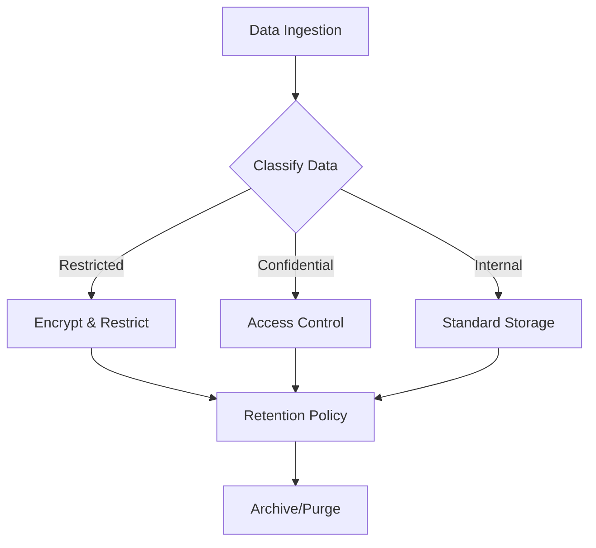

Data within the SOC must be classified to determine appropriate handling and retention controls:
-   **Restricted**: Sensitive PII, Credentials, Private Keys. (Highest Protection)
-   **Confidential**: Internal IP, Network Diagrams, Vulnerability Reports.
-   **Internal**: Standard operational logs.
-   **Public**: Publicly available threat intelligence.

## 2. Retention Policy

### 2.1 Hot Storage (Immediate Access)
-   **Duration**: 30 - 90 Days.
-   **Purpose**: Real-time analysis, correlation, and immediate incident investigation.
-   **Technology**: High-performance storage (SSD/NVMe) usually within the SIEM.

### 2.2 Cold Storage (Long-term Archive)
-   **Duration**: 1 Year - 7 Years (based on compliance requirements like PCI-DSS, GDPR).
-   **Purpose**: Forensic analysis, historical trending, compliance audits.
-   **Technology**: Object Storage (S3, Blob) or Tape backup.

## 3. Data Integrity & Security

-   **Encryption**:
    -   **In-Transit**: TLS 1.2+ for all log forwarding.
    -   **At-Rest**: AES-256 encryption for storage volumes.
-   **Immutability**: Log archives should be immutable (WORM - Write Once Read Many) to prevent tampering.
-   **Access Control**: Strict least-privilege access to raw logs.

## 4. Backup & Recovery

-   **Frequency**: Daily configuration backups; Real-time or hourly data backups.
-   **Testing**: Disaster Recovery (DR) drills must be conducted quarterly to verify data restoration capabilities.

## Related Documents
-   [Data Handling Protocol (TLP)](../06_Operations_Management/Data_Handling_Protocol.en.md)
-   [Deployment Procedures](Deployment_Procedures.en.md)
-   [SOC Infrastructure Setup](../01_Onboarding/System_Activation.en.md)

## References
-   [NIST SP 800-53 (Security/Privacy Controls)](https://csrc.nist.gov/publications/detail/sp/800-53/rev-5/final)
-   [GDPR Data Retention](https://gdpr.eu/)


---

## File: 02_Platform_Operations/Database_Management.th.md

# ธรรมาภิบาลข้อมูลและนโยบายการเก็บรักษา (Data Governance & Retention Policy)

เอกสารนี้ระบุขั้นตอนมาตรฐานในการจัดการข้อมูลความปลอดภัยตลอดวงจรชีวิตของข้อมูล

## 1. การจำแนกประเภทข้อมูล (Data Classification)

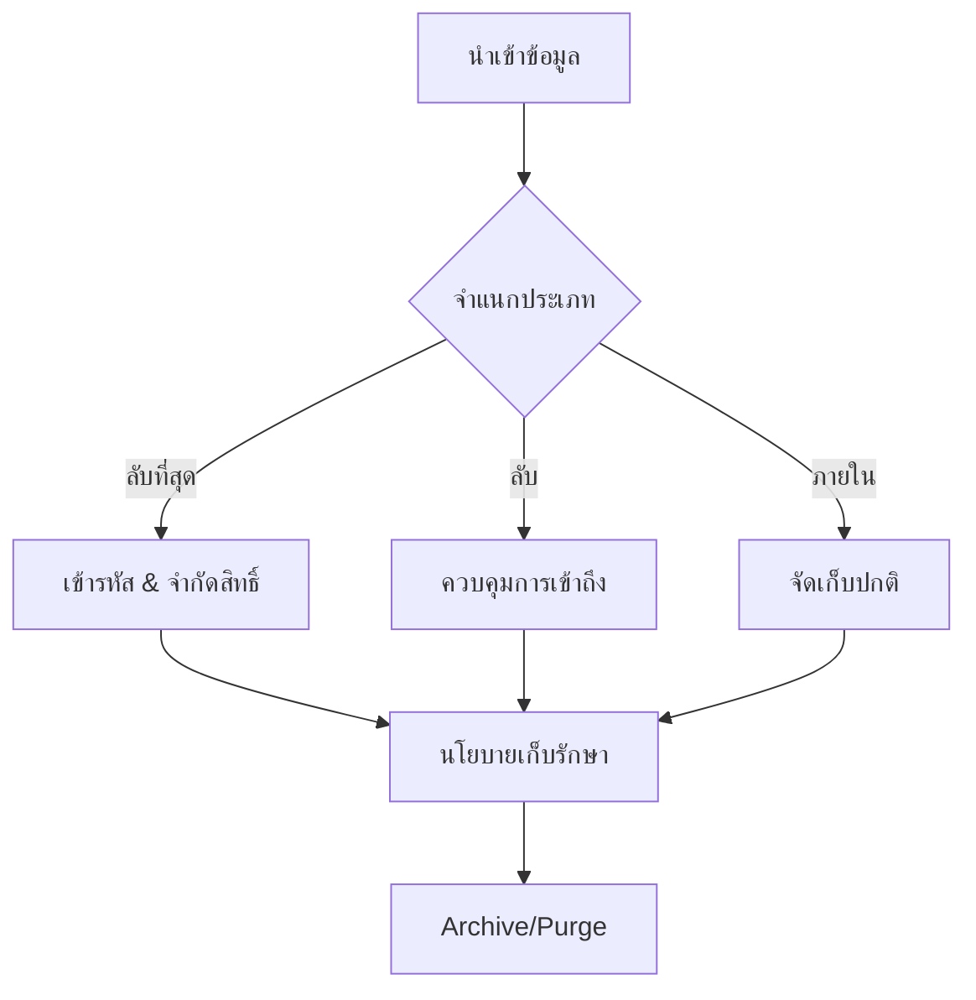

ข้อมูลใน SOC ต้องได้รับการจำแนกเพื่อกำหนดการจัดการที่เหมาะสม:
-   **ลับที่สุด (Restricted)**: PII ที่ละเอียดอ่อน, รหัสผ่าน, Private Keys (ต้องป้องกันสูงสุด)
-   **ลับ (Confidential)**: ทรัพย์สินทางปัญญาภายใน, แผนผังเครือข่าย, รายงานช่องโหว่
-   **ใช้ภายใน (Internal)**: Log การทำงานทั่วไป
-   **สาธารณะ (Public)**: Threat Intelligence ที่เปิดเผยทั่วไป

## 2. นโยบายการเก็บรักษาข้อมูล (Retention Policy)

### 2.1 Hot Storage (เข้าถึงทันที)
-   **ระยะเวลา**: 30 - 90 วัน
-   **วัตถุประสงค์**: การวิเคราะห์ Real-time, Correlation, และการสืบสวนเหตุการณ์ด่วน
-   **เทคโนโลยี**: Storage ประสิทธิภาพสูง (SSD/NVMe) มักอยู่ใน SIEM

### 2.2 Cold Storage (เก็บระยะยาว)
-   **ระยะเวลา**: 1 ปี - 7 ปี (ขึ้นอยู่กับข้อกำหนดทางกฎหมาย เช่น PCI-DSS, GDPR)
-   **วัตถุประสงค์**: การวิเคราะห์ทางนิติวิทยาศาสตร์ (Forensics), ดูแนวโน้มย้อนหลัง, ตรวจสอบ (Audit)
-   **เทคโนโลยี**: Object Storage (S3, Blob) หรือ Tape backup

## 3. ความถูกต้องและความปลอดภัยของข้อมูล (Data Integrity & Security)

-   **การเข้ารหัส (Encryption)**:
    -   **In-Transit**: TLS 1.2+ สำหรับการส่ง Log ทั้งหมด
    -   **At-Rest**: เข้ารหัส AES-256 สำหรับพื้นที่จัดเก็บ
-   **ความไม่เปลี่ยนแปลง (Immutability)**: Log archive ควรเป็นแบบแก้ไขไม่ได้ (WORM - Write Once Read Many) เพื่อป้องกันการปลอมแปลง
-   **การควบคุมการเข้าถึง**: ให้สิทธิ์เท่าที่จำเป็น (Least Privilege) ในการเข้าถึง Raw Log

## 4. การสำรองและกู้คืน (Backup & Recovery)
-   **ความถี่**: สำรองค่า Configuration ทุกวัน; สำรองข้อมูล Real-time หรือทุกชั่วโมง
-   **การทดสอบ**: ต้องมีการซ้อมแผนกู้คืนภัยพิบัติ (DR) ทุกไตรมาสเพื่อยืนยันว่าสามารถกู้คืนข้อมูลได้จริง

## เอกสารที่เกี่ยวข้อง (Related Documents)
-   [โปรโตคอลการจัดการข้อมูล (TLP)](../06_Operations_Management/Data_Handling_Protocol.th.md)
-   [ขั้นตอนการ Deploy](Deployment_Procedures.th.md)
-   [การติดตั้ง SOC](../01_Onboarding/System_Activation.th.md)

## References
-   [NIST SP 800-53 (Security/Privacy Controls)](https://csrc.nist.gov/publications/detail/sp/800-53/rev-5/final)
-   [GDPR Data Retention](https://gdpr.eu/)


---

## File: 02_Platform_Operations/Deployment_Procedures.en.md

# Change Management & Deployment Standard

This document outlines the standard process for managing changes and deployments within the SOC environment.

## 1. Change Management Process

All changes to the production SOC environment (Alert Rules, Parsers, Infrastructure) must follow a structured process.

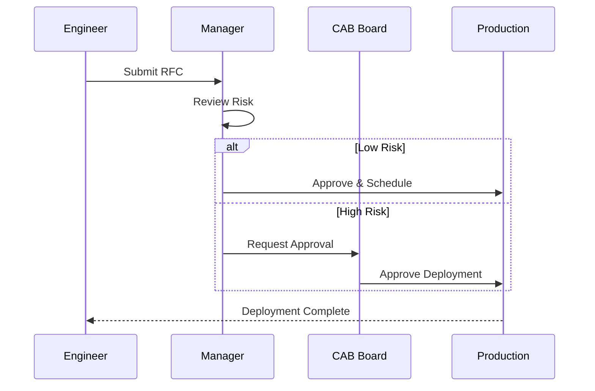

### 1.1 Request (RFC)
-   Submit a Request for Change (RFC) documenting:
    -   Description of change.
    -   Justification/Impact.
    -   Risk assessment.
    -   Rollback plan.

### 1.2 Review & Approval (CAB)
-   **Change Advisory Board (CAB)** reviews High-risk changes.
-   Peer review is required for Alert Rule modifications (Detection Engineering).

## 2. Deployment Procedures

### 2.1 Environment Strategy
-   **Development/Lab**: Sandbox environment for testing new rules and integrations.
-   **Staging**: Mirror of production for final verification.
-   **Production**: Live environment.

### 2.2 Deployment Steps
1.  **Test**: Validate functionality in the Lab environment.
2.  **Snapshot**: Take a backup/snapshot of the current configuration.
3.  **Deploy**: Apply changes to Production during the approved window.
4.  **Verify**: Confirm operational status and check for errors.

### 2.3 CI/CD for Detection Rules
-   Manage detection rules as code (Detection-as-Code).
-   Use Version Control (Git) for all rule logic.
-   Automate testing (Syntax check, Unit test) via CI pipeline before merging to `main`.

## 3. Rollback Plan

-   Every deployment must have a predefined rollback strategy.
-   If verification fails, immediately revert to the pre-deployment snapshot.
-   Conduct a Root Cause Analysis (RCA) for failed changes.

## Related Documents
-   [Change Request Template](../templates/change_request_rfc.en.md)
-   [Data Governance & Retention](Database_Management.en.md)
-   [SOC Infrastructure Setup](../01_Onboarding/System_Activation.en.md)

## References
-   [ITIL Change Management](https://www.axelos.com/best-practice-solutions/itil)
-   [DevSecOps Manifesto](https://www.devsecops.org/)


---

## File: 02_Platform_Operations/Deployment_Procedures.th.md

# มาตรฐานการจัดการการเปลี่ยนแปลงและการ Deploy (Change Management & Deployment Standard)

เอกสารนี้ระบุขั้นตอนมาตรฐานในการจัดการการเปลี่ยนแปลง (Change) และการติดตั้งระบบ (Deployment) ภายในสภาพแวดล้อมของ SOC

## 1. กระบวนการจัดการการเปลี่ยนแปลง (Change Management Process)

การแก้ไขทั้งหมดในสภาพแวดล้อม Production (เช่น กฎแจ้งเตือน, Parser, โครงสร้างพื้นฐาน) ต้องปฏิบัติตามขั้นตอนที่กำหนด

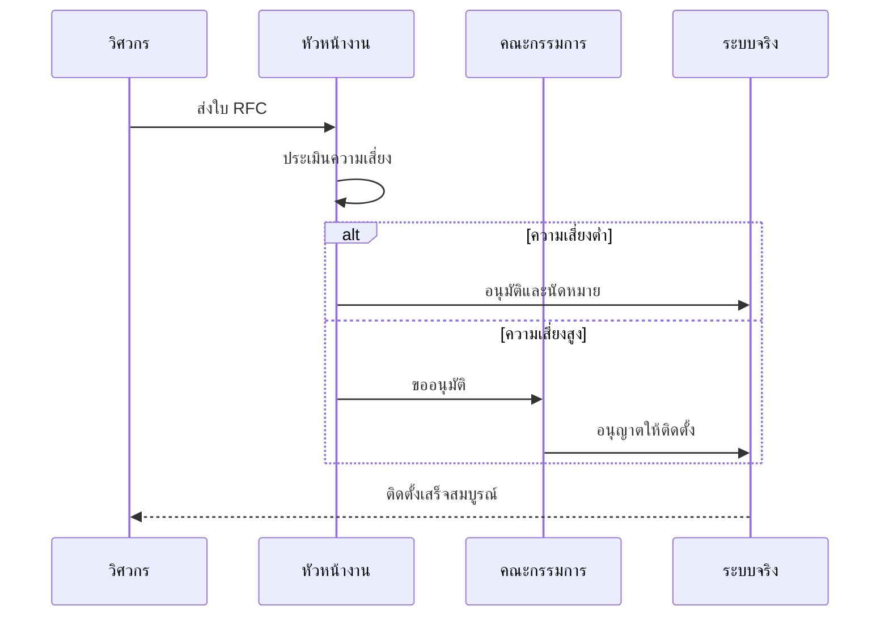

### 1.1 การร้องขอ (RFC)
-   ส่งคำร้องขอการเปลี่ยนแปลง (Request for Change - RFC) โดยระบุ:
    -   รายละเอียดการเปลี่ยนแปลง
    -   เหตุผล/ผลกระทบ
    -    ระดับความเสี่ยง
    -   แผนการถอยกลับ (Rollback plan)

### 1.2 การทบทวนและอนุมัติ (Review & Approval)
-   **Change Advisory Board (CAB)** จะพิจารณาการเปลี่ยนแปลงที่มีความเสี่ยงสูง
-   การแก้ไขกฎตรวจจับ (Alert Rule) ต้องผ่านการ Peer Review เสมอ

## 2. ขั้นตอนการ Deployment

### 2.1 กลยุทธ์สภาพแวดล้อม (Environment Strategy)
-   **Development/Lab**: พื้นที่ Sandbox สำหรับทดสอบกฎและ Integration ใหม่ๆ
-   **Staging**: สภาพแวดล้อมจำลองเหมือน Production เพื่อการตรวจสอบขั้นสุดท้าย
-   **Production**: ระบบจริงที่ใช้งานอยู่

### 2.2 ขั้นตอนการติดตั้ง
1.  **ทดสอบ (Test)**: ตรวจสอบความถูกต้องใน Lab
2.  **สำรองข้อมูล (Snapshot)**: สำรองค่า Configuration ปัจจุบัน
3.  **ติดตั้ง (Deploy)**: ทำการเปลี่ยนแปลงบน Production ในช่วงเวลาที่ได้รับอนุมัติ
4.  **ตรวจสอบ (Verify)**: ยืนยันสถานะการทำงานและตรวจสอบ Error

### 2.3 CI/CD สำหรับกฎตรวจจับ
-   จัดการ Detection Rules ในรูปแบบ Code (Detection-as-Code)
-   ใช้ Version Control (Git) สำหรับเก็บ Logic ของกฎทั้งหมด
-   ทำ Automated Testing (เช็ค Syntax, Unit test) ผ่าน CI pipeline ก่อน Merge เข้า `main`

## 3. แผนการถอยกลับ (Rollback Plan)

-   ทุกการ Deployment ต้องมีแผน Rollback ที่เตรียมไว้ล่วงหน้า
-   หากขั้นตอนการตรวจสอบล้มเหลว ให้ย้อนกลับไปยังสถานะก่อนหน้าทันที
-   ทำ Root Cause Analysis (RCA) สำหรับการเปลี่ยนแปลงที่ล้มเหลว

## เอกสารที่เกี่ยวข้อง (Related Documents)
-   [แบบฟอร์ม Change Request](../templates/change_request_rfc.th.md)
-   [ธรรมาภิบาลข้อมูล](Database_Management.th.md)
-   [การติดตั้ง SOC](../01_Onboarding/System_Activation.th.md)

## References
-   [ITIL Change Management](https://www.axelos.com/best-practice-solutions/itil)
-   [DevSecOps Manifesto](https://www.devsecops.org/)


---

## File: 01_Onboarding/System_Activation.en.md

# Standard SOC Infrastructure Setup

This document outlines the standard infrastructure requirements and setup procedures for a modern Security Operations Center (SOC).

## 1. Core Components

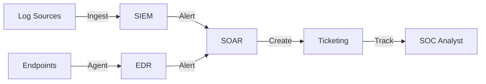

A fully functional SOC requires the following core components:

### 1.1 SIEM (Security Information and Event Management)
-   **Purpose**: Centralized log aggregation, correlation, and alerting.
-   **Requirements**:
    -   High availability and scalability.
    -   Retention policy compliance (e.g., 90 days hot, 1 year cold).
    -   Support for common log formats (Syslog, CEF, JSON).

### 1.2 EDR (Endpoint Detection and Response)
-   **Purpose**: Real-time monitoring and prevention on endpoints.
-   **Deployment**: Agents must be deployed to all workstations, servers, and critical assets.
-   **Policy**: Enforce prevention policies (Block/Quarantine) for known malware.

### 1.3 SOAR (Security Orchestration, Automation, and Response)
-   **Purpose**: Automate repetitive tasks and orchestrate incident response workflows.
-   **Integration**: Must connect with SIEM, EDR, and Ticketing systems.

### 1.4 Ticketing / Case Management
-   **Purpose**: Track incidents, investigations, and analyst activities.
-   **Workflow**: Seamless integration from SIEM alerts to case creation.

## 2. Infrastructure Hardening

### 2.1 Access Control
-   **MFA**: Enforce Multi-Factor Authentication for all SOC tools.
-   **RBAC**: Implement Role-Based Access Control (Analyst, Engineer, Manager).
-   **Segmentation**: SOC infrastructure should reside in a secure, segmented network zone.

### 2.2 Monitoring
-   **Health Checks**: Continuous monitoring of tool availability and performance.
-   **Audit Logs**: Enable audit logging for all SOC analyst actions.

## 3. Network Architecture

-   **Log Shippers**: Use dedicated forwarders to send logs to the SIEM securely (TLS encryption).
-   **Jump Host**: Use a secure Jump Host or VPN for administrative access to SOC infrastructure.

## Related Documents
-   [Analyst Onboarding Path](../09_Training_Onboarding/Analyst_Onboarding_Path.en.md)
-   [Data Governance & Retention](../02_Platform_Operations/Database_Management.en.md)
-   [Deployment Procedures](../02_Platform_Operations/Deployment_Procedures.en.md)

## References
-   [NIST Cybersecurity Framework](https://www.nist.gov/cyberframework)
-   [CISA SOC Best Practices](https://www.cisa.gov/topics/cyber-threats-and-advisories)


---

## File: 01_Onboarding/System_Activation.th.md

# การติดตั้งโครงสร้างพื้นฐาน SOC มาตรฐาน (Standard SOC Infrastructure Setup)

เอกสารนี้ระบุข้อกำหนดและขั้นตอนการติดตั้งโครงสร้างพื้นฐานสำหรับศูนย์ปฏิบัติการความปลอดภัย (SOC) สมัยใหม่

## 1. องค์ประกอบหลัก (Core Components)

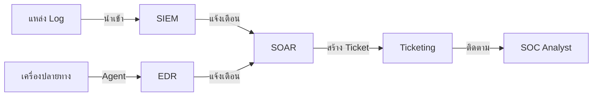

SOC ที่สมบูรณ์จำเป็นต้องมีองค์ประกอบหลักดังนี้:

### 1.1 SIEM (Security Information and Event Management)
-   **วัตถุประสงค์**: รวบรวม Log จากศูนย์กลาง, วิเคราะห์ความสัมพันธ์ (Correlation), และแจ้งเตือน
-   **ข้อกำหนด**:
    -   มีความเสถียรและรองรับการขยายตัว (Scalability)
    -   ปฏิบัติตามนโยบายการเก็บข้อมูล (เช่น Hot 90 วัน, Cold 1 ปี)
    -   รองรับ Log format มาตรฐาน (Syslog, CEF, JSON)

### 1.2 EDR (Endpoint Detection and Response)
-   **วัตถุประสงค์**: ตรวจจับและป้องกันภัยคุกคามบนเครื่องปลายทางแบบ Real-time
-   **การติดตั้ง**: ต้องติดตั้ง Agent ลงบน Workstation, Server และทรัพย์สินสำคัญทั้งหมด
-   **นโยบาย**: บังคับใช้นโยบายป้องกัน (Block/Quarantine) สำหรับมัลแวร์ที่รู้จัก

### 1.3 SOAR (Security Orchestration, Automation, and Response)
-   **วัตถุประสงค์**: ทำงานซ้ำๆ แบบอัตโนมัติ และจัดการ Workflow การตอบสนองภัยคุกคาม
-   **การเชื่อมต่อ**: ต้องเชื่อมต่อกับ SIEM, EDR, และระบบ Ticketing ได้

### 1.4 Ticketing / Case Management
-   **วัตถุประสงค์**: ติดตามเหตุการณ์ (Incidents), การสืบสวน, และกิจกรรมของ Analyst
-   **Workflow**: เชื่อมโยงจาก Alert ใน SIEM ไปสู่การสร้าง Case ได้อย่างราบรื่น

## 2. การทำให้ระบบแข็งแกร่ง (Infrastructure Hardening)

### 2.1 การควบคุมการเข้าถึง (Access Control)
-   **MFA**: บังคับใช้ Multi-Factor Authentication สำหรับเครื่องมือ SOC ทั้งหมด
-   **RBAC**: กำหนดสิทธิ์ตามบทบาทหน้าที่ (Analyst, Engineer, Manager)
-   **Segmentation**: โครงสร้างพื้นฐาน SOC ควรอยู่ใน Network Zone ที่แยกส่วนและปลอดภัย

### 2.2 การเฝ้าระวัง (Monitoring)
-   **Health Checks**: ตรวจสอบสถานะและประสิทธิภาพของเครื่องมืออย่างต่อเนื่อง
-   **Audit Logs**: เปิดใช้งาน Audit Log สำหรับทุกการกระทำของ Analyst

## 3. สถาปัตยกรรมเครือข่าย (Network Architecture)

-   **Log Shippers**: ใช้ตัวส่ง Log (Forwarder) เพื่อส่งข้อมูลไปยัง SIEM อย่างปลอดภัย (เข้ารหัส TLS)
-   **Jump Host**: ใช้ Jump Host หรือ VPN ที่ปลอดภัยสำหรับการเข้าถึงระดับผู้ดูแลระบบ

## เอกสารที่เกี่ยวข้อง (Related Documents)
-   [หลักสูตรฝึกอบรม Analyst](../09_Training_Onboarding/Analyst_Onboarding_Path.th.md)
-   [ธรรมาภิบาลข้อมูล](../02_Platform_Operations/Database_Management.th.md)
-   [ขั้นตอนการ Deploy](../02_Platform_Operations/Deployment_Procedures.th.md)

## References
-   [NIST Cybersecurity Framework](https://www.nist.gov/cyberframework)
-   [CISA SOC Best Practices](https://www.cisa.gov/topics/cyber-threats-and-advisories)


---

## File: 10_File_Signatures/README.md

# YARA Rules (File Signatures)

This directory contains YARA rules for detecting malicious files. These rules can be used with the `yara` command line tool or integrated into EDR/Forensic tools.

| Rule File | Description | Severity |
| :--- | :--- | :--- |
| `webshell_php_generic.yar` | Detects common PHP Webshells (c99, r57, etc.) | Critical |
| `ransomware_generic_encrypt.yar` | Detects mass file encryption behavior and ransom notes | Critical |
| `hacktool_mimikatz.yar` | Detects Mimikatz credential dumping artifacts | High |

## Usage
```bash
yara -r 10_File_Signatures/ /path/to/scan
```


---

## File: 11_Reporting_Templates/Monthly_SOC_Report.en.md

# Monthly SOC Performance Report

**Month**: [MM/YYYY]
**Prepared By**: [SOC Manager Name]
**Distribution**: CIO, CISO, IT Director

## 1. Executive Summary

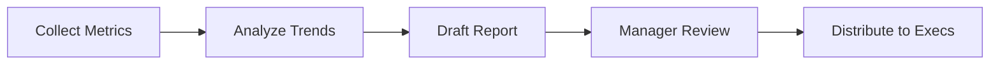

*Provide a 3-5 sentence summary of the SOC's performance this month. Highlight any major incidents or achievements.*

## 2. Key Performance Indicators (KPIs)

| Metric | Target | Actual | Status |
| :--- | :--- | :--- | :--- |
| **MTTD** (Mean Time To Detect) | < 30 Mins | [XX] Mins | [🟢/🔴] |
| **MTTR** (Mean Time To Respond) | < 60 Mins | [XX] Mins | [🟢/🔴] |
| **Total Alerts Processed** | N/A | [XXXX] | N/A |
| **Valid Incidents** | N/A | [XX] | N/A |
| **False Positive Rate** | < 10% | [XX]% | [🟢/🔴] |

## 3. Incident Highlights
*List the top 3 most significant incidents.*

### Incident #1: [Brief Title, e.g., CFO Phishing Attempt]
-   **Date**: [YYYY-MM-DD]
-   **Impact**: [None / Data Loss / Downtime]
-   **Resolution**: [Blocked sender, reset password]
-   **Root Cause**: [User error / Lack of MFA]

## 4. Threat Landscape Analysis
*What trends are we seeing?*
-   [ ] Increase in Phishing attacks targeting HR.
-   [ ] Brute force attempts against VPN.

## 5. Projects & Improvements
-   [ ] Tuned 5 noisy detection rules.
-   [ ] Onboarded [New Log Source].
-   [ ] Completed [Training Module].

## Related Documents
-   [SOC Metrics & KPIs](../06_Operations_Management/SOC_Metrics.en.md)
-   [Quarterly Business Review](Quarterly_Business_Review.en.md)
-   [SOC Assessment Checklist](../06_Operations_Management/SOC_Assessment_Checklist.en.md)

## References
-   [SANS SOC Metrics](https://www.sans.org/white-papers/)
-   [SOC-CMM](https://www.soc-cmm.com/)


---

## File: 11_Reporting_Templates/Monthly_SOC_Report.th.md

# รายงานผลการดำเนินงาน SOC ประจำเดือน

**ประจำเดือน**: [ด/ปปปป]
**จัดทำโดย**: [ชื่อผู้จัดการ SOC]
**ผู้รับมอบ**: CIO, CISO, IT Director

## 1. บทสรุปผู้บริหาร (Executive Summary)

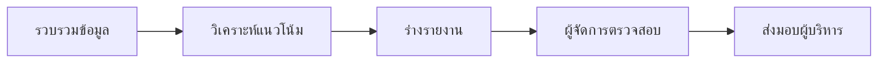

*สรุปภาพรวมการทำงานของ SOC ในเดือนนี้ 3-5 ประโยค เน้นเหตุการณ์สำคัญหรือความสำเร็จ*

## 2. ตัวชี้วัดผลการดำเนินงาน (KPIs)

| ตัวชี้วัด (Metric) | เป้าหมาย (Target) | ผลลัพธ์ (Actual) | สถานะ |
| :--- | :--- | :--- | :--- |
| **MTTD** (เวลาตรวจจับเฉลี่ย) | < 30 นาที | [XX] นาที | [🟢/🔴] |
| **MTTR** (เวลาตอบสนองเฉลี่ย) | < 60 นาที | [XX] นาที | [🟢/🔴] |
| **จำนวน Alert ทั้งหมด** | - | [XXXX] | - |
| **จำนวน Incident จริง** | - | [XX] | - |
| **อัตรา False Positive** | < 10% | [XX]% | [🟢/🔴] |

## 3. เหตุการณ์สำคัญ (Incident Highlights)
*ระบุ 3 เหตุการณ์ที่สำคัญที่สุด*

### เหตุการณ์ที่ 1: [ชื่อเหตุการณ์ เช่น ตรวจพบมัลแวร์เครื่องฝ่ายการเงิน]
-   **วันที่**: [YYYY-MM-DD]
-   **ผลกระทบ**: [ไม่มี / ข้อมูลรั่วไหล / ระบบหยุดทำงาน]
-   **การแก้ไข**: [กักกันเครื่อง, ลง Windows ใหม่]
-   **สาเหตุ**: [User เปิดไฟล์แนบอันตราย]

## 4. วิเคราะห์แนวโน้มภัยคุกคาม (Threat Landscape)
*แนวโน้มที่พบในเดือนนี้*
-   [ ] พบการโจมตี Phishing เพิ่มขึ้นในแผนกบุคคล
-   [ ] มีการพยายามเดารหัสผ่าน VPN บ่อยครั้ง

## 5. โครงการและการปรับปรุง
-   [ ] ปรับปรุงกฎ Alert ที่แจ้งเตือนผิดพลาด 5 กฎ
-   [ ] นำเข้า Log ใหม่จาก [ระบบ]
-   [ ] อบรมพนักงานเรื่อง [หัวข้อ]

## เอกสารที่เกี่ยวข้อง (Related Documents)
-   [ตัวชี้วัด SOC](../06_Operations_Management/SOC_Metrics.th.md)
-   [รายงานรายไตรมาส](Quarterly_Business_Review.th.md)
-   [แบบประเมิน SOC](../06_Operations_Management/SOC_Assessment_Checklist.th.md)

## References
-   [SANS SOC Metrics](https://www.sans.org/white-papers/)
-   [SOC-CMM](https://www.soc-cmm.com/)


---

## File: 11_Reporting_Templates/Quarterly_Business_Review.en.md

# SOC Quarterly Business Review (QBR)

**Quarter**: [Q1/Q2/Q3/Q4 YYYY]
**Prepared By**: [SOC Manager]

## 1. Strategic Summary
*Overview of SOC maturity and alignment with business goals.*

## 2. Maturity Growth (SOC-CMM)
*Compare current maturity with previous quarter.*

| Domain | Previous Score | Current Score | Change |
| :--- | :--- | :--- | :--- |
| Business | [1-5] | [1-5] | [🔺/🔻] |
| People | [1-5] | [1-5] | [🔺/🔻] |
| Process | [1-5] | [1-5] | [🔺/🔻] |
| Technology | [1-5] | [1-5] | [🔺/🔻] |
| Operations | [1-5] | [1-5] | [🔺/🔻] |

## 3. Budget & Resource Status
-   **Budget Utilization**: [XX]% of annual budget used.
-   **Staffing**: [XX] Analysts / [XX] Open Headcounts.
-   **Licensing**: [XX] EPS used vs [XX] EPS quota.

## 4. Risks & Challenges
*High-level risks that require leadership attention.*
1.  **Staff Retention**: Risk of Junior Analysts leaving due to burnout.
2.  **Blind Spots**: Implementing EDR on Linux servers is delayed.

## 5. Next Quarter Roadmap
-   **Goal 1**: Achieve SOC-CMM Level 3 in "Process".
-   **Goal 2**: Integrate Cloud Logs (AWS/Azure).
-   **Goal 3**: Conduct Purple Team exercise.

## Related Documents
-   [Monthly SOC Report](Monthly_SOC_Report.en.md)
-   [SOC Assessment Checklist](../06_Operations_Management/SOC_Assessment_Checklist.en.md)
-   [SOC Metrics & KPIs](../06_Operations_Management/SOC_Metrics.en.md)

## References
-   [SOC-CMM Assessment Model](https://www.soc-cmm.com/)
-   [Gartner SOC Modernization](https://www.gartner.com/en/information-technology)


---

## File: 11_Reporting_Templates/Quarterly_Business_Review.th.md

# รายงานทบทวนผลการดำเนินงานรายไตรมาส (SOC QBR)

**ไตรมาส**: [Q1/Q2/Q3/Q4 ปี]
**จัดทำโดย**: [ผู้จัดการ SOC]

## 1. บทสรุปเชิงกลยุทธ์ (Strategic Summary)
*ภาพรวมความพร้อมของ SOC และความสอดคล้องกับเป้าหมายธุรกิจ*

## 2. การเติบโตด้านความพร้อม (Maturity Growth - SOC-CMM)
*เปรียบเทียบคะแนนความพร้อมกับไตรมาสที่ผ่านมา*

| ด้าน (Domain) | คะแนนเดิม | คะแนนปัจจุบัน | การเปลี่ยนแปลง |
| :--- | :--- | :--- | :--- |
| ธุรกิจ (Business) | [1-5] | [1-5] | [🔺/🔻] |
| บุคลากร (People) | [1-5] | [1-5] | [🔺/🔻] |
| กระบวนการ (Process) | [1-5] | [1-5] | [🔺/🔻] |
| เทคโนโลยี (Technology) | [1-5] | [1-5] | [🔺/🔻] |
| การปฏิบัติงาน (Operations) | [1-5] | [1-5] | [🔺/🔻] |

## 3. งบประมาณและทรัพยากร
-   **การใช้งบประมาณ**: ใช้ไป [XX]% ของงบปี
-   **อัตรากำลังคน**: [XX] คน / ต้องการเพิ่ม [XX] คน
-   **Licensing**: ใช้ไป [XX] EPS จากโควต้า [XX] EPS

## 4. ความเสี่ยงและความท้าทาย
*ความเสี่ยงระดับสูงที่ผู้บริหารต้องรับทราบ*
1.  **การรักษาพนักงาน**: ความเสี่ยงที่ Analyst จะลาออกเนื่องจากงานล้นมือ
2.  **จุดบอด (Blind Spots)**: โครงการติดตั้ง EDR บน Linux ล่าช้ากว่ากำหนด

## 5. แผนงานไตรมาสถัดไป
-   **เป้าหมาย 1**: ยกระดับ SOC-CMM ด้าน "Process" ให้ถึง Level 3
-   **เป้าหมาย 2**: เชื่อมต่อ Log จากระบบ Cloud
-   **เป้าหมาย 3**: จัดซ้อมรบทางไซเบอร์ (Purple Team)

## เอกสารที่เกี่ยวข้อง (Related Documents)
-   [รายงานประจำเดือน](Monthly_SOC_Report.th.md)
-   [แบบประเมิน SOC](../06_Operations_Management/SOC_Assessment_Checklist.th.md)
-   [ตัวชี้วัด SOC](../06_Operations_Management/SOC_Metrics.th.md)

## References
-   [SOC-CMM Assessment Model](https://www.soc-cmm.com/)
-   [Gartner SOC Modernization](https://www.gartner.com/en/information-technology)


---

## File: 06_Operations_Management/Data_Handling_Protocol.en.md

# Data Handling Protocol (TLP 2.0)

**Effective Date**: 2026-02-15
**Version**: 1.0

## 1. Overview
The Traffic Light Protocol (TLP) was created to facilitate greater sharing of information. TLP is a set of designations used to ensure that sensitive information is shared with the appropriate audience.

## 2. Classification Logic
Use this flow to determine the correct TLP level for your data/incident.

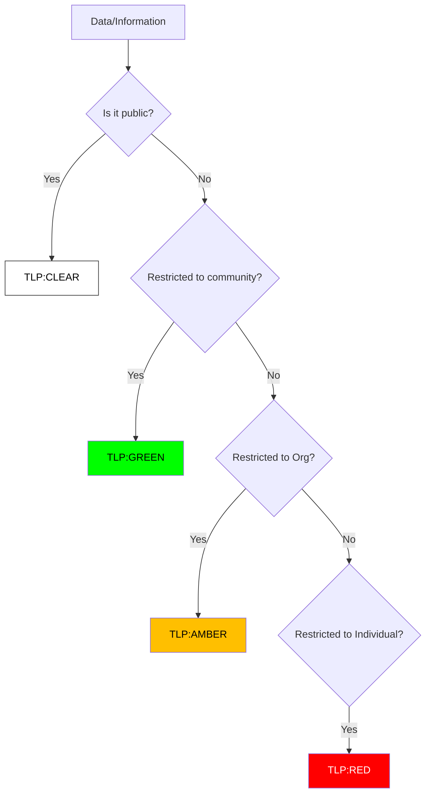

## 3. TLP Definitions

### 🔴 TLP:RED (For Your Eyes Only)
-   **Definition**: Not for disclosure, restricted to participants only.
-   **Examples**: VPN Logs with passwords, Forensic Reports linking to a specific employee, Ongoing negotiation with ransomware actors.
-   **Sharing**: Cannot be shared with anyone outside of the specific meeting or conversation.

### 🟡 TLP:AMBER (Limited Disclosure)
-   **Definition**: Limited disclosure, restricted to the organization's need-to-know.
-   **Examples**: Internal incident reports, Vulnerability scan results, System architecture diagrams.
-   **Sharing**: Clients may share with members of their own organization and clients who need to know.

### 🟢 TLP:GREEN (Community Wide)
-   **Definition**: Limited disclosure, restricted to the community.
-   **Examples**: IoCs (IPs/Hashes) of a known threat actor, General advice on mitigation.
-   **Sharing**: Information can be shared with peers and partner organizations within the sector.

### ⚪ TLP:CLEAR (World Wide)
-   **Definition**: Unlimited disclosure.
-   **Examples**: Public PR statements, Whitepapers, Patch notes.
-   **Sharing**: Subject to standard restrictions (copyright), but otherwise freely shareable.

## 4. Usage in Incident Reports
All Incident Reports MUST be marked with a TLP level at the top of the document.

## Related Documents
-   [Incident Response Framework](../05_Incident_Response/Framework.en.md)
-   [SOC Assessment Checklist](SOC_Assessment_Checklist.en.md)
-   [SOC Metrics & KPIs](SOC_Metrics.en.md)

## References
-   [FIRST.org TLP 2.0 Standard](https://www.first.org/tlp/)
-   [CISA Traffic Light Protocol](https://www.cisa.gov/tlp)


---

## File: 06_Operations_Management/Data_Handling_Protocol.th.md

# โปรโตคอลการจัดการข้อมูล (TLP 2.0)

**วันที่มีผลบังคับใช้**: 2026-02-15
**เวอร์ชัน**: 1.0

## 1. ภาพรวม
Traffic Light Protocol (TLP) คือมาตรฐานสากลที่ใช้กำหนดขอบเขตในการแบ่งปันข้อมูล เพื่อให้มั่นใจว่าข้อมูลที่มีความละเอียดอ่อนจะถูกส่งต่อไปยังผู้ที่เกี่ยวข้องเท่านั้น

## 2. ขั้นตอนการจำแนกข้อมูล (Classification Logic)
ใช้แผนผังด้านล่างเพื่อตัดสินใจเลือก TLP Level

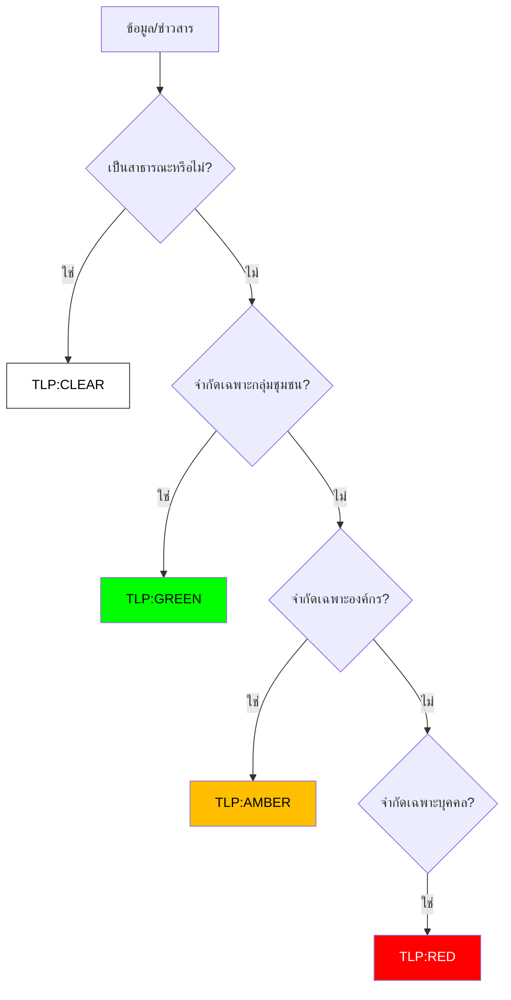

## 3. คำนิยาม TLP

### 🔴 TLP:RED (ลับที่สุด / เฉพาะบุคคล)
-   **คำนิยาม**: ห้ามเปิดเผยต่อผู้อื่น จำกัดไว้เฉพาะผู้รับสารโดยตรงเท่านั้น
-   **ตัวอย่าง**: Log ที่มีรหัสผ่าน, รายงาน Forensics ที่ระบุชื่อพนักงานที่ทำผิด, การเจรจากับแฮกเกอร์
-   **การแบ่งปัน**: ห้ามส่งต่อ หรือบอกกล่าวแก่บุคคลอื่นนอกเหนือจากคู่สนทนา

### 🟡 TLP:AMBER (จำกัดภายในองค์กร)
-   **คำนิยาม**: เปิดเผยได้จำกัด เฉพาะผู้ที่มีความจำเป็นต้องรู้ (Need-to-know) ภายในองค์กร
-   **ตัวอย่าง**: รายงานเหตุการณ์ภัยคุกคามภายใน, ผล Scan ช่องโหว่, ผังเครือข่ายภายใน
-   **การแบ่งปัน**: ส่งต่อได้เฉพาะพนักงานภายในองค์กรที่เกี่ยวข้อง

### 🟢 TLP:GREEN (จำกัดภายในกลุ่มเครือข่าย)
-   **คำนิยาม**: เปิดเผยได้ภายในกลุ่มชุมชนหรืออุตสาหกรรมเดียวกัน
-   **ตัวอย่าง**: IoC (IP/Hash) ของกลุ่มแฮกเกอร์, คำแนะนำการป้องกันทั่วไป
-   **การแบ่งปัน**: แชร์กับบริษัทคู่ค้า หรือกลุ่มอุตสาหกรรมเดียวกันได้ (เช่น กลุ่มธนาคาร)

### ⚪ TLP:CLEAR (สาธารณะ)
-   **คำนิยาม**: เปิดเผยได้ไม่จำกัด
-   **ตัวอย่าง**: แถลงการณ์ข่าว, บทความวิชาการ, รายละเอียด Patch
-   **การแบ่งปัน**: เผยแพร่สู่สาธารณะได้ทันที

## 4. การใข้งานในรายงาน (Incident Reports)
รายงานเหตุการณ์ทุกฉบับ ต้องระบุระดับ TLP อย่างชัดเจนที่ส่วนหัวของเอกสาร

## เอกสารที่เกี่ยวข้อง (Related Documents)
-   [กรอบการตอบสนองเหตุการณ์](../05_Incident_Response/Framework.th.md)
-   [แบบประเมิน SOC](SOC_Assessment_Checklist.th.md)
-   [ตัวชี้วัด SOC](SOC_Metrics.th.md)

## References
-   [FIRST.org TLP 2.0 Standard](https://www.first.org/tlp/)
-   [CISA Traffic Light Protocol](https://www.cisa.gov/tlp)


---

## File: 06_Operations_Management/SOC_Assessment_Checklist.en.md

# SOC Capability Maturity Model (SOC-CMM) Assessment

**Assessment Period**: Quarterly

## 1. Improvement Cycle
We use a continuous improvement loop to advance our SOC maturity.

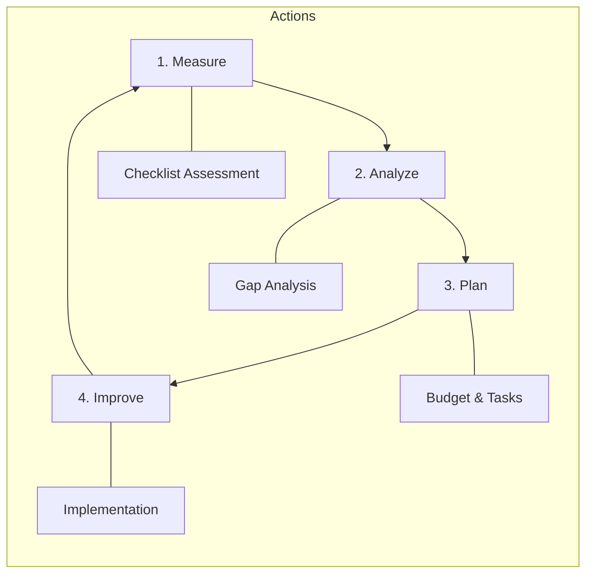

## 2. Maturity Levels
-   **Level 1 (Initial)**: Ad-hoc, chaotic, reactive.
-   **Level 2 (Managed)**: Processes defined but reactive.
-   **Level 3 (Defined)**: Proactive, documented standards (We are here).
-   **Level 4 (Quantitatively Managed)**: Metrics-driven (MTTD/MTTR).
-   **Level 5 (Optimizing)**: Automated, AI-driven, advanced hunting.

## 3. Assessment Checklist

### Domain 1: Business
- [ ] Defined SOC Charter & Strategy?
- [ ] Executive Sponsorship & Budget?
- [ ] Defined Metrics (KPIs) reporting?

### Domain 2: People
- [ ] 24/7 Shift Schedule operational?
- [ ] defined Onboarding Curriculum?
- [ ] Regular Skill Training (Purple Team)?

### Domain 3: Process
- [ ] SOPs for all major tasks?
- [ ] Playbooks for top 10 threats?
- [ ] Change Management (RFC) in place?

### Domain 4: Technology
- [ ] SIEM ingesting critical logs?
- [ ] EDR deployed on 95%+ endpoints?
- [ ] SOAR automation for repetitive tasks?

### Domain 5: Services
- [ ] Real-time Monitoring & Alerting?
- [ ] Incident Response Capability?
- [ ] Threat Intelligence integration?

## 4. Scoring
Count the "Yes" answers to determine approximate maturity.
-   0-5: Level 1
-   6-10: Level 2
-   11-13: Level 3 (Target Baseline)
-   14+: Level 4+

## Related Documents
-   [Incident Response Framework](../05_Incident_Response/Framework.en.md)
-   [SOC Assessment Checklist](SOC_Assessment_Checklist.en.md)
-   [SOC Metrics & KPIs](SOC_Metrics.en.md)

## References
-   [SOC-CMM (Capability Maturity Model)](https://www.soc-cmm.com/)
-   [MITRE SOC Strategy](https://mitre.org/)
-   14+: Level 4+


---

## File: 06_Operations_Management/SOC_Assessment_Checklist.th.md

# แบบประเมินระดับความพร้อม SOC (SOC-CMM)

**รอบการประเมิน**: รายไตรมาส

## 1. วงจรการปรับปรุง (Improvement Cycle)
เราใช้วงจรการปรับปรุงอย่างต่อเนื่องเพื่อยกระดับความสามารถของ SOC

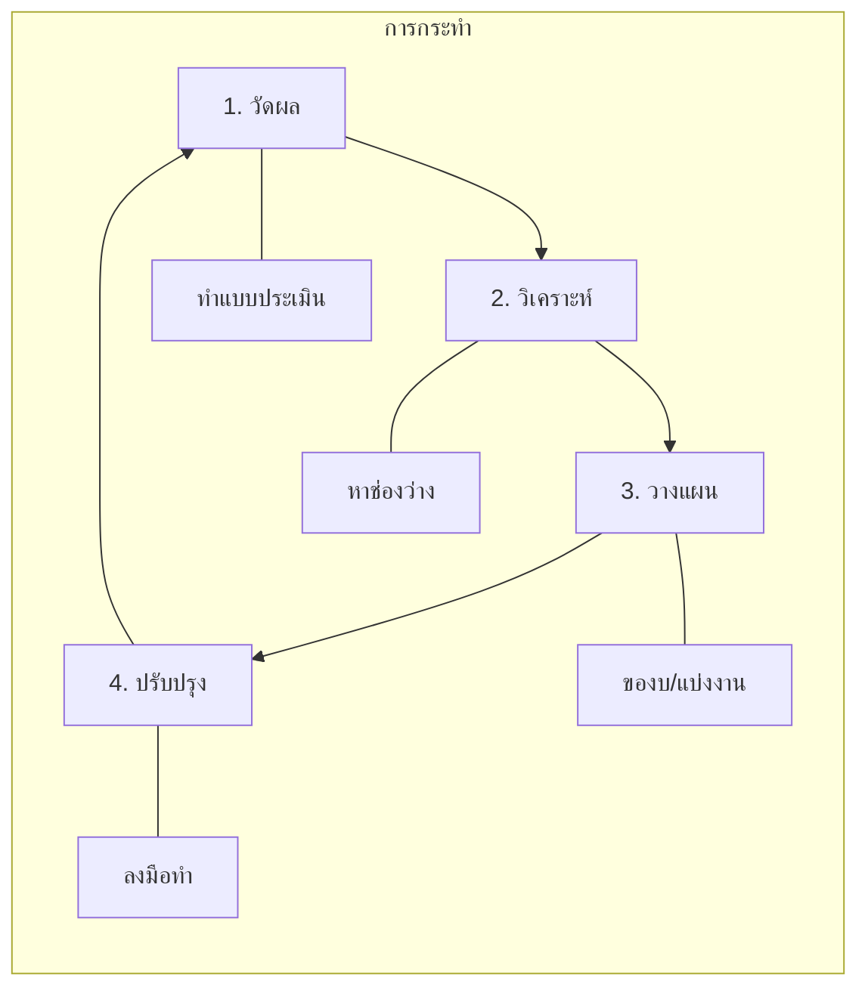

## 2. ระดับความพร้อม (Maturity Levels)
-   **Level 1 (Initial)**: ทำตามมีตามเกิด, แก้ปัญหาเฉพาะหน้า
-   **Level 2 (Managed)**: มีกระบวนการ แต่ยังทำงานเชิงรับ (Reactive)
-   **Level 3 (Defined)**: มีมาตรฐานชัดเจน, ทำงานเชิงรุก (Proactive) **(เป้าหมายปัจจุบัน)**
-   **Level 4 (Quantitatively Managed)**: ขับเคลื่อนด้วยข้อมูล (Metrics/KPIs)
-   **Level 5 (Optimizing)**: อัตโนมัติขั้นสูง, AI-driven

## 3. รายการตรวจเช็ค (Checklist)

### Domain 1: ธุรกิจ (Business)
- [ ] มีพ.ร.บ. หรือกฎบัตร (Charter) ของ SOC?
- [ ] ได้รับการสนับสนุนงบประมาณจากผู้บริหาร?
- [ ] มีการรายงานผล KPI สม่ำเสมอ?

### Domain 2: บุคลากร (People)
- [ ] มีตารางเวร 24/7 ที่ชัดเจน?
- [ ] มีหลักสูตร Onboarding พนักงานใหม่?
- [ ] มีการฝึกอบรมทักษะ (เช่น Purple Team) สม่ำเสมอ?

### Domain 3: กระบวนการ (Process)
- [ ] มี SOP ครอบคลุมงานหลัก?
- [ ] มี Playbook รับมือภัยคุกคาม 10 อันดับแรก?
- [ ] มีกระบวนการ Change Management (RFC)?

### Domain 4: เทคโนโลยี (Technology)
- [ ] SIEM รับ Log สำคัญครบถ้วน?
- [ ] EDR ติดตั้งครอบคลุม 95%+ ของเครื่อง?
- [ ] มีระบบ SOAR ช่วยงานซ้ำๆ?

### Domain 5: บริการ (Services)
- [ ] มีการเฝ้าระวังและแจ้งเตือนแบบ Real-time?
- [ ] มีขีดความสามารถในการตอบสนองเหตุการณ์ (IR)?
- [ ] มีการใช้ Threat Intelligence?

## 4. การให้คะแนน
นับจำนวนข้อที่ตอบ "ใช่" เพื่อประเมินระดับ
-   0-5: Level 1
-   6-10: Level 2
-   11-13: Level 3 (เกณฑ์มาตรฐาน)
-   14+: Level 4+

## เอกสารที่เกี่ยวข้อง (Related Documents)
-   [กรอบการตอบสนองเหตุการณ์](../05_Incident_Response/Framework.th.md)
-   [แบบประเมิน SOC](SOC_Assessment_Checklist.th.md)
-   [ตัวชี้วัด SOC](SOC_Metrics.th.md)

## References
-   [SOC-CMM (Capability Maturity Model)](https://www.soc-cmm.com/)
-   [MITRE SOC Strategy](https://mitre.org/)
-   14+: Level 4+


---

## File: 06_Operations_Management/SOC_Metrics.en.md

# SOC Metrics & KPIs Standard

This document defines the Key Performance Indicators (KPIs) and metrics used to measure the effectiveness and efficiency of the SOC.

## 1. Operational Metrics (Efficiency)

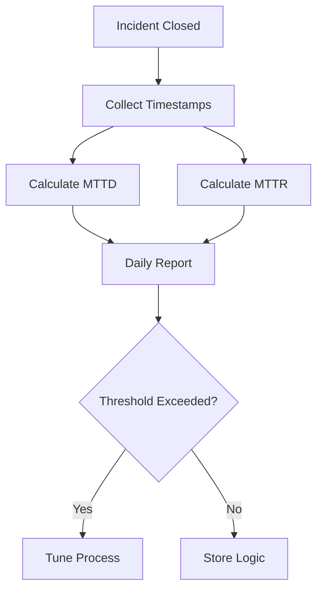

### 1.1 Mean Time To Detect (MTTD)

### 1.1 Mean Time To Detect (MTTD)
-   **Definition**: The average time it takes to identify a security threat after it has entered the network.
-   **Target**: < 30 Minutes.
-   **Formula**: `Sum(Detection Time - Intrusion Time) / Total Incidents`

### 1.2 Mean Time To Respond (MTTR)
-   **Definition**: The average time it takes to contain and remediate a threat after it has been detected.
-   **Target**: < 60 Minutes (for High/Critical severity).
-   **Formula**: `Sum(Remediation Time - Detection Time) / Total Incidents`

### 1.3 Mean Time To Acknowledge (MTTA)
-   **Definition**: The average time from an alert being triggered to an analyst picking it up.
-   **Target**: < 10 Minutes.

## 2. Detection Metrics (Effectiveness)

### 2.1 False Positive Rate (FPR)
-   **Definition**: Percentage of alerts that are benign but triggered a response.
-   **Target**: < 10%.
-   **Action**: High FPR requires tuning of detection rules (Whitelisting).

### 2.2 Dwell Time
-   **Definition**: The duration a threat actor remains undetected in the environment.
-   **Impact**: Longer dwell time = Higher data breach risk.

## 3. Analyst Capacity

-   **Incidents per Analyst**: Number of cases handled by one analyst per shift.
-   **Burnout Rate**: Turnover rate of SOC staff (Target: < 15% annually).

## Related Documents
-   [Incident Response Framework](../05_Incident_Response/Framework.en.md)
-   [SOC Assessment Checklist](SOC_Assessment_Checklist.en.md)
-   [SOC Metrics & KPIs](SOC_Metrics.en.md)

## References
-   [SANS SOC Metrics](https://www.sans.org/white-papers/soc-metrics/)
-   [MITRE SOC Assessment](https://cat.mitre.org/)


---

## File: 06_Operations_Management/SOC_Metrics.th.md

# มาตรฐานตัวชี้วัดประสิทธิภาพ SOC (SOC Metrics & KPIs Standard)

เอกสารนี้กำหนดตัวชี้วัดประสิทธิภาพหลัก (KPIs) และ Metrics ที่ใช้จัดวัดประสิทธิผลและประสิทธิภาพของ SOC

## 1. ตัวชี้วัดด้านการปฏิบัติงาน (Operational Metrics - Efficiency)

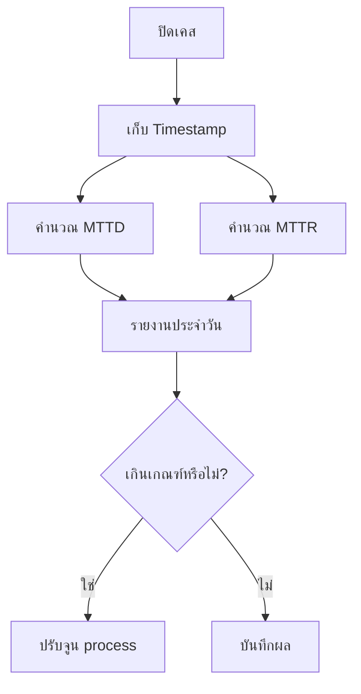

### 1.1 เวลาเฉลี่ยในการตรวจจับ (Mean Time To Detect - MTTD)

### 1.1 เวลาเฉลี่ยในการตรวจจับ (Mean Time To Detect - MTTD)
-   **นิยาม**: เวลาเฉลี่ยที่ใช้ในการระบุภัยคุกคามหลังจากที่เข้ามาในเครือข่ายแล้ว
-   **เป้าหมาย**: < 30 นาที
-   **สูตรคำนวณ**: `ผลรวม(เวลาที่ตรวจเจอ - เวลาที่เริ่มบุกรุก) / จำนวนเหตุการณ์ทั้งหมด`

### 1.2 เวลาเฉลี่ยในการตอบสนอง (Mean Time To Respond - MTTR)
-   **นิยาม**: เวลาเฉลี่ยที่ใช้ในการจำกัดและแก้ไขภัยคุกคามหลังจากที่ตรวจพบแล้ว
-   **เป้าหมาย**: < 60 นาที (สำหรับความรุนแรงระดับ High/Critical)
-   **สูตรคำนวณ**: `ผลรวม(เวลาที่แก้ไขเสร็จ - เวลาที่ตรวจเจอ) / จำนวนเหตุการณ์ทั้งหมด`

### 1.3 เวลาเฉลี่ยในการรับเรื่อง (Mean Time To Acknowledge - MTTA)
-   **นิยาม**: เวลาเฉลี่ยตั้งแต่ Alert แจ้งเตือนจนถึงเวลาที่ Analyst กดรับงาน
-   **เป้าหมาย**: < 10 นาที

## 2. ตัวชี้วัดด้านการตรวจจับ (Detection Metrics - Effectiveness)

### 2.1 อัตราการแจ้งเตือนผิดพลาด (False Positive Rate - FPR)
-   **นิยาม**: เปอร์เซ็นต์ของ Alert ที่ไม่ใช่ภัยคุกคามจริง
-   **เป้าหมาย**: < 10%
-   **การดำเนินการ**: หาก FPR สูง ต้องทำการปรับจูน Detection Rules (Whitelisting)

### 2.2 ระยะเวลาแฝงตัว (Dwell Time)
-   **นิยาม**: ระยะเวลาที่ผู้โจมตีแฝงตัวอยู่ในระบบโดยไม่ถูกตรวจจับ
-   **ผลกระทบ**: ยิ่งนาน = ความเสี่ยงข้อมูลรั่วไหลยิ่งสูง

## 3. ขีดความสามารถของ Analyst (Analyst Capacity)

-   **Incidents per Analyst**: จำนวนเคสที่ Analyst หนึ่งคนรับผิดชอบต่อกะ
-   **Burnout Rate**: อัตราการลาออกของพนักงาน SOC (เป้าหมาย: < 15% ต่อปี)

## เอกสารที่เกี่ยวข้อง (Related Documents)
-   [กรอบการตอบสนองเหตุการณ์](../05_Incident_Response/Framework.th.md)
-   [แบบประเมิน SOC](SOC_Assessment_Checklist.th.md)
-   [ตัวชี้วัด SOC](SOC_Metrics.th.md)

## References
-   [SANS SOC Metrics](https://www.sans.org/white-papers/soc-metrics/)
-   [MITRE SOC Assessment](https://cat.mitre.org/)


---

## File: 06_Operations_Management/SOC_Team_Structure.en.md

# SOC Team Structure & Roles

This document defines the organizational structure, roles, and responsibilities within the Security Operations Center (SOC).

## 1. Organizational Chart

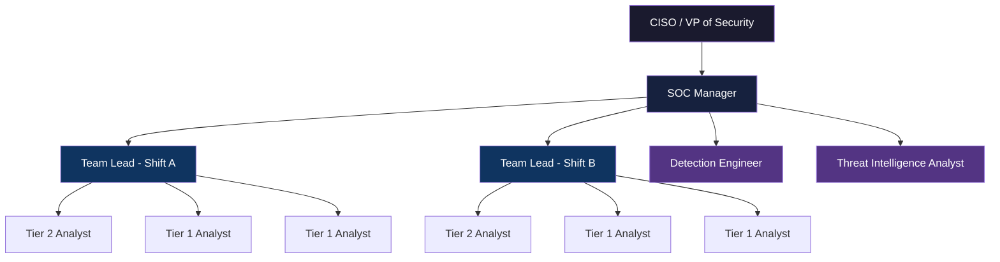

## 2. Role Definitions

### 2.1 Tier 1 — Alert Analyst (Monitoring & Triage)
-   **Headcount**: 4-6 per SOC (2-3 per shift)
-   **Responsibilities**:
    -   Monitor SIEM dashboards and alert queues in real-time.
    -   Perform initial triage: True Positive vs. False Positive classification.
    -   Escalate confirmed incidents to Tier 2 with initial context.
    -   Document actions in the ticketing system.
-   **Skills Required**: CompTIA Security+, basic networking, log analysis.
-   **KPIs**: Alert Throughput, False Positive Rate, MTTD (Mean Time To Detect).

### 2.2 Tier 2 — Incident Responder (Investigation & Containment)
-   **Headcount**: 2-4 per SOC (1-2 per shift)
-   **Responsibilities**:
    -   Deep-dive investigation on escalated incidents.
    -   Execute Playbook containment and eradication steps.
    -   Perform host & network forensics (memory, disk, packet capture).
    -   Coordinate with IT teams for isolation and remediation.
-   **Skills Required**: CySA+, GCIH, EDR/SIEM advanced queries, forensics tools.
-   **KPIs**: MTTR (Mean Time To Respond), Incident Closure Rate.

### 2.3 Tier 3 — Threat Hunter / Senior Analyst
-   **Headcount**: 1-2 per SOC
-   **Responsibilities**:
    -   Proactive threat hunting using hypothesis-driven methodologies.
    -   Advanced malware analysis and reverse engineering.
    -   Develop custom detection content (Sigma, YARA, Snort).
    -   Lead major incident investigations and Root Cause Analysis (RCA).
-   **Skills Required**: GCIA, GCFA, OSCP, advanced scripting (Python, PowerShell).
-   **KPIs**: Threats Discovered, Detection Gap Reduction, TTPs Mapped to MITRE ATT&CK.

### 2.4 Detection Engineer
-   **Headcount**: 1-2 per SOC
-   **Responsibilities**:
    -   Create and maintain detection rules (Sigma/YARA/Snort).
    -   Tune rules to reduce False Positive Rate.
    -   Manage CI/CD pipeline for rule deployment.
    -   Maintain the MITRE ATT&CK coverage dashboard.
-   **Skills Required**: Sigma, regex, SIEM query languages (SPL, KQL, Lucene).

### 2.5 Threat Intelligence Analyst
-   **Headcount**: 1 per SOC
-   **Responsibilities**:
    -   Collect, analyze, and disseminate threat intelligence (CTI).
    -   Maintain threat feeds and IOC databases.
    -   Produce Threat Advisory reports for stakeholders.
    -   Map adversary TTPs to organizational risk.
-   **Skills Required**: CTIA, OSINT techniques, TLP classification, STIX/TAXII.

### 2.6 SOC Manager
-   **Headcount**: 1 per SOC
-   **Responsibilities**:
    -   Oversee daily SOC operations and shift scheduling.
    -   Set KPIs and report metrics to CISO/Leadership.
    -   Manage staffing, training, and career development.
    -   Coordinate with external teams (IT, Legal, HR) during major incidents.
    -   Budget management for tools and licensing.
-   **Skills Required**: CISSP, CISM, leadership and communication skills.

## 3. Career Progression Path

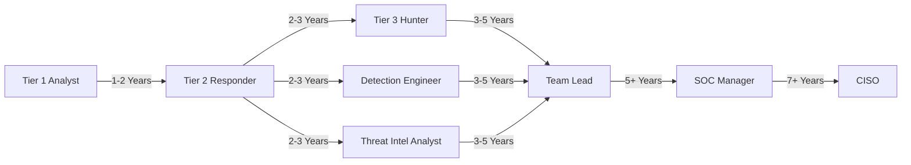

## 4. Recommended Staffing Model

| SOC Volume | Tier 1 | Tier 2 | Tier 3 | Det. Engineer | TI Analyst | Manager | Total |
| :--- | :---: | :---: | :---: | :---: | :---: | :---: | :---: |
| **Small** (<500 alerts/day) | 2 | 1 | 0 | 1 (shared) | 0 | 1 | 5 |
| **Medium** (500-2000/day) | 4 | 2 | 1 | 1 | 1 | 1 | 10 |
| **Large** (>2000/day, 24/7) | 8 | 4 | 2 | 2 | 1 | 1 | 18 |

## Related Documents
-   [Shift Handoff Standard](Shift_Handoff.en.md)
-   [SOC Metrics & KPIs](SOC_Metrics.en.md)
-   [Analyst Onboarding Path](../09_Training_Onboarding/Analyst_Onboarding_Path.en.md)
-   [Training Checklist](../09_Training_Onboarding/Training_Checklist.en.md)
-   [SOC Assessment Checklist](SOC_Assessment_Checklist.en.md)

## References
-   [NIST SP 800-61r2 (Incident Handling Guide)](https://csrc.nist.gov/publications/detail/sp/800-61/rev-2/final)
-   [SOC-CMM — SOC Capability Maturity Model](https://www.soc-cmm.com/)
-   [SANS SOC Survey & Analyst Reports](https://www.sans.org/white-papers/soc-survey/)
-   [MITRE ATT&CK — Threat-Informed Defense](https://attack.mitre.org/)
-   [FIRST CSIRT Services Framework](https://www.first.org/standards/frameworks/csirts/csirt_services_framework_v2.1)


---

## File: 06_Operations_Management/SOC_Team_Structure.th.md

# โครงสร้างทีม SOC และบทบาทหน้าที่ (SOC Team Structure & Roles)

เอกสารนี้กำหนดโครงสร้างองค์กร บทบาท และความรับผิดชอบภายในศูนย์ปฏิบัติการความปลอดภัย (SOC)

## 1. แผนผังองค์กร (Organizational Chart)

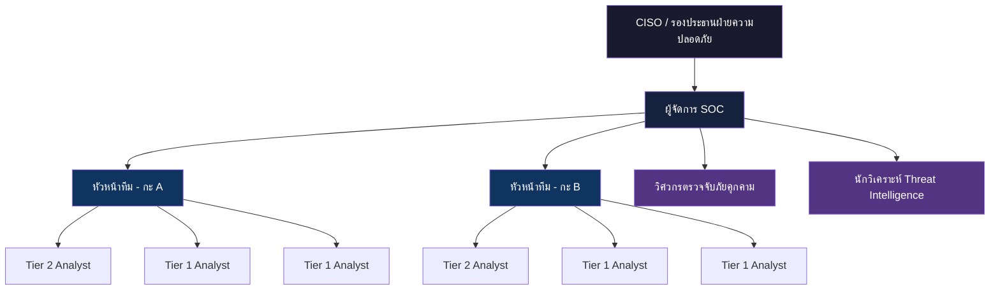

## 2. คำอธิบายบทบาท (Role Definitions)

### 2.1 Tier 1 — Alert Analyst (เฝ้าระวังและคัดกรอง)
-   **จำนวนคน**: 4-6 คนต่อ SOC (2-3 คนต่อกะ)
-   **ความรับผิดชอบ**:
    -   เฝ้าระวังหน้าจอ SIEM Dashboard และคิว Alert แบบ Real-time
    -   คัดกรองเบื้องต้น: จำแนก True Positive กับ False Positive
    -   ส่งต่อ Incident ที่ยืนยันแล้วไป Tier 2 พร้อมบริบทเบื้องต้น
    -   บันทึกการดำเนินการในระบบ Ticketing
-   **ทักษะที่ต้องการ**: CompTIA Security+, พื้นฐาน Networking, การวิเคราะห์ Log
-   **KPIs**: ปริมาณ Alert ที่ดำเนินการ, อัตรา False Positive, MTTD

### 2.2 Tier 2 — Incident Responder (สืบสวนและจำกัดวง)
-   **จำนวนคน**: 2-4 คนต่อ SOC (1-2 คนต่อกะ)
-   **ความรับผิดชอบ**:
    -   สืบสวนเชิงลึกสำหรับ Incident ที่ส่งต่อมาจาก Tier 1
    -   ดำเนินการตาม Playbook ในส่วนจำกัดวงและกำจัดภัย
    -   ทำ Host & Network Forensics (หน่วยความจำ, ดิสก์, Packet Capture)
    -   ประสานงานกับทีม IT เพื่อ Isolate และแก้ไข
-   **ทักษะที่ต้องการ**: CySA+, GCIH, SIEM/EDR ขั้นสูง, เครื่องมือ Forensics
-   **KPIs**: MTTR (เวลาตอบสนองเฉลี่ย), อัตราการปิด Incident

### 2.3 Tier 3 — Threat Hunter / Senior Analyst (ล่าภัยคุกคามเชิงรุก)
-   **จำนวนคน**: 1-2 คนต่อ SOC
-   **ความรับผิดชอบ**:
    -   ล่าภัยคุกคามเชิงรุก (Proactive Threat Hunting) โดยใช้สมมติฐาน
    -   วิเคราะห์มัลแวร์ขั้นสูงและ Reverse Engineering
    -   พัฒนา Detection Content (Sigma, YARA, Snort)
    -   เป็นผู้นำการสืบสวน Incident สำคัญและวิเคราะห์สาเหตุ (RCA)
-   **ทักษะที่ต้องการ**: GCIA, GCFA, OSCP, เขียนสคริปต์ได้ (Python, PowerShell)
-   **KPIs**: จำนวนภัยคุกคามที่ค้นพบ, ลดช่องว่างการตรวจจับ, TTPs ที่แมปกับ MITRE ATT&CK

### 2.4 Detection Engineer (วิศวกรตรวจจับภัยคุกคาม)
-   **จำนวนคน**: 1-2 คนต่อ SOC
-   **ความรับผิดชอบ**:
    -   สร้างและดูแลกฎการตรวจจับ (Sigma/YARA/Snort)
    -   ปรับแต่งกฎเพื่อลดอัตรา False Positive
    -   จัดการ CI/CD Pipeline สำหรับ Deploy กฎ
    -   ดูแล MITRE ATT&CK Coverage Dashboard
-   **ทักษะที่ต้องการ**: Sigma, Regex, SIEM Query Language (SPL, KQL, Lucene)

### 2.5 Threat Intelligence Analyst (นักวิเคราะห์ข่าวกรองภัยคุกคาม)
-   **จำนวนคน**: 1 คนต่อ SOC
-   **ความรับผิดชอบ**:
    -   รวบรวม วิเคราะห์ และเผยแพร่ข่าวกรองภัยคุกคาม (CTI)
    -   ดูแล Threat Feed และฐานข้อมูล IOC
    -   จัดทำรายงาน Threat Advisory สำหรับผู้บริหาร
    -   แมป TTP ของผู้โจมตีกับความเสี่ยงขององค์กร
-   **ทักษะที่ต้องการ**: CTIA, เทคนิค OSINT, TLP Classification, STIX/TAXII

### 2.6 SOC Manager (ผู้จัดการ SOC)
-   **จำนวนคน**: 1 คนต่อ SOC
-   **ความรับผิดชอบ**:
    -   ดูแลการปฏิบัติงาน SOC ประจำวันและจัดตารางกะ
    -   กำหนด KPI และรายงานตัวชี้วัดให้ CISO/ผู้บริหาร
    -   บริหารอัตรากำลัง การฝึกอบรม และเส้นทางอาชีพ
    -   ประสานงานกับทีมภายนอก (IT, กฎหมาย, HR) ระหว่าง Incident สำคัญ
    -   บริหารงบประมาณสำหรับเครื่องมือและ Licensing
-   **ทักษะที่ต้องการ**: CISSP, CISM, ทักษะภาวะผู้นำและการสื่อสาร

## 3. เส้นทางความก้าวหน้าในอาชีพ (Career Progression Path)

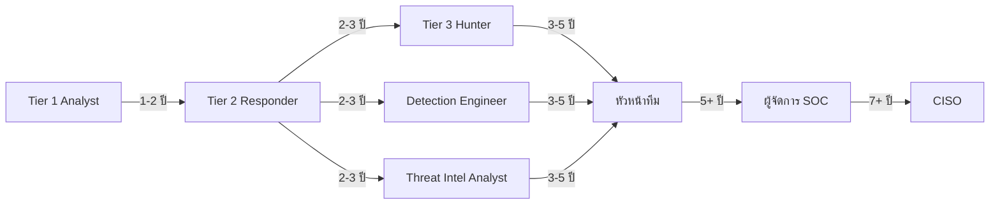

## 4. แนวทางจำนวนบุคลากร (Recommended Staffing Model)

| ขนาด SOC | Tier 1 | Tier 2 | Tier 3 | วิศวกร | TI | ผู้จัดการ | รวม |
| :--- | :---: | :---: | :---: | :---: | :---: | :---: | :---: |
| **เล็ก** (<500 alerts/วัน) | 2 | 1 | 0 | 1 (แชร์) | 0 | 1 | 5 |
| **กลาง** (500-2000/วัน) | 4 | 2 | 1 | 1 | 1 | 1 | 10 |
| **ใหญ่** (>2000/วัน, 24/7) | 8 | 4 | 2 | 2 | 1 | 1 | 18 |

## เอกสารที่เกี่ยวข้อง (Related Documents)
-   [มาตรฐานการส่งมอบกะ](Shift_Handoff.th.md)
-   [ตัวชี้วัด SOC](SOC_Metrics.th.md)
-   [หลักสูตรฝึกอบรม Analyst](../09_Training_Onboarding/Analyst_Onboarding_Path.th.md)
-   [แบบฟอร์มตรวจสอบการฝึกอบรม](../09_Training_Onboarding/Training_Checklist.th.md)
-   [แบบประเมิน SOC](SOC_Assessment_Checklist.th.md)

## References
-   [NIST SP 800-61r2 (Incident Handling Guide)](https://csrc.nist.gov/publications/detail/sp/800-61/rev-2/final)
-   [SOC-CMM — SOC Capability Maturity Model](https://www.soc-cmm.com/)
-   [SANS SOC Survey & Analyst Reports](https://www.sans.org/white-papers/soc-survey/)
-   [MITRE ATT&CK — Threat-Informed Defense](https://attack.mitre.org/)
-   [FIRST CSIRT Services Framework](https://www.first.org/standards/frameworks/csirts/csirt_services_framework_v2.1)


---

## File: 06_Operations_Management/Shift_Handoff.en.md

# Shift Operations & Handoff Standard

This document outlines the standard procedures for managing shifts and ensuring operational continuity during shift handovers.

## 1. Shift Structure (24/7)

Standard rotation pattern for 24/7 coverage:
-   **Morning Shift**: 08:00 - 16:00
-   **Afternoon Shift**: 16:00 - 00:00
-   **Night Shift**: 00:00 - 08:00

*Note: Overlap of 30 minutes is required for proper handoff.*

## 2. Handoff Procedure

```mermaid
graph TD
    Start[End of Shift] --> Checklist[Complete Checklist]
    Checklist --> Log[Update Handover Log]
    Log --> Brief[Brief Incoming Lead]
    Brief --> Questions{Any Questions?}
    Questions -->|Yes| Clarify[Clarify Details]
    Questions -->|No| Sign[Sign Off]
    Sign --> End[Start New Shift]
```

A standardized handoff ensures no incident falls through the cracks. The outgoing Shift Lead must brief the incoming Shift Lead on:

A standardized handoff ensures no incident falls through the cracks. The outgoing Shift Lead must brief the incoming Shift Lead on:

### 2.1 Critical Checklist
-   **Active Incidents**: High/Critical incidents currently open.
-   **Pending Tasks**: Investigations or tickets requiring follow-up.
-   **System Health**: Status of SIEM, EDR, and Feeds (Any operational issues?).
-   **Intelligence Updates**: New critical vulnerabilities or threat campaigns causing noise.

### 2.2 Handover Log
-   All details must be recorded in the **Shift Handover Log** (Example: Ticket #1234, Status: Waiting for user).

## 3. Shift Duties

### 3.1 Start of Shift
-   Review Handover Log.
-   Check "Unassigned" queue in Ticketing System.
-   Verify SIEM Dashboard health.

### 3.2 End of Shift
-   Update all assigned tickets.
-   Complete documentation for closed cases.
-   Prepare Handover Log.

## Related Documents
-   [Incident Response Framework](../05_Incident_Response/Framework.en.md)
-   [SOC Assessment Checklist](SOC_Assessment_Checklist.en.md)
-   [SOC Metrics & KPIs](SOC_Metrics.en.md)

## References
-   [SANS SOC Handbook](https://www.sans.org/white-papers/soc-handbook/)
-   [NIST SP 800-61r2 (Incident Handling)](https://csrc.nist.gov/publications/detail/sp/800-61/rev-2/final)


---

## File: 06_Operations_Management/Shift_Handoff.th.md

# มาตรฐานการปฏิบัติงานกะและการส่งต่องาน (Shift Operations & Handoff Standard)

เอกสารนี้ระบุขั้นตอนมาตรฐานในการบริหารจัดการกะและการส่งต่องานเพื่อให้การปฏิบัติงานมีความต่อเนื่อง

## 1. โครงสร้างกะ (Shift Structure - 24/7)

รูปแบบมาตรฐานสำหรับการครอบคลุมตลอด 24/7:
-   **กะเช้า (Morning)**: 08:00 - 16:00
-   **กะบ่าย (Afternoon)**: 16:00 - 00:00
-   **กะดึก (Night)**: 00:00 - 08:00

*หมายเหตุ: ต้องมีเวลาคาบเกี่ยว (Overlap) 30 นาทีสำหรับการส่งต่องาน*

## 2. ขั้นตอนการส่งต่องาน (Handoff Procedure)

```mermaid
graph TD
    Start[จบกะเดิม] --> Checklist[ตรวจสอบ Checklist]
    Checklist --> Log[อัปเดต Handover Log]
    Log --> Brief[สรุปงานให้กะถัดไป]
    Brief --> Questions{มีข้อสงสัย?}
    Questions -->|มี| Clarify[อธิบายเพิ่มเติม]
    Questions -->|ไม่มี| Sign[เซ็นรับงาน]
    Sign --> End[เริ่มกะใหม่]
```

การส่งต่องานที่เป็นมาตรฐานช่วยป้องกันไม่ให้งานหลุด หัวหน้ากะที่กำลังจะออกเวรต้องสรุปข้อมูลให้หัวหน้ากะที่มารับเวรฟัง:

การส่งต่องานที่เป็นมาตรฐานช่วยป้องกันไม่ให้งานหลุด หัวหน้ากะที่กำลังจะออกเวรต้องสรุปข้อมูลให้หัวหน้ากะที่มารับเวรฟัง:

### 2.1 รายการตรวจสอบสำคัญ (Critical Checklist)
-   **เหตุการณ์ที่ยังไม่จบ (Active Incidents)**: Case ระดับ High/Critical ที่ยังเปิดอยู่
-   **งานค้าง (Pending Tasks)**: การสืบสวนหรือ Ticket ที่ต้องติดตามต่อ
-   **สุขภาพระบบ (System Health)**: สถานะของ SIEM, EDR, Feed (มีอะไรล่มหรือไม่?)
-   **ข่าวกรองล่าสุด (Intelligence Updates)**: ช่องโหว่ใหม่หรือ Campaign โจมตีที่ทำให้เกิด Alert เยอะผิดปกติ

### 2.2 บันทึกการส่งงาน (Handover Log)
-   รายละเอียดทั้งหมดต้องถูกบันทึกลงใน **Shift Handover Log** (เช่น Ticket #1234, สถานะ: รอผู้ใช้ตอบกลับ)

## 3. หน้าที่ในกะ (Shift Duties)

### 3.1 เริ่มกะ (Start of Shift)
-   ทบทวน Handover Log
-   ตรวจสอบคิวงาน "Unassigned" ในระบบ Ticketing
-   ตรวจสอบหน้า Dashboard SIEM

### 3.2 จบกะ (End of Shift)
-   อัปเดต Ticket ทั้งหมดที่รับผิดชอบ
-   ทำเอกสารสรุป Case ที่ปิดแล้วให้เรียบร้อย
-   เตรียมข้อมูลสำหรับทำ Handover Log

## เอกสารที่เกี่ยวข้อง (Related Documents)
-   [กรอบการตอบสนองเหตุการณ์](../05_Incident_Response/Framework.th.md)
-   [แบบประเมิน SOC](SOC_Assessment_Checklist.th.md)
-   [ตัวชี้วัด SOC](SOC_Metrics.th.md)

## References
-   [SANS SOC Handbook](https://www.sans.org/white-papers/soc-handbook/)
-   [NIST SP 800-61r2 (Incident Handling)](https://csrc.nist.gov/publications/detail/sp/800-61/rev-2/final)


---

## File: 06_Operations_Management/Threat_Intelligence_Lifecycle.en.md

# Threat Intelligence Lifecycle (CTI)

**Version**: 1.0
**Owner**: CTI Analyst / SOC Manager

## 1. Overview
Cyber Threat Intelligence (CTI) is the process of collecting, analyzing, and disseminating information about current and potential attacks. This standard ensures our SOC moves from "Reactive" to "Proactive".

```mermaid
graph TD
    Direction[1. Direction] --> Collection[2. Collection]
    Collection --> Processing[3. Processing]
    Processing --> Analysis[4. Analysis]
    Analysis --> Dissemination[5. Dissemination]
    Dissemination --> Feedback[6. Feedback]
    Feedback --> Direction
```

## 2. Phases

### Phase 1: Direction (Requirement)
-   **Goal**: Define what we are protecting and what questions we need answered.
-   **Key Intelligence Questions (KIQs)**:
    -   "Is the new 'ABC Ransomware' targeting our industry?"
    -   "Do we have exposure to the CVE-2026-XXXX vulnerability?"

### Phase 2: Collection
-   **Internal Sources**: SIEM Logs, Incident Tickets, EDR Alerts.
-   **External Sources**:
    -   **Open Source (OSINT)**: Twitter, Blogs, CISA Alerts.
    -   **Commercial Feeds**: Vendor reports, Paid API feeds.
    -   **Communities**: ISACs, CERTs, Trusted Partner Peers.

### Phase 3: Processing
-   **Normalization**: Converting raw data (PDFs, Tweets) into standard formats (STIX/TAXII, CSV).
-   **Validation**: Confirming that an Indicator of Compromise (IoC) is valid and not a False Positive (e.g., verifying a "malicious IP" isn't actually Google DNS).

### Phase 4: Analysis
-   **Contextualization**: Adding "So What?".
    -   *Raw Data*: "IP 1.2.3.4 is bad."
    -   *Intelligence*: "IP 1.2.3.4 is a C2 server for APT29 targeting Banks. We are a Bank. Severity = Critical."

### Phase 5: Dissemination
-   **Tactical**: IoCs sent to SIEM/Firewall for blocking (TLP:GREEN).
-   **Operational**: Reports sent to SOC Manager for awareness (TLP:AMBER).
-   **Strategic**: Trend reports sent to CISO/Board (TLP:CLEAR/WHITE).

### Phase 6: Feedback
-   **Review**: Did the intel help? Did it cause false positives?
-   **Action**: Tune sources or refine requirements.

## 3. IoC Management Policy
All Indicators of Compromise (IoCs) must go through the **Review Process** before blocking:
1.  Analyst collects IoC.
2.  Analyst checks reputation (VirusTotal / internal logs).
3.  Analyst updates reference list in SIEM (Test Mode).
4.  If stable > 24 hours, move to Block Mode.

## Related Documents
-   [Incident Response Framework](../05_Incident_Response/Framework.en.md)
-   [SOC Assessment Checklist](SOC_Assessment_Checklist.en.md)
-   [SOC Metrics & KPIs](SOC_Metrics.en.md)

## References
-   [CREST Cyber Threat Intelligence](https://www.crest-approved.org/knowledge-base/cyber-threat-intelligence/)
-   [SANS CTI Maturity Model](https://www.sans.org/white-papers/cti-maturity-model/)


---

## File: 06_Operations_Management/Threat_Intelligence_Lifecycle.th.md

# วงจรข่าวกรองภัยคุกคาม (Threat Intelligence Lifecycle)

**เวอร์ชัน**: 1.0
**ผู้รับผิดชอบ**: CTI Analyst / SOC Manager

## 1. ภาพรวม
Cyber Threat Intelligence (CTI) คือกระบวนการรวบรวม วิเคราะห์ และแจกจ่ายข้อมูลเกี่ยวกับภัยคุกคาม เพื่อให้ SOC สามารถป้องกันตนเองได้ก่อนที่จะเกิดเหตุ (Proactive)

```mermaid
graph TD
    Direction[1. กำหนดทิศทาง] --> Collection[2. รวบรวมข้อมูล]
    Collection --> Processing[3. ประมวลผล]
    Processing --> Analysis[4. วิเคราะห์]
    Analysis --> Dissemination[5. แจกจ่าย]
    Dissemination --> Feedback[6. ข้อเสนอแนะ]
    Feedback --> Direction
```

## 2. ขั้นตอนการทำงาน (Phases)

### Phase 1: Direction (กำหนดโจทย์)
-   **เป้าหมาย**: ระบุว่าเราต้องการรู้อะไร?
-   **คำถามหลัก (KIQs)**:
    -   "กลุ่มแฮกเกอร์ ABC กำลังโจมตีธุรกิจประเภทเดียวกับเราหรือไม่?"
    -   "เรามีความเสี่ยงต่อช่องโหว่ใหม่ CVE-2026-XXXX หรือไม่?"

### Phase 2: Collection (รวบรวม)
-   **แหล่งภายใน**: SIEM Logs, เคสเก่าๆ
-   **แหล่งภายนอก**:
    -   **OSINT**: Twitter, ข่าวความปลอดภัย, CISA
    -   **Commercial**: Feed ที่เสียเงินซื้อ
    -   **Communities**: กลุ่ม ThaiCERT, TB-CERT

### Phase 3: Processing (ประมวลผล)
-   **จัดระเบียบ**: แปลงข้อมูลจากข่าว/PDF ให้เป็น Format ที่คอมพิวเตอร์อ่านได้ (STIX, CSV)
-   **ตรวจสอบ**: ยืนยันว่าข้อมูลถูกต้อง (Validation) เพื่อลด False Positive

### Phase 4: Analysis (วิเคราะห์)
-   **การให้บริบท**: เปลี่ยน "ข้อมูลดิบ" เป็น "ข่าวกรอง"
    -   *ข้อมูลดิบ*: "IP 1.2.3.4 เป็นอันตราย"
    -   *ข่าวกรอง*: "IP 1.2.3.4 เป็น C2 ของ APT29 ที่เล็งเป้าธนาคาร และเราเป็นธนาคาร ดังนั้นความเสี่ยง = สูงมาก"

### Phase 5: Dissemination (แจกจ่าย)
-   **Tactical**: ส่ง IP/Hash ลง SIEM/Firewall เพื่อบล็อก (TLP:GREEN)
-   **Operational**: ส่งรายงานให้หัวหน้าทีม SOC (TLP:AMBER)
-   **Strategic**: ส่งสรุปแนวโน้มให้ผู้บริหาร (TLP:CLEAR/WHITE)

### Phase 6: Feedback (ปรับปรุง)
-   **ทบทวน**: ข่าวกรองที่ได้มามีประโยชน์ไหม? แจ้งเตือนมั่วซั่วหรือไม่?

## 3. นโยบายการจัดการ IoC
Indicators of Compromise (IoCs) ทุกตัวต้องผ่านกระบวนการตรวจสอบก่อนบล็อก:
1.  Analyst รวบรวม IoC
2.  ตรวจสอบค่าชื่อเสียง (Reputation Check)
3.  ใส่ใน SIEM ระบบ Test Mode (Monitor Only)
4.  ถ้าไม่มี False Positive นาน 24 ชม. จึงเปิด Block Mode

## เอกสารที่เกี่ยวข้อง (Related Documents)
-   [กรอบการตอบสนองเหตุการณ์](../05_Incident_Response/Framework.th.md)
-   [แบบประเมิน SOC](SOC_Assessment_Checklist.th.md)
-   [ตัวชี้วัด SOC](SOC_Metrics.th.md)

## References
-   [CREST Cyber Threat Intelligence](https://www.crest-approved.org/knowledge-base/cyber-threat-intelligence/)
-   [SANS CTI Maturity Model](https://www.sans.org/white-papers/cti-maturity-model/)


---

## File: 03_User_Guides/Content_Management.en.md

# Detection Engineering Lifecycle

This document defines the lifecycle for creating, maintaining, and retiring detection rules within the SOC.

## 1. Requirement & Research

```mermaid
graph TD
    Req[Requirement] --> Dev[Development]
    Dev --> Test[Testing & Tuning]
    Test --> Deploy[Deployment]
    Deploy --> Monitor[Monitoring]
    Monitor --> Review[Review/Decommission]
    Review --> Req
```

-   **Threat Intelligence**: Analyze recent threat reports, CVEs, and adversary inputs.
-   **Gap Analysis**: Identify missing coverage in the MITRE ATT&CK dashboard.
-   **Business Context**: Understand critical assets and risks specific to the organization.

## 2. Development (Sigma/YARA/Snort)
-   **Standard Format**: Use **Sigma** for SIEM-agnostic rule creation.
-   **Metadata**: All rules must include:
    -   Title & Description
    -   Author
    -   Severity
    -   MITRE Mapping (Tactic/Technique)
    -   Status (Experimental, Stable, Deprecated)

## 3. Testing & Tuning
-   **Validation**: Test rules against historical data or generated attack simulations (e.g., Atomic Red Team).
-   **Whitelisting**: Identify and filter out benign false positives.
-   **Promotion**: Move rule from "Experimental" to "Stable" only after verifying False Positive Rate (FPR) is acceptable.

## 4. Deployment & Monitoring
-   Deploy via the CI/CD pipeline defined in [Change Management](../02_Platform_Operations/Deployment_Procedures.en.md).
-   Monitor rule performance (Alert Volume, Analyst Feedback).

## 5. Review & Deprecation
-   **Quarterly Audit**: Review rules for relevance. Adversary tactics change; rules may become obsolete.
-   **Deprecation**: retire rules that are noisy, ineffective, or duplicative.

## References
-   [Detection Engineering Weekly](https://detectionengineering.net/)
-   [MITRE ATT&CK](https://attack.mitre.org/)


---

## File: 03_User_Guides/Content_Management.th.md

# วงจรชีวิตวิศวกรรมการตรวจจับ (Detection Engineering Lifecycle)

เอกสารนี้กำหนดวงจรชีวิตสำหรับการสร้าง ดูแลรักษา และยกเลิกกฎการตรวจจับภายใน SOC

## 1. ความต้องการและการวิจัย (Requirement & Research)

```mermaid
graph TD
    Req[ความต้องการ] --> Dev[พัฒนา]
    Dev --> Test[ทดสอบ/จูน]
    Test --> Deploy[ติดตั้ง]
    Deploy --> Monitor[เฝ้าระวัง]
    Monitor --> Review[ทบทวน/ยกเลิก]
    Review --> Req
```

-   **Threat Intelligence**: วิเคราะห์รายงานภัยคุกคามล่าสุด, CVE, และข้อมูลจากผู้โจมตี
-   **Gap Analysis**: ระบุจุดที่ยังขาดการป้องกันใน MITRE ATT&CK Dashboard
-   **บริบททางธุรกิจ**: ทำความเข้าใจสินทรัพย์สำคัญและความเสี่ยงเฉพาะขององค์กร

## 2. การพัฒนา (Development - Sigma/YARA/Snort)
-   **รูปแบบมาตรฐาน**: ใช้ **Sigma** สำหรับสร้างกฎที่สามารถแปลงไปใช้กับ SIEM ใดก็ได้
-   **Metadata**: กฎทุกข้อต้องระบุ:
    -   ชื่อและคำอธิบาย
    -   ผู้เขียน
    -   ระดับความรุนแรง (Severity)
    -   MITRE Mapping (Tactic/Technique)
    -   สถานะ (Experimental, Stable, Deprecated)

## 3. การทดสอบและปรับแต่ง (Testing & Tuning)
-   **ตรวจสอบ**: ทดสอบกฎกับข้อมูลย้อนหลัง หรือจำลองการโจมตี (เช่น Atomic Red Team)
-   **Whitelisting**: ระบุและกรอง False Positive ที่เป็นกิจกรรมปกติออก
-   **เลื่อนขั้น**: ปรับสถานะจาก "Experimental" เป็น "Stable" เมื่อยืนยันว่าอัตรา False Positive (FPR) ยอมรับได้

## 4. การติดตั้งและเฝ้าระวัง (Deployment & Monitoring)
-   ติดตั้งผ่าน CI/CD pipeline ตามที่ระบุใน [Change Management](../02_Platform_Operations/Deployment_Procedures.th.md)
-   เฝ้าระวังประสิทธิภาพของกฎ (ปริมาณ Alert, ผลตอบรับจาก Analyst)

## 5. การทบทวนและยกเลิก (Review & Deprecation)
-   **ตรวจสอบรายไตรมาส**: ทบทวนความเกี่ยวข้องของกฎ เทคนิคการโจมตีเปลี่ยนไป กฎอาจล้าสมัย
-   **การยกเลิก (Deprecation)**: ยกเลิกกฎที่มีเสียงรบกวนมากเกินไป (Noisy), ไม่มีประสิทธิภาพ, หรือซ้ำซ้อน

## References
-   [Detection Engineering Weekly](https://detectionengineering.net/)
-   [MITRE ATT&CK](https://attack.mitre.org/)


---

## File: 03_User_Guides/Integration_Hub.en.md

# Tool Integration Strategy

This document outlines the strategy for integrating security tools and log sources into the SOC architecture.

## 1. Log Source Integration

```mermaid
graph LR
    Source[Log Source] -->|Transport| Normal[Normalization]
    Normal -->|Enrich| Enrich[Enrichment]
    Enrich -->|Store| Storage[SIEM/Data Lake]
    Storage -->|Alert| Monitor[Detection & Monitoring]
```

### 1.1 Transport Mechanisms
-   **API-based**: Cloud services (AWS, M365, SaaS) typically require API polling.
-   **Agent-based**: Servers/Endpoints use agents (e.g., Filebeat, Winlogbeat, OSQuery).
-   **Syslog**: Network devices and legacy appliances.

### 1.2 Normalization
-   All incoming logs must be normalized to a standard schema (e.g., Common Information Model - CIM, or Elastic Common Schema - ECS).
-   **Key Fields**:
    -   `timestamp` (UTC)
    -   `src_ip`, `dst_ip`
    -   `user`, `hostname`
    -   `action`, `outcome`

## 2. Enrichment Integrations

### 2.1 Threat Intelligence
-   Integrate feeds (e.g., ThreatFox, URLhaus, Commercial Feeds) to enrich logs with reputation data.
-   **Process**: Automate lookup of IPs, Domains, and Hashes extracted from alerts.

### 2.2 Asset Context
-   Integrate with CMDB (Configuration Management Database) or Identity Provider (AD/LDAP).
-   **Purpose**: To provide context on "Who" (User role) and "What" (Server criticality) involves in an incident.

## 3. Health Monitoring

-   **Heartbeat**: Ensure all integrations send a heartbeat or status signal.
-   **Data Freshness**: Alert if log sources stop sending data for >1 hour.
-   **Error Rate**: Monitor API error rates (401/403/429) to detect credential or quota issues.

## Related Documents
-   [Detection Engineering Lifecycle](Content_Management.en.md)
-   [Troubleshooting Methodology](../04_Troubleshooting/Common_Issues.en.md)
-   [Threat Intelligence Lifecycle](../06_Operations_Management/Threat_Intelligence_Lifecycle.en.md)

## References
-   [Sigma: Generic Signature Format](https://github.com/SigmaHQ/sigma)
-   [Elastic Common Schema (ECS)](https://www.elastic.co/guide/en/ecs/current/index.html)


---

## File: 03_User_Guides/Integration_Hub.th.md

# กลยุทธ์การเชื่อมต่อเครื่องมือ (Tool Integration Strategy)

เอกสารนี้ระบุกลยุทธ์ในการเชื่อมต่อเครื่องมือความปลอดภัยและแหล่งข้อมูล Log เข้าสู่สถาปัตยกรรม SOC

## 1. การเชื่อมต่อ Log Source

```mermaid
graph LR
    Source[แหล่งข้อมูล] -->|ส่งข้อมูล| Normal[ปรับมาตรฐาน]
    Normal -->|เติมบริบท| Enrich[Enrichment]
    Enrich -->|จัดเก็บ| Storage[SIEM/Data Lake]
    Storage -->|แจ้งเตือน| Monitor[เฝ้าระวัง]
```

### 1.1 กลไกการส่งข้อมูล
-   **API-based**: บริการ Cloud (AWS, M365, SaaS) มักต้องใช้วิธี API Polling
-   **Agent-based**: Server/Endpoint ใช้ Agent (เช่น Filebeat, Winlogbeat, OSQuery)
-   **Syslog**: อุปกรณ์เครือข่ายและระบบ Legacy

### 1.2 การปรับให้เป็นมาตรฐาน (Normalization)
-   Log ทั้งหมดต้องถูกปรับเนื้องหาให้เข้ากับ Schema มาตรฐาน (เช่น CIM, ECS)
-   **ฟิลด์สำคัญ (Key Fields)**:
    -   `timestamp` (UTC)
    -   `src_ip`, `dst_ip`
    -   `user`, `hostname`
    -   `action`, `outcome`

## 2. การเติมข้อมูล (Enrichment Integrations)

### 2.1 Threat Intelligence
-   เชื่อมต่อ Feed (เช่น ThreatFox, URLhaus, Commercial Feeds) เพื่อระบุค่าชื่อเสียง (Reputation)
-   **กระบวนการ**: ค้นหา IP, Domain, Hash จาก Alert โดยอัตโนมัติ

### 2.2 บริบทสินทรัพย์ (Asset Context)
-   เชื่อมต่อกับ CMDB หรือ Identity Provider (AD/LDAP)
-   **วัตถุประสงค์**: เพื่อให้บริบทว่า "ใคร" (บทบาทผู้ใช้) และ "อะไร" (ความสำคัญของ Server) ที่เกี่ยวข้องกับเหตุการณ์

## 3. การเฝ้าระวังสถานะ (Health Monitoring)

-   **Heartbeat**: ตรวจสอบว่า Integration ส่งสัญญาณสถานะมาสม่ำเสมอ
-   **ความสดใหม่ของข้อมูล**: แจ้งเตือนหาก Log Source หยุดส่งข้อมูลเกิน 1 ชั่วโมง
-   **อัตรา Error**: เฝ้าระวัง API error (401/403/429) เพื่อตรวจจับปัญหา Credential หรือ Quota

## เอกสารที่เกี่ยวข้อง (Related Documents)
-   [วงจรชีวิตวิศวกรรมการตรวจจับ](Content_Management.th.md)
-   [วิธีการแก้ปัญหามาตรฐาน](../04_Troubleshooting/Common_Issues.th.md)
-   [วงจรชีวิต Threat Intelligence](../06_Operations_Management/Threat_Intelligence_Lifecycle.th.md)

## References
-   [Sigma: Generic Signature Format](https://github.com/SigmaHQ/sigma)
-   [Elastic Common Schema (ECS)](https://www.elastic.co/guide/en/ecs/current/index.html)


---

## File: 05_Incident_Response/Framework.en.md

# Incident Response Framework

This document outlines the standard phases of Incident Response (IR) at zcrAI, aligned with NIST SP 800-61.

```mermaid
graph LR
    A[Preparation] --> B[Detection & Analysis]
    B --> C[Containment, Eradication, & Recovery]
    C --> D[Post-Incident Activity]
    D --> A
    B -.->|False Positive| A
```

## 1. Preparation
- **Tools**: Ensure EDR (SentinelOne/CrowdStrike), SIEM, and Ticketing systems are integrated via the Integration Hub.
- **Access**: Verify analyst access to the zcrAI portal and third-party consoles.
- **Training**: Regular review of playbooks.

## 2. Identification
- **Triage**: Analyze initial alerts in the `Alerts` queue.
- **Verification**:
    -   Check `affectedUser` and `sourceIp`.
    -   Correlate with Threat Intelligence (VirusTotal/URLScan).
-   **Classification**: Assign Severity (Low, Medium, High, Critical) and Type (Phishing, Malware, etc.).

## 3. Containment
- **Short-term**: Isolate affected host via EDR, block network traffic on Firewall/WAF.
- **Long-term**: Patch vulnerabilities, reset compromised credentials (force logout via Identity Provider).

## 4. Eradication
-   Remove malicious artifacts (files, registry keys).
-   Re-image infected systems if necessary.
-   Verify removal via follow-up scans.

## 5. Recovery
-   Restore systems to production.
-   Monitor for re-infection (24-48 hours).

## 6. Lessons Learned
-   Conduct Post-Incident Review (PIR) within 72 hours.
-   Update Detection Rules and Playbooks based on findings.

## Related Documents
-   [Incident Report Template](../templates/incident_report.en.md)
-   [PB-01 Phishing](Playbooks/Phishing.en.md) | [PB-02 Ransomware](Playbooks/Ransomware.en.md) | [PB-03 Malware](Playbooks/Malware_Infection.en.md)
-   [Shift Handoff Standard](../06_Operations_Management/Shift_Handoff.en.md)
-   [SOC Metrics & KPIs](../06_Operations_Management/SOC_Metrics.en.md)

## References
-   [NIST SP 800-61r2 (Computer Security Incident Handling Guide)](https://csrc.nist.gov/publications/detail/sp/800-61/rev-2/final)
-   [MITRE ATT&CK](https://attack.mitre.org/)

-   [ISO/IEC 27035 (Information Security Incident Management)](https://www.iso.org/standard/60803.html)


---

## File: 05_Incident_Response/Framework.th.md

# กรอบการตอบสนองต่อเหตุการณ์ (Incident Response Framework)

เอกสารนี้ระบุขั้นตอนมาตรฐานในการตอบสนองต่อเหตุการณ์ความปลอดภัย (IR) ของ zcrAI โดยอ้างอิงตามมาตรฐาน NIST SP 800-61

```mermaid
graph LR
    A[การเตรียมความพร้อม<br>Preparation] --> B[การระบุเหตุการณ์<br>Identification]
    B --> C[การจำกัดวง/กำจัด/กู้คืน<br>Containment, Eradication, Recovery]
    C --> D[บทเรียนหลังเหตุการณ์<br>Post-Incident]
    D --> A
```

## 1. การเตรียมความพร้อม (Preparation)
-   **เครื่องมือ**: ตรวจสอบการเชื่อมต่อ EDR (SentinelOne/CrowdStrike), SIEM, และ Ticketing system ผ่าน Integration Hub
-   **การเข้าถึง**: ตรวจสอบสิทธิ์ Analyst ในการเข้าถึง zcrAI portal และ Console ของ Third-party
-   **การฝึกอบรม**: ทบทวน Playbook อย่างสม่ำเสมอ

## 2. การระบุเหตุการณ์ (Identification)
-   **การคัดกรอง (Triage)**: วิเคราะห์แจ้งเตือนเบื้องต้นในคิว `Alerts`
-   **การตรวจสอบ (Verification)**:
    -   ตรวจสอบ `affectedUser` และ `sourceIp`
    -   หาความสัมพันธ์กับ Threat Intelligence (VirusTotal/URLScan)
-   **การจำแนกประเภท**: กำหนดความรุนแรง (Severity) และประเภท (Type)

## 3. การจำกัดความเสียหาย (Containment)
-   **ระยะสั้น**: ตัดการเชื่อมต่อเครื่อง (Isolate Host) ผ่าน EDR, บล็อก Traffic บน Firewall/WAF
-   **ระยะยาว**: อุดช่องโหว่, รีเซ็ตรหัสผ่านที่หลุดรั่ว (บังคับ Logout ผ่าน Identity Provider)

## 4. การกำจัดภัยคุกคาม (Eradication)
-   ลบไฟล์หรือ Registry key ที่เป็นอันตราย
-   ติดตั้งระบบปฏิบัติการใหม่ (Re-image) หากจำเป็น
-   ตรวจสอบซ้ำด้วยการสแกน

## 5. การกู้คืนระบบ (Recovery)
-   นำระบบกลับเข้าสู่สถานะ Production
-   เฝ้าระวังการติดเชื้อซ้ำ (24-48 ชั่วโมง)

## 6. บทเรียนที่ได้รับ (Lessons Learned)
-   ทำ Post-Incident Review (PIR) ภายใน 72 ชั่วโมง
-   อัปเดต Detection Rules และ Playbook ตามสิ่งที่ได้เรียนรู้

## เอกสารที่เกี่ยวข้อง (Related Documents)
-   [แบบฟอร์ม Incident Report](../templates/incident_report.th.md)
-   [PB-01 Phishing](Playbooks/Phishing.th.md) | [PB-02 Ransomware](Playbooks/Ransomware.th.md) | [PB-03 Malware](Playbooks/Malware_Infection.th.md)
-   [มาตรฐานการส่งมอบกะ](../06_Operations_Management/Shift_Handoff.th.md)
-   [ตัวชี้วัด SOC](../06_Operations_Management/SOC_Metrics.th.md)

## References
-   [NIST SP 800-61r2 (Computer Security Incident Handling Guide)](https://csrc.nist.gov/publications/detail/sp/800-61/rev-2/final)
-   [MITRE ATT&CK](https://attack.mitre.org/)

-   [ISO/IEC 27035 (Information Security Incident Management)](https://www.iso.org/standard/60803.html)


---

## File: 05_Incident_Response/Playbooks/AWS_EC2_Compromise.en.md

# Incident Response Playbook: AWS EC2 Compromise

**ID**: PB-22
**Severity**: Critical
**TLP**: AMBER

## 1. Detection
-   **Trigger**: GuardDuty finding `CryptoCurrency:EC2/BitcoinTool`.
-   **Trigger**: Abnormal CPU Usage (100% flatline).
-   **Trigger**: Outbound connection to known C2 IP.

## 2. Analysis

```mermaid
graph TD
    Alert[EC2 Alert] --> Verify[Verify Instance]
    Verify -->|Production| Netflow{Mining Pool?}
    Verify -->|Dev/Test| Stop[Stop Instance]
    Netflow -->|Yes| Snapshot[Snapshot EBS]
    Netflow -->|No| Investigate[Investigate Process]
    Snapshot --> Isolate[Isolate SG]
    Isolate --> Forensics[Forensics]
```

-   [ ] **Verify Instance**: Identify Instance ID, Region, and Owner tag.
-   [ ] **Isolate Logic**: Is this a production web server or a dev box?
-   [ ] **Inspect Netflow**: Check VPC Flow Logs. Is it talking to a mining pool?

## 3. Containment
-   [ ] **Snapshot**: Create an EBS Snapshot for forensics.
-   [ ] **Isolate**: Attach a restrictive Security Group (Deny All Inbound/Outbound, allow only Forensics IP).
-   [ ] **Deregister**: Remove from Auto Scaling Group (ASG) and Load Balancer (ELB).

## 4. Eradication
-   [ ] **Terminate**: If stateless, terminate the instance.
-   [ ] **Rebuild**: Redeploy from a clean, patched AMI (Golden Image).
-   [ ] **Patch**: Fix the vulnerability that allowed entry (e.g., SSH open to world).

## 5. Recovery
-   [ ] **Validate**: Scan the new instance for vulnerabilities.
-   [ ] **Restore**: Add back to Load Balancer.

## Related Documents
-   [Incident Response Framework](../Framework.en.md)
-   [Incident Report Template](../../templates/incident_report.en.md)
-   [Shift Handover Log](../../templates/shift_handover.en.md)

## References
-   [AWS Security Incident Response Guide](https://docs.aws.amazon.com/whitepapers/latest/aws-security-incident-response-guide/welcome.html)
-   [Amazon EC2 Security Best Practices](https://docs.aws.amazon.com/AWSEC2/latest/UserGuide/ec2-security-best-practices.html)

## 6. Root Cause Analysis (VERIS)
-   **Actor**: [External]
-   **Action**: [Malware / Hacking]
-   **Asset**: [EC2 Instance]
-   **Attribute**: [Integrity / Availability]


---

## File: 05_Incident_Response/Playbooks/AWS_EC2_Compromise.th.md

# Incident Response Playbook: เครื่อง AWS EC2 ถูกขุดเหมือง/ควบคุม (AWS EC2 Compromise)

**ID**: PB-22
**ความรุนแรง**: วิกฤต (Critical)
**TLP**: AMBER

## 1. การตรวจจับ (Detection)
-   **Trigger**: GuardDuty แจ้งเตือน `CryptoCurrency:EC2/BitcoinTool`
-   **Trigger**: CPU พุ่งสูงผิดปกติ (100% ตลอดเวลา)
-   **Trigger**: การเชื่อมต่อออกไปยัง C2 Server ที่รู้จัก

## 2. การวิเคราะห์ (Analysis)

```mermaid
graph TD
    Alert[EC2 Alert] --> Verify[Verify Instance]
    Verify -->|Production| Netflow{Mining Pool?}
    Verify -->|Dev/Test| Stop[Stop Instance]
    Netflow -->|Yes| Snapshot[Snapshot EBS]
    Netflow -->|No| Investigate[Investigate Process]
    Snapshot --> Isolate[Isolate SG]
    Isolate --> Forensics[Forensics]
```

-   [ ] **ระบุเครื่อง**: หา Instance ID, Region, และเจ้าของเครื่อง
-   [ ] **แยกแยะ**: เป็น Web Server ขายของ หรือเครื่อง Test?
-   [ ] **ดู Flow**: เช็ค VPC Flow Logs ว่ามีการคุยกับ Mining Pool หรือไม่?

## 3. การจำกัดวง (Containment)
-   [ ] **Snapshot**: สำรองข้อมูล EBS Snapshot ทันทีเพื่อเก็บหลักฐาน
-   [ ] **กักกัน**: เปลี่ยน Security Group ให้ Block All Inbound/Outbound (ยกเว้น IP ของทีม Forensics)
-   [ ] **ตัดออก**: ถอดออกจาก Auto Scaling Group (ASG) และ Load Balancer (ELB)

## 4. การกำจัดภัย (Eradication)
-   [ ] **ทำลาย**: หากเป็นเครื่อง Stateless ให้ Terminate ทิ้งทันที
-   [ ] **สร้างใหม่**: Deploy ใหม่จาก Image ต้นฉบับที่สะอาด (Golden Image)
-   [ ] **อุดช่องโหว่**: แก้ไขจุดที่แฮกเกอร์เข้า (เช่น ปิด Port SSH ที่เปิด Public)

## 5. การกู้คืน (Recovery)
-   [ ] **ตรวจสอบ**: Scan ช่องโหว่เครื่องใหม่ก่อนใช้งานจริง
-   [ ] **คืนสภาพ**: นำกลับเข้า Load Balancer

## เอกสารที่เกี่ยวข้อง (Related Documents)
-   [กรอบการตอบสนองเหตุการณ์](../Framework.th.md)
-   [แบบฟอร์ม Incident Report](../../templates/incident_report.th.md)
-   [แบบฟอร์มส่งมอบกะ](../../templates/shift_handover.th.md)

## References
-   [AWS Security Incident Response Guide](https://docs.aws.amazon.com/whitepapers/latest/aws-security-incident-response-guide/welcome.html)
-   [Amazon EC2 Security Best Practices](https://docs.aws.amazon.com/AWSEC2/latest/UserGuide/ec2-security-best-practices.html)

## 6. วิเคราะห์สาเหตุ (VERIS)
-   **ผู้กระทำ**: [External]
-   **การกระทำ**: [Malware / Hacking]
-   **สินทรัพย์**: [EC2 Instance]
-   **ผลกระทบ**: [Integrity / Availability]


---

## File: 05_Incident_Response/Playbooks/AWS_S3_Compromise.en.md

# Incident Response Playbook: AWS S3 Bucket Compromise

**ID**: PB-21
**Severity**: High
**TLP**: AMBER

## 1. Detection
-   **Trigger**: CloudTrail alerts for `PutBucketPolicy` allowing public access.
-   **Trigger**: GuardDuty finding `S3/PublicAccess`.
-   **Trigger**: Massive data egress from a specific bucket.

## 2. Analysis

```mermaid
graph TD
    Alert[S3 Alert] --> Config[Check Config]
    Config -->|Public| Block[Block Public Access]
    Config -->|Private| Egress{High Egress?}
    Egress -->|Yes| User{Identify User}
    User -->|Compromised| Disable[Disable Keys]
    Block --> Logs[Review Access Logs]
```

-   [ ] **Verify Config**: Check bucket permissions in AWS Console > S3.
    -   Is "Block Public Access" turned off?
    -   Is there a Bucket Policy allowing `"Principal": "*"`?
-   [ ] **Review Access Logs**:
    -   Who modified the policy? (Identify IAM User/Role).
    -   What IP address made the change?
    -   Did any external IP download data? (List objects accessed).

## 3. Containment
-   [ ] **Block Access**: Immediately enable "Block Public Access" at the account or bucket level.
-   [ ] **Quarantine IAM**: Disable the IAM User/Role keys that made the change.
-   [ ] **Tag Resources**: Tag the bucket as `Compromised` for forensic review.

## 4. Eradication
-   [ ] **Revert Policy**: Restore the known-good Bucket Policy (Infrastructure as Code).
-   [ ] **Rotate Credentials**: Rotate Access Keys for the affected IAM user.

## 5. Recovery
-   [ ] **Validate**: Confirm public access is blocked via AWS Config.
-   [ ] **Notify**: Inform Data Privacy Officer if PII was accessed.
-   [ ] **Monitor**: Watch for re-attempted access for 24 hours.

## Related Documents
-   [Incident Response Framework](../Framework.en.md)
-   [Incident Report Template](../../templates/incident_report.en.md)
-   [Shift Handover Log](../../templates/shift_handover.en.md)

## References
-   [AWS S3 Security Best Practices](https://docs.aws.amazon.com/AmazonS3/latest/userguide/security-best-practices.html)
-   [Preventing Public Access to S3](https://docs.aws.amazon.com/AmazonS3/latest/userguide/access-control-block-public-access.html)

## 6. Root Cause Analysis (VERIS)
-   **Actor**: [External / Internal / Partner]
-   **Action**: [Misconfiguration / Hacking]
-   **Asset**: [S3 Bucket]
-   **Attribute**: [Confidentiality]


---

## File: 05_Incident_Response/Playbooks/AWS_S3_Compromise.th.md

# Incident Response Playbook: เจาะระบบ AWS S3 (AWS S3 Bucket Compromise)

**ID**: PB-21
**ความรุนแรง**: สูง (High)
**TLP**: AMBER

## 1. การตรวจจับ (Detection)
-   **Trigger**: แจ้งเตือน CloudTrail พบ `PutBucketPolicy` ที่อนุญาต Public Access
-   **Trigger**: GuardDuty แจ้งเตือน `S3/PublicAccess`
-   **Trigger**: ปริมาณการดาวน์โหลดข้อมูล (Egress) สูงผิดปกติจาก Bucket

## 2. การวิเคราะห์ (Analysis)

```mermaid
graph TD
    Alert[S3 Alert] --> Config[Check Config]
    Config -->|Public| Block[Block Public Access]
    Config -->|Private| Egress{High Egress?}
    Egress -->|Yes| User{Identify User}
    User -->|Compromised| Disable[Disable Keys]
    Block --> Logs[Review Access Logs]
```

-   [ ] **ตรวจสอบการตั้งค่า**: ดูสิทธิ์ใน AWS Console > S3
    -   "Block Public Access" ถูกปิดอยู่หรือไม่?
    -   Bucket Policy อนุญาต `"Principal": "*"` หรือไม่?
-   [ ] **ตรวจสอบ Log**:
    -   ใครเป็นคนแก้ Policy? (ระบุ IAM User/Role)
    -   IP Address ไหนเป็นคนทำ?
    -   มี IP ภายนอกเข้ามาดาวน์โหลดไฟล์หรือไม่? (ลิสต์รายการไฟล์ที่โดนดูด)

## 3. การจำกัดวง (Containment)
-   [ ] **บล็อกทันที**: เปิด "Block Public Access" ที่ระดับ Account หรือ Bucket ทันที
-   [ ] **ระงับผู้ใช้**: Disable Access Key ของ IAM User/Role ที่ก่อเหตุ
-   [ ] **ติดป้าย**: Tag Bucket ว่า `Compromised` เพื่อรอตรวจสอบ

## 4. การกำจัดภัย (Eradication)
-   [ ] **แก้คืน**: นำ Bucket Policy เดิมที่ปลอดภัยกลับมาใช้ (Revert)
-   [ ] **เปลี่ยนกุญแจ**: Rotate Access Key ของผู้ใช้ที่เกี่ยวข้อง

## 5. การกู้คืน (Recovery)
-   [ ] **ยืนยันผล**: ใช้ AWS Config ตรวจสอบว่า Public Access ถูกปิดแล้ว
-   [ ] **แจ้งเตือน**: แจ้งผูดูแลข้อมูลส่วนบุคคล (DPO) หากมีข้อมูลลูกค้าหลุด
-   [ ] **เฝ้าระวัง**: ดูแลต่อเนื่อง 24 ชม.

## เอกสารที่เกี่ยวข้อง (Related Documents)
-   [กรอบการตอบสนองเหตุการณ์](../Framework.th.md)
-   [แบบฟอร์ม Incident Report](../../templates/incident_report.th.md)
-   [แบบฟอร์มส่งมอบกะ](../../templates/shift_handover.th.md)

## References
-   [AWS S3 Security Best Practices](https://docs.aws.amazon.com/AmazonS3/latest/userguide/security-best-practices.html)
-   [Preventing Public Access to S3](https://docs.aws.amazon.com/AmazonS3/latest/userguide/access-control-block-public-access.html)

## 6. วิเคราะห์สาเหตุ (VERIS)
-   **ผู้กระทำ**: [External / Internal / Partner]
-   **การกระทำ**: [Misconfiguration / Hacking]
-   **สินทรัพย์**: [S3 Bucket]
-   **ผลกระทบ**: [Confidentiality]


---

## File: 05_Incident_Response/Playbooks/Account_Compromise.en.md

# Playbook: Account Compromise / Unauthorized Access

**ID**: PB-05
**Severity**: High/Critical
**Trigger**: User Report ("I didn't log in"), SIEM Alert ("Login from unusual location").

## 1. Analysis

```mermaid
graph TD
    Alert[Suspicious Login] --> Context{Location/Device?}
    Context -->|Known| False[False Positive]
    Context -->|Unknown| Contact[Verify with User]
    Contact -->|User: Yes| Reset[Reset Password]
    Contact -->|User: No| Compromised[MFA Reset & Revoke]
    Compromised --> LogAudit[Audit Logs]
```

-   **Verify**: Use "Impossible Travel" logic.
-   [ ] **Validate Activity**: Confirm with the user via specific channel (Phone/Slack) if they performed the action.
-   [ ] **Review Logs**: Check for subsequent actions (File Access, Email Forwarding, MFA changes).

## 2. Containment
-   [ ] **Disable Account**: Immediately disable the user account in AD/IdP.
-   [ ] **Revoke Sessions**: Kill all active web tokens/sessions (O365/Okta).
-   [ ] **Isolate Devices**: If an endpoint is involved, isolate it.

## 3. Eradication
-   [ ] **Reset Password**: Change password to a strong, new value.
-   [ ] **Rotate MFA**: Reset MFA tokens/keys.
-   [ ] **Audit Persistency**: Check for new API keys or App Regstrations created by the attacker.

## 4. Recovery
-   [ ] **Enable Account**: Restore access.
-   [ ] **Monitoring**: Add user to "High Risk" monitoring group for 48 hours.

## Related Documents
-   [Incident Response Framework](../Framework.en.md)
-   [Incident Report Template](../../templates/incident_report.en.md)
-   [PB-06 Impossible Travel](Impossible_Travel.en.md)

## References
-   [MITRE ATT&CK T1078 (Valid Accounts)](https://attack.mitre.org/techniques/T1078/)
-   [CISA Account Security](https://www.cisa.gov/secure-our-world)


---

## File: 05_Incident_Response/Playbooks/Account_Compromise.th.md

# Playbook: บัญชีถูกประนีประนอม (Account Compromise)

**ID**: PB-05
**ความรุนแรง**: สูง/วิกฤต
**ตัวกระตุ้น**: ผู้ใช้แจ้ง ("ฉันไม่ได้ล็อกอิน"), แจ้งเตือน SIEM ("ล็อกอินจากสถานที่แปลกๆ")

## 1. การวิเคราะห์ (Analysis)

```mermaid
graph TD
    Alert[Suspicious Login] --> Context{Location/Device?}
    Context -->|Known| False[False Positive]
    Context -->|Unknown| Contact[Verify with User]
    Contact -->|User: Yes| Reset[Reset Password]
    Contact -->|User: No| Compromised[MFA Reset & Revoke]
    Compromised --> LogAudit[Audit Logs]
```

-   [ ] **ยืนยันตัวตน**: ติดต่อผู้ใช้ผ่านช่องทางอื่น (โทร/Slack) ว่าได้ทำรายการนั้นจริงหรือไม่
-   [ ] **ตรวจสอบ Logs**: ดูการกระทำที่ตามมา (เข้าถึงไฟล์, ตั้งค่า Forward อีเมล, เปลี่ยน MFA)

## 2. การจำกัดวง (Containment)
-   [ ] **ปิดบัญชี (Disable)**: ปิดการใช้งานบัญชีใน AD/IdP ทันที
-   [ ] **ยกเลิก Session**: สั่ง Kill session หรือ Token ที่ค้างอยู่ทั้งหมด (O365/Okta)
-   [ ] **แยกอุปกรณ์**: หากเกี่ยวข้องกับเครื่องคอมพิวเตอร์ ให้ทำการ Isolate

## 3. การกำจัด (Eradication)
-   [ ] **เปลี่ยนรหัสผ่าน**: ตั้งรหัสผ่านใหม่ที่คาดเดายาก
-   [ ] **รีเซ็ต MFA**: ล้างค่า MFA เก่าและให้ลงทะเบียนใหม่
-   [ ] **ตรวจสอบ Persistency**: หา API Key หรือ App Registration ใหม่ที่แฮกเกอร์อาจสร้างทิ้งไว้

## 4. การกู้คืน (Recovery)
-   [ ] **เปิดใช้งานบัญชี**: คืนสิทธิ์การใช้งาน
-   [ ] **การเฝ้าระวัง**: เพิ่มชื่อผู้ใช้ในกลุ่ม "High Risk" เพื่อจับตาดูเป็นพิเศษ 48 ชั่วโมง
-   **ผลกระทบ (Attribute)**: [Confidentiality / Integrity]

## เอกสารที่เกี่ยวข้อง (Related Documents)
-   [กรอบการตอบสนองเหตุการณ์](../Framework.th.md)
-   [แบบฟอร์ม Incident Report](../../templates/incident_report.th.md)
-   [แบบฟอร์มส่งมอบกะ](../../templates/shift_handover.th.md)

## References
-   [MITRE ATT&CK T1078 (Valid Accounts)](https://attack.mitre.org/techniques/T1078/)
-   [Azure AD Identity Protection](https://learn.microsoft.com/en-us/azure/active-directory/identity-protection/overview-identity-protection)


---

## File: 05_Incident_Response/Playbooks/Azure_AD_Compromise.en.md

# Incident Response Playbook: Azure AD Identity Risk

**ID**: PB-23
**Severity**: High
**TLP**: AMBER

## 1. Detection
-   **Trigger**: Azure AD Identity Protection alerts ("Impossible Travel", "Unfamiliar Sign-in Properties").
-   **Trigger**: Sign-in from Tor Exit Node.
-   **Trigger**: MFA Fatigue (User denies multiple requests, then accepts one).

## 2. Analysis

```mermaid
graph TD
    Alert[Identity Risk] --> User[Contact User]
    User -->|Confirmed| False[False Positive]
    User -->|Denied/NoResponse| Logs[Review Sign-ins]
    Logs -->|Suspicious| Revoke[Revoke Sessions]
    Revoke --> Reset[Reset Password]
    Reset --> EnforceMFA[Enforce MFA]
```

-   [ ] **Contact User**: Out-of-band verification (Call/Slack). "Did you just login from Nigeria?"
-   [ ] **Review Sign-ins**: Check Azure AD Sign-in Logs. Were there failed attempts before the success?
-   [ ] **Check Device**: Was the device Compliant/Hybrid Joined?

## 3. Containment
-   [ ] **Revoke Sessions**: In Azure Portal > Users > [User] > "Revoke Sessions".
-   [ ] **Reset Password**: Force password reset.
-   [ ] **Disable Account**: If threat is confirmed and active, Block Sign-in.

## 4. Eradication
-   [ ] **Enforce MFA**: Ensure MFA is enabled and Phishing-Resistant (Number Matching).
-   [ ] **Scan Device**: Make user run a full AV scan on their endpoint.

## 5. Recovery
-   [ ] **Unblock**: Restore access after verification.
-   [ ] **Monitor**: Watch account for 48 hours.

## Related Documents
-   [Incident Response Framework](../Framework.en.md)
-   [Incident Report Template](../../templates/incident_report.en.md)
-   [Shift Handover Log](../../templates/shift_handover.en.md)

## References
-   [Azure Active Directory Identity Protection](https://learn.microsoft.com/en-us/azure/active-directory/identity-protection/overview-identity-protection)
-   [Remediate Risks and Unblock Users](https://learn.microsoft.com/en-us/azure/active-directory/identity-protection/howto-identity-protection-remediate-unblock)

## 6. Root Cause Analysis (VERIS)
-   **Actor**: [External]
-   **Action**: [Hacking / Social]
-   **Asset**: [Person / Cloud Identity]
-   **Attribute**: [Integrity / Confidentiality]


---

## File: 05_Incident_Response/Playbooks/Azure_AD_Compromise.th.md

# Incident Response Playbook: บัญชี Azure AD ถูกยึด (Azure AD Identity Risk)

**ID**: PB-23
**ความรุนแรง**: สูง (High)
**TLP**: AMBER

## 1. การตรวจจับ (Detection)
-   **Trigger**: Azure AD Identity Protection แจ้งเตือน ("Impossible Travel", "Unfamiliar Sign-in")
-   **Trigger**: ล็อกอินมาจาก Tor Exit Node
-   **Trigger**: MFA Fatigue (User ปฏิเสธหลายครั้ง แล้วเผลอกดรับหนึ่งครั้ง)

## 2. การวิเคราะห์ (Analysis)

```mermaid
graph TD
    Alert[Identity Risk] --> User[Contact User]
    User -->|Confirmed| False[False Positive]
    User -->|Denied/NoResponse| Logs[Review Sign-ins]
    Logs -->|Suspicious| Revoke[Revoke Sessions]
    Revoke --> Reset[Reset Password]
    Reset --> EnforceMFA[Enforce MFA]
```

-   [ ] **ติดต่อเจ้าตัว**: โทรหาหรือแชทถาม "คุณได้ล็อกอินจากไนจีเรียหรือไม่?"
-   [ ] **ดูประวัติ**: เช็ค Sign-in Logs มีการเดารหัสผิดก่อนหน้านั้นไหม?
-   [ ] **เช็คอุปกรณ์**: อุปกรณ์ที่ใช้ล็อกอินเป็นของบริษัท (Compliant) หรือไม่?

## 3. การจำกัดวง (Containment)
-   [ ] **ตัด Session**: ไปที่ Azure Portal > Users > [User] > "Revoke Sessions"
-   [ ] **รีเซ็ตรหัส**: บังคับ Reset Password ทันที
-   [ ] **ระงับบัญชี**: ถ้ายังไม่แน่ใจ ให้กด "Block Sign-in" ไว้ก่อน

## 4. การกำจัดภัย (Eradication)
-   [ ] **บังคับ MFA**: ตรวจสอบว่า MFA เปิดอยู่ และใช้แบบ Number Matching (กันกดพลาด)
-   [ ] **สแกนเครื่อง**: ให้ User สแกนไวรัสในเครื่องตัวเอง

## 5. การกู้คืน (Recovery)
-   [ ] **ปลดบล็อก**: คืนสิทธิ์การใช้งานเมื่อปลอดภัย
-   [ ] **เฝ้าระวัง**: จับตาดูบัญชีนี้เป็นพิเศษ 48 ชม.

## เอกสารที่เกี่ยวข้อง (Related Documents)
-   [กรอบการตอบสนองเหตุการณ์](../Framework.th.md)
-   [แบบฟอร์ม Incident Report](../../templates/incident_report.th.md)
-   [แบบฟอร์มส่งมอบกะ](../../templates/shift_handover.th.md)

## References
-   [Azure Active Directory Identity Protection](https://learn.microsoft.com/en-us/azure/active-directory/identity-protection/overview-identity-protection)
-   [Remediate Risks and Unblock Users](https://learn.microsoft.com/en-us/azure/active-directory/identity-protection/howto-identity-protection-remediate-unblock)

## 6. วิเคราะห์สาเหตุ (VERIS)
-   **ผู้กระทำ**: [External]
-   **การกระทำ**: [Hacking / Social]
-   **สินทรัพย์**: [Person / Cloud Identity]
-   **ผลกระทบ**: [Integrity / Confidentiality]


---

## File: 05_Incident_Response/Playbooks/BEC.en.md

# Playbook: Business Email Compromise (BEC)

**ID**: PB-17
**Severity**: High
**Trigger**: User Report ("Suspicious Invoice"), Mail Filter ("Forwarding Rule created").

## 1. Analysis (Triage)

```mermaid
graph TD
    Alert[Suspicious Email] --> Header[Check Headers]
    Header --> SPF{SPF/DKIM Fail?}
    SPF -->|Yes| Spoof[Spoofing]
    SPF -->|No| Content{Urgent Request?}
    Content -->|Wire Transfer| Finance[Check w/ Finance]
    Finance -->|Fake| BEC[BEC Confirmed]
    Spoof --> BEC
    BEC --> Reset[Reset Password]
```

-   **Header Analysis**: Check `Return-Path`, `Reply-To`, and `SPF/DKIM` results.
-   **Rule Check**: Look for Inbox Rules named "." or "Move to RSS Feeds" (Common hiding tactic).
-   **Login Logs**: Check for successful logins from foreign countries prior to the email.

## 2. Containment
-   **Reset Password**: Change the compromise user's password.
-   **Revoke Tokens**: Revoke all OAuth tokens (O365).
-   **Remove Rules**: Delete malicious forwarding/inbox rules.

## 3. Eradication
-   **Search Internal**: Search all mailboxes for the same phishing subject to see spread.
-   **Block Sender**: Block the sender domain/IP at the gateway.

## 4. Recovery
-   **Notify Finance**: If the email involved payments, immediately stop wire transfers.
-   **Attribute**: [Integrity / Confidentiality]

## Related Documents
-   [Incident Response Framework](../Framework.en.md)
-   [Incident Report Template](../../templates/incident_report.en.md)
-   [Shift Handover Log](../../templates/shift_handover.en.md)

## References
-   [MITRE ATT&CK T1566 (Phishing)](https://attack.mitre.org/techniques/T1566/)
-   [FBI BEC Scams](https://www.fbi.gov/scams-and-safety/common-scams-and-crimes/business-email-compromise)


---

## File: 05_Incident_Response/Playbooks/BEC.th.md

# Playbook: การหลอกลวงทางอีเมลธุรกิจ (Business Email Compromise - BEC)

**ID**: PB-17
**ความรุนแรง**: สูง
**ตัวกระตุ้น**: ผู้ใช้แจ้ง ("Invoice น่าสงสัย"), Mail Filter ("สร้างกฎ Forwarding")

## 1. การวิเคราะห์ (Analysis)

```mermaid
graph TD
    Alert[Suspicious Email] --> Header[Check Headers]
    Header --> SPF{SPF/DKIM Fail?}
    SPF -->|Yes| Spoof[Spoofing]
    SPF -->|No| Content{Urgent Request?}
    Content -->|Wire Transfer| Finance[Check w/ Finance]
    Finance -->|Fake| BEC[BEC Confirmed]
    Spoof --> BEC
    BEC --> Reset[Reset Password]
```

-   **วิเคราะห์ Header**: ตรวจสอบ `Return-Path`, `Reply-To`, และผล `SPF/DKIM`
-   **ตรวจสอบ Rule**: มองหากฎ Inbox ที่ชื่อแปลกๆ เช่น "." หรือ "Move to RSS Feeds" (เทคนิคซ่อนอีเมล)
-   **ประวัติการล็อกอิน**: มีการล็อกอินจากต่างประเทศก่อนส่งเมลหรือไม่?

## 2. การจำกัดวง (Containment)
-   **เปลี่ยนรหัสผ่าน**: รีเซ็ตรหัสผ่านผู้ใช้ที่โดนแฮก
-   **Revoke Tokens**: ยกเลิก OAuth token ทั้งหมด (O365)
-   **ลบกฎ**: ลบกฎ Forwarding หรือ Inbox rule ที่คนร้ายสร้างไว้

## 3. การกำจัด (Eradication)
-   **ค้นหาภายใน**: ค้นหาอีเมลในตู้จดหมายพนักงานคนอื่นที่มีหัวข้อเดียวกัน
-   **บล็อกผู้ส่ง**: บล็อก Domain/IP ผู้ส่งที่ Gateway

## 4. การกู้คืน (Recovery)
-   **แจ้งฝ่ายการเงิน**: หากอีเมลเกี่ยวข้องกับการโอนเงิน ให้ระงับธุรกรรมทันที
-   **ผลกระทบ (Attribute)**: [Integrity / Confidentiality]

## เอกสารที่เกี่ยวข้อง (Related Documents)
-   [กรอบการตอบสนองเหตุการณ์](../Framework.th.md)
-   [แบบฟอร์ม Incident Report](../../templates/incident_report.th.md)
-   [แบบฟอร์มส่งมอบกะ](../../templates/shift_handover.th.md)

## References
-   [MITRE ATT&CK T1566 (Phishing)](https://attack.mitre.org/techniques/T1566/)
-   [FBI BEC Scams](https://www.fbi.gov/scams-and-safety/common-scams-and-crimes/business-email-compromise)


---

## File: 05_Incident_Response/Playbooks/Brute_Force.en.md

# Playbook: Brute Force / Password Spray

**ID**: PB-04
**Severity**: Low/Medium
**Trigger**: SIEM Alert ("Multiple Failed Logins"), IAM Logs.
**Attribute**: [Confidentiality]

## 1. Analysis

```mermaid
graph TD
    Alert[Failed Logins] --> Count{Count > Threshold?}
    Count -->|No| Ignore[Ignore]
    Count -->|Yes| Source{Source IP?}
    Source -->|Internal| Contact[Contact User]
    Source -->|External| Block[Block IP]
    Contact --> Reset[Reset Password]
    Block --> Reset
```

-   **Verify**: Is it a single user or multiple users (Password Spray)?


-   [ ] **Check Source IP**: Is the IP internal or external? Is it a known VPN?
-   [ ] **Check User**: Is the targeted account valid? Is it a VIP/Admin?
-   [ ] **Volume**: How many attempts? (e.g., > 10 failures in 1 min).
-   [ ] **Outcome**: Was there a *Success* log after the failures? (Critical Indicator).

## 2. Containment
-   [ ] **Block IP**: Add Source IP to Firewall/WAF blocklist.
-   [ ] **Lock Account**: If the attack is successfully guessing, lock the AD account temporarily.

## 3. Remediation
-   [ ] **Reset Password**: Force password reset if compromise is suspected.
-   [ ] **Enforce MFA**: Ensure Multi-Factor Authentication is enabled for the account.

## 4. Recovery
-   [ ] **Unlock Account**: Restore access to the legitimate user after verification.

## Related Documents
-   [Incident Response Framework](../Framework.en.md)
-   [Incident Report Template](../../templates/incident_report.en.md)
-   [PB-05 Account Compromise](Account_Compromise.en.md)

## References
-   [MITRE ATT&CK T1110 (Brute Force)](https://attack.mitre.org/techniques/T1110/)
-   [OWASP Brute Force Prevention](https://owasp.org/www-community/controls/Blocking_Brute_Force_Attacks)


---

## File: 05_Incident_Response/Playbooks/Brute_Force.th.md

# Playbook: การโจมตีสุ่มรหัสผ่าน (Brute Force / Password Spray)

**ID**: PB-04
**ความรุนแรง**: ต่ำ/ปานกลาง
**ตัวกระตุ้น**: แจ้งเตือน SIEM ("ล็อกอินล้มเหลวหลายครั้ง"), IAM Logs

## 1. การวิเคราะห์ (Analysis)

```mermaid
graph TD
    Alert[Failed Logins] --> Count{Count > Threshold?}
    Count -->|No| Ignore[Ignore]
    Count -->|Yes| Source{Source IP?}
    Source -->|Internal| Contact[Contact User]
    Source -->|External| Block[Block IP]
    Contact --> Reset[Reset Password]
    Block --> Reset
```

-   [ ] **ตรวจสอบ IP ต้นทาง**: ภายในหรือภายนอก? เป็น VPN ที่รู้จักหรือไม่?
-   [ ] **ตรวจสอบผู้ใช้**: บัญชีที่ถูกโจมตีมีอยู่จริงหรือไม่? เป็นผู้บริหาร/แอดมินหรือไม่?
-   [ ] **ปริมาณ**: จำนวนครั้งที่ผิดพลาด? (เช่น > 10 ครั้งใน 1 นาที)
-   [ ] **ผลลัพธ์**: มี Log *สำเร็จ* หลังจากที่ผิดพลาดหรือไม่? (ถ้ามี คือวิกฤต)

## 2. การจำกัดวง (Containment)
-   [ ] **บล็อก IP**: เพิ่ม IP ต้นทางลงใน Firewall/WAF blocklist
-   [ ] **ล็อกบัญชีชั่วคราว**: หากการโจมตีมีความเสี่ยงสูง ให้ล็อกบัญชี AD ชั่วคราว

## 3. การแก้ไข (Remediation)
-   [ ] **รีเซ็ตรหัสผ่าน**: บังคับเปลี่ยนรหัสผ่านหากสงสัยว่ารหัสหลุด
-   [ ] **บังคับใช้ MFA**: ตรวจสอบว่าบัญชีได้เปิดใช้งาน Multi-Factor Authentication แล้ว

## 4. การกู้คืน (Recovery)
-   [ ] **ปลดล็อกบัญชี**: คืนสิทธิ์การใช้งานให้เจ้าของบัญชีหลังยืนยันตัวตน
-   **ผลกระทบ (Attribute)**: [Confidentiality]

## เอกสารที่เกี่ยวข้อง (Related Documents)
-   [กรอบการตอบสนองเหตุการณ์](../Framework.th.md)
-   [แบบฟอร์ม Incident Report](../../templates/incident_report.th.md)
-   [แบบฟอร์มส่งมอบกะ](../../templates/shift_handover.th.md)

## References
-   [MITRE ATT&CK T1110 (Brute Force)](https://attack.mitre.org/techniques/T1110/)
-   [OWASP Authentication Cheat Sheet](https://cheatsheetseries.owasp.org/cheatsheets/Authentication_Cheat_Sheet.html)


---

## File: 05_Incident_Response/Playbooks/C2_Communication.en.md

# Playbook: Command & Control (C2) Traffic

**ID**: PB-13
**Severity**: High
**Trigger**: Network/NDR Alert ("Beaconing detected", "Connection to known C2 IP").

## 1. Analysis (Triage)

```mermaid
graph TD
    Alert[C2 Beacon] --> Rep{Domain Rep?}
    Rep -->|New/Bad| True[True Positive]
    Rep -->|Known Good| Freq{Beaconing?}
    Freq -->|Regular| True
    Freq -->|Random| False[False Positive]
    True --> Block[Block Domain]
```

-   **Frequency**: Is it beaconing? (Regular interval requests e.g., every 5 mins).
-   **Domain Reputation**: Check domain age and category (Newly Registered Domain?).
-   **Process**: Which process is making the connection? (powershell.exe vs. chrome.exe).

## 2. Containment
-   **Block IP/Domain**: Block at Perimeter Firewall/DNS Sinkhole.
-   **Isolate Host**: Isolate the machine initiating the connection.

## 3. Eradication
-   **Process Kill**: Stop the process making the call.
-   **Memory Analysis**: If process is injected (e.g., in svchost.exe), a restart might clear it, but forensics is needed first.

## 4. Recovery
-   **Threat Intel**: Submit the C2 IOC to Threat Intelligence Platform to update all tools.
-   **Attribute**: [Confidentiality / Integrity]

## Related Documents
-   [Incident Response Framework](../Framework.en.md)
-   [Incident Report Template](../../templates/incident_report.en.md)
-   [Shift Handover Log](../../templates/shift_handover.en.md)

## References
-   [MITRE ATT&CK T1071 (Application Layer Protocol)](https://attack.mitre.org/techniques/T1071/)
-   [SANS Hunt Evil: Beaconing](https://www.sans.org/white-papers/39600/)


---

## File: 05_Incident_Response/Playbooks/C2_Communication.th.md

# Playbook: การสื่อสาร Command & Control (C2)

**ID**: PB-13
**ความรุนแรง**: สูง
**ตัวกระตุ้น**: แจ้งเตือน Network/NDR ("Beaconing detected", "เชื่อมต่อไปยัง Known C2 IP")

## 1. การวิเคราะห์ (Analysis)

```mermaid
graph TD
    Alert[C2 Beacon] --> Rep{Domain Rep?}
    Rep -->|New/Bad| True[True Positive]
    Rep -->|Known Good| Freq{Beaconing?}
    Freq -->|Regular| True
    Freq -->|Random| False[False Positive]
    True --> Block[Block Domain]
```

-   **ความถี่ (Beaconing)**: มีจังหวะเวลาสม่ำเสมอหรือไม่? (เช่น ทุก 5 นาที)
-   **ชื่อโดเมน**: ตรวจสอบอายุโดเมน (เพิ่งจดทะเบียนใหม่?)
-   **Process**: โปรแกรมอะไรเป็นตัวเชื่อมต่อออกไป? (powershell.exe vs chrome.exe)

## 2. การจำกัดวง (Containment)
-   **บล็อก IP/Domain**: บล็อกที่ Firewall หรือทำ DNS Sinkhole
-   **แยกเครื่อง**: ตัดการเชื่อมต่อเครื่องที่พยายามติดต่อออกไป

## 3. การกำจัด (Eradication)
-   **หยุด Process**: Kill process ที่ทำการเชื่อมต่อ
-   **วิเคราะห์ Memory**: หากเป็น Process injection (เช่น แฝงใน svchost.exe) การรีสตาร์ทอาจหาย แต่ควรเก็บหลักฐานก่อน

## 4. การกู้คืน (Recovery)
-   **Threat Intel**: ส่งข้อมูล C2 IP/Domain ไปยังระบบ Threat Intelligence เพื่ออัปเดตเครื่องมือป้องกันอื่นๆ
-   **ผลกระทบ (Attribute)**: [Confidentiality / Integrity]

## เอกสารที่เกี่ยวข้อง (Related Documents)
-   [กรอบการตอบสนองเหตุการณ์](../Framework.th.md)
-   [แบบฟอร์ม Incident Report](../../templates/incident_report.th.md)
-   [แบบฟอร์มส่งมอบกะ](../../templates/shift_handover.th.md)

## References
-   [MITRE ATT&CK T1071 (Application Layer Protocol)](https://attack.mitre.org/techniques/T1071/)
-   [SANS Hunt Evil: Beaconing](https://www.sans.org/white-papers/39600/)


---

## File: 05_Incident_Response/Playbooks/Cloud_IAM.en.md

# Playbook: Cloud IAM Anomaly

**ID**: PB-16
**Severity**: High
**Trigger**: CloudTrail/Azure Monitor ("Root/GlobalAdmin Login", "New IAM User created").

## 1. Analysis (Triage)

```mermaid
graph TD
    Alert[IAM Alert] --> Type{Root or User?}
    Type -->|User| API{API/Console?}
    Type -->|Root/Global| Critical[Critical Alert]
    API -->|Console| Location{Location?}
    API -->|Programmatic| Key{Access Key?}
    Location -->|Abnormal| True[True Positive]
    Location -->|Normal| False[False Positive]
    Critical --> Legacy[Legacy Use?]
    Legacy -->|No| True
    True --> Revoke[Revoke Sessions]
```

-   **Root Usage**: Was the Root/Global Admin account used? (Should be rare).
-   **API Call**: Was it a console login or a programmatic API call?
-   **Location**: Is the IP consistent with the admin's location?

## 2. Containment
-   **Revoke Sessions**: Invalidate current Cloud sessions.
-   **Disable User**: Disable the Cloud IAM user.
-   **Rotate Keys**: Rotate Access Keys (AWS) or Client Secrets (Azure).

## 3. Eradication
-   **Review permissions**: Check if any permission was added to the user.
-   **Check Resources**: Did they spin up new VMs (Crypto mining) or create S3 buckets?

## 4. Recovery
-   **MFA**: Enforce hardware MFA for Root/Global Admins.
-   **Attribute**: [Integrity / Confidentiality]

## Related Documents
-   [Incident Response Framework](../Framework.en.md)
-   [Incident Report Template](../../templates/incident_report.en.md)
-   [Shift Handover Log](../../templates/shift_handover.en.md)

## References
-   [MITRE ATT&CK T1098 (Cloud Account Manipulation)](https://attack.mitre.org/techniques/T1098/)
-   [AWS Security Incident Response Guide](https://docs.aws.amazon.com/whitepapers/latest/aws-security-incident-response-guide/welcome.html)


---

## File: 05_Incident_Response/Playbooks/Cloud_IAM.th.md

# Playbook: ความผิดปกติใน Cloud IAM (Cloud IAM Anomaly)

**ID**: PB-16
**ความรุนแรง**: สูง
**ตัวกระตุ้น**: CloudTrail/Azure Monitor ("Root/GlobalAdmin Login", "สร้าง IAM User ใหม่")

## 1. การวิเคราะห์ (Analysis)

```mermaid
graph TD
    Alert[IAM Alert] --> Type{Root or User?}
    Type -->|User| API{API/Console?}
    Type -->|Root/Global| Critical[Critical Alert]
    API -->|Console| Location{Location?}
    API -->|Programmatic| Key{Access Key?}
    Location -->|Abnormal| True[True Positive]
    Location -->|Normal| False[False Positive]
    Critical --> Legacy[Legacy Use?]
    Legacy -->|No| True
    True --> Revoke[Revoke Sessions]
```

-   **Root Usage**: มีการใช้บัญชี Root หรือ Global Admin หรือไม่? (ควรใช้น้อยมาก)
-   **API Call**: เป็นการล็อกอินผ่านหน้าเว็บ หรือยิง API?
-   **ตำแหน่ง**: IP ที่ใช้ตรงกับที่อยู่ของ Admin คนนั้นหรือไม่?

## 2. การจำกัดวง (Containment)
-   **Revoke Sessions**: ยกเลิก Session ที่ค้างอยู่ทั้งหมด
-   **ปิดบัญชี**: Disable บัญชี Cloud IAM นั้น
-   **หมุนเวียนกุญแจ**: เปลี่ยน Access Keys (AWS) หรือ Client Secrets (Azure) ใหม่

## 3. การกำจัด (Eradication)
-   **ตรวจสอบสิทธิ์**: ดูว่ามีการแอบเพิ่มสิทธิ์อะไรให้ตัวเองหรือไม่
-   **ตรวจสอบทรัพยากร**: มีการสร้าง VM ใหม่ (ขุดเหรียญ) หรือสร้าง Storage Bucket ใหม่หรือไม่?

## 4. การกู้คืน (Recovery)
-   **MFA**: บังคับใช้ Hardware MFA สำหรับบัญชีระดับ Root/Global Admin
-   **ผลกระทบ (Attribute)**: [Integrity / Confidentiality]

## เอกสารที่เกี่ยวข้อง (Related Documents)
-   [กรอบการตอบสนองเหตุการณ์](../Framework.th.md)
-   [แบบฟอร์ม Incident Report](../../templates/incident_report.th.md)
-   [แบบฟอร์มส่งมอบกะ](../../templates/shift_handover.th.md)

## References
-   [MITRE ATT&CK T1098 (Cloud Account Manipulation)](https://attack.mitre.org/techniques/T1098/)
-   [AWS Security Incident Response Guide](https://docs.aws.amazon.com/whitepapers/latest/aws-security-incident-response-guide/welcome.html)


---

## File: 05_Incident_Response/Playbooks/DDoS_Attack.en.md

# Playbook: Denial of Service (DDoS)

**ID**: PB-09
**Severity**: High
**Trigger**: Monitoring Alert ("High CPU/Bandwidth"), WAF Logs ("Flood Detected").

## 1. Analysis (Triage)

```mermaid
graph TD
    Alert[High Traffic] --> Analyze{Traffic Type?}
    Analyze -->|Legitimate Spike| False[Scale Up]
    Analyze -->|Malicious Flood| True[True Positive]
    True --> Mitigation{WAF/Scrubbing?}
    Mitigation -->|Effect| Monitor[Monitor]
    Mitigation -->|Fail| Blackhole[Blackhole]
```

-   **Confirm Attack**: Distinguish between legitimate traffic spike (Marketing campaign) vs. Attack.
-   **Identify Type**: Volumetric (UDP/ICMP Flood) or Application (HTTP GET/POST Flood).
-   **Target**: What specific IP or URL is being hit?

## 2. Containment
-   **Activate Mitigation**: Enable "Under Attack" mode on WAF/Cloudflare/Akamai.
-   **Rate Limiting**: Aggressively rate-limit by Geo-location or IP reputation.
-   **Blackhole**: If On-prem, contact ISP to blackhole traffic if pipe is saturated.

## 3. Recovery
-   **Monitor Stability**: Watch traffic graphs closely as mitigation rules apply.
-   **Scale Up**: Add more web server instances (Auto-scaling) if possible to handle load.
-   **Attribute**: [Availability]

## Related Documents
-   [Incident Response Framework](../Framework.en.md)
-   [Incident Report Template](../../templates/incident_report.en.md)
-   [Shift Handover Log](../../templates/shift_handover.en.md)

## References
-   [MITRE ATT&CK T1498 (Network Denial of Service)](https://attack.mitre.org/techniques/T1498/)
-   [CISA DDoS Quick Guide](https://www.cisa.gov/sites/default/files/publications/ddos-quick-guide.pdf)


---

## File: 05_Incident_Response/Playbooks/DDoS_Attack.th.md

# Playbook: การโจมตีสภาพความพร้อมใช้งาน (DDoS)

**ID**: PB-09
**ความรุนแรง**: สูง
**ตัวกระตุ้น**: แจ้งเตือน Monitoring ("High CPU/Bandwidth"), WAF Logs ("พบการ Flood")

## 1. การวิเคราะห์ (Analysis)

```mermaid
graph TD
    Alert[High Traffic] --> Analyze{Traffic Type?}
    Analyze -->|Legitimate Spike| False[Scale Up]
    Analyze -->|Malicious Flood| True[True Positive]
    True --> Mitigation{WAF/Scrubbing?}
    Mitigation -->|Effect| Monitor[Monitor]
    Mitigation -->|Fail| Blackhole[Blackhole]
```

-   **ยืนยันการโจมตี**: แยกแยะระหว่างคนเข้าใช้งานจริง (เช่น แคมเปญการตลาด) กับการโจมตี
-   **ระบุประเภท**: ปริมาณมหาศาล (UDP/ICMP Flood) หรือ โจมตีแอปพลิเคชัน (HTTP GET/POST Flood)
-   **เป้าหมาย**: IP หรือ URL ใดที่ถูกโจมตี?

## 2. การจำกัดวง (Containment)
-   **เปิดโหมดป้องกัน**: เปิด "Under Attack" mode บน WAF/Cloudflare/Akamai
-   **Rate Limiting**: จำกัดการเชื่อมต่อตามประเทศ (Geo-location) หรือความน่าเชื่อถือของ IP
-   **Blackhole**: หากเป็น On-prem และท่อเต็ม ให้ติดต่อ ISP เพื่อทำ Blackhole traffic

## 3. การกู้คืน (Recovery)
-   **เฝ้าระวัง**: ดูหน้ากราฟ Traffic อย่างใกล้ชิดเมื่อเปิดใช้งานกฎป้องกัน
-   **ขยายระบบ**: เพิ่มจำนวน Server (Auto-scaling) เพื่อรองรับโหลดถ้าทำได้
-   **ผลกระทบ (Attribute)**: [Availability]

## เอกสารที่เกี่ยวข้อง (Related Documents)
-   [กรอบการตอบสนองเหตุการณ์](../Framework.th.md)
-   [แบบฟอร์ม Incident Report](../../templates/incident_report.th.md)
-   [แบบฟอร์มส่งมอบกะ](../../templates/shift_handover.th.md)

## References
-   [MITRE ATT&CK T1498 (Network Denial of Service)](https://attack.mitre.org/techniques/T1498/)
-   [CISA DDoS Quick Guide](https://www.cisa.gov/sites/default/files/publications/ddos-quick-guide.pdf)


---

## File: 05_Incident_Response/Playbooks/Data_Exfiltration.en.md

# Playbook: Data Exfiltration

**ID**: PB-08
**Severity**: Critical
**Trigger**: DLP Alert, SIEM ("Large Upload to Unknown IP").

## 1. Analysis (Triage)

```mermaid
graph TD
    Alert[DLP Alert] --> Classify{Data Type?}
    Classify -->|Public| False[False Positive]
    Classify -->|Confidential| Dest{Destination?}
    Dest -->|Trusted| False
    Dest -->|Unknown/Bad| True[True Positive]
    True --> Block[Block Destination]
```

-   **Verify Volume**: Is the data transfer size anomalous for this user/server?
-   **Check Destination**: Is the IP/Domain trusted (e.g., Corporate OneDrive) or unknown?
-   **Inspect Content**: If possible, check DLP logs for file names or classifications (PII/Confidential).

## 2. Containment
-   **Block Connection**: Block the destination IP/Domain at the Firewall/Proxy immediately.
-   **Isolate Source**: Disconnect the source machine to stop further upload.
-   **Disable User**: If a user account is involved, disable it.

## 3. Eradication
-   **Remove Staging**: Delete any RAR/ZIP files prepared for exfiltration.
-   **Scan for Persistence**: Ensure no backdoors remain.

## 4. Recovery
-   **Legal Review**: Consult Legal/Privacy team if PII was leaked.
-   **Damage Assessment**: List exactly what files were lost.
-   **Attribute**: [Confidentiality]

## Related Documents
-   [Incident Response Framework](../Framework.en.md)
-   [Incident Report Template](../../templates/incident_report.en.md)
-   [Shift Handover Log](../../templates/shift_handover.en.md)

## References
-   [MITRE ATT&CK T1048 (Exfiltration Over Alternative Protocol)](https://attack.mitre.org/techniques/T1048/)
-   [NIST SP 800-61r2 (Data Security)](https://csrc.nist.gov/publications/detail/sp/800-61/rev-2/final)


---

## File: 05_Incident_Response/Playbooks/Data_Exfiltration.th.md

# Playbook: การรั่วไหลของข้อมูล (Data Exfiltration)

**ID**: PB-08
**ความรุนแรง**: วิกฤต
**ตัวกระตุ้น**: แจ้งเตือน DLP, SIEM ("การอัปโหลดขนาดใหญ่ไปยัง IP ที่ไม่รู้จัก")

## 1. การวิเคราะห์ (Analysis)

```mermaid
graph TD
    Alert[DLP Alert] --> Classify{Data Type?}
    Classify -->|Public| False[False Positive]
    Classify -->|Confidential| Dest{Destination?}
    Dest -->|Trusted| False
    Dest -->|Unknown/Bad| True[True Positive]
    True --> Block[Block Destination]
```

-   **ตรวจสอบปริมาณ**: ขนาดข้อมูลที่ส่งออกผิดปกติสำหรับผู้ใช้/เซิร์ฟเวอร์นี้หรือไม่?
-   **ตรวจสอบปลายทาง**: IP/Domain เป็นที่น่าเชื่อถือ (เช่น OneDrive องค์กร) หรือไม่?
-   **ตรวจสอบเนื้อหา**: ดู DLP Log ว่าไฟล์ประเภทใดถูกส่งออก (PII/ความลับ)

## 2. การจำกัดวง (Containment)
-   **บล็อกการเชื่อมต่อ**: บล็อก IP/Domain ปลายทางที่ Firewall/Proxy ทันที
-   **แยกเครื่อง**: ตัดการเชื่อมต่อเครื่องต้นทางเพื่อหยุดการอัปโหลด
-   **ปิดบัญชี**: หากเกี่ยวข้องกับบัญชีผู้ใช้ใด ให้ระงับการใช้งานทันที

## 3. การกำจัด (Eradication)
-   **ลบไฟล์ Staging**: ลบไฟล์ RAR/ZIP ที่เตรียมไว้สำหรับส่งออก
-   **สแกนหา Backdoor**: ตรวจสอบว่าไม่มีช่องทางอื่นหลงเหลืออยู่

## 4. การกู้คืน (Recovery)
-   **ฝ่ายกฎหมาย**: ปรึกษาทีมกฎหมายหากมีข้อมูล PII รั่วไหล
-   **ประเมินความเสียหาย**: ลิสต์รายการไฟล์ที่สูญหายทั้งหมด
-   **ผลกระทบ (Attribute)**: [Confidentiality]

## เอกสารที่เกี่ยวข้อง (Related Documents)
-   [กรอบการตอบสนองเหตุการณ์](../Framework.th.md)
-   [แบบฟอร์ม Incident Report](../../templates/incident_report.th.md)
-   [แบบฟอร์มส่งมอบกะ](../../templates/shift_handover.th.md)

## References
-   [MITRE ATT&CK T1048 (Exfiltration Over Alternative Protocol)](https://attack.mitre.org/techniques/T1048/)
-   [NIST SP 800-61r2 (Data Security)](https://csrc.nist.gov/publications/detail/sp/800-61/rev-2/final)


---

## File: 05_Incident_Response/Playbooks/Exploit.en.md

# Playbook: Vulnerability Exploitation

**ID**: PB-18
**Severity**: High/Critical
**Trigger**: IPS Alert ("Exploit Attempt"), WAF Log ("CVE-XXXX detected").

## 1. Analysis (Triage)

```mermaid
graph TD
    Alert[Exploit Alert] --> Verify{Vulnerable?}
    Verify -->|Patched| False[False Positive]
    Verify -->|Vulnerable| Response{Server Response?}
    Response -->|200 OK/Shell| Succ[Success]
    Response -->|403/Drop| Fail[Attempt Blocked]
    Succ --> Isolate[Isolate Host]
    Fail --> BlockIP[Block Attacker]
```

-   **Confirm CVE**: Which vulnerability is being targeted? (e.g., Log4Shell, BlueKeep).
-   **Check Asset**: Is the destination Vulnerable? (Check CMDB/Vuln Scan results).
-   **Response**: Did the server respond heavily? (Reverse Shell connection?).

## 2. Containment
-   **Block IP**: Block the attacker's IP.
-   **Isolate Asset**: If exploitation was successful, isolate the server.
-   **Virtual Patch**: Apply WAF/IPS signature to block the exploit payload.

## 3. Eradication
-   **Patch**: Apply the official security patch from the vendor.
-   **Configuration**: Disable the vulnerable service/port if patching is not possible immediately.

## 4. Recovery
-   **Verify Patch**: Run a vulnerability scan to confirm the hole is closed.
-   **Attribute**: [Integrity]

## Related Documents
-   [Incident Response Framework](../Framework.en.md)
-   [Incident Report Template](../../templates/incident_report.en.md)
-   [Shift Handover Log](../../templates/shift_handover.en.md)

## References
-   [MITRE ATT&CK T1190 (Exploit Public-Facing Application)](https://attack.mitre.org/techniques/T1190/)
-   [CISA Known Exploited Vulnerabilities Catalog](https://www.cisa.gov/known-exploited-vulnerabilities-catalog)


---

## File: 05_Incident_Response/Playbooks/Exploit.th.md

# Playbook: การโจมตีผ่านช่องโหว่ (Vulnerability Exploitation)

**ID**: PB-18
**ความรุนแรง**: สูง/วิกฤต
**ตัวกระตุ้น**: IPS Alert ("Exploit Attempt"), WAF Log ("พบ CVE-XXXX")

## 1. การวิเคราะห์ (Analysis)

```mermaid
graph TD
    Alert[Exploit Alert] --> Verify{Vulnerable?}
    Verify -->|Patched| False[False Positive]
    Verify -->|Vulnerable| Response{Server Response?}
    Response -->|200 OK/Shell| Succ[Success]
    Response -->|403/Drop| Fail[Attempt Blocked]
    Succ --> Isolate[Isolate Host]
    Fail --> BlockIP[Block Attacker]
```

-   **ยืนยัน CVE**: ช่องโหว่ไหนที่กำลังถูกโจมตี? (เช่น Log4Shell, BlueKeep)
-   **ตรวจสอบเครื่อง**: เครื่องเป้าหมายมีช่องโหว่นั้นหรือไม่? (เช็คผล Vuln Scan)
-   **ผลลัพธ์**: Server มีการตอบสนองผิดปกติหรือไม่? (Reverse Shell?)

## 2. การจำกัดวง (Containment)
-   **บล็อก IP**: บล็อก IP ผู้โจมตี
-   **แยกเครื่อง**: หากถูกเจาะสำเร็จ ให้ทำการ Isolate เครื่องทันที
-   **Virtual Patch**: ใช้ WAF/IPS บล็อก Payload ของช่องโหว่นั้น

## 3. การกำจัด (Eradication)
-   **Patch**: ติดตั้ง Patch ความปลอดภัยจากผู้ผลิต
-   **Config**: ปิด Service/Port ที่มีปัญหาหากยัง Patch ไม่ได้ทันที

## 4. การกู้คืน (Recovery)
-   **ยืนยัน Patch**: สแกนช่องโหว่ซ้ำเพื่อตรวจสอบว่าได้รับการแก้ไขแล้ว
-   **ผลกระทบ (Attribute)**: [Integrity]

## เอกสารที่เกี่ยวข้อง (Related Documents)
-   [กรอบการตอบสนองเหตุการณ์](../Framework.th.md)
-   [แบบฟอร์ม Incident Report](../../templates/incident_report.th.md)
-   [แบบฟอร์มส่งมอบกะ](../../templates/shift_handover.th.md)

## References
-   [MITRE ATT&CK T1190 (Exploit Public-Facing Application)](https://attack.mitre.org/techniques/T1190/)
-   [CISA Known Exploited Vulnerabilities Catalog](https://www.cisa.gov/known-exploited-vulnerabilities-catalog)


---

## File: 05_Incident_Response/Playbooks/Impossible_Travel.en.md

# Playbook: Impossible Travel

**ID**: PB-06
**Severity**: Medium
**Trigger**: SIEM Alert ("Login from two distant locations within short time").

## 1. Analysis (Triage)

```mermaid
graph TD
    Alert[Imp. Travel Alert] --> VPN{Corporate VPN?}
    VPN -->|Yes| False[False Positive]
    VPN -->|No| Speed{Physics Possible?}
    Speed -->|Yes| False
    Speed -->|No| User{User Traveling?}
    User -->|Yes| False
    User -->|No| True[True Positive]
    True --> Kill[Terminate Session]
```

-   [ ] **Check Locations**: Are the countries/cities logical? (e.g., US -> China in 10 mins).
-   [ ] **Check VPN**: Is the user on a corporate VPN that routes traffic?
-   [ ] **Check User Context**: Is the user traveling? Did they report this?

## 2. Containment
-   [ ] **Terminate Sessions**: Kill active sessions for the user.
-   [ ] **Reset Password**: Force a password reset.
-   [ ] **Enforce MFA**: Require MFA for re-authentication.

## 3. Remediation
-   [ ] **Block IP**: If one of the IPs is known malicious, block it.
-   [ ] **User Education**: Remind user about safe remote access.

## 4. Recovery
-   [ ] **Monitor Account**: Watch for further anomalies for 24 hours.
-   **Attribute**: [Confidentiality]

## Related Documents
-   [Incident Response Framework](../Framework.en.md)
-   [Incident Report Template](../../templates/incident_report.en.md)
-   [Shift Handover Log](../../templates/shift_handover.en.md)

## References
-   [MITRE ATT&CK T1078 (Valid Accounts)](https://attack.mitre.org/techniques/T1078/)
-   [Microsoft Identity Protection](https://learn.microsoft.com/en-us/entra/id-protection/concept-identity-protection-risks)


---

## File: 05_Incident_Response/Playbooks/Impossible_Travel.th.md

# Playbook: การเดินทางที่เป็นไปไม่ได้ (Impossible Travel)

**ID**: PB-06
**ความรุนแรง**: ปานกลาง
**ตัวกระตุ้น**: แจ้งเตือน SIEM ("ล็อกอินจากสองสถานที่ห่างไกลในเวลาสั้นๆ")

## 1. การวิเคราะห์ (Analysis)

```mermaid
graph TD
    Alert[Imp. Travel Alert] --> VPN{Corporate VPN?}
    VPN -->|Yes| False[False Positive]
    VPN -->|No| Speed{Physics Possible?}
    Speed -->|Yes| False
    Speed -->|No| User{User Traveling?}
    User -->|Yes| False
    User -->|No| True[True Positive]
    True --> Kill[Terminate Session]
```

-   [ ] **ตรวจสอบสถานที่**: ประเทศ/เมือง มีเหตุผลหรือไม่? (เช่น ไทย -> จีน ภายใน 10 นาที)
-   [ ] **ตรวจสอบ VPN**: ผู้ใช้ต่อ VPN องค์กรที่อาจเปลี่ยน IP หรือไม่?
-   [ ] **บริบทผู้ใช้**: ผู้ใช้อยู่ระหว่างการเดินทางหรือไม่? มีการแจ้งล่วงหน้าหรือไม่?

## 2. การจำกัดวง (Containment)
-   [ ] **ตัดการเชื่อมต่อ**: สั่ง Kill session ทั้งหมดของผู้ใช้
-   [ ] **เปลี่ยนรหัสผ่าน**: บังคับรีเซ็ตรหัสผ่าน
-   [ ] **บังคับ MFA**: ต้องใช้ Multi-Factor Authentication ในการล็อกอินใหม่

## 3. การแก้ไข (Remediation)
-   [ ] **บล็อก IP**: ถ้า IP ใด IP หนึ่งดูเป็นอันตราย ให้บล็อกทันที
-   [ ] **ให้ความรู้**: เตือนผู้ใช้เรื่องความปลอดภัยในการเข้าถึงระบบจากภายนอก

## 4. การกู้คืน (Recovery)
-   [ ] **เฝ้าระวัง**: จับตาดูบัญชีนี้เป็นพิเศษ 24 ชั่วโมง
-   **ผลกระทบ (Attribute)**: [Confidentiality]

## เอกสารที่เกี่ยวข้อง (Related Documents)
-   [กรอบการตอบสนองเหตุการณ์](../Framework.th.md)
-   [แบบฟอร์ม Incident Report](../../templates/incident_report.th.md)
-   [แบบฟอร์มส่งมอบกะ](../../templates/shift_handover.th.md)

## References
-   [MITRE ATT&CK T1078 (Valid Accounts)](https://attack.mitre.org/techniques/T1078/)
-   [Microsoft Identity Protection](https://learn.microsoft.com/en-us/entra/id-protection/concept-identity-protection-risks)


---

## File: 05_Incident_Response/Playbooks/Insider_Threat.en.md

# Playbook: Insider Threat

**ID**: PB-14
**Severity**: High
**Trigger**: UEBA Alert (Abnormal Access Hours), Data Access Logs (Bulk File Copy).

## 1. Analysis (Triage)

```mermaid
graph TD
    Alert[Insider Alert] --> Context{Leaver?}
    Context -->|Notice Period| HighRisk[High Risk]
    Context -->|Normal| Baseline{Abnormal?}
    Baseline -->|Yes| HighRisk
    Baseline -->|No| False[False Positive]
    HighRisk --> HR[Contact HR]
```

-   **Context**: Is the user leaving the company (Notice period)?
-   **Baseline**: Is this normal behavior for their role (e.g., Backup Administrator)?
-   **HR Check**: Check employment status.

## 2. Containment
-   **Suspend Access**: Temporarily suspend computer and application access.
-   **Physical Security**: If onsite, notify physical security/HR to escort.

## 3. Investigation (Forensic)
-   **Device Seizure**: Secure the laptop/mobile for forensic imaging.
-   **Email Review**: Check for data sent to personal email.
-   **USB History**: Check for recent USB storage connections.

## 4. Recovery
-   **Legal Action**: HR and Legal to determine employment termination or legal proceedings.
-   **Attribute**: [Confidentiality]

## Related Documents
-   [Incident Response Framework](../Framework.en.md)
-   [Incident Report Template](../../templates/incident_report.en.md)
-   [Shift Handover Log](../../templates/shift_handover.en.md)

## References
-   [MITRE ATT&CK T1534 (Internal Spearphishing)](https://attack.mitre.org/techniques/T1534/)
-   [CISA Insider Threat Mitigation Guide](https://www.cisa.gov/topics/physical-security/insider-threat-mitigation)


---

## File: 05_Incident_Response/Playbooks/Insider_Threat.th.md

# Playbook: ภัยคุกคามจากภายใน (Insider Threat)

**ID**: PB-14
**ความรุนแรง**: สูง
**ตัวกระตุ้น**: UEBA Alert (เวลาเข้างานผิดปกติ), Data Access Logs (การก๊อปปี้ไฟล์จำนวนมาก)

## 1. การวิเคราะห์ (Analysis)

```mermaid
graph TD
    Alert[Insider Alert] --> Context{Leaver?}
    Context -->|Notice Period| HighRisk[High Risk]
    Context -->|Normal| Baseline{Abnormal?}
    Baseline -->|Yes| HighRisk
    Baseline -->|No| False[False Positive]
    HighRisk --> HR[Contact HR]
```

-   **บริบท**: พนักงานคนนี้กำลังจะลาออกหรือไม่? (อยู่ในช่วง Notice period)
-   **Baseline**: เป็นพฤติกรรมปกติของตำแหน่งงานหรือไม่? (เช่น Admin ทำ Backup)
-   **HR Check**: ตรวจสอบสถานะการจ้างงาน

## 2. การจำกัดวง (Containment)
-   **ระงับสิทธิ์**: ระงับการเข้าถึงคอมพิวเตอร์และแอปพลิเคชันทั้งหมดชั่วคราว
-   **ความปลอดภัยทางกายภาพ**: หากอยู่ที่ออฟฟิศ แจ้งรปภ./HR ให้เชิญตัว

## 3. การสืบสวน (Forensic)
-   **ยึดอุปกรณ์**: เก็บรักษา Laptop/มือถือ เพื่อทำ Forensic Image
-   **ตรวจสอบอีเมล**: เช็คว่ามีการส่งข้อมูลออกไปยังอีเมลส่วนตัวหรือไม่
-   **ประวัติ USB**: เช็คการเสียบ Drive เก็บข้อมูลล่าสุด

## 4. การกู้คืน (Recovery)
-   **กฎหมาย**: HR และฝ่ายกฎหมายพิจารณาเลิกจ้างหรือดำเนินคดี
-   **ผลกระทบ (Attribute)**: [Confidentiality]

## เอกสารที่เกี่ยวข้อง (Related Documents)
-   [กรอบการตอบสนองเหตุการณ์](../Framework.th.md)
-   [แบบฟอร์ม Incident Report](../../templates/incident_report.th.md)
-   [แบบฟอร์มส่งมอบกะ](../../templates/shift_handover.th.md)

## References
-   [MITRE ATT&CK T1534 (Internal Spearphishing)](https://attack.mitre.org/techniques/T1534/)
-   [CISA Insider Threat Mitigation Guide](https://www.cisa.gov/topics/physical-security/insider-threat-mitigation)


---

## File: 05_Incident_Response/Playbooks/Lateral_Movement.en.md

# Playbook: Lateral Movement

**ID**: PB-12
**Severity**: High
**Trigger**: EDR/SIEM Alert ("Remote Service Creation", "SMB/RDP to multiple hosts").

## 1. Analysis (Triage)

```mermaid
graph TD
    Alert[LatMov Alert] --> Identify[Identify Source]
    Identify --> Check{Authorized?}
    Check -->|Admin Work| False[False Positive]
    Check -->|Unknown| Dest{Destination?}
    Dest -->|Critical Asset| True[True Positive]
    True --> Isolate[Isolate Source]
```

-   **Source**: Identify Patient Zero (First infected host).
-   **Method**: How are they moving? (PsExec, WMI, RDP, WinRM).
-   **Credentials**: Which user account is being leveraged?

## 2. Containment
-   **Block Account**: Disable the compromised account used for movement.
-   **Isolate Source**: Cut off the source machine.
-   **Block Protocol**: Temporarily block SMB/RDP port 445/3389 at the firewall for the segment.

## 3. Eradication
-   **Trace Forward**: Identify ALL hosts touched by the source machine.
-   **Scan/Clean**: Run scans on all touched hosts.

## 4. Recovery
-   **Segmentation**: Review network segmentation. Workstations should generally not talk to other workstations (Client-to-Client communication).
-   **Attribute**: [Confidentiality / Integrity]

## Related Documents
-   [Incident Response Framework](../Framework.en.md)
-   [Incident Report Template](../../templates/incident_report.en.md)
-   [Shift Handover Log](../../templates/shift_handover.en.md)

## References
-   [MITRE ATT&CK T1021 (Remote Services)](https://attack.mitre.org/techniques/T1021/)
-   [JPCERT Lateral Movement Guide](https://www.jpcert.or.jp/english/pub/sr/20170612ac-ir_research_en.pdf)


---

## File: 05_Incident_Response/Playbooks/Lateral_Movement.th.md

# Playbook: การเคลื่อนที่ภายในเครือข่าย (Lateral Movement)

**ID**: PB-12
**ความรุนแรง**: สูง
**ตัวกระตุ้น**: แจ้งเตือน EDR/SIEM ("Remote Service Creation", "SMB/RDP ไปยังหลายเครื่อง")

## 1. การวิเคราะห์ (Analysis)

```mermaid
graph TD
    Alert[LatMov Alert] --> Identify[Identify Source]
    Identify --> Check{Authorized?}
    Check -->|Admin Work| False[False Positive]
    Check -->|Unknown| Dest{Destination?}
    Dest -->|Critical Asset| True[True Positive]
    True --> Isolate[Isolate Source]
```

-   **ต้นตอ (Source)**: หา Patient Zero (เครื่องแรกที่ติดเชื้อ)
-   **วิธีการ**: แฮกเกอร์ใช้วิธีไหน? (PsExec, WMI, RDP, WinRM)
-   **บัญชีผู้ใช้**: บัญชีไหนที่ถูกนำมาใช้?

## 2. การจำกัดวง (Containment)
-   **ปิดบัญชี**: Disable บัญชีที่ถูกแฮก
-   **แยกเครื่อง**: ตัดการเชื่อมต่อเครื่องต้นทาง
-   **บล็อกพอร์ต**: หากจำเป็น ให้บล็อก SMB (445) หรือ RDP (3389) ใน Zone นั้นชั่วคราว

## 3. การกำจัด (Eradication)
-   **ไล่รอย**: หาเครื่องปลายทางทั้งหมดที่เครื่องต้นทางเชื่อมต่อไปถึง
-   **สแกน/ล้าง**: ตรวจสอบและสแกนทุกเครื่องที่ถูกสัมผัส

## 4. การกู้คืน (Recovery)
-   **Segmentation**: ทบทวนการแบ่งโซนเครือข่าย โดยปกติ Workstation ไม่ควรคุยกันเองได้ (Block Client-to-Client)
-   **ผลกระทบ (Attribute)**: [Confidentiality / Integrity]

## เอกสารที่เกี่ยวข้อง (Related Documents)
-   [กรอบการตอบสนองเหตุการณ์](../Framework.th.md)
-   [แบบฟอร์ม Incident Report](../../templates/incident_report.th.md)
-   [แบบฟอร์มส่งมอบกะ](../../templates/shift_handover.th.md)

## References
-   [MITRE ATT&CK T1021 (Remote Services)](https://attack.mitre.org/techniques/T1021/)
-   [JPCERT Lateral Movement Guide](https://www.jpcert.or.jp/english/pub/sr/20170612ac-ir_research_en.pdf)


---

## File: 05_Incident_Response/Playbooks/Log_Clearing.en.md

# Playbook: Audit Log Clearing (Defense Evasion)

**ID**: PB-20
**Severity**: Critical
**Trigger**: SIEM Alert ("Event Log Cleared", "Audit Policy Disabled").

## 1. Analysis (Triage)

```mermaid
graph TD
    Alert[Log Cleared] --> User{Who?}
    User -->|System| Maint{Maintenance?}
    User -->|Admin| Context{Change Ticket?}
    Maint -->|Yes| False[False Positive]
    Context -->|No| Suspicious[Suspicious]
    Suspicious --> Isolate[Isolate Host]
```

-   **Event ID**: Windows Security Log ID 1102 ("The audit log was cleared").
-   **User**: Who cleared it? Was it System or a User?
-   **Correlation**: What happened *immediately before* or *after* the clearing? (Often used to hide malware installation).

## 2. Containment
-   **Isolate Host**: Assume the host is fully compromised. Isolate immediately.
-   **Reset Admin**: Reset the password of the account used to clear logs.

## 3. Investigation
-   **Recover Logs**: Check if logs were forwarded to SIEM *before* they were cleared locally. (This is why SIEM is crucial).
-   **Forensics**: Analyze disk artifacts ($MFT) to see what files were accessed during the "blind" spot.

## 4. Recovery
-   **Re-image**: A system with cleared logs cannot be trusted. Re-image is recommended.
-   **Attribute**: [Integrity]

## Related Documents
-   [Incident Response Framework](../Framework.en.md)
-   [Incident Report Template](../../templates/incident_report.en.md)
-   [Shift Handover Log](../../templates/shift_handover.en.md)

## References
-   [MITRE ATT&CK T1070 (Indicator Removal on Host)](https://attack.mitre.org/techniques/T1070/)
-   [SIGMA Rule: Security Event Log Cleared](https://github.com/SigmaHQ/sigma/blob/master/rules/windows/builtin/security/win_security_event_log_cleared.yml)


---

## File: 05_Incident_Response/Playbooks/Log_Clearing.th.md

# Playbook: การลบ Log เพื่ออำพรางตัว (Audit Log Clearing)

**ID**: PB-20
**ความรุนแรง**: วิกฤต
**ตัวกระตุ้น**: แจ้งเตือน SIEM ("Event Log Cleared", "Audit Policy Disabled")

## 1. การวิเคราะห์ (Analysis)

```mermaid
graph TD
    Alert[Log Cleared] --> User{Who?}
    User -->|System| Maint{Maintenance?}
    User -->|Admin| Context{Change Ticket?}
    Maint -->|Yes| False[False Positive]
    Context -->|No| Suspicious[Suspicious]
    Suspicious --> Isolate[Isolate Host]
```

-   **Event ID**: Windows Security Log ID 1102 ("The audit log was cleared")
-   **ผู้กระทำ**: ใครเป็นคนลบ? System หรือ User?
-   **ความเชื่อมโยง**: เกิดอะไรขึ้น *ก่อน* หรือ *หลัง* การลบ? (มักทำเพื่อซ่อนการติดตั้งมัลแวร์)

## 2. การจำกัดวง (Containment)
-   **แยกเครื่อง**: ถือว่าเครื่องนั้นถูกยึดโดยสมบูรณ์ ให้ Isolate ทันที
-   **Reset Admin**: เปลี่ยนรหัสผ่านของบัญชีที่ใช้ลบ Log

## 3. การสืบสวน (Investigation)
-   **กู้คืน Log**: ตรวจสอบ Log บน SIEM (Log ส่วนใหญ่มักถูกส่งออกไปแล้วก่อนจะโดนลบที่เครื่องปลายทาง)
-   **นิติวิทยาศาสตร์**: ตรวจสอบ Disk artifacts ($MFT) เพื่อดูการเปลี่ยนแปลงไฟล์ในช่วงเวลาที่ Log หายไป

## 4. การกู้คืน (Recovery)
-   **ลงระบบใหม่ (Re-image)**: เครื่องที่ถูกลบ Log ถือว่าไม่น่าเชื่อถืออีกต่อไป ควรล้างเครื่องลงใหม่
-   **ผลกระทบ (Attribute)**: [Integrity]

## เอกสารที่เกี่ยวข้อง (Related Documents)
-   [กรอบการตอบสนองเหตุการณ์](../Framework.th.md)
-   [แบบฟอร์ม Incident Report](../../templates/incident_report.th.md)
-   [แบบฟอร์มส่งมอบกะ](../../templates/shift_handover.th.md)

## References
-   [MITRE ATT&CK T1070 (Indicator Removal on Host)](https://attack.mitre.org/techniques/T1070/)
-   [SIGMA Rule: Security Event Log Cleared](https://github.com/SigmaHQ/sigma/blob/master/rules/windows/builtin/security/win_security_event_log_cleared.yml)


---

## File: 05_Incident_Response/Playbooks/Lost_Device.en.md

# Playbook: Lost/Stolen Device

**ID**: PB-19
**Severity**: Medium/High
**Trigger**: User Report ("I left my laptop at the airport"), MDM Alert ("Device Offline > 30 Days").

## 1. Analysis (Triage)

```mermaid
graph TD
    Alert[Device Lost] --> Encrypted{Encrypted?}
    Encrypted -->|No| Critical[Critical Risk]
    Encrypted -->|Yes| Online{Device Online?}
    Online -->|Yes| Wipe[Remote Wipe]
    Online -->|No| Pending[Queue Wipe]
    Critical --> Wipe
    Wipe --> Reset[Reset Creds]
```

-   **Device Type**: Laptop (Full Disk Encryption?) or Mobile (Passcode?)
-   **Data Sensitivity**: What data was on the device? (Source code, customer lists).
-   **Last Online**: When did it last check in with MDM?

## 2. Containment
-   **Remote Wipe**: Send a "Wipe" command via MDM (Intune/Jamf).
-   **Revoke Certificates**: Revoke VPN/Wifi certificates issued to that device.
-   **Reset Password**: Reset the user's domain password immediately to prevent access from cached credentials.

## 3. Recovery
-   **Replacement**: IT to provision a new device for the user.
-   **Monitoring**: Watch for login attempts from the old device's serial number.
-   **Attribute**: [Confidentiality / Availability]

## Related Documents
-   [Incident Response Framework](../Framework.en.md)
-   [Incident Report Template](../../templates/incident_report.en.md)
-   [Shift Handover Log](../../templates/shift_handover.en.md)

## References
-   [NIST SP 800-46 (Telework and Remote Access Security)](https://csrc.nist.gov/publications/detail/sp/800-46/rev-2/final)
-   [MITRE ATT&CK T1025 (Data from Removable Media)](https://attack.mitre.org/techniques/T1025/)


---

## File: 05_Incident_Response/Playbooks/Lost_Device.th.md

# Playbook: อุปกรณ์สูญหายหรือถูกขโมย (Lost/Stolen Device)

**ID**: PB-19
**ความรุนแรง**: ปานกลาง/สูง
**ตัวกระตุ้น**: ผู้ใช้แจ้ง ("ลืมโน้ตบุ๊กไว้ที่สนามบิน"), แจ้งเตือน MDM ("อุปกรณ์ Offline นานกว่า 30 วัน")

## 1. การวิเคราะห์ (Analysis)

```mermaid
graph TD
    Alert[Device Lost] --> Encrypted{Encrypted?}
    Encrypted -->|No| Critical[Critical Risk]
    Encrypted -->|Yes| Online{Device Online?}
    Online -->|Yes| Wipe[Remote Wipe]
    Online -->|No| Pending[Queue Wipe]
    Critical --> Wipe
    Wipe --> Reset[Reset Creds]
```

-   **ประเภทอุปกรณ์**: โน้ตบุ๊ก (เข้ารหัสทั้งลูก?) หรือ มือถือ (มีรหัสผ่าน?)
-   **ข้อมูลภายใน**: มีข้อมูลสำคัญอะไรบ้าง? (Source code, รายชื่อลูกค้า)
-   **ออนไลน์ล่าสุด**: เชื่อมต่อ MDM ครั้งสุดท้ายเมื่อไหร่?

## 2. การจำกัดวง (Containment)
-   **ล้างเครื่องระยะไกล**: ส่งคำสั่ง "Wipe" ผ่านระบบ MDM (Intune/Jamf)
-   **ยกเลิกใบรับรอง**: เพิกถอน Certificate ของ VPN/Wi-Fi ประจำเครื่องนั้น
-   **เปลี่ยนรหัสผ่าน**: รีเซ็ตรหัสผ่านผู้ใช้ทันที เพื่อป้องกันการเข้าถึงจาก Credential ที่ค้างในเครื่อง

## 3. การกู้คืน (Recovery)
-   **จัดหาเครื่องใหม่**: IT เบิกเครื่องใหม่ให้ผู้ใช้งาน
-   **เฝ้าระวัง**: จับตาดูการพยายามล็อกอินจาก Serial number ของเครื่องเก่า
-   **ผลกระทบ (Attribute)**: [Confidentiality / Availability]

## เอกสารที่เกี่ยวข้อง (Related Documents)
-   [กรอบการตอบสนองเหตุการณ์](../Framework.th.md)
-   [แบบฟอร์ม Incident Report](../../templates/incident_report.th.md)
-   [แบบฟอร์มส่งมอบกะ](../../templates/shift_handover.th.md)

## References
-   [NIST SP 800-46 (Telework and Remote Access Security)](https://csrc.nist.gov/publications/detail/sp/800-46/rev-2/final)
-   [MITRE ATT&CK T1025 (Data from Removable Media)](https://attack.mitre.org/techniques/T1025/)


---

## File: 05_Incident_Response/Playbooks/Malware_Infection.en.md

# Playbook: Malware Infection

**ID**: PB-03
**Severity**: Medium/High
**Trigger**: EDR alert ("Malicious File Detected"), AV logs, User Report.
**Attribute**: [Integrity]

## 1. Analysis (Triage)

```mermaid
graph TD
    Alert[AV Alert] --> Verify{File exists?}
    Verify -->|No| Cleaned[AV Cleaned It]
    Verify -->|Yes| Hash[Check Hash]
    Hash -->|Known Bad| Isolate[Isolate]
    Hash -->|Unknown| Sandbox[Sandbox Analysis]
    Sandbox -->|Malicious| Isolate
    Sandbox -->|Benign| False[False Positive]
```

-   **Verify**: Check full disk path. Check hash on VirusTotal/ThreatFox.
-   [ ] **Check Path**: Is it in a temp folder (`%TEMP%`, `Downloads`) or System32?
-   [ ] **Identify User**: Who executed the file?

## 2. Containment
-   [ ] **Isolate Host**: Use EDR to isolate the machine from the network.
-   [ ] **Kill Process**: Terminate the malicious process ID.
-   [ ] **Block Hash**: Add file hash to EDR blacklist.

## 3. Eradication
-   [ ] **Delete File**: Remove the artifact and persistence mechanisms (Registry Run keys, Scheduled Tasks).
-   [ ] **Full Scan**: Run a full system scan.

## Related Documents
-   [Incident Response Framework](../Framework.en.md)
-   [Incident Report Template](../../templates/incident_report.en.md)
-   [Shift Handover Log](../../templates/shift_handover.en.md)

## References
-   [MITRE ATT&CK T1204 (User Execution)](https://attack.mitre.org/techniques/T1204/)
-   [NIST SP 800-83 (Guide to Malware Incident Prevention and Handling)](https://csrc.nist.gov/publications/detail/sp/800-83/rev-1/final)

## 4. Recovery
-   [ ] **Un-isolate**: Reconnect host after verifying clean status.
-   [ ] **Password Reset**: If malware was an Infostealer, reset user credentials.


---

## File: 05_Incident_Response/Playbooks/Malware_Infection.th.md

# Playbook: การติดมัลแวร์ (Malware Infection)

**ID**: PB-03
**ความรุนแรง**: ปานกลาง/สูง
**ตัวกระตุ้น**: แจ้งเตือน EDR ("พบไฟล์อันตราย"), AV logs, ผู้ใช้งานแจ้ง

## 1. การวิเคราะห์ (Analysis)

```mermaid
graph TD
    Alert[AV Alert] --> Verify{File exists?}
    Verify -->|No| Cleaned[AV Cleaned It]
    Verify -->|Yes| Hash[Check Hash]
    Hash -->|Known Bad| Isolate[Isolate]
    Hash -->|Unknown| Sandbox[Sandbox Analysis]
    Sandbox -->|Malicious| Isolate
    Sandbox -->|Benign| False[False Positive]
```

-   [ ] **ตรวจสอบ Hash**: เช็คค่า Hash ของไฟล์ใน VirusTotal/ThreatFox
-   [ ] **ตรวจสอบ Path**: ไฟล์อยู่ที่ไหน? (`%TEMP%`, `Downloads`) หรือ System32?
-   [ ] **ระบุผู้ใช้**: ใครเป็นคนรันไฟล์?

## 2. การจำกัดวง (Containment)
-   [ ] **แยกเครื่อง (Isolate)**: ใช้ EDR ตัดการเชื่อมต่อเครื่องออกจากเครือข่าย
-   [ ] **หยุด Process**: สั่ง Kill process ที่เป็นอันตราย
-   [ ] **บล็อก Hash**: เพิ่ม Hash ลงใน EDR Blacklist

## 3. การกำจัด (Eradication)
-   [ ] **ลบไฟล์**: ลบไฟล์ต้นเหตุและค่า Persistence (Registry Run keys, Scheduled Tasks)
-   [ ] **สแกนเต็มรูปแบบ**: สั่ง Full Scan เครื่อง

## 4. การกู้คืน (Recovery)
-   [ ] **ยกเลิกการแยกเครื่อง**: เชื่อมต่อเครือข่ายกลับคืนหลังยืนยันความปลอดภัย
-   [ ] **เปลี่ยนรหัสผ่าน**: หากมัลแวร์เป็นประเภทขโมยข้อมูล (Infostealer) ต้องรีเซ็ตรหัสผ่านผู้ใช้
-   **ผลกระทบ (Attribute)**: [Integrity]

## เอกสารที่เกี่ยวข้อง (Related Documents)
-   [กรอบการตอบสนองเหตุการณ์](../Framework.th.md)
-   [แบบฟอร์ม Incident Report](../../templates/incident_report.th.md)
-   [แบบฟอร์มส่งมอบกะ](../../templates/shift_handover.th.md)

## References
-   [MITRE ATT&CK T1204 (User Execution)](https://attack.mitre.org/techniques/T1204/)
-   [NIST SP 800-83 (Guide to Malware Incident Prevention and Handling)](https://csrc.nist.gov/publications/detail/sp/800-83/rev-1/final)


---

## File: 05_Incident_Response/Playbooks/Phishing.en.md

# Playbook: Phishing Response

**Severity**: High | **Category**: Email Security

## 1. Analysis (Triage)

```mermaid
flowchart TD
    Start[User Reports Email] --> Header{Analyze Headers}
    Header -->|Valid Domain?| Legit[Legitimate Email]
    Header -->|Spoofed/Suspicious?| Malic{Malicious Content?}
    Malic -->|Attachment/Link| Sandbox[Detonate in Sandbox]
    Sandbox -->|Malicious| Confirm[Confirm Phishing]
    Sandbox -->|Clean| Legit
    Confirm --> Contain[Start Containment]
```

-   **Header Analysis**: Check `Return-Path`, `Received-SPF`, `DKIM-Signature`.
-   **Sender Reputation**: Search sender domain in VirusTotal/AbuseIPDB.
-   **URL/Attachment**: Submit to sandbox (Hybrid Analysis/Joe Sandbox). **DO NOT** open on local machine.

## 2. Containment
-   **Block Sender**: Add sender email/domain to Blocklist in Email Gateway (M365/Google Workspace).
-   **Purge Mail**: Use "Search and Purge" features to remove the email from all mailboxes.
-   **Block URL**: Add malicious URL to Web Proxy/Firewall Blocklist.

## 3. Remediation
-   **User Reset**: Force password reset for the recipient if they clicked a link or entered credentials.
-   **MFA**: Verify MFA is enabled and check for suspicious MFA prompts.

## 4. Recovery
-   Unblock user account after password reset and verification.

## Related Documents
-   [Incident Response Framework](../Framework.en.md)
-   [Incident Report Template](../../templates/incident_report.en.md)
-   [Shift Handover Log](../../templates/shift_handover.en.md)

## References
-   [MITRE ATT&CK T1566 (Phishing)](https://attack.mitre.org/techniques/T1566/)
-   [CISA Phishing Guidance](https://www.cisa.gov/shields-up/phishing-preventing-email-attacks)


---

## File: 05_Incident_Response/Playbooks/Phishing.th.md

# Playbook: การรับมือ Phishing

**ความรุนแรง**: สูง (High) | **หมวดหมู่**: ความปลอดภัยอีเมล (Email Security)

## 1. การวิเคราะห์ (Analysis/Triage)

```mermaid
flowchart TD
    Start[ผู้ใช้แจ้ง Email] --> Header{วิเคราะห์ Header}
    Header -->|โดเมนปกติ| Legit[อีเมลปกติ]
    Header -->|ปลอมแปลง/น่าสงสัย| Malic{มีเนื้อหาอันตราย?}
    Malic -->|ไฟล์แนบ/ลิงก์| Sandbox[ทดสอบใน Sandbox]
    Sandbox -->|พบเชื้อ| Confirm[ยืนยัน Phishing]
    Sandbox -->|ปลอดภัย| Legit
    Confirm --> Contain[เริ่มการจำกัดวง]
```

-   **ตรวจสอบ Header**: เช็ค `Return-Path`, `Received-SPF`, `DKIM-Signature`
-   **ชื่อเสียงผู้ส่ง**: นำโดเมนผู้ส่งไปเช็คใน VirusTotal/AbuseIPDB
-   **URL/ไฟล์แนบ**: ส่งไฟล์เข้า Sandbox (Hybrid Analysis/Joe Sandbox) **ห้าม** เปิดบนเครื่องตัวเองเด็ดขาด

## 2. การจำกัดความเสียหาย (Containment)
-   **บล็อกผู้ส่ง**: เพิ่มอีเมลหรือโดเมนผู้ส่งใน Blocklist ของ Email Gateway (M365/Google Workspace)
-   **ลบอีเมล**: ใช้ฟีเจอร์ "Search and Purge" เพื่อลบอีเมลดังกล่าวออกจากทุกกล่องจดหมายในองค์กร
-   **บล็อก URL**: เพิ่ม URL อันตรายลงใน Blocklist ของ Web Proxy/Firewall

## 3. การแก้ไข (Remediation)
-   **รีเซ็ตผู้ใช้งาน**: บังคับเปลียนรหัสผ่านทันทีหากผู้ใช้เผลอกดลิงก์หรือกรอกข้อมูล
-   **MFA**: ตรวจสอบว่า MFA เปิดอยู่ และเช็ค Log ว่ามีการกด Accept แปลกๆ หรือไม่

## 4. การกู้คืน (Recovery)
-   ปลดบล็อกบัญชีผู้ใช้หลังจากเปลี่ยนรหัสผ่านและตรวจสอบความปลอดภัยแล้ว

## เอกสารที่เกี่ยวข้อง (Related Documents)
-   [กรอบการตอบสนองเหตุการณ์](../Framework.th.md)
-   [แบบฟอร์ม Incident Report](../../templates/incident_report.th.md)
-   [แบบฟอร์มส่งมอบกะ](../../templates/shift_handover.th.md)

## References
-   [MITRE ATT&CK T1566 (Phishing)](https://attack.mitre.org/techniques/T1566/)
-   [CISA Phishing Guidance](https://www.cisa.gov/shields-up/phishing-preventing-email-attacks)


---

## File: 05_Incident_Response/Playbooks/Privilege_Escalation.en.md

# Playbook: Privilege Escalation

**ID**: PB-07
**Severity**: High
**Trigger**: EDR Alert ("Mimikatz detected"), Security Log ("Member added to Domain Admins").

## 1. Analysis (Triage)

```mermaid
graph TD
    Alert[PrivEsc Alert] --> ChangeLog{Change Mgmt?}
    ChangeLog -->|Approved| False[False Positive]
    ChangeLog -->|Unknown| User{Verify User}
    User -->|Valid| False
    User -->|Unauthorized| True[True Positive]
    True --> Remove[Remove Rights]
```

-   [ ] **Verify User**: Did an admin legitimately add this user? Check Change Management logs.
-   [ ] **Check Process**: What process made the change? (e.g., `net.exe`, PowerShell).

## 2. Containment
-   [ ] **Remove Privilege**: Immediately remove the user from the Admin group.
-   [ ] **Disable Account**: Disable the suspicious account.
-   [ ] **Isolate Host**: Isolate the machine where the command originated.

## 3. Eradication
-   [ ] **Review GPO**: Check Group Policy Objects for unauthorized modifications.
-   [ ] **Scan for Backdoors**: Look for other accounts created or scheduled tasks.

## 4. Recovery
-   [ ] **Restore Permissions**: Revert permissions to the baseline state.
-   [ ] **Full Audit**: Conduct a full audit of the Active Directory.
-   **Attribute**: [Integrity]

## Related Documents
-   [Incident Response Framework](../Framework.en.md)
-   [Incident Report Template](../../templates/incident_report.en.md)
-   [Shift Handover Log](../../templates/shift_handover.en.md)

## References
-   [MITRE ATT&CK T1098 (Account Manipulation)](https://attack.mitre.org/techniques/T1098/)
-   [Active Directory Security Best Practices](https://docs.microsoft.com/en-us/windows-server/identity/ad-ds/plan/security-best-practices/best-practices-for-securing-active-directory)


---

## File: 05_Incident_Response/Playbooks/Privilege_Escalation.th.md

# Playbook: การยกระดับสิทธิ์ (Privilege Escalation)

**ID**: PB-07
**ความรุนแรง**: สูง
**ตัวกระตุ้น**: แจ้งเตือน EDR ("พบ Mimikatz"), Security Log ("มีการเพิ่มสมาชิกใน Domain Admins")

## 1. การวิเคราะห์ (Analysis)

```mermaid
graph TD
    Alert[PrivEsc Alert] --> ChangeLog{Change Mgmt?}
    ChangeLog -->|Approved| False[False Positive]
    ChangeLog -->|Unknown| User{Verify User}
    User -->|Valid| False
    User -->|Unauthorized| True[True Positive]
    True --> Remove[Remove Rights]
```

-   [ ] **ตรวจสอบผู้ใช้**: แอดมินเป็นคนทำรายการนี้จริงหรือไม่? เช็คบันทึก Change Management
-   [ ] **ตรวจสอบ Process**: โปรแกรมอะไรเป็นตัวสั่งการ? (เช่น `net.exe`, PowerShell)

## 2. การจำกัดวง (Containment)
-   [ ] **ถอนสิทธิ์**: ลบชื่อออกจากกลุ่ม Admin ทันที
-   [ ] **ปิดบัญชี**: Disable บัญชีที่น่าสงสัย
-   [ ] **แยกเครื่อง**: ตัดการเชื่อมต่อเครื่องต้นทางที่สั่งการ

## 3. การกำจัด (Eradication)
-   [ ] **ตรวจสอบ GPO**: เช็ค Group Policy ว่ามีการแก้ไขแอบแฝงหรือไม่
-   [ ] **หา Backdoor**: ค้นหาบัญชีอื่นๆ ที่ถูกสร้างใหม่ในช่วงเวลาเดียวกัน

## 4. การกู้คืน (Recovery)
-   [ ] **คืนค่าสิทธิ์**: ปรับสิทธิ์กลับสู่สถานะปกติ
-   [ ] **Audit**: ตรวจสอบ Active Directory ทั้งระบบอย่างละเอียด
-   **ผลกระทบ (Attribute)**: [Integrity]

## เอกสารที่เกี่ยวข้อง (Related Documents)
-   [กรอบการตอบสนองเหตุการณ์](../Framework.th.md)
-   [แบบฟอร์ม Incident Report](../../templates/incident_report.th.md)
-   [แบบฟอร์มส่งมอบกะ](../../templates/shift_handover.th.md)

## References
-   [MITRE ATT&CK T1098 (Account Manipulation)](https://attack.mitre.org/techniques/T1098/)
-   [Active Directory Security Best Practices](https://docs.microsoft.com/en-us/windows-server/identity/ad-ds/plan/security-best-practices/best-practices-for-securing-active-directory)


---

## File: 05_Incident_Response/Playbooks/Ransomware.en.md

# Playbook: Ransomware Response

**Severity**: Critical | **Category**: Malware

## 1. Analysis Flow

```mermaid
graph TD
    Alert[Ransomware Detected] --> Isolate{Isolate Host}
    Isolate -->|EDR| NetworkIso[Network Isolation]
    Isolate -->|Physical| PullCable[Disconnect Cable]
    NetworkIso --> Identify[Identify Strain]
    PullCable --> Identify
    Identify --> Wipe[Wipe & Re-image]
    Wipe --> Restore[Restore Data]
    Restore --> Patch[Patch Vulnerability]
    Patch --> Reconnect[Reconnect to Network]
```

## 1. Analysis
-   **Verify**: Check for `.encrypted` extensions or ransom notes.
-   **Lateral Movement**: Check logs for SMB/RDP traffic from the infected host to others.
-   **Data Exfiltration**: Check Firewall logs for large outbound transfers.

## 2. Containment
-   **Isolate Host**: Use EDR to "Network Isolate" the infected host immediately.
-   **Disconnect Network**: If EDR fails, physically disconnect cable/Wi-Fi.
-   **Disable User**: Disable the compromised user account in AD.

## 3. Eradication & Recovery
-   **Wipe & Re-image**: Do not attempt to clean. Format the drive and reinstall the OS from a clean image.
-   **Restore Data**: Restore files from the last known good backup (Offline/Immutable backups preferred).
-   **Attribute**: [Availability / Confidentiality]
-   **Patch**: Ensure the vulnerability (e.g., RDP, Phishing) used for entry is patched before reconnecting.

## 4. Notification
-   Notify Legal/Compliance teams immediately due to potential data breach (GDPR/PDPA).

## Related Documents
-   [Incident Response Framework](../Framework.en.md)
-   [Incident Report Template](../../templates/incident_report.en.md)
-   [Shift Handover Log](../../templates/shift_handover.en.md)

## References
-   [MITRE ATT&CK T1486 (Data Encrypted for Impact)](https://attack.mitre.org/techniques/T1486/)
-   [CISA Ransomware Guide](https://www.cisa.gov/stopransomware/ransomware-guide)


---

## File: 05_Incident_Response/Playbooks/Ransomware.th.md

# Playbook: การรับมือ Ransomware

**ความรุนแรง**: วิกฤต (Critical) | **หมวดหมู่**: มัลแวร์ (Malware)

## 1. การวิเคราะห์ (Analysis)

```mermaid
graph TD
    Alert[ตรวจพบ Ransomware] --> Isolate{แยกเครื่อง}
    Isolate -->|EDR| NetworkIso[ตัดเน็ตด้วย EDR]
    Isolate -->|Physical| PullCable[ดึงสายแลน]
    NetworkIso --> Identify[ระบุสายพันธุ์]
    PullCable --> Identify
    Identify --> Wipe[ล้างเครื่อง/ลงใหม่]
    Wipe --> Restore[กู้ข้อมูล]
    Restore --> Patch[อุดช่องโหว่]
    Patch --> Reconnect[ต่อกลับเครือข่าย]
```

-   **ระบุสายพันธุ์**: ใช้เว็บ ID Ransomware หรือตรวจสอบนามสกุลไฟล์/จดหมายเรียกค่าไถ่
-   **การเคลื่อนที่ (Lateral Movement)**: ตรวจสอบ Log การเชื่อมต่อ SMB/RDP จากเครื่องที่ติดเชื้อไปยังเครื่องอื่น
-   **การขโมยข้อมูล**: ตรวจสอบ Firewall log เพื่อหาการโอนถ่ายข้อมูลออกข้างนอกที่มีขนาดใหญ่ผิดปกติ

## 2. การจำกัดวง (Containment)

```mermaid
graph TD
    Alert[ตรวจพบ Ransomware] --> Isolate{แยกเครื่อง}
    Isolate -->|EDR| NetworkIso[ตัดเน็ตด้วย EDR]
    Isolate -->|Physical| PullCable[ดึงสายแลน]
    NetworkIso --> Identify[ระบุสายพันธุ์]
    PullCable --> Identify
    Identify --> Wipe[ล้างเครื่อง/ลงใหม่]
    Wipe --> Restore[กู้ข้อมูล]
    Restore --> Patch[อุดช่องโหว่]
    Patch --> Reconnect[ต่อกลับเครือข่าย]
```

-   **แยกเครื่อง (Isolate Host)**: ใช้ EDR (SentinelOne/CrowdStrike) สั่ง "Network Isolate" เครื่องที่ติดเชื้อทันที
-   **ตัดการเชื่อมต่อ**: หาก EDR ไม่ทำงาน ให้ดึงสายแลนออกหรือปิด Wi-Fi
-   **ปิดบัญชีผู้ใช้**: Disable บัญชีผู้ใช้ที่เกี่ยวข้องใน Active Directory/Entra ID


## 3. การกำจัดและกู้คืน (Eradication & Recovery)
-   **ล้างเครื่อง (Wipe & Re-image)**: อย่าพยายามกำจัดไวรัส ให้ Format และลง OS ใหม่จาก Image ที่สะอาด
-   **กู้ข้อมูล**: กู้คืนไฟล์จาก Backup ล่าสุดที่ยังไม่ติดเชื้อ (ควรใช้ Offline/Immutable backup)
-   **อุดช่องโหว่**: ตรวจสอบและปิดช่องโหว่ที่ใช้โจมตี (เช่น RDP, Phishing) ก่อนนำเครื่องกลับเข้าเครือข่าย

## 4. การแจ้งเตือน (Notification)
-   แจ้งฝ่ายกฎหมาย/Compliance ทันที เนื่องจากอาจมีข้อมูลรั่วไหล (PDPA/GDPR)

## เอกสารที่เกี่ยวข้อง (Related Documents)
-   [กรอบการตอบสนองเหตุการณ์](../Framework.th.md)
-   [แบบฟอร์ม Incident Report](../../templates/incident_report.th.md)
-   [แบบฟอร์มส่งมอบกะ](../../templates/shift_handover.th.md)

## References
-   [MITRE ATT&CK T1486 (Data Encrypted for Impact)](https://attack.mitre.org/techniques/T1486/)
-   [CISA Ransomware Guide](https://www.cisa.gov/stopransomware/ransomware-guide)


---

## File: 05_Incident_Response/Playbooks/Rogue_Admin.en.md

# Playbook: New Rogue Admin Account

**ID**: PB-15
**Severity**: Critical
**Trigger**: SIEM Alert ("User added to Domain Admins", "New Local Admin created").

## 1. Analysis (Triage)

```mermaid
graph TD
    Alert[New Admin] --> Ticket{Change Request?}
    Ticket -->|Yes| False[False Positive]
    Ticket -->|No| Creator{Who Created?}
    Creator -->|Compromised Admin| True[True Positive]
    True --> Delete[Delete Account]
```

-   **Verify Ticket**: Was there a Change Request for this new account?
-   **Verify Creator**: Who created it? Was the creator account compromised?

## 2. Containment
-   **Delete/Disable Account**: Immediately disable the new rogue account.
-   **Reset Creator**: Reset the password of the account that created the rogue user.

## 3. Eradication
-   **Audit Scope**: Search for *any other* accounts created by the attacker.
-   **Golden Ticket**: If Domain Admin was compromised, check for Golden Ticket attacks (Kerberos TGT).

## 4. Recovery
-   **Review Access**: Conduct a full review of all privileged groups.
-   **Attribute**: [Integrity]

## Related Documents
-   [Incident Response Framework](../Framework.en.md)
-   [Incident Report Template](../../templates/incident_report.en.md)
-   [Shift Handover Log](../../templates/shift_handover.en.md)

## References
-   [MITRE ATT&CK T1098 (Account Manipulation)](https://attack.mitre.org/techniques/T1098/)
-   [Microsoft Securing Privileged Access](https://learn.microsoft.com/en-us/security/compass/securing-privileged-access)


---

## File: 05_Incident_Response/Playbooks/Rogue_Admin.th.md

# Playbook: บัญชีผู้ดูแลระบบปลอม (New Rogue Admin Account)

**ID**: PB-15
**ความรุนแรง**: วิกฤต
**ตัวกระตุ้น**: แจ้งเตือน SIEM ("มีการเพิ่ม User ในกลุ่ม Domain Admins", "สร้าง Local Admin ใหม่")

## 1. การวิเคราะห์ (Analysis)

```mermaid
graph TD
    Alert[New Admin] --> Ticket{Change Request?}
    Ticket -->|Yes| False[False Positive]
    Ticket -->|No| Creator{Who Created?}
    Creator -->|Compromised Admin| True[True Positive]
    True --> Delete[Delete Account]
```

-   **ตรวจสอบ Ticket**: มี Change Request สำหรับการสร้างบัญชีนี้หรือไม่?
-   **ผู้สร้าง**: ใครเป็นคนสร้าง? บัญชีคนสร้างถูกแฮกหรือไม่?

## 2. การจำกัดวง (Containment)
-   **ลบ/ปิดบัญชี**: Disable บัญชีผี (Rogue Account) ทันที
-   **Reset ผู้สร้าง**: รีเซ็ตรหัสผ่านของบัญชีที่ใช้สร้าง User นี้

## 3. การกำจัด (Eradication)
-   **ตรวจสอบขอบเขต**: ค้นหาบัญชี *อื่นๆ* ที่อาจถูกสร้างในช่วงเวลาเดียวกัน
-   **Golden Ticket**: หาก Domain Admin ถูกเจาะ ให้ตรวจสอบการโจมตีแบบ Golden Ticket (Kerberos TGT)

## 4. การกู้คืน (Recovery)
-   **รีวิวสิทธิ์**: ตรวจสอบสมาชิกในกลุ่ม Privileged ทั้งหมดใหม่
-   **ผลกระทบ (Attribute)**: [Integrity]

## เอกสารที่เกี่ยวข้อง (Related Documents)
-   [กรอบการตอบสนองเหตุการณ์](../Framework.th.md)
-   [แบบฟอร์ม Incident Report](../../templates/incident_report.th.md)
-   [แบบฟอร์มส่งมอบกะ](../../templates/shift_handover.th.md)

## References
-   [MITRE ATT&CK T1098 (Account Manipulation)](https://attack.mitre.org/techniques/T1098/)
-   [Microsoft Securing Privileged Access](https://learn.microsoft.com/en-us/security/compass/securing-privileged-access)


---

## File: 05_Incident_Response/Playbooks/Suspicious_Script.en.md

# Playbook: Suspicious Script Execution

**ID**: PB-11
**Severity**: High
**Trigger**: EDR Alert ("PowerShell - EncodedCommand", "WScript - Suspicious execution").

## 1. Analysis (Triage)

```mermaid
graph TD
    Alert[Script Alert] --> Decode[Decode Command]
    Decode -->|Obfuscated| Sandbox[Sandbox]
    Decode -->|Clear Text| Analyze{Malicious?}
    Sandbox -->|Malicious| True[True Positive]
    Sandbox -->|Benign| False[False Positive]
    Analyze -->|Yes| True
    Analyze -->|No| False
    True --> Kill[Kill Process]
```

-   **Decode**: Decode the Base64 command (`-EncodedCommand`) to see what it does.
-   **Parent Process**: Who spawned this script? (`WinWord.exe` -> `powershell.exe` = Phishing).
-   **Permissions**: Was it run as System/Admin?

## 2. Containment
-   **Kill Process**: Terminate the script engine process.
-   **Isolate Host**: Network isolation to prevent download of second-stage payloads.

## 3. Eradication
-   **File Removal**: Delete the `.ps1`, `.vbs`, or `.js` file.
-   **Persistence Check**: Check Scheduled Tasks or Registry Run keys for re-execution.

## 4. Recovery
-   **AppLocker**: Consider enforcing stricter AppLocker policies to block unauthorized scripts.
-   **Attribute**: [Integrity]

## Related Documents
-   [Incident Response Framework](../Framework.en.md)
-   [Incident Report Template](../../templates/incident_report.en.md)
-   [Shift Handover Log](../../templates/shift_handover.en.md)

## References
-   [MITRE ATT&CK T1059 (Command and Scripting Interpreter)](https://attack.mitre.org/techniques/T1059/)
-   [Red Canary: PowerShell Security Guide](https://redcanary.com/threat-detection-report/techniques/powershell/)


---

## File: 05_Incident_Response/Playbooks/Suspicious_Script.th.md

# Playbook: การรันสคริปต์ที่น่าสงสัย (Suspicious Script Execution)

**ID**: PB-11
**ความรุนแรง**: สูง
**ตัวกระตุ้น**: แจ้งเตือน EDR ("PowerShell - EncodedCommand", "WScript - Suspicious execution")

## 1. การวิเคราะห์ (Analysis)

```mermaid
graph TD
    Alert[Script Alert] --> Decode[Decode Command]
    Decode -->|Obfuscated| Sandbox[Sandbox]
    Decode -->|Clear Text| Analyze{Malicious?}
    Sandbox -->|Malicious| True[True Positive]
    Sandbox -->|Benign| False[False Positive]
    Analyze -->|Yes| True
    Analyze -->|No| False
    True --> Kill[Kill Process]
```

-   **ถอดรหัส (Decode)**: ถอดรหัส Base64 เพื่อดูว่าคำสั่งทำอะไร
-   **Parent Process**: ใครเป็นคนเรียกสคริปต์นี้? (`WinWord.exe` -> `powershell.exe` = Phishing)
-   **สิทธิ์ (Permissions)**: Run ด้วยสิทธิ์ System หรือ Admin หรือไม่?

## 2. การจำกัดวง (Containment)
-   **หยุด Process**: สั่ง Kill process ของ Script engine
-   **แยกเครื่อง**: ตัดการเชื่อมต่อเพื่อป้องกันการโหลด Payload ตัวที่สอง

## 3. การกำจัด (Eradication)
-   **ลบไฟล์**: ลบไฟล์ `.ps1`, `.vbs`, หรือ `.js` ต้นเหตุ
-   **ตรวจสอบ Persistence**: เช็ค Scheduled Tasks หรือ Registry ว่ามีการตั้งเวลาให้รันซ้ำหรือไม่

## 4. การกู้คืน (Recovery)
-   **AppLocker**: พิจารณาเปิดใช้ AppLocker เพื่อบล็อกการรันสคริปต์ที่ไม่ได้รับอนุญาต
-   **ผลกระทบ (Attribute)**: [Integrity]

## เอกสารที่เกี่ยวข้อง (Related Documents)
-   [กรอบการตอบสนองเหตุการณ์](../Framework.th.md)
-   [แบบฟอร์ม Incident Report](../../templates/incident_report.th.md)
-   [แบบฟอร์มส่งมอบกะ](../../templates/shift_handover.th.md)

## References
-   [MITRE ATT&CK T1059 (Command and Scripting Interpreter)](https://attack.mitre.org/techniques/T1059/)
-   [Red Canary: PowerShell Security Guide](https://redcanary.com/threat-detection-report/techniques/powershell/)


---

## File: 05_Incident_Response/Playbooks/Web_Attack.en.md

# Playbook: Web Application Attack

**ID**: PB-10
**Severity**: High
**Trigger**: WAF Alert (SQLi, XSS, RCE), Web Server Error Logs (500s).

## 1. Analysis (Triage)

```mermaid
graph TD
    Alert[WAF Alert] --> Decode[Decode Payload]
    Decode -->|Malicious Syntax?| Check{Success?}
    Check -->|200 OK + Data| Breach[True Positive - Breach]
    Check -->|403/500| Scan[True Positive - Attempt]
    Breach --> Offline[Take Offline]
    Scan --> Ban[Ban IP]
```

-   **Verify Payload**: Decode the payload (Base64/URL). Is it malicious syntax (`UNION SELECT`, `<script>`)?
-   **Check Success**: Did the server return 200 OK with sensitive data size? Or 500 Error?
-   **Scope**: Is it a scanner (Automation) or targeted manual attack?

## 2. Containment
-   **Block IP**: Ban the attacker's IP on WAF.
-   **Virtual Patching**: Apply WAF rule to block specific vulnerability signature (e.g., Log4j specific string).
-   **Offline**: If RCE is confirmed, take the application offline immediately.

## 3. Eradication
-   **Patch Code**: Developers must fix the vulnerability in the source code.
-   **Web Shell Sweep**: Scan the web directory for `cmd.php` or unusual files dropped by attacker.

## 4. Recovery
-   **Penetration Test**: Re-test the fix before going online.
-   **Attribute**: [Integrity / Confidentiality]

## Related Documents
-   [Incident Response Framework](../Framework.en.md)
-   [Incident Report Template](../../templates/incident_report.en.md)
-   [Shift Handover Log](../../templates/shift_handover.en.md)

## References
-   [OWASP Top 10](https://owasp.org/www-project-top-ten/)
-   [MITRE ATT&CK T1190 (Exploit Public-Facing Application)](https://attack.mitre.org/techniques/T1190/)


---

## File: 05_Incident_Response/Playbooks/Web_Attack.th.md

# Playbook: การโจมตีเว็บแอปพลิเคชัน (Web Application Attack)

**ID**: PB-10
**ความรุนแรง**: สูง
**ตัวกระตุ้น**: แจ้งเตือน WAF (SQLi, XSS, RCE), Web Server Error Logs (500s)

## 1. การวิเคราะห์ (Analysis)

```mermaid
graph TD
    Alert[WAF Alert] --> Decode[Decode Payload]
    Decode -->|Malicious Syntax?| Check{Success?}
    Check -->|200 OK + Data| Breach[True Positive - Breach]
    Check -->|403/500| Scan[True Positive - Attempt]
    Breach --> Offline[Take Offline]
    Scan --> Ban[Ban IP]
```

-   **ตรวจสอบ Payload**: ถอดรหัส (Base64/URL) ดูว่าเป็นคำสั่งอันตรายหรือไม่ (`UNION SELECT`, `<script>`)
-   **ตรวจสอบผลลัพธ์**: Server ตอบกลับ 200 OK พร้อมข้อมูลขนาดใหญ่หรือไม่?
-   **ขอบเขต**: เป็นเครื่องสแกนอัตโนมัติ หรือคนเจาะจงโจมตี?

## 2. การจำกัดวง (Containment)
-   **บล็อก IP**: แบน IP ของผู้โจมตีที่ WAF
-   **Virtual Patching**: สร้างกฎ WAF เฉพาะกิจเพื่อบล็อกช่องโหว่นั้น (เช่น บล็อก String ของ Log4j)
-   **ออฟไลน์**: หากมีการฝัง Web Shell หรือ RCE สำเร็จ ต้องปิดเว็บทันที

## 3. การกำจัด (Eradication)
-   **แก้โค้ด**: Developer ต้องปิดช่องโหว่ที่ต้นเหตุ (Source code)
-   **หา Web Shell**: สแกนโฟลเดอร์เว็บหาไฟล์แปลกปลอม (`cmd.php`)

## 4. การกู้คืน (Recovery)
-   **Penetration Test**: ทดสอบเจาะระบบซ้ำเพื่อยืนยันว่าช่องโหว่ถูกปิดแล้ว
-   **ผลกระทบ (Attribute)**: [Integrity / Confidentiality]

## เอกสารที่เกี่ยวข้อง (Related Documents)
-   [กรอบการตอบสนองเหตุการณ์](../Framework.th.md)
-   [แบบฟอร์ม Incident Report](../../templates/incident_report.th.md)
-   [แบบฟอร์มส่งมอบกะ](../../templates/shift_handover.th.md)

## References
-   [OWASP Top 10](https://owasp.org/www-project-top-ten/)
-   [MITRE ATT&CK T1190 (Exploit Public-Facing Application)](https://attack.mitre.org/techniques/T1190/)


---

## File: 00_Getting_Started/Glossary.en.md

# Glossary of Cybersecurity & SOC Terms

A beginner-friendly dictionary of terms used throughout this repository. Terms are organized alphabetically.

---

## A

| Term | Definition |
|---|---|
| **Active Directory (AD)** | Microsoft's directory service that manages users, computers, and permissions in a Windows network. A primary target for attackers. |
| **Alert** | A notification generated by a security tool (e.g., SIEM) when suspicious activity is detected. Alerts require triage by a SOC analyst. |
| **APT (Advanced Persistent Threat)** | A highly sophisticated, well-funded attacker (often nation-state) that targets specific organizations over long periods. |
| **ATT&CK** | See **MITRE ATT&CK**. |

## B

| Term | Definition |
|---|---|
| **BEC (Business Email Compromise)** | An attack where criminals impersonate executives via email to trick employees into transferring money or sensitive data. |
| **Blue Team** | The defensive security team responsible for protecting the organization. SOC analysts are blue team members. |
| **Brute Force** | An attack that tries many password combinations until one works. Often seen in login attempts. |

## C

| Term | Definition |
|---|---|
| **C2 (Command and Control)** | Infrastructure used by attackers to remotely control compromised systems. Also written as C&C. |
| **CISA** | Cybersecurity and Infrastructure Security Agency — the U.S. federal agency for cybersecurity guidance. |
| **CISO (Chief Information Security Officer)** | The executive responsible for an organization's overall security strategy. The SOC Manager typically reports to the CISO. |
| **CSIRT (Computer Security Incident Response Team)** | A team dedicated to responding to computer security incidents. SOC is a type of CSIRT. |
| **CTI (Cyber Threat Intelligence)** | Information about threats, threat actors, and their tactics, collected and analyzed to improve defenses. |
| **CVE (Common Vulnerabilities and Exposures)** | A unique identifier for publicly known security vulnerabilities (e.g., CVE-2021-44228 for Log4Shell). |

## D

| Term | Definition |
|---|---|
| **DDoS (Distributed Denial of Service)** | An attack that floods a target with traffic from many sources, making it unavailable to legitimate users. |
| **Detection Rule** | A logic statement (e.g., Sigma rule) that defines what suspicious activity looks like in log data. When matched, it generates an alert. |

## E

| Term | Definition |
|---|---|
| **EDR (Endpoint Detection and Response)** | Software installed on computers/servers that monitors for and responds to malicious activity. Examples: CrowdStrike, SentinelOne, Wazuh. |
| **Endpoint** | Any device connected to the network — laptops, desktops, servers, mobile phones. |
| **Escalation** | The process of passing an alert or incident from a lower tier analyst to a higher tier for deeper investigation. |
| **Exfiltration** | The unauthorized transfer of data out of an organization. The attacker's goal in many breaches. |

## F

| Term | Definition |
|---|---|
| **False Positive (FP)** | An alert that triggers on benign (non-malicious) activity. Reducing FPs is a key SOC efficiency metric. |
| **False Negative (FN)** | A real attack that the detection system fails to detect. Much more dangerous than a False Positive. |
| **Firewall** | A network device that controls incoming and outgoing traffic based on security rules. |
| **Forensics** | The process of collecting and analyzing digital evidence after a security incident. |

## G-H

| Term | Definition |
|---|---|
| **GDPR (General Data Protection Regulation)** | EU regulation for data privacy. Organizations must report breaches within 72 hours. |
| **Hash** | A fixed-length string generated from a file (e.g., MD5, SHA-256). Used to identify malware without needing the actual file. |
| **Honeypot** | A decoy system designed to attract attackers, allowing the SOC to study their techniques. |

## I

| Term | Definition |
|---|---|
| **IDS/IPS** | **Intrusion Detection System** (monitors and alerts) / **Intrusion Prevention System** (monitors and blocks). |
| **Incident** | A confirmed security event that requires response. Not all alerts become incidents. |
| **IOC (Indicator of Compromise)** | Evidence that an attack has occurred — malicious IP addresses, domain names, file hashes, URLs. |
| **IR (Incident Response)** | The process of detecting, analyzing, containing, and recovering from security incidents. |

## K-L

| Term | Definition |
|---|---|
| **Kill Chain** | A model describing the stages of a cyber attack: Recon → Weaponize → Deliver → Exploit → Install → C2 → Actions. |
| **Lateral Movement** | When an attacker moves from one compromised system to another within the same network. |
| **Log** | A recorded event from a system (firewall log, login log, application log). Logs are the raw data SOC analysts analyze. |

## M

| Term | Definition |
|---|---|
| **Malware** | Malicious software — viruses, trojans, ransomware, worms, spyware. |
| **MISP** | Open-source Threat Intelligence Platform for sharing IOCs between organizations. |
| **MITRE ATT&CK** | A knowledge base of adversary Tactics, Techniques, and Procedures (TTPs). The global standard for categorizing attacks. |
| **MTTD (Mean Time To Detect)** | Average time from an attack starting to the SOC detecting it. Lower is better. |
| **MTTR (Mean Time To Respond)** | Average time from detection to containment of an incident. Lower is better. |

## N-O

| Term | Definition |
|---|---|
| **NDR (Network Detection and Response)** | Technology that monitors network traffic for threats. Complements EDR (which monitors endpoints). |
| **NIST** | National Institute of Standards and Technology — the U.S. agency that publishes cybersecurity frameworks and guidelines (SP 800 series). |
| **OSINT (Open Source Intelligence)** | Intelligence gathered from publicly available sources (social media, websites, public databases). |

## P

| Term | Definition |
|---|---|
| **PDPA** | Thailand's Personal Data Protection Act — similar to GDPR. Requires organizations to protect personal data. |
| **Phishing** | An attack using fake emails, messages, or websites to trick people into revealing credentials or installing malware. |
| **Playbook** | A step-by-step procedure for responding to a specific type of security incident (e.g., Phishing Playbook). |
| **Purple Team** | A collaborative exercise where Red Team (attackers) and Blue Team (defenders) work together to test and improve defenses. |

## R

| Term | Definition |
|---|---|
| **Ransomware** | Malware that encrypts files and demands payment (ransom) to decrypt them. One of the most damaging attack types. |
| **RCA (Root Cause Analysis)** | The process of identifying the fundamental cause of an incident to prevent recurrence. |
| **Red Team** | The offensive security team that simulates attacks to test the organization's defenses. |
| **Runbook** | See **Playbook** (terms are often used interchangeably). |

## S

| Term | Definition |
|---|---|
| **SIEM (Security Information and Event Management)** | The central platform that collects logs from all sources, correlates events, and generates alerts. The "brain" of a SOC. Examples: Splunk, Microsoft Sentinel, Wazuh. |
| **Sigma** | A generic and open signature format for SIEM detection rules. Write once, convert to any SIEM query language. |
| **SOAR (Security Orchestration, Automation, and Response)** | A platform that automates repetitive SOC tasks (e.g., auto-blocking an IP, auto-enriching alerts). |
| **SOC (Security Operations Center)** | A team and facility dedicated to monitoring, detecting, and responding to cybersecurity threats 24/7. |
| **SOC-CMM** | SOC Capability Maturity Model — a framework to assess and improve SOC maturity across 5 levels. |
| **STIX/TAXII** | Standards for sharing threat intelligence data between organizations. STIX defines the format; TAXII defines the transport. |

## T

| Term | Definition |
|---|---|
| **Threat Hunting** | Proactive searching for hidden threats in the environment that have evaded automated detection. Performed by Tier 3 analysts. |
| **Tier 1 / Tier 2 / Tier 3** | SOC analyst levels. Tier 1 = triage, Tier 2 = investigation, Tier 3 = hunting and advanced analysis. |
| **TLP (Traffic Light Protocol)** | A system for classifying how sensitive information can be shared: TLP:RED (restricted), TLP:AMBER (limited), TLP:GREEN (community), TLP:CLEAR (public). |
| **True Positive (TP)** | An alert that correctly identifies a real security threat. The opposite of False Positive. |
| **TTP (Tactics, Techniques, and Procedures)** | The behavior patterns of an attacker — what they do (Tactic), how they do it (Technique), and the specific steps (Procedure). |

## V-W

| Term | Definition |
|---|---|
| **Vulnerability** | A weakness in a system that an attacker can exploit. Tracked by CVE identifiers. |
| **VPN (Virtual Private Network)** | An encrypted tunnel for secure remote access to the organization's network. |
| **YARA** | A tool and rule format for identifying and classifying malware based on patterns in files. |

## X-Z

| Term | Definition |
|---|---|
| **XDR (Extended Detection and Response)** | An evolution of EDR that integrates data from endpoints, network, cloud, and email into a single detection platform. |
| **Zero-Day** | A vulnerability that is unknown to the vendor and has no patch available. Extremely dangerous because no defense exists yet. |

---

## Related Documents
-   [SOC 101](SOC_101.en.md)
-   [Quickstart Guide](Quickstart_Guide.en.md)
-   [SOC Team Structure](../06_Operations_Management/SOC_Team_Structure.en.md)
-   [Threat Intelligence Lifecycle](../06_Operations_Management/Threat_Intelligence_Lifecycle.en.md)

## References
-   [MITRE ATT&CK Glossary](https://attack.mitre.org/resources/)
-   [NIST Glossary of Key Information Security Terms](https://csrc.nist.gov/glossary)
-   [FIRST — CSIRT Services Framework](https://www.first.org/standards/frameworks/)
-   [SANS Glossary of Security Terms](https://www.sans.org/security-resources/glossary-of-terms/)


---

## File: 00_Getting_Started/Glossary.th.md

# คำศัพท์ด้านไซเบอร์ซีเคียวริตี้และ SOC (Glossary)

พจนานุกรมศัพท์เทคนิคที่ใช้ตลอดทั้ง Repository นี้ อธิบายแบบเข้าใจง่ายสำหรับผู้เริ่มต้น เรียงตามตัวอักษร

---

## A

| คำศัพท์ | คำอธิบาย |
|---|---|
| **Active Directory (AD)** | ระบบจัดการผู้ใช้, คอมพิวเตอร์ และสิทธิ์ในเครือข่าย Windows ของ Microsoft เป็นเป้าหมายหลักของผู้โจมตี |
| **Alert (แจ้งเตือน)** | การแจ้งเตือนจากเครื่องมือรักษาความปลอดภัย (เช่น SIEM) เมื่อพบกิจกรรมน่าสงสัย ต้องให้ SOC Analyst คัดกรอง |
| **APT (Advanced Persistent Threat)** | ผู้โจมตีระดับสูงที่มีทรัพยากรมาก (มักเป็นระดับรัฐ) โจมตีองค์กรเป้าหมายเป็นระยะเวลานาน |
| **ATT&CK** | ดู **MITRE ATT&CK** |

## B

| คำศัพท์ | คำอธิบาย |
|---|---|
| **BEC (Business Email Compromise)** | การโจมตีที่แฮกเกอร์ปลอมเป็นผู้บริหาร ส่งอีเมลหลอกพนักงานให้โอนเงินหรือส่งข้อมูลสำคัญ |
| **Blue Team (ทีมน้ำเงิน)** | ทีมป้องกันความปลอดภัย SOC Analyst อยู่ในทีม Blue Team |
| **Brute Force** | การโจมตีที่ลองรหัสผ่านจำนวนมากจนกว่าจะถูก มักเห็นในการ Login |

## C

| คำศัพท์ | คำอธิบาย |
|---|---|
| **C2 (Command and Control)** | โครงสร้างพื้นฐานที่ผู้โจมตีใช้ควบคุมเครื่องที่ถูกแฮกจากระยะไกล เขียนว่า C&C ก็ได้ |
| **CISA** | Cybersecurity and Infrastructure Security Agency — หน่วยงานด้านไซเบอร์ของสหรัฐอเมริกา |
| **CISO** | Chief Information Security Officer — ผู้บริหารที่รับผิดชอบกลยุทธ์ความปลอดภัยทั้งหมดขององค์กร |
| **CSIRT** | Computer Security Incident Response Team — ทีมตอบสนองเหตุการณ์ด้านไซเบอร์ SOC เป็น CSIRT ประเภทหนึ่ง |
| **CTI (Cyber Threat Intelligence)** | ข่าวกรองเกี่ยวกับภัยคุกคาม ผู้โจมตี และเทคนิคของพวกเขา เพื่อปรับปรุงการป้องกัน |
| **CVE** | รหัสเฉพาะสำหรับช่องโหว่ที่เปิดเผยต่อสาธารณะ (เช่น CVE-2021-44228 สำหรับ Log4Shell) |

## D

| คำศัพท์ | คำอธิบาย |
|---|---|
| **DDoS (Distributed Denial of Service)** | การโจมตีที่ส่ง Traffic จำนวนมหาศาลจากหลายแหล่งไปยังเป้าหมาย ทำให้ระบบใช้งานไม่ได้ |
| **Detection Rule (กฎตรวจจับ)** | ตรรกะ (เช่น Sigma Rule) ที่กำหนดว่ากิจกรรมน่าสงสัยหน้าตาเป็นอย่างไรใน Log เมื่อตรงกันจะสร้าง Alert |

## E

| คำศัพท์ | คำอธิบาย |
|---|---|
| **EDR (Endpoint Detection and Response)** | ซอฟต์แวร์ที่ติดตั้งบนเครื่องคอมพิวเตอร์/เซิร์ฟเวอร์ เฝ้าดูและตอบสนองต่อกิจกรรมอันตราย ตัวอย่าง: CrowdStrike, SentinelOne, Wazuh |
| **Endpoint** | อุปกรณ์ที่เชื่อมต่อกับเครือข่าย — แล็ปท็อป, เดสก์ท็อป, เซิร์ฟเวอร์, มือถือ |
| **Escalation (ส่งต่อ)** | กระบวนการส่ง Alert หรือ Incident จาก Analyst ระดับต่ำไปยังระดับสูงเพื่อสืบสวนเชิงลึก |
| **Exfiltration (นำข้อมูลออก)** | การถ่ายโอนข้อมูลออกจากองค์กรโดยไม่ได้รับอนุญาต เป็นเป้าหมายของผู้โจมตีในการแฮกหลายครั้ง |

## F

| คำศัพท์ | คำอธิบาย |
|---|---|
| **False Positive (FP)** | Alert ที่แจ้งเตือนผิด — เป็นกิจกรรมปกติแต่ถูกตรวจจับว่าเป็นภัย การลด FP เป็นตัวชี้วัดสำคัญ |
| **False Negative (FN)** | การโจมตีจริงที่ระบบตรวจไม่พบ อันตรายกว่า False Positive มาก |
| **Firewall** | อุปกรณ์เครือข่ายที่ควบคุม Traffic ขาเข้าและขาออกตามกฎรักษาความปลอดภัย |
| **Forensics (นิติวิทยาศาสตร์ดิจิทัล)** | กระบวนการรวบรวมและวิเคราะห์หลักฐานดิจิทัลหลังจากเกิดเหตุการณ์ด้านความปลอดภัย |

## G-H

| คำศัพท์ | คำอธิบาย |
|---|---|
| **GDPR** | General Data Protection Regulation — กฎหมายคุ้มครองข้อมูลส่วนบุคคลของสหภาพยุโรป ต้องรายงานข้อมูลรั่วไหลภายใน 72 ชั่วโมง |
| **Hash** | ค่าความยาวคงที่ที่สร้างจากไฟล์ (เช่น MD5, SHA-256) ใช้ระบุมัลแวร์โดยไม่ต้องมีไฟล์จริง |
| **Honeypot (กับดัก)** | ระบบหลอกล่อที่ออกแบบมาเพื่อดึงดูดผู้โจมตี ให้ SOC ศึกษาเทคนิคของพวกเขา |

## I

| คำศัพท์ | คำอธิบาย |
|---|---|
| **IDS/IPS** | **Intrusion Detection System** (ตรวจจับและแจ้งเตือน) / **Intrusion Prevention System** (ตรวจจับและบล็อก) |
| **Incident (เหตุการณ์)** | เหตุการณ์ด้านความปลอดภัยที่ยืนยันแล้วและต้องตอบสนอง ไม่ใช่ทุก Alert จะกลายเป็น Incident |
| **IOC (Indicator of Compromise)** | หลักฐานว่าเกิดการโจมตี — IP อันตราย, ชื่อโดเมน, Hash ไฟล์, URL |
| **IR (Incident Response)** | กระบวนการตรวจจับ วิเคราะห์ จำกัดวง และกู้คืนจากเหตุการณ์ด้านความปลอดภัย |

## K-L

| คำศัพท์ | คำอธิบาย |
|---|---|
| **Kill Chain** | โมเดลอธิบายขั้นตอนการโจมตี: สำรวจ → สร้างอาวุธ → ส่ง → แทรก → ติดตั้ง → ควบคุม → ดำเนินการ |
| **Lateral Movement (เคลื่อนที่ด้านข้าง)** | เมื่อผู้โจมตีย้ายจากเครื่องที่ถูกแฮกไปยังเครื่องอื่นในเครือข่ายเดียวกัน |
| **Log (บันทึก)** | เหตุการณ์ที่ถูกบันทึกจากระบบ (Log Firewall, Log การ Login, Log แอปพลิเคชัน) เป็นข้อมูลดิบที่ SOC วิเคราะห์ |

## M

| คำศัพท์ | คำอธิบาย |
|---|---|
| **Malware (มัลแวร์)** | ซอฟต์แวร์อันตราย — ไวรัส, Trojan, Ransomware, Worm, Spyware |
| **MISP** | แพลตฟอร์ม Threat Intelligence แบบ Open Source สำหรับแชร์ IOC ระหว่างองค์กร |
| **MITRE ATT&CK** | ฐานข้อมูลความรู้เกี่ยวกับ Tactic, Technique และ Procedure ของผู้โจมตี เป็นมาตรฐานสากลในการจัดหมวดหมู่การโจมตี |
| **MTTD (Mean Time To Detect)** | เวลาเฉลี่ยตั้งแต่เกิดการโจมตีจนกว่า SOC จะตรวจพบ ยิ่งต่ำยิ่งดี |
| **MTTR (Mean Time To Respond)** | เวลาเฉลี่ยตั้งแต่ตรวจพบจนจำกัดวง Incident ได้ ยิ่งต่ำยิ่งดี |

## N-O

| คำศัพท์ | คำอธิบาย |
|---|---|
| **NDR (Network Detection and Response)** | เทคโนโลยีเฝ้าดู Traffic เครือข่ายเพื่อหาภัยคุกคาม เสริม EDR (ที่ดูเครื่อง Endpoint) |
| **NIST** | National Institute of Standards and Technology — หน่วยงานสหรัฐที่เผยแพร่กรอบและแนวปฏิบัติด้าน Cybersecurity (ชุด SP 800) |
| **OSINT (Open Source Intelligence)** | ข่าวกรองจากแหล่งข้อมูลสาธารณะ (โซเชียลมีเดีย, เว็บไซต์, ฐานข้อมูลสาธารณะ) |

## P

| คำศัพท์ | คำอธิบาย |
|---|---|
| **PDPA** | พ.ร.บ. คุ้มครองข้อมูลส่วนบุคคล ของประเทศไทย คล้าย GDPR ของยุโรป กำหนดให้องค์กรต้องปกป้องข้อมูลส่วนบุคคล |
| **Phishing** | การโจมตีด้วยอีเมล, ข้อความ หรือเว็บไซต์ปลอม หลอกให้เหยื่อเปิดเผยรหัสผ่านหรือติดตั้งมัลแวร์ |
| **Playbook (คู่มือปฏิบัติ)** | ขั้นตอนการรับมือเหตุการณ์ด้านความปลอดภัยแต่ละประเภท (เช่น Phishing Playbook) |
| **Purple Team (ทีมม่วง)** | การฝึกซ้อมร่วมระหว่าง Red Team (โจมตี) และ Blue Team (ป้องกัน) เพื่อทดสอบและปรับปรุงการป้องกัน |

## R

| คำศัพท์ | คำอธิบาย |
|---|---|
| **Ransomware** | มัลแวร์ที่เข้ารหัสไฟล์และเรียกค่าไถ่เพื่อถอดรหัส เป็นการโจมตีที่สร้างความเสียหายมากที่สุดประเภทหนึ่ง |
| **RCA (Root Cause Analysis)** | กระบวนการหาสาเหตุรากฐานของ Incident เพื่อป้องกันไม่ให้เกิดซ้ำ |
| **Red Team (ทีมแดง)** | ทีมโจมตีเชิงรุกที่จำลองการโจมตีเพื่อทดสอบการป้องกันขององค์กร |

## S

| คำศัพท์ | คำอธิบาย |
|---|---|
| **SIEM** | Security Information and Event Management — แพลตฟอร์มหลักที่รวม Log จากทุกแหล่ง สร้าง Alert เป็น "สมอง" ของ SOC ตัวอย่าง: Splunk, Microsoft Sentinel, Wazuh |
| **Sigma** | รูปแบบเขียนกฎตรวจจับแบบเปิดสำหรับ SIEM เขียนครั้งเดียวแปลงเป็น Query ของ SIEM ใดก็ได้ |
| **SOAR** | Security Orchestration, Automation, and Response — แพลตฟอร์มทำงาน SOC ซ้ำๆ อัตโนมัติ (เช่น บล็อก IP อัตโนมัติ) |
| **SOC** | Security Operations Center — ทีมและสถานที่เฝ้าระวัง ตรวจจับ และตอบสนองต่อภัยคุกคาม 24/7 |
| **SOC-CMM** | SOC Capability Maturity Model — กรอบประเมินและปรับปรุงระดับวุฒิภาวะ SOC 5 ระดับ |
| **STIX/TAXII** | มาตรฐานแชร์ข้อมูล Threat Intelligence ระหว่างองค์กร STIX กำหนดรูปแบบ, TAXII กำหนดการส่ง |

## T

| คำศัพท์ | คำอธิบาย |
|---|---|
| **Threat Hunting (ล่าภัยคุกคาม)** | การค้นหาภัยคุกคามที่ซ่อนอยู่ในระบบเชิงรุก ที่ระบบอัตโนมัติตรวจไม่พบ ทำโดย Tier 3 Analyst |
| **Tier 1 / Tier 2 / Tier 3** | ระดับของ SOC Analyst — Tier 1 = คัดกรอง, Tier 2 = สืบสวน, Tier 3 = ล่าภัยและวิเคราะห์ขั้นสูง |
| **TLP (Traffic Light Protocol)** | ระบบจัดระดับความลับของข้อมูล: TLP:RED (จำกัดสูง), TLP:AMBER (จำกัด), TLP:GREEN (ชุมชน), TLP:CLEAR (สาธารณะ) |
| **True Positive (TP)** | Alert ที่ถูกต้อง ตรวจจับภัยจริงได้ ตรงข้ามกับ False Positive |
| **TTP (Tactics, Techniques, and Procedures)** | รูปแบบพฤติกรรมของผู้โจมตี — ทำอะไร (Tactic), ทำอย่างไร (Technique), ขั้นตอนเฉพาะ (Procedure) |

## V-W

| คำศัพท์ | คำอธิบาย |
|---|---|
| **Vulnerability (ช่องโหว่)** | จุดอ่อนในระบบที่ผู้โจมตีสามารถใช้ประโยชน์ได้ ติดตามด้วยรหัส CVE |
| **VPN** | Virtual Private Network — อุโมงค์เข้ารหัสสำหรับเข้าถึงเครือข่ายขององค์กรจากระยะไกลอย่างปลอดภัย |
| **YARA** | เครื่องมือและรูปแบบกฎสำหรับระบุและจัดประเภทมัลแวร์จาก Pattern ในไฟล์ |

## X-Z

| คำศัพท์ | คำอธิบาย |
|---|---|
| **XDR (Extended Detection and Response)** | วิวัฒนาการของ EDR ที่รวมข้อมูลจาก Endpoint, เครือข่าย, Cloud และอีเมลเข้าเป็นแพลตฟอร์มตรวจจับเดียว |
| **Zero-Day** | ช่องโหว่ที่ยังไม่มีใครรู้ (รวมถึงผู้ผลิต) และยังไม่มี Patch แก้ไข อันตรายมากเพราะยังไม่มีการป้องกัน |

---

## เอกสารที่เกี่ยวข้อง (Related Documents)
-   [SOC 101](SOC_101.th.md)
-   [คู่มือเริ่มต้นด่วน](Quickstart_Guide.th.md)
-   [โครงสร้างทีม SOC](../06_Operations_Management/SOC_Team_Structure.th.md)
-   [วงจรชีวิต Threat Intelligence](../06_Operations_Management/Threat_Intelligence_Lifecycle.th.md)

## References
-   [MITRE ATT&CK Glossary](https://attack.mitre.org/resources/)
-   [NIST Glossary of Key Information Security Terms](https://csrc.nist.gov/glossary)
-   [FIRST — CSIRT Services Framework](https://www.first.org/standards/frameworks/)
-   [SANS Glossary of Security Terms](https://www.sans.org/security-resources/glossary-of-terms/)


---

## File: 00_Getting_Started/Quickstart_Guide.en.md

# Quickstart Guide — Your SOC in 30 Minutes

This guide shows you the **fastest path** through this repository. Follow the numbered steps to understand and implement a SOC from scratch.

## Reading Roadmap

```mermaid
graph TD
    START[🚀 START HERE] --> S1[1. SOC 101]
    S1 --> S2[2. Team Structure]
    S2 --> S3[3. Infrastructure Setup]
    S3 --> S4[4. IR Framework]
    S4 --> S5[5. Your First 5 Playbooks]
    S5 --> S6[6. Detection Rules]
    S6 --> S7[7. Shift Operations]
    S7 --> S8[8. KPIs & Reporting]
    S8 --> S9[9. Purple Team Testing]
    S9 --> S10[10. Train New Analysts]

    style START fill:#e74c3c,color:#fff
    style S5 fill:#2ecc71,color:#fff
    style S10 fill:#3498db,color:#fff
```

## Step-by-Step Reading Order

### 🔴 Week 1 — Understand (Read Only)

| Step | Time | Document | What You'll Learn |
|:---:|:---:|---|---|
| 1 | 15 min | [SOC 101](SOC_101.en.md) | What a SOC is, core components, maturity phases |
| 2 | 10 min | [Glossary](Glossary.en.md) | Key terminology (SIEM, EDR, IOC, TTP, etc.) |
| 3 | 10 min | [SOC Team Structure](../06_Operations_Management/SOC_Team_Structure.en.md) | Roles, staffing model, career path |

### 🟠 Week 2 — Plan (Design Your SOC)

| Step | Time | Document | What You'll Learn |
|:---:|:---:|---|---|
| 4 | 15 min | [Infrastructure Setup](../01_Onboarding/System_Activation.en.md) | What systems you need to deploy |
| 5 | 10 min | [Data Governance](../02_Platform_Operations/Database_Management.en.md) | How to manage log data and retention |
| 6 | 10 min | [SOC Assessment Checklist](../06_Operations_Management/SOC_Assessment_Checklist.en.md) | Gap analysis for your current state |

### 🟡 Week 3 — Build (Implement Core Processes)

| Step | Time | Document | What You'll Learn |
|:---:|:---:|---|---|
| 7 | 20 min | [IR Framework](../05_Incident_Response/Framework.en.md) | How to handle incidents end-to-end |
| 8 | 30 min | **Top 5 Playbooks** (see below) | How to respond to common attacks |
| 9 | 15 min | [Detection Rules](../07_Detection_Rules/) | Pre-built Sigma rules to deploy |
| 10 | 10 min | [Integration Hub](../03_User_Guides/Integration_Hub.en.md) | How to connect tools together |

### 🟢 Week 4 — Operate (Go Live)

| Step | Time | Document | What You'll Learn |
|:---:|:---:|---|---|
| 11 | 10 min | [Shift Handoff](../06_Operations_Management/Shift_Handoff.en.md) | How to run 24/7 operations |
| 12 | 10 min | [SOC Metrics](../06_Operations_Management/SOC_Metrics.en.md) | MTTD, MTTR, False Positive Rate |
| 13 | 15 min | [Monthly Report Template](../11_Reporting_Templates/Monthly_SOC_Report.en.md) | Reporting to leadership |
| 14 | 10 min | [Analyst Onboarding Path](../09_Training_Onboarding/Analyst_Onboarding_Path.en.md) | How to train new hires |

## Top 5 Playbooks to Start With

Start with these — they cover 80% of real-world incidents:

| Priority | Playbook | Why Start Here |
|:---:|---|---|
| 1️⃣ | [Phishing](../05_Incident_Response/Playbooks/Phishing.en.md) | #1 most common attack vector |
| 2️⃣ | [Malware Infection](../05_Incident_Response/Playbooks/Malware_Infection.en.md) | Most frequent escalation from Phishing |
| 3️⃣ | [Brute Force](../05_Incident_Response/Playbooks/Brute_Force.en.md) | Easy to detect, good for training Tier 1 |
| 4️⃣ | [Account Compromise](../05_Incident_Response/Playbooks/Account_Compromise.en.md) | Growing attack surface with cloud adoption |
| 5️⃣ | [Ransomware](../05_Incident_Response/Playbooks/Ransomware.en.md) | Highest business impact |

## SOC Maturity Roadmap

```mermaid
graph TD
    subgraph Phase1["Phase 1: CRAWL (Month 1-3)"]
        A1[Deploy SIEM]
        A2[Onboard Top 10 Log Sources]
        A3[Hire 3-5 Staff]
        A4[Basic Escalation Process]
    end

    subgraph Phase2["Phase 2: WALK (Month 3-6)"]
        B1[10 Detection Rules Live]
        B2[5 Playbooks Active]
        B3["Shift Schedule (8x5)"]
        B4["FP Rate < 30%"]
    end

    subgraph Phase3["Phase 3: RUN (Month 6-12)"]
        C1[All 20 Playbooks]
        C2[EDR on All Endpoints]
        C3[First Purple Team Exercise]
        C4[Monthly KPI Reporting]
    end

    subgraph Phase4["Phase 4: SPRINT (Year 1-2)"]
        D1[Threat Hunting Program]
        D2[Threat Intel Feeds]
        D3[SOAR Automation]
        D4[MITRE ATT&CK Coverage Map]
    end

    subgraph Phase5["Phase 5: FLY (Year 2+)"]
        E1["SOC-CMM Level 3+"]
        E2["80%+ Automated Triage"]
        E3[Detection-as-Code CI/CD]
        E4[Annual SOC Assessment]
    end

    Phase1 --> Phase2 --> Phase3 --> Phase4 --> Phase5

    style Phase1 fill:#e74c3c,color:#fff
    style Phase2 fill:#e67e22,color:#fff
    style Phase3 fill:#f1c40f,color:#000
    style Phase4 fill:#2ecc71,color:#fff
    style Phase5 fill:#3498db,color:#fff
```

## Minimum Viable SOC Checklist

The absolute minimum you need to start — your "Day 1" checklist:

- [ ] **1 SIEM deployed** (Wazuh recommended for budget-conscious orgs)
- [ ] **3 log sources onboarded** (Firewall, Active Directory, Email)
- [ ] **3 people hired** (2 Tier 1 Analysts + 1 Manager)
- [ ] **5 detection rules enabled** (from our `07_Detection_Rules/`)
- [ ] **1 Playbook ready** (start with Phishing)
- [ ] **1 ticketing system** (TheHive or Jira)
- [ ] **1 escalation path defined** (Tier 1 → Manager → CISO)
- [ ] **1 communication channel** (Slack/Teams for SOC team)

> ✅ If you can check all 8 boxes above, you have a functioning SOC!

## Related Documents
-   [SOC 101](SOC_101.en.md)
-   [Glossary of Terms](Glossary.en.md)
-   [SOC Team Structure](../06_Operations_Management/SOC_Team_Structure.en.md)
-   [Analyst Onboarding Path](../09_Training_Onboarding/Analyst_Onboarding_Path.en.md)

## References
-   [NIST Cybersecurity Framework](https://www.nist.gov/cyberframework)
-   [SOC-CMM — SOC Capability Maturity Model](https://www.soc-cmm.com/)
-   [SANS SOC Survey](https://www.sans.org/white-papers/soc-survey/)


---

## File: 00_Getting_Started/Quickstart_Guide.th.md

# คู่มือเริ่มต้นด่วน — สร้าง SOC ใน 30 นาที (Quickstart Guide)

คู่มือนี้แสดง **เส้นทางที่เร็วที่สุด** ในการอ่านเอกสารทั้ง Repository ทำตามขั้นตอนเพื่อทำความเข้าใจและตั้ง SOC ตั้งแต่เริ่มต้น

## แผนที่การอ่าน (Reading Roadmap)

```mermaid
graph TD
    START[🚀 เริ่มตรงนี้] --> S1[1. SOC 101]
    S1 --> S2[2. โครงสร้างทีม]
    S2 --> S3[3. ติดตั้งโครงสร้างพื้นฐาน]
    S3 --> S4[4. กรอบ IR]
    S4 --> S5[5. Playbook 5 ชุดแรก]
    S5 --> S6[6. กฎตรวจจับ]
    S6 --> S7[7. ระบบกะ]
    S7 --> S8[8. KPI และรายงาน]
    S8 --> S9[9. ทดสอบ Purple Team]
    S9 --> S10[10. ฝึกอบรม Analyst]

    style START fill:#e74c3c,color:#fff
    style S5 fill:#2ecc71,color:#fff
    style S10 fill:#3498db,color:#fff
```

## ขั้นตอนการอ่าน (Step-by-Step Reading Order)

### 🔴 สัปดาห์ที่ 1 — ทำความเข้าใจ (อ่านอย่างเดียว)

| ขั้นตอน | เวลา | เอกสาร | สิ่งที่จะเรียนรู้ |
|:---:|:---:|---|---|
| 1 | 15 นาที | [SOC 101](SOC_101.th.md) | SOC คืออะไร องค์ประกอบหลัก ขั้นตอนการเติบโต |
| 2 | 10 นาที | [คำศัพท์สำคัญ](Glossary.th.md) | ศัพท์เทคนิค (SIEM, EDR, IOC, TTP เป็นต้น) |
| 3 | 10 นาที | [โครงสร้างทีม SOC](../06_Operations_Management/SOC_Team_Structure.th.md) | บทบาท จำนวนคน เส้นทางอาชีพ |

### 🟠 สัปดาห์ที่ 2 — วางแผน (ออกแบบ SOC ของคุณ)

| ขั้นตอน | เวลา | เอกสาร | สิ่งที่จะเรียนรู้ |
|:---:|:---:|---|---|
| 4 | 15 นาที | [การติดตั้ง SOC](../01_Onboarding/System_Activation.th.md) | ต้อง Deploy ระบบอะไรบ้าง |
| 5 | 10 นาที | [นโยบายข้อมูล](../02_Platform_Operations/Database_Management.th.md) | การจัดการ Log Data และ Retention |
| 6 | 10 นาที | [แบบประเมิน SOC](../06_Operations_Management/SOC_Assessment_Checklist.th.md) | วิเคราะห์ Gap ของสถานะปัจจุบัน |

### 🟡 สัปดาห์ที่ 3 — สร้าง (ทำกระบวนการหลัก)

| ขั้นตอน | เวลา | เอกสาร | สิ่งที่จะเรียนรู้ |
|:---:|:---:|---|---|
| 7 | 20 นาที | [กรอบ IR](../05_Incident_Response/Framework.th.md) | วิธีจัดการ Incident ตั้งแต่ต้นจนจบ |
| 8 | 30 นาที | **Playbook 5 ชุดแรก** (ดูด้านล่าง) | วิธีตอบสนองต่อการโจมตีที่พบบ่อย |
| 9 | 15 นาที | [Detection Rules](../07_Detection_Rules/) | กฎ Sigma สำเร็จรูปพร้อม Deploy |
| 10 | 10 นาที | [Integration Hub](../03_User_Guides/Integration_Hub.th.md) | วิธีเชื่อมต่อเครื่องมือเข้าด้วยกัน |

### 🟢 สัปดาห์ที่ 4 — เปิดใช้งาน (Go Live)

| ขั้นตอน | เวลา | เอกสาร | สิ่งที่จะเรียนรู้ |
|:---:|:---:|---|---|
| 11 | 10 นาที | [มาตรฐานส่งมอบกะ](../06_Operations_Management/Shift_Handoff.th.md) | การทำงาน 24/7 |
| 12 | 10 นาที | [ตัวชี้วัด SOC](../06_Operations_Management/SOC_Metrics.th.md) | MTTD, MTTR, False Positive Rate |
| 13 | 15 นาที | [รายงานรายเดือน](../11_Reporting_Templates/Monthly_SOC_Report.th.md) | การรายงานให้ผู้บริหาร |
| 14 | 10 นาที | [หลักสูตร Analyst](../09_Training_Onboarding/Analyst_Onboarding_Path.th.md) | วิธีฝึก Analyst ใหม่ |

## Playbook 5 ชุดที่ต้องเริ่มก่อน

เริ่มจากชุดนี้ — ครอบคลุม 80% ของ Incident ในโลกจริง:

| ลำดับ | Playbook | ทำไมต้องเริ่มที่นี่ |
|:---:|---|---|
| 1️⃣ | [Phishing](../05_Incident_Response/Playbooks/Phishing.th.md) | ช่องทางโจมตีอันดับ 1 ที่พบมากที่สุด |
| 2️⃣ | [Malware Infection](../05_Incident_Response/Playbooks/Malware_Infection.th.md) | Escalation ที่พบบ่อยที่สุดจาก Phishing |
| 3️⃣ | [Brute Force](../05_Incident_Response/Playbooks/Brute_Force.th.md) | ตรวจจับง่าย เหมาะฝึก Tier 1 |
| 4️⃣ | [Account Compromise](../05_Incident_Response/Playbooks/Account_Compromise.th.md) | พื้นที่โจมตีขยายตัวจากการใช้ Cloud |
| 5️⃣ | [Ransomware](../05_Incident_Response/Playbooks/Ransomware.th.md) | ผลกระทบต่อธุรกิจสูงสุด |

## SOC Maturity Roadmap

```mermaid
graph TD
    subgraph Phase1["Phase 1: คลาน (เดือน 1-3)"]
        A1[Deploy SIEM]
        A2[นำเข้า Log 10 แหล่ง]
        A3[จ้างคน 3-5 คน]
        A4[กำหนดขั้นตอน Escalation]
    end

    subgraph Phase2["Phase 2: เดิน (เดือน 3-6)"]
        B1[เปิดใช้ Detection Rules 10 กฎ]
        B2[เปิดใช้ Playbook 5 ชุด]
        B3["จัดตารางกะ (8x5)"]
        B4["FP Rate < 30%"]
    end

    subgraph Phase3["Phase 3: วิ่ง (เดือน 6-12)"]
        C1[ใช้ Playbook ครบ 20 ชุด]
        C2[EDR ครบทุก Endpoint]
        C3[Purple Team ครั้งแรก]
        C4[รายงาน KPI รายเดือน]
    end

    subgraph Phase4["Phase 4: วิ่งเร็ว (ปี 1-2)"]
        D1[โปรแกรม Threat Hunting]
        D2[Threat Intel Feeds]
        D3[SOAR Automation]
        D4[MITRE ATT&CK Coverage Map]
    end

    subgraph Phase5["Phase 5: บิน (ปี 2+)"]
        E1["SOC-CMM Level 3+"]
        E2["Triage อัตโนมัติ 80%+"]
        E3[Detection-as-Code CI/CD]
        E4[SOC Assessment ประจำปี]
    end

    Phase1 --> Phase2 --> Phase3 --> Phase4 --> Phase5

    style Phase1 fill:#e74c3c,color:#fff
    style Phase2 fill:#e67e22,color:#fff
    style Phase3 fill:#f1c40f,color:#000
    style Phase4 fill:#2ecc71,color:#fff
    style Phase5 fill:#3498db,color:#fff
```

## Minimum Viable SOC Checklist

สิ่งที่ต้องมีอย่างน้อยที่สุดเพื่อเริ่มต้น — "Day 1" ของคุณ:

- [ ] **SIEM 1 ตัว** (แนะนำ Wazuh สำหรับองค์กรงบจำกัด)
- [ ] **Log Source 3 แหล่ง** (Firewall, Active Directory, Email)
- [ ] **คน 3 คน** (Tier 1 Analyst 2 คน + Manager 1 คน)
- [ ] **Detection Rules 5 กฎ** (จาก `07_Detection_Rules/`)
- [ ] **Playbook 1 ชุด** (เริ่มจาก Phishing)
- [ ] **ระบบ Ticketing 1 ตัว** (TheHive หรือ Jira)
- [ ] **เส้นทาง Escalation 1 เส้น** (Tier 1 → Manager → CISO)
- [ ] **ช่องทางสื่อสาร 1 ช่อง** (Slack/Teams สำหรับทีม SOC)

> ✅ ถ้าทำครบ 8 ข้อข้างบน คุณก็มี SOC ที่ทำงานได้แล้ว!

## เอกสารที่เกี่ยวข้อง (Related Documents)
-   [SOC 101](SOC_101.th.md)
-   [คำศัพท์สำคัญ](Glossary.th.md)
-   [โครงสร้างทีม SOC](../06_Operations_Management/SOC_Team_Structure.th.md)
-   [หลักสูตร Analyst](../09_Training_Onboarding/Analyst_Onboarding_Path.th.md)

## References
-   [NIST Cybersecurity Framework](https://www.nist.gov/cyberframework)
-   [SOC-CMM — SOC Capability Maturity Model](https://www.soc-cmm.com/)
-   [SANS SOC Survey](https://www.sans.org/white-papers/soc-survey/)


---

## File: 00_Getting_Started/SOC_101.en.md

# SOC 101 — What is a Security Operations Center?

This document explains what a SOC is, why organizations need one, and what it takes to build one from scratch. No prior cybersecurity knowledge required.

## 1. What is a SOC?

```mermaid
graph LR
    Threats[🌐 Cyber Threats] --> SOC[🛡️ SOC]
    SOC --> Detect[Detect]
    SOC --> Respond[Respond]
    SOC --> Recover[Recover]
    Detect --> Safe[✅ Organization Protected]
    Respond --> Safe
    Recover --> Safe
```

A **Security Operations Center (SOC)** is a team of cybersecurity professionals who **monitor, detect, and respond** to security threats targeting an organization — 24 hours a day, 7 days a week.

Think of it as:
-   🏥 **Hospital Emergency Room** — but for cyber incidents instead of medical emergencies
-   🚒 **Fire Station** — always ready, watching for fires (attacks), and responding immediately
-   🗼 **Air Traffic Control Tower** — monitoring everything, coordinating responses, preventing disasters

### What Does a SOC Protect?
-   **Data**: Customer records, financial data, intellectual property
-   **Systems**: Servers, networks, cloud infrastructure, endpoints (laptops/desktops)
-   **People**: Employees from phishing, social engineering, and fraud
-   **Business**: Revenue, reputation, regulatory compliance

## 2. Why Does Your Organization Need a SOC?

### The Reality of Cyber Threats
-   **Average time to detect a breach**: 204 days (without a SOC)
-   **Average cost of a data breach**: $4.45 million USD (IBM, 2023)
-   **Ransomware attacks**: Every 11 seconds, a business is hit
-   **Regulatory requirements**: PDPA (Thailand), GDPR (EU), PCI-DSS require security monitoring

### What Happens WITHOUT a SOC?
| Scenario | Without SOC | With SOC |
|---|---|---|
| Phishing email received | Nobody notices → Data stolen | Detected in minutes → Blocked |
| Ransomware deployed | Discovered days later → Systems encrypted | Detected immediately → Contained |
| Unauthorized access | Found during audit months later | Real-time alert → Account locked |
| Data exfiltration | Unknown until public disclosure | Detected by monitoring → Stopped |

## 3. Core Components of a SOC

```mermaid
graph TD
    SOC[SOC] --> People[👥 People]
    SOC --> Process[📋 Process]
    SOC --> Tech[🖥️ Technology]

    People --> T1[Tier 1: Alert Analysts]
    People --> T2[Tier 2: Incident Responders]
    People --> T3[Tier 3: Threat Hunters]
    People --> Mgr[SOC Manager]

    Process --> PB[Playbooks]
    Process --> IR[Incident Response]
    Process --> SH[Shift Handoff]

    Tech --> SIEM[SIEM]
    Tech --> EDR[EDR]
    Tech --> SOAR[SOAR]
    Tech --> TI[Threat Intel]
```

### 3.1 People — Who Works in a SOC?

| Role | What They Do | Analogy |
|---|---|---|
| **Tier 1 Analyst** | Watch screens, triage alerts, escalate real threats | Security guard watching CCTV |
| **Tier 2 Responder** | Deep-dive investigations, contain active attacks | Detective solving a case |
| **Tier 3 Hunter** | Proactively search for hidden threats | Undercover agent tracking criminals |
| **Detection Engineer** | Build and tune alert rules | Alarm system technician |
| **SOC Manager** | Lead the team, report to executives | Police chief |

> 📖 **Deep Dive**: See [SOC Team Structure](../06_Operations_Management/SOC_Team_Structure.en.md) for full role definitions, skills required, career path, and staffing models.

### 3.2 Process — How Does a SOC Operate?

| Process | Purpose | Document |
|---|---|---|
| **Incident Response** | Step-by-step guide to handle attacks | [IR Framework](../05_Incident_Response/Framework.en.md) |
| **Playbooks** | Specific procedures for each attack type | [20 Playbooks](../05_Incident_Response/Playbooks/) |
| **Shift Handoff** | Ensure continuity between shifts (24/7) | [Shift Handoff](../06_Operations_Management/Shift_Handoff.en.md) |
| **Detection Engineering** | Create rules that detect bad behavior | [Detection Lifecycle](../03_User_Guides/Content_Management.en.md) |
| **Reporting** | Show leadership what the SOC is doing | [Monthly Report](../11_Reporting_Templates/Monthly_SOC_Report.en.md) |

### 3.3 Technology — What Tools Does a SOC Use?

| Tool | What It Does | Open Source Option | Commercial Option |
|---|---|---|---|
| **SIEM** | Collects all logs, finds patterns, creates alerts | Wazuh, Elastic SIEM | Splunk, Microsoft Sentinel, QRadar |
| **EDR** | Monitors endpoints (laptops/servers) for malware | Wazuh, Velociraptor | CrowdStrike, SentinelOne, Defender |
| **SOAR** | Automates repetitive SOC tasks | TheHive + Cortex, Shuffle | Splunk SOAR, Palo Alto XSOAR |
| **Threat Intel Platform** | Tracks known bad IPs, domains, file hashes | MISP, OpenCTI | Recorded Future, Mandiant |
| **Ticketing** | Tracks incidents from start to finish | TheHive, RTIR | ServiceNow, Jira |
| **Network Monitoring** | Watches network traffic for anomalies | Zeek, Suricata | Darktrace, ExtraHop |

## 4. How to Build a SOC — The 5-Step Path

```mermaid
graph LR
    P1[Phase 1: Foundation] --> P2[Phase 2: Detection]
    P2 --> P3[Phase 3: Response]
    P3 --> P4[Phase 4: Hunting]
    P4 --> P5[Phase 5: Optimization]

    style P1 fill:#e74c3c,color:#fff
    style P2 fill:#e67e22,color:#fff
    style P3 fill:#f1c40f,color:#000
    style P4 fill:#2ecc71,color:#fff
    style P5 fill:#3498db,color:#fff
```

### Phase 1: Foundation (Month 1-3) — "Crawl"
**Goal**: Get visibility into what's happening in your environment.

- [ ] Choose and deploy a SIEM (start with Wazuh if budget is limited)
- [ ] Identify your top 10 critical assets (servers, databases, cloud accounts)
- [ ] Onboard log sources: Firewall, Active Directory, Email, VPN
- [ ] Hire 2-3 Tier 1 Analysts + 1 SOC Manager
- [ ] Set up a ticketing system (TheHive or Jira)
- [ ] Define basic escalation procedures

> 📖 Read: [SOC Infrastructure Setup](../01_Onboarding/System_Activation.en.md)

### Phase 2: Detection (Month 3-6) — "Walk"
**Goal**: Create meaningful alerts that detect real attacks.

- [ ] Implement top 10 detection rules (start with [our Sigma rules](../07_Detection_Rules/))
- [ ] Create your first 5 Playbooks (Phishing, Malware, Brute Force, Account Compromise, Ransomware)
- [ ] Enable a detection rule for each MITRE ATT&CK tactic
- [ ] Tune rules to reduce False Positives below 30%
- [ ] Establish shift schedule (start with 8x5, expand to 24x7 later)

> 📖 Read: [Detection Engineering Lifecycle](../03_User_Guides/Content_Management.en.md)

### Phase 3: Response (Month 6-12) — "Run"
**Goal**: Respond to real incidents effectively.

- [ ] Implement all 20 Playbooks from this repository
- [ ] Hire Tier 2 Incident Responders
- [ ] Set up EDR on all endpoints
- [ ] Conduct first Purple Team exercise ([Simulation Guide](../08_Simulation_Testing/Simulation_Guide.md))
- [ ] Implement SOC KPIs: MTTD, MTTR, False Positive Rate
- [ ] Begin monthly executive reporting

> 📖 Read: [SOC Metrics & KPIs](../06_Operations_Management/SOC_Metrics.en.md)

### Phase 4: Hunting (Year 1-2) — "Sprint"
**Goal**: Proactively find threats that bypass detection.

- [ ] Hire or train a Tier 3 Threat Hunter
- [ ] Implement Threat Intelligence feeds (MISP/OpenCTI)
- [ ] Map detection coverage to MITRE ATT&CK
- [ ] Conduct quarterly Threat Hunting campaigns
- [ ] Implement SOAR for automated response

> 📖 Read: [Threat Intelligence Lifecycle](../06_Operations_Management/Threat_Intelligence_Lifecycle.en.md)

### Phase 5: Optimization (Year 2+) — "Fly"
**Goal**: Measure, improve, and mature continuously.

- [ ] Achieve SOC-CMM Level 3+ Maturity
- [ ] Automate 80%+ of Tier 1 triage with SOAR
- [ ] Implement Detection-as-Code (CI/CD for rules)
- [ ] Conduct annual SOC Assessment ([Assessment Checklist](../06_Operations_Management/SOC_Assessment_Checklist.en.md))
- [ ] Publish Quarterly Business Reviews to leadership

## 5. Estimated Budget

| SOC Size | Staff | Tools (Annual) | Total Year 1 |
|---|---|---|---|
| **Minimal** (Open Source, 8x5) | 3-5 people | $0-20K | ~$150K-250K |
| **Standard** (Mixed, 16x5) | 6-10 people | $50K-150K | ~$500K-800K |
| **Enterprise** (Commercial, 24x7) | 12-20 people | $200K-500K | ~$1.5M-3M |

> **Tip**: Start small with open-source tools. You can always upgrade as you mature.

## 6. How to Use This Repository

This repository contains everything you need to operate a SOC. Here's the recommended reading order:

| # | Start Here | Document |
|---|---|---|
| 1 | 📖 You are here | **SOC 101** (this document) |
| 2 | 👥 Build your team | [SOC Team Structure](../06_Operations_Management/SOC_Team_Structure.en.md) |
| 3 | 🏗️ Set up infrastructure | [SOC Infrastructure Setup](../01_Onboarding/System_Activation.en.md) |
| 4 | 📋 Learn the IR process | [Incident Response Framework](../05_Incident_Response/Framework.en.md) |
| 5 | 📕 Study the Playbooks | [PB-01 Phishing](../05_Incident_Response/Playbooks/Phishing.en.md) (start here) |
| 6 | 🔍 Deploy detection rules | [Detection Rules](../07_Detection_Rules/) |
| 7 | ⏰ Set up shift operations | [Shift Handoff](../06_Operations_Management/Shift_Handoff.en.md) |
| 8 | 📊 Measure your KPIs | [SOC Metrics](../06_Operations_Management/SOC_Metrics.en.md) |
| 9 | 🎯 Run simulations | [Simulation Guide](../08_Simulation_Testing/Simulation_Guide.md) |
| 10 | 🎓 Train new analysts | [Analyst Onboarding Path](../09_Training_Onboarding/Analyst_Onboarding_Path.en.md) |

## Related Documents
-   [Quickstart Guide](Quickstart_Guide.en.md)
-   [Glossary of Terms](Glossary.en.md)
-   [SOC Team Structure](../06_Operations_Management/SOC_Team_Structure.en.md)
-   [SOC Infrastructure Setup](../01_Onboarding/System_Activation.en.md)

## References
-   [NIST Cybersecurity Framework (CSF)](https://www.nist.gov/cyberframework)
-   [CISA — Setting Up a SOC](https://www.cisa.gov/topics/cyber-threats-and-advisories)
-   [SOC-CMM — SOC Capability Maturity Model](https://www.soc-cmm.com/)
-   [MITRE ATT&CK Framework](https://attack.mitre.org/)
-   [IBM Cost of a Data Breach Report](https://www.ibm.com/reports/data-breach)
-   [SANS SOC Survey](https://www.sans.org/white-papers/soc-survey/)


---

## File: 00_Getting_Started/SOC_101.th.md

# SOC 101 — ศูนย์ปฏิบัติการความปลอดภัยคืออะไร? (What is a SOC?)

เอกสารนี้อธิบายว่า SOC คืออะไร ทำไมองค์กรถึงจำเป็นต้องมี และต้องทำอย่างไรถึงจะสร้างได้ตั้งแต่เริ่มต้น ไม่ต้องมีความรู้ด้านไซเบอร์ซีเคียวริตี้มาก่อน

## 1. SOC คืออะไร?

```mermaid
graph LR
    Threats[🌐 ภัยคุกคามไซเบอร์] --> SOC[🛡️ SOC]
    SOC --> Detect[ตรวจจับ]
    SOC --> Respond[ตอบสนอง]
    SOC --> Recover[กู้คืน]
    Detect --> Safe[✅ องค์กรปลอดภัย]
    Respond --> Safe
    Recover --> Safe
```

**Security Operations Center (SOC)** คือทีมผู้เชี่ยวชาญด้านไซเบอร์ซีเคียวริตี้ที่ทำหน้าที่ **เฝ้าระวัง ตรวจจับ และตอบสนอง** ต่อภัยคุกคามทางไซเบอร์ที่เข้ามาโจมตีองค์กร — ตลอด 24 ชั่วโมง 7 วัน

เปรียบเทียบได้กับ:
-   🏥 **ห้องฉุกเฉินโรงพยาบาล** — แต่รักษา "เหตุการณ์ไซเบอร์" แทนการรักษาผู้ป่วย
-   🚒 **สถานีดับเพลิง** — พร้อมเสมอ เฝ้าดูว่ามี "ไฟ" (การโจมตี) ที่ไหน แล้วตอบสนองทันที
-   🗼 **หอควบคุมการบิน** — เฝ้าดูทุกอย่าง ประสานงานการตอบสนอง ป้องกันหายนะ

### SOC ปกป้องอะไร?
-   **ข้อมูล**: ข้อมูลลูกค้า ข้อมูลการเงิน ทรัพย์สินทางปัญญา
-   **ระบบ**: เซิร์ฟเวอร์ เครือข่าย ระบบ Cloud เครื่องคอมพิวเตอร์พนักงาน
-   **บุคคล**: ปกป้องพนักงานจาก Phishing, Social Engineering, การฉ้อโกง
-   **ธุรกิจ**: รายได้ ชื่อเสียง และการปฏิบัติตามกฎหมาย

## 2. ทำไมองค์กรของคุณถึงต้องมี SOC?

### ความเป็นจริงของภัยคุกคามไซเบอร์
-   **เวลาเฉลี่ยในการตรวจพบการถูกแฮก**: 204 วัน (ถ้าไม่มี SOC)
-   **ค่าเสียหายเฉลี่ยจากข้อมูลรั่วไหล**: 4.45 ล้านเหรียญสหรัฐ (IBM, 2023)
-   **Ransomware**: ทุกๆ 11 วินาที มีธุรกิจถูกโจมตี
-   **กฎหมาย**: PDPA (ไทย), GDPR (ยุโรป), PCI-DSS กำหนดให้ต้องมีการเฝ้าระวัง

### เปรียบเทียบ: มี SOC vs ไม่มี SOC
| สถานการณ์ | ❌ ไม่มี SOC | ✅ มี SOC |
|---|---|---|
| ได้รับ Phishing Email | ไม่มีใครสังเกต → ข้อมูลถูกขโมย | ตรวจพบภายในนาที → บล็อก |
| Ransomware ถูกปล่อย | พบหลังหลายวัน → ระบบถูกเข้ารหัส | ตรวจพบทันที → จำกัดวง |
| มีคนเข้าถึงระบบโดยไม่ได้รับอนุญาต | พบตอน Audit เดือนถัดไป | แจ้งเตือน Real-time → ล็อกบัญชี |
| ข้อมูลรั่วไหล | ไม่รู้จนกว่าจะเป็นข่าว | ตรวจพบจากการเฝ้าระวัง → หยุดทัน |

## 3. องค์ประกอบหลักของ SOC

```mermaid
graph TD
    SOC[SOC] --> People[👥 คน]
    SOC --> Process[📋 กระบวนการ]
    SOC --> Tech[🖥️ เทคโนโลยี]

    People --> T1[Tier 1: นักวิเคราะห์ Alert]
    People --> T2[Tier 2: ผู้ตอบสนอง Incident]
    People --> T3[Tier 3: นักล่าภัยคุกคาม]
    People --> Mgr[ผู้จัดการ SOC]

    Process --> PB[Playbooks]
    Process --> IR[Incident Response]
    Process --> SH[การส่งมอบกะ]

    Tech --> SIEM[SIEM]
    Tech --> EDR[EDR]
    Tech --> SOAR[SOAR]
    Tech --> TI[Threat Intel]
```

### 3.1 คน (People) — ใครทำงานใน SOC?

| ตำแหน่ง | หน้าที่ | เปรียบเทียบ |
|---|---|---|
| **Tier 1 Analyst** | ดูหน้าจอ คัดกรอง Alert ส่งต่อภัยจริง | รปภ. ดูกล้องวงจรปิด |
| **Tier 2 Responder** | สืบสวนเชิงลึก จำกัดวงการโจมตี | นักสืบสอบสวนคดี |
| **Tier 3 Hunter** | ล่าภัยคุกคามเชิงรุกที่ซ่อนอยู่ | สายลับติดตามอาชญากร |
| **Detection Engineer** | สร้างและปรับแต่งกฎแจ้งเตือน | ช่างติดตั้งระบบสัญญาณกันขโมย |
| **SOC Manager** | บริหารทีม รายงานผู้บริหาร | ผู้กำกับตำรวจ |

> 📖 **อ่านเพิ่มเติม**: ดู [โครงสร้างทีม SOC](../06_Operations_Management/SOC_Team_Structure.th.md) สำหรับรายละเอียดบทบาท ทักษะที่ต้องการ เส้นทางอาชีพ และจำนวนคนแนะนำ

### 3.2 กระบวนการ (Process) — SOC ทำงานอย่างไร?

| กระบวนการ | วัตถุประสงค์ | เอกสาร |
|---|---|---|
| **Incident Response** | ขั้นตอนรับมือเหตุการณ์โจมตี | [กรอบ IR](../05_Incident_Response/Framework.th.md) |
| **Playbooks** | วิธีรับมือเฉพาะแต่ละประเภทการโจมตี | [20 Playbooks](../05_Incident_Response/Playbooks/) |
| **การส่งมอบกะ** | ส่งต่อข้อมูลระหว่างกะ (24/7) | [มาตรฐานส่งมอบกะ](../06_Operations_Management/Shift_Handoff.th.md) |
| **Detection Engineering** | สร้างกฎตรวจจับพฤติกรรมอันตราย | [วงจรชีวิตการตรวจจับ](../03_User_Guides/Content_Management.th.md) |
| **การรายงาน** | แสดงผลงาน SOC ให้ผู้บริหาร | [รายงานประจำเดือน](../11_Reporting_Templates/Monthly_SOC_Report.th.md) |

### 3.3 เทคโนโลยี (Technology) — SOC ใช้เครื่องมืออะไร?

| เครื่องมือ | หน้าที่ | Open Source (ฟรี) | Commercial (เสียเงิน) |
|---|---|---|---|
| **SIEM** | รวม Log ทั้งหมด จับ Pattern สร้าง Alert | Wazuh, Elastic SIEM | Splunk, Microsoft Sentinel |
| **EDR** | เฝ้าดูเครื่อง Endpoint หามัลแวร์ | Wazuh, Velociraptor | CrowdStrike, SentinelOne |
| **SOAR** | ทำงาน SOC ซ้ำๆ อัตโนมัติ | TheHive + Cortex, Shuffle | Splunk SOAR, Palo Alto XSOAR |
| **Threat Intel** | ติดตาม IP, โดเมน, ไฟล์อันตราย | MISP, OpenCTI | Recorded Future, Mandiant |
| **Ticketing** | ติดตาม Incident ตั้งแต่ต้นจนจบ | TheHive, RTIR | ServiceNow, Jira |
| **Network Monitor** | ดู Traffic เครือข่ายหาความผิดปกติ | Zeek, Suricata | Darktrace, ExtraHop |

## 4. วิธีสร้าง SOC — เส้นทาง 5 ขั้น

```mermaid
graph LR
    P1[Phase 1: วางรากฐาน] --> P2[Phase 2: ตรวจจับ]
    P2 --> P3[Phase 3: ตอบสนอง]
    P3 --> P4[Phase 4: ล่าภัย]
    P4 --> P5[Phase 5: ปรับปรุง]

    style P1 fill:#e74c3c,color:#fff
    style P2 fill:#e67e22,color:#fff
    style P3 fill:#f1c40f,color:#000
    style P4 fill:#2ecc71,color:#fff
    style P5 fill:#3498db,color:#fff
```

### Phase 1: วางรากฐาน (เดือน 1-3) — "คลาน"
**เป้าหมาย**: มองเห็นว่าเกิดอะไรขึ้นในระบบ

- [ ] เลือกและติดตั้ง SIEM (เริ่มจาก Wazuh ถ้างบจำกัด)
- [ ] ระบุ 10 ทรัพย์สินสำคัญที่สุด (เซิร์ฟเวอร์, ฐานข้อมูล, บัญชี Cloud)
- [ ] นำเข้า Log: Firewall, Active Directory, Email, VPN
- [ ] จ้าง Tier 1 Analyst 2-3 คน + SOC Manager 1 คน
- [ ] ตั้งระบบ Ticketing (TheHive หรือ Jira)
- [ ] กำหนดขั้นตอนการ Escalate เบื้องต้น

> 📖 อ่าน: [การติดตั้ง SOC](../01_Onboarding/System_Activation.th.md)

### Phase 2: ตรวจจับ (เดือน 3-6) — "เดิน"
**เป้าหมาย**: สร้างกฎแจ้งเตือนที่ตรวจจับการโจมตีจริง

- [ ] ใช้ 10 Detection Rules แรก (เริ่มจาก [Sigma Rules ของเรา](../07_Detection_Rules/))
- [ ] สร้าง 5 Playbook แรก (Phishing, Malware, Brute Force, Account Compromise, Ransomware)
- [ ] เปิดใช้กฎตรวจจับสำหรับแต่ละ MITRE ATT&CK Tactic
- [ ] ปรับแต่งกฎให้ลด False Positive ต่ำกว่า 30%
- [ ] จัดตารางกะ (เริ่มจาก 8x5, ขยายเป็น 24x7 ทีหลัง)

> 📖 อ่าน: [วงจรชีวิตวิศวกรรมการตรวจจับ](../03_User_Guides/Content_Management.th.md)

### Phase 3: ตอบสนอง (เดือน 6-12) — "วิ่ง"
**เป้าหมาย**: ตอบสนองต่อ Incident จริงได้อย่างมีประสิทธิภาพ

- [ ] ใช้ Playbook ทั้ง 20 ชุดจาก Repository นี้
- [ ] จ้าง Tier 2 Incident Responders
- [ ] ติดตั้ง EDR บนทุก Endpoint
- [ ] จัด Purple Team ครั้งแรก ([Simulation Guide](../08_Simulation_Testing/Simulation_Guide.md))
- [ ] เริ่มวัด KPI: MTTD, MTTR, False Positive Rate
- [ ] ส่งรายงานรายเดือนให้ผู้บริหาร

> 📖 อ่าน: [ตัวชี้วัด SOC](../06_Operations_Management/SOC_Metrics.th.md)

### Phase 4: ล่าภัย (ปี 1-2) — "วิ่งเร็ว"
**เป้าหมาย**: ค้นหาภัยคุกคามเชิงรุกที่หลุดจากการตรวจจับ

- [ ] จ้างหรือฝึก Tier 3 Threat Hunter
- [ ] ติดตั้ง Threat Intelligence Feed (MISP/OpenCTI)
- [ ] แมป Detection Coverage กับ MITRE ATT&CK
- [ ] จัด Threat Hunting Campaign ทุกไตรมาส
- [ ] ติดตั้ง SOAR สำหรับ Automated Response

> 📖 อ่าน: [วงจรชีวิต Threat Intelligence](../06_Operations_Management/Threat_Intelligence_Lifecycle.th.md)

### Phase 5: ปรับปรุง (ปี 2+) — "บิน"
**เป้าหมาย**: วัดผล ปรับปรุง และพัฒนาอย่างต่อเนื่อง

- [ ] บรรลุ SOC-CMM Level 3+
- [ ] ทำ Automation ให้ Tier 1 Triage 80%+
- [ ] ใช้ Detection-as-Code (CI/CD สำหรับกฎ)
- [ ] จัด SOC Assessment ประจำปี ([แบบประเมิน](../06_Operations_Management/SOC_Assessment_Checklist.th.md))
- [ ] ส่งรายงานรายไตรมาสให้ผู้บริหาร

## 5. งบประมาณโดยประมาณ

| ขนาด SOC | จำนวนคน | ค่าเครื่องมือ (ต่อปี) | รวมปีแรก |
|---|---|---|---|
| **เล็ก** (Open Source, 8x5) | 3-5 คน | $0-20K | ~$150K-250K |
| **กลาง** (ผสม, 16x5) | 6-10 คน | $50K-150K | ~$500K-800K |
| **ใหญ่** (Commercial, 24x7) | 12-20 คน | $200K-500K | ~$1.5M-3M |

> **เคล็ดลับ**: เริ่มเล็กๆ ด้วยเครื่องมือ Open Source ค่อยอัปเกรดเมื่อ SOC เติบโต

## 6. วิธีใช้ Repository นี้

| # | เริ่มตรงนี้ | เอกสาร |
|---|---|---|
| 1 | 📖 คุณอยู่ตรงนี้ | **SOC 101** (เอกสารนี้) |
| 2 | 👥 สร้างทีม | [โครงสร้างทีม SOC](../06_Operations_Management/SOC_Team_Structure.th.md) |
| 3 | 🏗️ ติดตั้งโครงสร้างพื้นฐาน | [การติดตั้ง SOC](../01_Onboarding/System_Activation.th.md) |
| 4 | 📋 เรียนรู้กระบวนการ IR | [กรอบ Incident Response](../05_Incident_Response/Framework.th.md) |
| 5 | 📕 ศึกษา Playbook | [PB-01 Phishing](../05_Incident_Response/Playbooks/Phishing.th.md) (เริ่มที่นี่) |
| 6 | 🔍 Deploy Detection Rules | [Detection Rules](../07_Detection_Rules/) |
| 7 | ⏰ จัดระบบกะ | [มาตรฐานส่งมอบกะ](../06_Operations_Management/Shift_Handoff.th.md) |
| 8 | 📊 วัด KPI | [ตัวชี้วัด SOC](../06_Operations_Management/SOC_Metrics.th.md) |
| 9 | 🎯 จำลองการโจมตี | [Simulation Guide](../08_Simulation_Testing/Simulation_Guide.md) |
| 10 | 🎓 ฝึกอบรม Analyst ใหม่ | [หลักสูตร Analyst](../09_Training_Onboarding/Analyst_Onboarding_Path.th.md) |

## เอกสารที่เกี่ยวข้อง (Related Documents)
-   [คู่มือเริ่มต้นด่วน](Quickstart_Guide.th.md)
-   [คำศัพท์สำคัญ](Glossary.th.md)
-   [โครงสร้างทีม SOC](../06_Operations_Management/SOC_Team_Structure.th.md)
-   [การติดตั้ง SOC](../01_Onboarding/System_Activation.th.md)

## References
-   [NIST Cybersecurity Framework (CSF)](https://www.nist.gov/cyberframework)
-   [CISA — Setting Up a SOC](https://www.cisa.gov/topics/cyber-threats-and-advisories)
-   [SOC-CMM — SOC Capability Maturity Model](https://www.soc-cmm.com/)
-   [MITRE ATT&CK Framework](https://attack.mitre.org/)
-   [IBM Cost of a Data Breach Report](https://www.ibm.com/reports/data-breach)
-   [SANS SOC Survey](https://www.sans.org/white-papers/soc-survey/)


---

## File: 04_Troubleshooting/Common_Issues.en.md

# Standard Troubleshooting Methodology

This document outlines a systematic approach to troubleshooting complex issues within the SOC infrastructure.

## 1. Defining the Problem

```mermaid
graph TD
    Issue[Issue Reported] --> Define[Define Scope/Symptoms]
    Define --> Layer1{Physical/Net?}
    Layer1 -->|Fail| FixNet[Fix Connectivity]
    Layer1 -->|Pass| Layer2{App/Service?}
    Layer2 -->|Fail| FixApp[Restart/Debug Service]
    Layer2 -->|Pass| Layer3{Data Flow?}
    Layer3 -->|Fail| FixData[Check Config/Logs]
    Layer3 -->|Pass| RCA[Root Cause Analysis]
```

-   **Symptoms**: What is exactly failing? (e.g., "Alerts not showing", "Login failed").
-   **Scope**: Is it affecting one user, one sensor, or the whole platform?
-   **Timeline**: When did it start? Was there a recent change (Deployment/RFC)?

## 2. The Troubleshooting Workflow

### 2.1 Physical/Network Layer
-   **Connectivity**: Can you Ping/Telnet/Netcat to the target service?
-   **Firewall**: Are ports blocked? (Check Firewall/Security Group logs).
-   **DNS**: Is the hostname resolving correctly? (`nslookup`, `dig`).

### 2.2 Application/Service Layer
-   **Service Status**: Is the service process running? (`systemctl status`, `docker ps`).
-   **Resource Usage**: Check CPU/RAM/Disk usage (`top`, `df -h`). High load can cause timeouts.
-   **Logs**: **ALWAYS** check the logs.
    -   `/var/log/syslog`
    -   Application specific logs (STDERR/STDOUT).

### 2.3 Data Flow Verification
-   **Source**: Check if the agent is reading the file.
-   **Transport**: Check status on Log Forwarder/Broker (Kafka/RabbitMQ).
-   **Destination**: Check indexing errors in SIEM.

## 3. Common Failure Scenarios

### 3.1 Log Source Stopped Reporting
1.  Check Network/VPN status between Source and SOC.
2.  Verify Agent service status on the source.
3.  Check for disk space exhaustion on the source (Agent stops if disk full).

### 3.2 False Positives Spikes
1.  Identify the specific rule triggering.
2.  Analyze the pattern triggering the alert.
3.  Adjust the rule logic or add a suppression (whitelist) entry.

## 4. Documentation
-   Document the Root Cause Analysis (RCA).
-   Update Knowledge Base (KB) and SOPs to prevent recurrence.

## Related Documents
-   [Tool Integration Strategy](../03_User_Guides/Integration_Hub.en.md)
-   [SOC Infrastructure Setup](../01_Onboarding/System_Activation.en.md)
-   [Deployment Procedures](../02_Platform_Operations/Deployment_Procedures.en.md)

## References
-   [USE Method (Brendan Gregg)](https://www.brendangregg.com/usemethod.html)
-   [Google SRE Handbook](https://sre.google/sre-book/table-of-contents/)


---

## File: 04_Troubleshooting/Common_Issues.th.md

# วิธีการแก้ปัญหามาตรฐาน (Standard Troubleshooting Methodology)

เอกสารนี้ระบุแนวทางที่เป็นระบบในการแก้ปัญหาระบบโครงสร้างพื้นฐาน SOC

## 1. นิยามปัญหา (Defining the Problem)

```mermaid
graph TD
    Issue[รับแจ้งปัญหา] --> Define[ระบุขอบเขต/อาการ]
    Define --> Layer1{ระดับ Network?}
    Layer1 -->|ล่ม| FixNet[แก้การเชื่อมต่อ]
    Layer1 -->|ปกติ| Layer2{ระดับ App?}
    Layer2 -->|ล่ม| FixApp[Restart/Debug Service]
    Layer2 -->|ปกติ| Layer3{ระดับ Data?}
    Layer3 -->|ล่ม| FixData[เช็ค Config/Logs]
    Layer3 -->|ปกติ| RCA[วิเคราะห์เชิงลึก]
```

-   **อาการ**: อะไรล้มเหลว? (เช่น "Alert ไม่ขึ้น", "Login ไม่ได้")
-   **ขอบเขต**: กระทบผู้ใช้คนเดียว, Sensor ตัวเดียว, หรือทั้งระบบ?
-   **เวลา**: เริ่มเป็นเมื่อไหร่? มีการเปลี่ยนแปลงระบบเร็วๆ นี้หรือไม่ (Deployment/RFC)?

## 2. ขั้นตอนการแก้ปัญหา (The Troubleshooting Workflow)

### 2.1 ระดับเครือข่าย (Physical/Network Layer)
-   **การเชื่อมต่อ**: Ping/Telnet/Netcat หาปลายทางเจอหรือไม่?
-   **Firewall**: พอร์ตถูกบล็อกหรือไม่? (เช็ค Log Firewall)
-   **DNS**: ชื่อ Hostname แปลงเป็น IP ถูกต้องหรือไม่? (`nslookup`, `dig`)

### 2.2 ระดับแอปพลิเคชัน (Application/Service Layer)
-   **สถานะบริการ**: Process ทำงานอยู่หรือไม่? (`systemctl status`, `docker ps`)
-   **ทรัพยากร**: เช็ค CPU/RAM/Disk (`top`, `df -h`) โหลดสูงอาจทำให้ Timeout
-   **Logs**: **ต้อง** ตรวจสอบ Log เสมอ
    -   `/var/log/syslog`
    -   Application specific logs

### 2.3 ตรวจสอบการไหลของข้อมูล (Data Flow Verification)
-   **ต้นทาง**: Agent อ่านไฟล์เจอหรือไม่?
-   **ระหว่างทาง**: สถานะบน Log Forwarder/Broker (Kafka/RabbitMQ) เป็นอย่างไร?
-   **ปลายทาง**: มี Error ในการ Index เข้า SIEM หรือไม่?

## 3. สถานการณ์ที่พบบ่อย (Common Failure Scenarios)

### 3.1 Log Source หยุดส่งข้อมูล
1.  เช็ค Network/VPN ระหว่างต้นทางและ SOC
2.  เช็คสถานะ Agent service บนเครื่องต้นทาง
3.  เช็คพื้นที่ว่าง Disk บนเครื่องต้นทาง (Agent มักหยุดทำงานถ้า Disk เต็ม)

### 3.2 แจ้งเตือนผิดพลาดพุ่งสูง (False Positives Spikes)
1.  ระบุกฎที่เป็นปัญหา
2.  วิเคราะห์ Pattern ที่ทำให้เกิด Alert
3.  ปรับ Logic ของกฎ หรือเพิ่ม Whitelist

## 4. การทำเอกสาร (Documentation)
-   บันทึกการวิเคราะห์สาเหตุที่แท้จริง (RCA)
-   อัปเดต Knowledge Base (KB) และ SOP เพื่อป้องกันการเกิดซ้ำ

## เอกสารที่เกี่ยวข้อง (Related Documents)
-   [กลยุทธ์การเชื่อมต่อเครื่องมือ](../03_User_Guides/Integration_Hub.th.md)
-   [การติดตั้ง SOC](../01_Onboarding/System_Activation.th.md)
-   [ขั้นตอนการ Deploy](../02_Platform_Operations/Deployment_Procedures.th.md)

## References
-   [USE Method (Brendan Gregg)](https://www.brendangregg.com/usemethod.html)
-   [Google SRE Handbook](https://sre.google/sre-book/table-of-contents/)


---

## File: templates/change_request_rfc.en.md

# Request for Change (RFC)

**RFC ID**: #RFC-YYYYMMDD-XX
**Requester**: [Name]
**Date**: YYYY-MM-DD
**Change Type**: [Standard/Normal/Emergency]

## 1. Description of Change
*What exactly is being changed? (e.g., Deploying new detection rule 'Detect Mimikatz').*

## 2. Justification
*Why is this change necessary? What risk does it mitigate?*

## 3. Impact Analysis
-   **Affected Components**: [SIEM/EDR/Network]
-   **Risk of Failure**: [Low/Medium/High]
-   **Downtime Required**: [Yes/No]

## 4. Rollback Plan
*Step-by-step instructions to revert the change if it fails.*
1.
2.

## 5. Approval (CAB)
-   [ ] Approved by: [Name]
-   [ ] Date: [Date]


---

## File: templates/change_request_rfc.th.md

# แบบฟอร์มร้องขอการเปลี่ยนแปลง (Request for Change - RFC)

**รหัส RFC**: #RFC-YYYYMMDD-XX
**ผู้ร้องขอ**: [ชื่อ]
**วันที่**: YYYY-MM-DD
**ประเภท**: [Standard/Normal/Emergency]

## 1. รายละเอียดการเปลี่ยนแปลง (Description)
*จะเปลี่ยนแปลงอะไร? (เช่น ติดตั้งกฎตรวจจับใหม่ 'Detect Mimikatz')*

## 2. เหตุผลความจำเป็น (Justification)
*ทำไมต้องทำ? ช่วยลดความเสี่ยงเรื่องอะไร?*

## 3. วิเคราะห์ผลกระทบ (Impact Analysis)
-   **ระบบที่เกี่ยวข้อง**: [SIEM/EDR/Network]
-   **ความเสี่ยงที่จะล้มเหลว**: [ต่ำ/กลาง/สูง]
-   **ต้องหยุดระบบ (Downtime)**: [ใช่/ไม่ใช่]

## 4. แผนการถอยกลับ (Rollback Plan)
*ขั้นตอนทีละข้อในการย้อนคืนระบบหากเกิดความผิดพลาด*
1.
2.

## 5. การอนุมัติ (Approval - CAB)
-   [ ] อนุมัติโดย: [ชื่อ]
-   [ ] วันที่: [วันที่]


---

## File: templates/incident_report.en.md

# Incident Report Template

**Incident ID**: #YYYYMMDD-00X
**Date**: YYYY-MM-DD
**Analyst**: [Name]
**Severity**: [Low/Medium/High/Critical]
**TLP**: [RED/AMBER/GREEN/CLEAR]
**Status**: [Open/Closed]

## 1. Executive Summary
*Briefly describe what happened, the impact, and the resolution.*

## 2. Timeline (UTC)
-   **Detection**: [Time] - Alert triggered for [Rule Name].
-   **Analysis**: [Time] - Analyst verified malicious activity.
-   **Containment**: [Time] - Host isolated / User disabled.
-   **Eradication**: [Time] - Malicious files removed.
-   **Recovery**: [Time] - System returned to production.

## 3. Impact Assessment
-   **Affected Assets**: [List of Hostnames/Users]
-   **Data Loss**: [Yes/No - Details]
-   **Business Impact**: [Downtime duration, reputational risk]

## 4. Root Cause Analysis (VERIS "4A" Framework)
-   **Actor**: [External / Internal / Partner]
-   **Action**: [Malware / Hacking / Social / Error / Misuse]
-   **Asset**: [Server / User Dev / Person / Data]
-   **Attribute**: [Confidentiality / Integrity / Availability]
-   **Vulnerability**: [CVE-XXXX-XXXX if applicable]

## 5. Remediation & Lessons Learned
-   [ ] Action 1: Patch vulnerability X.
-   [ ] Action 2: Update detection rule Y to prevent recurrence.


---

## File: templates/incident_report.th.md

# แบบฟอร์มรายงานเหตุการณ์ (Incident Report Template)

**รหัสเหตุการณ์**: #YYYYMMDD-00X
**วันที่**: YYYY-MM-DD
**ผู้รับผิดชอบ**: [ชื่อ]
**ความรุนแรง**: [Low/Medium/High/Critical]
**TLP**: [RED/AMBER/GREEN/CLEAR]
**สถานะ**: [Open/Closed]

## 1. บทสรุปผู้บริหาร (Executive Summary)
*อธิบายสั้นๆ ว่าเกิดอะไรขึ้น ผลกระทบคืออะไร และแก้ไขอย่างไร*

## 2. ไทม์ไลน์ (Time - UTC)
-   **ตรวจพบ (Detection)**: [เวลา] - แจ้งเตือนจากกฎ [ชื่อกฎ]
-   **วิเคราะห์ (Analysis)**: [เวลา] - Analyst ยืนยันว่าเป็นภัยคุกคามจริง
-   **จำกัดวง (Containment)**: [เวลา] - ตัดการเชื่อมต่อเครื่อง / ปิดบัญชีผู้ใช้
-   **กำจัด (Eradication)**: [เวลา] - ลบไฟล์อันตราย
-   **กู้คืน (Recovery)**: [เวลา] - นำระบบกลับสู่สถานะปกติ

## 3. การประเมินผลกระทบ (Impact Assessment)
-   **สินทรัพย์ที่ได้รับผลกระทบ**: [รายชื่อเครื่อง/User]
-   **ข้อมูลสูญหาย**: [มี/ไม่มี - รายละเอียด]
-   **ผลกระทบทางธุรกิจ**: [ระยะเวลาที่ระบบล่ม, ความน่าเชื่อถือ]

## 4. การวิเคราะห์สาเหตุ (VERIS "4A" Framework)
-   **ผู้กระทำ (Actor)**: [External / Internal / Partner]
-   **การกระทำ (Action)**: [Malware / Hacking / Social / Error / Misuse]
-   **สินทรัพย์ (Asset)**: [Server / User Dev / Person / Data]
-   **ผลกระทบ (Attribute)**: [Confidentiality / Integrity / Availability]
-   **ช่องโหว่ (Vulnerability)**: [CVE-XXXX-XXXX ถ้ามี]

## 5. การแก้ไขและบทเรียน (Remediation & Lessons Learned)
-   [ ] การดำเนินการ 1: Patch ช่องโหว่ X
-   [ ] การดำเนินการ 2: อัปเดตกฎตรวจจับ Y เพื่อป้องกันการเกิดซ้ำ


---

## File: templates/shift_handover.en.md

# Shift Handover Log

**Date**: YYYY-MM-DD
**Shift**: [Morning/Afternoon/Night]
**Outgoing Lead**: [Name]
**Incoming Lead**: [Name]

## 1. Shift Summary
*Overall status of the shift (Quiet/Busy/Critical).*

## 2. Active Incidents (Requiring Attention)
| ID | Severity | Description | Current Status | Owner |
| :--- | :--- | :--- | :--- | :--- |
| #123 | High | Phishing Campaign | Containment | [Name] |

## 3. System Health
-   [ ] SIEM Ingestion (Normal)
-   [ ] EDR Connectivity (Normal)
-   [ ] Feed Updates (Normal)
-   *Issues*: [Describe any connectivity or license issues]

## 4. Pending Tasks / Follow-ups
-   [ ] Task 1: Check status of Ticket #456.
-   [ ] Task 2: Review new rule deployment in Staging.


---

## File: templates/shift_handover.th.md

# แบบฟอร์มส่งต่องานกะ (Shift Handover Log)

**วันที่**: YYYY-MM-DD
**กะ**: [เช้า/บ่าย/ดึก]
**หัวหน้ากะส่ง**: [ชื่อ]
**หัวหน้ากะรับ**: [ชื่อ]

## 1. สรุปภาพรวม (Shift Summary)
*สถานการณ์โดยรวมของกะ (เงียบสงบ/ยุ่ง/วิกฤต)*

## 2. เหตุการณ์ที่ยังไม่จบ (Active Incidents)
| ID | ความรุนแรง | รายละเอียด | สถานะปัจจุบัน | ผู้ดูแล |
| :--- | :--- | :--- | :--- | :--- |
| #123 | High | Phishing Campaign | Containment | [ชื่อ] |

## 3. สุขภาพระบบ (System Health)
-   [ ] SIEM Ingestion (ปกติ)
-   [ ] EDR Connectivity (ปกติ)
-   [ ] Feed Updates (ปกติ)
-   *ปัญหาที่พบ*: [ระบุปัญหาการเชื่อมต่อหรือ License]

## 4. งานค้าง / สิ่งที่ต้องติดตาม (Pending Tasks)
-   [ ] งานที่ 1: ตรวจสอบสถานะ Ticket #456
-   [ ] งานที่ 2: รีวิวกฎใหม่ใน Staging


---

## File: 09_Training_Onboarding/Analyst_Onboarding_Path.en.md

# SOC Analyst Onboarding Curriculum (4-Week Path)

Welcome to the Security Operations Center (SOC). This 4-week program is designed to take you from "Day 1" to "Production Ready".

```mermaid
gantt
    title SOC Analyst Onboarding Timeline
    dateFormat  YYYY-MM-DD
    axisFormat  Week %W
    
    section Foundation
    Access & Tools       :a1, 2023-10-01, 3d
    Data Governance      :a2, after a1, 2d
    
    section Operations
    Incident Response    :b1, 2023-10-08, 5d
    Playbook Study       :b2, after b1, 5d
    
    section Detection
    Rule Engineering     :c1, 2023-10-22, 5d
    
    section Validation
    Purple Team Drill    :d1, 2023-10-29, 5d
```

## Week 1: Foundations (Infrastructure & Governance)
**Goal**: Understand *where* we work and *what* we protect.

-   **Day 1: Orientation & Access**
    -   Read: [System Activation](../01_Onboarding/System_Activation.en.md) - Understand our generic stack (SIEM, EDR, SOAR).
    -   Task: Verify access to all dashboards.
-   **Day 2: Data & Privacy**
    -   Read: [Data Governance](../02_Platform_Operations/Database_Management.en.md) - Learn data classification (Restricted vs Public).
    -   Task: Locate where "Critical" data is stored in our SIEM.
-   **Day 3: Change Management**
    -   Read: [Deployment Procedures](../02_Platform_Operations/Deployment_Procedures.en.md) - Learn how we deploy changes (RFC/CAB).
    -   Read: [Template - Change Request](../templates/change_request_rfc.en.md).

## Week 2: Incident Response (The "How-To")
**Goal**: Learn how to handle alerts using Standard Playbooks.

-   **Day 1: The Framework**
    -   Read: [Incident Response Framework](../05_Incident_Response/Framework.en.md) - The NIST lifecycle.
    -   Read: [Template - Incident Report](../templates/incident_report.en.md).
-   **Day 2: Core Playbooks (Identity)**
    -   Read: [PB-01 Phishing](../05_Incident_Response/Playbooks/Phishing.en.md).
    -   Read: [PB-04 Brute Force](../05_Incident_Response/Playbooks/Brute_Force.en.md).
-   **Day 3: Core Playbooks (Endpoint)**
    -   Read: [PB-02 Ransomware](../05_Incident_Response/Playbooks/Ransomware.en.md).
    -   Read: [PB-03 Malware](../05_Incident_Response/Playbooks/Malware_Infection.en.md).

## Week 3: Detection Engineering (The "Why")
**Goal**: Understand why an alert triggered and how to tune it.

-   **Day 1: The Lifecycle**
    -   Read: [Content Management](../03_User_Guides/Content_Management.en.md) - How we create rules.
-   **Day 2: Sigma Rules**
    -   Explore: `07_Detection_Rules/` - Review the YAML files.
    -   Task: Compare `proc_office_spawn_powershell.yml` with **PB-01**.

## Week 4: Simulation & Validation (Purple Team)
**Goal**: Prove your skills by defending against a simulated attack.

-   **Day 1: Testing Tools**
    -   Read: [Simulation Guide](../08_Simulation_Testing/Simulation_Guide.md).
    -   Read: [Atomic Test Map](../08_Simulation_Testing/Atomic_Test_Map.md).
-   **Day 2: Final Exam (Drill)**
    -   Task: Run `Invoke-AtomicTest T1059.001` (Phishing Simulation) in the Test Lab.
    -   Task: Triage the alert in SIEM.
    -   Task: Submit a mock [Incident Report](../templates/incident_report.en.md).

## References
-   [SANS SOC Analyst Training](https://www.sans.org/cyber-security-courses/)
-   [NICE Cybersecurity Workforce Framework](https://niccs.cisa.gov/workforce-development/nice-framework)


---

## File: 09_Training_Onboarding/Analyst_Onboarding_Path.th.md

# หลักสูตรการฝึกอบรมเจ้าหน้าที่ SOC (หลักสูตร 4 สัปดาห์)

ยินดีต้อนรับสู่ศูนย์ปฏิบัติการความปลอดภัย (SOC) โปรแกรมนี้ออกแบบมาเพื่อให้คุณพร้อมปฏิบัติงานจริงภายใน 4 สัปดาห์

```mermaid
gantt
    title กรอบเวลาการฝึกอบรม (Timeline)
    dateFormat  YYYY-MM-DD
    axisFormat  สัปดาห์ที่ %W
    
    section พื้นฐาน
    การเข้าถึงเครื่องมือ    :a1, 2023-10-01, 3d
    ธรรมาภิบาลข้อมูล       :a2, after a1, 2d
    
    section การปฏิบัติงาน
    การตอบสนองเหตุการณ์   :b1, 2023-10-08, 5d
    ศึกษา Playbook      :b2, after b1, 5d
    
    section การตรวจจับ
    วิศวกรรมกฎตรวจจับ     :c1, 2023-10-22, 5d
    
    section การประเมิน
    ซ้อมรบ (Drill)       :d1, 2023-10-29, 5d
```

## สัปดาห์ที่ 1: พื้นฐาน (Infrastructure & Governance)
**เป้าหมาย**: เข้าใจว่าเราทำงาน *ที่ไหน* และปกป้อง *อะไร*

-   **วันที่ 1: การปฐมนิเทศและการเข้าถึงระบบ**
    -   อ่าน: [System Activation](../01_Onboarding/System_Activation.th.md) - ทำความเข้าใจ Stack ของเรา (SIEM, EDR, SOAR)
    -   งาน: ตรวจสอบสิทธิ์การเข้าถึง Dashboard ทั้งหมด
-   **วันที่ 2: ข้อมูลและความเป็นส่วนตัว**
    -   อ่าน: [Data Governance](../02_Platform_Operations/Database_Management.th.md) - เรียนรู้ประเภทข้อมูล (Restricted vs Public)
    -   งาน: ระบุตำแหน่งที่เก็บข้อมูล "Critical" ใน SIEM
-   **วันที่ 3: การจัดการการเปลี่ยนแปลง**
    -   อ่าน: [Deployment Procedures](../02_Platform_Operations/Deployment_Procedures.th.md) - เรียนรู้วิธีการ Deploy (RFC/CAB)
    -   อ่าน: [แบบฟอร์ม - Change Request](../templates/change_request_rfc.th.md)

## สัปดาห์ที่ 2: การรับมือภัยคุกคาม (Incident Response)
**เป้าหมาย**: เรียนรู้วิธีจัดการกับ Alert โดยใช้ Playbook มาตรฐาน

-   **วันที่ 1: กรอบการทำงาน**
    -   อ่าน: [Incident Response Framework](../05_Incident_Response/Framework.th.md) - วงจรชีวิตตาม NIST
    -   อ่าน: [แบบฟอร์ม - Incident Report](../templates/incident_report.th.md)
-   **วันที่ 2: Playbook หลัก (Identity)**
    -   อ่าน: [PB-01 Phishing](../05_Incident_Response/Playbooks/Phishing.th.md)
    -   อ่าน: [PB-04 Brute Force](../05_Incident_Response/Playbooks/Brute_Force.th.md)
-   **วันที่ 3: Playbook หลัก (Endpoint)**
    -   อ่าน: [PB-02 Ransomware](../05_Incident_Response/Playbooks/Ransomware.th.md)
    -   อ่าน: [PB-03 Malware](../05_Incident_Response/Playbooks/Malware_Infection.th.md)

## สัปดาห์ที่ 3: วิศวกรรมการตรวจจับ (Detection Engineering)
**เป้าหมาย**: เข้าใจว่า Alert ทำงานอย่างไรและปรับจูนอย่างไร

-   **วันที่ 1: วงจรชีวิต**
    -   อ่าน: [Content Management](../03_User_Guides/Content_Management.th.md) - วิธีสร้างกฎ
-   **วันที่ 2: Sigma Rules**
    -   สำรวจ: `07_Detection_Rules/` - ดูไฟล์ YAML
    -   งาน: เปรียบเทียบ `proc_office_spawn_powershell.yml` กับ **PB-01**

## สัปดาห์ที่ 4: การจำลองและตรวจสอบ (Purple Team)
**เป้าหมาย**: พิสูจน์ทักษะของคุณโดยการป้องกันการโจมตีจำลอง

-   **วันที่ 1: เครื่องมือทดสอบ**
    -   อ่าน: [Simulation Guide](../08_Simulation_Testing/Simulation_Guide.md)
    -   อ่าน: [Atomic Test Map](../08_Simulation_Testing/Atomic_Test_Map.md)
-   **วันที่ 2: การสอบปฏิบัติ (Drill)**
    -   งาน: รัน `Invoke-AtomicTest T1059.001` (Phishing Simulation) ในห้อง Lab
    -   งาน: Triage Alert ใน SIEM
    -   งาน: ส่ง [Incident Report](../templates/incident_report.th.md) จำลอง

## References
-   [SANS SOC Analyst Training](https://www.sans.org/cyber-security-courses/)
-   [NICE Cybersecurity Workforce Framework](https://niccs.cisa.gov/workforce-development/nice-framework)


---

## File: 09_Training_Onboarding/Training_Checklist.en.md

# Analyst Training Checklist

**Analyst Name**: ____________________
**Start Date**: YYYY-MM-DD
**Mentor**: ____________________

## Week 1: Foundations
- [ ] Account Access (SIEM, EDR, SOAR)
- [ ] Read: System Activation
- [ ] Read: Data Governance Policy
- [ ] Read: Change Management (RFC) Process
- [ ] **Checkpoint**: Successfully navigated SIEM Dashboard. (Signature: ________)

## Week 2: Incident Response
- [ ] Read: IR Framework (NIST)
- [ ] Read: Top 5 Playbooks (Phishing, Malware, etc.)
- [ ] Review: Incident Report Template
- [ ] **Checkpoint**: Explain the "Containment" step for Ransomware to Mentor. (Signature: ________)

## Week 3: Detection Engineering
- [ ] Read: Content Management Lifecycle
- [ ] Review: Sigma Rules Library
- [ ] **Checkpoint**: Explain logic of `proc_office_spawn_powershell.yml`. (Signature: ________)

## Week 4: Validation (Final)
- [ ] Read: Simulation Guide
- [ ] Execute: Atomic Red Team Test (T1059.001)
- [ ] Submit: Mock Incident Report
- [ ] **Final Sign-off**: Ready for Production Rotation. (Manager: ________)

## References
-   [SANS SOC Analyst Training](https://www.sans.org/cyber-security-courses/)
-   [CompTIA CySA+ Certification](https://www.comptia.org/certifications/cybersecurity-analyst)


---

## File: 09_Training_Onboarding/Training_Checklist.th.md

# แบบฟอร์มตรวจสอบการฝึกอบรม (Training Checklist)

**ชื่อ Analyst**: ____________________
**วันที่เริ่มงาน**: YYYY-MM-DD
**พี่เลี้ยง (Mentor)**: ____________________

## สัปดาห์ที่ 1: พื้นฐาน (Foundations)
- [ ] การเข้าถึงระบบ (SIEM, EDR, SOAR)
- [ ] อ่าน: System Activation
- [ ] อ่าน: นโยบาย Data Governance
- [ ] อ่าน: กระบวนการ Change Management (RFC)
- [ ] **จุดตรวจสอบ**: สามารถใช้งานหน้า Dashboard ของ SIEM ได้คล่องแคล่ว (ลายเซ็น: ________)

## สัปดาห์ที่ 2: การรับมือภัยคุกคาม (Incident Response)
- [ ] อ่าน: IR Framework (NIST)
- [ ] อ่าน: 5 Playbook หลัก (Phishing, Malware, etc.)
- [ ] รีวิว: แบบฟอร์ม Incident Report
- [ ] **จุดตรวจสอบ**: อธิบายขั้นตอน "จำกัดวง (Containment)" ของ Ransomware ให้พี่เลี้ยงฟังได้ (ลายเซ็น: ________)

## สัปดาห์ที่ 3: วิศวกรรมการตรวจจับ (Detection Engineering)
- [ ] อ่าน: วงจรชีวิต Content Management
- [ ] รีวิว: คลัง Sigma Rules
- [ ] **จุดตรวจสอบ**: อธิบายตรรกะของ `proc_office_spawn_powershell.yml` ได้ (ลายเซ็น: ________)

## สัปดาห์ที่ 4: การตรวจสอบและประเมินผล (Validation)
- [ ] อ่าน: คู่มือการจำลองการโจมตี (Simulation Guide)
- [ ] ปฏิบัติ: รัน Atomic Red Team Test (T1059.001)
- [ ] ส่งงาน: รายงาน Incident จำลอง
- [ ] **การอนุมัติผ่านโปร**: พร้อมเข้ากะปฏิบัติงานจริง (ผู้จัดการ: ________)

## References
-   [SANS SOC Analyst Training](https://www.sans.org/cyber-security-courses/)
-   [CompTIA CySA+ Certification](https://www.comptia.org/certifications/cybersecurity-analyst)


---

## File: 08_Simulation_Testing/Atomic_Test_Map.md

# Atomic Red Team Mapping (Validation)

This document maps our **Standard SOC Playbooks** to specific **Atomic Red Team** tests (MITRE ATT&CK). use these tests to validate your detection rules and response procedures.

| Playbook ID | Playbook Name | MITRE ID | Atomic Test (Attack Simulation) |
| :--- | :--- | :--- | :--- |
| **PB-01** | Phishing | T1059.001 | `Powershell - Spearphishing Attachment` |
| **PB-02** | Ransomware | T1486 | `Data Encrypted for Impact` (Mock Encryption) |
| **PB-03** | Malware Infection | T1204.002 | `Malicious File Execution` |
| **PB-04** | Brute Force | T1110.001 | `Password Guessing` |
| **PB-05** | Account Compromise | T1078 | `Valid Accounts: Local Accounts` |
| **PB-06** | Impossible Travel | T1078.004 | `Cloud Accounts` (Simulate login via VPN) |
| **PB-07** | Privilege Escalation | T1098 | `Account Manipulation: Add to Admin Group` |
| **PB-08** | Data Exfiltration | T1048 | `Exfiltration Over Alternative Protocol` |
| **PB-09** | DDoS Attack | T1498 | `Network Denial of Service` (Simulate High Load) |
| **PB-10** | Web App Attack | T1190 | `Exploit Public-Facing Application` (Simulate SQLi) |
| **PB-11** | Suspicious Script | T1059.001 | `PowerShell: Encoded Command` |
| **PB-12** | Lateral Movement | T1021.002 | `SMB/Windows Admin Shares` |
| **PB-13** | C2 Communication | T1071.001 | `Web Protocols` (Curl to known bad domain) |
| **PB-14** | Insider Threat | T1052.001 | `Exfiltration over Physical Medium` (USB Copy) |
| **PB-15** | Rogue Admin | T1136.001 | `Create Account: Local Account` |
| **PB-16** | Cloud IAM Anomaly | T1078 | `Valid Accounts: Cloud Accounts` |
| **PB-17** | BEC | T1114.003 | `Email Collection: Email Forwarding Rule` |
| **PB-18** | Exploit | T1210 | `Exploitation of Remote Services` |
| **PB-19** | Lost Device | T1098 | `Account Manipulation` (Simulate Access after Revocation) |
| **PB-20** | Log Clearing | T1070.001 | `Indicator Removal: Clear Windows Event Logs` |

## How to use

```mermaid
graph LR
    Install[Install Atomic RT] --> Run[Run Test]
    Run --> Check[Check SIEM Alert]
    Check --> Follow[Follow Playbook]
    Follow --> Tune[Tune Rules/Playbook]
```

1.  Install [Atomic Red Team](https://github.com/redcanaryco/atomic-red-team) on a **TEST MACHINE**.
2.  Run the test: `Invoke-AtomicTest T1059.001`
3.  Check your SIEM: Did the alert trigger?
4.  Follow the Playbook: Did the steps work?

## Related Documents
-   [Simulation & Purple Teaming Guide](Simulation_Guide.md)
-   [Incident Response Framework](../05_Incident_Response/Framework.en.md)
-   [PB-01 Phishing](../05_Incident_Response/Playbooks/Phishing.en.md)

## References
-   [Atomic Red Team](https://github.com/redcanaryco/atomic-red-team)
-   [MITRE ATT&CK Techniques](https://attack.mitre.org/techniques/enterprise/)


---

## File: 08_Simulation_Testing/Simulation_Guide.md

# Simulation & Purple Teaming Guide

This guide explains how to conduct a **Purple Team Exercise** (Red Team Attacks + Blue Team Defends) to validate the SOC's readiness using the provided Playbooks and Detection Rules.

## Prerequisites
1.  **Test Environment**: A dedicated VM or Lab (Do NOT run in Production).
2.  **Tools**:
    -   **Atomic Red Team**: For executing attacks.
    -   **Caldera** (Optional): For automated campaigns.
    -   **SIEM**: To view alerts.

## Execution Workflow (The Feedback Loop)

```mermaid
graph TD
    Execute["1. Execute (Red Team)"] --> Detect["2. Detect (Blue Team)"]
    Detect --> Respond["3. Respond (Blue Team)"]
    Respond --> Improve["4. Improve (Purple)"]
    Improve --> Execute
```

### Step 1: Execute (Red)
Run the Atomic Test corresponding to the Playbook you want to test.
*Example (Phishing)*:
```powershell
Invoke-AtomicTest T1059.001
```

### Step 2: Detect (Blue)
Check the SIEM Dashboard.
-   **Did the alert trigger?** (Check `proc_office_spawn_powershell.yml` logic).
-   **Was the severity correct?**
-   **Was all context captured?** (User, Host, Command Line).

### Step 3: Respond (Blue)
Open the Playbook (**PB-01 Phishing**).
-   Follow the steps: Analyze -> Contain -> Eradicate.
-   **Gap Analysis**: Did the playbook miss any steps? Was the containment tool (EDR) effective?

### Step 4: Improve (Purple)
-   **Tune Rule**: If alert didn't fire, adjust the Sigma rule.
-   **Update Playbook**: Add missing steps found during the drill.

## Schedule
Recommended Validation Schedule:
-   **Weekly**: Test 1 high-priority Playbook (Ransomware, Phishing).
-   **Monthly**: Test 3-5 random Playbooks.
-   **Quarterly**: Full Chain simulation (Phishing -> Lateral Mov -> Exfil).

## Related Documents
-   [Atomic Test Map](Atomic_Test_Map.md)
-   [Incident Response Framework](../05_Incident_Response/Framework.en.md)
-   [Detection Engineering Lifecycle](../03_User_Guides/Content_Management.en.md)

## References
-   [Atomic Red Team](https://github.com/redcanaryco/atomic-red-team)
-   [MITRE ATT&CK](https://attack.mitre.org/)
