# SOC Standard Operating Procedures (Consolidated)

> This document is a consolidated export of all SOPs, Playbooks, and Templates.


---

## File: 02_Platform_Operations/Database_Management.en.md

# Data Governance & Retention Policy

This document outlines the standard procedures for managing security data throughout its lifecycle.

## 1. Data Classification

Data within the SOC must be classified to determine appropriate handling and retention controls:
-   **Restricted**: Sensitive PII, Credentials, Private Keys. (Highest Protection)
-   **Confidential**: Internal IP, Network Diagrams, Vulnerability Reports.
-   **Internal**: Standard operational logs.
-   **Public**: Publicly available threat intelligence.

## 2. Retention Policy

### 2.1 Hot Storage (Immediate Access)
-   **Duration**: 30 - 90 Days.
-   **Purpose**: Real-time analysis, correlation, and immediate incident investigation.
-   **Technology**: High-performance storage (SSD/NVMe) usually within the SIEM.

### 2.2 Cold Storage (Long-term Archive)
-   **Duration**: 1 Year - 7 Years (based on compliance requirements like PCI-DSS, GDPR).
-   **Purpose**: Forensic analysis, historical trending, compliance audits.
-   **Technology**: Object Storage (S3, Blob) or Tape backup.

## 3. Data Integrity & Security

-   **Encryption**:
    -   **In-Transit**: TLS 1.2+ for all log forwarding.
    -   **At-Rest**: AES-256 encryption for storage volumes.
-   **Immutability**: Log archives should be immutable (WORM - Write Once Read Many) to prevent tampering.
-   **Access Control**: Strict least-privilege access to raw logs.

## 4. Backup & Recovery

-   **Frequency**: Daily configuration backups; Real-time or hourly data backups.
-   **Testing**: Disaster Recovery (DR) drills must be conducted quarterly to verify data restoration capabilities.


---

## File: 02_Platform_Operations/Database_Management.th.md

# ธรรมาภิบาลข้อมูลและนโยบายการเก็บรักษา (Data Governance & Retention Policy)

เอกสารนี้ระบุขั้นตอนมาตรฐานในการจัดการข้อมูลความปลอดภัยตลอดวงจรชีวิตของข้อมูล

## 1. การจำแนกประเภทข้อมูล (Data Classification)

ข้อมูลใน SOC ต้องได้รับการจำแนกเพื่อกำหนดการจัดการที่เหมาะสม:
-   **ลับที่สุด (Restricted)**: PII ที่ละเอียดอ่อน, รหัสผ่าน, Private Keys (ต้องป้องกันสูงสุด)
-   **ลับ (Confidential)**: ทรัพย์สินทางปัญญาภายใน, แผนผังเครือข่าย, รายงานช่องโหว่
-   **ใช้ภายใน (Internal)**: Log การทำงานทั่วไป
-   **สาธารณะ (Public)**: Threat Intelligence ที่เปิดเผยทั่วไป

## 2. นโยบายการเก็บรักษาข้อมูล (Retention Policy)

### 2.1 Hot Storage (เข้าถึงทันที)
-   **ระยะเวลา**: 30 - 90 วัน
-   **วัตถุประสงค์**: การวิเคราะห์ Real-time, Correlation, และการสืบสวนเหตุการณ์ด่วน
-   **เทคโนโลยี**: Storage ประสิทธิภาพสูง (SSD/NVMe) มักอยู่ใน SIEM

### 2.2 Cold Storage (เก็บระยะยาว)
-   **ระยะเวลา**: 1 ปี - 7 ปี (ขึ้นอยู่กับข้อกำหนดทางกฎหมาย เช่น PCI-DSS, GDPR)
-   **วัตถุประสงค์**: การวิเคราะห์ทางนิติวิทยาศาสตร์ (Forensics), ดูแนวโน้มย้อนหลัง, ตรวจสอบ (Audit)
-   **เทคโนโลยี**: Object Storage (S3, Blob) หรือ Tape backup

## 3. ความถูกต้องและความปลอดภัยของข้อมูล (Data Integrity & Security)

-   **การเข้ารหัส (Encryption)**:
    -   **In-Transit**: TLS 1.2+ สำหรับการส่ง Log ทั้งหมด
    -   **At-Rest**: เข้ารหัส AES-256 สำหรับพื้นที่จัดเก็บ
-   **ความไม่เปลี่ยนแปลง (Immutability)**: Log archive ควรเป็นแบบแก้ไขไม่ได้ (WORM - Write Once Read Many) เพื่อป้องกันการปลอมแปลง
-   **การควบคุมการเข้าถึง**: ให้สิทธิ์เท่าที่จำเป็น (Least Privilege) ในการเข้าถึง Raw Log

## 4. การสำรองและกู้คืน (Backup & Recovery)
-   **ความถี่**: สำรองค่า Configuration ทุกวัน; สำรองข้อมูล Real-time หรือทุกชั่วโมง
-   **การทดสอบ**: ต้องมีการซ้อมแผนกู้คืนภัยพิบัติ (DR) ทุกไตรมาสเพื่อยืนยันว่าสามารถกู้คืนข้อมูลได้จริง


---

## File: 02_Platform_Operations/Deployment_Procedures.en.md

# Change Management & Deployment Standard

This document outlines the standard process for managing changes and deployments within the SOC environment.

## 1. Change Management Process

All changes to the production SOC environment (Alert Rules, Parsers, Infrastructure) must follow a structured process.

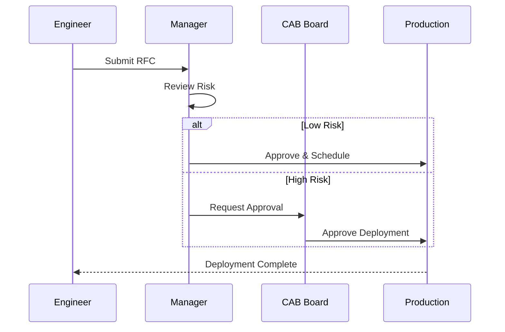

### 1.1 Request (RFC)
-   Submit a Request for Change (RFC) documenting:
    -   Description of change.
    -   Justification/Impact.
    -   Risk assessment.
    -   Rollback plan.

### 1.2 Review & Approval (CAB)
-   **Change Advisory Board (CAB)** reviews High-risk changes.
-   Peer review is required for Alert Rule modifications (Detection Engineering).

## 2. Deployment Procedures

### 2.1 Environment Strategy
-   **Development/Lab**: Sandbox environment for testing new rules and integrations.
-   **Staging**: Mirror of production for final verification.
-   **Production**: Live environment.

### 2.2 Deployment Steps
1.  **Test**: Validate functionality in the Lab environment.
2.  **Snapshot**: Take a backup/snapshot of the current configuration.
3.  **Deploy**: Apply changes to Production during the approved window.
4.  **Verify**: Confirm operational status and check for errors.

### 2.3 CI/CD for Detection Rules
-   Manage detection rules as code (Detection-as-Code).
-   Use Version Control (Git) for all rule logic.
-   Automate testing (Syntax check, Unit test) via CI pipeline before merging to `main`.

## 3. Rollback Plan

-   Every deployment must have a predefined rollback strategy.
-   If verification fails, immediately revert to the pre-deployment snapshot.
-   Conduct a Root Cause Analysis (RCA) for failed changes.


---

## File: 02_Platform_Operations/Deployment_Procedures.th.md

# มาตรฐานการจัดการการเปลี่ยนแปลงและการ Deploy (Change Management & Deployment Standard)

เอกสารนี้ระบุขั้นตอนมาตรฐานในการจัดการการเปลี่ยนแปลง (Change) และการติดตั้งระบบ (Deployment) ภายในสภาพแวดล้อมของ SOC

## 1. กระบวนการจัดการการเปลี่ยนแปลง (Change Management Process)

การแก้ไขทั้งหมดในสภาพแวดล้อม Production (เช่น กฎแจ้งเตือน, Parser, โครงสร้างพื้นฐาน) ต้องปฏิบัติตามขั้นตอนที่กำหนด

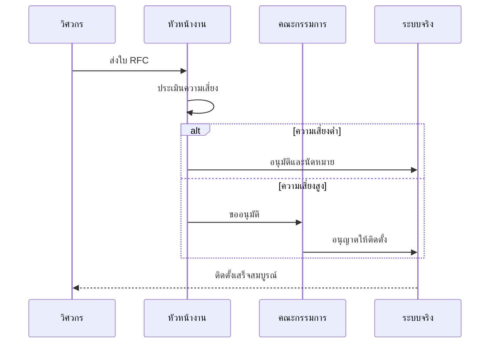

### 1.1 การร้องขอ (RFC)
-   ส่งคำร้องขอการเปลี่ยนแปลง (Request for Change - RFC) โดยระบุ:
    -   รายละเอียดการเปลี่ยนแปลง
    -   เหตุผล/ผลกระทบ
    -    ระดับความเสี่ยง
    -   แผนการถอยกลับ (Rollback plan)

### 1.2 การทบทวนและอนุมัติ (Review & Approval)
-   **Change Advisory Board (CAB)** จะพิจารณาการเปลี่ยนแปลงที่มีความเสี่ยงสูง
-   การแก้ไขกฎตรวจจับ (Alert Rule) ต้องผ่านการ Peer Review เสมอ

## 2. ขั้นตอนการ Deployment

### 2.1 กลยุทธ์สภาพแวดล้อม (Environment Strategy)
-   **Development/Lab**: พื้นที่ Sandbox สำหรับทดสอบกฎและ Integration ใหม่ๆ
-   **Staging**: สภาพแวดล้อมจำลองเหมือน Production เพื่อการตรวจสอบขั้นสุดท้าย
-   **Production**: ระบบจริงที่ใช้งานอยู่

### 2.2 ขั้นตอนการติดตั้ง
1.  **ทดสอบ (Test)**: ตรวจสอบความถูกต้องใน Lab
2.  **สำรองข้อมูล (Snapshot)**: สำรองค่า Configuration ปัจจุบัน
3.  **ติดตั้ง (Deploy)**: ทำการเปลี่ยนแปลงบน Production ในช่วงเวลาที่ได้รับอนุมัติ
4.  **ตรวจสอบ (Verify)**: ยืนยันสถานะการทำงานและตรวจสอบ Error

### 2.3 CI/CD สำหรับกฎตรวจจับ
-   จัดการ Detection Rules ในรูปแบบ Code (Detection-as-Code)
-   ใช้ Version Control (Git) สำหรับเก็บ Logic ของกฎทั้งหมด
-   ทำ Automated Testing (เช็ค Syntax, Unit test) ผ่าน CI pipeline ก่อน Merge เข้า `main`

## 3. แผนการถอยกลับ (Rollback Plan)

-   ทุกการ Deployment ต้องมีแผน Rollback ที่เตรียมไว้ล่วงหน้า
-   หากขั้นตอนการตรวจสอบล้มเหลว ให้ย้อนกลับไปยังสถานะก่อนหน้าทันที
-   ทำ Root Cause Analysis (RCA) สำหรับการเปลี่ยนแปลงที่ล้มเหลว


---

## File: 01_Onboarding/System_Activation.en.md

# Standard SOC Infrastructure Setup

This document outlines the standard infrastructure requirements and setup procedures for a modern Security Operations Center (SOC).

## 1. Core Components

A fully functional SOC requires the following core components:

### 1.1 SIEM (Security Information and Event Management)
-   **Purpose**: Centralized log aggregation, correlation, and alerting.
-   **Requirements**:
    -   High availability and scalability.
    -   Retention policy compliance (e.g., 90 days hot, 1 year cold).
    -   Support for common log formats (Syslog, CEF, JSON).

### 1.2 EDR (Endpoint Detection and Response)
-   **Purpose**: Real-time monitoring and prevention on endpoints.
-   **Deployment**: Agents must be deployed to all workstations, servers, and critical assets.
-   **Policy**: Enforce prevention policies (Block/Quarantine) for known malware.

### 1.3 SOAR (Security Orchestration, Automation, and Response)
-   **Purpose**: Automate repetitive tasks and orchestrate incident response workflows.
-   **Integration**: Must connect with SIEM, EDR, and Ticketing systems.

### 1.4 Ticketing / Case Management
-   **Purpose**: Track incidents, investigations, and analyst activities.
-   **Workflow**: Seamless integration from SIEM alerts to case creation.

## 2. Infrastructure Hardening

### 2.1 Access Control
-   **MFA**: Enforce Multi-Factor Authentication for all SOC tools.
-   **RBAC**: Implement Role-Based Access Control (Analyst, Engineer, Manager).
-   **Segmentation**: SOC infrastructure should reside in a secure, segmented network zone.

### 2.2 Monitoring
-   **Health Checks**: Continuous monitoring of tool availability and performance.
-   **Audit Logs**: Enable audit logging for all SOC analyst actions.

## 3. Network Architecture

-   **Log Shippers**: Use dedicated forwarders to send logs to the SIEM securely (TLS encryption).
-   **Jump Host**: Use a secure Jump Host or VPN for administrative access to SOC infrastructure.


---

## File: 01_Onboarding/System_Activation.th.md

# การติดตั้งโครงสร้างพื้นฐาน SOC มาตรฐาน (Standard SOC Infrastructure Setup)

เอกสารนี้ระบุข้อกำหนดและขั้นตอนการติดตั้งโครงสร้างพื้นฐานสำหรับศูนย์ปฏิบัติการความปลอดภัย (SOC) สมัยใหม่

## 1. องค์ประกอบหลัก (Core Components)

SOC ที่สมบูรณ์จำเป็นต้องมีองค์ประกอบหลักดังนี้:

### 1.1 SIEM (Security Information and Event Management)
-   **วัตถุประสงค์**: รวบรวม Log จากศูนย์กลาง, วิเคราะห์ความสัมพันธ์ (Correlation), และแจ้งเตือน
-   **ข้อกำหนด**:
    -   มีความเสถียรและรองรับการขยายตัว (Scalability)
    -   ปฏิบัติตามนโยบายการเก็บข้อมูล (เช่น Hot 90 วัน, Cold 1 ปี)
    -   รองรับ Log format มาตรฐาน (Syslog, CEF, JSON)

### 1.2 EDR (Endpoint Detection and Response)
-   **วัตถุประสงค์**: ตรวจจับและป้องกันภัยคุกคามบนเครื่องปลายทางแบบ Real-time
-   **การติดตั้ง**: ต้องติดตั้ง Agent ลงบน Workstation, Server และทรัพย์สินสำคัญทั้งหมด
-   **นโยบาย**: บังคับใช้นโยบายป้องกัน (Block/Quarantine) สำหรับมัลแวร์ที่รู้จัก

### 1.3 SOAR (Security Orchestration, Automation, and Response)
-   **วัตถุประสงค์**: ทำงานซ้ำๆ แบบอัตโนมัติ และจัดการ Workflow การตอบสนองภัยคุกคาม
-   **การเชื่อมต่อ**: ต้องเชื่อมต่อกับ SIEM, EDR, และระบบ Ticketing ได้

### 1.4 Ticketing / Case Management
-   **วัตถุประสงค์**: ติดตามเหตุการณ์ (Incidents), การสืบสวน, และกิจกรรมของ Analyst
-   **Workflow**: เชื่อมโยงจาก Alert ใน SIEM ไปสู่การสร้าง Case ได้อย่างราบรื่น

## 2. การทำให้ระบบแข็งแกร่ง (Infrastructure Hardening)

### 2.1 การควบคุมการเข้าถึง (Access Control)
-   **MFA**: บังคับใช้ Multi-Factor Authentication สำหรับเครื่องมือ SOC ทั้งหมด
-   **RBAC**: กำหนดสิทธิ์ตามบทบาทหน้าที่ (Analyst, Engineer, Manager)
-   **Segmentation**: โครงสร้างพื้นฐาน SOC ควรอยู่ใน Network Zone ที่แยกส่วนและปลอดภัย

### 2.2 การเฝ้าระวัง (Monitoring)
-   **Health Checks**: ตรวจสอบสถานะและประสิทธิภาพของเครื่องมืออย่างต่อเนื่อง
-   **Audit Logs**: เปิดใช้งาน Audit Log สำหรับทุกการกระทำของ Analyst

## 3. สถาปัตยกรรมเครือข่าย (Network Architecture)

-   **Log Shippers**: ใช้ตัวส่ง Log (Forwarder) เพื่อส่งข้อมูลไปยัง SIEM อย่างปลอดภัย (เข้ารหัส TLS)
-   **Jump Host**: ใช้ Jump Host หรือ VPN ที่ปลอดภัยสำหรับการเข้าถึงระดับผู้ดูแลระบบ


---

## File: 10_File_Signatures/README.md

# YARA Rules (File Signatures)

This directory contains YARA rules for detecting malicious files. These rules can be used with the `yara` command line tool or integrated into EDR/Forensic tools.

| Rule File | Description | Severity |
| :--- | :--- | :--- |
| `webshell_php_generic.yar` | Detects common PHP Webshells (c99, r57, etc.) | Critical |
| `ransomware_generic_encrypt.yar` | Detects mass file encryption behavior and ransom notes | Critical |
| `hacktool_mimikatz.yar` | Detects Mimikatz credential dumping artifacts | High |

## Usage
```bash
yara -r 10_File_Signatures/ /path/to/scan
```


---

## File: 11_Reporting_Templates/Monthly_SOC_Report.en.md

# Monthly SOC Performance Report

**Month**: [MM/YYYY]
**Prepared By**: [SOC Manager Name]
**Distribution**: CIO, CISO, IT Director

## 1. Executive Summary
*Provide a 3-5 sentence summary of the SOC's performance this month. Highlight any major incidents or achievements.*

## 2. Key Performance Indicators (KPIs)

| Metric | Target | Actual | Status |
| :--- | :--- | :--- | :--- |
| **MTTD** (Mean Time To Detect) | < 30 Mins | [XX] Mins | [🟢/🔴] |
| **MTTR** (Mean Time To Respond) | < 60 Mins | [XX] Mins | [🟢/🔴] |
| **Total Alerts Processed** | N/A | [XXXX] | N/A |
| **Valid Incidents** | N/A | [XX] | N/A |
| **False Positive Rate** | < 10% | [XX]% | [🟢/🔴] |

## 3. Incident Highlights
*List the top 3 most significant incidents.*

### Incident #1: [Brief Title, e.g., CFO Phishing Attempt]
-   **Date**: [YYYY-MM-DD]
-   **Impact**: [None / Data Loss / Downtime]
-   **Resolution**: [Blocked sender, reset password]
-   **Root Cause**: [User error / Lack of MFA]

## 4. Threat Landscape Analysis
*What trends are we seeing?*
-   [ ] Increase in Phishing attacks targeting HR.
-   [ ] Brute force attempts against VPN.

## 5. Projects & Improvements
-   [ ] Tuned 5 noisy detection rules.
-   [ ] Onboarded [New Log Source].
-   [ ] Completed [Training Module].


---

## File: 11_Reporting_Templates/Monthly_SOC_Report.th.md

# รายงานผลการดำเนินงาน SOC ประจำเดือน

**ประจำเดือน**: [ด/ปปปป]
**จัดทำโดย**: [ชื่อผู้จัดการ SOC]
**ผู้รับมอบ**: CIO, CISO, IT Director

## 1. บทสรุปผู้บริหาร (Executive Summary)
*สรุปภาพรวมการทำงานของ SOC ในเดือนนี้ 3-5 ประโยค เน้นเหตุการณ์สำคัญหรือความสำเร็จ*

## 2. ตัวชี้วัดผลการดำเนินงาน (KPIs)

| ตัวชี้วัด (Metric) | เป้าหมาย (Target) | ผลลัพธ์ (Actual) | สถานะ |
| :--- | :--- | :--- | :--- |
| **MTTD** (เวลาตรวจจับเฉลี่ย) | < 30 นาที | [XX] นาที | [🟢/🔴] |
| **MTTR** (เวลาตอบสนองเฉลี่ย) | < 60 นาที | [XX] นาที | [🟢/🔴] |
| **จำนวน Alert ทั้งหมด** | - | [XXXX] | - |
| **จำนวน Incident จริง** | - | [XX] | - |
| **อัตรา False Positive** | < 10% | [XX]% | [🟢/🔴] |

## 3. เหตุการณ์สำคัญ (Incident Highlights)
*ระบุ 3 เหตุการณ์ที่สำคัญที่สุด*

### เหตุการณ์ที่ 1: [ชื่อเหตุการณ์ เช่น ตรวจพบมัลแวร์เครื่องฝ่ายการเงิน]
-   **วันที่**: [YYYY-MM-DD]
-   **ผลกระทบ**: [ไม่มี / ข้อมูลรั่วไหล / ระบบหยุดทำงาน]
-   **การแก้ไข**: [กักกันเครื่อง, ลง Windows ใหม่]
-   **สาเหตุ**: [User เปิดไฟล์แนบอันตราย]

## 4. วิเคราะห์แนวโน้มภัยคุกคาม (Threat Landscape)
*แนวโน้มที่พบในเดือนนี้*
-   [ ] พบการโจมตี Phishing เพิ่มขึ้นในแผนกบุคคล
-   [ ] มีการพยายามเดารหัสผ่าน VPN บ่อยครั้ง

## 5. โครงการและการปรับปรุง
-   [ ] ปรับปรุงกฎ Alert ที่แจ้งเตือนผิดพลาด 5 กฎ
-   [ ] นำเข้า Log ใหม่จาก [ระบบ]
-   [ ] อบรมพนักงานเรื่อง [หัวข้อ]


---

## File: 11_Reporting_Templates/Quarterly_Business_Review.en.md

# SOC Quarterly Business Review (QBR)

**Quarter**: [Q1/Q2/Q3/Q4 YYYY]
**Prepared By**: [SOC Manager]

## 1. Strategic Summary
*Overview of SOC maturity and alignment with business goals.*

## 2. Maturity Growth (SOC-CMM)
*Compare current maturity with previous quarter.*

| Domain | Previous Score | Current Score | Change |
| :--- | :--- | :--- | :--- |
| Business | [1-5] | [1-5] | [🔺/🔻] |
| People | [1-5] | [1-5] | [🔺/🔻] |
| Process | [1-5] | [1-5] | [🔺/🔻] |
| Technology | [1-5] | [1-5] | [🔺/🔻] |
| Operations | [1-5] | [1-5] | [🔺/🔻] |

## 3. Budget & Resource Status
-   **Budget Utilization**: [XX]% of annual budget used.
-   **Staffing**: [XX] Analysts / [XX] Open Headcounts.
-   **Licensing**: [XX] EPS used vs [XX] EPS quota.

## 4. Risks & Challenges
*High-level risks that require leadership attention.*
1.  **Staff Retention**: Risk of Junior Analysts leaving due to burnout.
2.  **Blind Spots**: Implementing EDR on Linux servers is delayed.

## 5. Next Quarter Roadmap
-   **Goal 1**: Achieve SOC-CMM Level 3 in "Process".
-   **Goal 2**: Integrate Cloud Logs (AWS/Azure).
-   **Goal 3**: Conduct Purple Team exercise.


---

## File: 11_Reporting_Templates/Quarterly_Business_Review.th.md

# รายงานทบทวนผลการดำเนินงานรายไตรมาส (SOC QBR)

**ไตรมาส**: [Q1/Q2/Q3/Q4 ปี]
**จัดทำโดย**: [ผู้จัดการ SOC]

## 1. บทสรุปเชิงกลยุทธ์ (Strategic Summary)
*ภาพรวมความพร้อมของ SOC และความสอดคล้องกับเป้าหมายธุรกิจ*

## 2. การเติบโตด้านความพร้อม (Maturity Growth - SOC-CMM)
*เปรียบเทียบคะแนนความพร้อมกับไตรมาสที่ผ่านมา*

| ด้าน (Domain) | คะแนนเดิม | คะแนนปัจจุบัน | การเปลี่ยนแปลง |
| :--- | :--- | :--- | :--- |
| ธุรกิจ (Business) | [1-5] | [1-5] | [🔺/🔻] |
| บุคลากร (People) | [1-5] | [1-5] | [🔺/🔻] |
| กระบวนการ (Process) | [1-5] | [1-5] | [🔺/🔻] |
| เทคโนโลยี (Technology) | [1-5] | [1-5] | [🔺/🔻] |
| การปฏิบัติงาน (Operations) | [1-5] | [1-5] | [🔺/🔻] |

## 3. งบประมาณและทรัพยากร
-   **การใช้งบประมาณ**: ใช้ไป [XX]% ของงบปี
-   **อัตรากำลังคน**: [XX] คน / ต้องการเพิ่ม [XX] คน
-   **Licensing**: ใช้ไป [XX] EPS จากโควต้า [XX] EPS

## 4. ความเสี่ยงและความท้าทาย
*ความเสี่ยงระดับสูงที่ผู้บริหารต้องรับทราบ*
1.  **การรักษาพนักงาน**: ความเสี่ยงที่ Analyst จะลาออกเนื่องจากงานล้นมือ
2.  **จุดบอด (Blind Spots)**: โครงการติดตั้ง EDR บน Linux ล่าช้ากว่ากำหนด

## 5. แผนงานไตรมาสถัดไป
-   **เป้าหมาย 1**: ยกระดับ SOC-CMM ด้าน "Process" ให้ถึง Level 3
-   **เป้าหมาย 2**: เชื่อมต่อ Log จากระบบ Cloud
-   **เป้าหมาย 3**: จัดซ้อมรบทางไซเบอร์ (Purple Team)


---

## File: 06_Operations_Management/Data_Handling_Protocol.en.md

# Data Handling Protocol (TLP 2.0)

**Effective Date**: 2026-02-15
**Version**: 1.0

## 1. Overview
The Traffic Light Protocol (TLP) was created to facilitate greater sharing of information. TLP is a set of designations used to ensure that sensitive information is shared with the appropriate audience.

## 2. Classification Logic
Use this flow to determine the correct TLP level for your data/incident.

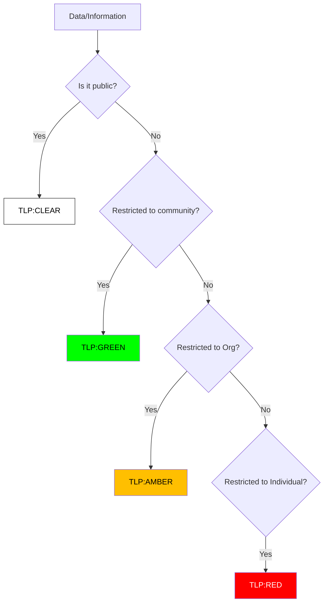

## 3. TLP Definitions

### 🔴 TLP:RED (For Your Eyes Only)
-   **Definition**: Not for disclosure, restricted to participants only.
-   **Examples**: VPN Logs with passwords, Forensic Reports linking to a specific employee, Ongoing negotiation with ransomware actors.
-   **Sharing**: Cannot be shared with anyone outside of the specific meeting or conversation.

### 🟡 TLP:AMBER (Limited Disclosure)
-   **Definition**: Limited disclosure, restricted to the organization's need-to-know.
-   **Examples**: Internal incident reports, Vulnerability scan results, System architecture diagrams.
-   **Sharing**: Clients may share with members of their own organization and clients who need to know.

### 🟢 TLP:GREEN (Community Wide)
-   **Definition**: Limited disclosure, restricted to the community.
-   **Examples**: IoCs (IPs/Hashes) of a known threat actor, General advice on mitigation.
-   **Sharing**: Information can be shared with peers and partner organizations within the sector.

### ⚪ TLP:CLEAR (World Wide)
-   **Definition**: Unlimited disclosure.
-   **Examples**: Public PR statements, Whitepapers, Patch notes.
-   **Sharing**: Subject to standard restrictions (copyright), but otherwise freely shareable.

## 4. Usage in Incident Reports
All Incident Reports MUST be marked with a TLP level at the top of the document.


---

## File: 06_Operations_Management/Data_Handling_Protocol.th.md

# โปรโตคอลการจัดการข้อมูล (TLP 2.0)

**วันที่มีผลบังคับใช้**: 2026-02-15
**เวอร์ชัน**: 1.0

## 1. ภาพรวม
Traffic Light Protocol (TLP) คือมาตรฐานสากลที่ใช้กำหนดขอบเขตในการแบ่งปันข้อมูล เพื่อให้มั่นใจว่าข้อมูลที่มีความละเอียดอ่อนจะถูกส่งต่อไปยังผู้ที่เกี่ยวข้องเท่านั้น

## 2. ขั้นตอนการจำแนกข้อมูล (Classification Logic)
ใช้แผนผังด้านล่างเพื่อตัดสินใจเลือก TLP Level

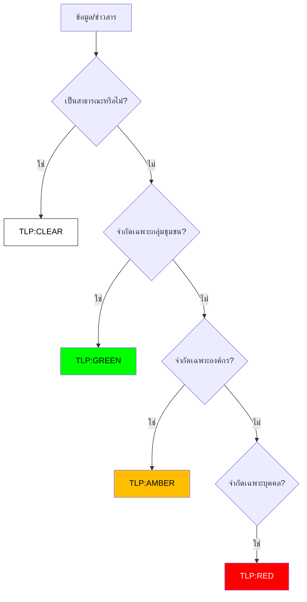

## 3. คำนิยาม TLP

### 🔴 TLP:RED (ลับที่สุด / เฉพาะบุคคล)
-   **คำนิยาม**: ห้ามเปิดเผยต่อผู้อื่น จำกัดไว้เฉพาะผู้รับสารโดยตรงเท่านั้น
-   **ตัวอย่าง**: Log ที่มีรหัสผ่าน, รายงาน Forensics ที่ระบุชื่อพนักงานที่ทำผิด, การเจรจากับแฮกเกอร์
-   **การแบ่งปัน**: ห้ามส่งต่อ หรือบอกกล่าวแก่บุคคลอื่นนอกเหนือจากคู่สนทนา

### 🟡 TLP:AMBER (จำกัดภายในองค์กร)
-   **คำนิยาม**: เปิดเผยได้จำกัด เฉพาะผู้ที่มีความจำเป็นต้องรู้ (Need-to-know) ภายในองค์กร
-   **ตัวอย่าง**: รายงานเหตุการณ์ภัยคุกคามภายใน, ผล Scan ช่องโหว่, ผังเครือข่ายภายใน
-   **การแบ่งปัน**: ส่งต่อได้เฉพาะพนักงานภายในองค์กรที่เกี่ยวข้อง

### 🟢 TLP:GREEN (จำกัดภายในกลุ่มเครือข่าย)
-   **คำนิยาม**: เปิดเผยได้ภายในกลุ่มชุมชนหรืออุตสาหกรรมเดียวกัน
-   **ตัวอย่าง**: IoC (IP/Hash) ของกลุ่มแฮกเกอร์, คำแนะนำการป้องกันทั่วไป
-   **การแบ่งปัน**: แชร์กับบริษัทคู่ค้า หรือกลุ่มอุตสาหกรรมเดียวกันได้ (เช่น กลุ่มธนาคาร)

### ⚪ TLP:CLEAR (สาธารณะ)
-   **คำนิยาม**: เปิดเผยได้ไม่จำกัด
-   **ตัวอย่าง**: แถลงการณ์ข่าว, บทความวิชาการ, รายละเอียด Patch
-   **การแบ่งปัน**: เผยแพร่สู่สาธารณะได้ทันที

## 4. การใข้งานในรายงาน (Incident Reports)
รายงานเหตุการณ์ทุกฉบับ ต้องระบุระดับ TLP อย่างชัดเจนที่ส่วนหัวของเอกสาร


---

## File: 06_Operations_Management/SOC_Assessment_Checklist.en.md

# SOC Capability Maturity Model (SOC-CMM) Assessment

**Assessment Period**: Quarterly

## 1. Improvement Cycle
We use a continuous improvement loop to advance our SOC maturity.

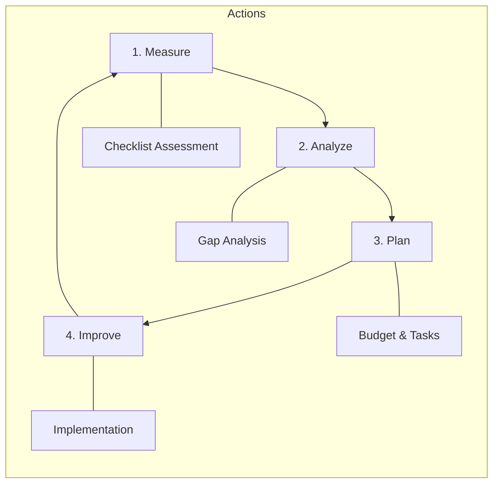

## 2. Maturity Levels
-   **Level 1 (Initial)**: Ad-hoc, chaotic, reactive.
-   **Level 2 (Managed)**: Processes defined but reactive.
-   **Level 3 (Defined)**: Proactive, documented standards (We are here).
-   **Level 4 (Quantitatively Managed)**: Metrics-driven (MTTD/MTTR).
-   **Level 5 (Optimizing)**: Automated, AI-driven, advanced hunting.

## 3. Assessment Checklist

### Domain 1: Business
- [ ] Defined SOC Charter & Strategy?
- [ ] Executive Sponsorship & Budget?
- [ ] Defined Metrics (KPIs) reporting?

### Domain 2: People
- [ ] 24/7 Shift Schedule operational?
- [ ] defined Onboarding Curriculum?
- [ ] Regular Skill Training (Purple Team)?

### Domain 3: Process
- [ ] SOPs for all major tasks?
- [ ] Playbooks for top 10 threats?
- [ ] Change Management (RFC) in place?

### Domain 4: Technology
- [ ] SIEM ingesting critical logs?
- [ ] EDR deployed on 95%+ endpoints?
- [ ] SOAR automation for repetitive tasks?

### Domain 5: Services
- [ ] Real-time Monitoring & Alerting?
- [ ] Incident Response Capability?
- [ ] Threat Intelligence integration?

## 4. Scoring
Count the "Yes" answers to determine approximate maturity.
-   0-5: Level 1
-   6-10: Level 2
-   11-13: Level 3 (Target Baseline)
-   14+: Level 4+


---

## File: 06_Operations_Management/SOC_Assessment_Checklist.th.md

# แบบประเมินระดับความพร้อม SOC (SOC-CMM)

**รอบการประเมิน**: รายไตรมาส

## 1. วงจรการปรับปรุง (Improvement Cycle)
เราใช้วงจรการปรับปรุงอย่างต่อเนื่องเพื่อยกระดับความสามารถของ SOC

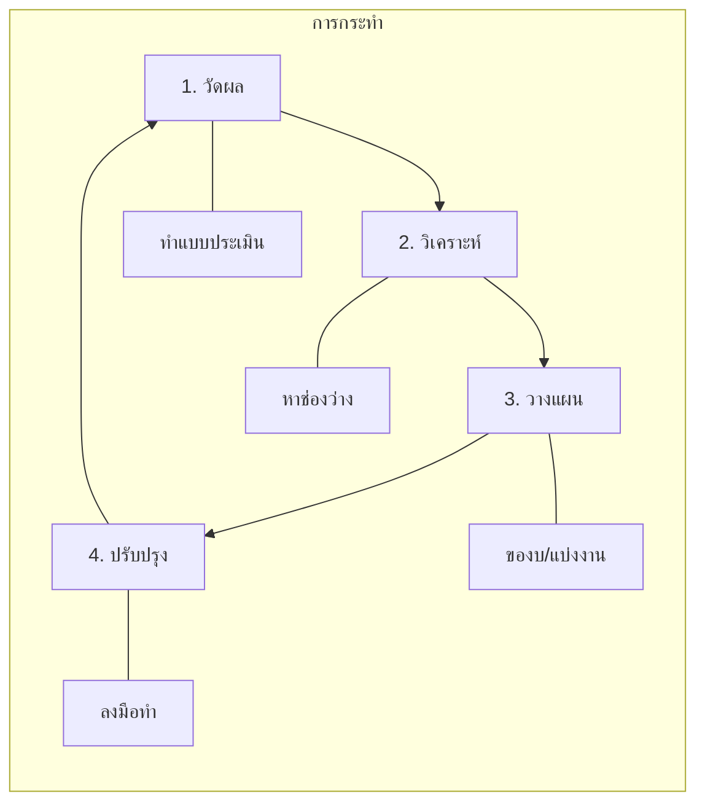

## 2. ระดับความพร้อม (Maturity Levels)
-   **Level 1 (Initial)**: ทำตามมีตามเกิด, แก้ปัญหาเฉพาะหน้า
-   **Level 2 (Managed)**: มีกระบวนการ แต่ยังทำงานเชิงรับ (Reactive)
-   **Level 3 (Defined)**: มีมาตรฐานชัดเจน, ทำงานเชิงรุก (Proactive) **(เป้าหมายปัจจุบัน)**
-   **Level 4 (Quantitatively Managed)**: ขับเคลื่อนด้วยข้อมูล (Metrics/KPIs)
-   **Level 5 (Optimizing)**: อัตโนมัติขั้นสูง, AI-driven

## 3. รายการตรวจเช็ค (Checklist)

### Domain 1: ธุรกิจ (Business)
- [ ] มีพ.ร.บ. หรือกฎบัตร (Charter) ของ SOC?
- [ ] ได้รับการสนับสนุนงบประมาณจากผู้บริหาร?
- [ ] มีการรายงานผล KPI สม่ำเสมอ?

### Domain 2: บุคลากร (People)
- [ ] มีตารางเวร 24/7 ที่ชัดเจน?
- [ ] มีหลักสูตร Onboarding พนักงานใหม่?
- [ ] มีการฝึกอบรมทักษะ (เช่น Purple Team) สม่ำเสมอ?

### Domain 3: กระบวนการ (Process)
- [ ] มี SOP ครอบคลุมงานหลัก?
- [ ] มี Playbook รับมือภัยคุกคาม 10 อันดับแรก?
- [ ] มีกระบวนการ Change Management (RFC)?

### Domain 4: เทคโนโลยี (Technology)
- [ ] SIEM รับ Log สำคัญครบถ้วน?
- [ ] EDR ติดตั้งครอบคลุม 95%+ ของเครื่อง?
- [ ] มีระบบ SOAR ช่วยงานซ้ำๆ?

### Domain 5: บริการ (Services)
- [ ] มีการเฝ้าระวังและแจ้งเตือนแบบ Real-time?
- [ ] มีขีดความสามารถในการตอบสนองเหตุการณ์ (IR)?
- [ ] มีการใช้ Threat Intelligence?

## 4. การให้คะแนน
นับจำนวนข้อที่ตอบ "ใช่" เพื่อประเมินระดับ
-   0-5: Level 1
-   6-10: Level 2
-   11-13: Level 3 (เกณฑ์มาตรฐาน)
-   14+: Level 4+


---

## File: 06_Operations_Management/SOC_Metrics.en.md

# SOC Metrics & KPIs Standard

This document defines the Key Performance Indicators (KPIs) and metrics used to measure the effectiveness and efficiency of the SOC.

## 1. Operational Metrics (Efficiency)

### 1.1 Mean Time To Detect (MTTD)
-   **Definition**: The average time it takes to identify a security threat after it has entered the network.
-   **Target**: < 30 Minutes.
-   **Formula**: `Sum(Detection Time - Intrusion Time) / Total Incidents`

### 1.2 Mean Time To Respond (MTTR)
-   **Definition**: The average time it takes to contain and remediate a threat after it has been detected.
-   **Target**: < 60 Minutes (for High/Critical severity).
-   **Formula**: `Sum(Remediation Time - Detection Time) / Total Incidents`

### 1.3 Mean Time To Acknowledge (MTTA)
-   **Definition**: The average time from an alert being triggered to an analyst picking it up.
-   **Target**: < 10 Minutes.

## 2. Detection Metrics (Effectiveness)

### 2.1 False Positive Rate (FPR)
-   **Definition**: Percentage of alerts that are benign but triggered a response.
-   **Target**: < 10%.
-   **Action**: High FPR requires tuning of detection rules (Whitelisting).

### 2.2 Dwell Time
-   **Definition**: The duration a threat actor remains undetected in the environment.
-   **Impact**: Longer dwell time = Higher data breach risk.

## 3. Analyst Capacity

-   **Incidents per Analyst**: Number of cases handled by one analyst per shift.
-   **Burnout Rate**: Turnover rate of SOC staff (Target: < 15% annually).


---

## File: 06_Operations_Management/SOC_Metrics.th.md

# มาตรฐานตัวชี้วัดประสิทธิภาพ SOC (SOC Metrics & KPIs Standard)

เอกสารนี้กำหนดตัวชี้วัดประสิทธิภาพหลัก (KPIs) และ Metrics ที่ใช้จัดวัดประสิทธิผลและประสิทธิภาพของ SOC

## 1. ตัวชี้วัดด้านการปฏิบัติงาน (Operational Metrics - Efficiency)

### 1.1 เวลาเฉลี่ยในการตรวจจับ (Mean Time To Detect - MTTD)
-   **นิยาม**: เวลาเฉลี่ยที่ใช้ในการระบุภัยคุกคามหลังจากที่เข้ามาในเครือข่ายแล้ว
-   **เป้าหมาย**: < 30 นาที
-   **สูตรคำนวณ**: `ผลรวม(เวลาที่ตรวจเจอ - เวลาที่เริ่มบุกรุก) / จำนวนเหตุการณ์ทั้งหมด`

### 1.2 เวลาเฉลี่ยในการตอบสนอง (Mean Time To Respond - MTTR)
-   **นิยาม**: เวลาเฉลี่ยที่ใช้ในการจำกัดและแก้ไขภัยคุกคามหลังจากที่ตรวจพบแล้ว
-   **เป้าหมาย**: < 60 นาที (สำหรับความรุนแรงระดับ High/Critical)
-   **สูตรคำนวณ**: `ผลรวม(เวลาที่แก้ไขเสร็จ - เวลาที่ตรวจเจอ) / จำนวนเหตุการณ์ทั้งหมด`

### 1.3 เวลาเฉลี่ยในการรับเรื่อง (Mean Time To Acknowledge - MTTA)
-   **นิยาม**: เวลาเฉลี่ยตั้งแต่ Alert แจ้งเตือนจนถึงเวลาที่ Analyst กดรับงาน
-   **เป้าหมาย**: < 10 นาที

## 2. ตัวชี้วัดด้านการตรวจจับ (Detection Metrics - Effectiveness)

### 2.1 อัตราการแจ้งเตือนผิดพลาด (False Positive Rate - FPR)
-   **นิยาม**: เปอร์เซ็นต์ของ Alert ที่ไม่ใช่ภัยคุกคามจริง
-   **เป้าหมาย**: < 10%
-   **การดำเนินการ**: หาก FPR สูง ต้องทำการปรับจูน Detection Rules (Whitelisting)

### 2.2 ระยะเวลาแฝงตัว (Dwell Time)
-   **นิยาม**: ระยะเวลาที่ผู้โจมตีแฝงตัวอยู่ในระบบโดยไม่ถูกตรวจจับ
-   **ผลกระทบ**: ยิ่งนาน = ความเสี่ยงข้อมูลรั่วไหลยิ่งสูง

## 3. ขีดความสามารถของ Analyst (Analyst Capacity)

-   **Incidents per Analyst**: จำนวนเคสที่ Analyst หนึ่งคนรับผิดชอบต่อกะ
-   **Burnout Rate**: อัตราการลาออกของพนักงาน SOC (เป้าหมาย: < 15% ต่อปี)


---

## File: 06_Operations_Management/Shift_Handoff.en.md

# Shift Operations & Handoff Standard

This document outlines the standard procedures for managing shifts and ensuring operational continuity during shift handovers.

## 1. Shift Structure (24/7)

Standard rotation pattern for 24/7 coverage:
-   **Morning Shift**: 08:00 - 16:00
-   **Afternoon Shift**: 16:00 - 00:00
-   **Night Shift**: 00:00 - 08:00

*Note: Overlap of 30 minutes is required for proper handoff.*

## 2. Handoff Procedure

A standardized handoff ensures no incident falls through the cracks. The outgoing Shift Lead must brief the incoming Shift Lead on:

### 2.1 Critical Checklist
-   **Active Incidents**: High/Critical incidents currently open.
-   **Pending Tasks**: Investigations or tickets requiring follow-up.
-   **System Health**: Status of SIEM, EDR, and Feeds (Any operational issues?).
-   **Intelligence Updates**: New critical vulnerabilities or threat campaigns causing noise.

### 2.2 Handover Log
-   All details must be recorded in the **Shift Handover Log** (Example: Ticket #1234, Status: Waiting for user).

## 3. Shift Duties

### 3.1 Start of Shift
-   Review Handover Log.
-   Check "Unassigned" queue in Ticketing System.
-   Verify SIEM Dashboard health.

### 3.2 End of Shift
-   Update all assigned tickets.
-   Complete documentation for closed cases.
-   Prepare Handover Log.


---

## File: 06_Operations_Management/Shift_Handoff.th.md

# มาตรฐานการปฏิบัติงานกะและการส่งต่องาน (Shift Operations & Handoff Standard)

เอกสารนี้ระบุขั้นตอนมาตรฐานในการบริหารจัดการกะและการส่งต่องานเพื่อให้การปฏิบัติงานมีความต่อเนื่อง

## 1. โครงสร้างกะ (Shift Structure - 24/7)

รูปแบบมาตรฐานสำหรับการครอบคลุมตลอด 24/7:
-   **กะเช้า (Morning)**: 08:00 - 16:00
-   **กะบ่าย (Afternoon)**: 16:00 - 00:00
-   **กะดึก (Night)**: 00:00 - 08:00

*หมายเหตุ: ต้องมีเวลาคาบเกี่ยว (Overlap) 30 นาทีสำหรับการส่งต่องาน*

## 2. ขั้นตอนการส่งต่องาน (Handoff Procedure)

การส่งต่องานที่เป็นมาตรฐานช่วยป้องกันไม่ให้งานหลุด หัวหน้ากะที่กำลังจะออกเวรต้องสรุปข้อมูลให้หัวหน้ากะที่มารับเวรฟัง:

### 2.1 รายการตรวจสอบสำคัญ (Critical Checklist)
-   **เหตุการณ์ที่ยังไม่จบ (Active Incidents)**: Case ระดับ High/Critical ที่ยังเปิดอยู่
-   **งานค้าง (Pending Tasks)**: การสืบสวนหรือ Ticket ที่ต้องติดตามต่อ
-   **สุขภาพระบบ (System Health)**: สถานะของ SIEM, EDR, Feed (มีอะไรล่มหรือไม่?)
-   **ข่าวกรองล่าสุด (Intelligence Updates)**: ช่องโหว่ใหม่หรือ Campaign โจมตีที่ทำให้เกิด Alert เยอะผิดปกติ

### 2.2 บันทึกการส่งงาน (Handover Log)
-   รายละเอียดทั้งหมดต้องถูกบันทึกลงใน **Shift Handover Log** (เช่น Ticket #1234, สถานะ: รอผู้ใช้ตอบกลับ)

## 3. หน้าที่ในกะ (Shift Duties)

### 3.1 เริ่มกะ (Start of Shift)
-   ทบทวน Handover Log
-   ตรวจสอบคิวงาน "Unassigned" ในระบบ Ticketing
-   ตรวจสอบหน้า Dashboard SIEM

### 3.2 จบกะ (End of Shift)
-   อัปเดต Ticket ทั้งหมดที่รับผิดชอบ
-   ทำเอกสารสรุป Case ที่ปิดแล้วให้เรียบร้อย
-   เตรียมข้อมูลสำหรับทำ Handover Log


---

## File: 06_Operations_Management/Threat_Intelligence_Lifecycle.en.md

# Threat Intelligence Lifecycle (CTI)

**Version**: 1.0
**Owner**: CTI Analyst / SOC Manager

## 1. Overview
Cyber Threat Intelligence (CTI) is the process of collecting, analyzing, and disseminating information about current and potential attacks. This standard ensures our SOC moves from "Reactive" to "Proactive".

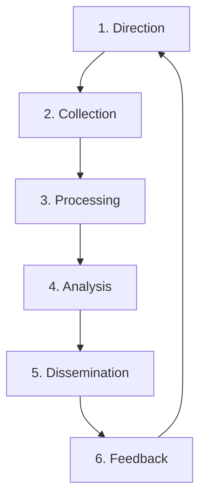

## 2. Phases

### Phase 1: Direction (Requirement)
-   **Goal**: Define what we are protecting and what questions we need answered.
-   **Key Intelligence Questions (KIQs)**:
    -   "Is the new 'ABC Ransomware' targeting our industry?"
    -   "Do we have exposure to the CVE-2026-XXXX vulnerability?"

### Phase 2: Collection
-   **Internal Sources**: SIEM Logs, Incident Tickets, EDR Alerts.
-   **External Sources**:
    -   **Open Source (OSINT)**: Twitter, Blogs, CISA Alerts.
    -   **Commercial Feeds**: Vendor reports, Paid API feeds.
    -   **Communities**: ISACs, CERTs, Trusted Partner Peers.

### Phase 3: Processing
-   **Normalization**: Converting raw data (PDFs, Tweets) into standard formats (STIX/TAXII, CSV).
-   **Validation**: Confirming that an Indicator of Compromise (IoC) is valid and not a False Positive (e.g., verifying a "malicious IP" isn't actually Google DNS).

### Phase 4: Analysis
-   **Contextualization**: Adding "So What?".
    -   *Raw Data*: "IP 1.2.3.4 is bad."
    -   *Intelligence*: "IP 1.2.3.4 is a C2 server for APT29 targeting Banks. We are a Bank. Severity = Critical."

### Phase 5: Dissemination
-   **Tactical**: IoCs sent to SIEM/Firewall for blocking (TLP:GREEN).
-   **Operational**: Reports sent to SOC Manager for awareness (TLP:AMBER).
-   **Strategic**: Trend reports sent to CISO/Board (TLP:CLEAR/WHITE).

### Phase 6: Feedback
-   **Review**: Did the intel help? Did it cause false positives?
-   **Action**: Tune sources or refine requirements.

## 3. IoC Management Policy
All Indicators of Compromise (IoCs) must go through the **Review Process** before blocking:
1.  Analyst collects IoC.
2.  Analyst checks reputation (VirusTotal / internal logs).
3.  Analyst updates reference list in SIEM (Test Mode).
4.  If stable > 24 hours, move to Block Mode.


---

## File: 06_Operations_Management/Threat_Intelligence_Lifecycle.th.md

# วงจรข่าวกรองภัยคุกคาม (Threat Intelligence Lifecycle)

**เวอร์ชัน**: 1.0
**ผู้รับผิดชอบ**: CTI Analyst / SOC Manager

## 1. ภาพรวม
Cyber Threat Intelligence (CTI) คือกระบวนการรวบรวม วิเคราะห์ และแจกจ่ายข้อมูลเกี่ยวกับภัยคุกคาม เพื่อให้ SOC สามารถป้องกันตนเองได้ก่อนที่จะเกิดเหตุ (Proactive)

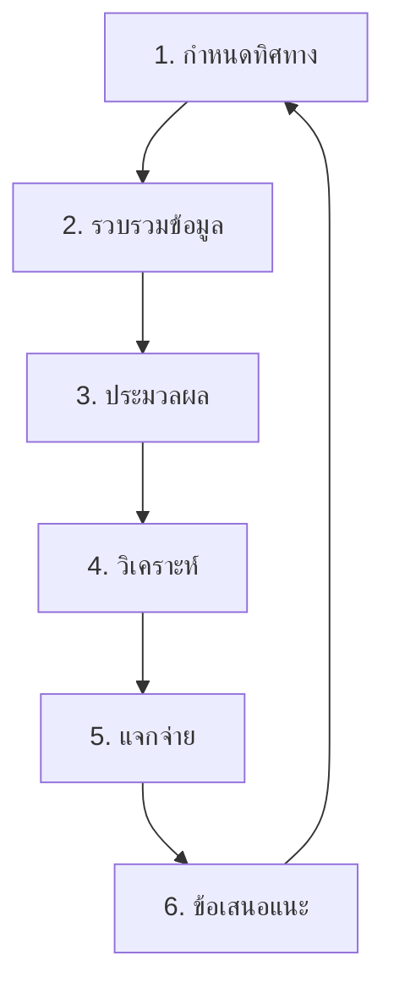

## 2. ขั้นตอนการทำงาน (Phases)

### Phase 1: Direction (กำหนดโจทย์)
-   **เป้าหมาย**: ระบุว่าเราต้องการรู้อะไร?
-   **คำถามหลัก (KIQs)**:
    -   "กลุ่มแฮกเกอร์ ABC กำลังโจมตีธุรกิจประเภทเดียวกับเราหรือไม่?"
    -   "เรามีความเสี่ยงต่อช่องโหว่ใหม่ CVE-2026-XXXX หรือไม่?"

### Phase 2: Collection (รวบรวม)
-   **แหล่งภายใน**: SIEM Logs, เคสเก่าๆ
-   **แหล่งภายนอก**:
    -   **OSINT**: Twitter, ข่าวความปลอดภัย, CISA
    -   **Commercial**: Feed ที่เสียเงินซื้อ
    -   **Communities**: กลุ่ม ThaiCERT, TB-CERT

### Phase 3: Processing (ประมวลผล)
-   **จัดระเบียบ**: แปลงข้อมูลจากข่าว/PDF ให้เป็น Format ที่คอมพิวเตอร์อ่านได้ (STIX, CSV)
-   **ตรวจสอบ**: ยืนยันว่าข้อมูลถูกต้อง (Validation) เพื่อลด False Positive

### Phase 4: Analysis (วิเคราะห์)
-   **การให้บริบท**: เปลี่ยน "ข้อมูลดิบ" เป็น "ข่าวกรอง"
    -   *ข้อมูลดิบ*: "IP 1.2.3.4 เป็นอันตราย"
    -   *ข่าวกรอง*: "IP 1.2.3.4 เป็น C2 ของ APT29 ที่เล็งเป้าธนาคาร และเราเป็นธนาคาร ดังนั้นความเสี่ยง = สูงมาก"

### Phase 5: Dissemination (แจกจ่าย)
-   **Tactical**: ส่ง IP/Hash ลง SIEM/Firewall เพื่อบล็อก (TLP:GREEN)
-   **Operational**: ส่งรายงานให้หัวหน้าทีม SOC (TLP:AMBER)
-   **Strategic**: ส่งสรุปแนวโน้มให้ผู้บริหาร (TLP:CLEAR/WHITE)

### Phase 6: Feedback (ปรับปรุง)
-   **ทบทวน**: ข่าวกรองที่ได้มามีประโยชน์ไหม? แจ้งเตือนมั่วซั่วหรือไม่?

## 3. นโยบายการจัดการ IoC
Indicators of Compromise (IoCs) ทุกตัวต้องผ่านกระบวนการตรวจสอบก่อนบล็อก:
1.  Analyst รวบรวม IoC
2.  ตรวจสอบค่าชื่อเสียง (Reputation Check)
3.  ใส่ใน SIEM ระบบ Test Mode (Monitor Only)
4.  ถ้าไม่มี False Positive นาน 24 ชม. จึงเปิด Block Mode


---

## File: 03_User_Guides/Content_Management.en.md

# Detection Engineering Lifecycle

This document defines the lifecycle for creating, maintaining, and retiring detection rules within the SOC.

## 1. Requirement & Research
-   **Threat Intelligence**: Analyze recent threat reports, CVEs, and adversary inputs.
-   **Gap Analysis**: Identify missing coverage in the MITRE ATT&CK dashboard.
-   **Business Context**: Understand critical assets and risks specific to the organization.

## 2. Development (Sigma/YARA/Snort)
-   **Standard Format**: Use **Sigma** for SIEM-agnostic rule creation.
-   **Metadata**: All rules must include:
    -   Title & Description
    -   Author
    -   Severity
    -   MITRE Mapping (Tactic/Technique)
    -   Status (Experimental, Stable, Deprecated)

## 3. Testing & Tuning
-   **Validation**: Test rules against historical data or generated attack simulations (e.g., Atomic Red Team).
-   **Whitelisting**: Identify and filter out benign false positives.
-   **Promotion**: Move rule from "Experimental" to "Stable" only after verifying False Positive Rate (FPR) is acceptable.

## 4. Deployment & Monitoring
-   Deploy via the CI/CD pipeline defined in [Change Management](../02_Platform_Operations/Deployment_Procedures.en.md).
-   Monitor rule performance (Alert Volume, Analyst Feedback).

## 5. Review & Deprecation
-   **Quarterly Audit**: Review rules for relevance. Adversary tactics change; rules may become obsolete.
-   **Deprecation**: retire rules that are noisy, ineffective, or duplicative.


---

## File: 03_User_Guides/Content_Management.th.md

# วงจรชีวิตวิศวกรรมการตรวจจับ (Detection Engineering Lifecycle)

เอกสารนี้กำหนดวงจรชีวิตสำหรับการสร้าง ดูแลรักษา และยกเลิกกฎการตรวจจับภายใน SOC

## 1. ความต้องการและการวิจัย (Requirement & Research)
-   **Threat Intelligence**: วิเคราะห์รายงานภัยคุกคามล่าสุด, CVE, และข้อมูลจากผู้โจมตี
-   **Gap Analysis**: ระบุจุดที่ยังขาดการป้องกันใน MITRE ATT&CK Dashboard
-   **บริบททางธุรกิจ**: ทำความเข้าใจสินทรัพย์สำคัญและความเสี่ยงเฉพาะขององค์กร

## 2. การพัฒนา (Development - Sigma/YARA/Snort)
-   **รูปแบบมาตรฐาน**: ใช้ **Sigma** สำหรับสร้างกฎที่สามารถแปลงไปใช้กับ SIEM ใดก็ได้
-   **Metadata**: กฎทุกข้อต้องระบุ:
    -   ชื่อและคำอธิบาย
    -   ผู้เขียน
    -   ระดับความรุนแรง (Severity)
    -   MITRE Mapping (Tactic/Technique)
    -   สถานะ (Experimental, Stable, Deprecated)

## 3. การทดสอบและปรับแต่ง (Testing & Tuning)
-   **ตรวจสอบ**: ทดสอบกฎกับข้อมูลย้อนหลัง หรือจำลองการโจมตี (เช่น Atomic Red Team)
-   **Whitelisting**: ระบุและกรอง False Positive ที่เป็นกิจกรรมปกติออก
-   **เลื่อนขั้น**: ปรับสถานะจาก "Experimental" เป็น "Stable" เมื่อยืนยันว่าอัตรา False Positive (FPR) ยอมรับได้

## 4. การติดตั้งและเฝ้าระวัง (Deployment & Monitoring)
-   ติดตั้งผ่าน CI/CD pipeline ตามที่ระบุใน [Change Management](../02_Platform_Operations/Deployment_Procedures.th.md)
-   เฝ้าระวังประสิทธิภาพของกฎ (ปริมาณ Alert, ผลตอบรับจาก Analyst)

## 5. การทบทวนและยกเลิก (Review & Deprecation)
-   **ตรวจสอบรายไตรมาส**: ทบทวนความเกี่ยวข้องของกฎ เทคนิคการโจมตีเปลี่ยนไป กฎอาจล้าสมัย
-   **การยกเลิก (Deprecation)**: ยกเลิกกฎที่มีเสียงรบกวนมากเกินไป (Noisy), ไม่มีประสิทธิภาพ, หรือซ้ำซ้อน


---

## File: 03_User_Guides/Integration_Hub.en.md

# Tool Integration Strategy

This document outlines the strategy for integrating security tools and log sources into the SOC architecture.

## 1. Log Source Integration

### 1.1 Transport Mechanisms
-   **API-based**: Cloud services (AWS, M365, SaaS) typically require API polling.
-   **Agent-based**: Servers/Endpoints use agents (e.g., Filebeat, Winlogbeat, OSQuery).
-   **Syslog**: Network devices and legacy appliances.

### 1.2 Normalization
-   All incoming logs must be normalized to a standard schema (e.g., Common Information Model - CIM, or Elastic Common Schema - ECS).
-   **Key Fields**:
    -   `timestamp` (UTC)
    -   `src_ip`, `dst_ip`
    -   `user`, `hostname`
    -   `action`, `outcome`

## 2. Enrichment Integrations

### 2.1 Threat Intelligence
-   Integrate feeds (e.g., ThreatFox, URLhaus, Commercial Feeds) to enrich logs with reputation data.
-   **Process**: Automate lookup of IPs, Domains, and Hashes extracted from alerts.

### 2.2 Asset Context
-   Integrate with CMDB (Configuration Management Database) or Identity Provider (AD/LDAP).
-   **Purpose**: To provide context on "Who" (User role) and "What" (Server criticality) involves in an incident.

## 3. Health Monitoring

-   **Heartbeat**: Ensure all integrations send a heartbeat or status signal.
-   **Data Freshness**: Alert if log sources stop sending data for >1 hour.
-   **Error Rate**: Monitor API error rates (401/403/429) to detect credential or quota issues.


---

## File: 03_User_Guides/Integration_Hub.th.md

# กลยุทธ์การเชื่อมต่อเครื่องมือ (Tool Integration Strategy)

เอกสารนี้ระบุกลยุทธ์ในการเชื่อมต่อเครื่องมือความปลอดภัยและแหล่งข้อมูล Log เข้าสู่สถาปัตยกรรม SOC

## 1. การเชื่อมต่อ Log Source

### 1.1 กลไกการส่งข้อมูล
-   **API-based**: บริการ Cloud (AWS, M365, SaaS) มักต้องใช้วิธี API Polling
-   **Agent-based**: Server/Endpoint ใช้ Agent (เช่น Filebeat, Winlogbeat, OSQuery)
-   **Syslog**: อุปกรณ์เครือข่ายและระบบ Legacy

### 1.2 การปรับให้เป็นมาตรฐาน (Normalization)
-   Log ทั้งหมดต้องถูกปรับเนื้องหาให้เข้ากับ Schema มาตรฐาน (เช่น CIM, ECS)
-   **ฟิลด์สำคัญ (Key Fields)**:
    -   `timestamp` (UTC)
    -   `src_ip`, `dst_ip`
    -   `user`, `hostname`
    -   `action`, `outcome`

## 2. การเติมข้อมูล (Enrichment Integrations)

### 2.1 Threat Intelligence
-   เชื่อมต่อ Feed (เช่น ThreatFox, URLhaus, Commercial Feeds) เพื่อระบุค่าชื่อเสียง (Reputation)
-   **กระบวนการ**: ค้นหา IP, Domain, Hash จาก Alert โดยอัตโนมัติ

### 2.2 บริบทสินทรัพย์ (Asset Context)
-   เชื่อมต่อกับ CMDB หรือ Identity Provider (AD/LDAP)
-   **วัตถุประสงค์**: เพื่อให้บริบทว่า "ใคร" (บทบาทผู้ใช้) และ "อะไร" (ความสำคัญของ Server) ที่เกี่ยวข้องกับเหตุการณ์

## 3. การเฝ้าระวังสถานะ (Health Monitoring)

-   **Heartbeat**: ตรวจสอบว่า Integration ส่งสัญญาณสถานะมาสม่ำเสมอ
-   **ความสดใหม่ของข้อมูล**: แจ้งเตือนหาก Log Source หยุดส่งข้อมูลเกิน 1 ชั่วโมง
-   **อัตรา Error**: เฝ้าระวัง API error (401/403/429) เพื่อตรวจจับปัญหา Credential หรือ Quota


---

## File: 05_Incident_Response/Framework.en.md

# Incident Response Framework

This document outlines the standard phases of Incident Response (IR) at zcrAI, aligned with NIST SP 800-61.

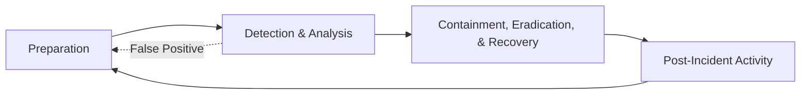

## 1. Preparation
- **Tools**: Ensure EDR (SentinelOne/CrowdStrike), SIEM, and Ticketing systems are integrated via the Integration Hub.
- **Access**: Verify analyst access to the zcrAI portal and third-party consoles.
- **Training**: Regular review of playbooks.

## 2. Identification
- **Triage**: Analyze initial alerts in the `Alerts` queue.
- **Verification**:
    -   Check `affectedUser` and `sourceIp`.
    -   Correlate with Threat Intelligence (VirusTotal/URLScan).
-   **Classification**: Assign Severity (Low, Medium, High, Critical) and Type (Phishing, Malware, etc.).

## 3. Containment
- **Short-term**: Isolate affected host via EDR, block network traffic on Firewall/WAF.
- **Long-term**: Patch vulnerabilities, reset compromised credentials (force logout via Identity Provider).

## 4. Eradication
-   Remove malicious artifacts (files, registry keys).
-   Re-image infected systems if necessary.
-   Verify removal via follow-up scans.

## 5. Recovery
-   Restore systems to production.
-   Monitor for re-infection (24-48 hours).

## 6. Lessons Learned
-   Conduct Post-Incident Review (PIR) within 72 hours.
-   Update Detection Rules and Playbooks based on findings.


---

## File: 05_Incident_Response/Framework.th.md

# กรอบการตอบสนองต่อเหตุการณ์ (Incident Response Framework)

เอกสารนี้ระบุขั้นตอนมาตรฐานในการตอบสนองต่อเหตุการณ์ความปลอดภัย (IR) ของ zcrAI โดยอ้างอิงตามมาตรฐาน NIST SP 800-61

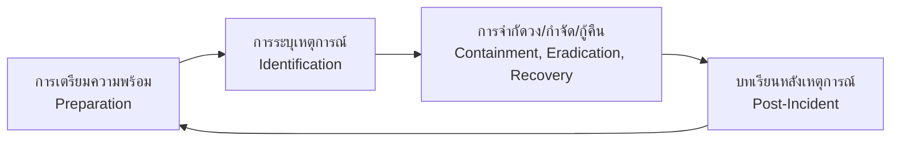

## 1. การเตรียมความพร้อม (Preparation)
-   **เครื่องมือ**: ตรวจสอบการเชื่อมต่อ EDR (SentinelOne/CrowdStrike), SIEM, และ Ticketing system ผ่าน Integration Hub
-   **การเข้าถึง**: ตรวจสอบสิทธิ์ Analyst ในการเข้าถึง zcrAI portal และ Console ของ Third-party
-   **การฝึกอบรม**: ทบทวน Playbook อย่างสม่ำเสมอ

## 2. การระบุเหตุการณ์ (Identification)
-   **การคัดกรอง (Triage)**: วิเคราะห์แจ้งเตือนเบื้องต้นในคิว `Alerts`
-   **การตรวจสอบ (Verification)**:
    -   ตรวจสอบ `affectedUser` และ `sourceIp`
    -   หาความสัมพันธ์กับ Threat Intelligence (VirusTotal/URLScan)
-   **การจำแนกประเภท**: กำหนดความรุนแรง (Severity) และประเภท (Type)

## 3. การจำกัดความเสียหาย (Containment)
-   **ระยะสั้น**: ตัดการเชื่อมต่อเครื่อง (Isolate Host) ผ่าน EDR, บล็อก Traffic บน Firewall/WAF
-   **ระยะยาว**: อุดช่องโหว่, รีเซ็ตรหัสผ่านที่หลุดรั่ว (บังคับ Logout ผ่าน Identity Provider)

## 4. การกำจัดภัยคุกคาม (Eradication)
-   ลบไฟล์หรือ Registry key ที่เป็นอันตราย
-   ติดตั้งระบบปฏิบัติการใหม่ (Re-image) หากจำเป็น
-   ตรวจสอบซ้ำด้วยการสแกน

## 5. การกู้คืนระบบ (Recovery)
-   นำระบบกลับเข้าสู่สถานะ Production
-   เฝ้าระวังการติดเชื้อซ้ำ (24-48 ชั่วโมง)

## 6. บทเรียนที่ได้รับ (Lessons Learned)
-   ทำ Post-Incident Review (PIR) ภายใน 72 ชั่วโมง
-   อัปเดต Detection Rules และ Playbook ตามสิ่งที่ได้เรียนรู้


---

## File: 05_Incident_Response/Playbooks/AWS_EC2_Compromise.en.md

# Incident Response Playbook: AWS EC2 Compromise

**ID**: PB-22
**Severity**: Critical
**TLP**: AMBER

## 1. Detection
-   **Trigger**: GuardDuty finding `CryptoCurrency:EC2/BitcoinTool`.
-   **Trigger**: Abnormal CPU Usage (100% flatline).
-   **Trigger**: Outbound connection to known C2 IP.

## 2. Analysis
-   [ ] **Verify Instance**: Identify Instance ID, Region, and Owner tag.
-   [ ] **Isolate Logic**: Is this a production web server or a dev box?
-   [ ] **Inspect Netflow**: Check VPC Flow Logs. Is it talking to a mining pool?

## 3. Containment
-   [ ] **Snapshot**: Create an EBS Snapshot for forensics.
-   [ ] **Isolate**: Attach a restrictive Security Group (Deny All Inbound/Outbound, allow only Forensics IP).
-   [ ] **Deregister**: Remove from Auto Scaling Group (ASG) and Load Balancer (ELB).

## 4. Eradication
-   [ ] **Terminate**: If stateless, terminate the instance.
-   [ ] **Rebuild**: Redeploy from a clean, patched AMI (Golden Image).
-   [ ] **Patch**: Fix the vulnerability that allowed entry (e.g., SSH open to world).

## 5. Recovery
-   [ ] **Validate**: Scan the new instance for vulnerabilities.
-   [ ] **Restore**: Add back to Load Balancer.

## 6. Root Cause Analysis (VERIS)
-   **Actor**: [External]
-   **Action**: [Malware / Hacking]
-   **Asset**: [EC2 Instance]
-   **Attribute**: [Integrity / Availability]


---

## File: 05_Incident_Response/Playbooks/AWS_EC2_Compromise.th.md

# Incident Response Playbook: เครื่อง AWS EC2 ถูกขุดเหมือง/ควบคุม (AWS EC2 Compromise)

**ID**: PB-22
**ความรุนแรง**: วิกฤต (Critical)
**TLP**: AMBER

## 1. การตรวจจับ (Detection)
-   **Trigger**: GuardDuty แจ้งเตือน `CryptoCurrency:EC2/BitcoinTool`
-   **Trigger**: CPU พุ่งสูงผิดปกติ (100% ตลอดเวลา)
-   **Trigger**: การเชื่อมต่อออกไปยัง C2 Server ที่รู้จัก

## 2. การวิเคราะห์ (Analysis)
-   [ ] **ระบุเครื่อง**: หา Instance ID, Region, และเจ้าของเครื่อง
-   [ ] **แยกแยะ**: เป็น Web Server ขายของ หรือเครื่อง Test?
-   [ ] **ดู Flow**: เช็ค VPC Flow Logs ว่ามีการคุยกับ Mining Pool หรือไม่?

## 3. การจำกัดวง (Containment)
-   [ ] **Snapshot**: สำรองข้อมูล EBS Snapshot ทันทีเพื่อเก็บหลักฐาน
-   [ ] **กักกัน**: เปลี่ยน Security Group ให้ Block All Inbound/Outbound (ยกเว้น IP ของทีม Forensics)
-   [ ] **ตัดออก**: ถอดออกจาก Auto Scaling Group (ASG) และ Load Balancer (ELB)

## 4. การกำจัดภัย (Eradication)
-   [ ] **ทำลาย**: หากเป็นเครื่อง Stateless ให้ Terminate ทิ้งทันที
-   [ ] **สร้างใหม่**: Deploy ใหม่จาก Image ต้นฉบับที่สะอาด (Golden Image)
-   [ ] **อุดช่องโหว่**: แก้ไขจุดที่แฮกเกอร์เข้า (เช่น ปิด Port SSH ที่เปิด Public)

## 5. การกู้คืน (Recovery)
-   [ ] **ตรวจสอบ**: Scan ช่องโหว่เครื่องใหม่ก่อนใช้งานจริง
-   [ ] **คืนสภาพ**: นำกลับเข้า Load Balancer

## 6. วิเคราะห์สาเหตุ (VERIS)
-   **ผู้กระทำ**: [External]
-   **การกระทำ**: [Malware / Hacking]
-   **สินทรัพย์**: [EC2 Instance]
-   **ผลกระทบ**: [Integrity / Availability]


---

## File: 05_Incident_Response/Playbooks/AWS_S3_Compromise.en.md

# Incident Response Playbook: AWS S3 Bucket Compromise

**ID**: PB-21
**Severity**: High
**TLP**: AMBER

## 1. Detection
-   **Trigger**: CloudTrail alerts for `PutBucketPolicy` allowing public access.
-   **Trigger**: GuardDuty finding `S3/PublicAccess`.
-   **Trigger**: Massive data egress from a specific bucket.

## 2. Analysis
-   [ ] **Verify Config**: Check bucket permissions in AWS Console > S3.
    -   Is "Block Public Access" turned off?
    -   Is there a Bucket Policy allowing `"Principal": "*"`?
-   [ ] **Review Access Logs**:
    -   Who modified the policy? (Identify IAM User/Role).
    -   What IP address made the change?
    -   Did any external IP download data? (List objects accessed).

## 3. Containment
-   [ ] **Block Access**: Immediately enable "Block Public Access" at the account or bucket level.
-   [ ] **Quarantine IAM**: Disable the IAM User/Role keys that made the change.
-   [ ] **Tag Resources**: Tag the bucket as `Compromised` for forensic review.

## 4. Eradication
-   [ ] **Revert Policy**: Restore the known-good Bucket Policy (Infrastructure as Code).
-   [ ] **Rotate Credentials**: Rotate Access Keys for the affected IAM user.

## 5. Recovery
-   [ ] **Validate**: Confirm public access is blocked via AWS Config.
-   [ ] **Notify**: Inform Data Privacy Officer if PII was accessed.
-   [ ] **Monitor**: Watch for re-attempted access for 24 hours.

## 6. Root Cause Analysis (VERIS)
-   **Actor**: [External / Internal / Partner]
-   **Action**: [Misconfiguration / Hacking]
-   **Asset**: [S3 Bucket]
-   **Attribute**: [Confidentiality]


---

## File: 05_Incident_Response/Playbooks/AWS_S3_Compromise.th.md

# Incident Response Playbook: เจาะระบบ AWS S3 (AWS S3 Bucket Compromise)

**ID**: PB-21
**ความรุนแรง**: สูง (High)
**TLP**: AMBER

## 1. การตรวจจับ (Detection)
-   **Trigger**: แจ้งเตือน CloudTrail พบ `PutBucketPolicy` ที่อนุญาต Public Access
-   **Trigger**: GuardDuty แจ้งเตือน `S3/PublicAccess`
-   **Trigger**: ปริมาณการดาวน์โหลดข้อมูล (Egress) สูงผิดปกติจาก Bucket

## 2. การวิเคราะห์ (Analysis)
-   [ ] **ตรวจสอบการตั้งค่า**: ดูสิทธิ์ใน AWS Console > S3
    -   "Block Public Access" ถูกปิดอยู่หรือไม่?
    -   Bucket Policy อนุญาต `"Principal": "*"` หรือไม่?
-   [ ] **ตรวจสอบ Log**:
    -   ใครเป็นคนแก้ Policy? (ระบุ IAM User/Role)
    -   IP Address ไหนเป็นคนทำ?
    -   มี IP ภายนอกเข้ามาดาวน์โหลดไฟล์หรือไม่? (ลิสต์รายการไฟล์ที่โดนดูด)

## 3. การจำกัดวง (Containment)
-   [ ] **บล็อกทันที**: เปิด "Block Public Access" ที่ระดับ Account หรือ Bucket ทันที
-   [ ] **ระงับผู้ใช้**: Disable Access Key ของ IAM User/Role ที่ก่อเหตุ
-   [ ] **ติดป้าย**: Tag Bucket ว่า `Compromised` เพื่อรอตรวจสอบ

## 4. การกำจัดภัย (Eradication)
-   [ ] **แก้คืน**: นำ Bucket Policy เดิมที่ปลอดภัยกลับมาใช้ (Revert)
-   [ ] **เปลี่ยนกุญแจ**: Rotate Access Key ของผู้ใช้ที่เกี่ยวข้อง

## 5. การกู้คืน (Recovery)
-   [ ] **ยืนยันผล**: ใช้ AWS Config ตรวจสอบว่า Public Access ถูกปิดแล้ว
-   [ ] **แจ้งเตือน**: แจ้งผูดูแลข้อมูลส่วนบุคคล (DPO) หากมีข้อมูลลูกค้าหลุด
-   [ ] **เฝ้าระวัง**: ดูแลต่อเนื่อง 24 ชม.

## 6. วิเคราะห์สาเหตุ (VERIS)
-   **ผู้กระทำ**: [External / Internal / Partner]
-   **การกระทำ**: [Misconfiguration / Hacking]
-   **สินทรัพย์**: [S3 Bucket]
-   **ผลกระทบ**: [Confidentiality]


---

## File: 05_Incident_Response/Playbooks/Account_Compromise.en.md

# Playbook: Account Compromise / Unauthorized Access

**ID**: PB-05
**Severity**: High/Critical
**Trigger**: User Report ("I didn't log in"), SIEM Alert ("Login from unusual location").

## 1. Analysis (Triage)
-   [ ] **Validate Activity**: Confirm with the user via specific channel (Phone/Slack) if they performed the action.
-   [ ] **Review Logs**: Check for subsequent actions (File Access, Email Forwarding, MFA changes).

## 2. Containment
-   [ ] **Disable Account**: Immediately disable the user account in AD/IdP.
-   [ ] **Revoke Sessions**: Kill all active web tokens/sessions (O365/Okta).
-   [ ] **Isolate Devices**: If an endpoint is involved, isolate it.

## 3. Eradication
-   [ ] **Reset Password**: Change password to a strong, new value.
-   [ ] **Rotate MFA**: Reset MFA tokens/keys.
-   [ ] **Audit Persistency**: Check for new API keys or App Regstrations created by the attacker.

## 4. Recovery
-   [ ] **Enable Account**: Restore access.
-   [ ] **Monitoring**: Add user to "High Risk" monitoring group for 48 hours.


---

## File: 05_Incident_Response/Playbooks/Account_Compromise.th.md

# Playbook: บัญชีถูกประนีประนอม (Account Compromise)

**ID**: PB-05
**ความรุนแรง**: สูง/วิกฤต
**ตัวกระตุ้น**: ผู้ใช้แจ้ง ("ฉันไม่ได้ล็อกอิน"), แจ้งเตือน SIEM ("ล็อกอินจากสถานที่แปลกๆ")

## 1. การวิเคราะห์ (Analysis)
-   [ ] **ยืนยันตัวตน**: ติดต่อผู้ใช้ผ่านช่องทางอื่น (โทร/Slack) ว่าได้ทำรายการนั้นจริงหรือไม่
-   [ ] **ตรวจสอบ Logs**: ดูการกระทำที่ตามมา (เข้าถึงไฟล์, ตั้งค่า Forward อีเมล, เปลี่ยน MFA)

## 2. การจำกัดวง (Containment)
-   [ ] **ปิดบัญชี (Disable)**: ปิดการใช้งานบัญชีใน AD/IdP ทันที
-   [ ] **ยกเลิก Session**: สั่ง Kill session หรือ Token ที่ค้างอยู่ทั้งหมด (O365/Okta)
-   [ ] **แยกอุปกรณ์**: หากเกี่ยวข้องกับเครื่องคอมพิวเตอร์ ให้ทำการ Isolate

## 3. การกำจัด (Eradication)
-   [ ] **เปลี่ยนรหัสผ่าน**: ตั้งรหัสผ่านใหม่ที่คาดเดายาก
-   [ ] **รีเซ็ต MFA**: ล้างค่า MFA เก่าและให้ลงทะเบียนใหม่
-   [ ] **ตรวจสอบ Persistency**: หา API Key หรือ App Registration ใหม่ที่แฮกเกอร์อาจสร้างทิ้งไว้

## 4. การกู้คืน (Recovery)
-   [ ] **เปิดใช้งานบัญชี**: คืนสิทธิ์การใช้งาน
-   [ ] **การเฝ้าระวัง**: เพิ่มชื่อผู้ใช้ในกลุ่ม "High Risk" เพื่อจับตาดูเป็นพิเศษ 48 ชั่วโมง


---

## File: 05_Incident_Response/Playbooks/Azure_AD_Compromise.en.md

# Incident Response Playbook: Azure AD Identity Risk

**ID**: PB-23
**Severity**: High
**TLP**: AMBER

## 1. Detection
-   **Trigger**: Azure AD Identity Protection alerts ("Impossible Travel", "Unfamiliar Sign-in Properties").
-   **Trigger**: Sign-in from Tor Exit Node.
-   **Trigger**: MFA Fatigue (User denies multiple requests, then accepts one).

## 2. Analysis
-   [ ] **Contact User**: Out-of-band verification (Call/Slack). "Did you just login from Nigeria?"
-   [ ] **Review Sign-ins**: Check Azure AD Sign-in Logs. Were there failed attempts before the success?
-   [ ] **Check Device**: Was the device Compliant/Hybrid Joined?

## 3. Containment
-   [ ] **Revoke Sessions**: In Azure Portal > Users > [User] > "Revoke Sessions".
-   [ ] **Reset Password**: Force password reset.
-   [ ] **Disable Account**: If threat is confirmed and active, Block Sign-in.

## 4. Eradication
-   [ ] **Enforce MFA**: Ensure MFA is enabled and Phishing-Resistant (Number Matching).
-   [ ] **Scan Device**: Make user run a full AV scan on their endpoint.

## 5. Recovery
-   [ ] **Unblock**: Restore access after verification.
-   [ ] **Monitor**: Watch account for 48 hours.

## 6. Root Cause Analysis (VERIS)
-   **Actor**: [External]
-   **Action**: [Hacking / Social]
-   **Asset**: [Person / Cloud Identity]
-   **Attribute**: [Integrity / Confidentiality]


---

## File: 05_Incident_Response/Playbooks/Azure_AD_Compromise.th.md

# Incident Response Playbook: บัญชี Azure AD ถูกยึด (Azure AD Identity Risk)

**ID**: PB-23
**ความรุนแรง**: สูง (High)
**TLP**: AMBER

## 1. การตรวจจับ (Detection)
-   **Trigger**: Azure AD Identity Protection แจ้งเตือน ("Impossible Travel", "Unfamiliar Sign-in")
-   **Trigger**: ล็อกอินมาจาก Tor Exit Node
-   **Trigger**: MFA Fatigue (User ปฏิเสธหลายครั้ง แล้วเผลอกดรับหนึ่งครั้ง)

## 2. การวิเคราะห์ (Analysis)
-   [ ] **ติดต่อเจ้าตัว**: โทรหาหรือแชทถาม "คุณได้ล็อกอินจากไนจีเรียหรือไม่?"
-   [ ] **ดูประวัติ**: เช็ค Sign-in Logs มีการเดารหัสผิดก่อนหน้านั้นไหม?
-   [ ] **เช็คอุปกรณ์**: อุปกรณ์ที่ใช้ล็อกอินเป็นของบริษัท (Compliant) หรือไม่?

## 3. การจำกัดวง (Containment)
-   [ ] **ตัด Session**: ไปที่ Azure Portal > Users > [User] > "Revoke Sessions"
-   [ ] **รีเซ็ตรหัส**: บังคับ Reset Password ทันที
-   [ ] **ระงับบัญชี**: ถ้ายังไม่แน่ใจ ให้กด "Block Sign-in" ไว้ก่อน

## 4. การกำจัดภัย (Eradication)
-   [ ] **บังคับ MFA**: ตรวจสอบว่า MFA เปิดอยู่ และใช้แบบ Number Matching (กันกดพลาด)
-   [ ] **สแกนเครื่อง**: ให้ User สแกนไวรัสในเครื่องตัวเอง

## 5. การกู้คืน (Recovery)
-   [ ] **ปลดบล็อก**: คืนสิทธิ์การใช้งานเมื่อปลอดภัย
-   [ ] **เฝ้าระวัง**: จับตาดูบัญชีนี้เป็นพิเศษ 48 ชม.

## 6. วิเคราะห์สาเหตุ (VERIS)
-   **ผู้กระทำ**: [External]
-   **การกระทำ**: [Hacking / Social]
-   **สินทรัพย์**: [Person / Cloud Identity]
-   **ผลกระทบ**: [Integrity / Confidentiality]


---

## File: 05_Incident_Response/Playbooks/BEC.en.md

# Playbook: Business Email Compromise (BEC)

**ID**: PB-17
**Severity**: High
**Trigger**: User Report ("Suspicious Invoice"), Mail Filter ("Forwarding Rule created").

## 1. Analysis (Triage)
-   **Header Analysis**: Check `Return-Path`, `Reply-To`, and `SPF/DKIM` results.
-   **Rule Check**: Look for Inbox Rules named "." or "Move to RSS Feeds" (Common hiding tactic).
-   **Login Logs**: Check for successful logins from foreign countries prior to the email.

## 2. Containment
-   **Reset Password**: Change the compromise user's password.
-   **Revoke Tokens**: Revoke all OAuth tokens (O365).
-   **Remove Rules**: Delete malicious forwarding/inbox rules.

## 3. Eradication
-   **Search Internal**: Search all mailboxes for the same phishing subject to see spread.
-   **Block Sender**: Block the sender domain/IP at the gateway.

## 4. Recovery
-   **Notify Finance**: If the email involved payments, immediately stop wire transfers.


---

## File: 05_Incident_Response/Playbooks/BEC.th.md

# Playbook: การหลอกลวงทางอีเมลธุรกิจ (Business Email Compromise - BEC)

**ID**: PB-17
**ความรุนแรง**: สูง
**ตัวกระตุ้น**: ผู้ใช้แจ้ง ("Invoice น่าสงสัย"), Mail Filter ("สร้างกฎ Forwarding")

## 1. การวิเคราะห์ (Analysis)
-   **วิเคราะห์ Header**: ตรวจสอบ `Return-Path`, `Reply-To`, และผล `SPF/DKIM`
-   **ตรวจสอบ Rule**: มองหากฎ Inbox ที่ชื่อแปลกๆ เช่น "." หรือ "Move to RSS Feeds" (เทคนิคซ่อนอีเมล)
-   **ประวัติการล็อกอิน**: มีการล็อกอินจากต่างประเทศก่อนส่งเมลหรือไม่?

## 2. การจำกัดวง (Containment)
-   **เปลี่ยนรหัสผ่าน**: รีเซ็ตรหัสผ่านผู้ใช้ที่โดนแฮก
-   **Revoke Tokens**: ยกเลิก OAuth token ทั้งหมด (O365)
-   **ลบกฎ**: ลบกฎ Forwarding หรือ Inbox rule ที่คนร้ายสร้างไว้

## 3. การกำจัด (Eradication)
-   **ค้นหาภายใน**: ค้นหาอีเมลในตู้จดหมายพนักงานคนอื่นที่มีหัวข้อเดียวกัน
-   **บล็อกผู้ส่ง**: บล็อก Domain/IP ผู้ส่งที่ Gateway

## 4. การกู้คืน (Recovery)
-   **แจ้งฝ่ายการเงิน**: หากอีเมลเกี่ยวข้องกับการโอนเงิน ให้ระงับธุรกรรมทันที


---

## File: 05_Incident_Response/Playbooks/Brute_Force.en.md

# Playbook: Brute Force / Password Spray

**ID**: PB-04
**Severity**: Low/Medium
**Trigger**: SIEM Alert ("Multiple Failed Logins"), IAM Logs.

## 1. Analysis (Triage)
-   [ ] **Check Source IP**: Is the IP internal or external? Is it a known VPN?
-   [ ] **Check User**: Is the targeted account valid? Is it a VIP/Admin?
-   [ ] **Volume**: How many attempts? (e.g., > 10 failures in 1 min).
-   [ ] **Outcome**: Was there a *Success* log after the failures? (Critical Indicator).

## 2. Containment
-   [ ] **Block IP**: Add Source IP to Firewall/WAF blocklist.
-   [ ] **Lock Account**: If the attack is successfully guessing, lock the AD account temporarily.

## 3. Remediation
-   [ ] **Reset Password**: Force password reset if compromise is suspected.
-   [ ] **Enforce MFA**: Ensure Multi-Factor Authentication is enabled for the account.

## 4. Recovery
-   [ ] **Unlock Account**: Restore access to the legitimate user after verification.


---

## File: 05_Incident_Response/Playbooks/Brute_Force.th.md

# Playbook: การโจมตีสุ่มรหัสผ่าน (Brute Force / Password Spray)

**ID**: PB-04
**ความรุนแรง**: ต่ำ/ปานกลาง
**ตัวกระตุ้น**: แจ้งเตือน SIEM ("ล็อกอินล้มเหลวหลายครั้ง"), IAM Logs

## 1. การวิเคราะห์ (Analysis)
-   [ ] **ตรวจสอบ IP ต้นทาง**: ภายในหรือภายนอก? เป็น VPN ที่รู้จักหรือไม่?
-   [ ] **ตรวจสอบผู้ใช้**: บัญชีที่ถูกโจมตีมีอยู่จริงหรือไม่? เป็นผู้บริหาร/แอดมินหรือไม่?
-   [ ] **ปริมาณ**: จำนวนครั้งที่ผิดพลาด? (เช่น > 10 ครั้งใน 1 นาที)
-   [ ] **ผลลัพธ์**: มี Log *สำเร็จ* หลังจากที่ผิดพลาดหรือไม่? (ถ้ามี คือวิกฤต)

## 2. การจำกัดวง (Containment)
-   [ ] **บล็อก IP**: เพิ่ม IP ต้นทางลงใน Firewall/WAF blocklist
-   [ ] **ล็อกบัญชีชั่วคราว**: หากการโจมตีมีความเสี่ยงสูง ให้ล็อกบัญชี AD ชั่วคราว

## 3. การแก้ไข (Remediation)
-   [ ] **รีเซ็ตรหัสผ่าน**: บังคับเปลี่ยนรหัสผ่านหากสงสัยว่ารหัสหลุด
-   [ ] **บังคับใช้ MFA**: ตรวจสอบว่าบัญชีได้เปิดใช้งาน Multi-Factor Authentication แล้ว

## 4. การกู้คืน (Recovery)
-   [ ] **ปลดล็อกบัญชี**: คืนสิทธิ์การใช้งานให้เจ้าของบัญชีหลังยืนยันตัวตน


---

## File: 05_Incident_Response/Playbooks/C2_Communication.en.md

# Playbook: Command & Control (C2) Traffic

**ID**: PB-13
**Severity**: High
**Trigger**: Network/NDR Alert ("Beaconing detected", "Connection to known C2 IP").

## 1. Analysis (Triage)
-   **Frequency**: Is it beaconing? (Regular interval requests e.g., every 5 mins).
-   **Domain Reputation**: Check domain age and category (Newly Registered Domain?).
-   **Process**: Which process is making the connection? (powershell.exe vs. chrome.exe).

## 2. Containment
-   **Block IP/Domain**: Block at Perimeter Firewall/DNS Sinkhole.
-   **Isolate Host**: Isolate the machine initiating the connection.

## 3. Eradication
-   **Process Kill**: Stop the process making the call.
-   **Memory Analysis**: If process is injected (e.g., in svchost.exe), a restart might clear it, but forensics is needed first.

## 4. Recovery
-   **Threat Intel**: Submit the C2 IOC to Threat Intelligence Platform to update all tools.


---

## File: 05_Incident_Response/Playbooks/C2_Communication.th.md

# Playbook: การสื่อสาร Command & Control (C2)

**ID**: PB-13
**ความรุนแรง**: สูง
**ตัวกระตุ้น**: แจ้งเตือน Network/NDR ("Beaconing detected", "เชื่อมต่อไปยัง Known C2 IP")

## 1. การวิเคราะห์ (Analysis)
-   **ความถี่ (Beaconing)**: มีจังหวะเวลาสม่ำเสมอหรือไม่? (เช่น ทุก 5 นาที)
-   **ชื่อโดเมน**: ตรวจสอบอายุโดเมน (เพิ่งจดทะเบียนใหม่?)
-   **Process**: โปรแกรมอะไรเป็นตัวเชื่อมต่อออกไป? (powershell.exe vs chrome.exe)

## 2. การจำกัดวง (Containment)
-   **บล็อก IP/Domain**: บล็อกที่ Firewall หรือทำ DNS Sinkhole
-   **แยกเครื่อง**: ตัดการเชื่อมต่อเครื่องที่พยายามติดต่อออกไป

## 3. การกำจัด (Eradication)
-   **หยุด Process**: Kill process ที่ทำการเชื่อมต่อ
-   **วิเคราะห์ Memory**: หากเป็น Process injection (เช่น แฝงใน svchost.exe) การรีสตาร์ทอาจหาย แต่ควรเก็บหลักฐานก่อน

## 4. การกู้คืน (Recovery)
-   **Threat Intel**: ส่งข้อมูล C2 IP/Domain ไปยังระบบ Threat Intelligence เพื่ออัปเดตเครื่องมือป้องกันอื่นๆ


---

## File: 05_Incident_Response/Playbooks/Cloud_IAM.en.md

# Playbook: Cloud IAM Anomaly

**ID**: PB-16
**Severity**: High
**Trigger**: CloudTrail/Azure Monitor ("Root/GlobalAdmin Login", "New IAM User created").

## 1. Analysis (Triage)
-   **Root Usage**: Was the Root/Global Admin account used? (Should be rare).
-   **API Call**: Was it a console login or a programmatic API call?
-   **Location**: Is the IP consistent with the admin's location?

## 2. Containment
-   **Revoke Sessions**: Invalidate current Cloud sessions.
-   **Disable User**: Disable the Cloud IAM user.
-   **Rotate Keys**: Rotate Access Keys (AWS) or Client Secrets (Azure).

## 3. Eradication
-   **Review permissions**: Check if any permission was added to the user.
-   **Check Resources**: Did they spin up new VMs (Crypto mining) or create S3 buckets?

## 4. Recovery
-   **MFA**: Enforce hardware MFA for Root/Global Admins.


---

## File: 05_Incident_Response/Playbooks/Cloud_IAM.th.md

# Playbook: ความผิดปกติใน Cloud IAM (Cloud IAM Anomaly)

**ID**: PB-16
**ความรุนแรง**: สูง
**ตัวกระตุ้น**: CloudTrail/Azure Monitor ("Root/GlobalAdmin Login", "สร้าง IAM User ใหม่")

## 1. การวิเคราะห์ (Analysis)
-   **Root Usage**: มีการใช้บัญชี Root หรือ Global Admin หรือไม่? (ควรใช้น้อยมาก)
-   **API Call**: เป็นการล็อกอินผ่านหน้าเว็บ หรือยิง API?
-   **ตำแหน่ง**: IP ที่ใช้ตรงกับที่อยู่ของ Admin คนนั้นหรือไม่?

## 2. การจำกัดวง (Containment)
-   **Revoke Sessions**: ยกเลิก Session ที่ค้างอยู่ทั้งหมด
-   **ปิดบัญชี**: Disable บัญชี Cloud IAM นั้น
-   **หมุนเวียนกุญแจ**: เปลี่ยน Access Keys (AWS) หรือ Client Secrets (Azure) ใหม่

## 3. การกำจัด (Eradication)
-   **ตรวจสอบสิทธิ์**: ดูว่ามีการแอบเพิ่มสิทธิ์อะไรให้ตัวเองหรือไม่
-   **ตรวจสอบทรัพยากร**: มีการสร้าง VM ใหม่ (ขุดเหรียญ) หรือสร้าง Storage Bucket ใหม่หรือไม่?

## 4. การกู้คืน (Recovery)
-   **MFA**: บังคับใช้ Hardware MFA สำหรับบัญชีระดับ Root/Global Admin


---

## File: 05_Incident_Response/Playbooks/DDoS_Attack.en.md

# Playbook: Denial of Service (DDoS)

**ID**: PB-09
**Severity**: High
**Trigger**: Monitoring Alert ("High CPU/Bandwidth"), WAF Logs ("Flood Detected").

## 1. Analysis (Triage)
-   **Confirm Attack**: Distinguish between legitimate traffic spike (Marketing campaign) vs. Attack.
-   **Identify Type**: Volumetric (UDP/ICMP Flood) or Application (HTTP GET/POST Flood).
-   **Target**: What specific IP or URL is being hit?

## 2. Containment
-   **Activate Mitigation**: Enable "Under Attack" mode on WAF/Cloudflare/Akamai.
-   **Rate Limiting**: Aggressively rate-limit by Geo-location or IP reputation.
-   **Blackhole**: If On-prem, contact ISP to blackhole traffic if pipe is saturated.

## 3. Recovery
-   **Monitor Stability**: Watch traffic graphs closely as mitigation rules apply.
-   **Scale Up**: Add more web server instances (Auto-scaling) if possible to handle load.


---

## File: 05_Incident_Response/Playbooks/DDoS_Attack.th.md

# Playbook: การโจมตีสภาพความพร้อมใช้งาน (DDoS)

**ID**: PB-09
**ความรุนแรง**: สูง
**ตัวกระตุ้น**: แจ้งเตือน Monitoring ("High CPU/Bandwidth"), WAF Logs ("พบการ Flood")

## 1. การวิเคราะห์ (Analysis)
-   **ยืนยันการโจมตี**: แยกแยะระหว่างคนเข้าใช้งานจริง (เช่น แคมเปญการตลาด) กับการโจมตี
-   **ระบุประเภท**: ปริมาณมหาศาล (UDP/ICMP Flood) หรือ โจมตีแอปพลิเคชัน (HTTP GET/POST Flood)
-   **เป้าหมาย**: IP หรือ URL ใดที่ถูกโจมตี?

## 2. การจำกัดวง (Containment)
-   **เปิดโหมดป้องกัน**: เปิด "Under Attack" mode บน WAF/Cloudflare/Akamai
-   **Rate Limiting**: จำกัดการเชื่อมต่อตามประเทศ (Geo-location) หรือความน่าเชื่อถือของ IP
-   **Blackhole**: หากเป็น On-prem และท่อเต็ม ให้ติดต่อ ISP เพื่อทำ Blackhole traffic

## 3. การกู้คืน (Recovery)
-   **เฝ้าระวัง**: ดูหน้ากราฟ Traffic อย่างใกล้ชิดเมื่อเปิดใช้งานกฎป้องกัน
-   **ขยายระบบ**: เพิ่มจำนวน Server (Auto-scaling) เพื่อรองรับโหลดถ้าทำได้


---

## File: 05_Incident_Response/Playbooks/Data_Exfiltration.en.md

# Playbook: Data Exfiltration

**ID**: PB-08
**Severity**: Critical
**Trigger**: DLP Alert, SIEM ("Large Upload to Unknown IP").

## 1. Analysis (Triage)
-   **Verify Volume**: Is the data transfer size anomalous for this user/server?
-   **Check Destination**: Is the IP/Domain trusted (e.g., Corporate OneDrive) or unknown?
-   **Inspect Content**: If possible, check DLP logs for file names or classifications (PII/Confidential).

## 2. Containment
-   **Block Connection**: Block the destination IP/Domain at the Firewall/Proxy immediately.
-   **Isolate Source**: Disconnect the source machine to stop further upload.
-   **Disable User**: If a user account is involved, disable it.

## 3. Eradication
-   **Remove Staging**: Delete any RAR/ZIP files prepared for exfiltration.
-   **Scan for Persistence**: Ensure no backdoors remain.

## 4. Recovery
-   **Legal Review**: Consult Legal/Privacy team if PII was leaked.
-   **Damage Assessment**: List exactly what files were lost.


---

## File: 05_Incident_Response/Playbooks/Data_Exfiltration.th.md

# Playbook: การรั่วไหลของข้อมูล (Data Exfiltration)

**ID**: PB-08
**ความรุนแรง**: วิกฤต
**ตัวกระตุ้น**: แจ้งเตือน DLP, SIEM ("การอัปโหลดขนาดใหญ่ไปยัง IP ที่ไม่รู้จัก")

## 1. การวิเคราะห์ (Analysis)
-   **ตรวจสอบปริมาณ**: ขนาดข้อมูลที่ส่งออกผิดปกติสำหรับผู้ใช้/เซิร์ฟเวอร์นี้หรือไม่?
-   **ตรวจสอบปลายทาง**: IP/Domain เป็นที่น่าเชื่อถือ (เช่น OneDrive องค์กร) หรือไม่?
-   **ตรวจสอบเนื้อหา**: ดู DLP Log ว่าไฟล์ประเภทใดถูกส่งออก (PII/ความลับ)

## 2. การจำกัดวง (Containment)
-   **บล็อกการเชื่อมต่อ**: บล็อก IP/Domain ปลายทางที่ Firewall/Proxy ทันที
-   **แยกเครื่อง**: ตัดการเชื่อมต่อเครื่องต้นทางเพื่อหยุดการอัปโหลด
-   **ปิดบัญชี**: หากเกี่ยวข้องกับบัญชีผู้ใช้ใด ให้ระงับการใช้งานทันที

## 3. การกำจัด (Eradication)
-   **ลบไฟล์ Staging**: ลบไฟล์ RAR/ZIP ที่เตรียมไว้สำหรับส่งออก
-   **สแกนหา Backdoor**: ตรวจสอบว่าไม่มีช่องทางอื่นหลงเหลืออยู่

## 4. การกู้คืน (Recovery)
-   **ฝ่ายกฎหมาย**: ปรึกษาทีมกฎหมายหากมีข้อมูล PII รั่วไหล
-   **ประเมินความเสียหาย**: ลิสต์รายการไฟล์ที่สูญหายทั้งหมด


---

## File: 05_Incident_Response/Playbooks/Exploit.en.md

# Playbook: Vulnerability Exploitation

**ID**: PB-18
**Severity**: High/Critical
**Trigger**: IPS Alert ("Exploit Attempt"), WAF Log ("CVE-XXXX detected").

## 1. Analysis (Triage)
-   **Confirm CVE**: Which vulnerability is being targeted? (e.g., Log4Shell, BlueKeep).
-   **Check Asset**: Is the destination Vulnerable? (Check CMDB/Vuln Scan results).
-   **Response**: Did the server respond heavily? (Reverse Shell connection?).

## 2. Containment
-   **Block IP**: Block the attacker's IP.
-   **Isolate Asset**: If exploitation was successful, isolate the server.
-   **Virtual Patch**: Apply WAF/IPS signature to block the exploit payload.

## 3. Eradication
-   **Patch**: Apply the official security patch from the vendor.
-   **Configuration**: Disable the vulnerable service/port if patching is not possible immediately.

## 4. Recovery
-   **Verify Patch**: Run a vulnerability scan to confirm the hole is closed.


---

## File: 05_Incident_Response/Playbooks/Exploit.th.md

# Playbook: การโจมตีผ่านช่องโหว่ (Vulnerability Exploitation)

**ID**: PB-18
**ความรุนแรง**: สูง/วิกฤต
**ตัวกระตุ้น**: IPS Alert ("Exploit Attempt"), WAF Log ("พบ CVE-XXXX")

## 1. การวิเคราะห์ (Analysis)
-   **ยืนยัน CVE**: ช่องโหว่ไหนที่กำลังถูกโจมตี? (เช่น Log4Shell, BlueKeep)
-   **ตรวจสอบเครื่อง**: เครื่องเป้าหมายมีช่องโหว่นั้นหรือไม่? (เช็คผล Vuln Scan)
-   **ผลลัพธ์**: Server มีการตอบสนองผิดปกติหรือไม่? (Reverse Shell?)

## 2. การจำกัดวง (Containment)
-   **บล็อก IP**: บล็อก IP ผู้โจมตี
-   **แยกเครื่อง**: หากถูกเจาะสำเร็จ ให้ทำการ Isolate เครื่องทันที
-   **Virtual Patch**: ใช้ WAF/IPS บล็อก Payload ของช่องโหว่นั้น

## 3. การกำจัด (Eradication)
-   **Patch**: ติดตั้ง Patch ความปลอดภัยจากผู้ผลิต
-   **Config**: ปิด Service/Port ที่มีปัญหาหากยัง Patch ไม่ได้ทันที

## 4. การกู้คืน (Recovery)
-   **ยืนยัน Patch**: สแกนช่องโหว่ซ้ำเพื่อตรวจสอบว่าได้รับการแก้ไขแล้ว


---

## File: 05_Incident_Response/Playbooks/Impossible_Travel.en.md

# Playbook: Impossible Travel

**ID**: PB-06
**Severity**: Medium
**Trigger**: SIEM Alert ("Login from two distant locations within short time").

## 1. Analysis (Triage)
-   [ ] **Check Locations**: Are the countries/cities logical? (e.g., US -> China in 10 mins).
-   [ ] **Check VPN**: Is the user on a corporate VPN that routes traffic?
-   [ ] **Check User Context**: Is the user traveling? Did they report this?

## 2. Containment
-   [ ] **Terminate Sessions**: Kill active sessions for the user.
-   [ ] **Reset Password**: Force a password reset.
-   [ ] **Enforce MFA**: Require MFA for re-authentication.

## 3. Remediation
-   [ ] **Block IP**: If one of the IPs is known malicious, block it.
-   [ ] **User Education**: Remind user about safe remote access.

## 4. Recovery
-   [ ] **Monitor Account**: Watch for further anomalies for 24 hours.


---

## File: 05_Incident_Response/Playbooks/Impossible_Travel.th.md

# Playbook: การเดินทางที่เป็นไปไม่ได้ (Impossible Travel)

**ID**: PB-06
**ความรุนแรง**: ปานกลาง
**ตัวกระตุ้น**: แจ้งเตือน SIEM ("ล็อกอินจากสองสถานที่ห่างไกลในเวลาสั้นๆ")

## 1. การวิเคราะห์ (Analysis)
-   [ ] **ตรวจสอบสถานที่**: ประเทศ/เมือง มีเหตุผลหรือไม่? (เช่น ไทย -> จีน ภายใน 10 นาที)
-   [ ] **ตรวจสอบ VPN**: ผู้ใช้ต่อ VPN องค์กรที่อาจเปลี่ยน IP หรือไม่?
-   [ ] **บริบทผู้ใช้**: ผู้ใช้อยู่ระหว่างการเดินทางหรือไม่? มีการแจ้งล่วงหน้าหรือไม่?

## 2. การจำกัดวง (Containment)
-   [ ] **ตัดการเชื่อมต่อ**: สั่ง Kill session ทั้งหมดของผู้ใช้
-   [ ] **เปลี่ยนรหัสผ่าน**: บังคับรีเซ็ตรหัสผ่าน
-   [ ] **บังคับ MFA**: ต้องใช้ Multi-Factor Authentication ในการล็อกอินใหม่

## 3. การแก้ไข (Remediation)
-   [ ] **บล็อก IP**: ถ้า IP ใด IP หนึ่งดูเป็นอันตราย ให้บล็อกทันที
-   [ ] **ให้ความรู้**: เตือนผู้ใช้เรื่องความปลอดภัยในการเข้าถึงระบบจากภายนอก

## 4. การกู้คืน (Recovery)
-   [ ] **เฝ้าระวัง**: จับตาดูบัญชีนี้เป็นพิเศษ 24 ชั่วโมง


---

## File: 05_Incident_Response/Playbooks/Insider_Threat.en.md

# Playbook: Insider Threat

**ID**: PB-14
**Severity**: High
**Trigger**: UEBA Alert (Abnormal Access Hours), Data Access Logs (Bulk File Copy).

## 1. Analysis (Triage)
-   **Context**: Is the user leaving the company (Notice period)?
-   **Baseline**: Is this normal behavior for their role (e.g., Backup Administrator)?
-   **HR Check**: Check employment status.

## 2. Containment
-   **Suspend Access**: Temporarily suspend computer and application access.
-   **Physical Security**: If onsite, notify physical security/HR to escort.

## 3. Investigation (Forensic)
-   **Device Seizure**: Secure the laptop/mobile for forensic imaging.
-   **Email Review**: Check for data sent to personal email.
-   **USB History**: Check for recent USB storage connections.

## 4. Recovery
-   **Legal Action**: HR and Legal to determine employment termination or legal proceedings.


---

## File: 05_Incident_Response/Playbooks/Insider_Threat.th.md

# Playbook: ภัยคุกคามจากภายใน (Insider Threat)

**ID**: PB-14
**ความรุนแรง**: สูง
**ตัวกระตุ้น**: UEBA Alert (เวลาเข้างานผิดปกติ), Data Access Logs (การก๊อปปี้ไฟล์จำนวนมาก)

## 1. การวิเคราะห์ (Analysis)
-   **บริบท**: พนักงานคนนี้กำลังจะลาออกหรือไม่? (อยู่ในช่วง Notice period)
-   **Baseline**: เป็นพฤติกรรมปกติของตำแหน่งงานหรือไม่? (เช่น Admin ทำ Backup)
-   **HR Check**: ตรวจสอบสถานะการจ้างงาน

## 2. การจำกัดวง (Containment)
-   **ระงับสิทธิ์**: ระงับการเข้าถึงคอมพิวเตอร์และแอปพลิเคชันทั้งหมดชั่วคราว
-   **ความปลอดภัยทางกายภาพ**: หากอยู่ที่ออฟฟิศ แจ้งรปภ./HR ให้เชิญตัว

## 3. การสืบสวน (Forensic)
-   **ยึดอุปกรณ์**: เก็บรักษา Laptop/มือถือ เพื่อทำ Forensic Image
-   **ตรวจสอบอีเมล**: เช็คว่ามีการส่งข้อมูลออกไปยังอีเมลส่วนตัวหรือไม่
-   **ประวัติ USB**: เช็คการเสียบ Drive เก็บข้อมูลล่าสุด

## 4. การกู้คืน (Recovery)
-   **กฎหมาย**: HR และฝ่ายกฎหมายพิจารณาเลิกจ้างหรือดำเนินคดี


---

## File: 05_Incident_Response/Playbooks/Lateral_Movement.en.md

# Playbook: Lateral Movement

**ID**: PB-12
**Severity**: High
**Trigger**: EDR/SIEM Alert ("Remote Service Creation", "SMB/RDP to multiple hosts").

## 1. Analysis (Triage)
-   **Source**: Identify Patient Zero (First infected host).
-   **Method**: How are they moving? (PsExec, WMI, RDP, WinRM).
-   **Credentials**: Which user account is being leveraged?

## 2. Containment
-   **Block Account**: Disable the compromised account used for movement.
-   **Isolate Source**: Cut off the source machine.
-   **Block Protocol**: Temporarily block SMB/RDP port 445/3389 at the firewall for the segment.

## 3. Eradication
-   **Trace Forward**: Identify ALL hosts touched by the source machine.
-   **Scan/Clean**: Run scans on all touched hosts.

## 4. Recovery
-   **Segmentation**: Review network segmentation. Workstations should generally not talk to other workstations (Client-to-Client communication).


---

## File: 05_Incident_Response/Playbooks/Lateral_Movement.th.md

# Playbook: การเคลื่อนที่ภายในเครือข่าย (Lateral Movement)

**ID**: PB-12
**ความรุนแรง**: สูง
**ตัวกระตุ้น**: แจ้งเตือน EDR/SIEM ("Remote Service Creation", "SMB/RDP ไปยังหลายเครื่อง")

## 1. การวิเคราะห์ (Analysis)
-   **ต้นตอ (Source)**: หา Patient Zero (เครื่องแรกที่ติดเชื้อ)
-   **วิธีการ**: แฮกเกอร์ใช้วิธีไหน? (PsExec, WMI, RDP, WinRM)
-   **บัญชีผู้ใช้**: บัญชีไหนที่ถูกนำมาใช้?

## 2. การจำกัดวง (Containment)
-   **ปิดบัญชี**: Disable บัญชีที่ถูกแฮก
-   **แยกเครื่อง**: ตัดการเชื่อมต่อเครื่องต้นทาง
-   **บล็อกพอร์ต**: หากจำเป็น ให้บล็อก SMB (445) หรือ RDP (3389) ใน Zone นั้นชั่วคราว

## 3. การกำจัด (Eradication)
-   **ไล่รอย**: หาเครื่องปลายทางทั้งหมดที่เครื่องต้นทางเชื่อมต่อไปถึง
-   **สแกน/ล้าง**: ตรวจสอบและสแกนทุกเครื่องที่ถูกสัมผัส

## 4. การกู้คืน (Recovery)
-   **Segmentation**: ทบทวนการแบ่งโซนเครือข่าย โดยปกติ Workstation ไม่ควรคุยกันเองได้ (Block Client-to-Client)


---

## File: 05_Incident_Response/Playbooks/Log_Clearing.en.md

# Playbook: Audit Log Clearing (Defense Evasion)

**ID**: PB-20
**Severity**: Critical
**Trigger**: SIEM Alert ("Event Log Cleared", "Audit Policy Disabled").

## 1. Analysis (Triage)
-   **Event ID**: Windows Security Log ID 1102 ("The audit log was cleared").
-   **User**: Who cleared it? Was it System or a User?
-   **Correlation**: What happened *immediately before* or *after* the clearing? (Often used to hide malware installation).

## 2. Containment
-   **Isolate Host**: Assume the host is fully compromised. Isolate immediately.
-   **Reset Admin**: Reset the password of the account used to clear logs.

## 3. Investigation
-   **Recover Logs**: Check if logs were forwarded to SIEM *before* they were cleared locally. (This is why SIEM is crucial).
-   **Forensics**: Analyze disk artifacts ($MFT) to see what files were accessed during the "blind" spot.

## 4. Recovery
-   **Re-image**: A system with cleared logs cannot be trusted. Re-image is recommended.


---

## File: 05_Incident_Response/Playbooks/Log_Clearing.th.md

# Playbook: การลบ Log เพื่ออำพรางตัว (Audit Log Clearing)

**ID**: PB-20
**ความรุนแรง**: วิกฤต
**ตัวกระตุ้น**: แจ้งเตือน SIEM ("Event Log Cleared", "Audit Policy Disabled")

## 1. การวิเคราะห์ (Analysis)
-   **Event ID**: Windows Security Log ID 1102 ("The audit log was cleared")
-   **ผู้กระทำ**: ใครเป็นคนลบ? System หรือ User?
-   **ความเชื่อมโยง**: เกิดอะไรขึ้น *ก่อน* หรือ *หลัง* การลบ? (มักทำเพื่อซ่อนการติดตั้งมัลแวร์)

## 2. การจำกัดวง (Containment)
-   **แยกเครื่อง**: ถือว่าเครื่องนั้นถูกยึดโดยสมบูรณ์ ให้ Isolate ทันที
-   **Reset Admin**: เปลี่ยนรหัสผ่านของบัญชีที่ใช้ลบ Log

## 3. การสืบสวน (Investigation)
-   **กู้คืน Log**: ตรวจสอบ Log บน SIEM (Log ส่วนใหญ่มักถูกส่งออกไปแล้วก่อนจะโดนลบที่เครื่องปลายทาง)
-   **นิติวิทยาศาสตร์**: ตรวจสอบ Disk artifacts ($MFT) เพื่อดูการเปลี่ยนแปลงไฟล์ในช่วงเวลาที่ Log หายไป

## 4. การกู้คืน (Recovery)
-   **ลงระบบใหม่ (Re-image)**: เครื่องที่ถูกลบ Log ถือว่าไม่น่าเชื่อถืออีกต่อไป ควรล้างเครื่องลงใหม่


---

## File: 05_Incident_Response/Playbooks/Lost_Device.en.md

# Playbook: Lost/Stolen Device

**ID**: PB-19
**Severity**: Medium/High
**Trigger**: User Report ("I left my laptop at the airport"), MDM Alert ("Device Offline > 30 Days").

## 1. Analysis (Triage)
-   **Device Type**: Laptop (Full Disk Encryption?) or Mobile (Passcode?)
-   **Data Sensitivity**: What data was on the device? (Source code, customer lists).
-   **Last Online**: When did it last check in with MDM?

## 2. Containment
-   **Remote Wipe**: Send a "Wipe" command via MDM (Intune/Jamf).
-   **Revoke Certificates**: Revoke VPN/Wifi certificates issued to that device.
-   **Reset Password**: Reset the user's domain password immediately to prevent access from cached credentials.

## 3. Recovery
-   **Replacement**: IT to provision a new device for the user.
-   **Monitoring**: Watch for login attempts from the old device's serial number.


---

## File: 05_Incident_Response/Playbooks/Lost_Device.th.md

# Playbook: อุปกรณ์สูญหายหรือถูกขโมย (Lost/Stolen Device)

**ID**: PB-19
**ความรุนแรง**: ปานกลาง/สูง
**ตัวกระตุ้น**: ผู้ใช้แจ้ง ("ลืมโน้ตบุ๊กไว้ที่สนามบิน"), แจ้งเตือน MDM ("อุปกรณ์ Offline นานกว่า 30 วัน")

## 1. การวิเคราะห์ (Analysis)
-   **ประเภทอุปกรณ์**: โน้ตบุ๊ก (เข้ารหัสทั้งลูก?) หรือ มือถือ (มีรหัสผ่าน?)
-   **ข้อมูลภายใน**: มีข้อมูลสำคัญอะไรบ้าง? (Source code, รายชื่อลูกค้า)
-   **ออนไลน์ล่าสุด**: เชื่อมต่อ MDM ครั้งสุดท้ายเมื่อไหร่?

## 2. การจำกัดวง (Containment)
-   **ล้างเครื่องระยะไกล**: ส่งคำสั่ง "Wipe" ผ่านระบบ MDM (Intune/Jamf)
-   **ยกเลิกใบรับรอง**: เพิกถอน Certificate ของ VPN/Wi-Fi ประจำเครื่องนั้น
-   **เปลี่ยนรหัสผ่าน**: รีเซ็ตรหัสผ่านผู้ใช้ทันที เพื่อป้องกันการเข้าถึงจาก Credential ที่ค้างในเครื่อง

## 3. การกู้คืน (Recovery)
-   **จัดหาเครื่องใหม่**: IT เบิกเครื่องใหม่ให้ผู้ใช้งาน
-   **เฝ้าระวัง**: จับตาดูการพยายามล็อกอินจาก Serial number ของเครื่องเก่า


---

## File: 05_Incident_Response/Playbooks/Malware_Infection.en.md

# Playbook: Malware Infection

**ID**: PB-03
**Severity**: Medium/High
**Trigger**: EDR alert ("Malicious File Detected"), AV logs, User Report.

## 1. Analysis (Triage)
-   [ ] **Verify Hash**: Check file hash on VirusTotal/ThreatFox.
-   [ ] **Check Path**: Is it in a temp folder (`%TEMP%`, `Downloads`) or System32?
-   [ ] **Identify User**: Who executed the file?

## 2. Containment
-   [ ] **Isolate Host**: Use EDR to isolate the machine from the network.
-   [ ] **Kill Process**: Terminate the malicious process ID.
-   [ ] **Block Hash**: Add file hash to EDR blacklist.

## 3. Eradication
-   [ ] **Delete File**: Remove the artifact and persistence mechanisms (Registry Run keys, Scheduled Tasks).
-   [ ] **Full Scan**: Run a full system scan.

## 4. Recovery
-   [ ] **Un-isolate**: Reconnect host after verifying clean status.
-   [ ] **Password Reset**: If malware was an Infostealer, reset user credentials.


---

## File: 05_Incident_Response/Playbooks/Malware_Infection.th.md

# Playbook: การติดมัลแวร์ (Malware Infection)

**ID**: PB-03
**ความรุนแรง**: ปานกลาง/สูง
**ตัวกระตุ้น**: แจ้งเตือน EDR ("พบไฟล์อันตราย"), AV logs, ผู้ใช้งานแจ้ง

## 1. การวิเคราะห์ (Analysis)
-   [ ] **ตรวจสอบ Hash**: เช็คค่า Hash ของไฟล์ใน VirusTotal/ThreatFox
-   [ ] **ตรวจสอบ Path**: ไฟล์อยู่ที่ไหน? (`%TEMP%`, `Downloads`) หรือ System32?
-   [ ] **ระบุผู้ใช้**: ใครเป็นคนรันไฟล์?

## 2. การจำกัดวง (Containment)
-   [ ] **แยกเครื่อง (Isolate)**: ใช้ EDR ตัดการเชื่อมต่อเครื่องออกจากเครือข่าย
-   [ ] **หยุด Process**: สั่ง Kill process ที่เป็นอันตราย
-   [ ] **บล็อก Hash**: เพิ่ม Hash ลงใน EDR Blacklist

## 3. การกำจัด (Eradication)
-   [ ] **ลบไฟล์**: ลบไฟล์ต้นเหตุและค่า Persistence (Registry Run keys, Scheduled Tasks)
-   [ ] **สแกนเต็มรูปแบบ**: สั่ง Full Scan เครื่อง

## 4. การกู้คืน (Recovery)
-   [ ] **ยกเลิกการแยกเครื่อง**: เชื่อมต่อเครือข่ายกลับคืนหลังยืนยันความปลอดภัย
-   [ ] **เปลี่ยนรหัสผ่าน**: หากมัลแวร์เป็นประเภทขโมยข้อมูล (Infostealer) ต้องรีเซ็ตรหัสผ่านผู้ใช้


---

## File: 05_Incident_Response/Playbooks/Phishing.en.md

# Playbook: Phishing Response

**Severity**: High | **Category**: Email Security

## 1. Analysis (Triage)

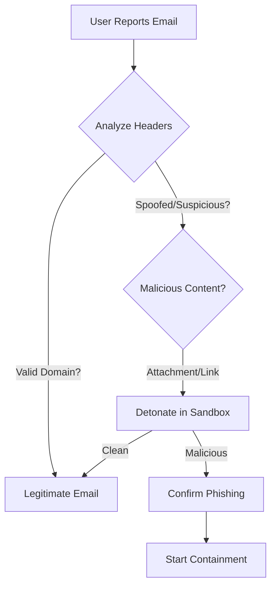

-   **Header Analysis**: Check `Return-Path`, `Received-SPF`, `DKIM-Signature`.
-   **Sender Reputation**: Search sender domain in VirusTotal/AbuseIPDB.
-   **URL/Attachment**: Submit to sandbox (Hybrid Analysis/Joe Sandbox). **DO NOT** open on local machine.

## 2. Containment
-   **Block Sender**: Add sender email/domain to Blocklist in Email Gateway (M365/Google Workspace).
-   **Purge Mail**: Use "Search and Purge" features to remove the email from all mailboxes.
-   **Block URL**: Add malicious URL to Web Proxy/Firewall Blocklist.

## 3. Remediation
-   **User Reset**: Force password reset for the recipient if they clicked a link or entered credentials.
-   **MFA**: Verify MFA is enabled and check for suspicious MFA prompts.

## 4. Recovery
-   Unblock user account after password reset and verification.


---

## File: 05_Incident_Response/Playbooks/Phishing.th.md

# Playbook: การรับมือ Phishing

**ความรุนแรง**: สูง (High) | **หมวดหมู่**: ความปลอดภัยอีเมล (Email Security)

## 1. การวิเคราะห์ (Analysis/Triage)

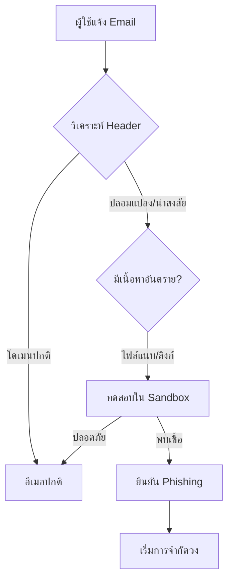

-   **ตรวจสอบ Header**: เช็ค `Return-Path`, `Received-SPF`, `DKIM-Signature`
-   **ชื่อเสียงผู้ส่ง**: นำโดเมนผู้ส่งไปเช็คใน VirusTotal/AbuseIPDB
-   **URL/ไฟล์แนบ**: ส่งไฟล์เข้า Sandbox (Hybrid Analysis/Joe Sandbox) **ห้าม** เปิดบนเครื่องตัวเองเด็ดขาด

## 2. การจำกัดความเสียหาย (Containment)
-   **บล็อกผู้ส่ง**: เพิ่มอีเมลหรือโดเมนผู้ส่งใน Blocklist ของ Email Gateway (M365/Google Workspace)
-   **ลบอีเมล**: ใช้ฟีเจอร์ "Search and Purge" เพื่อลบอีเมลดังกล่าวออกจากทุกกล่องจดหมายในองค์กร
-   **บล็อก URL**: เพิ่ม URL อันตรายลงใน Blocklist ของ Web Proxy/Firewall

## 3. การแก้ไข (Remediation)
-   **รีเซ็ตผู้ใช้งาน**: บังคับเปลียนรหัสผ่านทันทีหากผู้ใช้เผลอกดลิงก์หรือกรอกข้อมูล
-   **MFA**: ตรวจสอบว่า MFA เปิดอยู่ และเช็ค Log ว่ามีการกด Accept แปลกๆ หรือไม่

## 4. การกู้คืน (Recovery)
-   ปลลดบล็อกบัญชีผู้ใช้หลังจากเปลี่ยนรหัสผ่านและตรวจสอบความปลอดภัยแล้ว


---

## File: 05_Incident_Response/Playbooks/Privilege_Escalation.en.md

# Playbook: Privilege Escalation

**ID**: PB-07
**Severity**: High
**Trigger**: EDR Alert ("Mimikatz detected"), Security Log ("Member added to Domain Admins").

## 1. Analysis (Triage)
-   [ ] **Verify User**: Did an admin legitimately add this user? Check Change Management logs.
-   [ ] **Check Process**: What process made the change? (e.g., `net.exe`, PowerShell).

## 2. Containment
-   [ ] **Remove Privilege**: Immediately remove the user from the Admin group.
-   [ ] **Disable Account**: Disable the suspicious account.
-   [ ] **Isolate Host**: Isolate the machine where the command originated.

## 3. Eradication
-   [ ] **Review GPO**: Check Group Policy Objects for unauthorized modifications.
-   [ ] **Scan for Backdoors**: Look for other accounts created or scheduled tasks.

## 4. Recovery
-   [ ] **Restore Permissions**: Revert permissions to the baseline state.
-   [ ] **Full Audit**: Conduct a full audit of the Active Directory.


---

## File: 05_Incident_Response/Playbooks/Privilege_Escalation.th.md

# Playbook: การยกระดับสิทธิ์ (Privilege Escalation)

**ID**: PB-07
**ความรุนแรง**: สูง
**ตัวกระตุ้น**: แจ้งเตือน EDR ("พบ Mimikatz"), Security Log ("มีการเพิ่มสมาชิกใน Domain Admins")

## 1. การวิเคราะห์ (Analysis)
-   [ ] **ตรวจสอบผู้ใช้**: แอดมินเป็นคนทำรายการนี้จริงหรือไม่? เช็คบันทึก Change Management
-   [ ] **ตรวจสอบ Process**: โปรแกรมอะไรเป็นตัวสั่งการ? (เช่น `net.exe`, PowerShell)

## 2. การจำกัดวง (Containment)
-   [ ] **ถอนสิทธิ์**: ลบชื่อออกจากกลุ่ม Admin ทันที
-   [ ] **ปิดบัญชี**: Disable บัญชีที่น่าสงสัย
-   [ ] **แยกเครื่อง**: ตัดการเชื่อมต่อเครื่องต้นทางที่สั่งการ

## 3. การกำจัด (Eradication)
-   [ ] **ตรวจสอบ GPO**: เช็ค Group Policy ว่ามีการแก้ไขแอบแฝงหรือไม่
-   [ ] **หา Backdoor**: ค้นหาบัญชีอื่นๆ ที่ถูกสร้างใหม่ในช่วงเวลาเดียวกัน

## 4. การกู้คืน (Recovery)
-   [ ] **คืนค่าสิทธิ์**: ปรับสิทธิ์กลับสู่สถานะปกติ
-   [ ] **Audit**: ตรวจสอบ Active Directory ทั้งระบบอย่างละเอียด


---

## File: 05_Incident_Response/Playbooks/Ransomware.en.md

# Playbook: Ransomware Response

**Severity**: Critical | **Category**: Malware

## 1. Immediate Action (Containment)

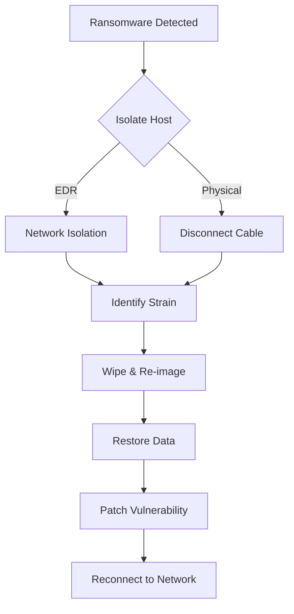

-   **Isolate Host**: Use EDR (SentinelOne/CrowdStrike) to "Network Isolate" the infected host immediately.
-   **Disconnect Network**: If EDR fails, physically disconnect the cable or disable Wi-Fi.
-   **Disable User**: Disable the compromised user account in Active Directory/Entra ID.

## 2. Identification (Scope)
-   **Identify Strain**: Use ID Ransomware or check extension/ransom note.
-   **Lateral Movement**: Check logs for SMB/RDP traffic from the infected host to others.
-   **Data Exfiltration**: Check Firewall logs for large outbound transfers.

## 3. Eradication & Recovery
-   **Wipe & Re-image**: Do not attempt to clean. Format the drive and reinstall the OS from a clean image.
-   **Restore Data**: Restore files from the last known good backup (Offline/Immutable backups preferred).
-   **Patch**: Ensure the vulnerability (e.g., RDP, Phishing) used for entry is patched before reconnecting.

## 4. Notification
-   Notify Legal/Compliance teams immediately due to potential data breach (GDPR/PDPA).


---

## File: 05_Incident_Response/Playbooks/Ransomware.th.md

# Playbook: การรับมือ Ransomware

**ความรุนแรง**: วิกฤต (Critical) | **หมวดหมู่**: มัลแวร์ (Malware)

## 1. การดำเนินการทันที (Containment)

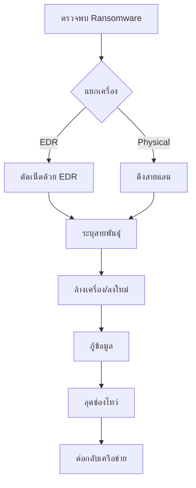

-   **แยกเครื่อง (Isolate Host)**: ใช้ EDR (SentinelOne/CrowdStrike) สั่ง "Network Isolate" เครื่องที่ติดเชื้อทันที
-   **ตัดการเชื่อมต่อ**: หาก EDR ไม่ทำงาน ให้ดึงสายแลนออกหรือปิด Wi-Fi
-   **ปิดบัญชีผู้ใช้**: Disable บัญชีผู้ใช้ที่เกี่ยวข้องใน Active Directory/Entra ID

## 2. การระบุขอบเขต (Identification)
-   **ระบุสายพันธุ์**: ใช้เว็บ ID Ransomware หรือตรวจสอบนามสกุลไฟล์/จดหมายเรียกค่าไถ่
-   **การเคลื่อนที่ (Lateral Movement)**: ตรวจสอบ Log การเชื่อมต่อ SMB/RDP จากเครื่องที่ติดเชื้อไปยังเครื่องอื่น
-   **การขโมยข้อมูล**: ตรวจสอบ Firewall log เพื่อหาการโอนถ่ายข้อมูลออกข้างนอกที่มีขนาดใหญ่ผิดปกติ

## 3. การกำจัดและกู้คืน (Eradication & Recovery)
-   **ล้างเครื่อง (Wipe & Re-image)**: อย่าพยายามกำจัดไวรัส ให้ Format และลง OS ใหม่จาก Image ที่สะอาด
-   **กู้ข้อมูล**: กู้คืนไฟล์จาก Backup ล่าสุดที่ยังไม่ติดเชื้อ (ควรใช้ Offline/Immutable backup)
-   **อุดช่องโหว่**: ตรวจสอบและปิดช่องโหว่ที่ใช้โจมตี (เช่น RDP, Phishing) ก่อนนำเครื่องกลับเข้าเครือข่าย

## 4. การแจ้งเตือน (Notification)
-   แจ้งฝ่ายกฎหมาย/Compliance ทันที เนื่องจากอาจมีข้อมูลรั่วไหล (PDPA/GDPR)


---

## File: 05_Incident_Response/Playbooks/Rogue_Admin.en.md

# Playbook: New Rogue Admin Account

**ID**: PB-15
**Severity**: Critical
**Trigger**: SIEM Alert ("User added to Domain Admins", "New Local Admin created").

## 1. Analysis (Triage)
-   **Verify Ticket**: Was there a Change Request for this new account?
-   **Verify Creator**: Who created it? Was the creator account compromised?

## 2. Containment
-   **Delete/Disable Account**: Immediately disable the new rogue account.
-   **Reset Creator**: Reset the password of the account that created the rogue user.

## 3. Eradication
-   **Audit Scope**: Search for *any other* accounts created by the attacker.
-   **Golden Ticket**: If Domain Admin was compromised, check for Golden Ticket attacks (Kerberos TGT).

## 4. Recovery
-   **Review Access**: Conduct a full review of all privileged groups.


---

## File: 05_Incident_Response/Playbooks/Rogue_Admin.th.md

# Playbook: บัญชีผู้ดูแลระบบปลอม (New Rogue Admin Account)

**ID**: PB-15
**ความรุนแรง**: วิกฤต
**ตัวกระตุ้น**: แจ้งเตือน SIEM ("มีการเพิ่ม User ในกลุ่ม Domain Admins", "สร้าง Local Admin ใหม่")

## 1. การวิเคราะห์ (Analysis)
-   **ตรวจสอบ Ticket**: มี Change Request สำหรับการสร้างบัญชีนี้หรือไม่?
-   **ผู้สร้าง**: ใครเป็นคนสร้าง? บัญชีคนสร้างถูกแฮกหรือไม่?

## 2. การจำกัดวง (Containment)
-   **ลบ/ปิดบัญชี**: Disable บัญชีผี (Rogue Account) ทันที
-   **Reset ผู้สร้าง**: รีเซ็ตรหัสผ่านของบัญชีที่ใช้สร้าง User นี้

## 3. การกำจัด (Eradication)
-   **ตรวจสอบขอบเขต**: ค้นหาบัญชี *อื่นๆ* ที่อาจถูกสร้างในช่วงเวลาเดียวกัน
-   **Golden Ticket**: หาก Domain Admin ถูกเจาะ ให้ตรวจสอบการโจมตีแบบ Golden Ticket (Kerberos TGT)

## 4. การกู้คืน (Recovery)
-   **รีวิวสิทธิ์**: ตรวจสอบสมาชิกในกลุ่ม Privileged ทั้งหมดใหม่


---

## File: 05_Incident_Response/Playbooks/Suspicious_Script.en.md

# Playbook: Suspicious Script Execution

**ID**: PB-11
**Severity**: High
**Trigger**: EDR Alert ("PowerShell - EncodedCommand", "WScript - Suspicious execution").

## 1. Analysis (Triage)
-   **Decode**: Decode the Base64 command (`-EncodedCommand`) to see what it does.
-   **Parent Process**: Who spawned this script? (`WinWord.exe` -> `powershell.exe` = Phishing).
-   **Permissions**: Was it run as System/Admin?

## 2. Containment
-   **Kill Process**: Terminate the script engine process.
-   **Isolate Host**: Network isolation to prevent download of second-stage payloads.

## 3. Eradication
-   **File Removal**: Delete the `.ps1`, `.vbs`, or `.js` file.
-   **Persistence Check**: Check Scheduled Tasks or Registry Run keys for re-execution.

## 4. Recovery
-   **AppLocker**: Consider enforcing stricter AppLocker policies to block unauthorized scripts.


---

## File: 05_Incident_Response/Playbooks/Suspicious_Script.th.md

# Playbook: การรันสคริปต์ที่น่าสงสัย (Suspicious Script Execution)

**ID**: PB-11
**ความรุนแรง**: สูง
**ตัวกระตุ้น**: แจ้งเตือน EDR ("PowerShell - EncodedCommand", "WScript - Suspicious execution")

## 1. การวิเคราะห์ (Analysis)
-   **ถอดรหัส (Decode)**: ถอดรหัส Base64 เพื่อดูว่าคำสั่งทำอะไร
-   **Parent Process**: ใครเป็นคนเรียกสคริปต์นี้? (`WinWord.exe` -> `powershell.exe` = Phishing)
-   **สิทธิ์ (Permissions)**: Run ด้วยสิทธิ์ System หรือ Admin หรือไม่?

## 2. การจำกัดวง (Containment)
-   **หยุด Process**: สั่ง Kill process ของ Script engine
-   **แยกเครื่อง**: ตัดการเชื่อมต่อเพื่อป้องกันการโหลด Payload ตัวที่สอง

## 3. การกำจัด (Eradication)
-   **ลบไฟล์**: ลบไฟล์ `.ps1`, `.vbs`, หรือ `.js` ต้นเหตุ
-   **ตรวจสอบ Persistence**: เช็ค Scheduled Tasks หรือ Registry ว่ามีการตั้งเวลาให้รันซ้ำหรือไม่

## 4. การกู้คืน (Recovery)
-   **AppLocker**: พิจารณาเปิดใช้ AppLocker เพื่อบล็อกการรันสคริปต์ที่ไม่ได้รับอนุญาต


---

## File: 05_Incident_Response/Playbooks/Web_Attack.en.md

# Playbook: Web Application Attack

**ID**: PB-10
**Severity**: High
**Trigger**: WAF Alert (SQLi, XSS, RCE), Web Server Error Logs (500s).

## 1. Analysis (Triage)
-   **Verify Payload**: Decode the payload (Base64/URL). Is it malicious syntax (`UNION SELECT`, `<script>`)?
-   **Check Success**: Did the server return 200 OK with sensitive data size? Or 500 Error?
-   **Scope**: Is it a scanner (Automation) or targeted manual attack?

## 2. Containment
-   **Block IP**: Ban the attacker's IP on WAF.
-   **Virtual Patching**: Apply WAF rule to block specific vulnerability signature (e.g., Log4j specific string).
-   **Offline**: If RCE is confirmed, take the application offline immediately.

## 3. Eradication
-   **Patch Code**: Developers must fix the vulnerability in the source code.
-   **Web Shell Sweep**: Scan the web directory for `cmd.php` or unusual files dropped by attacker.

## 4. Recovery
-   **Penetration Test**: Re-test the fix before going online.


---

## File: 05_Incident_Response/Playbooks/Web_Attack.th.md

# Playbook: การโจมตีเว็บแอปพลิเคชัน (Web Application Attack)

**ID**: PB-10
**ความรุนแรง**: สูง
**ตัวกระตุ้น**: แจ้งเตือน WAF (SQLi, XSS, RCE), Web Server Error Logs (500s)

## 1. การวิเคราะห์ (Analysis)
-   **ตรวจสอบ Payload**: ถอดรหัส (Base64/URL) ดูว่าเป็นคำสั่งอันตรายหรือไม่ (`UNION SELECT`, `<script>`)
-   **ตรวจสอบผลลัพธ์**: Server ตอบกลับ 200 OK พร้อมข้อมูลขนาดใหญ่หรือไม่?
-   **ขอบเขต**: เป็นเครื่องสแกนอัตโนมัติ หรือคนเจาะจงโจมตี?

## 2. การจำกัดวง (Containment)
-   **บล็อก IP**: แบน IP ของผู้โจมตีที่ WAF
-   **Virtual Patching**: สร้างกฎ WAF เฉพาะกิจเพื่อบล็อกช่องโหว่นั้น (เช่น บล็อก String ของ Log4j)
-   **ออฟไลน์**: หากมีการฝัง Web Shell หรือ RCE สำเร็จ ต้องปิดเว็บทันที

## 3. การกำจัด (Eradication)
-   **แก้โค้ด**: Developer ต้องปิดช่องโหว่ที่ต้นเหตุ (Source code)
-   **หา Web Shell**: สแกนโฟลเดอร์เว็บหาไฟล์แปลกปลอม (`cmd.php`)

## 4. การกู้คืน (Recovery)
-   **Penetration Test**: ทดสอบเจาะระบบซ้ำเพื่อยืนยันว่าช่องโหว่ถูกปิดแล้ว


---

## File: 04_Troubleshooting/Common_Issues.en.md

# Standard Troubleshooting Methodology

This document outlines a systematic approach to troubleshooting complex issues within the SOC infrastructure.

## 1. Defining the Problem
-   **Symptoms**: What is exactly failing? (e.g., "Alerts not showing", "Login failed").
-   **Scope**: Is it affecting one user, one sensor, or the whole platform?
-   **Timeline**: When did it start? Was there a recent change (Deployment/RFC)?

## 2. The Troubleshooting Workflow

### 2.1 Physical/Network Layer
-   **Connectivity**: Can you Ping/Telnet/Netcat to the target service?
-   **Firewall**: Are ports blocked? (Check Firewall/Security Group logs).
-   **DNS**: Is the hostname resolving correctly? (`nslookup`, `dig`).

### 2.2 Application/Service Layer
-   **Service Status**: Is the service process running? (`systemctl status`, `docker ps`).
-   **Resource Usage**: Check CPU/RAM/Disk usage (`top`, `df -h`). High load can cause timeouts.
-   **Logs**: **ALWAYS** check the logs.
    -   `/var/log/syslog`
    -   Application specific logs (STDERR/STDOUT).

### 2.3 Data Flow Verification
-   **Source**: Check if the agent is reading the file.
-   **Transport**: Check status on Log Forwarder/Broker (Kafka/RabbitMQ).
-   **Destination**: Check indexing errors in SIEM.

## 3. Common Failure Scenarios

### 3.1 Log Source Stopped Reporting
1.  Check Network/VPN status between Source and SOC.
2.  Verify Agent service status on the source.
3.  Check for disk space exhaustion on the source (Agent stops if disk full).

### 3.2 False Positives Spikes
1.  Identify the specific rule triggering.
2.  Analyze the pattern triggering the alert.
3.  Adjust the rule logic or add a suppression (whitelist) entry.

## 4. Documentation
-   Document the Root Cause Analysis (RCA).
-   Update Knowledge Base (KB) and SOPs to prevent recurrence.


---

## File: 04_Troubleshooting/Common_Issues.th.md

# วิธีการแก้ปัญหามาตรฐาน (Standard Troubleshooting Methodology)

เอกสารนี้ระบุแนวทางที่เป็นระบบในการแก้ปัญหาระบบโครงสร้างพื้นฐาน SOC

## 1. นิยามปัญหา (Defining the Problem)
-   **อาการ**: อะไรล้มเหลว? (เช่น "Alert ไม่ขึ้น", "Login ไม่ได้")
-   **ขอบเขต**: กระทบผู้ใช้คนเดียว, Sensor ตัวเดียว, หรือทั้งระบบ?
-   **เวลา**: เริ่มเป็นเมื่อไหร่? มีการเปลี่ยนแปลงระบบเร็วๆ นี้หรือไม่ (Deployment/RFC)?

## 2. ขั้นตอนการแก้ปัญหา (The Troubleshooting Workflow)

### 2.1 ระดับเครือข่าย (Physical/Network Layer)
-   **การเชื่อมต่อ**: Ping/Telnet/Netcat หาปลายทางเจอหรือไม่?
-   **Firewall**: พอร์ตถูกบล็อกหรือไม่? (เช็ค Log Firewall)
-   **DNS**: ชื่อ Hostname แปลงเป็น IP ถูกต้องหรือไม่? (`nslookup`, `dig`)

### 2.2 ระดับแอปพลิเคชัน (Application/Service Layer)
-   **สถานะบริการ**: Process ทำงานอยู่หรือไม่? (`systemctl status`, `docker ps`)
-   **ทรัพยากร**: เช็ค CPU/RAM/Disk (`top`, `df -h`) โหลดสูงอาจทำให้ Timeout
-   **Logs**: **ต้อง** ตรวจสอบ Log เสมอ
    -   `/var/log/syslog`
    -   Application specific logs

### 2.3 ตรวจสอบการไหลของข้อมูล (Data Flow Verification)
-   **ต้นทาง**: Agent อ่านไฟล์เจอหรือไม่?
-   **ระหว่างทาง**: สถานะบน Log Forwarder/Broker (Kafka/RabbitMQ) เป็นอย่างไร?
-   **ปลายทาง**: มี Error ในการ Index เข้า SIEM หรือไม่?

## 3. สถานการณ์ที่พบบ่อย (Common Failure Scenarios)

### 3.1 Log Source หยุดส่งข้อมูล
1.  เช็ค Network/VPN ระหว่างต้นทางและ SOC
2.  เช็คสถานะ Agent service บนเครื่องต้นทาง
3.  เช็คพื้นที่ว่าง Disk บนเครื่องต้นทาง (Agent มักหยุดทำงานถ้า Disk เต็ม)

### 3.2 แจ้งเตือนผิดพลาดพุ่งสูง (False Positives Spikes)
1.  ระบุกฎที่เป็นปัญหา
2.  วิเคราะห์ Pattern ที่ทำให้เกิด Alert
3.  ปรับ Logic ของกฎ หรือเพิ่ม Whitelist

## 4. การทำเอกสาร (Documentation)
-   บันทึกการวิเคราะห์สาเหตุที่แท้จริง (RCA)
-   อัปเดต Knowledge Base (KB) และ SOP เพื่อป้องกันการเกิดซ้ำ


---

## File: templates/change_request_rfc.en.md

# Request for Change (RFC)

**RFC ID**: #RFC-YYYYMMDD-XX
**Requester**: [Name]
**Date**: YYYY-MM-DD
**Change Type**: [Standard/Normal/Emergency]

## 1. Description of Change
*What exactly is being changed? (e.g., Deploying new detection rule 'Detect Mimikatz').*

## 2. Justification
*Why is this change necessary? What risk does it mitigate?*

## 3. Impact Analysis
-   **Affected Components**: [SIEM/EDR/Network]
-   **Risk of Failure**: [Low/Medium/High]
-   **Downtime Required**: [Yes/No]

## 4. Rollback Plan
*Step-by-step instructions to revert the change if it fails.*
1.
2.

## 5. Approval (CAB)
-   [ ] Approved by: [Name]
-   [ ] Date: [Date]


---

## File: templates/change_request_rfc.th.md

# แบบฟอร์มร้องขอการเปลี่ยนแปลง (Request for Change - RFC)

**รหัส RFC**: #RFC-YYYYMMDD-XX
**ผู้ร้องขอ**: [ชื่อ]
**วันที่**: YYYY-MM-DD
**ประเภท**: [Standard/Normal/Emergency]

## 1. รายละเอียดการเปลี่ยนแปลง (Description)
*จะเปลี่ยนแปลงอะไร? (เช่น ติดตั้งกฎตรวจจับใหม่ 'Detect Mimikatz')*

## 2. เหตุผลความจำเป็น (Justification)
*ทำไมต้องทำ? ช่วยลดความเสี่ยงเรื่องอะไร?*

## 3. วิเคราะห์ผลกระทบ (Impact Analysis)
-   **ระบบที่เกี่ยวข้อง**: [SIEM/EDR/Network]
-   **ความเสี่ยงที่จะล้มเหลว**: [ต่ำ/กลาง/สูง]
-   **ต้องหยุดระบบ (Downtime)**: [ใช่/ไม่ใช่]

## 4. แผนการถอยกลับ (Rollback Plan)
*ขั้นตอนทีละข้อในการย้อนคืนระบบหากเกิดความผิดพลาด*
1.
2.

## 5. การอนุมัติ (Approval - CAB)
-   [ ] อนุมัติโดย: [ชื่อ]
-   [ ] วันที่: [วันที่]


---

## File: templates/incident_report.en.md

# Incident Report Template

**Incident ID**: #YYYYMMDD-00X
**Date**: YYYY-MM-DD
**Analyst**: [Name]
**Severity**: [Low/Medium/High/Critical]
**TLP**: [RED/AMBER/GREEN/CLEAR]
**Status**: [Open/Closed]

## 1. Executive Summary
*Briefly describe what happened, the impact, and the resolution.*

## 2. Timeline (UTC)
-   **Detection**: [Time] - Alert triggered for [Rule Name].
-   **Analysis**: [Time] - Analyst verified malicious activity.
-   **Containment**: [Time] - Host isolated / User disabled.
-   **Eradication**: [Time] - Malicious files removed.
-   **Recovery**: [Time] - System returned to production.

## 3. Impact Assessment
-   **Affected Assets**: [List of Hostnames/Users]
-   **Data Loss**: [Yes/No - Details]
-   **Business Impact**: [Downtime duration, reputational risk]

## 4. Root Cause Analysis (VERIS "4A" Framework)
-   **Actor**: [External / Internal / Partner]
-   **Action**: [Malware / Hacking / Social / Error / Misuse]
-   **Asset**: [Server / User Dev / Person / Data]
-   **Attribute**: [Confidentiality / Integrity / Availability]
-   **Vulnerability**: [CVE-XXXX-XXXX if applicable]

## 5. Remediation & Lessons Learned
-   [ ] Action 1: Patch vulnerability X.
-   [ ] Action 2: Update detection rule Y to prevent recurrence.


---

## File: templates/incident_report.th.md

# แบบฟอร์มรายงานเหตุการณ์ (Incident Report Template)

**รหัสเหตุการณ์**: #YYYYMMDD-00X
**วันที่**: YYYY-MM-DD
**ผู้รับผิดชอบ**: [ชื่อ]
**ความรุนแรง**: [Low/Medium/High/Critical]
**TLP**: [RED/AMBER/GREEN/CLEAR]
**สถานะ**: [Open/Closed]

## 1. บทสรุปผู้บริหาร (Executive Summary)
*อธิบายสั้นๆ ว่าเกิดอะไรขึ้น ผลกระทบคืออะไร และแก้ไขอย่างไร*

## 2. ไทม์ไลน์ (Time - UTC)
-   **ตรวจพบ (Detection)**: [เวลา] - แจ้งเตือนจากกฎ [ชื่อกฎ]
-   **วิเคราะห์ (Analysis)**: [เวลา] - Analyst ยืนยันว่าเป็นภัยคุกคามจริง
-   **จำกัดวง (Containment)**: [เวลา] - ตัดการเชื่อมต่อเครื่อง / ปิดบัญชีผู้ใช้
-   **กำจัด (Eradication)**: [เวลา] - ลบไฟล์อันตราย
-   **กู้คืน (Recovery)**: [เวลา] - นำระบบกลับสู่สถานะปกติ

## 3. การประเมินผลกระทบ (Impact Assessment)
-   **สินทรัพย์ที่ได้รับผลกระทบ**: [รายชื่อเครื่อง/User]
-   **ข้อมูลสูญหาย**: [มี/ไม่มี - รายละเอียด]
-   **ผลกระทบทางธุรกิจ**: [ระยะเวลาที่ระบบล่ม, ความน่าเชื่อถือ]

## 4. การวิเคราะห์สาเหตุ (VERIS "4A" Framework)
-   **ผู้กระทำ (Actor)**: [External / Internal / Partner]
-   **การกระทำ (Action)**: [Malware / Hacking / Social / Error / Misuse]
-   **สินทรัพย์ (Asset)**: [Server / User Dev / Person / Data]
-   **ผลกระทบ (Attribute)**: [Confidentiality / Integrity / Availability]
-   **ช่องโหว่ (Vulnerability)**: [CVE-XXXX-XXXX ถ้ามี]

## 5. การแก้ไขและบทเรียน (Remediation & Lessons Learned)
-   [ ] การดำเนินการ 1: Patch ช่องโหว่ X
-   [ ] การดำเนินการ 2: อัปเดตกฎตรวจจับ Y เพื่อป้องกันการเกิดซ้ำ


---

## File: templates/shift_handover.en.md

# Shift Handover Log

**Date**: YYYY-MM-DD
**Shift**: [Morning/Afternoon/Night]
**Outgoing Lead**: [Name]
**Incoming Lead**: [Name]

## 1. Shift Summary
*Overall status of the shift (Quiet/Busy/Critical).*

## 2. Active Incidents (Requiring Attention)
| ID | Severity | Description | Current Status | Owner |
| :--- | :--- | :--- | :--- | :--- |
| #123 | High | Phishing Campaign | Containment | [Name] |

## 3. System Health
-   [ ] SIEM Ingestion (Normal)
-   [ ] EDR Connectivity (Normal)
-   [ ] Feed Updates (Normal)
-   *Issues*: [Describe any connectivity or license issues]

## 4. Pending Tasks / Follow-ups
-   [ ] Task 1: Check status of Ticket #456.
-   [ ] Task 2: Review new rule deployment in Staging.


---

## File: templates/shift_handover.th.md

# แบบฟอร์มส่งต่องานกะ (Shift Handover Log)

**วันที่**: YYYY-MM-DD
**กะ**: [เช้า/บ่าย/ดึก]
**หัวหน้ากะส่ง**: [ชื่อ]
**หัวหน้ากะรับ**: [ชื่อ]

## 1. สรุปภาพรวม (Shift Summary)
*สถานการณ์โดยรวมของกะ (เงียบสงบ/ยุ่ง/วิกฤต)*

## 2. เหตุการณ์ที่ยังไม่จบ (Active Incidents)
| ID | ความรุนแรง | รายละเอียด | สถานะปัจจุบัน | ผู้ดูแล |
| :--- | :--- | :--- | :--- | :--- |
| #123 | High | Phishing Campaign | Containment | [ชื่อ] |

## 3. สุขภาพระบบ (System Health)
-   [ ] SIEM Ingestion (ปกติ)
-   [ ] EDR Connectivity (ปกติ)
-   [ ] Feed Updates (ปกติ)
-   *ปัญหาที่พบ*: [ระบุปัญหาการเชื่อมต่อหรือ License]

## 4. งานค้าง / สิ่งที่ต้องติดตาม (Pending Tasks)
-   [ ] งานที่ 1: ตรวจสอบสถานะ Ticket #456
-   [ ] งานที่ 2: รีวิวกฎใหม่ใน Staging


---

## File: 09_Training_Onboarding/Analyst_Onboarding_Path.en.md

# SOC Analyst Onboarding Curriculum (4-Week Path)

Welcome to the Security Operations Center (SOC). This 4-week program is designed to take you from "Day 1" to "Production Ready".


## Week 1: Foundations (Infrastructure & Governance)
**Goal**: Understand *where* we work and *what* we protect.

-   **Day 1: Orientation & Access**
    -   Read: [System Activation](../01_Onboarding/System_Activation.en.md) - Understand our generic stack (SIEM, EDR, SOAR).
    -   Task: Verify access to all dashboards.
-   **Day 2: Data & Privacy**
    -   Read: [Data Governance](../02_Platform_Operations/Database_Management.en.md) - Learn data classification (Restricted vs Public).
    -   Task: Locate where "Critical" data is stored in our SIEM.
-   **Day 3: Change Management**
    -   Read: [Deployment Procedures](../02_Platform_Operations/Deployment_Procedures.en.md) - Learn how we deploy changes (RFC/CAB).
    -   Read: [Template - Change Request](../templates/change_request_rfc.en.md).

## Week 2: Incident Response (The "How-To")
**Goal**: Learn how to handle alerts using Standard Playbooks.

-   **Day 1: The Framework**
    -   Read: [Incident Response Framework](../05_Incident_Response/Framework.en.md) - The NIST lifecycle.
    -   Read: [Template - Incident Report](../templates/incident_report.en.md).
-   **Day 2: Core Playbooks (Identity)**
    -   Read: [PB-01 Phishing](../05_Incident_Response/Playbooks/Phishing.en.md).
    -   Read: [PB-04 Brute Force](../05_Incident_Response/Playbooks/Brute_Force.en.md).
-   **Day 3: Core Playbooks (Endpoint)**
    -   Read: [PB-02 Ransomware](../05_Incident_Response/Playbooks/Ransomware.en.md).
    -   Read: [PB-03 Malware](../05_Incident_Response/Playbooks/Malware_Infection.en.md).

## Week 3: Detection Engineering (The "Why")
**Goal**: Understand why an alert triggered and how to tune it.

-   **Day 1: The Lifecycle**
    -   Read: [Content Management](../03_User_Guides/Content_Management.en.md) - How we create rules.
-   **Day 2: Sigma Rules**
    -   Explore: `07_Detection_Rules/` - Review the YAML files.
    -   Task: Compare `proc_office_spawn_powershell.yml` with **PB-01**.

## Week 4: Simulation & Validation (Purple Team)
**Goal**: Prove your skills by defending against a simulated attack.

-   **Day 1: Testing Tools**
    -   Read: [Simulation Guide](../08_Simulation_Testing/Simulation_Guide.md).
    -   Read: [Atomic Test Map](../08_Simulation_Testing/Atomic_Test_Map.md).
-   **Day 2: Final Exam (Drill)**
    -   Task: Run `Invoke-AtomicTest T1059.001` (Phishing Simulation) in the Test Lab.
    -   Task: Triage the alert in SIEM.
    -   Task: Submit a mock [Incident Report](../templates/incident_report.en.md).


---

## File: 09_Training_Onboarding/Analyst_Onboarding_Path.th.md

# หลักสูตรการฝึกอบรมเจ้าหน้าที่ SOC (หลักสูตร 4 สัปดาห์)

ยินดีต้อนรับสู่ศูนย์ปฏิบัติการความปลอดภัย (SOC) โปรแกรมนี้ออกแบบมาเพื่อให้คุณพร้อมปฏิบัติงานจริงภายใน 4 สัปดาห์

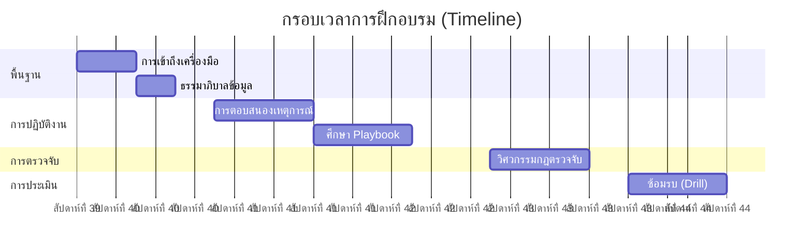

## สัปดาห์ที่ 1: พื้นฐาน (Infrastructure & Governance)
**เป้าหมาย**: เข้าใจว่าเราทำงาน *ที่ไหน* และปกป้อง *อะไร*

-   **วันที่ 1: การปฐมนิเทศและการเข้าถึงระบบ**
    -   อ่าน: [System Activation](../01_Onboarding/System_Activation.th.md) - ทำความเข้าใจ Stack ของเรา (SIEM, EDR, SOAR)
    -   งาน: ตรวจสอบสิทธิ์การเข้าถึง Dashboard ทั้งหมด
-   **วันที่ 2: ข้อมูลและความเป็นส่วนตัว**
    -   อ่าน: [Data Governance](../02_Platform_Operations/Database_Management.th.md) - เรียนรู้ประเภทข้อมูล (Restricted vs Public)
    -   งาน: ระบุตำแหน่งที่เก็บข้อมูล "Critical" ใน SIEM
-   **วันที่ 3: การจัดการการเปลี่ยนแปลง**
    -   อ่าน: [Deployment Procedures](../02_Platform_Operations/Deployment_Procedures.th.md) - เรียนรู้วิธีการ Deploy (RFC/CAB)
    -   อ่าน: [แบบฟอร์ม - Change Request](../templates/change_request_rfc.th.md)

## สัปดาห์ที่ 2: การรับมือภัยคุกคาม (Incident Response)
**เป้าหมาย**: เรียนรู้วิธีจัดการกับ Alert โดยใช้ Playbook มาตรฐาน

-   **วันที่ 1: กรอบการทำงาน**
    -   อ่าน: [Incident Response Framework](../05_Incident_Response/Framework.th.md) - วงจรชีวิตตาม NIST
    -   อ่าน: [แบบฟอร์ม - Incident Report](../templates/incident_report.th.md)
-   **วันที่ 2: Playbook หลัก (Identity)**
    -   อ่าน: [PB-01 Phishing](../05_Incident_Response/Playbooks/Phishing.th.md)
    -   อ่าน: [PB-04 Brute Force](../05_Incident_Response/Playbooks/Brute_Force.th.md)
-   **วันที่ 3: Playbook หลัก (Endpoint)**
    -   อ่าน: [PB-02 Ransomware](../05_Incident_Response/Playbooks/Ransomware.th.md)
    -   อ่าน: [PB-03 Malware](../05_Incident_Response/Playbooks/Malware_Infection.th.md)

## สัปดาห์ที่ 3: วิศวกรรมการตรวจจับ (Detection Engineering)
**เป้าหมาย**: เข้าใจว่า Alert ทำงานอย่างไรและปรับจูนอย่างไร

-   **วันที่ 1: วงจรชีวิต**
    -   อ่าน: [Content Management](../03_User_Guides/Content_Management.th.md) - วิธีสร้างกฎ
-   **วันที่ 2: Sigma Rules**
    -   สำรวจ: `07_Detection_Rules/` - ดูไฟล์ YAML
    -   งาน: เปรียบเทียบ `proc_office_spawn_powershell.yml` กับ **PB-01**

## สัปดาห์ที่ 4: การจำลองและตรวจสอบ (Purple Team)
**เป้าหมาย**: พิสูจน์ทักษะของคุณโดยการป้องกันการโจมตีจำลอง

-   **วันที่ 1: เครื่องมือทดสอบ**
    -   อ่าน: [Simulation Guide](../08_Simulation_Testing/Simulation_Guide.md)
    -   อ่าน: [Atomic Test Map](../08_Simulation_Testing/Atomic_Test_Map.md)
-   **วันที่ 2: การสอบปฏิบัติ (Drill)**
    -   งาน: รัน `Invoke-AtomicTest T1059.001` (Phishing Simulation) ในห้อง Lab
    -   งาน: Triage Alert ใน SIEM
    -   งาน: ส่ง [Incident Report](../templates/incident_report.th.md) จำลอง


---

## File: 09_Training_Onboarding/Training_Checklist.en.md

# Analyst Training Checklist

**Analyst Name**: ____________________
**Start Date**: YYYY-MM-DD
**Mentor**: ____________________

## Week 1: Foundations
- [ ] Account Access (SIEM, EDR, SOAR)
- [ ] Read: System Activation
- [ ] Read: Data Governance Policy
- [ ] Read: Change Management (RFC) Process
- [ ] **Checkpoint**: Successfully navigated SIEM Dashboard. (Signature: ________)

## Week 2: Incident Response
- [ ] Read: IR Framework (NIST)
- [ ] Read: Top 5 Playbooks (Phishing, Malware, etc.)
- [ ] Review: Incident Report Template
- [ ] **Checkpoint**: Explain the "Containment" step for Ransomware to Mentor. (Signature: ________)

## Week 3: Detection Engineering
- [ ] Read: Content Management Lifecycle
- [ ] Review: Sigma Rules Library
- [ ] **Checkpoint**: Explain logic of `proc_office_spawn_powershell.yml`. (Signature: ________)

## Week 4: Validation (Final)
- [ ] Read: Simulation Guide
- [ ] Execute: Atomic Red Team Test (T1059.001)
- [ ] Submit: Mock Incident Report
- [ ] **Final Sign-off**: Ready for Production Rotation. (Manager: ________)


---

## File: 09_Training_Onboarding/Training_Checklist.th.md

# แบบฟอร์มตรวจสอบการฝึกอบรม (Training Checklist)

**ชื่อ Analyst**: ____________________
**วันที่เริ่มงาน**: YYYY-MM-DD
**พี่เลี้ยง (Mentor)**: ____________________

## สัปดาห์ที่ 1: พื้นฐาน (Foundations)
- [ ] การเข้าถึงระบบ (SIEM, EDR, SOAR)
- [ ] อ่าน: System Activation
- [ ] อ่าน: นโยบาย Data Governance
- [ ] อ่าน: กระบวนการ Change Management (RFC)
- [ ] **จุดตรวจสอบ**: สามารถใช้งานหน้า Dashboard ของ SIEM ได้คล่องแคล่ว (ลายเซ็น: ________)

## สัปดาห์ที่ 2: การรับมือภัยคุกคาม (Incident Response)
- [ ] อ่าน: IR Framework (NIST)
- [ ] อ่าน: 5 Playbook หลัก (Phishing, Malware, etc.)
- [ ] รีวิว: แบบฟอร์ม Incident Report
- [ ] **จุดตรวจสอบ**: อธิบายขั้นตอน "จำกัดวง (Containment)" ของ Ransomware ให้พี่เลี้ยงฟังได้ (ลายเซ็น: ________)

## สัปดาห์ที่ 3: วิศวกรรมการตรวจจับ (Detection Engineering)
- [ ] อ่าน: วงจรชีวิต Content Management
- [ ] รีวิว: คลัง Sigma Rules
- [ ] **จุดตรวจสอบ**: อธิบายตรรกะของ `proc_office_spawn_powershell.yml` ได้ (ลายเซ็น: ________)

## สัปดาห์ที่ 4: การตรวจสอบและประเมินผล (Validation)
- [ ] อ่าน: คู่มือการจำลองการโจมตี (Simulation Guide)
- [ ] ปฏิบัติ: รัน Atomic Red Team Test (T1059.001)
- [ ] ส่งงาน: รายงาน Incident จำลอง
- [ ] **การอนุมัติผ่านโปร**: พร้อมเข้ากะปฏิบัติงานจริง (ผู้จัดการ: ________)


---

## File: 08_Simulation_Testing/Atomic_Test_Map.md

# Atomic Red Team Mapping (Validation)

This document maps our **Standard SOC Playbooks** to specific **Atomic Red Team** tests (MITRE ATT&CK). use these tests to validate your detection rules and response procedures.

| Playbook ID | Playbook Name | MITRE ID | Atomic Test (Attack Simulation) |
| :--- | :--- | :--- | :--- |
| **PB-01** | Phishing | T1059.001 | `Powershell - Spearphishing Attachment` |
| **PB-02** | Ransomware | T1486 | `Data Encrypted for Impact` (Mock Encryption) |
| **PB-03** | Malware Infection | T1204.002 | `Malicious File Execution` |
| **PB-04** | Brute Force | T1110.001 | `Password Guessing` |
| **PB-05** | Account Compromise | T1078 | `Valid Accounts: Local Accounts` |
| **PB-06** | Impossible Travel | T1078.004 | `Cloud Accounts` (Simulate login via VPN) |
| **PB-07** | Privilege Escalation | T1098 | `Account Manipulation: Add to Admin Group` |
| **PB-08** | Data Exfiltration | T1048 | `Exfiltration Over Alternative Protocol` |
| **PB-09** | DDoS Attack | T1498 | `Network Denial of Service` (Simulate High Load) |
| **PB-10** | Web App Attack | T1190 | `Exploit Public-Facing Application` (Simulate SQLi) |
| **PB-11** | Suspicious Script | T1059.001 | `PowerShell: Encoded Command` |
| **PB-12** | Lateral Movement | T1021.002 | `SMB/Windows Admin Shares` |
| **PB-13** | C2 Communication | T1071.001 | `Web Protocols` (Curl to known bad domain) |
| **PB-14** | Insider Threat | T1052.001 | `Exfiltration over Physical Medium` (USB Copy) |
| **PB-15** | Rogue Admin | T1136.001 | `Create Account: Local Account` |
| **PB-16** | Cloud IAM Anomaly | T1078 | `Valid Accounts: Cloud Accounts` |
| **PB-17** | BEC | T1114.003 | `Email Collection: Email Forwarding Rule` |
| **PB-18** | Exploit | T1210 | `Exploitation of Remote Services` |
| **PB-19** | Lost Device | T1098 | `Account Manipulation` (Simulate Access after Revocation) |
| **PB-20** | Log Clearing | T1070.001 | `Indicator Removal: Clear Windows Event Logs` |

## How to use
1.  Install [Atomic Red Team](https://github.com/redcanaryco/atomic-red-team) on a **TEST MACHINE**.
2.  Run the test: `Invoke-AtomicTest T1059.001`
3.  Check your SIEM: Did the alert trigger?
4.  Follow the Playbook: Did the steps work?


---

## File: 08_Simulation_Testing/Simulation_Guide.md

# Simulation & Purple Teaming Guide

This guide explains how to conduct a **Purple Team Exercise** (Red Team Attacks + Blue Team Defends) to validate the SOC's readiness using the provided Playbooks and Detection Rules.

## Prerequisites
1.  **Test Environment**: A dedicated VM or Lab (Do NOT run in Production).
2.  **Tools**:
    -   **Atomic Red Team**: For executing attacks.
    -   **Caldera** (Optional): For automated campaigns.
    -   **SIEM**: To view alerts.

## Execution Workflow (The Feedback Loop)

### Step 1: Execute (Red)
Run the Atomic Test corresponding to the Playbook you want to test.
*Example (Phishing)*:
```powershell
Invoke-AtomicTest T1059.001
```

### Step 2: Detect (Blue)
Check the SIEM Dashboard.
-   **Did the alert trigger?** (Check `proc_office_spawn_powershell.yml` logic).
-   **Was the severity correct?**
-   **Was all context captured?** (User, Host, Command Line).

### Step 3: Respond (Blue)
Open the Playbook (**PB-01 Phishing**).
-   Follow the steps: Analyze -> Contain -> Eradicate.
-   **Gap Analysis**: Did the playbook miss any steps? Was the containment tool (EDR) effective?

### Step 4: Improve (Purple)
-   **Tune Rule**: If alert didn't fire, adjust the Sigma rule.
-   **Update Playbook**: Add missing steps found during the drill.

## Schedule
Recommended Validation Schedule:
-   **Weekly**: Test 1 high-priority Playbook (Ransomware, Phishing).
-   **Monthly**: Test 3-5 random Playbooks.
-   **Quarterly**: Full Chain simulation (Phishing -> Lateral Mov -> Exfil).
